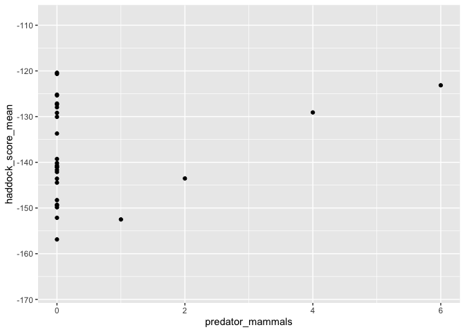
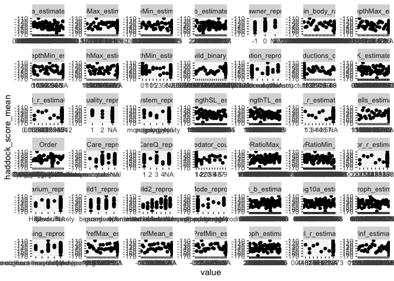
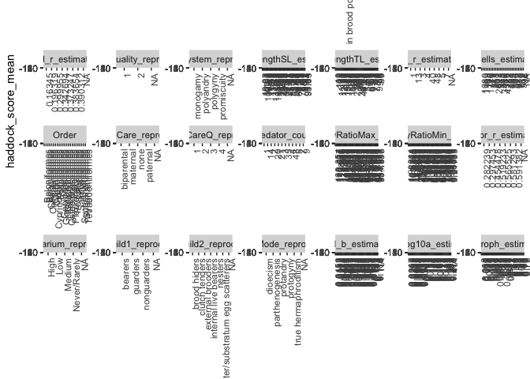

fishbase
================
Ilya Fischhoff
7/1/2020

\#\#\#\#\#install packages

    ## 
    ## Attaching package: 'seqinr'

    ## The following object is masked from 'package:plyr':
    ## 
    ##     count

    ## Loading required package: BiocGenerics

    ## Loading required package: parallel

    ## 
    ## Attaching package: 'BiocGenerics'

    ## The following objects are masked from 'package:parallel':
    ## 
    ##     clusterApply, clusterApplyLB, clusterCall, clusterEvalQ,
    ##     clusterExport, clusterMap, parApply, parCapply, parLapply,
    ##     parLapplyLB, parRapply, parSapply, parSapplyLB

    ## The following objects are masked from 'package:stats':
    ## 
    ##     IQR, mad, sd, var, xtabs

    ## The following objects are masked from 'package:base':
    ## 
    ##     anyDuplicated, append, as.data.frame, basename, cbind, colnames,
    ##     dirname, do.call, duplicated, eval, evalq, Filter, Find, get, grep,
    ##     grepl, intersect, is.unsorted, lapply, Map, mapply, match, mget,
    ##     order, paste, pmax, pmax.int, pmin, pmin.int, Position, rank,
    ##     rbind, Reduce, rownames, sapply, setdiff, sort, table, tapply,
    ##     union, unique, unsplit, which, which.max, which.min

    ## Loading required package: S4Vectors

    ## Loading required package: stats4

    ## 
    ## Attaching package: 'S4Vectors'

    ## The following object is masked from 'package:plyr':
    ## 
    ##     rename

    ## The following object is masked from 'package:base':
    ## 
    ##     expand.grid

    ## Loading required package: IRanges

    ## 
    ## Attaching package: 'IRanges'

    ## The following object is masked from 'package:plyr':
    ## 
    ##     desc

    ## Loading required package: XVector

    ## 
    ## Attaching package: 'XVector'

    ## The following object is masked from 'package:plyr':
    ## 
    ##     compact

    ## 
    ## Attaching package: 'Biostrings'

    ## The following object is masked from 'package:seqinr':
    ## 
    ##     translate

    ## The following object is masked from 'package:base':
    ## 
    ##     strsplit

    ## Loading required package: ape

    ## 
    ## Attaching package: 'ape'

    ## The following object is masked from 'package:Biostrings':
    ## 
    ##     complement

    ## The following objects are masked from 'package:seqinr':
    ## 
    ##     as.alignment, consensus

    ## 
    ## Attaching package: 'phylotools'

    ## The following object is masked from 'package:seqinr':
    ## 
    ##     read.fasta

    ## 
    ## Attaching package: 'data.table'

    ## The following object is masked from 'package:IRanges':
    ## 
    ##     shift

    ## The following objects are masked from 'package:S4Vectors':
    ## 
    ##     first, second

    ## 
    ## Attaching package: 'rfishbase'

    ## The following object is masked from 'package:BiocGenerics':
    ## 
    ##     species

    ## Loading required package: lattice

    ## Loading required package: survival

    ## Loading required package: Formula

    ## 
    ## Attaching package: 'Hmisc'

    ## The following object is masked from 'package:ape':
    ## 
    ##     zoom

    ## The following objects are masked from 'package:Biostrings':
    ## 
    ##     mask, translate

    ## The following object is masked from 'package:seqinr':
    ## 
    ##     translate

    ## The following objects are masked from 'package:plyr':
    ## 
    ##     is.discrete, summarize

    ## The following objects are masked from 'package:base':
    ## 
    ##     format.pval, units

    ## 
    ## Attaching package: 'caret'

    ## The following object is masked from 'package:survival':
    ## 
    ##     cluster

    ## The following object is masked from 'package:seqinr':
    ## 
    ##     dotPlot

    ## 
    ## Attaching package: 'tidyr'

    ## The following object is masked from 'package:S4Vectors':
    ## 
    ##     expand

    ## Loaded gbm 2.1.5

    ## 
    ## Attaching package: 'Matrix'

    ## The following objects are masked from 'package:tidyr':
    ## 
    ##     expand, pack, unpack

    ## The following object is masked from 'package:S4Vectors':
    ## 
    ##     expand

    ## 
    ## Attaching package: 'caTools'

    ## The following object is masked from 'package:IRanges':
    ## 
    ##     runmean

    ## The following object is masked from 'package:S4Vectors':
    ## 
    ##     runmean

    ## 
    ## Attaching package: 'dplyr'

    ## The following objects are masked from 'package:Hmisc':
    ## 
    ##     src, summarize

    ## The following objects are masked from 'package:data.table':
    ## 
    ##     between, first, last

    ## The following objects are masked from 'package:Biostrings':
    ## 
    ##     collapse, intersect, setdiff, setequal, union

    ## The following object is masked from 'package:XVector':
    ## 
    ##     slice

    ## The following objects are masked from 'package:IRanges':
    ## 
    ##     collapse, desc, intersect, setdiff, slice, union

    ## The following objects are masked from 'package:S4Vectors':
    ## 
    ##     first, intersect, rename, setdiff, setequal, union

    ## The following objects are masked from 'package:BiocGenerics':
    ## 
    ##     combine, intersect, setdiff, union

    ## The following object is masked from 'package:seqinr':
    ## 
    ##     count

    ## The following objects are masked from 'package:plyr':
    ## 
    ##     arrange, count, desc, failwith, id, mutate, rename, summarise,
    ##     summarize

    ## The following objects are masked from 'package:stats':
    ## 
    ##     filter, lag

    ## The following objects are masked from 'package:base':
    ## 
    ##     intersect, setdiff, setequal, union

    ## Loading required package: raster

    ## Loading required package: sp

    ## 
    ## Attaching package: 'sp'

    ## The following object is masked from 'package:IRanges':
    ## 
    ##     %over%

    ## 
    ## Attaching package: 'raster'

    ## The following object is masked from 'package:dplyr':
    ## 
    ##     select

    ## The following object is masked from 'package:tidyr':
    ## 
    ##     extract

    ## The following objects are masked from 'package:Hmisc':
    ## 
    ##     mask, zoom

    ## The following object is masked from 'package:data.table':
    ## 
    ##     shift

    ## The following objects are masked from 'package:ape':
    ## 
    ##     rotate, zoom

    ## The following object is masked from 'package:Biostrings':
    ## 
    ##     mask

    ## The following objects are masked from 'package:IRanges':
    ## 
    ##     distance, shift, trim, values, values<-

    ## The following objects are masked from 'package:S4Vectors':
    ## 
    ##     metadata, metadata<-, values, values<-

    ## Loading required package: iterators

    ## Loading required package: snow

    ## 
    ## Attaching package: 'snow'

    ## The following objects are masked from 'package:BiocGenerics':
    ## 
    ##     clusterApply, clusterApplyLB, clusterCall, clusterEvalQ,
    ##     clusterExport, clusterMap, clusterSplit, parApply, parCapply,
    ##     parLapply, parRapply, parSapply

    ## The following objects are masked from 'package:parallel':
    ## 
    ##     clusterApply, clusterApplyLB, clusterCall, clusterEvalQ,
    ##     clusterExport, clusterMap, clusterSplit, makeCluster, parApply,
    ##     parCapply, parLapply, parRapply, parSapply, splitIndices,
    ##     stopCluster

\#\#settings

``` r
cutoff = 0.2#cutoff of coverage required for inclusion
```

\#\#look at docs about tables available from fishbase

``` r
tables <- docs()
tables
```

    ##         table
    ## 1   heartbeat
    ## 2   mysqlping
    ## 3    comnames
    ## 4    countref
    ## 5     country
    ## 6        diet
    ## 7     ecology
    ## 8   ecosystem
    ## 9    estimate
    ## 10   faoareas
    ## 11   faoarref
    ## 12  fecundity
    ## 13  fooditems
    ## 14     genera
    ## 15   intrcase
    ## 16 listfields
    ## 17   maturity
    ## 18   morphdat
    ## 19   morphmet
    ## 20 occurrence
    ## 21     oxygen
    ## 22    popchar
    ## 23  popgrowth
    ## 24      poplf
    ## 25      popll
    ## 26      popqb
    ## 27      poplw
    ## 28    predats
    ## 29     ration
    ## 30    refrens
    ## 31   reproduc
    ## 32    species
    ## 33   spawning
    ## 34      speed
    ## 35     stocks
    ## 36   swimming
    ## 37   synonyms
    ## 38       taxa
    ##                                                                                                                                                                                                                                                                                                                                                                                                                                                                                                                                                                                                                                                                                                                                                                                               description
    ## 1                                                                                                                                                                                                                                                                                                                                                                                                                                                                                                                                                                                                                                                                                                                               API endpoint to confirm that the API is up. Lists all available endpoints
    ## 2                                                                                                                                                                                                                                                                                                                                                                                                                                                                                                                                                                                                                                                                                                                                                         API endpoint to test the status of the database
    ## 3                                                                                                                                                                                                                                                                                                                                                                                                                                                                                                                                                                                                                                                                                                                                                                                   Table of common names
    ## 4                                                                                                                                                                                                                                                                                                                                                                                                                                                                                          The COUNTREF table holds country-specific information such as the official names in English, French and Spanish, the UN statistical name and code number, name and coordinates of the capital city, FAO areas, aquaculture production, shelf area, languages, international bodies and legal instruments, etc.
    ## 5                                                                                                                                                                                                 Country governments are the political bodies that deal with fisheries management, research and conservation at the national level. It is therefore important to know all the countries where a species occurs, and vice-versa. As mentioned above, the distributional range of many species is not well established. Country-specific checklists of fishes prepared by non-taxonomists often contain misidentifications and generally cannot be verified; on the other hand, complete checklists published by taxonomists and based on verifiable specimen collections do not exist for many countries.
    ## 6                                                                                                                                                                                                                                                                                                                                                                                                                               Knowledge of the diet composition of a fish species at a specific locality is useful in assessing its ecological function and impact, for the construction of ecosystem models (see Box 21), and to help define the nutritional requirements of potential aquaculture species. In FishBase, data in the DIET table are also used to estimate the trophic level of species
    ## 7                                                                                                                                                                                                                                                                                                                                                                                                       The head section of this table, defining habitats, is straightforward, and consists mainly of yes/no choice fields indicating the environmental preferences of a species. The categorical breakdown of possible habitats summarizes the otherwise lengthy text descriptions for species found in different types of environment, and makes such descriptive data accessible to rigorous queries. 
    ## 8                                                                                                                                                                                                                                                                                                                                                                                                                                                                                                                                                                                                                                                                                                                                                                                                        
    ## 9                                                                                                                                                                                                                                                                                                                                                                                                                                                                                                                                                                                                                                                                                                                                                                                          no description
    ## 10                                                                                                                                                                                                  The FAOAREAS table lists all the FAO statistical areas in which a species occurs, and vice-versa. A choice field classifies such occurrence into: native; endemic (i.e., naturally occurring in no other FAO area); introduced; extirpated (i.e., extinct in this area but still existing in other FAO areas); reintroduced (i.e., after extirpation); unclear. Note that strains and artificial hybrids are always classified as introduced, even if the strain originates from the FAO area in question, because hybrids and strains are by definition genetically distinct from wild populations. 
    ## 11                                                                                                                                              The FAOAREAS REF table contains the names of the 27 statistical areas as defined by FAO, together with some notes on these, based on data from the World Resources Institute (WRI 1990, 1996). These include the length of the Coastline, the estimated Shelf area to 200 m depth, and the area of the exclusive economic zone (EEZ) [not presently shown in user version]. Note, however, that coastline length has a fractal dimension and thus should not be used in comparative studies unless measured with the same 'stick length'. WRI is working on such standardized coastline lengths, and we will use these as soon as they become available. 
    ## 12                                                                                                                                                                                                                                                                                                                                                                                                                                                                                                                                                                                                                                                                                                                                                                                                       
    ## 13                                                                                                                                                                                                                                                                                                                                                                                                         The FOOD ITEMS table highlights from a set list, the food items reported to be consumed by a particular fish species. Clicking on any of the highlighted food items (under the Food II field) leads, via a list, to the FOOD ITEM DETAILS, with information on the Food group, Food name, Stage/part, Commonness of the food item, Country where the sample was obtained and a Remarks field. 
    ## 14                                                                                                                                                                                                                                                                                                                                                                                                                                                                                                                                                                                                                                                                                             Table of species genera, by species code.  This information is all available in the taxa endpoint as well.
    ## 15                                                                                                                                                                                                                                                                                                                                                                                                                                                                                                                                                                                                                                                                                                                                                                         Table of species introductions
    ## 16                                                                                                                                                                                                                                                                                                                                                                                                                                                                                                                                                                                                                                                                                                                                                 Search for which tables contain a given field (column)
    ## 17                                                                                                                                                                                                                                                                                                                                                                                                                                                                                                                                                                                                                                                                                                                                                                                   Sexual maturity data
    ## 18                                                                                                                                                            The MORPHOLOGY table incorporates descriptive characters in multiple choice fields and morphometric and meristic characters in numeric fields. It is mainly the meristic characters that are used for quick identification, following the database identification scheme of Froese and Papasissi (1990). The structure of the MORPHOLOGY table and the choice of fields it includes are based on a close study of major texts in ichthyology (e.g., Lagler et al. 1977) and consultation with numerous colleagues. Some of the terms employed in the table are highly specialized; their definition may be found in the FishBase Glossary. 
    ## 19                                                                                                                                                                                                                                                                                                                                                                                                                                                                                                                                                                                                                                                                                                                                                                                                       
    ## 20                                                                                                                                                                                                                                                                                                                                                                                                                                                                                                                                                                                                                                                                                                                    Observations of the occurance of a given species at a given point in space and time
    ## 21                                                                                                                                                                                                                                                                                                                                                                                    The OXYGEN table documents the oxygen consumption of fishes based on experiments reported in the published literature, together with factors known or likely to affect metabolic rate, notably body weight, temperature, salinity, oxygen concentrations, activity level, swimming speed and stress. Additional experimental details, such as the number of fish, and other information may be in the Comment field
    ## 22                                                                                                                                                                                                                                                                                                                                                                                                                                          This table presents information on maximum length (Lmax ), weight (Wmax) and age (tmax) from various localities where a species occurs. The largest values from this table are also entered in the SPECIES table. The POPCHAR table also indicates whether the Lmax, Wmax and tmax values or various combinations thereof refer to the same individual fish. 
    ## 23                                                                                                                                                                                                                                                                                                                    This table contains information on growth, natural mortality and length at first maturity, which serve as inputs to many fish stock assessment models. The data can also be used to generate empirical relationships between growth parameters or natural mortality estimates, and their correlates (e.g., body shape, temperature, etc.), a line of research that is useful both for stock assessment and for increasing understanding of the evolution of life-history strategies
    ## 24 Length-frequency data are widely used to derive growth estimates, especially in small tropical fishes (see the POPGROWTH table, this vol.). Froese and Binohlan (2000) have shown that length-frequency curves can also be used to get a first assessment of the status of a stock  if the data are plotted in a framework of asymptotic length, length at optimum yield, and length at first maturity (see Key Facts, this vol.). With this new table, we try to collect and preserve historical data from unfished or still lightly fished populations, to be contrasted with the curves typically produced from overexploited stocks, where the large, highly fecund fish (the Mega-spawners) have disappeared and the bulk of the catch is made up of juveniles which had no chance to reproduce. 
    ## 25                                                                                                                                                                                                                                                                                                                                                                                                                                                                                      This table contains relationships for the conversion of one length type to another for over 8,000 species of fish, derived from different publications, e.g. Moutopoulos and Stergiou (2002) and Gaygusuz et al (2006), or from fish pictures, e.g. Collette and Nauen (1983), Compagno (1984) and Randall (1997)
    ## 26                                                                                                                                                                                                                                                                                                                                                                                                                                                                                                                                                                                                                                                                                     population-based estimates of food consumption (i.e., estimates that account for the age structure of populations)
    ## 27                                                                                                                                                                                                                                                                                                                                                            Length-weight relationships are important in fisheries science, notably to raise length-frequency samples to total catch, or to estimate biomass from underwater length observations. The LENGTH-WEIGHT table presents the a and b values of over 5,000 length-weight relationships of the form W = a x Lb, pertaining to about over 2,000 fish species.  The units of length and weight in FishBase are centimeter and gram, respectively.
    ## 28                                                                                                                                                                                                                                                                                                                                                                                                                                                                                                                                                                                                                                                                                                                                                                                        Predators table
    ## 29                                                                                                                                                                                                                                                                                                                                                                                                                                                                                                                                                                                                                                                    Individual-level species consumption, i.e., as the consumption of a particular food type by a fish of a certain size, in the form of a daily ration
    ## 30                                                                                                                                                                                                                                                                                                                                                                                                                                                                                                                                                                                                                                                                                                                     Bibliographical information for scientific references cited in FishBase (by RefID)
    ## 31                                                                                                                                                                                                                                                                                                                                                                                                                                                                              The REPRODUCTION table contains information on the reproductive mode, the frequency of spawning, whether a species is a batch spawner or not, and the type of reproductive guild to which each species belongs. Descriptions of the life cycle, and of the mating and spawning behavior are also presented in this table.
    ## 32                                                                                                                                                                                                                                                                                                                                                                                                                                                                    The SPECIES table is the backbone of FishBase, and has the scientific name as its basic unit. Every bit of information in FishBase is attached directly or indirectly to at least one species and it is mostly through this table that information is accessed. The SPECIES table covers all of the estimated 25,000 extant fishes.
    ## 33                                                                                                                                                                                                                                                                                                                                                                                                                                                                                                                                            The SPAWNING table therefore presents information on the spawning season, sex ratio, absolute and relative fecundity, fecundity-length relationship and daily spawning frequency of various stocks (populations) of the same species at various localities.
    ## 34                                                                                                                                                                                                                                                                                                                                                                                                                                                                                                                                                                                                                         This section describes the manner in which fish swim, something they do in a surprising num-ber of ways; also, available records on the swimming speed of fish are presented. 
    ## 35                                                                                                                                                                                                                                                                                                                                                                                                                                                                                                                           Fisheries scientists work with the exploited part of populations which they term 'stocks'. Similarly, aquaculturists work with 'strains', i.e., races or varieties of a certain species. Again, the distinction between a population or 'race' and a subspecies is unclear. 
    ## 36                                                                                                                                                                                                                                                                                                                                                                                                                                                                                                                                                                                                                         This section describes the manner in which fish swim, something they do in a surprising num-ber of ways; also, available records on the swimming speed of fish are presented. 
    ## 37                                                                                                                                                                                                             When we developed the FishBase concept, back in 1988, we had the notion that fish taxonomy was in a reasonably good state, that most names used in the literature would be correct, and that the rest could be dealt with through synonymies. While these assumptions were largely true, we dreadfully underestimated the remaining difficulties such as inconsistencies in recent publications, the necessity to keep track of and completely understand taxonomic works, and the sometimes detective-like work needed to assign a piece of information to the proper biological species.
    ## 38                                                                                                                                                                                                                                                                                                                                                                                                                                                                                                                                          A table pre-computed by the API (and pre-cached by rfishbase) containing the full taxanomic classification (according to FishBase) of each species in FishBase, along with the SpecCode, FishBase Name, and possible taxonomic codes assigned to the species.
    ##                                                                                   links
    ## 1                                                                                      
    ## 2                                                                                      
    ## 3                                                                                      
    ## 4                 http://www.fishbase.org/manual/english/fishbasethe_countref_table.htm
    ## 5                http://www.fishbase.org/manual/english/fishbasethe_countries_table.htm
    ## 6                     http://www.fishbase.org/manual/english/fishbasethe_diet_table.htm
    ## 7                  http://www.fishbase.org/manual/english/fishbasethe_ecology_table.htm
    ## 8                                                                                      
    ## 9                                                                                      
    ## 10                http://www.fishbase.org/manual/english/fishbasethe_faoareas_table.htm
    ## 11            http://www.fishbase.org/manual/english/fishbasethe_faoareas_ref_table.htm
    ## 12                                                                                     
    ## 13              http://www.fishbase.org/manual/english/fishbasethe_food_items_table.htm
    ## 14                                                                                     
    ## 15            http://www.fishbase.org/manual/english/fishbasethe_Introduction_table.htm
    ## 16                       www.fishbase.org/manual/english/fishbasethe_maturity_table.htm
    ## 17                http://www.fishbase.org/manual/english/fishbasethe_maturity_table.htm
    ## 18              http://www.fishbase.org/manual/english/fishbasethe_morphology_table.htm
    ## 19                                                                                     
    ## 20             http://www.fishbase.org/manual/english/fishbasethe_occurrences_table.htm
    ## 21        http://www.fishbase.org/manual/English/PDF/FB_Book_ATorres_Oxygen_11Jul11.pdf
    ## 22                 http://www.fishbase.org/manual/english/fishbasethe_popchar_table.htm
    ## 23               http://www.fishbase.org/manual/english/fishbasethe_popgrowth_table.htm
    ## 24                           http://www.fishbase.org/manual/english/lengthfrequency.htm
    ## 25 http://www.fishbase.org/manual/english/PDF/FB_Book_CBinohlan_Length-Length_RF_JG.pdf
    ## 26                   http://www.fishbase.org/manual/english/fishbasethe_popqb_table.htm
    ## 27           http://www.fishbase.org/manual/english/fishbasethe_length_weight_table.htm
    ## 28               http://www.fishbase.org/manual/english/fishbasethe_predators_table.htm
    ## 29                  http://www.fishbase.org/manual/english/fishbasethe_ration_table.htm
    ## 30              http://www.fishbase.org/manual/english/fishbasethe_references_table.htm
    ## 31            http://www.fishbase.org/manual/english/fishbasethe_reproduction_table.htm
    ## 32                 http://www.fishbase.org/manual/english/fishbasethe_species_table.htm
    ## 33                http://www.fishbase.org/manual/english/fishbasethe_spawning_table.htm
    ## 34  http://www.fishbase.org/manual/English/PDF/FB_Book_ATorres_Swimming_Speed_RF_JG.pdf
    ## 35                  http://www.fishbase.org/manual/english/fishbasethe_stocks_table.htm
    ## 36  http://www.fishbase.org/manual/English/PDF/FB_Book_ATorres_Swimming_Speed_RF_JG.pdf
    ## 37                http://www.fishbase.org/manual/english/fishbasethe_synonyms_table.htm
    ## 38

\#\#read in data and fix species names

``` r
DF = read.csv("docking-results.csv")

DF$species = str_replace(DF$species, pattern = "_", replacement = " ")

DF$species=capitalize(DF$species)

A = read.csv("ACE2_sequences_fixed.csv")
A_fish = subset(A, is_fish == 1)

names(DF)[names(DF)=="species"]="Species"

DF = DF[, c("Species", "haddock_score_mean", "haddock_score_sd")]
A_fish = A_fish[,c("Species", "Order", "Class")]

DF = merge(DF, A_fish)

#https://cran.r-project.org/web/packages/rfishbase/vignettes/tutorial.html
fish <- validate_names(c(DF$Species))

DF$Species_ACE2 = DF$Species
DF$Species = fish
save(DF, file = "DF.Rdata")
```

\#\#check out some tables in fishbase \#\#brains: one entry for each
individual fish: BrainWeight, BodyWeight
\#\#<https://www.fishbase.in/manual/fishbasethe_brains_table.htm>

``` r
load("DF.Rdata")
species = DF$Species
brain_weights = rep(0, length(species))
body_weights = rep(0, length(species))
brain_body_ratio = rep(NA, length(species))
for (a in 1:length(species)){
  test = data.frame(brains(species[a]))  
  brain_weights[a] = length(which(!is.na(test$BrainWeight)))
  body_weights[a] = length(which(!is.na(test$BodyWeight)))
  brain_body_ratio[a] = mean(test$BrainWeight/ test$BodyWeight)
}
```

    ## Warning: `data_frame()` is deprecated as of tibble 1.1.0.
    ## Please use `tibble()` instead.
    ## This warning is displayed once every 8 hours.
    ## Call `lifecycle::last_warnings()` to see where this warning was generated.

``` r
brain_body = brain_weights/body_weights
frac_non_na = length(which(brain_body ==1))/ length(species)
frac_non_na
```

    ## [1] 0.3055556

``` r
names(test)
```

    ##  [1] "SpecCode"     "Species"      "autoctr"      "Name"         "Genus"       
    ##  [6] "StockCode"    "Syncode"      "Sex"          "LifeStage"    "Locality"    
    ## [11] "Number"       "Year"         "BodyWeight"   "BrainWeight"  "EncCoeff"    
    ## [16] "EncIndex"     "SL"           "TL"           "BRAINSRefNo"  "Doubtful"    
    ## [21] "Remarks"      "Entered"      "DateEntered"  "Modified"     "DateModified"
    ## [26] "Expert"       "DateChecked"  "TS"

``` r
DF$brain_body_ratio = brain_body_ratio
save(DF, file = "DF.Rdata")

m <- lm(haddock_score_mean ~ brain_body_ratio, data = DF, na.action = na.omit)
```

## 

``` r
non_biological = c("LastModified", "SpecCode", "autoctr", "StockCode", "Ref", "Remark", "AddRems", "Entered", "entered", "Expert", "Datechecked", "Comment", "Modified", "AddInfos", "DateChecked", "modified", "Code", "CODE")
save(non_biological, file = "non_biological.Rdata")
```

\#\#country: multiple rows per species; for example:

``` r
load("DF.Rdata")
test = data.frame(country(DF$Species[1]))  
```

    ## Joining, by = "C_Code"

``` r
head(test)
```

    ##   SpecCode                     Species autoctr Stockcode C_Code CountryRefNo
    ## 1     6655 Acanthochromis polyacanthus   96640      6975    036        75154
    ## 2     6655 Acanthochromis polyacanthus   96641      6975    090         2334
    ## 3     6655 Acanthochromis polyacanthus   96642      6975    242         2334
    ## 4     6655 Acanthochromis polyacanthus   96643      6975    360         2334
    ## 5     6655 Acanthochromis polyacanthus   96644      6975    458         7247
    ## 6     6655 Acanthochromis polyacanthus   96645      6975    540         2334
    ##   AlsoRef Status CurrentPresence Freshwater Brackish Saltwater Land
    ## 1      NA native         present          0        0         1    0
    ## 2      NA native         present          0        0         1    0
    ## 3      NA native         present          0        0         1    0
    ## 4   27157 native         present          0        0         1    0
    ## 5      NA native         present          0        0         1    0
    ## 6      NA native         present          0        0         1    0
    ##                                                                                                                                                                                                                                      Comments
    ## 1                                                                                                                                                   Reported from the Territory of Ashmore and Cartier Islands (Ref. 75154).  Also Ref. 2334.
    ## 2                                                                                                                                                                                                                                        <NA>
    ## 3                                                                                                                                                                                                                                        <NA>
    ## 4 Known from Flores and Komodo I. (Allen pers. comm., Ref. 47567); and Mentawai Islands (Ref. 27157). Also recorded from Raja Ampat Islands, Pulau Seribu, Sangalakki Island, Togean and Banggai Islands (Ref. 47567). Also Ref. 8631, 48636.
    ## 5                                                                                                                                                                                                                                        <NA>
    ## 6                                                                                                                                                                                                                                        <NA>
    ##   Abundance RefAbundance Importance RefImportance ExVesselPrice Aquaculture
    ## 1      <NA>           NA       <NA>            NA            NA        <NA>
    ## 2      <NA>           NA       <NA>            NA            NA        <NA>
    ## 3      <NA>           NA       <NA>            NA            NA        <NA>
    ## 4      <NA>           NA       <NA>            NA            NA        <NA>
    ## 5      <NA>           NA       <NA>            NA            NA        <NA>
    ## 6      <NA>           NA       <NA>            NA            NA        <NA>
    ##   RefAquaculture LiveExportOrg LiveExport RefLiveExport Game Bait Regulations
    ## 1             NA             0       <NA>            NA    0    0        <NA>
    ## 2             NA             0       <NA>            NA    0    0        <NA>
    ## 3             NA             0       <NA>            NA    0    0        <NA>
    ## 4             NA             0       <NA>            NA    0    0        <NA>
    ## 5             NA             0       <NA>            NA    0    0        <NA>
    ## 6             NA             0       <NA>            NA    0    0        <NA>
    ##   RefRegulations Threatened CountrySubComp Entered DateEntered Modified
    ## 1             NA          0              1      14  1992-12-02     1472
    ## 2             NA          0              0      14  1992-12-02       NA
    ## 3             NA          0              0      14  1992-12-02       34
    ## 4             NA          0              0      14  1992-12-02     1124
    ## 5             NA          0              0      65  1994-09-26       NA
    ## 6             NA          0              0      14  1992-12-02      113
    ##   DateModified Expert DateChecked TS       country
    ## 1   2008-12-22     NA        <NA> NA     Australia
    ## 2   1992-12-02     NA        <NA> NA   Solomon Is.
    ## 3   1997-04-22     34  1997-04-22 NA          Fiji
    ## 4   2003-11-18     14  1998-09-02 NA     Indonesia
    ## 5   1994-09-26     NA        <NA> NA      Malaysia
    ## 6   1997-08-12    113  1997-08-12 NA New Caledonia

## countrysub – multiple rows per species

\#\#<https://www.fishbase.de/manual/english/FishBaseThe_Countries_Table.htm>

``` r
load("DF.Rdata")
test = data.frame(countrysub(DF$Species[1]))  
```

    ## Joining, by = "C_Code"

``` r
head(test)
```

    ##   SpecCode                     Species Stockcode C_Code CSub_Code CSubRefNo
    ## 1     6655 Acanthochromis polyacanthus      6975    036    AU-QLD     75154
    ## 2     6655 Acanthochromis polyacanthus      6975    036     AU-WA     75154
    ##   Status CurrentPresence Abundance RefAbundance
    ## 1 native         present      <NA>           NA
    ## 2 native         present      <NA>           NA
    ##                                                     Comments Entered
    ## 1 Known from Murray Islands to Capricorn Group (Ref. 75154).    1472
    ## 2 Known from Churchill Reef to Scorpion Island (Ref. 75154).    1472
    ##   DateEntered Modified DateModified Expert DateChecked autoctr TS   country
    ## 1    22/12/08       NA     22/12/08     NA        <NA>  193238 NA Australia
    ## 2    22/12/08       NA     22/12/08     NA        <NA>  193239 NA Australia

\#\#diet \#\#<https://www.fishbase.in/manual/fishbasethe_diet_table.htm>
\#\#has multiple rows for different stages

``` r
load("DF.Rdata")

species = DF$Species
out = NULL
for (a in 1:length(species)){
  test = data.frame(diet(species[a]))
  print(dim(test)[1])
  print(unique(test$SampleStage))
  out = rbind(out, test)
}
```

    ## [1] 1
    ## [1] NA
    ## [1] 35
    ## [1] "juv./adults"   "recruits/juv." "adults"       
    ## [1] 1
    ## [1] "recruits/juv."
    ## [1] 2
    ## [1] "juv./adults"
    ## [1] 1
    ## [1] NA
    ## [1] 1
    ## [1] NA
    ## [1] 1
    ## [1] NA
    ## [1] 1
    ## [1] NA
    ## [1] 1
    ## [1] NA
    ## [1] 1
    ## [1] NA
    ## [1] 1
    ## [1] NA
    ## [1] 1
    ## [1] NA
    ## [1] 1
    ## [1] "adults"
    ## [1] 3
    ## [1] "recruits/juv."
    ## [1] 47
    ## [1] "juv./adults"   "larvae"        "recruits/juv." "adults"       
    ## [1] 1
    ## [1] NA
    ## [1] 5
    ## [1] "adults"      "juv./adults"
    ## [1] 1
    ## [1] NA
    ## [1] 12
    ## [1] "juv./adults"
    ## [1] 1
    ## [1] NA
    ## [1] 2
    ## [1] "juv./adults"
    ## [1] 1
    ## [1] NA
    ## [1] 1
    ## [1] NA
    ## [1] 14
    ## [1] "recruits/juv." "adults"        "juv./adults"  
    ## [1] 1
    ## [1] NA
    ## [1] 1
    ## [1] NA
    ## [1] 85
    ## [1] "recruits/juv." "adults"        "juv./adults"   "larvae"       
    ## [1] 1
    ## [1] NA
    ## [1] 1
    ## [1] NA
    ## [1] 1
    ## [1] NA
    ## [1] 3
    ## [1] "juv./adults"   "recruits/juv."
    ## [1] 1
    ## [1] NA
    ## [1] 13
    ## [1] "recruits/juv." "juv./adults"   "adults"       
    ## [1] 1
    ## [1] NA
    ## [1] 6
    ## [1] "recruits/juv."
    ## [1] 1
    ## [1] NA
    ## [1] 1
    ## [1] "recruits/juv."
    ## [1] 5
    ## [1] "juv./adults"
    ## [1] 1
    ## [1] NA
    ## [1] 3
    ## [1] "juv./adults"
    ## [1] 1
    ## [1] NA
    ## [1] 1
    ## [1] NA
    ## [1] 1
    ## [1] NA
    ## [1] 20
    ## [1] "adults"        "juv./adults"   "recruits/juv."
    ## [1] 1
    ## [1] "juv./adults"
    ## [1] 7
    ## [1] "adults"      "juv./adults"
    ## [1] 1
    ## [1] NA
    ## [1] 1
    ## [1] NA
    ## [1] 5
    ## [1] "adults"      "juv./adults"
    ## [1] 1
    ## [1] NA
    ## [1] 1
    ## [1] NA
    ## [1] 25
    ## [1] "juv./adults"   "recruits/juv."
    ## [1] 1
    ## [1] NA
    ## [1] 1
    ## [1] NA
    ## [1] 1
    ## [1] NA
    ## [1] 1
    ## [1] NA
    ## [1] 2
    ## [1] "juv./adults"
    ## [1] 1
    ## [1] NA
    ## [1] 1
    ## [1] "juv./adults"
    ## [1] 13
    ## [1] "larvae"        "recruits/juv." "juv./adults"  
    ## [1] 1
    ## [1] NA
    ## [1] 11
    ## [1] "juv./adults"   "adults"        "recruits/juv."
    ## [1] 4
    ## [1] "juv./adults"
    ## [1] 1
    ## [1] NA
    ## [1] 1
    ## [1] NA
    ## [1] 2
    ## [1] "recruits/juv." "juv./adults"  
    ## [1] 1
    ## [1] NA
    ## [1] 21
    ## [1] "recruits/juv." "juv./adults"  
    ## [1] 1
    ## [1] NA
    ## [1] 1
    ## [1] NA
    ## [1] 1
    ## [1] NA
    ## [1] 1
    ## [1] NA

``` r
summary(out)
```

    ##     SpecCode       Species             DietCode         StockCode    
    ##  Min.   :    2   Length:393         Min.   :    1.0   Min.   :    1  
    ##  1st Qu.:   69   Class :character   1st Qu.:  547.2   1st Qu.:   79  
    ##  Median :  359   Mode  :character   Median : 4606.5   Median :  374  
    ##  Mean   : 4055                      Mean   : 3939.2   Mean   : 9283  
    ##  3rd Qu.: 2565                      3rd Qu.: 5755.8   3rd Qu.: 4841  
    ##  Max.   :67194                      Max.   :52746.0   Max.   :56760  
    ##                                     NA's   :43        NA's   :43     
    ##    DietRefNo      SampleStage          SampleSize        YearStart   
    ##  Min.   :    33   Length:393         Min.   :   2.00   Min.   :1945  
    ##  1st Qu.: 13427   Class :character   1st Qu.:  12.00   1st Qu.:1946  
    ##  Median : 37666   Mode  :character   Median :  30.00   Median :1950  
    ##  Mean   : 34413                      Mean   : 106.58   Mean   :1961  
    ##  3rd Qu.: 42427                      3rd Qu.:  84.75   3rd Qu.:1968  
    ##  Max.   :117845                      Max.   :2880.00   Max.   :2002  
    ##  NA's   :43                          NA's   :135       NA's   :363   
    ##     YearEnd        January            February            March         
    ##  Min.   :1947   Min.   :-1.00000   Min.   :-1.00000   Min.   :-1.00000  
    ##  1st Qu.:1953   1st Qu.: 0.00000   1st Qu.: 0.00000   1st Qu.: 0.00000  
    ##  Median :1957   Median : 0.00000   Median : 0.00000   Median : 0.00000  
    ##  Mean   :1969   Mean   :-0.06286   Mean   :-0.06571   Mean   :-0.05143  
    ##  3rd Qu.:1987   3rd Qu.: 0.00000   3rd Qu.: 0.00000   3rd Qu.: 0.00000  
    ##  Max.   :2003   Max.   : 0.00000   Max.   : 0.00000   Max.   : 0.00000  
    ##  NA's   :373    NA's   :43         NA's   :43         NA's   :43        
    ##      April               May               June              July        
    ##  Min.   :-1.00000   Min.   :-1.0000   Min.   :-1.0000   Min.   :-1.0000  
    ##  1st Qu.: 0.00000   1st Qu.: 0.0000   1st Qu.: 0.0000   1st Qu.: 0.0000  
    ##  Median : 0.00000   Median : 0.0000   Median : 0.0000   Median : 0.0000  
    ##  Mean   :-0.09143   Mean   :-0.1171   Mean   :-0.1343   Mean   :-0.1657  
    ##  3rd Qu.: 0.00000   3rd Qu.: 0.0000   3rd Qu.: 0.0000   3rd Qu.: 0.0000  
    ##  Max.   : 0.00000   Max.   : 0.0000   Max.   : 0.0000   Max.   : 0.0000  
    ##  NA's   :43         NA's   :43        NA's   :43        NA's   :43       
    ##      August          September           October        November       
    ##  Min.   :-1.0000   Min.   :-1.00000   Min.   :-1.0   Min.   :-1.00000  
    ##  1st Qu.: 0.0000   1st Qu.: 0.00000   1st Qu.: 0.0   1st Qu.: 0.00000  
    ##  Median : 0.0000   Median : 0.00000   Median : 0.0   Median : 0.00000  
    ##  Mean   :-0.1343   Mean   :-0.09429   Mean   :-0.1   Mean   :-0.09714  
    ##  3rd Qu.: 0.0000   3rd Qu.: 0.00000   3rd Qu.: 0.0   3rd Qu.: 0.00000  
    ##  Max.   : 0.0000   Max.   : 0.00000   Max.   : 0.0   Max.   : 0.00000  
    ##  NA's   :43        NA's   :43         NA's   :43     NA's   :43        
    ##     December           C_Code            Locality             E_Code      
    ##  Min.   :-1.00000   Length:393         Length:393         Min.   :   8.0  
    ##  1st Qu.: 0.00000   Class :character   Class :character   1st Qu.: 104.0  
    ##  Median : 0.00000   Mode  :character   Mode  :character   Median : 139.0  
    ##  Mean   :-0.06286                                         Mean   : 150.6  
    ##  3rd Qu.: 0.00000                                         3rd Qu.: 145.0  
    ##  Max.   : 0.00000                                         Max.   :1760.0  
    ##  NA's   :43                                               NA's   :197     
    ##   Method        MethodType        Remark            OtherItems    
    ##  Mode:logical   Mode:logical   Length:393         Min.   : 0.000  
    ##  NA's:393       NA's:393       Class :character   1st Qu.: 0.000  
    ##                                Mode  :character   Median : 2.000  
    ##                                                   Mean   : 9.126  
    ##                                                   3rd Qu.:11.000  
    ##                                                   Max.   :53.200  
    ##                                                   NA's   :256     
    ##   PercentEmpty       Troph          seTroph          SizeMin       
    ##  Min.   : 0.00   Min.   :1.360   Min.   :0.0000   Min.   :  0.300  
    ##  1st Qu.: 6.00   1st Qu.:3.200   1st Qu.:0.2200   1st Qu.:  8.875  
    ##  Median :19.00   Median :3.565   Median :0.3700   Median : 16.750  
    ##  Mean   :26.14   Mean   :3.581   Mean   :0.3811   Mean   : 23.688  
    ##  3rd Qu.:39.00   3rd Qu.:4.090   3rd Qu.:0.5500   3rd Qu.: 30.200  
    ##  Max.   :91.70   Max.   :4.560   Max.   :0.8200   Max.   :136.000  
    ##  NA's   :244     NA's   :43      NA's   :43       NA's   :213      
    ##     SizeMax         SizeType           FishLength        Entered      
    ##  Min.   :  1.20   Length:393         Min.   :  0.10   Min.   :   1.0  
    ##  1st Qu.: 18.00   Class :character   1st Qu.: 13.10   1st Qu.:  34.0  
    ##  Median : 30.00   Mode  :character   Median : 25.00   Median :  34.0  
    ##  Mean   : 39.46                      Mean   : 30.48   Mean   : 200.8  
    ##  3rd Qu.: 59.00                      3rd Qu.: 40.00   3rd Qu.: 309.0  
    ##  Max.   :195.00                      Max.   :165.50   Max.   :2495.0  
    ##  NA's   :213                         NA's   :102      NA's   :43      
    ##   DateEntered                     Modified       DateModified                
    ##  Min.   :1991-10-17 00:00:00   Min.   :   3.0   Min.   :1930-05-01 00:00:00  
    ##  1st Qu.:1997-11-28 18:00:00   1st Qu.:  34.0   1st Qu.:2003-01-20 12:00:00  
    ##  Median :2002-09-19 00:00:00   Median : 309.0   Median :2007-01-11 00:00:00  
    ##  Mean   :2001-07-03 06:27:08   Mean   : 244.6   Mean   :2005-10-15 11:54:02  
    ##  3rd Qu.:2004-03-04 00:00:00   3rd Qu.: 309.0   3rd Qu.:2010-12-17 00:00:00  
    ##  Max.   :2018-04-25 00:00:00   Max.   :1307.0   Max.   :2018-04-25 00:00:00  
    ##  NA's   :43                    NA's   :286      NA's   :43                   
    ##      Expert       DateChecked                 
    ##  Min.   : 21.0   Min.   :2001-03-29 00:00:00  
    ##  1st Qu.:297.5   1st Qu.:2001-04-09 12:00:00  
    ##  Median :574.0   Median :2001-04-21 00:00:00  
    ##  Mean   :435.3   Mean   :2001-05-12 00:00:00  
    ##  3rd Qu.:642.5   3rd Qu.:2001-06-03 00:00:00  
    ##  Max.   :711.0   Max.   :2001-07-16 00:00:00  
    ##  NA's   :390     NA's   :390

``` r
unique(out$SampleStage)
```

    ## [1] NA              "juv./adults"   "recruits/juv." "adults"       
    ## [5] "larvae"

\#\#diet\_items – multiple rows per species. seems to be linked with
DietCode to diet table
\#\#<https://www.fishbase.se/manual/English/fishbasethe_food_items_table.htm>

``` r
load("DF.Rdata")
species = DF$Species
#just check a few to save time
species = species[1:5]
out = NULL
for (a in 1:length(species)){
  test = data.frame(diet_items(species[a]))
  print(dim(test)[1])
  out = rbind(out, test)
}
```

    ## [1] 38693
    ## [1] 38693
    ## [1] 38693
    ## [1] 38693
    ## [1] 38693

``` r
summary(out)
```

    ##     autoctr          DietCode        FoodI              FoodII         
    ##  Min.   : 95237   Min.   :    1   Length:193465      Length:193465     
    ##  1st Qu.:104917   1st Qu.: 1801   Class :character   Class :character  
    ##  Median :114597   Median : 3597   Mode  :character   Mode  :character  
    ##  Mean   :141575   Mean   : 5718                                        
    ##  3rd Qu.:124244   3rd Qu.: 6504                                        
    ##  Max.   :861114   Max.   :52809                                        
    ##                                                                        
    ##    FoodIII             Stage            DietPercent       ItemName        
    ##  Length:193465      Length:193465      Min.   :  0.00   Length:193465     
    ##  Class :character   Class :character   1st Qu.:  1.70   Class :character  
    ##  Mode  :character   Mode  :character   Median :  6.71   Mode  :character  
    ##                                        Mean   : 17.93                     
    ##                                        3rd Qu.: 23.70                     
    ##                                        Max.   :100.00                     
    ##                                                                           
    ##    Comment           DietSpeccode    DietSpeccodeSLB  AlphaCode        
    ##  Length:193465      Min.   :    2    Mode:logical    Length:193465     
    ##  Class :character   1st Qu.:  323    NA's:193465     Class :character  
    ##  Mode  :character   Median : 1477                    Mode  :character  
    ##                     Mean   : 5221                                      
    ##                     3rd Qu.: 3897                                      
    ##                     Max.   :61649                                      
    ##                     NA's   :186000                                     
    ##    PreyTroph       PreySeTroph     PreyRemark    
    ##  Min.   :1.00     Min.   :0.00     Mode:logical  
    ##  1st Qu.:2.52     1st Qu.:0.40     NA's:193465   
    ##  Median :3.20     Median :0.47                   
    ##  Mean   :3.04     Mean   :0.48                   
    ##  3rd Qu.:3.24     3rd Qu.:0.70                   
    ##  Max.   :5.03     Max.   :0.80                   
    ##  NA's   :189195   NA's   :189195

``` r
head(test)
```

    ##   autoctr DietCode      FoodI        FoodII        FoodIII       Stage
    ## 1  122522        1 zoobenthos      mollusks       bivalves n.a./others
    ## 2  101628        1     nekton       finfish      bony fish juv./adults
    ## 3  107359        1 zoobenthos benth. crust.       lobsters juv./adults
    ## 4  119985        1 zoobenthos         worms    polychaetes juv./adults
    ## 5  116667        1 zoobenthos benth. crust. shrimps/prawns juv./adults
    ## 6  112452        1 zoobenthos benth. crust. shrimps/prawns juv./adults
    ##   DietPercent            ItemName
    ## 1         1.0          gastropods
    ## 2        18.1 Trisopterus minutus
    ## 3        12.6         Galatheidae
    ## 4         2.3         polychaetes
    ## 5         5.0          Pandalidae
    ## 6         5.3          Macropipus
    ##                                                                                                                                                                                Comment
    ## 1                                                                                                               0.8% bivalves/gastropods incl.  0.1% euphausiids, 0.1% unid. organisms
    ## 2 1% <i>Rhinonemus minutus</i>,4.1% <i>Trisopterus minutus</i>, 0.2% Gobiidae, 3.3% <i>Trisopterus esmarkii</i>,0.8% <i>Lumpenus</i>,1.3% <i>Scyliorhinus canicula</i>,7.4% unid. Fish
    ## 3                                                                                                                                                                          Galatheidae
    ## 4                                                                                                                                                                                 <NA>
    ## 5                                                                                                                                                                           Pandalidae
    ## 6                                                                             0.5% <i>Crangon</i>,    0.5% <i>Processa</i>,    2.3% <i>Macropipus</i>,    0.7% Majidae, 0.1% Paguridae
    ##   DietSpeccode DietSpeccodeSLB AlphaCode PreyTroph PreySeTroph PreyRemark
    ## 1           NA              NA       GAS        NA          NA         NA
    ## 2          481              NA       POD        NA          NA         NA
    ## 3           NA              NA       LOQ        NA          NA         NA
    ## 4           NA              NA       WOR        NA          NA         NA
    ## 5           NA              NA       PDZ        NA          NA         NA
    ## 6           NA              NA      <NA>        NA          NA         NA

\#\#distribution \#\#currently this is ~ FAO areas table (minus “note”
field) e.g. <http://www.fishbase.us/Country/FaoAreaList.php?ID=5537>
\#\#each species may have multiple bounding boxes

``` r
load("DF.Rdata")
species = DF$Species
out = NULL
for (a in 1:length(species)){
  tmp = data.frame(distribution(species[a]))
  print(dim(tmp)[1])
  
  ind_species =which(names(tmp) == "Species")
  inds_new = setdiff(seq(1,dim(tmp)[2]), ind_species)
  names(tmp)[inds_new]= paste0(names(tmp)[inds_new], 
                                       "_distribution")
  tmp = merge(DF[a,], tmp)
  out = rbind(out, tmp)
}
```

    ## [1] 3
    ## [1] 5
    ## [1] 3
    ## [1] 2
    ## [1] 4
    ## [1] 1
    ## [1] 1
    ## [1] 1
    ## [1] 1
    ## [1] 2
    ## [1] 4
    ## [1] 2
    ## [1] 10
    ## [1] 12
    ## [1] 28
    ## [1] 2
    ## [1] 2
    ## [1] 4
    ## [1] 3
    ## [1] 1
    ## [1] 13
    ## [1] 1
    ## [1] 1
    ## [1] 5
    ## [1] 1
    ## [1] 7
    ## [1] 20
    ## [1] 1
    ## [1] 1
    ## [1] 2
    ## [1] 6
    ## [1] 4
    ## [1] 3
    ## [1] 2
    ## [1] 6
    ## [1] 1
    ## [1] 1
    ## [1] 1
    ## [1] 4
    ## [1] 6
    ## [1] 1
    ## [1] 1
    ## [1] 3
    ## [1] 18
    ## [1] 15
    ## [1] 42
    ## [1] 1
    ## [1] 1
    ## [1] 2
    ## [1] 3
    ## [1] 1
    ## [1] 1
    ## [1] 1
    ## [1] 6
    ## [1] 2
    ## [1] 6
    ## [1] 1
    ## [1] 2
    ## [1] 5
    ## [1] 5
    ## [1] 1
    ## [1] 13
    ## [1] 11
    ## [1] 1
    ## [1] 1
    ## [1] 3
    ## [1] 2
    ## [1] 1
    ## [1] 3
    ## [1] 1
    ## [1] 6
    ## [1] 5

``` r
DF_distribution = out
save(DF_distribution, file = "DF_distribution.Rdata")
summary(DF_distribution)
```

    ##    Species          haddock_score_mean haddock_score_sd    Order          
    ##  Length:342         Min.   :-167.8     Min.   :0.7569   Length:342        
    ##  Class :character   1st Qu.:-143.6     1st Qu.:2.2156   Class :character  
    ##  Mode  :character   Median :-140.7     Median :3.0925   Mode  :character  
    ##                     Mean   :-137.8     Mean   :3.0288                     
    ##                     3rd Qu.:-129.1     3rd Qu.:3.7524                     
    ##                     Max.   :-108.5     Max.   :5.4386                     
    ##                                                                           
    ##     Class           Species_ACE2       brain_body_ratio SpecCode_distribution
    ##  Length:342         Length:342         Min.   : 0.771   Min.   :    2.0      
    ##  Class :character   Class :character   1st Qu.: 2.022   1st Qu.:   69.0      
    ##  Mode  :character   Mode  :character   Median : 2.150   Median :  788.5      
    ##                                        Mean   : 3.808   Mean   : 3688.7      
    ##                                        3rd Qu.: 2.302   3rd Qu.: 3231.0      
    ##                                        Max.   :27.139   Max.   :67194.0      
    ##                                        NA's   :159                           
    ##  autoctr_distribution AreaCode_distribution StockCode_distribution
    ##  Min.   :   82        Min.   : 1.00         Min.   :    1         
    ##  1st Qu.: 3565        1st Qu.: 4.00         1st Qu.:  396         
    ##  Median : 8606        Median :19.50         Median : 3398         
    ##  Mean   :21648        Mean   :25.34         Mean   :10054         
    ##  3rd Qu.:37488        3rd Qu.:45.50         3rd Qu.: 5879         
    ##  Max.   :73061        Max.   :88.00         Max.   :58289         
    ##                                                                   
    ##  Status_distribution Entered_distribution DateEntered_distribution     
    ##  Length:342          Min.   :   1.00      Min.   :1990-10-19 00:00:00  
    ##  Class :character    1st Qu.:   2.00      1st Qu.:1991-09-14 00:00:00  
    ##  Mode  :character    Median :  10.00      Median :1993-09-01 00:00:00  
    ##                      Mean   :  58.26      Mean   :1996-12-14 23:51:28  
    ##                      3rd Qu.:  34.00      3rd Qu.:1998-12-20 06:00:00  
    ##                      Max.   :1472.00      Max.   :2018-04-04 00:00:00  
    ##                                                                        
    ##  Modified.x_distribution DateModified_distribution     Expert_distribution
    ##  Min.   :   1.00         Min.   :1990-10-19 00:00:00   Min.   :   1.0     
    ##  1st Qu.:   1.00         1st Qu.:1994-08-05 00:00:00   1st Qu.: 113.0     
    ##  Median :  10.00         Median :1994-09-28 00:00:00   Median : 113.0     
    ##  Mean   :  67.17         Mean   :2000-03-10 07:35:07   Mean   : 164.7     
    ##  3rd Qu.:  65.00         3rd Qu.:2007-07-11 00:00:00   3rd Qu.: 113.0     
    ##  Max.   :1267.00         Max.   :2018-04-04 00:00:00   Max.   :1267.0     
    ##  NA's   :199             NA's   :7                     NA's   :324        
    ##  DateChecked_distribution      TS.x_distribution FAO_distribution  
    ##  Min.   :1995-06-22 00:00:00   Mode:logical      Length:342        
    ##  1st Qu.:1995-08-23 00:00:00   NA's:342          Class :character  
    ##  Median :2014-05-13 00:00:00                     Mode  :character  
    ##  Mean   :2006-04-09 04:29:41                                       
    ##  3rd Qu.:2014-05-13 00:00:00                                       
    ##  Max.   :2014-05-13 00:00:00                                       
    ##  NA's   :305                                                       
    ##  Note_distribution  Coastline_distribution Shelf_distribution
    ##  Length:342         Min.   : 30663         Min.   :    1326  
    ##  Class :character   1st Qu.: 37908         1st Qu.:    5632  
    ##  Mode  :character   Median :163609         Median : 2980000  
    ##                     Mean   :113572         Mean   :10385227  
    ##                     3rd Qu.:163609         3rd Qu.:17616000  
    ##                     Max.   :183950         Max.   :48899000  
    ##                     NA's   :175            NA's   :1         
    ##  EEZarea_distribution LatDeg_distribution LatMin_distribution
    ##  Min.   :10125        Min.   : 4.00       Min.   :0          
    ##  1st Qu.:11981        1st Qu.:20.00       1st Qu.:0          
    ##  Median :20258        Median :29.00       Median :0          
    ##  Mean   :18182        Mean   :29.61       Mean   :0          
    ##  3rd Qu.:20258        3rd Qu.:40.00       3rd Qu.:0          
    ##  Max.   :28420        Max.   :77.00       Max.   :0          
    ##  NA's   :175                                                 
    ##  N_S_distribution   LongDeg_distribution LongMin_distribution
    ##  Length:342         Min.   :  1.00       Min.   :0           
    ##  Class :character   1st Qu.: 28.00       1st Qu.:0           
    ##  Mode  :character   Median : 91.00       Median :0           
    ##                     Mean   : 78.27       Mean   :0           
    ##                     3rd Qu.:115.00       3rd Qu.:0           
    ##                     Max.   :190.00       Max.   :0           
    ##                                                              
    ##  E_W_distribution   NeighborN_distribution NeighborS_distribution
    ##  Length:342         Min.   : 2.0           Min.   : 1.00         
    ##  Class :character   1st Qu.: 7.0           1st Qu.: 3.00         
    ##  Mode  :character   Median :18.0           Median :34.00         
    ##                     Mean   :28.9           Mean   :34.92         
    ##                     3rd Qu.:61.0           3rd Qu.:58.00         
    ##                     Max.   :81.0           Max.   :88.00         
    ##                     NA's   :83             NA's   :73            
    ##  NeighborW_distribution NeighborE_distribution NorthernLatitude_distribution
    ##  Min.   : 5.00          Min.   : 4.00          Min.   : 5.00                
    ##  1st Qu.: 5.00          1st Qu.:27.00          1st Qu.:30.00                
    ##  Median :21.00          Median :37.00          Median :54.00                
    ##  Mean   :32.74          Mean   :43.36          Mean   :51.65                
    ##  3rd Qu.:57.00          3rd Qu.:77.00          3rd Qu.:81.00                
    ##  Max.   :87.00          Max.   :87.00          Max.   :90.00                
    ##  NA's   :157            NA's   :125                                         
    ##  NorthernLatitudeNS_distribution SouthernLatitude_distribution
    ##  Length:342                      Min.   : 5.00                
    ##  Class :character                1st Qu.:10.00                
    ##  Mode  :character                Median :35.00                
    ##                                  Mean   :30.32                
    ##                                  3rd Qu.:39.75                
    ##                                  Max.   :85.00                
    ##                                                               
    ##  SouthernLatitudeNS_distribution WesternLongitude_distribution
    ##  Length:342                      Min.   :  7.00               
    ##  Class :character                1st Qu.: 25.00               
    ##  Mode  :character                Median : 66.00               
    ##                                  Mean   : 71.68               
    ##                                  3rd Qu.:105.00               
    ##                                  Max.   :180.00               
    ##                                                               
    ##  WesternLongitudeEW_distribution EasternLongitude_distribution
    ##  Length:342                      Min.   : 13.00               
    ##  Class :character                1st Qu.: 56.00               
    ##  Mode  :character                Median : 78.00               
    ##                                  Mean   : 92.82               
    ##                                  3rd Qu.:155.00               
    ##                                  Max.   :179.00               
    ##                                                               
    ##  EasternLongitudeEW_distribution FamiliesCount_distribution
    ##  Length:342                      Min.   :  2.0             
    ##  Class :character                1st Qu.: 96.0             
    ##  Mode  :character                Median :134.0             
    ##                                  Mean   :183.9             
    ##                                  3rd Qu.:259.2             
    ##                                  Max.   :345.0             
    ##                                                            
    ##  FamiliesNo_distribution FamiliesRef_distribution SpeciesCount_distribution
    ##  Min.   :221.0           Min.   : 167.0           Min.   :   7             
    ##  1st Qu.:221.0           1st Qu.: 230.0           1st Qu.:1133             
    ##  Median :221.0           Median : 230.0           Median :2430             
    ##  Mean   :227.5           Mean   : 719.7           Mean   :3160             
    ##  3rd Qu.:221.0           3rd Qu.: 230.0           3rd Qu.:5307             
    ##  Max.   :270.0           Max.   :6063.0           Max.   :6486             
    ##  NA's   :295             NA's   :295                                       
    ##  SpeciesNo_distribution SpeciesRef_distribution FamFisheries_distribution
    ##  Min.   : 110           Min.   :  167           Min.   :  2.0            
    ##  1st Qu.: 924           1st Qu.: 1468           1st Qu.: 67.0            
    ##  Median :1248           Median :12267           Median :102.0            
    ##  Mean   :1754           Mean   : 7357           Mean   :117.1            
    ##  3rd Qu.:2500           3rd Qu.:12267           3rd Qu.:147.0            
    ##  Max.   :4000           Max.   :12267           Max.   :209.0            
    ##  NA's   :52             NA's   :41                                       
    ##  SpecFisheries_distribution FamAqua_distribution SpecAqua_distribution
    ##  Min.   :   7.0             Min.   : 0.00        Min.   :  0.00       
    ##  1st Qu.: 300.0             1st Qu.:20.00        1st Qu.: 57.00       
    ##  Median : 479.0             Median :27.00        Median : 88.50       
    ##  Mean   : 674.9             Mean   :28.65        Mean   : 99.64       
    ##  3rd Qu.: 843.0             3rd Qu.:39.00        3rd Qu.:105.00       
    ##  Max.   :1596.0             Max.   :48.00        Max.   :245.00       
    ##                                                                       
    ##  FamBait_distribution SpecBait_distribution FamOrnament_distribution
    ##  Min.   : 0.00        Min.   : 0.00         Min.   : 0.00           
    ##  1st Qu.:10.00        1st Qu.:20.00         1st Qu.:36.00           
    ##  Median :14.00        Median :32.00         Median :40.00           
    ##  Mean   :14.96        Mean   :33.42         Mean   :45.98           
    ##  3rd Qu.:18.50        3rd Qu.:40.00         3rd Qu.:57.00           
    ##  Max.   :25.00        Max.   :68.00         Max.   :85.00           
    ##                                                                     
    ##  SpecOrnament_distribution FamSport_distribution SpecSport_distribution
    ##  Min.   :  0.0             Min.   : 0.00         Min.   :  0.0         
    ##  1st Qu.: 96.0             1st Qu.:36.00         1st Qu.:139.0         
    ##  Median :307.0             Median :51.00         Median :177.0         
    ##  Mean   :387.6             Mean   :56.19         Mean   :194.5         
    ##  3rd Qu.:661.0             3rd Qu.:72.00         3rd Qu.:212.0         
    ##  Max.   :885.0             Max.   :89.00         Max.   :363.0         
    ##                                                                        
    ##  FamHuman_distribution SpecHuman_distribution FamThreat_distribution
    ##  Min.   :  2.0         Min.   :   7.0         Min.   : 0.0          
    ##  1st Qu.: 77.0         1st Qu.: 500.0         1st Qu.:28.0          
    ##  Median :112.0         Median : 789.0         Median :33.0          
    ##  Mean   :127.0         Mean   : 960.7         Mean   :33.9          
    ##  3rd Qu.:166.2         3rd Qu.:1195.0         3rd Qu.:39.0          
    ##  Max.   :225.0         Max.   :2172.0         Max.   :51.0          
    ##                                                                     
    ##  SpecThreat_distribution FamIntro_distribution SpecIntro_distribution
    ##  Min.   :  0             Min.   : 0.0          Min.   :  0.00        
    ##  1st Qu.: 65             1st Qu.: 2.0          1st Qu.:  3.00        
    ##  Median :101             Median :11.0          Median : 49.00        
    ##  Mean   :229             Mean   :11.2          Mean   : 42.16        
    ##  3rd Qu.:565             3rd Qu.:20.0          3rd Qu.: 69.00        
    ##  Max.   :644             Max.   :62.0          Max.   :105.00        
    ##                                                                      
    ##  FamDanger_distribution SpecDanger_distribution Complete_distribution
    ##  Min.   : 0.00          Min.   :  0.0           Min.   :-1.0000      
    ##  1st Qu.:25.00          1st Qu.: 90.0           1st Qu.:-1.0000      
    ##  Median :43.00          Median :144.5           Median :-1.0000      
    ##  Mean   :46.53          Mean   :183.8           Mean   :-0.9503      
    ##  3rd Qu.:62.50          3rd Qu.:216.0           3rd Qu.:-1.0000      
    ##  Max.   :82.00          Max.   :463.0           Max.   : 0.0000      
    ##                                                                      
    ##  CompleteRef_distribution ContinentGrp_distribution Modified.y_distribution
    ##  Min.   : 167             Length:342                Min.   :2013-10-30     
    ##  1st Qu.: 556             Class :character          1st Qu.:2013-10-30     
    ##  Median : 594             Mode  :character          Median :2013-10-30     
    ##  Mean   :1388                                       Mean   :2013-10-30     
    ##  3rd Qu.:2204                                       3rd Qu.:2013-10-30     
    ##  Max.   :5152                                       Max.   :2013-10-30     
    ##  NA's   :255                                                               
    ##  TS.y_distribution
    ##  Mode:logical     
    ##  NA's:342         
    ##                   
    ##                   
    ##                   
    ##                   
    ## 

``` r
names(DF_distribution)
```

    ##  [1] "Species"                         "haddock_score_mean"             
    ##  [3] "haddock_score_sd"                "Order"                          
    ##  [5] "Class"                           "Species_ACE2"                   
    ##  [7] "brain_body_ratio"                "SpecCode_distribution"          
    ##  [9] "autoctr_distribution"            "AreaCode_distribution"          
    ## [11] "StockCode_distribution"          "Status_distribution"            
    ## [13] "Entered_distribution"            "DateEntered_distribution"       
    ## [15] "Modified.x_distribution"         "DateModified_distribution"      
    ## [17] "Expert_distribution"             "DateChecked_distribution"       
    ## [19] "TS.x_distribution"               "FAO_distribution"               
    ## [21] "Note_distribution"               "Coastline_distribution"         
    ## [23] "Shelf_distribution"              "EEZarea_distribution"           
    ## [25] "LatDeg_distribution"             "LatMin_distribution"            
    ## [27] "N_S_distribution"                "LongDeg_distribution"           
    ## [29] "LongMin_distribution"            "E_W_distribution"               
    ## [31] "NeighborN_distribution"          "NeighborS_distribution"         
    ## [33] "NeighborW_distribution"          "NeighborE_distribution"         
    ## [35] "NorthernLatitude_distribution"   "NorthernLatitudeNS_distribution"
    ## [37] "SouthernLatitude_distribution"   "SouthernLatitudeNS_distribution"
    ## [39] "WesternLongitude_distribution"   "WesternLongitudeEW_distribution"
    ## [41] "EasternLongitude_distribution"   "EasternLongitudeEW_distribution"
    ## [43] "FamiliesCount_distribution"      "FamiliesNo_distribution"        
    ## [45] "FamiliesRef_distribution"        "SpeciesCount_distribution"      
    ## [47] "SpeciesNo_distribution"          "SpeciesRef_distribution"        
    ## [49] "FamFisheries_distribution"       "SpecFisheries_distribution"     
    ## [51] "FamAqua_distribution"            "SpecAqua_distribution"          
    ## [53] "FamBait_distribution"            "SpecBait_distribution"          
    ## [55] "FamOrnament_distribution"        "SpecOrnament_distribution"      
    ## [57] "FamSport_distribution"           "SpecSport_distribution"         
    ## [59] "FamHuman_distribution"           "SpecHuman_distribution"         
    ## [61] "FamThreat_distribution"          "SpecThreat_distribution"        
    ## [63] "FamIntro_distribution"           "SpecIntro_distribution"         
    ## [65] "FamDanger_distribution"          "SpecDanger_distribution"        
    ## [67] "Complete_distribution"           "CompleteRef_distribution"       
    ## [69] "ContinentGrp_distribution"       "Modified.y_distribution"        
    ## [71] "TS.y_distribution"

``` r
load("DF_distribution.Rdata")
```

\#\#get ecology data
\#\#<http://fishbase.us/manual/English/FishbaseThe_ECOLOGY_Table.htm>

``` r
load("DF.Rdata")

F<- ecology()
ecology_tmp <-F

F <- ecology_tmp
F[sapply(F, is.character)] <- lapply(F[sapply(F, is.character)], 
                                     as.factor)
  F<- data.frame(F)

load("non_biological.Rdata")
non_biological = c(non_biological, "Herbivory2", "Cave2", "Association", "TS")#can't tell what TS is
names = names(F)
inds_rm = NULL
for (a in 1:length(non_biological)){
  inds_rm = c(inds_rm, str_which(names, non_biological[a]))
}

keep = setdiff(names, names[inds_rm])
F = F[,keep]
  
  sp_ind = which(names(F)=="Species")
dmy <- dummyVars(" ~ .", data = F[,-sp_ind])

F_10 <- data.frame(predict(dmy, newdata = F))#multiple rows for some species
F_10$Species = F$Species
ecology_tmp<-F_10

ind_species =which(names(ecology_tmp) == "Species")
inds_new = setdiff(seq(1,dim(ecology_tmp)[2]), ind_species)

  names(ecology_tmp)[inds_new]= paste0(names(ecology_tmp)[inds_new], 
                                       "_ecology")
  
a = 1
F<- ecology_tmp
out = NULL
for (a in 1:dim(DF)[1]){

  ecology_tmp = subset(F, Species = DF$Species[a])
  ind_species =which(names(ecology_tmp) == "Species")
  inds_new = setdiff(seq(1,dim(ecology_tmp)[2]), ind_species)
  
  tmp<-data.frame(ecology_tmp)
  
  sp_ind = which(names(tmp)=="Species")

  col_names <- colnames(tmp[,-sp_ind])      # keep track of original column names
  wc_2 <- colSums(tmp[,-sp_ind])           # compute the means
  wc_2 <- transpose(as.data.frame(wc_2))              # this gives you generic column names
  colnames(wc_2) <- col_names 
  wc_2$Species = DF$Species[a]
  tmp_sp = merge(DF[a,], wc_2)
  out = rbind(out, tmp_sp)
}
ecology = out
save(ecology, file = "ecology.Rdata")
```

\#\#ecosystem – couldn’t find description of this online \#\#multiple
rows per species, one for each ecosystem

``` r
load("ecology.Rdata")
DF = ecology

species = DF$Species
out = NULL

for (a in 1:length(species)){
  tmp = data.frame(ecosystem(species[a]))
  print(dim(tmp)[1])
  out = rbind(out, tmp)
}
```

    ## [1] 18
    ## [1] 27
    ## [1] 25
    ## [1] 24
    ## [1] 16
    ## [1] 1
    ## [1] 9
    ## [1] 3
    ## [1] 1
    ## [1] 3
    ## [1] 11
    ## [1] 7
    ## [1] 44
    ## [1] 82
    ## [1] 28
    ## [1] 4
    ## [1] 6
    ## [1] 9
    ## [1] 11
    ## [1] 8
    ## [1] 77
    ## [1] 3
    ## [1] 8
    ## [1] 110
    ## [1] 4
    ## [1] 10
    ## [1] 24
    ## [1] 11
    ## [1] 5
    ## [1] 3
    ## [1] 19
    ## [1] 10
    ## [1] 22
    ## [1] 4
    ## [1] 37
    ## [1] 4
    ## [1] 19
    ## [1] 2
    ## [1] 11
    ## [1] 43
    ## [1] 2
    ## [1] 1
    ## [1] 4
    ## [1] 53
    ## [1] 15
    ## [1] 86
    ## [1] 1
    ## [1] 5
    ## [1] 8
    ## [1] 8
    ## [1] 13
    ## [1] 12
    ## [1] 2
    ## [1] 7
    ## [1] 2
    ## [1] 17
    ## [1] 2
    ## [1] 5
    ## [1] 29
    ## [1] 80
    ## [1] 2
    ## [1] 73
    ## [1] 31
    ## [1] 2
    ## [1] 1
    ## [1] 29
    ## [1] 6
    ## [1] 14
    ## [1] 7
    ## [1] 2
    ## [1] 9
    ## [1] 5

``` r
summary(out)
```

    ##     SpecCode       Species             autoctr           E_CODE      
    ##  Min.   :    2   Length:1296        Min.   :    26   Min.   :   1.0  
    ##  1st Qu.:  258   Class :character   1st Qu.: 51320   1st Qu.: 134.0  
    ##  Median :  572   Mode  :character   Median : 95851   Median : 289.0  
    ##  Mean   : 3422                      Mean   :102651   Mean   : 434.3  
    ##  3rd Qu.: 3652                      3rd Qu.:125023   3rd Qu.: 578.5  
    ##  Max.   :67194                      Max.   :249865   Max.   :1814.0  
    ##                                                                      
    ##  EcosystemRefno     Stockcode        Status          CurrentPresence   
    ##  Min.   :     2   Min.   :    1   Length:1296        Length:1296       
    ##  1st Qu.:  7247   1st Qu.:  272   Class :character   Class :character  
    ##  Median : 36670   Median : 1021   Mode  :character   Mode  :character  
    ##  Mean   : 40815   Mean   : 3696                                        
    ##  3rd Qu.: 59043   3rd Qu.: 4009                                        
    ##  Max.   :119696   Max.   :58289                                        
    ##  NA's   :6                                                             
    ##   Abundance          LifeStage          Remarks.x           Entered.x     
    ##  Length:1296        Length:1296        Length:1296        Min.   :   1.0  
    ##  Class :character   Class :character   Class :character   1st Qu.:  10.0  
    ##  Mode  :character   Mode  :character   Mode  :character   Median : 113.0  
    ##                                                           Mean   : 495.6  
    ##                                                           3rd Qu.: 949.0  
    ##                                                           Max.   :2542.0  
    ##                                                                           
    ##   Dateentered                    Modified.x      Datemodified                
    ##  Min.   :1990-10-19 00:00:00   Min.   :   1.0   Min.   :1994-02-17 00:00:00  
    ##  1st Qu.:1999-03-02 00:00:00   1st Qu.:   1.0   1st Qu.:2001-11-16 00:00:00  
    ##  Median :2004-01-31 00:00:00   Median :  10.0   Median :2004-02-26 00:00:00  
    ##  Mean   :2004-05-03 07:46:33   Mean   : 402.5   Mean   :2007-03-28 08:21:32  
    ##  3rd Qu.:2011-10-27 00:00:00   3rd Qu.: 675.0   3rd Qu.:2011-10-28 00:00:00  
    ##  Max.   :2019-04-04 00:00:00   Max.   :2542.0   Max.   :2019-04-04 00:00:00  
    ##                                NA's   :809      NA's   :5                    
    ##     Expert.x     Datechecked                     WebURL            TS.x        
    ##  Min.   :   1   Min.   :2001-05-02 00:00:00   Length:1296        Mode:logical  
    ##  1st Qu.: 393   1st Qu.:2001-05-23 00:00:00   Class :character   NA's:1296     
    ##  Median : 393   Median :2001-06-14 00:00:00   Mode  :character                 
    ##  Mean   : 335   Mean   :2001-10-28 02:21:34                                    
    ##  3rd Qu.: 393   3rd Qu.:2001-06-28 00:00:00                                    
    ##  Max.   :1873   Max.   :2006-07-10 00:00:00                                    
    ##  NA's   :1174   NA's   :1197                                                   
    ##  EcosystemName      EcosystemType           MEOW              LME         
    ##  Length:1296        Length:1296        Min.   :-1.0000   Min.   :-1.0000  
    ##  Class :character   Class :character   1st Qu.: 0.0000   1st Qu.: 0.0000  
    ##  Mode  :character   Mode  :character   Median : 0.0000   Median : 0.0000  
    ##                                        Mean   :-0.1207   Mean   :-0.2175  
    ##                                        3rd Qu.: 0.0000   3rd Qu.: 0.0000  
    ##                                        Max.   : 0.0000   Max.   : 0.0000  
    ##                                        NA's   :4         NA's   :4        
    ##   E_CODE_Large  E_CODE_Larger  E_CODE_Largest   E_CODE_Ecoregion
    ##  Min.   :  11   Min.   :   0   Min.   : 7.000   Min.   : 246    
    ##  1st Qu.: 266   1st Qu.:1206   1st Qu.: 8.000   1st Qu.:1393    
    ##  Median :1340   Median :1207   Median : 9.000   Median :1479    
    ##  Mean   :1043   Mean   :1102   Mean   : 8.475   Mean   :1404    
    ##  3rd Qu.:1365   3rd Qu.:1210   3rd Qu.: 9.000   3rd Qu.:1493    
    ##  Max.   :1610   Max.   :1216   Max.   :10.000   Max.   :1533    
    ##  NA's   :920    NA's   :855    NA's   :749      NA's   :1058    
    ##     MEOWCode      MEOWLevel             Ready         OtherNames       
    ##  Min.   :    1   Length:1296        Min.   :-1.000   Length:1296       
    ##  1st Qu.:   33   Class :character   1st Qu.:-1.000   Class :character  
    ##  Median :20024   Mode  :character   Median :-1.000   Mode  :character  
    ##  Mean   :12736                      Mean   :-0.839                     
    ##  3rd Qu.:20052                      3rd Qu.:-1.000                     
    ##  Max.   :25185                      Max.   : 0.000                     
    ##  NA's   :1138                       NA's   :4                          
    ##    Location         LocationMap          Salinity          RiverLength    
    ##  Length:1296        Length:1296        Length:1296        Min.   :  14.0  
    ##  Class :character   Class :character   Class :character   1st Qu.: 530.2  
    ##  Mode  :character   Mode  :character   Mode  :character   Median :1575.0  
    ##                                                           Mean   :2068.7  
    ##                                                           3rd Qu.:3688.0  
    ##                                                           Max.   :6695.0  
    ##                                                           NA's   :1082    
    ##       Area              SizeRef       DrainageArea       NorthernLat   
    ##  Min.   :       45   Min.   : 6232   Min.   :    2346   Min.   : 0.00  
    ##  1st Qu.:   371650   1st Qu.: 6232   1st Qu.:  165760   1st Qu.:14.00  
    ##  Median :   968706   Median : 6232   Median :  980000   Median :30.00  
    ##  Mean   : 14843384   Mean   :18400   Mean   :10014556   Mean   :33.54  
    ##  3rd Qu.:  2266995   3rd Qu.:26883   3rd Qu.: 6212500   3rd Qu.:48.00  
    ##  Max.   :165384000   Max.   :93252   Max.   :69000000   Max.   :90.00  
    ##  NA's   :865         NA's   :972     NA's   :1074       NA's   :302    
    ##    NrangeNS          SouthernLat     SrangeNS           WesternLat    
    ##  Length:1296        Min.   : 0.0   Length:1296        Min.   :  0.00  
    ##  Class :character   1st Qu.:12.0   Class :character   1st Qu.: 33.00  
    ##  Mode  :character   Median :24.0   Mode  :character   Median : 95.50  
    ##                     Mean   :28.4                      Mean   : 83.99  
    ##                     3rd Qu.:43.0                      3rd Qu.:121.00  
    ##                     Max.   :86.0                      Max.   :180.00  
    ##                     NA's   :308                       NA's   :304     
    ##    WrangeEW           EasternLat       ErangeEW           Climate         
    ##  Length:1296        Min.   :  0.00   Length:1296        Length:1296       
    ##  Class :character   1st Qu.: 43.00   Class :character   Class :character  
    ##  Mode  :character   Median : 92.00   Mode  :character   Mode  :character  
    ##                     Mean   : 88.84                                        
    ##                     3rd Qu.:127.00                                        
    ##                     Max.   :180.00                                        
    ##                     NA's   :310                                           
    ##      Polar              Boreal           Temperate        Subtropical     
    ##  Min.   :-1.00000   Min.   :-1.00000   Min.   :-1.0000   Min.   :-1.0000  
    ##  1st Qu.: 0.00000   1st Qu.: 0.00000   1st Qu.: 0.0000   1st Qu.:-1.0000  
    ##  Median : 0.00000   Median : 0.00000   Median : 0.0000   Median : 0.0000  
    ##  Mean   :-0.02709   Mean   :-0.08669   Mean   :-0.2399   Mean   :-0.2632  
    ##  3rd Qu.: 0.00000   3rd Qu.: 0.00000   3rd Qu.: 0.0000   3rd Qu.: 0.0000  
    ##  Max.   : 0.00000   Max.   : 0.00000   Max.   : 0.0000   Max.   : 0.0000  
    ##  NA's   :4          NA's   :4          NA's   :4         NA's   :4        
    ##     Tropical        AverageDepth     MaxDepth        DepthRef    
    ##  Min.   :-1.0000   Min.   :   2   Min.   :    3   Min.   : 6232  
    ##  1st Qu.:-1.0000   1st Qu.:  55   1st Qu.:  108   1st Qu.: 6232  
    ##  Median : 0.0000   Median :3600   Median :  700   Median : 6316  
    ##  Mean   :-0.4296   Mean   :2133   Mean   : 4133   Mean   :15887  
    ##  3rd Qu.: 0.0000   3rd Qu.:4000   3rd Qu.: 9220   3rd Qu.:27768  
    ##  Max.   : 0.0000   Max.   :4200   Max.   :11524   Max.   :86351  
    ##  NA's   :4         NA's   :1196   NA's   :1149    NA's   :1164   
    ##   TempSurface    TempSurfaceMap       TempDepth     TempDepthMap      
    ##  Min.   :-1.00   Length:1296        Min.   :-1.20   Length:1296       
    ##  1st Qu.:12.50   Class :character   1st Qu.:12.00   Class :character  
    ##  Median :22.00   Mode  :character   Median :18.00   Mode  :character  
    ##  Mean   :19.33                      Mean   :15.85                     
    ##  3rd Qu.:26.52                      3rd Qu.:22.00                     
    ##  Max.   :28.80                      Max.   :27.50                     
    ##  NA's   :908                        NA's   :908                       
    ##  Description          TotalCount     TotalFamCount    TotalComplete   
    ##  Length:1296        Min.   :   1.0   Min.   :  0.00   Min.   :-1.000  
    ##  Class :character   1st Qu.:  58.0   1st Qu.: 18.00   1st Qu.:-1.000  
    ##  Mode  :character   Median : 253.0   Median : 63.00   Median : 0.000  
    ##                     Mean   : 944.1   Mean   : 89.05   Mean   :-0.267  
    ##                     3rd Qu.: 929.0   3rd Qu.:135.25   3rd Qu.: 0.000  
    ##                     Max.   :8674.0   Max.   :403.00   Max.   : 0.000  
    ##                     NA's   :11       NA's   :4        NA's   :4       
    ##     TotalLit       TotalFamLit        TotalRef        UseFlag       
    ##  Min.   :  15.0   Min.   : 10.00   Min.   : 5152   Min.   :-1.0000  
    ##  1st Qu.:  61.0   1st Qu.: 14.00   1st Qu.:30553   1st Qu.:-1.0000  
    ##  Median : 149.0   Median : 29.00   Median :30553   Median :-1.0000  
    ##  Mean   : 321.6   Mean   : 46.16   Mean   :32155   Mean   :-0.5797  
    ##  3rd Qu.: 350.0   3rd Qu.: 49.00   3rd Qu.:35388   3rd Qu.: 0.0000  
    ##  Max.   :2500.0   Max.   :198.00   Max.   :96325   Max.   : 0.0000  
    ##  NA's   :1122     NA's   :1143     NA's   :1004    NA's   :4        
    ##    Comments          Remarks.y           LastUpdate                 
    ##  Length:1296        Length:1296        Min.   :2018-02-22 00:00:00  
    ##  Class :character   Class :character   1st Qu.:2018-02-22 00:00:00  
    ##  Mode  :character   Mode  :character   Median :2018-02-22 00:00:00  
    ##                                        Mean   :2018-02-25 11:27:40  
    ##                                        3rd Qu.:2018-02-22 00:00:00  
    ##                                        Max.   :2019-03-27 00:00:00  
    ##                                        NA's   :4                    
    ##    LatDegFill      LatMinFill     NorthSouthFill      LongDegFill    
    ##  Min.   : 0.00   Min.   :  0.00   Length:1296        Min.   :  0.00  
    ##  1st Qu.:12.00   1st Qu.:  0.00   Class :character   1st Qu.: 29.00  
    ##  Median :23.50   Median : 17.00   Mode  :character   Median : 84.00  
    ##  Mean   :27.29   Mean   : 22.96                      Mean   : 79.23  
    ##  3rd Qu.:40.00   3rd Qu.: 40.00                      3rd Qu.:121.00  
    ##  Max.   :84.00   Max.   :587.00                      Max.   :179.00  
    ##  NA's   :216     NA's   :216                         NA's   :216     
    ##   LongMinFill    EastWestFill       EcosystemURL1      EcosystemURL2     
    ##  Min.   : 0.00   Length:1296        Length:1296        Length:1296       
    ##  1st Qu.: 0.00   Class :character   Class :character   Class :character  
    ##  Median :14.00   Mode  :character   Mode  :character   Mode  :character  
    ##  Mean   :18.29                                                           
    ##  3rd Qu.:33.25                                                           
    ##  Max.   :59.00                                                           
    ##  NA's   :216                                                             
    ##  EcosystemURL3        Entered.y       DateEntered                 
    ##  Length:1296        Min.   :   1.0   Min.   :1993-11-24 00:00:00  
    ##  Class :character   1st Qu.:   1.0   1st Qu.:1994-02-18 00:00:00  
    ##  Mode  :character   Median :  34.0   Median :2002-08-23 12:00:00  
    ##                     Mean   : 276.1   Mean   :2002-11-06 12:28:58  
    ##                     3rd Qu.: 393.0   3rd Qu.:2009-09-17 00:00:00  
    ##                     Max.   :1560.0   Max.   :2018-02-15 00:00:00  
    ##                     NA's   :4        NA's   :4                    
    ##    Modified.y      DateModified                    Expert.y    
    ##  Min.   :   1.0   Min.   :2018-02-22 00:00:00   Min.   :  2.0  
    ##  1st Qu.: 303.0   1st Qu.:2018-02-22 00:00:00   1st Qu.:949.0  
    ##  Median : 949.0   Median :2018-02-22 00:00:00   Median :949.0  
    ##  Mean   : 696.4   Mean   :2018-02-25 18:41:14   Mean   :881.2  
    ##  3rd Qu.: 949.0   3rd Qu.:2018-02-22 00:00:00   3rd Qu.:949.0  
    ##  Max.   :1868.0   Max.   :2019-03-27 00:00:00   Max.   :949.0  
    ##  NA's   :302      NA's   :4                     NA's   :1157   
    ##   DateChecked                  EcosystemName_German
    ##  Min.   :2002-09-12 00:00:00   Length:1296         
    ##  1st Qu.:2012-06-06 00:00:00   Class :character    
    ##  Median :2012-06-06 00:00:00   Mode  :character    
    ##  Mean   :2012-03-04 08:06:54                       
    ##  3rd Qu.:2012-06-07 00:00:00                       
    ##  Max.   :2015-11-28 00:00:00                       
    ##  NA's   :1157                                      
    ##  EcosystemName_Russian_original EcosystemName_Russian EcosystemName_French
    ##  Length:1296                    Length:1296           Length:1296         
    ##  Class :character               Class :character      Class :character    
    ##  Mode  :character               Mode  :character      Mode  :character    
    ##                                                                           
    ##                                                                           
    ##                                                                           
    ##                                                                           
    ##  EcosystemName_Chinese EcosystemName_Dutch EcosystemName_Italian
    ##  Mode:logical          Length:1296         Length:1296          
    ##  NA's:1296             Class :character    Class :character     
    ##                        Mode  :character    Mode  :character     
    ##                                                                 
    ##                                                                 
    ##                                                                 
    ##                                                                 
    ##  EcosystemName_Swedish EcosystemName_Greek_original EcosystemName_Greek
    ##  Length:1296           Length:1296                  Length:1296        
    ##  Class :character      Class :character             Class :character   
    ##  Mode  :character      Mode  :character             Mode  :character   
    ##                                                                        
    ##                                                                        
    ##                                                                        
    ##                                                                        
    ##  EcosystemName_Portuguese EcosystemName_Spanish EcosystemName_Chinese_u
    ##  Length:1296              Length:1296           Mode:logical           
    ##  Class :character         Class :character      NA's:1296              
    ##  Mode  :character         Mode  :character                             
    ##                                                                        
    ##                                                                        
    ##                                                                        
    ##                                                                        
    ##    TS.y        
    ##  Mode:logical  
    ##  NA's:1296     
    ##                
    ##                
    ##                
    ##                
    ## 

``` r
head(tmp)
```

    ##   SpecCode               Species autoctr E_CODE EcosystemRefno Stockcode
    ## 1     3232 Xiphophorus maculatus   99508    375           5723      3428
    ## 2     3232 Xiphophorus maculatus  100206    376           5723      3428
    ## 3     3232 Xiphophorus maculatus  106531    378           1739      3428
    ## 4     3232 Xiphophorus maculatus  109336    379          38466      3428
    ## 5     3232 Xiphophorus maculatus  112190    380           1739      3428
    ##       Status CurrentPresence Abundance LifeStage Remarks.x Entered.x
    ## 1    endemic         Present      <NA>    adults      <NA>         1
    ## 2 introduced         Present      <NA>    adults      <NA>         1
    ## 3 introduced         Present      <NA>    adults      <NA>         1
    ## 4 introduced         Present      <NA>    adults      <NA>         1
    ## 5 introduced         Present      <NA>    adults      <NA>         1
    ##   Dateentered Modified.x Datemodified Expert.x Datechecked WebURL TS.x
    ## 1  2004-01-31         NA   2004-01-31       NA        <NA>   <NA>   NA
    ## 2  2004-01-31         NA   2004-01-31       NA        <NA>   <NA>   NA
    ## 3  2004-01-31         NA   2004-01-31       NA        <NA>   <NA>   NA
    ## 4  2004-01-31         NA   2004-01-31       NA        <NA>   <NA>   NA
    ## 5  2004-01-31         NA   2004-01-31       NA        <NA>   <NA>   NA
    ##   EcosystemName       EcosystemType MEOW LME E_CODE_Large E_CODE_Larger
    ## 1      Nearctic Zoogeographic realm    0   0           NA            NA
    ## 2   Neotropical Zoogeographic realm    0   0           NA            NA
    ## 3     Ethiopian Zoogeographic realm    0   0           NA            NA
    ## 4      Oriental Zoogeographic realm    0   0           NA            NA
    ## 5    Australian Zoogeographic realm    0   0           NA            NA
    ##   E_CODE_Largest E_CODE_Ecoregion MEOWCode MEOWLevel Ready   OtherNames
    ## 1             NA               NA       NA      <NA>    -1         <NA>
    ## 2             NA               NA       NA      <NA>    -1         <NA>
    ## 3             NA               NA       NA      <NA>    -1 Afrotropical
    ## 4             NA               NA       NA      <NA>    -1         <NA>
    ## 5             NA               NA       NA      <NA>    -1         <NA>
    ##                                                   Location LocationMap
    ## 1 North America except tropical Mexico (south of isthmus).        <NA>
    ## 2                               South and Central America.        <NA>
    ## 3                              Africa and southern Arabia.        <NA>
    ## 4                        Tropical Asia and nearby Islands.        <NA>
    ## 5        Celebes to Australia, New Guinea and New Zealand.        <NA>
    ##     Salinity RiverLength Area SizeRef DrainageArea NorthernLat NrangeNS
    ## 1 freshwater          NA   NA      NA           NA          80        N
    ## 2 freshwater          NA   NA      NA           NA          19        N
    ## 3 freshwater          NA   NA      NA           NA          26        N
    ## 4 freshwater          NA   NA      NA           NA          34        N
    ## 5 freshwater          NA   NA      NA           NA           4        N
    ##   SouthernLat SrangeNS WesternLat WrangeEW EasternLat ErangeEW     Climate
    ## 1          16        N        167        W         53        W   Temperate
    ## 2          56        S         93        W         34        W    Tropical
    ## 3          35        S         17        W         60        E    Tropical
    ## 4           7        S         66        E        127        E    Tropical
    ## 5          48        S        105        E        179        E Subtropical
    ##   Polar Boreal Temperate Subtropical Tropical AverageDepth MaxDepth DepthRef
    ## 1     0     -1        -1          -1        0           NA       NA       NA
    ## 2     0      0        -1          -1       -1           NA       NA       NA
    ## 3     0      0         0           0       -1           NA       NA       NA
    ## 4     0      0         0           0       -1           NA       NA       NA
    ## 5     0      0         0          -1        0           NA       NA       NA
    ##   TempSurface TempSurfaceMap TempDepth TempDepthMap
    ## 1          NA           <NA>        NA         <NA>
    ## 2          NA           <NA>        NA         <NA>
    ## 3          NA           <NA>        NA         <NA>
    ## 4          NA           <NA>        NA         <NA>
    ## 5          NA           <NA>        NA         <NA>
    ##                                                                                                                Description
    ## 1                                                                                                                     <NA>
    ## 2 South and Central America with tropical Mexico (south of Isthmus) and all Caribbean Islands from the Bahamas southwards.
    ## 3                                                                                                                     <NA>
    ## 4                                                                                                                     <NA>
    ## 5                                                                                                                     <NA>
    ##   TotalCount TotalFamCount TotalComplete TotalLit TotalFamLit TotalRef UseFlag
    ## 1       1239            63             0       NA          NA       NA       0
    ## 2       6025           102             0       NA          NA       NA       0
    ## 3       3563            92             0       NA          NA       NA       0
    ## 4       4278           122             0       NA          NA       NA       0
    ## 5        868            89             0       NA          NA       NA       0
    ##   Comments Remarks.y LastUpdate LatDegFill LatMinFill NorthSouthFill
    ## 1     <NA>      <NA> 2018-02-22         42          0              N
    ## 2     <NA>      <NA> 2018-02-22          8          0              S
    ## 3     <NA>      <NA> 2018-02-22         12          0              N
    ## 4     <NA>      <NA> 2018-02-22         18          0              N
    ## 5     <NA>      <NA> 2018-02-22         26          0              S
    ##   LongDegFill LongMinFill EastWestFill EcosystemURL1 EcosystemURL2
    ## 1         108           0            W          <NA>          <NA>
    ## 2          66           0            W          <NA>          <NA>
    ## 3           6           0            E          <NA>          <NA>
    ## 4         112           0            E          <NA>          <NA>
    ## 5         154           0            E          <NA>          <NA>
    ##   EcosystemURL3 Entered.y DateEntered Modified.y DateModified Expert.y
    ## 1          <NA>         1  2004-01-31         NA   2018-02-22       NA
    ## 2          <NA>         1  2004-01-31        949   2018-02-22       NA
    ## 3          <NA>         1  2004-01-31         NA   2018-02-22      949
    ## 4          <NA>         1  2004-01-31         NA   2018-02-22       NA
    ## 5          <NA>         1  2004-01-31         NA   2018-02-22       NA
    ##   DateChecked EcosystemName_German EcosystemName_Russian_original
    ## 1        <NA>                 <NA>                           <NA>
    ## 2        <NA>                 <NA>                           <NA>
    ## 3  2012-06-06                 <NA>                           <NA>
    ## 4        <NA>                 <NA>                           <NA>
    ## 5        <NA>                 <NA>                           <NA>
    ##   EcosystemName_Russian EcosystemName_French EcosystemName_Chinese
    ## 1                  <NA>                 <NA>                    NA
    ## 2                  <NA>                 <NA>                    NA
    ## 3                  <NA>                 <NA>                    NA
    ## 4                  <NA>                 <NA>                    NA
    ## 5                  <NA>                 <NA>                    NA
    ##   EcosystemName_Dutch EcosystemName_Italian EcosystemName_Swedish
    ## 1                <NA>                  <NA>                  <NA>
    ## 2                <NA>                  <NA>                  <NA>
    ## 3                <NA>                  <NA>                  <NA>
    ## 4                <NA>                  <NA>                  <NA>
    ## 5                <NA>                  <NA>                  <NA>
    ##   EcosystemName_Greek_original
    ## 1                     Nearctic
    ## 2                  Neotropical
    ## 3                    Ethiopian
    ## 4                     Oriental
    ## 5                   Australian
    ##                                               EcosystemName_Greek
    ## 1                    &#78;&#101;&#97;&#114;&#99;&#116;&#105;&#99;
    ## 2 &#78;&#101;&#111;&#116;&#114;&#111;&#112;&#105;&#99;&#97;&#108;
    ## 3            &#69;&#116;&#104;&#105;&#111;&#112;&#105;&#97;&#110;
    ## 4                  &#79;&#114;&#105;&#101;&#110;&#116;&#97;&#108;
    ## 5       &#65;&#117;&#115;&#116;&#114;&#97;&#108;&#105;&#97;&#110;
    ##   EcosystemName_Portuguese EcosystemName_Spanish EcosystemName_Chinese_u TS.y
    ## 1                     <NA>                  <NA>                      NA   NA
    ## 2                     <NA>                  <NA>                      NA   NA
    ## 3                     <NA>                  <NA>                      NA   NA
    ## 4                     <NA>                  <NA>                      NA   NA
    ## 5                     <NA>                  <NA>                      NA   NA

\#\#estimate: a table of estimates from some models on trophic levels
\#\#<http://www.fishbase.us/manual/English/FishbaseThe_FOOD_ITEMS_table.htm>

``` r
load("ecology.Rdata")
DF = ecology

species = DF$Species
out = NULL
for (a in 1:length(species)){
  tmp = data.frame(estimate(species_list = DF$Species[a]))
  ind_species =which(names(tmp) == "Species")
  inds_new = setdiff(seq(1,dim(tmp)[2]), ind_species)
  names(tmp)[inds_new]= paste0(names(tmp)[inds_new], 
                                     "_estimate")
  tmp = merge(DF[a,], tmp)
  out = rbind(out, tmp)
}

summary(out)
```

    ##    Species          haddock_score_mean haddock_score_sd    Order          
    ##  Length:72          Min.   :-167.8     Min.   :0.7569   Length:72         
    ##  Class :character   1st Qu.:-144.4     1st Qu.:2.1313   Class :character  
    ##  Mode  :character   Median :-138.9     Median :2.7613   Mode  :character  
    ##                     Mean   :-137.4     Mean   :2.9142                     
    ##                     3rd Qu.:-128.8     3rd Qu.:3.7502                     
    ##                     Max.   :-108.5     Max.   :5.4386                     
    ##                                                                           
    ##     Class           Species_ACE2       brain_body_ratio Neritic_ecology
    ##  Length:72          Length:72          Min.   : 0.771   Min.   : NA    
    ##  Class :character   Class :character   1st Qu.: 1.734   1st Qu.: NA    
    ##  Mode  :character   Mode  :character   Median : 2.447   Median : NA    
    ##                                        Mean   : 6.651   Mean   :NaN    
    ##                                        3rd Qu.: 7.425   3rd Qu.: NA    
    ##                                        Max.   :27.139   Max.   : NA    
    ##                                        NA's   :50       NA's   :72     
    ##  SupraLittoralZone_ecology Saltmarshes_ecology LittoralZone_ecology
    ##  Min.   : NA               Min.   : NA         Min.   : NA         
    ##  1st Qu.: NA               1st Qu.: NA         1st Qu.: NA         
    ##  Median : NA               Median : NA         Median : NA         
    ##  Mean   :NaN               Mean   :NaN         Mean   :NaN         
    ##  3rd Qu.: NA               3rd Qu.: NA         3rd Qu.: NA         
    ##  Max.   : NA               Max.   : NA         Max.   : NA         
    ##  NA's   :72                NA's   :72          NA's   :72          
    ##  TidePools_ecology Intertidal_ecology SubLittoral_ecology Caves_ecology
    ##  Min.   : NA       Min.   : NA        Min.   : NA         Min.   : NA  
    ##  1st Qu.: NA       1st Qu.: NA        1st Qu.: NA         1st Qu.: NA  
    ##  Median : NA       Median : NA        Median : NA         Median : NA  
    ##  Mean   :NaN       Mean   :NaN        Mean   :NaN         Mean   :NaN  
    ##  3rd Qu.: NA       3rd Qu.: NA        3rd Qu.: NA         3rd Qu.: NA  
    ##  Max.   : NA       Max.   : NA        Max.   : NA         Max.   : NA  
    ##  NA's   :72        NA's   :72         NA's   :72          NA's   :72   
    ##  Oceanic_ecology Epipelagic_ecology Mesopelagic_ecology Bathypelagic_ecology
    ##  Min.   : NA     Min.   : NA        Min.   : NA         Min.   : NA         
    ##  1st Qu.: NA     1st Qu.: NA        1st Qu.: NA         1st Qu.: NA         
    ##  Median : NA     Median : NA        Median : NA         Median : NA         
    ##  Mean   :NaN     Mean   :NaN        Mean   :NaN         Mean   :NaN         
    ##  3rd Qu.: NA     3rd Qu.: NA        3rd Qu.: NA         3rd Qu.: NA         
    ##  Max.   : NA     Max.   : NA        Max.   : NA         Max.   : NA         
    ##  NA's   :72      NA's   :72         NA's   :72          NA's   :72          
    ##  Abyssopelagic_ecology Hadopelagic_ecology Estuaries_ecology Mangroves_ecology
    ##  Min.   : NA           Min.   : NA         Min.   : NA       Min.   : NA      
    ##  1st Qu.: NA           1st Qu.: NA         1st Qu.: NA       1st Qu.: NA      
    ##  Median : NA           Median : NA         Median : NA       Median : NA      
    ##  Mean   :NaN           Mean   :NaN         Mean   :NaN       Mean   :NaN      
    ##  3rd Qu.: NA           3rd Qu.: NA         3rd Qu.: NA       3rd Qu.: NA      
    ##  Max.   : NA           Max.   : NA         Max.   : NA       Max.   : NA      
    ##  NA's   :72            NA's   :72          NA's   :72        NA's   :72       
    ##  MarshesSwamps_ecology CaveAnchialine_ecology Stream_ecology Lakes_ecology
    ##  Min.   : NA           Min.   : NA            Min.   : NA    Min.   : NA  
    ##  1st Qu.: NA           1st Qu.: NA            1st Qu.: NA    1st Qu.: NA  
    ##  Median : NA           Median : NA            Median : NA    Median : NA  
    ##  Mean   :NaN           Mean   :NaN            Mean   :NaN    Mean   :NaN  
    ##  3rd Qu.: NA           3rd Qu.: NA            3rd Qu.: NA    3rd Qu.: NA  
    ##  Max.   : NA           Max.   : NA            Max.   : NA    Max.   : NA  
    ##  NA's   :72            NA's   :72             NA's   :72     NA's   :72   
    ##   Cave_ecology FeedingType.browsing.on.substrate_ecology
    ##  Min.   : NA   Min.   : NA                              
    ##  1st Qu.: NA   1st Qu.: NA                              
    ##  Median : NA   Median : NA                              
    ##  Mean   :NaN   Mean   :NaN                              
    ##  3rd Qu.: NA   3rd Qu.: NA                              
    ##  Max.   : NA   Max.   : NA                              
    ##  NA's   :72    NA's   :72                               
    ##  FeedingType.feeding.on.a.host..parasite._ecology
    ##  Min.   : NA                                     
    ##  1st Qu.: NA                                     
    ##  Median : NA                                     
    ##  Mean   :NaN                                     
    ##  3rd Qu.: NA                                     
    ##  Max.   : NA                                     
    ##  NA's   :72                                      
    ##  FeedingType.feeding.on.dead.animals..scavenger._ecology
    ##  Min.   : NA                                            
    ##  1st Qu.: NA                                            
    ##  Median : NA                                            
    ##  Mean   :NaN                                            
    ##  3rd Qu.: NA                                            
    ##  Max.   : NA                                            
    ##  NA's   :72                                             
    ##  FeedingType.feeding.on.the.prey.of.a.host..commensal._ecology
    ##  Min.   : NA                                                  
    ##  1st Qu.: NA                                                  
    ##  Median : NA                                                  
    ##  Mean   :NaN                                                  
    ##  3rd Qu.: NA                                                  
    ##  Max.   : NA                                                  
    ##  NA's   :72                                                   
    ##  FeedingType.filtering.plankton_ecology
    ##  Min.   : NA                           
    ##  1st Qu.: NA                           
    ##  Median : NA                           
    ##  Mean   :NaN                           
    ##  3rd Qu.: NA                           
    ##  Max.   : NA                           
    ##  NA's   :72                            
    ##  FeedingType.grazing.on.aquatic.plants_ecology
    ##  Min.   : NA                                  
    ##  1st Qu.: NA                                  
    ##  Median : NA                                  
    ##  Mean   :NaN                                  
    ##  3rd Qu.: NA                                  
    ##  Max.   : NA                                  
    ##  NA's   :72                                   
    ##  FeedingType.hunting.macrofauna..predator._ecology FeedingType.other_ecology
    ##  Min.   : NA                                       Min.   : NA              
    ##  1st Qu.: NA                                       1st Qu.: NA              
    ##  Median : NA                                       Median : NA              
    ##  Mean   :NaN                                       Mean   :NaN              
    ##  3rd Qu.: NA                                       3rd Qu.: NA              
    ##  Max.   : NA                                       Max.   : NA              
    ##  NA's   :72                                        NA's   :72               
    ##  FeedingType.picking.parasites.off.a.host..cleaner._ecology
    ##  Min.   : NA                                               
    ##  1st Qu.: NA                                               
    ##  Median : NA                                               
    ##  Mean   :NaN                                               
    ##  3rd Qu.: NA                                               
    ##  Max.   : NA                                               
    ##  NA's   :72                                                
    ##  FeedingType.plants.detritus.animals..troph..2.2.2.79._ecology
    ##  Min.   : NA                                                  
    ##  1st Qu.: NA                                                  
    ##  Median : NA                                                  
    ##  Mean   :NaN                                                  
    ##  3rd Qu.: NA                                                  
    ##  Max.   : NA                                                  
    ##  NA's   :72                                                   
    ##  FeedingType.selective.plankton.feeding_ecology
    ##  Min.   : NA                                   
    ##  1st Qu.: NA                                   
    ##  Median : NA                                   
    ##  Mean   :NaN                                   
    ##  3rd Qu.: NA                                   
    ##  Max.   : NA                                   
    ##  NA's   :72                                    
    ##  FeedingType.sucking.food.containing.material_ecology
    ##  Min.   : NA                                         
    ##  1st Qu.: NA                                         
    ##  Median : NA                                         
    ##  Mean   :NaN                                         
    ##  3rd Qu.: NA                                         
    ##  Max.   : NA                                         
    ##  NA's   :72                                          
    ##  FeedingType.variable_ecology DietTroph_ecology DietSeTroph_ecology
    ##  Min.   : NA                  Min.   : NA       Min.   : NA        
    ##  1st Qu.: NA                  1st Qu.: NA       1st Qu.: NA        
    ##  Median : NA                  Median : NA       Median : NA        
    ##  Mean   :NaN                  Mean   :NaN       Mean   :NaN        
    ##  3rd Qu.: NA                  3rd Qu.: NA       3rd Qu.: NA        
    ##  Max.   : NA                  Max.   : NA       Max.   : NA        
    ##  NA's   :72                   NA's   :72        NA's   :72         
    ##  DietTLu_ecology DietseTLu_ecology FoodTroph_ecology FoodSeTroph_ecology
    ##  Min.   : NA     Min.   : NA       Min.   : NA       Min.   : NA        
    ##  1st Qu.: NA     1st Qu.: NA       1st Qu.: NA       1st Qu.: NA        
    ##  Median : NA     Median : NA       Median : NA       Median : NA        
    ##  Mean   :NaN     Mean   :NaN       Mean   :NaN       Mean   :NaN        
    ##  3rd Qu.: NA     3rd Qu.: NA       3rd Qu.: NA       3rd Qu.: NA        
    ##  Max.   : NA     Max.   : NA       Max.   : NA       Max.   : NA        
    ##  NA's   :72      NA's   :72        NA's   :72        NA's   :72         
    ##  Parasitism_ecology Solitary_ecology Symbiosis_ecology Symphorism_ecology
    ##  Min.   : NA        Min.   : NA      Min.   : NA       Min.   : NA       
    ##  1st Qu.: NA        1st Qu.: NA      1st Qu.: NA       1st Qu.: NA       
    ##  Median : NA        Median : NA      Median : NA       Median : NA       
    ##  Mean   :NaN        Mean   :NaN      Mean   :NaN       Mean   :NaN       
    ##  3rd Qu.: NA        3rd Qu.: NA      3rd Qu.: NA       3rd Qu.: NA       
    ##  Max.   : NA        Max.   : NA      Max.   : NA       Max.   : NA       
    ##  NA's   :72         NA's   :72       NA's   :72        NA's   :72        
    ##  Commensalism_ecology Mutualism_ecology Epiphytic_ecology Schooling_ecology
    ##  Min.   : NA          Min.   : NA       Min.   : NA       Min.   : NA      
    ##  1st Qu.: NA          1st Qu.: NA       1st Qu.: NA       1st Qu.: NA      
    ##  Median : NA          Median : NA       Median : NA       Median : NA      
    ##  Mean   :NaN          Mean   :NaN       Mean   :NaN       Mean   :NaN      
    ##  3rd Qu.: NA          3rd Qu.: NA       3rd Qu.: NA       3rd Qu.: NA      
    ##  Max.   : NA          Max.   : NA       Max.   : NA       Max.   : NA      
    ##  NA's   :72           NA's   :72        NA's   :72        NA's   :72       
    ##  SchoolingFrequency.always_ecology SchoolingFrequency.never_ecology
    ##  Min.   : NA                       Min.   : NA                     
    ##  1st Qu.: NA                       1st Qu.: NA                     
    ##  Median : NA                       Median : NA                     
    ##  Mean   :NaN                       Mean   :NaN                     
    ##  3rd Qu.: NA                       3rd Qu.: NA                     
    ##  Max.   : NA                       Max.   : NA                     
    ##  NA's   :72                        NA's   :72                      
    ##  SchoolingFrequency.sometimes_ecology
    ##  Min.   : NA                         
    ##  1st Qu.: NA                         
    ##  Median : NA                         
    ##  Mean   :NaN                         
    ##  3rd Qu.: NA                         
    ##  Max.   : NA                         
    ##  NA's   :72                          
    ##  SchoolingLifestage.juveniles.and.adults_ecology
    ##  Min.   : NA                                    
    ##  1st Qu.: NA                                    
    ##  Median : NA                                    
    ##  Mean   :NaN                                    
    ##  3rd Qu.: NA                                    
    ##  Max.   : NA                                    
    ##  NA's   :72                                     
    ##  SchoolingLifestage.only.adults_ecology
    ##  Min.   : NA                           
    ##  1st Qu.: NA                           
    ##  Median : NA                           
    ##  Mean   :NaN                           
    ##  3rd Qu.: NA                           
    ##  Max.   : NA                           
    ##  NA's   :72                            
    ##  SchoolingLifestage.only.juveniles_ecology Shoaling_ecology
    ##  Min.   : NA                               Min.   : NA     
    ##  1st Qu.: NA                               1st Qu.: NA     
    ##  Median : NA                               Median : NA     
    ##  Mean   :NaN                               Mean   :NaN     
    ##  3rd Qu.: NA                               3rd Qu.: NA     
    ##  Max.   : NA                               Max.   : NA     
    ##  NA's   :72                                NA's   :72      
    ##  ShoalingFrequency.always_ecology ShoalingFrequency.never_ecology
    ##  Min.   : NA                      Min.   : NA                    
    ##  1st Qu.: NA                      1st Qu.: NA                    
    ##  Median : NA                      Median : NA                    
    ##  Mean   :NaN                      Mean   :NaN                    
    ##  3rd Qu.: NA                      3rd Qu.: NA                    
    ##  Max.   : NA                      Max.   : NA                    
    ##  NA's   :72                       NA's   :72                     
    ##  ShoalingFrequency.sometimes_ecology
    ##  Min.   : NA                        
    ##  1st Qu.: NA                        
    ##  Median : NA                        
    ##  Mean   :NaN                        
    ##  3rd Qu.: NA                        
    ##  Max.   : NA                        
    ##  NA's   :72                         
    ##  ShoalingLifestage.juveniles.and.adults_ecology
    ##  Min.   : NA                                   
    ##  1st Qu.: NA                                   
    ##  Median : NA                                   
    ##  Mean   :NaN                                   
    ##  3rd Qu.: NA                                   
    ##  Max.   : NA                                   
    ##  NA's   :72                                    
    ##  ShoalingLifestage.only.adults_ecology ShoalingLifestage.only.females_ecology
    ##  Min.   : NA                           Min.   : NA                           
    ##  1st Qu.: NA                           1st Qu.: NA                           
    ##  Median : NA                           Median : NA                           
    ##  Mean   :NaN                           Mean   :NaN                           
    ##  3rd Qu.: NA                           3rd Qu.: NA                           
    ##  Max.   : NA                           Max.   : NA                           
    ##  NA's   :72                            NA's   :72                            
    ##  ShoalingLifestage.only.juveniles_ecology OutsideHost_ecology
    ##  Min.   : NA                              Min.   : NA        
    ##  1st Qu.: NA                              1st Qu.: NA        
    ##  Median : NA                              Median : NA        
    ##  Mean   :NaN                              Mean   :NaN        
    ##  3rd Qu.: NA                              3rd Qu.: NA        
    ##  Max.   : NA                              Max.   : NA        
    ##  NA's   :72                               NA's   :72         
    ##  InsideHost_ecology Benthic_ecology Sessile_ecology Mobile_ecology
    ##  Min.   : NA        Min.   : NA     Min.   : NA     Min.   : NA   
    ##  1st Qu.: NA        1st Qu.: NA     1st Qu.: NA     1st Qu.: NA   
    ##  Median : NA        Median : NA     Median : NA     Median : NA   
    ##  Mean   :NaN        Mean   :NaN     Mean   :NaN     Mean   :NaN   
    ##  3rd Qu.: NA        3rd Qu.: NA     3rd Qu.: NA     3rd Qu.: NA   
    ##  Max.   : NA        Max.   : NA     Max.   : NA     Max.   : NA   
    ##  NA's   :72         NA's   :72      NA's   :72      NA's   :72    
    ##  Demersal_ecology Endofauna_ecology Pelagic_ecology Megabenthos_ecology
    ##  Min.   : NA      Min.   : NA       Min.   : NA     Min.   : NA        
    ##  1st Qu.: NA      1st Qu.: NA       1st Qu.: NA     1st Qu.: NA        
    ##  Median : NA      Median : NA       Median : NA     Median : NA        
    ##  Mean   :NaN      Mean   :NaN       Mean   :NaN     Mean   :NaN        
    ##  3rd Qu.: NA      3rd Qu.: NA       3rd Qu.: NA     3rd Qu.: NA        
    ##  Max.   : NA      Max.   : NA       Max.   : NA     Max.   : NA        
    ##  NA's   :72       NA's   :72        NA's   :72      NA's   :72         
    ##  Macrobenthos_ecology Meiobenthos_ecology SoftBottom_ecology  Sand_ecology
    ##  Min.   : NA          Min.   : NA         Min.   : NA        Min.   : NA  
    ##  1st Qu.: NA          1st Qu.: NA         1st Qu.: NA        1st Qu.: NA  
    ##  Median : NA          Median : NA         Median : NA        Median : NA  
    ##  Mean   :NaN          Mean   :NaN         Mean   :NaN        Mean   :NaN  
    ##  3rd Qu.: NA          3rd Qu.: NA         3rd Qu.: NA        3rd Qu.: NA  
    ##  Max.   : NA          Max.   : NA         Max.   : NA        Max.   : NA  
    ##  NA's   :72           NA's   :72          NA's   :72         NA's   :72   
    ##  Coarse_ecology  Fine_ecology Level_ecology Sloping_ecology  Silt_ecology
    ##  Min.   : NA    Min.   : NA   Min.   : NA   Min.   : NA     Min.   : NA  
    ##  1st Qu.: NA    1st Qu.: NA   1st Qu.: NA   1st Qu.: NA     1st Qu.: NA  
    ##  Median : NA    Median : NA   Median : NA   Median : NA     Median : NA  
    ##  Mean   :NaN    Mean   :NaN   Mean   :NaN   Mean   :NaN     Mean   :NaN  
    ##  3rd Qu.: NA    3rd Qu.: NA   3rd Qu.: NA   3rd Qu.: NA     3rd Qu.: NA  
    ##  Max.   : NA    Max.   : NA   Max.   : NA   Max.   : NA     Max.   : NA  
    ##  NA's   :72     NA's   :72    NA's   :72    NA's   :72      NA's   :72   
    ##   Mud_ecology   Ooze_ecology Detritus_ecology Organic_ecology
    ##  Min.   : NA   Min.   : NA   Min.   : NA      Min.   : NA    
    ##  1st Qu.: NA   1st Qu.: NA   1st Qu.: NA      1st Qu.: NA    
    ##  Median : NA   Median : NA   Median : NA      Median : NA    
    ##  Mean   :NaN   Mean   :NaN   Mean   :NaN      Mean   :NaN    
    ##  3rd Qu.: NA   3rd Qu.: NA   3rd Qu.: NA      3rd Qu.: NA    
    ##  Max.   : NA   Max.   : NA   Max.   : NA      Max.   : NA    
    ##  NA's   :72    NA's   :72    NA's   :72       NA's   :72     
    ##  HardBottom_ecology Rocky_ecology Rubble_ecology Gravel_ecology
    ##  Min.   : NA        Min.   : NA   Min.   : NA    Min.   : NA   
    ##  1st Qu.: NA        1st Qu.: NA   1st Qu.: NA    1st Qu.: NA   
    ##  Median : NA        Median : NA   Median : NA    Median : NA   
    ##  Mean   :NaN        Mean   :NaN   Mean   :NaN    Mean   :NaN   
    ##  3rd Qu.: NA        3rd Qu.: NA   3rd Qu.: NA    3rd Qu.: NA   
    ##  Max.   : NA        Max.   : NA   Max.   : NA    Max.   : NA   
    ##  NA's   :72         NA's   :72    NA's   :72     NA's   :72    
    ##  Macrophyte_ecology BedsBivalve_ecology BedsRock_ecology SeaGrassBeds_ecology
    ##  Min.   : NA        Min.   : NA         Min.   : NA      Min.   : NA         
    ##  1st Qu.: NA        1st Qu.: NA         1st Qu.: NA      1st Qu.: NA         
    ##  Median : NA        Median : NA         Median : NA      Median : NA         
    ##  Mean   :NaN        Mean   :NaN         Mean   :NaN      Mean   :NaN         
    ##  3rd Qu.: NA        3rd Qu.: NA         3rd Qu.: NA      3rd Qu.: NA         
    ##  Max.   : NA        Max.   : NA         Max.   : NA      Max.   : NA         
    ##  NA's   :72         NA's   :72          NA's   :72       NA's   :72          
    ##  BedsOthers_ecology CoralReefs_ecology ReefExclusive_ecology DropOffs_ecology
    ##  Min.   : NA        Min.   : NA        Min.   : NA           Min.   : NA     
    ##  1st Qu.: NA        1st Qu.: NA        1st Qu.: NA           1st Qu.: NA     
    ##  Median : NA        Median : NA        Median : NA           Median : NA     
    ##  Mean   :NaN        Mean   :NaN        Mean   :NaN           Mean   :NaN     
    ##  3rd Qu.: NA        3rd Qu.: NA        3rd Qu.: NA           3rd Qu.: NA     
    ##  Max.   : NA        Max.   : NA        Max.   : NA           Max.   : NA     
    ##  NA's   :72         NA's   :72         NA's   :72            NA's   :72      
    ##  ReefFlats_ecology Lagoons_ecology Burrows_ecology Tunnels_ecology
    ##  Min.   : NA       Min.   : NA     Min.   : NA     Min.   : NA    
    ##  1st Qu.: NA       1st Qu.: NA     1st Qu.: NA     1st Qu.: NA    
    ##  Median : NA       Median : NA     Median : NA     Median : NA    
    ##  Mean   :NaN       Mean   :NaN     Mean   :NaN     Mean   :NaN    
    ##  3rd Qu.: NA       3rd Qu.: NA     3rd Qu.: NA     3rd Qu.: NA    
    ##  Max.   : NA       Max.   : NA     Max.   : NA     Max.   : NA    
    ##  NA's   :72        NA's   :72      NA's   :72      NA's   :72     
    ##  Crevices_ecology Vents_ecology Seamounts_ecology DeepWaterCorals_ecology
    ##  Min.   : NA      Min.   : NA   Min.   : NA       Min.   : NA            
    ##  1st Qu.: NA      1st Qu.: NA   1st Qu.: NA       1st Qu.: NA            
    ##  Median : NA      Median : NA   Median : NA       Median : NA            
    ##  Mean   :NaN      Mean   :NaN   Mean   :NaN       Mean   :NaN            
    ##  3rd Qu.: NA      3rd Qu.: NA   3rd Qu.: NA       3rd Qu.: NA            
    ##  Max.   : NA      Max.   : NA   Max.   : NA       Max.   : NA            
    ##  NA's   :72       NA's   :72    NA's   :72        NA's   :72             
    ##  Vegetation_ecology Leaves_ecology Stems_ecology Roots_ecology
    ##  Min.   : NA        Min.   : NA    Min.   : NA   Min.   : NA  
    ##  1st Qu.: NA        1st Qu.: NA    1st Qu.: NA   1st Qu.: NA  
    ##  Median : NA        Median : NA    Median : NA   Median : NA  
    ##  Mean   :NaN        Mean   :NaN    Mean   :NaN   Mean   :NaN  
    ##  3rd Qu.: NA        3rd Qu.: NA    3rd Qu.: NA   3rd Qu.: NA  
    ##  Max.   : NA        Max.   : NA    Max.   : NA   Max.   : NA  
    ##  NA's   :72         NA's   :72     NA's   :72    NA's   :72   
    ##  Driftwood_ecology OInverterbrates_ecology Verterbrates_ecology Pilings_ecology
    ##  Min.   : NA       Min.   : NA             Min.   : NA          Min.   : NA    
    ##  1st Qu.: NA       1st Qu.: NA             1st Qu.: NA          1st Qu.: NA    
    ##  Median : NA       Median : NA             Median : NA          Median : NA    
    ##  Mean   :NaN       Mean   :NaN             Mean   :NaN          Mean   :NaN    
    ##  3rd Qu.: NA       3rd Qu.: NA             3rd Qu.: NA          3rd Qu.: NA    
    ##  Max.   : NA       Max.   : NA             Max.   : NA          Max.   : NA    
    ##  NA's   :72        NA's   :72              NA's   :72           NA's   :72     
    ##  BoatHulls_ecology Corals_ecology SoftCorals_ecology OnPolyp_ecology
    ##  Min.   : NA       Min.   : NA    Min.   : NA        Min.   : NA    
    ##  1st Qu.: NA       1st Qu.: NA    1st Qu.: NA        1st Qu.: NA    
    ##  Median : NA       Median : NA    Median : NA        Median : NA    
    ##  Mean   :NaN       Mean   :NaN    Mean   :NaN        Mean   :NaN    
    ##  3rd Qu.: NA       3rd Qu.: NA    3rd Qu.: NA        3rd Qu.: NA    
    ##  Max.   : NA       Max.   : NA    Max.   : NA        Max.   : NA    
    ##  NA's   :72        NA's   :72     NA's   :72         NA's   :72     
    ##  BetweenPolyps_ecology HardCorals_ecology OnExoskeleton_ecology
    ##  Min.   : NA           Min.   : NA        Min.   : NA          
    ##  1st Qu.: NA           1st Qu.: NA        1st Qu.: NA          
    ##  Median : NA           Median : NA        Median : NA          
    ##  Mean   :NaN           Mean   :NaN        Mean   :NaN          
    ##  3rd Qu.: NA           3rd Qu.: NA        3rd Qu.: NA          
    ##  Max.   : NA           Max.   : NA        Max.   : NA          
    ##  NA's   :72            NA's   :72         NA's   :72           
    ##  InterstitialSpaces_ecology SpecCode_estimate MaxLengthTL_estimate
    ##  Min.   : NA                Min.   :    2     Min.   :  4.00      
    ##  1st Qu.: NA                1st Qu.: 1304     1st Qu.: 11.00      
    ##  Median : NA                Median : 4514     Median : 29.75      
    ##  Mean   :NaN                Mean   : 9956     Mean   : 62.65      
    ##  3rd Qu.: NA                3rd Qu.: 7150     3rd Qu.: 93.25      
    ##  Max.   : NA                Max.   :67194     Max.   :305.00      
    ##  NA's   :72                                                       
    ##  TLObserved_estimate Troph_estimate  seTroph_estimate TrophObserved_estimate
    ##  Min.   :0           Min.   :2.000   Min.   :0.0000   Min.   :0             
    ##  1st Qu.:0           1st Qu.:2.890   1st Qu.:0.2097   1st Qu.:0             
    ##  Median :0           Median :3.240   Median :0.3550   Median :0             
    ##  Mean   :0           Mean   :3.255   Mean   :0.3413   Mean   :0             
    ##  3rd Qu.:0           3rd Qu.:3.705   3rd Qu.:0.4500   3rd Qu.:0             
    ##  Max.   :0           Max.   :4.660   Max.   :0.7800   Max.   :0             
    ##                                                                             
    ##  TrophPredicted_estimate seTrophPredicted_estimate   a_estimate       
    ##  Mode:logical            Mode:logical              Min.   :0.0006457  
    ##  NA's:72                 NA's:72                   1st Qu.:0.0057544  
    ##                                                    Median :0.0093325  
    ##                                                    Mean   :0.0104698  
    ##                                                    3rd Qu.:0.0144544  
    ##                                                    Max.   :0.0275423  
    ##                                                    NA's   :3          
    ##  sd_log10a_estimate   b_estimate    sd_b_estimate     Method_ab_estimate
    ##  Min.   :0.0247     Min.   :2.830   Min.   :0.01530   Length:72         
    ##  1st Qu.:0.0929     1st Qu.:2.990   1st Qu.:0.06270   Class :character  
    ##  Median :0.1260     Median :3.040   Median :0.08140   Mode  :character  
    ##  Mean   :0.1280     Mean   :3.043   Mean   :0.07364                     
    ##  3rd Qu.:0.1730     3rd Qu.:3.100   3rd Qu.:0.09310                     
    ##  Max.   :0.2160     Max.   :3.210   Max.   :0.11800                     
    ##  NA's   :3          NA's   :3       NA's   :3                           
    ##  prior_r_estimate lcl_r_estimate   ucl_r_estimate    n_r_estimate  
    ##  Min.   :0.2822   Min.   :0.1635   Min.   :0.4462   Min.   : 1.00  
    ##  1st Qu.:0.2937   1st Qu.:0.1881   1st Qu.:0.4874   1st Qu.: 3.75  
    ##  Median :0.4869   Median :0.3213   Median :0.7303   Median : 6.00  
    ##  Mean   :0.4467   Mean   :0.2891   Mean   :0.6861   Mean   :15.12  
    ##  3rd Qu.:0.5695   3rd Qu.:0.3759   3rd Qu.:0.8542   3rd Qu.:19.75  
    ##  Max.   :0.5914   Max.   :0.3903   Max.   :0.8871   Max.   :48.00  
    ##  NA's   :64       NA's   :64       NA's   :64       NA's   :64     
    ##  Comment_r_estimate   K_estimate     SD_logK_estimate Linf_estimate 
    ##  Length:72          Min.   :0.0600   Mode:logical     Mode:logical  
    ##  Class :character   1st Qu.:0.1850   NA's:72          NA's:72       
    ##  Mode  :character   Median :0.4450                                  
    ##                     Mean   :0.6026                                  
    ##                     3rd Qu.:0.7400                                  
    ##                     Max.   :2.5700                                  
    ##                     NA's   :10                                      
    ##  SD_logLinf_estimate Winf_estimate     LengthType_estimate ComDepthMin_estimate
    ##  Mode:logical        Min.   :    0.7   Mode:logical        Min.   :  0.00      
    ##  NA's:72             1st Qu.:  609.0   NA's:72             1st Qu.:  2.00      
    ##                      Median : 2242.5                       Median :  6.00      
    ##                      Mean   :10136.1                       Mean   : 17.52      
    ##                      3rd Qu.: 8416.5                       3rd Qu.: 18.00      
    ##                      Max.   :60447.4                       Max.   :150.00      
    ##                      NA's   :46                            NA's   :39          
    ##  ComDepthMax_estimate ComDepMinObserved_estimate ComDepMaxObserved_estimate
    ##  Min.   :  3.00       Min.   :0                  Min.   :0                 
    ##  1st Qu.: 15.00       1st Qu.:0                  1st Qu.:0                 
    ##  Median : 26.00       Median :0                  Median :0                 
    ##  Mean   : 70.97       Mean   :0                  Mean   :0                 
    ##  3rd Qu.: 89.25       3rd Qu.:0                  3rd Qu.:0                 
    ##  Max.   :440.00       Max.   :0                  Max.   :0                 
    ##  NA's   :38                                                                
    ##  DepthMin_estimate DepthMax_estimate DepthMinEstimate_estimate
    ##  Min.   : 0.000    Min.   :   4      Min.   :0                
    ##  1st Qu.: 0.000    1st Qu.:  30      1st Qu.:0                
    ##  Median : 1.000    Median :  50      Median :0                
    ##  Mean   : 2.048    Mean   : 181      Mean   :0                
    ##  3rd Qu.: 1.000    3rd Qu.: 200      3rd Qu.:0                
    ##  Max.   :15.000    Max.   :1540      Max.   :0                
    ##  NA's   :30        NA's   :38                                 
    ##  DepthMaxEstimate_estimate PredPreyRatioMin_estimate PredPreyRatioMax_estimate
    ##  Min.   :0                 Min.   :  1.920           Min.   :   3.819         
    ##  1st Qu.:0                 1st Qu.:  4.602           1st Qu.: 106.813         
    ##  Median :0                 Median :  7.065           Median : 430.254         
    ##  Mean   :0                 Mean   : 18.581           Mean   :1210.586         
    ##  3rd Qu.:0                 3rd Qu.: 11.004           3rd Qu.:1000.514         
    ##  Max.   :0                 Max.   :143.670           Max.   :7174.060         
    ##                                                                               
    ##  AgeMin_estimate   AgeMax_estimate  TempPrefMin_estimate TempPrefMean_estimate
    ##  Min.   :0.01751   Min.   : 0.220   Min.   :-1.70        Min.   :-0.60        
    ##  1st Qu.:0.46518   1st Qu.: 4.985   1st Qu.: 6.45        1st Qu.: 9.15        
    ##  Median :1.03007   Median :12.400   Median :13.50        Median :19.00        
    ##  Mean   :1.08635   Mean   :14.534   Mean   :13.58        Mean   :18.02        
    ##  3rd Qu.:1.39662   3rd Qu.:25.000   3rd Qu.:22.50        3rd Qu.:27.50        
    ##  Max.   :3.49000   Max.   :41.000   Max.   :28.30        Max.   :28.80        
    ##  NA's   :40        NA's   :45       NA's   :45           NA's   :45           
    ##  TempPrefMax_estimate nCells_estimate  LastModified_estimate
    ##  Min.   : 2.40        Min.   :  54.0   Min.   :2019-04-24   
    ##  1st Qu.:13.50        1st Qu.: 260.0   1st Qu.:2019-04-24   
    ##  Median :23.70        Median : 464.0   Median :2019-04-24   
    ##  Mean   :21.27        Mean   : 838.7   Mean   :2019-04-24   
    ##  3rd Qu.:28.95        3rd Qu.: 840.5   3rd Qu.:2019-04-24   
    ##  Max.   :29.30        Max.   :4182.0   Max.   :2019-04-24   
    ##  NA's   :45           NA's   :45                            
    ##  MaxLengthSL_estimate KObserved_estimate
    ##  Min.   :  3.280      Min.   :0         
    ##  1st Qu.:  8.815      1st Qu.:0         
    ##  Median : 24.135      Median :0         
    ##  Mean   : 52.217      Mean   :0         
    ##  3rd Qu.: 78.885      3rd Qu.:0         
    ##  Max.   :250.000      Max.   :0         
    ## 

``` r
DF_estimate = out
save(DF_estimate, file = "DF_estimate.Rdata")
print(dim(out))
```

    ## [1]  72 170

\#\#faoareas, seems to be redundant to countrysub?

``` r
test = faoareas(species_list = species[a])
test
```

    ## # A tibble: 5 x 65
    ##   SpecCode Species autoctr AreaCode StockCode Status Entered DateEntered        
    ##      <dbl> <chr>     <dbl>    <dbl>     <dbl> <chr>    <dbl> <dttm>             
    ## 1     3232 Xiphop…    8605        1      3428 intro…       2 1992-05-21 00:00:00
    ## 2     3232 Xiphop…    8606        2      3428 native       1 1991-05-01 00:00:00
    ## 3     3232 Xiphop…    8607        3      3428 intro…       2 1992-05-21 00:00:00
    ## 4     3232 Xiphop…    8608        4      3428 intro…      97 1996-08-07 00:00:00
    ## 5     3232 Xiphop…    8609        6      3428 intro…       2 1992-05-21 00:00:00
    ## # … with 57 more variables: Modified.x <dbl>, DateModified <dttm>,
    ## #   Expert <dbl>, DateChecked <dttm>, TS.x <lgl>, FAO <chr>, Note <chr>,
    ## #   Coastline <dbl>, Shelf <dbl>, EEZarea <dbl>, LatDeg <dbl>, LatMin <dbl>,
    ## #   N_S <chr>, LongDeg <dbl>, LongMin <dbl>, E_W <chr>, NeighborN <dbl>,
    ## #   NeighborS <dbl>, NeighborW <dbl>, NeighborE <dbl>, NorthernLatitude <dbl>,
    ## #   NorthernLatitudeNS <chr>, SouthernLatitude <dbl>, SouthernLatitudeNS <chr>,
    ## #   WesternLongitude <dbl>, WesternLongitudeEW <chr>, EasternLongitude <dbl>,
    ## #   EasternLongitudeEW <chr>, FamiliesCount <dbl>, FamiliesNo <dbl>,
    ## #   FamiliesRef <dbl>, SpeciesCount <dbl>, SpeciesNo <dbl>, SpeciesRef <dbl>,
    ## #   FamFisheries <dbl>, SpecFisheries <dbl>, FamAqua <dbl>, SpecAqua <dbl>,
    ## #   FamBait <dbl>, SpecBait <dbl>, FamOrnament <dbl>, SpecOrnament <dbl>,
    ## #   FamSport <dbl>, SpecSport <dbl>, FamHuman <dbl>, SpecHuman <dbl>,
    ## #   FamThreat <dbl>, SpecThreat <dbl>, FamIntro <dbl>, SpecIntro <dbl>,
    ## #   FamDanger <dbl>, SpecDanger <dbl>, Complete <dbl>, CompleteRef <dbl>,
    ## #   ContinentGrp <chr>, Modified.y <dttm>, TS.y <lgl>

\#\#fecundity \#\#sometimes multiple rows per species. could not
\#\#could not locate doc table about fecundity. spawning table seems to
be something different (different fields):
<https://www.fishbase.in/manual/fishbasethe_spawning_table.htm>

``` r
load("DF_estimate.Rdata")
DF = DF_estimate
F <- fecundity()
names = names(F)
load("non_biological.Rdata")
100*sum(table(F$FecundityType))/dim(F)[1]#for most records there is no information here, so seems reasonable to include fecundity data
```

    ## [1] 0.3886807

``` r
#there aere different types of lengths, so remove those fields
summary(F$LengthType)
```

    ##    Length     Class      Mode 
    ##     35762 character character

``` r
non_biological = c(non_biological, "Locality", "FecundityType", "Length")

inds_rm = NULL
for (a in 1:length(non_biological)){
  inds_rm = c(inds_rm, str_which(names, non_biological[a]))
}

keep = setdiff(names, names[inds_rm])
F = F[,keep]

F[sapply(F, is.character)] <- lapply(F[sapply(F, is.character)], 
                                       as.factor)

library(dplyr)
F_f <- F %>%  select_if(is.factor) #okay, nothing left here

F_n <- F %>%  select_if(is.numeric) #okay, nothing left here

rm= c("r2")#can't find any documentation on this, guess it may be correlation coefficient
rm = c(rm, "LCLa" , "UCLa","LCLb","UCLb", "Number")#assuming these are confidence intervals, remove because not central tendency; remove number because this is sample size
non_biological = rm
inds_rm = NULL
names = names(F)
for (a in 1:length(non_biological)){
  inds_rm = c(inds_rm, str_which(names, non_biological[a]))
}

keep = setdiff(names, names[inds_rm])
F = F[,keep]

df = data.frame(F)
summary(df)#confirmed none of these are -1/0 variables
```

    ##                   Species       FecundityMin         WeightMin      
    ##  Clupea harengus      :   50   Min.   :        1   Min.   :      0  
    ##  Sander lucioperca    :   36   1st Qu.:      120   1st Qu.:     60  
    ##  Gadus morhua         :   34   Median :     4000   Median :    370  
    ##  Perca fluviatilis    :   29   Mean   :   400634   Mean   :  43323  
    ##  Pleuronectes platessa:   27   3rd Qu.:    39802   3rd Qu.:   2150  
    ##  Salmo trutta         :   27   Max.   :300000000   Max.   :6000000  
    ##  (Other)              :35559   NA's   :33462       NA's   :35515    
    ##   FecundityMax         WeightMax        FecundityMean       WeightMean   
    ##  Min.   :        1   Min.   :     0.5   Min.   :      1   Min.   : 13.0  
    ##  1st Qu.:      300   1st Qu.:   200.8   1st Qu.:   1971   1st Qu.:108.0  
    ##  Median :    11664   Median :  1105.0   Median :  27012   Median :116.0  
    ##  Mean   :   860080   Mean   : 13781.4   Mean   : 208546   Mean   :129.4  
    ##  3rd Qu.:   159492   3rd Qu.:  4716.2   3rd Qu.: 112318   3rd Qu.:180.0  
    ##  Max.   :340000000   Max.   :692000.0   Max.   :2325500   Max.   :230.0  
    ##  NA's   :33155       NA's   :35550      NA's   :35650     NA's   :35757  
    ##  RelFecundityMin  RelFecundityMean   RelFecundityMax          a          
    ##  Min.   :     0   Min.   :     0.0   Min.   :     0.0   Min.   :  -0.63  
    ##  1st Qu.:    18   1st Qu.:    32.0   1st Qu.:    35.0   1st Qu.:   0.01  
    ##  Median :    88   Median :   231.5   Median :   225.0   Median :   0.14  
    ##  Mean   :  1315   Mean   :  2836.4   Mean   :  2728.6   Mean   :  21.73  
    ##  3rd Qu.:   299   3rd Qu.:   659.5   3rd Qu.:   700.2   3rd Qu.:   2.26  
    ##  Max.   :239000   Max.   :282530.0   Max.   :285000.0   Max.   :2104.10  
    ##  NA's   :35343    NA's   :35558      NA's   :35374      NA's   :35382    
    ##        b              SEa             SEb          SDa            SDb         
    ##  Min.   :0.05    Min.   :0.00    Min.   :0.32    Mode:logical   Mode:logical  
    ##  1st Qu.:2.58    1st Qu.:0.21    1st Qu.:0.35    NA's:35762     NA's:35762    
    ##  Median :3.20    Median :0.42    Median :0.36                                 
    ##  Mean   :3.30    Mean   :0.36    Mean   :0.70                                 
    ##  3rd Qu.:3.84    3rd Qu.:0.53    3rd Qu.:0.71                                 
    ##  Max.   :8.80    Max.   :0.65    Max.   :1.76                                 
    ##  NA's   :35381   NA's   :35759   NA's   :35758                                
    ##  SpawningCycles  
    ##  Min.   :  0.22  
    ##  1st Qu.:  1.00  
    ##  Median :  1.00  
    ##  Mean   :  1.72  
    ##  3rd Qu.:  1.00  
    ##  Max.   :150.00  
    ##  NA's   :34890

``` r
species = as.character(unique(df$Species))
length(species)
```

    ## [1] 34299

``` r
# options(warn = -1) 

out = NULL
df$Species = as.character(df$Species)
for (a in 1:length(species)){
  inds = which(df$Species == as.character(species[a]))
  tmp = df[inds,]
  tmp = unique(tmp)
  sp_ind = which(names(tmp)=="Species")
  tmp = colMeans(tmp[,-sp_ind], na.rm = TRUE)
  names(tmp) = paste0(names(tmp), "_fecundity")
  DF_tmp = subset(DF, Species == species[a])
  # tmp = cbind(tmp, DF_tmp$Species)
  suppressWarnings(tmp$Species <- species[a])
  
  tmp_1 = merge(tmp, DF_tmp)
  out = rbind(out, tmp_1)
}
# options(warn=0)
DF_fecundity = out
save(DF_fecundity, file = "DF_fecundity.Rdata")
print(dim(out))
```

    ## [1]  72 186

\#\#fooditems
\#\#<http://www.fishbase.org/manual/english/fishbasethe_food_items_table.htm>
\#\#multiple rows per species, for different food types, life stages of
predator, locality, etc.

``` r
load("DF_fecundity.Rdata")
DF= DF_fecundity

F <- fooditems()

F[sapply(F, is.character)] <- lapply(F[sapply(F, is.character)], 
                                       as.factor)
F_f <- F %>%  select_if(is.factor) 

F_f_sum <- F_f %>% group_by(Species) %>%
  summarize_all(n_distinct, na.rm = TRUE)

F_f_sum_df = data.frame(F_f_sum)

#include: number of FoodI types per species, each Food1 type 
#exclude data on larvae, as less relevant to SC2 being transmitted from fish to mammals?
#exclude as non-biological: Locality
#exclude as redundant / too granular: FoodII, FoodIII (subcategories of food), PreyStage
#exclude because data include multiple types / levels: Foodgroup, Foodname

F_n <- F %>%  select_if(is.numeric) 
#exclude most of these as non-biological
#exclude for now, consider including if presence of food group is an important factor: Commoness


F_f1 = F_f[, c("Species", "FoodI")]

# dummify the data
dmy <- dummyVars(" ~ .", data = F_f1[,-1])
F_f1_10 <- data.frame(predict(dmy, newdata = F_f1))#multiple rows for some species

F_f1_10 = cbind(F_f1_10, F_f1$Species)
names(F_f1_10)[names(F_f1_10)=="F_f1$Species"]="Species"

#this gives weird results
F_fi_sum <- F_f1_10 %>% group_by(Species) %>%
  # summarize_all(sum, na.rm = TRUE)
  summarise_all(funs(sum(!is.na(.))))
```

    ## Warning: funs() is soft deprecated as of dplyr 0.8.0
    ## Please use a list of either functions or lambdas: 
    ## 
    ##   # Simple named list: 
    ##   list(mean = mean, median = median)
    ## 
    ##   # Auto named with `tibble::lst()`: 
    ##   tibble::lst(mean, median)
    ## 
    ##   # Using lambdas
    ##   list(~ mean(., trim = .2), ~ median(., na.rm = TRUE))
    ## This warning is displayed once per session.

``` r
test = subset(F_f, Species == "Aapticheilichthys websteri")
test = subset(F_f1_10, Species == "Aapticheilichthys websteri")

test = subset(F_f, Species == "Abalistes stellaris")

test = subset(F_f1_10, Species == "Abalistes stellaris")

df = F_f1_10

df = subset(df, Species %in% DF$Species)

df_missing = subset(df, !(Species %in% DF$Species))
species = unique(df$Species)
length(species)
```

    ## [1] 72

``` r
# species = species[c(1:100)]

out = NULL

for (a in 1:length(species)){
  tmp = subset(df, Species == species[a])
  tmp = unique(tmp)
  sp_ind = which(names(tmp)=="Species")
  tmp = colSums(tmp[,-sp_ind])
  names(tmp) = paste0(names(tmp), "_fooditems")
  # tmp = data.frame(tmp)
  tmp$Species = as.character(species[a])
  DF_tmp = subset(DF, Species == species[a])
  tmp_1 = merge(tmp, DF_tmp)
  out = rbind(out, tmp_1)
}
```

    ## Warning in tmp$Species <- as.character(species[a]): Coercing LHS to a list

    ## Warning in tmp$Species <- as.character(species[a]): Coercing LHS to a list
    
    ## Warning in tmp$Species <- as.character(species[a]): Coercing LHS to a list
    
    ## Warning in tmp$Species <- as.character(species[a]): Coercing LHS to a list
    
    ## Warning in tmp$Species <- as.character(species[a]): Coercing LHS to a list
    
    ## Warning in tmp$Species <- as.character(species[a]): Coercing LHS to a list
    
    ## Warning in tmp$Species <- as.character(species[a]): Coercing LHS to a list
    
    ## Warning in tmp$Species <- as.character(species[a]): Coercing LHS to a list
    
    ## Warning in tmp$Species <- as.character(species[a]): Coercing LHS to a list
    
    ## Warning in tmp$Species <- as.character(species[a]): Coercing LHS to a list
    
    ## Warning in tmp$Species <- as.character(species[a]): Coercing LHS to a list
    
    ## Warning in tmp$Species <- as.character(species[a]): Coercing LHS to a list
    
    ## Warning in tmp$Species <- as.character(species[a]): Coercing LHS to a list
    
    ## Warning in tmp$Species <- as.character(species[a]): Coercing LHS to a list
    
    ## Warning in tmp$Species <- as.character(species[a]): Coercing LHS to a list
    
    ## Warning in tmp$Species <- as.character(species[a]): Coercing LHS to a list
    
    ## Warning in tmp$Species <- as.character(species[a]): Coercing LHS to a list
    
    ## Warning in tmp$Species <- as.character(species[a]): Coercing LHS to a list
    
    ## Warning in tmp$Species <- as.character(species[a]): Coercing LHS to a list
    
    ## Warning in tmp$Species <- as.character(species[a]): Coercing LHS to a list
    
    ## Warning in tmp$Species <- as.character(species[a]): Coercing LHS to a list
    
    ## Warning in tmp$Species <- as.character(species[a]): Coercing LHS to a list
    
    ## Warning in tmp$Species <- as.character(species[a]): Coercing LHS to a list
    
    ## Warning in tmp$Species <- as.character(species[a]): Coercing LHS to a list
    
    ## Warning in tmp$Species <- as.character(species[a]): Coercing LHS to a list
    
    ## Warning in tmp$Species <- as.character(species[a]): Coercing LHS to a list
    
    ## Warning in tmp$Species <- as.character(species[a]): Coercing LHS to a list
    
    ## Warning in tmp$Species <- as.character(species[a]): Coercing LHS to a list
    
    ## Warning in tmp$Species <- as.character(species[a]): Coercing LHS to a list
    
    ## Warning in tmp$Species <- as.character(species[a]): Coercing LHS to a list
    
    ## Warning in tmp$Species <- as.character(species[a]): Coercing LHS to a list
    
    ## Warning in tmp$Species <- as.character(species[a]): Coercing LHS to a list
    
    ## Warning in tmp$Species <- as.character(species[a]): Coercing LHS to a list
    
    ## Warning in tmp$Species <- as.character(species[a]): Coercing LHS to a list
    
    ## Warning in tmp$Species <- as.character(species[a]): Coercing LHS to a list
    
    ## Warning in tmp$Species <- as.character(species[a]): Coercing LHS to a list
    
    ## Warning in tmp$Species <- as.character(species[a]): Coercing LHS to a list
    
    ## Warning in tmp$Species <- as.character(species[a]): Coercing LHS to a list
    
    ## Warning in tmp$Species <- as.character(species[a]): Coercing LHS to a list
    
    ## Warning in tmp$Species <- as.character(species[a]): Coercing LHS to a list
    
    ## Warning in tmp$Species <- as.character(species[a]): Coercing LHS to a list
    
    ## Warning in tmp$Species <- as.character(species[a]): Coercing LHS to a list
    
    ## Warning in tmp$Species <- as.character(species[a]): Coercing LHS to a list
    
    ## Warning in tmp$Species <- as.character(species[a]): Coercing LHS to a list
    
    ## Warning in tmp$Species <- as.character(species[a]): Coercing LHS to a list
    
    ## Warning in tmp$Species <- as.character(species[a]): Coercing LHS to a list
    
    ## Warning in tmp$Species <- as.character(species[a]): Coercing LHS to a list
    
    ## Warning in tmp$Species <- as.character(species[a]): Coercing LHS to a list
    
    ## Warning in tmp$Species <- as.character(species[a]): Coercing LHS to a list
    
    ## Warning in tmp$Species <- as.character(species[a]): Coercing LHS to a list
    
    ## Warning in tmp$Species <- as.character(species[a]): Coercing LHS to a list
    
    ## Warning in tmp$Species <- as.character(species[a]): Coercing LHS to a list
    
    ## Warning in tmp$Species <- as.character(species[a]): Coercing LHS to a list
    
    ## Warning in tmp$Species <- as.character(species[a]): Coercing LHS to a list
    
    ## Warning in tmp$Species <- as.character(species[a]): Coercing LHS to a list
    
    ## Warning in tmp$Species <- as.character(species[a]): Coercing LHS to a list
    
    ## Warning in tmp$Species <- as.character(species[a]): Coercing LHS to a list
    
    ## Warning in tmp$Species <- as.character(species[a]): Coercing LHS to a list
    
    ## Warning in tmp$Species <- as.character(species[a]): Coercing LHS to a list
    
    ## Warning in tmp$Species <- as.character(species[a]): Coercing LHS to a list
    
    ## Warning in tmp$Species <- as.character(species[a]): Coercing LHS to a list
    
    ## Warning in tmp$Species <- as.character(species[a]): Coercing LHS to a list
    
    ## Warning in tmp$Species <- as.character(species[a]): Coercing LHS to a list
    
    ## Warning in tmp$Species <- as.character(species[a]): Coercing LHS to a list
    
    ## Warning in tmp$Species <- as.character(species[a]): Coercing LHS to a list
    
    ## Warning in tmp$Species <- as.character(species[a]): Coercing LHS to a list
    
    ## Warning in tmp$Species <- as.character(species[a]): Coercing LHS to a list
    
    ## Warning in tmp$Species <- as.character(species[a]): Coercing LHS to a list
    
    ## Warning in tmp$Species <- as.character(species[a]): Coercing LHS to a list
    
    ## Warning in tmp$Species <- as.character(species[a]): Coercing LHS to a list
    
    ## Warning in tmp$Species <- as.character(species[a]): Coercing LHS to a list
    
    ## Warning in tmp$Species <- as.character(species[a]): Coercing LHS to a list

``` r
# out = data.frame(out)
missing_species = setdiff(DF$Species, out$Species)
dim(DF)[1]==dim(out)[1]
```

    ## [1] TRUE

``` r
DF_fooditems = out
save(DF_fooditems, file = "DF_fooditems.Rdata")
load("DF_fooditems.Rdata")
dim(DF_fooditems)
```

    ## [1]  72 192

``` r
dim(out)
```

    ## [1]  72 192

\#\#genetic – don’t think we want to use this, but including just to see
what it shows

``` r
load("DF_fooditems.Rdata")
DF= DF_estimate

test = data.frame(genetics(DF$Species[1]))
names(test)
```

    ##  [1] "SpecCode"           "Species"            "AutoCtr"           
    ##  [4] "StockCode"          "GeneticsRefNo"      "Locality"          
    ##  [7] "C_Code"             "Sex"                "Tissues"           
    ## [10] "ChromosomeNo"       "ChromosomeRef"      "ChromosomeDip"     
    ## [13] "ChromosomeDipTemp"  "ChromosomeDipMax"   "ChromosomeDipRef"  
    ## [16] "ChromosomeTypeRef"  "Metacentric"        "SubMetacentric"    
    ## [19] "Subtelocentric"     "Telocentric"        "MetaSubmetacentric"
    ## [22] "SubteloAcrocentric" "ChromosomeArm"      "ChromosomeArmCalc" 
    ## [25] "ChromosomeArmTemp"  "ChromosomeArmRef"   "SexMech"           
    ## [28] "SexmechRef"         "DNASequence"        "DNASeqRef"         
    ## [31] "DNAAnalysis"        "DNAAnalRef"         "GeneticMarker"     
    ## [34] "GMarkerRef"         "DNA"                "DNARef"            
    ## [37] "RemarksRef"         "Entered"            "DateEntered"       
    ## [40] "Modified"           "DateModified"       "Expert"            
    ## [43] "DateChecked"        "Remark"             "TS"

\#\#introductions – species introductions data. for now making one new
feature: the number of records about introductions; it seems that each
row is a different place
\#\#<https://www.fishbase.in/manual/fishbasethe_introduction_table.htm>

``` r
##removing because non-biological / non-ecological: year of introduction, reason for introduction, introducer SocioEff., EstabAqua (whether established in aquaculture)
##removing because low coverage: Impacts
##removing because too granular: EstabType (whether it is wild-reproducing, continuously released, etc.)


##include: Estabwild

load("DF_estimate.Rdata")
DF= DF_estimate

F <- introductions()

F[sapply(F, is.character)] <- lapply(F[sapply(F, is.character)], 
                                       as.factor)
F_f <- F %>%  select_if(is.factor) 

F_f1 = F_f[, c("Species", "Estabwild")]
F_f1$Estabwild = tolower(F_f1$Estabwild)

#simplify into two categories: yes or no
no = c("not established", "probably not established", "probably no", "probably no", "no")
yes = c("established", "probably established", "yes", "probably yes")

Estabwild_binary=rep(NA, dim(F_f1)[1])

inds = which(F_f1$Estabwild %in% no)
Estabwild_binary[inds] = 0

inds = which(F_f1$Estabwild %in% yes)
Estabwild_binary[inds] = 1

F_f1$Estabwild_binary = Estabwild_binary
# F_f1$Estabwild_binary = factor(F_f1$Estabwild_binary)

F_f1 = F_f1[, c("Species", "Estabwild_binary")]
# F_f1 = subset(F_f1, Species == "Cyprinus carpio")
F_sum <- F_f1 %>% 
  drop_na(Estabwild_binary) %>% 
  # na.omit() %>%#didn't work 

  group_by(Species) %>%
  summarize(Estabwild_binary_mean = mean(Estabwild_binary))

F_sum = data.frame(F_sum)

missing_species = setdiff(F$Species, F_sum$Species)

F_na = data.frame(Species = missing_species,
                  Estabwild_binary_mean = NA)

F_sum = rbind(F_sum, F_na)

F_haddock = subset(F_sum, Species %in% DF$Species)

DF = merge(DF, F_haddock)

out = NULL
species = DF$Species
DF$introductions_count = NA
for (a in 1:length(species)){
  tmp = data.frame(introductions(species_list = DF$Species[a]))
  out = rbind(out, tmp)
  # print(dim(tmp)[1])#1 row per
  DF$introductions_count[a]= dim(tmp)[1]
}

summary(out)
```

    ##     SpecCode       Species             autoctr     IntrCaseRefNo   
    ##  Min.   :    2   Length:776         Min.   :   1   Min.   :     2  
    ##  1st Qu.:  239   Class :character   1st Qu.: 640   1st Qu.:  1739  
    ##  Median :  290   Mode  :character   Median :1517   Median : 13609  
    ##  Mean   : 2233                      Mean   :2435   Mean   : 24122  
    ##  3rd Qu.: 3228                      3rd Qu.:3312   3rd Qu.: 43281  
    ##  Max.   :67194                      Max.   :8420   Max.   :115062  
    ##                                     NA's   :39     NA's   :63      
    ##    StockCode          Year         RangeMin       RangeMax   
    ##  Min.   :    1   Min.   :1700   Min.   :1185   Min.   :1187  
    ##  1st Qu.:  253   1st Qu.:1932   1st Qu.:1900   1st Qu.:1910  
    ##  Median :  304   Median :1966   Median :1954   Median :1969  
    ##  Mean   : 1789   Mean   :1952   Mean   :1893   Mean   :1925  
    ##  3rd Qu.: 3424   3rd Qu.:1979   3rd Qu.:1970   3rd Qu.:1979  
    ##  Max.   :20670   Max.   :2011   Max.   :1990   Max.   :2000  
    ##  NA's   :39      NA's   :411    NA's   :699    NA's   :695   
    ##     Period          PeriodOrder             TO             C_Code_To        
    ##  Length:776         Length:776         Length:776         Length:776        
    ##  Class :character   Class :character   Class :character   Class :character  
    ##  Mode  :character   Mode  :character   Mode  :character   Mode  :character  
    ##                                                                             
    ##                                                                             
    ##                                                                             
    ##                                                                             
    ##     Area_To           From           C_Code_From          Area_From     
    ##  Min.   : 1.000   Length:776         Length:776         Min.   : 1.000  
    ##  1st Qu.: 2.000   Class :character   Class :character   1st Qu.: 2.000  
    ##  Median : 4.000   Mode  :character   Mode  :character   Median : 4.000  
    ##  Mean   : 5.347                                         Mean   : 5.015  
    ##  3rd Qu.: 5.000                                         3rd Qu.: 5.000  
    ##  Max.   :87.000                                         Max.   :81.000  
    ##  NA's   :42                                             NA's   :385     
    ##     Reason          OtherReason        OtherReason2        ReasonOrder   
    ##  Length:776         Length:776         Length:776         Min.   :1.000  
    ##  Class :character   Class :character   Class :character   1st Qu.:1.000  
    ##  Mode  :character   Mode  :character   Mode  :character   Median :3.000  
    ##                                                           Mean   :3.536  
    ##                                                           3rd Qu.:7.000  
    ##                                                           Max.   :9.000  
    ##                                                           NA's   :41     
    ##   Introducer         Estabwild          EstabType           EstabAqua      
    ##  Length:776         Length:776         Length:776         Min.   :-1.0000  
    ##  Class :character   Class :character   Class :character   1st Qu.: 0.0000  
    ##  Mode  :character   Mode  :character   Mode  :character   Median : 0.0000  
    ##                                                           Mean   :-0.2429  
    ##                                                           3rd Qu.: 0.0000  
    ##                                                           Max.   : 0.0000  
    ##                                                           NA's   :39       
    ##    ComAqua           ReproMode           EcolEff          EcolEffType       
    ##  Length:776         Length:776         Length:776         Length:776        
    ##  Class :character   Class :character   Class :character   Class :character  
    ##  Mode  :character   Mode  :character   Mode  :character   Mode  :character  
    ##                                                                             
    ##                                                                             
    ##                                                                             
    ##                                                                             
    ##    Impacts            SocioEff         SocioEffType       IntrSourceRef   
    ##  Length:776         Length:776         Length:776         Min.   :    88  
    ##  Class :character   Class :character   Class :character   1st Qu.:  6366  
    ##  Mode  :character   Mode  :character   Mode  :character   Median : 13686  
    ##                                                           Mean   : 21106  
    ##                                                           3rd Qu.: 26042  
    ##                                                           Max.   :116910  
    ##                                                           NA's   :446     
    ##  RecordSource          Invasive         InvasiveRef       Entered       
    ##  Length:776         Min.   :-1.00000   Min.   :51814   Min.   :   1.00  
    ##  Class :character   1st Qu.: 0.00000   1st Qu.:52336   1st Qu.:  19.00  
    ##  Mode  :character   Median : 0.00000   Median :78619   Median :  24.00  
    ##                     Mean   :-0.02578   Mean   :71164   Mean   :  58.28  
    ##                     3rd Qu.: 0.00000   3rd Qu.:88514   3rd Qu.:  97.00  
    ##                     Max.   : 0.00000   Max.   :94493   Max.   :2304.00  
    ##                     NA's   :39         NA's   :757     NA's   :39       
    ##   DateEntered                     Modified       DateModified                
    ##  Min.   :1992-10-28 00:00:00   Min.   :  10.0   Min.   :1994-01-08 00:00:00  
    ##  1st Qu.:1992-10-28 00:00:00   1st Qu.:  97.0   1st Qu.:2003-04-04 00:00:00  
    ##  Median :1997-12-10 00:00:00   Median :  97.0   Median :2008-03-25 00:00:00  
    ##  Mean   :1998-12-13 20:04:47   Mean   : 161.3   Mean   :2006-07-31 01:41:31  
    ##  3rd Qu.:2003-07-16 00:00:00   3rd Qu.:  97.0   3rd Qu.:2009-12-18 00:00:00  
    ##  Max.   :2017-05-15 00:00:00   Max.   :2304.0   Max.   :2018-01-24 00:00:00  
    ##  NA's   :39                    NA's   :132      NA's   :39                   
    ##      Expert        DateChecked                    Comments        
    ##  Min.   :   1.0   Min.   :1996-12-03 00:00:00   Length:776        
    ##  1st Qu.:  97.0   1st Qu.:1996-12-03 00:00:00   Class :character  
    ##  Median :  97.0   Median :1996-12-03 00:00:00   Mode  :character  
    ##  Mean   : 126.6   Mean   :1999-02-15 16:19:12                     
    ##  3rd Qu.:  97.0   3rd Qu.:1997-09-23 18:00:00                     
    ##  Max.   :1641.0   Max.   :2009-12-18 00:00:00                     
    ##  NA's   :376      NA's   :376                                     
    ##    Remarks             TS         
    ##  Length:776         Mode:logical  
    ##  Class :character   NA's:776      
    ##  Mode  :character                 
    ##                                   
    ##                                   
    ##                                   
    ## 

``` r
#see what the other fields are

F_n <- F %>%  select_if(is.numeric) 

F_n$Species = F$Species
names(F_n)
```

    ##  [1] "SpecCode"      "autoctr"       "IntrCaseRefNo" "StockCode"    
    ##  [5] "Year"          "RangeMin"      "RangeMax"      "Area_To"      
    ##  [9] "Area_From"     "ReasonOrder"   "EstabAqua"     "IntrSourceRef"
    ## [13] "Invasive"      "InvasiveRef"   "Entered"       "Modified"     
    ## [17] "Expert"        "Species"

``` r
#the only one that's biological is Invasive
F_n = F_n[,c("Species", "Invasive")]
F_n$Invasive[F_n$Invasive == -1]=1#change from -1 to 1

names(F_n)[names(F_n)=="Invasive"]="Invasive_introductions"

F_n_h = subset(F_n, Species %in% DF$Species)
#on second thought, invasive seems finer scaled info relative to whether it gets established in the wild. let's exclude.
# F_n_h <- group_by(Species) %>%
#   summarize(count = count())

# DF_tmp = merge(DF, F_n_h)

DF_intro = DF
save(DF_intro, file = "DF_intro.Rdata")
dim(DF)
```

    ## [1]  72 172

``` r
##removing year-related data, area_to, from, 
```

\#\#larvae
\#\#<https://www.fishbase.in/manual/fishbasethe_larvae_table.htm> \#\#2
out of the 74 species have multiple records w/ different values.
excluding for now.

``` r
load("DF_intro.Rdata")
DF= DF_intro

species = DF$Species
for (a in 1:length(species)){
  tmp = data.frame(larvae(species_list = DF$Species[a]))
  # print(a)
  print(dim(tmp)[1])
}
```

    ## [1] 1
    ## [1] 1
    ## [1] 1
    ## [1] 1
    ## [1] 1
    ## [1] 1
    ## [1] 1
    ## [1] 1
    ## [1] 1
    ## [1] 1
    ## [1] 1
    ## [1] 1
    ## [1] 1
    ## [1] 1
    ## [1] 1
    ## [1] 2
    ## [1] 1
    ## [1] 1
    ## [1] 1
    ## [1] 1
    ## [1] 1
    ## [1] 1
    ## [1] 1
    ## [1] 1
    ## [1] 1
    ## [1] 1
    ## [1] 1
    ## [1] 1
    ## [1] 1
    ## [1] 1
    ## [1] 1
    ## [1] 1
    ## [1] 1
    ## [1] 1
    ## [1] 1
    ## [1] 1
    ## [1] 1
    ## [1] 1
    ## [1] 1
    ## [1] 1
    ## [1] 1
    ## [1] 1
    ## [1] 1
    ## [1] 1
    ## [1] 1
    ## [1] 1
    ## [1] 1
    ## [1] 1
    ## [1] 1
    ## [1] 1
    ## [1] 1
    ## [1] 1
    ## [1] 1
    ## [1] 1
    ## [1] 1
    ## [1] 1
    ## [1] 1
    ## [1] 1
    ## [1] 1
    ## [1] 1
    ## [1] 1
    ## [1] 1
    ## [1] 1
    ## [1] 1
    ## [1] 1
    ## [1] 1
    ## [1] 1
    ## [1] 1
    ## [1] 1
    ## [1] 1
    ## [1] 1
    ## [1] 1

``` r
#see what the other fields are

names(tmp)
```

    ##   [1] "SpecCode"             "Species"              "autoctr"             
    ##   [4] "StockCode"            "LarvaeRefNo"          "OtherRef1"           
    ##   [7] "OtherRef2"            "LarvalArea"           "PlaceofDevelopment"  
    ##  [10] "LhMax"                "LBirthmaxRef"         "LhMin"               
    ##  [13] "LBirthminRef"         "LhMid"                "LBirthmodRef"        
    ##  [16] "PreanalLengthMaxY"    "PreAnmaxRef"          "PreanalLengthMinY"   
    ##  [19] "PreAnminRef"          "PreanalLengthModY"    "PreAnmodRef"         
    ##  [22] "FlexLengthMin"        "FlexLengthMod"        "FlexLengthMax"       
    ##  [25] "FlexLengthType"       "FlexLengthMinRef"     "FlexLengthModRef"    
    ##  [28] "FlexLengthMaxRef"     "TransLengthMin"       "TransLengthMod"      
    ##  [31] "TransLengthMax"       "TransLengthType"      "TransLengthMinRef"   
    ##  [34] "TransLengthModRef"    "TransLengthMaxRef"    "LarvalDurationMin"   
    ##  [37] "LarvalDurationMinRef" "LarvalDurationMax"    "LarvalDurationMaxRef"
    ##  [40] "LarvalDurationMod"    "LarvalDurationModRef" "Shapeofyolksac"      
    ##  [43] "YolksacPigm"          "YolksacSegm"          "YolkRef"             
    ##  [46] "OilGlobules"          "OilGlobuleposH"       "OilGlobuleposV"      
    ##  [49] "OilGlobulePigm"       "RowsonTailY"          "OtherMelOnTailY"     
    ##  [52] "MelonHeadTrunkY"      "LyaMax"               "L1FeedmaxRef"        
    ##  [55] "LyaMin"               "L1FeedminRef"         "LyaMod"              
    ##  [58] "L1FeedmodRef"         "JanLarv"              "FebLarv"             
    ##  [61] "MarLarv"              "AprLarv"              "MayLarv"             
    ##  [64] "JunLarv"              "JulLarv"              "AugLarv"             
    ##  [67] "SepLarv"              "OctLarv"              "NovLarv"             
    ##  [70] "DecLarv"              "PresenceRef"          "WaterDepthMax"       
    ##  [73] "WaterTempMax"         "SalinityMax"          "pH"                  
    ##  [76] "OxygenMax"            "WatermaxRef"          "WaterDepthMin"       
    ##  [79] "WaterTempMin"         "SalinityMin"          "pHMin"               
    ##  [82] "OxygenMin"            "WaterminRef"          "WaterDepthMod"       
    ##  [85] "WaterTempMod"         "SalinityMod"          "pHMod"               
    ##  [88] "OxygenMod"            "WatermodRef"          "StrikingFeature"     
    ##  [91] "LarvaPic"             "StrikingShapeLat"     "StrikingShapeDors"   
    ##  [94] "BodyForm"             "ShapeofGut"           "GasBladderEarly"     
    ##  [97] "GasBladderLate"       "SpinalArmatureEarl"   "SpinalArmatureLate"  
    ## [100] "RowsonTailE"          "OtherMelonTailE"      "MelonHeadTrunkE"     
    ## [103] "RowsonTaill"          "OtherMelonTaill"      "MelonHeadTrunkl"     
    ## [106] "UrostyleRegion"       "UrostyleRegionLate"   "Peritoneum"          
    ## [109] "PectoralsI"           "PectoralsII"          "PelvicsI"            
    ## [112] "PelvicsII"            "MyomeresMax"          "MyomeresMin"         
    ## [115] "MyomeresMod"          "MyomVert"             "TotMyomRef"          
    ## [118] "MyomeresMaxPrean"     "MyomeresMinPrean"     "MyomeresModPrean"    
    ## [121] "MyomVert2"            "PreAnMyoRef"          "RLLatePre"           
    ## [124] "RLLateFlex"           "RLLatePost"           "RLEarlyPre"          
    ## [127] "RLEarlyFlex"          "RLEarlyPost"          "RLFlexPre"           
    ## [130] "RLFlexFlex"           "RLFlexPost"           "MeasurementsPreRef"  
    ## [133] "MeasurementsFlexRef"  "MeasurementsPostRef"  "TypePre"             
    ## [136] "TypeFlex"             "TypePost"             "comment"             
    ## [139] "PreanalLengthMaxPre"  "PreanalLengthMaxFlex" "PreanalLengthMaxPost"
    ## [142] "PreanalLengthMinPre"  "PreanalLengthMinFlex" "PreanalLengthMinPost"
    ## [145] "PreanalLengthLitPre"  "PreanalLengthLitFlex" "PreanalLengthLitPost"
    ## [148] "PrepecLengthMaxPre"   "PrepecLengthMaxFlex"  "PrepecLengthMaxPost" 
    ## [151] "PrepecLengthMinPre"   "PrepecLengthMinFlex"  "PrepecLengthMinPost" 
    ## [154] "PrepecLengthLitPre"   "PrepecLengthLitFlex"  "PrepecLengthLitPost" 
    ## [157] "PreorbitalMaxPre"     "PreorbitalMaxFlex"    "PreorbitalMaxPost"   
    ## [160] "PreorbitalMinPre"     "PreorbitalMinFlex"    "PreorbitalMinPost"   
    ## [163] "PreorbitalLitPre"     "PreorbitalLitFlex"    "PreorbitalLitPost"   
    ## [166] "DiameterofEyeMaxPre"  "DiameterofEyeMaxFlex" "DiameterofEyeMaxPost"
    ## [169] "DiameterofEyeMinPre"  "DiameterofEyeMinFlex" "DiameterofEyeMinPost"
    ## [172] "DiameterofEyeLitPre"  "DiameterofEyeLitFlex" "DiameterofEyeLitPost"
    ## [175] "DepthEyeMaxPre"       "DepthEyeMaxFlex"      "DepthEyeMaxPost"     
    ## [178] "DepthEyeMinPre"       "DepthEyeMinFlex"      "DepthEyeMinPost"     
    ## [181] "DepthEyeLitPre"       "DepthEyeLitFlex"      "DepthEyeLitPost"     
    ## [184] "DepthPectoralMaxPre"  "DepthPectoralMaxFlex" "DepthPectoralMaxPost"
    ## [187] "DepthPectoralMinPre"  "DepthPectoralMinFlex" "DepthPectoralMinPost"
    ## [190] "DepthPectoralLitPre"  "DepthPectoralLitFlex" "DepthPectoralLitPost"
    ## [193] "DepthAnusMaxPre"      "DepthAnusMaxFlex"     "DepthAnusMaxPost"    
    ## [196] "DepthAnusMinPre"      "DepthAnusMinFlex"     "DepthAnusMinPost"    
    ## [199] "DepthAnusLitPre"      "DepthAnusLitFlex"     "DepthAnusLitPost"    
    ## [202] "AddCharYolks"         "AddCharPosts"         "EaseofID"            
    ## [205] "SimilarSpecies1"      "SimilarSpec1Remarks"  "SimilarSpecies2"     
    ## [208] "SimilarSpec2Remarks"  "Entered"              "DateEntered"         
    ## [211] "Modified"             "DateModified"         "Expert"              
    ## [214] "DateChecked"          "TS"

``` r
#look at one that has multiple rows
a = 15
tmp = data.frame(larvae(species_list = DF$Species[a]))

head(tmp)
```

    ##   SpecCode       Species autoctr StockCode LarvaeRefNo OtherRef1 OtherRef2
    ## 1       80 Chanos chanos     107        95          49       140      9902
    ##                             LarvalArea PlaceofDevelopment LhMax LBirthmaxRef
    ## 1 Western Pacific (Philippines, Japan)         planktonic   3.4          140
    ##   LhMin LBirthminRef LhMid LBirthmodRef PreanalLengthMaxY PreAnmaxRef
    ## 1   3.2          139     4        26505                NA          NA
    ##   PreanalLengthMinY PreAnminRef PreanalLengthModY PreAnmodRef FlexLengthMin
    ## 1               2.6         139                NA          NA           4.5
    ##   FlexLengthMod FlexLengthMax FlexLengthType FlexLengthMinRef FlexLengthModRef
    ## 1            NA             7             TL            43010               NA
    ##   FlexLengthMaxRef TransLengthMin TransLengthMod TransLengthMax TransLengthType
    ## 1              140             NA             NA             NA              TL
    ##   TransLengthMinRef TransLengthModRef TransLengthMaxRef LarvalDurationMin
    ## 1                NA                NA                NA                NA
    ##   LarvalDurationMinRef LarvalDurationMax LarvalDurationMaxRef LarvalDurationMod
    ## 1                   NA                NA                   NA                10
    ##   LarvalDurationModRef Shapeofyolksac YolksacPigm YolksacSegm YolkRef
    ## 1                   49      elongated   pigmented   segmented      NA
    ##      OilGlobules OilGlobuleposH OilGlobuleposV OilGlobulePigm RowsonTailY
    ## 1 no oil globule           <NA>           <NA>           <NA>     no rows
    ##         OtherMelOnTailY              MelonHeadTrunkY LyaMax L1FeedmaxRef LyaMin
    ## 1 no other melanophores melanophores on head + trunk    5.6        26505    3.4
    ##   L1FeedminRef LyaMod L1FeedmodRef JanLarv FebLarv MarLarv AprLarv MayLarv
    ## 1        26505    4.5        26505       0       0       0       0       0
    ##   JunLarv JulLarv AugLarv SepLarv OctLarv NovLarv DecLarv PresenceRef
    ## 1       0       0       0       0       0       0       0          NA
    ##   WaterDepthMax WaterTempMax SalinityMax pH OxygenMax WatermaxRef WaterDepthMin
    ## 1            NA           32          34 NA        NA          NA            NA
    ##   WaterTempMin SalinityMin pHMin OxygenMin WaterminRef WaterDepthMod
    ## 1           23          10    NA        NA          NA            NA
    ##   WaterTempMod SalinityMod pHMod OxygenMod WatermodRef StrikingFeature LarvaPic
    ## 1           30          32    NA        NA          NA            none     <NA>
    ##        StrikingShapeLat StrikingShapeDors  BodyForm ShapeofGut GasBladderEarly
    ## 1 normal (not striking)        compressed elongated  tube-like         visible
    ##   GasBladderLate SpinalArmatureEarl SpinalArmatureLate          RowsonTailE
    ## 1        visible          no spines          no spines dorsal + ventral row
    ##         OtherMelonTailE       MelonHeadTrunkE                    RowsonTaill
    ## 1 no other melanophores melanophores on trunk dorsal + ventral + lateral row
    ##                         OtherMelonTaill              MelonHeadTrunkl
    ## 1 tail partly covered with melanophores melanophores on head + trunk
    ##   UrostyleRegion UrostyleRegionLate                Peritoneum PectoralsI
    ## 1    unpigmented        unpigmented covered with melanophores     normal
    ##            PectoralsII                      PelvicsI            PelvicsII
    ## 1 without melanophores normal (i.e. small or absent) without melanophores
    ##   MyomeresMax MyomeresMin MyomeresMod MyomVert TotMyomRef MyomeresMaxPrean
    ## 1          47          44          NA myomeres      43010               NA
    ##   MyomeresMinPrean MyomeresModPrean MyomVert2 PreAnMyoRef RLLatePre RLLateFlex
    ## 1               NA               32  myomeres         139        NA         NA
    ##   RLLatePost RLEarlyPre RLEarlyFlex RLEarlyPost RLFlexPre RLFlexFlex RLFlexPost
    ## 1         NA         NA          NA          NA        NA         NA         NA
    ##   MeasurementsPreRef MeasurementsFlexRef MeasurementsPostRef TypePre TypeFlex
    ## 1                 NA                  NA                  NA    <NA>       NA
    ##   TypePost comment PreanalLengthMaxPre PreanalLengthMaxFlex
    ## 1     <NA>    <NA>                  NA                   NA
    ##   PreanalLengthMaxPost PreanalLengthMinPre PreanalLengthMinFlex
    ## 1                   NA                  NA                   NA
    ##   PreanalLengthMinPost PreanalLengthLitPre PreanalLengthLitFlex
    ## 1                   NA                  NA                   NA
    ##   PreanalLengthLitPost PrepecLengthMaxPre PrepecLengthMaxFlex
    ## 1                   NA                 NA                  NA
    ##   PrepecLengthMaxPost PrepecLengthMinPre PrepecLengthMinFlex
    ## 1                  NA                 NA                  NA
    ##   PrepecLengthMinPost PrepecLengthLitPre PrepecLengthLitFlex
    ## 1                  NA                 NA                  NA
    ##   PrepecLengthLitPost PreorbitalMaxPre PreorbitalMaxFlex PreorbitalMaxPost
    ## 1                  NA               NA                NA                NA
    ##   PreorbitalMinPre PreorbitalMinFlex PreorbitalMinPost PreorbitalLitPre
    ## 1               NA                NA                NA               NA
    ##   PreorbitalLitFlex PreorbitalLitPost DiameterofEyeMaxPre DiameterofEyeMaxFlex
    ## 1                NA                NA                  NA                   NA
    ##   DiameterofEyeMaxPost DiameterofEyeMinPre DiameterofEyeMinFlex
    ## 1                   NA                  NA                   NA
    ##   DiameterofEyeMinPost DiameterofEyeLitPre DiameterofEyeLitFlex
    ## 1                   NA                  NA                   NA
    ##   DiameterofEyeLitPost DepthEyeMaxPre DepthEyeMaxFlex DepthEyeMaxPost
    ## 1                   NA             NA              NA              NA
    ##   DepthEyeMinPre DepthEyeMinFlex DepthEyeMinPost DepthEyeLitPre DepthEyeLitFlex
    ## 1             NA              NA              NA             NA              NA
    ##   DepthEyeLitPost DepthPectoralMaxPre DepthPectoralMaxFlex DepthPectoralMaxPost
    ## 1              NA                  NA                   NA                   NA
    ##   DepthPectoralMinPre DepthPectoralMinFlex DepthPectoralMinPost
    ## 1                  NA                   NA                   NA
    ##   DepthPectoralLitPre DepthPectoralLitFlex DepthPectoralLitPost DepthAnusMaxPre
    ## 1                  NA                   NA                   NA              NA
    ##   DepthAnusMaxFlex DepthAnusMaxPost DepthAnusMinPre DepthAnusMinFlex
    ## 1               NA               NA              NA               NA
    ##   DepthAnusMinPost DepthAnusLitPre DepthAnusLitFlex DepthAnusLitPost
    ## 1               NA              NA               NA               NA
    ##                                                                                                                                                                                                                                                                                                                                                                                                                                                                                                                                                                                                                                                                                                                                                                                                                                                                                                                                                                                              AddCharYolks
    ## 1 At hatching, no eye pigmentation and no fin buds are present. Eye pigmentation start to appear 36 hours after hatching and completed at 54 hours. The mouth opened at 54 hours and soon became movable (mouth width was 500 <b5>m). Long and straight gut reaches to about 80% of BL.\r\nPigmentation: Black pigment cells are present in the finfold except the tip of the caudal region. Pigment is also scattered in the yolk mass and on the head and body of the larva (Ref. 139).\r\nThe arrangement of muscle fibers in the myotomes of <i>Chanos</i> larvae is parallel to the longitudinal axis of the body. Characteristic swimming behaviour: the larvae  remains suspended head down in the water column near the surface, then sinks slowly, upon reaching a depth of about 5-8 cm, the larvae makes a sudden upward turn of 360<b0> before swimming rapidly to the surface. This behaviour lasts mainly for two days. At this stage, larvae are slightly negatively bouyant (Ref. 43081).
    ##                                                                                                                                                                                                                                                                                                                                                                                                                                                                                       AddCharPosts
    ## 1 Yolk is completely absorbed on the 3rd day.\r\nEyes well pigmented. Functional mouth with an opening present. At flexion, body becomes transparent and stomach contents visible. Larvae (and adults) lack teeth. \r\nPigmentation: Pigments scattered over the upper half of the body and on peritoneal wall. Mediolateral pigment on the caudal region proceeding anteriorly. Pigmentation on head region increases.\r\nSequence of fin development: pectoral, caudal, dorsal and anal, pelvic.
    ##                                              EaseofID SimilarSpecies1
    ## 1 likely to be confused with closely related species.              NA
    ##   SimilarSpec1Remarks SimilarSpecies2 SimilarSpec2Remarks Entered DateEntered
    ## 1                <NA>              NA                <NA>       2  1990-10-19
    ##   Modified        DateModified Expert DateChecked TS
    ## 1      405 2003-07-01 15:58:31     NA        <NA> NA

\#\#length\_freq; multiple records for some species; excluding for now;
could not find metadata

``` r
load("DF_intro.Rdata")
DF= DF_intro
a = 15
species = DF$Species
for (a in 1:length(species)){
  tmp = data.frame(length_freq(species_list = DF$Species[a]))
  # print(a)
  print(dim(tmp)[1])
}
```

    ## [1] 1
    ## [1] 1
    ## [1] 1
    ## [1] 1
    ## [1] 1
    ## [1] 1
    ## [1] 1
    ## [1] 1
    ## [1] 1
    ## [1] 1
    ## [1] 1
    ## [1] 1
    ## [1] 2
    ## [1] 1
    ## [1] 1
    ## [1] 2
    ## [1] 1
    ## [1] 1
    ## [1] 1
    ## [1] 1
    ## [1] 1
    ## [1] 1
    ## [1] 1
    ## [1] 1
    ## [1] 4
    ## [1] 1
    ## [1] 1
    ## [1] 6
    ## [1] 1
    ## [1] 1
    ## [1] 1
    ## [1] 1
    ## [1] 1
    ## [1] 1
    ## [1] 1
    ## [1] 1
    ## [1] 1
    ## [1] 1
    ## [1] 1
    ## [1] 1
    ## [1] 1
    ## [1] 1
    ## [1] 1
    ## [1] 1
    ## [1] 1
    ## [1] 1
    ## [1] 3
    ## [1] 1
    ## [1] 1
    ## [1] 1
    ## [1] 1
    ## [1] 1
    ## [1] 2
    ## [1] 1
    ## [1] 1
    ## [1] 1
    ## [1] 1
    ## [1] 1
    ## [1] 1
    ## [1] 3
    ## [1] 1
    ## [1] 2
    ## [1] 1
    ## [1] 1
    ## [1] 1
    ## [1] 1
    ## [1] 1
    ## [1] 1
    ## [1] 1
    ## [1] 1
    ## [1] 1
    ## [1] 1

``` r
#see what the other fields are
names(tmp)
```

    ##  [1] "SpecCode"      "Species"       "LFCode"        "Stockcode"    
    ##  [5] "LFRefno"       "Sex"           "Locality"      "C_Code"       
    ##  [9] "LatDeg"        "LatMin"        "NorthSouth"    "LatDegS"      
    ## [13] "LatMinS"       "NorthSouthS"   "LongDeg"       "LongMin"      
    ## [17] "EastWest"      "LongDegE"      "LongMinE"      "EastWestE"    
    ## [21] "Accuracy"      "DepthMin"      "DepthMax"      "TempMin"      
    ## [25] "TempMax"       "MLMin"         "MLMax"         "MeanLength"   
    ## [29] "Lm"            "Loo"           "Lopt"          "Lc"           
    ## [33] "SourceLinf"    "a"             "b"             "LWRef"        
    ## [37] "LType"         "F"             "Z"             "E"            
    ## [41] "M"             "Unexploited"   "DataType"      "GrowthLoo"    
    ## [45] "GrowthK"       "GrowthRef"     "GrowthM"       "GrowthMRef"   
    ## [49] "tm"            "FrequencyType" "ClassInterval" "Gear"         
    ## [53] "GearII"        "YearFrom"      "YearTo"        "Remark"       
    ## [57] "Provider"      "EMail"         "Entered"       "DateEntered"  
    ## [61] "Modified"      "DateModified"  "Expert"        "DateChecked"  
    ## [65] "TS"

``` r
head(tmp)
```

    ##   SpecCode               Species LFCode Stockcode LFRefno  Sex Locality C_Code
    ## 1     3232 Xiphophorus maculatus     NA        NA      NA <NA>     <NA>   <NA>
    ##   LatDeg LatMin NorthSouth LatDegS LatMinS NorthSouthS LongDeg LongMin EastWest
    ## 1     NA     NA       <NA>      NA      NA        <NA>      NA      NA     <NA>
    ##   LongDegE LongMinE EastWestE Accuracy DepthMin DepthMax TempMin TempMax MLMin
    ## 1       NA       NA      <NA>       NA       NA       NA      NA      NA    NA
    ##   MLMax MeanLength Lm Loo Lopt Lc SourceLinf  a  b LWRef LType  F  Z  E  M
    ## 1    NA         NA NA  NA   NA NA       <NA> NA NA    NA  <NA> NA NA NA NA
    ##   Unexploited DataType GrowthLoo GrowthK GrowthRef GrowthM GrowthMRef tm
    ## 1          NA     <NA>        NA      NA        NA      NA         NA NA
    ##   FrequencyType ClassInterval Gear GearII YearFrom YearTo Remark Provider EMail
    ## 1          <NA>            NA <NA>   <NA>       NA     NA   <NA>     <NA>  <NA>
    ##   Entered DateEntered Modified DateModified Expert DateChecked TS
    ## 1      NA        <NA>       NA         <NA>     NA        <NA> NA

\#\#length\_length: conversion of length types

\#\#length\_weight: The LENGTH-WEIGHT table presents the a and b values
of over 5,000 length-weight relationships of the form W = a x Lb,
pertaining to about over 2,000 fish species. \#\#multiple records for
some species. \#\#seems like this may only be useful in combination with
length\_length
\#\#<https://www.fishbase.de/manual/FishbaseThe_LENGTH_WEIGHT_Table.htm>

``` r
load("DF_intro.Rdata")
DF= DF_intro
a = 1
species = DF$Species
for (a in 1:length(species)){
  tmp = data.frame(length_weight(species_list = DF$Species[a]))
  # print(a)
  print(dim(tmp)[1])
}
```

    ## [1] 2
    ## [1] 6
    ## [1] 1
    ## [1] 6
    ## [1] 1
    ## [1] 1
    ## [1] 1
    ## [1] 1
    ## [1] 2
    ## [1] 1
    ## [1] 1
    ## [1] 4
    ## [1] 1
    ## [1] 20
    ## [1] 19
    ## [1] 113
    ## [1] 1
    ## [1] 2
    ## [1] 1
    ## [1] 1
    ## [1] 1
    ## [1] 3
    ## [1] 1
    ## [1] 4
    ## [1] 80
    ## [1] 1
    ## [1] 1
    ## [1] 41
    ## [1] 1
    ## [1] 1
    ## [1] 1
    ## [1] 16
    ## [1] 1
    ## [1] 3
    ## [1] 1
    ## [1] 3
    ## [1] 3
    ## [1] 4
    ## [1] 1
    ## [1] 2
    ## [1] 5
    ## [1] 1
    ## [1] 1
    ## [1] 7
    ## [1] 15
    ## [1] 7
    ## [1] 31
    ## [1] 1
    ## [1] 2
    ## [1] 4
    ## [1] 2
    ## [1] 1
    ## [1] 9
    ## [1] 1
    ## [1] 3
    ## [1] 4
    ## [1] 2
    ## [1] 5
    ## [1] 3
    ## [1] 41
    ## [1] 1
    ## [1] 12
    ## [1] 4
    ## [1] 1
    ## [1] 1
    ## [1] 18
    ## [1] 1
    ## [1] 11
    ## [1] 1
    ## [1] 1
    ## [1] 4
    ## [1] 1

``` r
#see what the other fields are
names(tmp)
```

    ##  [1] "SpecCode"           "Species"            "AutoCtr"           
    ##  [4] "StockCode"          "FamCode"            "PopLWRef"          
    ##  [7] "LengthMin"          "LengthMax"          "Type"              
    ## [10] "LmaxCompare"        "EsQ"                "Number"            
    ## [13] "Sex"                "a"                  "aTL"               
    ## [16] "b"                  "CoeffDetermination" "SEa"               
    ## [19] "SEb"                "SDa"                "SDb"               
    ## [22] "LCLa"               "UCLa"               "LCLb"              
    ## [25] "UCLb"               "Method"             "SpecimenType"      
    ## [28] "Locality"           "DataRef"            "C_Code"            
    ## [31] "Comment"            "Entered"            "DateEntered"       
    ## [34] "Modified"           "DateModified"       "Expert"            
    ## [37] "DateChecked"        "TS"

``` r
a = 1
tmp = data.frame(length_weight(species_list = DF$Species[a]))
head(tmp)
```

    ##   SpecCode                     Species AutoCtr StockCode FamCode PopLWRef
    ## 1     6655 Acanthochromis polyacanthus    8112      6975     350    52323
    ## 2     6655 Acanthochromis polyacanthus   38494      6975      NA   108462
    ##   LengthMin LengthMax Type LmaxCompare  EsQ Number     Sex      a    aTL     b
    ## 1        NA        NA   TL        <NA> <NA>     NA   mixed 0.0135 0.0135 3.312
    ## 2       7.5        10   SL        <NA> <NA>     15 unsexed 0.0429     NA 3.045
    ##   CoeffDetermination SEa SEb SDa SDb   LCLa   UCLa  LCLb  UCLb
    ## 1                 NA  NA  NA  NA  NA     NA     NA    NA    NA
    ## 2              0.944  NA  NA  NA  NA 0.0161 0.1142 2.601 3.489
    ##                     Method SpecimenType                Locality DataRef C_Code
    ## 1 type I linear regression        fresh Presumably Philippines.      NA    608
    ## 2 Type I linear regression        fresh  Davao Gulf / 2009-2012      NA    608
    ##   Comment Entered DateEntered Modified DateModified Expert DateChecked TS
    ## 1    <NA>       1  2005-12-12       NA   2005-12-12     NA        <NA> NA
    ## 2    <NA>      65  2016-11-03       NA   2016-11-03     NA        <NA> NA

\#\#maturity \#\#multiple records for some species, would need to take
averages if we wanted to use. there are multiple measures of maturity to
choose from.
\#\#<https://www.fishbase.in/manual/fishbasethe_maturity_table.htm>

``` r
load("DF_intro.Rdata")
DF= DF_intro

F <- maturity()

F[sapply(F, is.character)] <- lapply(F[sapply(F, is.character)], 
                                       as.factor)
F_f <- F %>%  select_if(is.factor) 

names(F_f)#none relevant
```

    ## [1] "Species"  "Sex"      "Type1"    "Locality" "C_Code"   "Comment"

``` r
F_n <- F %>%  select_if(is.numeric) 

names(F_n)
```

    ##  [1] "SpecCode"      "autoctr"       "StockCode"     "MaturityRefNo"
    ##  [5] "AgeMatMin"     "AgeMatMin2"    "AgeMatRef"     "tm"           
    ##  [9] "Number"        "r2"            "SE_tm"         "SD_tm"        
    ## [13] "LCL_tm"        "UCL_tm"        "LengthMatMin"  "LengthMatMin2"
    ## [17] "LengthMatRef"  "Lm"            "SE_Lm"         "SD_Lm"        
    ## [21] "LCL_Lm"        "UCL_Lm"        "E_CODE"        "Entered"      
    ## [25] "Modified"      "Expert"

``` r
species = DF$Species
for (a in 1:length(species)){
  tmp = data.frame(maturity(species_list = DF$Species[a]))
  # print(a)
  print(dim(tmp)[1])
}
```

    ## [1] 1
    ## [1] 7
    ## [1] 1
    ## [1] 1
    ## [1] 1
    ## [1] 1
    ## [1] 1
    ## [1] 1
    ## [1] 1
    ## [1] 1
    ## [1] 1
    ## [1] 1
    ## [1] 5
    ## [1] 3
    ## [1] 16
    ## [1] 80
    ## [1] 1
    ## [1] 1
    ## [1] 1
    ## [1] 3
    ## [1] 1
    ## [1] 1
    ## [1] 1
    ## [1] 1
    ## [1] 32
    ## [1] 1
    ## [1] 1
    ## [1] 111
    ## [1] 1
    ## [1] 1
    ## [1] 2
    ## [1] 3
    ## [1] 3
    ## [1] 2
    ## [1] 1
    ## [1] 3
    ## [1] 4
    ## [1] 1
    ## [1] 1
    ## [1] 1
    ## [1] 1
    ## [1] 1
    ## [1] 3
    ## [1] 4
    ## [1] 5
    ## [1] 7
    ## [1] 42
    ## [1] 1
    ## [1] 1
    ## [1] 2
    ## [1] 1
    ## [1] 1
    ## [1] 1
    ## [1] 1
    ## [1] 2
    ## [1] 1
    ## [1] 3
    ## [1] 3
    ## [1] 1
    ## [1] 98
    ## [1] 4
    ## [1] 4
    ## [1] 1
    ## [1] 1
    ## [1] 1
    ## [1] 3
    ## [1] 1
    ## [1] 1
    ## [1] 1
    ## [1] 1
    ## [1] 1
    ## [1] 1

``` r
#see what the other fields are
names(tmp)
```

    ##  [1] "SpecCode"      "Species"       "autoctr"       "StockCode"    
    ##  [5] "MaturityRefNo" "Sex"           "AgeMatMin"     "AgeMatMin2"   
    ##  [9] "AgeMatRef"     "tm"            "Number"        "r2"           
    ## [13] "SE_tm"         "SD_tm"         "LCL_tm"        "UCL_tm"       
    ## [17] "LengthMatMin"  "LengthMatMin2" "Type1"         "LengthMatRef" 
    ## [21] "Lm"            "SE_Lm"         "SD_Lm"         "LCL_Lm"       
    ## [25] "UCL_Lm"        "Locality"      "C_Code"        "E_CODE"       
    ## [29] "Comment"       "Entered"       "DateEntered"   "Modified"     
    ## [33] "DateModified"  "Expert"        "DateChecked"   "TS"

``` r
a = 2
  tmp = data.frame(maturity(species_list = DF$Species[a]))
  head(tmp)
```

    ##   SpecCode           Species autoctr StockCode MaturityRefNo     Sex AgeMatMin
    ## 1     2565 Amblyraja radiata    1940      2761         27347 unsexed        NA
    ## 2     2565 Amblyraja radiata    1941      2761         27372 unsexed        NA
    ## 3     2565 Amblyraja radiata    5141      2761         56246 unsexed        NA
    ## 4     2565 Amblyraja radiata    7136      2761         79800  female        NA
    ## 5     2565 Amblyraja radiata    7135      2761         79800    male        NA
    ## 6     2565 Amblyraja radiata    7679      2761         88187 unsexed        NA
    ##   AgeMatMin2 AgeMatRef   tm Number r2 SE_tm SD_tm LCL_tm UCL_tm LengthMatMin
    ## 1         NA     27365  4.0     NA NA    NA    NA     NA     NA           NA
    ## 2         NA        NA  4.0     NA NA    NA    NA     NA     NA           NA
    ## 3         NA        NA   NA     NA NA    NA    NA     NA     NA           50
    ## 4         NA     79800 11.0     NA NA    NA    NA     NA     NA           NA
    ## 5         NA     79800 10.9     NA NA    NA    NA     NA     NA           NA
    ## 6         NA        NA   NA     NA NA    NA    NA     NA     NA           60
    ##   LengthMatMin2 Type1 LengthMatRef   Lm SE_Lm SD_Lm LCL_Lm UCL_Lm
    ## 1            NA  <NA>        27365 40.0    NA    NA     NA     NA
    ## 2            NA    TL           NA 46.0    NA    NA     NA     NA
    ## 3            56  <NA>        56246   NA    NA    NA     NA     NA
    ## 4            NA    TL        79800 87.5    NA    NA     NA     NA
    ## 5            NA    TL        79800 86.5    NA    NA     NA     NA
    ## 6            75  <NA>           NA   NA    NA    NA     NA     NA
    ##                                                    Locality C_Code E_CODE
    ## 1                                                 North Sea   <NA>     NA
    ## 2                                                 North Sea    826     NA
    ## 3                                      Gulf of St. Lawrence    124     NA
    ## 4 western Gulf of Maine (42<b0>50' N; 70<b0>15' W), 2005(?)    840    233
    ## 5 western Gulf of Maine (42<b0>50' N; 70<b0>15' W), 2005(?)    840    233
    ## 6                                        Northeast Atlantic   <NA>     NA
    ##                                                                     Comment
    ## 1                                                                      <NA>
    ## 2                                                                      <NA>
    ## 3                                                                      <NA>
    ## 4 Maturity ogives based on several contemporaneous reproductive parameters.
    ## 5 Maturity ogives based on several contemporaneous reproductive parameters.
    ## 6                                                                      <NA>
    ##   Entered         DateEntered Modified        DateModified Expert DateChecked
    ## 1       3 1998-10-05 00:00:00       NA 1998-10-05 00:00:00     NA        <NA>
    ## 2       3 1998-10-06 00:00:00       NA 1998-12-04 00:00:00     NA        <NA>
    ## 3       2 2006-03-01 00:00:00       NA 2006-03-01 00:00:00     NA        <NA>
    ## 4       3 2010-01-15 00:00:00       NA 2010-01-15 00:00:00     NA        <NA>
    ## 5       3 2010-01-15 00:00:00       NA 2010-01-15 00:00:00     NA        <NA>
    ## 6    2189 2012-01-23 23:04:59       NA 2012-01-23 23:04:59     NA        <NA>
    ##   TS
    ## 1 NA
    ## 2 NA
    ## 3 NA
    ## 4 NA
    ## 5 NA
    ## 6 NA

\#\#morphology
\#\#<https://www.fishbase.in/manual/fishbasethe_morphology_table.htm>
\#\#there are multiple records for some species

``` r
load("DF_intro.Rdata")
DF= DF_intro

F <- morphology()

F[sapply(F, is.character)] <- lapply(F[sapply(F, is.character)], 
                                     as.factor)
F_f <- F %>%  select_if(is.factor) 

F_f_sum <- F_f %>% group_by(Species) %>%
  summarize_all(n_distinct, na.rm = TRUE)

#find fields that have more than one unique entry for a species
names = names(F_f_sum)
names = setdiff(names, "Species")
names_unique_ct = rep(NA, length(names))
for (a in 1:length(names)){
  names_unique_ct[a]= max(F_f_sum[,names[a]])
}
#remove all fields that have more than one unique entry for at least one species
rm = names[names_unique_ct>1]
keep = setdiff(names, rm)
F_f = F_f[,c("Species", keep)]

names = names(F_f)
load("non_biological.Rdata")
#remove fields that are too granular -- subcategories
non_biological = c(non_biological, "AppearancePic", "VomerineTeethT1", "VomerineTeethT2", "PalatineTeethT1" ,  "PharyngealTeethT2",  "PalatineTeethT2", "HorStripesTTII", "VerStripesTTII"  ,    "VerStripesTTIII" , "DiaStripesTTII"   ,   "DiaStripesTTIII", "CurStripesTTII"   , "CurStripesTTIII" , "SpotsTTII" ,          "SpotsTTIII", "DorsalFinII", "CaudalFinII" ,
                   "AnalFinII", "EaseofID"  )


inds_rm = NULL
for (a in 1:length(non_biological)){
  inds_rm = c(inds_rm, str_which(names, non_biological[a]))
}

keep = setdiff(names, names[inds_rm])

F_f = F_f[,keep]

summary(F_f)
```

    ##                    Species                    StrikingFeatures
    ##  Cyprinus carpio       :    9   none                  : 2642  
    ##  Oreochromis niloticus :    8   striking shape of body:  275  
    ##  Cobitis minamorii     :    5   striking fins         :  183  
    ##  Sarotherodon galilaeus:    5   striking type of mouth:  134  
    ##  Banjos banjos         :    3   light organs          :   71  
    ##  Oreochromis spilurus  :    3   (Other)               :  158  
    ##  (Other)               :34326   NA's                  :30896  
    ##                BodyShapeI   
    ##  elongated          : 7029  
    ##  fusiform / normal  : 6159  
    ##  short and / or deep: 2420  
    ##  eel-like           : 1650  
    ##  other              :  310  
    ##  (Other)            :   47  
    ##  NA's               :16744  
    ##                                           TypeofEyes   
    ##  more or less normal                           : 3903  
    ##  eyes with fixed fatty (adipose) tissue/eyelids:   50  
    ##  other (see remarks)                           :   33  
    ##  eyes absent                                   :   30  
    ##  other (see Diagnosis)                         :   13  
    ##  (Other)                                       :   31  
    ##  NA's                                          :30299  
    ##               TypeofMouth    MandibleTeeth    MaxillaTeeth   VomerineTeeth  
    ##  more or less normal: 3650   absent :   88   absent :  136   absent :  525  
    ##  tube-like          :  283   present: 3590   present: 3574   present:  955  
    ##  other (see remarks):   51   NA's   :30681   NA's   :30649   NA's   :32879  
    ##  sucker-like        :   48                                                  
    ##  clearly protrusible:   42                                                  
    ##  (Other)            :   80                                                  
    ##  NA's               :30205                                                  
    ##     Palatine     PharyngealTeeth   PharyngealTeethT1 TeethonTongue  
    ##  absent :  667   absent :  281   conical    :   24   absent :  323  
    ##  present:  595   present:  574   villiform  :   23   present:  128  
    ##  NA's   :33097   NA's   :33504   molar-like :   12   NA's   :33908  
    ##                                  other      :   11                  
    ##                                  bicuspidate:    2                  
    ##                                  (Other)    :    3                  
    ##                                  NA's       :34284                  
    ##    Lipsteeth      DermalTeeth                   Scutes      HorStripesTTI  
    ##  absent :  281   absent :  266   absent            : 1989   absent : 1912  
    ##  present:   50   present:   40   along belly       :  346   present: 1137  
    ##  NA's   :34028   NA's   :34053   along lateral line:   42   NA's   :31310  
    ##                                  NA's              :31982                  
    ##                                                                            
    ##                                                                            
    ##                                                                            
    ##  DiaStripesTTI   CurStripesTTI          BarbelsType       Spiracle    
    ##  absent : 2478   absent : 2514   all branched :   10   absent :  350  
    ##  present:  147   present:   70   none branched:  329   present:   30  
    ##  NA's   :31734   NA's   :31775   some branched:   53   NA's   :33979  
    ##                                  NA's         :33967                  
    ##                                                                       
    ##                                                                       
    ##                                                                       
    ##                Vertebrae         Adifin                        CShape     
    ##  preanal            :   51   absent : 8955   forked               : 4752  
    ##  precaudal/abdominal:  785   present: 1705   more or less truncate: 4184  
    ##  NA's               :33523   NA's   :23699   other (see remark)   :  616  
    ##                                              pointed              :  359  
    ##                                              heterocercal         :  109  
    ##                                              (Other)              :   17  
    ##                                              NA's                 :24322  
    ##               PectoralAttributes             PelvicsAttributes
    ##  more or less normal   : 7387    more or less normal  : 6766  
    ##  very large , lobe-like:  203    suppressed/absent    :  625  
    ##  other (see remarks)   :  120    part of sucker-disc  :  122  
    ##  absent                :  102    other (see diagnosis):  117  
    ##  other (see diagnosis) :   73    joint, cup-like      :  112  
    ##  (Other)               :  204    (Other)              :  307  
    ##  NA's                  :26270    NA's                 :26310

``` r
##find fields that are absent/present
names = names(F_f)
a = 13
present_absent = rep(0, length(names))
for (a in 1:length(names)){
  unique_vals = unique(F_f[,names[a]])
  unique_vals = unique_vals[!is.na(unique_vals)]
  check = (unique_vals[1]=="absent" & unique_vals[2] =="present")
  print(check)
  if (check == TRUE){
    present_absent[a]=1
    one_zero = rep(NA, dim(F_f)[1])
    inds_present = which(F_f[,names[a]]=="present")
    inds_absent = which(F_f[,names[a]]=="absent")
    one_zero[inds_present]=1
    one_zero[inds_absent]=0
    F_f[,names[a]]=one_zero
  }
}
```

    ## [1] FALSE
    ## [1] FALSE
    ## [1] FALSE
    ## [1] FALSE
    ## [1] FALSE
    ## [1] FALSE
    ## [1] FALSE
    ## [1] TRUE
    ## [1] TRUE
    ## [1] FALSE
    ## [1] FALSE
    ## [1] TRUE
    ## [1] TRUE
    ## [1] TRUE
    ## [1] FALSE
    ## [1] TRUE
    ## [1] TRUE
    ## [1] TRUE
    ## [1] FALSE
    ## [1] TRUE
    ## [1] FALSE
    ## [1] TRUE
    ## [1] FALSE
    ## [1] FALSE
    ## [1] FALSE

``` r
F_f_to_10 = F_f[,c("Species", names[present_absent==TRUE])]
F_f_to_10 = unique(F_f_to_10)


length(unique(F_f_to_10$Species)) == dim(F_f_to_10)[1]
```

    ## [1] FALSE

``` r
df = F_f_to_10
df = subset(df, Species %in% DF$Species)#let's just do this for the ones we're interested in because it is going to take a long time to run otherwise
names_fields = setdiff(names(df), "Species")

species = unique(df$Species)
out = NULL

for (a in 1:length(species)){
    tmp = subset(df, Species == species[a])
  if (dim(tmp)[1]==1){
    out = rbind(out, tmp)
  } else {
    for (b in 1:length(names_fields)){
      print(a)
      default_val = NA
      vals = tmp[,names_fields[b]]
      vals = vals[!is.na(vals)]
      if (length(vals)==1){
        default_val = vals[1]
      }
      tmp[,names_fields[b]]=default_val
    }#end going through fields
    tmp = unique(tmp)
    print(dim(tmp)[1])
    out = rbind(out, tmp)
  }#end else
}
```

    ## [1] 1
    ## [1] 1
    ## [1] 1
    ## [1] 1
    ## [1] 1
    ## [1] 1
    ## [1] 1
    ## [1] 1
    ## [1] 1
    ## [1] 1
    ## [1] 1
    ## [1] 2
    ## [1] 2
    ## [1] 2
    ## [1] 2
    ## [1] 2
    ## [1] 2
    ## [1] 2
    ## [1] 2
    ## [1] 2
    ## [1] 2
    ## [1] 1

``` r
length(unique(out$Species)) == dim(out)[1]
```

    ## [1] TRUE

``` r
df_working = out#draft, now includes categorical variables that are presence-absence
inds_sp = which(names(df_working) == "Species")
fields = setdiff(seq(1:dim(df_working)[2]),inds_sp)
names(df_working)[fields]=paste0(names(df_working)[fields],"_morphology")

F_fc = F_f[,setdiff(names(F_f), names(df))]

# dummify the data
dmy <- dummyVars(" ~ .", data = F_fc)
F_fc <- data.frame(predict(dmy, newdata = F_fc))
names = names(F_fc)
non_biological = c(non_biological, "remark", "diagnosis")

inds_rm = NULL
for (a in 1:length(non_biological)){
  inds_rm = c(inds_rm, str_which(names, non_biological[a]))
}

keep = setdiff(names, names[inds_rm])

F_fc = F_fc[,keep]
names(F_fc)= paste0(names(F_fc), "_morphology")
F_fc$Species = F_f$Species#replace species field

out = NULL
df = F_fc

setdiff(unique(df$Species), DF$Species)
```

    ##     [1] "Oreochromis mossambicus"                    
    ##     [2] "Engraulis ringens"                          
    ##     [3] "Orthopristis chrysoptera"                   
    ##     [4] "Coryphaena hippurus"                        
    ##     [5] "Coryphaena equiselis"                       
    ##     [6] "Abalistes stellaris"                        
    ##     [7] "Alectis indica"                             
    ##     [8] "Cephalopholis cruentata"                    
    ##     [9] "Epinephelus adscensionis"                   
    ##    [10] "Epinephelus guttatus"                       
    ##    [11] "Epinephelus itajara"                        
    ##    [12] "Epinephelus morio"                          
    ##    [13] "Epinephelus striatus"                       
    ##    [14] "Balistes vetula"                            
    ##    [15] "Argentina sphyraena"                        
    ##    [16] "Benthosema glaciale"                        
    ##    [17] "Callionymus reticulatus"                    
    ##    [18] "Callionymus lyra"                           
    ##    [19] "Gadiculus thori"                            
    ##    [20] "Glyptocephalus cynoglossus"                 
    ##    [21] "Lepidorhombus boscii"                       
    ##    [22] "Lepidorhombus whiffiagonis"                 
    ##    [23] "Merlangius merlangus"                       
    ##    [24] "Merluccius merluccius"                      
    ##    [25] "Micromesistius poutassou"                   
    ##    [26] "Microchirus variegatus"                     
    ##    [27] "Molva molva"                                
    ##    [28] "Pollachius pollachius"                      
    ##    [29] "Anguilla anguilla"                          
    ##    [30] "Agonus cataphractus"                        
    ##    [31] "Ammodytes marinus"                          
    ##    [32] "Ammodytes tobianus"                         
    ##    [33] "Aphia minuta"                               
    ##    [34] "Argyropelecus affinis"                      
    ##    [35] "Arnoglossus laterna"                        
    ##    [36] "Arnoglossus imperialis"                     
    ##    [37] "Arnoglossus thori"                          
    ##    [38] "Chelidonichthys cuculus"                    
    ##    [39] "Atherina presbyter"                         
    ##    [40] "Melanolagus bericoides"                     
    ##    [41] "Belone belone"                              
    ##    [42] "Parablennius gattorugine"                   
    ##    [43] "Blennius ocellaris"                         
    ##    [44] "Brosme brosme"                              
    ##    [45] "Buenia jeffreysii"                          
    ##    [46] "Buglossidium luteum"                        
    ##    [47] "Capros aper"                                
    ##    [48] "Centrolabrus exoletus"                      
    ##    [49] "Cepola macrophthalma"                       
    ##    [50] "Chirolophis ascanii"                        
    ##    [51] "Coris julis"                                
    ##    [52] "Symphodus melops"                           
    ##    [53] "Crystallogobius linearis"                   
    ##    [54] "Ctenolabrus rupestris"                      
    ##    [55] "Cyclopterus lumpus"                         
    ##    [56] "Dicentrarchus labrax"                       
    ##    [57] "Diplecogaster bimaculata"                   
    ##    [58] "Echiodon drummondii"                        
    ##    [59] "Engraulis encrasicolus"                     
    ##    [60] "Entelurus aequoreus"                        
    ##    [61] "Eutrigla gurnardus"                         
    ##    [62] "Caranx hippos"                              
    ##    [63] "Gobius niger"                               
    ##    [64] "Gobius paganellus"                          
    ##    [65] "Gobiusculus flavescens"                     
    ##    [66] "Gymnammodytes semisquamatus"                
    ##    [67] "Helicolenus dactylopterus"                  
    ##    [68] "Istiophorus platypterus"                    
    ##    [69] "Istiophorus albicans"                       
    ##    [70] "Ctenopharyngodon idella"                    
    ##    [71] "Aphareus furca"                             
    ##    [72] "Labeo rohita"                               
    ##    [73] "Aphareus rutilans"                          
    ##    [74] "Aprion virescens"                           
    ##    [75] "Apsilus dentatus"                           
    ##    [76] "Apsilus fuscus"                             
    ##    [77] "Etelis carbunculus"                         
    ##    [78] "Lamna nasus"                                
    ##    [79] "Acanthocybium solandri"                     
    ##    [80] "Cetorhinus maximus"                         
    ##    [81] "Allothunnus fallai"                         
    ##    [82] "Acanthostracion quadricornis"               
    ##    [83] "Auxis rochei"                               
    ##    [84] "Auxis thazard"                              
    ##    [85] "Cybiosarda elegans"                         
    ##    [86] "Euthynnus affinis"                          
    ##    [87] "Euthynnus alletteratus"                     
    ##    [88] "Euthynnus lineatus"                         
    ##    [89] "Alepisaurus ferox"                          
    ##    [90] "Gasterochisma melampus"                     
    ##    [91] "Alosa alosa"                                
    ##    [92] "Conger esculentus"                          
    ##    [93] "Grammatorcynus bicarinatus"                 
    ##    [94] "Grammatorcynus bilineatus"                  
    ##    [95] "Alosa immaculata"                           
    ##    [96] "Gymnosarda unicolor"                        
    ##    [97] "Katsuwonus pelamis"                         
    ##    [98] "Orcynopsis unicolor"                        
    ##    [99] "Rastrelliger brachysoma"                    
    ##   [100] "Rastrelliger faughni"                       
    ##   [101] "Rastrelliger kanagurta"                     
    ##   [102] "Sarda australis"                            
    ##   [103] "Sarda chiliensis"                           
    ##   [104] "Sarda orientalis"                           
    ##   [105] "Sarda sarda"                                
    ##   [106] "Scomber australasicus"                      
    ##   [107] "Scomber japonicus"                          
    ##   [108] "Scomber scombrus"                           
    ##   [109] "Scomberomorus brasiliensis"                 
    ##   [110] "Scomberomorus cavalla"                      
    ##   [111] "Scomberomorus commerson"                    
    ##   [112] "Scomberomorus concolor"                     
    ##   [113] "Scomberomorus guttatus"                     
    ##   [114] "Scomberomorus koreanus"                     
    ##   [115] "Scomberomorus lineolatus"                   
    ##   [116] "Scomberomorus maculatus"                    
    ##   [117] "Apogonichthyoides taeniatus"                
    ##   [118] "Scomberomorus multiradiatus"                
    ##   [119] "Scomberomorus munroi"                       
    ##   [120] "Argyropelecus aculeatus"                    
    ##   [121] "Scomberomorus niphonius"                    
    ##   [122] "Scomberomorus plurilineatus"                
    ##   [123] "Scomberomorus queenslandicus"               
    ##   [124] "Scomberomorus regalis"                      
    ##   [125] "Scomberomorus semifasciatus"                
    ##   [126] "Scomberomorus sierra"                       
    ##   [127] "Scomberomorus sinensis"                     
    ##   [128] "Somniosus microcephalus"                    
    ##   [129] "Squalus acanthias"                          
    ##   [130] "Pseudobatos percellens"                     
    ##   [131] "Scomberomorus tritor"                       
    ##   [132] "Thunnus alalunga"                           
    ##   [133] "Thunnus albacares"                          
    ##   [134] "Thunnus atlanticus"                         
    ##   [135] "Thunnus maccoyii"                           
    ##   [136] "Thunnus obesus"                             
    ##   [137] "Thunnus thynnus"                            
    ##   [138] "Thunnus tonggol"                            
    ##   [139] "Pseudobatos planiceps"                      
    ##   [140] "Lutjanus fuscescens"                        
    ##   [141] "Lutjanus guilcheri"                         
    ##   [142] "Lutjanus guttatus"                          
    ##   [143] "Lutjanus inermis"                           
    ##   [144] "Lutjanus jocu"                              
    ##   [145] "Lutjanus jordani"                           
    ##   [146] "Lutjanus kasmira"                           
    ##   [147] "Lutjanus lemniscatus"                       
    ##   [148] "Lutjanus lunulatus"                         
    ##   [149] "Lutjanus lutjanus"                          
    ##   [150] "Lutjanus madras"                            
    ##   [151] "Lutjanus mahogoni"                          
    ##   [152] "Lutjanus malabaricus"                       
    ##   [153] "Lutjanus maxweberi"                         
    ##   [154] "Lutjanus mizenkoi"                          
    ##   [155] "Lutjanus monostigma"                        
    ##   [156] "Callorhinchus capensis"                     
    ##   [157] "Lutjanus notatus"                           
    ##   [158] "Lutjanus novemfasciatus"                    
    ##   [159] "Lutjanus peru"                              
    ##   [160] "Lutjanus purpureus"                         
    ##   [161] "Lutjanus quinquelineatus"                   
    ##   [162] "Lutjanus rivulatus"                         
    ##   [163] "Polyodon spathula"                          
    ##   [164] "Elops saurus"                               
    ##   [165] "Lutjanus russellii"                         
    ##   [166] "Lutjanus sanguineus"                        
    ##   [167] "Lutjanus sebae"                             
    ##   [168] "Lutjanus semicinctus"                       
    ##   [169] "Lutjanus stellatus"                         
    ##   [170] "Lutjanus synagris"                          
    ##   [171] "Lutjanus timoriensis"                       
    ##   [172] "Lutjanus viridis"                           
    ##   [173] "Lutjanus vitta"                             
    ##   [174] "Lutjanus vivanus"                           
    ##   [175] "Macolor macularis"                          
    ##   [176] "Macolor niger"                              
    ##   [177] "Ocyurus chrysurus"                          
    ##   [178] "Paracaesio caerulea"                        
    ##   [179] "Paracaesio gonzalesi"                       
    ##   [180] "Paracaesio kusakarii"                       
    ##   [181] "Paracaesio sordida"                         
    ##   [182] "Paracaesio stonei"                          
    ##   [183] "Paracaesio xanthura"                        
    ##   [184] "Parapristipomoides squamimaxillaris"        
    ##   [185] "Pinjalo pinjalo"                            
    ##   [186] "Pristipomoides aquilonaris"                 
    ##   [187] "Pristipomoides argyrogrammicus"             
    ##   [188] "Pristipomoides auricilla"                   
    ##   [189] "Pristipomoides filamentosus"                
    ##   [190] "Pristipomoides flavipinnis"                 
    ##   [191] "Boops boops"                                
    ##   [192] "Sarpa salpa"                                
    ##   [193] "Pristipomoides freemani"                    
    ##   [194] "Pristipomoides macrophthalmus"              
    ##   [195] "Bothus podas"                               
    ##   [196] "Pristipomoides multidens"                   
    ##   [197] "Pristipomoides sieboldii"                   
    ##   [198] "Pristipomoides typus"                       
    ##   [199] "Pristipomoides zonatus"                     
    ##   [200] "Randallichthys filamentosus"                
    ##   [201] "Rhomboplites aurorubens"                    
    ##   [202] "Symphorichthys spilurus"                    
    ##   [203] "Symphorus nematophorus"                     
    ##   [204] "Makaira nigricans"                          
    ##   [205] "Istiompax indica"                           
    ##   [206] "Makaira mazara"                             
    ##   [207] "Kajikia albida"                             
    ##   [208] "Tetrapturus pfluegeri"                      
    ##   [209] "Tetrapturus georgii"                        
    ##   [210] "Kajikia audax"                              
    ##   [211] "Callionymus filamentosus"                   
    ##   [212] "Xiphias gladius"                            
    ##   [213] "Megalops cyprinoides"                       
    ##   [214] "Albula vulpes"                              
    ##   [215] "Nemoossis belloci"                          
    ##   [216] "Alepocephalus bairdii"                      
    ##   [217] "Coregonus albula"                           
    ##   [218] "Coregonus lavaretus"                        
    ##   [219] "Coregonus oxyrinchus"                       
    ##   [220] "Coregonus clupeaformis"                     
    ##   [221] "Coregonus artedi"                           
    ##   [222] "Salmo salar"                                
    ##   [223] "Clarias jaensis"                            
    ##   [224] "Salmo trutta"                               
    ##   [225] "Oncorhynchus gorbuscha"                     
    ##   [226] "Oncorhynchus keta"                          
    ##   [227] "Oncorhynchus masou"                         
    ##   [228] "Oncorhynchus nerka"                         
    ##   [229] "Oncorhynchus tshawytscha"                   
    ##   [230] "Oncorhynchus kisutch"                       
    ##   [231] "Salvelinus fontinalis"                      
    ##   [232] "Salvelinus alpinus"                         
    ##   [233] "Salvelinus namaycush"                       
    ##   [234] "Centrolophus niger"                         
    ##   [235] "Schedophilus ovalis"                        
    ##   [236] "Plecoglossus altivelis"                     
    ##   [237] "Mallotus villosus"                          
    ##   [238] "Osmerus mordax"                             
    ##   [239] "Hypomesus olidus"                           
    ##   [240] "Hypomesus pretiosus"                        
    ##   [241] "Thaleichthys pacificus"                     
    ##   [242] "Glossanodon semifasciatus"                  
    ##   [243] "Lampanyctodes hectoris"                     
    ##   [244] "Harpadon nehereus"                          
    ##   [245] "Lutjanus fulviflamma"                       
    ##   [246] "Lutjanus fulvus"                            
    ##   [247] "Colossoma macropomum"                       
    ##   [248] "Lutjanus johnii"                            
    ##   [249] "Lutjanus gibbus"                            
    ##   [250] "Lutjanus griseus"                           
    ##   [251] "Abramis brama"                              
    ##   [252] "Tinca tinca"                                
    ##   [253] "Carassius carassius"                        
    ##   [254] "Rutilus rutilus"                            
    ##   [255] "Hypophthalmichthys molitrix"                
    ##   [256] "Hypophthalmichthys nobilis"                 
    ##   [257] "Notemigonus crysoleucas"                    
    ##   [258] "Osteochilus vittatus"                       
    ##   [259] "Anchoa delicatissima"                       
    ##   [260] "Anchoa curta"                               
    ##   [261] "Anchoa eigenmannia"                         
    ##   [262] "Rastrineobola argentea"                     
    ##   [263] "Parabramis pekinensis"                      
    ##   [264] "Pelecus cultratus"                          
    ##   [265] "Megalobrama amblycephala"                   
    ##   [266] "Barbonymus gonionotus"                      
    ##   [267] "Galeichthys feliceps"                       
    ##   [268] "Silurus glanis"                             
    ##   [269] "Ameiurus melas"                             
    ##   [270] "Pangasius pangasius"                        
    ##   [271] "Clarias fuscus"                             
    ##   [272] "Anguilla japonica"                          
    ##   [273] "Anguilla rostrata"                          
    ##   [274] "Anguilla australis"                         
    ##   [275] "Muraenesox cinereus"                        
    ##   [276] "Conger orbignianus"                         
    ##   [277] "Conger oceanicus"                           
    ##   [278] "Conger conger"                              
    ##   [279] "Conger myriaster"                           
    ##   [280] "Cololabis saira"                            
    ##   [281] "Hyporhamphus sajori"                        
    ##   [282] "Salilota australis"                         
    ##   [283] "Gadus macrocephalus"                        
    ##   [284] "Lota lota"                                  
    ##   [285] "Urophycis brasiliensis"                     
    ##   [286] "Urophycis chuss"                            
    ##   [287] "Urophycis tenuis"                           
    ##   [288] "Eleginus nawaga"                            
    ##   [289] "Eleginus gracilis"                          
    ##   [290] "Microgadus tomcod"                          
    ##   [291] "Gadus chalcogrammus"                        
    ##   [292] "Boreogadus saida"                           
    ##   [293] "Micromesistius australis"                   
    ##   [294] "Merluccius senegalensis"                    
    ##   [295] "Merluccius australis"                       
    ##   [296] "Merluccius bilinearis"                      
    ##   [297] "Merluccius gayi gayi"                       
    ##   [298] "Merluccius hubbsi"                          
    ##   [299] "Merluccius productus"                       
    ##   [300] "Merluccius polli"                           
    ##   [301] "Macruronus magellanicus"                    
    ##   [302] "Macrourus berglax"                          
    ##   [303] "Coryphaenoides rupestris"                   
    ##   [304] "Macroramphosus scolopax"                    
    ##   [305] "Hoplostethus atlanticus"                    
    ##   [306] "Zenopsis conchifer"                         
    ##   [307] "Joturus pichardi"                           
    ##   [308] "Menidia menidia"                            
    ##   [309] "Eleutheronema tetradactylum"                
    ##   [310] "Galeoides decadactylus"                     
    ##   [311] "Pentanemus quinquarius"                     
    ##   [312] "Channa striata"                             
    ##   [313] "Channa micropeltes"                         
    ##   [314] "Centropomus undecimalis"                    
    ##   [315] "Lates niloticus"                            
    ##   [316] "Epinephelus analogus"                       
    ##   [317] "Polyprion americanus"                       
    ##   [318] "Polyprion oxygeneios"                       
    ##   [319] "Acanthistius brasilianus"                   
    ##   [320] "Paralabrax humeralis"                       
    ##   [321] "Morone saxatilis"                           
    ##   [322] "Lutjanus dodecacanthoides"                  
    ##   [323] "Morone americana"                           
    ##   [324] "Priacanthus macracanthus"                   
    ##   [325] "Synagrops japonicus"                        
    ##   [326] "Perca fluviatilis"                          
    ##   [327] "Centropristis striata"                      
    ##   [328] "Lopholatilus chamaeleonticeps"              
    ##   [329] "Lactarius lactarius"                        
    ##   [330] "Pomatomus saltatrix"                        
    ##   [331] "Trachurus japonicus"                        
    ##   [332] "Trachurus murphyi"                          
    ##   [333] "Trachurus symmetricus"                      
    ##   [334] "Trachurus lathami"                          
    ##   [335] "Exyrias belissimus"                         
    ##   [336] "Trachurus trecae"                           
    ##   [337] "Trachurus declivis"                         
    ##   [338] "Decapterus russelli"                        
    ##   [339] "Exyrias ferrarisi"                          
    ##   [340] "Clarias anguillaris"                        
    ##   [341] "Exyrias puntang"                            
    ##   [342] "Selene setapinnis"                          
    ##   [343] "Selene dorsalis"                            
    ##   [344] "Trachinotus carolinus"                      
    ##   [345] "Seriola quinqueradiata"                     
    ##   [346] "Megalaspis cordyla"                         
    ##   [347] "Chloroscombrus chrysurus"                   
    ##   [348] "Parona signata"                             
    ##   [349] "Selar crumenophthalmus"                     
    ##   [350] "Selaroides leptolepis"                      
    ##   [351] "Mene maculata"                              
    ##   [352] "Brama brama"                                
    ##   [353] "Arripis georgianus"                         
    ##   [354] "Dicentrarchus punctatus"                    
    ##   [355] "Emmelichthys nitidus nitidus"               
    ##   [356] "Nemipterus virgatus"                        
    ##   [357] "Isacia conceptionis"                        
    ##   [358] "Plectorhinchus mediterraneus"               
    ##   [359] "Pomadasys argenteus"                        
    ##   [360] "Brachydeuterus auritus"                     
    ##   [361] "Conodon nobilis"                            
    ##   [362] "Sillaginopsis panijus"                      
    ##   [363] "Cynoscion analis"                           
    ##   [364] "Cynoscion nebulosus"                        
    ##   [365] "Cynoscion regalis"                          
    ##   [366] "Cynoscion striatus"                         
    ##   [367] "Micropogonias undulatus"                    
    ##   [368] "Menticirrhus americanus"                    
    ##   [369] "Menticirrhus saxatilis"                     
    ##   [370] "Menticirrhus littoralis"                    
    ##   [371] "Elagatis bipinnulata"                       
    ##   [372] "Umbrina canosai"                            
    ##   [373] "Larimichthys polyactis"                     
    ##   [374] "Macrodon ancylodon"                         
    ##   [375] "Argyrosomus regius"                         
    ##   [376] "Argyrosomus hololepidotus"                  
    ##   [377] "Atractoscion aequidens"                     
    ##   [378] "Genyonemus lineatus"                        
    ##   [379] "Pteroscion peli"                            
    ##   [380] "Paralonchurus peruanus"                     
    ##   [381] "Pogonias cromis"                            
    ##   [382] "Epinephelus aeneus"                         
    ##   [383] "Nibea mitsukurii"                           
    ##   [384] "Leiostomus xanthurus"                       
    ##   [385] "Pseudotolithus senegalensis"                
    ##   [386] "Pseudotolithus elongatus"                   
    ##   [387] "Pennahia argentata"                         
    ##   [388] "Anchoa januaria"                            
    ##   [389] "Pagellus bellottii"                         
    ##   [390] "Pagellus natalensis"                        
    ##   [391] "Dentex macrophthalmus"                      
    ##   [392] "Dentex dentex"                              
    ##   [393] "Dentex angolensis"                          
    ##   [394] "Archosargus probatocephalus"                
    ##   [395] "Argyrops spinifer"                          
    ##   [396] "Argyrozona argyrozona"                      
    ##   [397] "Cheimerius nufar"                           
    ##   [398] "Pagrus major"                               
    ##   [399] "Petrus rupestris"                           
    ##   [400] "Pterogymnus laniarius"                      
    ##   [401] "Rhabdosargus globiceps"                     
    ##   [402] "Lithognathus lithognathus"                  
    ##   [403] "Stenotomus chrysops"                        
    ##   [404] "Pseudupeneus prayensis"                     
    ##   [405] "Drepane punctata"                           
    ##   [406] "Drepane africana"                           
    ##   [407] "Lebetus scorpioides"                        
    ##   [408] "Cichla ocellaris"                           
    ##   [409] "Tautoga onitis"                             
    ##   [410] "Lebetus guilleti"                           
    ##   [411] "Nemadactylus bergi"                         
    ##   [412] "Cheilodactylus variegatus"                  
    ##   [413] "Arctoscopus japonicus"                      
    ##   [414] "Parapercis colias"                          
    ##   [415] "Percophis brasiliensis"                     
    ##   [416] "Eleginops maclovinus"                       
    ##   [417] "Dissostichus eleginoides"                   
    ##   [418] "Notothenia rossii"                          
    ##   [419] "Pleuragramma antarctica"                    
    ##   [420] "Chaenocephalus aceratus"                    
    ##   [421] "Champsocephalus gunnari"                    
    ##   [422] "Pseudochaenichthys georgianus"              
    ##   [423] "Chionodraco rastrospinosus"                 
    ##   [424] "Channichthys rhinoceratus"                  
    ##   [425] "Chaenodraco wilsoni"                        
    ##   [426] "Zoarces viviparus"                          
    ##   [427] "Zoarces americanus"                         
    ##   [428] "Trisopterus minutus"                        
    ##   [429] "Genypterus blacodes"                        
    ##   [430] "Genypterus chilensis"                       
    ##   [431] "Genypterus maculatus"                       
    ##   [432] "Genypterus capensis"                        
    ##   [433] "Brotula barbata"                            
    ##   [434] "Ammodytes personatus"                       
    ##   [435] "Hypoptychus dybowskii"                      
    ##   [436] "Thyrsites atun"                             
    ##   [437] "Thyrsitops lepidopoides"                    
    ##   [438] "Pampus argenteus"                           
    ##   [439] "Peprilus triacanthus"                       
    ##   [440] "Peprilus simillimus"                        
    ##   [441] "Hyperoglyphe antarctica"                    
    ##   [442] "Psenopsis anomala"                          
    ##   [443] "Osphronemus goramy"                         
    ##   [444] "Trichopodus pectoralis"                     
    ##   [445] "Helostoma temminckii"                       
    ##   [446] "Sebastes norvegicus"                        
    ##   [447] "Sebastes entomelas"                         
    ##   [448] "Sebastes flavidus"                          
    ##   [449] "Sebastes alutus"                            
    ##   [450] "Sebastes mentella"                          
    ##   [451] "Sebastes capensis"                          
    ##   [452] "Chelidonichthys kumu"                       
    ##   [453] "Pterygotrigla polyommata"                   
    ##   [454] "Ophiodon elongatus"                         
    ##   [455] "Pleurogrammus azonus"                       
    ##   [456] "Anoplopoma fimbria"                         
    ##   [457] "Psettodes erumei"                           
    ##   [458] "Hippoglossus stenolepis"                    
    ##   [459] "Reinhardtius hippoglossoides"               
    ##   [460] "Atheresthes stomias"                        
    ##   [461] "Atheresthes evermanni"                      
    ##   [462] "Hippoglossoides elassodon"                  
    ##   [463] "Limanda aspera"                             
    ##   [464] "Limanda ferruginea"                         
    ##   [465] "Paraplagusia bilineata"                     
    ##   [466] "Pseudopleuronectes americanus"              
    ##   [467] "Solea solea"                                
    ##   [468] "Dicologlossa cuneata"                       
    ##   [469] "Austroglossus microlepis"                   
    ##   [470] "Austroglossus pectoralis"                   
    ##   [471] "Scophthalmus rhombus"                       
    ##   [472] "Scophthalmus aquosus"                       
    ##   [473] "Stephanolepis cirrhifer"                    
    ##   [474] "Lophius americanus"                         
    ##   [475] "Anchoa panamensis"                          
    ##   [476] "Anchoa parva"                               
    ##   [477] "Anchoa pectoralis"                          
    ##   [478] "Anchoa scofieldi"                           
    ##   [479] "Anchoa spinifer"                            
    ##   [480] "Anchoa starksi"                             
    ##   [481] "Anchoa tricolor"                            
    ##   [482] "Anchoa trinitatis"                          
    ##   [483] "Anchoa walkeri"                             
    ##   [484] "Anchovia clupeoides"                        
    ##   [485] "Anchovia macrolepidota"                     
    ##   [486] "Anchoa mitchilli"                           
    ##   [487] "Anchovia surinamensis"                      
    ##   [488] "Cetengraulis edentulus"                     
    ##   [489] "Cetengraulis mysticetus"                    
    ##   [490] "Jurengraulis juruensis"                     
    ##   [491] "Pterengraulis atherinoides"                 
    ##   [492] "Lycengraulis batesii"                       
    ##   [493] "Lycengraulis grossidens"                    
    ##   [494] "Lycengraulis poeyi"                         
    ##   [495] "Amazonsprattus scintilla"                   
    ##   [496] "Encrasicholina devisi"                      
    ##   [497] "Encrasicholina heteroloba"                  
    ##   [498] "Encrasicholina oligobranchus"               
    ##   [499] "Encrasicholina punctifer"                   
    ##   [500] "Encrasicholina purpurea"                    
    ##   [501] "Stolephorus advenus"                        
    ##   [502] "Stolephorus andhraensis"                    
    ##   [503] "Stolephorus apiensis"                       
    ##   [504] "Stolephorus baganensis"                     
    ##   [505] "Stolephorus carpentariae"                   
    ##   [506] "Stolephorus chinensis"                      
    ##   [507] "Stolephorus commersonnii"                   
    ##   [508] "Stolephorus dubiosus"                       
    ##   [509] "Stolephorus holodon"                        
    ##   [510] "Stolephorus indicus"                        
    ##   [511] "Anchoa mundeoloides"                        
    ##   [512] "Stolephorus insularis"                      
    ##   [513] "Stolephorus multibranchus"                  
    ##   [514] "Stolephorus nelsoni"                        
    ##   [515] "Stolephorus pacificus"                      
    ##   [516] "Stolephorus ronquilloi"                     
    ##   [517] "Stolephorus tri"                            
    ##   [518] "Stolephorus waitei"                         
    ##   [519] "Thryssa adelae"                             
    ##   [520] "Thryssa aestuaria"                          
    ##   [521] "Thryssa baelama"                            
    ##   [522] "Thryssa brevicauda"                         
    ##   [523] "Thryssa chefuensis"                         
    ##   [524] "Thryssa dayi"                               
    ##   [525] "Thryssa dussumieri"                         
    ##   [526] "Thryssa encrasicholoides"                   
    ##   [527] "Thryssa gautamiensis"                       
    ##   [528] "Thryssa hamiltonii"                         
    ##   [529] "Thryssa kammalensis"                        
    ##   [530] "Thryssa kammalensoides"                     
    ##   [531] "Thryssa malabarica"                         
    ##   [532] "Thryssa marasriae"                          
    ##   [533] "Thryssa mystax"                             
    ##   [534] "Thryssa polybranchialis"                    
    ##   [535] "Thryssa purava"                             
    ##   [536] "Thryssa rastrosa"                           
    ##   [537] "Thryssa scratchleyi"                        
    ##   [538] "Thryssa setirostris"                        
    ##   [539] "Thryssa spinidens"                          
    ##   [540] "Thryssa stenosoma"                          
    ##   [541] "Thryssa vitrirostris"                       
    ##   [542] "Thryssa whiteheadi"                         
    ##   [543] "Lycothrissa crocodilus"                     
    ##   [544] "Papuengraulis micropinna"                   
    ##   [545] "Setipinna brevifilis"                       
    ##   [546] "Setipinna melanochir"                       
    ##   [547] "Setipinna paxtoni"                          
    ##   [548] "Setipinna phasa"                            
    ##   [549] "Setipinna taty"                             
    ##   [550] "Setipinna tenuifilis"                       
    ##   [551] "Setipinna wheeleri"                         
    ##   [552] "Coilia borneensis"                          
    ##   [553] "Coilia brachygnathus"                       
    ##   [554] "Lampanyctus alatus"                         
    ##   [555] "Lampanyctus crocodilus"                     
    ##   [556] "Lepidophanes gaussi"                        
    ##   [557] "Ceratoscopelus maderensis"                  
    ##   [558] "Lampanyctus pusillus"                       
    ##   [559] "Coilia coomansi"                            
    ##   [560] "Coilia dussumieri"                          
    ##   [561] "Coilia grayii"                              
    ##   [562] "Coilia lindmani"                            
    ##   [563] "Coilia macrognathos"                        
    ##   [564] "Coilia mystus"                              
    ##   [565] "Coilia nasus"                               
    ##   [566] "Coilia neglecta"                            
    ##   [567] "Coilia ramcarati"                           
    ##   [568] "Coilia rebentischii"                        
    ##   [569] "Coilia reynaldi"                            
    ##   [570] "Chlamydoselachus anguineus"                 
    ##   [571] "Heptranchias perlo"                         
    ##   [572] "Hexanchus griseus"                          
    ##   [573] "Hexanchus nakamurai"                        
    ##   [574] "Lepadogaster candolii"                      
    ##   [575] "Echinorhinus brucus"                        
    ##   [576] "Echinorhinus cookei"                        
    ##   [577] "Lepadogaster lepadogaster"                  
    ##   [578] "Aculeola nigra"                             
    ##   [579] "Lepidopus caudatus"                         
    ##   [580] "Aphanopus carbo"                            
    ##   [581] "Centrophorus granulosus"                    
    ##   [582] "Centrophorus harrissoni"                    
    ##   [583] "Centrophorus lusitanicus"                   
    ##   [584] "Centrophorus moluccensis"                   
    ##   [585] "Centrophorus squamosus"                     
    ##   [586] "Centrophorus tessellatus"                   
    ##   [587] "Centrophorus uyato"                         
    ##   [588] "Centroscyllium fabricii"                    
    ##   [589] "Centroscyllium granulatum"                  
    ##   [590] "Centroscyllium kamoharai"                   
    ##   [591] "Centroscyllium ornatum"                     
    ##   [592] "Centroscyllium nigrum"                      
    ##   [593] "Centroscyllium ritteri"                     
    ##   [594] "Centroscymnus coelolepis"                   
    ##   [595] "Centroscymnus crepidater"                   
    ##   [596] "Centroscymnus macracanthus"                 
    ##   [597] "Centroscymnus owstonii"                     
    ##   [598] "Centroscymnus plunketi"                     
    ##   [599] "Cirrhigaleus barbifer"                      
    ##   [600] "Dalatias licha"                             
    ##   [601] "Deania calcea"                              
    ##   [602] "Deania hystricosa"                          
    ##   [603] "Deania profundorum"                         
    ##   [604] "Deania quadrispinosa"                       
    ##   [605] "Etmopterus brachyurus"                      
    ##   [606] "Etmopterus bullisi"                         
    ##   [607] "Etmopterus decacuspidatus"                  
    ##   [608] "Etmopterus gracilispinis"                   
    ##   [609] "Etmopterus granulosus"                      
    ##   [610] "Etmopterus hillianus"                       
    ##   [611] "Etmopterus lucifer"                         
    ##   [612] "Etmopterus polli"                           
    ##   [613] "Etmopterus princeps"                        
    ##   [614] "Etmopterus pusillus"                        
    ##   [615] "Etmopterus schultzi"                        
    ##   [616] "Etmopterus sentosus"                        
    ##   [617] "Etmopterus spinax"                          
    ##   [618] "Etmopterus unicolor"                        
    ##   [619] "Etmopterus villosus"                        
    ##   [620] "Etmopterus virens"                          
    ##   [621] "Euprotomicroides zantedeschia"              
    ##   [622] "Lichia amia"                                
    ##   [623] "Euprotomicrus bispinatus"                   
    ##   [624] "Heteroscymnoides marleyi"                   
    ##   [625] "Limanda limanda"                            
    ##   [626] "Isistius brasiliensis"                      
    ##   [627] "Isistius plutodus"                          
    ##   [628] "Scymnodalatias sherwoodi"                   
    ##   [629] "Scymnodon ringens"                          
    ##   [630] "Zameus squamulosus"                         
    ##   [631] "Somniosus rostratus"                        
    ##   [632] "Squaliolus laticaudus"                      
    ##   [633] "Lithognathus mormyrus"                      
    ##   [634] "Cirrhigaleus asper"                         
    ##   [635] "Squalus blainville"                         
    ##   [636] "Squalus cubensis"                           
    ##   [637] "Squalus japonicus"                          
    ##   [638] "Squalus megalops"                           
    ##   [639] "Squalus melanurus"                          
    ##   [640] "Squalus mitsukurii"                         
    ##   [641] "Squalus rancureli"                          
    ##   [642] "Oxynotus bruniensis"                        
    ##   [643] "Lophius piscatorius"                        
    ##   [644] "Oxynotus caribbaeus"                        
    ##   [645] "Oxynotus centrina"                          
    ##   [646] "Oxynotus paradoxus"                         
    ##   [647] "Pliotrema warreni"                          
    ##   [648] "Pristiophorus cirratus"                     
    ##   [649] "Pristiophorus japonicus"                    
    ##   [650] "Pristiophorus nudipinnis"                   
    ##   [651] "Pristiophorus schroederi"                   
    ##   [652] "Squatina aculeata"                          
    ##   [653] "Squatina africana"                          
    ##   [654] "Squatina argentina"                         
    ##   [655] "Squatina australis"                         
    ##   [656] "Squatina californica"                       
    ##   [657] "Anchoa mundeola"                            
    ##   [658] "Squatina dumeril"                           
    ##   [659] "Squatina formosa"                           
    ##   [660] "Squatina japonica"                          
    ##   [661] "Squatina nebulosa"                          
    ##   [662] "Squatina oculata"                           
    ##   [663] "Squatina squatina"                          
    ##   [664] "Squatina tergocellata"                      
    ##   [665] "Squatina tergocellatoides"                  
    ##   [666] "Heterodontus francisci"                     
    ##   [667] "Heterodontus galeatus"                      
    ##   [668] "Heterodontus japonicus"                     
    ##   [669] "Heterodontus mexicanus"                     
    ##   [670] "Heterodontus portusjacksoni"                
    ##   [671] "Heterodontus quoyi"                         
    ##   [672] "Heterodontus ramalheira"                    
    ##   [673] "Heterodontus zebra"                         
    ##   [674] "Carcharias taurus"                          
    ##   [675] "Carcharias tricuspidatus"                   
    ##   [676] "Odontaspis ferox"                           
    ##   [677] "Odontaspis noronhai"                        
    ##   [678] "Carcharodon carcharias"                     
    ##   [679] "Isurus oxyrinchus"                          
    ##   [680] "Isurus paucus"                              
    ##   [681] "Maurolicus muelleri"                        
    ##   [682] "Lamna ditropis"                             
    ##   [683] "Eucrossorhinus dasypogon"                   
    ##   [684] "Orectolobus japonicus"                      
    ##   [685] "Orectolobus maculatus"                      
    ##   [686] "Orectolobus ornatus"                        
    ##   [687] "Orectolobus wardi"                          
    ##   [688] "Sutorectus tentaculatus"                    
    ##   [689] "Apristurus brunneus"                        
    ##   [690] "Apristurus canutus"                         
    ##   [691] "Apristurus herklotsi"                       
    ##   [692] "Apristurus indicus"                         
    ##   [693] "Apristurus investigatoris"                  
    ##   [694] "Apristurus japonicus"                       
    ##   [695] "Apristurus kampae"                          
    ##   [696] "Apristurus laurussonii"                     
    ##   [697] "Apristurus longicephalus"                   
    ##   [698] "Apristurus macrorhynchus"                   
    ##   [699] "Apristurus manis"                           
    ##   [700] "Apristurus microps"                         
    ##   [701] "Apristurus nasutus"                         
    ##   [702] "Apristurus parvipinnis"                     
    ##   [703] "Apristurus platyrhynchus"                   
    ##   [704] "Apristurus profundorum"                     
    ##   [705] "Apristurus riveri"                          
    ##   [706] "Apristurus saldanha"                        
    ##   [707] "Apristurus sibogae"                         
    ##   [708] "Apristurus sinensis"                        
    ##   [709] "Apristurus spongiceps"                      
    ##   [710] "Mugil cephalus"                             
    ##   [711] "Apristurus stenseni"                        
    ##   [712] "Asymbolus analis"                           
    ##   [713] "Asymbolus vincenti"                         
    ##   [714] "Mullus barbatus barbatus"                   
    ##   [715] "Atelomycterus macleayi"                     
    ##   [716] "Lutjanus ehrenbergii"                       
    ##   [717] "Lutjanus endecacanthus"                     
    ##   [718] "Aulohalaelurus labiosus"                    
    ##   [719] "Cephaloscyllium fasciatum"                  
    ##   [720] "Cephaloscyllium isabellum"                  
    ##   [721] "Cephaloscyllium laticeps"                   
    ##   [722] "Cephaloscyllium silasi"                     
    ##   [723] "Cephaloscyllium sufflans"                   
    ##   [724] "Cephaloscyllium ventriosum"                 
    ##   [725] "Cephalurus cephalus"                        
    ##   [726] "Galeus arae"                                
    ##   [727] "Figaro boardmani"                           
    ##   [728] "Galeus eastmani"                            
    ##   [729] "Galeus melastomus"                          
    ##   [730] "Galeus murinus"                             
    ##   [731] "Galeus nipponensis"                         
    ##   [732] "Galeus piperatus"                           
    ##   [733] "Galeus polli"                               
    ##   [734] "Galeus sauteri"                             
    ##   [735] "Galeus schultzi"                            
    ##   [736] "Bythaelurus alcockii"                       
    ##   [737] "Halaelurus boesemani"                       
    ##   [738] "Halaelurus buergeri"                        
    ##   [739] "Bythaelurus canescens"                      
    ##   [740] "Bythaelurus dawsoni"                        
    ##   [741] "Bythaelurus hispidus"                       
    ##   [742] "Bythaelurus immaculatus"                    
    ##   [743] "Halaelurus lineatus"                        
    ##   [744] "Bythaelurus lutarius"                       
    ##   [745] "Halaelurus natalensis"                      
    ##   [746] "Halaelurus quagga"                          
    ##   [747] "Haploblepharus edwardsii"                   
    ##   [748] "Haploblepharus fuscus"                      
    ##   [749] "Haploblepharus pictus"                      
    ##   [750] "Holohalaelurus punctatus"                   
    ##   [751] "Holohalaelurus regani"                      
    ##   [752] "Parmaturus campechiensis"                   
    ##   [753] "Parmaturus melanobranchus"                  
    ##   [754] "Parmaturus pilosus"                         
    ##   [755] "Parmaturus xaniurus"                        
    ##   [756] "Pentanchus profundicolus"                   
    ##   [757] "Poroderma africanum"                        
    ##   [758] "Poroderma pantherinum"                      
    ##   [759] "Schroederichthys bivius"                    
    ##   [760] "Schroederichthys chilensis"                 
    ##   [761] "Schroederichthys maculatus"                 
    ##   [762] "Notoscopelus elongatus"                     
    ##   [763] "Schroederichthys tenuis"                    
    ##   [764] "Scyliorhinus besnardi"                      
    ##   [765] "Scyliorhinus boa"                           
    ##   [766] "Scyliorhinus canicula"                      
    ##   [767] "Scyliorhinus capensis"                      
    ##   [768] "Scyliorhinus cervigoni"                     
    ##   [769] "Scyliorhinus garmani"                       
    ##   [770] "Scyliorhinus haeckelii"                     
    ##   [771] "Oblada melanura"                            
    ##   [772] "Scyliorhinus hesperius"                     
    ##   [773] "Scyliorhinus meadi"                         
    ##   [774] "Scyliorhinus retifer"                       
    ##   [775] "Scyliorhinus stellaris"                     
    ##   [776] "Scyliorhinus torazame"                      
    ##   [777] "Scyliorhinus torrei"                        
    ##   [778] "Carcharhinus acronotus"                     
    ##   [779] "Carcharhinus albimarginatus"                
    ##   [780] "Carcharhinus altimus"                       
    ##   [781] "Carcharhinus amblyrhynchoides"              
    ##   [782] "Carcharhinus amblyrhynchos"                 
    ##   [783] "Carcharhinus amboinensis"                   
    ##   [784] "Carcharhinus borneensis"                    
    ##   [785] "Carcharhinus brachyurus"                    
    ##   [786] "Carcharhinus brevipinna"                    
    ##   [787] "Carcharhinus cautus"                        
    ##   [788] "Carcharhinus dussumieri"                    
    ##   [789] "Carcharhinus falciformis"                   
    ##   [790] "Carcharhinus fitzroyensis"                  
    ##   [791] "Carcharhinus galapagensis"                  
    ##   [792] "Carcharhinus hemiodon"                      
    ##   [793] "Carcharhinus isodon"                        
    ##   [794] "Carcharhinus leucas"                        
    ##   [795] "Carcharhinus limbatus"                      
    ##   [796] "Carcharhinus longimanus"                    
    ##   [797] "Carcharhinus macloti"                       
    ##   [798] "Carcharhinus melanopterus"                  
    ##   [799] "Carcharhinus obscurus"                      
    ##   [800] "Carcharhinus perezi"                        
    ##   [801] "Carcharhinus plumbeus"                      
    ##   [802] "Carcharhinus porosus"                       
    ##   [803] "Carcharhinus sealei"                        
    ##   [804] "Carcharhinus signatus"                      
    ##   [805] "Carcharhinus sorrah"                        
    ##   [806] "Galeocerdo cuvier"                          
    ##   [807] "Glyphis gangeticus"                         
    ##   [808] "Glyphis glyphis"                            
    ##   [809] "Pagellus acarne"                            
    ##   [810] "Pagellus bogaraveo"                         
    ##   [811] "Isogomphodon oxyrhynchus"                   
    ##   [812] "Lamiopsis temminckii"                       
    ##   [813] "Pagellus erythrinus"                        
    ##   [814] "Loxodon macrorhinus"                        
    ##   [815] "Nasolamia velox"                            
    ##   [816] "Negaprion acutidens"                        
    ##   [817] "Negaprion brevirostris"                     
    ##   [818] "Prionace glauca"                            
    ##   [819] "Rhizoprionodon acutus"                      
    ##   [820] "Rhizoprionodon lalandii"                    
    ##   [821] "Rhizoprionodon longurio"                    
    ##   [822] "Rhizoprionodon oligolinx"                   
    ##   [823] "Rhizoprionodon porosus"                     
    ##   [824] "Rhizoprionodon taylori"                     
    ##   [825] "Rhizoprionodon terraenovae"                 
    ##   [826] "Scoliodon laticaudus"                       
    ##   [827] "Triaenodon obesus"                          
    ##   [828] "Eusphyra blochii"                           
    ##   [829] "Sphyrna corona"                             
    ##   [830] "Sphyrna couardi"                            
    ##   [831] "Sphyrna lewini"                             
    ##   [832] "Sphyrna media"                              
    ##   [833] "Sphyrna mokarran"                           
    ##   [834] "Sphyrna tiburo"                             
    ##   [835] "Sphyrna zygaena"                            
    ##   [836] "Caesio caerulaurea"                         
    ##   [837] "Caesio cuning"                              
    ##   [838] "Caesio lunaris"                             
    ##   [839] "Caesio striata"                             
    ##   [840] "Caesio suevica"                             
    ##   [841] "Caesio teres"                               
    ##   [842] "Caesio varilineata"                         
    ##   [843] "Anchoa marinii"                             
    ##   [844] "Anchoa filifera"                            
    ##   [845] "Caesio xanthonota"                          
    ##   [846] "Dipterygonotus balteatus"                   
    ##   [847] "Gymnocaesio gymnoptera"                     
    ##   [848] "Pterocaesio capricornis"                    
    ##   [849] "Anchoa lucida"                              
    ##   [850] "Pterocaesio chrysozona"                     
    ##   [851] "Pterocaesio digramma"                       
    ##   [852] "Pterocaesio lativittata"                    
    ##   [853] "Pterocaesio marri"                          
    ##   [854] "Pterocaesio pisang"                         
    ##   [855] "Pterocaesio randalli"                       
    ##   [856] "Pterocaesio tessellata"                     
    ##   [857] "Pterocaesio tile"                           
    ##   [858] "Hemitrygon akajei"                          
    ##   [859] "Atrobucca nibe"                             
    ##   [860] "Acanthurus tractus"                         
    ##   [861] "Acanthurus chirurgus"                       
    ##   [862] "Acanthurus coeruleus"                       
    ##   [863] "Ariopsis assimilis"                         
    ##   [864] "Notarius bonillai"                          
    ##   [865] "Ariopsis felis"                             
    ##   [866] "Sciades couma"                              
    ##   [867] "Notarius grandicassis"                      
    ##   [868] "Platycephalus indicus"                      
    ##   [869] "Sciades herzbergii"                         
    ##   [870] "Sciades parkeri"                            
    ##   [871] "Sciades passany"                            
    ##   [872] "Amphiarius phrygiatus"                      
    ##   [873] "Sciades proops"                             
    ##   [874] "Aspistor quadriscutis"                      
    ##   [875] "Amphiarius rugispinis"                      
    ##   [876] "Bagre bagre"                                
    ##   [877] "Bagre marinus"                              
    ##   [878] "Cathorops spixii"                           
    ##   [879] "Ariomma bondi"                              
    ##   [880] "Ariomma regulus"                            
    ##   [881] "Pseudauchenipterus nodosus"                 
    ##   [882] "Aulostomus maculatus"                       
    ##   [883] "Melichthys niger"                           
    ##   [884] "Amphichthys cryptocentrus"                  
    ##   [885] "Batrachoides manglae"                       
    ##   [886] "Batrachoides surinamensis"                  
    ##   [887] "Sanopus barbatus"                           
    ##   [888] "Thalassophryne maculosa"                    
    ##   [889] "Ablennes hians"                             
    ##   [890] "Platybelone argalus argalus"                
    ##   [891] "Strongylura marina"                         
    ##   [892] "Strongylura timucu"                         
    ##   [893] "Tylosurus acus acus"                        
    ##   [894] "Tylosurus crocodilus"                       
    ##   [895] "Bothus lunatus"                             
    ##   [896] "Cyclopsetta chittendeni"                    
    ##   [897] "Paralichthys albigutta"                     
    ##   [898] "Paralichthys lethostigma"                   
    ##   [899] "Paralichthys tropicus"                      
    ##   [900] "Caulolatilus chrysops"                      
    ##   [901] "Caulolatilus cyanops"                       
    ##   [902] "Caulolatilus guppyi"                        
    ##   [903] "Caulolatilus intermedius"                   
    ##   [904] "Caulolatilus microps"                       
    ##   [905] "Alectis ciliaris"                           
    ##   [906] "Clarias platycephalus"                      
    ##   [907] "Decapterus macarellus"                      
    ##   [908] "Decapterus punctatus"                       
    ##   [909] "Decapterus tabl"                            
    ##   [910] "Hemicaranx amblyrhynchus"                   
    ##   [911] "Naucrates ductor"                           
    ##   [912] "Oligoplites palometa"                       
    ##   [913] "Oligoplites saliens"                        
    ##   [914] "Oligoplites saurus"                         
    ##   [915] "Pseudocaranx dentex"                        
    ##   [916] "Selene vomer"                               
    ##   [917] "Seriola fasciata"                           
    ##   [918] "Seriola rivoliana"                          
    ##   [919] "Seriola zonata"                             
    ##   [920] "Trachinotus cayennensis"                    
    ##   [921] "Trachinotus falcatus"                       
    ##   [922] "Trachinotus goodei"                         
    ##   [923] "Uraspis secunda"                            
    ##   [924] "Centropomus ensiferus"                      
    ##   [925] "Centropomus parallelus"                     
    ##   [926] "Centropomus pectinatus"                     
    ##   [927] "Centropomus poeyi"                          
    ##   [928] "Conger triporiceps"                         
    ##   [929] "Symphurus diomedeanus"                      
    ##   [930] "Symphurus plagiusa"                         
    ##   [931] "Dactylopterus volitans"                     
    ##   [932] "Diodon hystrix"                             
    ##   [933] "Trisopterus esmarkii"                       
    ##   [934] "Chaetodipterus faber"                       
    ##   [935] "Cypselurus comatus"                         
    ##   [936] "Cheilopogon exsiliens"                      
    ##   [937] "Cheilopogon furcatus"                       
    ##   [938] "Cheilopogon heterurus"                      
    ##   [939] "Cheilopogon melanurus"                      
    ##   [940] "Exocoetus obtusirostris"                    
    ##   [941] "Exocoetus volitans"                         
    ##   [942] "Fodiator acutus"                            
    ##   [943] "Hirundichthys oxycephalus"                  
    ##   [944] "Hirundichthys rondeletii"                   
    ##   [945] "Hirundichthys speculiger"                   
    ##   [946] "Parexocoetus brachypterus"                  
    ##   [947] "Prognichthys gibbifrons"                    
    ##   [948] "Gempylus serpens"                           
    ##   [949] "Lepidocybium flavobrunneum"                 
    ##   [950] "Sardinella aurita"                          
    ##   [951] "Ruvettus pretiosus"                         
    ##   [952] "Sardinella hualiensis"                      
    ##   [953] "Sardinella maderensis"                      
    ##   [954] "Diapterus rhombeus"                         
    ##   [955] "Eucinostomus argenteus"                     
    ##   [956] "Eucinostomus gula"                          
    ##   [957] "Eucinostomus havana"                        
    ##   [958] "Eucinostomus melanopterus"                  
    ##   [959] "Eugerres plumieri"                          
    ##   [960] "Gerres cinereus"                            
    ##   [961] "Saurida undosquamis"                        
    ##   [962] "Rypticus saponaceus"                        
    ##   [963] "Hemiramphus balao"                          
    ##   [964] "Hemiramphus bermudensis"                    
    ##   [965] "Hemiramphus brasiliensis"                   
    ##   [966] "Hyporhamphus unifasciatus"                  
    ##   [967] "Holocentrus adscensionis"                   
    ##   [968] "Holocentrus rufus"                          
    ##   [969] "Myripristis jacobus"                        
    ##   [970] "Kyphosus incisor"                           
    ##   [971] "Bodianus pulchellus"                        
    ##   [972] "Bodianus rufus"                             
    ##   [973] "Halichoeres radiatus"                       
    ##   [974] "Lutjanus fulgens"                           
    ##   [975] "Lachnolaimus maximus"                       
    ##   [976] "Lampris guttatus"                           
    ##   [977] "Atractosteus spatula"                       
    ##   [978] "Atractosteus tristoechus"                   
    ##   [979] "Lepisosteus osseus"                         
    ##   [980] "Lobotes surinamensis"                       
    ##   [981] "Lophius gastrophysus"                       
    ##   [982] "Megalops atlanticus"                        
    ##   [983] "Merluccius albidus"                         
    ##   [984] "Aluterus schoepfii"                         
    ##   [985] "Cantherhines pullus"                        
    ##   [986] "Scomberesox saurus"                         
    ##   [987] "Agonostomus monticola"                      
    ##   [988] "Mugil curema"                               
    ##   [989] "Mugil curvidens"                            
    ##   [990] "Mugil hospes"                               
    ##   [991] "Mugil incilis"                              
    ##   [992] "Mugil liza"                                 
    ##   [993] "Mulloidichthys martinicus"                  
    ##   [994] "Mullus auratus"                             
    ##   [995] "Pseudupeneus maculatus"                     
    ##   [996] "Upeneus parvus"                             
    ##   [997] "Cynoponticus savanna"                       
    ##   [998] "Channomuraena vittata"                      
    ##   [999] "Enchelycore nigricans"                      
    ##  [1000] "Gymnothorax ocellatus"                      
    ##  [1001] "Istigobius hoshinonis"                      
    ##  [1002] "Gymnothorax miliaris"                       
    ##  [1003] "Ophichthus gomesii"                         
    ##  [1004] "Ophichthus ophis"                           
    ##  [1005] "Ophichthus spinicauda"                      
    ##  [1006] "Lactophrys trigonus"                        
    ##  [1007] "Lactophrys triqueter"                       
    ##  [1008] "Polydactylus octonemus"                     
    ##  [1009] "Polydactylus oligodon"                      
    ##  [1010] "Polydactylus virginicus"                    
    ##  [1011] "Pomacanthus arcuatus"                       
    ##  [1012] "Pomacanthus paru"                           
    ##  [1013] "Abudefduf saxatilis"                        
    ##  [1014] "Abudefduf taurus"                           
    ##  [1015] "Chromis multilineata"                       
    ##  [1016] "Microspathodon chrysurus"                   
    ##  [1017] "Anisotremus surinamensis"                   
    ##  [1018] "Anisotremus virginicus"                     
    ##  [1019] "Haemulon album"                             
    ##  [1020] "Anchoa ischana"                             
    ##  [1021] "Haemulon aurolineatum"                      
    ##  [1022] "Haemulon bonariense"                        
    ##  [1023] "Haemulon boschmae"                          
    ##  [1024] "Haemulon carbonarium"                       
    ##  [1025] "Anchoa lyolepis"                            
    ##  [1026] "Anchoa hepsetus"                            
    ##  [1027] "Haemulon chrysargyreum"                     
    ##  [1028] "Haemulon flavolineatum"                     
    ##  [1029] "Haemulon macrostomum"                       
    ##  [1030] "Anchoa exigua"                              
    ##  [1031] "Haemulon melanurum"                         
    ##  [1032] "Haemulon parra"                             
    ##  [1033] "Haemulon plumierii"                         
    ##  [1034] "Haemulon sciurus"                           
    ##  [1035] "Haemulon steindachneri"                     
    ##  [1036] "Haemulon striatum"                          
    ##  [1037] "Orthopristis ruber"                         
    ##  [1038] "Haemulopsis corvinaeformis"                 
    ##  [1039] "Pomadasys crocro"                           
    ##  [1040] "Priacanthus arenatus"                       
    ##  [1041] "Heteropriacanthus cruentatus"               
    ##  [1042] "Nicholsina usta"                            
    ##  [1043] "Scarus coelestinus"                         
    ##  [1044] "Scarus coeruleus"                           
    ##  [1045] "Scarus iseri"                               
    ##  [1046] "Scarus guacamaia"                           
    ##  [1047] "Scarus taeniopterus"                        
    ##  [1048] "Scarus vetula"                              
    ##  [1049] "Sparisoma aurofrenatum"                     
    ##  [1050] "Sparisoma chrysopterum"                     
    ##  [1051] "Sparisoma rubripinne"                       
    ##  [1052] "Sparisoma viride"                           
    ##  [1053] "Corvula batabana"                           
    ##  [1054] "Anchoa nasus"                               
    ##  [1055] "Bairdiella chrysoura"                       
    ##  [1056] "Bairdiella ronchus"                         
    ##  [1057] "Corvula sanctaeluciae"                      
    ##  [1058] "Ctenosciaena gracilicirrhus"                
    ##  [1059] "Cynoscion acoupa"                           
    ##  [1060] "Cynoscion arenarius"                        
    ##  [1061] "Cynoscion jamaicensis"                      
    ##  [1062] "Cynoscion leiarchus"                        
    ##  [1063] "Cynoscion microlepidotus"                   
    ##  [1064] "Cynoscion nothus"                           
    ##  [1065] "Cynoscion similis"                          
    ##  [1066] "Cynoscion steindachneri"                    
    ##  [1067] "Cynoscion virescens"                        
    ##  [1068] "Isopisthus parvipinnis"                     
    ##  [1069] "Larimus breviceps"                          
    ##  [1070] "Sphoeroides maculatus"                      
    ##  [1071] "Larimus fasciatus"                          
    ##  [1072] "Lonchurus lanceolatus"                      
    ##  [1073] "Nebris microps"                             
    ##  [1074] "Odontoscion dentex"                         
    ##  [1075] "Ophioscion punctatissimus"                  
    ##  [1076] "Paralonchurus brasiliensis"                 
    ##  [1077] "Lonchurus elegans"                          
    ##  [1078] "Protosciaena bathytatos"                    
    ##  [1079] "Protosciaena trewavasae"                    
    ##  [1080] "Sciaenops ocellatus"                        
    ##  [1081] "Stellifer griseus"                          
    ##  [1082] "Stellifer lanceolatus"                      
    ##  [1083] "Stellifer microps"                          
    ##  [1084] "Stephanolepis setifer"                      
    ##  [1085] "Stellifer rastrifer"                        
    ##  [1086] "Umbrina broussonnetii"                      
    ##  [1087] "Stromateus fiatola"                         
    ##  [1088] "Umbrina coroides"                           
    ##  [1089] "Pontinus castor"                            
    ##  [1090] "Scorpaena plumieri"                         
    ##  [1091] "Diplectrum formosum"                        
    ##  [1092] "Epinephelus drummondhayi"                   
    ##  [1093] "Hyporthodus flavolimbatus"                  
    ##  [1094] "Hyporthodus mystacinus"                     
    ##  [1095] "Hyporthodus nigritus"                       
    ##  [1096] "Hyporthodus niveatus"                       
    ##  [1097] "Mycteroperca bonaci"                        
    ##  [1098] "Mycteroperca cidi"                          
    ##  [1099] "Mycteroperca interstitialis"                
    ##  [1100] "Mycteroperca microlepis"                    
    ##  [1101] "Mycteroperca phenax"                        
    ##  [1102] "Mycteroperca rubra"                         
    ##  [1103] "Mycteroperca tigris"                        
    ##  [1104] "Mycteroperca venenosa"                      
    ##  [1105] "Paranthias furcifer"                        
    ##  [1106] "Paralabrax dewegeri"                        
    ##  [1107] "Archosargus rhomboidalis"                   
    ##  [1108] "Calamus arctifrons"                         
    ##  [1109] "Calamus bajonado"                           
    ##  [1110] "Calamus calamus"                            
    ##  [1111] "Calamus campechanus"                        
    ##  [1112] "Calamus cervigoni"                          
    ##  [1113] "Calamus leucosteus"                         
    ##  [1114] "Calamus nodosus"                            
    ##  [1115] "Calamus penna"                              
    ##  [1116] "Calamus pennatula"                          
    ##  [1117] "Calamus proridens"                          
    ##  [1118] "Diplodus caudimacula"                       
    ##  [1119] "Diplodus holbrookii"                        
    ##  [1120] "Stenotomus caprinus"                        
    ##  [1121] "Sphyraena barracuda"                        
    ##  [1122] "Sphyraena guachancho"                       
    ##  [1123] "Sphyraena picudilla"                        
    ##  [1124] "Lagocephalus laevigatus"                    
    ##  [1125] "Sphoeroides nephelus"                       
    ##  [1126] "Sphoeroides spengleri"                      
    ##  [1127] "Sphoeroides testudineus"                    
    ##  [1128] "Prionotus carolinus"                        
    ##  [1129] "Prionotus evolans"                          
    ##  [1130] "Prionotus punctatus"                        
    ##  [1131] "Macrodontogobius wilburi"                   
    ##  [1132] "Hypanus americanus"                         
    ##  [1133] "Hypanus guttatus"                           
    ##  [1134] "Himantura schmardae"                        
    ##  [1135] "Aetobatus narinari"                         
    ##  [1136] "Myliobatis freminvillei"                    
    ##  [1137] "Raja eglanteria"                            
    ##  [1138] "Leucoraja garmani"                          
    ##  [1139] "Raja texana"                                
    ##  [1140] "Acanthurus mata"                            
    ##  [1141] "Acanthurus dussumieri"                      
    ##  [1142] "Acanthurus leucosternon"                    
    ##  [1143] "Acanthurus lineatus"                        
    ##  [1144] "Acanthurus tennentii"                       
    ##  [1145] "Acanthurus triostegus"                      
    ##  [1146] "Acanthurus xanthopterus"                    
    ##  [1147] "Ctenochaetus striatus"                      
    ##  [1148] "Naso hexacanthus"                           
    ##  [1149] "Naso lituratus"                             
    ##  [1150] "Naso unicornis"                             
    ##  [1151] "Zebrasoma velifer"                          
    ##  [1152] "Acropoma japonicum"                         
    ##  [1153] "Anguilla bengalensis"                       
    ##  [1154] "Anguilla labiata"                           
    ##  [1155] "Anguilla bicolor"                           
    ##  [1156] "Anguilla marmorata"                         
    ##  [1157] "Anguilla mossambica"                        
    ##  [1158] "Nemapteryx caelata"                         
    ##  [1159] "Trachurus mediterraneus"                    
    ##  [1160] "Trachurus picturatus"                       
    ##  [1161] "Arius maculatus"                            
    ##  [1162] "Hexanematichthys sagor"                     
    ##  [1163] "Arius venosus"                              
    ##  [1164] "Arius africanus"                            
    ##  [1165] "Arius arius"                                
    ##  [1166] "Plicofollis tonggol"                        
    ##  [1167] "Plicofollis dussumieri"                     
    ##  [1168] "Trichiurus lepturus"                        
    ##  [1169] "Arius jella"                                
    ##  [1170] "Ciliata mustela"                            
    ##  [1171] "Arius madagascariensis"                     
    ##  [1172] "Plicofollis platystomus"                    
    ##  [1173] "Plicofollis polystaphylodon"                
    ##  [1174] "Sciades sona"                               
    ##  [1175] "Arius subrostratus"                         
    ##  [1176] "Arius sumatranus"                           
    ##  [1177] "Plicofollis layardi"                        
    ##  [1178] "Batrachocephalus mino"                      
    ##  [1179] "Osteogeneiosus militaris"                   
    ##  [1180] "Ariomma indicum"                            
    ##  [1181] "Atherina breviceps"                         
    ##  [1182] "Atherinomorus duodecimalis"                 
    ##  [1183] "Atherinomorus lacunosus"                    
    ##  [1184] "Atherion africanum"                         
    ##  [1185] "Hypoatherina barnesi"                       
    ##  [1186] "Umbrina cirrosa"                            
    ##  [1187] "Hypoatherina temminckii"                    
    ##  [1188] "Teramulus kieneri"                          
    ##  [1189] "Aulostomus chinensis"                       
    ##  [1190] "Odonus niger"                               
    ##  [1191] "Sufflamen fraenatum"                        
    ##  [1192] "Colletteichthys dussumieri"                 
    ##  [1193] "Platybelone argalus platyura"               
    ##  [1194] "Strongylura leiura"                         
    ##  [1195] "Strongylura strongylura"                    
    ##  [1196] "Tylosurus acus melanotus"                   
    ##  [1197] "Callionymus gardineri"                      
    ##  [1198] "Beryx decadactylus"                         
    ##  [1199] "Beryx splendens"                            
    ##  [1200] "Bothus pantherinus"                         
    ##  [1201] "Bothus myriaster"                           
    ##  [1202] "Chascanopsetta lugubris"                    
    ##  [1203] "Engyprosopon grandisquama"                  
    ##  [1204] "Pseudorhombus arsius"                       
    ##  [1205] "Mullus surmuletus"                          
    ##  [1206] "Myctophum punctatum"                        
    ##  [1207] "Myoxocephalus scorpius"                     
    ##  [1208] "Nansenia groenlandica"                      
    ##  [1209] "Nerophis ophidion"                          
    ##  [1210] "Pseudorhombus elevatus"                     
    ##  [1211] "Osmerus eperlanus"                          
    ##  [1212] "Pseudorhombus javanicus"                    
    ##  [1213] "Pegusa lascaris"                            
    ##  [1214] "Paralichthys dentatus"                      
    ##  [1215] "Zeugopterus regius"                         
    ##  [1216] "Phycis blennoides"                          
    ##  [1217] "Platichthys flesus"                         
    ##  [1218] "Pleuronectes platessa"                      
    ##  [1219] "Pollachius virens"                          
    ##  [1220] "Pomatoschistus microps"                     
    ##  [1221] "Pomatoschistus minutus"                     
    ##  [1222] "Pomatoschistus norvegicus"                  
    ##  [1223] "Pomatoschistus pictus"                      
    ##  [1224] "Scophthalmus maximus"                       
    ##  [1225] "Raniceps raninus"                           
    ##  [1226] "Sardina pilchardus"                         
    ##  [1227] "Sebastes viviparus"                         
    ##  [1228] "Serranus cabrilla"                          
    ##  [1229] "Spinachia spinachia"                        
    ##  [1230] "Spondyliosoma cantharus"                    
    ##  [1231] "Sprattus sprattus"                          
    ##  [1232] "Stomias boa ferox"                          
    ##  [1233] "Syngnathus rostellatus"                     
    ##  [1234] "Syngnathus typhle"                          
    ##  [1235] "Taurulus bubalis"                           
    ##  [1236] "Trachinus draco"                            
    ##  [1237] "Echiichthys vipera"                         
    ##  [1238] "Trachurus trachurus"                        
    ##  [1239] "Chelidonichthys lucerna"                    
    ##  [1240] "Trisopterus luscus"                         
    ##  [1241] "Pseudorhombus malayanus"                    
    ##  [1242] "Zeugopterus punctatus"                      
    ##  [1243] "Zeus faber"                                 
    ##  [1244] "Hippoglossus hippoglossus"                  
    ##  [1245] "Hyperoplus immaculatus"                     
    ##  [1246] "Hyperoplus lanceolatus"                     
    ##  [1247] "Labrus mixtus"                              
    ##  [1248] "Pseudorhombus natalensis"                   
    ##  [1249] "Pseudorhombus triocellatus"                 
    ##  [1250] "Liparis liparis"                            
    ##  [1251] "Liparis montagui"                           
    ##  [1252] "Lumpenus lampretaeformis"                   
    ##  [1253] "Melanogrammus aeglefinus"                   
    ##  [1254] "Microstomus kitt"                           
    ##  [1255] "Molva dypterygia"                           
    ##  [1256] "Etelis coruscans"                           
    ##  [1257] "Sarotherodon galilaeus"                     
    ##  [1258] "Coptodon zillii"                            
    ##  [1259] "Etelis oculatus"                            
    ##  [1260] "Etelis radiosus"                            
    ##  [1261] "Hoplopagrus guentherii"                     
    ##  [1262] "Lipocheilus carnolabrum"                    
    ##  [1263] "Lutjanus adetii"                            
    ##  [1264] "Oreochromis macrochir"                      
    ##  [1265] "Coptodon rendalli"                          
    ##  [1266] "Oreochromis andersonii"                     
    ##  [1267] "Lutjanus agennes"                           
    ##  [1268] "Lutjanus ambiguus"                          
    ##  [1269] "Lutjanus analis"                            
    ##  [1270] "Lutjanus apodus"                            
    ##  [1271] "Lutjanus aratus"                            
    ##  [1272] "Lutjanus erythropterus"                     
    ##  [1273] "Lutjanus argentimaculatus"                  
    ##  [1274] "Lutjanus argentiventris"                    
    ##  [1275] "Lutjanus bengalensis"                       
    ##  [1276] "Lutjanus biguttatus"                        
    ##  [1277] "Lutjanus bitaeniatus"                       
    ##  [1278] "Sarotherodon melanotheron"                  
    ##  [1279] "Oreochromis leucostictus"                   
    ##  [1280] "Sarotherodon occidentalis"                  
    ##  [1281] "Oreochromis mortimeri"                      
    ##  [1282] "Oreochromis spilurus"                       
    ##  [1283] "Lutjanus bohar"                             
    ##  [1284] "Lutjanus boutton"                           
    ##  [1285] "Lutjanus buccanella"                        
    ##  [1286] "Oreochromis urolepis"                       
    ##  [1287] "Oreochromis jipe"                           
    ##  [1288] "Lutjanus campechanus"                       
    ##  [1289] "Lutjanus carponotatus"                      
    ##  [1290] "Lutjanus coeruleolineatus"                  
    ##  [1291] "Lutjanus colorado"                          
    ##  [1292] "Lutjanus cyanopterus"                       
    ##  [1293] "Lutjanus decussatus"                        
    ##  [1294] "Lutjanus dentatus"                          
    ##  [1295] "Oreochromis variabilis"                     
    ##  [1296] "Oreochromis esculentus"                     
    ##  [1297] "Oreochromis shiranus"                       
    ##  [1298] "Brama dussumieri"                           
    ##  [1299] "Lutjanus goreensis"                         
    ##  [1300] "Oreochromis tanganicae"                     
    ##  [1301] "Lutjanus goldiei"                           
    ##  [1302] "Sarotherodon lohbergeri"                    
    ##  [1303] "Sarotherodon steinbachi"                    
    ##  [1304] "Sarotherodon linnellii"                     
    ##  [1305] "Oreochromis karomo"                         
    ##  [1306] "Oreochromis schwebischi"                    
    ##  [1307] "Oreochromis korogwe"                        
    ##  [1308] "Sarotherodon caudomarginatus"               
    ##  [1309] "Cyprinus carpio"                            
    ##  [1310] "Chirocentrus nudus"                         
    ##  [1311] "Dussumieria acuta"                          
    ##  [1312] "Dussumieria elopsoides"                     
    ##  [1313] "Etrumeus sadina"                            
    ##  [1314] "Etrumeus whiteheadi"                        
    ##  [1315] "Spratelloides delicatulus"                  
    ##  [1316] "Spratelloides gracilis"                     
    ##  [1317] "Spratelloides lewisi"                       
    ##  [1318] "Spratelloides robustus"                     
    ##  [1319] "Jenkinsia lamprotaenia"                     
    ##  [1320] "Jenkinsia majua"                            
    ##  [1321] "Jenkinsia parvula"                          
    ##  [1322] "Jenkinsia stolifera"                        
    ##  [1323] "Sprattus antipodum"                         
    ##  [1324] "Sprattus fuegensis"                         
    ##  [1325] "Sprattus muelleri"                          
    ##  [1326] "Sprattus novaehollandiae"                   
    ##  [1327] "Clupeonella abrau"                          
    ##  [1328] "Clupeonella cultriventris"                  
    ##  [1329] "Clupeonella engrauliformis"                 
    ##  [1330] "Clupeonella grimmi"                         
    ##  [1331] "Sardinops sagax"                            
    ##  [1332] "Harengula clupeola"                         
    ##  [1333] "Harengula humeralis"                        
    ##  [1334] "Harengula jaguana"                          
    ##  [1335] "Harengula thrissina"                        
    ##  [1336] "Opisthonema berlangai"                      
    ##  [1337] "Opisthonema bulleri"                        
    ##  [1338] "Opisthonema libertate"                      
    ##  [1339] "Opisthonema medirastre"                     
    ##  [1340] "Opisthonema oglinum"                        
    ##  [1341] "Herklotsichthys blackburni"                 
    ##  [1342] "Herklotsichthys castelnaui"                 
    ##  [1343] "Herklotsichthys dispilonotus"               
    ##  [1344] "Herklotsichthys gotoi"                      
    ##  [1345] "Herklotsichthys koningsbergeri"             
    ##  [1346] "Herklotsichthys lossei"                     
    ##  [1347] "Herklotsichthys punctatus"                  
    ##  [1348] "Herklotsichthys quadrimaculatus"            
    ##  [1349] "Herklotsichthys spilurus"                   
    ##  [1350] "Herklotsichthys lippa"                      
    ##  [1351] "Herklotsichthys collettei"                  
    ##  [1352] "Amblygaster clupeoides"                     
    ##  [1353] "Amblygaster leiogaster"                     
    ##  [1354] "Amblygaster sirm"                           
    ##  [1355] "Sardinella albella"                         
    ##  [1356] "Sardinella atricauda"                       
    ##  [1357] "Sardinella brachysoma"                      
    ##  [1358] "Sardinella brasiliensis"                    
    ##  [1359] "Sardinella fijiense"                        
    ##  [1360] "Sardinella fimbriata"                       
    ##  [1361] "Sardinella gibbosa"                         
    ##  [1362] "Sardinella jussieu"                         
    ##  [1363] "Sardinella lemuru"                          
    ##  [1364] "Sardinella longiceps"                       
    ##  [1365] "Sardinella marquesensis"                    
    ##  [1366] "Sardinella melanura"                        
    ##  [1367] "Sardinella neglecta"                        
    ##  [1368] "Sardinella richardsoni"                     
    ##  [1369] "Sardinella rouxi"                           
    ##  [1370] "Sardinella sindensis"                       
    ##  [1371] "Sardinella tawilis"                         
    ##  [1372] "Sardinella zunasi"                          
    ##  [1373] "Clupea pallasii pallasii"                   
    ##  [1374] "Escualosa elongata"                         
    ##  [1375] "Escualosa thoracata"                        
    ##  [1376] "Platanichthys platana"                      
    ##  [1377] "Ramnogaster arcuata"                        
    ##  [1378] "Ramnogaster melanostoma"                    
    ##  [1379] "Rhinosardinia amazonica"                    
    ##  [1380] "Rhinosardinia bahiensis"                    
    ##  [1381] "Lile piquitinga"                            
    ##  [1382] "Lile stolifera"                             
    ##  [1383] "Strangomera bentincki"                      
    ##  [1384] "Odaxothrissa ansorgii"                      
    ##  [1385] "Odaxothrissa losera"                        
    ##  [1386] "Pellonula leonensis"                        
    ##  [1387] "Pellonula vorax"                            
    ##  [1388] "Nannothrissa parva"                         
    ##  [1389] "Nannothrissa stewarti"                      
    ##  [1390] "Microthrissa congica"                       
    ##  [1391] "Microthrissa moeruensis"                    
    ##  [1392] "Microthrissa minuta"                        
    ##  [1393] "Microthrissa royauxi"                       
    ##  [1394] "Potamothrissa acutirostris"                 
    ##  [1395] "Potamothrissa obtusirostris"                
    ##  [1396] "Potamothrissa whiteheadi"                   
    ##  [1397] "Stolothrissa tanganicae"                    
    ##  [1398] "Limnothrissa miodon"                        
    ##  [1399] "Sierrathrissa leonensis"                    
    ##  [1400] "Thrattidion noctivagus"                     
    ##  [1401] "Laeviscutella dekimpei"                     
    ##  [1402] "Congothrissa gossei"                        
    ##  [1403] "Gilchristella aestuaria"                    
    ##  [1404] "Sauvagella madagascariensis"                
    ##  [1405] "Spratellomorpha bianalis"                   
    ##  [1406] "Ehirava fluviatilis"                        
    ##  [1407] "Dayella malabarica"                         
    ##  [1408] "Clupeoides borneensis"                      
    ##  [1409] "Clupeoides hypselosoma"                     
    ##  [1410] "Clupeoides papuensis"                       
    ##  [1411] "Clupeoides venulosus"                       
    ##  [1412] "Corica laciniata"                           
    ##  [1413] "Corica soborna"                             
    ##  [1414] "Clupeichthys aesarnensis"                   
    ##  [1415] "Clupeichthys bleekeri"                      
    ##  [1416] "Clupeichthys goniognathus"                  
    ##  [1417] "Clupeichthys perakensis"                    
    ##  [1418] "Potamalosa richmondia"                      
    ##  [1419] "Hyperlophus translucidus"                   
    ##  [1420] "Hyperlophus vittatus"                       
    ##  [1421] "Alosa aestivalis"                           
    ##  [1422] "Alosa alabamae"                             
    ##  [1423] "Alosa braschnikowi"                         
    ##  [1424] "Alosa caspia"                               
    ##  [1425] "Alosa chrysochloris"                        
    ##  [1426] "Alosa kessleri"                             
    ##  [1427] "Alosa maeotica"                             
    ##  [1428] "Alosa mediocris"                            
    ##  [1429] "Alosa pseudoharengus"                       
    ##  [1430] "Alosa sapidissima"                          
    ##  [1431] "Alosa saposchnikowii"                       
    ##  [1432] "Alosa sphaerocephala"                       
    ##  [1433] "Brevoortia aurea"                           
    ##  [1434] "Brevoortia gunteri"                         
    ##  [1435] "Brevoortia patronus"                        
    ##  [1436] "Brevoortia pectinata"                       
    ##  [1437] "Brevoortia smithi"                          
    ##  [1438] "Brevoortia tyrannus"                        
    ##  [1439] "Ethmidium maculatum"                        
    ##  [1440] "Ethmalosa fimbriata"                        
    ##  [1441] "Hilsa kelee"                                
    ##  [1442] "Tenualosa ilisha"                           
    ##  [1443] "Tenualosa macrura"                          
    ##  [1444] "Tenualosa reevesii"                         
    ##  [1445] "Tenualosa thibaudeaui"                      
    ##  [1446] "Tenualosa toli"                             
    ##  [1447] "Gudusia chapra"                             
    ##  [1448] "Gudusia variegata"                          
    ##  [1449] "Dorosoma anale"                             
    ##  [1450] "Dorosoma cepedianum"                        
    ##  [1451] "Dorosoma chavesi"                           
    ##  [1452] "Dorosoma petenense"                         
    ##  [1453] "Dorosoma smithi"                            
    ##  [1454] "Clupanodon thrissa"                         
    ##  [1455] "Konosirus punctatus"                        
    ##  [1456] "Nematalosa arabica"                         
    ##  [1457] "Nematalosa come"                            
    ##  [1458] "Nematalosa erebi"                           
    ##  [1459] "Nematalosa flyensis"                        
    ##  [1460] "Nematalosa galatheae"                       
    ##  [1461] "Nematalosa japonica"                        
    ##  [1462] "Nematalosa nasus"                           
    ##  [1463] "Nematalosa papuensis"                       
    ##  [1464] "Nematalosa vlaminghi"                       
    ##  [1465] "Anodontostoma chacunda"                     
    ##  [1466] "Anodontostoma selangkat"                    
    ##  [1467] "Anodontostoma thailandiae"                  
    ##  [1468] "Gonialosa manmina"                          
    ##  [1469] "Gonialosa modesta"                          
    ##  [1470] "Gonialosa whiteheadi"                       
    ##  [1471] "Ilisha africana"                            
    ##  [1472] "Ilisha amazonica"                           
    ##  [1473] "Ilisha elongata"                            
    ##  [1474] "Ilisha filigera"                            
    ##  [1475] "Ilisha fuerthii"                            
    ##  [1476] "Ilisha kampeni"                             
    ##  [1477] "Ilisha macrogaster"                         
    ##  [1478] "Ilisha megaloptera"                         
    ##  [1479] "Ilisha melastoma"                           
    ##  [1480] "Ilisha novacula"                            
    ##  [1481] "Ilisha obfuscata"                           
    ##  [1482] "Ilisha pristigastroides"                    
    ##  [1483] "Ilisha sirishai"                            
    ##  [1484] "Ilisha striatula"                           
    ##  [1485] "Pellona castelnaeana"                       
    ##  [1486] "Pellona dayi"                               
    ##  [1487] "Pellona ditchela"                           
    ##  [1488] "Pellona flavipinnis"                        
    ##  [1489] "Pellona harroweri"                          
    ##  [1490] "Pliosteostoma lutipinnis"                   
    ##  [1491] "Chirocentrodon bleekerianus"                
    ##  [1492] "Neoopisthopterus cubanus"                   
    ##  [1493] "Neoopisthopterus tropicus"                  
    ##  [1494] "Opisthopterus dovii"                        
    ##  [1495] "Opisthopterus effulgens"                    
    ##  [1496] "Opisthopterus equatorialis"                 
    ##  [1497] "Opisthopterus macrops"                      
    ##  [1498] "Opisthopterus tardoore"                     
    ##  [1499] "Opisthopterus valenciennesi"                
    ##  [1500] "Odontognathus compressus"                   
    ##  [1501] "Odontognathus mucronatus"                   
    ##  [1502] "Odontognathus panamensis"                   
    ##  [1503] "Pristigaster cayana"                        
    ##  [1504] "Raconda russeliana"                         
    ##  [1505] "Engraulis anchoita"                         
    ##  [1506] "Engraulis australis"                        
    ##  [1507] "Engraulis eurystole"                        
    ##  [1508] "Engraulis japonicus"                        
    ##  [1509] "Engraulis mordax"                           
    ##  [1510] "Anchoviella alleni"                         
    ##  [1511] "Anchoa analis"                              
    ##  [1512] "Anchoviella balboae"                        
    ##  [1513] "Anchoviella blackburni"                     
    ##  [1514] "Anchoviella brevirostris"                   
    ##  [1515] "Anchoviella carrikeri"                      
    ##  [1516] "Anchoviella cayennensis"                    
    ##  [1517] "Anchoviella elongata"                       
    ##  [1518] "Anchoviella guianensis"                     
    ##  [1519] "Anchoviella jamesi"                         
    ##  [1520] "Anchoviella lepidentostole"                 
    ##  [1521] "Anchoviella manamensis"                     
    ##  [1522] "Anchoviella nattereri"                      
    ##  [1523] "Anchoviella perfasciata"                    
    ##  [1524] "Anchoviella vaillanti"                      
    ##  [1525] "Anchoa argentivittata"                      
    ##  [1526] "Anchoa belizensis"                          
    ##  [1527] "Anchoa cayorum"                             
    ##  [1528] "Anchoa chamensis"                           
    ##  [1529] "Anchoa choerostoma"                         
    ##  [1530] "Anchoa colonensis"                          
    ##  [1531] "Anchoa compressa"                           
    ##  [1532] "Anchoa cubana"                              
    ##  [1533] "Anchoa lamprotaenia"                        
    ##  [1534] "Anchoa helleri"                             
    ##  [1535] "Stolephorus brachycephalus"                 
    ##  [1536] "Anthias anthias"                            
    ##  [1537] "Apogon imberbis"                            
    ##  [1538] "Arnoglossus rueppelii"                      
    ##  [1539] "Atherina boyeri"                            
    ##  [1540] "Atherina hepsetus"                          
    ##  [1541] "Aulopus filamentosus"                       
    ##  [1542] "Bathophilus nigerrimus"                     
    ##  [1543] "Parablennius sanguinolentus"                
    ##  [1544] "Salaria pavo"                               
    ##  [1545] "Parablennius tentacularis"                  
    ##  [1546] "Synchiropus phaeton"                        
    ##  [1547] "Centracanthus cirrus"                       
    ##  [1548] "Chromis chromis"                            
    ##  [1549] "Sciaena umbra"                              
    ##  [1550] "Symphodus tinca"                            
    ##  [1551] "Symphodus roissali"                         
    ##  [1552] "Cubiceps gracilis"                          
    ##  [1553] "Diaphus holti"                              
    ##  [1554] "Diaphus rafinesquii"                        
    ##  [1555] "Echelus myrus"                              
    ##  [1556] "Electrona risso"                            
    ##  [1557] "Gonichthys cocco"                           
    ##  [1558] "Gymnammodytes cicerelus"                    
    ##  [1559] "Hygophum benoiti"                           
    ##  [1560] "Hygophum hygomii"                           
    ##  [1561] "Hymenocephalus italicus"                    
    ##  [1562] "Schedophilus medusophagus"                  
    ##  [1563] "Lepidotrigla cavillone"                     
    ##  [1564] "Lestidiops pseudosphyraenoides"             
    ##  [1565] "Lestidiops sphyrenoides"                    
    ##  [1566] "Luvarus imperialis"                         
    ##  [1567] "Coelorinchus caelorhincus"                  
    ##  [1568] "Muraena helena"                             
    ##  [1569] "Gymnothorax unicolor"                       
    ##  [1570] "Microstoma microstoma"                      
    ##  [1571] "Mola mola"                                  
    ##  [1572] "Molva macrophthalma"                        
    ##  [1573] "Mora moro"                                  
    ##  [1574] "Chelon auratus"                             
    ##  [1575] "Chelon saliens"                             
    ##  [1576] "Symbolophorus veranyi"                      
    ##  [1577] "Nansenia oblita"                            
    ##  [1578] "Nettastoma melanura"                        
    ##  [1579] "Gaidropsarus mediterraneus"                 
    ##  [1580] "Ophichthus rufus"                           
    ##  [1581] "Ophidion barbatum"                          
    ##  [1582] "Parophidion vassali"                        
    ##  [1583] "Ariosoma balearicum"                        
    ##  [1584] "Ophisurus serpens"                          
    ##  [1585] "Peristedion cataphractum"                   
    ##  [1586] "Phycis phycis"                              
    ##  [1587] "Grammonus ater"                             
    ##  [1588] "Diplodus puntazzo"                          
    ##  [1589] "Ranzania laevis"                            
    ##  [1590] "Remora remora"                              
    ##  [1591] "Diplodus annularis"                         
    ##  [1592] "Diplodus sargus"                            
    ##  [1593] "Diplodus vulgaris"                          
    ##  [1594] "Saurenchelys cancrivora"                    
    ##  [1595] "Pagrus pagrus"                              
    ##  [1596] "Paralepis coregonoides"                     
    ##  [1597] "Scorpaena porcus"                           
    ##  [1598] "Scorpaena scrofa"                           
    ##  [1599] "Scorpaena notata"                           
    ##  [1600] "Serranus scriba"                            
    ##  [1601] "Pegusa impar"                               
    ##  [1602] "Synapturichthys kleinii"                    
    ##  [1603] "Sphyraena sphyraena"                        
    ##  [1604] "Spicara smaris"                             
    ##  [1605] "Syngnathus phlegon"                         
    ##  [1606] "Symphurus nigrescens"                       
    ##  [1607] "Syngnathus abaster"                         
    ##  [1608] "Syngnathus acus"                            
    ##  [1609] "Synodus saurus"                             
    ##  [1610] "Tetragonurus cuvieri"                       
    ##  [1611] "Trachinotus ovatus"                         
    ##  [1612] "Cyclothone braueri"                         
    ##  [1613] "Cyclothone microdon"                        
    ##  [1614] "Zu cristatus"                               
    ##  [1615] "Trachipterus trachypterus"                  
    ##  [1616] "Tripterygion tripteronotum"                 
    ##  [1617] "Uranoscopus scaber"                         
    ##  [1618] "Vinciguerria attenuata"                     
    ##  [1619] "Vinciguerria poweriae"                      
    ##  [1620] "Glossanodon leioglossus"                    
    ##  [1621] "Callanthias ruber"                          
    ##  [1622] "Callionymus risso"                          
    ##  [1623] "Carapus acus"                               
    ##  [1624] "Chauliodus sloani"                          
    ##  [1625] "Apterichtus caecus"                         
    ##  [1626] "Dalophis imberbis"                          
    ##  [1627] "Gnathophis mystax"                          
    ##  [1628] "Symphodus cinereus"                         
    ##  [1629] "Symphodus ocellatus"                        
    ##  [1630] "Clinitrachus argentatus"                    
    ##  [1631] "Lobianchia dofleini"                        
    ##  [1632] "Lobianchia gemellarii"                      
    ##  [1633] "Evermannella balbo"                         
    ##  [1634] "Buenia affinis"                             
    ##  [1635] "Lesueurigobius suerii"                      
    ##  [1636] "Gonostoma denudatum"                        
    ##  [1637] "Acanthurus monroviae"                       
    ##  [1638] "Hippocampus hippocampus"                    
    ##  [1639] "Hippocampus guttulatus"                     
    ##  [1640] "Rhynchogadus hepaticus"                     
    ##  [1641] "Ichthyococcus ovatus"                       
    ##  [1642] "Physiculus dalwigki"                        
    ##  [1643] "Stomias boa boa"                            
    ##  [1644] "Callionymus maculatus"                      
    ##  [1645] "Chlorophthalmus agassizi"                   
    ##  [1646] "Arnoglossus kessleri"                       
    ##  [1647] "Tetrapturus belone"                         
    ##  [1648] "Macruronus capensis"                        
    ##  [1649] "Macruronus novaezelandiae"                  
    ##  [1650] "Merluccius paradoxus"                       
    ##  [1651] "Merluccius angustimanus"                    
    ##  [1652] "Merluccius capensis"                        
    ##  [1653] "Steindachneria argentea"                    
    ##  [1654] "Gnathodentex aureolineatus"                 
    ##  [1655] "Gymnocranius griseus"                       
    ##  [1656] "Gymnocranius grandoculis"                   
    ##  [1657] "Gymnocranius audleyi"                       
    ##  [1658] "Gymnocranius euanus"                        
    ##  [1659] "Gymnocranius frenatus"                      
    ##  [1660] "Gymnocranius microdon"                      
    ##  [1661] "Lethrinus crocineus"                        
    ##  [1662] "Lethrinus erythropterus"                    
    ##  [1663] "Lethrinus mahsena"                          
    ##  [1664] "Lethrinus borbonicus"                       
    ##  [1665] "Lethrinus microdon"                         
    ##  [1666] "Lethrinus nebulosus"                        
    ##  [1667] "Lethrinus obsoletus"                        
    ##  [1668] "Lethrinus rubrioperculatus"                 
    ##  [1669] "Lethrinus semicinctus"                      
    ##  [1670] "Lethrinus variegatus"                       
    ##  [1671] "Lethrinus harak"                            
    ##  [1672] "Lethrinus xanthochilus"                     
    ##  [1673] "Lethrinus amboinensis"                      
    ##  [1674] "Lethrinus atkinsoni"                        
    ##  [1675] "Lethrinus enigmaticus"                      
    ##  [1676] "Lethrinus haematopterus"                    
    ##  [1677] "Lethrinus laticaudis"                       
    ##  [1678] "Lethrinus miniatus"                         
    ##  [1679] "Lethrinus reticulatus"                      
    ##  [1680] "Lethrinus erythracanthus"                   
    ##  [1681] "Lethrinus lentjan"                          
    ##  [1682] "Lethrinus olivaceus"                        
    ##  [1683] "Lethrinus genivittatus"                     
    ##  [1684] "Lethrinus ornatus"                          
    ##  [1685] "Lethrinus atlanticus"                       
    ##  [1686] "Lethrinus conchyliatus"                     
    ##  [1687] "Monotaxis grandoculis"                      
    ##  [1688] "Wattsia mossambica"                         
    ##  [1689] "Arctogadus glacialis"                       
    ##  [1690] "Ciliata septentrionalis"                    
    ##  [1691] "Enchelyopus cimbrius"                       
    ##  [1692] "Gadiculus argenteus"                        
    ##  [1693] "Gaidropsarus vulgaris"                      
    ##  [1694] "Gaidropsarus biscayensis"                   
    ##  [1695] "Gaidropsarus macrophthalmus"                
    ##  [1696] "Microgadus proximus"                        
    ##  [1697] "Phycis chesteri"                            
    ##  [1698] "Theragra finnmarchica"                      
    ##  [1699] "Urophycis floridana"                        
    ##  [1700] "Urophycis regia"                            
    ##  [1701] "Urophycis cirrata"                          
    ##  [1702] "Urophycis earllii"                          
    ##  [1703] "Pterocaesio trilineata"                     
    ##  [1704] "Pantolabus radiatus"                        
    ##  [1705] "Alectis alexandrina"                        
    ##  [1706] "Alepes djedaba"                             
    ##  [1707] "Alepes melanoptera"                         
    ##  [1708] "Alepes vari"                                
    ##  [1709] "Atule mate"                                 
    ##  [1710] "Campogramma glaycos"                        
    ##  [1711] "Caranx ignobilis"                           
    ##  [1712] "Caranx bucculentus"                         
    ##  [1713] "Caranx senegallus"                          
    ##  [1714] "Caranx heberi"                              
    ##  [1715] "Caranx rhonchus"                            
    ##  [1716] "Caranx caballus"                            
    ##  [1717] "Caranx caninus"                             
    ##  [1718] "Decapterus koheru"                          
    ##  [1719] "Alepes kleinii"                             
    ##  [1720] "Carangoides gymnostethus"                   
    ##  [1721] "Caranx melampygus"                          
    ##  [1722] "Carangoides hedlandensis"                   
    ##  [1723] "Carangoides oblongus"                       
    ##  [1724] "Carangoides orthogrammus"                   
    ##  [1725] "Carangoides plagiotaenia"                   
    ##  [1726] "Carangoides praeustus"                      
    ##  [1727] "Carangoides talamparoides"                  
    ##  [1728] "Carangoides bartholomaei"                   
    ##  [1729] "Carangoides humerosus"                      
    ##  [1730] "Carangoides otrynter"                       
    ##  [1731] "Carangoides armatus"                        
    ##  [1732] "Caranx sexfasciatus"                        
    ##  [1733] "Caranx ruber"                               
    ##  [1734] "Caranx vinctus"                             
    ##  [1735] "Carangoides equula"                         
    ##  [1736] "Carangoides ferdau"                         
    ##  [1737] "Carangoides bajad"                          
    ##  [1738] "Carangoides coeruleopinnatus"               
    ##  [1739] "Carangoides dinema"                         
    ##  [1740] "Carangoides fulvoguttatus"                  
    ##  [1741] "Caranx tille"                               
    ##  [1742] "Atropus atropos"                            
    ##  [1743] "Ulua mentalis"                              
    ##  [1744] "Ulua aurochs"                               
    ##  [1745] "Clarias lamottei"                           
    ##  [1746] "Caranx crysos"                              
    ##  [1747] "Clarias gariepinus"                         
    ##  [1748] "Caranx latus"                               
    ##  [1749] "Caranx lugubris"                            
    ##  [1750] "Chloroscombrus orqueta"                     
    ##  [1751] "Decapterus macrosoma"                       
    ##  [1752] "Decapterus maruadsi"                        
    ##  [1753] "Decapterus kurroides"                       
    ##  [1754] "Hemicaranx bicolor"                         
    ##  [1755] "Hemicaranx leucurus"                        
    ##  [1756] "Hemicaranx zelotes"                         
    ##  [1757] "Oligoplites altus"                          
    ##  [1758] "Oligoplites refulgens"                      
    ##  [1759] "Parastromateus niger"                       
    ##  [1760] "Pseudocaranx chilensis"                     
    ##  [1761] "Pseudocaranx wrighti"                       
    ##  [1762] "Scomberoides commersonnianus"               
    ##  [1763] "Scomberoides lysan"                         
    ##  [1764] "Scomberoides tala"                          
    ##  [1765] "Scomberoides tol"                           
    ##  [1766] "Selar boops"                                
    ##  [1767] "Selene brownii"                             
    ##  [1768] "Selene brevoortii"                          
    ##  [1769] "Selene orstedii"                            
    ##  [1770] "Selene peruviana"                           
    ##  [1771] "Seriola carpenteri"                         
    ##  [1772] "Seriola hippos"                             
    ##  [1773] "Seriola peruana"                            
    ##  [1774] "Seriolina nigrofasciata"                    
    ##  [1775] "Trachinotus blochii"                        
    ##  [1776] "Trachinotus mookalee"                       
    ##  [1777] "Trachinotus botla"                          
    ##  [1778] "Trachinotus anak"                           
    ##  [1779] "Trachinotus africanus"                      
    ##  [1780] "Trachinotus coppingeri"                     
    ##  [1781] "Trachinotus kennedyi"                       
    ##  [1782] "Trachinotus marginatus"                     
    ##  [1783] "Trachinotus paitensis"                      
    ##  [1784] "Trachinotus rhodopus"                       
    ##  [1785] "Trachinotus stilbe"                         
    ##  [1786] "Trachinotus goreensis"                      
    ##  [1787] "Trachinotus maxillosus"                     
    ##  [1788] "Trachinotus teraia"                         
    ##  [1789] "Trachinotus baillonii"                      
    ##  [1790] "Trachurus novaezelandiae"                   
    ##  [1791] "Trachurus longimanus"                       
    ##  [1792] "Trachurus delagoa"                          
    ##  [1793] "Trachurus indicus"                          
    ##  [1794] "Uraspis helvola"                            
    ##  [1795] "Uraspis uraspis"                            
    ##  [1796] "Antimora rostrata"                          
    ##  [1797] "Antimora microlepis"                        
    ##  [1798] "Auchenoceros punctatus"                     
    ##  [1799] "Notophycis marginata"                       
    ##  [1800] "Eeyorius hutchinsi"                         
    ##  [1801] "Gadella imberbis"                           
    ##  [1802] "Gadella maraldi"                            
    ##  [1803] "Halargyreus johnsonii"                      
    ##  [1804] "Laemonema laureysi"                         
    ##  [1805] "Laemonema longipes"                         
    ##  [1806] "Lepidion ensiferus"                         
    ##  [1807] "Lepidion eques"                             
    ##  [1808] "Lepidion lepidion"                          
    ##  [1809] "Physiculus japonicus"                       
    ##  [1810] "Pseudophycis bachus"                        
    ##  [1811] "Pseudophycis barbata"                       
    ##  [1812] "Pseudophycis breviuscula"                   
    ##  [1813] "Tripterophycis gilchristi"                  
    ##  [1814] "Amphiprion perideraion"                     
    ##  [1815] "Sarotherodon mvogoi"                        
    ##  [1816] "Sarotherodon caroli"                        
    ##  [1817] "Oreochromis placidus"                       
    ##  [1818] "Oreochromis hunteri"                        
    ##  [1819] "Alcolapia grahami"                          
    ##  [1820] "Alcolapia alcalica"                         
    ##  [1821] "Oreochromis amphimelas"                     
    ##  [1822] "Oreochromis angolensis"                     
    ##  [1823] "Oreochromis lepidurus"                      
    ##  [1824] "Oreochromis upembae"                        
    ##  [1825] "Oreochromis rukwaensis"                     
    ##  [1826] "Oreochromis salinicola"                     
    ##  [1827] "Oreochromis karongae"                       
    ##  [1828] "Oreochromis saka"                           
    ##  [1829] "Oreochromis squamipinnis"                   
    ##  [1830] "Oreochromis lidole"                         
    ##  [1831] "Danakilia franchettii"                      
    ##  [1832] "Sudis hyalina"                              
    ##  [1833] "Monochirus hispidus"                        
    ##  [1834] "Sarotherodon nigripinnis"                   
    ##  [1835] "Sarotherodon tournieri"                     
    ##  [1836] "Pristis pectinata"                          
    ##  [1837] "Dipturus batis"                             
    ##  [1838] "Raja clavata"                               
    ##  [1839] "Dasyatis pastinaca"                         
    ##  [1840] "Mobula birostris"                           
    ##  [1841] "Torpedo torpedo"                            
    ##  [1842] "Latimeria chalumnae"                        
    ##  [1843] "Acipenser stellatus"                        
    ##  [1844] "Acipenser sturio"                           
    ##  [1845] "Huso huso"                                  
    ##  [1846] "Leptocharias smithii"                       
    ##  [1847] "Glaucostegus cemiculus"                     
    ##  [1848] "Pantodon buchholzi"                         
    ##  [1849] "Arapaima gigas"                             
    ##  [1850] "Chitala chitala"                            
    ##  [1851] "Brachymystax lenok"                         
    ##  [1852] "Rhincodon typus"                            
    ##  [1853] "Argyropelecus gigas"                        
    ##  [1854] "Gnathonemus petersii"                       
    ##  [1855] "Lacustricola vitschumbaensis"               
    ##  [1856] "Malapterurus electricus"                    
    ##  [1857] "Oreochromis chungruruensis"                 
    ##  [1858] "Clarias ngamensis"                          
    ##  [1859] "Clarias stappersii"                         
    ##  [1860] "Clarias maclareni"                          
    ##  [1861] "Clarias angolensis"                         
    ##  [1862] "Clarias macromystax"                        
    ##  [1863] "Clarias gabonensis"                         
    ##  [1864] "Clarias buthupogon"                         
    ##  [1865] "Clarias buettikoferi"                       
    ##  [1866] "Clarias albopunctatus"                      
    ##  [1867] "Clarias agboyiensis"                        
    ##  [1868] "Clarias salae"                              
    ##  [1869] "Clarias submarginatus"                      
    ##  [1870] "Clarias theodorae"                          
    ##  [1871] "Clarias pachynema"                          
    ##  [1872] "Clarias alluaudi"                           
    ##  [1873] "Clarias werneri"                            
    ##  [1874] "Clarias ebriensis"                          
    ##  [1875] "Clarias cavernicola"                        
    ##  [1876] "Clarias nigromarmoratus"                    
    ##  [1877] "Clarias laeviceps"                          
    ##  [1878] "Clarias dumerilii"                          
    ##  [1879] "Clarias camerunensis"                       
    ##  [1880] "Protomelas kirkii"                          
    ##  [1881] "Protomelas labridens"                       
    ##  [1882] "Protomelas pleurotaenia"                    
    ##  [1883] "Protomelas macrodon"                        
    ##  [1884] "Protomelas similis"                         
    ##  [1885] "Protomelas marginatus"                      
    ##  [1886] "Protomelas spilonotus"                      
    ##  [1887] "Protomelas insignis"                        
    ##  [1888] "Protomelas annectens"                       
    ##  [1889] "Protomelas fenestratus"                     
    ##  [1890] "Protomelas taeniolatus"                     
    ##  [1891] "Protomelas virgatus"                        
    ##  [1892] "Protomelas triaenodon"                      
    ##  [1893] "Protomelas spilopterus"                     
    ##  [1894] "Hemitaeniochromis urotaenia"                
    ##  [1895] "Taeniochromis holotaenia"                   
    ##  [1896] "Nyassachromis breviceps"                    
    ##  [1897] "Nyassachromis microcephalus"                
    ##  [1898] "Nyassachromis nigritaeniatus"               
    ##  [1899] "Nyassachromis serenus"                      
    ##  [1900] "Nyassachromis purpurans"                    
    ##  [1901] "Dimidiochromis strigatus"                   
    ##  [1902] "Dimidiochromis dimidiatus"                  
    ##  [1903] "Dimidiochromis kiwinge"                     
    ##  [1904] "Dimidiochromis compressiceps"               
    ##  [1905] "Tyrannochromis macrostoma"                  
    ##  [1906] "Tyrannochromis polyodon"                    
    ##  [1907] "Tyrannochromis maculiceps"                  
    ##  [1908] "Tyrannochromis nigriventer"                 
    ##  [1909] "Cheilochromis euchilus"                     
    ##  [1910] "Chilotilapia rhoadesii"                     
    ##  [1911] "Placidochromis longimanus"                  
    ##  [1912] "Aulonocara stonemani"                       
    ##  [1913] "Placidochromis hennydaviesae"               
    ##  [1914] "Placidochromis electra"                     
    ##  [1915] "Placidochromis milomo"                      
    ##  [1916] "Placidochromis johnstoni"                   
    ##  [1917] "Placidochromis subocularis"                 
    ##  [1918] "Lethrinops lethrinus"                       
    ##  [1919] "Lethrinops leptodon"                        
    ##  [1920] "Lethrinops lunaris"                         
    ##  [1921] "Lethrinops argenteus"                       
    ##  [1922] "Lethrinops longipinnis"                     
    ##  [1923] "Lethrinops christyi"                        
    ##  [1924] "Lethrinops altus"                           
    ##  [1925] "Lethrinops gossei"                          
    ##  [1926] "Lethrinops microdon"                        
    ##  [1927] "Lethrinops micrentodon"                     
    ##  [1928] "Lethrinops longimanus"                      
    ##  [1929] "Lethrinops macracanthus"                    
    ##  [1930] "Lethrinops mylodon"                         
    ##  [1931] "Lethrinops oculatus"                        
    ##  [1932] "Lethrinops marginatus"                      
    ##  [1933] "Lethrinops albus"                           
    ##  [1934] "Lethrinops furcifer"                        
    ##  [1935] "Lethrinops auritus"                         
    ##  [1936] "Lethrinops microstoma"                      
    ##  [1937] "Lethrinops macrochir"                       
    ##  [1938] "Lethrinops parvidens"                       
    ##  [1939] "Lethrinops macrophthalmus"                  
    ##  [1940] "Aulonocara nyassae"                         
    ##  [1941] "Aulonocara guentheri"                       
    ##  [1942] "Aulonocara rostratum"                       
    ##  [1943] "Aulonocara auditor"                         
    ##  [1944] "Aulonocara brevirostre"                     
    ##  [1945] "Aulonocara baenschi"                        
    ##  [1946] "Aulonocara trematocephalum"                 
    ##  [1947] "Aulonocara ethelwynnae"                     
    ##  [1948] "Aulonocara hansbaenschi"                    
    ##  [1949] "Aulonocara hueseri"                         
    ##  [1950] "Aulonocara jacobfreibergi"                  
    ##  [1951] "Aulonocara korneliae"                       
    ##  [1952] "Aulonocara maylandi"                        
    ##  [1953] "Aulonocara kandeensis"                      
    ##  [1954] "Aulonocara saulosi"                         
    ##  [1955] "Aulonocara steveni"                         
    ##  [1956] "Aulonocara stuartgranti"                    
    ##  [1957] "Alticorpus macrocleithrum"                  
    ##  [1958] "Alticorpus mentale"                         
    ##  [1959] "Alticorpus profundicola"                    
    ##  [1960] "Alticorpus peterdaviesi"                    
    ##  [1961] "Nyassachromis leuciscus"                    
    ##  [1962] "Otopharynx auromarginatus"                  
    ##  [1963] "Otopharynx heterodon"                       
    ##  [1964] "Otopharynx ovatus"                          
    ##  [1965] "Otopharynx tetrastigma"                     
    ##  [1966] "Otopharynx brooksi"                         
    ##  [1967] "Otopharynx lithobates"                      
    ##  [1968] "Otopharynx speciosus"                       
    ##  [1969] "Otopharynx decorus"                         
    ##  [1970] "Otopharynx argyrosoma"                      
    ##  [1971] "Otopharynx selenurus"                       
    ##  [1972] "Otopharynx tetraspilus"                     
    ##  [1973] "Stigmatochromis pleurospilus"               
    ##  [1974] "Stigmatochromis woodi"                      
    ##  [1975] "Stigmatochromis modestus"                   
    ##  [1976] "Stigmatochromis pholidophorus"              
    ##  [1977] "Ctenopharynx nitidus"                       
    ##  [1978] "Ctenopharynx intermedius"                   
    ##  [1979] "Ctenopharynx pictus"                        
    ##  [1980] "Exochochromis anagenys"                     
    ##  [1981] "Trematocranus microstoma"                   
    ##  [1982] "Trematocranus placodon"                     
    ##  [1983] "Trematocranus labifer"                      
    ##  [1984] "Hemitilapia oxyrhyncha"                     
    ##  [1985] "Naevochromis chrysogaster"                  
    ##  [1986] "Cyrtocara moorii"                           
    ##  [1987] "Mylochromis ericotaenia"                    
    ##  [1988] "Mylochromis plagiotaenia"                   
    ##  [1989] "Mylochromis labidodon"                      
    ##  [1990] "Mylochromis balteatus"                      
    ##  [1991] "Mylochromis melanotaenia"                   
    ##  [1992] "Mylochromis epichorialis"                   
    ##  [1993] "Mylochromis incola"                         
    ##  [1994] "Mylochromis lateristriga"                   
    ##  [1995] "Mylochromis semipalatus"                    
    ##  [1996] "Mylochromis guentheri"                      
    ##  [1997] "Mylochromis mollis"                         
    ##  [1998] "Mylochromis mola"                           
    ##  [1999] "Mylochromis sphaerodon"                     
    ##  [2000] "Mylochromis anaphyrmus"                     
    ##  [2001] "Mylochromis obtusus"                        
    ##  [2002] "Mylochromis formosus"                       
    ##  [2003] "Mylochromis melanonotus"                    
    ##  [2004] "Sciaenochromis ahli"                        
    ##  [2005] "Mylochromis gracilis"                       
    ##  [2006] "Mylochromis spilostichus"                   
    ##  [2007] "Buccochromis nototaenia"                    
    ##  [2008] "Buccochromis lepturus"                      
    ##  [2009] "Buccochromis rhoadesii"                     
    ##  [2010] "Buccochromis heterotaenia"                  
    ##  [2011] "Buccochromis atritaeniatus"                 
    ##  [2012] "Buccochromis oculatus"                      
    ##  [2013] "Buccochromis spectabilis"                   
    ##  [2014] "Champsochromis caeruleus"                   
    ##  [2015] "Champsochromis spilorhynchus"               
    ##  [2016] "Lichnochromis acuticeps"                    
    ##  [2017] "Tramitichromis brevis"                      
    ##  [2018] "Tramitichromis variabilis"                  
    ##  [2019] "Tramitichromis lituris"                     
    ##  [2020] "Tramitichromis trilineatus"                 
    ##  [2021] "Tramitichromis intermedius"                 
    ##  [2022] "Taeniolethrinops laticeps"                  
    ##  [2023] "Taeniolethrinops furcicauda"                
    ##  [2024] "Taeniolethrinops cyrtonotus"                
    ##  [2025] "Aristochromis christyi"                     
    ##  [2026] "Caprichromis orthognathus"                  
    ##  [2027] "Caprichromis liemi"                         
    ##  [2028] "Diplotaxodon argenteus"                     
    ##  [2029] "Diplotaxodon ecclesi"                       
    ##  [2030] "Diplotaxodon greenwoodi"                    
    ##  [2031] "Docimodus johnstoni"                        
    ##  [2032] "Docimodus evelynae"                         
    ##  [2033] "Corematodus shiranus"                       
    ##  [2034] "Corematodus taeniatus"                      
    ##  [2035] "Fossorochromis rostratus"                   
    ##  [2036] "Eclectochromis ornatus"                     
    ##  [2037] "Eclectochromis lobochilus"                  
    ##  [2038] "Nimbochromis livingstonii"                  
    ##  [2039] "Nimbochromis linni"                         
    ##  [2040] "Nimbochromis polystigma"                    
    ##  [2041] "Nimbochromis venustus"                      
    ##  [2042] "Nimbochromis fuscotaeniatus"                
    ##  [2043] "Nyassachromis prostoma"                     
    ##  [2044] "Nyassachromis boadzulu"                     
    ##  [2045] "Copadichromis pleurostigma"                 
    ##  [2046] "Copadichromis pleurostigmoides"             
    ##  [2047] "Copadichromis likomae"                      
    ##  [2048] "Copadichromis quadrimaculatus"              
    ##  [2049] "Copadichromis nkatae"                       
    ##  [2050] "Copadichromis chrysonotus"                  
    ##  [2051] "Copadichromis trimaculatus"                 
    ##  [2052] "Copadichromis cyaneus"                      
    ##  [2053] "Mchenga eucinostomus"                       
    ##  [2054] "Melanocetus johnsonii"                      
    ##  [2055] "Mchenga flavimanus"                         
    ##  [2056] "Mchenga inornata"                           
    ##  [2057] "Copadichromis mloto"                        
    ##  [2058] "Copadichromis virginalis"                   
    ##  [2059] "Rhamphochromis longiceps"                   
    ##  [2060] "Rhamphochromis macrophthalmus"              
    ##  [2061] "Balistoides conspicillum"                   
    ##  [2062] "Rhamphochromis lucius"                      
    ##  [2063] "Rhamphochromis woodi"                       
    ##  [2064] "Rhamphochromis ferox"                       
    ##  [2065] "Placidochromis phenochilus"                 
    ##  [2066] "Rhamphochromis esox"                        
    ##  [2067] "Placidochromis polli"                       
    ##  [2068] "Anoplogaster cornuta"                       
    ##  [2069] "Lethrinops stridei"                         
    ##  [2070] "Taeniolethrinops praeorbitalis"             
    ##  [2071] "Copadichromis jacksoni"                     
    ##  [2072] "Copadichromis borleyi"                      
    ##  [2073] "Clarias liocephalus"                        
    ##  [2074] "Clarias longior"                            
    ##  [2075] "Clarias dhonti"                             
    ##  [2076] "Clarias engelseni"                          
    ##  [2077] "Clarias hilli"                              
    ##  [2078] "Heterobranchus bidorsalis"                  
    ##  [2079] "Heterobranchus longifilis"                  
    ##  [2080] "Heterobranchus boulengeri"                  
    ##  [2081] "Heterobranchus isopterus"                   
    ##  [2082] "Bryconaethiops quinquesquamae"              
    ##  [2083] "Cynotilapia afra"                           
    ##  [2084] "Cynotilapia axelrodi"                       
    ##  [2085] "Labeotropheus fuelleborni"                  
    ##  [2086] "Labeotropheus trewavasae"                   
    ##  [2087] "Labidochromis caeruleus"                    
    ##  [2088] "Labidochromis chisumulae"                   
    ##  [2089] "Labidochromis flavigulis"                   
    ##  [2090] "Labidochromis freibergi"                    
    ##  [2091] "Labidochromis gigas"                        
    ##  [2092] "Labidochromis heterodon"                    
    ##  [2093] "Labidochromis ianthinus"                    
    ##  [2094] "Labidochromis lividus"                      
    ##  [2095] "Labidochromis maculicauda"                  
    ##  [2096] "Labidochromis mbenjii"                      
    ##  [2097] "Labidochromis mylodon"                      
    ##  [2098] "Labidochromis pallidus"                     
    ##  [2099] "Labidochromis shiranus"                     
    ##  [2100] "Labidochromis strigatus"                    
    ##  [2101] "Labidochromis vellicans"                    
    ##  [2102] "Labidochromis zebroides"                    
    ##  [2103] "Melanochromis auratus"                      
    ##  [2104] "Melanochromis chipokae"                     
    ##  [2105] "Pseudotropheus joanjohnsonae"               
    ##  [2106] "Pseudotropheus johannii"                    
    ##  [2107] "Abactochromis labrosus"                     
    ##  [2108] "Melanochromis melanopterus"                 
    ##  [2109] "Pseudotropheus perspicax"                   
    ##  [2110] "Melanochromis simulans"                     
    ##  [2111] "Melanochromis vermivorus"                   
    ##  [2112] "Petrotilapia genalutea"                     
    ##  [2113] "Petrotilapia nigra"                         
    ##  [2114] "Petrotilapia tridentiger"                   
    ##  [2115] "Chindongo ater"                             
    ##  [2116] "Maylandia aurora"                           
    ##  [2117] "Maylandia barlowi"                          
    ##  [2118] "Pseudotropheus crabro"                      
    ##  [2119] "Phrynorhombus norvegicus"                   
    ##  [2120] "Chindongo cyaneus"                          
    ##  [2121] "Pseudotropheus elegans"                     
    ##  [2122] "Chindongo elongatus"                        
    ##  [2123] "Maylandia fainzilberi"                      
    ##  [2124] "Chindongo flavus"                           
    ##  [2125] "Pseudotropheus fuscoides"                   
    ##  [2126] "Pseudotropheus fuscus"                      
    ##  [2127] "Maylandia greshakei"                        
    ##  [2128] "Maylandia hajomaylandi"                     
    ##  [2129] "Chindongo heteropictus"                     
    ##  [2130] "Maylandia lanisticola"                      
    ##  [2131] "Pseudotropheus livingstonii"                
    ##  [2132] "Maylandia lombardoi"                        
    ##  [2133] "Tropheops lucerna"                          
    ##  [2134] "Tropheops macrophthalmus"                   
    ##  [2135] "Tropheops microstoma"                       
    ##  [2136] "Chindongo minutus"                          
    ##  [2137] "Tropheops novemfasciatus"                   
    ##  [2138] "Chindongo socolofi"                         
    ##  [2139] "Tropheops tropheops"                        
    ##  [2140] "Pseudotropheus tursiops"                    
    ##  [2141] "Serranochromis robustus"                    
    ##  [2142] "Protopterus annectens"                      
    ##  [2143] "Polypterus endlicherii"                     
    ##  [2144] "Polypterus palmas"                          
    ##  [2145] "Polypterus retropinnis"                     
    ##  [2146] "Heterotis niloticus"                        
    ##  [2147] "Hemichromis bimaculatus"                    
    ##  [2148] "Hemichromis fasciatus"                      
    ##  [2149] "Marcusenius furcidens"                      
    ##  [2150] "Marcusenius senegalensis"                   
    ##  [2151] "Marcusenius ussheri"                        
    ##  [2152] "Mormyrops anguilloides"                     
    ##  [2153] "Mormyrops breviceps"                        
    ##  [2154] "Mormyrus hasselquistii"                     
    ##  [2155] "Mormyrus rume"                              
    ##  [2156] "Petrocephalus bane"                         
    ##  [2157] "Petrocephalus bovei"                        
    ##  [2158] "Petrocephalus pellegrini"                   
    ##  [2159] "Micralestes acutidens"                      
    ##  [2160] "Micralestes comoensis"                      
    ##  [2161] "Micralestes occidentalis"                   
    ##  [2162] "Alestes baremoze"                           
    ##  [2163] "Distichodus rostratus"                      
    ##  [2164] "Nannocharax ansorgii"                       
    ##  [2165] "Nannocharax fasciatus"                      
    ##  [2166] "Enteromius ablabes"                         
    ##  [2167] "Enteromius baudoni"                         
    ##  [2168] "Enteromius bigornei"                        
    ##  [2169] "Enteromius callipterus"                     
    ##  [2170] "Enteromius eburneensis"                     
    ##  [2171] "Clypeobarbus hypsolepis"                    
    ##  [2172] "Enteromius inaequalis"                      
    ##  [2173] "Enteromius leonensis"                       
    ##  [2174] "Enteromius macinensis"                      
    ##  [2175] "Enteromius macrops"                         
    ##  [2176] "Gasterosteus aculeatus"                     
    ##  [2177] "Labeobarbus parawaldroni"                   
    ##  [2178] "Enteromius pobeguini"                       
    ##  [2179] "Enteromius punctitaeniatus"                 
    ##  [2180] "Labeobarbus sacratus"                       
    ##  [2181] "Enteromius stigmatopygus"                   
    ##  [2182] "Enteromius subinensis"                      
    ##  [2183] "Enteromius sublineatus"                     
    ##  [2184] "Enteromius traorei"                         
    ##  [2185] "Enteromius trispilos"                       
    ##  [2186] "Enteromius walkeri"                         
    ##  [2187] "Labeo alluaudi"                             
    ##  [2188] "Labeo coubie"                               
    ##  [2189] "Labeo parvus"                               
    ##  [2190] "Labeo senegalensis"                         
    ##  [2191] "Auchenoglanis occidentalis"                 
    ##  [2192] "Cottus gobio"                               
    ##  [2193] "Chrysichthys nigrodigitatus"                
    ##  [2194] "Chrysichthys maurus"                        
    ##  [2195] "Chrysichthys teugelsi"                      
    ##  [2196] "Chrysichthys auratus"                       
    ##  [2197] "Chrysichthys johnelsi"                      
    ##  [2198] "Chrysichthys walkeri"                       
    ##  [2199] "Schilbe mandibularis"                       
    ##  [2200] "Schilbe mystus"                             
    ##  [2201] "Amphilius atesuensis"                       
    ##  [2202] "Amphilius platychir"                        
    ##  [2203] "Chiloglanis lamottei"                       
    ##  [2204] "Chiloglanis normani"                        
    ##  [2205] "Chiloglanis occidentalis"                   
    ##  [2206] "Synodontis bastiani"                        
    ##  [2207] "Synodontis comoensis"                       
    ##  [2208] "Synodontis koensis"                         
    ##  [2209] "Synodontis obesus"                          
    ##  [2210] "Synodontis punctifer"                       
    ##  [2211] "Synodontis schall"                          
    ##  [2212] "Synodontis waterloti"                       
    ##  [2213] "Rhexipanchax nimbaensis"                    
    ##  [2214] "Nomeus gronovii"                            
    ##  [2215] "Poropanchax normani"                        
    ##  [2216] "Micropanchax pfaffi"                        
    ##  [2217] "Poropanchax rancureli"                      
    ##  [2218] "Aplocheilichthys spilauchen"                
    ##  [2219] "Rhexipanchax schioetzi"                     
    ##  [2220] "Scriptaphyosemion banforense"               
    ##  [2221] "Epiplatys maeseni"                          
    ##  [2222] "Nimbapanchax petersi"                       
    ##  [2223] "Scriptaphyosemion schmitti"                 
    ##  [2224] "Fundulopanchax walkeri"                     
    ##  [2225] "Epiplatys bifasciatus"                      
    ##  [2226] "Epiplatys chaperi"                          
    ##  [2227] "Epiplatys dageti"                           
    ##  [2228] "Epiplatys etzeli"                           
    ##  [2229] "Epiplatys olbrechtsi"                       
    ##  [2230] "Epiplatys spilargyreius"                    
    ##  [2231] "Enneacampus kaupi"                          
    ##  [2232] "Microphis brachyurus"                       
    ##  [2233] "Limbochromis robertsi"                      
    ##  [2234] "Tilapia brevimanus"                         
    ##  [2235] "Tilapia busumana"                           
    ##  [2236] "Heterotilapia cessiana"                     
    ##  [2237] "Coptodon dageti"                            
    ##  [2238] "Coptodon discolor"                          
    ##  [2239] "Coptodon guineensis"                        
    ##  [2240] "Pelmatolapia mariae"                        
    ##  [2241] "Coptodon walteri"                           
    ##  [2242] "Tylochromis jentinki"                       
    ##  [2243] "Awaous lateristriga"                        
    ##  [2244] "Parasicydium bandama"                       
    ##  [2245] "Eleotris senegalensis"                      
    ##  [2246] "Eleotris vittata"                           
    ##  [2247] "Ctenopoma kingsleyae"                       
    ##  [2248] "Diplodus cervinus"                          
    ##  [2249] "Kyphosus sectatrix"                         
    ##  [2250] "Chelon labrosus"                            
    ##  [2251] "Thalassoma pavo"                            
    ##  [2252] "Anarhichas lupus"                           
    ##  [2253] "Oreochromis mweruensis"                     
    ##  [2254] "Chimaera monstrosa"                         
    ##  [2255] "Acipenser naccarii"                         
    ##  [2256] "Acipenser nudiventris"                      
    ##  [2257] "Epigonus constanciae"                       
    ##  [2258] "Epigonus denticulatus"                      
    ##  [2259] "Epigonus telescopus"                        
    ##  [2260] "Microichthys coccoi"                        
    ##  [2261] "Microichthys sanzoi"                        
    ##  [2262] "Eptatretus deani"                           
    ##  [2263] "Eptatretus stoutii"                         
    ##  [2264] "Myxine glutinosa"                           
    ##  [2265] "Ichthyomyzon bdellium"                      
    ##  [2266] "Ichthyomyzon castaneus"                     
    ##  [2267] "Ichthyomyzon fossor"                        
    ##  [2268] "Ichthyomyzon gagei"                         
    ##  [2269] "Ichthyomyzon greeleyi"                      
    ##  [2270] "Ichthyomyzon unicuspis"                     
    ##  [2271] "Lampetra aepyptera"                         
    ##  [2272] "Lethenteron appendix"                       
    ##  [2273] "Lampetra ayresii"                           
    ##  [2274] "Lampetra hubbsi"                            
    ##  [2275] "Lethenteron camtschaticum"                  
    ##  [2276] "Entosphenus lethophagus"                    
    ##  [2277] "Entosphenus minimus"                        
    ##  [2278] "Lampetra richardsoni"                       
    ##  [2279] "Entosphenus tridentatus"                    
    ##  [2280] "Petromyzon marinus"                         
    ##  [2281] "Notorynchus cepedianus"                     
    ##  [2282] "Ginglymostoma cirratum"                     
    ##  [2283] "Alopias superciliosus"                      
    ##  [2284] "Alopias vulpinus"                           
    ##  [2285] "Pseudotriakis microdon"                     
    ##  [2286] "Mustelus californicus"                      
    ##  [2287] "Mustelus canis"                             
    ##  [2288] "Mustelus henlei"                            
    ##  [2289] "Mustelus lunulatus"                         
    ##  [2290] "Mustelus norrisi"                           
    ##  [2291] "Triakis semifasciata"                       
    ##  [2292] "Somniosus pacificus"                        
    ##  [2293] "Pristis microdon"                           
    ##  [2294] "Platyrhinoidis triseriata"                  
    ##  [2295] "Pseudobatos lentiginosus"                   
    ##  [2296] "Pseudobatos productus"                      
    ##  [2297] "Zapteryx exasperata"                        
    ##  [2298] "Narcine brasiliensis"                       
    ##  [2299] "Tetronarce californica"                     
    ##  [2300] "Tetronarce nobiliana"                       
    ##  [2301] "Raja ackleyi"                               
    ##  [2302] "Bathyraja aleutica"                         
    ##  [2303] "Beringraja binoculata"                      
    ##  [2304] "Leucoraja erinacea"                         
    ##  [2305] "Beringraja inornata"                        
    ##  [2306] "Bathyraja interrupta"                       
    ##  [2307] "Dipturus laevis"                            
    ##  [2308] "Leucoraja ocellata"                         
    ##  [2309] "Dipturus olseni"                            
    ##  [2310] "Bathyraja parmifera"                        
    ##  [2311] "Beringraja rhina"                           
    ##  [2312] "Malacoraja senta"                           
    ##  [2313] "Bathyraja spinicauda"                       
    ##  [2314] "Beringraja stellulata"                      
    ##  [2315] "Bathyraja trachura"                         
    ##  [2316] "Bathytoshia centroura"                      
    ##  [2317] "Hypanus dipterurus"                         
    ##  [2318] "Hypanus sabinus"                            
    ##  [2319] "Hypanus say"                                
    ##  [2320] "Pteroplatytrygon violacea"                  
    ##  [2321] "Gymnura altavela"                           
    ##  [2322] "Gymnura marmorata"                          
    ##  [2323] "Gymnura micrura"                            
    ##  [2324] "Urobatis halleri"                           
    ##  [2325] "Urobatis jamaicensis"                       
    ##  [2326] "Myliobatis californica"                     
    ##  [2327] "Myliobatis goodei"                          
    ##  [2328] "Rhinoptera bonasus"                         
    ##  [2329] "Mobula hypostoma"                           
    ##  [2330] "Mobula japanica"                            
    ##  [2331] "Mobula thurstoni"                           
    ##  [2332] "Hydrolagus colliei"                         
    ##  [2333] "Acipenser brevirostrum"                     
    ##  [2334] "Acipenser fulvescens"                       
    ##  [2335] "Acipenser medirostris"                      
    ##  [2336] "Acipenser oxyrinchus"                       
    ##  [2337] "Acipenser transmontanus"                    
    ##  [2338] "Scaphirhynchus albus"                       
    ##  [2339] "Scaphirhynchus platorynchus"                
    ##  [2340] "Lepisosteus platostomus"                    
    ##  [2341] "Lepisosteus platyrhincus"                   
    ##  [2342] "Amia calva"                                 
    ##  [2343] "Elops affinis"                              
    ##  [2344] "Moringua edwardsi"                          
    ##  [2345] "Neoconger mucronatus"                       
    ##  [2346] "Chilorhinus suensonii"                      
    ##  [2347] "Kaupichthys hyoproroides"                   
    ##  [2348] "Kaupichthys nuchalis"                       
    ##  [2349] "Anarchias similis"                          
    ##  [2350] "Echidna catenata"                           
    ##  [2351] "Enchelycore carychroa"                      
    ##  [2352] "Gymnothorax hubbsi"                         
    ##  [2353] "Gymnothorax mordax"                         
    ##  [2354] "Gymnothorax nigromarginatus"                
    ##  [2355] "Gymnothorax saxicola"                       
    ##  [2356] "Muraena retifera"                           
    ##  [2357] "Uropterygius wheeleri"                      
    ##  [2358] "Facciolella gilbertii"                      
    ##  [2359] "Hoplunnis diomediana"                       
    ##  [2360] "Hoplunnis macrura"                          
    ##  [2361] "Hoplunnis tenuis"                           
    ##  [2362] "Ariosoma anale"                             
    ##  [2363] "Gnathophis bathytopos"                      
    ##  [2364] "Gnathophis bracheatopos"                    
    ##  [2365] "Rhynchoconger flavus"                       
    ##  [2366] "Rhynchoconger gracilior"                    
    ##  [2367] "Paraconger caudilimbatus"                   
    ##  [2368] "Uroconger syringinus"                       
    ##  [2369] "Ahlia egmontis"                             
    ##  [2370] "Aprognathodon platyventris"                 
    ##  [2371] "Apterichtus ansp"                           
    ##  [2372] "Apterichtus kendalli"                       
    ##  [2373] "Bascanichthys bascanium"                    
    ##  [2374] "Bascanichthys scuticaris"                   
    ##  [2375] "Callechelys muraena"                        
    ##  [2376] "Callechelys guineensis"                     
    ##  [2377] "Callechelys springeri"                      
    ##  [2378] "Caralophia loxochila"                       
    ##  [2379] "Echiophis intertinctus"                     
    ##  [2380] "Echiophis punctifer"                        
    ##  [2381] "Gordiichthys irretitus"                     
    ##  [2382] "Ichthyapus ophioneus"                       
    ##  [2383] "Letharchus velifer"                         
    ##  [2384] "Myrichthys breviceps"                       
    ##  [2385] "Myrichthys maculosus"                       
    ##  [2386] "Myrichthys ocellatus"                       
    ##  [2387] "Myrophis punctatus"                         
    ##  [2388] "Myrophis vafer"                             
    ##  [2389] "Ophichthus cruentifer"                      
    ##  [2390] "Ophichthus melanoporus"                     
    ##  [2391] "Ophichthus puncticeps"                      
    ##  [2392] "Ophichthus triserialis"                     
    ##  [2393] "Ophichthus zophochir"                       
    ##  [2394] "Dysomma anguillare"                         
    ##  [2395] "Nemichthys scolopaceus"                     
    ##  [2396] "Notacanthus chemnitzii"                     
    ##  [2397] "Hiodon alosoides"                           
    ##  [2398] "Hiodon tergisus"                            
    ##  [2399] "Coregonus autumnalis"                       
    ##  [2400] "Coregonus hoyi"                             
    ##  [2401] "Coregonus johannae"                         
    ##  [2402] "Coregonus kiyi"                             
    ##  [2403] "Coregonus nasus"                            
    ##  [2404] "Coregonus nigripinnis"                      
    ##  [2405] "Coregonus pidschian"                        
    ##  [2406] "Coregonus reighardi"                        
    ##  [2407] "Coregonus sardinella"                       
    ##  [2408] "Coregonus zenithicus"                       
    ##  [2409] "Prosopium abyssicola"                       
    ##  [2410] "Prosopium coulterii"                        
    ##  [2411] "Prosopium cylindraceum"                     
    ##  [2412] "Prosopium gemmifer"                         
    ##  [2413] "Prosopium spilonotus"                       
    ##  [2414] "Prosopium williamsoni"                      
    ##  [2415] "Oncorhynchus aguabonita"                    
    ##  [2416] "Oncorhynchus apache"                        
    ##  [2417] "Oncorhynchus clarkii"                       
    ##  [2418] "Oncorhynchus gilae"                         
    ##  [2419] "Salvelinus confluentus"                     
    ##  [2420] "Salvelinus malma"                           
    ##  [2421] "Stenodus leucichthys"                       
    ##  [2422] "Thymallus arcticus"                         
    ##  [2423] "Allosmerus elongatus"                       
    ##  [2424] "Hypomesus nipponensis"                      
    ##  [2425] "Hypomesus transpacificus"                   
    ##  [2426] "Spirinchus starksi"                         
    ##  [2427] "Spirinchus thaleichthys"                    
    ##  [2428] "Argentina sialis"                           
    ##  [2429] "Argentina silus"                            
    ##  [2430] "Argentina striata"                          
    ##  [2431] "Glossanodon pygmaeus"                       
    ##  [2432] "Leuroglossus stilbius"                      
    ##  [2433] "Macropinna microstoma"                      
    ##  [2434] "Dallia pectoralis"                          
    ##  [2435] "Novumbra hubbsi"                            
    ##  [2436] "Umbra limi"                                 
    ##  [2437] "Umbra pygmaea"                              
    ##  [2438] "Esox americanus"                            
    ##  [2439] "Esox masquinongy"                           
    ##  [2440] "Esox niger"                                 
    ##  [2441] "Tactostoma macropus"                        
    ##  [2442] "Chauliodus macouni"                         
    ##  [2443] "Saurida brasiliensis"                       
    ##  [2444] "Saurida caribbaea"                          
    ##  [2445] "Saurida normani"                            
    ##  [2446] "Synodus foetens"                            
    ##  [2447] "Synodus intermedius"                        
    ##  [2448] "Synodus lucioceps"                          
    ##  [2449] "Synodus poeyi"                              
    ##  [2450] "Synodus synodus"                            
    ##  [2451] "Trachinocephalus myops"                     
    ##  [2452] "Parasudis truculenta"                       
    ##  [2453] "Magnisudis atlantica"                       
    ##  [2454] "Alepisaurus brevirostris"                   
    ##  [2455] "Anotopterus pharao"                         
    ##  [2456] "Benthalbella dentata"                       
    ##  [2457] "Ceratoscopelus townsendi"                   
    ##  [2458] "Diaphus theta"                              
    ##  [2459] "Diogenichthys laternatus"                   
    ##  [2460] "Nannobrachium regale"                       
    ##  [2461] "Notoscopelus resplendens"                   
    ##  [2462] "Protomyctophum crockeri"                    
    ##  [2463] "Stenobrachius leucopsarus"                  
    ##  [2464] "Tarletonbeania crenularis"                  
    ##  [2465] "Triphoturus mexicanus"                      
    ##  [2466] "Acrocheilus alutaceus"                      
    ##  [2467] "Agosia chrysogaster"                        
    ##  [2468] "Campostoma anomalum"                        
    ##  [2469] "Campostoma oligolepis"                      
    ##  [2470] "Campostoma ornatum"                         
    ##  [2471] "Clinostomus elongatus"                      
    ##  [2472] "Clinostomus funduloides"                    
    ##  [2473] "Couesius plumbeus"                          
    ##  [2474] "Dionda diaboli"                             
    ##  [2475] "Dionda episcopa"                            
    ##  [2476] "Eremichthys acros"                          
    ##  [2477] "Notropis buccatus"                          
    ##  [2478] "Exoglossum laurae"                          
    ##  [2479] "Exoglossum maxillingua"                     
    ##  [2480] "Siphateles alvordensis"                     
    ##  [2481] "Gila atraria"                               
    ##  [2482] "Siphateles bicolor"                         
    ##  [2483] "Siphateles boraxobius"                      
    ##  [2484] "Gila coerulea"                              
    ##  [2485] "Lepidomeda copei"                           
    ##  [2486] "Gila crassicauda"                           
    ##  [2487] "Gila cypha"                                 
    ##  [2488] "Gila ditaenia"                              
    ##  [2489] "Gila elegans"                               
    ##  [2490] "Gila nigrescens"                            
    ##  [2491] "Gila orcuttii"                              
    ##  [2492] "Gila pandora"                               
    ##  [2493] "Gila purpurea"                              
    ##  [2494] "Gila robusta"                               
    ##  [2495] "Hemitremia flammea"                         
    ##  [2496] "Hesperoleucus symmetricus"                  
    ##  [2497] "Hybognathus argyritis"                      
    ##  [2498] "Hybognathus hankinsoni"                     
    ##  [2499] "Hybognathus hayi"                           
    ##  [2500] "Hybognathus nuchalis"                       
    ##  [2501] "Hybognathus placitus"                       
    ##  [2502] "Hybognathus regius"                         
    ##  [2503] "Macrhybopsis aestivalis"                    
    ##  [2504] "Hybopsis amblops"                           
    ##  [2505] "Erimystax cahni"                            
    ##  [2506] "Erimystax dissimilis"                       
    ##  [2507] "Macrhybopsis gelida"                        
    ##  [2508] "Hybopsis hypsinotus"                        
    ##  [2509] "Erimystax insignis"                         
    ##  [2510] "Cyprinella labrosa"                         
    ##  [2511] "Hybopsis lineapunctata"                     
    ##  [2512] "Macrhybopsis meeki"                         
    ##  [2513] "Macrhybopsis storeriana"                    
    ##  [2514] "Erimystax x-punctatus"                      
    ##  [2515] "Cyprinella zanema"                          
    ##  [2516] "Iotichthys phlegethontis"                   
    ##  [2517] "Lavinia exilicauda"                         
    ##  [2518] "Lepidomeda albivallis"                      
    ##  [2519] "Lepidomeda altivelis"                       
    ##  [2520] "Lepidomeda mollispinis"                     
    ##  [2521] "Lepidomeda vittata"                         
    ##  [2522] "Leuciscus idus"                             
    ##  [2523] "Meda fulgida"                               
    ##  [2524] "Moapa coriacea"                             
    ##  [2525] "Mylocheilus caurinus"                       
    ##  [2526] "Mylopharodon conocephalus"                  
    ##  [2527] "Nocomis asper"                              
    ##  [2528] "Nocomis biguttatus"                         
    ##  [2529] "Nocomis effusus"                            
    ##  [2530] "Nocomis leptocephalus"                      
    ##  [2531] "Nocomis micropogon"                         
    ##  [2532] "Nocomis platyrhynchus"                      
    ##  [2533] "Nocomis raneyi"                             
    ##  [2534] "Luxilus albeolus"                           
    ##  [2535] "Notropis alborus"                           
    ##  [2536] "Notropis altipinnis"                        
    ##  [2537] "Notropis amabilis"                          
    ##  [2538] "Hybopsis amnis"                             
    ##  [2539] "Notropis amoenus"                           
    ##  [2540] "Cyprinella analostana"                      
    ##  [2541] "Notropis anogenus"                          
    ##  [2542] "Lythrurus ardens"                           
    ##  [2543] "Notropis ariommus"                          
    ##  [2544] "Notropis asperifrons"                       
    ##  [2545] "Notropis atherinoides"                      
    ##  [2546] "Lythrurus atrapiculus"                      
    ##  [2547] "Notropis atrocaudalis"                      
    ##  [2548] "Notropis baileyi"                           
    ##  [2549] "Notropis bairdi"                            
    ##  [2550] "Lythrurus bellus"                           
    ##  [2551] "Notropis bifrenatus"                        
    ##  [2552] "Notropis blennius"                          
    ##  [2553] "Notropis boops"                             
    ##  [2554] "Notropis braytoni"                          
    ##  [2555] "Notropis buccula"                           
    ##  [2556] "Notropis buchanani"                         
    ##  [2557] "Cyprinella callisema"                       
    ##  [2558] "Cyprinella callistia"                       
    ##  [2559] "Cyprinella camura"                          
    ##  [2560] "Notropis candidus"                          
    ##  [2561] "Luxilus cerasinus"                          
    ##  [2562] "Notropis chalybaeus"                        
    ##  [2563] "Notropis chihuahua"                         
    ##  [2564] "Notropis chiliticus"                        
    ##  [2565] "Cyprinella chloristia"                      
    ##  [2566] "Notropis chlorocephalus"                    
    ##  [2567] "Notropis chrosomus"                         
    ##  [2568] "Luxilus chrysocephalus"                     
    ##  [2569] "Luxilus coccogenis"                         
    ##  [2570] "Luxilus cornutus"                           
    ##  [2571] "Notropis cummingsae"                        
    ##  [2572] "Notropis dorsalis"                          
    ##  [2573] "Notropis edwardraneyi"                      
    ##  [2574] "Opsopoeodus emiliae"                        
    ##  [2575] "Pteronotropis euryzonus"                    
    ##  [2576] "Lythrurus fumeus"                           
    ##  [2577] "Cyprinella galactura"                       
    ##  [2578] "Cyprinella gibbsi"                          
    ##  [2579] "Notropis girardi"                           
    ##  [2580] "Notropis greenei"                           
    ##  [2581] "Notropis harperi"                           
    ##  [2582] "Notropis heterodon"                         
    ##  [2583] "Notropis heterolepis"                       
    ##  [2584] "Pteronotropis hubbsi"                       
    ##  [2585] "Notropis hudsonius"                         
    ##  [2586] "Pteronotropis hypselopterus"                
    ##  [2587] "Notropis hypsilepis"                        
    ##  [2588] "Notropis jemezanus"                         
    ##  [2589] "Cyprinella leedsi"                          
    ##  [2590] "Notropis leuciodus"                         
    ##  [2591] "Lythrurus lirus"                            
    ##  [2592] "Notropis longirostris"                      
    ##  [2593] "Notropis lutipinnis"                        
    ##  [2594] "Cyprinella lutrensis"                       
    ##  [2595] "Notropis maculatus"                         
    ##  [2596] "Notropis mekistocholas"                     
    ##  [2597] "Cyprinella nivea"                           
    ##  [2598] "Notropis nubilus"                           
    ##  [2599] "Notropis ortenburgeri"                      
    ##  [2600] "Notropis oxyrhynchus"                       
    ##  [2601] "Notropis ozarcanus"                         
    ##  [2602] "Notropis perpallidus"                       
    ##  [2603] "Notropis petersoni"                         
    ##  [2604] "Notropis photogenis"                        
    ##  [2605] "Luxilus pilsbryi"                           
    ##  [2606] "Notropis potteri"                           
    ##  [2607] "Notropis procne"                            
    ##  [2608] "Cyprinella pyrrhomelas"                     
    ##  [2609] "Lythrurus roseipinnis"                      
    ##  [2610] "Notropis rubellus"                          
    ##  [2611] "Notropis rubricroceus"                      
    ##  [2612] "Notropis sabinae"                           
    ##  [2613] "Notropis scabriceps"                        
    ##  [2614] "Notropis scepticus"                         
    ##  [2615] "Notropis semperasper"                       
    ##  [2616] "Notropis shumardi"                          
    ##  [2617] "Pteronotropis signipinnis"                  
    ##  [2618] "Notropis simus"                             
    ##  [2619] "Notropis spectrunculus"                     
    ##  [2620] "Cyprinella spiloptera"                      
    ##  [2621] "Notropis stilbius"                          
    ##  [2622] "Notropis stramineus"                        
    ##  [2623] "Notropis telescopus"                        
    ##  [2624] "Notropis texanus"                           
    ##  [2625] "Notropis topeka"                            
    ##  [2626] "Cyprinella trichroistia"                    
    ##  [2627] "Lythrurus umbratilis"                       
    ##  [2628] "Notropis uranoscopus"                       
    ##  [2629] "Cyprinella venusta"                         
    ##  [2630] "Notropis volucellus"                        
    ##  [2631] "Pteronotropis welaka"                       
    ##  [2632] "Cyprinella whipplei"                        
    ##  [2633] "Notropis xaenocephalus"                     
    ##  [2634] "Cyprinella xaenura"                         
    ##  [2635] "Luxilus zonatus"                            
    ##  [2636] "Luxilus zonistius"                          
    ##  [2637] "Orthodon microlepidotus"                    
    ##  [2638] "Phenacobius catostomus"                     
    ##  [2639] "Phenacobius crassilabrum"                   
    ##  [2640] "Phenacobius mirabilis"                      
    ##  [2641] "Phenacobius teretulus"                      
    ##  [2642] "Phenacobius uranops"                        
    ##  [2643] "Chrosomus cumberlandensis"                  
    ##  [2644] "Chrosomus eos"                              
    ##  [2645] "Chrosomus erythrogaster"                    
    ##  [2646] "Chrosomus neogaeus"                         
    ##  [2647] "Chrosomus oreas"                            
    ##  [2648] "Pimephales notatus"                         
    ##  [2649] "Pimephales tenellus"                        
    ##  [2650] "Pimephales vigilax"                         
    ##  [2651] "Plagopterus argentissimus"                  
    ##  [2652] "Pogonichthys ciscoides"                     
    ##  [2653] "Pogonichthys macrolepidotus"                
    ##  [2654] "Ptychocheilus grandis"                      
    ##  [2655] "Ptychocheilus lucius"                       
    ##  [2656] "Ptychocheilus oregonensis"                  
    ##  [2657] "Ptychocheilus umpquae"                      
    ##  [2658] "Relictus solitarius"                        
    ##  [2659] "Rhinichthys atratulus"                      
    ##  [2660] "Rhinichthys cataractae"                     
    ##  [2661] "Rhinichthys evermanni"                      
    ##  [2662] "Rhinichthys falcatus"                       
    ##  [2663] "Rhinichthys osculus"                        
    ##  [2664] "Rhodeus sericeus"                           
    ##  [2665] "Richardsonius balteatus"                    
    ##  [2666] "Richardsonius egregius"                     
    ##  [2667] "Scardinius erythrophthalmus"                
    ##  [2668] "Semotilus atromaculatus"                    
    ##  [2669] "Semotilus corporalis"                       
    ##  [2670] "Semotilus lumbee"                           
    ##  [2671] "Rhinichthys cobitis"                        
    ##  [2672] "Carpiodes carpio"                           
    ##  [2673] "Carpiodes velifer"                          
    ##  [2674] "Catostomus ardens"                          
    ##  [2675] "Catostomus bernardini"                      
    ##  [2676] "Catostomus catostomus"                      
    ##  [2677] "Catostomus clarkii"                         
    ##  [2678] "Catostomus columbianus"                     
    ##  [2679] "Catostomus commersonii"                     
    ##  [2680] "Catostomus discobolus"                      
    ##  [2681] "Catostomus fumeiventris"                    
    ##  [2682] "Catostomus insignis"                        
    ##  [2683] "Catostomus latipinnis"                      
    ##  [2684] "Catostomus macrocheilus"                    
    ##  [2685] "Catostomus microps"                         
    ##  [2686] "Catostomus occidentalis"                    
    ##  [2687] "Catostomus platyrhynchus"                   
    ##  [2688] "Catostomus plebeius"                        
    ##  [2689] "Catostomus rimiculus"                       
    ##  [2690] "Catostomus santaanae"                       
    ##  [2691] "Catostomus snyderi"                         
    ##  [2692] "Catostomus tahoensis"                       
    ##  [2693] "Catostomus warnerensis"                     
    ##  [2694] "Chasmistes brevirostris"                    
    ##  [2695] "Chasmistes cujus"                           
    ##  [2696] "Chasmistes liorus"                          
    ##  [2697] "Cycleptus elongatus"                        
    ##  [2698] "Erimyzon oblongus"                          
    ##  [2699] "Erimyzon sucetta"                           
    ##  [2700] "Erimyzon tenuis"                            
    ##  [2701] "Hypentelium etowanum"                       
    ##  [2702] "Hypentelium nigricans"                      
    ##  [2703] "Hypentelium roanokense"                     
    ##  [2704] "Ictiobus bubalus"                           
    ##  [2705] "Ictiobus cyprinellus"                       
    ##  [2706] "Ictiobus niger"                             
    ##  [2707] "Moxostoma lacerum"                          
    ##  [2708] "Minytrema melanops"                         
    ##  [2709] "Moxostoma anisurum"                         
    ##  [2710] "Moxostoma ariommum"                         
    ##  [2711] "Thoburnia atripinnis"                       
    ##  [2712] "Moxostoma carinatum"                        
    ##  [2713] "Moxostoma cervinum"                         
    ##  [2714] "Moxostoma congestum"                        
    ##  [2715] "Moxostoma duquesnii"                        
    ##  [2716] "Moxostoma erythrurum"                       
    ##  [2717] "Thoburnia hamiltoni"                        
    ##  [2718] "Moxostoma hubbsi"                           
    ##  [2719] "Moxostoma lachneri"                         
    ##  [2720] "Moxostoma macrolepidotum"                   
    ##  [2721] "Moxostoma pappillosum"                      
    ##  [2722] "Moxostoma poecilurum"                       
    ##  [2723] "Thoburnia rhothoeca"                        
    ##  [2724] "Moxostoma robustum"                         
    ##  [2725] "Moxostoma rupiscartes"                      
    ##  [2726] "Moxostoma valenciennesi"                    
    ##  [2727] "Xyrauchen texanus"                          
    ##  [2728] "Misgurnus anguillicaudatus"                 
    ##  [2729] "Ameiurus brunneus"                          
    ##  [2730] "Ameiurus catus"                             
    ##  [2731] "Ictalurus furcatus"                         
    ##  [2732] "Ictalurus lupus"                            
    ##  [2733] "Ameiurus natalis"                           
    ##  [2734] "Ameiurus nebulosus"                         
    ##  [2735] "Ameiurus platycephalus"                     
    ##  [2736] "Ictalurus pricei"                           
    ##  [2737] "Ameiurus serracanthus"                      
    ##  [2738] "Noturus albater"                            
    ##  [2739] "Noturus baileyi"                            
    ##  [2740] "Noturus elegans"                            
    ##  [2741] "Noturus eleutherus"                         
    ##  [2742] "Noturus exilis"                             
    ##  [2743] "Noturus flavater"                           
    ##  [2744] "Noturus flavipinnis"                        
    ##  [2745] "Noturus flavus"                             
    ##  [2746] "Noturus funebris"                           
    ##  [2747] "Noturus furiosus"                           
    ##  [2748] "Noturus gilberti"                           
    ##  [2749] "Noturus gyrinus"                            
    ##  [2750] "Noturus hildebrandi"                        
    ##  [2751] "Noturus insignis"                           
    ##  [2752] "Noturus lachneri"                           
    ##  [2753] "Noturus leptacanthus"                       
    ##  [2754] "Noturus miurus"                             
    ##  [2755] "Noturus munitus"                            
    ##  [2756] "Noturus nocturnus"                          
    ##  [2757] "Noturus phaeus"                             
    ##  [2758] "Noturus placidus"                           
    ##  [2759] "Noturus stanauli"                           
    ##  [2760] "Noturus stigmosus"                          
    ##  [2761] "Noturus taylori"                            
    ##  [2762] "Noturus trautmani"                          
    ##  [2763] "Pylodictis olivaris"                        
    ##  [2764] "Satan eurystomus"                           
    ##  [2765] "Trogloglanis pattersoni"                    
    ##  [2766] "Clarias batrachus"                          
    ##  [2767] "Bagre panamensis"                           
    ##  [2768] "Hypostomus plecostomus"                     
    ##  [2769] "Amblyopsis rosae"                           
    ##  [2770] "Amblyopsis spelaea"                         
    ##  [2771] "Forbesichthys agassizii"                    
    ##  [2772] "Chologaster cornuta"                        
    ##  [2773] "Speoplatyrhinus poulsoni"                   
    ##  [2774] "Typhlichthys subterraneus"                  
    ##  [2775] "Aphredoderus sayanus"                       
    ##  [2776] "Percopsis omiscomaycus"                     
    ##  [2777] "Percopsis transmontana"                     
    ##  [2778] "Opsanus beta"                               
    ##  [2779] "Opsanus pardus"                             
    ##  [2780] "Opsanus tau"                                
    ##  [2781] "Porichthys myriaster"                       
    ##  [2782] "Porichthys notatus"                         
    ##  [2783] "Porichthys plectrodon"                      
    ##  [2784] "Acyrtops beryllinus"                        
    ##  [2785] "Gobiesox eugrammus"                         
    ##  [2786] "Gobiesox maeandricus"                       
    ##  [2787] "Gobiesox papillifer"                        
    ##  [2788] "Gobiesox punctulatus"                       
    ##  [2789] "Gobiesox rhessodon"                         
    ##  [2790] "Gobiesox strumosus"                         
    ##  [2791] "Rimicola eigenmanni"                        
    ##  [2792] "Rimicola muscarum"                          
    ##  [2793] "Lophiodes reticulatus"                      
    ##  [2794] "Fowlerichthys avalonis"                     
    ##  [2795] "Antennarius multiocellatus"                 
    ##  [2796] "Fowlerichthys ocellatus"                    
    ##  [2797] "Antennarius pauciradiatus"                  
    ##  [2798] "Fowlerichthys radiosus"                     
    ##  [2799] "Histrio histrio"                            
    ##  [2800] "Chaunax stigmaeus"                          
    ##  [2801] "Halieutichthys aculeatus"                   
    ##  [2802] "Ogcocephalus nasutus"                       
    ##  [2803] "Ogcocephalus parvus"                        
    ##  [2804] "Ogcocephalus radiatus"                      
    ##  [2805] "Ogcocephalus corniger"                      
    ##  [2806] "Zalieutes elater"                           
    ##  [2807] "Zalieutes mcgintyi"                         
    ##  [2808] "Cryptopsaras couesii"                       
    ##  [2809] "Himantolophus groenlandicus"                
    ##  [2810] "Bregmaceros atlanticus"                     
    ##  [2811] "Coelorinchus caribbaeus"                    
    ##  [2812] "Coelorinchus occa"                          
    ##  [2813] "Nezumia bairdii"                            
    ##  [2814] "Nezumia sclerorhynchus"                     
    ##  [2815] "Nezumia stelgidolepis"                      
    ##  [2816] "Chilara taylori"                            
    ##  [2817] "Lepophidium jeannae"                        
    ##  [2818] "Ophidion grayi"                             
    ##  [2819] "Ophidion holbrookii"                        
    ##  [2820] "Ophidion marginatum"                        
    ##  [2821] "Ophidion scrippsae"                         
    ##  [2822] "Ophidion selenops"                          
    ##  [2823] "Otophidium dormitator"                      
    ##  [2824] "Otophidium omostigma"                       
    ##  [2825] "Parophidion schmidti"                       
    ##  [2826] "Brosmophycis marginata"                     
    ##  [2827] "Gunterichthys longipenis"                   
    ##  [2828] "Ogilbia cayorum"                            
    ##  [2829] "Grammonus claudei"                          
    ##  [2830] "Grammonus diagrammus"                       
    ##  [2831] "Petrotyx sanguineus"                        
    ##  [2832] "Stygnobrotula latebricola"                  
    ##  [2833] "Carapus bermudensis"                        
    ##  [2834] "Lycodes cortezianus"                        
    ##  [2835] "Bothrocara pusillum"                        
    ##  [2836] "Gymnelus viridis"                           
    ##  [2837] "Lycenchelys verrillii"                      
    ##  [2838] "Lycodapus fierasfer"                        
    ##  [2839] "Lycodapus mandibularis"                     
    ##  [2840] "Lycodapus parviceps"                        
    ##  [2841] "Lycodes brevipes"                           
    ##  [2842] "Lycodes diapterus"                          
    ##  [2843] "Lycodes jugoricus"                          
    ##  [2844] "Lycodes lavalaei"                           
    ##  [2845] "Lycodes palearis"                           
    ##  [2846] "Lycodes pallidus"                           
    ##  [2847] "Lycodes polaris"                            
    ##  [2848] "Lycodes reticulatus"                        
    ##  [2849] "Lycodes rossi"                              
    ##  [2850] "Lycodes sagittarius"                        
    ##  [2851] "Lycodes turneri"                            
    ##  [2852] "Lycodes pacificus"                          
    ##  [2853] "Lyconema barbatum"                          
    ##  [2854] "Eucryphycus californicus"                   
    ##  [2855] "Melanostigma atlanticum"                    
    ##  [2856] "Chriodorus atherinoides"                    
    ##  [2857] "Cheilopogon hubbsi"                         
    ##  [2858] "Euleptorhamphus velox"                      
    ##  [2859] "Euleptorhamphus viridis"                    
    ##  [2860] "Hemiramphus saltator"                       
    ##  [2861] "Hyporhamphus rosae"                         
    ##  [2862] "Oxyporhamphus similis"                      
    ##  [2863] "Strongylura exilis"                         
    ##  [2864] "Strongylura notata notata"                  
    ##  [2865] "Fundulus xenicus"                           
    ##  [2866] "Crenichthys baileyi"                        
    ##  [2867] "Crenichthys nevadae"                        
    ##  [2868] "Cyprinodon bovinus"                         
    ##  [2869] "Cyprinodon diabolis"                        
    ##  [2870] "Cyprinodon elegans"                         
    ##  [2871] "Cyprinodon eximius"                         
    ##  [2872] "Cyprinodon hubbsi"                          
    ##  [2873] "Cyprinodon macularius"                      
    ##  [2874] "Cyprinodon nevadensis"                      
    ##  [2875] "Cyprinodon pecosensis"                      
    ##  [2876] "Cyprinodon radiosus"                        
    ##  [2877] "Cyprinodon rubrofluviatilis"                
    ##  [2878] "Cyprinodon salinus"                         
    ##  [2879] "Cyprinodon tularosa"                        
    ##  [2880] "Empetrichthys latos"                        
    ##  [2881] "Empetrichthys merriami"                     
    ##  [2882] "Floridichthys carpio"                       
    ##  [2883] "Fundulus albolineatus"                      
    ##  [2884] "Fundulus catenatus"                         
    ##  [2885] "Fundulus chrysotus"                         
    ##  [2886] "Fundulus cingulatus"                        
    ##  [2887] "Fundulus confluentus"                       
    ##  [2888] "Fundulus diaphanus"                         
    ##  [2889] "Fundulus grandis"                           
    ##  [2890] "Fundulus jenkinsi"                          
    ##  [2891] "Fundulus lineolatus"                        
    ##  [2892] "Fundulus luciae"                            
    ##  [2893] "Fundulus majalis"                           
    ##  [2894] "Fundulus notatus"                           
    ##  [2895] "Fundulus nottii"                            
    ##  [2896] "Fundulus olivaceus"                         
    ##  [2897] "Fundulus parvipinnis"                       
    ##  [2898] "Fundulus pulvereus"                         
    ##  [2899] "Fundulus rathbuni"                          
    ##  [2900] "Fundulus sciadicus"                         
    ##  [2901] "Fundulus seminolis"                         
    ##  [2902] "Fundulus similis"                           
    ##  [2903] "Fundulus stellifer"                         
    ##  [2904] "Fundulus waccamensis"                       
    ##  [2905] "Fundulus zebrinus"                          
    ##  [2906] "Jordanella floridae"                        
    ##  [2907] "Leptolucania ommata"                        
    ##  [2908] "Lucania goodei"                             
    ##  [2909] "Lucania parva"                              
    ##  [2910] "Belonesox belizanus"                        
    ##  [2911] "Gambusia affinis"                           
    ##  [2912] "Gambusia amistadensis"                      
    ##  [2913] "Gambusia gaigei"                            
    ##  [2914] "Gambusia geiseri"                           
    ##  [2915] "Gambusia georgei"                           
    ##  [2916] "Gambusia heterochir"                        
    ##  [2917] "Gambusia nobilis"                           
    ##  [2918] "Gambusia rhizophorae"                       
    ##  [2919] "Gambusia senilis"                           
    ##  [2920] "Heterandria formosa"                        
    ##  [2921] "Poeciliopsis gracilis"                      
    ##  [2922] "Poeciliopsis occidentalis"                  
    ##  [2923] "Xiphophorus variatus"                       
    ##  [2924] "Atherinomorus stipes"                       
    ##  [2925] "Atherinops affinis"                         
    ##  [2926] "Atherinopsis californiensis"                
    ##  [2927] "Hypoatherina harringtonensis"               
    ##  [2928] "Labidesthes sicculus"                       
    ##  [2929] "Leuresthes tenuis"                          
    ##  [2930] "Membras martinica"                          
    ##  [2931] "Menidia beryllina"                          
    ##  [2932] "Menidia conchorum"                          
    ##  [2933] "Menidia extensa"                            
    ##  [2934] "Menidia peninsulae"                         
    ##  [2935] "Polymixia lowei"                            
    ##  [2936] "Corniger spinosus"                          
    ##  [2937] "Sargocentron bullisi"                       
    ##  [2938] "Sargocentron coruscum"                      
    ##  [2939] "Neoniphon marianus"                         
    ##  [2940] "Sargocentron poco"                          
    ##  [2941] "Sargocentron vexillarium"                   
    ##  [2942] "Ostichthys trachypoma"                      
    ##  [2943] "Plectrypops retrospinis"                    
    ##  [2944] "Zenopsis nebulosa"                          
    ##  [2945] "Xenolepidichthys dalgleishi"                
    ##  [2946] "Antigonia capros"                           
    ##  [2947] "Antigonia combatia"                         
    ##  [2948] "Eumecichthys fiski"                         
    ##  [2949] "Lophotus lacepede"                          
    ##  [2950] "Desmodema lorum"                            
    ##  [2951] "Desmodema polystictum"                      
    ##  [2952] "Trachipterus altivelis"                     
    ##  [2953] "Trachipterus arcticus"                      
    ##  [2954] "Trachipterus fukuzakii"                     
    ##  [2955] "Regalecus glesne"                           
    ##  [2956] "Stylephorus chordatus"                      
    ##  [2957] "Apeltes quadracus"                          
    ##  [2958] "Aulorhynchus flavidus"                      
    ##  [2959] "Culaea inconstans"                          
    ##  [2960] "Gasterosteus wheatlandi"                    
    ##  [2961] "Pungitius pungitius"                        
    ##  [2962] "Fistularia tabacaria"                       
    ##  [2963] "Fistularia petimba"                         
    ##  [2964] "Macroramphosus gracilis"                    
    ##  [2965] "Amphelikturus dendriticus"                  
    ##  [2966] "Cosmocampus albirostris"                    
    ##  [2967] "Cosmocampus brachycephalus"                 
    ##  [2968] "Cosmocampus profundus"                      
    ##  [2969] "Hippocampus erectus"                        
    ##  [2970] "Hippocampus ingens"                         
    ##  [2971] "Hippocampus reidi"                          
    ##  [2972] "Hippocampus zosterae"                       
    ##  [2973] "Anarchopterus criniger"                     
    ##  [2974] "Micrognathus crinitus"                      
    ##  [2975] "Anarchopterus tectus"                       
    ##  [2976] "Syngnathus affinis"                         
    ##  [2977] "Cosmocampus arctus"                         
    ##  [2978] "Syngnathus auliscus"                        
    ##  [2979] "Syngnathus californiensis"                  
    ##  [2980] "Bryx dunckeri"                              
    ##  [2981] "Cosmocampus elucens"                        
    ##  [2982] "Syngnathus euchrous"                        
    ##  [2983] "Syngnathus exilis"                          
    ##  [2984] "Syngnathus floridae"                        
    ##  [2985] "Syngnathus fuscus"                          
    ##  [2986] "Cosmocampus hildebrandi"                    
    ##  [2987] "Syngnathus leptorhynchus"                   
    ##  [2988] "Syngnathus louisianae"                      
    ##  [2989] "Syngnathus pelagicus"                       
    ##  [2990] "Syngnathus scovelli"                        
    ##  [2991] "Syngnathus springeri"                       
    ##  [2992] "Morone chrysops"                            
    ##  [2993] "Morone mississippiensis"                    
    ##  [2994] "Stereolepis gigas"                          
    ##  [2995] "Synagrops bellus"                           
    ##  [2996] "Pronotogrammus multifasciatus"              
    ##  [2997] "Anthias nicholsi"                           
    ##  [2998] "Choranthias tenuis"                         
    ##  [2999] "Centropristis fuscula"                      
    ##  [3000] "Centropristis ocyurus"                      
    ##  [3001] "Centropristis philadelphica"                
    ##  [3002] "Diplectrum bivittatum"                      
    ##  [3003] "Dermatolepis inermis"                       
    ##  [3004] "Gonioplectrus hispanus"                     
    ##  [3005] "Baldwinella aureorubens"                    
    ##  [3006] "Hemanthias leptus"                          
    ##  [3007] "Hemanthias peruanus"                        
    ##  [3008] "Baldwinella vivanus"                        
    ##  [3009] "Pronotogrammus martinicensis"               
    ##  [3010] "Hypoplectrus unicolor"                      
    ##  [3011] "Liopropoma eukrines"                        
    ##  [3012] "Liopropoma mowbrayi"                        
    ##  [3013] "Liopropoma rubre"                           
    ##  [3014] "Mycteroperca jordani"                       
    ##  [3015] "Mycteroperca xenarcha"                      
    ##  [3016] "Paralabrax clathratus"                      
    ##  [3017] "Paralabrax maculatofasciatus"               
    ##  [3018] "Paralabrax nebulifer"                       
    ##  [3019] "Bathyanthias mexicanus"                     
    ##  [3020] "Plectranthias garrupellus"                  
    ##  [3021] "Schultzea beta"                             
    ##  [3022] "Serraniculus pumilio"                       
    ##  [3023] "Serranus annularis"                         
    ##  [3024] "Serranus atrobranchus"                      
    ##  [3025] "Serranus baldwini"                          
    ##  [3026] "Serranus chionaraia"                        
    ##  [3027] "Serranus notospilus"                        
    ##  [3028] "Serranus phoebe"                            
    ##  [3029] "Serranus subligarius"                       
    ##  [3030] "Serranus tabacarius"                        
    ##  [3031] "Serranus tigrinus"                          
    ##  [3032] "Serranus tortugarum"                        
    ##  [3033] "Pseudogramma gregoryi"                      
    ##  [3034] "Rypticus bistrispinus"                      
    ##  [3035] "Rypticus maculatus"                         
    ##  [3036] "Rypticus subbifrenatus"                     
    ##  [3037] "Lipogramma trilineata"                      
    ##  [3038] "Acantharchus pomotis"                       
    ##  [3039] "Ambloplites cavifrons"                      
    ##  [3040] "Ambloplites ariommus"                       
    ##  [3041] "Ambloplites constellatus"                   
    ##  [3042] "Ambloplites rupestris"                      
    ##  [3043] "Archoplites interruptus"                    
    ##  [3044] "Centrarchus macropterus"                    
    ##  [3045] "Elassoma evergladei"                        
    ##  [3046] "Elassoma okefenokee"                        
    ##  [3047] "Elassoma zonatum"                           
    ##  [3048] "Enneacanthus chaetodon"                     
    ##  [3049] "Enneacanthus gloriosus"                     
    ##  [3050] "Enneacanthus obesus"                        
    ##  [3051] "Lepomis auritus"                            
    ##  [3052] "Lepomis cyanellus"                          
    ##  [3053] "Lepomis gibbosus"                           
    ##  [3054] "Lepomis gulosus"                            
    ##  [3055] "Lepomis humilis"                            
    ##  [3056] "Lepomis macrochirus"                        
    ##  [3057] "Lepomis marginatus"                         
    ##  [3058] "Lepomis megalotis"                          
    ##  [3059] "Lepomis microlophus"                        
    ##  [3060] "Lepomis punctatus"                          
    ##  [3061] "Lepomis symmetricus"                        
    ##  [3062] "Micropterus coosae"                         
    ##  [3063] "Micropterus dolomieu"                       
    ##  [3064] "Micropterus notius"                         
    ##  [3065] "Micropterus punctulatus"                    
    ##  [3066] "Micropterus salmoides"                      
    ##  [3067] "Micropterus treculii"                       
    ##  [3068] "Pomoxis annularis"                          
    ##  [3069] "Pomoxis nigromaculatus"                     
    ##  [3070] "Crystallaria asprella"                      
    ##  [3071] "Ammocrypta beanii"                          
    ##  [3072] "Ammocrypta bifascia"                        
    ##  [3073] "Ammocrypta clara"                           
    ##  [3074] "Ammocrypta meridiana"                       
    ##  [3075] "Ammocrypta pellucida"                       
    ##  [3076] "Ammocrypta vivax"                           
    ##  [3077] "Etheostoma acuticeps"                       
    ##  [3078] "Nothonotus aquali"                          
    ##  [3079] "Etheostoma asprigene"                       
    ##  [3080] "Etheostoma barbouri"                        
    ##  [3081] "Etheostoma bellum"                          
    ##  [3082] "Etheostoma blennioides"                     
    ##  [3083] "Etheostoma blennius"                        
    ##  [3084] "Etheostoma boschungi"                       
    ##  [3085] "Etheostoma caeruleum"                       
    ##  [3086] "Etheostoma camurum"                         
    ##  [3087] "Etheostoma chlorobranchium"                 
    ##  [3088] "Etheostoma chlorosomum"                     
    ##  [3089] "Etheostoma cinereum"                        
    ##  [3090] "Etheostoma collettei"                       
    ##  [3091] "Etheostoma collis"                          
    ##  [3092] "Etheostoma coosae"                          
    ##  [3093] "Etheostoma cragini"                         
    ##  [3094] "Etheostoma davisoni"                        
    ##  [3095] "Etheostoma ditrema"                         
    ##  [3096] "Etheostoma duryi"                           
    ##  [3097] "Etheostoma edwini"                          
    ##  [3098] "Etheostoma etnieri"                         
    ##  [3099] "Etheostoma euzonum"                         
    ##  [3100] "Etheostoma exile"                           
    ##  [3101] "Etheostoma flabellare"                      
    ##  [3102] "Etheostoma fonticola"                       
    ##  [3103] "Etheostoma fricksium"                       
    ##  [3104] "Etheostoma fusiforme"                       
    ##  [3105] "Etheostoma gracile"                         
    ##  [3106] "Etheostoma grahami"                         
    ##  [3107] "Etheostoma histrio"                         
    ##  [3108] "Etheostoma hopkinsi"                        
    ##  [3109] "Etheostoma inscriptum"                      
    ##  [3110] "Etheostoma jessiae"                         
    ##  [3111] "Etheostoma jordani"                         
    ##  [3112] "Etheostoma juliae"                          
    ##  [3113] "Etheostoma kanawhae"                        
    ##  [3114] "Etheostoma kennicotti"                      
    ##  [3115] "Etheostoma lepidum"                         
    ##  [3116] "Etheostoma longimanum"                      
    ##  [3117] "Etheostoma luteovinctum"                    
    ##  [3118] "Etheostoma maculatum"                       
    ##  [3119] "Etheostoma mariae"                          
    ##  [3120] "Nothonotus microlepidus"                    
    ##  [3121] "Etheostoma microperca"                      
    ##  [3122] "Etheostoma moorei"                          
    ##  [3123] "Etheostoma neopterum"                       
    ##  [3124] "Etheostoma nianguae"                        
    ##  [3125] "Etheostoma nigrum"                          
    ##  [3126] "Etheostoma nuchale"                         
    ##  [3127] "Etheostoma obeyense"                        
    ##  [3128] "Etheostoma okaloosae"                       
    ##  [3129] "Etheostoma olivaceum"                       
    ##  [3130] "Etheostoma olmstedi"                        
    ##  [3131] "Etheostoma osburni"                         
    ##  [3132] "Etheostoma pallididorsum"                   
    ##  [3133] "Etheostoma parvipinne"                      
    ##  [3134] "Etheostoma perlongum"                       
    ##  [3135] "Etheostoma podostemone"                     
    ##  [3136] "Etheostoma proeliare"                       
    ##  [3137] "Etheostoma punctulatum"                     
    ##  [3138] "Etheostoma radiosum"                        
    ##  [3139] "Etheostoma rubrum"                          
    ##  [3140] "Etheostoma rufilineatum"                    
    ##  [3141] "Etheostoma rupestre"                        
    ##  [3142] "Etheostoma sagitta"                         
    ##  [3143] "Etheostoma sellare"                         
    ##  [3144] "Etheostoma serrifer"                        
    ##  [3145] "Etheostoma simoterum"                       
    ##  [3146] "Etheostoma smithi"                          
    ##  [3147] "Etheostoma squamiceps"                      
    ##  [3148] "Etheostoma stigmaeum"                       
    ##  [3149] "Etheostoma striatulum"                      
    ##  [3150] "Etheostoma swaini"                          
    ##  [3151] "Etheostoma swannanoa"                       
    ##  [3152] "Etheostoma tetrazonum"                      
    ##  [3153] "Etheostoma thalassinum"                     
    ##  [3154] "Etheostoma tippecanoe"                      
    ##  [3155] "Etheostoma trisella"                        
    ##  [3156] "Etheostoma tuscumbia"                       
    ##  [3157] "Etheostoma variatum"                        
    ##  [3158] "Etheostoma virgatum"                        
    ##  [3159] "Etheostoma vitreum"                         
    ##  [3160] "Etheostoma whipplei"                        
    ##  [3161] "Etheostoma zonale"                          
    ##  [3162] "Etheostoma zonifer"                         
    ##  [3163] "Percina antesella"                          
    ##  [3164] "Percina aurantiaca"                         
    ##  [3165] "Percina aurolineata"                        
    ##  [3166] "Percina burtoni"                            
    ##  [3167] "Percina caprodes"                           
    ##  [3168] "Percina copelandi"                          
    ##  [3169] "Percina crassa"                             
    ##  [3170] "Percina cymatotaenia"                       
    ##  [3171] "Percina evides"                             
    ##  [3172] "Percina gymnocephala"                       
    ##  [3173] "Percina lenticula"                          
    ##  [3174] "Percina macrocephala"                       
    ##  [3175] "Percina macrolepida"                        
    ##  [3176] "Percina maculata"                           
    ##  [3177] "Percina nasuta"                             
    ##  [3178] "Percina nigrofasciata"                      
    ##  [3179] "Percina notogramma"                         
    ##  [3180] "Percina vigil"                              
    ##  [3181] "Percina oxyrhynchus"                        
    ##  [3182] "Percina palmaris"                           
    ##  [3183] "Percina pantherina"                         
    ##  [3184] "Percina peltata"                            
    ##  [3185] "Percina phoxocephala"                       
    ##  [3186] "Percina rex"                                
    ##  [3187] "Percina roanoka"                            
    ##  [3188] "Percina sciera"                             
    ##  [3189] "Percina shumardi"                           
    ##  [3190] "Percina squamata"                           
    ##  [3191] "Percina tanasi"                             
    ##  [3192] "Percina uranidea"                           
    ##  [3193] "Sander canadensis"                          
    ##  [3194] "Sander vitreus"                             
    ##  [3195] "Cookeolus japonicus"                        
    ##  [3196] "Pristigenys alta"                           
    ##  [3197] "Pristigenys serrula"                        
    ##  [3198] "Paroncheilus affinis"                       
    ##  [3199] "Apogon aurolineatus"                        
    ##  [3200] "Apogon binotatus"                           
    ##  [3201] "Apogon guadalupensis"                       
    ##  [3202] "Apogon lachneri"                            
    ##  [3203] "Apogon leptocaulus"                         
    ##  [3204] "Apogon maculatus"                           
    ##  [3205] "Apogon phenax"                              
    ##  [3206] "Apogon pillionatus"                         
    ##  [3207] "Apogon planifrons"                          
    ##  [3208] "Apogon pseudomaculatus"                     
    ##  [3209] "Apogon quadrisquamatus"                     
    ##  [3210] "Apogon townsendi"                           
    ##  [3211] "Astrapogon alutus"                          
    ##  [3212] "Astrapogon puncticulatus"                   
    ##  [3213] "Astrapogon stellatus"                       
    ##  [3214] "Phaeoptyx conklini"                         
    ##  [3215] "Phaeoptyx pigmentaria"                      
    ##  [3216] "Phaeoptyx xenus"                            
    ##  [3217] "Caulolatilus princeps"                      
    ##  [3218] "Malacanthus plumieri"                       
    ##  [3219] "Rachycentron canadum"                       
    ##  [3220] "Echeneis neucratoides"                      
    ##  [3221] "Phtheirichthys lineatus"                    
    ##  [3222] "Remora australis"                           
    ##  [3223] "Remora brachyptera"                         
    ##  [3224] "Remora osteochir"                           
    ##  [3225] "Remora albescens"                           
    ##  [3226] "Nematistius pectoralis"                     
    ##  [3227] "Platycephalus speculator"                   
    ##  [3228] "Brama caribbea"                             
    ##  [3229] "Brama japonica"                             
    ##  [3230] "Brama orcini"                               
    ##  [3231] "Pteraclis aesticola"                        
    ##  [3232] "Pterycombus brama"                          
    ##  [3233] "Taractes asper"                             
    ##  [3234] "Taractichthys longipinnis"                  
    ##  [3235] "Taractichthys steindachneri"                
    ##  [3236] "Erythrocles monodi"                         
    ##  [3237] "Diapterus auratus"                          
    ##  [3238] "Eucinostomus gracilis"                      
    ##  [3239] "Ulaema lefroyi"                             
    ##  [3240] "Eucinostomus jonesii"                       
    ##  [3241] "Anisotremus davidsonii"                     
    ##  [3242] "Microlepidotus inornatus"                   
    ##  [3243] "Haemulon californiensis"                    
    ##  [3244] "Emmelichthyops atlanticus"                  
    ##  [3245] "Haemulon vittatum"                          
    ##  [3246] "Calamus brachysomus"                        
    ##  [3247] "Diplodus argenteus"                         
    ##  [3248] "Lagodon rhomboides"                         
    ##  [3249] "Aplodinotus grunniens"                      
    ##  [3250] "Atractoscion nobilis"                       
    ##  [3251] "Bairdiella icistia"                         
    ##  [3252] "Cheilotrema saturnum"                       
    ##  [3253] "Cynoscion parvipinnis"                      
    ##  [3254] "Cynoscion xanthulus"                        
    ##  [3255] "Pareques acuminatus"                        
    ##  [3256] "Equetus lanceolatus"                        
    ##  [3257] "Equetus punctatus"                          
    ##  [3258] "Pareques umbrosus"                          
    ##  [3259] "Menticirrhus undulatus"                     
    ##  [3260] "Roncador stearnsii"                         
    ##  [3261] "Seriphus politus"                           
    ##  [3262] "Umbrina roncador"                           
    ##  [3263] "Mulloidichthys dentatus"                    
    ##  [3264] "Pseudupeneus grandisquamis"                 
    ##  [3265] "Pempheris schomburgkii"                     
    ##  [3266] "Girella nigricans"                          
    ##  [3267] "Kyphosus azureus"                           
    ##  [3268] "Kyphosus analogus"                          
    ##  [3269] "Medialuna californiensis"                   
    ##  [3270] "Kyphosus ocyurus"                           
    ##  [3271] "Chaetodipterus zonatus"                     
    ##  [3272] "Prognathodes aculeatus"                     
    ##  [3273] "Prognathodes aya"                           
    ##  [3274] "Chaetodon capistratus"                      
    ##  [3275] "Prognathodes falcifer"                      
    ##  [3276] "Chaetodon ocellatus"                        
    ##  [3277] "Chaetodon sedentarius"                      
    ##  [3278] "Chaetodon striatus"                         
    ##  [3279] "Centropyge argi"                            
    ##  [3280] "Holacanthus bermudensis"                    
    ##  [3281] "Holacanthus ciliaris"                       
    ##  [3282] "Holacanthus tricolor"                       
    ##  [3283] "Pentaceros richardsoni"                     
    ##  [3284] "Astronotus ocellatus"                       
    ##  [3285] "Cichlasoma bimaculatum"                     
    ##  [3286] "Herichthys cyanoguttatus"                   
    ##  [3287] "Amatitlania nigrofasciata"                  
    ##  [3288] "Rocio octofasciata"                         
    ##  [3289] "Heros severus"                              
    ##  [3290] "Amphistichus argenteus"                     
    ##  [3291] "Amphistichus koelzi"                        
    ##  [3292] "Amphistichus rhodoterus"                    
    ##  [3293] "Brachyistius frenatus"                      
    ##  [3294] "Cymatogaster aggregata"                     
    ##  [3295] "Embiotoca jacksoni"                         
    ##  [3296] "Embiotoca lateralis"                        
    ##  [3297] "Hyperprosopon anale"                        
    ##  [3298] "Hyperprosopon argenteum"                    
    ##  [3299] "Hyperprosopon ellipticum"                   
    ##  [3300] "Hypsurus caryi"                             
    ##  [3301] "Hysterocarpus traskii"                      
    ##  [3302] "Micrometrus aurora"                         
    ##  [3303] "Micrometrus minimus"                        
    ##  [3304] "Phanerodon atripes"                         
    ##  [3305] "Phanerodon furcatus"                        
    ##  [3306] "Rhacochilus toxotes"                        
    ##  [3307] "Rhacochilus vacca"                          
    ##  [3308] "Zalembius rosaceus"                         
    ##  [3309] "Chromis cyanea"                             
    ##  [3310] "Chromis enchrysura"                         
    ##  [3311] "Chromis insolata"                           
    ##  [3312] "Chromis punctipinnis"                       
    ##  [3313] "Chromis scotti"                             
    ##  [3314] "Hypsypops rubicundus"                       
    ##  [3315] "Stegastes diencaeus"                        
    ##  [3316] "Stegastes fuscus"                           
    ##  [3317] "Stegastes leucostictus"                     
    ##  [3318] "Stegastes planifrons"                       
    ##  [3319] "Stegastes variabilis"                       
    ##  [3320] "Amblycirrhitus pinos"                       
    ##  [3321] "Clepticus parrae"                           
    ##  [3322] "Decodon puellaris"                          
    ##  [3323] "Doratonotus megalepis"                      
    ##  [3324] "Halichoeres bathyphilus"                    
    ##  [3325] "Halichoeres bivittatus"                     
    ##  [3326] "Halichoeres caudalis"                       
    ##  [3327] "Halichoeres cyanocephalus"                  
    ##  [3328] "Halichoeres garnoti"                        
    ##  [3329] "Halichoeres maculipinna"                    
    ##  [3330] "Halichoeres pictus"                         
    ##  [3331] "Halichoeres poeyi"                          
    ##  [3332] "Halichoeres semicinctus"                    
    ##  [3333] "Xyrichtys martinicensis"                    
    ##  [3334] "Xyrichtys splendens"                        
    ##  [3335] "Oxyjulis californica"                       
    ##  [3336] "Semicossyphus pulcher"                      
    ##  [3337] "Tautogolabrus adspersus"                    
    ##  [3338] "Thalassoma bifasciatum"                     
    ##  [3339] "Cryptotomus roseus"                         
    ##  [3340] "Sparisoma atomarium"                        
    ##  [3341] "Sparisoma radians"                          
    ##  [3342] "Sphyraena argentea"                         
    ##  [3343] "Sphyraena borealis"                         
    ##  [3344] "Polydactylus approximans"                   
    ##  [3345] "Polydactylus opercularis"                   
    ##  [3346] "Trichodon trichodon"                        
    ##  [3347] "Lonchopisthus micrognathus"                 
    ##  [3348] "Opistognathus aurifrons"                    
    ##  [3349] "Opistognathus lonchurus"                    
    ##  [3350] "Opistognathus macrognathus"                 
    ##  [3351] "Opistognathus maxillosus"                   
    ##  [3352] "Opistognathus melachasme"                   
    ##  [3353] "Opistognathus whitehursti"                  
    ##  [3354] "Bathymaster caeruleofasciatus"              
    ##  [3355] "Bathymaster leurolepis"                     
    ##  [3356] "Bathymaster signatus"                       
    ##  [3357] "Rathbunella hypoplecta"                     
    ##  [3358] "Ronquilus jordani"                          
    ##  [3359] "Bembrops anatirostris"                      
    ##  [3360] "Bembrops gobioides"                         
    ##  [3361] "Dactyloscopus crossotus"                    
    ##  [3362] "Dactyloscopus tridigitatus"                 
    ##  [3363] "Gillellus greyae"                           
    ##  [3364] "Platygillellus rubrocinctus"                
    ##  [3365] "Gillellus uranidea"                         
    ##  [3366] "Astroscopus guttatus"                       
    ##  [3367] "Astroscopus y-graecum"                      
    ##  [3368] "Xenocephalus egregius"                      
    ##  [3369] "Kathetostoma albigutta"                     
    ##  [3370] "Kathetostoma averruncus"                    
    ##  [3371] "Acanthemblemaria aspera"                    
    ##  [3372] "Acanthemblemaria chaplini"                  
    ##  [3373] "Alloclinus holderi"                         
    ##  [3374] "Chaenopsis alepidota"                       
    ##  [3375] "Chaenopsis limbaughi"                       
    ##  [3376] "Chaenopsis ocellata"                        
    ##  [3377] "Cryptotrema corallinum"                     
    ##  [3378] "Emblemaria atlantica"                       
    ##  [3379] "Emblemariopsis bahamensis"                  
    ##  [3380] "Emblemariopsis diaphana"                    
    ##  [3381] "Emblemaria pandionis"                       
    ##  [3382] "Emblemaria piratula"                        
    ##  [3383] "Enneanectes altivelis"                      
    ##  [3384] "Enneanectes boehlkei"                       
    ##  [3385] "Enneanectes jordani"                        
    ##  [3386] "Gibbonsia elegans"                          
    ##  [3387] "Gibbonsia metzi"                            
    ##  [3388] "Gibbonsia montereyensis"                    
    ##  [3389] "Hemiemblemaria simulus"                     
    ##  [3390] "Heterostichus rostratus"                    
    ##  [3391] "Gobioclinus bucciferus"                     
    ##  [3392] "Gobioclinus gobio"                          
    ##  [3393] "Gobioclinus guppyi"                         
    ##  [3394] "Gobioclinus haitiensis"                     
    ##  [3395] "Gobioclinus kalisherae"                     
    ##  [3396] "Brockius nigricinctus"                      
    ##  [3397] "Labrisomus nuchipinnis"                     
    ##  [3398] "Malacoctenus aurolineatus"                  
    ##  [3399] "Malacoctenus macropus"                      
    ##  [3400] "Malacoctenus triangulatus"                  
    ##  [3401] "Nemaclinus atelestos"                       
    ##  [3402] "Neoclinus blanchardi"                       
    ##  [3403] "Neoclinus stephensae"                       
    ##  [3404] "Neoclinus uninotatus"                       
    ##  [3405] "Paraclinus cingulatus"                      
    ##  [3406] "Paraclinus fasciatus"                       
    ##  [3407] "Paraclinus grandicomis"                     
    ##  [3408] "Paraclinus infrons"                         
    ##  [3409] "Paraclinus integripinnis"                   
    ##  [3410] "Paraclinus marmoratus"                      
    ##  [3411] "Paraclinus nigripinnis"                     
    ##  [3412] "Starksia ocellata"                          
    ##  [3413] "Starksia starcki"                           
    ##  [3414] "Stathmonotus hemphillii"                    
    ##  [3415] "Stathmonotus stahli"                        
    ##  [3416] "Chasmodes bosquianus"                       
    ##  [3417] "Chasmodes saburrae"                         
    ##  [3418] "Entomacrodus nigricans"                     
    ##  [3419] "Hypleurochilus aequipinnis"                 
    ##  [3420] "Hypleurochilus bermudensis"                 
    ##  [3421] "Hypleurochilus geminatus"                   
    ##  [3422] "Hypleurochilus springeri"                   
    ##  [3423] "Hypsoblennius gentilis"                     
    ##  [3424] "Hypsoblennius gilberti"                     
    ##  [3425] "Hypsoblennius hentz"                        
    ##  [3426] "Hypsoblennius ionthas"                      
    ##  [3427] "Hypsoblennius jenkinsi"                     
    ##  [3428] "Lupinoblennius nicholsi"                    
    ##  [3429] "Ophioblennius atlanticus"                   
    ##  [3430] "Parablennius marmoreus"                     
    ##  [3431] "Scartella cristata"                         
    ##  [3432] "Acantholumpenus mackayi"                    
    ##  [3433] "Alectrias alectrolophus"                    
    ##  [3434] "Alectridium aurantiacum"                    
    ##  [3435] "Lumpenopsis hypochroma"                     
    ##  [3436] "Anoplarchus insignis"                       
    ##  [3437] "Anoplarchus purpurescens"                   
    ##  [3438] "Bryozoichthys lysimus"                      
    ##  [3439] "Bryozoichthys marjorius"                    
    ##  [3440] "Cebidichthys violaceus"                     
    ##  [3441] "Chirolophis decoratus"                      
    ##  [3442] "Chirolophis nugator"                        
    ##  [3443] "Chirolophis tarsodes"                       
    ##  [3444] "Eumesogrammus praecisus"                    
    ##  [3445] "Gymnoclinus cristulatus"                    
    ##  [3446] "Lumpenella longirostris"                    
    ##  [3447] "Lumpenus fabricii"                          
    ##  [3448] "Leptoclinus maculatus"                      
    ##  [3449] "Anisarchus medius"                          
    ##  [3450] "Lumpenus sagitta"                           
    ##  [3451] "Phytichthys chirus"                         
    ##  [3452] "Plagiogrammus hopkinsii"                    
    ##  [3453] "Plectobranchus evides"                      
    ##  [3454] "Poroclinus rothrocki"                       
    ##  [3455] "Stichaeus punctatus punctatus"              
    ##  [3456] "Ulvaria subbifurcata"                       
    ##  [3457] "Xiphister atropurpureus"                    
    ##  [3458] "Xiphister mucosus"                          
    ##  [3459] "Apodichthys flavidus"                       
    ##  [3460] "Pholis clemensi"                            
    ##  [3461] "Rhodymenichthys dolichogaster"              
    ##  [3462] "Pholis fasciata"                            
    ##  [3463] "Pholis gunnellus"                           
    ##  [3464] "Pholis laeta"                               
    ##  [3465] "Pholis ornata"                              
    ##  [3466] "Pholis schultzi"                            
    ##  [3467] "Ulvicola sanctaerosae"                      
    ##  [3468] "Apodichthys fucorum"                        
    ##  [3469] "Anarhichas denticulatus"                    
    ##  [3470] "Anarhichas minor"                           
    ##  [3471] "Anarhichas orientalis"                      
    ##  [3472] "Ptilichthys goodei"                         
    ##  [3473] "Cryptacanthodes maculatus"                  
    ##  [3474] "Cryptacanthodes aleutensis"                 
    ##  [3475] "Scytalina cerdale"                          
    ##  [3476] "Zaprora silenus"                            
    ##  [3477] "Ammodytes americanus"                       
    ##  [3478] "Ammodytes dubius"                           
    ##  [3479] "Ammodytes hexapterus"                       
    ##  [3480] "Callionymus bairdi"                         
    ##  [3481] "Diplogrammus pauciradiatus"                 
    ##  [3482] "Dormitator latifrons"                       
    ##  [3483] "Dormitator maculatus"                       
    ##  [3484] "Eleotris picta"                             
    ##  [3485] "Eleotris pisonis"                           
    ##  [3486] "Erotelis smaragdus"                         
    ##  [3487] "Gobiomorus dormitor"                        
    ##  [3488] "Acanthogobius flavimanus"                   
    ##  [3489] "Barbulifer ceuthoecus"                      
    ##  [3490] "Bathygobius curacao"                        
    ##  [3491] "Bathygobius mystacium"                      
    ##  [3492] "Bathygobius soporator"                      
    ##  [3493] "Bollmannia boqueronensis"                   
    ##  [3494] "Bollmannia communis"                        
    ##  [3495] "Clevelandia ios"                            
    ##  [3496] "Coryphopterus alloides"                     
    ##  [3497] "Coryphopterus dicrus"                       
    ##  [3498] "Coryphopterus eidolon"                      
    ##  [3499] "Coryphopterus glaucofraenum"                
    ##  [3500] "Coryphopterus hyalinus"                     
    ##  [3501] "Coryphopterus lipernes"                     
    ##  [3502] "Rhinogobiops nicholsii"                     
    ##  [3503] "Coryphopterus personatus"                   
    ##  [3504] "Coryphopterus punctipectophorus"            
    ##  [3505] "Coryphopterus thrix"                        
    ##  [3506] "Eucyclogobius newberryi"                    
    ##  [3507] "Evermannichthys metzelaari"                 
    ##  [3508] "Evorthodus lyricus"                         
    ##  [3509] "Gillichthys mirabilis"                      
    ##  [3510] "Gnatholepis thompsoni"                      
    ##  [3511] "Gobioides broussonnetii"                    
    ##  [3512] "Ctenogobius boleosoma"                      
    ##  [3513] "Ctenogobius sagittula"                      
    ##  [3514] "Gobionellus oceanicus"                      
    ##  [3515] "Ctenogobius pseudofasciatus"                
    ##  [3516] "Ctenogobius saepepallens"                   
    ##  [3517] "Ctenogobius shufeldti"                      
    ##  [3518] "Ctenogobius smaragdus"                      
    ##  [3519] "Oxyurichthys stigmalophius"                 
    ##  [3520] "Ctenogobius stigmaticus"                    
    ##  [3521] "Ctenogobius stigmaturus"                    
    ##  [3522] "Gobiosoma bosc"                             
    ##  [3523] "Gobiosoma ginsburgi"                        
    ##  [3524] "Gobiosoma grosvenori"                       
    ##  [3525] "Elacatinus horsti"                          
    ##  [3526] "Gobiosoma longipala"                        
    ##  [3527] "Tigrigobius macrodon"                       
    ##  [3528] "Elacatinus oceanops"                        
    ##  [3529] "Gobiosoma robustum"                         
    ##  [3530] "Elacatinus xanthiprora"                     
    ##  [3531] "Gobulus myersi"                             
    ##  [3532] "Ilypnus gilberti"                           
    ##  [3533] "Ptereleotris calliura"                      
    ##  [3534] "Lepidogobius lepidus"                       
    ##  [3535] "Lethops connectens"                         
    ##  [3536] "Lophogobius cyprinoides"                    
    ##  [3537] "Lythrypnus dalli"                           
    ##  [3538] "Lythrypnus nesiotes"                        
    ##  [3539] "Lythrypnus phorellus"                       
    ##  [3540] "Lythrypnus spilus"                          
    ##  [3541] "Lythrypnus zebra"                           
    ##  [3542] "Microgobius carri"                          
    ##  [3543] "Microgobius gulosus"                        
    ##  [3544] "Microgobius microlepis"                     
    ##  [3545] "Microgobius thalassinus"                    
    ##  [3546] "Nes longus"                                 
    ##  [3547] "Palatogobius paradoxus"                     
    ##  [3548] "Quietula y-cauda"                           
    ##  [3549] "Priolepis hipoliti"                         
    ##  [3550] "Risor ruber"                                
    ##  [3551] "Tridentiger trigonocephalus"                
    ##  [3552] "Typhlogobius californiensis"                
    ##  [3553] "Varicus marilynae"                          
    ##  [3554] "Cerdale floridana"                          
    ##  [3555] "Microdesmus lanceolatus"                    
    ##  [3556] "Microdesmus longipinnis"                    
    ##  [3557] "Acanthurus randalli"                        
    ##  [3558] "Neoepinnula orientalis"                     
    ##  [3559] "Nealotus tripes"                            
    ##  [3560] "Assurger anzac"                             
    ##  [3561] "Benthodesmus elongatus"                     
    ##  [3562] "Lepidopus fitchi"                           
    ##  [3563] "Tetrapturus angustirostris"                 
    ##  [3564] "Ariomma melanum"                            
    ##  [3565] "Cubiceps paradoxus"                         
    ##  [3566] "Hyperoglyphe bythites"                      
    ##  [3567] "Hyperoglyphe perciformis"                   
    ##  [3568] "Icichthys lockingtoni"                      
    ##  [3569] "Peprilus burti"                             
    ##  [3570] "Psenes cyanophrys"                          
    ##  [3571] "Psenes maculatus"                           
    ##  [3572] "Psenes pellucidus"                          
    ##  [3573] "Tetragonurus atlanticus"                    
    ##  [3574] "Icosteus aenigmaticus"                      
    ##  [3575] "Neomerinthe hemingwayi"                     
    ##  [3576] "Pontinus longispinis"                       
    ##  [3577] "Pontinus nematophthalmus"                   
    ##  [3578] "Pontinus rathbuni"                          
    ##  [3579] "Scorpaena agassizii"                        
    ##  [3580] "Scorpaena albifimbria"                      
    ##  [3581] "Scorpaena bergii"                           
    ##  [3582] "Scorpaena brachyptera"                      
    ##  [3583] "Scorpaena brasiliensis"                     
    ##  [3584] "Scorpaena calcarata"                        
    ##  [3585] "Scorpaena dispar"                           
    ##  [3586] "Scorpaena elachys"                          
    ##  [3587] "Scorpaena grandicornis"                     
    ##  [3588] "Scorpaena guttata"                          
    ##  [3589] "Scorpaena inermis"                          
    ##  [3590] "Scorpaena isthmensis"                       
    ##  [3591] "Scorpaenodes caribbaeus"                    
    ##  [3592] "Scorpaenodes tredecimspinosus"              
    ##  [3593] "Scorpaenodes xyris"                         
    ##  [3594] "Sebastes aleutianus"                        
    ##  [3595] "Sebastes atrovirens"                        
    ##  [3596] "Sebastes auriculatus"                       
    ##  [3597] "Sebastes aurora"                            
    ##  [3598] "Sebastes babcocki"                          
    ##  [3599] "Sebastes borealis"                          
    ##  [3600] "Sebastes brevispinis"                       
    ##  [3601] "Sebastes carnatus"                          
    ##  [3602] "Sebastes caurinus"                          
    ##  [3603] "Sebastes chlorostictus"                     
    ##  [3604] "Sebastes chrysomelas"                       
    ##  [3605] "Sebastes ciliatus"                          
    ##  [3606] "Sebastes constellatus"                      
    ##  [3607] "Sebastes crameri"                           
    ##  [3608] "Sebastes dallii"                            
    ##  [3609] "Sebastes diploproa"                         
    ##  [3610] "Sebastes elongatus"                         
    ##  [3611] "Sebastes emphaeus"                          
    ##  [3612] "Sebastes ensifer"                           
    ##  [3613] "Sebastes eos"                               
    ##  [3614] "Sebastes fasciatus"                         
    ##  [3615] "Sebastes gilli"                             
    ##  [3616] "Sebastes goodei"                            
    ##  [3617] "Sebastes helvomaculatus"                    
    ##  [3618] "Sebastes hopkinsi"                          
    ##  [3619] "Sebastes jordani"                           
    ##  [3620] "Sebastes lentiginosus"                      
    ##  [3621] "Sebastes levis"                             
    ##  [3622] "Sebastes macdonaldi"                        
    ##  [3623] "Sebastes maliger"                           
    ##  [3624] "Sebastes melanops"                          
    ##  [3625] "Sebastes melanosema"                        
    ##  [3626] "Sebastes melanostomus"                      
    ##  [3627] "Sebastes miniatus"                          
    ##  [3628] "Sebastes mystinus"                          
    ##  [3629] "Sebastes nebulosus"                         
    ##  [3630] "Sebastes nigrocinctus"                      
    ##  [3631] "Sebastes ovalis"                            
    ##  [3632] "Sebastes paucispinis"                       
    ##  [3633] "Sebastes phillipsi"                         
    ##  [3634] "Sebastes pinniger"                          
    ##  [3635] "Sebastes polyspinis"                        
    ##  [3636] "Sebastes proriger"                          
    ##  [3637] "Sebastes rastrelliger"                      
    ##  [3638] "Sebastes reedi"                             
    ##  [3639] "Sebastes rosaceus"                          
    ##  [3640] "Sebastes rosenblatti"                       
    ##  [3641] "Sebastes ruberrimus"                        
    ##  [3642] "Sebastes rubrivinctus"                      
    ##  [3643] "Sebastes rufinanus"                         
    ##  [3644] "Sebastes rufus"                             
    ##  [3645] "Sebastes saxicola"                          
    ##  [3646] "Sebastes semicinctus"                       
    ##  [3647] "Sebastes serranoides"                       
    ##  [3648] "Sebastes serriceps"                         
    ##  [3649] "Sebastes simulator"                         
    ##  [3650] "Sebastes umbrosus"                          
    ##  [3651] "Sebastes variegatus"                        
    ##  [3652] "Sebastes wilsoni"                           
    ##  [3653] "Sebastes zacentrus"                         
    ##  [3654] "Sebastolobus alascanus"                     
    ##  [3655] "Sebastolobus altivelis"                     
    ##  [3656] "Trachyscorpia cristulata cristulata"        
    ##  [3657] "Bellator brachychir"                        
    ##  [3658] "Bellator egretta"                           
    ##  [3659] "Bellator militaris"                         
    ##  [3660] "Bellator xenisma"                           
    ##  [3661] "Peristedion brevirostre"                    
    ##  [3662] "Peristedion gracile"                        
    ##  [3663] "Peristedion miniatum"                       
    ##  [3664] "Peristedion thompsoni"                      
    ##  [3665] "Prionotus alatus"                           
    ##  [3666] "Prionotus martis"                           
    ##  [3667] "Prionotus ophryas"                          
    ##  [3668] "Prionotus paralatus"                        
    ##  [3669] "Prionotus roseus"                           
    ##  [3670] "Prionotus rubio"                            
    ##  [3671] "Prionotus longispinosus"                    
    ##  [3672] "Prionotus scitulus"                         
    ##  [3673] "Prionotus stearnsi"                         
    ##  [3674] "Prionotus stephanophrys"                    
    ##  [3675] "Prionotus tribulus"                         
    ##  [3676] "Erilepis zonifer"                           
    ##  [3677] "Hexagrammos decagrammus"                    
    ##  [3678] "Hexagrammos lagocephalus"                   
    ##  [3679] "Hexagrammos octogrammus"                    
    ##  [3680] "Hexagrammos stelleri"                       
    ##  [3681] "Oxylebius pictus"                           
    ##  [3682] "Pleurogrammus monopterygius"                
    ##  [3683] "Zaniolepis frenata"                         
    ##  [3684] "Zaniolepis latipinnis"                      
    ##  [3685] "Archistes biseriatus"                       
    ##  [3686] "Artediellus atlanticus"                     
    ##  [3687] "Artediellus scaber"                         
    ##  [3688] "Artediellus uncinatus"                      
    ##  [3689] "Artedius corallinus"                        
    ##  [3690] "Ruscarius creaseri"                         
    ##  [3691] "Artedius fenestralis"                       
    ##  [3692] "Artedius harringtoni"                       
    ##  [3693] "Artedius lateralis"                         
    ##  [3694] "Ruscarius meanyi"                           
    ##  [3695] "Artedius notospilotus"                      
    ##  [3696] "Ascelichthys rhodorus"                      
    ##  [3697] "Asemichthys taylori"                        
    ##  [3698] "Blepsias bilobus"                           
    ##  [3699] "Blepsias cirrhosus"                         
    ##  [3700] "Chitonotus pugetensis"                      
    ##  [3701] "Clinocottus acuticeps"                      
    ##  [3702] "Clinocottus analis"                         
    ##  [3703] "Clinocottus embryum"                        
    ##  [3704] "Clinocottus globiceps"                      
    ##  [3705] "Clinocottus recalvus"                       
    ##  [3706] "Cottus aleuticus"                           
    ##  [3707] "Cottus asper"                               
    ##  [3708] "Cottus asperrimus"                          
    ##  [3709] "Cottus baileyi"                             
    ##  [3710] "Cottus bairdii"                             
    ##  [3711] "Cottus beldingii"                           
    ##  [3712] "Cottus carolinae"                           
    ##  [3713] "Cottus cognatus"                            
    ##  [3714] "Cottus confusus"                            
    ##  [3715] "Cottus echinatus"                           
    ##  [3716] "Cottus extensus"                            
    ##  [3717] "Cottus girardi"                             
    ##  [3718] "Cottus greenei"                             
    ##  [3719] "Cottus gulosus"                             
    ##  [3720] "Cottus klamathensis"                        
    ##  [3721] "Cottus leiopomus"                           
    ##  [3722] "Cottus marginatus"                          
    ##  [3723] "Cottus perplexus"                           
    ##  [3724] "Cottus pitensis"                            
    ##  [3725] "Cottus princeps"                            
    ##  [3726] "Cottus paulus"                              
    ##  [3727] "Cottus rhotheus"                            
    ##  [3728] "Cottus ricei"                               
    ##  [3729] "Cottus tenuis"                              
    ##  [3730] "Dasycottus setiger"                         
    ##  [3731] "Enophrys bison"                             
    ##  [3732] "Enophrys diceraus"                          
    ##  [3733] "Enophrys lucasi"                            
    ##  [3734] "Enophrys taurina"                           
    ##  [3735] "Psychrolutes sigalutes"                     
    ##  [3736] "Gymnocanthus galeatus"                      
    ##  [3737] "Gymnocanthus tricuspis"                     
    ##  [3738] "Hemilepidotus hemilepidotus"                
    ##  [3739] "Hemilepidotus jordani"                      
    ##  [3740] "Hemilepidotus spinosus"                     
    ##  [3741] "Hemilepidotus zapus"                        
    ##  [3742] "Hemitripterus americanus"                   
    ##  [3743] "Hemitripterus bolini"                       
    ##  [3744] "Icelinus borealis"                          
    ##  [3745] "Icelinus burchami"                          
    ##  [3746] "Icelinus cavifrons"                         
    ##  [3747] "Icelinus filamentosus"                      
    ##  [3748] "Icelinus fimbriatus"                        
    ##  [3749] "Icelinus oculatus"                          
    ##  [3750] "Icelinus quadriseriatus"                    
    ##  [3751] "Icelinus tenuis"                            
    ##  [3752] "Icelus bicornis"                            
    ##  [3753] "Icelus spatula"                             
    ##  [3754] "Icelus spiniger"                            
    ##  [3755] "Jordania zonope"                            
    ##  [3756] "Leiocottus hirundo"                         
    ##  [3757] "Leptocottus armatus"                        
    ##  [3758] "Malacocottus kincaidi"                      
    ##  [3759] "Megalocottus platycephalus"                 
    ##  [3760] "Hemilepidotus papilio"                      
    ##  [3761] "Microcottus sellaris"                       
    ##  [3762] "Myoxocephalus aenaeus"                      
    ##  [3763] "Myoxocephalus jaok"                         
    ##  [3764] "Myoxocephalus niger"                        
    ##  [3765] "Myoxocephalus octodecemspinosus"            
    ##  [3766] "Myoxocephalus polyacanthocephalus"          
    ##  [3767] "Myoxocephalus quadricornis"                 
    ##  [3768] "Myoxocephalus scorpioides"                  
    ##  [3769] "Myoxocephalus thompsonii"                   
    ##  [3770] "Nautichthys oculofasciatus"                 
    ##  [3771] "Nautichthys pribilovius"                    
    ##  [3772] "Nautichthys robustus"                       
    ##  [3773] "Oligocottus maculosus"                      
    ##  [3774] "Oligocottus rimensis"                       
    ##  [3775] "Oligocottus rubellio"                       
    ##  [3776] "Oligocottus snyderi"                        
    ##  [3777] "Orthonopias triacis"                        
    ##  [3778] "Paricelinus hopliticus"                     
    ##  [3779] "Phallocottus obtusus"                       
    ##  [3780] "Psychrolutes paradoxus"                     
    ##  [3781] "Radulinus asprellus"                        
    ##  [3782] "Radulinus boleoides"                        
    ##  [3783] "Radulinus vinculus"                         
    ##  [3784] "Rhamphocottus richardsonii"                 
    ##  [3785] "Scorpaenichthys marmoratus"                 
    ##  [3786] "Sigmistes caulias"                          
    ##  [3787] "Sigmistes smithi"                           
    ##  [3788] "Synchirus gilli"                            
    ##  [3789] "Triglops forficatus"                        
    ##  [3790] "Triglops macellus"                          
    ##  [3791] "Triglops murrayi"                           
    ##  [3792] "Triglops nybelini"                          
    ##  [3793] "Triglops pingelii"                          
    ##  [3794] "Triglops scepticus"                         
    ##  [3795] "Agonomalus mozinoi"                         
    ##  [3796] "Agonopsis sterletus"                        
    ##  [3797] "Agonopsis vulsa"                            
    ##  [3798] "Podothecus accipenserinus"                  
    ##  [3799] "Leptagonus decagonus"                       
    ##  [3800] "Anoplagonus inermis"                        
    ##  [3801] "Aspidophoroides monopterygius"              
    ##  [3802] "Aspidophoroides olrikii"                    
    ##  [3803] "Bathyagonus alascanus"                      
    ##  [3804] "Bathyagonus infraspinatus"                  
    ##  [3805] "Bathyagonus nigripinnis"                    
    ##  [3806] "Bathyagonus pentacanthus"                   
    ##  [3807] "Bothragonus swanii"                         
    ##  [3808] "Hypsagonus quadricornis"                    
    ##  [3809] "Occella dodecaedron"                        
    ##  [3810] "Chesnonia verrucosa"                        
    ##  [3811] "Odontopyxis trispinosa"                     
    ##  [3812] "Pallasina barbata"                          
    ##  [3813] "Sarritor frenatus"                          
    ##  [3814] "Sarritor leptorhynchus"                     
    ##  [3815] "Stellerina xyosterna"                       
    ##  [3816] "Xeneretmus latifrons"                       
    ##  [3817] "Xeneretmus leiops"                          
    ##  [3818] "Xeneretmus ritteri"                         
    ##  [3819] "Xeneretmus triacanthus"                     
    ##  [3820] "Aptocyclus ventricosus"                     
    ##  [3821] "Careproctus melanurus"                      
    ##  [3822] "Crystallichthys cyclospilus"                
    ##  [3823] "Cyclopteropsis mcalpini"                    
    ##  [3824] "Eumicrotremus derjugini"                    
    ##  [3825] "Eumicrotremus orbis"                        
    ##  [3826] "Eumicrotremus spinosus"                     
    ##  [3827] "Liparis atlanticus"                         
    ##  [3828] "Liparis callyodon"                          
    ##  [3829] "Liparis coheni"                             
    ##  [3830] "Liparis cyclopus"                           
    ##  [3831] "Liparis gibbus"                             
    ##  [3832] "Liparis dennyi"                             
    ##  [3833] "Liparis florae"                             
    ##  [3834] "Liparis fucensis"                           
    ##  [3835] "Liparis inquilinus"                         
    ##  [3836] "Liparis mucosus"                            
    ##  [3837] "Liparis pulchellus"                         
    ##  [3838] "Liparis rutteri"                            
    ##  [3839] "Liparis tunicatus"                          
    ##  [3840] "Nectoliparis pelagicus"                     
    ##  [3841] "Paraliparis deani"                          
    ##  [3842] "Polypera greeni"                            
    ##  [3843] "Ancylopsetta dilecta"                       
    ##  [3844] "Ancylopsetta ommata"                        
    ##  [3845] "Bothus ocellatus"                           
    ##  [3846] "Bothus robinsi"                             
    ##  [3847] "Citharichthys arctifrons"                   
    ##  [3848] "Citharichthys arenaceus"                    
    ##  [3849] "Citharichthys cornutus"                     
    ##  [3850] "Citharichthys fragilis"                     
    ##  [3851] "Citharichthys gymnorhinus"                  
    ##  [3852] "Citharichthys macrops"                      
    ##  [3853] "Citharichthys sordidus"                     
    ##  [3854] "Citharichthys spilopterus"                  
    ##  [3855] "Citharichthys stigmaeus"                    
    ##  [3856] "Citharichthys xanthostigma"                 
    ##  [3857] "Cyclopsetta fimbriata"                      
    ##  [3858] "Engyophrys senta"                           
    ##  [3859] "Etropus crossotus"                          
    ##  [3860] "Etropus microstomus"                        
    ##  [3861] "Etropus rimosus"                            
    ##  [3862] "Gastropsetta frontalis"                     
    ##  [3863] "Hippoglossina stomata"                      
    ##  [3864] "Monolene antillarum"                        
    ##  [3865] "Monolene sessilicauda"                      
    ##  [3866] "Paralichthys californicus"                  
    ##  [3867] "Hippoglossina oblonga"                      
    ##  [3868] "Paralichthys squamilentus"                  
    ##  [3869] "Syacium gunteri"                            
    ##  [3870] "Syacium micrurum"                           
    ##  [3871] "Syacium papillosum"                         
    ##  [3872] "Trichopsetta ventralis"                     
    ##  [3873] "Xystreurys liolepis"                        
    ##  [3874] "Embassichthys bathybius"                    
    ##  [3875] "Eopsetta jordani"                           
    ##  [3876] "Glyptocephalus zachirus"                    
    ##  [3877] "Hippoglossoides platessoides"               
    ##  [3878] "Hippoglossoides robustus"                   
    ##  [3879] "Hypsopsetta guttulata"                      
    ##  [3880] "Isopsetta isolepis"                         
    ##  [3881] "Limanda proboscidea"                        
    ##  [3882] "Liopsetta glacialis"                        
    ##  [3883] "Pleuronectes putnami"                       
    ##  [3884] "Lyopsetta exilis"                           
    ##  [3885] "Microstomus pacificus"                      
    ##  [3886] "Parophrys vetulus"                          
    ##  [3887] "Platichthys stellatus"                      
    ##  [3888] "Pleuronectes quadrituberculatus"            
    ##  [3889] "Pleuronichthys coenosus"                    
    ##  [3890] "Pleuronichthys decurrens"                   
    ##  [3891] "Pleuronichthys ritteri"                     
    ##  [3892] "Pleuronichthys verticalis"                  
    ##  [3893] "Psettichthys melanostictus"                 
    ##  [3894] "Achirus lineatus"                           
    ##  [3895] "Gymnachirus melas"                          
    ##  [3896] "Gymnachirus texae"                          
    ##  [3897] "Trinectes inscriptus"                       
    ##  [3898] "Trinectes maculatus"                        
    ##  [3899] "Symphurus arawak"                           
    ##  [3900] "Symphurus atricaudus"                       
    ##  [3901] "Symphurus civitatium"                       
    ##  [3902] "Symphurus minor"                            
    ##  [3903] "Symphurus nebulosus"                        
    ##  [3904] "Symphurus parvus"                           
    ##  [3905] "Symphurus pelicanus"                        
    ##  [3906] "Symphurus piger"                            
    ##  [3907] "Symphurus pusillus"                         
    ##  [3908] "Symphurus urospilus"                        
    ##  [3909] "Hollardia meadi"                            
    ##  [3910] "Parahollardia lineata"                      
    ##  [3911] "Aluterus heudelotii"                        
    ##  [3912] "Aluterus monoceros"                         
    ##  [3913] "Aluterus scriptus"                          
    ##  [3914] "Balistes polylepis"                         
    ##  [3915] "Cantherhines macrocerus"                    
    ##  [3916] "Canthidermis maculata"                      
    ##  [3917] "Canthidermis sufflamen"                     
    ##  [3918] "Monacanthus ciliatus"                       
    ##  [3919] "Stephanolepis hispidus"                     
    ##  [3920] "Monacanthus tuckeri"                        
    ##  [3921] "Xanthichthys mento"                         
    ##  [3922] "Xanthichthys ringens"                       
    ##  [3923] "Lactophrys bicaudalis"                      
    ##  [3924] "Acanthostracion polygonius"                 
    ##  [3925] "Canthigaster rostrata"                      
    ##  [3926] "Lagocephalus lagocephalus"                  
    ##  [3927] "Sphoeroides annulatus"                      
    ##  [3928] "Sphoeroides dorsalis"                       
    ##  [3929] "Sphoeroides lobatus"                        
    ##  [3930] "Sphoeroides pachygaster"                    
    ##  [3931] "Sphoeroides parvus"                         
    ##  [3932] "Chilomycterus antennatus"                   
    ##  [3933] "Chilomycterus antillarum"                   
    ##  [3934] "Chiloscyllium griseum"                      
    ##  [3935] "Atelomycterus marmoratus"                   
    ##  [3936] "Acanthurus achilles"                        
    ##  [3937] "Acanthurus bariene"                         
    ##  [3938] "Stonogobiops dracula"                       
    ##  [3939] "Stonogobiops medon"                         
    ##  [3940] "Plagioscion squamosissimus"                 
    ##  [3941] "Stonogobiops xanthorhinica"                 
    ##  [3942] "Stonogobiops nematodes"                     
    ##  [3943] "Normanichthys crockeri"                     
    ##  [3944] "Ereunias grallator"                         
    ##  [3945] "Marukawichthys ambulator"                   
    ##  [3946] "Rondeletia loricata"                        
    ##  [3947] "Barbourisia rufa"                           
    ##  [3948] "Parazen pacificus"                          
    ##  [3949] "Aulichthys japonicus"                       
    ##  [3950] "Indostomus paradoxus"                       
    ##  [3951] "Istigobius ornatus"                         
    ##  [3952] "Banjos banjos"                              
    ##  [3953] "Istigobius rigilius"                        
    ##  [3954] "Istigobius nigroocellatus"                  
    ##  [3955] "Leucoraja naevus"                           
    ##  [3956] "Istigobius goldmanni"                       
    ##  [3957] "Istigobius decoratus"                       
    ##  [3958] "Raja montagui"                              
    ##  [3959] "Myliobatis aquila"                          
    ##  [3960] "Dinolestes lewini"                          
    ##  [3961] "Lycodes esmarkii"                           
    ##  [3962] "Istigobius hoesei"                          
    ##  [3963] "Istigobius campbelli"                       
    ##  [3964] "Istigobius spence"                          
    ##  [3965] "Leptobrama muelleri"                        
    ##  [3966] "Rhinoprenes pentanemus"                     
    ##  [3967] "Stegastes albifasciatus"                    
    ##  [3968] "Enoplosus armatus"                          
    ##  [3969] "Gadopsis marmoratus"                        
    ##  [3970] "Stegastes altus"                            
    ##  [3971] "Stegastes apicalis"                         
    ##  [3972] "Stegastes aureus"                           
    ##  [3973] "Stegastes emeryi"                           
    ##  [3974] "Stegastes fasciolatus"                      
    ##  [3975] "Stegastes gascoynei"                        
    ##  [3976] "Stegastes insularis"                        
    ##  [3977] "Stegastes limbatus"                         
    ##  [3978] "Stegastes punctatus"                        
    ##  [3979] "Stegastes nigricans"                        
    ##  [3980] "Stegastes obreptus"                         
    ##  [3981] "Stegastes pelicieri"                        
    ##  [3982] "Calotomus carolinus"                        
    ##  [3983] "Calotomus japonicus"                        
    ##  [3984] "Calotomus spinidens"                        
    ##  [3985] "Calotomus viridescens"                      
    ##  [3986] "Calotomus zonarchus"                        
    ##  [3987] "Leptoscarus vaigiensis"                     
    ##  [3988] "Pseudamia amblyuroptera"                    
    ##  [3989] "Pseudamia gelatinosa"                       
    ##  [3990] "Pseudamia hayashii"                         
    ##  [3991] "Pseudamia tarri"                            
    ##  [3992] "Pseudamia zonata"                           
    ##  [3993] "Pervagor alternans"                         
    ##  [3994] "Pervagor aspricaudus"                       
    ##  [3995] "Pervagor janthinosoma"                      
    ##  [3996] "Pervagor marginalis"                        
    ##  [3997] "Pervagor melanocephalus"                    
    ##  [3998] "Pervagor nigrolineatus"                     
    ##  [3999] "Pervagor randalli"                          
    ##  [4000] "Pervagor spilosoma"                         
    ##  [4001] "Ptereleotris arabica"                       
    ##  [4002] "Ptereleotris evides"                        
    ##  [4003] "Ptereleotris grammica"                      
    ##  [4004] "Ptereleotris hanae"                         
    ##  [4005] "Ptereleotris heteroptera"                   
    ##  [4006] "Ptereleotris lineopinnis"                   
    ##  [4007] "Ptereleotris melanopogon"                   
    ##  [4008] "Ptereleotris microlepis"                    
    ##  [4009] "Ptereleotris monoptera"                     
    ##  [4010] "Ptereleotris uroditaenia"                   
    ##  [4011] "Ptereleotris zebra"                         
    ##  [4012] "Cirripectes alboapicalis"                   
    ##  [4013] "Cirripectes auritus"                        
    ##  [4014] "Cirripectes castaneus"                      
    ##  [4015] "Cirripectes chelomatus"                     
    ##  [4016] "Cirripectes filamentosus"                   
    ##  [4017] "Cirripectes fuscoguttatus"                  
    ##  [4018] "Cirripectes gilberti"                       
    ##  [4019] "Cirripectes hutchinsi"                      
    ##  [4020] "Cirripectes imitator"                       
    ##  [4021] "Cirripectes jenningsi"                      
    ##  [4022] "Cirripectes kuwamurai"                      
    ##  [4023] "Cirripectes obscurus"                       
    ##  [4024] "Cirripectes perustus"                       
    ##  [4025] "Cirripectes polyzona"                       
    ##  [4026] "Cirripectes quagga"                         
    ##  [4027] "Cirripectes randalli"                       
    ##  [4028] "Cirripectes springeri"                      
    ##  [4029] "Cirripectes stigmaticus"                    
    ##  [4030] "Cirripectes vanderbilti"                    
    ##  [4031] "Cirripectes variolosus"                     
    ##  [4032] "Cirripectes viriosus"                       
    ##  [4033] "Suezichthys aylingi"                        
    ##  [4034] "Suezichthys gracilis"                       
    ##  [4035] "Suezichthys soelae"                         
    ##  [4036] "Suezichthys caudavittatus"                  
    ##  [4037] "Suezichthys notatus"                        
    ##  [4038] "Suezichthys cyanolaemus"                    
    ##  [4039] "Suezichthys arquatus"                       
    ##  [4040] "Suezichthys russelli"                       
    ##  [4041] "Blennodesmus scapularis"                    
    ##  [4042] "Congrogadus amplimaculatus"                 
    ##  [4043] "Congrogadus malayanus"                      
    ##  [4044] "Congrogadus spinifer"                       
    ##  [4045] "Congrogadus hierichthys"                    
    ##  [4046] "Congrogadus subducens"                      
    ##  [4047] "Halidesmus polytretus"                      
    ##  [4048] "Halidesmus scapularis"                      
    ##  [4049] "Halidesmus thomaseni"                       
    ##  [4050] "Halimuraena hexagonata"                     
    ##  [4051] "Halimuraena lepopareia"                     
    ##  [4052] "Halimuraena shakai"                         
    ##  [4053] "Halimuraenoides isostigma"                  
    ##  [4054] "Haliophis aethiopus"                        
    ##  [4055] "Haliophis guttatus"                         
    ##  [4056] "Natalichthys leptus"                        
    ##  [4057] "Natalichthys ori"                           
    ##  [4058] "Natalichthys sam"                           
    ##  [4059] "Rusichthys plesiomorphus"                   
    ##  [4060] "Pholidichthys leucotaenia"                  
    ##  [4061] "Cheimarrichthys fosteri"                    
    ##  [4062] "Rhyacichthys aspro"                         
    ##  [4063] "Kurtus gulliveri"                           
    ##  [4064] "Kurtus indicus"                             
    ##  [4065] "Scombrolabrax heterolepis"                  
    ##  [4066] "Gibelion catla"                             
    ##  [4067] "Carangoides chrysophrys"                    
    ##  [4068] "Carangoides malabaricus"                    
    ##  [4069] "Upeneus moluccensis"                        
    ##  [4070] "Upeneus sulphureus"                         
    ##  [4071] "Pomadasys maculatus"                        
    ##  [4072] "Pentaprion longimanus"                      
    ##  [4073] "Photopectoralis bindus"                     
    ##  [4074] "Equulites elongatus"                        
    ##  [4075] "Leiognathus equulus"                        
    ##  [4076] "Aurigequula fasciata"                       
    ##  [4077] "Equulites leuciscus"                        
    ##  [4078] "Eubleekeria splendens"                      
    ##  [4079] "Secutor insidiator"                         
    ##  [4080] "Siganus canaliculatus"                      
    ##  [4081] "Siganus spinus"                             
    ##  [4082] "Terapon jarbua"                             
    ##  [4083] "Amarsipus carlsbergi"                       
    ##  [4084] "Epinephelus fuscoguttatus"                  
    ##  [4085] "Epinephelus tauvina"                        
    ##  [4086] "Gazza minuta"                               
    ##  [4087] "Gerres filamentosus"                        
    ##  [4088] "Gnathanodon speciosus"                      
    ##  [4089] "Diagramma pictum"                           
    ##  [4090] "Pseudobalistes fuscus"                      
    ##  [4091] "Saurida micropectoralis"                    
    ##  [4092] "Symbolophorus evermanni"                    
    ##  [4093] "Leptomelanosoma indicum"                    
    ##  [4094] "Polydactylus sextarius"                     
    ##  [4095] "Blicca bjoerkna"                            
    ##  [4096] "Barbus barbus"                              
    ##  [4097] "Dawkinsia filamentosa"                      
    ##  [4098] "Gymnocephalus cernua"                       
    ##  [4099] "Astyanax bimaculatus"                       
    ##  [4100] "Parachondrostoma toxostoma"                 
    ##  [4101] "Gobio gobio"                                
    ##  [4102] "Hydrocynus vittatus"                        
    ##  [4103] "Lampetra fluviatilis"                       
    ##  [4104] "Lampetra planeri"                           
    ##  [4105] "Squalius cephalus"                          
    ##  [4106] "Rhodeus amarus"                             
    ##  [4107] "Dactyloptena orientalis"                    
    ##  [4108] "Myctophum asperum"                          
    ##  [4109] "Myctophum aurolaternatum"                   
    ##  [4110] "Myctophum nitidulum"                        
    ##  [4111] "Myctophum spinosum"                         
    ##  [4112] "Polydactylus multiradiatus"                 
    ##  [4113] "Sphyraena obtusata"                         
    ##  [4114] "Cirrhinus cirrhosus"                        
    ##  [4115] "Cottocomephorus grewingkii"                 
    ##  [4116] "Hydrocynus forskahlii"                      
    ##  [4117] "Lates angustifrons"                         
    ##  [4118] "Lates stappersii"                           
    ##  [4119] "Sparidentex hasta"                          
    ##  [4120] "Tetragonopterus argenteus"                  
    ##  [4121] "Luciocephalus pulcher"                      
    ##  [4122] "Psettodes belcheri"                         
    ##  [4123] "Triodon macropterus"                        
    ##  [4124] "Lipogenys gillii"                           
    ##  [4125] "Maylandia xanstomachus"                     
    ##  [4126] "Neotrygon kuhlii"                           
    ##  [4127] "Hexatrygon bickelli"                        
    ##  [4128] "Lepidosiren paradoxa"                       
    ##  [4129] "Neoceratodus forsteri"                      
    ##  [4130] "Psephurus gladius"                          
    ##  [4131] "Acanthobrama lissneri"                      
    ##  [4132] "Haplochromis nigripinnis"                   
    ##  [4133] "Mirogrex terraesanctae"                     
    ##  [4134] "Gymnarchus niloticus"                       
    ##  [4135] "Hygophum reinhardtii"                       
    ##  [4136] "Gambusia holbrooki"                         
    ##  [4137] "Hygophum proximum"                          
    ##  [4138] "Myroconger compressus"                      
    ##  [4139] "Macrocephenchelys brachialis"               
    ##  [4140] "Eurypharynx pelecanoides"                   
    ##  [4141] "Gonorynchus gonorynchus"                    
    ##  [4142] "Hepsetus odoe"                              
    ##  [4143] "Malapterurus microstoma"                    
    ##  [4144] "Eridacnis barbouri"                         
    ##  [4145] "Hypophthalmus edentatus"                    
    ##  [4146] "Saurida gracilis"                           
    ##  [4147] "Dentex gibbosus"                            
    ##  [4148] "Lepidogalaxias salamandroides"              
    ##  [4149] "Dentex maroccanus"                          
    ##  [4150] "Dentex canariensis"                         
    ##  [4151] "Pagrus caeruleostictus"                     
    ##  [4152] "Argyrops filamentosus"                      
    ##  [4153] "Polysteganus undulosus"                     
    ##  [4154] "Acanthopagrus bifasciatus"                  
    ##  [4155] "Sillago sihama"                             
    ##  [4156] "Siganus rivulatus"                          
    ##  [4157] "Umbrina ronchus"                            
    ##  [4158] "Umbrina canariensis"                        
    ##  [4159] "Omosudis lowii"                             
    ##  [4160] "Pseudotolithus typus"                       
    ##  [4161] "Amphiprion chrysopterus"                    
    ##  [4162] "Raja brachyura"                             
    ##  [4163] "Notolychnus valdiviae"                      
    ##  [4164] "Nemipterus peronii"                         
    ##  [4165] "Pseudotrichonotus altivelis"                
    ##  [4166] "Trachyrincus scabrus"                       
    ##  [4167] "Nemipterus nematophorus"                    
    ##  [4168] "Nemipterus japonicus"                       
    ##  [4169] "Dendrophysa russelii"                       
    ##  [4170] "Siganus vermiculatus"                       
    ##  [4171] "Triacanthus biaculeatus"                    
    ##  [4172] "Equulites lineolatus"                       
    ##  [4173] "Nemipterus bathybius"                       
    ##  [4174] "Nemipterus hexodon"                         
    ##  [4175] "Nemipterus marginatus"                      
    ##  [4176] "Nemipterus mesoprion"                       
    ##  [4177] "Nemipterus nemurus"                         
    ##  [4178] "Miichthys miiuy"                            
    ##  [4179] "Otolithoides biauritus"                     
    ##  [4180] "Protonibea diacanthus"                      
    ##  [4181] "Ceratias holboelli"                         
    ##  [4182] "Neoceratias spinifer"                       
    ##  [4183] "Karalla daura"                              
    ##  [4184] "Rudarius ercodes"                           
    ##  [4185] "Pseudorhombus cinnamoneus"                  
    ##  [4186] "Centrophryne spinulosa"                     
    ##  [4187] "Symphodus mediterraneus"                    
    ##  [4188] "Gobius cobitis"                             
    ##  [4189] "Symphodus rostratus"                        
    ##  [4190] "Xyrichtys novacula"                         
    ##  [4191] "Labrus merula"                              
    ##  [4192] "Chelon ramada"                              
    ##  [4193] "Parapristipoma trilineatum"                 
    ##  [4194] "Okamejei hollandi"                          
    ##  [4195] "Sebastes inermis"                           
    ##  [4196] "Sebastes pachycephalus"                     
    ##  [4197] "Siganus guttatus"                           
    ##  [4198] "Lateolabrax japonicus"                      
    ##  [4199] "Paracentropogon rubripinnis"                
    ##  [4200] "Mirapinna esau"                             
    ##  [4201] "Oryzias setnai"                             
    ##  [4202] "Branchiostegus japonicus"                   
    ##  [4203] "Branchiostegus argentatus"                  
    ##  [4204] "Branchiostegus auratus"                     
    ##  [4205] "Nuchequula nuchalis"                        
    ##  [4206] "Sebastiscus marmoratus"                     
    ##  [4207] "Chelidonichthys spinosus"                   
    ##  [4208] "Doederleinia berycoides"                    
    ##  [4209] "Ostorhinchus cyanosoma"                     
    ##  [4210] "Mylopharyngodon piceus"                     
    ##  [4211] "Acipenser ruthenus"                         
    ##  [4212] "Thymallus thymallus"                        
    ##  [4213] "Eurypegasus draconis"                       
    ##  [4214] "Eurypegasus papilio"                        
    ##  [4215] "Pegasus laternarius"                        
    ##  [4216] "Pegasus volitans"                           
    ##  [4217] "Pegasus lancifer"                           
    ##  [4218] "Siganus corallinus"                         
    ##  [4219] "Siganus trispilos"                          
    ##  [4220] "Siganus luridus"                            
    ##  [4221] "Siganus argenteus"                          
    ##  [4222] "Siganus sutor"                              
    ##  [4223] "Siganus fuscescens"                         
    ##  [4224] "Siganus puellus"                            
    ##  [4225] "Siganus javus"                              
    ##  [4226] "Siganus puelloides"                         
    ##  [4227] "Siganus punctatissimus"                     
    ##  [4228] "Siganus punctatus"                          
    ##  [4229] "Siganus stellatus"                          
    ##  [4230] "Siganus doliatus"                           
    ##  [4231] "Siganus virgatus"                           
    ##  [4232] "Siganus lineatus"                           
    ##  [4233] "Siganus randalli"                           
    ##  [4234] "Siganus labyrinthodes"                      
    ##  [4235] "Siganus magnificus"                         
    ##  [4236] "Siganus vulpinus"                           
    ##  [4237] "Siganus unimaculatus"                       
    ##  [4238] "Siganus uspi"                               
    ##  [4239] "Siganus niger"                              
    ##  [4240] "Huso dauricus"                              
    ##  [4241] "Pseudoscaphirhynchus kaufmanni"             
    ##  [4242] "Chanodichthys erythropterus"                
    ##  [4243] "Labeo niloticus"                            
    ##  [4244] "Luciobarbus brachycephalus"                 
    ##  [4245] "Esox reichertii"                            
    ##  [4246] "Perca schrenkii"                            
    ##  [4247] "Dentex congoensis"                          
    ##  [4248] "Galeorhinus galeus"                         
    ##  [4249] "Thymallus brevirostris"                     
    ##  [4250] "Tor tor"                                    
    ##  [4251] "Coregonus pollan"                           
    ##  [4252] "Johnius carutta"                            
    ##  [4253] "Brycinus sadleri"                           
    ##  [4254] "Priacanthus tayenus"                        
    ##  [4255] "Amphiprion melanopus"                       
    ##  [4256] "Amphiprion tricinctus"                      
    ##  [4257] "Diodon holocanthus"                         
    ##  [4258] "Pareques iwamotoi"                          
    ##  [4259] "Phoxinus phoxinus"                          
    ##  [4260] "Leuciscus leuciscus"                        
    ##  [4261] "Hucho hucho"                                
    ##  [4262] "Limia vittata"                              
    ##  [4263] "Rhynchorhamphus georgii"                    
    ##  [4264] "Chelon parsia"                              
    ##  [4265] "Oryzias latipes"                            
    ##  [4266] "Umbra krameri"                              
    ##  [4267] "Labeobarbus kimberleyensis"                 
    ##  [4268] "Trichopodus leerii"                         
    ##  [4269] "Trichopodus trichopterus"                   
    ##  [4270] "Thorichthys meeki"                          
    ##  [4271] "Barbodes semifasciolatus"                   
    ##  [4272] "Odontesthes bonariensis"                    
    ##  [4273] "Australoheros facetus"                      
    ##  [4274] "Poecilia sphenops"                          
    ##  [4275] "Etroplus suratensis"                        
    ##  [4276] "Gymnocorymbus ternetzi"                     
    ##  [4277] "Acipenser baerii"                           
    ##  [4278] "Parachromis managuensis"                    
    ##  [4279] "Phalloceros caudimaculatus"                 
    ##  [4280] "Vieja guttulata"                            
    ##  [4281] "Coregonus peled"                            
    ##  [4282] "Astatoreochromis alluaudi"                  
    ##  [4283] "Labeobarbus natalensis"                     
    ##  [4284] "Aplocheilus lineatus"                       
    ##  [4285] "Pseudorasbora parva"                        
    ##  [4286] "Cichlasoma trimaculatum"                    
    ##  [4287] "Trichromis salvini"                         
    ##  [4288] "Micropercops cinctus"                       
    ##  [4289] "Perccottus glenii"                          
    ##  [4290] "Callionymus belcheri"                       
    ##  [4291] "Scatophagus argus"                          
    ##  [4292] "Sargocentron diadema"                       
    ##  [4293] "Osteomugil cunnesius"                       
    ##  [4294] "Notothenia cyanobrancha"                    
    ##  [4295] "Platycephalus richardsoni"                  
    ##  [4296] "Plotosus lineatus"                          
    ##  [4297] "Pomadasys jubelini"                         
    ##  [4298] "Sillago ciliata"                            
    ##  [4299] "Dentex tumifrons"                           
    ##  [4300] "Contusus richei"                            
    ##  [4301] "Acipenser gueldenstaedtii"                  
    ##  [4302] "Nannoperca vittata"                         
    ##  [4303] "Pethia conchonius"                          
    ##  [4304] "Nothobranchius guentheri"                   
    ##  [4305] "Pterophyllum scalare"                       
    ##  [4306] "Tilapia sparrmanii"                         
    ##  [4307] "Neogobius fluviatilis"                      
    ##  [4308] "Bagrus meridionalis"                        
    ##  [4309] "Scopelopsis multipunctatus"                 
    ##  [4310] "Gambusia dominicensis"                      
    ##  [4311] "Andinoacara pulcher"                        
    ##  [4312] "Trichopsis vittata"                         
    ##  [4313] "Trichopodus microlepis"                     
    ##  [4314] "Alburnus alburnus"                          
    ##  [4315] "Oncorhynchus rhodurus"                      
    ##  [4316] "Acanthurus polyzona"                        
    ##  [4317] "Acanthurus nubilus"                         
    ##  [4318] "Acanthurus thompsoni"                       
    ##  [4319] "Acanthurus guttatus"                        
    ##  [4320] "Acanthurus leucopareius"                    
    ##  [4321] "Acanthurus nigroris"                        
    ##  [4322] "Acanthurus nigrofuscus"                     
    ##  [4323] "Acanthurus sohal"                           
    ##  [4324] "Acanthurus leucocheilus"                    
    ##  [4325] "Acanthurus pyroferus"                       
    ##  [4326] "Acanthurus olivaceus"                       
    ##  [4327] "Acanthurus fowleri"                         
    ##  [4328] "Acanthurus maculiceps"                      
    ##  [4329] "Acanthurus nigricauda"                      
    ##  [4330] "Acanthurus auranticavus"                    
    ##  [4331] "Acanthurus grammoptilus"                    
    ##  [4332] "Acanthurus blochii"                         
    ##  [4333] "Geophagus brasiliensis"                     
    ##  [4334] "Hemibarbus maculatus"                       
    ##  [4335] "Cnesterodon decemmaculatus"                 
    ##  [4336] "Hemiculter leucisculus"                     
    ##  [4337] "Aplocheilus panchax"                        
    ##  [4338] "Hoplias malabaricus"                        
    ##  [4339] "Tanichthys albonubes"                       
    ##  [4340] "Serrasalmus humeralis"                      
    ##  [4341] "Devario malabaricus"                        
    ##  [4342] "Lagocephalus sceleratus"                    
    ##  [4343] "Pethia gelius"                              
    ##  [4344] "Oliotius oligolepis"                        
    ##  [4345] "Saurida elongata"                           
    ##  [4346] "Barbonymus schwanenfeldii"                  
    ##  [4347] "Puntigrus tetrazona"                        
    ##  [4348] "Anablepsoides hartii"                       
    ##  [4349] "Trichogaster fasciata"                      
    ##  [4350] "Rasbora trilineata"                         
    ##  [4351] "Trichogaster labiosa"                       
    ##  [4352] "Poecilia velifera"                          
    ##  [4353] "Trichogaster lalius"                        
    ##  [4354] "Carpiodes cyprinus"                         
    ##  [4355] "Parachromis motaguensis"                    
    ##  [4356] "Macropodus opercularis"                     
    ##  [4357] "Austrolebias bellottii"                     
    ##  [4358] "Ctenopoma nigropannosum"                    
    ##  [4359] "Mayaheros beani"                            
    ##  [4360] "Geophagus surinamensis"                     
    ##  [4361] "Leucaspius delineatus"                      
    ##  [4362] "Leuciscus aspius"                           
    ##  [4363] "Rhodeus ocellatus"                          
    ##  [4364] "Pimephales promelas"                        
    ##  [4365] "Amphilophus citrinellus"                    
    ##  [4366] "Coregonus migratorius"                      
    ##  [4367] "Megalobrama terminalis"                     
    ##  [4368] "Misgurnus fossilis"                         
    ##  [4369] "Salmo ischchan"                             
    ##  [4370] "Pterygoplichthys multiradiatus"             
    ##  [4371] "Systomus rubripinnis"                       
    ##  [4372] "Macropodus ocellatus"                       
    ##  [4373] "Sarda lineolata"                            
    ##  [4374] "Leptobarbus hoevenii"                       
    ##  [4375] "Mayaheros urophthalmus"                     
    ##  [4376] "Channa argus"                               
    ##  [4377] "Leiopotherapon unicolor"                    
    ##  [4378] "Lates microlepis"                           
    ##  [4379] "Hampala macrolepidota"                      
    ##  [4380] "Clarias macrocephalus"                      
    ##  [4381] "Ambassis gymnocephalus"                     
    ##  [4382] "Cynoglossus puncticeps"                     
    ##  [4383] "Nuchequula blochii"                         
    ##  [4384] "Nuchequula gerreoides"                      
    ##  [4385] "Leiognathus brevirostris"                   
    ##  [4386] "Secutor ruconius"                           
    ##  [4387] "Aphanius dispar"                            
    ##  [4388] "Aristostomias lunifer"                      
    ##  [4389] "Pethia ticto"                               
    ##  [4390] "Planiliza macrolepis"                       
    ##  [4391] "Crenimugil buchanani"                       
    ##  [4392] "Labeobarbus aeneus"                         
    ##  [4393] "Planiliza subviridis"                       
    ##  [4394] "Chelon planiceps"                           
    ##  [4395] "Upeneus vittatus"                           
    ##  [4396] "Pomadasys argyreus"                         
    ##  [4397] "Otolithes ruber"                            
    ##  [4398] "Epinephelus sexfasciatus"                   
    ##  [4399] "Plectropomus leopardus"                     
    ##  [4400] "Sphyraena jello"                            
    ##  [4401] "Saurida longimanus"                         
    ##  [4402] "Terapon theraps"                            
    ##  [4403] "Encheliophis homei"                         
    ##  [4404] "Glossogobius giuris"                        
    ##  [4405] "Aphanius fasciatus"                         
    ##  [4406] "Ostorhinchus nigrofasciatus"                
    ##  [4407] "Ostorhinchus aureus"                        
    ##  [4408] "Ostorhinchus fleurieu"                      
    ##  [4409] "Ostorhinchus pselion"                       
    ##  [4410] "Paracheilinus octotaenia"                   
    ##  [4411] "Paracheilinus lineopunctatus"               
    ##  [4412] "Paracheilinus mccoskeri"                    
    ##  [4413] "Paracheilinus carpenteri"                   
    ##  [4414] "Paracheilinus filamentosus"                 
    ##  [4415] "Paracheilinus angulatus"                    
    ##  [4416] "Paracheilinus hemitaeniatus"                
    ##  [4417] "Pseudojuloides argyreogaster"               
    ##  [4418] "Pseudojuloides elongatus"                   
    ##  [4419] "Pseudojuloides atavai"                      
    ##  [4420] "Pseudojuloides pyrius"                      
    ##  [4421] "Pseudojuloides cerasinus"                   
    ##  [4422] "Pseudojuloides xanthomos"                   
    ##  [4423] "Pseudojuloides mesostigma"                  
    ##  [4424] "Pseudojuloides erythrops"                   
    ##  [4425] "Halichoeres chrysus"                        
    ##  [4426] "Halichoeres melasmapomus"                   
    ##  [4427] "Halichoeres argus"                          
    ##  [4428] "Halichoeres melanurus"                      
    ##  [4429] "Halichoeres chloropterus"                   
    ##  [4430] "Halichoeres timorensis"                     
    ##  [4431] "Halichoeres podostigma"                     
    ##  [4432] "Halichoeres prosopeion"                     
    ##  [4433] "Labropsis alleni"                           
    ##  [4434] "Labropsis polynesica"                       
    ##  [4435] "Labropsis xanthonota"                       
    ##  [4436] "Labropsis manabei"                          
    ##  [4437] "Labropsis micronesica"                      
    ##  [4438] "Labropsis australis"                        
    ##  [4439] "Wetmorella albofasciata"                    
    ##  [4440] "Wetmorella nigropinnata"                    
    ##  [4441] "Xenojulis margaritaceus"                    
    ##  [4442] "Leiopotherapon plumbeus"                    
    ##  [4443] "Platycephalus bassensis"                    
    ##  [4444] "Platycephalus caeruleopunctatus"            
    ##  [4445] "Alburnoides bipunctatus"                    
    ##  [4446] "Aphanius iberus"                            
    ##  [4447] "Salaria fluviatilis"                        
    ##  [4448] "Chondrostoma nasus"                         
    ##  [4449] "Salmo macrostigma"                          
    ##  [4450] "Eudontomyzon danfordi"                      
    ##  [4451] "Rita rita"                                  
    ##  [4452] "Heteropneustes fossilis"                    
    ##  [4453] "Plectropomus maculatus"                     
    ##  [4454] "Spicara maena"                              
    ##  [4455] "Anampses caeruleopunctatus"                 
    ##  [4456] "Anampses meleagrides"                       
    ##  [4457] "Anampses neoguinaicus"                      
    ##  [4458] "Anampses geographicus"                      
    ##  [4459] "Anampses femininus"                         
    ##  [4460] "Anampses twistii"                           
    ##  [4461] "Acentrogobius caninus"                      
    ##  [4462] "Entosphenus macrostomus"                    
    ##  [4463] "Trypauchen vagina"                          
    ##  [4464] "Mistichthys luzonensis"                     
    ##  [4465] "Taenioides cirratus"                        
    ##  [4466] "Boleophthalmus boddarti"                    
    ##  [4467] "Gobius auratus"                             
    ##  [4468] "Parexocoetus mento"                         
    ##  [4469] "Gymnothorax undulatus"                      
    ##  [4470] "Sargocentron punctatissimum"                
    ##  [4471] "Sargocentron caudimaculatum"                
    ##  [4472] "Sargocentron tiere"                         
    ##  [4473] "Sargocentron violaceum"                     
    ##  [4474] "Myripristis berndti"                        
    ##  [4475] "Neoniphon sammara"                          
    ##  [4476] "Dendrochirus brachypterus"                  
    ##  [4477] "Pterois radiata"                            
    ##  [4478] "Pterois antennata"                          
    ##  [4479] "Scorpaenodes parvipinnis"                   
    ##  [4480] "Anampses cuvier"                            
    ##  [4481] "Anampses lennardi"                          
    ##  [4482] "Anampses elegans"                           
    ##  [4483] "Anampses chrysocephalus"                    
    ##  [4484] "Scorpaenopsis diabolus"                     
    ##  [4485] "Anyperodon leucogrammicus"                  
    ##  [4486] "Epinephelus merra"                          
    ##  [4487] "Grammistes sexlineatus"                     
    ##  [4488] "Sphaeramia orbicularis"                     
    ##  [4489] "Carlarius heudelotii"                       
    ##  [4490] "Arius latiscutatus"                         
    ##  [4491] "Aulopus cadenati"                           
    ##  [4492] "Balistes punctatus"                         
    ##  [4493] "Perulibatrachus elminensis"                 
    ##  [4494] "Batrachoides liberiensis"                   
    ##  [4495] "Bembrops heterurus"                         
    ##  [4496] "Branchiostegus semifasciatus"               
    ##  [4497] "Cephalopholis taeniops"                     
    ##  [4498] "Cepola pauciradiata"                        
    ##  [4499] "Ephippus goreensis"                         
    ##  [4500] "Chaetodipterus lippei"                      
    ##  [4501] "Chelidonichthys gabonensis"                 
    ##  [4502] "Citharichthys stampflii"                    
    ##  [4503] "Citharus linguatula"                        
    ##  [4504] "Prionurus biafraensis"                      
    ##  [4505] "Arius gigas"                                
    ##  [4506] "Carlarius parkii"                           
    ##  [4507] "Parachela oxygastroides"                    
    ##  [4508] "Cynoglossus canariensis"                    
    ##  [4509] "Macrochirichthys macrochirus"               
    ##  [4510] "Cynoglossus monodi"                         
    ##  [4511] "Cynoglossus senegalensis"                   
    ##  [4512] "Cynoponticus ferox"                         
    ##  [4513] "Cyttopsis rosea"                            
    ##  [4514] "Fontitrygon margarita"                      
    ##  [4515] "Bodianus speciosus"                         
    ##  [4516] "Dibranchus atlanticus"                      
    ##  [4517] "Dicologlossa hexophthalma"                  
    ##  [4518] "Diretmus argenteus"                         
    ##  [4519] "Elops lacerta"                              
    ##  [4520] "Ephippion guttifer"                         
    ##  [4521] "Epinephelus goreensis"                      
    ##  [4522] "Gephyroberyx darwinii"                      
    ##  [4523] "Solitas gruveli"                            
    ##  [4524] "Hoplostethus mediterraneus"                 
    ##  [4525] "Spottobrotula amaculata"                    
    ##  [4526] "Pseudorhombus megalops"                     
    ##  [4527] "Scarus dubius"                              
    ##  [4528] "Scarus flavipectoralis"                     
    ##  [4529] "Scarus rivulatus"                           
    ##  [4530] "Scarus globiceps"                           
    ##  [4531] "Scarus prasiognathos"                       
    ##  [4532] "Scarus dimidiatus"                          
    ##  [4533] "Scarus spinus"                              
    ##  [4534] "Scarus schlegeli"                           
    ##  [4535] "Chlorurus bleekeri"                         
    ##  [4536] "Chlorurus troschelii"                       
    ##  [4537] "Chlorurus japanensis"                       
    ##  [4538] "Chlorurus gibbus"                           
    ##  [4539] "Scarus koputea"                             
    ##  [4540] "Scarus longipinnis"                         
    ##  [4541] "Chromis atripes"                            
    ##  [4542] "Chromis elerae"                             
    ##  [4543] "Macropharyngodon meleagris"                 
    ##  [4544] "Macropharyngodon negrosensis"               
    ##  [4545] "Lepidotrigla cadmani"                       
    ##  [4546] "Lepidotrigla carolae"                       
    ##  [4547] "Lophius vaillanti"                          
    ##  [4548] "Malacocephalus laevis"                      
    ##  [4549] "Malacocephalus occidentalis"                
    ##  [4550] "Microchirus ocellatus"                      
    ##  [4551] "Microchirus frechkopi"                      
    ##  [4552] "Microchirus wittei"                         
    ##  [4553] "Monolene microstoma"                        
    ##  [4554] "Mugil bananensis"                           
    ##  [4555] "Mustelus mustelus"                          
    ##  [4556] "Nezumia aequalis"                           
    ##  [4557] "Paragaleus pectoralis"                      
    ##  [4558] "Parakuhlia macrophthalmus"                  
    ##  [4559] "Pentheroscion mbizi"                        
    ##  [4560] "Polydactylus quadrifilis"                   
    ##  [4561] "Pomadasys incisus"                          
    ##  [4562] "Pomadasys rogerii"                          
    ##  [4563] "Polypterus ansorgii"                        
    ##  [4564] "Pontinus accraensis"                        
    ##  [4565] "Pontinus kuhlii"                            
    ##  [4566] "Promethichthys prometheus"                  
    ##  [4567] "Pseudotolithus senegallus"                  
    ##  [4568] "Pseudotolithus moorii"                      
    ##  [4569] "Aetomylaeus bovinus"                        
    ##  [4570] "Dipturus doutrei"                           
    ##  [4571] "Raja maderensis"                            
    ##  [4572] "Raja miraletus"                             
    ##  [4573] "Raja straeleni"                             
    ##  [4574] "Rhinobatos rhinobatos"                      
    ##  [4575] "Rhynchobatus luebberti"                     
    ##  [4576] "Scarus hoefleri"                            
    ##  [4577] "Scorpaena angolensis"                       
    ##  [4578] "Polypterus bichir"                          
    ##  [4579] "Scorpaena elongata"                         
    ##  [4580] "Elops senegalensis"                         
    ##  [4581] "Polypterus senegalus"                       
    ##  [4582] "Scorpaena normani"                          
    ##  [4583] "Scorpaena laevis"                           
    ##  [4584] "Scorpaena stephanica"                       
    ##  [4585] "Serranus accraensis"                        
    ##  [4586] "Setarches guentheri"                        
    ##  [4587] "Sphyraena afra"                             
    ##  [4588] "Dalophis boulengeri"                        
    ##  [4589] "Dalophis cephalopeltis"                     
    ##  [4590] "Trachinus armatus"                          
    ##  [4591] "Trachinus collignoni"                       
    ##  [4592] "Trachinus lineolatus"                       
    ##  [4593] "Trachinus pellegrini"                       
    ##  [4594] "Trachinus radiatus"                         
    ##  [4595] "Trigla lyra"                                
    ##  [4596] "Uranoscopus albesca"                        
    ##  [4597] "Uranoscopus cadenati"                       
    ##  [4598] "Uranoscopus polli"                          
    ##  [4599] "Vanstraelenia chirophthalma"                
    ##  [4600] "Zanobatus schoenleinii"                     
    ##  [4601] "Astronesthes niger"                         
    ##  [4602] "Bathygadus melanobranchus"                  
    ##  [4603] "Chaetodon hoefleri"                         
    ##  [4604] "Chaunax pictus"                             
    ##  [4605] "Arripis trutta"                             
    ##  [4606] "Cubiceps pauciradiatus"                     
    ##  [4607] "Zenion hololepis"                           
    ##  [4608] "Halosaurus ovenii"                          
    ##  [4609] "Gonostoma atlanticum"                       
    ##  [4610] "Harriotta raleighana"                       
    ##  [4611] "Howella sherborni"                          
    ##  [4612] "Lamprogrammus exutus"                       
    ##  [4613] "Schedophilus maculatus"                     
    ##  [4614] "Polymetme corythaeola"                      
    ##  [4615] "Kaperangus microlepis"                      
    ##  [4616] "Odaxothrissa mento"                         
    ##  [4617] "Talismania longifilis"                      
    ##  [4618] "Torpedo fuscomaculata"                      
    ##  [4619] "Papyrocranus afer"                          
    ##  [4620] "Xenodermichthys copei"                      
    ##  [4621] "Xenomystus nigri"                           
    ##  [4622] "Pagrus auriga"                              
    ##  [4623] "Pagrus africanus"                           
    ##  [4624] "Psettodes bennettii"                        
    ##  [4625] "Paraconger notialis"                        
    ##  [4626] "Chilomycterus spinosus mauretanicus"        
    ##  [4627] "Alepocephalus rostratus"                    
    ##  [4628] "Antennarius pardalis"                       
    ##  [4629] "Mormyrus tapirus"                           
    ##  [4630] "Mormyrus macrophthalmus"                    
    ##  [4631] "Hyperopisus bebe"                           
    ##  [4632] "Campylomormyrus tamandua"                   
    ##  [4633] "Isichthys henryi"                           
    ##  [4634] "Blennius normani"                           
    ##  [4635] "Spicara melanurus"                          
    ##  [4636] "Marcusenius brucii"                         
    ##  [4637] "Chelidonichthys lastoviza"                  
    ##  [4638] "Marcusenius cyprinoides"                    
    ##  [4639] "Marcusenius abadii"                         
    ##  [4640] "Marcusenius thomasi"                        
    ##  [4641] "Marcusenius mento"                          
    ##  [4642] "Marcusenius meronai"                        
    ##  [4643] "Marcusenius deboensis"                      
    ##  [4644] "Cyphomyrus psittacus"                       
    ##  [4645] "Photostomias guernei"                       
    ##  [4646] "Searsia koefoedi"                           
    ##  [4647] "Laemonema yarrellii"                        
    ##  [4648] "Lophius budegassa"                          
    ##  [4649] "Monomitopus metriostoma"                    
    ##  [4650] "Argyropelecus olfersii"                     
    ##  [4651] "Borostomias antarcticus"                    
    ##  [4652] "Avocettina infans"                          
    ##  [4653] "Serranus africanus"                         
    ##  [4654] "Ectreposebastes imus"                       
    ##  [4655] "Prognathodes marcellae"                     
    ##  [4656] "Lophiodes kempi"                            
    ##  [4657] "Thorogobius angolensis"                     
    ##  [4658] "Spicara alta"                               
    ##  [4659] "Cirrhilabrus cyanopleura"                   
    ##  [4660] "Coris pictoides"                            
    ##  [4661] "Diproctacanthus xanthurus"                  
    ##  [4662] "Labrichthys unilineatus"                    
    ##  [4663] "Dascyllus aruanus"                          
    ##  [4664] "Dascyllus melanurus"                        
    ##  [4665] "Dascyllus trimaculatus"                     
    ##  [4666] "Dascyllus reticulatus"                      
    ##  [4667] "Chelon dumerili"                            
    ##  [4668] "Cyclothone acclinidens"                     
    ##  [4669] "Poromitra crassiceps"                       
    ##  [4670] "Melanonus zugmayeri"                        
    ##  [4671] "Scopelengys tristis"                        
    ##  [4672] "Chiloscyllium plagiosum"                    
    ##  [4673] "Cheilopogon suttoni"                        
    ##  [4674] "Cypselurus poecilopterus"                   
    ##  [4675] "Exocoetus monocirrhus"                      
    ##  [4676] "Prognichthys sealei"                        
    ##  [4677] "Oligolepis acutipennis"                     
    ##  [4678] "Pomadasys commersonnii"                     
    ##  [4679] "Coryphaenoides armatus"                     
    ##  [4680] "Chromis lineata"                            
    ##  [4681] "Labeo capensis"                             
    ##  [4682] "Borostomias elucens"                        
    ##  [4683] "Astronesthes macropogon"                    
    ##  [4684] "Torpedo marmorata"                          
    ##  [4685] "Champsocephalus esox"                       
    ##  [4686] "Patagonotothen tessellata"                  
    ##  [4687] "Lycodichthys dearborni"                     
    ##  [4688] "Chaetodon miliaris"                         
    ##  [4689] "Mystus vittatus"                            
    ##  [4690] "Engraulicypris sardella"                    
    ##  [4691] "Mystus gulio"                               
    ##  [4692] "Mystus cavasius"                            
    ##  [4693] "Ophisternon afrum"                          
    ##  [4694] "Tetraodon pustulatus"                       
    ##  [4695] "Channa orientalis"                          
    ##  [4696] "Channa marulius"                            
    ##  [4697] "Exodon paradoxus"                           
    ##  [4698] "Chelon richardsonii"                        
    ##  [4699] "Channa punctata"                            
    ##  [4700] "Mystus armatus"                             
    ##  [4701] "Esomus danrica"                             
    ##  [4702] "Labeo calbasu"                              
    ##  [4703] "Macrognathus aculeatus"                     
    ##  [4704] "Ambassis interrupta"                        
    ##  [4705] "Stomias atriventer"                         
    ##  [4706] "Melanostigma pammelas"                      
    ##  [4707] "Kuhlia sandvicensis"                        
    ##  [4708] "Epinephelus akaara"                         
    ##  [4709] "Cypselurus opisthopus"                      
    ##  [4710] "Borostomias panamensis"                     
    ##  [4711] "Oryzias luzonensis"                         
    ##  [4712] "Nematabramis verecundus"                    
    ##  [4713] "Nematabramis alestes"                       
    ##  [4714] "Nematabramis everetti"                      
    ##  [4715] "Rasbora taytayensis"                        
    ##  [4716] "Rasbora lateristriata"                      
    ##  [4717] "Rasbora argyrotaenia"                       
    ##  [4718] "Rasbora philippina"                         
    ##  [4719] "Barbodes resinus"                           
    ##  [4720] "Hampala lopezi"                             
    ##  [4721] "Barbodes pachycheilus"                      
    ##  [4722] "Barbodes truncatulus"                       
    ##  [4723] "Barbodes palaemophagus"                     
    ##  [4724] "Barbodes hemictenus"                        
    ##  [4725] "Barbodes tumba"                             
    ##  [4726] "Barbodes binotatus"                         
    ##  [4727] "Barbodes montanoi"                          
    ##  [4728] "Barbodes clemensi"                          
    ##  [4729] "Barbodes amarus"                            
    ##  [4730] "Barbodes flavifuscus"                       
    ##  [4731] "Barbodes manguaoensis"                      
    ##  [4732] "Barbodes bantolanensis"                     
    ##  [4733] "Barbodes lanaoensis"                        
    ##  [4734] "Barbodes katolo"                            
    ##  [4735] "Barbodes manalak"                           
    ##  [4736] "Barbodes lindog"                            
    ##  [4737] "Barbodes palata"                            
    ##  [4738] "Channa melasoma"                            
    ##  [4739] "Pterocryptis taytayensis"                   
    ##  [4740] "Pterois volitans"                           
    ##  [4741] "Cyclichthys orbicularis"                    
    ##  [4742] "Lestidiops cadenati"                        
    ##  [4743] "Sagamichthys abei"                          
    ##  [4744] "Bajacalifornia burragei"                    
    ##  [4745] "Hippopotamyrus castor"                      
    ##  [4746] "Hippopotamyrus pictus"                      
    ##  [4747] "Hippopotamyrus paugyi"                      
    ##  [4748] "Mormyrops oudoti"                           
    ##  [4749] "Mormyrops caballus"                         
    ##  [4750] "Mormyrops engystoma"                        
    ##  [4751] "Brevimyrus niger"                           
    ##  [4752] "Brienomyrus brachyistius"                   
    ##  [4753] "Brienomyrus longianalis"                    
    ##  [4754] "Petrocephalus sauvagii"                     
    ##  [4755] "Petrocephalus soudanensis"                  
    ##  [4756] "Petrocephalus ansorgii"                     
    ##  [4757] "Petrocephalus pallidomaculatus"             
    ##  [4758] "Petrocephalus tenuicauda"                   
    ##  [4759] "Petrocephalus levequei"                     
    ##  [4760] "Pollimyrus eburneensis"                     
    ##  [4761] "Pollimyrus petricolus"                      
    ##  [4762] "Pollimyrus isidori"                         
    ##  [4763] "Pollimyrus adspersus"                       
    ##  [4764] "Cromeria nilotica"                          
    ##  [4765] "Phractolaemus ansorgii"                     
    ##  [4766] "Hydrocynus brevis"                          
    ##  [4767] "Atherinomorus endrachtensis"                
    ##  [4768] "Alestes dentex"                             
    ##  [4769] "Alestes macrophthalmus"                     
    ##  [4770] "Brycinus leuciscus"                         
    ##  [4771] "Brycinus luteus"                            
    ##  [4772] "Brycinus intermedius"                       
    ##  [4773] "Brycinus longipinnis"                       
    ##  [4774] "Brycinus nurse"                             
    ##  [4775] "Brycinus carolinae"                         
    ##  [4776] "Brycinus nigricauda"                        
    ##  [4777] "Brycinus imberi"                            
    ##  [4778] "Brycinus brevis"                            
    ##  [4779] "Brycinus macrolepidotus"                    
    ##  [4780] "Micralestes humilis"                        
    ##  [4781] "Micralestes eburneensis"                    
    ##  [4782] "Micralestes elongatus"                      
    ##  [4783] "Alestopetersius smykalai"                   
    ##  [4784] "Rhabdalestes brevidorsalis"                 
    ##  [4785] "Rhabdalestes septentrionalis"               
    ##  [4786] "Arnoldichthys spilopterus"                  
    ##  [4787] "Ladigesia roloffi"                          
    ##  [4788] "Lepidarchus adonis"                         
    ##  [4789] "Phago loricatus"                            
    ##  [4790] "Ichthyborus besse"                          
    ##  [4791] "Ichthyborus quadrilineatus"                 
    ##  [4792] "Ichthyborus monodi"                         
    ##  [4793] "Distichodus engycephalus"                   
    ##  [4794] "Distichodus brevipinnis"                    
    ##  [4795] "Paradistichodus dimidiatus"                 
    ##  [4796] "Nannocharax latifasciatus"                  
    ##  [4797] "Nannocharax lineomaculatus"                 
    ##  [4798] "Nannocharax occidentalis"                   
    ##  [4799] "Nannaethiops unitaeniatus"                  
    ##  [4800] "Neolebias ansorgii"                         
    ##  [4801] "Neolebias unifasciatus"                     
    ##  [4802] "Neolebias axelrodi"                         
    ##  [4803] "Neolebias powelli"                          
    ##  [4804] "Citharidium ansorgii"                       
    ##  [4805] "Citharinops distichodoides"                 
    ##  [4806] "Citharinus latus"                           
    ##  [4807] "Citharinus citharus"                        
    ##  [4808] "Chelaethiops bibie"                         
    ##  [4809] "Leptocypris taiaensis"                      
    ##  [4810] "Leptocypris konkoureensis"                  
    ##  [4811] "Leptocypris niloticus"                      
    ##  [4812] "Leptocypris guineensis"                     
    ##  [4813] "Leptocypris crossensis"                     
    ##  [4814] "Raiamas senegalensis"                       
    ##  [4815] "Raiamas scarciensis"                        
    ##  [4816] "Raiamas levequei"                           
    ##  [4817] "Raiamas nigeriensis"                        
    ##  [4818] "Raiamas steindachneri"                      
    ##  [4819] "Gramma loreto"                              
    ##  [4820] "Garra allostoma"                            
    ##  [4821] "Garra quadrimaculata"                       
    ##  [4822] "Garra waterloti"                            
    ##  [4823] "Garra dembeensis"                           
    ##  [4824] "Barboides gracilis"                         
    ##  [4825] "Labeo rouaneti"                             
    ##  [4826] "Labeo roseopunctatus"                       
    ##  [4827] "Labeo curriei"                              
    ##  [4828] "Labeo brachypoma"                           
    ##  [4829] "Xenomystax bidentatus"                      
    ##  [4830] "Prolabeo batesi"                            
    ##  [4831] "Labeobarbus lagensis"                       
    ##  [4832] "Odontostomias micropogon"                   
    ##  [4833] "Labeobarbus wurtzi"                         
    ##  [4834] "Labeobarbus petitjeani"                     
    ##  [4835] "Labeobarbus gruveli"                        
    ##  [4836] "Enteromius cadenati"                        
    ##  [4837] "Enteromius guineensis"                      
    ##  [4838] "Enteromius dialonensis"                     
    ##  [4839] "Clypeobarbus pleuropholis"                  
    ##  [4840] "Hoplerythrinus unitaeniatus"                
    ##  [4841] "Enteromius salessei"                        
    ##  [4842] "Enteromius pumilus"                         
    ##  [4843] "Enteromius anema"                           
    ##  [4844] "Enteromius clauseni"                        
    ##  [4845] "Enteromius sylvaticus"                      
    ##  [4846] "Parvilux ingens"                            
    ##  [4847] "Enteromius trispiloides"                    
    ##  [4848] "Enteromius liberiensis"                     
    ##  [4849] "Enteromius anniae"                          
    ##  [4850] "Enteromius tiekoroi"                        
    ##  [4851] "Enteromius camptacanthus"                   
    ##  [4852] "Enteromius boboi"                           
    ##  [4853] "Enteromius perince"                         
    ##  [4854] "Synbranchus marmoratus"                     
    ##  [4855] "Enteromius lauzannei"                       
    ##  [4856] "Genyagnus monopterygius"                    
    ##  [4857] "Enteromius aboinensis"                      
    ##  [4858] "Enteromius bagbwensis"                      
    ##  [4859] "Enteromius raimbaulti"                      
    ##  [4860] "Enteromius foutensis"                       
    ##  [4861] "Enteromius guildi"                          
    ##  [4862] "Enteromius parablabes"                      
    ##  [4863] "Enteromius bawkuensis"                      
    ##  [4864] "Enteromius zalbiensis"                      
    ##  [4865] "Enteromius niokoloensis"                    
    ##  [4866] "Enteromius atakorensis"                     
    ##  [4867] "Enteromius chlorotaenia"                    
    ##  [4868] "Enteromius nigeriensis"                     
    ##  [4869] "Enteromius ditinensis"                      
    ##  [4870] "Lepidocephalichthys guntea"                 
    ##  [4871] "Monopterus cuchia"                          
    ##  [4872] "Rhinomugil corsula"                         
    ##  [4873] "Barbodes tras"                              
    ##  [4874] "Barbodes baoulan"                           
    ##  [4875] "Hippichthys heptagonus"                     
    ##  [4876] "Rhinogobius flavoventris"                   
    ##  [4877] "Engyprosopon macrolepis"                    
    ##  [4878] "Sargocentron melanospilos"                  
    ##  [4879] "Sargocentron marisrubri"                    
    ##  [4880] "Epinephelus fasciatus"                      
    ##  [4881] "Epinephelus cyanopodus"                     
    ##  [4882] "Epinephelus maculatus"                      
    ##  [4883] "Symbolophorus californiensis"               
    ##  [4884] "Leporinus fasciatus"                        
    ##  [4885] "Epinephelus morrhua"                        
    ##  [4886] "Variola louti"                              
    ##  [4887] "Alosa fallax"                               
    ##  [4888] "Haplochromis elegans"                       
    ##  [4889] "Chetia flaviventris"                        
    ##  [4890] "Serranochromis angusticeps"                 
    ##  [4891] "Serranochromis macrocephalus"               
    ##  [4892] "Serranochromis thumbergi"                   
    ##  [4893] "Sargochromis codringtonii"                  
    ##  [4894] "Serranochromis jallae"                      
    ##  [4895] "Sargochromis giardi"                        
    ##  [4896] "Sargochromis carlottae"                     
    ##  [4897] "Pharyngochromis darlingi"                   
    ##  [4898] "Cephalopholis igarashiensis"                
    ##  [4899] "Epinephelus areolatus"                      
    ##  [4900] "Rhabdosargus sarba"                         
    ##  [4901] "Nannobrachium ritteri"                      
    ##  [4902] "Parajulis poecilepterus"                    
    ##  [4903] "Stegostoma fasciatum"                       
    ##  [4904] "Oxyeleotris marmorata"                      
    ##  [4905] "Hoplosternum littorale"                     
    ##  [4906] "Neochanna burrowsius"                       
    ##  [4907] "Trachurus capensis"                         
    ##  [4908] "Sparodon durbanensis"                       
    ##  [4909] "Synodontis njassae"                         
    ##  [4910] "Mormyrus longirostris"                      
    ##  [4911] "Marcusenius nyasensis"                      
    ##  [4912] "Echidna nebulosa"                           
    ##  [4913] "Echidna polyzona"                           
    ##  [4914] "Gymnothorax chilospilus"                    
    ##  [4915] "Gymnothorax favagineus"                     
    ##  [4916] "Gymnothorax flavimarginatus"                
    ##  [4917] "Gymnothorax margaritophorus"                
    ##  [4918] "Gymnothorax meleagris"                      
    ##  [4919] "Gymnothorax pseudothyrsoideus"              
    ##  [4920] "Gymnothorax rueppelliae"                    
    ##  [4921] "Gymnothorax zonipectis"                     
    ##  [4922] "Synodus variegatus"                         
    ##  [4923] "Taeniura lymma"                             
    ##  [4924] "Urogymnus asperrimus"                       
    ##  [4925] "Uropterygius marmoratus"                    
    ##  [4926] "Antennatus coccineus"                       
    ##  [4927] "Antennatus nummifer"                        
    ##  [4928] "Hemiramphus far"                            
    ##  [4929] "Marcusenius macrolepidotus"                 
    ##  [4930] "Sargocentron cornutum"                      
    ##  [4931] "Cyphomyrus discorhynchus"                   
    ##  [4932] "Labeo cylindricus"                          
    ##  [4933] "Choeroichthys sculptus"                     
    ##  [4934] "Labeo mesops"                               
    ##  [4935] "Enteromius litamba"                         
    ##  [4936] "Nemipterus thosaporni"                      
    ##  [4937] "Nemipterus nematopus"                       
    ##  [4938] "Labeobarbus johnstonii"                     
    ##  [4939] "Enteromius trimaculatus"                    
    ##  [4940] "Opsaridium microlepis"                      
    ##  [4941] "Opsaridium microcephalum"                   
    ##  [4942] "Lepophidium profundorum"                    
    ##  [4943] "Probarbus jullieni"                         
    ##  [4944] "Sphoeroides greeleyi"                       
    ##  [4945] "Barbus meridionalis"                        
    ##  [4946] "Arothron hispidus"                          
    ##  [4947] "Anguilla malgumora"                         
    ##  [4948] "Hemibagrus nemurus"                         
    ##  [4949] "Nemacheilus olivaceus"                      
    ##  [4950] "Halobatrachus didactylus"                   
    ##  [4951] "Garra borneensis"                           
    ##  [4952] "Nematabramis steindachnerii"                
    ##  [4953] "Osteochilus spilurus"                       
    ##  [4954] "Paracrossochilus acerus"                    
    ##  [4955] "Rasbora hubbsi"                             
    ##  [4956] "Tor douronensis"                            
    ##  [4957] "Rasbora sumatrana"                          
    ##  [4958] "Leptobarbus melanotaenia"                   
    ##  [4959] "Gastromyzon punctulatus"                    
    ##  [4960] "Betta unimaculata"                          
    ##  [4961] "Hydrolagus affinis"                         
    ##  [4962] "Jeboehlkia gladifer"                        
    ##  [4963] "Upeneus tragula"                            
    ##  [4964] "Fistularia commersonii"                     
    ##  [4965] "Cirrhitichthys falco"                       
    ##  [4966] "Chaetodon kleinii"                          
    ##  [4967] "Centropyge vrolikii"                        
    ##  [4968] "Amphiprion clarkii"                         
    ##  [4969] "Chromis atripectoralis"                     
    ##  [4970] "Brycon moorei"                              
    ##  [4971] "Centropyge bicolor"                         
    ##  [4972] "Cynoglossus bilineatus"                     
    ##  [4973] "Cynoglossus cynoglossus"                    
    ##  [4974] "Centropyge flavissima"                      
    ##  [4975] "Centropyge bispinosa"                       
    ##  [4976] "Labroides dimidiatus"                       
    ##  [4977] "Pandaka pygmaea"                            
    ##  [4978] "Bagrus bajad"                               
    ##  [4979] "Clarotes laticeps"                          
    ##  [4980] "Auchenoglanis biscutatus"                   
    ##  [4981] "Neochelon falcipinnis"                      
    ##  [4982] "Tetraodon lineatus"                         
    ##  [4983] "Parachanna obscura"                         
    ##  [4984] "Synodontis annectens"                       
    ##  [4985] "Synodontis batensoda"                       
    ##  [4986] "Synodontis ocellifer"                       
    ##  [4987] "Hoplostethus cadenati"                      
    ##  [4988] "Chaetodon oxycephalus"                      
    ##  [4989] "Alburnus chalcoides"                        
    ##  [4990] "Antennarius striatus"                       
    ##  [4991] "Coregonus fera"                             
    ##  [4992] "Amblyglyphidodon curacao"                   
    ##  [4993] "Koumansetta rainfordi"                      
    ##  [4994] "Bathygadus macrops"                         
    ##  [4995] "Chauliodus schmidti"                        
    ##  [4996] "Parasudis fraserbrunneri"                   
    ##  [4997] "Cheilodipterus quinquelineatus"             
    ##  [4998] "Chelmon rostratus"                          
    ##  [4999] "Cirrhilabrus temminckii"                    
    ##  [5000] "Coris variegata"                            
    ##  [5001] "Chrysiptera rollandi"                       
    ##  [5002] "Hemiglyphidodon plagiometopon"              
    ##  [5003] "Cynoglossus lida"                           
    ##  [5004] "Prochilodus reticulatus"                    
    ##  [5005] "Raja microocellata"                         
    ##  [5006] "Rasbora daniconius"                         
    ##  [5007] "Pachypterus atherinoides"                   
    ##  [5008] "Mystus bleekeri"                            
    ##  [5009] "Sperata aor"                                
    ##  [5010] "Bodianus anthioides"                        
    ##  [5011] "Bodianus axillaris"                         
    ##  [5012] "Bodianus bimaculatus"                       
    ##  [5013] "Bodianus diana"                             
    ##  [5014] "Bodianus mesothorax"                        
    ##  [5015] "Choerodon anchorago"                        
    ##  [5016] "Rhynchobatus djiddensis"                    
    ##  [5017] "Chelidonichthys capensis"                   
    ##  [5018] "Pachymetopon blochii"                       
    ##  [5019] "Himantura uarnak"                           
    ##  [5020] "Gymnura natalensis"                         
    ##  [5021] "Acroteriobatus annulatus"                   
    ##  [5022] "Acroteriobatus leucospilus"                 
    ##  [5023] "Dichistius multifasciatus"                  
    ##  [5024] "Elops machnata"                             
    ##  [5025] "Chelon tricuspidens"                        
    ##  [5026] "Muraenesox bagio"                           
    ##  [5027] "Oplegnathus conwayi"                        
    ##  [5028] "Plotosus limbatus"                          
    ##  [5029] "Pomadasys multimaculatus"                   
    ##  [5030] "Pomadasys olivaceus"                        
    ##  [5031] "Johnius belangerii"                         
    ##  [5032] "Neoscorpis lithophilus"                     
    ##  [5033] "Dinoperca petersi"                          
    ##  [5034] "Epinephelus andersoni"                      
    ##  [5035] "Epinephelus chlorostigma"                   
    ##  [5036] "Epinephelus tukula"                         
    ##  [5037] "Acanthopagrus berda"                        
    ##  [5038] "Boopsoidea inornata"                        
    ##  [5039] "Chrysoblephus anglicus"                     
    ##  [5040] "Chrysoblephus laticeps"                     
    ##  [5041] "Chrysoblephus puniceus"                     
    ##  [5042] "Cymatoceps nasutus"                         
    ##  [5043] "Pachymetopon grande"                        
    ##  [5044] "Polysteganus praeorbitalis"                 
    ##  [5045] "Rhabdosargus holubi"                        
    ##  [5046] "Spondyliosoma emarginatum"                  
    ##  [5047] "Bolbometopon muricatum"                     
    ##  [5048] "Cetoscarus bicolor"                         
    ##  [5049] "Hipposcarus longiceps"                      
    ##  [5050] "Scarus altipinnis"                          
    ##  [5051] "Scarus xanthopleura"                        
    ##  [5052] "Chlorurus bowersi"                          
    ##  [5053] "Scarus chameleon"                           
    ##  [5054] "Scarus festivus"                            
    ##  [5055] "Scarus forsteni"                            
    ##  [5056] "Scarus frenatus"                            
    ##  [5057] "Chlorurus frontalis"                        
    ##  [5058] "Scarus ghobban"                             
    ##  [5059] "Scarus niger"                               
    ##  [5060] "Scarus oviceps"                             
    ##  [5061] "Scarus psittacus"                           
    ##  [5062] "Scarus quoyi"                               
    ##  [5063] "Scarus rubroviolaceus"                      
    ##  [5064] "Chlorurus sordidus"                         
    ##  [5065] "Chaetodon auriga"                           
    ##  [5066] "Chaetodon baronessa"                        
    ##  [5067] "Chaetodon bennetti"                         
    ##  [5068] "Chaetodon burgessi"                         
    ##  [5069] "Chaetodon citrinellus"                      
    ##  [5070] "Chaetodon ephippium"                        
    ##  [5071] "Chaetodon flavocoronatus"                   
    ##  [5072] "Chaetodon lineolatus"                       
    ##  [5073] "Chaetodon lunula"                           
    ##  [5074] "Chaetodon melannotus"                       
    ##  [5075] "Chaetodon mertensii"                        
    ##  [5076] "Chaetodon meyeri"                           
    ##  [5077] "Chaetodon ocellicaudus"                     
    ##  [5078] "Chaetodon octofasciatus"                    
    ##  [5079] "Chaetodon punctatofasciatus"                
    ##  [5080] "Chaetodon quadrimaculatus"                  
    ##  [5081] "Chaetodon rafflesii"                        
    ##  [5082] "Chaetodon reticulatus"                      
    ##  [5083] "Chaetodon semeion"                          
    ##  [5084] "Chaetodon speculum"                         
    ##  [5085] "Chaetodon tinkeri"                          
    ##  [5086] "Chaetodon trifascialis"                     
    ##  [5087] "Chaetodon trifasciatus"                     
    ##  [5088] "Chaetodon ulietensis"                       
    ##  [5089] "Chaetodon unimaculatus"                     
    ##  [5090] "Chaetodon vagabundus"                       
    ##  [5091] "Coradion chrysozonus"                       
    ##  [5092] "Forcipiger flavissimus"                     
    ##  [5093] "Forcipiger longirostris"                    
    ##  [5094] "Hemitaurichthys polylepis"                  
    ##  [5095] "Hemitaurichthys thompsoni"                  
    ##  [5096] "Heniochus acuminatus"                       
    ##  [5097] "Heniochus chrysostomus"                     
    ##  [5098] "Heniochus monoceros"                        
    ##  [5099] "Heniochus singularius"                      
    ##  [5100] "Heniochus varius"                           
    ##  [5101] "Mormyrus subundulatus"                      
    ##  [5102] "Pseudodax moluccanus"                       
    ##  [5103] "Oxycheilinus arenatus"                      
    ##  [5104] "Oxycheilinus bimaculatus"                   
    ##  [5105] "Oxycheilinus celebicus"                     
    ##  [5106] "Cheilinus chlorourus"                       
    ##  [5107] "Oxycheilinus digramma"                      
    ##  [5108] "Cheilinus fasciatus"                        
    ##  [5109] "Oxycheilinus orientalis"                    
    ##  [5110] "Cheilinus oxycephalus"                      
    ##  [5111] "Cheilinus trilobatus"                       
    ##  [5112] "Cheilinus undulatus"                        
    ##  [5113] "Oxycheilinus unifasciatus"                  
    ##  [5114] "Epibulus insidiator"                        
    ##  [5115] "Cymolutes praetextatus"                     
    ##  [5116] "Cymolutes torquatus"                        
    ##  [5117] "Novaculoides macrolepidotus"                
    ##  [5118] "Novaculichthys taeniourus"                  
    ##  [5119] "Iniistius aneitensis"                       
    ##  [5120] "Iniistius celebicus"                        
    ##  [5121] "Iniistius pavo"                             
    ##  [5122] "Cirrhilabrus exquisitus"                    
    ##  [5123] "Pseudocheilinops ataenia"                   
    ##  [5124] "Pseudocheilinus evanidus"                   
    ##  [5125] "Pseudocheilinus hexataenia"                 
    ##  [5126] "Pseudocheilinus octotaenia"                 
    ##  [5127] "Pseudocheilinus tetrataenia"                
    ##  [5128] "Pteragogus cryptus"                         
    ##  [5129] "Pteragogus guttatus"                        
    ##  [5130] "Anampses melanurus"                         
    ##  [5131] "Cheilio inermis"                            
    ##  [5132] "Coris aygula"                               
    ##  [5133] "Coris gaimard"                              
    ##  [5134] "Gomphosus varius"                           
    ##  [5135] "Halichoeres biocellatus"                    
    ##  [5136] "Halichoeres hartzfeldii"                    
    ##  [5137] "Halichoeres margaritaceus"                  
    ##  [5138] "Halichoeres marginatus"                     
    ##  [5139] "Halichoeres richmondi"                      
    ##  [5140] "Halichoeres scapularis"                     
    ##  [5141] "Halichoeres trimaculatus"                   
    ##  [5142] "Hemigymnus fasciatus"                       
    ##  [5143] "Hemigymnus melapterus"                      
    ##  [5144] "Hologymnosus annulatus"                     
    ##  [5145] "Hologymnosus doliatus"                      
    ##  [5146] "Pseudocoris yamashiroi"                     
    ##  [5147] "Stethojulis bandanensis"                    
    ##  [5148] "Stethojulis strigiventer"                   
    ##  [5149] "Thalassoma amblycephalum"                   
    ##  [5150] "Thalassoma hardwicke"                       
    ##  [5151] "Thalassoma jansenii"                        
    ##  [5152] "Thalassoma lunare"                          
    ##  [5153] "Thalassoma lutescens"                       
    ##  [5154] "Thalassoma purpureum"                       
    ##  [5155] "Thalassoma quinquevittatum"                 
    ##  [5156] "Thalassoma trilobatum"                      
    ##  [5157] "Labroides bicolor"                          
    ##  [5158] "Labroides pectoralis"                       
    ##  [5159] "Neomyxus leuciscus"                         
    ##  [5160] "Crenimugil crenilabis"                      
    ##  [5161] "Planiliza melinopterus"                     
    ##  [5162] "Ellochelon vaigiensis"                      
    ##  [5163] "Plicomugil labiosus"                        
    ##  [5164] "Osteomugil engeli"                          
    ##  [5165] "Crenimugil seheli"                          
    ##  [5166] "Chaetodontoplus mesoleucus"                 
    ##  [5167] "Pomacanthus navarchus"                      
    ##  [5168] "Pomacanthus xanthometopon"                  
    ##  [5169] "Pomacanthus semicirculatus"                 
    ##  [5170] "Centropyge heraldi"                         
    ##  [5171] "Paracentropyge multifasciata"               
    ##  [5172] "Genicanthus bellus"                         
    ##  [5173] "Chromis acares"                             
    ##  [5174] "Chromis agilis"                             
    ##  [5175] "Chromis alpha"                              
    ##  [5176] "Chromis amboinensis"                        
    ##  [5177] "Chromis caudalis"                           
    ##  [5178] "Chromis delta"                              
    ##  [5179] "Chromis lepidolepis"                        
    ##  [5180] "Chromis margaritifer"                       
    ##  [5181] "Chromis retrofasciata"                      
    ##  [5182] "Chromis ternatensis"                        
    ##  [5183] "Chromis vanderbilti"                        
    ##  [5184] "Chromis viridis"                            
    ##  [5185] "Chromis weberi"                             
    ##  [5186] "Chromis xanthochira"                        
    ##  [5187] "Chromis xanthura"                           
    ##  [5188] "Lepidozygus tapeinosoma"                    
    ##  [5189] "Cheiloprion labiatus"                       
    ##  [5190] "Abudefduf lorenzi"                          
    ##  [5191] "Abudefduf notatus"                          
    ##  [5192] "Abudefduf septemfasciatus"                  
    ##  [5193] "Abudefduf sexfasciatus"                     
    ##  [5194] "Abudefduf sordidus"                         
    ##  [5195] "Amblyglyphidodon aureus"                    
    ##  [5196] "Amblyglyphidodon leucogaster"               
    ##  [5197] "Amblyglyphidodon ternatensis"               
    ##  [5198] "Chrysiptera biocellata"                     
    ##  [5199] "Chrysiptera caeruleolineata"                
    ##  [5200] "Chrysiptera cyanea"                         
    ##  [5201] "Chrysiptera glauca"                         
    ##  [5202] "Chrysiptera brownriggii"                    
    ##  [5203] "Chrysiptera oxycephala"                     
    ##  [5204] "Chrysiptera rex"                            
    ##  [5205] "Chrysiptera talboti"                        
    ##  [5206] "Chrysiptera traceyi"                        
    ##  [5207] "Chrysiptera unimaculata"                    
    ##  [5208] "Dischistodus melanotus"                     
    ##  [5209] "Dischistodus perspicillatus"                
    ##  [5210] "Neopomacentrus taeniurus"                   
    ##  [5211] "Neopomacentrus violascens"                  
    ##  [5212] "Neoglyphidodon melas"                       
    ##  [5213] "Neoglyphidodon nigroris"                    
    ##  [5214] "Plectroglyphidodon dickii"                  
    ##  [5215] "Plectroglyphidodon imparipennis"            
    ##  [5216] "Plectroglyphidodon johnstonianus"           
    ##  [5217] "Plectroglyphidodon lacrymatus"              
    ##  [5218] "Plectroglyphidodon leucozonus"              
    ##  [5219] "Plectroglyphidodon phoenixensis"            
    ##  [5220] "Pomacentrus amboinensis"                    
    ##  [5221] "Pomacentrus nagasakiensis"                  
    ##  [5222] "Pomacentrus bankanensis"                    
    ##  [5223] "Pomacentrus brachialis"                     
    ##  [5224] "Pomacentrus burroughi"                      
    ##  [5225] "Pomacentrus coelestis"                      
    ##  [5226] "Pomacentrus chrysurus"                      
    ##  [5227] "Pomacentrus emarginatus"                    
    ##  [5228] "Pomacentrus grammorhynchus"                 
    ##  [5229] "Pomacentrus moluccensis"                    
    ##  [5230] "Pomacentrus nigromanus"                     
    ##  [5231] "Pomacentrus pavo"                           
    ##  [5232] "Pomacentrus philippinus"                    
    ##  [5233] "Pomacentrus reidi"                          
    ##  [5234] "Pomacentrus simsiang"                       
    ##  [5235] "Pomacentrus vaiuli"                         
    ##  [5236] "Pomachromis exilis"                         
    ##  [5237] "Pomachromis guamensis"                      
    ##  [5238] "Sphyraena acutipinnis"                      
    ##  [5239] "Sphyraena forsteri"                         
    ##  [5240] "Sphyraena novaehollandiae"                  
    ##  [5241] "Platax orbicularis"                         
    ##  [5242] "Platax pinnatus"                            
    ##  [5243] "Platax teira"                               
    ##  [5244] "Apogonichthys ocellatus"                    
    ##  [5245] "Apogonichthys perdix"                       
    ##  [5246] "Foa brachygramma"                           
    ##  [5247] "Fowleria punctulata"                        
    ##  [5248] "Fowleria marmorata"                         
    ##  [5249] "Fowleria variegata"                         
    ##  [5250] "Verulux cypselurus"                         
    ##  [5251] "Rhabdamia gracilis"                         
    ##  [5252] "Pristicon trimaculatus"                     
    ##  [5253] "Apogonichthyoides melas"                    
    ##  [5254] "Zapogon evermanni"                          
    ##  [5255] "Jaydia ellioti"                             
    ##  [5256] "Apogon coccineus"                           
    ##  [5257] "Apogon doryssa"                             
    ##  [5258] "Pristiapogon taeniopterus"                  
    ##  [5259] "Pristiapogon exostigma"                     
    ##  [5260] "Pristiapogon fraenatus"                     
    ##  [5261] "Pristiapogon kallopterus"                   
    ##  [5262] "Ostorhinchus dispar"                        
    ##  [5263] "Ostorhinchus hartzfeldii"                   
    ##  [5264] "Fibramia lateralis"                         
    ##  [5265] "Nectamia bandanensis"                       
    ##  [5266] "Nectamia savayensis"                        
    ##  [5267] "Ostorhinchus angustatus"                    
    ##  [5268] "Ostorhinchus taeniophorus"                  
    ##  [5269] "Ostorhinchus novemfasciatus"                
    ##  [5270] "Ostorhinchus compressus"                    
    ##  [5271] "Zoramia fragilis"                           
    ##  [5272] "Zoramia gilberti"                           
    ##  [5273] "Zoramia leptacantha"                        
    ##  [5274] "Zoramia perlita"                            
    ##  [5275] "Taeniamia biguttata"                        
    ##  [5276] "Taeniamia fucata"                           
    ##  [5277] "Taeniamia zosterophora"                     
    ##  [5278] "Sphaeramia nematoptera"                     
    ##  [5279] "Cheilodipterus isostigmus"                  
    ##  [5280] "Cheilodipterus artus"                       
    ##  [5281] "Cheilodipterus macrodon"                    
    ##  [5282] "Cheilodipterus singapurensis"               
    ##  [5283] "Siphamia fuscolineata"                      
    ##  [5284] "Siphamia fistulosa"                         
    ##  [5285] "Gymnapogon philippinus"                     
    ##  [5286] "Gymnapogon urospilotus"                     
    ##  [5287] "Pseudamiops gracilicauda"                   
    ##  [5288] "Kuhlia marginata"                           
    ##  [5289] "Kuhlia mugil"                               
    ##  [5290] "Priacanthus hamrur"                         
    ##  [5291] "Hoplolatilus cuniculus"                     
    ##  [5292] "Hoplolatilus fronticinctus"                 
    ##  [5293] "Hoplolatilus starcki"                       
    ##  [5294] "Malacanthus brevirostris"                   
    ##  [5295] "Malacanthus latovittatus"                   
    ##  [5296] "Gazza achlamys"                             
    ##  [5297] "Equulites stercorarius"                     
    ##  [5298] "Gerres erythrourus"                         
    ##  [5299] "Gerres oblongus"                            
    ##  [5300] "Pempheris oualensis"                        
    ##  [5301] "Parapriacanthus ransonneti"                 
    ##  [5302] "Kyphosus bigibbus"                          
    ##  [5303] "Kyphosus cinerascens"                       
    ##  [5304] "Kyphosus vaigiensis"                        
    ##  [5305] "Monodactylus argenteus"                     
    ##  [5306] "Piaractus brachypomus"                      
    ##  [5307] "Parascorpaena mcadamsi"                     
    ##  [5308] "Parascorpaena mossambica"                   
    ##  [5309] "Sebastapistes cyanostigma"                  
    ##  [5310] "Sebastapistes galactacma"                   
    ##  [5311] "Sebastapistes mauritiana"                   
    ##  [5312] "Sebastapistes strongia"                     
    ##  [5313] "Scorpaenodes hirsutus"                      
    ##  [5314] "Scorpaenodes kelloggi"                      
    ##  [5315] "Scorpaenodes minor"                         
    ##  [5316] "Scorpaenodes varipinnis"                    
    ##  [5317] "Scorpaenodes guamensis"                     
    ##  [5318] "Scorpaenopsis macrochir"                    
    ##  [5319] "Sebastapistes fowleri"                      
    ##  [5320] "Scorpaenopsis oxycephala"                   
    ##  [5321] "Rhinopias frondosa"                         
    ##  [5322] "Taenianotus triacanthus"                    
    ##  [5323] "Synanceia verrucosa"                        
    ##  [5324] "Inimicus didactylus"                        
    ##  [5325] "Dendrochirus biocellatus"                   
    ##  [5326] "Dendrochirus zebra"                         
    ##  [5327] "Amblycirrhitus bimacula"                    
    ##  [5328] "Cirrhitichthys oxycephalus"                 
    ##  [5329] "Cirrhitus pinnulatus"                       
    ##  [5330] "Neocirrhites armatus"                       
    ##  [5331] "Oxycirrhites typus"                         
    ##  [5332] "Isocirrhitus sexfasciatus"                  
    ##  [5333] "Paracirrhites arcatus"                      
    ##  [5334] "Cantherhines dumerilii"                     
    ##  [5335] "Epinephelus spilotoceps"                    
    ##  [5336] "Melichthys vidua"                           
    ##  [5337] "Rhinecanthus aculeatus"                     
    ##  [5338] "Rhinecanthus rectangulus"                   
    ##  [5339] "Sargocentron microstoma"                    
    ##  [5340] "Sufflamen chrysopterum"                     
    ##  [5341] "Nemipterus furcosus"                        
    ##  [5342] "Nemipterus tambuloides"                     
    ##  [5343] "Nemipterus aurifilum"                       
    ##  [5344] "Nemipterus balinensis"                      
    ##  [5345] "Nemipterus balinensoides"                   
    ##  [5346] "Nemipterus celebicus"                       
    ##  [5347] "Nemipterus gracilis"                        
    ##  [5348] "Nemipterus isacanthus"                      
    ##  [5349] "Nemipterus bipunctatus"                     
    ##  [5350] "Nemipterus randalli"                        
    ##  [5351] "Nemipterus theodorei"                       
    ##  [5352] "Nemipterus vitiensis"                       
    ##  [5353] "Nemipterus zysron"                          
    ##  [5354] "Parascolopsis aspinosa"                     
    ##  [5355] "Parascolopsis boesemani"                    
    ##  [5356] "Parascolopsis eriomma"                      
    ##  [5357] "Parascolopsis townsendi"                    
    ##  [5358] "Parascolopsis inermis"                      
    ##  [5359] "Parascolopsis qantasi"                      
    ##  [5360] "Parascolopsis rufomaculatus"                
    ##  [5361] "Parascolopsis tanyactis"                    
    ##  [5362] "Parascolopsis tosensis"                     
    ##  [5363] "Pentapodus bifasciatus"                     
    ##  [5364] "Pentapodus vitta"                           
    ##  [5365] "Pentapodus caninus"                         
    ##  [5366] "Pentapodus emeryii"                         
    ##  [5367] "Pentapodus nagasakiensis"                   
    ##  [5368] "Pentapodus paradiseus"                      
    ##  [5369] "Pentapodus porosus"                         
    ##  [5370] "Pentapodus setosus"                         
    ##  [5371] "Pentapodus trivittatus"                     
    ##  [5372] "Scaevius milii"                             
    ##  [5373] "Scolopsis taenioptera"                      
    ##  [5374] "Scolopsis ciliata"                          
    ##  [5375] "Scolopsis lineata"                          
    ##  [5376] "Scolopsis margaritifera"                    
    ##  [5377] "Scolopsis monogramma"                       
    ##  [5378] "Scolopsis temporalis"                       
    ##  [5379] "Scolopsis trilineata"                       
    ##  [5380] "Scolopsis xenochrous"                       
    ##  [5381] "Scolopsis vosmeri"                          
    ##  [5382] "Scolopsis aurata"                           
    ##  [5383] "Scolopsis bilineata"                        
    ##  [5384] "Scolopsis bimaculata"                       
    ##  [5385] "Scolopsis frenata"                          
    ##  [5386] "Scolopsis ghanam"                           
    ##  [5387] "Scolopsis taeniata"                         
    ##  [5388] "Scolopsis affinis"                          
    ##  [5389] "Alopias pelagicus"                          
    ##  [5390] "Brachaelurus waddi"                         
    ##  [5391] "Brachaelurus colcloughi"                    
    ##  [5392] "Pseudoginglymostoma brevicaudatum"          
    ##  [5393] "Nebrius ferrugineus"                        
    ##  [5394] "Chaenogaleus macrostoma"                    
    ##  [5395] "Hemigaleus microstoma"                      
    ##  [5396] "Hemipristis elongata"                       
    ##  [5397] "Paragaleus tengi"                           
    ##  [5398] "Chiloscyllium indicum"                      
    ##  [5399] "Chiloscyllium arabicum"                     
    ##  [5400] "Chiloscyllium caeruleopunctatum"            
    ##  [5401] "Chiloscyllium punctatum"                    
    ##  [5402] "Hemiscyllium freycineti"                    
    ##  [5403] "Hemiscyllium hallstromi"                    
    ##  [5404] "Hemiscyllium ocellatum"                     
    ##  [5405] "Hemiscyllium strahani"                      
    ##  [5406] "Hemiscyllium trispeculare"                  
    ##  [5407] "Megachasma pelagios"                        
    ##  [5408] "Mitsukurina owstoni"                        
    ##  [5409] "Cirrhoscyllium expolitum"                   
    ##  [5410] "Cirrhoscyllium formosanum"                  
    ##  [5411] "Cirrhoscyllium japonicum"                   
    ##  [5412] "Parascyllium collare"                       
    ##  [5413] "Parascyllium ferrugineum"                   
    ##  [5414] "Parascyllium variolatum"                    
    ##  [5415] "Ctenacis fehlmanni"                         
    ##  [5416] "Eridacnis radcliffei"                       
    ##  [5417] "Eridacnis sinuans"                          
    ##  [5418] "Gollum attenuatus"                          
    ##  [5419] "Proscyllium habereri"                       
    ##  [5420] "Pseudocarcharias kamoharai"                 
    ##  [5421] "Furgaleus macki"                            
    ##  [5422] "Gogolia filewoodi"                          
    ##  [5423] "Hemitriakis japanica"                       
    ##  [5424] "Hemitriakis leucoperiptera"                 
    ##  [5425] "Hypogaleus hyugaensis"                      
    ##  [5426] "Iago omanensis"                             
    ##  [5427] "Iago garricki"                              
    ##  [5428] "Mustelus griseus"                           
    ##  [5429] "Mustelus higmani"                           
    ##  [5430] "Mustelus lenticulatus"                      
    ##  [5431] "Mustelus mento"                             
    ##  [5432] "Mustelus palumbes"                          
    ##  [5433] "Mustelus punctulatus"                       
    ##  [5434] "Mustelus schmitti"                          
    ##  [5435] "Mustelus asterias"                          
    ##  [5436] "Mustelus whitneyi"                          
    ##  [5437] "Mustelus dorsalis"                          
    ##  [5438] "Mustelus manazo"                            
    ##  [5439] "Mustelus mosis"                             
    ##  [5440] "Mustelus antarcticus"                       
    ##  [5441] "Mustelus fasciatus"                         
    ##  [5442] "Scylliogaleus quecketti"                    
    ##  [5443] "Triakis acutipinna"                         
    ##  [5444] "Triakis maculata"                           
    ##  [5445] "Triakis megalopterus"                       
    ##  [5446] "Triakis scyllium"                           
    ##  [5447] "Zanclus cornutus"                           
    ##  [5448] "Zebrasoma scopas"                           
    ##  [5449] "Paracirrhites forsteri"                     
    ##  [5450] "Paracirrhites hemistictus"                  
    ##  [5451] "Hippocampus histrix"                        
    ##  [5452] "Hippocampus kuda"                           
    ##  [5453] "Bhanotia nuda"                              
    ##  [5454] "Bulbonaricus brauni"                        
    ##  [5455] "Choeroichthys brachysoma"                   
    ##  [5456] "Corythoichthys flavofasciatus"              
    ##  [5457] "Corythoichthys haematopterus"               
    ##  [5458] "Corythoichthys intestinalis"                
    ##  [5459] "Corythoichthys nigripectus"                 
    ##  [5460] "Corythoichthys ocellatus"                   
    ##  [5461] "Corythoichthys polynotatus"                 
    ##  [5462] "Corythoichthys schultzi"                    
    ##  [5463] "Cosmocampus banneri"                        
    ##  [5464] "Cosmocampus darrosanus"                     
    ##  [5465] "Cosmocampus maxweberi"                      
    ##  [5466] "Doryrhamphus excisus excisus"               
    ##  [5467] "Doryrhamphus janssi"                        
    ##  [5468] "Doryrhamphus negrosensis"                   
    ##  [5469] "Dunckerocampus dactyliophorus"              
    ##  [5470] "Halicampus dunckeri"                        
    ##  [5471] "Halicampus mataafae"                        
    ##  [5472] "Halicampus nitidus"                         
    ##  [5473] "Micrognathus andersonii"                    
    ##  [5474] "Minyichthys myersi"                         
    ##  [5475] "Phoxocampus diacanthus"                     
    ##  [5476] "Syngnathoides biaculeatus"                  
    ##  [5477] "Trachyrhamphus bicoarctatus"                
    ##  [5478] "Ambassis kopsii"                            
    ##  [5479] "Mulloidichthys flavolineatus"               
    ##  [5480] "Mulloidichthys vanicolensis"                
    ##  [5481] "Mulloidichthys pfluegeri"                   
    ##  [5482] "Parupeneus barberinoides"                   
    ##  [5483] "Parupeneus barberinus"                      
    ##  [5484] "Parupeneus trifasciatus"                    
    ##  [5485] "Parupeneus ciliatus"                        
    ##  [5486] "Parupeneus cyclostomus"                     
    ##  [5487] "Parupeneus heptacanthus"                    
    ##  [5488] "Parupeneus indicus"                         
    ##  [5489] "Parupeneus multifasciatus"                  
    ##  [5490] "Parupeneus pleurostigma"                    
    ##  [5491] "Upeneus taeniopterus"                       
    ##  [5492] "Gerres oyena"                               
    ##  [5493] "Dichistius capensis"                        
    ##  [5494] "Galeichthys ater"                           
    ##  [5495] "Pachymetopon aeneum"                        
    ##  [5496] "Epinephelus rivulatus"                      
    ##  [5497] "Chrysoblephus cristiceps"                   
    ##  [5498] "Chrysoblephus gibbiceps"                    
    ##  [5499] "Diplodus capensis"                          
    ##  [5500] "Epinephelus albomarginatus"                 
    ##  [5501] "Pomadasys kaakan"                           
    ##  [5502] "Micralestes pabrensis"                      
    ##  [5503] "Boulengerochromis microlepis"               
    ##  [5504] "Halicampus brocki"                          
    ##  [5505] "Acanthurus chronixis"                       
    ##  [5506] "Acanthurus nigricans"                       
    ##  [5507] "Ctenochaetus binotatus"                     
    ##  [5508] "Ctenochaetus hawaiiensis"                   
    ##  [5509] "Ctenochaetus marginatus"                    
    ##  [5510] "Ctenochaetus strigosus"                     
    ##  [5511] "Ctenochaetus tominiensis"                   
    ##  [5512] "Paracanthurus hepatus"                      
    ##  [5513] "Zebrasoma flavescens"                       
    ##  [5514] "Naso annulatus"                             
    ##  [5515] "Naso brachycentron"                         
    ##  [5516] "Naso brevirostris"                          
    ##  [5517] "Naso lopezi"                                
    ##  [5518] "Naso tuberosus"                             
    ##  [5519] "Naso vlamingii"                             
    ##  [5520] "Balistapus undulatus"                       
    ##  [5521] "Balistoides viridescens"                    
    ##  [5522] "Pseudobalistes flavimarginatus"             
    ##  [5523] "Rhinecanthus verrucosus"                    
    ##  [5524] "Sufflamen bursa"                            
    ##  [5525] "Xanthichthys auromarginatus"                
    ##  [5526] "Alticus saliens"                            
    ##  [5527] "Exallias brevis"                            
    ##  [5528] "Ecsenius bicolor"                           
    ##  [5529] "Ecsenius opsifrontalis"                     
    ##  [5530] "Ecsenius sellifer"                          
    ##  [5531] "Ecsenius yaeyamaensis"                      
    ##  [5532] "Entomacrodus caudofasciatus"                
    ##  [5533] "Entomacrodus cymatobiotus"                  
    ##  [5534] "Entomacrodus decussatus"                    
    ##  [5535] "Entomacrodus niuafoouensis"                 
    ##  [5536] "Entomacrodus sealei"                        
    ##  [5537] "Entomacrodus stellifer"                     
    ##  [5538] "Entomacrodus striatus"                      
    ##  [5539] "Entomacrodus thalassinus"                   
    ##  [5540] "Glyptoparus delicatulus"                    
    ##  [5541] "Alloblennius jugularis"                     
    ##  [5542] "Blenniella chrysospilos"                    
    ##  [5543] "Istiblennius edentulus"                     
    ##  [5544] "Istiblennius lineatus"                      
    ##  [5545] "Blenniella periophthalmus"                  
    ##  [5546] "Litobranchus fowleri"                       
    ##  [5547] "Nannosalarias nativitatis"                  
    ##  [5548] "Paralticus amboinensis"                     
    ##  [5549] "Praealticus natalis"                        
    ##  [5550] "Rhabdoblennius rhabdotrachelus"             
    ##  [5551] "Rhabdoblennius snowi"                       
    ##  [5552] "Salarias luctuosus"                         
    ##  [5553] "Stanulus seychellensis"                     
    ##  [5554] "Enchelyurus kraussii"                       
    ##  [5555] "Omox biporos"                               
    ##  [5556] "Parenchelyurus hepburni"                    
    ##  [5557] "Aspidontus dussumieri"                      
    ##  [5558] "Aspidontus taeniatus"                       
    ##  [5559] "Meiacanthus atrodorsalis"                   
    ##  [5560] "Meiacanthus ditrema"                        
    ##  [5561] "Meiacanthus grammistes"                     
    ##  [5562] "Plagiotremus laudandus"                     
    ##  [5563] "Plagiotremus rhinorhynchos"                 
    ##  [5564] "Plagiotremus tapeinosoma"                   
    ##  [5565] "Petroscirtes breviceps"                     
    ##  [5566] "Petroscirtes mitratus"                      
    ##  [5567] "Petroscirtes thepassii"                     
    ##  [5568] "Petroscirtes variabilis"                    
    ##  [5569] "Petroscirtes xestus"                        
    ##  [5570] "Xiphasia matsubarai"                        
    ##  [5571] "Citharinus eburneensis"                     
    ##  [5572] "Cymolutes lecluse"                          
    ##  [5573] "Plectropomus areolatus"                     
    ##  [5574] "Cynoglossus macrostomus"                    
    ##  [5575] "Mordacia praecox"                           
    ##  [5576] "Acipenser schrenckii"                       
    ##  [5577] "Chitala blanci"                             
    ##  [5578] "Aulopyge huegelii"                          
    ##  [5579] "Balantiocheilos melanopterus"               
    ##  [5580] "Pseudobarbus capensis"                      
    ##  [5581] "Pseudobarbus calidus"                       
    ##  [5582] "Pseudobarbus erubescens"                    
    ##  [5583] "Discherodontus halei"                       
    ##  [5584] "Pseudobarbus hospes"                        
    ##  [5585] "Pseudobarbus serra"                         
    ##  [5586] "Trigonostigma somphongsi"                   
    ##  [5587] "Pseudobarbus tenuis"                        
    ##  [5588] "Enteromius treurensis"                      
    ##  [5589] "Pseudobarbus trevelyani"                    
    ##  [5590] "Caecobarbus geertsii"                       
    ##  [5591] "Caecocypris basimi"                         
    ##  [5592] "Laubuka caeruleostigmata"                   
    ##  [5593] "Cyprinella bocagrande"                      
    ##  [5594] "Cyprinella caerulea"                        
    ##  [5595] "Cyprinella callitaenia"                     
    ##  [5596] "Cyprinella formosa"                         
    ##  [5597] "Cyprinella monacha"                         
    ##  [5598] "Cyprinella panarcys"                        
    ##  [5599] "Cyprinella proserpina"                      
    ##  [5600] "Cyprinella xanthicara"                      
    ##  [5601] "Tampichthys dichromus"                      
    ##  [5602] "Tampichthys mandibularis"                   
    ##  [5603] "Evarra bustamantei"                         
    ##  [5604] "Evarra eigenmanni"                          
    ##  [5605] "Evarra tlahuacensis"                        
    ##  [5606] "Garra barreimiae"                           
    ##  [5607] "Garra dunsirei"                             
    ##  [5608] "Gila intermedia"                            
    ##  [5609] "Gila modesta"                               
    ##  [5610] "Hybognathus amarus"                         
    ##  [5611] "Garra typhlops"                             
    ##  [5612] "Labeo fisheri"                              
    ##  [5613] "Labeo seeberi"                              
    ##  [5614] "Notropis aguirrepequenoi"                   
    ##  [5615] "Notropis amecae"                            
    ##  [5616] "Notropis aulidion"                          
    ##  [5617] "Notropis cahabae"                           
    ##  [5618] "Notropis imeldae"                           
    ##  [5619] "Notropis melanostomus"                      
    ##  [5620] "Notropis moralesi"                          
    ##  [5621] "Notropis orca"                              
    ##  [5622] "Notropis saladonis"                         
    ##  [5623] "Lythrurus snelsoni"                         
    ##  [5624] "Oregonichthys crameri"                      
    ##  [5625] "Chrosomus tennesseensis"                    
    ##  [5626] "Pseudobarbus burchelli"                     
    ##  [5627] "Pseudobarbus burgi"                         
    ##  [5628] "Pseudobarbus phlegethon"                    
    ##  [5629] "Pseudobarbus quathlambae"                   
    ##  [5630] "Systomus asoka"                             
    ##  [5631] "Pethia cumingii"                            
    ##  [5632] "Pethia nigrofasciata"                       
    ##  [5633] "Systomus pleurotaenia"                      
    ##  [5634] "Dawkinsia srilankensis"                     
    ##  [5635] "Puntius titteya"                            
    ##  [5636] "Rasboroides vaterifloris"                   
    ##  [5637] "Rhinichthys deaconi"                        
    ##  [5638] "Sinocyclocheilus anophthalmus"              
    ##  [5639] "Stypodon signifer"                          
    ##  [5640] "Tanakia tanago"                             
    ##  [5641] "Typhlobarbus nudiventris"                   
    ##  [5642] "Garra widdowsoni"                           
    ##  [5643] "Lepidocephalichthys jonklaasi"              
    ##  [5644] "Nemacheilus troglocataractus"               
    ##  [5645] "Triplophysa gejiuensis"                     
    ##  [5646] "Eidinemacheilus smithi"                     
    ##  [5647] "Troglocobitis starostini"                   
    ##  [5648] "Triplophysa xiangxiensis"                   
    ##  [5649] "Oreonectes anophthalmus"                    
    ##  [5650] "Schistura jarutanini"                       
    ##  [5651] "Schistura oedipus"                          
    ##  [5652] "Schistura sijuensis"                        
    ##  [5653] "Speonectes tiomanensis"                     
    ##  [5654] "Catostomus cahita"                          
    ##  [5655] "Catostomus conchos"                         
    ##  [5656] "Catostomus leopoldi"                        
    ##  [5657] "Catostomus wigginsi"                        
    ##  [5658] "Chasmistes muriei"                          
    ##  [5659] "Deltistes luxatus"                          
    ##  [5660] "Astyanax jordani"                           
    ##  [5661] "Brycon ferox"                               
    ##  [5662] "Gymnocharacinus bergii"                     
    ##  [5663] "Diplomystes chilensis"                      
    ##  [5664] "Ictalurus australis"                        
    ##  [5665] "Ictalurus mexicanus"                        
    ##  [5666] "Austroglanis barnardi"                      
    ##  [5667] "Austroglanis gilli"                         
    ##  [5668] "Austroglanis sclateri"                      
    ##  [5669] "Coreobagrus ichikawai"                      
    ##  [5670] "Pangasianodon gigas"                        
    ##  [5671] "Pangasius sanitwongsei"                     
    ##  [5672] "Oreoglanis siamensis"                       
    ##  [5673] "Horaglanis krishnai"                        
    ##  [5674] "Chiloglanis bifurcus"                       
    ##  [5675] "Rhamdia reddelli"                           
    ##  [5676] "Osmerus spectrum"                           
    ##  [5677] "Prototroctes maraena"                       
    ##  [5678] "Prototroctes oxyrhynchus"                   
    ##  [5679] "Galaxias fontanus"                          
    ##  [5680] "Galaxias johnstoni"                         
    ##  [5681] "Galaxias parvus"                            
    ##  [5682] "Galaxias pedderensis"                       
    ##  [5683] "Galaxias tanycephalus"                      
    ##  [5684] "Neochanna diversus"                         
    ##  [5685] "Coregonus huntsmani"                        
    ##  [5686] "Oncorhynchus chrysogaster"                  
    ##  [5687] "Salmo platycephalus"                        
    ##  [5688] "Salmo obtusirostris"                        
    ##  [5689] "Salvelinus agassizii"                       
    ##  [5690] "Salvelinus anaktuvukensis"                  
    ##  [5691] "Typhliasina pearsei"                        
    ##  [5692] "Gambusia alvarezi"                          
    ##  [5693] "Gambusia eurystoma"                         
    ##  [5694] "Gambusia hurtadoi"                          
    ##  [5695] "Gambusia longispinis"                       
    ##  [5696] "Micropanchax loati"                         
    ##  [5697] "Poecilia latipunctata"                      
    ##  [5698] "Poecilia sulphuraria"                       
    ##  [5699] "Priapella bonita"                           
    ##  [5700] "Xiphophorus clemenciae"                     
    ##  [5701] "Xiphophorus gordoni"                        
    ##  [5702] "Xiphophorus meyeri"                         
    ##  [5703] "Allotoca maculata"                          
    ##  [5704] "Ameca splendens"                            
    ##  [5705] "Ataeniobius toweri"                         
    ##  [5706] "Ostorhinchus sealei"                        
    ##  [5707] "Characodon audax"                           
    ##  [5708] "Characodon garmani"                         
    ##  [5709] "Characodon lateralis"                       
    ##  [5710] "Osteoglossum bicirrhosum"                   
    ##  [5711] "Girardinichthys multiradiatus"              
    ##  [5712] "Girardinichthys viviparus"                  
    ##  [5713] "Goodea gracilis"                            
    ##  [5714] "Hubbsina turneri"                           
    ##  [5715] "Skiffia francesae"                          
    ##  [5716] "Xenoophorus captivus"                       
    ##  [5717] "Campellolebias brucei"                      
    ##  [5718] "Cualac tessellatus"                         
    ##  [5719] "Cyprinodon alvarezi"                        
    ##  [5720] "Cyprinodon atrorus"                         
    ##  [5721] "Cyprinodon beltrani"                        
    ##  [5722] "Cyprinodon bifasciatus"                     
    ##  [5723] "Cyprinodon fontinalis"                      
    ##  [5724] "Cyprinodon labiosus"                        
    ##  [5725] "Cyprinodon latifasciatus"                   
    ##  [5726] "Cyprinodon macrolepis"                      
    ##  [5727] "Cyprinodon maya"                            
    ##  [5728] "Cyprinodon meeki"                           
    ##  [5729] "Cyprinodon nazas"                           
    ##  [5730] "Cyprinodon pachycephalus"                   
    ##  [5731] "Cyprinodon simus"                           
    ##  [5732] "Cyprinodon verecundus"                      
    ##  [5733] "Adrianichthys kruyti"                       
    ##  [5734] "Adrianichthys oophorus"                     
    ##  [5735] "Adrianichthys poptae"                       
    ##  [5736] "Oryzias sarasinorum"                        
    ##  [5737] "Oryzias marmoratus"                         
    ##  [5738] "Oryzias matanensis"                         
    ##  [5739] "Oryzias nigrimas"                           
    ##  [5740] "Oryzias orthognathus"                       
    ##  [5741] "Oryzias profundicola"                       
    ##  [5742] "Nomorhamphus megarrhamphus"                 
    ##  [5743] "Nomorhamphus weberi"                        
    ##  [5744] "Nomorhamphus celebensis"                    
    ##  [5745] "Chirostoma bartoni"                         
    ##  [5746] "Simpsonichthys boitonei"                    
    ##  [5747] "Simpsonichthys constanciae"                 
    ##  [5748] "Leptolebias marmoratus"                     
    ##  [5749] "Notholebias minimus"                        
    ##  [5750] "Leptolebias opalescens"                     
    ##  [5751] "Leptolebias splendens"                      
    ##  [5752] "Millerichthys robustus"                     
    ##  [5753] "Fundulus julisia"                           
    ##  [5754] "Fundulus lima"                              
    ##  [5755] "Lucania interioris"                         
    ##  [5756] "Valencia hispanica"                         
    ##  [5757] "Colpichthys regis"                          
    ##  [5758] "Poblana alchichica"                         
    ##  [5759] "Poblana ferdebueni"                         
    ##  [5760] "Poblana letholepis"                         
    ##  [5761] "Poblana squamata"                           
    ##  [5762] "Melanotaenia eachamensis"                   
    ##  [5763] "Pseudomugil mellis"                         
    ##  [5764] "Phallostethus dunckeri"                     
    ##  [5765] "Paratherina cyanea"                         
    ##  [5766] "Paratherina labiosa"                        
    ##  [5767] "Paratherina striata"                        
    ##  [5768] "Paratherina wolterecki"                     
    ##  [5769] "Telmatherina abendanoni"                    
    ##  [5770] "Telmatherina bonti"                         
    ##  [5771] "Telmatherina celebensis"                    
    ##  [5772] "Marosatherina ladigesi"                     
    ##  [5773] "Hippocampus capensis"                       
    ##  [5774] "Syngnathus watermeyeri"                     
    ##  [5775] "Ophisternon candidum"                       
    ##  [5776] "Ophisternon infernale"                      
    ##  [5777] "Maccullochella ikei"                        
    ##  [5778] "Maccullochella macquariensis"               
    ##  [5779] "Elassoma boehlkei"                          
    ##  [5780] "Elassoma okatie"                            
    ##  [5781] "Etheostoma australe"                        
    ##  [5782] "Etheostoma pottsii"                         
    ##  [5783] "Etheostoma wapiti"                          
    ##  [5784] "Percina jenkinsi"                           
    ##  [5785] "Romanichthys valsanicola"                   
    ##  [5786] "Zingel asper"                               
    ##  [5787] "Totoaba macdonaldi"                         
    ##  [5788] "Nosferatu bartoni"                          
    ##  [5789] "Nosferatu labridens"                        
    ##  [5790] "Herichthys minckleyi"                       
    ##  [5791] "Nosferatu pantostictus"                     
    ##  [5792] "Nosferatu steindachneri"                    
    ##  [5793] "Mayaheros ericymba"                         
    ##  [5794] "Konia dikume"                               
    ##  [5795] "Konia eisentrauti"                          
    ##  [5796] "Myaka myaka"                                
    ##  [5797] "Pungu maclareni"                            
    ##  [5798] "Serranochromis meridianus"                  
    ##  [5799] "Stomatepia mariae"                          
    ##  [5800] "Stomatepia mongo"                           
    ##  [5801] "Stomatepia pindu"                           
    ##  [5802] "Tilapia guinasana"                          
    ##  [5803] "Pseudomyxus capensis"                       
    ##  [5804] "Eleotris sandwicensis"                      
    ##  [5805] "Croilia mossambica"                         
    ##  [5806] "Economidichthys trichonis"                  
    ##  [5807] "Glossogobius matanensis"                    
    ##  [5808] "Knipowitschia punctatissima"                
    ##  [5809] "Knipowitschia thessala"                     
    ##  [5810] "Lentipes concolor"                          
    ##  [5811] "Mugilogobius latifrons"                     
    ##  [5812] "Padogobius nigricans"                       
    ##  [5813] "Redigobius dewaali"                         
    ##  [5814] "Sicyopterus stimpsoni"                      
    ##  [5815] "Silhouettea sibayi"                         
    ##  [5816] "Glossogobius flavipinnis"                   
    ##  [5817] "Taenioides jacksoni"                        
    ##  [5818] "Mugilogobius sarasinorum"                   
    ##  [5819] "Mugilogobius amadi"                         
    ##  [5820] "Belontia signata"                           
    ##  [5821] "Malpulutta kretseri"                        
    ##  [5822] "Acanthopagrus latus"                        
    ##  [5823] "Chirocentrus dorab"                         
    ##  [5824] "Xanthichthys caeruleolineatus"              
    ##  [5825] "Caranx papuensis"                           
    ##  [5826] "Oxyzygonectes dovii"                        
    ##  [5827] "Plectorhinchus albovittatus"                
    ##  [5828] "Plectorhinchus chaetodonoides"              
    ##  [5829] "Plectorhinchus gibbosus"                    
    ##  [5830] "Plectorhinchus obscurus"                    
    ##  [5831] "Plectorhinchus picus"                       
    ##  [5832] "Hyporthodus quernus"                        
    ##  [5833] "Karalla dussumieri"                         
    ##  [5834] "Parupeneus rubescens"                       
    ##  [5835] "Ballerus ballerus"                          
    ##  [5836] "Vimba vimba"                                
    ##  [5837] "Carassius gibelio"                          
    ##  [5838] "Barbatula barbatula"                        
    ##  [5839] "Cobitis taenia"                             
    ##  [5840] "Gymnothorax javanicus"                      
    ##  [5841] "Bathytoshia brevicaudata"                   
    ##  [5842] "Potamotrygon motoro"                        
    ##  [5843] "Apistus carinatus"                          
    ##  [5844] "Centropogon australis"                      
    ##  [5845] "Notesthes robusta"                          
    ##  [5846] "Inimicus japonicus"                         
    ##  [5847] "Choridactylus multibarbus"                  
    ##  [5848] "Minous monodactylus"                        
    ##  [5849] "Synanceia horrida"                          
    ##  [5850] "Barchatus cirrhosus"                        
    ##  [5851] "Allenbatrachus grunniens"                   
    ##  [5852] "Daector reticulata"                         
    ##  [5853] "Uranoscopus japonicus"                      
    ##  [5854] "Gymnothorax pictus"                         
    ##  [5855] "Cephalopholis argus"                        
    ##  [5856] "Lactoria cornuta"                           
    ##  [5857] "Arothron nigropunctatus"                    
    ##  [5858] "Arothron meleagris"                         
    ##  [5859] "Inimicus filamentosus"                      
    ##  [5860] "Pterois russelii"                           
    ##  [5861] "Sphyraena ensis"                            
    ##  [5862] "Lates japonicus"                            
    ##  [5863] "Chilomycterus schoepfii"                    
    ##  [5864] "Cirrhitus rivulatus"                        
    ##  [5865] "Pseudoplatystoma fasciatum"                 
    ##  [5866] "Salvelinus leucomaenis"                     
    ##  [5867] "Pomadasys bayanus"                          
    ##  [5868] "Parachromis dovii"                          
    ##  [5869] "Opistognathus punctatus"                    
    ##  [5870] "Elops hawaiensis"                           
    ##  [5871] "Polydactylus sexfilis"                      
    ##  [5872] "Hydrolycus scomberoides"                    
    ##  [5873] "Brachyplatystoma filamentosum"              
    ##  [5874] "Phractocephalus hemioliopterus"             
    ##  [5875] "Rajella lintea"                             
    ##  [5876] "Salmo letnica"                              
    ##  [5877] "Pagrus auratus"                             
    ##  [5878] "Polydactylus macrochir"                     
    ##  [5879] "Centropomus nigrescens"                     
    ##  [5880] "Centropomus medius"                         
    ##  [5881] "Centropomus viridis"                        
    ##  [5882] "Hephaestus fuliginosus"                     
    ##  [5883] "Choerodon schoenleinii"                     
    ##  [5884] "Myxodes viridis"                            
    ##  [5885] "Myxodes cristatus"                          
    ##  [5886] "Myxodes ornatus"                            
    ##  [5887] "Ribeiroclinus eigenmanni"                   
    ##  [5888] "Scarus tricolor"                            
    ##  [5889] "Epinephelus malabaricus"                    
    ##  [5890] "Epinephelus coeruleopunctatus"              
    ##  [5891] "Aethaloperca rogaa"                         
    ##  [5892] "Cephalopholis aitha"                        
    ##  [5893] "Cephalopholis aurantia"                     
    ##  [5894] "Cephalopholis boenak"                       
    ##  [5895] "Cephalopholis cyanostigma"                  
    ##  [5896] "Cephalopholis formosa"                      
    ##  [5897] "Cephalopholis hemistiktos"                  
    ##  [5898] "Cephalopholis leopardus"                    
    ##  [5899] "Cephalopholis microprion"                   
    ##  [5900] "Cephalopholis miniata"                      
    ##  [5901] "Cephalopholis oligosticta"                  
    ##  [5902] "Cephalopholis polleni"                      
    ##  [5903] "Cephalopholis sexmaculata"                  
    ##  [5904] "Cephalopholis sonnerati"                    
    ##  [5905] "Cephalopholis spiloparaea"                  
    ##  [5906] "Cephalopholis urodeta"                      
    ##  [5907] "Cromileptes altivelis"                      
    ##  [5908] "Dermatolepis striolata"                     
    ##  [5909] "Epinephelus amblycephalus"                  
    ##  [5910] "Epinephelus bontoides"                      
    ##  [5911] "Cichla temensis"                            
    ##  [5912] "Telestes souffia"                           
    ##  [5913] "Macquaria novemaculeata"                    
    ##  [5914] "Mesopristes argenteus"                      
    ##  [5915] "Epinephelus coioides"                       
    ##  [5916] "Epinephelus corallicola"                    
    ##  [5917] "Epinephelus fasciatomaculosus"              
    ##  [5918] "Epinephelus lanceolatus"                    
    ##  [5919] "Epinephelus magniscuttis"                   
    ##  [5920] "Epinephelus marginatus"                     
    ##  [5921] "Epinephelus melanostigma"                   
    ##  [5922] "Epinephelus ongus"                          
    ##  [5923] "Epinephelus polyphekadion"                  
    ##  [5924] "Epinephelus polystigma"                     
    ##  [5925] "Epinephelus quoyanus"                       
    ##  [5926] "Epinephelus undulosus"                      
    ##  [5927] "Gracila albomarginata"                      
    ##  [5928] "Variola albimarginata"                      
    ##  [5929] "Saurida tumbil"                             
    ##  [5930] "Taeniurops meyeni"                          
    ##  [5931] "Anarchias allardicei"                       
    ##  [5932] "Anarchias cantonensis"                      
    ##  [5933] "Anarchias seychellensis"                    
    ##  [5934] "Echidna leucotaenia"                        
    ##  [5935] "Echidna unicolor"                           
    ##  [5936] "Enchelycore bayeri"                         
    ##  [5937] "Enchelycore bikiniensis"                    
    ##  [5938] "Enchelycore schismatorhynchus"              
    ##  [5939] "Enchelynassa canina"                        
    ##  [5940] "Gymnothorax buroensis"                      
    ##  [5941] "Gymnothorax enigmaticus"                    
    ##  [5942] "Gymnothorax fimbriatus"                     
    ##  [5943] "Gymnothorax fuscomaculatus"                 
    ##  [5944] "Gymnothorax gracilicauda"                   
    ##  [5945] "Gymnothorax hepaticus"                      
    ##  [5946] "Gymnocephalus schraetser"                   
    ##  [5947] "Zingel zingel"                              
    ##  [5948] "Zingel streber"                             
    ##  [5949] "Pseudanthias tuka"                          
    ##  [5950] "Aeoliscus strigatus"                        
    ##  [5951] "Pomacanthus imperator"                      
    ##  [5952] "Myripristis vittata"                        
    ##  [5953] "Myripristis adusta"                         
    ##  [5954] "Sargocentron spiniferum"                    
    ##  [5955] "Chaetodon xanthurus"                        
    ##  [5956] "Centriscus scutatus"                        
    ##  [5957] "Retropinna semoni"                          
    ##  [5958] "Chaetodon aureofasciatus"                   
    ##  [5959] "Chaetodon austriacus"                       
    ##  [5960] "Chaetodon adiergastos"                      
    ##  [5961] "Chaetodon assarius"                         
    ##  [5962] "Abudefduf bengalensis"                      
    ##  [5963] "Bagrus docmak"                              
    ##  [5964] "Amblyeleotris japonica"                     
    ##  [5965] "Amblygobius linki"                          
    ##  [5966] "Amphiprion frenatus"                        
    ##  [5967] "Amphiprion sandaracinos"                    
    ##  [5968] "Ostorhinchus endekataenia"                  
    ##  [5969] "Apolemichthys trimaculatus"                 
    ##  [5970] "Arothron stellatus"                         
    ##  [5971] "Chaetodon flavirostris"                     
    ##  [5972] "Chaetodon guentheri"                        
    ##  [5973] "Oplegnathus robinsoni"                      
    ##  [5974] "Johnius dussumieri"                         
    ##  [5975] "Acanthopagrus schlegelii"                   
    ##  [5976] "Oplegnathus fasciatus"                      
    ##  [5977] "Boleophthalmus dussumieri"                  
    ##  [5978] "Sebastes schlegelii"                        
    ##  [5979] "Ompok bimaculatus"                          
    ##  [5980] "Girella punctata"                           
    ##  [5981] "Oplegnathus punctatus"                      
    ##  [5982] "Canthigaster bennetti"                      
    ##  [5983] "Canthigaster compressa"                     
    ##  [5984] "Canthigaster janthinoptera"                 
    ##  [5985] "Canthigaster valentini"                     
    ##  [5986] "Canthigaster leoparda"                      
    ##  [5987] "Centropyge tibicen"                         
    ##  [5988] "Centropyge multispinis"                     
    ##  [5989] "Chaetodon ornatissimus"                     
    ##  [5990] "Chromis analis"                             
    ##  [5991] "Diodon liturosus"                           
    ##  [5992] "Dischistodus chrysopoecilus"                
    ##  [5993] "Lactoria diaphana"                          
    ##  [5994] "Ostracion cubicus"                          
    ##  [5995] "Ostracion meleagris"                        
    ##  [5996] "Spirinchus lanceolatus"                     
    ##  [5997] "Oxymonacanthus longirostris"                
    ##  [5998] "Paraluteres prionurus"                      
    ##  [5999] "Parapercis clathrata"                       
    ##  [6000] "Parapercis cylindrica"                      
    ##  [6001] "Hemigrammocypris rasborella"                
    ##  [6002] "Pomacanthus sexstriatus"                    
    ##  [6003] "Cobitis biwae"                              
    ##  [6004] "Silurus asotus"                             
    ##  [6005] "Pseudanthias huchtii"                       
    ##  [6006] "Pseudanthias squamipinnis"                  
    ##  [6007] "Pseudanthias pleurotaenia"                  
    ##  [6008] "Pseudanthias randalli"                      
    ##  [6009] "Pygoplites diacanthus"                      
    ##  [6010] "Sargocentron ittodai"                       
    ##  [6011] "Hyporthodus septemfasciatus"                
    ##  [6012] "Valenciennea strigata"                      
    ##  [6013] "Sillago japonica"                           
    ##  [6014] "Ostracion solorensis"                       
    ##  [6015] "Canthigaster solandri"                      
    ##  [6016] "Gymnothorax richardsonii"                   
    ##  [6017] "Bodianus bilunulatus"                       
    ##  [6018] "Rhynchopelates oxyrhynchus"                 
    ##  [6019] "Neoniphon opercularis"                      
    ##  [6020] "Acanthopagrus sivicolus"                    
    ##  [6021] "Cheilodactylus zonatus"                     
    ##  [6022] "Thalassoma cupido"                          
    ##  [6023] "Benthosema suborbitale"                     
    ##  [6024] "Diaphus dumerilii"                          
    ##  [6025] "Lepidophanes guentheri"                     
    ##  [6026] "Lithognathus aureti"                        
    ##  [6027] "Arothron reticularis"                       
    ##  [6028] "Awaous melanocephalus"                      
    ##  [6029] "Choerodon jordani"                          
    ##  [6030] "Hexagrammos otakii"                         
    ##  [6031] "Chromis leucura"                            
    ##  [6032] "Jaydia poeciloptera"                        
    ##  [6033] "Chrysiptera starcki"                        
    ##  [6034] "Chrysiptera tricincta"                      
    ##  [6035] "Diploprion bifasciatum"                     
    ##  [6036] "Cirrhitichthys aprinus"                     
    ##  [6037] "Ostorhinchus fasciatus"                     
    ##  [6038] "Chaetodon pelewensis"                       
    ##  [6039] "Verasper variegatus"                        
    ##  [6040] "Dischistodus prosopotaenia"                 
    ##  [6041] "Verasper moseri"                            
    ##  [6042] "Chelonodon patoca"                          
    ##  [6043] "Thamnaconus modestus"                       
    ##  [6044] "Genicanthus lamarck"                        
    ##  [6045] "Chaetodon plebeius"                         
    ##  [6046] "Halichoeres miniatus"                       
    ##  [6047] "Choerodon monostigma"                       
    ##  [6048] "Nemateleotris decora"                       
    ##  [6049] "Dexillus muelleri"                          
    ##  [6050] "Parma polylepis"                            
    ##  [6051] "Pomacentrus lepidogenys"                    
    ##  [6052] "Pomacentrus nigromarginatus"                
    ##  [6053] "Stethojulis trilineata"                     
    ##  [6054] "Labracoglossa argenteiventris"              
    ##  [6055] "Sargocentron rubrum"                        
    ##  [6056] "Parupeneus spilurus"                        
    ##  [6057] "Pseudochromis fuscus"                       
    ##  [6058] "Plectorhinchus diagrammus"                  
    ##  [6059] "Nemateleotris magnifica"                    
    ##  [6060] "Abudefduf vaigiensis"                       
    ##  [6061] "Chaetodon rainfordi"                        
    ##  [6062] "Premnas biaculeatus"                        
    ##  [6063] "Stethojulis interrupta"                     
    ##  [6064] "Chaetodon selene"                           
    ##  [6065] "Cantherhines pardalis"                      
    ##  [6066] "Chaetodon tricinctus"                       
    ##  [6067] "Elates ransonnettii"                        
    ##  [6068] "Grammatobothus polyophthalmus"              
    ##  [6069] "Arotrolepis filicauda"                      
    ##  [6070] "Pseudorhombus spinosus"                     
    ##  [6071] "Trixiphichthys weberi"                      
    ##  [6072] "Upeneus sundaicus"                          
    ##  [6073] "Euristhmus lepturus"                        
    ##  [6074] "Centropyge nox"                             
    ##  [6075] "Chaetodon auripes"                          
    ##  [6076] "Sphyraena helleri"                          
    ##  [6077] "Chelmon marginalis"                         
    ##  [6078] "Chelmon muelleri"                           
    ##  [6079] "Abudefduf abdominalis"                      
    ##  [6080] "Scorpaenopsis cacopsis"                     
    ##  [6081] "Conger cinereus"                            
    ##  [6082] "Chromis chrysura"                           
    ##  [6083] "Coris dorsomacula"                          
    ##  [6084] "Corythoichthys amplexus"                    
    ##  [6085] "Epinephelus hexagonatus"                    
    ##  [6086] "Epinephelus macrospilos"                    
    ##  [6087] "Gymnothorax eurostus"                       
    ##  [6088] "Halichoeres nebulosus"                      
    ##  [6089] "Halichoeres ornatissimus"                   
    ##  [6090] "Chaetodon argentatus"                       
    ##  [6091] "Chaetodon wiebeli"                          
    ##  [6092] "Centropyge ferrugata"                       
    ##  [6093] "Canthigaster rivulata"                      
    ##  [6094] "Cheilodipterus arabicus"                    
    ##  [6095] "Parapercis millepunctata"                   
    ##  [6096] "Amblyeleotris guttata"                      
    ##  [6097] "Amanses scopas"                             
    ##  [6098] "Parapercis tetracantha"                     
    ##  [6099] "Amblygobius albimaculatus"                  
    ##  [6100] "Haplochromis acidens"                       
    ##  [6101] "Pharyngochromis acuticeps"                  
    ##  [6102] "Haplochromis adolphifrederici"              
    ##  [6103] "Haplochromis aelocephalus"                  
    ##  [6104] "Haplochromis aeneocolor"                    
    ##  [6105] "Haplochromis albertianus"                   
    ##  [6106] "Thoracochromis albolabris"                  
    ##  [6107] "Haplochromis altigenis"                     
    ##  [6108] "Haplochromis angustifrons"                  
    ##  [6109] "Haplochromis annectidens"                   
    ##  [6110] "Haplochromis apogonoides"                   
    ##  [6111] "Haplochromis arcanus"                       
    ##  [6112] "Haplochromis argenteus"                     
    ##  [6113] "Haplochromis artaxerxes"                    
    ##  [6114] "Haplochromis astatodon"                     
    ##  [6115] "Haplochromis avium"                         
    ##  [6116] "Thoracochromis bakongo"                     
    ##  [6117] "Haplochromis barbarae"                      
    ##  [6118] "Haplochromis bartoni"                       
    ##  [6119] "Haplochromis bayoni"                        
    ##  [6120] "Haplochromis beadlei"                       
    ##  [6121] "Trematochromis benthicola"                  
    ##  [6122] "Astatotilapia bloyeti"                      
    ##  [6123] "Haplochromis boops"                         
    ##  [6124] "Thoracochromis brauschi"                    
    ##  [6125] "Chetia brevis"                              
    ##  [6126] "Haplochromis brownae"                       
    ##  [6127] "Haplochromis bullatus"                      
    ##  [6128] "Thoracochromis buysi"                       
    ##  [6129] "Thoracochromis callichromus"                
    ##  [6130] "Haplochromis cassius"                       
    ##  [6131] "Haplochromis cavifrons"                     
    ##  [6132] "Haplochromis chilotes"                      
    ##  [6133] "Haplochromis chlorochrous"                  
    ##  [6134] "Haplochromis chromogynos"                   
    ##  [6135] "Haplochromis cinctus"                       
    ##  [6136] "Haplochromis cinereus"                      
    ##  [6137] "Haplochromis cnester"                       
    ##  [6138] "Haplochromis crassilabris"                  
    ##  [6139] "Haplochromis crebridens"                    
    ##  [6140] "Haplochromis crocopeplus"                   
    ##  [6141] "Haplochromis cronus"                        
    ##  [6142] "Haplochromis cryptodon"                     
    ##  [6143] "Haplochromis cryptogramma"                  
    ##  [6144] "Haplochromis decticostoma"                  
    ##  [6145] "Thoracochromis demeusii"                    
    ##  [6146] "Haplochromis dentex"                        
    ##  [6147] "Astatotilapia desfontainii"                 
    ##  [6148] "Haplochromis dichrourus"                    
    ##  [6149] "Haplochromis diplotaenia"                   
    ##  [6150] "Haplochromis dolorosus"                     
    ##  [6151] "Haplochromis dolichorhynchus"               
    ##  [6152] "Haplochromis eduardii"                      
    ##  [6153] "Haplochromis empodisma"                     
    ##  [6154] "Haplochromis engystoma"                     
    ##  [6155] "Haplochromis erythrocephalus"               
    ##  [6156] "Haplochromis erythromaculatus"              
    ##  [6157] "Haplochromis estor"                         
    ##  [6158] "Haplochromis eutaenia"                      
    ##  [6159] "Thoracochromis fasciatus"                   
    ##  [6160] "Astatotilapia flaviijosephi"                
    ##  [6161] "Haplochromis flavipinnis"                   
    ##  [6162] "Haplochromis fuscus"                        
    ##  [6163] "Haplochromis fusiformis"                    
    ##  [6164] "Haplochromis gigliolii"                     
    ##  [6165] "Haplochromis gilberti"                      
    ##  [6166] "Haplochromis gowersii"                      
    ##  [6167] "Haplochromis gracilior"                     
    ##  [6168] "Haplochromis granti"                        
    ##  [6169] "Haplochromis graueri"                       
    ##  [6170] "Haplochromis guiarti"                       
    ##  [6171] "Haplochromis heusinkveldi"                  
    ##  [6172] "Haplochromis hiatus"                        
    ##  [6173] "Ctenochromis horei"                         
    ##  [6174] "Haplochromis humilior"                      
    ##  [6175] "Haplochromis iris"                          
    ##  [6176] "Haplochromis ishmaeli"                      
    ##  [6177] "Haplochromis kamiranzovu"                   
    ##  [6178] "Haplochromis labiatus"                      
    ##  [6179] "Haplochromis labriformis"                   
    ##  [6180] "Haplochromis lacrimosus"                    
    ##  [6181] "Haplochromis laparogramma"                  
    ##  [6182] "Haplochromis latifasciatus"                 
    ##  [6183] "Haplochromis limax"                         
    ##  [6184] "Haplochromis lividus"                       
    ##  [6185] "Haplochromis loati"                         
    ##  [6186] "Haplochromis longirostris"                  
    ##  [6187] "Thoracochromis lucullae"                    
    ##  [6188] "Ctenochromis luluae"                        
    ##  [6189] "Haplochromis macconneli"                    
    ##  [6190] "Orthochromis machadoi"                      
    ##  [6191] "Haplochromis macrognathus"                  
    ##  [6192] "Haplochromis macrops"                       
    ##  [6193] "Haplochromis macropsoides"                  
    ##  [6194] "Haplochromis maculipinna"                   
    ##  [6195] "Haplochromis mahagiensis"                   
    ##  [6196] "Haplochromis malacophagus"                  
    ##  [6197] "Orthochromis malagaraziensis"               
    ##  [6198] "Haplochromis mandibularis"                  
    ##  [6199] "Haplochromis martini"                       
    ##  [6200] "Haplochromis maxillaris"                    
    ##  [6201] "Haplochromis megalops"                      
    ##  [6202] "Haplochromis melanopterus"                  
    ##  [6203] "Haplochromis melanopus"                     
    ##  [6204] "Haplochromis melichrous"                    
    ##  [6205] "Haplochromis mentatus"                      
    ##  [6206] "Haplochromis mento"                         
    ##  [6207] "Haplochromis michaeli"                      
    ##  [6208] "Haplochromis microdon"                      
    ##  [6209] "Thoracochromis moeruensis"                  
    ##  [6210] "Haplochromis multiocellatus"                
    ##  [6211] "Haplochromis mylergates"                    
    ##  [6212] "Haplochromis mylodon"                       
    ##  [6213] "Haplochromis nanoserranus"                  
    ##  [6214] "Haplochromis nigrescens"                    
    ##  [6215] "Haplochromis nigricans"                     
    ##  [6216] "Haplochromis nigroides"                     
    ##  [6217] "Haplochromis niloticus"                     
    ##  [6218] "Haplochromis nubilus"                       
    ##  [6219] "Haplochromis nuchisquamulatus"              
    ##  [6220] "Haplochromis nyanzae"                       
    ##  [6221] "Haplochromis obesus"                        
    ##  [6222] "Haplochromis obliquidens"                   
    ##  [6223] "Haplochromis obtusidens"                    
    ##  [6224] "Haplochromis occultidens"                   
    ##  [6225] "Ctenochromis oligacanthus"                  
    ##  [6226] "Haplochromis olivaceus"                     
    ##  [6227] "Haplochromis oregosoma"                     
    ##  [6228] "Haplochromis orthostoma"                    
    ##  [6229] "Haplochromis pachycephalus"                 
    ##  [6230] "Haplochromis pallidus"                      
    ##  [6231] "Haplochromis paludinosus"                   
    ##  [6232] "Haplochromis pappenheimi"                   
    ##  [6233] "Haplochromis paraguiarti"                   
    ##  [6234] "Haplochromis paraplagiostoma"               
    ##  [6235] "Haplochromis paropius"                      
    ##  [6236] "Haplochromis parorthostoma"                 
    ##  [6237] "Haplochromis parvidens"                     
    ##  [6238] "Haplochromis paucidens"                     
    ##  [6239] "Ctenochromis pectoralis"                    
    ##  [6240] "Haplochromis pellegrini"                    
    ##  [6241] "Haplochromis percoides"                     
    ##  [6242] "Haplochromis perrieri"                      
    ##  [6243] "Haplochromis petronius"                     
    ##  [6244] "Haplochromis pharyngalis"                   
    ##  [6245] "Haplochromis pharyngomylus"                 
    ##  [6246] "Haplochromis phytophagus"                   
    ##  [6247] "Haplochromis piceatus"                      
    ##  [6248] "Haplochromis pitmani"                       
    ##  [6249] "Haplochromis placodus"                      
    ##  [6250] "Haplochromis plagiodon"                     
    ##  [6251] "Haplochromis plagiostoma"                   
    ##  [6252] "Haplochromis plutonius"                     
    ##  [6253] "Ctenochromis polli"                         
    ##  [6254] "Orthochromis polyacanthus"                  
    ##  [6255] "Haplochromis prodromus"                     
    ##  [6256] "Haplochromis prognathus"                    
    ##  [6257] "Haplochromis pseudopellegrini"              
    ##  [6258] "Haplochromis ptistes"                       
    ##  [6259] "Haplochromis pyrrhocephalus"                
    ##  [6260] "Haplochromis riponianus"                    
    ##  [6261] "Haplochromis rudolfianus"                   
    ##  [6262] "Haplochromis sauvagei"                      
    ##  [6263] "Haplochromis saxicola"                      
    ##  [6264] "Haplochromis scheffersi"                    
    ##  [6265] "Haplochromis schubotzi"                     
    ##  [6266] "Haplochromis schubotziellus"                
    ##  [6267] "Thoracochromis schwetzi"                    
    ##  [6268] "Haplochromis serranus"                      
    ##  [6269] "Haplochromis serridens"                     
    ##  [6270] "Haplochromis simpsoni"                      
    ##  [6271] "Haplochromis spekii"                        
    ##  [6272] "Haplochromis squamipinnis"                  
    ##  [6273] "Haplochromis squamulatus"                   
    ##  [6274] "Astatotilapia stappersii"                   
    ##  [6275] "Thoracochromis stigmatogenys"               
    ##  [6276] "Haplochromis sulphureus"                    
    ##  [6277] "Astatotilapia swynnertoni"                  
    ##  [6278] "Haplochromis taurinus"                      
    ##  [6279] "Haplochromis teegelaari"                    
    ##  [6280] "Haplochromis teunisrasi"                    
    ##  [6281] "Haplochromis theliodon"                     
    ##  [6282] "Haplochromis thuragnathus"                  
    ##  [6283] "Orthochromis torrenticola"                  
    ##  [6284] "Haplochromis tridens"                       
    ##  [6285] "Haplochromis turkanae"                      
    ##  [6286] "Astatotilapia tweddlei"                     
    ##  [6287] "Haplochromis tyrianthinus"                  
    ##  [6288] "Haplochromis velifer"                       
    ##  [6289] "Haplochromis venator"                       
    ##  [6290] "Haplochromis vicarius"                      
    ##  [6291] "Haplochromis victorianus"                   
    ##  [6292] "Haplochromis vittatus"                      
    ##  [6293] "Haplochromis welcommei"                     
    ##  [6294] "Thoracochromis wingatii"                    
    ##  [6295] "Haplochromis worthingtoni"                  
    ##  [6296] "Haplochromis xenognathus"                   
    ##  [6297] "Haplochromis xenostoma"                     
    ##  [6298] "Astatoreochromis straeleni"                 
    ##  [6299] "Astatoreochromis vanderhorsti"              
    ##  [6300] "Chetia mola"                                
    ##  [6301] "Chetia welwitschi"                          
    ##  [6302] "Chilochromis duponti"                       
    ##  [6303] "Heterochromis multidens"                    
    ##  [6304] "Haplochromis retrodens"                     
    ##  [6305] "Haplochromis bicolor"                       
    ##  [6306] "Cyclopharynx schwetzi"                      
    ##  [6307] "Haplochromis victoriae"                     
    ##  [6308] "Haplochromis degeni"                        
    ##  [6309] "Pseudocrenilabrus philander"                
    ##  [6310] "Pseudocrenilabrus multicolor"               
    ##  [6311] "Pseudocrenilabrus nicholsi"                 
    ##  [6312] "Haplochromis eduardianus"                   
    ##  [6313] "Schwetzochromis neodon"                     
    ##  [6314] "Sargochromis coulteri"                      
    ##  [6315] "Chetia gracilis"                            
    ##  [6316] "Sargochromis greenwoodi"                    
    ##  [6317] "Serranochromis janus"                       
    ##  [6318] "Serranochromis longimanus"                  
    ##  [6319] "Sargochromis mellandi"                      
    ##  [6320] "Sargochromis mortimeri"                     
    ##  [6321] "Serranochromis spei"                        
    ##  [6322] "Serranochromis stappersi"                   
    ##  [6323] "Sargochromis thysi"                         
    ##  [6324] "Tristramella sacra"                         
    ##  [6325] "Tristramella simonis"                       
    ##  [6326] "Haplochromis smithii"                       
    ##  [6327] "Haplochromis humilis"                       
    ##  [6328] "Hemichromis angolensis"                     
    ##  [6329] "Paratilapia toddi"                          
    ##  [6330] "Chrysiptera hemicyanea"                     
    ##  [6331] "Pomacentrus alexanderae"                    
    ##  [6332] "Neoglyphidodon thoracotaeniatus"            
    ##  [6333] "Pomachromis richardsoni"                    
    ##  [6334] "Bodianus oxycephalus"                       
    ##  [6335] "Choerodon robustus"                         
    ##  [6336] "Chromis ovatiformes"                        
    ##  [6337] "Halichoeres melanochir"                     
    ##  [6338] "Halichoeres tenuispinis"                    
    ##  [6339] "Naso maculatus"                             
    ##  [6340] "Naso thynnoides"                            
    ##  [6341] "Naso minor"                                 
    ##  [6342] "Pseudanthias pascalus"                      
    ##  [6343] "Plectorhinchus lineatus"                    
    ##  [6344] "Xanthichthys lineopunctatus"                
    ##  [6345] "Pseudanthias cichlops"                      
    ##  [6346] "Myxine australis"                           
    ##  [6347] "Geotria australis"                          
    ##  [6348] "Bathyraja eatonii"                          
    ##  [6349] "Bathyraja irrasa"                           
    ##  [6350] "Bathyraja maccaini"                         
    ##  [6351] "Bathyraja meridionalis"                     
    ##  [6352] "Bathyraja murrayi"                          
    ##  [6353] "Amblyraja georgiana"                        
    ##  [6354] "Amblyraja taaf"                             
    ##  [6355] "Halosauropsis macrochir"                    
    ##  [6356] "Polyacanthonotus challengeri"               
    ##  [6357] "Diastobranchus capensis"                    
    ##  [6358] "Histiobranchus bathybius"                   
    ##  [6359] "Nansenia antarctica"                        
    ##  [6360] "Bathylagus antarcticus"                     
    ##  [6361] "Bathylagus gracilis"                        
    ##  [6362] "Bathylagus tenuis"                          
    ##  [6363] "Narcetes stomias"                           
    ##  [6364] "Rouleina attrita"                           
    ##  [6365] "Normichthys yahganorum"                     
    ##  [6366] "Cyclothone pallida"                         
    ##  [6367] "Cyclothone pseudopallida"                   
    ##  [6368] "Argyropelecus hemigymnus"                   
    ##  [6369] "Sternoptyx pseudodiaphana"                  
    ##  [6370] "Idiacanthus atlanticus"                     
    ##  [6371] "Stomias gracilis"                           
    ##  [6372] "Trigonolampa miriceps"                      
    ##  [6373] "Benthalbella elongata"                      
    ##  [6374] "Benthalbella macropinna"                    
    ##  [6375] "Scopelosaurus hamiltoni"                    
    ##  [6376] "Arctozenus risso"                           
    ##  [6377] "Magnisudis prionosa"                        
    ##  [6378] "Notolepis annulata"                         
    ##  [6379] "Notolepis coatsi"                           
    ##  [6380] "Ceratoscopelus warmingii"                   
    ##  [6381] "Diaphus hudsoni"                            
    ##  [6382] "Diaphus ostenfeldi"                         
    ##  [6383] "Electrona antarctica"                       
    ##  [6384] "Electrona carlsbergi"                       
    ##  [6385] "Electrona paucirastra"                      
    ##  [6386] "Electrona subaspera"                        
    ##  [6387] "Gymnoscopelus bolini"                       
    ##  [6388] "Gymnoscopelus braueri"                      
    ##  [6389] "Gymnoscopelus nicholsi"                     
    ##  [6390] "Gymnoscopelus opisthopterus"                
    ##  [6391] "Gymnoscopelus fraseri"                      
    ##  [6392] "Gymnoscopelus hintonoides"                  
    ##  [6393] "Gymnoscopelus microlampas"                  
    ##  [6394] "Gymnoscopelus piabilis"                     
    ##  [6395] "Hintonia candens"                           
    ##  [6396] "Krefftichthys anderssoni"                   
    ##  [6397] "Nannobrachium achirus"                      
    ##  [6398] "Nannobrachium atrum"                        
    ##  [6399] "Lampanyctus australis"                      
    ##  [6400] "Lampanyctus intricarius"                    
    ##  [6401] "Lampanyctus macdonaldi"                     
    ##  [6402] "Lampichthys procerus"                       
    ##  [6403] "Metelectrona ventralis"                     
    ##  [6404] "Protomyctophum parallelum"                  
    ##  [6405] "Protomyctophum andriashevi"                 
    ##  [6406] "Protomyctophum bolini"                      
    ##  [6407] "Protomyctophum choriodon"                   
    ##  [6408] "Protomyctophum gemmatum"                    
    ##  [6409] "Protomyctophum luciferum"                   
    ##  [6410] "Protomyctophum normani"                     
    ##  [6411] "Protomyctophum tenisoni"                    
    ##  [6412] "Taaningichthys bathyphilus"                 
    ##  [6413] "Dieidolycus leptodermatus"                  
    ##  [6414] "Lycenchelys antarctica"                     
    ##  [6415] "Lycenchelys aratrirostris"                  
    ##  [6416] "Lycenchelys argentina"                      
    ##  [6417] "Lycenchelys bellingshauseni"                
    ##  [6418] "Lycenchelys hureaui"                        
    ##  [6419] "Lycenchelys nanospinata"                    
    ##  [6420] "Lycenchelys nigripalatum"                   
    ##  [6421] "Lycenchelys tristichodon"                   
    ##  [6422] "Lycenchelys wilkesi"                        
    ##  [6423] "Lycodapus antarcticus"                      
    ##  [6424] "Lycodapus pachysoma"                        
    ##  [6425] "Lycodichthys antarcticus"                   
    ##  [6426] "Melanostigma bathium"                       
    ##  [6427] "Melanostigma gelatinosum"                   
    ##  [6428] "Melanostigma vitiazi"                       
    ##  [6429] "Oidiphorus mcallisteri"                     
    ##  [6430] "Ophthalmolycus amberensis"                  
    ##  [6431] "Ophthalmolycus bothriocephalus"             
    ##  [6432] "Pachycara brachycephalum"                   
    ##  [6433] "Seleniolycus laevifasciatus"                
    ##  [6434] "Aethotaxis mitopteryx mitopteryx"           
    ##  [6435] "Cryothenia peninsulae"                      
    ##  [6436] "Dissostichus mawsoni"                       
    ##  [6437] "Gobionotothen acuta"                        
    ##  [6438] "Gobionotothen gibberifrons"                 
    ##  [6439] "Gobionotothen marionensis"                  
    ##  [6440] "Gvozdarus svetovidovi"                      
    ##  [6441] "Lepidonotothen squamifrons"                 
    ##  [6442] "Lindbergichthys mizops"                     
    ##  [6443] "Lindbergichthys nudifrons"                  
    ##  [6444] "Nototheniops larseni"                       
    ##  [6445] "Pagothenia borchgrevinki"                   
    ##  [6446] "Pagothenia brachysoma"                      
    ##  [6447] "Paranotothenia magellanica"                 
    ##  [6448] "Patagonotothen brevicauda brevicauda"       
    ##  [6449] "Trematomus bernacchii"                      
    ##  [6450] "Trematomus eulepidotus"                     
    ##  [6451] "Trematomus hansoni"                         
    ##  [6452] "Trematomus lepidorhinus"                    
    ##  [6453] "Trematomus loennbergii"                     
    ##  [6454] "Trematomus newnesi"                         
    ##  [6455] "Trematomus nicolai"                         
    ##  [6456] "Trematomus pennellii"                       
    ##  [6457] "Trematomus scotti"                          
    ##  [6458] "Trematomus tokarevi"                        
    ##  [6459] "Trematomus vicarius"                        
    ##  [6460] "Artedidraco lonnbergi"                      
    ##  [6461] "Artedidraco mirus"                          
    ##  [6462] "Artedidraco orianae"                        
    ##  [6463] "Artedidraco shackletoni"                    
    ##  [6464] "Artedidraco skottsbergi"                    
    ##  [6465] "Dolloidraco longedorsalis"                  
    ##  [6466] "Histiodraco velifer"                        
    ##  [6467] "Pogonophryne barsukovi"                     
    ##  [6468] "Pogonophryne dewitti"                       
    ##  [6469] "Pogonophryne immaculata"                    
    ##  [6470] "Pogonophryne lanceobarbata"                 
    ##  [6471] "Pogonophryne macropogon"                    
    ##  [6472] "Pogonophryne marmorata"                     
    ##  [6473] "Pogonophryne permitini"                     
    ##  [6474] "Pogonophryne platypogon"                    
    ##  [6475] "Pogonophryne scotti"                        
    ##  [6476] "Pogonophryne ventrimaculata"                
    ##  [6477] "Harpagifer antarcticus"                     
    ##  [6478] "Harpagifer georgianus"                      
    ##  [6479] "Harpagifer kerguelensis"                    
    ##  [6480] "Harpagifer spinosus"                        
    ##  [6481] "Akarotaxis nudiceps"                        
    ##  [6482] "Bathydraco antarcticus"                     
    ##  [6483] "Bathydraco joannae"                         
    ##  [6484] "Bathydraco macrolepis"                      
    ##  [6485] "Bathydraco marri"                           
    ##  [6486] "Bathydraco scotiae"                         
    ##  [6487] "Cygnodraco mawsoni"                         
    ##  [6488] "Gerlachea australis"                        
    ##  [6489] "Gymnodraco acuticeps"                       
    ##  [6490] "Parachaenichthys charcoti"                  
    ##  [6491] "Parachaenichthys georgianus"                
    ##  [6492] "Prionodraco evansii"                        
    ##  [6493] "Psilodraco breviceps"                       
    ##  [6494] "Racovitzia glacialis"                       
    ##  [6495] "Vomeridens infuscipinnis"                   
    ##  [6496] "Chionobathyscus dewitti"                    
    ##  [6497] "Chionodraco hamatus"                        
    ##  [6498] "Chionodraco myersi"                         
    ##  [6499] "Cryodraco antarcticus"                      
    ##  [6500] "Dacodraco hunteri"                          
    ##  [6501] "Neopagetopsis ionah"                        
    ##  [6502] "Pagetopsis macropterus"                     
    ##  [6503] "Pagetopsis maculatus"                       
    ##  [6504] "Helcogrammoides antarcticus"                
    ##  [6505] "Paradiplospinus gracilis"                   
    ##  [6506] "Icichthys australis"                        
    ##  [6507] "Achiropsetta tricholepis"                   
    ##  [6508] "Mancopsetta maculata"                       
    ##  [6509] "Neoachiropsetta milfordi"                   
    ##  [6510] "Pseudomancopsetta andriashevi"              
    ##  [6511] "Muraenolepis marmorata"                     
    ##  [6512] "Notomuraenobathys microcephalus"            
    ##  [6513] "Muraenolepis microps"                       
    ##  [6514] "Muraenolepis orangiensis"                   
    ##  [6515] "Guttigadus kongi"                           
    ##  [6516] "Melanonus gracilis"                         
    ##  [6517] "Coelorinchus fasciatus"                     
    ##  [6518] "Coelorinchus marinii"                       
    ##  [6519] "Coryphaenoides ferrieri"                    
    ##  [6520] "Coryphaenoides lecointei"                   
    ##  [6521] "Cynomacrurus piriei"                        
    ##  [6522] "Macrourus carinatus"                        
    ##  [6523] "Macrourus holotrachys"                      
    ##  [6524] "Macrourus whitsoni"                         
    ##  [6525] "Holcomycteronus brucei"                     
    ##  [6526] "Echiodon cryomargarites"                    
    ##  [6527] "Ceratias tentaculatus"                      
    ##  [6528] "Oneirodes notius"                           
    ##  [6529] "Melanocetus rossi"                          
    ##  [6530] "Lampris immaculatus"                        
    ##  [6531] "Melamphaes microps"                         
    ##  [6532] "Sio nordenskjoldii"                         
    ##  [6533] "Gyrinomimus andriashevi"                    
    ##  [6534] "Gyrinomimus grahami"                        
    ##  [6535] "Notocetichthys trunovi"                     
    ##  [6536] "Pseudocyttus maculatus"                     
    ##  [6537] "Zanclorhynchus spinifer"                    
    ##  [6538] "Paraliparis leucogaster"                    
    ##  [6539] "Paraliparis leucoglossus"                   
    ##  [6540] "Paraliparis mawsoni"                        
    ##  [6541] "Paraliparis meganchus"                      
    ##  [6542] "Paraliparis monoporus"                      
    ##  [6543] "Paraliparis neelovi"                        
    ##  [6544] "Paraliparis operculosus"                    
    ##  [6545] "Paraliparis somovi"                         
    ##  [6546] "Paraliparis stehmanni"                      
    ##  [6547] "Edentoliparis terraenovae"                  
    ##  [6548] "Paraliparis tetrapteryx"                    
    ##  [6549] "Paraliparis thalassobathyalis"              
    ##  [6550] "Paraliparis trilobodon"                     
    ##  [6551] "Paraliparis valentinae"                     
    ##  [6552] "Coris picta"                                
    ##  [6553] "Anomalops katoptron"                        
    ##  [6554] "Photoblepharon palpebratum"                 
    ##  [6555] "Dentatherina merceri"                       
    ##  [6556] "Arothron manilensis"                        
    ##  [6557] "Arothron immaculatus"                       
    ##  [6558] "Coryphaenoides filicauda"                   
    ##  [6559] "Siokunichthys herrei"                       
    ##  [6560] "Siokunichthys breviceps"                    
    ##  [6561] "Siokunichthys nigrolineatus"                
    ##  [6562] "Siokunichthys southwelli"                   
    ##  [6563] "Siokunichthys bentuviai"                    
    ##  [6564] "Amblyeleotris steinitzi"                    
    ##  [6565] "Amblyeleotris wheeleri"                     
    ##  [6566] "Amblygobius decussatus"                     
    ##  [6567] "Amblygobius phalaena"                       
    ##  [6568] "Amblygobius sphynx"                         
    ##  [6569] "Asterropteryx semipunctata"                 
    ##  [6570] "Bathygobius fuscus"                         
    ##  [6571] "Bathygobius cocosensis"                     
    ##  [6572] "Bryaninops amplus"                          
    ##  [6573] "Bryaninops erythrops"                       
    ##  [6574] "Bryaninops natans"                          
    ##  [6575] "Callogobius maculipinnis"                   
    ##  [6576] "Callogobius okinawae"                       
    ##  [6577] "Cryptocentrus cinctus"                      
    ##  [6578] "Cryptocentrus strigilliceps"                
    ##  [6579] "Ctenogobiops pomastictus"                   
    ##  [6580] "Ctenogobiops tangaroai"                     
    ##  [6581] "Discordipinna griessingeri"                 
    ##  [6582] "Eviota bifasciata"                          
    ##  [6583] "Eviota nigriventris"                        
    ##  [6584] "Fusigobius neophytus"                       
    ##  [6585] "Gobiodon histrio"                           
    ##  [6586] "Gobiodon okinawae"                          
    ##  [6587] "Oplopomus oplopomus"                        
    ##  [6588] "Paragobiodon echinocephalus"                
    ##  [6589] "Paragobiodon xanthosoma"                    
    ##  [6590] "Priolepis cincta"                           
    ##  [6591] "Trimma okinawae"                            
    ##  [6592] "Trimma striatum"                            
    ##  [6593] "Valenciennea helsdingenii"                  
    ##  [6594] "Valenciennea longipinnis"                   
    ##  [6595] "Valenciennea muralis"                       
    ##  [6596] "Valenciennea sexguttata"                    
    ##  [6597] "Acentrogobius nebulosus"                    
    ##  [6598] "Amblyeleotris fasciata"                     
    ##  [6599] "Amblyeleotris fontanesii"                   
    ##  [6600] "Amblyeleotris periophthalma"                
    ##  [6601] "Amblyeleotris randalli"                     
    ##  [6602] "Cryptocentroides insignis"                  
    ##  [6603] "Cryptocentrus octofasciatus"                
    ##  [6604] "Ctenogobiops aurocingulus"                  
    ##  [6605] "Ctenogobiops feroculus"                     
    ##  [6606] "Lotilia graciliosa"                         
    ##  [6607] "Mahidolia mystacina"                        
    ##  [6608] "Vanderhorstia ambanoro"                     
    ##  [6609] "Koumansetta hectori"                        
    ##  [6610] "Amblygobius nocturnus"                      
    ##  [6611] "Oplopomops diacanthus"                      
    ##  [6612] "Signigobius biocellatus"                    
    ##  [6613] "Valenciennea puellaris"                     
    ##  [6614] "Asterropteryx ensifera"                     
    ##  [6615] "Austrolethops wardi"                        
    ##  [6616] "Bathygobius cotticeps"                      
    ##  [6617] "Bryaninops ridens"                          
    ##  [6618] "Bryaninops yongei"                          
    ##  [6619] "Cabillus tongarevae"                        
    ##  [6620] "Callogobius bauchotae"                      
    ##  [6621] "Callogobius centrolepis"                    
    ##  [6622] "Callogobius hasseltii"                      
    ##  [6623] "Callogobius plumatus"                       
    ##  [6624] "Callogobius sclateri"                       
    ##  [6625] "Eviota afelei"                              
    ##  [6626] "Eviota albolineata"                         
    ##  [6627] "Eviota cometa"                              
    ##  [6628] "Eviota distigma"                            
    ##  [6629] "Eviota fasciola"                            
    ##  [6630] "Eviota herrei"                              
    ##  [6631] "Eviota infulata"                            
    ##  [6632] "Eviota lachdeberei"                         
    ##  [6633] "Eviota latifasciata"                        
    ##  [6634] "Eviota melasma"                             
    ##  [6635] "Eviota nebulosa"                            
    ##  [6636] "Eviota pellucida"                           
    ##  [6637] "Eviota prasina"                             
    ##  [6638] "Eviota prasites"                            
    ##  [6639] "Eviota punctulata"                          
    ##  [6640] "Eviota queenslandica"                       
    ##  [6641] "Eviota saipanensis"                         
    ##  [6642] "Eviota sebreei"                             
    ##  [6643] "Eviota sigillata"                           
    ##  [6644] "Harpagifer bispinis"                        
    ##  [6645] "Harpagifer palliolatus"                     
    ##  [6646] "Sinobatis borneensis"                       
    ##  [6647] "Sinobatis melanosoma"                       
    ##  [6648] "Ateleopus japonicus"                        
    ##  [6649] "Bryaninops tigris"                          
    ##  [6650] "Uropterygius concolor"                      
    ##  [6651] "Gymnothorax melatremus"                     
    ##  [6652] "Gymnothorax monochrous"                     
    ##  [6653] "Uropterygius fuscoguttatus"                 
    ##  [6654] "Uropterygius xanthopterus"                  
    ##  [6655] "Scolecenchelys gymnota"                     
    ##  [6656] "Scolecenchelys macroptera"                  
    ##  [6657] "Muraenichthys schultzei"                    
    ##  [6658] "Ophichthus cephalozona"                     
    ##  [6659] "Synodus binotatus"                          
    ##  [6660] "Antennarius commerson"                      
    ##  [6661] "Antennatus dorehensis"                      
    ##  [6662] "Antennarius randalli"                       
    ##  [6663] "Antennatus rosaceus"                        
    ##  [6664] "Brotula multibarbata"                       
    ##  [6665] "Symbolophorus boops"                        
    ##  [6666] "Brosmophyciops pautzkei"                    
    ##  [6667] "Dinematichthys iluocoeteoides"              
    ##  [6668] "Pomadasys striatus"                         
    ##  [6669] "Atherion elymus"                            
    ##  [6670] "Stenatherina panatela"                      
    ##  [6671] "Atopochilus vogti"                          
    ##  [6672] "Myripristis hexagona"                       
    ##  [6673] "Myripristis kuntee"                         
    ##  [6674] "Chiloglanis brevibarbis"                    
    ##  [6675] "Myripristis pralinia"                       
    ##  [6676] "Myripristis violacea"                       
    ##  [6677] "Neoniphon argenteus"                        
    ##  [6678] "Sargocentron tiereoides"                    
    ##  [6679] "Solenostomus paradoxus"                     
    ##  [6680] "Scorpaenodes albaiensis"                    
    ##  [6681] "Scorpaenodes scaber"                        
    ##  [6682] "Grammistops ocellatus"                      
    ##  [6683] "Liopropoma pallidum"                        
    ##  [6684] "Gymnapistes marmoratus"                     
    ##  [6685] "Liopropoma susumi"                          
    ##  [6686] "Plectropomus oligacanthus"                  
    ##  [6687] "Pseudogramma polyacantha"                   
    ##  [6688] "Pseudanthias rubrizonatus"                  
    ##  [6689] "Plectranthias longimanus"                   
    ##  [6690] "Pseudochromis marshallensis"                
    ##  [6691] "Thorichthys aureus"                         
    ##  [6692] "Parachromis friedrichsthalii"               
    ##  [6693] "Atractosteus tropicus"                      
    ##  [6694] "Balistes capriscus"                         
    ##  [6695] "Apocryptodon madurensis"                    
    ##  [6696] "Epinephelus awoara"                         
    ##  [6697] "Diplectrum radiale"                         
    ##  [6698] "Epinephelus bilobatus"                      
    ##  [6699] "Stellifer colonensis"                       
    ##  [6700] "Epinephelus bleekeri"                       
    ##  [6701] "Albula nemoptera"                           
    ##  [6702] "Epinephelus bruneus"                        
    ##  [6703] "Epinephelus chabaudi"                       
    ##  [6704] "Epinephelus chlorocephalus"                 
    ##  [6705] "Epinephelus daemelii"                       
    ##  [6706] "Epinephelus darwinensis"                    
    ##  [6707] "Epinephelus diacanthus"                     
    ##  [6708] "Epinephelus epistictus"                     
    ##  [6709] "Hyporthodus ergastularius"                  
    ##  [6710] "Epinephelus erythrurus"                     
    ##  [6711] "Epinephelus faveatus"                       
    ##  [6712] "Epinephelus flavocaeruleus"                 
    ##  [6713] "Epinephelus gabriellae"                     
    ##  [6714] "Epinephelus heniochus"                      
    ##  [6715] "Epinephelus howlandi"                       
    ##  [6716] "Epinephelus indistinctus"                   
    ##  [6717] "Epinephelus latifasciatus"                  
    ##  [6718] "Epinephelus lebretonianus"                  
    ##  [6719] "Epinephelus longispinis"                    
    ##  [6720] "Epinephelus miliaris"                       
    ##  [6721] "Epinephelus multinotatus"                   
    ##  [6722] "Hyporthodus octofasciatus"                  
    ##  [6723] "Hyporthodus perplexus"                      
    ##  [6724] "Epinephelus poecilonotus"                   
    ##  [6725] "Epinephelus polylepis"                      
    ##  [6726] "Epinephelus posteli"                        
    ##  [6727] "Epinephelus radiatus"                       
    ##  [6728] "Epinephelus retouti"                        
    ##  [6729] "Epinephelus socialis"                       
    ##  [6730] "Epinephelus stictus"                        
    ##  [6731] "Epinephelus stoliczkae"                     
    ##  [6732] "Epinephelus suborbitalis"                   
    ##  [6733] "Epinephelus summana"                        
    ##  [6734] "Epinephelus timorensis"                     
    ##  [6735] "Epinephelus trimaculatus"                   
    ##  [6736] "Epinephelus trophis"                        
    ##  [6737] "Epinephelus tuamotuensis"                   
    ##  [6738] "Epinephelus undulatostriatus"               
    ##  [6739] "Plectropomus laevis"                        
    ##  [6740] "Plectropomus punctatus"                     
    ##  [6741] "Saloptia powelli"                           
    ##  [6742] "Triso dermopterus"                          
    ##  [6743] "Plesiobatis daviesi"                        
    ##  [6744] "Hydrolagus purpurescens"                    
    ##  [6745] "Anableps anableps"                          
    ##  [6746] "Anableps microlepis"                        
    ##  [6747] "Dasyatis brevis"                            
    ##  [6748] "Glossanodon struhsakeri"                    
    ##  [6749] "Sigmops elongatus"                          
    ##  [6750] "Cyclothone atraria"                         
    ##  [6751] "Vinciguerria nimbaria"                      
    ##  [6752] "Argyripnus brocki"                          
    ##  [6753] "Argyripnus ephippiatus"                     
    ##  [6754] "Danaphos oculatus"                          
    ##  [6755] "Sternoptyx diaphana"                        
    ##  [6756] "Polyipnus nuttingi"                         
    ##  [6757] "Argyropelecus sladeni"                      
    ##  [6758] "Epinephelus irroratus"                      
    ##  [6759] "Astronesthes lucifer"                       
    ##  [6760] "Melanostomias valdiviae"                    
    ##  [6761] "Leptostomias macronema"                     
    ##  [6762] "Opisthoproctus soleatus"                    
    ##  [6763] "Synodus kaianus"                            
    ##  [6764] "Synodus ulae"                               
    ##  [6765] "Hime japonica"                              
    ##  [6766] "Lestidiops mirabilis"                       
    ##  [6767] "Lestidium nudum"                            
    ##  [6768] "Sudis atrox"                                
    ##  [6769] "Bolinichthys distofax"                      
    ##  [6770] "Bolinichthys longipes"                      
    ##  [6771] "Bolinichthys supralateralis"                
    ##  [6772] "Diaphus schmidti"                           
    ##  [6773] "Diogenichthys atlanticus"                   
    ##  [6774] "Lampadena anomala"                          
    ##  [6775] "Lampadena luminosa"                         
    ##  [6776] "Lampadena urophaos"                         
    ##  [6777] "Lampanyctus nobilis"                        
    ##  [6778] "Lampanyctus steinbecki"                     
    ##  [6779] "Lampanyctus tenuiformis"                    
    ##  [6780] "Myctophum obtusirostre"                     
    ##  [6781] "Notoscopelus caudispinosus"                 
    ##  [6782] "Protomyctophum beckeri"                     
    ##  [6783] "Taaningichthys minimus"                     
    ##  [6784] "Taaningichthys paurolychnus"                
    ##  [6785] "Triphoturus nigrescens"                     
    ##  [6786] "Neoscopelus macrolepidotus"                 
    ##  [6787] "Benthosema fibulatum"                       
    ##  [6788] "Myctophum affine"                           
    ##  [6789] "Myctophum selenops"                         
    ##  [6790] "Loweina rara"                               
    ##  [6791] "Centrobranchus andreae"                     
    ##  [6792] "Plectropomus pessuliferus"                  
    ##  [6793] "Idiolychnus urolampus"                      
    ##  [6794] "Diaphus adenomus"                           
    ##  [6795] "Diaphus anderseni"                          
    ##  [6796] "Diaphus brachycephalus"                     
    ##  [6797] "Diaphus chrysorhynchus"                     
    ##  [6798] "Diaphus perspicillatus"                     
    ##  [6799] "Diaphus fragilis"                           
    ##  [6800] "Diaphus metopoclampus"                      
    ##  [6801] "Diaphus phillipsi"                          
    ##  [6802] "Diaphus termophilus"                        
    ##  [6803] "Nannobrachium nigrum"                       
    ##  [6804] "Bathypterois atricolor"                     
    ##  [6805] "Ijimaia plicatellus"                        
    ##  [6806] "Gigantura indica"                           
    ##  [6807] "Derichthys serpentinus"                     
    ##  [6808] "Chilorhinus platyrhynchus"                  
    ##  [6809] "Gymnothorax pindae"                         
    ##  [6810] "Liopropoma multilineatum"                   
    ##  [6811] "Scuticaria tigrina"                         
    ##  [6812] "Enchelycore pardalis"                       
    ##  [6813] "Luzonichthys waitei"                        
    ##  [6814] "Pseudanthias dispar"                        
    ##  [6815] "Pseudanthias lori"                          
    ##  [6816] "Hirundichthys affinis"                      
    ##  [6817] "Pseudanthias luzonensis"                    
    ##  [6818] "Gymnothorax berndti"                        
    ##  [6819] "Pseudanthias smithvanizi"                   
    ##  [6820] "Pictichromis porphyrea"                     
    ##  [6821] "Pseudoplesiops typus"                       
    ##  [6822] "Gymnothorax steindachneri"                  
    ##  [6823] "Gymnothorax nudivomer"                      
    ##  [6824] "Phyllophichthus xenodontus"                 
    ##  [6825] "Schultzidia johnstonensis"                  
    ##  [6826] "Callechelys lutea"                          
    ##  [6827] "Leiuranus semicinctus"                      
    ##  [6828] "Ophichthus polyophthalmus"                  
    ##  [6829] "Synaphobranchus affinis"                    
    ##  [6830] "Serrivomer beanii"                          
    ##  [6831] "Stemonidium hypomelas"                      
    ##  [6832] "Periophthalmodon freycineti"                
    ##  [6833] "Periophthalmus argentilineatus"             
    ##  [6834] "Periophthalmus gracilis"                    
    ##  [6835] "Periophthalmus kalolo"                      
    ##  [6836] "Cheilodactylus vittatus"                    
    ##  [6837] "Periophthalmus malaccensis"                 
    ##  [6838] "Periophthalmus minutus"                     
    ##  [6839] "Periophthalmus novemradiatus"               
    ##  [6840] "Scartelaos histophorus"                     
    ##  [6841] "Paraplagusia blochii"                       
    ##  [6842] "Gymnothorax philippinus"                    
    ##  [6843] "Gymnothorax herrei"                         
    ##  [6844] "Nettastoma solitarium"                      
    ##  [6845] "Pherallodichthys meshimaensis"              
    ##  [6846] "Discotrema crinophilum"                     
    ##  [6847] "Hippichthys spicifer"                       
    ##  [6848] "Kathetostoma cubana"                        
    ##  [6849] "Prionotus beanii"                           
    ##  [6850] "Evoxymetopon taeniatus"                     
    ##  [6851] "Colomesus psittacus"                        
    ##  [6852] "Aldrovandia affinis"                        
    ##  [6853] "Hyporhamphus acutus"                        
    ##  [6854] "Hyporhamphus pacificus"                     
    ##  [6855] "Hemiramphus depauperatus"                   
    ##  [6856] "Cheilopogon atrisignis"                     
    ##  [6857] "Mordacia mordax"                            
    ##  [6858] "Anguilla obscura"                           
    ##  [6859] "Anguilla reinhardtii"                       
    ##  [6860] "Fusigobius signipinnis"                     
    ##  [6861] "Lophiodes naresi"                           
    ##  [6862] "Lophiodes triradiatus"                      
    ##  [6863] "Lophiodes mutilus"                          
    ##  [6864] "Lophiomus setigerus"                        
    ##  [6865] "Argentina brucei"                           
    ##  [6866] "Aspredinichthys filamentosus"               
    ##  [6867] "Aspredinichthys tibicen"                    
    ##  [6868] "Aspredo aspredo"                            
    ##  [6869] "Cynoglossus arel"                           
    ##  [6870] "Membras analis"                             
    ##  [6871] "Atherinella blackburni"                     
    ##  [6872] "Atherinella brasiliensis"                   
    ##  [6873] "Ancylopsetta cycloidea"                     
    ##  [6874] "Ancylopsetta kumperae"                      
    ##  [6875] "Bothus maculiferus"                         
    ##  [6876] "Trichopsetta caribbaea"                     
    ##  [6877] "Centropomus mexicanus"                      
    ##  [6878] "Symphurus plagusia"                         
    ##  [6879] "Eugerres brasilianus"                       
    ##  [6880] "Genyatremus luteus"                         
    ##  [6881] "Scleropages jardinii"                       
    ##  [6882] "Scleropages leichardti"                     
    ##  [6883] "Hyporhamphus roberti roberti"               
    ##  [6884] "Retropinna tasmanica"                       
    ##  [6885] "Lovettia sealii"                            
    ##  [6886] "Symphysanodon berryi"                       
    ##  [6887] "Galaxias auratus"                           
    ##  [6888] "Galaxias brevipinnis"                       
    ##  [6889] "Verilus sordidus"                           
    ##  [6890] "Gymnothorax funebris"                       
    ##  [6891] "Gymnothorax moringa"                        
    ##  [6892] "Gymnothorax vicinus"                        
    ##  [6893] "Muraena robusta"                            
    ##  [6894] "Aplatophis chauliodus"                      
    ##  [6895] "Ophichthus cylindroideus"                   
    ##  [6896] "Lepophidium aporrhox"                       
    ##  [6897] "Lepophidium brevibarbe"                     
    ##  [6898] "Lepophidium pheromystax"                    
    ##  [6899] "Brachyplatystoma vaillantii"                
    ##  [6900] "Pimelodus blochii"                          
    ##  [6901] "Polymixia nobilis"                          
    ##  [6902] "Atrosalarias holomelas"                     
    ##  [6903] "Crossosalarias macrospilus"                 
    ##  [6904] "Ecsenius midas"                             
    ##  [6905] "Istiblennius dussumieri"                    
    ##  [6906] "Xiphasia setifer"                           
    ##  [6907] "Laiphognathus multimaculatus"               
    ##  [6908] "Omobranchus ferox"                          
    ##  [6909] "Omobranchus punctatus"                      
    ##  [6910] "Ecsenius lineatus"                          
    ##  [6911] "Ecsenius oculus"                            
    ##  [6912] "Blenniella bilitonensis"                    
    ##  [6913] "Mimoblennius atrocinctus"                   
    ##  [6914] "Enteromius paludinosus"                     
    ##  [6915] "Achirus achirus"                            
    ##  [6916] "Nesiarchus nasutus"                         
    ##  [6917] "Gymnachirus nudus"                          
    ##  [6918] "Neochanna cleaveri"                         
    ##  [6919] "Labeo umbratus"                             
    ##  [6920] "Galaxias maculatus"                         
    ##  [6921] "Trinectes paulistanus"                      
    ##  [6922] "Hologymnosus rhodonotus"                    
    ##  [6923] "Cirrhilabrus katherinae"                    
    ##  [6924] "Cirrhilabrus lanceolatus"                   
    ##  [6925] "Cirrhilabrus lunatus"                       
    ##  [6926] "Cirrhilabrus melanomarginatus"              
    ##  [6927] "Cirrhilabrus rubrimarginatus"               
    ##  [6928] "Gunnellichthys pleurotaenia"                
    ##  [6929] "Chimaera phantasma"                         
    ##  [6930] "Hydrolagus deani"                           
    ##  [6931] "Uroconger lepturus"                         
    ##  [6932] "Gavialiceps taeniola"                       
    ##  [6933] "Alepocephalus bicolor"                      
    ##  [6934] "Polyipnus spinosus"                         
    ##  [6935] "Fontitrygon geijskesi"                      
    ##  [6936] "Hymenocephalus torvus"                      
    ##  [6937] "Malacocephalus luzonensis"                  
    ##  [6938] "Coelorinchus acutirostris"                  
    ##  [6939] "Trachonurus villosus"                       
    ##  [6940] "Cataetyx lepidogenys"                       
    ##  [6941] "Malthopsis lutea"                           
    ##  [6942] "Malthopsis annulifera"                      
    ##  [6943] "Dipturus bullisi"                           
    ##  [6944] "Halicmetus reticulatus"                     
    ##  [6945] "Raja cervigoni"                             
    ##  [6946] "Dipturus teevani"                           
    ##  [6947] "Dactylobatus clarkii"                       
    ##  [6948] "Atlantoraja cyclophora"                     
    ##  [6949] "Rajella fuliginea"                          
    ##  [6950] "Rajella purpuriventralis"                   
    ##  [6951] "Schroederobatis americana"                  
    ##  [6952] "Rostroraja alba"                            
    ##  [6953] "Leucoraja circularis"                       
    ##  [6954] "Rajella fyllae"                             
    ##  [6955] "Dipturus oxyrinchus"                        
    ##  [6956] "Raja undulata"                              
    ##  [6957] "Mobula mobular"                             
    ##  [6958] "Leucoraja fullonica"                        
    ##  [6959] "Micropogonias furnieri"                     
    ##  [6960] "Uranoscopus bicinctus"                      
    ##  [6961] "Triacanthodes anomalus"                     
    ##  [6962] "Microphis fluviatilis"                      
    ##  [6963] "Halimochirurgus alcocki"                    
    ##  [6964] "Plectorhinchus flavomaculatus"              
    ##  [6965] "Plectorhinchus sordidus"                    
    ##  [6966] "Bassozetus robustus"                        
    ##  [6967] "Hoplobrotula gnathopus"                     
    ##  [6968] "Nerophis lumbriciformis"                    
    ##  [6969] "Naso fageni"                                
    ##  [6970] "Zebrasoma gemmatum"                         
    ##  [6971] "Eviota irrasa"                              
    ##  [6972] "Acantholabrus palloni"                      
    ##  [6973] "Melichthys indicus"                         
    ##  [6974] "Eviota sparsa"                              
    ##  [6975] "Arnoglossus dalgleishi"                     
    ##  [6976] "Eviota spilota"                             
    ##  [6977] "Eviota storthynx"                           
    ##  [6978] "Tripterygion delaisi"                       
    ##  [6979] "Bothus mancus"                              
    ##  [6980] "Crossorhombus valderostratus"               
    ##  [6981] "Laeops nigromaculatus"                      
    ##  [6982] "Coryphoblennius galerita"                   
    ##  [6983] "Laeops pectoralis"                          
    ##  [6984] "Branchiostegus doliatus"                    
    ##  [6985] "Cynoglossus kopsii"                         
    ##  [6986] "Gobius cruentatus"                          
    ##  [6987] "Branchiostegus sawakinensis"                
    ##  [6988] "Callionymus marleyi"                        
    ##  [6989] "Antigonia rubescens"                        
    ##  [6990] "Cynoglossus monopus"                        
    ##  [6991] "Psenopsis obscura"                          
    ##  [6992] "Chirodactylus brachydactylus"               
    ##  [6993] "Chirodactylus jessicalenorum"               
    ##  [6994] "Cynoglossus suyeni"                         
    ##  [6995] "Chlorophthalmus punctatus"                  
    ##  [6996] "Myripristis trachyacron"                    
    ##  [6997] "Gobius gasteveni"                           
    ##  [6998] "Ecsenius lividanalis"                       
    ##  [6999] "Ecsenius melarchus"                         
    ##  [7000] "Ecsenius stigmatura"                        
    ##  [7001] "Ecsenius namiyei"                           
    ##  [7002] "Citharoides macrolepis"                     
    ##  [7003] "Ecsenius monoculus"                         
    ##  [7004] "Ecsenius dilemma"                           
    ##  [7005] "Ecsenius bimaculatus"                       
    ##  [7006] "Ecsenius pictus"                            
    ##  [7007] "Ecsenius kurti"                             
    ##  [7008] "Ariosoma mauritianum"                       
    ##  [7009] "Ariosoma scheelei"                          
    ##  [7010] "Bathymyrus smithi"                          
    ##  [7011] "Coloconger scholesi"                        
    ##  [7012] "Conger wilsoni"                             
    ##  [7013] "Bathycongrus wallacei"                      
    ##  [7014] "Cynoglossus acaudatus"                      
    ##  [7015] "Cynoglossus attenuatus"                     
    ##  [7016] "Parapercis maritzi"                         
    ##  [7017] "Cynoglossus durbanensis"                    
    ##  [7018] "Cynoglossus gilchristi"                     
    ##  [7019] "Cynoglossus lachneri"                       
    ##  [7020] "Cynoglossus marleyi"                        
    ##  [7021] "Cynoglossus zanzibarensis"                  
    ##  [7022] "Lesueurigobius friesii"                     
    ##  [7023] "Symphurus ocellatus"                        
    ##  [7024] "Symphurus strictus"                         
    ##  [7025] "Thorogobius ephippiatus"                    
    ##  [7026] "Microchirus theophila"                      
    ##  [7027] "Dactyloptena peterseni"                     
    ##  [7028] "Drepane longimana"                          
    ##  [7029] "Erythrocles schlegelii"                     
    ##  [7030] "Tripterodon orbis"                          
    ##  [7031] "Cheilopogon cyanopterus"                    
    ##  [7032] "Cheilopogon nigricans"                      
    ##  [7033] "Rexea prometheoides"                        
    ##  [7034] "Thyrsitoides marleyi"                       
    ##  [7035] "Gerres longirostris"                        
    ##  [7036] "Gerres methueni"                            
    ##  [7037] "Aulacocephalus temminckii"                  
    ##  [7038] "Plectorhinchus chubbi"                      
    ##  [7039] "Plectorhinchus gaterinus"                   
    ##  [7040] "Plectorhinchus plagiodesmus"                
    ##  [7041] "Plectorhinchus playfairi"                   
    ##  [7042] "Plectorhinchus schotaf"                     
    ##  [7043] "Pomadasys furcatus"                         
    ##  [7044] "Pomadasys stridens"                         
    ##  [7045] "Hemiramphus lutkei"                         
    ##  [7046] "Hyporhamphus affinis"                       
    ##  [7047] "Hyporhamphus capensis"                      
    ##  [7048] "Hyporhamphus improvisus"                    
    ##  [7049] "Ostichthys archiepiscopus"                  
    ##  [7050] "Sargocentron praslin"                       
    ##  [7051] "Kuhlia rupestris"                           
    ##  [7052] "Bodianus leucosticticus"                    
    ##  [7053] "Apterygocampus epinnulatus"                 
    ##  [7054] "Doryrhamphus excisus abbreviatus"           
    ##  [7055] "Doryrhamphus malus"                         
    ##  [7056] "Microphis millepunctatus"                   
    ##  [7057] "Bhanotia fasciolata"                        
    ##  [7058] "Bulbonaricus davaoensis"                    
    ##  [7059] "Dunckerocampus pessuliferus"                
    ##  [7060] "Festucalex erythraeus"                      
    ##  [7061] "Festucalex prolixus"                        
    ##  [7062] "Cypselurus naresii"                         
    ##  [7063] "Halicampus grayi"                           
    ##  [7064] "Hippichthys cyanospilos"                    
    ##  [7065] "Hippichthys penicillus"                     
    ##  [7066] "Micrognathus micronotopterus"               
    ##  [7067] "Micrognathus natans"                        
    ##  [7068] "Microphis mento"                            
    ##  [7069] "Bodianus perditio"                          
    ##  [7070] "Microphis leiaspis"                         
    ##  [7071] "Coris formosa"                              
    ##  [7072] "Microphis retzii"                           
    ##  [7073] "Labeo altivelis"                            
    ##  [7074] "Oostethus jagorii"                          
    ##  [7075] "Minyichthys brachyrhinus"                   
    ##  [7076] "Phoxocampus belcheri"                       
    ##  [7077] "Synodontis zambezensis"                     
    ##  [7078] "Gomphosus caeruleus"                        
    ##  [7079] "Phoxocampus tetrophthalmus"                 
    ##  [7080] "Iniistius pentadactylus"                    
    ##  [7081] "Leiognathus berbis"                         
    ##  [7082] "Salarias ceramensis"                        
    ##  [7083] "Andamia reyi"                               
    ##  [7084] "Platybelone argalus trachura"               
    ##  [7085] "Scomberesox simulans"                       
    ##  [7086] "Channa asiatica"                            
    ##  [7087] "Pseudogastromyzon myersi"                   
    ##  [7088] "Oreonectes platycephalus"                   
    ##  [7089] "Zacco platypus"                             
    ##  [7090] "Dichotomyctere nigroviridis"                
    ##  [7091] "Cyprinocirrhites polyactis"                 
    ##  [7092] "Labroides phthirophagus"                    
    ##  [7093] "Iniistius umbrilatus"                       
    ##  [7094] "Macropharyngodon geoffroy"                  
    ##  [7095] "Cirrhilabrus jordani"                       
    ##  [7096] "Heniochus diphreutes"                       
    ##  [7097] "Thalassoma duperrey"                        
    ##  [7098] "Thalassoma ballieui"                        
    ##  [7099] "Saurida flamma"                             
    ##  [7100] "Myripristis amaena"                         
    ##  [7101] "Cryptoheros spilurus"                       
    ##  [7102] "Sebastapistes coniorta"                     
    ##  [7103] "Corydoras aeneus"                           
    ##  [7104] "Pelvicachromis pulcher"                     
    ##  [7105] "Sebastapistes ballieui"                     
    ##  [7106] "Iracundus signifer"                         
    ##  [7107] "Dendrochirus barberi"                       
    ##  [7108] "Pterois sphex"                              
    ##  [7109] "Pseudanthias thompsoni"                     
    ##  [7110] "Johnius amblycephalus"                      
    ##  [7111] "Priacanthus meeki"                          
    ##  [7112] "Ostorhinchus maculiferus"                   
    ##  [7113] "Gobiodon citrinus"                          
    ##  [7114] "Chaetodon guttatissimus"                    
    ##  [7115] "Cirrhitops fasciatus"                       
    ##  [7116] "Chaetodon madagaskariensis"                 
    ##  [7117] "Chaetodon xanthocephalus"                   
    ##  [7118] "Hemitaurichthys zoster"                     
    ##  [7119] "Johnius goldmani"                           
    ##  [7120] "Pterois miles"                              
    ##  [7121] "Dascyllus carneus"                          
    ##  [7122] "Pseudanthias evansi"                        
    ##  [7123] "Anampses lineatus"                          
    ##  [7124] "Macropharyngodon bipartitus"                
    ##  [7125] "Synchiropus stellatus"                      
    ##  [7126] "Chaetodon collare"                          
    ##  [7127] "Microcanthus strigatus"                     
    ##  [7128] "Chaetodon triangulum"                       
    ##  [7129] "Halichoeres leucoxanthus"                   
    ##  [7130] "Meiacanthus smithi"                         
    ##  [7131] "Chaetodon fremblii"                         
    ##  [7132] "Amphiprion nigripes"                        
    ##  [7133] "Chaetodon multicinctus"                     
    ##  [7134] "Apolemichthys arcuatus"                     
    ##  [7135] "Centropyge potteri"                         
    ##  [7136] "Centropyge fisheri"                         
    ##  [7137] "Centropyge loriculus"                       
    ##  [7138] "Plectroglyphidodon sindonis"                
    ##  [7139] "Dascyllus albisella"                        
    ##  [7140] "Chromis hanui"                              
    ##  [7141] "Chromis ovalis"                             
    ##  [7142] "Chromis verater"                            
    ##  [7143] "Myripristis xanthacra"                      
    ##  [7144] "Myripristis seychellensis"                  
    ##  [7145] "Lophiodes insidiator"                       
    ##  [7146] "Coris venusta"                              
    ##  [7147] "Coris flavovittata"                         
    ##  [7148] "Stethojulis balteata"                       
    ##  [7149] "Chlorurus perspicillatus"                   
    ##  [7150] "Priolepis eugenius"                         
    ##  [7151] "Entomacrodus marmoratus"                    
    ##  [7152] "Istiblennius zebra"                         
    ##  [7153] "Plagiotremus ewaensis"                      
    ##  [7154] "Plagiotremus goslinei"                      
    ##  [7155] "Cantherhines sandwichiensis"                
    ##  [7156] "Notopogon xenosoma"                         
    ##  [7157] "Lactoria fornasini"                         
    ##  [7158] "Coelorinchus braueri"                       
    ##  [7159] "Ventrifossa divergens"                      
    ##  [7160] "Canthigaster amboinensis"                   
    ##  [7161] "Ventrifossa nasuta"                         
    ##  [7162] "Cantherhines fronticinctus"                 
    ##  [7163] "Stephanolepis auratus"                      
    ##  [7164] "Canthigaster jactator"                      
    ##  [7165] "Canthigaster coronata"                      
    ##  [7166] "Canthigaster epilampra"                     
    ##  [7167] "Genicanthus personatus"                     
    ##  [7168] "Fibramia amboinensis"                       
    ##  [7169] "Acreichthys tomentosus"                     
    ##  [7170] "Aesopia cornuta"                            
    ##  [7171] "Thamnaconus fajardoi"                       
    ##  [7172] "Taeniamia lineolata"                        
    ##  [7173] "Thamnaconus modestoides"                    
    ##  [7174] "Ariosoma anagoides"                         
    ##  [7175] "Arothron mappa"                             
    ##  [7176] "Monodactylus falciformis"                   
    ##  [7177] "Agonostomus telfairii"                      
    ##  [7178] "Planiliza alata"                            
    ##  [7179] "Ostracion whitleyi"                         
    ##  [7180] "Osteomugil robustus"                        
    ##  [7181] "Parapercis hexophtalma"                     
    ##  [7182] "Parapercis robinsoni"                       
    ##  [7183] "Sargocentron xantherythrum"                 
    ##  [7184] "Parapercis nebulosa"                        
    ##  [7185] "Uropterygius macrocephalus"                 
    ##  [7186] "Blenniella gibbifrons"                      
    ##  [7187] "Parapercis schauinslandii"                  
    ##  [7188] "Caracanthus maculatus"                      
    ##  [7189] "Pseudanthias bicolor"                       
    ##  [7190] "Cosmocampus balli"                          
    ##  [7191] "Parupeneus macronemus"                      
    ##  [7192] "Upeneus japonicus"                          
    ##  [7193] "Gymnomuraena zebra"                         
    ##  [7194] "Gymnothorax breedeni"                       
    ##  [7195] "Gymnothorax johnsoni"                       
    ##  [7196] "Gymnothorax phasmatodes"                    
    ##  [7197] "Parachaetodon ocellatus"                    
    ##  [7198] "Dicrolene multifilis"                       
    ##  [7199] "Glyptophidium longipes"                     
    ##  [7200] "Selachophidium guentheri"                   
    ##  [7201] "Oplegnathus peaolopesi"                     
    ##  [7202] "Histiopterus typus"                         
    ##  [7203] "Pentaceros capensis"                        
    ##  [7204] "Bembrops platyrhynchus"                     
    ##  [7205] "Cociella crocodilus"                        
    ##  [7206] "Papilloculiceps longiceps"                  
    ##  [7207] "Sorsogona prionota"                         
    ##  [7208] "Marleyella bicolorata"                      
    ##  [7209] "Paralichthodes algoensis"                   
    ##  [7210] "Plotosus nkunga"                            
    ##  [7211] "Polydactylus plebeius"                      
    ##  [7212] "Pomacanthus annularis"                      
    ##  [7213] "Pomacanthus maculosus"                      
    ##  [7214] "Pristigenys niphonia"                       
    ##  [7215] "Hipposcarus harid"                          
    ##  [7216] "Chlorurus atrilunula"                       
    ##  [7217] "Scarus caudofasciatus"                      
    ##  [7218] "Chlorurus cyanescens"                       
    ##  [7219] "Chlorurus enneacanthus"                     
    ##  [7220] "Scarus falcipinnis"                         
    ##  [7221] "Scarus russelii"                            
    ##  [7222] "Scarus scaber"                              
    ##  [7223] "Scarus viridifucatus"                       
    ##  [7224] "Scatophagus tetracanthus"                   
    ##  [7225] "Argyrosomus thorpei"                        
    ##  [7226] "Parapterois heterura"                       
    ##  [7227] "Scorpaenopsis gibbosa"                      
    ##  [7228] "Scorpaenopsis venosa"                       
    ##  [7229] "Acanthistius sebastoides"                   
    ##  [7230] "Meganthias natalensis"                      
    ##  [7231] "Sillago maculata"                           
    ##  [7232] "Heteromycteris capensis"                    
    ##  [7233] "Pardachirus morrowi"                        
    ##  [7234] "Pegusa nasuta"                              
    ##  [7235] "Synaptura marginata"                        
    ##  [7236] "Chrysoblephus lophus"                       
    ##  [7237] "Crenidens crenidens"                        
    ##  [7238] "Diplodus hottentotus"                       
    ##  [7239] "Polyamblyodon germanum"                     
    ##  [7240] "Polyamblyodon gibbosum"                     
    ##  [7241] "Polysteganus coeruleopunctatus"             
    ##  [7242] "Rhabdosargus thorpei"                       
    ##  [7243] "Sphyraena flavicauda"                       
    ##  [7244] "Sphyraena putnamae"                         
    ##  [7245] "Sphyraena qenie"                            
    ##  [7246] "Synodus hoshinonis"                         
    ##  [7247] "Synodus indicus"                            
    ##  [7248] "Synodus jaculum"                            
    ##  [7249] "Mesopristes elongatus"                      
    ##  [7250] "Pelates quadrilineatus"                     
    ##  [7251] "Terapon puta"                               
    ##  [7252] "Tentoriceps cristatus"                      
    ##  [7253] "Chelidonichthys queketti"                   
    ##  [7254] "Lepidotrigla faurei"                        
    ##  [7255] "Lepidotrigla multispinosa"                  
    ##  [7256] "Uranoscopus archionema"                     
    ##  [7257] "Zeus capensis"                              
    ##  [7258] "Pseudosimochromis babaulti"                 
    ##  [7259] "Dasyatis thetidis"                          
    ##  [7260] "Pristis zijsron"                            
    ##  [7261] "Anacanthobatis marmorata"                   
    ##  [7262] "Indobatis ori"                              
    ##  [7263] "Dipturus pullopunctatus"                    
    ##  [7264] "Dipturus lanceorostratus"                   
    ##  [7265] "Dipturus springeri"                         
    ##  [7266] "Dipturus stenorhynchus"                     
    ##  [7267] "Leucoraja wallacei"                         
    ##  [7268] "Porcostoma dentata"                         
    ##  [7269] "Secutor indicius"                           
    ##  [7270] "Acroteriobatus blochii"                     
    ##  [7271] "Rhinobatos schlegelii"                      
    ##  [7272] "Torpedo sinuspersici"                       
    ##  [7273] "Rhinoptera javanica"                        
    ##  [7274] "Sillago schomburgkii"                       
    ##  [7275] "Pseudochromis natalensis"                   
    ##  [7276] "Acreichthys radiatus"                       
    ##  [7277] "Chaetodermis penicilligerus"                
    ##  [7278] "Monacanthus chinensis"                      
    ##  [7279] "Paramonacanthus japonicus"                  
    ##  [7280] "Paramonacanthus nipponensis"                
    ##  [7281] "Pseudalutarius nasicornis"                  
    ##  [7282] "Neosynchiropus ocellatus"                   
    ##  [7283] "Fluvitrygon signifer"                       
    ##  [7284] "Hippocampus camelopardalis"                 
    ##  [7285] "Nannocampus elegans"                        
    ##  [7286] "Aeoliscus punctulatus"                      
    ##  [7287] "Solenostomus cyanopterus"                   
    ##  [7288] "Rudarius excelsus"                          
    ##  [7289] "Rudarius minutus"                           
    ##  [7290] "Notopterus notopterus"                      
    ##  [7291] "Amblyrhynchichthys truncatus"               
    ##  [7292] "Barbichthys laevis"                         
    ##  [7293] "Acentronura gracilissima"                   
    ##  [7294] "Micrognathus brevirostris"                  
    ##  [7295] "Gymnammodytes capensis"                     
    ##  [7296] "Trichonotus marleyi"                        
    ##  [7297] "Apodocreedia vanderhorsti"                  
    ##  [7298] "Opistognathus muscatensis"                  
    ##  [7299] "Synchiropus marmoratus"                     
    ##  [7300] "Cristacirrhitus punctatus"                  
    ##  [7301] "Pseudochromis dutoiti"                      
    ##  [7302] "Acanthoplesiops indicus"                    
    ##  [7303] "Plesiops coeruleolineatus"                  
    ##  [7304] "Sillaginopodys chondropus"                  
    ##  [7305] "Apogon semiornatus"                         
    ##  [7306] "Lepidamia multitaeniata"                    
    ##  [7307] "Fowleria aurita"                            
    ##  [7308] "Jaydia queketti"                            
    ##  [7309] "Apogonichthyoides nigripinnis"              
    ##  [7310] "Chaetodon marleyi"                          
    ##  [7311] "Chaetodon falcula"                          
    ##  [7312] "Chaetodon blackburnii"                      
    ##  [7313] "Ambassis natalensis"                        
    ##  [7314] "Amphiprion akallopisos"                     
    ##  [7315] "Abudefduf sparoides"                        
    ##  [7316] "Thalassoma hebraicum"                       
    ##  [7317] "Halichoeres lapillus"                       
    ##  [7318] "Pteragogus flagellifer"                     
    ##  [7319] "Pteragogus pelycus"                         
    ##  [7320] "Pteragogus taeniops"                        
    ##  [7321] "Stethojulis albovittata"                    
    ##  [7322] "Coris caudimacula"                          
    ##  [7323] "Cubiceps whiteleggii"                       
    ##  [7324] "Oxyurichthys lemayi"                        
    ##  [7325] "Oxyurichthys papuensis"                     
    ##  [7326] "Drombus key"                                
    ##  [7327] "Priolepis inhaca"                           
    ##  [7328] "Vanderhorstia delagoae"                     
    ##  [7329] "Eleotris fusca"                             
    ##  [7330] "Butis butis"                                
    ##  [7331] "Butis koilomatodon"                         
    ##  [7332] "Hetereleotris zonata"                       
    ##  [7333] "Omobranchus fasciolatus"                    
    ##  [7334] "Omobranchus elongatus"                      
    ##  [7335] "Aspidontus tractus"                         
    ##  [7336] "Antennablennius bifilum"                    
    ##  [7337] "Antennablennius australis"                  
    ##  [7338] "Istiblennius bellus"                        
    ##  [7339] "Pavoclinus mentalis"                        
    ##  [7340] "Pavoclinus laurentii"                       
    ##  [7341] "Helcogramma obtusirostris"                  
    ##  [7342] "Ptarmus jubatus"                            
    ##  [7343] "Ablabys binotatus"                          
    ##  [7344] "Lepadichthys coccinotaenia"                 
    ##  [7345] "Moringua microchir"                         
    ##  [7346] "Cirrhimuraena playfairii"                   
    ##  [7347] "Myrichthys colubrinus"                      
    ##  [7348] "Pisodonophis cancrivorus"                   
    ##  [7349] "Pisodonophis boro"                          
    ##  [7350] "Ophichthus apicalis"                        
    ##  [7351] "Ophichthus marginatus"                      
    ##  [7352] "Gymnothorax griseus"                        
    ##  [7353] "Paramonacanthus frenatus"                   
    ##  [7354] "Tetrosomus concatenatus"                    
    ##  [7355] "Dentex barnardi"                            
    ##  [7356] "Diplodus bellottii"                         
    ##  [7357] "Diplodus fasciatus"                         
    ##  [7358] "Diplodus prayensis"                         
    ##  [7359] "Diplodus ascensionis"                       
    ##  [7360] "Diplodus cadenati"                          
    ##  [7361] "Lophodiodon calori"                         
    ##  [7362] "Lagocephalus inermis"                       
    ##  [7363] "Diplodus helenae"                           
    ##  [7364] "Diplodus lineatus"                          
    ##  [7365] "Amblyrhynchotes honckenii"                  
    ##  [7366] "Tylerius spinosissimus"                     
    ##  [7367] "Chelonodon laticeps"                        
    ##  [7368] "Antennarius hispidus"                       
    ##  [7369] "Parapercis pulchella"                       
    ##  [7370] "Nipponocypris temminckii"                   
    ##  [7371] "Lithognathus olivieri"                      
    ##  [7372] "Virididentex acromegalus"                   
    ##  [7373] "Toxotes chatareus"                          
    ##  [7374] "Astyanax fasciatus"                         
    ##  [7375] "Pachyurus schomburgkii"                     
    ##  [7376] "Chaetodon leucopleura"                      
    ##  [7377] "Gymnocranius elongatus"                     
    ##  [7378] "Halicmetus ruber"                           
    ##  [7379] "Amphiprion polymnus"                        
    ##  [7380] "Enchelycore anatina"                        
    ##  [7381] "Ijimaia loppei"                             
    ##  [7382] "Triplophos hemingi"                         
    ##  [7383] "Yarrella blackfordi"                        
    ##  [7384] "Dicrolene introniger"                       
    ##  [7385] "Parapristipoma octolineatum"                
    ##  [7386] "Cynoglossus browni"                         
    ##  [7387] "Gnathanacanthus goetzeei"                   
    ##  [7388] "Tetrabrachium ocellatum"                    
    ##  [7389] "Euclichthys polynemus"                      
    ##  [7390] "Hispidoberyx ambagiosus"                    
    ##  [7391] "Lophichthys boschmai"                       
    ##  [7392] "Lyconus pinnatus"                           
    ##  [7393] "Lyconus brachycolus"                        
    ##  [7394] "Gymnocrotaphus curvidens"                   
    ##  [7395] "Argyrops bleekeri"                          
    ##  [7396] "Calamus taurinus"                           
    ##  [7397] "Amamiichthys matsubarai"                    
    ##  [7398] "Diplodus bermudensis"                       
    ##  [7399] "Evynnis cardinalis"                         
    ##  [7400] "Acanthopagrus australis"                    
    ##  [7401] "Acanthopagrus palmaris"                     
    ##  [7402] "Archosargus pourtalesii"                    
    ##  [7403] "Diplodus noct"                              
    ##  [7404] "Diplodus kotschyi"                          
    ##  [7405] "Polypterus weeksii"                         
    ##  [7406] "Polypterus ornatipinnis"                    
    ##  [7407] "Polypterus delhezi"                         
    ##  [7408] "Osteoglossum ferreirai"                     
    ##  [7409] "Calamus mu"                                 
    ##  [7410] "Saurida nebulosa"                           
    ##  [7411] "Hypoatherina ovalaua"                       
    ##  [7412] "Strongylura incisa"                         
    ##  [7413] "Callochromis macrops"                       
    ##  [7414] "Asterorhombus intermedius"                  
    ##  [7415] "Pseudanthias hypselosoma"                   
    ##  [7416] "Chromis iomelas"                            
    ##  [7417] "Pristotis obtusirostris"                    
    ##  [7418] "Choerodon graphicus"                        
    ##  [7419] "Tetrosomus gibbosus"                        
    ##  [7420] "Onigocia spinosa"                           
    ##  [7421] "Synchiropus rameus"                         
    ##  [7422] "Onigocia macrolepis"                        
    ##  [7423] "Altolamprologus calvus"                     
    ##  [7424] "Altolamprologus compressiceps"              
    ##  [7425] "Anomalochromis thomasi"                     
    ##  [7426] "Xenotilapia leptura"                        
    ##  [7427] "Aulonocranus dewindti"                      
    ##  [7428] "Baileychromis centropomoides"               
    ##  [7429] "Bathybates fasciatus"                       
    ##  [7430] "Bathybates ferox"                           
    ##  [7431] "Bathybates graueri"                         
    ##  [7432] "Bathybates hornii"                          
    ##  [7433] "Bathybates leo"                             
    ##  [7434] "Bathybates minor"                           
    ##  [7435] "Bathybates vittatus"                        
    ##  [7436] "Benthochromis melanoides"                   
    ##  [7437] "Benthochromis tricoti"                      
    ##  [7438] "Callochromis melanostigma"                  
    ##  [7439] "Apionichthys dumerili"                      
    ##  [7440] "Callochromis pleurospilus"                  
    ##  [7441] "Cardiopharynx schoutedeni"                  
    ##  [7442] "Chalinochromis brichardi"                   
    ##  [7443] "Chalinochromis popelini"                    
    ##  [7444] "Benitochromis batesii"                      
    ##  [7445] "Benitochromis finleyi"                      
    ##  [7446] "Chromidotilapia guntheri"                   
    ##  [7447] "Chromidotilapia kingsleyae"                 
    ##  [7448] "Chromidotilapia linkei"                     
    ##  [7449] "Chromidotilapia schoutedeni"                
    ##  [7450] "Copadichromis azureus"                      
    ##  [7451] "Cunningtonia longiventralis"                
    ##  [7452] "Rhabdosargus haffara"                       
    ##  [7453] "Plotosus canius"                            
    ##  [7454] "Hexagrammos agrammus"                       
    ##  [7455] "Pseudopleuronectes yokohamae"               
    ##  [7456] "Barbonymus altus"                           
    ##  [7457] "Odontesthes regia"                          
    ##  [7458] "Girella tricuspidata"                       
    ##  [7459] "Coryphaenoides mediterraneus"               
    ##  [7460] "Coryphaenoides guentheri"                   
    ##  [7461] "Cataetyx alleni"                            
    ##  [7462] "Anacanthus barbatus"                        
    ##  [7463] "Halieutaea fumosa"                          
    ##  [7464] "Lagocephalus spadiceus"                     
    ##  [7465] "Coelorinchus canus"                         
    ##  [7466] "Coryphaenoides delsolari"                   
    ##  [7467] "Monocentris japonica"                       
    ##  [7468] "Trachyrincus helolepis"                     
    ##  [7469] "Trachyrincus villegai"                      
    ##  [7470] "Neocentropogon aeglefinus"                  
    ##  [7471] "Pampus chinensis"                           
    ##  [7472] "Parapercis alboguttata"                     
    ##  [7473] "Pempheris molucca"                          
    ##  [7474] "Pseudotriacanthus strigilifer"              
    ##  [7475] "Rhynchostracion nasus"                      
    ##  [7476] "Sirembo imberbis"                           
    ##  [7477] "Zebrias quagga"                             
    ##  [7478] "Paracheirodon axelrodi"                     
    ##  [7479] "Epinephelus labriformis"                    
    ##  [7480] "Myxine circifrons"                          
    ##  [7481] "Ogcocephalus darwini"                       
    ##  [7482] "Oplegnathus insignis"                       
    ##  [7483] "Yarica hyalosoma"                           
    ##  [7484] "Pastinachus sephen"                         
    ##  [7485] "Mycteroperca olfax"                         
    ##  [7486] "Telatrygon zugei"                           
    ##  [7487] "Narcine timlei"                             
    ##  [7488] "Muraena lentiginosa"                        
    ##  [7489] "Halichoeres dispilus"                       
    ##  [7490] "Neopomacentrus cyanomos"                    
    ##  [7491] "Cleidopus gloriamaris"                      
    ##  [7492] "Anoxypristis cuspidata"                     
    ##  [7493] "Psammoperca waigiensis"                     
    ##  [7494] "Emmelichthys struhsakeri"                   
    ##  [7495] "Paratrypauchen microcephalus"               
    ##  [7496] "Narcine entemedor"                          
    ##  [7497] "Myliobatis chilensis"                       
    ##  [7498] "Raja equatorialis"                          
    ##  [7499] "Urotrygon chilensis"                        
    ##  [7500] "Synodus lacertinus"                         
    ##  [7501] "Porichthys margaritatus"                    
    ##  [7502] "Pontinus clemensi"                          
    ##  [7503] "Pontinus sierra"                            
    ##  [7504] "Paralonchurus rathbuni"                     
    ##  [7505] "Psenes sio"                                 
    ##  [7506] "Ancylopsetta dendritica"                    
    ##  [7507] "Pseudobalistes naufragium"                  
    ##  [7508] "Sphoeroides kendalli"                       
    ##  [7509] "Toxotes jaculatrix"                         
    ##  [7510] "Ostorhinchus kiensis"                       
    ##  [7511] "Jaydia lineata"                             
    ##  [7512] "Apogonichthyoides niger"                    
    ##  [7513] "Ariomma luridum"                            
    ##  [7514] "Ariosoma anago"                             
    ##  [7515] "Brachypleura novaezeelandiae"               
    ##  [7516] "Chaunax abei"                               
    ##  [7517] "Chelidoperca hirundinacea"                  
    ##  [7518] "Cynoglossus lingua"                         
    ##  [7519] "Dactyloptena macracantha"                   
    ##  [7520] "Dactylopus dactylopus"                      
    ##  [7521] "Dendrochirus bellus"                        
    ##  [7522] "Dischistodus pseudochrysopoecilus"          
    ##  [7523] "Ephippus orbis"                             
    ##  [7524] "Eupleurogrammus muticus"                    
    ##  [7525] "Abudefduf troschelii"                       
    ##  [7526] "Genyatremus dovii"                          
    ##  [7527] "Gargariscus prionocephalus"                 
    ##  [7528] "Glossogobius aureus"                        
    ##  [7529] "Gnathophis nystromi"                        
    ##  [7530] "Gymnothorax thyrsoideus"                    
    ##  [7531] "Anisotremus interruptus"                    
    ##  [7532] "Genyatremus pacifici"                       
    ##  [7533] "Anisotremus scapularis"                     
    ##  [7534] "Apogon dovii"                               
    ##  [7535] "Bathygobius andrei"                         
    ##  [7536] "Bathygobius ramosus"                        
    ##  [7537] "Gymnura poecilura"                          
    ##  [7538] "Hoplichthys gilberti"                       
    ##  [7539] "Hyporhamphus quoyi"                         
    ##  [7540] "Lagocephalus lunaris"                       
    ##  [7541] "Minous quincarinatus"                       
    ##  [7542] "Ostichthys japonicus"                       
    ##  [7543] "Oxyurichthys visayanus"                     
    ##  [7544] "Ryukyupercis gushikeni"                     
    ##  [7545] "Hypsoblennius brevipinnis"                  
    ##  [7546] "Bodianus diplotaenia"                       
    ##  [7547] "Pardachirus pavoninus"                      
    ##  [7548] "Bodianus eclancheri"                        
    ##  [7549] "Bollmannia chlamydes"                       
    ##  [7550] "Bothus constellatus"                        
    ##  [7551] "Brotula clarkae"                            
    ##  [7552] "Caulolatilus affinis"                       
    ##  [7553] "Pomacentrus tripunctatus"                   
    ##  [7554] "Chaetodon humeralis"                        
    ##  [7555] "Chromis atrilobata"                         
    ##  [7556] "Pontinus macrocephalus"                     
    ##  [7557] "Psenopsis shojimai"                         
    ##  [7558] "Psettina gigantea"                          
    ##  [7559] "Pseudorhombus argus"                        
    ##  [7560] "Pseudorhombus quinquocellatus"              
    ##  [7561] "Pterygotrigla hemisticta"                   
    ##  [7562] "Repomucenus huguenini"                      
    ##  [7563] "Echidna nocturna"                           
    ##  [7564] "Ostracion rhinorhynchos"                    
    ##  [7565] "Fistularia corneta"                         
    ##  [7566] "Samaris cristatus"                          
    ##  [7567] "Satyrichthys rieffeli"                      
    ##  [7568] "Saurenchelys fierasfer"                     
    ##  [7569] "Gobiosoma paradoxum"                        
    ##  [7570] "Holacanthus passer"                         
    ##  [7571] "Labrisomus multiporosus"                    
    ##  [7572] "Parascorpaena picta"                        
    ##  [7573] "Labrisomus xanti"                           
    ##  [7574] "Myrichthys tigrinus"                        
    ##  [7575] "Synodus macrops"                            
    ##  [7576] "Ophioblennius steindachneri"                
    ##  [7577] "Takifugu oblongus"                          
    ##  [7578] "Thamnaconus tessellatus"                    
    ##  [7579] "Uranoscopus oligolepis"                     
    ##  [7580] "Xiphocheilus typus"                         
    ##  [7581] "Rogadius asper"                             
    ##  [7582] "Torquigener hypselogeneion"                 
    ##  [7583] "Chrysochir aureus"                          
    ##  [7584] "Nibea soldado"                              
    ##  [7585] "Panna microdon"                             
    ##  [7586] "Paranibea semiluctuosa"                     
    ##  [7587] "Brachirus orientalis"                       
    ##  [7588] "Hyporhamphus limbatus"                      
    ##  [7589] "Lepturacanthus savala"                      
    ##  [7590] "Plectorhinchus pictus"                      
    ##  [7591] "Plectorhinchus polytaenia"                  
    ##  [7592] "Haemulon maculicauda"                       
    ##  [7593] "Polynemus paradiseus"                       
    ##  [7594] "Sillago vincenti"                           
    ##  [7595] "Valamugil speigleri"                        
    ##  [7596] "Pennahia macrocephalus"                     
    ##  [7597] "Paraclinus altivelis"                       
    ##  [7598] "Liachirus melanospilos"                     
    ##  [7599] "Paraclinus mexicanus"                       
    ##  [7600] "Paranthias colonus"                         
    ##  [7601] "Parapsettus panamensis"                     
    ##  [7602] "Pareques viola"                             
    ##  [7603] "Pomacanthus zonipectus"                     
    ##  [7604] "Solegnathus lettiensis"                     
    ##  [7605] "Halichoeres notospilus"                     
    ##  [7606] "Rypticus nigripinnis"                       
    ##  [7607] "Scorpaena histrio"                          
    ##  [7608] "Scorpaena mystes"                           
    ##  [7609] "Xenichthys xanti"                           
    ##  [7610] "Sphyraena idiastes"                         
    ##  [7611] "Cyathochromis obliquidens"                  
    ##  [7612] "Copadichromis verduyni"                     
    ##  [7613] "Tropheops modestus"                         
    ##  [7614] "Pseudotropheus purpuratus"                  
    ##  [7615] "Chindongo saulosi"                          
    ##  [7616] "Tropheops gracilior"                        
    ##  [7617] "Tropheops romandi"                          
    ##  [7618] "Pseudotropheus williamsi"                   
    ##  [7619] "Genyochromis mento"                         
    ##  [7620] "Gephyrochromis lawsi"                       
    ##  [7621] "Gephyrochromis moorii"                      
    ##  [7622] "Iodotropheus sprengerae"                    
    ##  [7623] "Iodotropheus stuartgranti"                  
    ##  [7624] "Labidochromis mathotho"                     
    ##  [7625] "Labidochromis textilis"                     
    ##  [7626] "Cynotilapia zebroides"                      
    ##  [7627] "Melanochromis robustus"                     
    ##  [7628] "Melanochromis loriae"                       
    ##  [7629] "Pseudotropheus interruptus"                 
    ##  [7630] "Pseudotropheus brevis"                      
    ##  [7631] "Copadichromis mbenjii"                      
    ##  [7632] "Micropanchax johnstoni"                     
    ##  [7633] "Enteromius radiatus"                        
    ##  [7634] "Enteromius innocens"                        
    ##  [7635] "Enteromius macrotaenia"                     
    ##  [7636] "Bathyclarias euryodon"                      
    ##  [7637] "Bathyclarias filicibarbis"                  
    ##  [7638] "Bathyclarias foveolatus"                    
    ##  [7639] "Bathyclarias longibarbis"                   
    ##  [7640] "Bathyclarias nyasensis"                     
    ##  [7641] "Bathyclarias rotundifrons"                  
    ##  [7642] "Bathyclarias worthingtoni"                  
    ##  [7643] "Chiloglanis neumanni"                       
    ##  [7644] "Mastacembelus shiranus"                     
    ##  [7645] "Nothobranchius orthonotus"                  
    ##  [7646] "Petrocephalus catostoma"                    
    ##  [7647] "Amphilius natalensis"                       
    ##  [7648] "Bathyclarias atribranchus"                  
    ##  [7649] "Micropanchax hutereaui"                     
    ##  [7650] "Lacustricola katangae"                      
    ##  [7651] "Nothobranchius kirki"                       
    ##  [7652] "Nothobranchius kuhntae"                     
    ##  [7653] "Enteromius arcislongae"                     
    ##  [7654] "Enteromius toppini"                         
    ##  [7655] "Labeo worthingtoni"                         
    ##  [7656] "Seriolella porosa"                          
    ##  [7657] "Pterotolithus lateoides"                    
    ##  [7658] "Scarus perrico"                             
    ##  [7659] "Pterotolithus maculatus"                    
    ##  [7660] "Chlorurus oedema"                           
    ##  [7661] "Gobiesox marmoratus"                        
    ##  [7662] "Discopyge tschudii"                         
    ##  [7663] "Cubiceps caeruleus"                         
    ##  [7664] "Congiopodus peruvianus"                     
    ##  [7665] "Callorhinchus callorynchus"                 
    ##  [7666] "Temera hardwickii"                          
    ##  [7667] "Choerodon oligacanthus"                     
    ##  [7668] "Parapercis filamentosa"                     
    ##  [7669] "Palutrus scapulopunctatus"                  
    ##  [7670] "Pseudapocryptes elongatus"                  
    ##  [7671] "Butis gymnopomus"                           
    ##  [7672] "Tripodichthys blochii"                      
    ##  [7673] "Periophthalmodon schlosseri"                
    ##  [7674] "Squalius alburnoides"                       
    ##  [7675] "Rutilus frisii"                             
    ##  [7676] "Rutilus pigus"                              
    ##  [7677] "Cottus poecilopus"                          
    ##  [7678] "Bregmaceros mcclellandi"                    
    ##  [7679] "Bregmaceros nectabanus"                     
    ##  [7680] "Gaidropsarus argentatus"                    
    ##  [7681] "Gaidropsarus capensis"                      
    ##  [7682] "Gaidropsarus ensis"                         
    ##  [7683] "Gaidropsarus granti"                        
    ##  [7684] "Gaidropsarus guttatus"                      
    ##  [7685] "Gaidropsarus insularum"                     
    ##  [7686] "Gaidropsarus novaezealandiae"               
    ##  [7687] "Pinjalo lewisi"                             
    ##  [7688] "Liopropoma collettei"                       
    ##  [7689] "Liopropoma mitratum"                        
    ##  [7690] "Bathygadus favosus"                         
    ##  [7691] "Gadomus arcuatus"                           
    ##  [7692] "Albatrossia pectoralis"                     
    ##  [7693] "Coelorinchus acanthiger"                    
    ##  [7694] "Coelorinchus aconcagua"                     
    ##  [7695] "Coelorinchus anatirostris"                  
    ##  [7696] "Coelorinchus argentatus"                    
    ##  [7697] "Coelorinchus argus"                         
    ##  [7698] "Coelorinchus aspercephalus"                 
    ##  [7699] "Coelorinchus australis"                     
    ##  [7700] "Coelorinchus biclinozonalis"                
    ##  [7701] "Coelorinchus chilensis"                     
    ##  [7702] "Coelorinchus denticulatus"                  
    ##  [7703] "Coelorinchus formosanus"                    
    ##  [7704] "Coelorinchus hexafasciatus"                 
    ##  [7705] "Coelorinchus innotabilis"                   
    ##  [7706] "Coelorinchus japonicus"                     
    ##  [7707] "Coelorinchus kaiyomaru"                     
    ##  [7708] "Coelorinchus kamoharai"                     
    ##  [7709] "Coelorinchus karrerae"                      
    ##  [7710] "Priolepis fallacincta"                      
    ##  [7711] "Coelorinchus kishinouyei"                   
    ##  [7712] "Coelorinchus labiatus"                      
    ##  [7713] "Coelorinchus longicephalus"                 
    ##  [7714] "Coelorinchus macrochir"                     
    ##  [7715] "Coelorinchus matamua"                       
    ##  [7716] "Diplospinus multistriatus"                  
    ##  [7717] "Coelorinchus multispinulosus"               
    ##  [7718] "Coelorinchus oliverianus"                   
    ##  [7719] "Coelorinchus parallelus"                    
    ##  [7720] "Coelorinchus productus"                     
    ##  [7721] "Coelorinchus scaphopsis"                    
    ##  [7722] "Coelorinchus ventrilux"                     
    ##  [7723] "Coryphaenoides acrolepis"                   
    ##  [7724] "Epinnula magistralis"                       
    ##  [7725] "Kumococius rodericensis"                    
    ##  [7726] "Coryphaenoides anguliceps"                  
    ##  [7727] "Coryphaenoides ariommus"                    
    ##  [7728] "Coryphaenoides carminifer"                  
    ##  [7729] "Coryphaenoides cinereus"                    
    ##  [7730] "Coryphaenoides longifilis"                  
    ##  [7731] "Coryphaenoides marginatus"                  
    ##  [7732] "Coryphaenoides mexicanus"                   
    ##  [7733] "Coryphaenoides nasutus"                     
    ##  [7734] "Neoepinnula americana"                      
    ##  [7735] "Coryphaenoides serrulatus"                  
    ##  [7736] "Coryphaenoides subserrulatus"               
    ##  [7737] "Coryphaenoides zaniophorus"                 
    ##  [7738] "Lepidorhynchus denticulatus"                
    ##  [7739] "Paradiplospinus antarcticus"                
    ##  [7740] "Rexea antefurcata"                          
    ##  [7741] "Rexea bengalensis"                          
    ##  [7742] "Rexea brevilineata"                         
    ##  [7743] "Rexea nakamurai"                            
    ##  [7744] "Sillaginodes punctatus"                     
    ##  [7745] "Rexea solandri"                             
    ##  [7746] "Sillago aeolus"                             
    ##  [7747] "Sillago analis"                             
    ##  [7748] "Rexichthys johnpaxtoni"                     
    ##  [7749] "Sillago arabica"                            
    ##  [7750] "Sillago argentifasciata"                    
    ##  [7751] "Sillago asiatica"                           
    ##  [7752] "Sillago attenuata"                          
    ##  [7753] "Sillago bassensis"                          
    ##  [7754] "Mataeocephalus acipenserinus"               
    ##  [7755] "Mataeocephalus tenuicauda"                  
    ##  [7756] "Helcogramma billi"                          
    ##  [7757] "Helcogramma capidata"                       
    ##  [7758] "Helcogramma chica"                          
    ##  [7759] "Sillago boutani"                            
    ##  [7760] "Sillago burrus"                             
    ##  [7761] "Helcogramma decurrens"                      
    ##  [7762] "Helcogramma ellioti"                        
    ##  [7763] "Helcogramma fuscopinna"                     
    ##  [7764] "Nezumia atlantica"                          
    ##  [7765] "Helcogramma rhinoceros"                     
    ##  [7766] "Helcogramma springeri"                      
    ##  [7767] "Sillago flindersi"                          
    ##  [7768] "Nezumia brevibarbata"                       
    ##  [7769] "Helcogramma striata"                        
    ##  [7770] "Nezumia condylura"                          
    ##  [7771] "Nezumia convergens"                         
    ##  [7772] "Sillago indica"                             
    ##  [7773] "Sillago ingenuua"                           
    ##  [7774] "Nezumia duodecim"                           
    ##  [7775] "Sillago intermedius"                        
    ##  [7776] "Nezumia latirostrata"                       
    ##  [7777] "Nezumia liolepis"                           
    ##  [7778] "Nezumia loricata"                           
    ##  [7779] "Nezumia micronychodon"                      
    ##  [7780] "Nezumia milleri"                            
    ##  [7781] "Nezumia orbitalis"                          
    ##  [7782] "Nezumia propinqua"                          
    ##  [7783] "Nezumia proxima"                            
    ##  [7784] "Sillago lutea"                              
    ##  [7785] "Sillaginops macrolepis"                     
    ##  [7786] "Sillago megacephalus"                       
    ##  [7787] "Sillago microps"                            
    ##  [7788] "Sillago nierstraszi"                        
    ##  [7789] "Sillago parvisquamis"                       
    ##  [7790] "Sillago robusta"                            
    ##  [7791] "Homostolus acer"                            
    ##  [7792] "Sillago soringa"                            
    ##  [7793] "Sillago vittata"                            
    ##  [7794] "Tongaichthys robustus"                      
    ##  [7795] "Aphanopus intermedius"                      
    ##  [7796] "Aphanopus microphthalmus"                   
    ##  [7797] "Aphanopus mikhailini"                       
    ##  [7798] "Nezumia pudens"                             
    ##  [7799] "Nezumia pulchella"                          
    ##  [7800] "Sphagemacrurus grenadae"                    
    ##  [7801] "Benthodesmus macrophthalmus"                
    ##  [7802] "Benthodesmus neglectus"                     
    ##  [7803] "Benthodesmus oligoradiatus"                 
    ##  [7804] "Benthodesmus pacificus"                     
    ##  [7805] "Pleuronichthys cornutus"                    
    ##  [7806] "Benthodesmus papua"                         
    ##  [7807] "Benthodesmus simonyi"                       
    ##  [7808] "Benthodesmus suluensis"                     
    ##  [7809] "Pseudopleuronectes herzensteini"            
    ##  [7810] "Kareius bicoloratus"                        
    ##  [7811] "Tanakius kitaharae"                         
    ##  [7812] "Microstomus achne"                          
    ##  [7813] "Cleisthenes herzensteini"                   
    ##  [7814] "Trachonurus sulcatus"                       
    ##  [7815] "Benthodesmus tenuis"                        
    ##  [7816] "Benthodesmus tuckeri"                       
    ##  [7817] "Benthodesmus vityazi"                       
    ##  [7818] "Eupleurogrammus glossodon"                  
    ##  [7819] "Samariscus triocellatus"                    
    ##  [7820] "Cyathopharynx furcifer"                     
    ##  [7821] "Cyclopharynx fwae"                          
    ##  [7822] "Cyphotilapia frontosa"                      
    ##  [7823] "Cyprichromis leptosoma"                     
    ##  [7824] "Cyprichromis microlepidotus"                
    ##  [7825] "Ectodus descampsii"                         
    ##  [7826] "Xenotilapia melanogenys"                    
    ##  [7827] "Eretmodus cyanostictus"                     
    ##  [7828] "Gnathochromis permaxillaris"                
    ##  [7829] "Gnathochromis pfefferi"                     
    ##  [7830] "Gobiocichla ethelwynnae"                    
    ##  [7831] "Gobiocichla wonderi"                        
    ##  [7832] "Grammatotria lemairii"                      
    ##  [7833] "Greenwoodochromis bellcrossi"               
    ##  [7834] "Greenwoodochromis christyi"                 
    ##  [7835] "Thymallus baicalensis"                      
    ##  [7836] "Ostorhinchus doederleini"                   
    ##  [7837] "Ostorhinchus hoevenii"                      
    ##  [7838] "Ostorhinchus moluccensis"                   
    ##  [7839] "Ostorhinchus notatus"                       
    ##  [7840] "Cheilodipterus zonatus"                     
    ##  [7841] "Fowleria vaiulae"                           
    ##  [7842] "Neamia octospina"                           
    ##  [7843] "Rhinomuraena quaesita"                      
    ##  [7844] "Strophidon sathete"                         
    ##  [7845] "Xenotilapia albini"                         
    ##  [7846] "Haplotaxodon microlepis"                    
    ##  [7847] "Hemibates stenosoma"                        
    ##  [7848] "Hemichromis cerasogaster"                   
    ##  [7849] "Enteromius anoplus"                         
    ##  [7850] "Hemichromis letourneuxi"                    
    ##  [7851] "Hemichromis lifalili"                       
    ##  [7852] "Julidochromis dickfeldi"                    
    ##  [7853] "Julidochromis marlieri"                     
    ##  [7854] "Julidochromis ornatus"                      
    ##  [7855] "Julidochromis regani"                       
    ##  [7856] "Julidochromis transcriptus"                 
    ##  [7857] "Lamprologus callipterus"                    
    ##  [7858] "Lamprologus finalimus"                      
    ##  [7859] "Lamprologus kungweensis"                    
    ##  [7860] "Lamprologus lemairii"                       
    ##  [7861] "Lamprologus congoensis"                     
    ##  [7862] "Lamprologus lethops"                        
    ##  [7863] "Lamprologus mocquardi"                      
    ##  [7864] "Lamprologus ocellatus"                      
    ##  [7865] "Lamprologus ornatipinnis"                   
    ##  [7866] "Lamprologus signatus"                       
    ##  [7867] "Lamprologus stappersi"                      
    ##  [7868] "Lamprologus symoensi"                       
    ##  [7869] "Lamprologus tumbanus"                       
    ##  [7870] "Lamprologus werneri"                        
    ##  [7871] "Lepidiolamprologus attenuatus"              
    ##  [7872] "Lepidiolamprologus cunningtoni"             
    ##  [7873] "Lepidiolamprologus elongatus"               
    ##  [7874] "Lepidiolamprologus kendalli"                
    ##  [7875] "Lepidiolamprologus profundicola"            
    ##  [7876] "Lestradea perspicax"                        
    ##  [7877] "Lestradea stappersii"                       
    ##  [7878] "Chromidotilapia cavalliensis"               
    ##  [7879] "Greenwoodochromis abeelei"                  
    ##  [7880] "Limnochromis auritus"                       
    ##  [7881] "Greenwoodochromis staneri"                  
    ##  [7882] "Limnotilapia dardennii"                     
    ##  [7883] "Lobochilotes labiatus"                      
    ##  [7884] "Xenotilapia tenuidentata"                   
    ##  [7885] "Nanochromis consortus"                      
    ##  [7886] "Congochromis dimidiatus"                    
    ##  [7887] "Nanochromis minor"                          
    ##  [7888] "Nanochromis nudiceps"                       
    ##  [7889] "Nanochromis parilus"                        
    ##  [7890] "Benitochromis riomuniensis"                 
    ##  [7891] "Nanochromis splendens"                      
    ##  [7892] "Congochromis squamiceps"                    
    ##  [7893] "Nanochromis transvestitus"                  
    ##  [7894] "Lepidiolamprologus boulengeri"              
    ##  [7895] "Neolamprologus brevis"                      
    ##  [7896] "Neolamprologus buescheri"                   
    ##  [7897] "Neolamprologus caudopunctatus"              
    ##  [7898] "Neolamprologus christyi"                    
    ##  [7899] "Neolamprologus crassus"                     
    ##  [7900] "Neolamprologus cylindricus"                 
    ##  [7901] "Neolamprologus falcicula"                   
    ##  [7902] "Evoxymetopon poeyi"                         
    ##  [7903] "Lepidopus calcar"                           
    ##  [7904] "Lepidopus dubius"                           
    ##  [7905] "Lepidopus manis"                            
    ##  [7906] "Lepturacanthus pantului"                    
    ##  [7907] "Neolamprologus furcifer"                    
    ##  [7908] "Trichiurus auriga"                          
    ##  [7909] "Trichiurus gangeticus"                      
    ##  [7910] "Neolamprologus gracilis"                    
    ##  [7911] "Lepidiolamprologus hecqui"                  
    ##  [7912] "Neolamprologus leleupi"                     
    ##  [7913] "Neolamprologus longior"                     
    ##  [7914] "Neolamprologus marunguensis"                
    ##  [7915] "Lepidiolamprologus meeli"                   
    ##  [7916] "Pseudoplatystoma corruscans"                
    ##  [7917] "Ventrifossa atherodon"                      
    ##  [7918] "Ventrifossa ctenomelas"                     
    ##  [7919] "Hucho taimen"                               
    ##  [7920] "Hydrocynus goliath"                         
    ##  [7921] "Ventrifossa garmani"                        
    ##  [7922] "Ventrifossa macropogon"                     
    ##  [7923] "Silurus biwaensis"                          
    ##  [7924] "Myliobatis australis"                       
    ##  [7925] "Pinirampus pirinampu"                       
    ##  [7926] "Ventrifossa macroptera"                     
    ##  [7927] "Ventrifossa misakia"                        
    ##  [7928] "Ventrifossa mucocephalus"                   
    ##  [7929] "Ventrifossa nigrodorsalis"                  
    ##  [7930] "Lucigadus nigromaculatus"                   
    ##  [7931] "Ventrifossa petersonii"                     
    ##  [7932] "Pseudoplatystoma tigrinum"                  
    ##  [7933] "Pygocentrus piraya"                         
    ##  [7934] "Rhaphiodon vulpinus"                        
    ##  [7935] "Brycon guatemalensis"                       
    ##  [7936] "Pygocentrus cariba"                         
    ##  [7937] "Channa maculata"                            
    ##  [7938] "Etroplus maculatus"                         
    ##  [7939] "Zebrias lucapensis"                         
    ##  [7940] "Schizothorax richardsonii"                  
    ##  [7941] "Tylochromis bangwelensis"                   
    ##  [7942] "Synodontis nigromaculatus"                  
    ##  [7943] "Marcusenius monteiri"                       
    ##  [7944] "Genicanthus melanospilos"                   
    ##  [7945] "Genicanthus watanabei"                      
    ##  [7946] "Eptatretus burgeri"                         
    ##  [7947] "Eptatretus hexatrema"                       
    ##  [7948] "Eptatretus polytrema"                       
    ##  [7949] "Eptatretus springeri"                       
    ##  [7950] "Myxine affinis"                             
    ##  [7951] "Eptatretus atami"                           
    ##  [7952] "Caspiomyzon wagneri"                        
    ##  [7953] "Mordacia lapicida"                          
    ##  [7954] "Benthobatis marcida"                        
    ##  [7955] "Diplobatis ommata"                          
    ##  [7956] "Hypnos monopterygius"                       
    ##  [7957] "Capoeta sevangi"                            
    ##  [7958] "Alphestes afer"                             
    ##  [7959] "Alphestes immaculatus"                      
    ##  [7960] "Alphestes multiguttatus"                    
    ##  [7961] "Rhina ancylostoma"                          
    ##  [7962] "Glaucostegus granulatus"                    
    ##  [7963] "Pseudobatos horkelii"                       
    ##  [7964] "Trygonorrhina fasciata"                     
    ##  [7965] "Protopterus aethiopicus"                    
    ##  [7966] "Protopterus amphibius"                      
    ##  [7967] "Protopterus dolloi"                         
    ##  [7968] "Acipenser dabryanus"                        
    ##  [7969] "Neolamprologus fasciatus"                   
    ##  [7970] "Neolamprologus leloupi"                     
    ##  [7971] "Neolamprologus modestus"                    
    ##  [7972] "Neolamprologus mondabu"                     
    ##  [7973] "Variabilichromis moorii"                    
    ##  [7974] "Neolamprologus multifasciatus"              
    ##  [7975] "Neolamprologus mustax"                      
    ##  [7976] "Neolamprologus niger"                       
    ##  [7977] "Neolamprologus obscurus"                    
    ##  [7978] "Neolamprologus olivaceous"                  
    ##  [7979] "Neolamprologus petricola"                   
    ##  [7980] "Neolamprologus pleuromaculatus"             
    ##  [7981] "Neolamprologus prochilus"                   
    ##  [7982] "Neolamprologus pulcher"                     
    ##  [7983] "Neolamprologus savoryi"                     
    ##  [7984] "Neolamprologus schreyeni"                   
    ##  [7985] "Neolamprologus sexfasciatus"                
    ##  [7986] "Neolamprologus splendens"                   
    ##  [7987] "Neolamprologus tetracanthus"                
    ##  [7988] "Neolamprologus toae"                        
    ##  [7989] "Neolamprologus tretocephalus"               
    ##  [7990] "Neolamprologus wauthioni"                   
    ##  [7991] "Cephalopholis panamensis"                   
    ##  [7992] "Acipenser sinensis"                         
    ##  [7993] "Pseudoscaphirhynchus fedtschenkoi"          
    ##  [7994] "Pseudoscaphirhynchus hermanni"              
    ##  [7995] "Chitala lopis"                              
    ##  [7996] "Hippopotamyrus ansorgii"                    
    ##  [7997] "Mormyrus kannume"                           
    ##  [7998] "Mormyrus lacerda"                           
    ##  [7999] "Pollimyrus castelnaui"                      
    ##  [8000] "Aphyosemion australe"                       
    ##  [8001] "Apolemichthys griffisi"                     
    ##  [8002] "Centropyge colini"                          
    ##  [8003] "Ophthalmotilapia boops"                     
    ##  [8004] "Ophthalmotilapia heterodonta"               
    ##  [8005] "Ophthalmotilapia nasuta"                    
    ##  [8006] "Ophthalmotilapia ventralis"                 
    ##  [8007] "Oxylapia polli"                             
    ##  [8008] "Paracyprichromis brieni"                    
    ##  [8009] "Paracyprichromis nigripinnis"               
    ##  [8010] "Parananochromis caudifasciatus"             
    ##  [8011] "Parananochromis gabonicus"                  
    ##  [8012] "Parananochromis longirostris"               
    ##  [8013] "Paratilapia polleni"                        
    ##  [8014] "Paretroplus damii"                          
    ##  [8015] "Paretroplus kieneri"                        
    ##  [8016] "Paretroplus maculatus"                      
    ##  [8017] "Paretroplus petiti"                         
    ##  [8018] "Paretroplus polyactis"                      
    ##  [8019] "Pelmatochromis buettikoferi"                
    ##  [8020] "Pelmatochromis nigrofasciatus"              
    ##  [8021] "Pelmatochromis ocellifer"                   
    ##  [8022] "Wallaceochromis humilis"                    
    ##  [8023] "Pelvicachromis roloffi"                     
    ##  [8024] "Pelvicachromis subocellatus"                
    ##  [8025] "Pelvicachromis taeniatus"                   
    ##  [8026] "Perissodus eccentricus"                     
    ##  [8027] "Perissodus microlepis"                      
    ##  [8028] "Petrochromis famula"                        
    ##  [8029] "Petrochromis fasciolatus"                   
    ##  [8030] "Petrochromis macrognathus"                  
    ##  [8031] "Petrochromis orthognathus"                  
    ##  [8032] "Petrochromis polyodon"                      
    ##  [8033] "Petrochromis trewavasae"                    
    ##  [8034] "Petrochromis ephippium"                     
    ##  [8035] "Setipinna breviceps"                        
    ##  [8036] "Vandellia cirrhosa"                         
    ##  [8037] "Plecodus elaviae"                           
    ##  [8038] "Plecodus multidentatus"                     
    ##  [8039] "Plecodus paradoxus"                         
    ##  [8040] "Plecodus straeleni"                         
    ##  [8041] "Cephalopholis fulva"                        
    ##  [8042] "Strongylura krefftii"                       
    ##  [8043] "Pseudosimochromis curvifrons"               
    ##  [8044] "Pterochromis congicus"                      
    ##  [8045] "Ptychochromis oligacanthus"                 
    ##  [8046] "Ptychochromoides betsileanus"               
    ##  [8047] "Reganochromis calliurus"                    
    ##  [8048] "Myxine ios"                                 
    ##  [8049] "Rhinobatos albomaculatus"                   
    ##  [8050] "Citharoides macrolepidotus"                 
    ##  [8051] "Lepidoblepharon ophthalmolepis"             
    ##  [8052] "Arnoglossus capensis"                       
    ##  [8053] "Bothus guibei"                              
    ##  [8054] "Engyprosopon natalensis"                    
    ##  [8055] "Bothus mellissi"                            
    ##  [8056] "Monolene mertensi"                          
    ##  [8057] "Pseudorhombus jenynsii"                     
    ##  [8058] "Pseudorhombus pentophthalmus"               
    ##  [8059] "Acanthopsetta nadeshnyi"                    
    ##  [8060] "Ammotretis rostratus"                       
    ##  [8061] "Clidoderma asperrimum"                      
    ##  [8062] "Bathysolea lactea"                          
    ##  [8063] "Bathysolea profundicola"                    
    ##  [8064] "Dexistes rikuzenius"                        
    ##  [8065] "Eopsetta grigorjewi"                        
    ##  [8066] "Glyptocephalus stelleri"                    
    ##  [8067] "Heteromycteris proboscideus"                
    ##  [8068] "Hippoglossoides dubius"                     
    ##  [8069] "Lepidopsetta mochigarei"                    
    ##  [8070] "Microchirus boscanion"                      
    ##  [8071] "Pelotretis flavilatus"                      
    ##  [8072] "Peltorhamphus novaezeelandiae"              
    ##  [8073] "Pegusa cadenati"                            
    ##  [8074] "Pegusa triophthalma"                        
    ##  [8075] "Solea senegalensis"                         
    ##  [8076] "Synaptura cadenati"                         
    ##  [8077] "Dagetichthys lusitanicus"                   
    ##  [8078] "Simochromis diagramma"                      
    ##  [8079] "Interochromis loocki"                       
    ##  [8080] "Pseudosimochromis margaretae"               
    ##  [8081] "Pseudosimochromis marginatus"               
    ##  [8082] "Cynoglossus cadenati"                       
    ##  [8083] "Spathodus erythrodon"                       
    ##  [8084] "Spathodus marlieri"                         
    ##  [8085] "Steatocranus casuarius"                     
    ##  [8086] "Steatocranus gibbiceps"                     
    ##  [8087] "Steatocranus glaber"                        
    ##  [8088] "Steatocranus irvinei"                       
    ##  [8089] "Steatocranus mpozoensis"                    
    ##  [8090] "Steatocranus rouxi"                         
    ##  [8091] "Symphurus ligulatus"                        
    ##  [8092] "Steatocranus tinanti"                       
    ##  [8093] "Steatocranus ubanguiensis"                  
    ##  [8094] "Symphurus normani"                          
    ##  [8095] "Tangachromis dhanisi"                       
    ##  [8096] "Tanganicodus irsacae"                       
    ##  [8097] "Teleogramma brichardi"                      
    ##  [8098] "Teleogramma depressa"                       
    ##  [8099] "Teleogramma gracile"                        
    ##  [8100] "Teleogramma monogramma"                     
    ##  [8101] "Rhinobatos irvinei"                         
    ##  [8102] "Telmatochromis bifrenatus"                  
    ##  [8103] "Limanda punctatissima"                      
    ##  [8104] "Telmatochromis brichardi"                   
    ##  [8105] "Pseudopleuronectes schrenki"                
    ##  [8106] "Telmatochromis dhonti"                      
    ##  [8107] "Tosarhombus smithi"                         
    ##  [8108] "Telmatochromis temporalis"                  
    ##  [8109] "Rhombosolea tapirina"                       
    ##  [8110] "Telmatochromis vittatus"                    
    ##  [8111] "Trematocara macrostoma"                     
    ##  [8112] "Neoraja africana"                           
    ##  [8113] "Laeops natalensis"                          
    ##  [8114] "Thysochromis ansorgii"                      
    ##  [8115] "Thysochromis annectens"                     
    ##  [8116] "Tilapia baloni"                             
    ##  [8117] "Coptodon bemini"                            
    ##  [8118] "Neolaeops microphthalmus"                   
    ##  [8119] "Congolapia bilineata"                       
    ##  [8120] "Dipturus nidarosiensis"                     
    ##  [8121] "Psettina brevirictis"                       
    ##  [8122] "Heterotilapia buttikoferi"                  
    ##  [8123] "Leucoraja leucosticta"                      
    ##  [8124] "Malacoraja spinacidermis"                   
    ##  [8125] "Poecilopsetta natalensis"                   
    ##  [8126] "Cynoglossus capensis"                       
    ##  [8127] "Aseraggodes xenicus"                        
    ##  [8128] "Pelmatolapia cabrae"                        
    ##  [8129] "Coptodon cameronensis"                      
    ##  [8130] "Coptodon camerunensis"                      
    ##  [8131] "Coptodon coffea"                            
    ##  [8132] "Coptodon congica"                           
    ##  [8133] "Coptodon deckerti"                          
    ##  [8134] "Coelotilapia joka"                          
    ##  [8135] "Chaetodon dolosus"                          
    ##  [8136] "Pardachirus marmoratus"                     
    ##  [8137] "Barnardichthys fulvomarginata"              
    ##  [8138] "Coptodon kottae"                            
    ##  [8139] "Zebrias regani"                             
    ##  [8140] "Coptodon louka"                             
    ##  [8141] "Symphurus variegatus"                       
    ##  [8142] "Raja africana"                              
    ##  [8143] "Raja asterias"                              
    ##  [8144] "Coptodon nyongana"                          
    ##  [8145] "Raja herwigi"                               
    ##  [8146] "Chaetodon mitratus"                         
    ##  [8147] "Coptodon rheophila"                         
    ##  [8148] "Raja radula"                                
    ##  [8149] "Tilapia ruweti"                             
    ##  [8150] "Physiculus huloti"                          
    ##  [8151] "Coptodon tholloni"                          
    ##  [8152] "Chaetodon zanzibarensis"                    
    ##  [8153] "Raja rouxi"                                 
    ##  [8154] "Rajella bathyphila"                         
    ##  [8155] "Rajella bigelowi"                           
    ##  [8156] "Rajella dissimilis"                         
    ##  [8157] "Rajella leoparda"                           
    ##  [8158] "Pristis pristis"                            
    ##  [8159] "Torpedo bauchotae"                          
    ##  [8160] "Torpedo mackayana"                          
    ##  [8161] "Acanthonus armatus"                         
    ##  [8162] "Apagesoma delosommatus"                     
    ##  [8163] "Lamprogrammus brunswigi"                    
    ##  [8164] "Bassozetus taenia"                          
    ##  [8165] "Bassozetus oncerocephalus"                  
    ##  [8166] "Bathyonus laticeps"                         
    ##  [8167] "Benthocometes robustus"                     
    ##  [8168] "Brotulotaenia brevicauda"                   
    ##  [8169] "Brotulotaenia crassa"                       
    ##  [8170] "Brachirus niger"                            
    ##  [8171] "Synclidopus macleayanus"                    
    ##  [8172] "Dicrolene pallidus"                         
    ##  [8173] "Trematocara caparti"                        
    ##  [8174] "Cynoglossus interruptus"                    
    ##  [8175] "Trematocara kufferathi"                     
    ##  [8176] "Cynoglossus joyneri"                        
    ##  [8177] "Trematocara marginatum"                     
    ##  [8178] "Trematocara nigrifrons"                     
    ##  [8179] "Holcomycteronus profundissimus"             
    ##  [8180] "Trematocara stigmaticum"                    
    ##  [8181] "Trematocara unimaculatum"                   
    ##  [8182] "Dasyatis marmorata"                         
    ##  [8183] "Trematocara variabile"                      
    ##  [8184] "Hypanus rudis"                              
    ##  [8185] "Fontitrygon ukpam"                          
    ##  [8186] "Taeniura grabata"                           
    ##  [8187] "Triglachromis otostigma"                    
    ##  [8188] "Heteromycteris japonicus"                   
    ##  [8189] "Paraplagusia japonica"                      
    ##  [8190] "Aetobatus flagellum"                        
    ##  [8191] "Lamprogrammus niger"                        
    ##  [8192] "Luciobrotula corethromycter"                
    ##  [8193] "Rhinoptera marginata"                       
    ##  [8194] "Tropheus annectens"                         
    ##  [8195] "Penopus microphthalmus"                     
    ##  [8196] "Tropheus brichardi"                         
    ##  [8197] "Tropheus duboisi"                           
    ##  [8198] "Tropheus kasabae"                           
    ##  [8199] "Tropheus moorii"                            
    ##  [8200] "Tropheus polli"                             
    ##  [8201] "Porogadus abyssalis"                        
    ##  [8202] "Tylochromis aristoma"                       
    ##  [8203] "Pseudaesopia japonica"                      
    ##  [8204] "Porogadus subarmatus"                       
    ##  [8205] "Mobula rochebrunei"                         
    ##  [8206] "Tylochromis elongatus"                      
    ##  [8207] "Spectrunculus grandis"                      
    ##  [8208] "Tylochromis intermedius"                    
    ##  [8209] "Chimaera jordani"                           
    ##  [8210] "Xyelacyba myersi"                           
    ##  [8211] "Bellottia apoda"                            
    ##  [8212] "Hydrolagus alberti"                         
    ##  [8213] "Cataetyx bruuni"                            
    ##  [8214] "Zebrias zebra"                              
    ##  [8215] "Hydrolagus mirabilis"                       
    ##  [8216] "Harriotta haeckeli"                         
    ##  [8217] "Grammonus longhursti"                       
    ##  [8218] "Neoharriotta pinnata"                       
    ##  [8219] "Thalassobathia pelagica"                    
    ##  [8220] "Rhinochimaera atlantica"                    
    ##  [8221] "Aphyonus gelatinosus"                       
    ##  [8222] "Nybelinella erikssoni"                      
    ##  [8223] "Aldrovandia gracilis"                       
    ##  [8224] "Hyporhamphus picarti"                       
    ##  [8225] "Aldrovandia oleosa"                         
    ##  [8226] "Aldrovandia phalacra"                       
    ##  [8227] "Aldrovandia rostrata"                       
    ##  [8228] "Halosaurus attenuatus"                      
    ##  [8229] "Cheilopogon milleri"                        
    ##  [8230] "Halosaurus guentheri"                       
    ##  [8231] "Halosaurus johnsonianus"                    
    ##  [8232] "Cheilopogon pinnatibarbatus pinnatibarbatus"
    ##  [8233] "Platybelone argalus annobonensis"           
    ##  [8234] "Notacanthus bonaparte"                      
    ##  [8235] "Platybelone lovii"                          
    ##  [8236] "Strongylura senegalensis"                   
    ##  [8237] "Polyacanthonotus africanus"                 
    ##  [8238] "Tylosurus acus imperialis"                  
    ##  [8239] "Tylosurus acus rafale"                      
    ##  [8240] "Scomberesox scombroides"                    
    ##  [8241] "Atherina lopeziana"                         
    ##  [8242] "Anarchias euryurus"                         
    ##  [8243] "Diaphus subtilis"                           
    ##  [8244] "Echidna peli"                               
    ##  [8245] "Gymnothorax afer"                           
    ##  [8246] "Gymnothorax maderensis"                     
    ##  [8247] "Gymnothorax mareei"                         
    ##  [8248] "Gymnothorax polygonius"                     
    ##  [8249] "Cetomimus gillii"                           
    ##  [8250] "Monopenchelys acuta"                        
    ##  [8251] "Muraena melanotis"                          
    ##  [8252] "Cetomimus hempeli"                          
    ##  [8253] "Cetostoma regani"                           
    ##  [8254] "Chlopsis dentatus"                          
    ##  [8255] "Ditropichthys storeri"                      
    ##  [8256] "Eutaeniophorus festivus"                    
    ##  [8257] "Parataeniophorus gulosus"                   
    ##  [8258] "Panturichthys isognathus"                   
    ##  [8259] "Acanthochaenus luetkenii"                   
    ##  [8260] "Panturichthys longus"                       
    ##  [8261] "Panturichthys mauritanicus"                 
    ##  [8262] "Pythonichthys macrurus"                     
    ##  [8263] "Melamphaes eulepis"                         
    ##  [8264] "Pythonichthys microphthalmus"               
    ##  [8265] "Melamphaes hubbsi"                          
    ##  [8266] "Melamphaes leprus"                          
    ##  [8267] "Melamphaes longivelis"                      
    ##  [8268] "Melamphaes pumilus"                         
    ##  [8269] "Diretmoides pauciradiatus"                  
    ##  [8270] "Diretmichthys parini"                       
    ##  [8271] "Scopelogadus beanii"                        
    ##  [8272] "Sargocentron hastatum"                      
    ##  [8273] "Ariosoma mellissii"                         
    ##  [8274] "Bathyuroconger vicinus"                     
    ##  [8275] "Heteroconger longissimus"                   
    ##  [8276] "Japonoconger africanus"                     
    ##  [8277] "Uroconger drachi"                           
    ##  [8278] "Pseudophichthys splendens"                  
    ##  [8279] "Bathycongrus bertini"                       
    ##  [8280] "Coloconger cadenati"                        
    ##  [8281] "Serrivomer schmidti"                        
    ##  [8282] "Facciolella oxyrhyncha"                     
    ##  [8283] "Hoplunnis punctata"                         
    ##  [8284] "Venefica proboscidea"                       
    ##  [8285] "Apterichtus anguiformis"                    
    ##  [8286] "Apterichtus gracilis"                       
    ##  [8287] "Apterichtus monodi"                         
    ##  [8288] "Bascanichthys ceciliae"                     
    ##  [8289] "Phaenomonas longissima"                     
    ##  [8290] "Brachysomophis atlanticus"                  
    ##  [8291] "Callechelys leucoptera"                     
    ##  [8292] "Dalophis multidentatus"                     
    ##  [8293] "Dalophis obtusirostris"                     
    ##  [8294] "Echelus pachyrhynchus"                      
    ##  [8295] "Hemerorhinus opici"                         
    ##  [8296] "Myrichthys pardalis"                        
    ##  [8297] "Myrophis plumbeus"                          
    ##  [8298] "Mystriophis crosnieri"                      
    ##  [8299] "Mystriophis rostellatus"                    
    ##  [8300] "Ophichthus leonensis"                       
    ##  [8301] "Herpetoichthys regius"                      
    ##  [8302] "Xyrias guineensis"                          
    ##  [8303] "Pisodonophis semicinctus"                   
    ##  [8304] "Pseudomyrophis atlanticus"                  
    ##  [8305] "Nessorhamphus danae"                        
    ##  [8306] "Nessorhamphus ingolfianus"                  
    ##  [8307] "Dysomma brevirostre"                        
    ##  [8308] "Simenchelys parasitica"                     
    ##  [8309] "Ilyophis brunneus"                          
    ##  [8310] "Synaphobranchus kaupii"                     
    ##  [8311] "Avocettina acuticeps"                       
    ##  [8312] "Labichthys carinatus"                       
    ##  [8313] "Nemichthys curvirostris"                    
    ##  [8314] "Cyema atrum"                                
    ##  [8315] "Saccopharynx ampullaceus"                   
    ##  [8316] "Saccopharynx ramosus"                       
    ##  [8317] "Saccopharynx thalassa"                      
    ##  [8318] "Monognathus taningi"                        
    ##  [8319] "Monognathus jesperseni"                     
    ##  [8320] "Glossanodon polli"                          
    ##  [8321] "Nansenia atlantica"                         
    ##  [8322] "Xenophthalmichthys danae"                   
    ##  [8323] "Bathylagoides argyrogaster"                 
    ##  [8324] "Bathylagichthys greyae"                     
    ##  [8325] "Bathylychnops exilis"                       
    ##  [8326] "Dolichopteroides binocularis"               
    ##  [8327] "Dolichopteryx longipes"                     
    ##  [8328] "Monacoa grimaldii"                          
    ##  [8329] "Rhynchohyalus natalensis"                   
    ##  [8330] "Winteria telescopa"                         
    ##  [8331] "Tylochromis labrodon"                       
    ##  [8332] "Tylochromis lateralis"                      
    ##  [8333] "Zenion longipinnis"                         
    ##  [8334] "Tylochromis leonensis"                      
    ##  [8335] "Bathymicrops regis"                         
    ##  [8336] "Tylochromis microdon"                       
    ##  [8337] "Tylochromis mylodon"                        
    ##  [8338] "Bathypterois dubius"                        
    ##  [8339] "Grammicolepis brachiusculus"                
    ##  [8340] "Tylochromis polylepis"                      
    ##  [8341] "Bathypterois grallator"                     
    ##  [8342] "Tylochromis praecox"                        
    ##  [8343] "Tylochromis pulcher"                        
    ##  [8344] "Bathypterois longipes"                      
    ##  [8345] "Allocyttus guineensis"                      
    ##  [8346] "Tylochromis regani"                         
    ##  [8347] "Tylochromis robertsi"                       
    ##  [8348] "Bathypterois phenax"                        
    ##  [8349] "Allocyttus verrucosus"                      
    ##  [8350] "Tylochromis sudanensis"                     
    ##  [8351] "Neocyttus rhomboidalis"                     
    ##  [8352] "Bathypterois quadrifilis"                   
    ##  [8353] "Bathypterois viridensis"                    
    ##  [8354] "Guentherus altivela"                        
    ##  [8355] "Bathytyphlops marionae"                     
    ##  [8356] "Bathytyphlops sewelli"                      
    ##  [8357] "Ipnops agassizii"                           
    ##  [8358] "Radiicephalus elongatus"                    
    ##  [8359] "Tylochromis trewavasae"                     
    ##  [8360] "Ahliesaurus berryi"                         
    ##  [8361] "Tylochromis variabilis"                     
    ##  [8362] "Luciosudis normani"                         
    ##  [8363] "Scopelosaurus argenteus"                    
    ##  [8364] "Scopelosaurus lepidus"                      
    ##  [8365] "Aulostomus strigosus"                       
    ##  [8366] "Scopelosaurus meadi"                        
    ##  [8367] "Scopelosaurus smithii"                      
    ##  [8368] "Xenochromis hecqui"                         
    ##  [8369] "Xenotilapia bathyphila"                     
    ##  [8370] "Xenotilapia boulengeri"                     
    ##  [8371] "Leptochilichthys agassizii"                 
    ##  [8372] "Xenotilapia burtoni"                        
    ##  [8373] "Dolicholagus longirostris"                  
    ##  [8374] "Xenotilapia caudafasciata"                  
    ##  [8375] "Leptochilichthys pinguis"                   
    ##  [8376] "Alepocephalus agassizii"                    
    ##  [8377] "Alepocephalus australis"                    
    ##  [8378] "Xenotilapia flavipinnis"                    
    ##  [8379] "Asquamiceps caeruleus"                      
    ##  [8380] "Xenotilapia longispinis"                    
    ##  [8381] "Xenotilapia nigrolabiata"                   
    ##  [8382] "Xenotilapia ochrogenys"                     
    ##  [8383] "Xenotilapia ornatipinnis"                   
    ##  [8384] "Xenotilapia papilio"                        
    ##  [8385] "Xenotilapia sima"                           
    ##  [8386] "Xenotilapia spiloptera"                     
    ##  [8387] "Parahucho perryi"                           
    ##  [8388] "Gigantura chuni"                            
    ##  [8389] "Chlopsis olokun"                            
    ##  [8390] "Dermatolepis dermatolepis"                  
    ##  [8391] "Symphodus bailloni"                         
    ##  [8392] "Pomatoschistus bathi"                       
    ##  [8393] "Pomatoschistus canestrinii"                 
    ##  [8394] "Pomatoschistus knerii"                      
    ##  [8395] "Pomatoschistus lozanoi"                     
    ##  [8396] "Pomatoschistus marmoratus"                  
    ##  [8397] "Pomatoschistus quagga"                      
    ##  [8398] "Pomatoschistus tortonesei"                  
    ##  [8399] "Tor putitora"                               
    ##  [8400] "Belone svetovidovi"                         
    ##  [8401] "Apletodon dentatus"                         
    ##  [8402] "Chelidonichthys obscurus"                   
    ##  [8403] "Micrenophrys lilljeborgii"                  
    ##  [8404] "Cottunculus microps"                        
    ##  [8405] "Lipophrys pholis"                           
    ##  [8406] "Gobius couchi"                              
    ##  [8407] "Cephalopholis nigri"                        
    ##  [8408] "Brachypterois serrulata"                    
    ##  [8409] "Encheliophis gracilis"                      
    ##  [8410] "Hyporthodus acanthistius"                   
    ##  [8411] "Amphiprion latezonatus"                     
    ##  [8412] "Amphiprion leucokranos"                     
    ##  [8413] "Amphiprion mccullochi"                      
    ##  [8414] "Amphiprion percula"                         
    ##  [8415] "Platyrhina sinensis"                        
    ##  [8416] "Amphiprion rubrocinctus"                    
    ##  [8417] "Acanthocepola limbata"                      
    ##  [8418] "Acanthocepola krusensternii"                
    ##  [8419] "Acanthocepola indica"                       
    ##  [8420] "Epinephelus caninus"                        
    ##  [8421] "Chromis hypsilepis"                         
    ##  [8422] "Epinephelus cifuentesi"                     
    ##  [8423] "Centropyge acanthops"                       
    ##  [8424] "Coptodon margaritacea"                      
    ##  [8425] "Epinephelus costae"                         
    ##  [8426] "Chromis nitida"                             
    ##  [8427] "Chromis randalli"                           
    ##  [8428] "Chromis struhsakeri"                        
    ##  [8429] "Hyporthodus exsul"                          
    ##  [8430] "Belonepterygion fasciolatum"                
    ##  [8431] "Prionurus scalprum"                         
    ##  [8432] "Acropoma hanedai"                           
    ##  [8433] "Malakichthys wakiyae"                       
    ##  [8434] "Ambassis miops"                             
    ##  [8435] "Ambassis urotaenia"                         
    ##  [8436] "Bleekeria mitsukurii"                       
    ##  [8437] "Aploactis aspera"                           
    ##  [8438] "Erisphex pottii"                            
    ##  [8439] "Jaydia carinatus"                           
    ##  [8440] "Ostorhinchus cookii"                        
    ##  [8441] "Ostorhinchus semilineatus"                  
    ##  [8442] "Cynoglossus dubius"                         
    ##  [8443] "Cynoglossus trulla"                         
    ##  [8444] "Cynoglossus dispar"                         
    ##  [8445] "Cynoglossus itinus"                         
    ##  [8446] "Cynoglossus ogilbyi"                        
    ##  [8447] "Cynoglossus maculipinnis"                   
    ##  [8448] "Cynoglossus broadhursti"                    
    ##  [8449] "Cynoglossus dollfusi"                       
    ##  [8450] "Bathyraja pallida"                          
    ##  [8451] "Bathyraja richardsoni"                      
    ##  [8452] "Dascyllus strasburgi"                       
    ##  [8453] "Neoraja caerulea"                           
    ##  [8454] "Amblyraja hyperborea"                       
    ##  [8455] "Trachinus araneus"                          
    ##  [8456] "Antennarius maculatus"                      
    ##  [8457] "Leucoraja melitensis"                       
    ##  [8458] "Malacoraja kreffti"                         
    ##  [8459] "Hyporthodus haifensis"                      
    ##  [8460] "Amarginops platus"                          
    ##  [8461] "Parauchenoglanis ahli"                      
    ##  [8462] "Parauchenoglanis altipinnis"                
    ##  [8463] "Parauchenoglanis balayi"                    
    ##  [8464] "Parauchenoglanis buettikoferi"              
    ##  [8465] "Parauchenoglanis longiceps"                 
    ##  [8466] "Parauchenoglanis ngamensis"                 
    ##  [8467] "Parauchenoglanis pantherinus"               
    ##  [8468] "Parauchenoglanis punctatus"                 
    ##  [8469] "Bagrus caeruleus"                           
    ##  [8470] "Bagrus degeni"                              
    ##  [8471] "Bagrus filamentosus"                        
    ##  [8472] "Raja polystigma"                            
    ##  [8473] "Bagrus lubosicus"                           
    ##  [8474] "Bagrus orientalis"                          
    ##  [8475] "Bagrus ubangensis"                          
    ##  [8476] "Bagrus urostigma"                           
    ##  [8477] "Bathybagrus tetranema"                      
    ##  [8478] "Chrysichthys aluuensis"                     
    ##  [8479] "Chrysichthys ansorgii"                      
    ##  [8480] "Chrysichthys bocagii"                       
    ##  [8481] "Chrysichthys brachynema"                    
    ##  [8482] "Chrysichthys brevibarbis"                   
    ##  [8483] "Chrysichthys cranchii"                      
    ##  [8484] "Chrysichthys delhezi"                       
    ##  [8485] "Chrysichthys duttoni"                       
    ##  [8486] "Bathybagrus grandis"                        
    ##  [8487] "Bathybagrus graueri"                        
    ##  [8488] "Raja rondeleti"                             
    ##  [8489] "Chrysichthys habereri"                      
    ##  [8490] "Chrysichthys helicophagus"                  
    ##  [8491] "Chrysichthys laticeps"                      
    ##  [8492] "Chrysichthys longibarbis"                   
    ##  [8493] "Chrysichthys longidorsalis"                 
    ##  [8494] "Chrysichthys nyongensis"                    
    ##  [8495] "Chrysichthys longipinnis"                   
    ##  [8496] "Chrysichthys mabusi"                        
    ##  [8497] "Chrysichthys macropterus"                   
    ##  [8498] "Chrysichthys ogooensis"                     
    ##  [8499] "Chrysichthys okae"                          
    ##  [8500] "Chrysichthys ornatus"                       
    ##  [8501] "Bathybagrus platycephalus"                  
    ##  [8502] "Chrysichthys punctatus"                     
    ##  [8503] "Chrysichthys rueppelli"                     
    ##  [8504] "Chrysichthys sharpii"                       
    ##  [8505] "Bathybagrus sianenna"                       
    ##  [8506] "Bathybagrus stappersii"                     
    ##  [8507] "Chrysichthys thonneri"                      
    ##  [8508] "Chrysichthys thysi"                         
    ##  [8509] "Chrysichthys uniformis"                     
    ##  [8510] "Chrysichthys wagenaari"                     
    ##  [8511] "Clarotes bidorsalis"                        
    ##  [8512] "Gephyroglanis congicus"                     
    ##  [8513] "Gephyroglanis gymnorhynchus"                
    ##  [8514] "Gephyroglanis habereri"                     
    ##  [8515] "Dasyatis tortonesei"                        
    ##  [8516] "Chrysichthys depressus"                     
    ##  [8517] "Leptoglanis bouilloni"                      
    ##  [8518] "Dolichamphilius brieni"                     
    ##  [8519] "Zaireichthys camerunensis"                  
    ##  [8520] "Zaireichthys dorae"                         
    ##  [8521] "Zaireichthys flavomaculatus"                
    ##  [8522] "Zaireichthys mandevillei"                   
    ##  [8523] "Zaireichthys rotundiceps"                   
    ##  [8524] "Leptoglanis xenognathus"                    
    ##  [8525] "Notoglanidium maculatum"                    
    ##  [8526] "Lophiobagrus cyclurus"                      
    ##  [8527] "Lophiobagrus aquilus"                       
    ##  [8528] "Lophiobagrus asperispinis"                  
    ##  [8529] "Lophiobagrus brevispinis"                   
    ##  [8530] "Notoglanidium pallidum"                     
    ##  [8531] "Notoglanidium thomasi"                      
    ##  [8532] "Notoglanidium walkeri"                      
    ##  [8533] "Notoglanidium boutchangai"                  
    ##  [8534] "Parauchenoglanis monkei"                    
    ##  [8535] "Notoglanidium macrostoma"                   
    ##  [8536] "Pardiglanis tarabinii"                      
    ##  [8537] "Phyllonemus typus"                          
    ##  [8538] "Phyllonemus filinemus"                      
    ##  [8539] "Notoglanidium depierrei"                    
    ##  [8540] "Chrysichthys dendrophorus"                  
    ##  [8541] "Zaireichthys zonatus"                       
    ##  [8542] "Pareutropius buffei"                        
    ##  [8543] "Pareutropius debauwi"                       
    ##  [8544] "Pareutropius longifilis"                    
    ##  [8545] "Pareutropius mandevillei"                   
    ##  [8546] "Irvineia voltae"                            
    ##  [8547] "Irvineia orientalis"                        
    ##  [8548] "Parailia congica"                           
    ##  [8549] "Parailia spiniserrata"                      
    ##  [8550] "Parailia occidentalis"                      
    ##  [8551] "Parailia pellucida"                         
    ##  [8552] "Parailia somalensis"                        
    ##  [8553] "Schilbe marmoratus"                         
    ##  [8554] "Schilbe uranoscopus"                        
    ##  [8555] "Schilbe angolensis"                         
    ##  [8556] "Carcharhinus leiodon"                       
    ##  [8557] "Schilbe banguelensis"                       
    ##  [8558] "Schilbe bocagii"                            
    ##  [8559] "Schilbe brevianalis"                        
    ##  [8560] "Schilbe congensis"                          
    ##  [8561] "Schilbe djeremi"                            
    ##  [8562] "Schilbe grenfelli"                          
    ##  [8563] "Mycteroperca acutirostris"                  
    ##  [8564] "Schilbe laticeps"                           
    ##  [8565] "Schilbe micropogon"                         
    ##  [8566] "Schilbe moebiusii"                          
    ##  [8567] "Schilbe multitaeniatus"                     
    ##  [8568] "Mycteroperca fusca"                         
    ##  [8569] "Schilbe nyongensis"                         
    ##  [8570] "Gymnocephalus acerina"                      
    ##  [8571] "Mycteroperca prionura"                      
    ##  [8572] "Schilbe tumbanus"                           
    ##  [8573] "Schilbe yangambianus"                       
    ##  [8574] "Mycteroperca rosacea"                       
    ##  [8575] "Siluranodon auritus"                        
    ##  [8576] "Gymnocephalus baloni"                       
    ##  [8577] "Tetracamphilius angustifrons"               
    ##  [8578] "Percarina demidoffii"                       
    ##  [8579] "Paramphilius baudoni"                       
    ##  [8580] "Sander marinus"                             
    ##  [8581] "Sander volgensis"                           
    ##  [8582] "Amphilius brevis"                           
    ##  [8583] "Amphilius jacksonii"                        
    ##  [8584] "Amphilius kivuensis"                        
    ##  [8585] "Amphilius lamani"                           
    ##  [8586] "Amphilius lampei"                           
    ##  [8587] "Amphilius laticaudatus"                     
    ##  [8588] "Amphilius lentiginosus"                     
    ##  [8589] "Amphilius longirostris"                     
    ##  [8590] "Amphilius maesii"                           
    ##  [8591] "Tetracamphilius notatus"                    
    ##  [8592] "Amphilius opisthophthalmus"                 
    ##  [8593] "Amphilius pulcher"                          
    ##  [8594] "Amphilius rheophilus"                       
    ##  [8595] "Amphilius uranoscopus"                      
    ##  [8596] "Andersonia leptura"                         
    ##  [8597] "Belonoglanis tenuis"                        
    ##  [8598] "Belonoglanis brieni"                        
    ##  [8599] "Doumea typica"                              
    ##  [8600] "Congoglanis alula"                          
    ##  [8601] "Doumea angolensis"                          
    ##  [8602] "Doumea chappuisi"                           
    ##  [8603] "Paramphilius trichomycteroides"             
    ##  [8604] "Paramphilius firestonei"                    
    ##  [8605] "Phractura bovei"                            
    ##  [8606] "Phractura ansorgii"                         
    ##  [8607] "Phractura brevicauda"                       
    ##  [8608] "Phractura clauseni"                         
    ##  [8609] "Phractura fasciata"                         
    ##  [8610] "Phractura gladysae"                         
    ##  [8611] "Phractura intermedia"                       
    ##  [8612] "Phractura lindica"                          
    ##  [8613] "Phractura longicauda"                       
    ##  [8614] "Phractura macrura"                          
    ##  [8615] "Phractura scaphyrhynchura"                  
    ##  [8616] "Phractura tenuicauda"                       
    ##  [8617] "Trachyglanis minutus"                       
    ##  [8618] "Trachyglanis ineac"                         
    ##  [8619] "Trachyglanis intermedius"                   
    ##  [8620] "Channallabes apus"                          
    ##  [8621] "Clariallabes attemsi"                       
    ##  [8622] "Clariallabes brevibarbis"                   
    ##  [8623] "Clariallabes centralis"                     
    ##  [8624] "Clariallabes teugelsi"                      
    ##  [8625] "Clariallabes heterocephalus"                
    ##  [8626] "Clariallabes laticeps"                      
    ##  [8627] "Clariallabes longicauda"                    
    ##  [8628] "Clariallabes manyangae"                     
    ##  [8629] "Clariallabes melas"                         
    ##  [8630] "Clariallabes petricola"                     
    ##  [8631] "Clariallabes pietschmanni"                  
    ##  [8632] "Clariallabes platyprosopos"                 
    ##  [8633] "Clariallabes simeonsi"                      
    ##  [8634] "Clariallabes uelensis"                      
    ##  [8635] "Clariallabes variabilis"                    
    ##  [8636] "Trachyglanis sanghensis"                    
    ##  [8637] "Leuroglossus schmidti"                      
    ##  [8638] "Dinotopterus cunningtoni"                   
    ##  [8639] "Galaxiella munda"                           
    ##  [8640] "Dolichallabes microphthalmus"               
    ##  [8641] "Channallabes alvarezi"                      
    ##  [8642] "Gymnallabes nops"                           
    ##  [8643] "Gymnallabes typus"                          
    ##  [8644] "Platyallabes tihoni"                        
    ##  [8645] "Platyclarias machadoi"                      
    ##  [8646] "Tanganikallabes mortiauxi"                  
    ##  [8647] "Uegitglanis zammaranoi"                     
    ##  [8648] "Xenoclarias eupogon"                        
    ##  [8649] "Acanthocleithron chapini"                   
    ##  [8650] "Atopochilus savorgnani"                     
    ##  [8651] "Galaxiella nigrostriata"                    
    ##  [8652] "Atopochilus chabanaudi"                     
    ##  [8653] "Atopochilus christyi"                       
    ##  [8654] "Atopochilus macrocephalus"                  
    ##  [8655] "Entosphenus similis"                        
    ##  [8656] "Galaxiella pusilla"                         
    ##  [8657] "Atopochilus mandevillei"                    
    ##  [8658] "Atopochilus pachychilus"                    
    ##  [8659] "Chiloglanis deckenii"                       
    ##  [8660] "Chiloglanis angolensis"                     
    ##  [8661] "Chiloglanis anoterus"                       
    ##  [8662] "Chiloglanis batesii"                        
    ##  [8663] "Chiloglanis benuensis"                      
    ##  [8664] "Chiloglanis cameronensis"                   
    ##  [8665] "Chiloglanis carnosus"                       
    ##  [8666] "Chiloglanis congicus"                       
    ##  [8667] "Chiloglanis disneyi"                        
    ##  [8668] "Chiloglanis elisabethianus"                 
    ##  [8669] "Chiloglanis emarginatus"                    
    ##  [8670] "Chiloglanis fasciatus"                      
    ##  [8671] "Chiloglanis lufirae"                        
    ##  [8672] "Chiloglanis lukugae"                        
    ##  [8673] "Chiloglanis macropterus"                    
    ##  [8674] "Chiloglanis marlieri"                       
    ##  [8675] "Chiloglanis microps"                        
    ##  [8676] "Chiloglanis modjensis"                      
    ##  [8677] "Chiloglanis niloticus"                      
    ##  [8678] "Chiloglanis paratus"                        
    ##  [8679] "Chiloglanis pojeri"                         
    ##  [8680] "Chiloglanis polyodon"                       
    ##  [8681] "Chiloglanis pretoriae"                      
    ##  [8682] "Chiloglanis sardinhai"                      
    ##  [8683] "Chiloglanis somereni"                       
    ##  [8684] "Chiloglanis swierstrai"                     
    ##  [8685] "Chiloglanis voltae"                         
    ##  [8686] "Euchilichthys astatodon"                    
    ##  [8687] "Euchilichthys boulengeri"                   
    ##  [8688] "Euchilichthys dybowskii"                    
    ##  [8689] "Euchilichthys guentheri"                    
    ##  [8690] "Euchilichthys royauxi"                      
    ##  [8691] "Synodontis membranaceus"                    
    ##  [8692] "Microsynodontis batesii"                    
    ##  [8693] "Microsynodontis lamberti"                   
    ##  [8694] "Microsynodontis polli"                      
    ##  [8695] "Pseudophoxinus maeandricus"                 
    ##  [8696] "Mochokiella paynei"                         
    ##  [8697] "Acheilognathus elongatus"                   
    ##  [8698] "Mochokus niloticus"                         
    ##  [8699] "Mochokus brevis"                            
    ##  [8700] "Acheilognathus longipinnis"                 
    ##  [8701] "Synodontis clarias"                         
    ##  [8702] "Alburnus akili"                             
    ##  [8703] "Synodontis acanthomias"                     
    ##  [8704] "Anabarilius polylepis"                      
    ##  [8705] "Synodontis afrofischeri"                    
    ##  [8706] "Synodontis alberti"                         
    ##  [8707] "Synodontis albolineatus"                    
    ##  [8708] "Synodontis angelicus"                       
    ##  [8709] "Synodontis ansorgii"                        
    ##  [8710] "Anaecypris hispanica"                       
    ##  [8711] "Enteromius brevipinnis"                     
    ##  [8712] "Labeobarbus seeberi"                        
    ##  [8713] "Synodontis aterrimus"                       
    ##  [8714] "Synodontis arnoulti"                        
    ##  [8715] "Synodontis batesii"                         
    ##  [8716] "Synodontis brichardi"                       
    ##  [8717] "Synodontis budgetti"                        
    ##  [8718] "Synodontis camelopardalis"                  
    ##  [8719] "Synodontis caudalis"                        
    ##  [8720] "Synodontis caudovittatus"                   
    ##  [8721] "Synodontis centralis"                       
    ##  [8722] "Synodontis congicus"                        
    ##  [8723] "Synodontis contractus"                      
    ##  [8724] "Synodontis courteti"                        
    ##  [8725] "Synodontis cuangoanus"                      
    ##  [8726] "Synodontis decorus"                         
    ##  [8727] "Synodontis depauwi"                         
    ##  [8728] "Synodontis dhonti"                          
    ##  [8729] "Synodontis dorsomaculatus"                  
    ##  [8730] "Synodontis eupterus"                        
    ##  [8731] "Synodontis filamentosus"                    
    ##  [8732] "Synodontis flavitaeniatus"                  
    ##  [8733] "Synodontis frontosus"                       
    ##  [8734] "Synodontis fuelleborni"                     
    ##  [8735] "Synodontis geledensis"                      
    ##  [8736] "Synodontis gobroni"                         
    ##  [8737] "Synodontis granulosus"                      
    ##  [8738] "Synodontis greshoffi"                       
    ##  [8739] "Synodontis guttatus"                        
    ##  [8740] "Synodontis haugi"                           
    ##  [8741] "Synodontis iturii"                          
    ##  [8742] "Synodontis katangae"                        
    ##  [8743] "Synodontis khartoumensis"                   
    ##  [8744] "Synodontis tanganyicae"                     
    ##  [8745] "Synodontis laessoei"                        
    ##  [8746] "Synodontis leopardinus"                     
    ##  [8747] "Synodontis leopardus"                       
    ##  [8748] "Synodontis longirostris"                    
    ##  [8749] "Synodontis longispinis"                     
    ##  [8750] "Synodontis lufirae"                         
    ##  [8751] "Synodontis macrophthalmus"                  
    ##  [8752] "Synodontis macrops"                         
    ##  [8753] "Synodontis macrostigma"                     
    ##  [8754] "Luciobarbus comizo"                         
    ##  [8755] "Synodontis marmoratus"                      
    ##  [8756] "Synodontis matthesi"                        
    ##  [8757] "Synodontis melanopterus"                    
    ##  [8758] "Barbus euboicus"                            
    ##  [8759] "Luciobarbus guiraonis"                      
    ##  [8760] "Barbus haasi"                               
    ##  [8761] "Luciobarbus microcephalus"                  
    ##  [8762] "Enteromius motebensis"                      
    ##  [8763] "Hyporthodus niphobles"                      
    ##  [8764] "Synodontis multimaculatus"                  
    ##  [8765] "Synodontis multipunctatus"                  
    ##  [8766] "Synodontis nebulosus"                       
    ##  [8767] "Synodontis nigrita"                         
    ##  [8768] "Synodontis nigriventris"                    
    ##  [8769] "Synodontis notatus"                         
    ##  [8770] "Synodontis nummifer"                        
    ##  [8771] "Synodontis omias"                           
    ##  [8772] "Synodontis ornatipinnis"                    
    ##  [8773] "Synodontis ornatissimus"                    
    ##  [8774] "Synodontis pardalis"                        
    ##  [8775] "Synodontis petricola"                       
    ##  [8776] "Synodontis pleurops"                        
    ##  [8777] "Synodontis polli"                           
    ##  [8778] "Synodontis polyodon"                        
    ##  [8779] "Synodontis polystigma"                      
    ##  [8780] "Synodontis pulcher"                         
    ##  [8781] "Synodontis punctulatus"                     
    ##  [8782] "Synodontis rebeli"                          
    ##  [8783] "Synodontis resupinatus"                     
    ##  [8784] "Synodontis robbianus"                       
    ##  [8785] "Synodontis robertsi"                        
    ##  [8786] "Synodontis ruandae"                         
    ##  [8787] "Synodontis rufigiensis"                     
    ##  [8788] "Synodontis schoutedeni"                     
    ##  [8789] "Synodontis serpentis"                       
    ##  [8790] "Synodontis serratus"                        
    ##  [8791] "Synodontis smiti"                           
    ##  [8792] "Synodontis soloni"                          
    ##  [8793] "Synodontis sorex"                           
    ##  [8794] "Abudefduf whitleyi"                         
    ##  [8795] "Synodontis steindachneri"                   
    ##  [8796] "Barbus prespensis"                          
    ##  [8797] "Synodontis tessmanni"                       
    ##  [8798] "Synodontis thysi"                           
    ##  [8799] "Capoeta antalyensis"                        
    ##  [8800] "Synodontis tourei"                          
    ##  [8801] "Synodontis unicolor"                        
    ##  [8802] "Synodontis vaillanti"                       
    ##  [8803] "Alburnus tarichi"                           
    ##  [8804] "Synodontis velifer"                         
    ##  [8805] "Synodontis vermiculatus"                    
    ##  [8806] "Synodontis victoriae"                       
    ##  [8807] "Synodontis violaceus"                       
    ##  [8808] "Synodontis voltae"                          
    ##  [8809] "Synodontis woosnami"                        
    ##  [8810] "Synodontis zanzibaricus"                    
    ##  [8811] "Ancharius fuscus"                           
    ##  [8812] "Gogo brevibarbis"                           
    ##  [8813] "Arius brunellii"                            
    ##  [8814] "Zenarchopterus dispar"                      
    ##  [8815] "Aphanius apodus"                            
    ##  [8816] "Aphanius desioi"                            
    ##  [8817] "Pantanodon madagascariensis"                
    ##  [8818] "Micropanchax antinorii"                     
    ##  [8819] "Lacustricola atripinna"                     
    ##  [8820] "Micropanchax camerunensis"                  
    ##  [8821] "Lacustricola jeanneli"                      
    ##  [8822] "Rhexipanchax kabae"                         
    ##  [8823] "Micropanchax keilhacki"                     
    ##  [8824] "Micropanchax kingii"                        
    ##  [8825] "Lacustricola kongoranensis"                 
    ##  [8826] "Rhexipanchax lamberti"                      
    ##  [8827] "Lacustricola lualabaensis"                  
    ##  [8828] "Lacustricola macrurus"                      
    ##  [8829] "Lacustricola maculatus"                     
    ##  [8830] "Lacustricola mediolateralis"                
    ##  [8831] "Lacustricola moeruensis"                    
    ##  [8832] "Lacustricola myaposae"                      
    ##  [8833] "Lacustricola nigrolateralis"                
    ##  [8834] "Lacustricola omoculatus"                    
    ##  [8835] "Lacustricola pumilus"                       
    ##  [8836] "Micropanchax rudolfianus"                   
    ##  [8837] "Micropanchax scheeli"                       
    ##  [8838] "Pantanodon stuhlmanni"                      
    ##  [8839] "Lacustricola usanguensis"                   
    ##  [8840] "Micropanchax bracheti"                      
    ##  [8841] "Micropanchax fuelleborni"                   
    ##  [8842] "Poropanchax brichardi"                      
    ##  [8843] "Poropanchax myersi"                         
    ##  [8844] "Lacustricola bukobanus"                     
    ##  [8845] "Hylopanchax stictopleuron"                  
    ##  [8846] "Hypsopanchax catenatus"                     
    ##  [8847] "Hypsopanchax jobaerti"                      
    ##  [8848] "Hypsopanchax jubbi"                         
    ##  [8849] "Platypanchax modestus"                      
    ##  [8850] "Hypsopanchax platysternus"                  
    ##  [8851] "Hypsopanchax zebra"                         
    ##  [8852] "Laciris pelagicus"                          
    ##  [8853] "Prietella phreatophila"                     
    ##  [8854] "Lamprichthys tanganicanus"                  
    ##  [8855] "Plataplochilus cabindae"                    
    ##  [8856] "Plataplochilus miltotaenia"                 
    ##  [8857] "Plataplochilus ngaensis"                    
    ##  [8858] "Plataplochilus terveri"                     
    ##  [8859] "Procatopus aberrans"                        
    ##  [8860] "Procatopus nototaenia"                      
    ##  [8861] "Procatopus similis"                         
    ##  [8862] "Fenerbahce formosus"                        
    ##  [8863] "Epiplatys duboisi"                          
    ##  [8864] "Aphyosemion ahli"                           
    ##  [8865] "Fundulopanchax amieti"                      
    ##  [8866] "Fundulopanchax arnoldi"                     
    ##  [8867] "Aphyosemion aureum"                         
    ##  [8868] "Aphyosemion bamilekorum"                    
    ##  [8869] "Aphyosemion batesii"                        
    ##  [8870] "Aphyosemion bitaeniatum"                    
    ##  [8871] "Aphyosemion bivittatum"                     
    ##  [8872] "Scriptaphyosemion brueningi"                
    ##  [8873] "Aphyosemion bualanum"                       
    ##  [8874] "Aphyosemion buytaerti"                      
    ##  [8875] "Aphyosemion calliurum"                      
    ##  [8876] "Aphyosemion cameronense"                    
    ##  [8877] "Aphyosemion caudofasciatum"                 
    ##  [8878] "Amblypomacentrus breviceps"                 
    ##  [8879] "Aphyosemion chauchei"                       
    ##  [8880] "Aphyosemion celiae"                         
    ##  [8881] "Aphyosemion christyi"                       
    ##  [8882] "Fundulopanchax cinnamomeus"                 
    ##  [8883] "Aphyosemion citrineipinnis"                 
    ##  [8884] "Aphyosemion coeleste"                       
    ##  [8885] "Aphyosemion cognatum"                       
    ##  [8886] "Aphyosemion congicum"                       
    ##  [8887] "Aphyosemion decorsei"                       
    ##  [8888] "Aphyosemion elegans"                        
    ##  [8889] "Aphyosemion exigoideum"                     
    ##  [8890] "Aphyosemion exiguum"                        
    ##  [8891] "Aphyosemion ferranti"                       
    ##  [8892] "Fundulopanchax filamentosus"                
    ##  [8893] "Aphyosemion franzwerneri"                   
    ##  [8894] "Aphyosemion gabunense"                      
    ##  [8895] "Fundulopanchax gardneri"                    
    ##  [8896] "Scriptaphyosemion geryi"                    
    ##  [8897] "Scriptaphyosemion guignardi"                
    ##  [8898] "Archiaphyosemion guineense"                 
    ##  [8899] "Fundulopanchax gularis"                     
    ##  [8900] "Aphyosemion heinemanni"                     
    ##  [8901] "Aphyosemion herzogi"                        
    ##  [8902] "Aphyosemion hofmanni"                       
    ##  [8903] "Nimbapanchax jeanpoli"                      
    ##  [8904] "Aphyosemion joergenscheeli"                 
    ##  [8905] "Aphyosemion labarrei"                       
    ##  [8906] "Aphyosemion lamberti"                       
    ##  [8907] "Scriptaphyosemion liberiense"               
    ##  [8908] "Aphyosemion loennbergii"                    
    ##  [8909] "Aphyosemion louessense"                     
    ##  [8910] "Aphyosemion lujae"                          
    ##  [8911] "Aphyosemion maculatum"                      
    ##  [8912] "Fundulopanchax marmoratus"                  
    ##  [8913] "Aphyosemion escherichi"                     
    ##  [8914] "Aphyosemion mimbon"                         
    ##  [8915] "Acipenser mikadoi"                          
    ##  [8916] "Acipenser persicus"                         
    ##  [8917] "Iberochondrostoma lusitanicum"              
    ##  [8918] "Pseudochondrostoma willkommii"              
    ##  [8919] "Fundulopanchax mirabilis"                   
    ##  [8920] "Callopanchax monroviae"                     
    ##  [8921] "Fundulopanchax ndianus"                     
    ##  [8922] "Callopanchax occidentalis"                  
    ##  [8923] "Aphyosemion ocellatum"                      
    ##  [8924] "Fundulopanchax oeseri"                      
    ##  [8925] "Aphyosemion ogoense"                        
    ##  [8926] "Aphyosemion pascheni"                       
    ##  [8927] "Aphyosemion primigenium"                    
    ##  [8928] "Fundulopanchax puerzli"                     
    ##  [8929] "Aphyosemion punctatum"                      
    ##  [8930] "Cyprinus micristius"                        
    ##  [8931] "Aphyosemion raddai"                         
    ##  [8932] "Devario pathirana"                          
    ##  [8933] "Aphyosemion rectogoense"                    
    ##  [8934] "Aphyosemion riggenbachi"                    
    ##  [8935] "Fundulopanchax robertsoni"                  
    ##  [8936] "Scriptaphyosemion roloffi"                  
    ##  [8937] "Fundulopanchax rubrolabialis"               
    ##  [8938] "Fundulopanchax scheeli"                     
    ##  [8939] "Aphyosemion schioetzi"                      
    ##  [8940] "Aphyosemion schluppi"                       
    ##  [8941] "Fundulopanchax sjostedti"                   
    ##  [8942] "Aphyosemion splendopleure"                  
    ##  [8943] "Fundulopanchax spoorenbergi"                
    ##  [8944] "Aphyosemion striatum"                       
    ##  [8945] "Aphyosemion thysi"                          
    ##  [8946] "Callopanchax toddi"                         
    ##  [8947] "Aphyosemion trilineatus"                    
    ##  [8948] "Nimbapanchax viridis"                       
    ##  [8949] "Aphyosemion volcanum"                       
    ##  [8950] "Aphyosemion wachtersi"                      
    ##  [8951] "Garra ceylonensis"                          
    ##  [8952] "Garra phillipsi"                            
    ##  [8953] "Gobio hettitorum"                           
    ##  [8954] "Garra kemali"                               
    ##  [8955] "Iberocypris palaciosi"                      
    ##  [8956] "Squalius ghigii"                            
    ##  [8957] "Aphyosemion wildekampi"                     
    ##  [8958] "Squalius carolitertii"                      
    ##  [8959] "Aphyosemion zygaima"                        
    ##  [8960] "Aphyosemion abacinum"                       
    ##  [8961] "Pseudophoxinus maeandri"                    
    ##  [8962] "Aphyosemion cyanostictum"                   
    ##  [8963] "Pseudobarbus afer"                          
    ##  [8964] "Aphyosemion fulgens"                        
    ##  [8965] "Aphyosemion georgiae"                       
    ##  [8966] "Aphyosemion seegersi"                       
    ##  [8967] "Epiplatys annulatus"                        
    ##  [8968] "Epiplatys barmoiensis"                      
    ##  [8969] "Epiplatys biafranus"                        
    ##  [8970] "Epiplatys coccinatus"                       
    ##  [8971] "Epiplatys esekanus"                         
    ##  [8972] "Epiplatys fasciolatus"                      
    ##  [8973] "Epiplatys grahami"                          
    ##  [8974] "Epiplatys hildegardae"                      
    ##  [8975] "Epiplatys huberi"                           
    ##  [8976] "Epiplatys josianae"                         
    ##  [8977] "Epiplatys lamottei"                         
    ##  [8978] "Epiplatys longiventralis"                   
    ##  [8979] "Epiplatys multifasciatus"                   
    ##  [8980] "Epiplatys njalaensis"                       
    ##  [8981] "Epiplatys phoeniceps"                       
    ##  [8982] "Epiplatys roloffi"                          
    ##  [8983] "Epiplatys ruhkopfi"                         
    ##  [8984] "Epiplatys sangmelinensis"                   
    ##  [8985] "Epiplatys sexfasciatus"                     
    ##  [8986] "Epiplatys singa"                            
    ##  [8987] "Epiplatys mesogramma"                       
    ##  [8988] "Foerschichthys flavipinnis"                 
    ##  [8989] "Nothobranchius thierryi"                    
    ##  [8990] "Nothobranchius brieni"                      
    ##  [8991] "Nothobranchius eggersi"                     
    ##  [8992] "Nothobranchius elongatus"                   
    ##  [8993] "Nothobranchius foerschi"                    
    ##  [8994] "Nothobranchius interruptus"                 
    ##  [8995] "Nothobranchius janpapi"                     
    ##  [8996] "Nothobranchius jubbi"                       
    ##  [8997] "Nothobranchius korthausae"                  
    ##  [8998] "Nothobranchius lourensi"                    
    ##  [8999] "Nothobranchius malaissei"                   
    ##  [9000] "Nothobranchius melanospilus"                
    ##  [9001] "Nothobranchius microlepis"                  
    ##  [9002] "Nothobranchius neumanni"                    
    ##  [9003] "Nothobranchius palmqvisti"                  
    ##  [9004] "Nothobranchius patrizii"                    
    ##  [9005] "Nothobranchius polli"                       
    ##  [9006] "Nothobranchius rachovii"                    
    ##  [9007] "Nothobranchius robustus"                    
    ##  [9008] "Chaunax penicillatus"                       
    ##  [9009] "Nothobranchius rubroreticulatus"            
    ##  [9010] "Nothobranchius steinforti"                  
    ##  [9011] "Nothobranchius symoensi"                    
    ##  [9012] "Nothobranchius taeniopygus"                 
    ##  [9013] "Chaunacops melanostomus"                    
    ##  [9014] "Nothobranchius virgatus"                    
    ##  [9015] "Pachypanchax omalonotus"                    
    ##  [9016] "Pachypanchax playfairii"                    
    ##  [9017] "Chaunacops coloratus"                       
    ##  [9018] "Pronothobranchius kiyawensis"               
    ##  [9019] "Bedotia madagascariensis"                   
    ##  [9020] "Bedotia geayi"                              
    ##  [9021] "Rheocles alaotrensis"                       
    ##  [9022] "Rheocles sikorae"                           
    ##  [9023] "Rheocles pellegrini"                        
    ##  [9024] "Teramulus waterloti"                        
    ##  [9025] "Cubiceps capensis"                          
    ##  [9026] "Enneacampus ansorgii"                       
    ##  [9027] "Microphis argulus"                          
    ##  [9028] "Pristigenys meyeri"                         
    ##  [9029] "Microphis aculeatus"                        
    ##  [9030] "Parachanna africana"                        
    ##  [9031] "Parachanna insignis"                        
    ##  [9032] "Monopterus boueti"                          
    ##  [9033] "Lates longispinis"                          
    ##  [9034] "Lates macrophthalmus"                       
    ##  [9035] "Lates mariae"                               
    ##  [9036] "Ambassis dussumieri"                        
    ##  [9037] "Ambassis fontoynonti"                       
    ##  [9038] "Priacanthus alalaua"                        
    ##  [9039] "Priacanthus blochii"                        
    ##  [9040] "Priacanthus fitchi"                         
    ##  [9041] "Kuhlia caudavittata"                        
    ##  [9042] "Gerres nigri"                               
    ##  [9043] "Plectorhinchus macrolepis"                  
    ##  [9044] "Pomadasys guoraca"                          
    ##  [9045] "Priacanthus nasca"                          
    ##  [9046] "Pomadasys perotaei"                         
    ##  [9047] "Priacanthus prolixus"                       
    ##  [9048] "Priacanthus sagittarius"                    
    ##  [9049] "Priacanthus zaiserae"                       
    ##  [9050] "Monodactylus sebae"                         
    ##  [9051] "Afronandus sheljuzhkoi"                     
    ##  [9052] "Polycentropsis abbreviata"                  
    ##  [9053] "Parachelon grandisquamis"                   
    ##  [9054] "Alticus monochrus"                          
    ##  [9055] "Hypleurochilus langi"                       
    ##  [9056] "Acentrogobius simplex"                      
    ##  [9057] "Acentrogobius therezieni"                   
    ##  [9058] "Bathygobius casamancus"                     
    ##  [9059] "Pseudobarbus asper"                         
    ##  [9060] "Caffrogobius caffer"                        
    ##  [9061] "Telestes beoticus"                          
    ##  [9062] "Caffrogobius gilchristi"                    
    ##  [9063] "Pelasgus stymphalicus"                      
    ##  [9064] "Caffrogobius natalensis"                    
    ##  [9065] "Barbodes cataractae"                        
    ##  [9066] "Caffrogobius nudiceps"                      
    ##  [9067] "Barbodes disa"                              
    ##  [9068] "Barbodes sirang"                            
    ##  [9069] "Barbodes herrei"                            
    ##  [9070] "Awaous aeneofuscus"                         
    ##  [9071] "Awaous macrorhynchus"                       
    ##  [9072] "Iberochondrostoma lemmingii"                
    ##  [9073] "Awaous pallidus"                            
    ##  [9074] "Cotylopus acutipinnis"                      
    ##  [9075] "Crossocheilus klatti"                       
    ##  [9076] "Drombus triangularis"                       
    ##  [9077] "Favonigobius reichei"                       
    ##  [9078] "Psammogobius biocellatus"                   
    ##  [9079] "Glossogobius callidus"                      
    ##  [9080] "Glossogobius kokius"                        
    ##  [9081] "Onychostoma alticorpus"                     
    ##  [9082] "Gnatholepis cauerensis"                     
    ##  [9083] "Vimba melanops"                             
    ##  [9084] "Gobiodon rivulatus"                         
    ##  [9085] "Gobioides africanus"                        
    ##  [9086] "Gobioides sagitta"                          
    ##  [9087] "Oligolepis keiensis"                        
    ##  [9088] "Gobionellus occidentalis"                   
    ##  [9089] "Cobitis calderoni"                          
    ##  [9090] "Gobius hypselosoma"                         
    ##  [9091] "Cobitis paludica"                           
    ##  [9092] "Cobitis stephanidisi"                       
    ##  [9093] "Gobius scorteccii"                          
    ##  [9094] "Hemiramphus marginatus"                     
    ##  [9095] "Awaous commersoni"                          
    ##  [9096] "Bonapartia pedaliota"                       
    ##  [9097] "Kraemeria samoensis"                        
    ##  [9098] "Mauligobius maderensis"                     
    ##  [9099] "Cyclothone alba"                            
    ##  [9100] "Mauligobius nigri"                          
    ##  [9101] "Drombus simulus"                            
    ##  [9102] "Coryogalops william"                        
    ##  [9103] "Mugilogobius durbanensis"                   
    ##  [9104] "Nematogobius maindroni"                     
    ##  [9105] "Caffrogobius saldanha"                      
    ##  [9106] "Oxyurichthys guibei"                        
    ##  [9107] "Oxyurichthys microlepis"                    
    ##  [9108] "Oxyurichthys tentacularis"                  
    ##  [9109] "Cyclothone livida"                          
    ##  [9110] "Pandaka silvana"                            
    ##  [9111] "Dischistodus fasciatus"                     
    ##  [9112] "Cyclothone obscura"                         
    ##  [9113] "Porogobius schlegelii"                      
    ##  [9114] "Psammogobius knysnaensis"                   
    ##  [9115] "Cyclothone pygmaea"                         
    ##  [9116] "Sicydium brevifile"                         
    ##  [9117] "Sicyopterus fasciatus"                      
    ##  [9118] "Sicyopterus lagocephalus"                   
    ##  [9119] "Silhouettea insinuans"                      
    ##  [9120] "Stenogobius genivittatus"                   
    ##  [9121] "Stenogobius gymnopomus"                     
    ##  [9122] "Stenogobius kenyae"                         
    ##  [9123] "Alepocephalus productus"                    
    ##  [9124] "Taenioides esquivel"                        
    ##  [9125] "Asquamiceps velaris"                        
    ##  [9126] "Bajacalifornia megalops"                    
    ##  [9127] "Taenioides gracilis"                        
    ##  [9128] "Wheelerigobius maltzani"                    
    ##  [9129] "Yongeichthys thomasi"                       
    ##  [9130] "Dormitator lebretonis"                      
    ##  [9131] "Bostrychus africanus"                       
    ##  [9132] "Eleotris daganensis"                        
    ##  [9133] "Eleotris melanosoma"                        
    ##  [9134] "Eleotris pellegrini"                        
    ##  [9135] "Eleotris vomerodentata"                     
    ##  [9136] "Hypseleotris cyprinoides"                   
    ##  [9137] "Hypseleotris tohizonae"                     
    ##  [9138] "Kribia kribensis"                           
    ##  [9139] "Paralepis elongata"                         
    ##  [9140] "Kribia leonensis"                           
    ##  [9141] "Kribia nana"                                
    ##  [9142] "Kribia uellensis"                           
    ##  [9143] "Ophiocara porocephala"                      
    ##  [9144] "Ophiocara macrolepidota"                    
    ##  [9145] "Ratsirakia legendrei"                       
    ##  [9146] "Typhleotris madagascariensis"               
    ##  [9147] "Typhleotris pauliani"                       
    ##  [9148] "Ctenopoma multispine"                       
    ##  [9149] "Ctenopoma acutirostre"                      
    ##  [9150] "Microctenopoma ansorgii"                    
    ##  [9151] "Ctenopoma ashbysmithi"                      
    ##  [9152] "Microctenopoma congicum"                    
    ##  [9153] "Microctenopoma damasi"                      
    ##  [9154] "Microctenopoma fasciolatum"                 
    ##  [9155] "Ctenopoma garuanum"                         
    ##  [9156] "Microctenopoma intermedium"                 
    ##  [9157] "Ctenopoma maculatum"                        
    ##  [9158] "Ctenopoma muriei"                           
    ##  [9159] "Microctenopoma ocellifer"                   
    ##  [9160] "Microctenopoma nanum"                       
    ##  [9161] "Ctenopoma ocellatum"                        
    ##  [9162] "Ctenopoma weeksii"                          
    ##  [9163] "Microctenopoma pekkolai"                    
    ##  [9164] "Ctenopoma pellegrini"                       
    ##  [9165] "Ctenopoma petherici"                        
    ##  [9166] "Ctenopoma riggenbachi"                      
    ##  [9167] "Ctenopoma togoensis"                        
    ##  [9168] "Sandelia bainsii"                           
    ##  [9169] "Sandelia capensis"                          
    ##  [9170] "Mastacembelus albomaculatus"                
    ##  [9171] "Mastacembelus congicus"                     
    ##  [9172] "Mastacembelus cunningtoni"                  
    ##  [9173] "Mastacembelus ellipsifer"                   
    ##  [9174] "Mastacembelus flavidus"                     
    ##  [9175] "Mastacembelus frenatus"                     
    ##  [9176] "Mastacembelus micropectus"                  
    ##  [9177] "Mastacembelus moorii"                       
    ##  [9178] "Mastacembelus ophidium"                     
    ##  [9179] "Mastacembelus plagiostomus"                 
    ##  [9180] "Mastacembelus platysoma"                    
    ##  [9181] "Mastacembelus tanganicae"                   
    ##  [9182] "Mastacembelus trispinosus"                  
    ##  [9183] "Mastacembelus vanderwaali"                  
    ##  [9184] "Mastacembelus zebratus"                     
    ##  [9185] "Mastacembelus ansorgii"                     
    ##  [9186] "Mastacembelus aviceps"                      
    ##  [9187] "Mastacembelus brachyrhinus"                 
    ##  [9188] "Mastacembelus brichardi"                    
    ##  [9189] "Mastacembelus catchpolei"                   
    ##  [9190] "Mastacembelus crassus"                      
    ##  [9191] "Mastacembelus cryptacanthus"                
    ##  [9192] "Mastacembelus decorsei"                     
    ##  [9193] "Mastacembelus greshoffi"                    
    ##  [9194] "Mastacembelus latens"                       
    ##  [9195] "Mastacembelus liberiensis"                  
    ##  [9196] "Mastacembelus loennbergii"                  
    ##  [9197] "Mastacembelus marchei"                      
    ##  [9198] "Mastacembelus niger"                        
    ##  [9199] "Mastacembelus nigromarginatus"              
    ##  [9200] "Mastacembelus paucispinis"                  
    ##  [9201] "Mastacembelus sanagali"                     
    ##  [9202] "Mastacembelus seiteri"                      
    ##  [9203] "Dagetichthys lakdoensis"                    
    ##  [9204] "Tetraodon duboisi"                          
    ##  [9205] "Tetraodon mbu"                              
    ##  [9206] "Tetraodon miurus"                           
    ##  [9207] "Tetraodon schoutedeni"                      
    ##  [9208] "Nemadactylus macropterus"                   
    ##  [9209] "Sperata seenghala"                          
    ##  [9210] "Coregonus nelsonii"                         
    ##  [9211] "Parabembras robinsoni"                      
    ##  [9212] "Myxine capensis"                            
    ##  [9213] "Heteronarce garmani"                        
    ##  [9214] "Aetomylaeus nichofii"                       
    ##  [9215] "Bathyraja smithii"                          
    ##  [9216] "Cruriraja parcomaculata"                    
    ##  [9217] "Rajella caudaspinosa"                       
    ##  [9218] "Xenentodon cancila"                         
    ##  [9219] "Rhinobatos holcorhynchus"                   
    ##  [9220] "Hydrolagus africanus"                       
    ##  [9221] "Chanda nama"                                
    ##  [9222] "Channa barca"                               
    ##  [9223] "Rhinobatos hynnicephalus"                   
    ##  [9224] "Enchelycore lichenosa"                      
    ##  [9225] "Puntius sophore"                            
    ##  [9226] "Gymnothorax chlamydatus"                    
    ##  [9227] "Semotilus thoreauianus"                     
    ##  [9228] "Margariscus margarita"                      
    ##  [9229] "Gymnothorax kidako"                         
    ##  [9230] "Gymnothorax neglectus"                      
    ##  [9231] "Gymnothorax prasinus"                       
    ##  [9232] "Macrognathus pancalus"                      
    ##  [9233] "Clupisoma garua"                            
    ##  [9234] "Campostoma pauciradii"                      
    ##  [9235] "Talismania homoptera"                       
    ##  [9236] "Maulisia mauli"                             
    ##  [9237] "Maulisia microlepis"                        
    ##  [9238] "Astronesthes richardsoni"                   
    ##  [9239] "Neonesthes capensis"                        
    ##  [9240] "Diplophos taenia"                           
    ##  [9241] "Manducus maderensis"                        
    ##  [9242] "Malacosteus niger"                          
    ##  [9243] "Leptostomias gracilis"                      
    ##  [9244] "Gymnothorax reevesii"                       
    ##  [9245] "Gymnothorax reticularis"                    
    ##  [9246] "Melanostomias biseriatus"                   
    ##  [9247] "Melanostomias macrophotus"                  
    ##  [9248] "Photonectes braueri"                        
    ##  [9249] "Phosichthys argenteus"                      
    ##  [9250] "Polyipnus polli"                            
    ##  [9251] "Sternoptyx pseudobscura"                    
    ##  [9252] "Stomias affinis"                            
    ##  [9253] "Dolichosudis fuliginosa"                    
    ##  [9254] "Lestrolepis intermedia"                     
    ##  [9255] "Lestidium atlanticum"                       
    ##  [9256] "Rhinichthys umatilla"                       
    ##  [9257] "Pararhinichthys bowersi"                    
    ##  [9258] "Platygobio gracilis"                        
    ##  [9259] "Diaphus splendidus"                         
    ##  [9260] "Diaphus taaningi"                           
    ##  [9261] "Neoscopelus microchir"                      
    ##  [9262] "Odontomacrurus murrayi"                     
    ##  [9263] "Sphagemacrurus hirundo"                     
    ##  [9264] "Perulibatrachus rossignoli"                 
    ##  [9265] "Diceratias pileatus"                        
    ##  [9266] "Bufoceratias wedli"                         
    ##  [9267] "Ebinania costaecanariae"                    
    ##  [9268] "Neomerinthe folgori"                        
    ##  [9269] "Pontinus nigropunctatus"                    
    ##  [9270] "Scorpaena maderensis"                       
    ##  [9271] "Lepidotrigla dieuzeidei"                    
    ##  [9272] "Foetorepus agassizii"                       
    ##  [9273] "Schedophilus huttoni"                       
    ##  [9274] "Schedophilus pemarco"                       
    ##  [9275] "Chaetodon robustus"                         
    ##  [9276] "Chiasmodon niger"                           
    ##  [9277] "Centrarchops chapini"                       
    ##  [9278] "Emmelichthys ruber"                         
    ##  [9279] "Sufflogobius bibarbatus"                    
    ##  [9280] "Parapristipoma humile"                      
    ##  [9281] "Cubiceps baxteri"                           
    ##  [9282] "Bembrops greyi"                             
    ##  [9283] "Miracorvina angolensis"                     
    ##  [9284] "Pseudotolithus epipercus"                   
    ##  [9285] "Umbrina steindachneri"                      
    ##  [9286] "Sphyraena viridensis"                       
    ##  [9287] "Cynoglossus acutirostris"                   
    ##  [9288] "Cynoglossus carpenteri"                     
    ##  [9289] "Chilomycterus reticulatus"                  
    ##  [9290] "Masturus lanceolatus"                       
    ##  [9291] "Luxilus cardinalis"                         
    ##  [9292] "Astronesthes indicus"                       
    ##  [9293] "Astronesthes martensii"                     
    ##  [9294] "Echiostoma barbatum"                        
    ##  [9295] "Cyprinella lepida"                          
    ##  [9296] "Pseudechidna brummeri"                      
    ##  [9297] "Uropterygius micropterus"                   
    ##  [9298] "Synodontis xiphias"                         
    ##  [9299] "Netuma thalassina"                          
    ##  [9300] "Notropis ammophilus"                        
    ##  [9301] "Neopomacentrus anabatoides"                 
    ##  [9302] "Halicampus macrorhynchus"                   
    ##  [9303] "Encheliophis vermicularis"                  
    ##  [9304] "Neopomacentrus azysron"                     
    ##  [9305] "Neopomacentrus metallicus"                  
    ##  [9306] "Neoglyphidodon bonang"                      
    ##  [9307] "Neoglyphidodon carlsoni"                    
    ##  [9308] "Pristolepis marginata"                      
    ##  [9309] "Ablabys taenianotus"                        
    ##  [9310] "Nettastoma parviceps"                       
    ##  [9311] "Notacanthus sexspinis"                      
    ##  [9312] "Neoglyphidodon polyacanthus"                
    ##  [9313] "Nansenia macrolepis"                        
    ##  [9314] "Woodsia meyerwaardeni"                      
    ##  [9315] "Benthosema pterotum"                        
    ##  [9316] "Parma oligolepis"                           
    ##  [9317] "Coelorinchus flabellispinnis"               
    ##  [9318] "Kuronezumia leonis"                         
    ##  [9319] "Plectroglyphidodon flaviventris"            
    ##  [9320] "Wallago attu"                               
    ##  [9321] "Lepidion natalensis"                        
    ##  [9322] "Physiculus capensis"                        
    ##  [9323] "Physiculus natalensis"                      
    ##  [9324] "Pomacentrus albimaculus"                    
    ##  [9325] "Cataetyx laticeps"                          
    ##  [9326] "Dermatopsoides talboti"                     
    ##  [9327] "Haliichthys taeniophorus"                   
    ##  [9328] "Neobythites analis"                         
    ##  [9329] "Pomacentrus australis"                      
    ##  [9330] "Rogadius welanderi"                         
    ##  [9331] "Labeo gonius"                               
    ##  [9332] "Chatrabus melanurus"                        
    ##  [9333] "Lophius vomerinus"                          
    ##  [9334] "Halieutaea fitzsimonsi"                     
    ##  [9335] "Chaca chaca"                                
    ##  [9336] "Pollichthys mauli"                          
    ##  [9337] "Nandus nandus"                              
    ##  [9338] "Stomias nebulosus"                          
    ##  [9339] "Notropis rupestris"                         
    ##  [9340] "Diaphus effulgens"                          
    ##  [9341] "Diaphus garmani"                            
    ##  [9342] "Diaphus lucidus"                            
    ##  [9343] "Diaphus signatus"                           
    ##  [9344] "Diaphus watasei"                            
    ##  [9345] "Nannobrachium lineatum"                     
    ##  [9346] "Myctophum fissunovi"                        
    ##  [9347] "Stemonosudis elegans"                       
    ##  [9348] "Polymixia berndti"                          
    ##  [9349] "Hybopsis winchelli"                         
    ##  [9350] "Antennarius pictus"                         
    ##  [9351] "Pomacentrus opisthostigma"                  
    ##  [9352] "Pomacentrus smithi"                         
    ##  [9353] "Pomacentrus taeniometopon"                  
    ##  [9354] "Pomacentrus wardi"                          
    ##  [9355] "Pomachromis fuscidorsalis"                  
    ##  [9356] "Velifer hypselopterus"                      
    ##  [9357] "Scopelogadus mizolepis"                     
    ##  [9358] "Ostichthys kaianus"                         
    ##  [9359] "Chelmonops truncatus"                       
    ##  [9360] "Coradion melanopus"                         
    ##  [9361] "Pterois mombasae"                           
    ##  [9362] "Amphichaetodon melbae"                      
    ##  [9363] "Ostorhinchus apogonoides"                   
    ##  [9364] "Champsodon capensis"                        
    ##  [9365] "Parapercis somaliensis"                     
    ##  [9366] "Oxyurichthys ophthalmonema"                 
    ##  [9367] "Psenes arafurensis"                         
    ##  [9368] "Atrophacanthus japonicus"                   
    ##  [9369] "Takifugu vermicularis"                      
    ##  [9370] "Triacanthodes ethiops"                      
    ##  [9371] "Takifugu porphyreus"                        
    ##  [9372] "Tydemania navigatoris"                      
    ##  [9373] "Cyclichthys spilostylus"                    
    ##  [9374] "Moxostoma austrinum"                        
    ##  [9375] "Cheilopogon agoo"                           
    ##  [9376] "Patagonotothen ramsayi"                     
    ##  [9377] "Grammoplites scaber"                        
    ##  [9378] "Sorsogona tuberculata"                      
    ##  [9379] "Maccullochella peelii"                      
    ##  [9380] "Macquaria ambigua"                          
    ##  [9381] "Cyclocheilichthys apogon"                   
    ##  [9382] "Wallago leerii"                             
    ##  [9383] "Minous pictus"                              
    ##  [9384] "Apistops caloundra"                         
    ##  [9385] "Pristolepis fasciata"                       
    ##  [9386] "Fundulus bifax"                             
    ##  [9387] "Bostockia porosa"                           
    ##  [9388] "Fundulus escambiae"                         
    ##  [9389] "Fundulus dispar"                            
    ##  [9390] "Fundulus euryzonus"                         
    ##  [9391] "Astronesthes chrysophekadion"               
    ##  [9392] "Astronesthes cyaneus"                       
    ##  [9393] "Eustomias bifilis"                          
    ##  [9394] "Photonectes albipennis"                     
    ##  [9395] "Synodus tectus"                             
    ##  [9396] "Diaphus coeruleus"                          
    ##  [9397] "Lophiocharon trisignatus"                   
    ##  [9398] "Halieutaea stellata"                        
    ##  [9399] "Halieutaea indica"                          
    ##  [9400] "Manducus greyae"                            
    ##  [9401] "Cyttopsis cypho"                            
    ##  [9402] "Inegocia japonica"                          
    ##  [9403] "Suggrundus macracanthus"                    
    ##  [9404] "Parascombrops philippinensis"               
    ##  [9405] "Centrogenys vaigiensis"                     
    ##  [9406] "Ostorhinchus septemstriatus"                
    ##  [9407] "Eubleekeria rapsoni"                        
    ##  [9408] "Diagramma punctatum"                        
    ##  [9409] "Raiamas moorii"                             
    ##  [9410] "Johnius macropterus"                        
    ##  [9411] "Sundadanio axelrodi"                        
    ##  [9412] "Pempheris vanicolensis"                     
    ##  [9413] "Rasbora bankanensis"                        
    ##  [9414] "Chaetodon decussatus"                       
    ##  [9415] "Gobiomorphus cotidianus"                    
    ##  [9416] "Acanthocepola abbreviata"                   
    ##  [9417] "Polydactylus microstomus"                   
    ##  [9418] "Opistognathus castelnaui"                   
    ##  [9419] "Champsodon nudivittis"                      
    ##  [9420] "Champsodon guentheri"                       
    ##  [9421] "Cottus hypselurus"                          
    ##  [9422] "Scombrops boops"                            
    ##  [9423] "Rasbora borneensis"                         
    ##  [9424] "Callionymus japonicus"                      
    ##  [9425] "Kottelatia brittani"                        
    ##  [9426] "Rasbora caudimaculata"                      
    ##  [9427] "Rasbora cephalotaenia"                      
    ##  [9428] "Lepidotrigla spiloptera"                    
    ##  [9429] "Argyrosomus amoyensis"                      
    ##  [9430] "Brevibora dorsiocellata"                    
    ##  [9431] "Scombrops gilberti"                         
    ##  [9432] "Rasbora dusonensis"                         
    ##  [9433] "Rasbora einthovenii"                        
    ##  [9434] "Rasbora kalochroma"                         
    ##  [9435] "Trigonopoma pauciperforatum"                
    ##  [9436] "Rasbora sarawakensis"                       
    ##  [9437] "Rasbora subtilis"                           
    ##  [9438] "Rasbora volzii"                             
    ##  [9439] "Rasbora caverii"                            
    ##  [9440] "Acanthocobitis urophthalmus"                
    ##  [9441] "Rasbora hobelmani"                          
    ##  [9442] "Rasbora rasbora"                            
    ##  [9443] "Setarches longimanus"                       
    ##  [9444] "Ebosia bleekeri"                            
    ##  [9445] "Snyderina yamanokami"                       
    ##  [9446] "Polyipnus triphanos"                        
    ##  [9447] "Squaliobarbus curriculus"                   
    ##  [9448] "Pholis nebulosa"                            
    ##  [9449] "Yunnanilus nigromaculatus"                  
    ##  [9450] "Cheirodon australe"                         
    ##  [9451] "Cheirodon galusdai"                         
    ##  [9452] "Cheirodon kiliani"                          
    ##  [9453] "Cheirodon pisciculus"                       
    ##  [9454] "Diplomystes camposensis"                    
    ##  [9455] "Diplomystes nahuelbutaensis"                
    ##  [9456] "Pseudobagrus medianalis"                    
    ##  [9457] "Silurus mento"                              
    ##  [9458] "Liobagrus nigricauda"                       
    ##  [9459] "Heteropneustes microps"                     
    ##  [9460] "Neoarius taylori"                           
    ##  [9461] "Cinetodus froggatti"                        
    ##  [9462] "Cinetodus conorhynchus"                     
    ##  [9463] "Oloplotosus torobo"                         
    ##  [9464] "Parabathymyrus macrophthalmus"              
    ##  [9465] "Bullockia maldonadoi"                       
    ##  [9466] "Ophichthus urolophus"                       
    ##  [9467] "Astronesthes splendidus"                    
    ##  [9468] "Harpadon microchir"                         
    ##  [9469] "Eremophilus mutisii"                        
    ##  [9470] "Nematogenys inermis"                        
    ##  [9471] "Saurida wanieso"                            
    ##  [9472] "Trichomycterus areolatus"                   
    ##  [9473] "Trichomycterus chiltoni"                    
    ##  [9474] "Trichomycterus chungaraensis"               
    ##  [9475] "Chlorophthalmus albatrossis"                
    ##  [9476] "Trichomycterus laucaensis"                  
    ##  [9477] "Trichomycterus rivulatus"                   
    ##  [9478] "Neosalanx reganius"                         
    ##  [9479] "Paraulopus oblongus"                        
    ##  [9480] "Diaphus suborbitalis"                       
    ##  [9481] "Brachygalaxias bullocki"                    
    ##  [9482] "Galaxias globiceps"                         
    ##  [9483] "Galaxias gracilis"                          
    ##  [9484] "Galaxias postvectis"                        
    ##  [9485] "Galaxias rostratus"                         
    ##  [9486] "Achirus mazatlanus"                         
    ##  [9487] "Diapterus peruvianus"                       
    ##  [9488] "Pseudochondrostoma polylepis"               
    ##  [9489] "Stemonosudis rothschildi"                   
    ##  [9490] "Labeo fimbriatus"                           
    ##  [9491] "Glyptophidium oceanium"                     
    ##  [9492] "Chaunax fimbriatus"                         
    ##  [9493] "Paragalaxias mesotes"                       
    ##  [9494] "Sebastiscus tertius"                        
    ##  [9495] "Lepidotrigla japonica"                      
    ##  [9496] "Lepidotrigla punctipectoralis"              
    ##  [9497] "Peristedion liorhynchus"                    
    ##  [9498] "Percina carbonaria"                         
    ##  [9499] "Pterygotrigla ryukyuensis"                  
    ##  [9500] "Bembradium roseum"                          
    ##  [9501] "Bembras japonica"                           
    ##  [9502] "Malakichthys elegans"                       
    ##  [9503] "Plectranthias sagamiensis"                  
    ##  [9504] "Oncorhynchus iwame"                         
    ##  [9505] "Salvelinus japonicus"                       
    ##  [9506] "Lucifuga spelaeotes"                        
    ##  [9507] "Aphanius anatoliae"                         
    ##  [9508] "Aphanius chantrei"                          
    ##  [9509] "Aphanius asquamatus"                        
    ##  [9510] "Taractes rubescens"                         
    ##  [9511] "Megupsilon aporus"                          
    ##  [9512] "Orestias chungarensis"                      
    ##  [9513] "Orestias cuvieri"                           
    ##  [9514] "Orestias laucaensis"                        
    ##  [9515] "Orestias parinacotensis"                    
    ##  [9516] "Valencia letourneuxi"                       
    ##  [9517] "Craterocephalus dalhousiensis"              
    ##  [9518] "Craterocephalus eyresii"                    
    ##  [9519] "Craterocephalus gloveri"                    
    ##  [9520] "Craterocephalus helenae"                    
    ##  [9521] "Craterocephalus kailolae"                   
    ##  [9522] "Symphysanodon maunaloae"                    
    ##  [9523] "Craterocephalus lacustris"                  
    ##  [9524] "Parupeneus chrysopleuron"                   
    ##  [9525] "Upeneus quadrilineatus"                     
    ##  [9526] "Chaetodontoplus melanosoma"                 
    ##  [9527] "Cirrhitichthys aureus"                      
    ##  [9528] "Craterocephalus lentiginosus"               
    ##  [9529] "Craterocephalus marianae"                   
    ##  [9530] "Craterocephalus pimatuae"                   
    ##  [9531] "Glossolepis incisus"                        
    ##  [9532] "Glossolepis maculosus"                      
    ##  [9533] "Glossolepis pseudoincisus"                  
    ##  [9534] "Cepola schlegelii"                          
    ##  [9535] "Owstonia totomiensis"                       
    ##  [9536] "Glossolepis ramuensis"                      
    ##  [9537] "Glossolepis wanamensis"                     
    ##  [9538] "Kiunga ballochi"                            
    ##  [9539] "Melanotaenia ajamaruensis"                  
    ##  [9540] "Melanotaenia angfa"                         
    ##  [9541] "Melanotaenia arfakensis"                    
    ##  [9542] "Etheostoma lynceum"                         
    ##  [9543] "Melanotaenia boesemani"                     
    ##  [9544] "Melanotaenia catherinae"                    
    ##  [9545] "Melanotaenia corona"                        
    ##  [9546] "Melanotaenia exquisita"                     
    ##  [9547] "Melanotaenia gracilis"                      
    ##  [9548] "Etheostoma baileyi"                         
    ##  [9549] "Melanotaenia herbertaxelrodi"               
    ##  [9550] "Melanotaenia iris"                          
    ##  [9551] "Melanotaenia lacustris"                     
    ##  [9552] "Melanotaenia maylandi"                      
    ##  [9553] "Melanotaenia misoolensis"                   
    ##  [9554] "Melanotaenia monticola"                     
    ##  [9555] "Iniistius dea"                              
    ##  [9556] "Champsodon longipinnis"                     
    ##  [9557] "Bembrops curvatura"                         
    ##  [9558] "Etheostoma rafinesquei"                     
    ##  [9559] "Chrionema chlorotaenia"                     
    ##  [9560] "Etheostoma barrenense"                      
    ##  [9561] "Xenocephalus elongatus"                     
    ##  [9562] "Melanotaenia ogilbyi"                       
    ##  [9563] "Melanotaenia oktediensis"                   
    ##  [9564] "Melanotaenia papuae"                        
    ##  [9565] "Etheostoma flavum"                          
    ##  [9566] "Ariomma brevimanum"                         
    ##  [9567] "Melanotaenia parva"                         
    ##  [9568] "Melanotaenia pimaensis"                     
    ##  [9569] "Melanotaenia praecox"                       
    ##  [9570] "Melanotaenia pygmaea"                       
    ##  [9571] "Melanotaenia sexlineata"                    
    ##  [9572] "Pseudorhombus dupliciocellatus"             
    ##  [9573] "Melanotaenia vanheurni"                     
    ##  [9574] "Etheostoma pyrrhogaster"                    
    ##  [9575] "Cynoglossus abbreviatus"                    
    ##  [9576] "Lagocephalus gloveri"                       
    ##  [9577] "Etheostoma zonistium"                       
    ##  [9578] "Pseudomugil connieae"                       
    ##  [9579] "Ophidion muraenolepis"                      
    ##  [9580] "Sirembo jerdoni"                            
    ##  [9581] "Cottapistus cottoides"                      
    ##  [9582] "Nothonotus sanguifluus"                     
    ##  [9583] "Pseudomugil furcatus"                       
    ##  [9584] "Pseudomugil majusculus"                     
    ##  [9585] "Pseudomugil paskai"                         
    ##  [9586] "Rheocles lateralis"                         
    ##  [9587] "Etheostoma vulneratum"                      
    ##  [9588] "Rheocles wrightae"                          
    ##  [9589] "Scaturiginichthys vermeilipinnis"           
    ##  [9590] "Inimicus sinensis"                          
    ##  [9591] "Satyrichthys moluccensis"                   
    ##  [9592] "Erisphex aniarus"                           
    ##  [9593] "Pungitius hellenicus"                       
    ##  [9594] "Pseudochromis quinquedentatus"              
    ##  [9595] "Microphis spinachioides"                    
    ##  [9596] "Apogonichthyoides brevicaudatus"            
    ##  [9597] "Johnius coitor"                             
    ##  [9598] "Macrognathus aral"                          
    ##  [9599] "Upeneus luzonius"                           
    ##  [9600] "Platax batavianus"                          
    ##  [9601] "Choerodon zamboangae"                       
    ##  [9602] "Uranoscopus cognatus"                       
    ##  [9603] "Ambassis agassizii"                         
    ##  [9604] "Ambassis elongata"                          
    ##  [9605] "Parambassis altipinnis"                     
    ##  [9606] "Pseudomonacanthus peroni"                   
    ##  [9607] "Tetracentrum caudovittatus"                 
    ##  [9608] "Torquigener hicksi"                         
    ##  [9609] "Etheostoma crossopterum"                    
    ##  [9610] "Torquigener parcuspinus"                    
    ##  [9611] "Etheostoma nigripinne"                      
    ##  [9612] "Bathycongrus guttulatus"                    
    ##  [9613] "Macrocephenchelys brevirostris"             
    ##  [9614] "Nettenchelys gephyra"                       
    ##  [9615] "Polyipnus tridentifer"                      
    ##  [9616] "Microphotolepis multipunctata"              
    ##  [9617] "Bathylaco nigricans"                        
    ##  [9618] "Nannoperca obscura"                         
    ##  [9619] "Macquaria australasica"                     
    ##  [9620] "Nannatherina balstoni"                      
    ##  [9621] "Bathyprion danae"                           
    ##  [9622] "Torquigener brevipinnis"                    
    ##  [9623] "Triacanthus nieuhofii"                      
    ##  [9624] "Halimochirurgus centriscoides"              
    ##  [9625] "Macrorhamphosodes platycheilus"             
    ##  [9626] "Paralichthys adspersus"                     
    ##  [9627] "Uranoscopus kaianus"                        
    ##  [9628] "Leptojulis cyanopleura"                     
    ##  [9629] "Plectranthias japonicus"                    
    ##  [9630] "Hoplichthys regani"                         
    ##  [9631] "Symphysanodon typus"                        
    ##  [9632] "Poecilopsetta colorata"                     
    ##  [9633] "Poecilopsetta praelonga"                    
    ##  [9634] "Samariscus huysmani"                        
    ##  [9635] "Aseraggodes cyaneus"                        
    ##  [9636] "Arnoglossus debilis"                        
    ##  [9637] "Nannoperca oxleyana"                        
    ##  [9638] "Laeops guentheri"                           
    ##  [9639] "Pseudorhombus neglectus"                    
    ##  [9640] "Centrodraco insolitus"                      
    ##  [9641] "Canthigaster investigatoris"                
    ##  [9642] "Tetrosomus reipublicae"                     
    ##  [9643] "Nannoperca variegata"                       
    ##  [9644] "Percichthys melanops"                       
    ##  [9645] "Thamnaconus striatus"                       
    ##  [9646] "Percilia gillissi"                          
    ##  [9647] "Percilia irwini"                            
    ##  [9648] "Hannia greenwayi"                           
    ##  [9649] "Pseudomonacanthus macrurus"                 
    ##  [9650] "Hephaestus adamsoni"                        
    ##  [9651] "Hephaestus epirrhinos"                      
    ##  [9652] "Hephaestus obtusifrons"                     
    ##  [9653] "Hephaestus trimaculatus"                    
    ##  [9654] "Leiopotherapon aheneus"                     
    ##  [9655] "Callionymus semeiophor"                     
    ##  [9656] "Leiopotherapon macrolepis"                  
    ##  [9657] "Callionymus superbus"                       
    ##  [9658] "Pingalla gilberti"                          
    ##  [9659] "Synchiropus altivelis"                      
    ##  [9660] "Callionymus whiteheadi"                     
    ##  [9661] "Callionymus meridionalis"                   
    ##  [9662] "Pingalla midgleyi"                          
    ##  [9663] "Bleekeria viridianguilla"                   
    ##  [9664] "Parapercis sexfasciata"                     
    ##  [9665] "Cirrhilabrus filamentosus"                  
    ##  [9666] "Filimanus xanthonema"                       
    ##  [9667] "Polynemus melanochir"                       
    ##  [9668] "Aphyocharax anisitsi"                       
    ##  [9669] "Pennahia pawak"                             
    ##  [9670] "Ostorhinchus nigrocincta"                   
    ##  [9671] "Chalceus macrolepidotus"                    
    ##  [9672] "Scortum hillii"                             
    ##  [9673] "Scortum parviceps"                          
    ##  [9674] "Syncomistes kimberleyensis"                 
    ##  [9675] "Syncomistes rastellus"                      
    ##  [9676] "Variichthys jamoerensis"                    
    ##  [9677] "Ctenobrycon spilurus"                       
    ##  [9678] "Toxotes oligolepis"                         
    ##  [9679] "Odontanthias rhodopeplus"                   
    ##  [9680] "Pseudanthias fasciatus"                     
    ##  [9681] "Erisphex philippinus"                       
    ##  [9682] "Neomerinthe procurva"                       
    ##  [9683] "Neomerinthe megalepis"                      
    ##  [9684] "Inimicus cuvieri"                           
    ##  [9685] "Antigonia malayana"                         
    ##  [9686] "Ostichthys acanthorhinus"                   
    ##  [9687] "Aulotrachichthys latus"                     
    ##  [9688] "Hemigrammus erythrozonus"                   
    ##  [9689] "Halieutaea coccinea"                        
    ##  [9690] "Lophiodes gracilimanus"                     
    ##  [9691] "Hemigrammus ocellifer"                      
    ##  [9692] "Hypopleuron caninum"                        
    ##  [9693] "Neobythites longipes"                       
    ##  [9694] "Neobythites macrops"                        
    ##  [9695] "Hemigrammus pulcher"                        
    ##  [9696] "Hyphessobrycon erythrostigma"               
    ##  [9697] "Hyphessobrycon flammeus"                    
    ##  [9698] "Hyphessobrycon griemi"                      
    ##  [9699] "Hyphessobrycon herbertaxelrodi"             
    ##  [9700] "Hyphessobrycon heterorhabdus"               
    ##  [9701] "Hyphessobrycon pulchripinnis"               
    ##  [9702] "Hyphessobrycon scholzei"                    
    ##  [9703] "Hyphessobrycon megalopterus"                
    ##  [9704] "Hyphessobrycon sweglesi"                    
    ##  [9705] "Phenacogrammus interruptus"                 
    ##  [9706] "Ateleopus natalensis"                       
    ##  [9707] "Moenkhausia pittieri"                       
    ##  [9708] "Zu elongatus"                               
    ##  [9709] "Metavelifer multiradiatus"                  
    ##  [9710] "Centroberyx spinosus"                       
    ##  [9711] "Hoplostethus melanopus"                     
    ##  [9712] "Zenion leptolepis"                          
    ##  [9713] "Coptodon bakossiorum"                       
    ##  [9714] "Oreosoma atlanticum"                        
    ##  [9715] "Coptodon bythobates"                        
    ##  [9716] "Coptodon flava"                             
    ##  [9717] "Moenkhausia sanctaefilomenae"               
    ##  [9718] "Coptodon gutturosa"                         
    ##  [9719] "Cyttus traversi"                            
    ##  [9720] "Coptodon imbriferna"                        
    ##  [9721] "Coptodon snyderae"                          
    ##  [9722] "Coptodon spongotroktis"                     
    ##  [9723] "Coptodon thysi"                             
    ##  [9724] "Glyptophidium macropus"                     
    ##  [9725] "Notopogon macrosolen"                       
    ##  [9726] "Nematobrycon palmeri"                       
    ##  [9727] "Clinus spatulatus"                          
    ##  [9728] "Neobythites malayanus"                      
    ##  [9729] "Oxyeleotris aruensis"                       
    ##  [9730] "Bostrychus zonatus"                         
    ##  [9731] "Physiculus nigrescens"                      
    ##  [9732] "Congiopodus spinifer"                       
    ##  [9733] "Paracheirodon innesi"                       
    ##  [9734] "Congiopodus torvus"                         
    ##  [9735] "Brachychalcinus orbicularis"                
    ##  [9736] "Paraliparis copei copei"                    
    ##  [9737] "Petitella georgiae"                         
    ##  [9738] "Hoplichthys acanthopleurus"                 
    ##  [9739] "Pristella maxillaris"                       
    ##  [9740] "Myctophum brachygnathum"                    
    ##  [9741] "Sorsogona portuguesa"                       
    ##  [9742] "Hypseleotris aurea"                         
    ##  [9743] "Hypseleotris ejuncida"                      
    ##  [9744] "Hypseleotris kimberleyensis"                
    ##  [9745] "Chlorophthalmus nigromarginatus"            
    ##  [9746] "Synodus usitatus"                           
    ##  [9747] "Synodus rubromarmoratus"                    
    ##  [9748] "Synodus oculeus"                            
    ##  [9749] "Synodus macrocephalus"                      
    ##  [9750] "Psychrolutes macrocephalus"                 
    ##  [9751] "Hypseleotris regalis"                       
    ##  [9752] "Kimberleyeleotris hutchinsi"                
    ##  [9753] "Kimberleyeleotris notata"                   
    ##  [9754] "Milyeringa veritas"                         
    ##  [9755] "Mogurnda adspersa"                          
    ##  [9756] "Gymnothorax cribroris"                      
    ##  [9757] "Thayeria boehlkei"                          
    ##  [9758] "Mogurnda furva"                             
    ##  [9759] "Mogurnda lineata"                           
    ##  [9760] "Mogurnda orientalis"                        
    ##  [9761] "Mogurnda spilota"                           
    ##  [9762] "Mogurnda variegata"                         
    ##  [9763] "Mogurnda vitta"                             
    ##  [9764] "Oxyeleotris wisselensis"                    
    ##  [9765] "Coccotropsis gymnoderma"                    
    ##  [9766] "Gasteropelecus sternicla"                   
    ##  [9767] "Minous coccineus"                           
    ##  [9768] "Blachea xenobranchialis"                    
    ##  [9769] "Diploconger polystigmatus"                  
    ##  [9770] "Lumiconger arafura"                         
    ##  [9771] "Gasteropelecus levis"                       
    ##  [9772] "Oxyconger leptognathus"                     
    ##  [9773] "Euristhmus nudiceps"                        
    ##  [9774] "Carnegiella marthae"                        
    ##  [9775] "Synodus sageneus"                           
    ##  [9776] "Harpadon translucens"                       
    ##  [9777] "Carnegiella strigata"                       
    ##  [9778] "Copeina guttata"                            
    ##  [9779] "Peristedion weberi"                         
    ##  [9780] "Scalicus investigatoris"                    
    ##  [9781] "Copella arnoldi"                            
    ##  [9782] "Teixeirichthys jordani"                     
    ##  [9783] "Giganthias immaculatus"                     
    ##  [9784] "Onuxodon margaritiferae"                    
    ##  [9785] "Batrachomoeus occidentalis"                 
    ##  [9786] "Gymnapogon japonicus"                       
    ##  [9787] "Batrachomoeus trispinosus"                  
    ##  [9788] "Halophryne diemensis"                       
    ##  [9789] "Halophryne ocellatus"                       
    ##  [9790] "Nannostomus beckfordi"                      
    ##  [9791] "Bathyclupea elongata"                       
    ##  [9792] "Erosa erosa"                                
    ##  [9793] "Parapercis multiplicata"                    
    ##  [9794] "Nannostomus eques"                          
    ##  [9795] "Callanthias legras"                         
    ##  [9796] "Nannostomus espei"                          
    ##  [9797] "Liocranium praepositum"                     
    ##  [9798] "Nannostomus trifasciatus"                   
    ##  [9799] "Minous versicolor"                          
    ##  [9800] "Paracallionymus costatus"                   
    ##  [9801] "Nannostomus unifasciatus"                   
    ##  [9802] "Synchiropus monacanthus"                    
    ##  [9803] "Bathytroctes microlepis"                    
    ##  [9804] "Pyrrhulina laeta"                           
    ##  [9805] "Anostomus anostomus"                        
    ##  [9806] "Abramites hypselonotus"                     
    ##  [9807] "Selenanthias analis"                        
    ##  [9808] "Epigonus pandionis"                         
    ##  [9809] "Serranocirrhitus latus"                     
    ##  [9810] "Bathytroctes michaelsarsi"                  
    ##  [9811] "Lepidotrigla argus"                         
    ##  [9812] "Pterygotrigla leptacanthus"                 
    ##  [9813] "Conocara fiolenti"                          
    ##  [9814] "Cymbacephalus nematophthalmus"              
    ##  [9815] "Uranoscopus tosae"                          
    ##  [9816] "Inegocia harrisii"                          
    ##  [9817] "Chilodus punctatus"                         
    ##  [9818] "Glossogobius hoesei"                        
    ##  [9819] "Glossogobius intermedius"                   
    ##  [9820] "Pseudogobiopsis tigrellus"                  
    ##  [9821] "Platycephalus endrachtensis"                
    ##  [9822] "Knipowitschia goerneri"                     
    ##  [9823] "Knipowitschia milleri"                      
    ##  [9824] "Centropyge aurantia"                        
    ##  [9825] "Distichodus sexfasciatus"                   
    ##  [9826] "Conocara macropterum"                       
    ##  [9827] "Dactyloptena papilio"                       
    ##  [9828] "Schismatogobius deraniyagalai"              
    ##  [9829] "Conocara microlepis"                        
    ##  [9830] "Glaucosoma buergeri"                        
    ##  [9831] "Glaucosoma magnificum"                      
    ##  [9832] "Conocara murrayi"                           
    ##  [9833] "Puntius chola"                              
    ##  [9834] "Thamnaconus arenaceus"                      
    ##  [9835] "Macrorhamphosodes uradoi"                   
    ##  [9836] "Sicyopus jonklaasi"                         
    ##  [9837] "Foa albimaculosa"                           
    ##  [9838] "Enteromius fasciolatus"                     
    ##  [9839] "Fontitrygon garouaensis"                    
    ##  [9840] "Glaucostegus halavi"                        
    ##  [9841] "Barbodes everetti"                          
    ##  [9842] "Conocara salmoneum"                         
    ##  [9843] "Desmopuntius johorensis"                    
    ##  [9844] "Barbodes lateristriga"                      
    ##  [9845] "Conocara werneri"                           
    ##  [9846] "Einara edentula"                            
    ##  [9847] "Upeneus asymmetricus"                       
    ##  [9848] "Pethia phutunio"                            
    ##  [9849] "Zabidius novemaculeatus"                    
    ##  [9850] "Polypterus congicus"                        
    ##  [9851] "Chaetodontoplus conspicillatus"             
    ##  [9852] "Chaetodontoplus duboulayi"                  
    ##  [9853] "Danio albolineatus"                         
    ##  [9854] "Boulengeromyrus knoepffleri"                
    ##  [9855] "Brienomyrus adustus"                        
    ##  [9856] "Chaetodontoplus personifer"                 
    ##  [9857] "Devario aequipinnatus"                      
    ##  [9858] "Paramormyrops curvifrons"                   
    ##  [9859] "Devario devario"                            
    ##  [9860] "Epalzeorhynchos kalopterus"                 
    ##  [9861] "Paramormyrops longicaudatus"                
    ##  [9862] "Rasbora borapetensis"                       
    ##  [9863] "Epalzeorhynchos bicolor"                    
    ##  [9864] "Paramormyrops sphekodes"                    
    ##  [9865] "Paramormyrops tavernei"                     
    ##  [9866] "Campylomormyrus alces"                      
    ##  [9867] "Polydactylus nigripinnis"                   
    ##  [9868] "Campylomormyrus bredoi"                     
    ##  [9869] "Campylomormyrus cassaicus"                  
    ##  [9870] "Chromis fumea"                              
    ##  [9871] "Campylomormyrus christyi"                   
    ##  [9872] "Campylomormyrus curvirostris"               
    ##  [9873] "Campylomormyrus elephas"                    
    ##  [9874] "Campylomormyrus luapulaensis"               
    ##  [9875] "Campylomormyrus mirus"                      
    ##  [9876] "Choerodon cephalotes"                       
    ##  [9877] "Campylomormyrus numenius"                   
    ##  [9878] "Campylomormyrus orycteropus"                
    ##  [9879] "Chaetodontoplus meredithi"                  
    ##  [9880] "Campylomormyrus phantasticus"               
    ##  [9881] "Choerodon vitta"                            
    ##  [9882] "Campylomormyrus rhynchophorus"              
    ##  [9883] "Campylomormyrus tshokwe"                    
    ##  [9884] "Ichthyscopus fasciatus"                     
    ##  [9885] "Ichthyscopus insperatus"                    
    ##  [9886] "Genyomyrus donnyi"                          
    ##  [9887] "Gnathonemus barbatus"                       
    ##  [9888] "Gnathonemus echidnorhynchus"                
    ##  [9889] "Gnathonemus longibarbis"                    
    ##  [9890] "Opistognathus latitabundus"                 
    ##  [9891] "Heteromormyrus pauciradiatus"               
    ##  [9892] "Hippopotamyrus aelsbroecki"                 
    ##  [9893] "Paramormyrops batesii"                      
    ##  [9894] "Parapercis macrophthalma"                   
    ##  [9895] "Hippopotamyrus harringtoni"                 
    ##  [9896] "Cyphomyrus macrops"                         
    ##  [9897] "Centropyge eibli"                           
    ##  [9898] "Hippopotamyrus macroterops"                 
    ##  [9899] "Hippopotamyrus pappenheimi"                 
    ##  [9900] "Einara macrolepis"                          
    ##  [9901] "Paramormyrops retrodorsalis"                
    ##  [9902] "Hippopotamyrus weeksii"                     
    ##  [9903] "Cyphomyrus wilverthi"                       
    ##  [9904] "Boraras maculatus"                          
    ##  [9905] "Trigonostigma heteromorpha"                 
    ##  [9906] "Chaetodontoplus ballinae"                   
    ##  [9907] "Ivindomyrus opdenboschi"                    
    ##  [9908] "Marcusenius annamariae"                     
    ##  [9909] "Marcusenius bentleyi"                       
    ##  [9910] "Herwigia kreffti"                           
    ##  [9911] "Marcusenius cuangoanus"                     
    ##  [9912] "Marcusenius dundoensis"                     
    ##  [9913] "Marcusenius friteli"                        
    ##  [9914] "Syncrossus hymenophysa"                     
    ##  [9915] "Marcusenius fuscus"                         
    ##  [9916] "Marcusenius ghesquierei"                    
    ##  [9917] "Leptoderma macrops"                         
    ##  [9918] "Genicanthus semicinctus"                    
    ##  [9919] "Chromobotia macracanthus"                   
    ##  [9920] "Marcusenius greshoffii"                     
    ##  [9921] "Marcusenius intermedius"                    
    ##  [9922] "Marcusenius kutuensis"                      
    ##  [9923] "Marcusenius leopoldianus"                   
    ##  [9924] "Marcusenius livingstonii"                   
    ##  [9925] "Marcusenius angolensis"                     
    ##  [9926] "Marcusenius macrophthalmus"                 
    ##  [9927] "Mirognathus normani"                        
    ##  [9928] "Yasuhikotakia modesta"                      
    ##  [9929] "Marcusenius moorii"                         
    ##  [9930] "Marcusenius ntemensis"                      
    ##  [9931] "Ambastaia sidthimunki"                      
    ##  [9932] "Marcusenius rheni"                          
    ##  [9933] "Marcusenius schilthuisiae"                  
    ##  [9934] "Gymnotus carapo"                            
    ##  [9935] "Marcusenius stanleyanus"                    
    ##  [9936] "Marcusenius victoriae"                      
    ##  [9937] "Kryptopterus bicirrhis"                     
    ##  [9938] "Photostylus pycnopterus"                    
    ##  [9939] "Callichthys callichthys"                    
    ##  [9940] "Corydoras julii"                            
    ##  [9941] "Corydoras melanistius"                      
    ##  [9942] "Corydoras paleatus"                         
    ##  [9943] "Corydoras reticulatus"                      
    ##  [9944] "Mormyrops attenuatus"                       
    ##  [9945] "Mormyrops batesianus"                       
    ##  [9946] "Mormyrops boulengeri"                       
    ##  [9947] "Apolemichthys guezei"                       
    ##  [9948] "Mormyrops citernii"                         
    ##  [9949] "Mormyrops curtus"                           
    ##  [9950] "Apolemichthys xanthopunctatus"              
    ##  [9951] "Aplocheilus dayi"                           
    ##  [9952] "Apolemichthys xanthotis"                    
    ##  [9953] "Mormyrops furcidens"                        
    ##  [9954] "Mormyrops intermedius"                      
    ##  [9955] "Apolemichthys xanthurus"                    
    ##  [9956] "Mormyrops lineolatus"                       
    ##  [9957] "Callionymus moretonensis"                   
    ##  [9958] "Mormyrops masuianus"                        
    ##  [9959] "Mormyrops microstoma"                       
    ##  [9960] "Mormyrops nigricans"                        
    ##  [9961] "Mormyrops parvus"                           
    ##  [9962] "Mormyrops sirenoides"                       
    ##  [9963] "Austrolebias nigripinnis"                   
    ##  [9964] "Mormyrops zanclirostris"                    
    ##  [9965] "Mormyrus bernhardi"                         
    ##  [9966] "Mormyrus casalis"                           
    ##  [9967] "Centropyge aurantonotus"                    
    ##  [9968] "Mormyrus caschive"                          
    ##  [9969] "Mormyrus cyaneus"                           
    ##  [9970] "Mormyrus iriodes"                           
    ##  [9971] "Callionymus goodladi"                       
    ##  [9972] "Callionymus grossi"                         
    ##  [9973] "Mormyrus macrocephalus"                     
    ##  [9974] "Mormyrus niloticus"                         
    ##  [9975] "Mormyrus ovis"                              
    ##  [9976] "Mormyrus tenuirostris"                      
    ##  [9977] "Pterolebias longipinnis"                    
    ##  [9978] "Pseudorhombus diplospilus"                  
    ##  [9979] "Centropyge flavipectoralis"                 
    ##  [9980] "Centropomus armatus"                        
    ##  [9981] "Mormyrus thomasi"                           
    ##  [9982] "Myomyrus macrodon"                          
    ##  [9983] "Centropomus robalito"                       
    ##  [9984] "Myomyrus macrops"                           
    ##  [9985] "Myomyrus pharao"                            
    ##  [9986] "Centropomus unionensis"                     
    ##  [9987] "Centropyge hotumatua"                       
    ##  [9988] "Paramormyrops gabonensis"                   
    ##  [9989] "Paramormyrops jacksoni"                     
    ##  [9990] "Petrocephalus balayi"                       
    ##  [9991] "Prognathodes guyanensis"                    
    ##  [9992] "Psammodiscus ocellatus"                     
    ##  [9993] "Phyllichthys punctatus"                     
    ##  [9994] "Centropyge interrupta"                      
    ##  [9995] "Zebrias cancellatus"                        
    ##  [9996] "Petrocephalus binotatus"                    
    ##  [9997] "Parupeneus forsskali"                       
    ##  [9998] "Zebrias craticula"                          
    ##  [9999] "Centropyge joculator"                       
    ## [10000] "Limia melanogaster"                         
    ## [10001] "Eubalichthys caeruleoguttatus"              
    ## [10002] "Centropyge multicolor"                      
    ## [10003] "Cynoscion phoxocephalus"                    
    ## [10004] "Cynoscion stolzmanni"                       
    ## [10005] "Nibea maculata"                             
    ## [10006] "Petrocephalus congicus"                     
    ## [10007] "Petrocephalus haullevillii"                 
    ## [10008] "Petrocephalus tanensis"                     
    ## [10009] "Petrocephalus christyi"                     
    ## [10010] "Petrocephalus cunganus"                     
    ## [10011] "Petrocephalus gliroides"                    
    ## [10012] "Petrocephalus grandoculis"                  
    ## [10013] "Pollimyrus guttatus"                        
    ## [10014] "Petrocephalus hutereaui"                    
    ## [10015] "Petrocephalus keatingii"                    
    ## [10016] "Petrocephalus microphthalmus"               
    ## [10017] "Monocirrhus polyacanthus"                   
    ## [10018] "Badis badis"                                
    ## [10019] "Petrocephalus schoutedeni"                  
    ## [10020] "Petrocephalus simus"                        
    ## [10021] "Petrocephalus squalostoma"                  
    ## [10022] "Pollimyrus brevis"                          
    ## [10023] "Pollimyrus maculipinnis"                    
    ## [10024] "Ivindomyrus marchei"                        
    ## [10025] "Pollimyrus nigricans"                       
    ## [10026] "Pollimyrus nigripinnis"                     
    ## [10027] "Pollimyrus pedunculatus"                    
    ## [10028] "Pollimyrus petherici"                       
    ## [10029] "Pollimyrus plagiostoma"                     
    ## [10030] "Pollimyrus pulverulentus"                   
    ## [10031] "Pollimyrus schreyeni"                       
    ## [10032] "Pollimyrus stappersii"                      
    ## [10033] "Pollimyrus tumifrons"                       
    ## [10034] "Stomatorhinus ater"                         
    ## [10035] "Stomatorhinus corneti"                      
    ## [10036] "Stomatorhinus fuliginosus"                  
    ## [10037] "Stomatorhinus humilior"                     
    ## [10038] "Stomatorhinus kununguensis"                 
    ## [10039] "Stomatorhinus microps"                      
    ## [10040] "Stomatorhinus patrizii"                     
    ## [10041] "Stomatorhinus polli"                        
    ## [10042] "Stomatorhinus polylepis"                    
    ## [10043] "Stomatorhinus puncticulatus"                
    ## [10044] "Stomatorhinus schoutedeni"                  
    ## [10045] "Stomatorhinus walkeri"                      
    ## [10046] "Galaxias zebratus"                          
    ## [10047] "Kneria angolensis"                          
    ## [10048] "Kneria ansorgii"                            
    ## [10049] "Kneria katangae"                            
    ## [10050] "Kneria maydelli"                            
    ## [10051] "Kneria paucisquamata"                       
    ## [10052] "Kneria polli"                               
    ## [10053] "Kneria sjolandersi"                         
    ## [10054] "Parakneria spekii"                          
    ## [10055] "Kneria stappersii"                          
    ## [10056] "Kneria wittei"                              
    ## [10057] "Parakneria abbreviata"                      
    ## [10058] "Parakneria cameronensis"                    
    ## [10059] "Parakneria damasi"                          
    ## [10060] "Parakneria fortuita"                        
    ## [10061] "Parakneria kissi"                           
    ## [10062] "Parakneria ladigesi"                        
    ## [10063] "Parakneria lufirae"                         
    ## [10064] "Parakneria malaissei"                       
    ## [10065] "Parakneria marmorata"                       
    ## [10066] "Parakneria mossambica"                      
    ## [10067] "Parakneria thysi"                           
    ## [10068] "Parakneria vilhenae"                        
    ## [10069] "Cromeria occidentalis"                      
    ## [10070] "Grasseichthys gabonensis"                   
    ## [10071] "Afronemacheilus abyssinicus"                
    ## [10072] "Brycinus abeli"                             
    ## [10073] "Brycinus affinis"                           
    ## [10074] "Brycinus bartoni"                           
    ## [10075] "Brycinus batesii"                           
    ## [10076] "Brycinus bimaculatus"                       
    ## [10077] "Brycinus carmesinus"                        
    ## [10078] "Brycinus derhami"                           
    ## [10079] "Brycinus grandisquamis"                     
    ## [10080] "Brycinus humilis"                           
    ## [10081] "Brycinus jacksonii"                         
    ## [10082] "Brycinus kingsleyae"                        
    ## [10083] "Alestes liebrechtsii"                       
    ## [10084] "Brycinus opisthotaenia"                     
    ## [10085] "Brycinus peringueyi"                        
    ## [10086] "Brycinus poptae"                            
    ## [10087] "Brycinus rhodopleura"                       
    ## [10088] "Brycinus schoutedeni"                       
    ## [10089] "Alestes stuhlmannii"                        
    ## [10090] "Xenocypris macrolepis"                      
    ## [10091] "Centropyge nigriocella"                     
    ## [10092] "Brycinus taeniurus"                         
    ## [10093] "Brycinus tessmanni"                         
    ## [10094] "Brycinus tholloni"                          
    ## [10095] "Brycinus comptus"                           
    ## [10096] "Alestopetersius brichardi"                  
    ## [10097] "Centropyge resplendens"                     
    ## [10098] "Alestopetersius caudalis"                   
    ## [10099] "Alestopetersius compressus"                 
    ## [10100] "Alestopetersius hilgendorfi"                
    ## [10101] "Alestopetersius leopoldianus"               
    ## [10102] "Centropyge shepardi"                        
    ## [10103] "Alestopetersius nigropterus"                
    ## [10104] "Antennarius biocellatus"                    
    ## [10105] "Bathyaethiops breuseghemi"                  
    ## [10106] "Bathyaethiops caudomaculatus"               
    ## [10107] "Chaetodontoplus caeruleopunctatus"          
    ## [10108] "Bathyaethiops greeni"                       
    ## [10109] "Brachypetersius altus"                      
    ## [10110] "Chaetodontoplus chrysocephalus"             
    ## [10111] "Brachypetersius cadwaladeri"                
    ## [10112] "Brachypetersius gabonensis"                 
    ## [10113] "Brachypetersius huloti"                     
    ## [10114] "Brachypetersius notospilus"                 
    ## [10115] "Chaetodontoplus septentrionalis"            
    ## [10116] "Brachypetersius pseudonummifer"             
    ## [10117] "Bryconaethiops boulengeri"                  
    ## [10118] "Bryconaethiops macrops"                     
    ## [10119] "Bryconaethiops microstoma"                  
    ## [10120] "Clupeocharax schoutedeni"                   
    ## [10121] "Alestopetersius bifasciatus"                
    ## [10122] "Alestopetersius tumbensis"                  
    ## [10123] "Genicanthus caudovittatus"                  
    ## [10124] "Polycentrus schomburgkii"                   
    ## [10125] "Hemigrammopetersius barnardi"               
    ## [10126] "Hemigrammopetersius pulcher"                
    ## [10127] "Cleithracara maronii"                       
    ## [10128] "Apistogramma amoena"                        
    ## [10129] "Apistogramma borellii"                      
    ## [10130] "Mesonauta festivus"                         
    ## [10131] "Micralestes argyrotaenia"                   
    ## [10132] "Micralestes congicus"                       
    ## [10133] "Antennatus analis"                          
    ## [10134] "Micralestes fodori"                         
    ## [10135] "Micralestes holargyreus"                    
    ## [10136] "Micralestes lualabae"                       
    ## [10137] "Micralestes sardina"                        
    ## [10138] "Micralestes stormsi"                        
    ## [10139] "Antennatus tuberosus"                       
    ## [10140] "Micralestes vittatus"                       
    ## [10141] "Nannopetersius ansorgii"                    
    ## [10142] "Genicanthus semifasciatus"                  
    ## [10143] "Nannopetersius lamberti"                    
    ## [10144] "Petersius conserialis"                      
    ## [10145] "Phenacogrammus aurantiacus"                 
    ## [10146] "Phenacogrammus deheyni"                     
    ## [10147] "Genicanthus spinus"                         
    ## [10148] "Crenicichla lepidota"                       
    ## [10149] "Phenacogrammus major"                       
    ## [10150] "Phenacogrammus polli"                       
    ## [10151] "Phenacogrammus urotaenia"                   
    ## [10152] "Holacanthus africanus"                      
    ## [10153] "Rhabdalestes maunensis"                     
    ## [10154] "Rhabdalestes rhodesiensis"                  
    ## [10155] "Rhabdalestes tangensis"                     
    ## [10156] "Satanoperca jurupari"                       
    ## [10157] "Tricuspidalestes caeruleus"                 
    ## [10158] "Eviota smaragdus"                           
    ## [10159] "Belonophago hutsebouti"                     
    ## [10160] "Holacanthus clarionensis"                   
    ## [10161] "Belonophago tinanti"                        
    ## [10162] "Gladiogobius ensifer"                       
    ## [10163] "Neolebias gossei"                           
    ## [10164] "Congocharax olbrechtsi"                     
    ## [10165] "Holacanthus limbaughi"                      
    ## [10166] "Neolebias spilotaenia"                      
    ## [10167] "Distichodus nefasch"                        
    ## [10168] "Nannacara anomala"                          
    ## [10169] "Distichodus affinis"                        
    ## [10170] "Distichodus altus"                          
    ## [10171] "Distichodus antonii"                        
    ## [10172] "Distichodus atroventralis"                  
    ## [10173] "Symphysodon aequifasciatus"                 
    ## [10174] "Symphysodon discus"                         
    ## [10175] "Uaru amphiacanthoides"                      
    ## [10176] "Distichodus decemmaculatus"                 
    ## [10177] "Centropyge venusta"                         
    ## [10178] "Distichodus fasciolatus"                    
    ## [10179] "Distichodus hypostomatus"                   
    ## [10180] "Distichodus kolleri"                        
    ## [10181] "Distichodus langi"                          
    ## [10182] "Pomacanthus asfur"                          
    ## [10183] "Distichodus lusosso"                        
    ## [10184] "Distichodus maculatus"                      
    ## [10185] "Distichodus mossambicus"                    
    ## [10186] "Distichodus noboli"                         
    ## [10187] "Distichodus notospilus"                     
    ## [10188] "Distichodus petersii"                       
    ## [10189] "Trichogaster chuna"                         
    ## [10190] "Distichodus rufigiensis"                    
    ## [10191] "Distichodus schenga"                        
    ## [10192] "Dundocharax bidentatus"                     
    ## [10193] "Eugnathichthys eetveldii"                   
    ## [10194] "Eugnathichthys macroterolepis"              
    ## [10195] "Nannocharax ocellicauda"                    
    ## [10196] "Nannocharax angolensis"                     
    ## [10197] "Pomacanthus chrysurus"                      
    ## [10198] "Nannocharax lineostriatus"                  
    ## [10199] "Nannocharax machadoi"                       
    ## [10200] "Nannocharax minutus"                        
    ## [10201] "Nannocharax monardi"                        
    ## [10202] "Feroxodon multistriatus"                    
    ## [10203] "Nannocharax multifasciatus"                 
    ## [10204] "Nannocharax uniocellatus"                   
    ## [10205] "Nannocharax wittei"                         
    ## [10206] "Torquigener pallimaculatus"                 
    ## [10207] "Rinoctes nasutus"                           
    ## [10208] "Monostichodus elongatus"                    
    ## [10209] "Monostichodus lootensi"                     
    ## [10210] "Monostichodus mesmaekersi"                  
    ## [10211] "Tragulichthys jaculiferus"                  
    ## [10212] "Ichthyborus congolensis"                    
    ## [10213] "Ichthyborus ornatus"                        
    ## [10214] "Mesoborus crocodilus"                       
    ## [10215] "Cyclichthys hardenbergi"                    
    ## [10216] "Pseudosphromenus cupanus"                   
    ## [10217] "Rouleina maderensis"                        
    ## [10218] "Nannocharax altus"                          
    ## [10219] "Nannocharax brevis"                         
    ## [10220] "Nannocharax elongatus"                      
    ## [10221] "Nannocharax fasciolaris"                    
    ## [10222] "Laeops parviceps"                           
    ## [10223] "Sphaerichthys osphromenoides"               
    ## [10224] "Nannocharax hollyi"                         
    ## [10225] "Nannocharax intermedius"                    
    ## [10226] "Grammatobothus pennatus"                    
    ## [10227] "Nannocharax luapulae"                       
    ## [10228] "Nannocharax macropterus"                    
    ## [10229] "Nannocharax maculicauda"                    
    ## [10230] "Nannocharax micros"                         
    ## [10231] "Nannocharax niloticus"                      
    ## [10232] "Nannocharax ogoensis"                       
    ## [10233] "Nannocharax parvus"                         
    ## [10234] "Nannocharax procatopus"                     
    ## [10235] "Nannocharax pteron"                         
    ## [10236] "Talismania antillarum"                      
    ## [10237] "Nannocharax schoutedeni"                    
    ## [10238] "Coradion altivelis"                         
    ## [10239] "Nannocharax taenia"                         
    ## [10240] "Neolebias gracilis"                         
    ## [10241] "Neolebias kerguennae"                       
    ## [10242] "Neolebias philippei"                        
    ## [10243] "Neolebias trewavasae"                       
    ## [10244] "Neolebias trilineatus"                      
    ## [10245] "Equulites moretoniensis"                    
    ## [10246] "Onigocia oligolepis"                        
    ## [10247] "Paraphago rostratus"                        
    ## [10248] "Phago boulengeri"                           
    ## [10249] "Phago intermedius"                          
    ## [10250] "Xenocharax spilurus"                        
    ## [10251] "Talismania mekistonema"                     
    ## [10252] "Citharinus congicus"                        
    ## [10253] "Citharinus gibbosus"                        
    ## [10254] "Citharinus macrolepis"                      
    ## [10255] "Tathicarpus butleri"                        
    ## [10256] "Dichotomyctere fluviatilis"                 
    ## [10257] "Paraploactis pulvinus"                      
    ## [10258] "Acapoeta tanganicae"                        
    ## [10259] "Barbopsis devecchii"                        
    ## [10260] "Labeobarbus acuticeps"                      
    ## [10261] "Dawkinsia arulius"                          
    ## [10262] "Enteromius afrohamiltoni"                   
    ## [10263] "Enteromius afrovernayi"                     
    ## [10264] "Labeobarbus alluaudi"                       
    ## [10265] "Farlowella acus"                            
    ## [10266] "Enteromius aloyi"                           
    ## [10267] "Labeobarbus altianalis"                     
    ## [10268] "Pterygoplichthys punctatus"                 
    ## [10269] "Aplocheilus parvus"                         
    ## [10270] "Enteromius amanpoae"                        
    ## [10271] "Enteromius annectens"                       
    ## [10272] "Enteromius ansorgii"                        
    ## [10273] "Enteromius apleurogramma"                   
    ## [10274] "Enteromius arambourgi"                      
    ## [10275] "Enteromius argenteus"                       
    ## [10276] "Enteromius aspilus"                         
    ## [10277] "Dermogenys pusilla"                         
    ## [10278] "Enteromius atkinsoni"                       
    ## [10279] "Barbantus curvifrons"                       
    ## [10280] "Enteromius atromaculatus"                   
    ## [10281] "Enteromius barnardi"                        
    ## [10282] "Enteromius barotseensis"                    
    ## [10283] "Brachygobius xanthozonus"                   
    ## [10284] "Barbantus elongatus"                        
    ## [10285] "Melanotaenia maccullochi"                   
    ## [10286] "Melanotaenia nigrans"                       
    ## [10287] "Labeobarbus batesii"                        
    ## [10288] "Clypeobarbus bellcrossi"                    
    ## [10289] "Enteromius bourdariei"                      
    ## [10290] "Enteromius brachygramma"                    
    ## [10291] "Holtbyrnia anomala"                         
    ## [10292] "Enteromius brazzai"                         
    ## [10293] "Enteromius breviceps"                       
    ## [10294] "Enteromius brevidorsalis"                   
    ## [10295] "Holtbyrnia innesi"                          
    ## [10296] "Enteromius brevilateralis"                  
    ## [10297] "Labeobarbus brevispinis"                    
    ## [10298] "Enteromius brichardi"                       
    ## [10299] "Labeobarbus bynni"                          
    ## [10300] "Yasuhikotakia morleti"                      
    ## [10301] "Luciobarbus callensis"                      
    ## [10302] "Pimelodella gracilis"                       
    ## [10303] "Enteromius candens"                         
    ## [10304] "Labeobarbus cardozoi"                       
    ## [10305] "Enteromius carens"                          
    ## [10306] "Enteromius castrasibutum"                   
    ## [10307] "Rineloricaria fallax"                       
    ## [10308] "Enteromius catenarius"                      
    ## [10309] "Enteromius caudosignatus"                   
    ## [10310] "Labeobarbus caudovittatus"                  
    ## [10311] "Otocinclus affinis"                         
    ## [10312] "Enteromius cercops"                         
    ## [10313] "Enteromius chicapaensis"                    
    ## [10314] "Enteromius chiumbeensis"                    
    ## [10315] "Enteromius choloensis"                      
    ## [10316] "Enteromius citrinus"                        
    ## [10317] "Holtbyrnia macrops"                         
    ## [10318] "Labeobarbus codringtonii"                   
    ## [10319] "Enteromius collarti"                        
    ## [10320] "Labeobarbus compiniei"                      
    ## [10321] "Enteromius condei"                          
    ## [10322] "Clypeobarbus congicus"                      
    ## [10323] "Labeobarbus dartevellei"                    
    ## [10324] "Enteromius deguidei"                        
    ## [10325] "Enteromius deserti"                         
    ## [10326] "Enteromius dorsolineatus"                   
    ## [10327] "Labeobarbus ensis"                          
    ## [10328] "Enteromius erythrozonus"                    
    ## [10329] "Enteromius eutaenia"                        
    ## [10330] "Enteromius evansi"                          
    ## [10331] "Labeobarbus fasolt"                         
    ## [10332] "Carasobarbus fritschii"                     
    ## [10333] "Carasobarbus harterti"                      
    ## [10334] "Labeobarbus gananensis"                     
    ## [10335] "Labeobarbus gestetneri"                     
    ## [10336] "Labeobarbus girardi"                        
    ## [10337] "Enteromius greenwoodi"                      
    ## [10338] "Enteromius guirali"                         
    ## [10339] "Labeobarbus gulielmi"                       
    ## [10340] "Enteromius gurneyi"                         
    ## [10341] "Enteromius haasianus"                       
    ## [10342] "Labeobarbus habereri"                       
    ## [10343] "Enteromius holotaenia"                      
    ## [10344] "Labeobarbus huloti"                         
    ## [10345] "Enteromius hulstaerti"                      
    ## [10346] "Enteromius humeralis"                       
    ## [10347] "Enteromius humilis"                         
    ## [10348] "Labeobarbus humphri"                        
    ## [10349] "Labeobarbus intermedius"                    
    ## [10350] "Labeobarbus iturii"                         
    ## [10351] "Enteromius jacksoni"                        
    ## [10352] "Enteromius jae"                             
    ## [10353] "Enteromius janssensi"                       
    ## [10354] "Labeobarbus jubbi"                          
    ## [10355] "Enteromius kamolondoensis"                  
    ## [10356] "Enteromius kerstenii"                       
    ## [10357] "Enteromius kessleri"                        
    ## [10358] "Enteromius kissiensis"                      
    ## [10359] "Enteromius kuiluensis"                      
    ## [10360] "Enteromius lamani"                          
    ## [10361] "Enteromius laticeps"                        
    ## [10362] "Enteromius lineomaculatus"                  
    ## [10363] "Labeobarbus longifilis"                     
    ## [10364] "Enteromius loveridgii"                      
    ## [10365] "Raiamas intermedius"                        
    ## [10366] "Labeobarbus lucius"                         
    ## [10367] "Enteromius lufukiensis"                     
    ## [10368] "Enteromius luikae"                          
    ## [10369] "Enteromius lujae"                           
    ## [10370] "Enteromius lukindae"                        
    ## [10371] "Enteromius lukusiensis"                     
    ## [10372] "Enteromius luluae"                          
    ## [10373] "Enteromius machadoi"                        
    ## [10374] "Labeobarbus macroceps"                      
    ## [10375] "Labeobarbus macrolepis"                     
    ## [10376] "Enteromius magdalenae"                      
    ## [10377] "Labeobarbus malacanthus"                    
    ## [10378] "Enteromius manicensis"                      
    ## [10379] "Labeobarbus marequensis"                    
    ## [10380] "Labeobarbus rhinoceros"                     
    ## [10381] "Enteromius marmoratus"                      
    ## [10382] "Enteromius martorelli"                      
    ## [10383] "Clypeobarbus matthesi"                      
    ## [10384] "Enteromius mattozi"                         
    ## [10385] "Labeobarbus mawambi"                        
    ## [10386] "Labeobarbus mawambiensis"                   
    ## [10387] "Labeobarbus mbami"                          
    ## [10388] "Enteromius mediosquamatus"                  
    ## [10389] "Labeobarbus microbarbis"                    
    ## [10390] "Labeobarbus micronema"                      
    ## [10391] "Labeobarbus microterolepis"                 
    ## [10392] "Enteromius mimus"                           
    ## [10393] "Enteromius miolepis"                        
    ## [10394] "Enteromius rubrostigma"                     
    ## [10395] "Labeobarbus mirabilis"                      
    ## [10396] "Enteromius mocoensis"                       
    ## [10397] "Enteromius mohasicus"                       
    ## [10398] "Enteromius multilineatus"                   
    ## [10399] "Labeobarbus mungoensis"                     
    ## [10400] "Enteromius musumbi"                         
    ## [10401] "Labeobarbus nanningsi"                      
    ## [10402] "Luciobarbus nasus"                          
    ## [10403] "Enteromius neefi"                           
    ## [10404] "Enteromius neglectus"                       
    ## [10405] "Enteromius neumayeri"                       
    ## [10406] "Enteromius nigrifilis"                      
    ## [10407] "Maulisia acuticeps"                         
    ## [10408] "Enteromius nigroluteus"                     
    ## [10409] "Maulisia argipalla"                         
    ## [10410] "Enteromius nyanzae"                         
    ## [10411] "Enteromius okae"                            
    ## [10412] "Enteromius oligogrammus"                    
    ## [10413] "Enteromius owenae"                          
    ## [10414] "Labeobarbus oxyrhynchus"                    
    ## [10415] "Labeobarbus pagenstecheri"                  
    ## [10416] "Enteromius papilio"                         
    ## [10417] "Labeobarbus paucisquamatus"                 
    ## [10418] "Enteromius pellegrini"                      
    ## [10419] "Enteromius petchkovskyi"                    
    ## [10420] "Labeobarbus platyrhinus"                    
    ## [10421] "Enteromius pleurogramma"                    
    ## [10422] "Enteromius poechii"                         
    ## [10423] "Labeobarbus polylepis"                      
    ## [10424] "Enteromius prionacanthus"                   
    ## [10425] "Labeobarbus progenys"                       
    ## [10426] "Clypeobarbus pseudognathodon"               
    ## [10427] "Normichthys operosus"                       
    ## [10428] "Platytroctes mirus"                         
    ## [10429] "Platytroctes apus"                          
    ## [10430] "Enteromius pygmaeus"                        
    ## [10431] "Enteromius quadripunctatus"                 
    ## [10432] "Enteromius profundus"                       
    ## [10433] "Sagamichthys schnakenbecki"                 
    ## [10434] "Labeobarbus reinii"                         
    ## [10435] "Labeobarbus rhinophorus"                    
    ## [10436] "Labeobarbus rocadasi"                       
    ## [10437] "Enteromius rohani"                          
    ## [10438] "Labeobarbus rosae"                          
    ## [10439] "Enteromius roussellei"                      
    ## [10440] "Enteromius rouxi"                           
    ## [10441] "Labeobarbus roylii"                         
    ## [10442] "Labeobarbus ruasae"                         
    ## [10443] "Clypeobarbus schoutedeni"                   
    ## [10444] "Enteromius sexradiatus"                     
    ## [10445] "Labeobarbus somereni"                       
    ## [10446] "Enteromius stanleyi"                        
    ## [10447] "Labeobarbus stappersii"                     
    ## [10448] "Enteromius stauchi"                         
    ## [10449] "Xenomystax atrarius"                        
    ## [10450] "Enteromius stigmasemion"                    
    ## [10451] "Enteromius syntrechalepis"                  
    ## [10452] "Enteromius taeniopleura"                    
    ## [10453] "Serrivomer sector"                          
    ## [10454] "Enteromius taeniurus"                       
    ## [10455] "Monognathus ahlstromi"                      
    ## [10456] "Enteromius tegulifer"                       
    ## [10457] "Enteromius tetraspilus"                     
    ## [10458] "Enteromius tetrastigma"                     
    ## [10459] "Enteromius thamalakanensis"                 
    ## [10460] "Enteromius thysi"                           
    ## [10461] "Enteromius tomiensis"                       
    ## [10462] "Enteromius tongaensis"                      
    ## [10463] "Labeobarbus trachypterus"                   
    ## [10464] "Enteromius trinotatus"                      
    ## [10465] "Enteromius trispilomimus"                   
    ## [10466] "Enteromius trispilopleura"                  
    ## [10467] "Labeobarbus tropidolepis"                   
    ## [10468] "Enteromius unitaeniatus"                    
    ## [10469] "Enteromius urostigma"                       
    ## [10470] "Labeobarbus urotaenia"                      
    ## [10471] "Enteromius usambarae"                       
    ## [10472] "Enteromius vanderysti"                      
    ## [10473] "Enteromius viktorianus"                     
    ## [10474] "Enteromius viviparus"                       
    ## [10475] "Enteromius wellmani"                        
    ## [10476] "Enteromius yeiensis"                        
    ## [10477] "Enteromius yongei"                          
    ## [10478] "Enteromius zanzibaricus"                    
    ## [10479] "Chelaethiops congicus"                      
    ## [10480] "Albula glossodonta"                         
    ## [10481] "Chelaethiops elongatus"                     
    ## [10482] "Chelaethiops minutus"                       
    ## [10483] "Chelaethiops rukwaensis"                    
    ## [10484] "Coptostomabarbus bellcrossi"                
    ## [10485] "Coptostomabarbus wittei"                    
    ## [10486] "Garra congoensis"                           
    ## [10487] "Garra ethelwynnae"                          
    ## [10488] "Garra ignestii"                             
    ## [10489] "Anguilla celebesensis"                      
    ## [10490] "Garra makiensis"                            
    ## [10491] "Garra ornata"                               
    ## [10492] "Labeo annectens"                            
    ## [10493] "Labeo ansorgii"                             
    ## [10494] "Labeo baldasseronii"                        
    ## [10495] "Labeo barbatus"                             
    ## [10496] "Labeo batesii"                              
    ## [10497] "Labeo bottegi"                              
    ## [10498] "Labeo boulengeri"                           
    ## [10499] "Labeo congoro"                              
    ## [10500] "Labeo cyclorhynchus"                        
    ## [10501] "Labeo degeni"                               
    ## [10502] "Labeo forskalii"                            
    ## [10503] "Labeo fuelleborni"                          
    ## [10504] "Labeo greenii"                              
    ## [10505] "Labeo gregorii"                             
    ## [10506] "Labeo horie"                                
    ## [10507] "Argyropelecus lychnus"                      
    ## [10508] "Labeo kirkii"                               
    ## [10509] "Labeo lineatus"                             
    ## [10510] "Labeo lukulae"                              
    ## [10511] "Labeo lunatus"                              
    ## [10512] "Labeo macrostoma"                           
    ## [10513] "Labeo mokotoensis"                          
    ## [10514] "Labeo molybdinus"                           
    ## [10515] "Labeo nasus"                                
    ## [10516] "Labeo pellegrini"                           
    ## [10517] "Bathophilus flemingi"                       
    ## [10518] "Labeo rosae"                                
    ## [10519] "Labeo rubromaculatus"                       
    ## [10520] "Labeo ruddi"                                
    ## [10521] "Aristostomias scintillans"                  
    ## [10522] "Labeo sorex"                                
    ## [10523] "Labeo trigliceps"                           
    ## [10524] "Idiacanthus antrostomus"                    
    ## [10525] "Labeo victorianus"                          
    ## [10526] "Labeo weeksii"                              
    ## [10527] "Alepocephalus tenebrosus"                   
    ## [10528] "Leptocypris modestus"                       
    ## [10529] "Leptocypris weynsii"                        
    ## [10530] "Neobola bottegoi"                           
    ## [10531] "Engraulicypris bredoi"                      
    ## [10532] "Neobola fluviatilis"                        
    ## [10533] "Engraulicypris moeruensis"                  
    ## [10534] "Engraulicypris spinifer"                    
    ## [10535] "Neobola stellae"                            
    ## [10536] "Lestidiops ringens"                         
    ## [10537] "Scopelosaurus harryi"                       
    ## [10538] "Urolophus flavomosaicus"                    
    ## [10539] "Urolophus mitosis"                          
    ## [10540] "Raiamas christyi"                           
    ## [10541] "Opsaridium engrauloides"                    
    ## [10542] "Opsaridium leleupi"                         
    ## [10543] "Opsaridium loveridgii"                      
    ## [10544] "Opsaridium maculicauda"                     
    ## [10545] "Opsaridium ubangiense"                      
    ## [10546] "Opsaridium zambezense"                      
    ## [10547] "Phreatichthys andruzzii"                    
    ## [10548] "Prolabeops melanhypopterus"                 
    ## [10549] "Pseudophoxinus callensis"                   
    ## [10550] "Pseudophoxinus punicus"                     
    ## [10551] "Amblyeleotris gymnocephala"                 
    ## [10552] "Raiamas batesii"                            
    ## [10553] "Salarias guttatus"                          
    ## [10554] "Pleurosicya elongata"                       
    ## [10555] "Ostorhinchus multilineatus"                 
    ## [10556] "Pseudocoris heteroptera"                    
    ## [10557] "Raiamas shariensis"                         
    ## [10558] "Halichoeres solorensis"                     
    ## [10559] "Sanagia velifera"                           
    ## [10560] "Labeobarbus altipinnis"                     
    ## [10561] "Labeobarbus ansorgii"                       
    ## [10562] "Physiculus rastrelliger"                    
    ## [10563] "Labeobarbus beso"                           
    ## [10564] "Labeobarbus brauni"                         
    ## [10565] "Capoeta capoetoides"                        
    ## [10566] "Labeobarbus ensifer"                        
    ## [10567] "Labeobarbus fimbriatus"                     
    ## [10568] "Labeobarbus iphthimostoma"                  
    ## [10569] "Labeobarbus jaegeri"                        
    ## [10570] "Labeobarbus boulengeri"                     
    ## [10571] "Labeobarbus leleupanus"                     
    ## [10572] "Labeobarbus longidorsalis"                  
    ## [10573] "Labeobarbus lufupensis"                     
    ## [10574] "Labeobarbus macrolepidotus"                 
    ## [10575] "Labeobarbus mariae"                         
    ## [10576] "Labeobarbus maroccanus"                     
    ## [10577] "Labeobarbus nelspruitensis"                 
    ## [10578] "Labeobarbus pellegrini"                     
    ## [10579] "Labeobarbus platystomus"                    
    ## [10580] "Labeobarbus pungweensis"                    
    ## [10581] "Labeobarbus ruandae"                        
    ## [10582] "Labeobarbus ruwenzorii"                     
    ## [10583] "Labeobarbus sandersi"                       
    ## [10584] "Labeobarbus semireticulatus"                
    ## [10585] "Labeobarbus steindachneri"                  
    ## [10586] "Labeobarbus stenostoma"                     
    ## [10587] "Labeobarbus tornieri"                       
    ## [10588] "Labeobarbus upembensis"                     
    ## [10589] "Labeobarbus varicostoma"                    
    ## [10590] "Labeobarbus werneri"                        
    ## [10591] "Labeobarbus wittei"                         
    ## [10592] "Xenobarbus loveridgei"                      
    ## [10593] "Bothrocara brunneum"                        
    ## [10594] "Lycenchelys crotalinus"                     
    ## [10595] "Sigmops bathyphilus"                        
    ## [10596] "Gobius bontii"                              
    ## [10597] "Minous trachycephalus"                      
    ## [10598] "Neomerinthe amplisquamiceps"                
    ## [10599] "Neosebastes entaxis"                        
    ## [10600] "Lepidotrigla grandis"                       
    ## [10601] "Satyrichthys welchi"                        
    ## [10602] "Jaydia melanopus"                           
    ## [10603] "Siphamia roseigaster"                       
    ## [10604] "Roa modesta"                                
    ## [10605] "Labeo longipinnis"                          
    ## [10606] "Rimicola dimorpha"                          
    ## [10607] "Labeo nunensis"                             
    ## [10608] "Iniistius jacksonensis"                     
    ## [10609] "Margrethia obtusirostra"                    
    ## [10610] "Arnoglossus waitei"                         
    ## [10611] "Crossorhombus azureus"                      
    ## [10612] "Kamoharaia megastoma"                       
    ## [10613] "Argyripnus atlanticus"                      
    ## [10614] "Brachirus annularis"                        
    ## [10615] "Cynoglossus macrophthalmus"                 
    ## [10616] "Pseudomonacanthus elongatus"                
    ## [10617] "Thamnaconus hypargyreus"                    
    ## [10618] "Torquigener whitleyi"                       
    ## [10619] "Allocyttus folletti"                        
    ## [10620] "Valenciennellus tripunctulatus"             
    ## [10621] "Physiculus roseus"                          
    ## [10622] "Coelorinchus maculatus"                     
    ## [10623] "Ichthyococcus polli"                        
    ## [10624] "Hymenocephalus longibarbis"                 
    ## [10625] "Ratabulus diversidens"                      
    ## [10626] "Scorpaenodes smithi"                        
    ## [10627] "Urogymnus polylepis"                        
    ## [10628] "Astronesthes caulophorus"                   
    ## [10629] "Astronesthes gemmifer"                      
    ## [10630] "Astronesthes leucopogon"                    
    ## [10631] "Astronesthes micropogon"                    
    ## [10632] "Astronesthes neopogon"                      
    ## [10633] "Anguilla nebulosa"                          
    ## [10634] "Congresox talabon"                          
    ## [10635] "Ctenogobius lepturus"                       
    ## [10636] "Redigobius balteatops"                      
    ## [10637] "Sebastolobus macrochir"                     
    ## [10638] "Borostomias mononema"                       
    ## [10639] "Heterophotus ophistoma"                     
    ## [10640] "Solea aegyptiaca"                           
    ## [10641] "Artediellus pacificus"                      
    ## [10642] "Echidna rhodochilus"                        
    ## [10643] "Rhadinesthes decimus"                       
    ## [10644] "Microphis manadensis"                       
    ## [10645] "Chauliodus danae"                           
    ## [10646] "Congresox talabonoides"                     
    ## [10647] "Chauliodus minimus"                         
    ## [10648] "Eurymen gyrinus"                            
    ## [10649] "Gymnocanthus pistilliger"                   
    ## [10650] "Stomias brevibarbatus"                      
    ## [10651] "Stomias lampropeltis"                       
    ## [10652] "Stomias longibarbatus"                      
    ## [10653] "Bathophilus ater"                           
    ## [10654] "Bathophilus brevis"                         
    ## [10655] "Bathophilus digitatus"                      
    ## [10656] "Bathophilus irregularis"                    
    ## [10657] "Bathophilus longipinnis"                    
    ## [10658] "Hemitripterus villosus"                     
    ## [10659] "Bathophilus pawneei"                        
    ## [10660] "Bathophilus schizochirus"                   
    ## [10661] "Lamnostoma orientalis"                      
    ## [10662] "Bathophilus vaillanti"                      
    ## [10663] "Malacocottus zonurus"                       
    ## [10664] "Porocottus mednius"                         
    ## [10665] "Psychrolutes phrictus"                      
    ## [10666] "Chirostomias pliopterus"                    
    ## [10667] "Triglops metopias"                          
    ## [10668] "Zesticelus profundorum"                     
    ## [10669] "Eustomias achirus"                          
    ## [10670] "Eustomias arborifer"                        
    ## [10671] "Eustomias bigelowi"                         
    ## [10672] "Plicofollis argyropleuron"                  
    ## [10673] "Netuma bilineata"                           
    ## [10674] "Eustomias bimargaritatus"                   
    ## [10675] "Eustomias braueri"                          
    ## [10676] "Eustomias dendriticus"                      
    ## [10677] "Eustomias enbarbatus"                       
    ## [10678] "Eustomias filifer"                          
    ## [10679] "Eustomias fissibarbis"                      
    ## [10680] "Eustomias furcifer"                         
    ## [10681] "Eustomias kreffti"                          
    ## [10682] "Eustomias lipochirus"                       
    ## [10683] "Eustomias longibarba"                       
    ## [10684] "Eustomias macronema"                        
    ## [10685] "Eustomias macrurus"                         
    ## [10686] "Eustomias melanonema"                       
    ## [10687] "Eustomias melanostigma"                     
    ## [10688] "Eustomias obscurus"                         
    ## [10689] "Eustomias patulus"                          
    ## [10690] "Eustomias schmidti"                         
    ## [10691] "Eustomias simplex"                          
    ## [10692] "Eustomias spherulifer"                      
    ## [10693] "Eustomias tenisoni"                         
    ## [10694] "Eustomias tetranema"                        
    ## [10695] "Eustomias triramis"                         
    ## [10696] "Flagellostomias boureei"                    
    ## [10697] "Tetraroge barbata"                          
    ## [10698] "Tetraroge niger"                            
    ## [10699] "Grammatostomias circularis"                 
    ## [10700] "Neovespicula depressifrons"                 
    ## [10701] "Grammatostomias flagellibarba"              
    ## [10702] "Leptostomias gladiator"                     
    ## [10703] "Leptostomias haplocaulus"                   
    ## [10704] "Leptostomias longibarba"                    
    ## [10705] "Melanostomias bartonbeani"                  
    ## [10706] "Doryichthys boaja"                          
    ## [10707] "Doryichthys deokhatoides"                   
    ## [10708] "Melanostomias melanopogon"                  
    ## [10709] "Melanostomias niger"                        
    ## [10710] "Melanostomias melanops"                     
    ## [10711] "Doryichthys heterosoma"                     
    ## [10712] "Howella brodiei"                            
    ## [10713] "Melanostomias paucilaternatus"              
    ## [10714] "Melanostomias tentaculatus"                 
    ## [10715] "Ambassis buruensis"                         
    ## [10716] "Pachystomias microdon"                      
    ## [10717] "Meiacanthus anema"                          
    ## [10718] "Photonectes caerulescens"                   
    ## [10719] "Belobranchus belobranchus"                  
    ## [10720] "Photonectes dinema"                         
    ## [10721] "Photonectes leucospilus"                    
    ## [10722] "Photonectes margarita"                      
    ## [10723] "Photonectes mirabilis"                      
    ## [10724] "Butis amboinensis"                          
    ## [10725] "Abudefduf concolor"                         
    ## [10726] "Eleotris acanthopoma"                       
    ## [10727] "Photonectes parvimanus"                     
    ## [10728] "Photonectes phyllopogon"                    
    ## [10729] "Thysanactis dentex"                         
    ## [10730] "Awaous grammepomus"                         
    ## [10731] "Caulolatilus hubbsi"                        
    ## [10732] "Bathygobius cyclopterus"                    
    ## [10733] "Brachygobius aggregatus"                    
    ## [10734] "Aristostomias grimaldii"                    
    ## [10735] "Glossogobius bicirrhosus"                   
    ## [10736] "Hemanthias signifer"                        
    ## [10737] "Aristostomias polydactylus"                 
    ## [10738] "Doryichthys martensii"                      
    ## [10739] "Ichthyocampus carce"                        
    ## [10740] "Aristostomias tittmanni"                    
    ## [10741] "Aristostomias xenostoma"                    
    ## [10742] "Abudefduf hoefleri"                         
    ## [10743] "Mangarinus waterousi"                       
    ## [10744] "Pandaka trimaculata"                        
    ## [10745] "Kneria auriculata"                          
    ## [10746] "Pseudogobius javanicus"                     
    ## [10747] "Redigobius balteatus"                       
    ## [10748] "Redigobius bikolanus"                       
    ## [10749] "Engraulicypris brevianalis"                 
    ## [10750] "Similiparma lurida"                         
    ## [10751] "Schismatogobius bruynisi"                   
    ## [10752] "Schismatogobius marmoratus"                 
    ## [10753] "Abudefduf margariteus"                      
    ## [10754] "Sicyopterus macrostetholepis"               
    ## [10755] "Abudefduf natalensis"                       
    ## [10756] "Sicyopus zosterophorus"                     
    ## [10757] "Pardachirus poropterus"                     
    ## [10758] "Idiacanthus fasciola"                       
    ## [10759] "Labeobarbus aspius"                         
    ## [10760] "Enteromius amatolicus"                      
    ## [10761] "Caristius macropus"                         
    ## [10762] "Altrichthys azurelineatus"                  
    ## [10763] "Bathylagus euryops"                         
    ## [10764] "Amblyglyphidodon flavilatus"                
    ## [10765] "Amphiprion allardi"                         
    ## [10766] "Amphiprion bicinctus"                       
    ## [10767] "Amphiprion chagosensis"                     
    ## [10768] "Amphiprion chrysogaster"                    
    ## [10769] "Amphiprion ephippium"                       
    ## [10770] "Bathysaurus ferox"                          
    ## [10771] "Amphiprion fuscocaudatus"                   
    ## [10772] "Bathysaurus mollis"                         
    ## [10773] "Amphiprion latifasciatus"                   
    ## [10774] "Microphis ocellatus"                        
    ## [10775] "Amphiprion sebae"                           
    ## [10776] "Amphiprion thiellei"                        
    ## [10777] "Azurina eupalama"                           
    ## [10778] "Azurina hirundo"                            
    ## [10779] "Chromis abyssicola"                         
    ## [10780] "Chromis albomaculata"                       
    ## [10781] "Chromis alleni"                             
    ## [10782] "Chromis alta"                               
    ## [10783] "Chromis axillaris"                          
    ## [10784] "Pachypanchax sakaramyi"                     
    ## [10785] "Amphiprion omanensis"                       
    ## [10786] "Chromis cadenati"                           
    ## [10787] "Chromis cinerascens"                        
    ## [10788] "Chromis crusma"                             
    ## [10789] "Chromis dasygenys"                          
    ## [10790] "Chromis dimidiata"                          
    ## [10791] "Chromis flavicauda"                         
    ## [10792] "Chromis flavipectoralis"                    
    ## [10793] "Chromis intercrusma"                        
    ## [10794] "Chromis klunzingeri"                        
    ## [10795] "Enteromius bifrenatus"                      
    ## [10796] "Chromis limbata"                            
    ## [10797] "Chromis limbaughi"                          
    ## [10798] "Centriscus cristatus"                       
    ## [10799] "Lepidotrigla calodactyla"                   
    ## [10800] "Callionymus limiceps"                       
    ## [10801] "Brycinus lateralis"                         
    ## [10802] "Bolinichthys indicus"                       
    ## [10803] "Bolinichthys photothorax"                   
    ## [10804] "Leucoraja lentiginosa"                      
    ## [10805] "Anguilla dieffenbachii"                     
    ## [10806] "Centrobranchus nigroocellatus"              
    ## [10807] "Diaphus bertelseni"                         
    ## [10808] "Terranatos dolichopterus"                   
    ## [10809] "Nematolebias whitei"                        
    ## [10810] "Triglops xenostethus"                       
    ## [10811] "Aphyolebias peruensis"                      
    ## [10812] "Rivulus cylindraceus"                       
    ## [10813] "Triglops jordani"                           
    ## [10814] "Cynodonichthys magdalenae"                  
    ## [10815] "Cyphocharax saladensis"                     
    ## [10816] "Cubanichthys cubensis"                      
    ## [10817] "Curimatopsis evelynae"                      
    ## [10818] "Curimatopsis macrolepis"                    
    ## [10819] "Prochilodus nigricans"                      
    ## [10820] "Garmanella pulchra"                         
    ## [10821] "Semaprochilodus taeniurus"                  
    ## [10822] "Hoplias macrophthalmus"                     
    ## [10823] "Carnegiella myersi"                         
    ## [10824] "Carnegiella schereri"                       
    ## [10825] "Gasteropelecus maculatus"                   
    ## [10826] "Profundulus hildebrandi"                    
    ## [10827] "Thoracocharax securis"                      
    ## [10828] "Thoracocharax stellatus"                    
    ## [10829] "Hemiodus quadrimaculatus"                   
    ## [10830] "Hemiodus semitaeniatus"                     
    ## [10831] "Parodon pongoensis"                         
    ## [10832] "Uropterygius macularius"                    
    ## [10833] "Copella nattereri"                          
    ## [10834] "Copella vilmae"                             
    ## [10835] "Lebiasina bimaculata"                       
    ## [10836] "Nannostomus bifasciatus"                    
    ## [10837] "Nannostomus britskii"                       
    ## [10838] "Nannostomus digrammus"                      
    ## [10839] "Nannostomus harrisoni"                      
    ## [10840] "Nannostomus limatus"                        
    ## [10841] "Nannostomus marginatus"                     
    ## [10842] "Nannostomus marilynae"                      
    ## [10843] "Nannostomus minimus"                        
    ## [10844] "Nannostomus nitidus"                        
    ## [10845] "Pyrrhulina melanostoma"                     
    ## [10846] "Pyrrhulina rachoviana"                      
    ## [10847] "Pyrrhulina vittata"                         
    ## [10848] "Acheilognathus asmussii"                    
    ## [10849] "Gymnothorax kolpos"                         
    ## [10850] "Acheilognathus cyanostigma"                 
    ## [10851] "Tanakia limbata"                            
    ## [10852] "Lepidotrigla guentheri"                     
    ## [10853] "Allodontichthys hubbsi"                     
    ## [10854] "Allodontichthys tamazulae"                  
    ## [10855] "Alloophorus robustus"                       
    ## [10856] "Allotoca dugesii"                           
    ## [10857] "Allotoca goslinei"                          
    ## [10858] "Catoprion mento"                            
    ## [10859] "Metynnis hypsauchen"                        
    ## [10860] "Lepidotrigla microptera"                    
    ## [10861] "Chapalichthys encaustus"                    
    ## [10862] "Metynnis maculatus"                         
    ## [10863] "Chapalichthys pardalis"                     
    ## [10864] "Myleus pacu"                                
    ## [10865] "Myloplus rubripinnis"                       
    ## [10866] "Goodea atripinnis"                          
    ## [10867] "Ilyodon furcidens"                          
    ## [10868] "Malakichthys griseus"                       
    ## [10869] "Gymnura japonica"                           
    ## [10870] "Chlopsis bicolor"                           
    ## [10871] "Skiffia bilineata"                          
    ## [10872] "Skiffia multipunctata"                      
    ## [10873] "Xenotaenia resolanae"                       
    ## [10874] "Xenotoca eiseni"                            
    ## [10875] "Xenotoca melanosoma"                        
    ## [10876] "Xenotoca variata"                           
    ## [10877] "Zoogoneticus quitzeoensis"                  
    ## [10878] "Luciobarbus esocinus"                       
    ## [10879] "Jenynsia lineata"                           
    ## [10880] "Amphiprion akindynos"                       
    ## [10881] "Myloplus schomburgkii"                      
    ## [10882] "Phallichthys amates"                        
    ## [10883] "Pygopristis denticulata"                    
    ## [10884] "Serrasalmus brandtii"                       
    ## [10885] "Serrasalmus elongatus"                      
    ## [10886] "Chrysiptera flavipinnis"                    
    ## [10887] "Girardinus metallicus"                      
    ## [10888] "Chrysiptera niger"                          
    ## [10889] "Chrysiptera rapanui"                        
    ## [10890] "Serrasalmus rhombeus"                       
    ## [10891] "Poecilia butleri"                           
    ## [10892] "Dascyllus flavicaudus"                      
    ## [10893] "Serrasalmus spilopleura"                    
    ## [10894] "Poecilia catemaconis"                       
    ## [10895] "Olivaichthys viedmensis"                    
    ## [10896] "Poecilia chica"                             
    ## [10897] "Bagrichthys hypselopterus"                  
    ## [10898] "Bagrichthys macropterus"                    
    ## [10899] "Argyrosomus japonicus"                      
    ## [10900] "Limia nigrofasciata"                        
    ## [10901] "Poecilia orri"                              
    ## [10902] "Aspericorvina jubata"                       
    ## [10903] "Dascyllus marginatus"                       
    ## [10904] "Pseudomystus siamensis"                     
    ## [10905] "Neoglyphidodon oxyodon"                     
    ## [10906] "Poecilia petenensis"                        
    ## [10907] "Mystus nigriceps"                           
    ## [10908] "Kryptopterus macrocephalus"                 
    ## [10909] "Xiphophorus evelynae"                       
    ## [10910] "Nemadactylus douglasii"                     
    ## [10911] "Xiphophorus montezumae"                     
    ## [10912] "Cheilodactylus spectabilis"                 
    ## [10913] "Cheilodactylus zebra"                       
    ## [10914] "Xiphophorus pygmaeus"                       
    ## [10915] "Pangasius larnaudii"                        
    ## [10916] "Pseudolais micronemus"                      
    ## [10917] "Chirostoma jordani"                         
    ## [10918] "Silonia silondia"                           
    ## [10919] "Optivus elongatus"                          
    ## [10920] "Paratrachichthys trailli"                   
    ## [10921] "Bagarius bagarius"                          
    ## [10922] "Sphyraena lucasana"                         
    ## [10923] "Ophichthus rex"                             
    ## [10924] "Microphis caudocarinatus"                   
    ## [10925] "Bovichtus variegatus"                       
    ## [10926] "Pseudaphritis urvillii"                     
    ## [10927] "Kryptophanaron alfredi"                     
    ## [10928] "Chaca bankanensis"                          
    ## [10929] "Notothenia microlepidota"                   
    ## [10930] "Phthanophaneron harveyi"                    
    ## [10931] "Olyra burmanica"                            
    ## [10932] "Raiamas bola"                               
    ## [10933] "Anoplogaster brachycera"                    
    ## [10934] "Neogobius melanostomus"                     
    ## [10935] "Proterorhinus marmoratus"                   
    ## [10936] "Ophisternon gutturale"                      
    ## [10937] "Zebrasoma xanthurum"                        
    ## [10938] "Sanopus splendidus"                         
    ## [10939] "Chaudhuria caudata"                         
    ## [10940] "Mastacembelus erythrotaenia"                
    ## [10941] "Glyptauchen panduratus"                     
    ## [10942] "Ogcocephalus rostellum"                     
    ## [10943] "Ogcocephalus pantostictus"                  
    ## [10944] "Ogcocephalus declivirostris"                
    ## [10945] "Inimicus caledonicus"                       
    ## [10946] "Belontia hasselti"                          
    ## [10947] "Betta akarensis"                            
    ## [10948] "Betta anabatoides"                          
    ## [10949] "Betta bellica"                              
    ## [10950] "Betta fusca"                                
    ## [10951] "Betta imbellis"                             
    ## [10952] "Betta macrostoma"                           
    ## [10953] "Betta picta"                                
    ## [10954] "Austronibea oedogenys"                      
    ## [10955] "Betta pugnax"                               
    ## [10956] "Paracentropogon longispinis"                
    ## [10957] "Betta rubra"                                
    ## [10958] "Bahaba taipingensis"                        
    ## [10959] "Lepophidium staurophor"                     
    ## [10960] "Betta smaragdina"                           
    ## [10961] "Betta taeniata"                             
    ## [10962] "Daysciaena albida"                          
    ## [10963] "Johnius trachycephalus"                     
    ## [10964] "Pachyurus bonariensis"                      
    ## [10965] "Pachyurus francisci"                        
    ## [10966] "Nibea semifasciata"                         
    ## [10967] "Otolithoides pama"                          
    ## [10968] "Pachyurus adspersus"                        
    ## [10969] "Pachypops fourcroi"                         
    ## [10970] "Plagioscion auratus"                        
    ## [10971] "Catlocarpio siamensis"                      
    ## [10972] "Laubuka laubuca"                            
    ## [10973] "Crossocheilus oblongus"                     
    ## [10974] "Labiobarbus festivus"                       
    ## [10975] "Danio kerri"                                
    ## [10976] "Danio nigrofasciatus"                       
    ## [10977] "Elopichthys bambusa"                        
    ## [10978] "Epalzeorhynchos frenatus"                   
    ## [10979] "Esomus lineatus"                            
    ## [10980] "Esomus malayensis"                          
    ## [10981] "Romanogobio uranoscopus"                    
    ## [10982] "Aphyocypris lini"                           
    ## [10983] "Labeo bata"                                 
    ## [10984] "Ctenops nobilis"                            
    ## [10985] "Parasphaerichthys ocellatus"                
    ## [10986] "Parosphromenus deissneri"                   
    ## [10987] "Parosphromenus filamentosus"                
    ## [10988] "Scorpaenopsis cirrosa"                      
    ## [10989] "Plagioscion surinamensis"                   
    ## [10990] "Trichopsis pumila"                          
    ## [10991] "Trichopsis schalleri"                       
    ## [10992] "Sebastes oculatus"                          
    ## [10993] "Synanceia nana"                             
    ## [10994] "Aetapcus maculatus"                         
    ## [10995] "Neopataecus waterhousii"                    
    ## [10996] "Neoarius leptaspis"                         
    ## [10997] "Cnidoglanis macrocephalus"                  
    ## [10998] "Porochilus argenteus"                       
    ## [10999] "Neosilurus ater"                            
    ## [11000] "Neosilurus brevidorsalis"                   
    ## [11001] "Paraplotosus albilabris"                    
    ## [11002] "Plotosus papuensis"                         
    ## [11003] "Tandanus bostocki"                          
    ## [11004] "Tandanus tandanus"                          
    ## [11005] "Labeo chrysophekadion"                      
    ## [11006] "Acanthodoras spinosissimus"                 
    ## [11007] "Agamyxis pectinifrons"                      
    ## [11008] "Platydoras hancockii"                       
    ## [11009] "Liosomadoras oncinus"                       
    ## [11010] "Platydoras costatus"                        
    ## [11011] "Oxydoras niger"                             
    ## [11012] "Pterodoras granulosus"                      
    ## [11013] "Trachelyopterus fisheri"                    
    ## [11014] "Trachelyopterus striatulus"                 
    ## [11015] "Oxyporhamphus micropterus"                  
    ## [11016] "Trachycorystes trachycorystes"              
    ## [11017] "Brachyplatystoma juruense"                  
    ## [11018] "Calophysus macropterus"                     
    ## [11019] "Brachyplatystoma platynemum"                
    ## [11020] "Luciopimelodus pati"                        
    ## [11021] "Brachyplatystoma tigrinum"                  
    ## [11022] "Perrunichthys perruno"                      
    ## [11023] "Pimelodus grosskopfii"                      
    ## [11024] "Platynematichthys notatus"                  
    ## [11025] "Luciosoma spilopleura"                      
    ## [11026] "Neolissochilus hexagonolepis"               
    ## [11027] "Aztecula sallaei"                           
    ## [11028] "Macquaria colonorum"                        
    ## [11029] "Niphon spinosus"                            
    ## [11030] "Percichthys trucha"                         
    ## [11031] "Gramma linki"                               
    ## [11032] "Gramma melacara"                            
    ## [11033] "Lipogramma anabantoides"                    
    ## [11034] "Lipogramma evides"                          
    ## [11035] "Lipogramma flavescens"                      
    ## [11036] "Lipogramma klayi"                           
    ## [11037] "Lipogramma regia"                           
    ## [11038] "Lipogramma rosea"                           
    ## [11039] "Barbodes carnaticus"                        
    ## [11040] "Barbodes dorsimaculatus"                    
    ## [11041] "Barbodes dunckeri"                          
    ## [11042] "Striuntius lineatus"                        
    ## [11043] "Chirodactylus grandis"                      
    ## [11044] "Desmopuntius pentazona"                     
    ## [11045] "Sorubim lima"                               
    ## [11046] "Sorubimichthys planiceps"                   
    ## [11047] "Ageneiosus marmoratus"                      
    ## [11048] "Platystacus cotylephorus"                   
    ## [11049] "Puntius sachsii"                            
    ## [11050] "Bunocephalus amaurus"                       
    ## [11051] "Bunocephalus coracoideus"                   
    ## [11052] "Bunocephalus knerii"                        
    ## [11053] "Corydoras splendens"                        
    ## [11054] "Corydoras acrensis"                         
    ## [11055] "Corydoras acutus"                           
    ## [11056] "Corydoras amapaensis"                       
    ## [11057] "Corydoras ambiacus"                         
    ## [11058] "Corydoras arcuatus"                         
    ## [11059] "Corydoras axelrodi"                         
    ## [11060] "Scleromystax barbatus"                      
    ## [11061] "Corydoras bifasciatus"                      
    ## [11062] "Puntius terio"                              
    ## [11063] "Corydoras blochi"                           
    ## [11064] "Corydoras bondi"                            
    ## [11065] "Corydoras caudimaculatus"                   
    ## [11066] "Corydoras cochui"                           
    ## [11067] "Corydoras elegans"                          
    ## [11068] "Corydoras ephippifer"                       
    ## [11069] "Puntius vittatus"                           
    ## [11070] "Corydoras gossei"                           
    ## [11071] "Corydoras griseus"                          
    ## [11072] "Rasbora chrysotaenia"                       
    ## [11073] "Pempheris poeyi"                            
    ## [11074] "Toxotes lorentzi"                           
    ## [11075] "Corydoras guapore"                          
    ## [11076] "Corydoras haraldschultzi"                   
    ## [11077] "Corydoras hastatus"                         
    ## [11078] "Rasbora elegans"                            
    ## [11079] "Scleromystax macropterus"                   
    ## [11080] "Trigonostigma hengeli"                      
    ## [11081] "Corydoras maculifer"                        
    ## [11082] "Corydoras melini"                           
    ## [11083] "Corydoras metae"                            
    ## [11084] "Corydoras nattereri"                        
    ## [11085] "Corydoras panda"                            
    ## [11086] "Corydoras pastazensis"                      
    ## [11087] "Aspidoras pauciradiatus"                    
    ## [11088] "Rasbora leptosoma"                          
    ## [11089] "Corydoras pulcher"                          
    ## [11090] "Corydoras punctatus"                        
    ## [11091] "Corydoras pygmaeus"                         
    ## [11092] "Corydoras rabauti"                          
    ## [11093] "Corydoras spilurus"                         
    ## [11094] "Corydoras steindachneri"                    
    ## [11095] "Corydoras treitlii"                         
    ## [11096] "Corydoras trilineatus"                      
    ## [11097] "Rasbora paucisqualis"                       
    ## [11098] "Corydoras weitzmani"                        
    ## [11099] "Corydoras xinguensis"                       
    ## [11100] "Dianema longibarbis"                        
    ## [11101] "Dianema urostriatum"                        
    ## [11102] "Hoplosternum magdalenae"                    
    ## [11103] "Rasbora steineri"                           
    ## [11104] "Megalechis picta"                           
    ## [11105] "Vieja maculicauda"                          
    ## [11106] "Andinoacara rivulatus"                      
    ## [11107] "Boraras urophthalmoides"                    
    ## [11108] "Rhodeus atremius"                           
    ## [11109] "Ancistrus dolichopterus"                    
    ## [11110] "Peckoltia multispinis"                      
    ## [11111] "Panaque nigrolineatus"                      
    ## [11112] "Panaque suttonorum"                         
    ## [11113] "Pterygoplichthys anisitsi"                  
    ## [11114] "Pterygoplichthys gibbiceps"                 
    ## [11115] "Apteronotus albifrons"                      
    ## [11116] "Eigenmannia virescens"                      
    ## [11117] "Brachyhypopomus brevirostris"               
    ## [11118] "Steatogenys elegans"                        
    ## [11119] "Sternopygus macrurus"                       
    ## [11120] "Sarcocheilichthys nigripinnis"              
    ## [11121] "Schizothorax argentatus"                    
    ## [11122] "Atypichthys latus"                          
    ## [11123] "Girella simplicidens"                       
    ## [11124] "Kyphosus elegans"                           
    ## [11125] "Tor tambroides"                             
    ## [11126] "Bidyanus bidyanus"                          
    ## [11127] "Nansenia candida"                           
    ## [11128] "Neatypus obliquus"                          
    ## [11129] "Scorpis violacea"                           
    ## [11130] "Protosalanx hyalocranius"                   
    ## [11131] "Tilodon sexfasciatus"                       
    ## [11132] "Salangichthys microdon"                     
    ## [11133] "Salanx chinensis"                           
    ## [11134] "Salanx cuvieri"                             
    ## [11135] "Syncrossus beauforti"                       
    ## [11136] "Retropinna retropinna"                      
    ## [11137] "Parabotia curtus"                           
    ## [11138] "Galaxias argenteus"                         
    ## [11139] "Galaxias divergens"                         
    ## [11140] "Galaxias fasciatus"                         
    ## [11141] "Botia dario"                                
    ## [11142] "Galaxias paucispondylus"                    
    ## [11143] "Neochanna apoda"                            
    ## [11144] "Yasuhikotakia lecontei"                     
    ## [11145] "Oryzias celebensis"                         
    ## [11146] "Botia lohachata"                            
    ## [11147] "Oryzias javanicus"                          
    ## [11148] "Botia striata"                              
    ## [11149] "Acanthocobitis botia"                       
    ## [11150] "Selenotoca multifasciata"                   
    ## [11151] "Acarichthys heckelii"                       
    ## [11152] "Chaetodon declivis"                         
    ## [11153] "Acaronia nassa"                             
    ## [11154] "Laetacara curviceps"                        
    ## [11155] "Prognathodes dichrous"                      
    ## [11156] "Laetacara dorsigera"                        
    ## [11157] "Nemacheilus fasciatus"                      
    ## [11158] "Krobia itanyi"                              
    ## [11159] "Nemacheilus masyae"                         
    ## [11160] "Schistura notostigma"                       
    ## [11161] "Nemacheilus selangoricus"                   
    ## [11162] "Andinoacara latifrons"                      
    ## [11163] "Aequidens metae"                            
    ## [11164] "Chaetodon fasciatus"                        
    ## [11165] "Pteraclis velifera"                         
    ## [11166] "Pangio kuhlii"                              
    ## [11167] "Andinoacara sapayensis"                     
    ## [11168] "Aequidens tetramerus"                       
    ## [11169] "Pterycombus petersii"                       
    ## [11170] "Apistogramma cacatuoides"                   
    ## [11171] "Apistogramma commbrae"                      
    ## [11172] "Chrysichthys hildae"                        
    ## [11173] "Apistogramma pertensis"                     
    ## [11174] "Chaetodon larvatus"                         
    ## [11175] "Plagiogeneion rubiginosum"                  
    ## [11176] "Pristolepis grootii"                        
    ## [11177] "Biotodoma cupido"                           
    ## [11178] "Biotodoma wavrini"                          
    ## [11179] "Pangio shelfordii"                          
    ## [11180] "Cribroheros alfari"                         
    ## [11181] "Anableps dowei"                             
    ## [11182] "Chaetodon paucifasciatus"                   
    ## [11183] "Macrognathus zebrinus"                      
    ## [11184] "Gyrinocheilus aymonieri"                    
    ## [11185] "Gyrinocheilus pustulosus"                   
    ## [11186] "Chaetodon semilarvatus"                     
    ## [11187] "Ictiobus meridionalis"                      
    ## [11188] "Decapterus muroadsi"                        
    ## [11189] "Myxocyprinus asiaticus"                     
    ## [11190] "Mikrogeophagus ramirezi"                    
    ## [11191] "Mesoheros festae"                           
    ## [11192] "Heniochus intermedius"                      
    ## [11193] "Johnrandallia nigrirostris"                 
    ## [11194] "Gymnogeophagus rhabdotus"                   
    ## [11195] "Crenicichla saxatilis"                      
    ## [11196] "Satanoperca acuticeps"                      
    ## [11197] "Herotilapia multispinosa"                   
    ## [11198] "Geophagus camopiensis"                      
    ## [11199] "Geophagus crassilabris"                     
    ## [11200] "Nandopsis haitiensis"                       
    ## [11201] "Satanoperca daemon"                         
    ## [11202] "Geophagus harreri"                          
    ## [11203] "Hypsophrys nicaraguensis"                   
    ## [11204] "Vieja melanura"                             
    ## [11205] "Hypselecara temporalis"                     
    ## [11206] "Amphilophus zaliosus"                       
    ## [11207] "Dicrossus filamentosus"                     
    ## [11208] "Crenicara punctulatum"                      
    ## [11209] "Leporinus arcus"                            
    ## [11210] "Crenicichla geayi"                          
    ## [11211] "Leporinus friderici"                        
    ## [11212] "Leporinus maculatus"                        
    ## [11213] "Leporinus melanopleura"                     
    ## [11214] "Leporinus nigrotaeniatus"                   
    ## [11215] "Pseudanos trimaculatus"                     
    ## [11216] "Characidium fasciatum"                      
    ## [11217] "Acestrorhynchus microlepis"                 
    ## [11218] "Aphyocharax alburnus"                       
    ## [11219] "Aphyocharax erythrurus"                     
    ## [11220] "Serranus flaviventris"                      
    ## [11221] "Aphyocharax rathbuni"                       
    ## [11222] "Boehlkea fredcochui"                        
    ## [11223] "Brycon henni"                               
    ## [11224] "Bryconops affinis"                          
    ## [11225] "Bryconops caudomaculatus"                   
    ## [11226] "Enteromius pallidus"                        
    ## [11227] "Charax gibbosus"                            
    ## [11228] "Liopropoma carmabi"                         
    ## [11229] "Cheirodon interruptus"                      
    ## [11230] "Corynopoma riisei"                          
    ## [11231] "Evistias acutirostris"                      
    ## [11232] "Creagrutus beni"                            
    ## [11233] "Crenuchus spilurus"                         
    ## [11234] "Paristiopterus gallipavo"                   
    ## [11235] "Paristiopterus labiosus"                    
    ## [11236] "Pentaceropsis recurvirostris"               
    ## [11237] "Gymnocorymbus thayeri"                      
    ## [11238] "Pentaceros decacanthus"                     
    ## [11239] "Pentaceros japonicus"                       
    ## [11240] "Hasemania melanura"                         
    ## [11241] "Hasemania nana"                             
    ## [11242] "Hemibrycon tridens"                         
    ## [11243] "Pentaceros wheeleri"                        
    ## [11244] "Hemigrammus bleheri"                        
    ## [11245] "Zanclistius elevatus"                       
    ## [11246] "Hemigrammus hyanuary"                       
    ## [11247] "Nandus nebulosus"                           
    ## [11248] "Geophagus pellegrini"                       
    ## [11249] "Hemigrammus rhodostomus"                    
    ## [11250] "Hemigrammus unilineatus"                    
    ## [11251] "Geophagus steindachneri"                    
    ## [11252] "Brycon pesu"                                
    ## [11253] "Gymnogeophagus australis"                   
    ## [11254] "Gymnogeophagus balzanii"                    
    ## [11255] "Hyphessobrycon amandae"                     
    ## [11256] "Gymnogeophagus gymnogenys"                  
    ## [11257] "Hyphessobrycon bentosi"                     
    ## [11258] "Hyphessobrycon bifasciatus"                 
    ## [11259] "Hyphessobrycon eos"                         
    ## [11260] "Hyphessobrycon loretoensis"                 
    ## [11261] "Hyphessobrycon peruvianus"                  
    ## [11262] "Hyphessobrycon rosaceus"                    
    ## [11263] "Hyphessobrycon socolofi"                    
    ## [11264] "Hyphessobrycon stegemanni"                  
    ## [11265] "Hyphessobrycon takasei"                     
    ## [11266] "Inpaichthys kerri"                          
    ## [11267] "Mimagoniates inequalis"                     
    ## [11268] "Moenkhausia dichroura"                      
    ## [11269] "Moenkhausia oligolepis"                     
    ## [11270] "Moenkhausia takasei"                        
    ## [11271] "Nematobrycon lacortei"                      
    ## [11272] "Paracheirodon simulans"                     
    ## [11273] "Poecilocharax weitzmani"                    
    ## [11274] "Prionobrama filigera"                       
    ## [11275] "Hyphessobrycon axelrodi"                    
    ## [11276] "Pseudocorynopoma doriae"                    
    ## [11277] "Roeboides guatemalensis"                    
    ## [11278] "Stygichthys typhlops"                       
    ## [11279] "Thayeria obliqua"                           
    ## [11280] "Triportheus elongatus"                      
    ## [11281] "Tyttocharax madeirae"                       
    ## [11282] "Boulengerella lateristriga"                 
    ## [11283] "Boulengerella maculata"                     
    ## [11284] "Boulengerella lucius"                       
    ## [11285] "Ctenolucius hujeta"                         
    ## [11286] "Anguilla megastoma"                         
    ## [11287] "Apogon mosavi"                              
    ## [11288] "Scombrops oculatus"                         
    ## [11289] "Diaphus mollis"                             
    ## [11290] "Lampadena atlantica"                        
    ## [11291] "Lestidiops jayakari"                        
    ## [11292] "Stegastes adustus"                          
    ## [11293] "Stegastes pictus"                           
    ## [11294] "Chromis flavomaculata"                      
    ## [11295] "Chromis lubbocki"                           
    ## [11296] "Chromis meridiana"                          
    ## [11297] "Chromis mirationis"                         
    ## [11298] "Chromis nigroanalis"                        
    ## [11299] "Chromis nigrura"                            
    ## [11300] "Chromis notata"                             
    ## [11301] "Chromis okamurai"                           
    ## [11302] "Chromis opercularis"                        
    ## [11303] "Chromis pelloura"                           
    ## [11304] "Chromis pembae"                             
    ## [11305] "Chromis sanctaehelenae"                     
    ## [11306] "Chromis scotochiloptera"                    
    ## [11307] "Chromis trialpha"                           
    ## [11308] "Chromis westaustralis"                      
    ## [11309] "Chromis woodsi"                             
    ## [11310] "Chromis xanthopterygia"                     
    ## [11311] "Chromis xutha"                              
    ## [11312] "Chrysiptera annulata"                       
    ## [11313] "Chrysiptera galba"                          
    ## [11314] "Dactyloscopus moorei"                       
    ## [11315] "Gillellus healae"                           
    ## [11316] "Hypsoblennius invemar"                      
    ## [11317] "Elacatinus genie"                           
    ## [11318] "Tigrigobius multifasciatus"                 
    ## [11319] "Ginsburgellus novemlineatus"                
    ## [11320] "Barbulifer antennatus"                      
    ## [11321] "Chrysiptera notialis"                       
    ## [11322] "Chrysiptera parasema"                       
    ## [11323] "Chrysiptera sinclairi"                      
    ## [11324] "Chrysiptera springeri"                      
    ## [11325] "Chrysiptera taupou"                         
    ## [11326] "Mecaenichthys immaculatus"                  
    ## [11327] "Microspathodon bairdii"                     
    ## [11328] "Phenacoscorpius nebris"                     
    ## [11329] "Microspathodon dorsalis"                    
    ## [11330] "Microspathodon frontatus"                   
    ## [11331] "Neoglyphidodon crossi"                      
    ## [11332] "Neopomacentrus bankieri"                    
    ## [11333] "Neopomacentrus filamentosus"                
    ## [11334] "Neopomacentrus fuliginosus"                 
    ## [11335] "Neopomacentrus miryae"                      
    ## [11336] "Neopomacentrus nemurus"                     
    ## [11337] "Neopomacentrus sindensis"                   
    ## [11338] "Neopomacentrus xanthurus"                   
    ## [11339] "Parma alboscapularis"                       
    ## [11340] "Nexilosus latifrons"                        
    ## [11341] "Parma bicolor"                              
    ## [11342] "Parma kermadecensis"                        
    ## [11343] "Parma mccullochi"                           
    ## [11344] "Parma microlepis"                           
    ## [11345] "Parma occidentalis"                         
    ## [11346] "Trichopsetta melasma"                       
    ## [11347] "Parma unifasciata"                          
    ## [11348] "Parma victoriae"                            
    ## [11349] "Plectroglyphidodon randalli"                
    ## [11350] "Pomacentrus adelus"                         
    ## [11351] "Pomacentrus agassizii"                      
    ## [11352] "Pomacentrus albicaudatus"                   
    ## [11353] "Pomacentrus alleni"                         
    ## [11354] "Pomacentrus aquilus"                        
    ## [11355] "Pomacentrus arabicus"                       
    ## [11356] "Hollardia hollardi"                         
    ## [11357] "Pomacentrus auriventris"                    
    ## [11358] "Pomacentrus azuremaculatus"                 
    ## [11359] "Pomacentrus baenschi"                       
    ## [11360] "Pomacentrus caeruleus"                      
    ## [11361] "Pomacentrus colini"                         
    ## [11362] "Pomacentrus cuneatus"                       
    ## [11363] "Pomacentrus imitator"                       
    ## [11364] "Pomacentrus indicus"                        
    ## [11365] "Pomacentrus javanicus"                      
    ## [11366] "Pomacentrus littoralis"                     
    ## [11367] "Pomacentrus leptus"                         
    ## [11368] "Pomacentrus melanochir"                     
    ## [11369] "Pomacentrus milleri"                        
    ## [11370] "Pomacentrus pikei"                          
    ## [11371] "Pomacentrus polyspinus"                     
    ## [11372] "Pomacentrus proteus"                        
    ## [11373] "Pomacentrus similis"                        
    ## [11374] "Pomacentrus stigma"                         
    ## [11375] "Luciobrotula bartschi"                      
    ## [11376] "Pomacentrus sulfureus"                      
    ## [11377] "Pomacentrus trichrourus"                    
    ## [11378] "Pomacentrus trilineatus"                    
    ## [11379] "Pomacentrus xanthosternus"                  
    ## [11380] "Pristotis cyanostigma"                      
    ## [11381] "Similiparma hermani"                        
    ## [11382] "Stegastes acapulcoensis"                    
    ## [11383] "Stegastes arcifrons"                        
    ## [11384] "Stegastes baldwini"                         
    ## [11385] "Stegastes flavilatus"                       
    ## [11386] "Stegastes imbricatus"                       
    ## [11387] "Stegastes leucorus"                         
    ## [11388] "Stegastes otophorus"                        
    ## [11389] "Stegastes rectifraenum"                     
    ## [11390] "Stegastes redemptus"                        
    ## [11391] "Stegastes rocasensis"                       
    ## [11392] "Stegastes sanctaehelenae"                   
    ## [11393] "Stegastes sanctipauli"                      
    ## [11394] "Chrysiptera bleekeri"                       
    ## [11395] "Helogenes gouldingi"                        
    ## [11396] "Helogenes castaneus"                        
    ## [11397] "Helogenes marmoratus"                       
    ## [11398] "Helogenes uruyensis"                        
    ## [11399] "Heniochus pleurotaenia"                     
    ## [11400] "Amphichaetodon howensis"                    
    ## [11401] "Roa jayakari"                               
    ## [11402] "Roa excelsa"                                
    ## [11403] "Chaetodon nippon"                           
    ## [11404] "Chaetodon melapterus"                       
    ## [11405] "Chaetodon gardineri"                        
    ## [11406] "Chaetodon nigropunctatus"                   
    ## [11407] "Chaetodon sanctaehelenae"                   
    ## [11408] "Chaetodon trichrous"                        
    ## [11409] "Chaetodon litus"                            
    ## [11410] "Coregonus tugun"                            
    ## [11411] "Pseudobathylagus milleri"                   
    ## [11412] "Lipolagus ochotensis"                       
    ## [11413] "Bathylagoides wesethi"                      
    ## [11414] "Melamphaes acanthomus"                      
    ## [11415] "Oneirodes acanthias"                        
    ## [11416] "Coregonus muksun"                           
    ## [11417] "Coregonus ussuriensis"                      
    ## [11418] "Coregonus chadary"                          
    ## [11419] "Neobythites purus"                          
    ## [11420] "Lioscorpius longiceps"                      
    ## [11421] "Scorpaena izensis"                          
    ## [11422] "Scorpaena neglecta"                         
    ## [11423] "Scorpaenopsis neglecta"                     
    ## [11424] "Kanekonia queenslandica"                    
    ## [11425] "Sphyraena waitii"                           
    ## [11426] "Pseudoscopelus altipinnis"                  
    ## [11427] "Acanthaphritis barbata"                     
    ## [11428] "Callionymus sublaevis"                      
    ## [11429] "Arnoglossus elongatus"                      
    ## [11430] "Arnoglossus japonicus"                      
    ## [11431] "Hoplobrotula armata"                        
    ## [11432] "Cymbacephalus bosschei"                     
    ## [11433] "Ostorhinchus atrogaster"                    
    ## [11434] "Arnoglossus polyspilus"                     
    ## [11435] "Parabothus kiensis"                         
    ## [11436] "Psettina iijimae"                           
    ## [11437] "Scalicus orientalis"                        
    ## [11438] "Owstonia sibogae"                           
    ## [11439] "Glaucostegus obtusus"                       
    ## [11440] "Glaucostegus typus"                         
    ## [11441] "Glaucostegus thouin"                        
    ## [11442] "Rajella annandalei"                         
    ## [11443] "Bathyraja andriashevi"                      
    ## [11444] "Bathyraja tzinovskii"                       
    ## [11445] "Hemitrygon fluviorum"                       
    ## [11446] "Himantura undulata"                         
    ## [11447] "Fenestraja sibogae"                         
    ## [11448] "Urogymnus granulatus"                       
    ## [11449] "Pateobatis fai"                             
    ## [11450] "Himantura alcockii"                         
    ## [11451] "Pateobatis jenkinsii"                       
    ## [11452] "Urolophus javanicus"                        
    ## [11453] "Urolophus kaianus"                          
    ## [11454] "Gymnura zonura"                             
    ## [11455] "Aetomylaeus maculatus"                      
    ## [11456] "Myripristis chryseres"                      
    ## [11457] "Aetomylaeus milvus"                         
    ## [11458] "Luzonichthys earlei"                        
    ## [11459] "Aetomylaeus vespertilio"                    
    ## [11460] "Aetobatus ocellatus"                        
    ## [11461] "Cantherhines verecundus"                    
    ## [11462] "Parupeneus chrysonemus"                     
    ## [11463] "Parupeneus porphyreus"                      
    ## [11464] "Scorpaenopsis brevifrons"                   
    ## [11465] "Valenciennea alleni"                        
    ## [11466] "Valenciennea bella"                         
    ## [11467] "Valenciennea decora"                        
    ## [11468] "Valenciennea limicola"                      
    ## [11469] "Valenciennea parva"                         
    ## [11470] "Valenciennea persica"                       
    ## [11471] "Valenciennea randalli"                      
    ## [11472] "Valenciennea immaculata"                    
    ## [11473] "Valenciennea wardii"                        
    ## [11474] "Hippopotamyrus grahami"                     
    ## [11475] "Mormyrops mariae"                           
    ## [11476] "Heteroconger hassi"                         
    ## [11477] "Synodus dermatogenys"                       
    ## [11478] "Belonoperca chabanaudi"                     
    ## [11479] "Galaxias truttaceus"                        
    ## [11480] "Prionurus maculatus"                        
    ## [11481] "Prionurus microlepidotus"                   
    ## [11482] "Taeniamia leai"                             
    ## [11483] "Siphamia mossambica"                        
    ## [11484] "Cheilodipterus novemstriatus"               
    ## [11485] "Cheilodipterus lachneri"                    
    ## [11486] "Phenacogrammus stigmatura"                  
    ## [11487] "Ecsenius aequalis"                          
    ## [11488] "Ecsenius bandanus"                          
    ## [11489] "Ecsenius frontalis"                         
    ## [11490] "Ecsenius gravieri"                          
    ## [11491] "Ecsenius minutus"                           
    ## [11492] "Microstomatichthyoborus bashforddeani"      
    ## [11493] "Ecsenius tigris"                            
    ## [11494] "Microstomatichthyoborus katangae"           
    ## [11495] "Ecsenius trilineatus"                       
    ## [11496] "Meiacanthus nigrolineatus"                  
    ## [11497] "Stanulus talboti"                           
    ## [11498] "Synchiropus morrisoni"                      
    ## [11499] "Synchiropus splendidus"                     
    ## [11500] "Cypho purpurascens"                         
    ## [11501] "Chaetodon daedalma"                         
    ## [11502] "Pictichromis paccagnellae"                  
    ## [11503] "Chaetodon smithi"                           
    ## [11504] "Pseudochromis pesi"                         
    ## [11505] "Pseudochromis bitaeniatus"                  
    ## [11506] "Calloplesiops altivelis"                    
    ## [11507] "Lubbockichthys multisquamatus"              
    ## [11508] "Cheilodactylus ephippium"                   
    ## [11509] "Apogonichthyoides timorensis"               
    ## [11510] "Ostorhinchus norfolcensis"                  
    ## [11511] "Scarus arabicus"                            
    ## [11512] "Labracinus cyclophthalmus"                  
    ## [11513] "Halichoeres hortulanus"                     
    ## [11514] "Parapercis xanthozona"                      
    ## [11515] "Trichonotus setiger"                        
    ## [11516] "Lachneratus phasmaticus"                    
    ## [11517] "Bathystethus cultratus"                     
    ## [11518] "Gunnellichthys curiosus"                    
    ## [11519] "Gunnellichthys monostigma"                  
    ## [11520] "Cryptocentrus fasciatus"                    
    ## [11521] "Labeobarbus ethiopicus"                     
    ## [11522] "Labracoglossa nitida"                       
    ## [11523] "Canthigaster ocellicincta"                  
    ## [11524] "Acanthistius cinctus"                       
    ## [11525] "Pseudanthias pictilis"                      
    ## [11526] "Ecsenius bathi"                             
    ## [11527] "Cirrhitops hubbardi"                        
    ## [11528] "Amblyeleotris aurora"                       
    ## [11529] "Garra lancrenonensis"                       
    ## [11530] "Amblyeleotris ogasawarensis"                
    ## [11531] "Amblyeleotris sungami"                      
    ## [11532] "Pseudanthias ventralis"                     
    ## [11533] "Trachypoma macracanthus"                    
    ## [11534] "Notocirrhitus splendens"                    
    ## [11535] "Gorgasia preclara"                          
    ## [11536] "Heteroconger perissodon"                    
    ## [11537] "Girella cyanea"                             
    ## [11538] "Scarus hypselopterus"                       
    ## [11539] "Labeo werneri"                              
    ## [11540] "Raiamas ansorgii"                           
    ## [11541] "Raiamas buchholzi"                          
    ## [11542] "Raiamas longirostris"                       
    ## [11543] "Manonichthys splendens"                     
    ## [11544] "Leptocypris lujae"                          
    ## [11545] "Raiamas salmolucius"                        
    ## [11546] "Pseudanthias bartlettorum"                  
    ## [11547] "Leptocypris weeksii"                        
    ## [11548] "Choerodon fasciatus"                        
    ## [11549] "Kyphosus sydneyanus"                        
    ## [11550] "Macropharyngodon ornatus"                   
    ## [11551] "Hyporhamphus australis"                     
    ## [11552] "Pogonoperca punctata"                       
    ## [11553] "Cirrhilabrus scottorum"                     
    ## [11554] "Coris bulbifrons"                           
    ## [11555] "Nemanthias carberryi"                       
    ## [11556] "Pseudanthias bimaculatus"                   
    ## [11557] "Pseudanthias pulcherrimus"                  
    ## [11558] "Epiplatys chevalieri"                       
    ## [11559] "Pseudochromis flavivertex"                  
    ## [11560] "Synchiropus picturatus"                     
    ## [11561] "Pseudochromis fridmani"                     
    ## [11562] "Pectinochromis lubbocki"                    
    ## [11563] "Ostracion cyanurus"                         
    ## [11564] "Bodianus loxozonus"                         
    ## [11565] "Parakysis anomalopteryx"                    
    ## [11566] "Fibramia thermalis"                         
    ## [11567] "Cryptocentrus caeruleopunctatus"            
    ## [11568] "Gonorynchus greyi"                          
    ## [11569] "Nemateleotris helfrichi"                    
    ## [11570] "Trimma taylori"                             
    ## [11571] "Myripristis randalli"                       
    ## [11572] "Trimma tevegae"                             
    ## [11573] "Meiacanthus mossambicus"                    
    ## [11574] "Pristilepis oligolepis"                     
    ## [11575] "Helcogramma vulcana"                        
    ## [11576] "Hypoplectrus puella"                        
    ## [11577] "Platygobiopsis akihito"                     
    ## [11578] "Kanekonia pelta"                            
    ## [11579] "Kanekonia florida"                          
    ## [11580] "Choeroichthys cinctus"                      
    ## [11581] "Hypoplectrus chlorurus"                     
    ## [11582] "Hypoplectrus indigo"                        
    ## [11583] "Scorpaenopsis barbata"                      
    ## [11584] "Canthigaster smithae"                       
    ## [11585] "Mastacembelus taiaensis"                    
    ## [11586] "Canthigaster callisterna"                   
    ## [11587] "Dunckerocampus baldwini"                    
    ## [11588] "Ptereleotris helenae"                       
    ## [11589] "Halicampus boothae"                         
    ## [11590] "Pseudanthias taeniatus"                     
    ## [11591] "Canthigaster margaritata"                   
    ## [11592] "Oxycheilinus mentalis"                      
    ## [11593] "Cheilinus lunulatus"                        
    ## [11594] "Cirrhilabrus rubriventralis"                
    ## [11595] "Acanthurus tristis"                         
    ## [11596] "Stethojulis maculata"                       
    ## [11597] "Vanderhorstia ornatissima"                  
    ## [11598] "Onuxodon fowleri"                           
    ## [11599] "Plagiotremus phenax"                        
    ## [11600] "Plagiotremus townsendi"                     
    ## [11601] "Halichoeres binotopsis"                     
    ## [11602] "Halichoeres iridis"                         
    ## [11603] "Coris sandeyeri"                            
    ## [11604] "Notolabrus inscriptus"                      
    ## [11605] "Pseudolabrus japonicus"                     
    ## [11606] "Pseudolabrus luculentus"                    
    ## [11607] "Plectranthias fourmanoiri"                  
    ## [11608] "Plectranthias gardineri"                    
    ## [11609] "Plectranthias winniensis"                   
    ## [11610] "Mastacembelus praensis"                     
    ## [11611] "Ctenopoma nebulosum"                        
    ## [11612] "Periophthalmus barbarus"                    
    ## [11613] "Fowlerichthys senegalensis"                 
    ## [11614] "Synodontis levequei"                        
    ## [11615] "Synodontis dekimpei"                        
    ## [11616] "Chiloglanis niger"                          
    ## [11617] "Chiloglanis polypogon"                      
    ## [11618] "Malapterurus minjiriya"                     
    ## [11619] "Doumea thysi"                               
    ## [11620] "Paramphilius teugelsi"                      
    ## [11621] "Amphilius kakrimensis"                      
    ## [11622] "Notoglanidium akiri"                        
    ## [11623] "Chrysichthys levequei"                      
    ## [11624] "Myliobatis tenuicaudatus"                   
    ## [11625] "Upeneus francisi"                           
    ## [11626] "Gymnothorax annasona"                       
    ## [11627] "Gymnothorax nubilus"                        
    ## [11628] "Myxus elongatus"                            
    ## [11629] "Priolepis boreus"                           
    ## [11630] "Ostracion immaculatus"                      
    ## [11631] "Cymbacephalus beauforti"                    
    ## [11632] "Assessor macneilli"                         
    ## [11633] "Canthigaster tyleri"                        
    ## [11634] "Hoplolatilus luteus"                        
    ## [11635] "Scarus obishime"                            
    ## [11636] "Hoplolatilus fourmanoiri"                   
    ## [11637] "Chlorurus strongylocephalus"                
    ## [11638] "Fusigobius longispinus"                     
    ## [11639] "Neoodax balteatus"                          
    ## [11640] "Haletta semifasciata"                       
    ## [11641] "Heteroscarus acroptilus"                    
    ## [11642] "Odax cyanoallix"                            
    ## [11643] "Olisthops cyanomelas"                       
    ## [11644] "Odax pullus"                                
    ## [11645] "Siphonognathus argyrophanes"                
    ## [11646] "Siphonognathus attenuatus"                  
    ## [11647] "Siphonognathus beddomei"                    
    ## [11648] "Siphonognathus caninis"                     
    ## [11649] "Siphonognathus radiatus"                    
    ## [11650] "Siphonognathus tanyourus"                   
    ## [11651] "Liopropoma swalesi"                         
    ## [11652] "Liopropoma maculatum"                       
    ## [11653] "Liopropoma japonicum"                       
    ## [11654] "Liopropoma erythraeum"                      
    ## [11655] "Leviprora inops"                            
    ## [11656] "Pelates octolineatus"                       
    ## [11657] "Liopropoma latifasciatum"                   
    ## [11658] "Liopropoma aurora"                          
    ## [11659] "Liopropoma incomptum"                       
    ## [11660] "Liopropoma aragai"                          
    ## [11661] "Oligosarcus hepsetus"                       
    ## [11662] "Leptonotus blainvilleanus"                  
    ## [11663] "Semicossyphus darwini"                      
    ## [11664] "Paralabrax albomaculatus"                   
    ## [11665] "Liopropoma lunulatum"                       
    ## [11666] "Liopropoma lemniscatum"                     
    ## [11667] "Diodon nicthemerus"                         
    ## [11668] "Acanthoclinus fuscus"                       
    ## [11669] "Liopropoma africanum"                       
    ## [11670] "Liopropoma flavidum"                        
    ## [11671] "Astyanax scabripinnis"                      
    ## [11672] "Liopropoma tonstrinum"                      
    ## [11673] "Aplochiton taeniatus"                       
    ## [11674] "Aplochiton zebra"                           
    ## [11675] "Luzonichthys microlepis"                    
    ## [11676] "Luzonichthys taeniatus"                     
    ## [11677] "Luzonichthys whitleyi"                      
    ## [11678] "Luzonichthys williamsi"                     
    ## [11679] "Cheilodipterus alleni"                      
    ## [11680] "Cheilodipterus intermedius"                 
    ## [11681] "Cheilodipterus nigrotaeniatus"              
    ## [11682] "Cheilodipterus parazonatus"                 
    ## [11683] "Cheilodipterus persicus"                    
    ## [11684] "Cheilodipterus pygmaios"                    
    ## [11685] "Moringua ferruginea"                        
    ## [11686] "Apterichtus klazingai"                      
    ## [11687] "Priolepis semidoliata"                      
    ## [11688] "Brachysomophis cirrocheilos"                
    ## [11689] "Brachysomophis crocodilinus"                
    ## [11690] "Callechelys catostoma"                      
    ## [11691] "Callechelys marmorata"                      
    ## [11692] "Synodus doaki"                              
    ## [11693] "Diademichthys lineatus"                     
    ## [11694] "Prionotus miles"                            
    ## [11695] "Plectrypops lima"                           
    ## [11696] "Iluocoetes fimbriatus"                      
    ## [11697] "Hyporhamphus dussumieri"                    
    ## [11698] "Neoniphon aurolineatus"                     
    ## [11699] "Richardsonichthys leucogaster"              
    ## [11700] "Rhinopias aphanes"                          
    ## [11701] "Caracanthus unipinna"                       
    ## [11702] "Neoaploactis tridorsalis"                   
    ## [11703] "Sunagocia arenicola"                        
    ## [11704] "Thysanophrys chiltonae"                     
    ## [11705] "Sunagocia otaitensis"                       
    ## [11706] "Phucocoetes latitans"                       
    ## [11707] "Maynea puncta"                              
    ## [11708] "Apogon talboti"                             
    ## [11709] "Pempheris analis"                           
    ## [11710] "Pempheris schwenkii"                        
    ## [11711] "Aplodactylus punctatus"                     
    ## [11712] "Auchenionchus microcirrhis"                 
    ## [11713] "Astyanax abramis"                           
    ## [11714] "Microctenopoma lineatum"                    
    ## [11715] "Schilbe intermedius"                        
    ## [11716] "Bathygobius lineatus"                       
    ## [11717] "Sphoeroides angusticeps"                    
    ## [11718] "Prolatilus jugularis"                       
    ## [11719] "Seriolella brama"                           
    ## [11720] "Seriolella caerulea"                        
    ## [11721] "Kathetostoma giganteum"                     
    ## [11722] "Seriolella punctata"                        
    ## [11723] "Ophioscion adustus"                         
    ## [11724] "Porichthys porosissimus"                    
    ## [11725] "Odontesthes incisa"                         
    ## [11726] "Odontesthes argentinensis"                  
    ## [11727] "Pinguipes brasilianus"                      
    ## [11728] "Stromateus brasiliensis"                    
    ## [11729] "Dules auriga"                               
    ## [11730] "Agonopsis chiloensis"                       
    ## [11731] "Choerodon cyanodus"                         
    ## [11732] "Choerodon venustus"                         
    ## [11733] "Basilichthys microlepidotus"                
    ## [11734] "Gobiomorphus gobioides"                     
    ## [11735] "Aldrichetta forsteri"                       
    ## [11736] "Entomacrodus vomerinus"                     
    ## [11737] "Forsterygion lapillum"                      
    ## [11738] "Astyanax taeniatus"                         
    ## [11739] "Pinguipes chilensis"                        
    ## [11740] "Branchiostegus australiensis"               
    ## [11741] "Branchiostegus gloerfelti"                  
    ## [11742] "Atrobucca brevis"                           
    ## [11743] "Rhamdella exsudans"                         
    ## [11744] "Rhombosolea leporina"                       
    ## [11745] "Rhombosolea plebeia"                        
    ## [11746] "Rhombosolea retiaria"                       
    ## [11747] "Colistium guntheri"                         
    ## [11748] "Colistium nudipinnis"                       
    ## [11749] "Latridopsis ciliaris"                       
    ## [11750] "Allocyttus niger"                           
    ## [11751] "Torquigener tuberculiferus"                 
    ## [11752] "Myliobatis tobijei"                         
    ## [11753] "Orthopristis cantharinus"                   
    ## [11754] "Cypselurus simus"                           
    ## [11755] "Cololabis adocetus"                         
    ## [11756] "Menticirrhus ophicephalus"                  
    ## [11757] "Triportheus angulatus"                      
    ## [11758] "Mylossoma duriventre"                       
    ## [11759] "Hydrolagus barbouri"                        
    ## [11760] "Ophisurus macrorhynchos"                    
    ## [11761] "Parabembras curtus"                         
    ## [11762] "Rogadius patriciae"                         
    ## [11763] "Chlorophthalmus acutifrons"                 
    ## [11764] "Hyporhamphus intermedius"                   
    ## [11765] "Cypselurus hiraii"                          
    ## [11766] "Cheilopogon pinnatibarbatus japonicus"      
    ## [11767] "Cheilopogon doederleinii"                   
    ## [11768] "Neobythites sivicola"                       
    ## [11769] "Sargocentron ensifer"                       
    ## [11770] "Apogon crassiceps"                          
    ## [11771] "Suggrundus meerdervoortii"                  
    ## [11772] "Thysanophrys longirostris"                  
    ## [11773] "Polymixia japonica"                         
    ## [11774] "Ratabulus megacephalus"                     
    ## [11775] "Apogon erythrinus"                          
    ## [11776] "Planiliza haematocheila"                    
    ## [11777] "Sphyraena pinguis"                          
    ## [11778] "Sphyraena japonica"                         
    ## [11779] "Ostorhinchus chrysotaenia"                  
    ## [11780] "Callanthias japonicus"                      
    ## [11781] "Pseudanthias cooperi"                       
    ## [11782] "Caprodon schlegelii"                        
    ## [11783] "Symphysanodon katayamai"                    
    ## [11784] "Amioides polyacanthus"                      
    ## [11785] "Hoplolatilus marcosi"                       
    ## [11786] "Branchiostegus albus"                       
    ## [11787] "Erythrocles scintillans"                    
    ## [11788] "Zenarchopterus kampeni"                     
    ## [11789] "Nibea albiflora"                            
    ## [11790] "Mugil capurrii"                             
    ## [11791] "Zosterisessor ophiocephalus"                
    ## [11792] "Upeneus subvittatus"                        
    ## [11793] "Seriolella violacea"                        
    ## [11794] "Pempheris japonica"                         
    ## [11795] "Plectranthias anthioides"                   
    ## [11796] "Cirrhilabrus laboutei"                      
    ## [11797] "Kyphosus cornelii"                          
    ## [11798] "Sparisoma cretense"                         
    ## [11799] "Oxyeleotris heterodon"                      
    ## [11800] "Cirrhilabrus lineatus"                      
    ## [11801] "Cirrhilabrus punctatus"                     
    ## [11802] "Coris aurilineata"                          
    ## [11803] "Girella mezina"                             
    ## [11804] "Plectorhinchus cinctus"                     
    ## [11805] "Hapalogenys kishinouyei"                    
    ## [11806] "Hapalogenys nigripinnis"                    
    ## [11807] "Ditrema temminckii temminckii"              
    ## [11808] "Bodianus vulpinus"                          
    ## [11809] "Polylepion russelli"                        
    ## [11810] "Cirrhilabrus lubbocki"                      
    ## [11811] "Cirrhilabrus rubripinnis"                   
    ## [11812] "Hyperoglyphe japonica"                      
    ## [11813] "Pampus echinogaster"                        
    ## [11814] "Acanthogobius hasta"                        
    ## [11815] "Oxymetopon compressus"                      
    ## [11816] "Oxymetopon cyanoctenosum"                   
    ## [11817] "Ecsenius schroederi"                        
    ## [11818] "Meiacanthus vittatus"                       
    ## [11819] "Halichoeres zeylonicus"                     
    ## [11820] "Arothron caeruleopunctatus"                 
    ## [11821] "Sebastes thompsoni"                         
    ## [11822] "Sebastes steindachneri"                     
    ## [11823] "Ichthyoelephas humeralis"                   
    ## [11824] "Sebastes matsubarai"                        
    ## [11825] "Prochilodus lineatus"                       
    ## [11826] "Sebastes baramenuke"                        
    ## [11827] "Hologymnosus longipes"                      
    ## [11828] "Sebastes flammeus"                          
    ## [11829] "Sebastes iracundus"                         
    ## [11830] "Helicolenus hilgendorfii"                   
    ## [11831] "Lutjanus ophuysenii"                        
    ## [11832] "Arnoglossus macrolophus"                    
    ## [11833] "Myoxocephalus stelleri"                     
    ## [11834] "Agonomalus proboscidalis"                   
    ## [11835] "Lepidotrigla sayademalha"                   
    ## [11836] "Foetorepus masudai"                         
    ## [11837] "Callionymus beniteguri"                     
    ## [11838] "Pseudorhombus oligodon"                     
    ## [11839] "Liopsetta pinnifasciata"                    
    ## [11840] "Cynoglossus robustus"                       
    ## [11841] "Takifugu xanthopterus"                      
    ## [11842] "Takifugu chinensis"                         
    ## [11843] "Takifugu radiatus"                          
    ## [11844] "Takifugu niphobles"                         
    ## [11845] "Lepidotrigla bentuviai"                     
    ## [11846] "Takifugu exascurus"                         
    ## [11847] "Takifugu stictonotus"                       
    ## [11848] "Takifugu pardalis"                          
    ## [11849] "Upeneichthys lineatus"                      
    ## [11850] "Lepidotrigla omanensis"                     
    ## [11851] "Lepidotrigla jimjoebob"                     
    ## [11852] "Lepidotrigla alcocki"                       
    ## [11853] "Paraplagusia longirostris"                  
    ## [11854] "Johnius laevis"                             
    ## [11855] "Potamotrygon hystrix"                       
    ## [11856] "Dialommus fuscus"                           
    ## [11857] "Hippocampus angustus"                       
    ## [11858] "Melanotaenia splendida"                     
    ## [11859] "Batrochoglanis raninus"                     
    ## [11860] "Aequidens diadema"                          
    ## [11861] "Corydoras agassizii"                        
    ## [11862] "Hemiodus gracilis"                          
    ## [11863] "Auchenipterichthys thoracatus"              
    ## [11864] "Pimelodus pictus"                           
    ## [11865] "Apistogramma bitaeniata"                    
    ## [11866] "Pomadasys andamanensis"                     
    ## [11867] "Neoarius velutinus"                         
    ## [11868] "Corydoras britskii"                         
    ## [11869] "Neoarius coatesi"                           
    ## [11870] "Brustiarius solidus"                        
    ## [11871] "Acestrorhynchus falcirostris"               
    ## [11872] "Chalceus erythrurus"                        
    ## [11873] "Brochis multiradiatus"                      
    ## [11874] "Tatia aulopygia"                            
    ## [11875] "Neoarius utarus"                            
    ## [11876] "Brustiarius nox"                            
    ## [11877] "Bregmaceros lanceolatus"                    
    ## [11878] "Conger verreauxi"                           
    ## [11879] "Pterois lunulata"                           
    ## [11880] "Hyporhamphus ihi"                           
    ## [11881] "Macropharyngodon cyanoguttatus"             
    ## [11882] "Macropharyngodon marisrubri"                
    ## [11883] "Macropharyngodon choati"                    
    ## [11884] "Meuschenia scaber"                          
    ## [11885] "Macropharyngodon vivienae"                  
    ## [11886] "Macropharyngodon kuiteri"                   
    ## [11887] "Argentina elongata"                         
    ## [11888] "Zearaja nasuta"                             
    ## [11889] "Dipturus innominatus"                       
    ## [11890] "Hydrolagus novaezealandiae"                 
    ## [11891] "Rhinobatos lionotus"                        
    ## [11892] "Pateobatis bleekeri"                        
    ## [11893] "Himantura fluviatilis"                      
    ## [11894] "Brevitrygon imbricata"                      
    ## [11895] "Himantura marginata"                        
    ## [11896] "Amblyeleotris diagonalis"                   
    ## [11897] "Chirolophis japonicus"                      
    ## [11898] "Pseudolabrus guentheri"                     
    ## [11899] "Capoeta capoeta"                            
    ## [11900] "Chagunius nicholsi"                         
    ## [11901] "Cirrhinus fulungee"                         
    ## [11902] "Cirrhinus macrops"                          
    ## [11903] "Cyprinion semiplotum"                       
    ## [11904] "Hypselobarbus curmuca"                      
    ## [11905] "Hypselobarbus dubius"                       
    ## [11906] "Hypselobarbus lithopidos"                   
    ## [11907] "Hypselobarbus micropogon"                   
    ## [11908] "Hypselobarbus thomassi"                     
    ## [11909] "Bangana ariza"                              
    ## [11910] "Labeo boggut"                               
    ## [11911] "Labeo caeruleus"                            
    ## [11912] "Bangana dero"                               
    ## [11913] "Labeo kawrus"                               
    ## [11914] "Labeo kontius"                              
    ## [11915] "Bangana diplostoma"                         
    ## [11916] "Labeo pangusia"                             
    ## [11917] "Labeo porcellus"                            
    ## [11918] "Hypanus longus"                             
    ## [11919] "Labeo potail"                               
    ## [11920] "Labeo stolizkae"                            
    ## [11921] "Himantura pacifica"                         
    ## [11922] "Gymnura crebripunctata"                     
    ## [11923] "Neolissochilus stracheyi"                   
    ## [11924] "Barbodes wynaadensis"                       
    ## [11925] "Osteobrama belangeri"                       
    ## [11926] "Osteobrama cotio"                           
    ## [11927] "Osteobrama peninsularis"                    
    ## [11928] "Osteobrama vigorsii"                        
    ## [11929] "Osteochilichthys thomassi"                  
    ## [11930] "Mobula munkiana"                            
    ## [11931] "Systomus clavatus"                          
    ## [11932] "Puntius dorsalis"                           
    ## [11933] "Mobula tarapacana"                          
    ## [11934] "Hypselobarbus jerdoni"                      
    ## [11935] "Puntius parrah"                             
    ## [11936] "Systomus sarana"                            
    ## [11937] "Myliobatis longirostris"                    
    ## [11938] "Aetomylaeus asperrimus"                     
    ## [11939] "Pethia shalynius"                           
    ## [11940] "Rohtee ogilbii"                             
    ## [11941] "Sawbwa resplendens"                         
    ## [11942] "Schismatorhynchos nukta"                    
    ## [11943] "Narcine vermiculata"                        
    ## [11944] "Bathyraja spinosissima"                     
    ## [11945] "Amblyraja badia"                            
    ## [11946] "Beringraja cortezensis"                     
    ## [11947] "Thynnichthys sandkhol"                      
    ## [11948] "Raja velezi"                                
    ## [11949] "Tor khudree"                                
    ## [11950] "Hypselobarbus mussullah"                    
    ## [11951] "Chela cachius"                              
    ## [11952] "Salmostoma balookee"                        
    ## [11953] "Aspidoparia jaya"                           
    ## [11954] "Barilius bendelisis"                        
    ## [11955] "Opsarius tileo"                             
    ## [11956] "Pseudobatos glaucostigmus"                  
    ## [11957] "Raiamas guttatus"                           
    ## [11958] "Pseudobatos leucorhynchus"                  
    ## [11959] "Ptychobarbus conirostris"                   
    ## [11960] "Schizothorax nasus"                         
    ## [11961] "Schizothorax progastus"                     
    ## [11962] "Triportheus rotundatus"                     
    ## [11963] "Garra gotyla"                               
    ## [11964] "Curimata vittata"                           
    ## [11965] "Laemolyta taeniata"                         
    ## [11966] "Leporellus vittatus"                        
    ## [11967] "Apteronotus bonapartii"                     
    ## [11968] "Agamyxis albomaculatus"                     
    ## [11969] "Hemisorubim platyrhynchos"                  
    ## [11970] "Leiarius marmoratus"                        
    ## [11971] "Pimelodus ornatus"                          
    ## [11972] "Pseudopimelodus pulcher"                    
    ## [11973] "Platystomatichthys sturio"                  
    ## [11974] "Acanthicus hystrix"                         
    ## [11975] "Cichla monoculus"                           
    ## [11976] "Rhinoptera steindachneri"                   
    ## [11977] "Mesonauta insignis"                         
    ## [11978] "Tetronarce tremens"                         
    ## [11979] "Urobatis concentricus"                      
    ## [11980] "Urobatis maculatus"                         
    ## [11981] "Urotrygon aspidura"                         
    ## [11982] "Urotrygon munda"                            
    ## [11983] "Trachelyopterus galeatus"                   
    ## [11984] "Trachelyopterichthys taeniatus"             
    ## [11985] "Urotrygon nana"                             
    ## [11986] "Urotrygon reticulata"                       
    ## [11987] "Urotrygon rogersi"                          
    ## [11988] "Garra lamta"                                
    ## [11989] "Urotrygon simulatrix"                       
    ## [11990] "Batasio batasio"                            
    ## [11991] "Batasio tengana"                            
    ## [11992] "Horabagrus brachysoma"                      
    ## [11993] "Mystus keletius"                            
    ## [11994] "Mystus leucophasis"                         
    ## [11995] "Mystus malabaricus"                         
    ## [11996] "Hemibagrus microphthalmus"                  
    ## [11997] "Mystus montanus"                            
    ## [11998] "Mystus oculatus"                            
    ## [11999] "Hemibagrus punctatus"                       
    ## [12000] "Rita gogra"                                 
    ## [12001] "Ompok pabda"                                
    ## [12002] "Ompok pabo"                                 
    ## [12003] "Ailia coila"                                
    ## [12004] "Eutropiichthys murius"                      
    ## [12005] "Eutropiichthys vacha"                       
    ## [12006] "Proeutropiichthys taakree"                  
    ## [12007] "Silonia childreni"                          
    ## [12008] "Gagata cenia"                               
    ## [12009] "Glyptosternon reticulatum"                  
    ## [12010] "Glyptothorax cavia"                         
    ## [12011] "Glyptothorax conirostris"                   
    ## [12012] "Glyptothorax striatus"                      
    ## [12013] "Glyptothorax telchitta"                     
    ## [12014] "Glyptothorax trilineatus"                   
    ## [12015] "Gagata itchkeea"                            
    ## [12016] "Gogangra viridescens"                       
    ## [12017] "Sisor rabdophorus"                          
    ## [12018] "Clarias brachysoma"                         
    ## [12019] "Clarias dussumieri"                         
    ## [12020] "Parambassis thomassi"                       
    ## [12021] "Prionurus laticlavius"                      
    ## [12022] "Prionurus punctatus"                        
    ## [12023] "Gerres setifer"                             
    ## [12024] "Achirus klunzingeri"                        
    ## [12025] "Johnius gangeticus"                         
    ## [12026] "Macrospinosa cuja"                          
    ## [12027] "Achirus scutum"                             
    ## [12028] "Trinectes fimbriatus"                       
    ## [12029] "Trinectes fluviatilis"                      
    ## [12030] "Trinectes fonsecensis"                      
    ## [12031] "Trinectes opercularis"                      
    ## [12032] "Antennatus sanguineus"                      
    ## [12033] "Antennatus strigatus"                       
    ## [12034] "Planiliza abu"                              
    ## [12035] "Argentina aliceae"                          
    ## [12036] "Ariopsis guatemalensis"                     
    ## [12037] "Cathorops dasycephalus"                     
    ## [12038] "Notarius kessleri"                          
    ## [12039] "Notarius lentiginosus"                      
    ## [12040] "Notarius osculus"                           
    ## [12041] "Notarius planiceps"                         
    ## [12042] "Occidentarius platypogon"                   
    ## [12043] "Ariopsis seemanni"                          
    ## [12044] "Bagre pinnimaculatus"                       
    ## [12045] "Cathorops hypophthalmus"                    
    ## [12046] "Cathorops fuerthii"                         
    ## [12047] "Cathorops multiradiatus"                    
    ## [12048] "Galeichthys peruvianus"                     
    ## [12049] "Sciades dowii"                              
    ## [12050] "Cathorops steindachneri"                    
    ## [12051] "Sicamugil hamiltonii"                       
    ## [12052] "Cathorops tuyra"                            
    ## [12053] "Selenanthias myersi"                        
    ## [12054] "Notarius troschelii"                        
    ## [12055] "Opistognathus papuensis"                    
    ## [12056] "Atherinella argentea"                       
    ## [12057] "Atherinella eriarcha"                       
    ## [12058] "Uranoscopus sulphureus"                     
    ## [12059] "Atherinella guatemalensis"                  
    ## [12060] "Limnichthys fasciatus"                      
    ## [12061] "Atherinella nepenthe"                       
    ## [12062] "Atherinella pachylepis"                     
    ## [12063] "Atherinella panamensis"                     
    ## [12064] "Atherinella serrivomer"                     
    ## [12065] "Atherinella starksi"                        
    ## [12066] "Colpichthys hubbsi"                         
    ## [12067] "Parapercis snyderi"                         
    ## [12068] "Leuresthes sardina"                         
    ## [12069] "Melanorhinus cyanellus"                     
    ## [12070] "Membras gilberti"                           
    ## [12071] "Aulopus bajacali"                           
    ## [12072] "Filimanus heptadactyla"                     
    ## [12073] "Sufflamen verres"                           
    ## [12074] "Apocryptes bato"                            
    ## [12075] "Batrachoides boulengeri"                    
    ## [12076] "Batrachoides pacifici"                      
    ## [12077] "Batrachoides walkeri"                       
    ## [12078] "Batrachoides waltersi"                      
    ## [12079] "Daector dowi"                               
    ## [12080] "Odontamblyopus rubicundus"                  
    ## [12081] "Daector schmitti"                           
    ## [12082] "Porichthys analis"                          
    ## [12083] "Porichthys ephippiatus"                     
    ## [12084] "Porichthys greenei"                         
    ## [12085] "Porichthys mimeticus"                       
    ## [12086] "Porichthys oculellus"                       
    ## [12087] "Strongylura scapularis"                     
    ## [12088] "Scartichthys gigas"                         
    ## [12089] "Bothus leopardinus"                         
    ## [12090] "Engyophrys sanctilaurentii"                 
    ## [12091] "Monolene asaedae"                           
    ## [12092] "Monolene dubiosa"                           
    ## [12093] "Monolene maculipinna"                       
    ## [12094] "Perissias taeniopterus"                     
    ## [12095] "Platybelone argalus pterura"                
    ## [12096] "Tylosurus pacificus"                        
    ## [12097] "Tylosurus fodiator"                         
    ## [12098] "Brachynectes fasciatus"                     
    ## [12099] "Helcogramma gymnauchen"                     
    ## [12100] "Anabas cobojius"                            
    ## [12101] "Channa stewartii"                           
    ## [12102] "Macrognathus guentheri"                     
    ## [12103] "Gorgasia punctata"                          
    ## [12104] "Heteroconger canabus"                       
    ## [12105] "Heteroconger digueti"                       
    ## [12106] "Ariosoma gilberti"                          
    ## [12107] "Chiloconger dentatus"                       
    ## [12108] "Paraconger similis"                         
    ## [12109] "Paraconger californiensis"                  
    ## [12110] "Bathycongrus macrurus"                      
    ## [12111] "Bathycongrus varidens"                      
    ## [12112] "Amblypharyngodon melettinus"                
    ## [12113] "Congrosoma evermanni"                       
    ## [12114] "Gnathophis cinctus"                         
    ## [12115] "Ariosoma prorigerum"                        
    ## [12116] "Rhynchoconger nitens"                       
    ## [12117] "Esomus thermoicos"                          
    ## [12118] "Labeo dussumieri"                           
    ## [12119] "Symphurus atramentatus"                     
    ## [12120] "Puntius bimaculatus"                        
    ## [12121] "Symphurus callopterus"                      
    ## [12122] "Symphurus chabanaudi"                       
    ## [12123] "Lepidocephalichthys thermalis"              
    ## [12124] "Symphurus diabolicus"                       
    ## [12125] "Symphurus fasciolaris"                      
    ## [12126] "Symphurus gorgonae"                         
    ## [12127] "Symphurus leei"                             
    ## [12128] "Symphurus melanurus"                        
    ## [12129] "Symphurus melasmatotheca"                   
    ## [12130] "Symphurus microlepis"                       
    ## [12131] "Symphurus oligomerus"                       
    ## [12132] "Symphurus prolatinaris"                     
    ## [12133] "Symphurus undecimplerus"                    
    ## [12134] "Symphurus varius"                           
    ## [12135] "Symphurus williamsi"                        
    ## [12136] "Pennahia anea"                              
    ## [12137] "Johnius glaucus"                            
    ## [12138] "Kathala axillaris"                          
    ## [12139] "Liza carinata"                              
    ## [12140] "Otolithes cuvieri"                          
    ## [12141] "Cheilopogon dorsomacula"                    
    ## [12142] "Cheilopogon papilio"                        
    ## [12143] "Cheilopogon pinnatibarbatus californicus"   
    ## [12144] "Cheilopogon spilonotopterus"                
    ## [12145] "Cheilopogon xenopterus"                     
    ## [12146] "Narke dipterygia"                           
    ## [12147] "Cypselurus angusticeps"                     
    ## [12148] "Cypselurus callopterus"                     
    ## [12149] "Prognichthys tringa"                        
    ## [12150] "Hirundichthys marginatus"                   
    ## [12151] "Deckertichthys aureolus"                    
    ## [12152] "Eugerres axillaris"                         
    ## [12153] "Eugerres brevimanus"                        
    ## [12154] "Anisotremus caesius"                        
    ## [12155] "Anisotremus taeniatus"                      
    ## [12156] "Conodon macrops"                            
    ## [12157] "Conodon serrifer"                           
    ## [12158] "Haemulon flaviguttatum"                     
    ## [12159] "Hirundichthys albimaculatus"                
    ## [12160] "Haemulon scudderii"                         
    ## [12161] "Haemulon sexfasciatum"                      
    ## [12162] "Haemulopsis leuciscus"                      
    ## [12163] "Haemulopsis nitidus"                        
    ## [12164] "Microlepidotus brevipinnis"                 
    ## [12165] "Orthopristis chalceus"                      
    ## [12166] "Orthopristis reddingi"                      
    ## [12167] "Fodiator rostratus"                         
    ## [12168] "Eucinostomus currani"                       
    ## [12169] "Eucinostomus entomelas"                     
    ## [12170] "Eugerres lineatus"                          
    ## [12171] "Haemulopsis axillaris"                      
    ## [12172] "Pomadasys branickii"                        
    ## [12173] "Pomadasys empherus"                         
    ## [12174] "Pomadasys macracanthus"                     
    ## [12175] "Pomadasys panamensis"                       
    ## [12176] "Hyporhamphus gilli"                         
    ## [12177] "Hyporhamphus snyderi"                       
    ## [12178] "Meiacanthus lineatus"                       
    ## [12179] "Meiacanthus luteus"                         
    ## [12180] "Petroscirtes fallax"                        
    ## [12181] "Myripristis clarionensis"                   
    ## [12182] "Petroscirtes lupus"                         
    ## [12183] "Myripristis gildi"                          
    ## [12184] "Myripristis leiognathus"                    
    ## [12185] "Enchelyurus ater"                           
    ## [12186] "Omobranchus anolius"                        
    ## [12187] "Ecsenius australianus"                      
    ## [12188] "Spicara nigricauda"                         
    ## [12189] "Ecsenius mandibularis"                      
    ## [12190] "Ecsenius stictus"                           
    ## [12191] "Istiblennius meleagris"                     
    ## [12192] "Rhabdoblennius nitidus"                     
    ## [12193] "Salarias sinuosus"                          
    ## [12194] "Diplogrammus goramensis"                    
    ## [12195] "Calumia godeffroyi"                         
    ## [12196] "Xenisthmus polyzonatus"                     
    ## [12197] "Cryptocentrus leucostictus"                 
    ## [12198] "Gobiodon micropus"                          
    ## [12199] "Gunnellichthys viridescens"                 
    ## [12200] "Acanthurus albipectoralis"                  
    ## [12201] "Rhinecanthus lunula"                        
    ## [12202] "Sargocentron suborbitale"                   
    ## [12203] "Lophiodes caulinaris"                       
    ## [12204] "Cynoponticus coniceps"                      
    ## [12205] "Cantheschenia grandisquamis"                
    ## [12206] "Anarchias galapagensis"                     
    ## [12207] "Enchelycore octaviana"                      
    ## [12208] "Gymnothorax castaneus"                      
    ## [12209] "Gymnothorax dovii"                          
    ## [12210] "Gymnothorax equatorialis"                   
    ## [12211] "Gymnothorax panamensis"                     
    ## [12212] "Gymnothorax verrilli"                       
    ## [12213] "Muraena argus"                              
    ## [12214] "Muraena clepsydra"                          
    ## [12215] "Uropterygius polystictus"                   
    ## [12216] "Uropterygius versutus"                      
    ## [12217] "Lile gracilis"                              
    ## [12218] "Bodianus scrofa"                            
    ## [12219] "Physiculus nematopus"                       
    ## [12220] "Serranus sanctaehelenae"                    
    ## [12221] "Physiculus talarae"                         
    ## [12222] "Sphoeroides marmoratus"                     
    ## [12223] "Thalassoma virens"                          
    ## [12224] "Thalassoma grammaticum"                     
    ## [12225] "Laemonema verecundum"                       
    ## [12226] "Pseudorhombus micrognathus"                 
    ## [12227] "Chaenomugil proboscideus"                   
    ## [12228] "Mugil thoburni"                             
    ## [12229] "Mugil setosus"                              
    ## [12230] "Pseudorhombus russellii"                    
    ## [12231] "Decodon melasma"                            
    ## [12232] "Halichoeres adustus"                        
    ## [12233] "Halichoeres aestuaricola"                   
    ## [12234] "Halichoeres chierchiae"                     
    ## [12235] "Arnoglossus aspilos"                        
    ## [12236] "Halichoeres insularis"                      
    ## [12237] "Halichoeres malpelo"                        
    ## [12238] "Halichoeres melanotis"                      
    ## [12239] "Halichoeres nicholsi"                       
    ## [12240] "Polylepion cruentum"                        
    ## [12241] "Nezumia parini"                             
    ## [12242] "Mesobius berryi"                            
    ## [12243] "Thalassoma lucasanum"                       
    ## [12244] "Lophiodes spilurus"                         
    ## [12245] "Asthenomacrurus fragilis"                   
    ## [12246] "Coryphaenoides boops"                       
    ## [12247] "Coryphaenoides bucephalus"                  
    ## [12248] "Coryphaenoides bulbiceps"                   
    ## [12249] "Coryphaenoides capito"                      
    ## [12250] "Coryphaenoides myersi"                      
    ## [12251] "Apterichtus equatorialis"                   
    ## [12252] "Bascanichthys bascanoides"                  
    ## [12253] "Bascanichthys cylindricus"                  
    ## [12254] "Bascanichthys panamensis"                   
    ## [12255] "Callechelys cliffi"                         
    ## [12256] "Callechelys eristigma"                      
    ## [12257] "Echiophis brunneus"                         
    ## [12258] "Ethadophis byrnei"                          
    ## [12259] "Ethadophis merenda"                         
    ## [12260] "Herpetoichthys fossatus"                    
    ## [12261] "Ichthyapus selachops"                       
    ## [12262] "Leptenchelys vermiformis"                   
    ## [12263] "Letharchus rosenblatti"                     
    ## [12264] "Leuropharus lasiops"                        
    ## [12265] "Myrichthys aspetocheiros"                   
    ## [12266] "Ophichthus frontalis"                       
    ## [12267] "Paraletharchus pacificus"                   
    ## [12268] "Phaenomonas pinnata"                        
    ## [12269] "Pisodonophis daspilotus"                    
    ## [12270] "Pseudomyrophis micropinna"                  
    ## [12271] "Scytalichthys miurus"                       
    ## [12272] "Quassiremus nothochir"                      
    ## [12273] "Cherublemma emmelas"                        
    ## [12274] "Lepophidium microlepis"                     
    ## [12275] "Lepophidium negropinna"                     
    ## [12276] "Lepophidium pardale"                        
    ## [12277] "Lepophidium prorates"                       
    ## [12278] "Lepophidium stigmatistium"                  
    ## [12279] "Ophidion fulvum"                            
    ## [12280] "Ophidion galeoides"                         
    ## [12281] "Ophidion iris"                              
    ## [12282] "Otophidium indefatigabile"                  
    ## [12283] "Citharichthys gilberti"                     
    ## [12284] "Citharichthys gordae"                       
    ## [12285] "Citharichthys platophrys"                   
    ## [12286] "Cyclopsetta panamensis"                     
    ## [12287] "Cyclopsetta querna"                         
    ## [12288] "Etropus ectenes"                            
    ## [12289] "Etropus peruvianus"                         
    ## [12290] "Gnathophis habenatus"                       
    ## [12291] "Hippoglossina bollmani"                     
    ## [12292] "Hippoglossina macrops"                      
    ## [12293] "Hippoglossina tetrophthalma"                
    ## [12294] "Bassanago bulbiceps"                        
    ## [12295] "Paralichthys aestuarius"                    
    ## [12296] "Engyprosopon maldivensis"                   
    ## [12297] "Paralichthys woolmani"                      
    ## [12298] "Syacium latifrons"                          
    ## [12299] "Syacium longidorsale"                       
    ## [12300] "Syacium maculiferum"                        
    ## [12301] "Syacium ovale"                              
    ## [12302] "Pleuronichthys ocellatus"                   
    ## [12303] "Nicholsina denticulata"                     
    ## [12304] "Scarus compressus"                          
    ## [12305] "Genidens genidens"                          
    ## [12306] "Scolecenchelys breviceps"                   
    ## [12307] "Bairdiella ensifera"                        
    ## [12308] "Halosaurus pectoralis"                      
    ## [12309] "Ophioscion simulus"                         
    ## [12310] "Ophioscion scierus"                         
    ## [12311] "Ophioscion imiceps"                         
    ## [12312] "Genidens barbus"                            
    ## [12313] "Odontoscion xanthops"                       
    ## [12314] "Odontoscion eurymesops"                     
    ## [12315] "Nebris occidentalis"                        
    ## [12316] "Micropogonias megalops"                     
    ## [12317] "Micropogonias ectenes"                      
    ## [12318] "Micropogonias altipinnis"                   
    ## [12319] "Menticirrhus panamensis"                    
    ## [12320] "Menticirrhus paitensis"                     
    ## [12321] "Menticirrhus nasus"                         
    ## [12322] "Menticirrhus elongatus"                     
    ## [12323] "Macrodon mordax"                            
    ## [12324] "Argentina australiae"                       
    ## [12325] "Larimus pacificus"                          
    ## [12326] "Larimus effulgens"                          
    ## [12327] "Larimus argenteus"                          
    ## [12328] "Larimus acclivis"                           
    ## [12329] "Isopisthus remifer"                         
    ## [12330] "Latropiscis purpurissatus"                  
    ## [12331] "Elattarchus archidium"                      
    ## [12332] "Cynoscion albus"                            
    ## [12333] "Paraulopus nigripinnis"                     
    ## [12334] "Cynoscion othonopterus"                     
    ## [12335] "Cynoscion nannus"                           
    ## [12336] "Cynoscion praedatorius"                     
    ## [12337] "Prionotus nudigula"                         
    ## [12338] "Cynoscion reticulatus"                      
    ## [12339] "Allenichthys glauerti"                      
    ## [12340] "Echinophryne crassispina"                   
    ## [12341] "Echinophryne mitchellii"                    
    ## [12342] "Histiophryne cryptacanthus"                 
    ## [12343] "Kuiterichthys furcipilis"                   
    ## [12344] "Phyllophryne scortea"                       
    ## [12345] "Rhycherus filamentosus"                     
    ## [12346] "Chaunax endeavouri"                         
    ## [12347] "Halieutaea brevicauda"                      
    ## [12348] "Guttigadus globiceps"                       
    ## [12349] "Lepidion microcephalus"                     
    ## [12350] "Physiculus luminosa"                        
    ## [12351] "Dannevigia tusca"                           
    ## [12352] "Coelorinchus mirus"                         
    ## [12353] "Boridia grossidens"                         
    ## [12354] "Mullus argentinae"                          
    ## [12355] "Ophioscion strabo"                          
    ## [12356] "Ophioscion typicus"                         
    ## [12357] "Ophioscion vermicularis"                    
    ## [12358] "Paralonchurus dumerilii"                    
    ## [12359] "Paralonchurus goodei"                       
    ## [12360] "Paralonchurus petersii"                     
    ## [12361] "Pareques fuscovittatus"                     
    ## [12362] "Pareques lanfeari"                          
    ## [12363] "Pareques perissa"                           
    ## [12364] "Stellifer chrysoleuca"                      
    ## [12365] "Stellifer ericymba"                         
    ## [12366] "Stellifer fuerthii"                         
    ## [12367] "Stellifer illecebrosus"                     
    ## [12368] "Stellifer mancorensis"                      
    ## [12369] "Stellifer melanocheir"                      
    ## [12370] "Stellifer minor"                            
    ## [12371] "Stellifer oscitans"                         
    ## [12372] "Stellifer pizarroensis"                     
    ## [12373] "Stellifer zestocarus"                       
    ## [12374] "Umbrina analis"                             
    ## [12375] "Umbrina bussingi"                           
    ## [12376] "Umbrina dorsalis"                           
    ## [12377] "Umbrina galapagorum"                        
    ## [12378] "Umbrina wintersteeni"                       
    ## [12379] "Umbrina xanti"                              
    ## [12380] "Pseudopercis numida"                        
    ## [12381] "Corvula macrops"                            
    ## [12382] "Ctenosciaena peruviana"                     
    ## [12383] "Cynoscion squamipinnis"                     
    ## [12384] "Pangasius bocourti"                         
    ## [12385] "Aseraggodes herrei"                         
    ## [12386] "Astroscopus sexspinosus"                    
    ## [12387] "Sorosichthys ananassa"                      
    ## [12388] "Oncopterus darwinii"                        
    ## [12389] "Paralichthys brasiliensis"                  
    ## [12390] "Pangasius conchophilus"                     
    ## [12391] "Paralichthys patagonicus"                   
    ## [12392] "Centroberyx affinis"                        
    ## [12393] "Centroberyx gerrardi"                       
    ## [12394] "Centroberyx lineatus"                       
    ## [12395] "Cyttus australis"                           
    ## [12396] "Peprilus medius"                            
    ## [12397] "Zapteryx brevirostris"                      
    ## [12398] "Peprilus ovatus"                            
    ## [12399] "Atlantoraja castelnaui"                     
    ## [12400] "Pangasius djambal"                          
    ## [12401] "Peprilus snyderi"                           
    ## [12402] "Synodus evermanni"                          
    ## [12403] "Rhinoptera brasiliensis"                    
    ## [12404] "Pangasius humeralis"                        
    ## [12405] "Synodus scituliceps"                        
    ## [12406] "Synodus sechurae"                           
    ## [12407] "Brycon atrocaudatus"                        
    ## [12408] "Brycon alburnus"                            
    ## [12409] "Canthigaster punctatissima"                 
    ## [12410] "Leporinus ecuadorensis"                     
    ## [12411] "Guentheridia formosa"                       
    ## [12412] "Hoplias microlepis"                         
    ## [12413] "Isorineloricaria spinosissima"              
    ## [12414] "Brycon falcatus"                            
    ## [12415] "Leporinus pearsoni"                         
    ## [12416] "Sphoeroides sechurae"                       
    ## [12417] "Pangasius kinabatanganensis"                
    ## [12418] "Sphoeroides trichocephalus"                 
    ## [12419] "Bellator gymnostethus"                      
    ## [12420] "Pangasius krempfi"                          
    ## [12421] "Pangasius lithostoma"                       
    ## [12422] "Pangasius macronema"                        
    ## [12423] "Enneapterygius hemimelas"                   
    ## [12424] "Sebastes sinensis"                          
    ## [12425] "Enneapterygius minutus"                     
    ## [12426] "Pangasius myanmar"                          
    ## [12427] "Pangasius nasutus"                          
    ## [12428] "Enneapterygius nanus"                       
    ## [12429] "Helcogramma hudsoni"                        
    ## [12430] "Pontinus furcirhinus"                       
    ## [12431] "Pangasius nieuwenhuisii"                    
    ## [12432] "Norfolkia brachylepis"                      
    ## [12433] "Pseudolais pleurotaenia"                    
    ## [12434] "Pontinus vaughani"                          
    ## [12435] "Pangasius polyuranodon"                     
    ## [12436] "Scorpaena afuerae"                          
    ## [12437] "Scorpaena russula"                          
    ## [12438] "Scorpaena sonorae"                          
    ## [12439] "Helicophagus typus"                         
    ## [12440] "Helicophagus waandersii"                    
    ## [12441] "Sebastes cortezi"                           
    ## [12442] "Sebastes exsul"                             
    ## [12443] "Diplectrum eumelum"                         
    ## [12444] "Diplectrum euryplectrum"                    
    ## [12445] "Diplectrum labarum"                         
    ## [12446] "Diplectrum maximum"                         
    ## [12447] "Diplectrum rostrum"                         
    ## [12448] "Antigonia rhomboidea"                       
    ## [12449] "Paralabrax auroguttatus"                    
    ## [12450] "Paralabrax loro"                            
    ## [12451] "Trachipterus jacksonensis"                  
    ## [12452] "Centriscops humerosus"                      
    ## [12453] "Diplectrum macropoma"                       
    ## [12454] "Diplectrum pacificum"                       
    ## [12455] "Padogobius bonelli"                         
    ## [12456] "Diplectrum sciurus"                         
    ## [12457] "Bellator loxias"                            
    ## [12458] "Prionotus albirostris"                      
    ## [12459] "Prionotus birostratus"                      
    ## [12460] "Prionotus horrens"                          
    ## [12461] "Prionotus ruscarius"                        
    ## [12462] "Prionotus teaguei"                          
    ## [12463] "Astroscopus zephyreus"                      
    ## [12464] "Notopogon fernandezianus"                   
    ## [12465] "Notopogon lilliei"                          
    ## [12466] "Phyllopteryx taeniolatus"                   
    ## [12467] "Solegnathus spinosissimus"                  
    ## [12468] "Pseudoplesiops rosae"                       
    ## [12469] "Amsichthys knighti"                         
    ## [12470] "Pseudoplesiops annae"                       
    ## [12471] "Pseudochromis tapeinosoma"                  
    ## [12472] "Pseudochromis cyanotaenia"                  
    ## [12473] "Psenopsis cyanea"                           
    ## [12474] "Manonichthys polynemus"                     
    ## [12475] "Nemadactylus monodactylus"                  
    ## [12476] "Cheilodactylus fasciatus"                   
    ## [12477] "Stegastes beebei"                           
    ## [12478] "Dunckerocampus multiannulatus"              
    ## [12479] "Paragalaxias dissimilis"                    
    ## [12480] "Paragalaxias eleotroides"                   
    ## [12481] "Paragalaxias julianus"                      
    ## [12482] "Thunnus orientalis"                         
    ## [12483] "Hirundichthys coromandelensis"              
    ## [12484] "Gerres limbatus"                            
    ## [12485] "Pronotogrammus eos"                         
    ## [12486] "Serranus psittacinus"                       
    ## [12487] "Plectorhinchus ceylonensis"                 
    ## [12488] "Chaetodon lunulatus"                        
    ## [12489] "Plectorhinchus paulayi"                     
    ## [12490] "Hemiramphus archipelagicus"                 
    ## [12491] "Platax boersii"                             
    ## [12492] "Helicolenus percoides"                      
    ## [12493] "Maxillicosta scabriceps"                    
    ## [12494] "Maxillicosta whitleyi"                      
    ## [12495] "Neosebastes nigropunctatus"                 
    ## [12496] "Neosebastes pandus"                         
    ## [12497] "Neosebastes bougainvillii"                  
    ## [12498] "Neosebastes scorpaenoides"                  
    ## [12499] "Neosebastes thetidis"                       
    ## [12500] "Scorpaena papillosa"                        
    ## [12501] "Lepidotrigla modesta"                       
    ## [12502] "Lepidotrigla mulhalli"                      
    ## [12503] "Lepidotrigla papilio"                       
    ## [12504] "Lepidotrigla vanessa"                       
    ## [12505] "Pterygotrigla picta"                        
    ## [12506] "Anchichoerops natalensis"                   
    ## [12507] "Bodianus macrognathos"                      
    ## [12508] "Bodianus macrourus"                         
    ## [12509] "Parascombrops spinosus"                     
    ## [12510] "Caraibops trispinosus"                      
    ## [12511] "Pataecus fronto"                            
    ## [12512] "Platycephalus conatus"                      
    ## [12513] "Platycephalus grandispinis"                 
    ## [12514] "Iniistius bimaculatus"                      
    ## [12515] "Stephanolepis diaspros"                     
    ## [12516] "Hoplichthys haswelli"                       
    ## [12517] "Psychrolutes marcidus"                      
    ## [12518] "Caesioperca lepidoptera"                    
    ## [12519] "Caesioperca rasor"                          
    ## [12520] "Lepidoperca occidentalis"                   
    ## [12521] "Lepidoperca pulchella"                      
    ## [12522] "Othos dentex"                               
    ## [12523] "Apogonops anomalus"                         
    ## [12524] "Epigonus lenimen"                           
    ## [12525] "Caecula pterygera"                          
    ## [12526] "Neenchelys buitendijki"                     
    ## [12527] "Epigonus robustus"                          
    ## [12528] "Plagiogeneion macrolepis"                   
    ## [12529] "Parequula melbournensis"                    
    ## [12530] "Gracilimugil argenteus"                     
    ## [12531] "Bahaba chaptis"                             
    ## [12532] "Nibea chui"                                 
    ## [12533] "Scarus collana"                             
    ## [12534] "Scarus ferrugineus"                         
    ## [12535] "Scarus fuscopurpureus"                      
    ## [12536] "Chlorurus genazonatus"                      
    ## [12537] "Scarus persicus"                            
    ## [12538] "Parapriacanthus elongatus"                  
    ## [12539] "Pempheris klunzingeri"                      
    ## [12540] "Pempheris multiradiata"                     
    ## [12541] "Scorpis aequipinnis"                        
    ## [12542] "Solea ovata"                                
    ## [12543] "Argyrosomus heinii"                         
    ## [12544] "Solea elongata"                             
    ## [12545] "Synaptura commersonnii"                     
    ## [12546] "Zebrias synapturoides"                      
    ## [12547] "Pagellus affinis"                           
    ## [12548] "Polysteganus baissaci"                      
    ## [12549] "Bodianus insularis"                         
    ## [12550] "Hemibarbus macracanthus"                    
    ## [12551] "Parazanclistius hutchinsi"                  
    ## [12552] "Oplegnathus woodwardi"                      
    ## [12553] "Cheilodactylus nigripes"                    
    ## [12554] "Cheilodactylus vestitus"                    
    ## [12555] "Dactylophora nigricans"                     
    ## [12556] "Nemadactylus valenciennesi"                 
    ## [12557] "Latridopsis forsteri"                       
    ## [12558] "Latris lineata"                             
    ## [12559] "Serranus atricauda"                         
    ## [12560] "Serranus hepatus"                           
    ## [12561] "Achoerodus gouldii"                         
    ## [12562] "Notolabrus fucicola"                        
    ## [12563] "Pseudolabrus rubicundus"                    
    ## [12564] "Notolabrus tetricus"                        
    ## [12565] "Parapercis allporti"                        
    ## [12566] "Parapercis haackei"                         
    ## [12567] "Parapercis ramsayi"                         
    ## [12568] "Xenocephalus innotabilis"                   
    ## [12569] "Ichthyscopus barbatus"                      
    ## [12570] "Kathetostoma laeve"                         
    ## [12571] "Kathetostoma nigrofasciatum"                
    ## [12572] "Eocallionymus papilio"                      
    ## [12573] "Foetorepus calauropomus"                    
    ## [12574] "Foetorepus phasis"                          
    ## [12575] "Repomucenus calcaratus"                     
    ## [12576] "Spinibarbus denticulatus"                   
    ## [12577] "Acrossocheilus longipinnis"                 
    ## [12578] "Onychostoma gerlachi"                       
    ## [12579] "Parator zonatus"                            
    ## [12580] "Bangana decora"                             
    ## [12581] "Ptychidio jordani"                          
    ## [12582] "Rectoris posehensis"                        
    ## [12583] "Semilabeo notabilis"                        
    ## [12584] "Garra orientalis"                           
    ## [12585] "Plectranthias wheeleri"                     
    ## [12586] "Schizothorax wangchiachii"                  
    ## [12587] "Schizothorax meridionalis"                  
    ## [12588] "Schizothorax lissolabiatus"                 
    ## [12589] "Schizothorax kozlovi"                       
    ## [12590] "Schizopygopsis pylzovi"                     
    ## [12591] "Platypharodon extremus"                     
    ## [12592] "Procypris mera"                             
    ## [12593] "Cyprinus multitaeniatus"                    
    ## [12594] "Cyprinus acutidorsalis"                     
    ## [12595] "Cyprinus longipectoralis"                   
    ## [12596] "Cyprinus pellegrini"                        
    ## [12597] "Cyprinus barbatus"                          
    ## [12598] "Pseudochromis steenei"                      
    ## [12599] "Hemibagrus guttatus"                        
    ## [12600] "Bostrychus sinensis"                        
    ## [12601] "Acrossocheilus yunnanensis"                 
    ## [12602] "Misgurnus mizolepis"                        
    ## [12603] "Pterocryptis cochinchinensis"               
    ## [12604] "Dicotylichthys punctulatus"                 
    ## [12605] "Diodon eydouxii"                            
    ## [12606] "Cyclocheilichthys enoplos"                  
    ## [12607] "Strongylura urvillii"                       
    ## [12608] "Phalacronotus bleekeri"                     
    ## [12609] "Tylosurus gavialoides"                      
    ## [12610] "Tylosurus punctulatus"                      
    ## [12611] "Knipowitschia caucasica"                    
    ## [12612] "Datnioides microlepis"                      
    ## [12613] "Polynemus multifilis"                       
    ## [12614] "Tubbia tasmanica"                           
    ## [12615] "Puntioplites bulu"                          
    ## [12616] "Eleutheronema tridactylum"                  
    ## [12617] "Filimanus hexanema"                         
    ## [12618] "Filimanus perplexa"                         
    ## [12619] "Filimanus sealei"                           
    ## [12620] "Parapolynemus verekeri"                     
    ## [12621] "Arnoglossus muelleri"                       
    ## [12622] "Lophonectes gallus"                         
    ## [12623] "Ammotretis elongatus"                       
    ## [12624] "Ammotretis lituratus"                       
    ## [12625] "Azygopus pinnifasciatus"                    
    ## [12626] "Polydactylus macrophthalmus"                
    ## [12627] "Taratretis derwentensis"                    
    ## [12628] "Acanthaluteres brownii"                     
    ## [12629] "Brachaluteres jacksonianus"                 
    ## [12630] "Eubalichthys bucephalus"                    
    ## [12631] "Eubalichthys mosaicus"                      
    ## [12632] "Eubalichthys quadrispinis"                  
    ## [12633] "Meuschenia australis"                       
    ## [12634] "Meuschenia flavolineata"                    
    ## [12635] "Meuschenia freycineti"                      
    ## [12636] "Meuschenia galii"                           
    ## [12637] "Meuschenia hippocrepis"                     
    ## [12638] "Nelusetta ayraud"                           
    ## [12639] "Acanthaluteres vittiger"                    
    ## [12640] "Scobinichthys granulatus"                   
    ## [12641] "Thamnaconus degeni"                         
    ## [12642] "Anoplocapros amygdaloides"                  
    ## [12643] "Anoplocapros inermis"                       
    ## [12644] "Anoplocapros lenticularis"                  
    ## [12645] "Aracana aurita"                             
    ## [12646] "Aracana ornata"                             
    ## [12647] "Caprichthys gymnura"                        
    ## [12648] "Capropygia unistriata"                      
    ## [12649] "Arothron firmamentum"                       
    ## [12650] "Omegophora armilla"                         
    ## [12651] "Torquigener pleurogramma"                   
    ## [12652] "Allomycterus pilatus"                       
    ## [12653] "Cyttus novaezealandiae"                     
    ## [12654] "Callanthias allporti"                       
    ## [12655] "Hyporhamphus melanochir"                    
    ## [12656] "Paraplesiops meleagris"                     
    ## [12657] "Acanthopagrus butcheri"                     
    ## [12658] "Girella zebra"                              
    ## [12659] "Chironemus georgianus"                      
    ## [12660] "Arripis truttacea"                          
    ## [12661] "Polynemus dubius"                           
    ## [12662] "Polynemus hornadayi"                        
    ## [12663] "Scorpis georgiana"                          
    ## [12664] "Bairdiella armata"                          
    ## [12665] "Hypoplectrodes nigroruber"                  
    ## [12666] "Ecsenius axelrodi"                          
    ## [12667] "Ecsenius paroculus"                         
    ## [12668] "Stellifer chaoi"                            
    ## [12669] "Stellifer magoi"                            
    ## [12670] "Stellifer naso"                             
    ## [12671] "Stellifer stellifer"                        
    ## [12672] "Stellifer venezuelae"                       
    ## [12673] "Gymnothorax marshallensis"                  
    ## [12674] "Gymnothorax monostigma"                     
    ## [12675] "Merluccius gayi peruanus"                   
    ## [12676] "Datnioides polota"                          
    ## [12677] "Channa pleurophthalma"                      
    ## [12678] "Mugil trichodon"                            
    ## [12679] "Hoplostethus latus"                         
    ## [12680] "Nansenia ardesiaca"                         
    ## [12681] "Abramites eques"                            
    ## [12682] "Centropogon latifrons"                      
    ## [12683] "Apogonichthyoides opercularis"              
    ## [12684] "Ostorhinchus pallidofasciatus"              
    ## [12685] "Ostorhinchus rueppellii"                    
    ## [12686] "Ostorhinchus victoriae"                     
    ## [12687] "Epigonus macrops"                           
    ## [12688] "Foa fo"                                     
    ## [12689] "Glossamia aprion"                           
    ## [12690] "Gymnapogon annona"                          
    ## [12691] "Quinca mirifica"                            
    ## [12692] "Cercamia eremia"                            
    ## [12693] "Rosenblattia robusta"                       
    ## [12694] "Jaydia argyrogaster"                        
    ## [12695] "Siphamia cephalotes"                        
    ## [12696] "Siphamia cuneiceps"                         
    ## [12697] "Siphamia guttulata"                         
    ## [12698] "Siphamia majimai"                           
    ## [12699] "Siphamia tubulata"                          
    ## [12700] "Vincentia badia"                            
    ## [12701] "Apogonichthyoides chrysurus"                
    ## [12702] "Vincentia conspersa"                        
    ## [12703] "Vincentia macrocauda"                       
    ## [12704] "Vincentia novaehollandiae"                  
    ## [12705] "Vincentia punctata"                         
    ## [12706] "Kuhlia munda"                               
    ## [12707] "Nannoperca australis"                       
    ## [12708] "Amniataba caudavittata"                     
    ## [12709] "Amniataba percoides"                        
    ## [12710] "Bidyanus welchi"                            
    ## [12711] "Hephaestus carbo"                           
    ## [12712] "Hephaestus jenkinsi"                        
    ## [12713] "Helotes sexlineatus"                        
    ## [12714] "Pelsartia humeralis"                        
    ## [12715] "Pingalla lorentzi"                          
    ## [12716] "Scortum barcoo"                             
    ## [12717] "Syncomistes butleri"                        
    ## [12718] "Syncomistes trigonicus"                     
    ## [12719] "Beliops xanthokrossos"                      
    ## [12720] "Glaucosoma hebraicum"                       
    ## [12721] "Glaucosoma scapulare"                       
    ## [12722] "Assessor flavissimus"                       
    ## [12723] "Branchiostegus serratus"                    
    ## [12724] "Branchiostegus wardi"                       
    ## [12725] "Fraudella carassiops"                       
    ## [12726] "Paraplesiops alisonae"                      
    ## [12727] "Paraplesiops bleekeri"                      
    ## [12728] "Paraplesiops poweri"                        
    ## [12729] "Plesiops cephalotaenia"                     
    ## [12730] "Plesiops corallicola"                       
    ## [12731] "Steeneichthys plesiopsus"                   
    ## [12732] "Trachinops brauni"                          
    ## [12733] "Trachinops caudimaculatus"                  
    ## [12734] "Trachinops noarlungae"                      
    ## [12735] "Trachinops taeniatus"                       
    ## [12736] "Aporops bilinearis"                         
    ## [12737] "Labracinus lineatus"                        
    ## [12738] "Pseudochromis flammicauda"                  
    ## [12739] "Pseudochromis jamesi"                       
    ## [12740] "Ogilbyina novaehollandiae"                  
    ## [12741] "Manonichthys paranox"                       
    ## [12742] "Assiculus punctatus"                        
    ## [12743] "Ogilbyina queenslandiae"                    
    ## [12744] "Oxycercichthys veliferus"                   
    ## [12745] "Pseudochromis wilsoni"                      
    ## [12746] "Pseudoplesiops howensis"                    
    ## [12747] "Pseudoplesiops revellei"                    
    ## [12748] "Atherinomorus insularum"                    
    ## [12749] "Sphyraenops bairdianus"                     
    ## [12750] "Acanthistius ocellatus"                     
    ## [12751] "Acanthistius pardalotus"                    
    ## [12752] "Acanthistius paxtoni"                       
    ## [12753] "Acanthistius serratus"                      
    ## [12754] "Caesioscorpis theagenes"                    
    ## [12755] "Chelidoperca margaritifera"                 
    ## [12756] "Rainfordia opercularis"                     
    ## [12757] "Lepidoperca caesiopercula"                  
    ## [12758] "Pseudanthias engelhardi"                    
    ## [12759] "Pseudanthias georgei"                       
    ## [12760] "Caprodon longimanus"                        
    ## [12761] "Atherinomorus lineatus"                     
    ## [12762] "Hypoplectrodes annulatus"                   
    ## [12763] "Hypoplectrodes jamesoni"                    
    ## [12764] "Hypoplectrodes maccullochi"                 
    ## [12765] "Hypoplectrodes wilsoni"                     
    ## [12766] "Epinephelides armatus"                      
    ## [12767] "Lepidoperca brochata"                       
    ## [12768] "Lepidoperca magna"                          
    ## [12769] "Atherinomorus regina"                       
    ## [12770] "Lepidoperca tasmanica"                      
    ## [12771] "Craterocephalus capreoli"                   
    ## [12772] "Plectranthias alleni"                       
    ## [12773] "Plectranthias maculicauda"                  
    ## [12774] "Plectranthias megalophthalmus"              
    ## [12775] "Plectranthias nanus"                        
    ## [12776] "Craterocephalus honoriae"                   
    ## [12777] "Ambassis agrammus"                          
    ## [12778] "Ambassis jacksoniensis"                     
    ## [12779] "Ambassis macleayi"                          
    ## [12780] "Ambassis marianus"                          
    ## [12781] "Ambassis nalua"                             
    ## [12782] "Ambassis vachellii"                         
    ## [12783] "Denariusa australis"                        
    ## [12784] "Parambassis gulliveri"                      
    ## [12785] "Hypopterus macropterus"                     
    ## [12786] "Psednos micrurus"                           
    ## [12787] "Antipodocottus elegans"                     
    ## [12788] "Antipodocottus galatheae"                   
    ## [12789] "Congiopodus leucopaecilus"                  
    ## [12790] "Perryena leucometopon"                      
    ## [12791] "Hoplichthys citrinus"                       
    ## [12792] "Hoplichthys filamentosus"                   
    ## [12793] "Hoplichthys ogilbyi"                        
    ## [12794] "Nemipterus aurora"                          
    ## [12795] "Pseudomugil cyanodorsalis"                  
    ## [12796] "Pseudomugil inconspicuus"                   
    ## [12797] "Gibberichthys latifrons"                    
    ## [12798] "Cociella hutchinsi"                         
    ## [12799] "Nematops grandisquamus"                     
    ## [12800] "Nematops macrochirus"                       
    ## [12801] "Nematops microstoma"                        
    ## [12802] "Plagiopsetta glossa"                        
    ## [12803] "Poecilopsetta plinthus"                     
    ## [12804] "Samaris macrolepis"                         
    ## [12805] "Procetichthys kreffti"                      
    ## [12806] "Samariscus latus"                           
    ## [12807] "Samariscus luzonensis"                      
    ## [12808] "Cetichthys indagator"                       
    ## [12809] "Samariscus macrognathus"                    
    ## [12810] "Samariscus maculatus"                       
    ## [12811] "Samariscus nielseni"                        
    ## [12812] "Samariscus sunieri"                         
    ## [12813] "Cetichthys parini"                          
    ## [12814] "Cociella punctata"                          
    ## [12815] "Danacetichthys galathenus"                  
    ## [12816] "Rhamphocetichthys savagei"                  
    ## [12817] "Cymbacephalus staigeri"                     
    ## [12818] "Grammoplites knappi"                        
    ## [12819] "Onigocia pedimacula"                        
    ## [12820] "Rhinecanthus abyssus"                       
    ## [12821] "Atrobucca adusta"                           
    ## [12822] "Atrobucca kyushini"                         
    ## [12823] "Bahaba polykladiskos"                       
    ## [12824] "Boesemania microlepis"                      
    ## [12825] "Rogadius pristiger"                         
    ## [12826] "Rogadius serratus"                          
    ## [12827] "Heminodus philippinus"                      
    ## [12828] "Tripodichthys angustifrons"                 
    ## [12829] "Tripodichthys oxycephalus"                  
    ## [12830] "Johnius australis"                          
    ## [12831] "Paraheminodus murrayi"                      
    ## [12832] "Johnius carouna"                            
    ## [12833] "Pterygotrigla tagala"                       
    ## [12834] "Craterocephalus mugiloides"                 
    ## [12835] "Pterygotrigla multiocellata"                
    ## [12836] "Pterygotrigla macrorhynchus"                
    ## [12837] "Sunagocia carbunculus"                      
    ## [12838] "Thysanophrys celebica"                      
    ## [12839] "Johnius heterolepis"                        
    ## [12840] "Johnius hypostoma"                          
    ## [12841] "Johnius latifrons"                          
    ## [12842] "Johnius macrorhynus"                        
    ## [12843] "Pterygotrigla megalops"                     
    ## [12844] "Pterygotrigla hoplites"                     
    ## [12845] "Johnius trewavasae"                         
    ## [12846] "Johnius weberi"                             
    ## [12847] "Bovitrigla acanthomoplate"                  
    ## [12848] "Pterygotrigla macrolepidota"                
    ## [12849] "Johnius borneensis"                         
    ## [12850] "Pseudorhombus tenuirastrum"                 
    ## [12851] "Craterocephalus munroi"                     
    ## [12852] "Hypoatherina crenolepis"                    
    ## [12853] "Cestraeus goldiei"                          
    ## [12854] "Cestraeus oxyrhyncus"                       
    ## [12855] "Cestraeus plicatilis"                       
    ## [12856] "Planiliza affinis"                          
    ## [12857] "Crossorhombus howensis"                     
    ## [12858] "Crossorhombus kobensis"                     
    ## [12859] "Solenostomus armatus"                       
    ## [12860] "Callanthias australis"                      
    ## [12861] "Grammatonotus crosnieri"                    
    ## [12862] "Centroberyx druzhinini"                     
    ## [12863] "Cubiceps kotlyari"                          
    ## [12864] "Kalyptatherina helodes"                     
    ## [12865] "Cheilopogon abei"                           
    ## [12866] "Cheilopogon arcticeps"                      
    ## [12867] "Ataxolepis apus"                            
    ## [12868] "Cetomimoides parri"                         
    ## [12869] "Solivomer arenidens"                        
    ## [12870] "Ophioblennius macclurei"                    
    ## [12871] "Alepes apercna"                             
    ## [12872] "Hoplolatilus chlupatyi"                     
    ## [12873] "Hoplolatilus purpureus"                     
    ## [12874] "Cheilopogon intermedius"                    
    ## [12875] "Cheilopogon katoptron"                      
    ## [12876] "Cheilopogon pitcairnensis"                  
    ## [12877] "Cheilopogon rapanouiensis"                  
    ## [12878] "Cheilopogon spilopterus"                    
    ## [12879] "Hydrolagus lemures"                         
    ## [12880] "Cypselurus hexazona"                        
    ## [12881] "Cypselurus oligolepis"                      
    ## [12882] "Branchiostegus hedlandensis"                
    ## [12883] "Parascolopsis baranesi"                     
    ## [12884] "Branchiostegus paxtoni"                     
    ## [12885] "Branchiostegus ilocanus"                    
    ## [12886] "Branchiostegus vittatus"                    
    ## [12887] "Caulolatilus williamsi"                     
    ## [12888] "Pristis clavata"                            
    ## [12889] "Hoplolatilus oreni"                         
    ## [12890] "Rhynchobatus australiae"                    
    ## [12891] "Prognichthys brevipinnis"                   
    ## [12892] "Lopholatilus villarii"                      
    ## [12893] "Aptychotrema rostrata"                      
    ## [12894] "Neotrygon annotata"                         
    ## [12895] "Hemitrygon bennettii"                       
    ## [12896] "Hemitrygon laosensis"                       
    ## [12897] "Neotrygon leylandi"                         
    ## [12898] "Megatrygon microps"                         
    ## [12899] "Fluvitrygon oxyrhynchus"                    
    ## [12900] "Rhinobatos formosensis"                     
    ## [12901] "Narcine brevilabiata"                       
    ## [12902] "Gymnura australis"                          
    ## [12903] "Dentiraja australis"                        
    ## [12904] "Dipturus gigas"                             
    ## [12905] "Dipturus tengu"                             
    ## [12906] "Okamejei acutispina"                        
    ## [12907] "Okamejei boesemani"                         
    ## [12908] "Okamejei kenojei"                           
    ## [12909] "Dentiraja polyommata"                       
    ## [12910] "Rhinoptera adspersa"                        
    ## [12911] "Rhinoptera neglecta"                        
    ## [12912] "Insentiraja subtilispinosa"                 
    ## [12913] "Notoraja ochroderma"                        
    ## [12914] "Insentiraja laxipella"                      
    ## [12915] "Pterapogon kauderni"                        
    ## [12916] "Johnius novaeguineae"                       
    ## [12917] "Johnius pacificus"                          
    ## [12918] "Narke japonica"                             
    ## [12919] "Trygonoptera testacea"                      
    ## [12920] "Spinilophus armatus"                        
    ## [12921] "Urolophus bucculentus"                      
    ## [12922] "Urolophus sufflavus"                        
    ## [12923] "Urolophus viridis"                          
    ## [12924] "Narcine brunnea"                            
    ## [12925] "Narcine lingula"                            
    ## [12926] "Narcine prodorsalis"                        
    ## [12927] "Johnius plagiostoma"                        
    ## [12928] "Larimichthys pamoides"                      
    ## [12929] "Nibea leptolepis"                           
    ## [12930] "Nibea microgenys"                           
    ## [12931] "Nibea squamosa"                             
    ## [12932] "Panna perarmatus"                           
    ## [12933] "Hypoatherina tropicalis"                    
    ## [12934] "Hypoatherina valenciennei"                  
    ## [12935] "Lycodes squamiventer"                       
    ## [12936] "Lycodes frigidus"                           
    ## [12937] "Lycenchelys kolthoffi"                      
    ## [12938] "Lycenchelys alba"                           
    ## [12939] "Lycenchelys muraena"                        
    ## [12940] "Myliobatis hamlyni"                         
    ## [12941] "Sonorolux fluminis"                         
    ## [12942] "Cottunculus sadko"                          
    ## [12943] "Maculabatis gerrardi"                       
    ## [12944] "Brevitrygon walga"                          
    ## [12945] "Maculabatis toshi"                          
    ## [12946] "Liparis fabricii"                           
    ## [12947] "Careproctus micropus"                       
    ## [12948] "Careproctus reinhardti"                     
    ## [12949] "Arnoglossus brunneus"                       
    ## [12950] "Arnoglossus fisoni"                         
    ## [12951] "Arnoglossus oxyrhynchus"                    
    ## [12952] "Arnoglossus tenuis"                         
    ## [12953] "Astronesthes fedorovi"                      
    ## [12954] "Iso hawaiiensis"                            
    ## [12955] "Iso rhothophilus"                           
    ## [12956] "Iso nesiotes"                               
    ## [12957] "Engyprosopon bellonaensis"                  
    ## [12958] "Engyprosopon bleekeri"                      
    ## [12959] "Paraliparis bathybius"                      
    ## [12960] "Asterorhombus cocosensis"                   
    ## [12961] "Paraliparis garmani"                        
    ## [12962] "Engyprosopon hureaui"                       
    ## [12963] "Paraliparis hystrix"                        
    ## [12964] "Engyprosopon latifrons"                     
    ## [12965] "Laeops gracilis"                            
    ## [12966] "Laeops clarus"                              
    ## [12967] "Japonolaeops dentatus"                      
    ## [12968] "Grammatobothus krempfi"                     
    ## [12969] "Engyprosopon xystrias"                      
    ## [12970] "Engyprosopon septempes"                     
    ## [12971] "Engyprosopon rostratum"                     
    ## [12972] "Engyprosopon mogkii"                        
    ## [12973] "Engyprosopon longipterum"                   
    ## [12974] "Parabothus coarctatus"                      
    ## [12975] "Psettina profunda"                          
    ## [12976] "Psettina variegata"                         
    ## [12977] "Tosarhombus neocaledonicus"                 
    ## [12978] "Uroconger erythraeus"                       
    ## [12979] "Dysomma fuscoventralis"                     
    ## [12980] "Facciolella saurencheloides"                
    ## [12981] "Physiculus marisrubri"                      
    ## [12982] "Neobythites stefanovi"                      
    ## [12983] "Champsodon omanensis"                       
    ## [12984] "Harpadon erythraeus"                        
    ## [12985] "Cottunculus thomsonii"                      
    ## [12986] "Naso caesius"                               
    ## [12987] "Trachichthys australis"                     
    ## [12988] "Hoplostethus gigas"                         
    ## [12989] "Gymnelus retrodorsalis"                     
    ## [12990] "Lycenchelys sarsii"                         
    ## [12991] "Hoplostethus shubnikovi"                    
    ## [12992] "Hoplostethus tenebricus"                    
    ## [12993] "Hoplostethus rubellopterus"                 
    ## [12994] "Hoplostethus confinis"                      
    ## [12995] "Aulotrachichthys sajademalensis"            
    ## [12996] "Poromitra crassa"                           
    ## [12997] "Grammonus robustus"                         
    ## [12998] "Acroteriobatus ocellatus"                   
    ## [12999] "Bassanago albescens"                        
    ## [13000] "Gnathophis capensis"                        
    ## [13001] "Uropterygius kamar"                         
    ## [13002] "Hoplostethus mikhailini"                    
    ## [13003] "Bascanichthys kirkii"                       
    ## [13004] "Hoplostethus druzhinini"                    
    ## [13005] "Cirrhimuraena inhacae"                      
    ## [13006] "Hoplostethus occidentalis"                  
    ## [13007] "Ichthyapus acuticeps"                       
    ## [13008] "Scolecenchelys laticaudata"                 
    ## [13009] "Hoplostethus rifti"                         
    ## [13010] "Hoplostethus japonicus"                     
    ## [13011] "Hoplostethus marisrubri"                    
    ## [13012] "Scolecenchelys xorae"                       
    ## [13013] "Hoplostethus crassispinus"                  
    ## [13014] "Hoplostethus fedorovi"                      
    ## [13015] "Hoplostethus abramovi"                      
    ## [13016] "Ophichthus erabo"                           
    ## [13017] "Hoplostethus pacificus"                     
    ## [13018] "Ophichthus bonaparti"                       
    ## [13019] "Hoplostethus fragilis"                      
    ## [13020] "Phaenomonas cooperae"                       
    ## [13021] "Yirrkala lumbricoides"                      
    ## [13022] "Hoplostethus melanopterus"                  
    ## [13023] "Hoplostethus mento"                         
    ## [13024] "Yirrkala tenuis"                            
    ## [13025] "Hoplostethus metallicus"                    
    ## [13026] "Eudontomyzon vladykovi"                     
    ## [13027] "Caulolatilus dooleyi"                       
    ## [13028] "Caulolatilus bermudensis"                   
    ## [13029] "Diretmoides veriginae"                      
    ## [13030] "Poromitra oscitans"                         
    ## [13031] "Aplodactylus westralis"                     
    ## [13032] "Carcharhinus tilstoni"                      
    ## [13033] "Crenimugil heterocheilos"                   
    ## [13034] "Eptatretus octatrema"                       
    ## [13035] "Eptatretus profundus"                       
    ## [13036] "Liza ramsayi"                               
    ## [13037] "Paramugil georgii"                          
    ## [13038] "Lycodes vahlii"                             
    ## [13039] "Squalomugil nasutus"                        
    ## [13040] "Paracaesio paragrapsimodon"                 
    ## [13041] "Paracaesio waltervadi"                      
    ## [13042] "Salmostoma bacaila"                         
    ## [13043] "Acentrogobius viridipunctatus"              
    ## [13044] "Bathygobius niger"                          
    ## [13045] "Mugil broussonnetii"                        
    ## [13046] "Gymnogobius castaneus"                      
    ## [13047] "Gymnogobius macrognathos"                   
    ## [13048] "Paramugil parmatus"                         
    ## [13049] "Awaous ocellaris"                           
    ## [13050] "Chaenogobius gulosus"                       
    ## [13051] "Ctenogobius fasciatus"                      
    ## [13052] "Nematalosa resticularia"                    
    ## [13053] "Nematalosa persara"                         
    ## [13054] "Ophichthus unicolor"                        
    ## [13055] "Moringua javanica"                          
    ## [13056] "Neocyema erythrosoma"                       
    ## [13057] "Avocettina paucipora"                       
    ## [13058] "Polyacanthonotus rissoanus"                 
    ## [13059] "Argentina euchus"                           
    ## [13060] "Bathytroctes squamosus"                     
    ## [13061] "Narcetes lloydi"                            
    ## [13062] "Holtbyrnia laticauda"                       
    ## [13063] "Astronesthes boulengeri"                    
    ## [13064] "Lampanyctus photonotus"                     
    ## [13065] "Leucopsarion petersii"                      
    ## [13066] "Luciogobius guttatus"                       
    ## [13067] "Oxuderces dentatus"                         
    ## [13068] "Rhinogobius flumineus"                      
    ## [13069] "Rhinogobius giurinus"                       
    ## [13070] "Paragaleus leucolomatus"                    
    ## [13071] "Argyrosomus beccus"                         
    ## [13072] "Amblychaeturichthys hexanema"               
    ## [13073] "Amblychaeturichthys sciistius"              
    ## [13074] "Gymnogobius cylindricus"                    
    ## [13075] "Gymnogobius heptacanthus"                   
    ## [13076] "Gymnogobius isaza"                          
    ## [13077] "Gymnogobius uchidai"                        
    ## [13078] "Gymnogobius urotaenia"                      
    ## [13079] "Eleotris oxycephala"                        
    ## [13080] "Kraemeria cunicularia"                      
    ## [13081] "Mugilogobius cavifrons"                     
    ## [13082] "Odontobutis obscura"                        
    ## [13083] "Parioglossus raoi"                          
    ## [13084] "Pterogobius zacalles"                       
    ## [13085] "Tridentiger obscurus"                       
    ## [13086] "Parosphromenus nagyi"                       
    ## [13087] "Betta edithae"                              
    ## [13088] "Betta foerschi"                             
    ## [13089] "Parosphromenus paludicola"                  
    ## [13090] "Parosphromenus parvulus"                    
    ## [13091] "Hemirhamphodon pogonognathus"               
    ## [13092] "Amatitlania sajica"                         
    ## [13093] "Mikrogeophagus altispinosus"                
    ## [13094] "Tateurndina ocellicauda"                    
    ## [13095] "Phycodurus eques"                           
    ## [13096] "Parosphromenus linkei"                      
    ## [13097] "Parosphromenus ornaticauda"                 
    ## [13098] "Hemirhamphodon phaiosoma"                   
    ## [13099] "Hemirhamphodon tengah"                      
    ## [13100] "Trigonopoma gracile"                        
    ## [13101] "Johnius cantori"                            
    ## [13102] "Johnius distinctus"                         
    ## [13103] "Megalonibea fusca"                          
    ## [13104] "Panna heterolepis"                          
    ## [13105] "Johnius grypotus"                           
    ## [13106] "Atrobucca marleyi"                          
    ## [13107] "Johnius mannarensis"                        
    ## [13108] "Apteronotus leptorhynchus"                  
    ## [13109] "Gymnorhamphichthys hypostomus"              
    ## [13110] "Ammodytoides renniei"                       
    ## [13111] "Atrobucca alcocki"                          
    ## [13112] "Atrobucca trewavasae"                       
    ## [13113] "Atrobucca geniae"                           
    ## [13114] "Helcogramma aquila"                         
    ## [13115] "Bolinichthys pyrsobolus"                    
    ## [13116] "Atrobucca antonbruun"                       
    ## [13117] "Atrobucca bengalensis"                      
    ## [13118] "Pennahia ovata"                             
    ## [13119] "Hemibagrus wyckii"                          
    ## [13120] "Luciosoma setigerum"                        
    ## [13121] "Mystacoleucus marginatus"                   
    ## [13122] "Cyclocheilichthys armatus"                  
    ## [13123] "Anematichthys repasson"                     
    ## [13124] "Osteochilus melanopleurus"                  
    ## [13125] "Cyclocheilichthys heteronema"               
    ## [13126] "Osteochilus schlegelii"                     
    ## [13127] "Pao leiurus"                                
    ## [13128] "Ceratoglanis scleronema"                    
    ## [13129] "Channa lucius"                              
    ## [13130] "Kryptopterus cryptopterus"                  
    ## [13131] "Phalacronotus apogon"                       
    ## [13132] "Mystus albolineatus"                        
    ## [13133] "Laides hexanema"                            
    ## [13134] "Mystus bocourti"                            
    ## [13135] "Bagrichthys macracanthus"                   
    ## [13136] "Parambassis siamensis"                      
    ## [13137] "Mystus rhegma"                              
    ## [13138] "Paralaubuca barroni"                        
    ## [13139] "Mystus singaringan"                         
    ## [13140] "Paralaubuca riveroi"                        
    ## [13141] "Esomus metallicus"                          
    ## [13142] "Hampala dispar"                             
    ## [13143] "Datnioides undecimradiatus"                 
    ## [13144] "Puntioplites proctozystron"                 
    ## [13145] "Poropuntius huguenini"                      
    ## [13146] "Thynnichthys thynnoides"                    
    ## [13147] "Bangana behri"                              
    ## [13148] "Mekongina erythrospila"                     
    ## [13149] "Pangio anguillaris"                         
    ## [13150] "Ompok miostoma"                             
    ## [13151] "Parambassis vollmeri"                       
    ## [13152] "Parambassis wolffii"                        
    ## [13153] "Aaptosyax grypus"                           
    ## [13154] "Coryphaenoides rudis"                       
    ## [13155] "Benthophiloides brauneri"                   
    ## [13156] "Benthophilus stellatus"                     
    ## [13157] "Brotulotaenia nigra"                        
    ## [13158] "Coryphaenoides microps"                     
    ## [13159] "Caspiosoma caspium"                         
    ## [13160] "Coryphaenoides semiscaber"                  
    ## [13161] "Chromogobius quadrivittatus"                
    ## [13162] "Kuronezumia macronema"                      
    ## [13163] "Chromogobius zebratus"                      
    ## [13164] "Macrouroides inflaticeps"                   
    ## [13165] "Hymenogadus gracilis"                       
    ## [13166] "Corcyrogobius liechtensteini"               
    ## [13167] "Cynoglossus sinusarabici"                   
    ## [13168] "Deltentosteus quadrimaculatus"              
    ## [13169] "Gadomus longifilis"                         
    ## [13170] "Gammogobius steinitzi"                      
    ## [13171] "Gobius fallax"                              
    ## [13172] "Gobius geniporus"                           
    ## [13173] "Gobius strictus"                            
    ## [13174] "Hygophum taaningi"                          
    ## [13175] "Hypleurochilus bananensis"                  
    ## [13176] "Knipowitschia longecaudata"                 
    ## [13177] "Microlipophrys canevae"                     
    ## [13178] "Microlipophrys nigriceps"                   
    ## [13179] "Lipophrys trigloides"                       
    ## [13180] "Lophodolos acanthognathus"                  
    ## [13181] "Lycodonus flagellicauda"                    
    ## [13182] "Mesogobius batrachocephalus"                
    ## [13183] "Millerigobius macrocephalus"                
    ## [13184] "Babka gymnotrachelus"                       
    ## [13185] "Nerophis maculatus"                         
    ## [13186] "Nezumia longebarbata"                       
    ## [13187] "Notoscopelus bolini"                        
    ## [13188] "Odondebuenia balearica"                     
    ## [13189] "Oedalechilus labeo"                         
    ## [13190] "Parablennius incognitus"                    
    ## [13191] "Parablennius parvicornis"                   
    ## [13192] "Parablennius ruber"                         
    ## [13193] "Paraconger macrops"                         
    ## [13194] "Pseudaphya ferreri"                         
    ## [13195] "Pteraclis carolinus"                        
    ## [13196] "Speleogobius trigloides"                    
    ## [13197] "Centrolabrus melanocercus"                  
    ## [13198] "Syngnathus schmidti"                        
    ## [13199] "Syngnathus taenionotus"                     
    ## [13200] "Thorogobius macrolepis"                     
    ## [13201] "Zebrus zebrus"                              
    ## [13202] "Calamopteryx goslinei"                      
    ## [13203] "Ophidion lagochila"                         
    ## [13204] "Penetopteryx nanus"                         
    ## [13205] "Johnius elongatus"                          
    ## [13206] "Symphurus rhytisma"                         
    ## [13207] "Symphurus ommaspilus"                       
    ## [13208] "Apogon robinsi"                             
    ## [13209] "Opistognathus gilberti"                     
    ## [13210] "Leurochilus acon"                           
    ## [13211] "Myxodagnus belone"                          
    ## [13212] "Dactyloscopus poeyi"                        
    ## [13213] "Asquamiceps hjorti"                         
    ## [13214] "Bajacalifornia calcarata"                   
    ## [13215] "Bathylaco nielseni"                         
    ## [13216] "Bathytroctes oligolepis"                    
    ## [13217] "Stathmonotus gymnodermis"                   
    ## [13218] "Narcetes erimelas"                          
    ## [13219] "Paraclinus naeorhegmis"                     
    ## [13220] "Paraclinus barbatus"                        
    ## [13221] "Holtbyrnia ophiocephala"                    
    ## [13222] "Starksia lepicoelia"                        
    ## [13223] "Starksia nanodes"                           
    ## [13224] "Starksia atlantica"                         
    ## [13225] "Mentodus crassus"                           
    ## [13226] "Mentodus rostratus"                         
    ## [13227] "Mentodus perforatus"                        
    ## [13228] "Malacoctenus boehlkei"                      
    ## [13229] "Malacoctenus erdmani"                       
    ## [13230] "Mentodus facilis"                           
    ## [13231] "Acanthemblemaria maria"                     
    ## [13232] "Acanthemblemaria spinosa"                   
    ## [13233] "Mentodus longirostris"                      
    ## [13234] "Mentodus mesalirus"                         
    ## [13235] "Emblemariopsis occidentalis"                
    ## [13236] "Cyclothone parapallida"                     
    ## [13237] "Neonesthes microcephalus"                   
    ## [13238] "Coralliozetus cardonae"                     
    ## [13239] "Grammatostomias dentatus"                   
    ## [13240] "Enneanectes atrorus"                        
    ## [13241] "Leptostomias bilobatus"                     
    ## [13242] "Hypsoblennius exstochilus"                  
    ## [13243] "Odontostomias masticopogon"                 
    ## [13244] "Saurida suspicio"                           
    ## [13245] "Myrophis platyrhynchus"                     
    ## [13246] "Quassiremus ascensionis"                    
    ## [13247] "Callechelys bilinearis"                     
    ## [13248] "Cyprinodon laciniatus"                      
    ## [13249] "Gambusia manni"                             
    ## [13250] "Melanorhinus microps"                       
    ## [13251] "Otophidium chickcharney"                    
    ## [13252] "Ophidion nocomis"                           
    ## [13253] "Hypoplectrus gummigutta"                    
    ## [13254] "Hypoplectrus guttavarius"                   
    ## [13255] "Hypoplectrus nigricans"                     
    ## [13256] "Rypticus bornoi"                            
    ## [13257] "Lestidiops affinis"                         
    ## [13258] "Lestidiops distans"                         
    ## [13259] "Lestidiops similis"                         
    ## [13260] "Macroparalepis affinis"                     
    ## [13261] "Malacoctenus gilli"                         
    ## [13262] "Macroparalepis brevis"                      
    ## [13263] "Macroparalepis nigra"                       
    ## [13264] "Malacoctenus versicolor"                    
    ## [13265] "Osphronemus laticlavius"                    
    ## [13266] "Lucayablennius zingaro"                     
    ## [13267] "Paralepis brevirostris"                     
    ## [13268] "Melamphaes lugubris"                        
    ## [13269] "Chriolepis fisheri"                         
    ## [13270] "Stemonosudis gracilis"                      
    ## [13271] "Stemonosudis intermedia"                    
    ## [13272] "Stemonosudis siliquiventer"                 
    ## [13273] "Uncisudis longirostra"                      
    ## [13274] "Uncisudis quadrimaculata"                   
    ## [13275] "Evermannella indica"                        
    ## [13276] "Derepodichthys alepidotus"                  
    ## [13277] "Odontostomops normalops"                    
    ## [13278] "Benthalbella infans"                        
    ## [13279] "Rosenblattichthys hubbsi"                   
    ## [13280] "Scopelarchoides danae"                      
    ## [13281] "Scopelarchus analis"                        
    ## [13282] "Scopelarchus guentheri"                     
    ## [13283] "Psilotris alepis"                           
    ## [13284] "Scopelarchus michaelsarsi"                  
    ## [13285] "Psilotris celsa"                            
    ## [13286] "Cryptopsilotris batrachodes"                
    ## [13287] "Elacatinus louisae"                         
    ## [13288] "Elacatinus evelynae"                        
    ## [13289] "Tigrigobius gemmatus"                       
    ## [13290] "Tigrigobius pallens"                        
    ## [13291] "Tigrigobius dilepis"                        
    ## [13292] "Lythrypnus heterochroma"                    
    ## [13293] "Lythrypnus okapia"                          
    ## [13294] "Lythrypnus elasson"                         
    ## [13295] "Diaphus diadematus"                         
    ## [13296] "Diaphus luetkeni"                           
    ## [13297] "Diaphus meadi"                              
    ## [13298] "Diaphus problematicus"                      
    ## [13299] "Diaphus vanhoeffeni"                        
    ## [13300] "Tomicodon fasciatus"                        
    ## [13301] "Acyrtus artius"                             
    ## [13302] "Arcos nudus"                                
    ## [13303] "Hygophum macrochir"                         
    ## [13304] "Lampadena chavesi"                          
    ## [13305] "Lampadena dea"                              
    ## [13306] "Lampadena pontifex"                         
    ## [13307] "Lampadena speculigera"                      
    ## [13308] "Acyrtus rubiginosus"                        
    ## [13309] "Gobiesox lucayanus"                         
    ## [13310] "Opsanus phobetron"                          
    ## [13311] "Antennatus bermudensis"                     
    ## [13312] "Nannobrachium cuprarium"                    
    ## [13313] "Lampanyctus festivus"                       
    ## [13314] "Oncorhynchus formosanus"                    
    ## [13315] "Nannobrachium isaacsi"                      
    ## [13316] "Talismania kotlyari"                        
    ## [13317] "Rouleina squamilatera"                      
    ## [13318] "Lampanyctus vadulus"                        
    ## [13319] "Astronesthes trifibulatus"                  
    ## [13320] "Persparsia kopua"                           
    ## [13321] "Eustomias bulbornatus"                      
    ## [13322] "Eustomias trewavasae"                       
    ## [13323] "Opostomias micripnus"                       
    ## [13324] "Diplophos rebainsi"                         
    ## [13325] "Polyipnus indicus"                          
    ## [13326] "Polyipnus omphus"                           
    ## [13327] "Myctophum phengodes"                        
    ## [13328] "Sternoptyx obscura"                         
    ## [13329] "Bathypterois filiferus"                     
    ## [13330] "Scopelarchoides signifer"                   
    ## [13331] "Symbolophorus barnardi"                     
    ## [13332] "Macroparalepis macrogeneion"                
    ## [13333] "Symbolophorus kreffti"                      
    ## [13334] "Symbolophorus rufinus"                      
    ## [13335] "Stemonosudis macrura"                       
    ## [13336] "Coccorella atlantica"                       
    ## [13337] "Diaphus aliciae"                            
    ## [13338] "Diaphus antonbruuni"                        
    ## [13339] "Diaphus fulgens"                            
    ## [13340] "Apletodon pellegrini"                       
    ## [13341] "Diaphus jenseni"                            
    ## [13342] "Diaphus knappi"                             
    ## [13343] "Diplecogaster pectoralis"                   
    ## [13344] "Diplecogaster ctenocrypta"                  
    ## [13345] "Lecanogaster chrysea"                       
    ## [13346] "Lepadogaster purpurea"                      
    ## [13347] "Diaphus malayanus"                          
    ## [13348] "Diaphus nielseni"                           
    ## [13349] "Diaphus parri"                              
    ## [13350] "Diaphus richardsoni"                        
    ## [13351] "Diaphus thiollierei"                        
    ## [13352] "Opeatogenys cadenati"                       
    ## [13353] "Diogenichthys panurgus"                     
    ## [13354] "Gonichthys barnesi"                         
    ## [13355] "Hygophum hanseni"                           
    ## [13356] "Lampadena notialis"                         
    ## [13357] "Lampanyctus lepidolychnus"                  
    ## [13358] "Lampanyctus turneri"                        
    ## [13359] "Loweina interrupta"                         
    ## [13360] "Metelectrona herwigi"                       
    ## [13361] "Protomyctophum subparallelum"               
    ## [13362] "Laemonema compressicauda"                   
    ## [13363] "Coryphaenoides striaturus"                  
    ## [13364] "Gadomus capensis"                           
    ## [13365] "Mesobius antipodum"                         
    ## [13366] "Nezumia semiquincunciata"                   
    ## [13367] "Lycodonus vermiformis"                      
    ## [13368] "Parabrotula plagiophthalma"                 
    ## [13369] "Epetriodus freddyi"                         
    ## [13370] "Holcomycteronus aequatoris"                 
    ## [13371] "Monomitopus nigripinnis"                    
    ## [13372] "Ophidion smithi"                            
    ## [13373] "Porogadus miles"                            
    ## [13374] "Carapus mourlani"                           
    ## [13375] "Onuxodon parvibrachium"                     
    ## [13376] "Pyramodon punctatus"                        
    ## [13377] "Bidenichthys capensis"                      
    ## [13378] "Cataetyx chthamalorhynchus"                 
    ## [13379] "Cataetyx niki"                              
    ## [13380] "Dermatopsoides kasougae"                    
    ## [13381] "Diplacanthopoma nigripinnis"                
    ## [13382] "Grammonus opisthodon"                       
    ## [13383] "Aphyonus brevidorsalis"                     
    ## [13384] "Arrhamphus sclerolepis"                     
    ## [13385] "Arrhamphus krefftii"                        
    ## [13386] "Hemiramphus robustus"                       
    ## [13387] "Hyporhamphus balinensis"                    
    ## [13388] "Hyporhamphus melanopterus"                  
    ## [13389] "Hyporhamphus neglectus"                     
    ## [13390] "Hyporhamphus neglectissimus"                
    ## [13391] "Bathypterois guentheri"                     
    ## [13392] "Bathypterois perceptor"                     
    ## [13393] "Lyconodes argenteus"                        
    ## [13394] "Coelorinchus polli"                         
    ## [13395] "Kumba hebetata"                             
    ## [13396] "Sphagemacrurus pumiliceps"                  
    ## [13397] "Lucigadus ori"                              
    ## [13398] "Encheliophis boraborensis"                  
    ## [13399] "Barathronus maculatus"                      
    ## [13400] "Riekertia ellisi"                           
    ## [13401] "Solocisquama stellulata"                    
    ## [13402] "Halieutaea hancocki"                        
    ## [13403] "Coelophrys micropa"                         
    ## [13404] "Oneirodes kreffti"                          
    ## [13405] "Diplecogaster megalops"                     
    ## [13406] "Lepadichthys caritus"                       
    ## [13407] "Lissonanchus lusheri"                       
    ## [13408] "Pherallodus smithi"                         
    ## [13409] "Iso natalensis"                             
    ## [13410] "Petalichthys capensis"                      
    ## [13411] "Agrostichthys parkeri"                      
    ## [13412] "Parataeniophorus brevis"                    
    ## [13413] "Ostichthys delta"                           
    ## [13414] "Melamphaes danae"                           
    ## [13415] "Melamphaes simus"                           
    ## [13416] "Poromitra megalops"                         
    ## [13417] "Scopeloberyx opisthopterus"                 
    ## [13418] "Scopeloberyx robustus"                      
    ## [13419] "Cetomimus picklei"                          
    ## [13420] "Acentronura tentaculata"                    
    ## [13421] "Choeroichthys smithi"                       
    ## [13422] "Doryrhamphus bicarinatus"                   
    ## [13423] "Neoscorpaena nielseni"                      
    ## [13424] "Choridactylus natalensis"                   
    ## [13425] "Scorpaenopsis gilchristi"                   
    ## [13426] "Sebastapistes tinkhami"                     
    ## [13427] "Cocotropus monacanthus"                     
    ## [13428] "Caracanthus madagascariensis"               
    ## [13429] "Caulophryne polynema"                       
    ## [13430] "Cottunculus spinosus"                       
    ## [13431] "Paraliparis australis"                      
    ## [13432] "Plectranthias morgansi"                     
    ## [13433] "Melapedalion breve"                         
    ## [13434] "Serranus novemcinctus"                      
    ## [13435] "Melanocetus murrayi"                        
    ## [13436] "Hemiramphus convexus"                       
    ## [13437] "Ostorhinchus flagelliferus"                 
    ## [13438] "Himantolophus albinares"                    
    ## [13439] "Florenciella lugubris"                      
    ## [13440] "Gymnapogon africanus"                       
    ## [13441] "Pseudamiops pellucidus"                     
    ## [13442] "Rhynchorhamphus naga"                       
    ## [13443] "Caristius fasciatus"                        
    ## [13444] "Chaenophryne draco"                         
    ## [13445] "Chaenophryne longiceps"                     
    ## [13446] "Chaenophryne ramifera"                      
    ## [13447] "Danaphryne nigrifilis"                      
    ## [13448] "Decodon grandisquamis"                      
    ## [13449] "Dolopichthys danae"                         
    ## [13450] "Sphyraena chrysotaenia"                     
    ## [13451] "Dolopichthys dinema"                        
    ## [13452] "Dolopichthys jubatus"                       
    ## [13453] "Opistognathus margaretae"                   
    ## [13454] "Dolopichthys longicornis"                   
    ## [13455] "Opistognathus nigromarginatus"              
    ## [13456] "Owstonia simotera"                          
    ## [13457] "Dysalotus alcocki"                          
    ## [13458] "Dysalotus oligoscolus"                      
    ## [13459] "Kali indica"                                
    ## [13460] "Kali macrodon"                              
    ## [13461] "Dolopichthys pullatus"                      
    ## [13462] "Lophodolos indicus"                         
    ## [13463] "Kali macrura"                               
    ## [13464] "Microlophichthys microlophus"               
    ## [13465] "Oneirodes anisacanthus"                     
    ## [13466] "Pleuroscopus pseudodorsalis"                
    ## [13467] "Chalixodytes chameleontoculis"              
    ## [13468] "Limnichthys nitidus"                        
    ## [13469] "Oneirodes carlsbergi"                       
    ## [13470] "Pteropsaron natalensis"                     
    ## [13471] "Pteropsaron heemstrai"                      
    ## [13472] "Parapercis multifasciata"                   
    ## [13473] "Oneirodes eschrichtii"                      
    ## [13474] "Alloblennius parvus"                        
    ## [13475] "Chalaroderma capito"                        
    ## [13476] "Chalaroderma ocellata"                      
    ## [13477] "Hirculops cornifer"                         
    ## [13478] "Blenniella cyanostigma"                     
    ## [13479] "Mimoblennius rusi"                          
    ## [13480] "Omobranchus banditus"                       
    ## [13481] "Omobranchus woodi"                          
    ## [13482] "Hyporhamphus gernaerti"                     
    ## [13483] "Oneirodes macrosteus"                       
    ## [13484] "Parablennius cornutus"                      
    ## [13485] "Parablennius lodosus"                       
    ## [13486] "Oneirodes myrionemus"                       
    ## [13487] "Oneirodes theodoritissieri"                 
    ## [13488] "Parablennius pilicornis"                    
    ## [13489] "Pentherichthys atratus"                     
    ## [13490] "Scartella emarginata"                       
    ## [13491] "Spiniphryne gladisfenae"                    
    ## [13492] "Ceratias uranoscopus"                       
    ## [13493] "Enneapterygius abeli"                       
    ## [13494] "Enneapterygius clarkae"                     
    ## [13495] "Enneapterygius elegans"                     
    ## [13496] "Enneapterygius pusillus"                    
    ## [13497] "Gigantactis elsmani"                        
    ## [13498] "Enneapterygius ventermaculus"               
    ## [13499] "Gigantactis gibbsi"                         
    ## [13500] "Cancelloxus burrelli"                       
    ## [13501] "Gigantactis golovani"                       
    ## [13502] "Gigantactis gracilicauda"                   
    ## [13503] "Gigantactis ios"                            
    ## [13504] "Cancelloxus elongatus"                      
    ## [13505] "Gigantactis longicirra"                     
    ## [13506] "Gigantactis vanhoeffeni"                    
    ## [13507] "Clinus berrisfordi"                         
    ## [13508] "Gigantactis watermani"                      
    ## [13509] "Clinus heterodon"                           
    ## [13510] "Rhynchactis leptonema"                      
    ## [13511] "Clinus latipennis"                          
    ## [13512] "Clinus nematopterus"                        
    ## [13513] "Clinus rotundifrons"                        
    ## [13514] "Haplophryne mollis"                         
    ## [13515] "Pavoclinus smalei"                          
    ## [13516] "Linophryne arborifera"                      
    ## [13517] "Pavoclinus myae"                            
    ## [13518] "Linophryne arcturi"                         
    ## [13519] "Xenopoclinus leprosus"                      
    ## [13520] "Xenopoclinus kochi"                         
    ## [13521] "Linophryne coronata"                        
    ## [13522] "Linophryne pennibarbata"                    
    ## [13523] "Linophryne racemifera"                      
    ## [13524] "Photocorynus spiniceps"                     
    ## [13525] "Diplogrammus infulatus"                     
    ## [13526] "Draculo celetus"                            
    ## [13527] "Synchiropus postulus"                       
    ## [13528] "Acentrogobius audax"                        
    ## [13529] "Amoya signata"                              
    ## [13530] "Hyporhamphus paucirastris"                  
    ## [13531] "Hyporhamphus taiwanensis"                   
    ## [13532] "Hyporhamphus yuri"                          
    ## [13533] "Zenarchopterus buffonis"                    
    ## [13534] "Zenarchopterus dunckeri"                    
    ## [13535] "Barbuligobius boehlkei"                     
    ## [13536] "Bathygobius laddi"                          
    ## [13537] "Caffrogobius agulhensis"                    
    ## [13538] "Squalogadus modificatus"                    
    ## [13539] "Callogobius flavobrunneus"                  
    ## [13540] "Myersina pretoriusi"                        
    ## [13541] "Favonigobius melanobranchus"                
    ## [13542] "Fusigobius duospilus"                       
    ## [13543] "Coryphaenoides marshalli"                   
    ## [13544] "Coryphaenoides thelestomus"                 
    ## [13545] "Lepidion capensis"                          
    ## [13546] "Chatrabus hendersoni"                       
    ## [13547] "Coryphaenoides carapinus"                   
    ## [13548] "Cremnochorites capensis"                    
    ## [13549] "Pavoclinus litorafontis"                    
    ## [13550] "Nezumia africana"                           
    ## [13551] "Abyssobrotula galatheae"                    
    ## [13552] "Hyporhamphus regularis"                     
    ## [13553] "Photoblepharon steinitzi"                   
    ## [13554] "Paraliparis copei wilsoni"                  
    ## [13555] "Aphyonus rassi"                             
    ## [13556] "Cetonurus globiceps"                        
    ## [13557] "Coryphaenoides leptolepis"                  
    ## [13558] "Coryphaenoides profundicolus"               
    ## [13559] "Coelorinchus geronimo"                      
    ## [13560] "Zenarchopterus caudovittatus"               
    ## [13561] "Zenarchopterus gilli"                       
    ## [13562] "Zenarchopterus rasori"                      
    ## [13563] "Potamorrhaphis petersi"                     
    ## [13564] "Potamorrhaphis guianensis"                  
    ## [13565] "Potamorrhaphis eigenmanni"                  
    ## [13566] "Zenarchopterus ornithocephala"              
    ## [13567] "Cynoglossus sealarki"                       
    ## [13568] "Cynoglossus semifasciatus"                  
    ## [13569] "Cynoglossus heterolepis"                    
    ## [13570] "Cynoglossus feldmanni"                      
    ## [13571] "Cynoglossus waandersii"                     
    ## [13572] "Cynoglossus kapuasensis"                    
    ## [13573] "Cynoglossus gracilis"                       
    ## [13574] "Cynoglossus microlepis"                     
    ## [13575] "Melamphaes polylepis"                       
    ## [13576] "Melamphaes suborbitalis"                    
    ## [13577] "Melamphaes typhlops"                        
    ## [13578] "Poromitra capito"                           
    ## [13579] "Myripristis tiki"                           
    ## [13580] "Myripristis woodsi"                         
    ## [13581] "Eptatretus okinoseanus"                     
    ## [13582] "Myxine garmani"                             
    ## [13583] "Lethenteron reissneri"                      
    ## [13584] "Moringua raitaborua"                        
    ## [13585] "Gymnothorax polyuranodon"                   
    ## [13586] "Formosania lacustre"                        
    ## [13587] "Cosmocampus retropinnis"                    
    ## [13588] "Minyichthys sentus"                         
    ## [13589] "Hemimyzon formosanus"                       
    ## [13590] "Hemimyzon taitungensis"                     
    ## [13591] "Sinogastromyzon puliensis"                  
    ## [13592] "Paramisgurnus dabryanus"                    
    ## [13593] "Pontinus leda"                              
    ## [13594] "Scorpaena annobonae"                        
    ## [13595] "Scorpaena ascensionis"                      
    ## [13596] "Scorpaena canariensis"                      
    ## [13597] "Scorpaena loppei"                           
    ## [13598] "Scorpaena mellissii"                        
    ## [13599] "Cratinus agassizii"                         
    ## [13600] "Gymnothorax tile"                           
    ## [13601] "Lamnostoma mindora"                         
    ## [13602] "Argyrosomus inodorus"                       
    ## [13603] "Upeneus xanthogrammus"                      
    ## [13604] "Argyrosomus coronus"                        
    ## [13605] "Anguilla interioris"                        
    ## [13606] "Scorpaenodes africanus"                     
    ## [13607] "Scorpaenodes elongatus"                     
    ## [13608] "Scorpaenodes insularis"                     
    ## [13609] "Trachyscorpia cristulata echinata"          
    ## [13610] "Metzia lineata"                             
    ## [13611] "Sinibrama macrops"                          
    ## [13612] "Tanakia himantegus"                         
    ## [13613] "Acrossocheilus paradoxus"                   
    ## [13614] "Spinibarbus caldwelli"                      
    ## [13615] "Onychostoma barbatulum"                     
    ## [13616] "Carassius cuvieri"                          
    ## [13617] "Gobiobotia cheni"                           
    ## [13618] "Microphysogobio brevirostris"               
    ## [13619] "Squalidus iijimae"                          
    ## [13620] "Hemibarbus labeo"                           
    ## [13621] "Aphyocypris kikuchii"                       
    ## [13622] "Aphyocypris moltrechti"                     
    ## [13623] "Candidia barbata"                           
    ## [13624] "Opsariichthys pachycephalus"                
    ## [13625] "Distoechodon tumirostris"                   
    ## [13626] "Tachysurus adiposalis"                      
    ## [13627] "Liobagrus formosanus"                       
    ## [13628] "Pisodonophis hypselopterus"                 
    ## [13629] "Psychrolutes inermis"                       
    ## [13630] "Muraenichthys gymnopterus"                  
    ## [13631] "Eudontomyzon mariae"                        
    ## [13632] "Yirrkala kaupii"                            
    ## [13633] "Holanthias caudalis"                        
    ## [13634] "Holanthias fronticinctus"                   
    ## [13635] "Apogon axillaris"                           
    ## [13636] "Albulichthys albuloides"                    
    ## [13637] "Barbodes belinka"                           
    ## [13638] "Barbonymus balleroides"                     
    ## [13639] "Barbonymus collingwoodii"                   
    ## [13640] "Barbodes platysoma"                         
    ## [13641] "Barbodes strigatus"                         
    ## [13642] "Synaptura megalepidoura"                    
    ## [13643] "Barbodes sunieri"                           
    ## [13644] "Barilius borneensis"                        
    ## [13645] "Symphurus marmoratus"                       
    ## [13646] "Malayochela maassi"                         
    ## [13647] "Eumegistus brevorti"                        
    ## [13648] "Crossocheilus cobitis"                      
    ## [13649] "Crossocheilus gnathopogon"                  
    ## [13650] "Crossocheilus langei"                       
    ## [13651] "Crossocheilus nigriloba"                    
    ## [13652] "Cyclocheilichthys janthochir"               
    ## [13653] "Eirmotus octozona"                          
    ## [13654] "Platyberyx opalescens"                      
    ## [13655] "Paracaristius maderensis"                   
    ## [13656] "Uropterygius supraforatus"                  
    ## [13657] "Kaupichthys atronasus"                      
    ## [13658] "Kaupichthys brachychirus"                   
    ## [13659] "Hampala ampalong"                           
    ## [13660] "Hampala bimaculata"                         
    ## [13661] "Cirricaecula johnsoni"                      
    ## [13662] "Leiuranus versicolor"                       
    ## [13663] "Kalimantania lawak"                         
    ## [13664] "Evips percinctus"                           
    ## [13665] "Labeo erythropterus"                        
    ## [13666] "Ichthyapus vulturis"                        
    ## [13667] "Labiobarbus fasciatus"                      
    ## [13668] "Labiobarbus ocellatus"                      
    ## [13669] "Ariosoma fasciatum"                         
    ## [13670] "Stenobrachius nannochir"                    
    ## [13671] "Echelus uropterus"                          
    ## [13672] "Schismorhynchus labialis"                   
    ## [13673] "Labiobarbus sabanus"                        
    ## [13674] "Leptobarbus hosii"                          
    ## [13675] "Brotula townsendi"                          
    ## [13676] "Leptobarbus melanopterus"                   
    ## [13677] "Lobocheilos bo"                             
    ## [13678] "Lobocheilos kajanensis"                     
    ## [13679] "Lobocheilos lehat"                          
    ## [13680] "Liobranchia stria"                          
    ## [13681] "Luciosoma pellegrinii"                      
    ## [13682] "Lepadichthys minor"                         
    ## [13683] "Luciosoma trinema"                          
    ## [13684] "Mystacoleucus padangensis"                  
    ## [13685] "Pomadasys suillus"                          
    ## [13686] "Neobarynotus microlepis"                    
    ## [13687] "Sargocentron dorsomaculatum"                
    ## [13688] "Neolissochilus longipinnis"                 
    ## [13689] "Micrognathus pygmaeus"                      
    ## [13690] "Neolissochilus sumatranus"                  
    ## [13691] "Neolissochilus thienemanni"                 
    ## [13692] "Osteochilus bellus"                         
    ## [13693] "Osteochilus borneensis"                     
    ## [13694] "Osteochilus enneaporos"                     
    ## [13695] "Osteochilus harrisoni"                      
    ## [13696] "Osteochilus intermedius"                    
    ## [13697] "Osteochilus kahajanensis"                   
    ## [13698] "Osteochilus kappenii"                       
    ## [13699] "Osteochilus microcephalus"                  
    ## [13700] "Osteochilus pentalineatus"                  
    ## [13701] "Diplocheilichthys pleurotaenia"             
    ## [13702] "Acanthoplesiops hiatti"                     
    ## [13703] "Osteochilus repang"                         
    ## [13704] "Osteochilus waandersii"                     
    ## [13705] "Oxygaster anomalura"                        
    ## [13706] "Parachela hypophthalmus"                    
    ## [13707] "Cirrhilabrus luteovittatus"                 
    ## [13708] "Paracrossochilus vittatus"                  
    ## [13709] "Chalixodytes tauensis"                      
    ## [13710] "Pectenocypris balaena"                      
    ## [13711] "Pectenocypris korthausae"                   
    ## [13712] "Poropuntius tawarensis"                     
    ## [13713] "Puntioplites waandersi"                     
    ## [13714] "Puntigrus anchisporus"                      
    ## [13715] "Atrosalarias fuscus"                        
    ## [13716] "Systomus endecanalis"                       
    ## [13717] "Anaora tentaculata"                         
    ## [13718] "Desmopuntius foerschi"                      
    ## [13719] "Desmopuntius hexazona"                      
    ## [13720] "Callionymus delicatulus"                    
    ## [13721] "Callionymus enneactis"                      
    ## [13722] "Callionymus simplicicornis"                 
    ## [13723] "Acanthurus gahhm"                           
    ## [13724] "Synchiropus circularis"                     
    ## [13725] "Monopterus hodgarti"                        
    ## [13726] "Desmopuntius rhomboocellatus"               
    ## [13727] "Synchiropus laddi"                          
    ## [13728] "Allomicrodesmus dorotheae"                  
    ## [13729] "Moringua guthriana"                         
    ## [13730] "Paragunnellichthys seychellensis"           
    ## [13731] "Parioglossus formosus"                      
    ## [13732] "Parioglossus lineatus"                      
    ## [13733] "Parioglossus nudus"                         
    ## [13734] "Parioglossus palustris"                     
    ## [13735] "Parioglossus rainfordi"                     
    ## [13736] "Parioglossus taeniatus"                     
    ## [13737] "Girella stuebeli"                           
    ## [13738] "Girella zonata"                             
    ## [13739] "Parioglossus verticalis"                    
    ## [13740] "Eviota zonura"                              
    ## [13741] "Gobiodon albofasciatus"                     
    ## [13742] "Gobiodon quinquestrigatus"                  
    ## [13743] "Gobiopsis bravoi"                           
    ## [13744] "Kelloggella cardinalis"                     
    ## [13745] "Microphis brevidorsalis"                    
    ## [13746] "Kelloggella quindecimfasciata"              
    ## [13747] "Opua nephodes"                              
    ## [13748] "Paragobiodon lacunicolus"                   
    ## [13749] "Paragobiodon modestus"                      
    ## [13750] "Cirrhitus atlanticus"                       
    ## [13751] "Amblycirrhitus earnshawi"                   
    ## [13752] "Chelon bispinosus"                          
    ## [13753] "Paragobiodon melanosoma"                    
    ## [13754] "Pleurosicya bilobata"                       
    ## [13755] "Pleurosicya muscarum"                       
    ## [13756] "Priolepis farcimen"                         
    ## [13757] "Trimma caesiura"                            
    ## [13758] "Trimmatom eviotops"                         
    ## [13759] "Trimma naudei"                              
    ## [13760] "Ophisternon bengalense"                     
    ## [13761] "Kraemeria bryani"                           
    ## [13762] "Symphodus trutta"                           
    ## [13763] "Rasbora aprotaenia"                         
    ## [13764] "Glossogobius celebius"                      
    ## [13765] "Rasbora baliensis"                          
    ## [13766] "Sicyopterus micrurus"                       
    ## [13767] "Stiphodon elegans"                          
    ## [13768] "Bunaka gyrinoides"                          
    ## [13769] "Boraras brigittae"                          
    ## [13770] "Rasbora bunguranensis"                      
    ## [13771] "Lappanella fasciata"                        
    ## [13772] "Salarias segmentatus"                       
    ## [13773] "Lappanella guineensis"                      
    ## [13774] "Rasbora ennealepis"                         
    ## [13775] "Thalassoma ascensionis"                     
    ## [13776] "Aseraggodes melanostictus"                  
    ## [13777] "Synechogobius ommaturus"                    
    ## [13778] "Xyrichtys blanchardi"                       
    ## [13779] "Xyrichtys sanctaehelenae"                   
    ## [13780] "Hemiculter bleekeri"                        
    ## [13781] "Stokellia anisodon"                         
    ## [13782] "Galaxias vulgaris"                          
    ## [13783] "Galaxias prognathus"                        
    ## [13784] "Gobiomorphus huttoni"                       
    ## [13785] "Gobiomorphus hubbsi"                        
    ## [13786] "Gobiomorphus breviceps"                     
    ## [13787] "Gobiomorphus basalis"                       
    ## [13788] "Nicholsina collettei"                       
    ## [13789] "Tetronarce tokionis"                        
    ## [13790] "Crassinarke dormitor"                       
    ## [13791] "Aseraggodes whitakeri"                      
    ## [13792] "Soleichthys heterorhinos"                   
    ## [13793] "Sparisoma strigatum"                        
    ## [13794] "Brachaluteres taylori"                      
    ## [13795] "Beringraja pulchra"                         
    ## [13796] "Dipturus macrocauda"                        
    ## [13797] "Bathyraja abyssicola"                       
    ## [13798] "Notoraja tobitukai"                         
    ## [13799] "Bathyraja isotrachys"                       
    ## [13800] "Bathyraja trachouros"                       
    ## [13801] "Bathyraja violacea"                         
    ## [13802] "Bathyraja diplotaenia"                      
    ## [13803] "Pachycara crassiceps"                       
    ## [13804] "Bathyraja matsubarai"                       
    ## [13805] "Bathyraja caeluronigricans"                 
    ## [13806] "Bathyraja notoroensis"                      
    ## [13807] "Bathyraja minispinosa"                      
    ## [13808] "Bathyraja lindbergi"                        
    ## [13809] "Bathyraja simoterus"                        
    ## [13810] "Bathyraja smirnovi"                         
    ## [13811] "Galaxias occidentalis"                      
    ## [13812] "Rhinoraja kujiensis"                        
    ## [13813] "Parapercis atlantica"                       
    ## [13814] "Rhinoraja longicauda"                       
    ## [13815] "Galaxias olidus"                            
    ## [13816] "Rhinoraja odai"                             
    ## [13817] "Urolophus aurantiacus"                      
    ## [13818] "Synaphobranchus brevidorsalis"              
    ## [13819] "Chiasmodon braueri"                         
    ## [13820] "Neoarius berneyi"                           
    ## [13821] "Neoarius graeffei"                          
    ## [13822] "Chiasmodon subniger"                        
    ## [13823] "Rhynchoconger ectenurus"                    
    ## [13824] "Neoarius midgleyi"                          
    ## [13825] "Rasbora jacobsoni"                          
    ## [13826] "Venefica tentaculata"                       
    ## [13827] "Myrophis microchir"                         
    ## [13828] "Boraras merah"                              
    ## [13829] "Rasbora meinkeni"                           
    ## [13830] "Kali parri"                                 
    ## [13831] "Rasbora reticulata"                         
    ## [13832] "Bathyblennius antholops"                    
    ## [13833] "Xyrias revulsus"                            
    ## [13834] "Brachysomophis porphyreus"                  
    ## [13835] "Spaniblennius riodourensis"                 
    ## [13836] "Ophichthus asakusae"                        
    ## [13837] "Ophichthus tsuchidae"                       
    ## [13838] "Rasbora rutteni"                            
    ## [13839] "Rasbora semilineata"                        
    ## [13840] "Microlipophrys bauchotae"                   
    ## [13841] "Notacanthus abbotti"                        
    ## [13842] "Microlipophrys velifer"                     
    ## [13843] "Rasbora spilotaenia"                        
    ## [13844] "Anodontiglanis dahli"                       
    ## [13845] "Osmerus dentex"                             
    ## [13846] "Parablennius goreensis"                     
    ## [13847] "Rasbora tawarensis"                         
    ## [13848] "Neosilurus hyrtlii"                         
    ## [13849] "Rasbora tubbi"                              
    ## [13850] "Parablennius verryckeni"                    
    ## [13851] "Rasborichthys helfrichii"                   
    ## [13852] "Rohteichthys microlepis"                    
    ## [13853] "Porochilus obbesi"                          
    ## [13854] "Porochilus rendahli"                        
    ## [13855] "Leptatherina wallacei"                      
    ## [13856] "Craterocephalus cuneiceps"                  
    ## [13857] "Scartella nuchifilis"                       
    ## [13858] "Scartella springeri"                        
    ## [13859] "Craterocephalus marjoriae"                  
    ## [13860] "Entomacrodus cadenati"                      
    ## [13861] "Craterocephalus stercusmuscarum"            
    ## [13862] "Entomacrodus textilis"                      
    ## [13863] "Craterocephalus stramineus"                 
    ## [13864] "Cairnsichthys rhombosomoides"               
    ## [13865] "Salanx ariakensis"                          
    ## [13866] "Iriatherina werneri"                        
    ## [13867] "Neosalangichthys ishikawae"                 
    ## [13868] "Argentina kagoshimae"                       
    ## [13869] "Melanotaenia duboulayi"                     
    ## [13870] "Schismatorhynchos heterorhynchos"           
    ## [13871] "Bathylagus pacificus"                       
    ## [13872] "Thryssocypris ornithostoma"                 
    ## [13873] "Thryssocypris smaragdinus"                  
    ## [13874] "Thynnichthys polylepis"                     
    ## [13875] "Malacoctenus africanus"                     
    ## [13876] "Melanotaenia fluviatilis"                   
    ## [13877] "Thynnichthys vaillanti"                     
    ## [13878] "Alepocephalus umbriceps"                    
    ## [13879] "Alepocephalus owstoni"                      
    ## [13880] "Alepocephalus longiceps"                    
    ## [13881] "Tor tambra"                                 
    ## [13882] "Alepocephalus longirostris"                 
    ## [13883] "Alepocephalus triangularis"                 
    ## [13884] "Narcetes kamoharai"                         
    ## [13885] "Barbucca diabolica"                         
    ## [13886] "Talismania filamentosa"                     
    ## [13887] "Talismania okinawensis"                     
    ## [13888] "Ellopostoma megalomycter"                   
    ## [13889] "Rouleina watasei"                           
    ## [13890] "Gastromyzon borneensis"                     
    ## [13891] "Rouleina guentheri"                         
    ## [13892] "Xenodermichthys nodulosus"                  
    ## [13893] "Gastromyzon contractus"                     
    ## [13894] "Leptoderma lubricum"                        
    ## [13895] "Leptoderma retropinna"                      
    ## [13896] "Melanotaenia australis"                     
    ## [13897] "Diplophos orientalis"                       
    ## [13898] "Woodsia nonsuchae"                          
    ## [13899] "Melanotaenia trifasciata"                   
    ## [13900] "Ichthyococcus elongatus"                    
    ## [13901] "Sigmops gracilis"                           
    ## [13902] "Rhadinocentrus ornatus"                     
    ## [13903] "Draculo shango"                             
    ## [13904] "Protogrammus sousai"                        
    ## [13905] "Bathygobius burtoni"                        
    ## [13906] "Corcyrogobius lubbocki"                     
    ## [13907] "Cosmochilus falcifer"                       
    ## [13908] "Didogobius kochi"                           
    ## [13909] "Ebomegobius goodi"                          
    ## [13910] "Pseudomugil gertrudae"                      
    ## [13911] "Pseudomugil signifer"                       
    ## [13912] "Pseudomugil tenellus"                       
    ## [13913] "Gadopsis bispinosus"                        
    ## [13914] "Gobiomorphus australis"                     
    ## [13915] "Hypseleotris compressa"                     
    ## [13916] "Hypseleotris galii"                         
    ## [13917] "Mogurnda mogurnda"                          
    ## [13918] "Chimaera owstoni"                           
    ## [13919] "Gobius rubropunctatus"                      
    ## [13920] "Hydrolagus eidolon"                         
    ## [13921] "Gobius senegambiensis"                      
    ## [13922] "Rhinochimaera pacifica"                     
    ## [13923] "Gorogobius nigricinctus"                    
    ## [13924] "Oxyeleotris lineolata"                      
    ## [13925] "Oxyeleotris nullipora"                      
    ## [13926] "Pterothrissus gissu"                        
    ## [13927] "Philypnodon grandiceps"                     
    ## [13928] "Chlamydogobius eremius"                     
    ## [13929] "Glossogobius concavifrons"                  
    ## [13930] "Lesueurigobius heterofasciatus"             
    ## [13931] "Okamejei meerdervoortii"                    
    ## [13932] "Lesueurigobius koumansi"                    
    ## [13933] "Lesueurigobius sanzi"                       
    ## [13934] "Dasyatis ushiei"                            
    ## [13935] "Pseudogobius olorum"                        
    ## [13936] "Leptachirus klunzingeri"                    
    ## [13937] "Synaptura salinarum"                        
    ## [13938] "Dasyatis gigantea"                          
    ## [13939] "Brachirus selheimi"                         
    ## [13940] "Nematogobius brachynemus"                   
    ## [13941] "Polyipnus parini"                           
    ## [13942] "Polyipnus spinifer"                         
    ## [13943] "Polyipnus stereope"                         
    ## [13944] "Polyipnus fraseri"                          
    ## [13945] "Polyipnus matsubarai"                       
    ## [13946] "Thorogobius rofeni"                         
    ## [13947] "Vanneaugobius canariensis"                  
    ## [13948] "Vanneaugobius dollfusi"                     
    ## [13949] "Vanneaugobius pruvoti"                      
    ## [13950] "Wheelerigobius wirtzi"                      
    ## [13951] "Lobocheilos falcifer"                       
    ## [13952] "Lobocheilos schwanenfeldii"                 
    ## [13953] "Bassogigas gillii"                          
    ## [13954] "Holcomycteronus digittatus"                 
    ## [13955] "Microdesmus aethiopicus"                    
    ## [13956] "Microdesmus africanus"                      
    ## [13957] "Hippocampus trimaculatus"                   
    ## [13958] "Osteochilus kelabau"                        
    ## [13959] "Hippocampus whitei"                         
    ## [13960] "Omobranchus obliquus"                       
    ## [13961] "Puntius brevis"                             
    ## [13962] "Nannocampus pictus"                         
    ## [13963] "Plesiops multisquamata"                     
    ## [13964] "Pomadasys laurentino"                       
    ## [13965] "Parascorpis typus"                          
    ## [13966] "Neopomacentrus fallax"                      
    ## [13967] "Rasbora kalbarensis"                        
    ## [13968] "Aspiolucius esocinus"                       
    ## [13969] "Parapercis punctulata"                      
    ## [13970] "Diptychus maculatus"                        
    ## [13971] "Rasbora tornieri"                           
    ## [13972] "Capoetobrama kuschakewitschi"               
    ## [13973] "Rasbora trifasciata"                        
    ## [13974] "Entomacrodus epalzeocheilos"                
    ## [13975] "Leuciscus lehmanni"                         
    ## [13976] "Squalius squaliusculus"                     
    ## [13977] "Gastromyzon ctenocephalus"                  
    ## [13978] "Gastromyzon danumensis"                     
    ## [13979] "Gastromyzon fasciatus"                      
    ## [13980] "Gastromyzon lepidogaster"                   
    ## [13981] "Borostomias pacificus"                      
    ## [13982] "Gastromyzon megalepis"                      
    ## [13983] "Opostomias mitsuii"                         
    ## [13984] "Triplophysa dorsalis"                       
    ## [13985] "Gastromyzon monticola"                      
    ## [13986] "Gastromyzon ridens"                         
    ## [13987] "Leptostomias multifilis"                    
    ## [13988] "Glaniopsis denudata"                        
    ## [13989] "Glaniopsis gossei"                          
    ## [13990] "Leptostomias robustus"                      
    ## [13991] "Glaniopsis hanitschi"                       
    ## [13992] "Nemacheilus oxianus"                        
    ## [13993] "Glaniopsis multiradiata"                    
    ## [13994] "Homalopterula gymnogaster"                  
    ## [13995] "Iskandaria kuschakewitschi"                 
    ## [13996] "Homalopterula heterolepis"                  
    ## [13997] "Homalopteroides nebulosus"                  
    ## [13998] "Melanostomias pollicifer"                   
    ## [13999] "Dzihunia amudarjensis"                      
    ## [14000] "Homaloptera ocellata"                       
    ## [14001] "Cirrhibarbis capensis"                      
    ## [14002] "Homaloptera ogilviei"                       
    ## [14003] "Balitoropsis ophiolepis"                    
    ## [14004] "Homaloptera orthogoniata"                   
    ## [14005] "Homalopterula ripleyi"                      
    ## [14006] "Climacoporus navalis"                       
    ## [14007] "Homalopteroides stephensoni"                
    ## [14008] "Clinoporus biporosus"                       
    ## [14009] "Pseudohomaloptera tatereganii"              
    ## [14010] "Eustomias ioani"                            
    ## [14011] "Eustomias orientalis"                       
    ## [14012] "Fucomimus mus"                              
    ## [14013] "Gonorynchus abbreviatus"                    
    ## [14014] "Paracobitis malapterura"                    
    ## [14015] "Tanakia lanceolata"                         
    ## [14016] "Acheilognathus rhombeus"                    
    ## [14017] "Acheilognathus tabira"                      
    ## [14018] "Rhodeus suigensis"                          
    ## [14019] "Hetereleotris apora"                        
    ## [14020] "Acheilognathus typus"                       
    ## [14021] "Pungtungia herzi"                           
    ## [14022] "Sarcocheilichthys biwaensis"                
    ## [14023] "Hetereleotris caminata"                     
    ## [14024] "Abbottina rivularis"                        
    ## [14025] "Paracobitis longicauda"                     
    ## [14026] "Pseudogobio esocinus"                       
    ## [14027] "Hetereleotris tentaculata"                  
    ## [14028] "Hemibarbus longirostris"                    
    ## [14029] "Hetereleotris zanzibarensis"                
    ## [14030] "Gnathopogon elongatus"                      
    ## [14031] "Gnathopogon caerulescens"                   
    ## [14032] "Sabanejewia aurata"                         
    ## [14033] "Pungitius platygaster"                      
    ## [14034] "Okamejei schmidti"                          
    ## [14035] "Hydrolagus mitsukurii"                      
    ## [14036] "Moringua abbreviata"                        
    ## [14037] "Squalidus gracilis"                         
    ## [14038] "Squalidus japonicus"                        
    ## [14039] "Biwia zezera"                               
    ## [14040] "Pseudorasbora pumila"                       
    ## [14041] "Phoxinus jouyi"                             
    ## [14042] "Opsariichthys uncirostris"                  
    ## [14043] "Ischikauia steenackeri"                     
    ## [14044] "Diptychus sewerzowi"                        
    ## [14045] "Gymnodiptychus dybowskii"                   
    ## [14046] "Cobitis striata"                            
    ## [14047] "Cobitis takatsuensis"                       
    ## [14048] "Niwaella delicata"                          
    ## [14049] "Lefua echigonia"                            
    ## [14050] "Lefua nikkonis"                             
    ## [14051] "Hetereleotris margaretae"                   
    ## [14052] "Tachysurus nudiceps"                        
    ## [14053] "Pseudobagrus aurantiacus"                   
    ## [14054] "Silurus lithophilus"                        
    ## [14055] "Liobagrus reinii"                           
    ## [14056] "Coryogalops sordida"                        
    ## [14057] "Alburnoides taeniatus"                      
    ## [14058] "Leptaulopus damasi"                         
    ## [14059] "Synodus fuscus"                             
    ## [14060] "Bathysauroides gigas"                       
    ## [14061] "Paraulopus japonicus"                       
    ## [14062] "Paraulopus filamentosus"                    
    ## [14063] "Homalopteroides tweediei"                   
    ## [14064] "Homalopterula vanderbilti"                  
    ## [14065] "Homalopteroides wassinkii"                  
    ## [14066] "Homalopteroides weberi"                     
    ## [14067] "Balitoropsis zollingeri"                    
    ## [14068] "Hypergastromyzon eubranchus"                
    ## [14069] "Hypergastromyzon humilis"                   
    ## [14070] "Scopelosaurus hoedti"                       
    ## [14071] "Nemacheilus chrysolaimos"                   
    ## [14072] "Nemacheilus kapuasensis"                    
    ## [14073] "Nemacheilus lactogeneus"                    
    ## [14074] "Scopelosaurus mauli"                        
    ## [14075] "Nemacheilus longipectoralis"                
    ## [14076] "Nemacheilus longipinnis"                    
    ## [14077] "Nemacheilus pfeifferae"                     
    ## [14078] "Nemacheilus saravacensis"                   
    ## [14079] "Nemacheilus spiniferus"                     
    ## [14080] "Ahliesaurus brevis"                         
    ## [14081] "Neogastromyzon nieuwenhuisii"               
    ## [14082] "Protomyctophum thompsoni"                   
    ## [14083] "Neogastromyzon pauciradiatus"               
    ## [14084] "Neohomaloptera johorensis"                  
    ## [14085] "Parhomaloptera microstoma"                  
    ## [14086] "Protomyzon aphelocheilus"                   
    ## [14087] "Protomyzon borneensis"                      
    ## [14088] "Myctophum orientale"                        
    ## [14089] "Protomyzon griswoldi"                       
    ## [14090] "Protomyzon whiteheadi"                      
    ## [14091] "Schistura maculiceps"                       
    ## [14092] "Tarletonbeania taylori"                     
    ## [14093] "Vaillantella euepiptera"                    
    ## [14094] "Vaillantella maassi"                        
    ## [14095] "Lampadena yaquinae"                         
    ## [14096] "Lampanyctus acanthurus"                     
    ## [14097] "Lampanyctus jordani"                        
    ## [14098] "Lampanyctus simulator"                      
    ## [14099] "Luciobarbus capito"                         
    ## [14100] "Acanthopsoides molobrion"                   
    ## [14101] "Acanthopsoides robertsi"                    
    ## [14102] "Diaphus kuroshio"                           
    ## [14103] "Pleurosicya annandalei"                     
    ## [14104] "Diaphus regani"                             
    ## [14105] "Enchelycore ramosa"                         
    ## [14106] "Gorgasia maculata"                          
    ## [14107] "Acantopsis dialuzona"                       
    ## [14108] "Notoscopelus japonicus"                     
    ## [14109] "Acantopsis octoactinotos"                   
    ## [14110] "Syncrossus reversa"                         
    ## [14111] "Lepidocephalichthys hasselti"               
    ## [14112] "Lepidocephalichthys lorentzi"               
    ## [14113] "Neoscopelus porosus"                        
    ## [14114] "Kottelatlimia pristes"                      
    ## [14115] "Theriodes sandakanensis"                    
    ## [14116] "Lepidocephalus macrochir"                   
    ## [14117] "Lepidocephalus spectrum"                    
    ## [14118] "Lestidium prolixum"                         
    ## [14119] "Pangio agma"                                
    ## [14120] "Lestidiops sphyraenopsis"                   
    ## [14121] "Lestidiops indopacifica"                    
    ## [14122] "Pangio borneensis"                          
    ## [14123] "Pangio cuneovirgata"                        
    ## [14124] "Alburnoides oblongus"                       
    ## [14125] "Pangio doriae"                              
    ## [14126] "Strongylura anastomella"                    
    ## [14127] "Pangio mariarum"                            
    ## [14128] "Cypselurus starksi"                         
    ## [14129] "Pangio oblonga"                             
    ## [14130] "Ballerus sapa"                              
    ## [14131] "Pangio superba"                             
    ## [14132] "Cheilopogon unicolor"                       
    ## [14133] "Bagrichthys micranodus"                     
    ## [14134] "Cottus spinulosus"                          
    ## [14135] "Bagroides melapterus"                       
    ## [14136] "Nanobagrus armatus"                         
    ## [14137] "Pseudomystus breviceps"                     
    ## [14138] "Nanobagrus fuscus"                          
    ## [14139] "Pseudomystus inornatus"                     
    ## [14140] "Pseudomystus leiacanthus"                   
    ## [14141] "Pseudomystus mahakamensis"                  
    ## [14142] "Pseudomystus moeschii"                      
    ## [14143] "Pseudomystus myersi"                        
    ## [14144] "Leiocassis poecilopterus"                   
    ## [14145] "Pseudomystus robustus"                      
    ## [14146] "Pseudomystus rugosus"                       
    ## [14147] "Leiocassis saravacensis"                    
    ## [14148] "Triplophysa strauchii"                      
    ## [14149] "Pseudomystus stenomus"                      
    ## [14150] "Pseudomystus vaillanti"                     
    ## [14151] "Hemibagrus baramensis"                      
    ## [14152] "Triplophysa labiata"                        
    ## [14153] "Hemibagrus olyroides"                       
    ## [14154] "Hemibagrus planiceps"                       
    ## [14155] "Pleurosicya mossambica"                     
    ## [14156] "Hemibagrus sabanus"                         
    ## [14157] "Mystus wolffii"                             
    ## [14158] "Trimma corallinum"                          
    ## [14159] "Doryrhamphus japonicus"                     
    ## [14160] "Hyalobagrus ornatus"                        
    ## [14161] "Butis melanostigma"                         
    ## [14162] "Belodontichthys dinema"                     
    ## [14163] "Maroubra yasudai"                           
    ## [14164] "Eleotris mauritiana"                        
    ## [14165] "Hemisilurus heterorhynchus"                 
    ## [14166] "Hemisilurus moolenburghi"                   
    ## [14167] "Kryptopterus lais"                          
    ## [14168] "Kryptopterus limpok"                        
    ## [14169] "Kryptopterus lumholtzi"                     
    ## [14170] "Phalacronotus micronemus"                   
    ## [14171] "Kryptopterus minor"                         
    ## [14172] "Micronema hexapterus"                       
    ## [14173] "Kryptopterus mononema"                      
    ## [14174] "Kryptopterus palembangensis"                
    ## [14175] "Phalacronotus parvanalis"                   
    ## [14176] "Kryptopterus schilbeides"                   
    ## [14177] "Ompok borneensis"                           
    ## [14178] "Ompok eugeneiatus"                          
    ## [14179] "Ompok hypophthalmus"                        
    ## [14180] "Ompok leiacanthus"                          
    ## [14181] "Kryptopterus sabanus"                       
    ## [14182] "Ompok weberi"                               
    ## [14183] "Pterocryptis furnessi"                      
    ## [14184] "Silurichthys hasseltii"                     
    ## [14185] "Rhinogobius similis"                        
    ## [14186] "Silurichthys phaiosoma"                     
    ## [14187] "Silurichthys schneideri"                    
    ## [14188] "Syngnathus schlegeli"                       
    ## [14189] "Kentrocapros rosapinto"                     
    ## [14190] "Halicampus punctatus"                       
    ## [14191] "Trachyrhamphus serratus"                    
    ## [14192] "Trachyrhamphus longirostris"                
    ## [14193] "Arothron inconditus"                        
    ## [14194] "Chelonodon pleurospilus"                    
    ## [14195] "Urocampus nanus"                            
    ## [14196] "Urocampus carinirostris"                    
    ## [14197] "Gymnothorax elegans"                        
    ## [14198] "Bathophilus indicus"                        
    ## [14199] "Hippocampus sindonis"                       
    ## [14200] "Hippocampus coronatus"                      
    ## [14201] "Ichthyococcus australis"                    
    ## [14202] "Margrethia valentinae"                      
    ## [14203] "Bathysauropsis gracilis"                    
    ## [14204] "Lepidion inosimae"                          
    ## [14205] "Urolophus cruciatus"                        
    ## [14206] "Lepidion schmidti"                          
    ## [14207] "Physiculus yoshidae"                        
    ## [14208] "Physiculus rhodopinnis"                     
    ## [14209] "Physiculus nigripinnis"                     
    ## [14210] "Austrobatrachus foedus"                     
    ## [14211] "Gadella jordani"                            
    ## [14212] "Lotella phycis"                             
    ## [14213] "Batrichthys apiatus"                        
    ## [14214] "Lotella tosaensis"                          
    ## [14215] "Batrichthys albofasciatus"                  
    ## [14216] "Laemonema nana"                             
    ## [14217] "Chatrabus felinus"                          
    ## [14218] "Rhinobatos annandalei"                      
    ## [14219] "Laemonema modestum"                         
    ## [14220] "Laemonema filodorsale"                      
    ## [14221] "Malthopsis mitrigera"                       
    ## [14222] "Bregmaceros arabicus"                       
    ## [14223] "Gadomus colletti"                           
    ## [14224] "Gadomus multifilis"                         
    ## [14225] "Bathygadus antrodes"                        
    ## [14226] "Bathygadus nipponicus"                      
    ## [14227] "Hymenocephalus longiceps"                   
    ## [14228] "Hymenocephalus striatissimus"               
    ## [14229] "Hymenocephalus hachijoensis"                
    ## [14230] "Hymenocephalus lethonemus"                  
    ## [14231] "Spicomacrurus kuronumai"                    
    ## [14232] "Malacocephalus nipponensis"                 
    ## [14233] "Ventrifossa fusca"                          
    ## [14234] "Chagunius chagunio"                         
    ## [14235] "Ventrifossa longibarbata"                   
    ## [14236] "Ventrifossa rhipidodorsalis"                
    ## [14237] "Kumba japonica"                             
    ## [14238] "Nezumia kamoharai"                          
    ## [14239] "Mugilogobius abei"                          
    ## [14240] "Nezumia spinosa"                            
    ## [14241] "Chagunius baileyi"                          
    ## [14242] "Nezumia burragei"                           
    ## [14243] "Nezumia darus"                              
    ## [14244] "Pseudonezumia japonicus"                    
    ## [14245] "Scaphiodonichthys burmanicus"               
    ## [14246] "Cyprinion microphthalmum"                   
    ## [14247] "Pseudonezumia cetonuropsis"                 
    ## [14248] "Coryphaenoides filamentosus"                
    ## [14249] "Coryphaenoides asper"                       
    ## [14250] "Coelorinchus longissimus"                   
    ## [14251] "Coelorinchus hubbsi"                        
    ## [14252] "Cyprinion milesi"                           
    ## [14253] "Semiplotus modestus"                        
    ## [14254] "Cyprinion watsoni"                          
    ## [14255] "Hypselobarbus kolus"                        
    ## [14256] "Coelorinchus matsubarai"                    
    ## [14257] "Coelorinchus jordani"                       
    ## [14258] "Malthopsis tiarella"                        
    ## [14259] "Coelorinchus smithi"                        
    ## [14260] "Coelorinchus asteroides"                    
    ## [14261] "Coelorinchus tokiensis"                     
    ## [14262] "Chorisochismus dentex"                      
    ## [14263] "Coelorinchus gilberti"                      
    ## [14264] "Pyramodon ventralis"                        
    ## [14265] "Eckloniaichthys scylliorhiniceps"           
    ## [14266] "Encheliophis sagamianus"                    
    ## [14267] "Lepadichthys lineatus"                      
    ## [14268] "Dicrolene quinquarius"                      
    ## [14269] "Dicrolene tristis"                          
    ## [14270] "Cheilopogon altipennis"                     
    ## [14271] "Monomitopus kumae"                          
    ## [14272] "Monomitopus pallidus"                       
    ## [14273] "Neobythites stigmosus"                      
    ## [14274] "Pycnocraspedum microlepis"                  
    ## [14275] "Pycnocraspedum fulvum"                      
    ## [14276] "Cataetyx platyrhynchus"                     
    ## [14277] "Diplacanthopoma japonicus"                  
    ## [14278] "Diancistrus erythraeus"                     
    ## [14279] "Diancistrus fuscus"                         
    ## [14280] "Lophiodes miacanthus"                       
    ## [14281] "Lophius litulon"                            
    ## [14282] "Sargocentron inaequalis"                    
    ## [14283] "Malthopsis jordani"                         
    ## [14284] "Sargocentron macrosquamis"                  
    ## [14285] "Dibranchus japonicus"                       
    ## [14286] "Caulophryne jordani"                        
    ## [14287] "Sargocentron seychellense"                  
    ## [14288] "Oneirodes bulbosus"                         
    ## [14289] "Oneirodes thompsoni"                        
    ## [14290] "Bertella idiomorpha"                        
    ## [14291] "Gigantactis kreffti"                        
    ## [14292] "Gigantactis perlatus"                       
    ## [14293] "Gigantactis gargantua"                      
    ## [14294] "Aulotrachichthys prosthemius"               
    ## [14295] "Sicyopus nigriradiatus"                     
    ## [14296] "Smilosicyopus fehlmanni"                    
    ## [14297] "Sicyopterus lividus"                        
    ## [14298] "Scopeloberyx microlepis"                    
    ## [14299] "Sicyopterus eudentatus"                     
    ## [14300] "Halicampus zavorensis"                      
    ## [14301] "Stiphodon caeruleus"                        
    ## [14302] "Echidna delicatula"                         
    ## [14303] "Uropterygius nagoensis"                     
    ## [14304] "Pontinus nigerimum"                         
    ## [14305] "Meadia abyssalis"                           
    ## [14306] "Coloconger raniceps"                        
    ## [14307] "Coloconger japonicus"                       
    ## [14308] "Ariosoma shiroanago"                        
    ## [14309] "Ariosoma major"                             
    ## [14310] "Erythrinus erythrinus"                      
    ## [14311] "Steindachnerina argentea"                   
    ## [14312] "Conger japonicus"                           
    ## [14313] "Conger erebennus"                           
    ## [14314] "Silurichthys sanguineus"                    
    ## [14315] "Pseudeutropius brachypopterus"              
    ## [14316] "Gnathophis ginanago"                        
    ## [14317] "Acromycter nezumi"                          
    ## [14318] "Pseudeutropius moolenburghae"               
    ## [14319] "Gnathophis xenica"                          
    ## [14320] "Acrochordonichthys chamaeleon"              
    ## [14321] "Acrochordonichthys ischnosoma"              
    ## [14322] "Bathycongrus retrotinctus"                  
    ## [14323] "Trachyscorpia eschmeyeri"                   
    ## [14324] "Gorgasia japonica"                          
    ## [14325] "Acrochordonichthys rugosus"                 
    ## [14326] "Careproctus albescens"                      
    ## [14327] "Pseudobagarius baramensis"                  
    ## [14328] "Pseudobagarius macronemus"                  
    ## [14329] "Pseudobagarius pseudobagarius"              
    ## [14330] "Akysis variegatus"                          
    ## [14331] "Breitensteinia insignis"                    
    ## [14332] "Parakysis verrucosus"                       
    ## [14333] "Bagarius yarrelli"                          
    ## [14334] "Glyptothorax major"                         
    ## [14335] "Glyptothorax platypogon"                    
    ## [14336] "Glyptothorax platypogonides"                
    ## [14337] "Clarias leiacanthus"                        
    ## [14338] "Pseudanthias connelli"                      
    ## [14339] "Pseudanthias lunulatus"                     
    ## [14340] "Odontanthias borbonius"                     
    ## [14341] "Solea capensis"                             
    ## [14342] "Odontanthias caudicinctus"                  
    ## [14343] "Clarias meladerma"                          
    ## [14344] "Roeboides dayi"                             
    ## [14345] "Syngnathus caribbaeus"                      
    ## [14346] "Clarias nieuhofii"                          
    ## [14347] "Ancistrus cirrhosus"                        
    ## [14348] "Hypostomus robinii"                         
    ## [14349] "Sargocentron spinosissimum"                 
    ## [14350] "Rhamdia quelen"                             
    ## [14351] "Ostichthys hypsipterygion"                  
    ## [14352] "Cetomimus compunctus"                       
    ## [14353] "Micropoecilia picta"                        
    ## [14354] "Ijimaia dofleini"                           
    ## [14355] "Lophotus capellei"                          
    ## [14356] "Poecilia vivipara"                          
    ## [14357] "Trachipterus ishikawae"                     
    ## [14358] "Cyttomimus affinis"                         
    ## [14359] "Acanthostracion guineensis"                 
    ## [14360] "Zenion japonicum"                           
    ## [14361] "Iso flosmaris"                              
    ## [14362] "Acanthostracion notacanthus"                
    ## [14363] "Hypoatherina woodwardi"                     
    ## [14364] "Hypoatherina tsurugae"                      
    ## [14365] "Acanthurus japonicus"                       
    ## [14366] "Clarias teijsmanni"                         
    ## [14367] "Encheloclarias tapeinopterus"               
    ## [14368] "Lateolabrax latus"                          
    ## [14369] "Arius leptonotacanthus"                     
    ## [14370] "Stereolepis doederleini"                    
    ## [14371] "Plicofollis nella"                          
    ## [14372] "Arius oetik"                                
    ## [14373] "Cryptarius truncatus"                       
    ## [14374] "Parascombrops serratospinosus"              
    ## [14375] "Cephalocassis melanochir"                   
    ## [14376] "Hemiarius stormii"                          
    ## [14377] "Parascombrops analis"                       
    ## [14378] "Cephalocassis borneensis"                   
    ## [14379] "Neoscombrops pacificus"                     
    ## [14380] "Ketengus typus"                             
    ## [14381] "Bathysphyraenops simplex"                   
    ## [14382] "Crenicichla alta"                           
    ## [14383] "Howella parini"                             
    ## [14384] "Howella zina"                               
    ## [14385] "Sundasalanx microps"                        
    ## [14386] "Ostracoberyx dorygenys"                     
    ## [14387] "Ostracoberyx fowleri"                       
    ## [14388] "Sicydium punctatum"                         
    ## [14389] "Gobiesox cephalus"                          
    ## [14390] "Nomorhamphus ebrardtii"                     
    ## [14391] "Dermogenys montana"                         
    ## [14392] "Dermogenys orientalis"                      
    ## [14393] "Dermogenys sumatrana"                       
    ## [14394] "Dermogenys vogti"                           
    ## [14395] "Hemirhamphodon chrysopunctatus"             
    ## [14396] "Hemirhamphodon kapuasensis"                 
    ## [14397] "Hemibrycon taeniurus"                       
    ## [14398] "Charax stenopterus"                         
    ## [14399] "Astyanax lineatus"                          
    ## [14400] "Chelidoperca pleurospilus"                  
    ## [14401] "Characidium rachovii"                       
    ## [14402] "Tosanoides filamentosus"                    
    ## [14403] "Tosanoides flavofasciatus"                  
    ## [14404] "Serrapinnus piaba"                          
    ## [14405] "Tosana niwae"                               
    ## [14406] "Pseudanthias elongatus"                     
    ## [14407] "Pseudanthias leucozonus"                    
    ## [14408] "Odontostilbe pequira"                       
    ## [14409] "Pseudanthias caudalis"                      
    ## [14410] "Oligosarcus jenynsii"                       
    ## [14411] "Pseudanthias flavoguttatus"                 
    ## [14412] "Apareiodon affinis"                         
    ## [14413] "Grammatonotus surugaensis"                  
    ## [14414] "Plesiops nakaharae"                         
    ## [14415] "Plesiops oxycephalus"                       
    ## [14416] "Assessor randalli"                          
    ## [14417] "Cyphocharax platanus"                       
    ## [14418] "Steindachnerina bimaculata"                 
    ## [14419] "Cyphocharax gilbert"                        
    ## [14420] "Kuhlia boninensis"                          
    ## [14421] "Megaleporinus obtusidens"                   
    ## [14422] "Schizodon fasciatus"                        
    ## [14423] "Pimelodella laticeps"                       
    ## [14424] "Pimelodus albicans"                         
    ## [14425] "Pimelodus maculatus"                        
    ## [14426] "Ostorhinchus parvulus"                      
    ## [14427] "Ostorhinchus ishigakiensis"                 
    ## [14428] "Pristicon rhodopterus"                      
    ## [14429] "Epigonus pectinifer"                        
    ## [14430] "Pseudobunocephalus iheringii"               
    ## [14431] "Epigonus atherinoides"                      
    ## [14432] "Epigonus ctenolepis"                        
    ## [14433] "Loricaria cataphracta"                      
    ## [14434] "Loricariichthys labialis"                   
    ## [14435] "Loricariichthys maculatus"                  
    ## [14436] "Decapterus akaadsi"                         
    ## [14437] "Equulites rivulatus"                        
    ## [14438] "Hypostomus commersoni"                      
    ## [14439] "Brama myersi"                               
    ## [14440] "Eumegistus illustris"                       
    ## [14441] "Gerres japonicus"                           
    ## [14442] "Crenicichla semifasciata"                   
    ## [14443] "Catathyridium jenynsii"                     
    ## [14444] "Collichthys niveatus"                       
    ## [14445] "Pempheris xanthoptera"                      
    ## [14446] "Pempheris nyctereutes"                      
    ## [14447] "Mesopristes cancellatus"                    
    ## [14448] "Diapoma speculiferum"                       
    ## [14449] "Prognathodes guyotensis"                    
    ## [14450] "Ditrema viride"                             
    ## [14451] "Cynopotamus argenteus"                      
    ## [14452] "Neoditrema ransonnetii"                     
    ## [14453] "Acestrorhynchus falcatus"                   
    ## [14454] "Amblycirrhitus unimacula"                   
    ## [14455] "Cheilodactylus quadricornis"                
    ## [14456] "Stalix histrio"                             
    ## [14457] "Opistognathus iyonis"                       
    ## [14458] "Opistognathus hopkinsi"                     
    ## [14459] "Opistognathus evermanni"                    
    ## [14460] "Owstonia grammodon"                         
    ## [14461] "Owstonia tosaensis"                         
    ## [14462] "Owstonia taeniosoma"                        
    ## [14463] "Scarus ovifrons"                            
    ## [14464] "Champsodon snyderi"                         
    ## [14465] "Pseudoscopelus sagamianus"                  
    ## [14466] "Novaculops woodi"                           
    ## [14467] "Iniistius melanopus"                        
    ## [14468] "Choerodon gymnogenys"                       
    ## [14469] "Decodon pacificus"                          
    ## [14470] "Bodianus cylindriatus"                      
    ## [14471] "Bodianus thoracotaeniatus"                  
    ## [14472] "Bodianus izuensis"                          
    ## [14473] "Bodianus masudai"                           
    ## [14474] "Bodianus tanyokidus"                        
    ## [14475] "Labroides rubrolabiatus"                    
    ## [14476] "Macropharyngodon moyeri"                    
    ## [14477] "Iniistius twistii"                          
    ## [14478] "Iniistius verrens"                          
    ## [14479] "Xenisthmus clarus"                          
    ## [14480] "Hetereleotris poecila"                      
    ## [14481] "Eviota abax"                                
    ## [14482] "Eviota epiphanes"                           
    ## [14483] "Bathymaster derjugini"                      
    ## [14484] "Bembrops caudimacula"                       
    ## [14485] "Bembrops filiferus"                         
    ## [14486] "Chrionema furunoi"                          
    ## [14487] "Chrionema chryseres"                        
    ## [14488] "Pteropsaron evolans"                        
    ## [14489] "Parapercis aurantiaca"                      
    ## [14490] "Parapercis roseoviridis"                    
    ## [14491] "Parapercis muronis"                         
    ## [14492] "Parapercis decemfasciata"                   
    ## [14493] "Parapercis okamurai"                        
    ## [14494] "Parapercis kamoharai"                       
    ## [14495] "Parapercis ommatura"                        
    ## [14496] "Kochichthys flavofasciatus"                 
    ## [14497] "Trichonotus filamentosus"                   
    ## [14498] "Trichonotus elegans"                        
    ## [14499] "Ichthyscopus sannio"                        
    ## [14500] "Helcogramma trigloides"                     
    ## [14501] "Enneapterygius etheostomus"                 
    ## [14502] "Springeratus xanthosoma"                    
    ## [14503] "Neoclinus bryope"                           
    ## [14504] "Neoclinus toshimaensis"                     
    ## [14505] "Neoclinus lacunicola"                       
    ## [14506] "Parablennius yatabei"                       
    ## [14507] "Trimma grammistes"                          
    ## [14508] "Parioglossus dotui"                         
    ## [14509] "Acentrogobius janthinopterus"               
    ## [14510] "Acentrogobius moloanus"                     
    ## [14511] "Acentrogobius multifasciatus"               
    ## [14512] "Acentrogobius pflaumii"                     
    ## [14513] "Chlidichthys pembae"                        
    ## [14514] "Acentrogobius suluensis"                    
    ## [14515] "Chlidichthys bibulus"                       
    ## [14516] "Acentrogobius viganensis"                   
    ## [14517] "Chlidichthys johnvoelckeri"                 
    ## [14518] "Luciobarbus bocagei"                        
    ## [14519] "Gnatholepis anjerensis"                     
    ## [14520] "Anisochromis kenyae"                        
    ## [14521] "Hazeus otakii"                              
    ## [14522] "Pseudochromis melas"                        
    ## [14523] "Silhouettea dotui"                          
    ## [14524] "Cristatogobius nonatoae"                    
    ## [14525] "Luciobarbus sclateri"                       
    ## [14526] "Luciobarbus steindachneri"                  
    ## [14527] "Squalius pyrenaicus"                        
    ## [14528] "Achondrostoma arcasii"                      
    ## [14529] "Achondrostoma oligolepis"                   
    ## [14530] "Solegnathus hardwickii"                     
    ## [14531] "Pungitius tymensis"                         
    ## [14532] "Carassius langsdorfii"                      
    ## [14533] "Aphyocypris chinensis"                      
    ## [14534] "Tribolodon sachalinensis"                   
    ## [14535] "Phoxinus steindachneri"                     
    ## [14536] "Tribolodon hakonensis"                      
    ## [14537] "Sarcocheilichthys variegatus variegatus"    
    ## [14538] "Polymetme elongata"                         
    ## [14539] "Semicossyphus reticulatus"                  
    ## [14540] "Hymenocephalus papyraceus"                  
    ## [14541] "Coryphaenoides altipennis"                  
    ## [14542] "Porogadus guentheri"                        
    ## [14543] "Coreoperca kawamebari"                      
    ## [14544] "Collichthys lucidus"                        
    ## [14545] "Cryptocentrus albidorsus"                   
    ## [14546] "Cryptocentrus nigrocellatus"                
    ## [14547] "Pseudochromis tauberae"                     
    ## [14548] "Myersina filifer"                           
    ## [14549] "Cryptocentrus shigensis"                    
    ## [14550] "Myersina macrostoma"                        
    ## [14551] "Myersina nigrivirgata"                      
    ## [14552] "Tomiyamichthys oni"                         
    ## [14553] "Tomiyamichthys lanceolatus"                 
    ## [14554] "Vanderhorstia mertensi"                     
    ## [14555] "Lepidamia natalensis"                       
    ## [14556] "Ostorhinchus nigripes"                      
    ## [14557] "Apogon nitidus"                             
    ## [14558] "Schismatogobius roxasi"                     
    ## [14559] "Callogobius snelliusi"                      
    ## [14560] "Callogobius tanegasimae"                    
    ## [14561] "Taeniamia mozambiquensis"                   
    ## [14562] "Gobiodon atrangulatus"                      
    ## [14563] "Gobiodon multilineatus"                     
    ## [14564] "Gobiodon oculolineatus"                     
    ## [14565] "Lubricogobius exiguus"                      
    ## [14566] "Gobiopsis aporia"                           
    ## [14567] "Gobiopsis arenaria"                         
    ## [14568] "Gobiopsis quinquecincta"                    
    ## [14569] "Neoscombrops cynodon"                       
    ## [14570] "Heteroplopomus barbatus"                    
    ## [14571] "Mugilogobius chulae"                        
    ## [14572] "Mugilogobius tagala"                        
    ## [14573] "Pseudogobius masago"                        
    ## [14574] "Parachaeturichthys polynema"                
    ## [14575] "Rhinogobius brunneus"                       
    ## [14576] "Taenioides limicola"                        
    ## [14577] "Parkraemeria ornata"                        
    ## [14578] "Kraemeria tongaensis"                       
    ## [14579] "Tridentiger barbatus"                       
    ## [14580] "Tridentiger brevispinis"                    
    ## [14581] "Tridentiger kuroiwae"                       
    ## [14582] "Tridentiger nudicervicus"                   
    ## [14583] "Bathygobius petrophilus"                    
    ## [14584] "Cabillus lacertops"                         
    ## [14585] "Glossogobius olivaceus"                     
    ## [14586] "Pandaka lidwilli"                           
    ## [14587] "Gymnogobius mororanus"                      
    ## [14588] "Acanthogobius lactipes"                     
    ## [14589] "Istiblennius rivulatus"                     
    ## [14590] "Suruga fundicola"                           
    ## [14591] "Chaeturichthys stigmatias"                  
    ## [14592] "Sagamia geneionema"                         
    ## [14593] "Pterogobius elapoides"                      
    ## [14594] "Pterogobius virgo"                          
    ## [14595] "Pterogobius zonoleucus"                     
    ## [14596] "Eutaeniichthys gilli"                       
    ## [14597] "Astrabe lactisella"                         
    ## [14598] "Clariger cosmurus"                          
    ## [14599] "Clariger exilis"                            
    ## [14600] "Clariger papillosus"                        
    ## [14601] "Luciogobius koma"                           
    ## [14602] "Luciogobius saikaiensis"                    
    ## [14603] "Luciogobius grandis"                        
    ## [14604] "Luciogobius platycephalus"                  
    ## [14605] "Luciogobius elongatus"                      
    ## [14606] "Luciogobius albus"                          
    ## [14607] "Luciogobius dormitoris"                     
    ## [14608] "Luciogobius pallidus"                       
    ## [14609] "Luciogobius parvulus"                       
    ## [14610] "Luposicya lupus"                            
    ## [14611] "Smilosicyopus leprurus"                     
    ## [14612] "Lentipes armatus"                           
    ## [14613] "Sicyopterus japonicus"                      
    ## [14614] "Omobranchus elegans"                        
    ## [14615] "Omobranchus fasciolatoceps"                 
    ## [14616] "Elacatinus randalli"                        
    ## [14617] "Elacatinus illecebrosus"                    
    ## [14618] "Elacatinus prochilos"                       
    ## [14619] "Elacatinus chancei"                         
    ## [14620] "Gobioclinus filamentosus"                   
    ## [14621] "Starksia hassi"                             
    ## [14622] "Antennarius indicus"                        
    ## [14623] "Apogon unicolor"                            
    ## [14624] "Heteroclinus roseus"                        
    ## [14625] "Hypomesus japonicus"                        
    ## [14626] "Omobranchus loxozonus"                      
    ## [14627] "Meiacanthus kamoharai"                      
    ## [14628] "Petroscirtes springeri"                     
    ## [14629] "Pseudanthias ignitus"                       
    ## [14630] "Praealticus tanegasimae"                    
    ## [14631] "Andamia tetradactylus"                      
    ## [14632] "Chirolophis saitone"                        
    ## [14633] "Chirolophis snyderi"                        
    ## [14634] "Anisarchus macrops"                         
    ## [14635] "Pholidapus dybowskii"                       
    ## [14636] "Opisthocentrus ocellatus"                   
    ## [14637] "Opisthocentrus tenuis"                      
    ## [14638] "Opisthocentrus zonope"                      
    ## [14639] "Lumpenopsis pavlenkoi"                      
    ## [14640] "Lumpenopsis triocellata"                    
    ## [14641] "Ernogrammus hexagrammus"                    
    ## [14642] "Stichaeus grigorjewi"                       
    ## [14643] "Stichaeus nozawae"                          
    ## [14644] "Stichaeopsis epallax"                       
    ## [14645] "Stichaeopsis nana"                          
    ## [14646] "Dictyosoma burgeri"                         
    ## [14647] "Dictyosoma rubrimaculatum"                  
    ## [14648] "Bathyraja hesperafricana"                   
    ## [14649] "Eulophias tanneri"                          
    ## [14650] "Eulophias owashii"                          
    ## [14651] "Cryptacanthodes bergi"                      
    ## [14652] "Pholis picta"                               
    ## [14653] "Pholis crassispina"                         
    ## [14654] "Neozoarces steindachneri"                   
    ## [14655] "Zoarchias veneficus"                        
    ## [14656] "Zoarchias glaber"                           
    ## [14657] "Zoarchias major"                            
    ## [14658] "Zoarces elongatus"                          
    ## [14659] "Zoarces gillii"                             
    ## [14660] "Krusensterniella multispinosa"              
    ## [14661] "Krusensterniella notabilis"                 
    ## [14662] "Krusensterniella maculata"                  
    ## [14663] "Lycozoarces regani"                         
    ## [14664] "Japonolycodes abei"                         
    ## [14665] "Davidijordania poecilimon"                  
    ## [14666] "Davidijordania brachyrhyncha"               
    ## [14667] "Davidijordania lacertina"                   
    ## [14668] "Bilabria ornata"                            
    ## [14669] "Gymnelopsis ocellata"                       
    ## [14670] "Gymnelopsis brashnikovi"                    
    ## [14671] "Gymnelopsis ochotensis"                     
    ## [14672] "Puzanovia rubra"                            
    ## [14673] "Lycodes toyamensis"                         
    ## [14674] "Lycodes albonotatus"                        
    ## [14675] "Lycenchelys hippopotamus"                   
    ## [14676] "Lycenchelys melanostomias"                  
    ## [14677] "Leucoraja compagnoi"                        
    ## [14678] "Lycenchelys rassi"                          
    ## [14679] "Lycenchelys albomaculata"                   
    ## [14680] "Lycenchelys squamosa"                       
    ## [14681] "Lycodes teraoi"                             
    ## [14682] "Lycodes sadoensis"                          
    ## [14683] "Lycodes japonicus"                          
    ## [14684] "Lycodes tanakae"                            
    ## [14685] "Lycodes sigmatoides"                        
    ## [14686] "Lycodes caudimaculatus"                     
    ## [14687] "Lycodes microporus"                         
    ## [14688] "Lycodes ygreknotatus"                       
    ## [14689] "Lycodes uschakovi"                          
    ## [14690] "Lycodes jenseni"                            
    ## [14691] "Schindleria praematura"                     
    ## [14692] "Sebastes glaucus"                           
    ## [14693] "Sebastes owstoni"                           
    ## [14694] "Sebastes itinus"                            
    ## [14695] "Sebastes minor"                             
    ## [14696] "Sebastes wakiyai"                           
    ## [14697] "Sebastes taczanowskii"                      
    ## [14698] "Sebastes joyneri"                           
    ## [14699] "Sebastes scythropus"                        
    ## [14700] "Sebastes vulpes"                            
    ## [14701] "Sebastes ijimae"                            
    ## [14702] "Sebastes nivosus"                           
    ## [14703] "Rajella ravidula"                           
    ## [14704] "Sebastes trivittatus"                       
    ## [14705] "Bascanichthys deraniyagalai"                
    ## [14706] "Sebastes longispinis"                       
    ## [14707] "Lamnostoma polyophthalmum"                  
    ## [14708] "Sebastiscus albofasciatus"                  
    ## [14709] "Helicolenus avius"                          
    ## [14710] "Helicolenus fedorovi"                       
    ## [14711] "Hozukius emblemarius"                       
    ## [14712] "Hozukius guyotensis"                        
    ## [14713] "Thysanichthys crossotus"                    
    ## [14714] "Hoplosebastes armatus"                      
    ## [14715] "Scorpaena onaria"                           
    ## [14716] "Scorpaena miostoma"                         
    ## [14717] "Eptatretus cirrhatus"                       
    ## [14718] "Scorpaena hatizyoensis"                     
    ## [14719] "Eptatretus longipinnis"                     
    ## [14720] "Laeops cypho"                               
    ## [14721] "Rhinopias argoliba"                         
    ## [14722] "Rhinopias xenops"                           
    ## [14723] "Adelosebastes latens"                       
    ## [14724] "Symphurus septemstriatus"                   
    ## [14725] "Plectrogenium nanum"                        
    ## [14726] "Pteroidichthys amboinensis"                 
    ## [14727] "Minous pusillus"                            
    ## [14728] "Inimicus joubini"                           
    ## [14729] "Samariscus longimanus"                      
    ## [14730] "Neocentropogon japonicus"                   
    ## [14731] "Ocosia vespa"                               
    ## [14732] "Ocosia fasciata"                            
    ## [14733] "Cocotropus masudai"                         
    ## [14734] "Paraploactis kagoshimensis"                 
    ## [14735] "Engyprosopon obliquioculatum"               
    ## [14736] "Hoplichthys langsdorfii"                    
    ## [14737] "Hoplichthys fasciatus"                      
    ## [14738] "Hemilepidotus gilberti"                     
    ## [14739] "Icelus gilberti"                            
    ## [14740] "Icelus cataphractus"                        
    ## [14741] "Icelus canaliculatus"                       
    ## [14742] "Icelus mandibularis"                        
    ## [14743] "Icelus perminovi"                           
    ## [14744] "Icelus ochotensis"                          
    ## [14745] "Ricuzenius nudithorax"                      
    ## [14746] "Stelgistrum stejnegeri"                     
    ## [14747] "Icelinus japonicus"                         
    ## [14748] "Daruma sagamia"                             
    ## [14749] "Astrocottus matsubarae"                     
    ## [14750] "Astrocottus leprops"                        
    ## [14751] "Astrocottus oyamai"                         
    ## [14752] "Stlengis osensis"                           
    ## [14753] "Stlengis distoechus"                        
    ## [14754] "Stlengis misakia"                           
    ## [14755] "Etmopterus molleri"                         
    ## [14756] "Cottus kazika"                              
    ## [14757] "Cottus pollux"                              
    ## [14758] "Cottus nozawae"                             
    ## [14759] "Cottus amblystomopsis"                      
    ## [14760] "Labeo angra"                                
    ## [14761] "Cottus hangiongensis"                       
    ## [14762] "Cottus reinii"                              
    ## [14763] "Taurocottus bergii"                         
    ## [14764] "Myoxocephalus brandtii"                     
    ## [14765] "Myoxocephalus matsubarai"                   
    ## [14766] "Porocottus allisi"                          
    ## [14767] "Porocottus tentaculatus"                    
    ## [14768] "Argyrocottus zanderi"                       
    ## [14769] "Cottiusculus gonez"                         
    ## [14770] "Cottiusculus schmidti"                      
    ## [14771] "Artediellus dydymovi"                       
    ## [14772] "Labeo boga"                                 
    ## [14773] "Artediellus schmidti"                       
    ## [14774] "Artediellus ochotensis"                     
    ## [14775] "Artediellus camchaticus"                    
    ## [14776] "Gymnocanthus herzensteini"                  
    ## [14777] "Gymnocanthus intermedius"                   
    ## [14778] "Gymnocanthus detrisus"                      
    ## [14779] "Phasmatocottus ctenopterygius"              
    ## [14780] "Atopocottus tribranchius"                   
    ## [14781] "Bangana devdevi"                            
    ## [14782] "Urolophus circularis"                       
    ## [14783] "Bero elegans"                               
    ## [14784] "Furcina ishikawae"                          
    ## [14785] "Furcina osimae"                             
    ## [14786] "Urolophus expansus"                         
    ## [14787] "Vellitor centropomus"                       
    ## [14788] "Labeo dyocheilus"                           
    ## [14789] "Vellitor minutus"                           
    ## [14790] "Ocynectes maschalis"                        
    ## [14791] "Ocynectes modestus"                         
    ## [14792] "Pseudoblennius percoides"                   
    ## [14793] "Pseudoblennius zonostigma"                  
    ## [14794] "Pseudoblennius cottoides"                   
    ## [14795] "Pseudoblennius marmoratus"                  
    ## [14796] "Bangana gedrosicus"                         
    ## [14797] "Malacocottus gibber"                        
    ## [14798] "Ebinania brephocephala"                     
    ## [14799] "Ebinania vermiculata"                       
    ## [14800] "Bangana lippus"                             
    ## [14801] "Labeo macmahoni"                            
    ## [14802] "Labeo nandina"                              
    ## [14803] "Labeo nigripinnis"                          
    ## [14804] "Agonomalus jordani"                         
    ## [14805] "Percis japonica"                            
    ## [14806] "Percis matsuii"                             
    ## [14807] "Occella iburia"                             
    ## [14808] "Occella kuronumai"                          
    ## [14809] "Occella kasawae"                            
    ## [14810] "Urolophus gigas"                            
    ## [14811] "Urolophus lobatus"                          
    ## [14812] "Trygonoptera mucosa"                        
    ## [14813] "Urolophus paucimaculatus"                   
    ## [14814] "Tilesina gibbosa"                           
    ## [14815] "Podothecus sachi"                           
    ## [14816] "Freemanichthys thompsoni"                   
    ## [14817] "Bothragonus occidentalis"                   
    ## [14818] "Anoplagonus occidentalis"                   
    ## [14819] "Chelidonichthys ischyrus"                   
    ## [14820] "Lepidotrigla alata"                         
    ## [14821] "Lepidotrigla kanagashira"                   
    ## [14822] "Lepidotrigla abyssalis"                     
    ## [14823] "Lepidotrigla hime"                          
    ## [14824] "Lepidotrigla longifaciata"                  
    ## [14825] "Lepidotrigla kishinouyi"                    
    ## [14826] "Aptychotrema vincentiana"                   
    ## [14827] "Labeo rajasthanicus"                        
    ## [14828] "Peristedion orientale"                      
    ## [14829] "Peristedion nierstraszi"                    
    ## [14830] "Scalicus amiscus"                           
    ## [14831] "Scalicus hians"                             
    ## [14832] "Labeo udaipurensis"                         
    ## [14833] "Scalicus serrulatus"                        
    ## [14834] "Trygonorrhina melaleuca"                    
    ## [14835] "Paraheminodus laticephalus"                 
    ## [14836] "Scalicus engyceros"                         
    ## [14837] "Mystacoleucus argenteus"                    
    ## [14838] "Neolissochilus blythii"                     
    ## [14839] "Neolissochilus compressus"                  
    ## [14840] "Neolissochilus nigrovittatus"               
    ## [14841] "Neolissochilus paucisquamatus"              
    ## [14842] "Neolissochilus spinulosus"                  
    ## [14843] "Neolissochilus stevensonii"                 
    ## [14844] "Oreichthys cosuatis"                        
    ## [14845] "Heteromycteris hartzfeldii"                 
    ## [14846] "Dactyloptena gilberti"                      
    ## [14847] "Eumicrotremus schmidti"                     
    ## [14848] "Eumicrotremus pacificus"                    
    ## [14849] "Osteobrama bakeri"                          
    ## [14850] "Eumicrotremus barbatus"                     
    ## [14851] "Cyclopteropsis bergi"                       
    ## [14852] "Cyclopteropsis lindbergi"                   
    ## [14853] "Irolita waitii"                             
    ## [14854] "Brachirus sorsogonensis"                    
    ## [14855] "Pavoraja alleni"                            
    ## [14856] "Osteobrama cunma"                           
    ## [14857] "Pavoraja nitida"                            
    ## [14858] "Osteobrama feae"                            
    ## [14859] "Dentiraja cerva"                            
    ## [14860] "Osteobrama neilli"                          
    ## [14861] "Dipturus gudgeri"                           
    ## [14862] "Dentiraja lemprieri"                        
    ## [14863] "Osteochilus sondhii"                        
    ## [14864] "Osteochilichthys brevidorsalis"             
    ## [14865] "Spiniraja whitleyi"                         
    ## [14866] "Aseraggodes filiger"                        
    ## [14867] "Osteochilus nashii"                         
    ## [14868] "Aseraggodes kaianus"                        
    ## [14869] "Puntius amphibius"                          
    ## [14870] "Aseraggodes dubius"                         
    ## [14871] "Narcinops tasmaniensis"                     
    ## [14872] "Puntius arenatus"                           
    ## [14873] "Narcinops westraliensis"                    
    ## [14874] "Tetronarce macneilli"                       
    ## [14875] "Neolissochilus bovanicus"                   
    ## [14876] "Lethotremus awae"                           
    ## [14877] "Liparis miostomus"                          
    ## [14878] "Liparis punctulatus"                        
    ## [14879] "Liparis bikunin"                            
    ## [14880] "Liparis frenatus"                           
    ## [14881] "Liparis agassizii"                          
    ## [14882] "Liparis ochotensis"                         
    ## [14883] "Liparis tessellatus"                        
    ## [14884] "Liparis tanakae"                            
    ## [14885] "Liparis owstoni"                            
    ## [14886] "Careproctus rhodomelas"                     
    ## [14887] "Careproctus sinensis"                       
    ## [14888] "Careproctus segaliensis"                    
    ## [14889] "Careproctus homopterus"                     
    ## [14890] "Liparis burkei"                             
    ## [14891] "Allocareproctus jordani"                    
    ## [14892] "Careproctus macrodiscus"                    
    ## [14893] "Careproctus bathycoetus"                    
    ## [14894] "Careproctus cyclocephalus"                  
    ## [14895] "Careproctus furcellus"                      
    ## [14896] "Careproctus cypselurus"                     
    ## [14897] "Careproctus trachysoma"                     
    ## [14898] "Careproctus acanthodes"                     
    ## [14899] "Careproctus rastrinus"                      
    ## [14900] "Lipariscus nanus"                           
    ## [14901] "Paraliparis grandis"                        
    ## [14902] "Paraliparis atramentatus"                   
    ## [14903] "Paraliparis melanobranchus"                 
    ## [14904] "Paraliparis entochloris"                    
    ## [14905] "Paraliparis rosaceus"                       
    ## [14906] "Crystallias matsushimae"                    
    ## [14907] "Careproctus colletti"                       
    ## [14908] "Careproctus roseofuscus"                    
    ## [14909] "Puntius burmanicus"                         
    ## [14910] "Pherallodus indicus"                        
    ## [14911] "Puntius deccanensis"                        
    ## [14912] "Sahyadria denisonii"                        
    ## [14913] "Puntius fraseri"                            
    ## [14914] "Pethia guganio"                             
    ## [14915] "Pethia narayani"                            
    ## [14916] "Eechathalakenda ophicephalus"               
    ## [14917] "Puntius punjabensis"                        
    ## [14918] "Puntius puntio"                             
    ## [14919] "Puntius sahyadriensis"                      
    ## [14920] "Poropuntius shanensis"                      
    ## [14921] "Propherallodus briggsi"                     
    ## [14922] "Aspasmichthys ciconiae"                     
    ## [14923] "Aspasma minima"                             
    ## [14924] "Lepadichthys frenatus"                      
    ## [14925] "Puntius waageni"                            
    ## [14926] "Centrodraco acanthopoma"                    
    ## [14927] "Centrodraco pseudoxenicus"                  
    ## [14928] "Draconetta xenica"                          
    ## [14929] "Bathycallionymus kaianus"                   
    ## [14930] "Callionymus formosanus"                     
    ## [14931] "Callionymus sokonumeri"                     
    ## [14932] "Foetorepus kamoharai"                       
    ## [14933] "Tor chelynoides"                            
    ## [14934] "Neosynchiropus ijimae"                      
    ## [14935] "Laubuka dadiburjori"                        
    ## [14936] "Synchiropus kiyoae"                         
    ## [14937] "Laubuka fasciata"                           
    ## [14938] "Pseudorhombus oculocirris"                  
    ## [14939] "Pseudorhombus levisquamis"                  
    ## [14940] "Tarphops oligolepis"                        
    ## [14941] "Devario auropurpureus"                      
    ## [14942] "Tarphops elegans"                           
    ## [14943] "Taeniopsetta ocellata"                      
    ## [14944] "Tosarhombus octoculatus"                    
    ## [14945] "Engyprosopon multisquama"                   
    ## [14946] "Engyprosopon longipelvis"                   
    ## [14947] "Salmostoma acinaces"                        
    ## [14948] "Psettina tosana"                            
    ## [14949] "Laeops kitaharae"                           
    ## [14950] "Salmostoma boopis"                          
    ## [14951] "Chascanopsetta prognatha"                   
    ## [14952] "Salmostoma horai"                           
    ## [14953] "Lepidopsetta bilineata"                     
    ## [14954] "Pseudopleuronectes obscurus"                
    ## [14955] "Samariscus japonicus"                       
    ## [14956] "Samariscus xenicus"                         
    ## [14957] "Heteromycteris matsubarai"                  
    ## [14958] "Aseraggodes kobensis"                       
    ## [14959] "Zebrias fasciatus"                          
    ## [14960] "Rhinosolea microlepidota"                   
    ## [14961] "Symphurus orientalis"                       
    ## [14962] "Paratriacanthodes retrospinis"              
    ## [14963] "Acreichthys hajam"                          
    ## [14964] "Thamnaconus multilineatus"                  
    ## [14965] "Thamnaconus septentrionalis"                
    ## [14966] "Brachaluteres ulvarum"                      
    ## [14967] "Kentrocapros aculeatus"                     
    ## [14968] "Hydrolagus ogilbyi"                         
    ## [14969] "Symphurus gilesii"                          
    ## [14970] "Kentrocapros flavofasciatus"                
    ## [14971] "Takifugu obscurus"                          
    ## [14972] "Takifugu pseudommus"                        
    ## [14973] "Takifugu flavidus"                          
    ## [14974] "Takifugu poecilonotus"                      
    ## [14975] "Histiobranchus bruuni"                      
    ## [14976] "Saccopharynx schmidti"                      
    ## [14977] "Neoconger tuberculatus"                     
    ## [14978] "Saurenchelys finitimus"                     
    ## [14979] "Saurenchelys stylura"                       
    ## [14980] "Salmostoma novacula"                        
    ## [14981] "Salmostoma orissaensis"                     
    ## [14982] "Cirrhimuraena calamus"                      
    ## [14983] "Salmostoma phulo"                           
    ## [14984] "Malvoliophis pinguis"                       
    ## [14985] "Scolecenchelys australis"                   
    ## [14986] "Salmostoma sardinella"                      
    ## [14987] "Salmostoma sladoni"                         
    ## [14988] "Salmostoma untrahi"                         
    ## [14989] "Securicula gora"                            
    ## [14990] "Amblypharyngodon atkinsonii"                
    ## [14991] "Amblypharyngodon microlepis"                
    ## [14992] "Amblypharyngodon mola"                      
    ## [14993] "Cabdio morar"                               
    ## [14994] "Barilius bakeri"                            
    ## [14995] "Barilius barila"                            
    ## [14996] "Opsarius barna"                             
    ## [14997] "Takifugu chrysops"                          
    ## [14998] "Lagocephalus wheeleri"                      
    ## [14999] "Draculo mirabilis"                          
    ## [15000] "Barilius canarensis"                        
    ## [15001] "Barilius dogarsinghi"                       
    ## [15002] "Barilius evezardi"                          
    ## [15003] "Barilius gatensis"                          
    ## [15004] "Barilius modestus"                          
    ## [15005] "Barilius radiolatus"                        
    ## [15006] "Barilius shacra"                            
    ## [15007] "Barilius vagra"                             
    ## [15008] "Serrivomer bertini"                         
    ## [15009] "Gerres baconensis"                          
    ## [15010] "Ostorhinchus jenkinsi"                      
    ## [15011] "Rhabdamia mentalis"                         
    ## [15012] "Gymnothorax longinquus"                     
    ## [15013] "Megarasbora elanga"                         
    ## [15014] "Devario acuticephala"                       
    ## [15015] "Gymnothorax prionodon"                      
    ## [15016] "Chascanopsetta micrognatha"                 
    ## [15017] "Gymnothorax woodwardi"                      
    ## [15018] "Danio choprae"                              
    ## [15019] "Symphurus regani"                           
    ## [15020] "Devario sondhii"                            
    ## [15021] "Devario annandalei"                         
    ## [15022] "Danio dangila"                              
    ## [15023] "Gymnothorax obesus"                         
    ## [15024] "Devario fraseri"                            
    ## [15025] "Devario kakhienensis"                       
    ## [15026] "Devario naganensis"                         
    ## [15027] "Devario neilgherriensis"                    
    ## [15028] "Devario regina"                             
    ## [15029] "Devario spinosus"                           
    ## [15030] "Esomus ahli"                                
    ## [15031] "Esomus altus"                               
    ## [15032] "Esomus barbatus"                            
    ## [15033] "Parabothus polylepis"                       
    ## [15034] "Bassanago hirsutus"                         
    ## [15035] "Gnathophis longicauda"                      
    ## [15036] "Symphurus trifasciatus"                     
    ## [15037] "Horadandia atukorali"                       
    ## [15038] "Gnathophis umbrellabius"                    
    ## [15039] "Danio erythromicron"                        
    ## [15040] "Microdevario gatesi"                        
    ## [15041] "Microrasbora rubescens"                     
    ## [15042] "Scalanago lateralis"                        
    ## [15043] "Rasbora labiosa"                            
    ## [15044] "Heteromycteris oculus"                      
    ## [15045] "Arnoglossus arabicus"                       
    ## [15046] "Lepidopygopsis typus"                       
    ## [15047] "Schizocypris brucei"                        
    ## [15048] "Pseudorhombus annulatus"                    
    ## [15049] "Schizopygopsis stoliczkai"                  
    ## [15050] "Schizothorax curvifrons"                    
    ## [15051] "Pardachirus balius"                         
    ## [15052] "Schizothorax esocinus"                      
    ## [15053] "Solea stanalandi"                           
    ## [15054] "Schizothorax labiatus"                      
    ## [15055] "Zebrias captivus"                           
    ## [15056] "Pseudanthias heemstrai"                     
    ## [15057] "Rabaulichthys altipinnis"                   
    ## [15058] "Rabaulichthys stigmaticus"                  
    ## [15059] "Diploprion drachi"                          
    ## [15060] "Plesiops nigricans"                         
    ## [15061] "Pictichromis diadema"                       
    ## [15062] "Pseudochromis olivaceus"                    
    ## [15063] "Pseudochromis springeri"                    
    ## [15064] "Pseudochromis dixurus"                      
    ## [15065] "Pseudochromis sankeyi"                      
    ## [15066] "Pseudochromis perspicillatus"               
    ## [15067] "Pseudochromis pylei"                        
    ## [15068] "Pseudochromis persicus"                     
    ## [15069] "Cheilodactylus plessisi"                    
    ## [15070] "Schizothorax macrophthalmus"                
    ## [15071] "Schizopyge niger"                           
    ## [15072] "Schizothorax raraensis"                     
    ## [15073] "Schizothorax kumaonensis"                   
    ## [15074] "Crossocheilus burmanicus"                   
    ## [15075] "Crossocheilus diplochilus"                  
    ## [15076] "Brachirus aspilos"                          
    ## [15077] "Crossocheilus latius"                       
    ## [15078] "Garra annandalei"                           
    ## [15079] "Galaxias niger"                             
    ## [15080] "Garra bicornuta"                            
    ## [15081] "Serrivomer jesperseni"                      
    ## [15082] "Garra stenorhynchus"                        
    ## [15083] "Garra gravelyi"                             
    ## [15084] "Garra hughi"                                
    ## [15085] "Garra imberbis"                             
    ## [15086] "Garra kempi"                                
    ## [15087] "Garra lissorhynchus"                        
    ## [15088] "Garra mcclellandi"                          
    ## [15089] "Garra mullya"                               
    ## [15090] "Garra naganensis"                           
    ## [15091] "Garra nasuta"                               
    ## [15092] "Garra notata"                               
    ## [15093] "Garra rossica"                              
    ## [15094] "Garra rupecula"                             
    ## [15095] "Garra wanae"                                
    ## [15096] "Parapsilorhynchus discophorus"              
    ## [15097] "Ichthyococcus intermedius"                  
    ## [15098] "Parapsilorhynchus prateri"                  
    ## [15099] "Parapsilorhynchus tentaculatus"             
    ## [15100] "Psilorhynchus balitora"                     
    ## [15101] "Psilorhynchus nudithoracicus"               
    ## [15102] "Psilorhynchus homaloptera"                  
    ## [15103] "Argyripnus iridescens"                      
    ## [15104] "Psilorhynchus pseudecheneis"                
    ## [15105] "Psilorhynchus sucatio"                      
    ## [15106] "Balitora brucei"                            
    ## [15107] "Polyipnus aquavitus"                        
    ## [15108] "Polyipnus elongatus"                        
    ## [15109] "Balitora mysorensis"                        
    ## [15110] "Polyipnus kiwiensis"                        
    ## [15111] "Polyipnus ruggeri"                          
    ## [15112] "Balitora burmanica"                         
    ## [15113] "Parabothus taiwanensis"                     
    ## [15114] "Bhavania australis"                         
    ## [15115] "Homaloptera bilineata"                      
    ## [15116] "Homalopteroides modestus"                   
    ## [15117] "Ghatsa montana"                             
    ## [15118] "Homalopteroides rupicola"                   
    ## [15119] "Travancoria jonesi"                         
    ## [15120] "Aborichthys elongatus"                      
    ## [15121] "Aborichthys garoensis"                      
    ## [15122] "Engyprosopon raoulensis"                    
    ## [15123] "Astronesthes lupina"                        
    ## [15124] "Astronesthes psychrolutes"                  
    ## [15125] "Aborichthys kempi"                          
    ## [15126] "Aborichthys tikaderi"                       
    ## [15127] "Schistura acuticephalus"                    
    ## [15128] "Bathophilus abarbatus"                      
    ## [15129] "Nemacheilus anguilla"                       
    ## [15130] "Schistura arifi"                            
    ## [15131] "Eustomias australensis"                     
    ## [15132] "Schistura baluchiorum"                      
    ## [15133] "Eustomias multifilis"                       
    ## [15134] "Eustomias satterleei"                       
    ## [15135] "Eustomias vitiazi"                          
    ## [15136] "Schistura beavani"                          
    ## [15137] "Melanostomias globulifer"                   
    ## [15138] "Yunnanilus brevis"                          
    ## [15139] "Physoschistura brunneana"                   
    ## [15140] "Schistura carletoni"                        
    ## [15141] "Nemacheilus corica"                         
    ## [15142] "Schistura denisoni"                         
    ## [15143] "Photonectes gracilis"                       
    ## [15144] "Schistura dayi"                             
    ## [15145] "Schistura devdevi"                          
    ## [15146] "Nemacheilus doonensis"                      
    ## [15147] "Physoschistura elongata"                    
    ## [15148] "Asquamiceps longmani"                       
    ## [15149] "Indoreonectes evezardi"                     
    ## [15150] "Schistura fascimaculata"                    
    ## [15151] "Conocara nigrum"                            
    ## [15152] "Schistura gangetica"                        
    ## [15153] "Nemacheilus guentheri"                      
    ## [15154] "Chascanopsetta prorigera"                   
    ## [15155] "Schistura himachalensis"                    
    ## [15156] "Schistura horai"                            
    ## [15157] "Schistura kangjupkhulensis"                 
    ## [15158] "Nemacheilus keralensis"                     
    ## [15159] "Paraschistura kessleri"                     
    ## [15160] "Schistura kodaguensis"                      
    ## [15161] "Schistura kohatensis"                       
    ## [15162] "Neonoemacheilus labeosus"                   
    ## [15163] "Paraschistura lindbergi"                    
    ## [15164] "Schistura manipurensis"                     
    ## [15165] "Nemacheilus monilis"                        
    ## [15166] "Paraschistura montana"                      
    ## [15167] "Talismania bifurcata"                       
    ## [15168] "Acanthocobitis mooreh"                      
    ## [15169] "Schistura multifasciata"                    
    ## [15170] "Chascanopsetta crumenalis"                  
    ## [15171] "Schistura nagaensis"                        
    ## [15172] "Schistura nilgiriensis"                     
    ## [15173] "Schistura pakistanica"                      
    ## [15174] "Engyprosopon hensleyi"                      
    ## [15175] "Acanthocobitis pavonacea"                   
    ## [15176] "Arnoglossus sayaensis"                      
    ## [15177] "Neonoemacheilus peguensis"                  
    ## [15178] "Nemacheilus petrubanarescui"                
    ## [15179] "Tosarhombus nielseni"                       
    ## [15180] "Nemapteryx armiger"                         
    ## [15181] "Schistura prashadi"                         
    ## [15182] "Nemacheilus pulchellus"                     
    ## [15183] "Paraschistura punjabensis"                  
    ## [15184] "Schistura reticulofasciata"                 
    ## [15185] "Physoschistura rivulicola"                  
    ## [15186] "Hexanematichthys mastersi"                  
    ## [15187] "Netuma proxima"                             
    ## [15188] "Euristhmus microceps"                       
    ## [15189] "Symphurus tessellatus"                      
    ## [15190] "Acanthocobitis rubidipinnis"                
    ## [15191] "Nemacheilus rueppelli"                      
    ## [15192] "Symphurus oculellus"                        
    ## [15193] "Symphurus caribbeanus"                      
    ## [15194] "Hime curtirostris"                          
    ## [15195] "Schistura savona"                           
    ## [15196] "Schistura scaturigina"                      
    ## [15197] "Schistura semiarmata"                       
    ## [15198] "Physoschistura shanensis"                   
    ## [15199] "Schistura sikmaiensis"                      
    ## [15200] "Scopelosaurus ahlstromi"                    
    ## [15201] "Nemacheilus singhi"                         
    ## [15202] "Symphurus elongatus"                        
    ## [15203] "Schistura striata"                          
    ## [15204] "Haemulopsis elongatus"                      
    ## [15205] "Rosenblattichthys alatus"                   
    ## [15206] "Etropus delsmani pacificus"                 
    ## [15207] "Etropus delsmani delsmani"                  
    ## [15208] "Ipnops murrayi"                             
    ## [15209] "Paraplagusia sinerama"                      
    ## [15210] "Synodus similis"                            
    ## [15211] "Syacium guineensis"                         
    ## [15212] "Saurida filamentosa"                        
    ## [15213] "Lestrolepis japonica"                       
    ## [15214] "Nemacheilus triangularis"                   
    ## [15215] "Schistura vinciguerrae"                     
    ## [15216] "Paracanthocobitis zonalternans"             
    ## [15217] "Triplophysa choprai"                        
    ## [15218] "Triplophysa gracilis"                       
    ## [15219] "Triplophysa griffithii"                     
    ## [15220] "Bolinichthys nikolayi"                      
    ## [15221] "Triplophysa ladacensis"                     
    ## [15222] "Triplophysa marmorata"                      
    ## [15223] "Triplophysa microps"                        
    ## [15224] "Diaphus danae"                              
    ## [15225] "Triplophysa shehensis"                      
    ## [15226] "Triplophysa stoliczkai"                     
    ## [15227] "Triplophysa tenuicauda"                     
    ## [15228] "Triplophysa yasinensis"                     
    ## [15229] "Lepidocephalichthys annandalei"             
    ## [15230] "Diaphus drachmanni"                         
    ## [15231] "Coryphaenoides filifer"                     
    ## [15232] "Lepidocephalichthys berdmorei"              
    ## [15233] "Lepidocephalichthys irrorata"               
    ## [15234] "Neoeucirrhichthys maydelli"                 
    ## [15235] "Canthophrys gongota"                        
    ## [15236] "Botia almorhae"                             
    ## [15237] "Syncrossus berdmorei"                       
    ## [15238] "Botia birdi"                                
    ## [15239] "Botia dayi"                                 
    ## [15240] "Botia histrionica"                          
    ## [15241] "Botia rostrata"                             
    ## [15242] "Schistura cincticauda"                      
    ## [15243] "Schistura rupecula"                         
    ## [15244] "Bothrocara molle"                           
    ## [15245] "Lycenchelys jordani"                        
    ## [15246] "Haludaria fasciata"                         
    ## [15247] "Devario shanensis"                          
    ## [15248] "Pangio goaensis"                            
    ## [15249] "Batrachomoeus dahli"                        
    ## [15250] "Batrachomoeus dubius"                       
    ## [15251] "Batrachomoeus rubricephalus"                
    ## [15252] "Batasio travancoria"                        
    ## [15253] "Halophryne queenslandiae"                   
    ## [15254] "Brachionichthys hirsutus"                   
    ## [15255] "Sympterichthys politus"                     
    ## [15256] "Sympterichthys unipennis"                   
    ## [15257] "Mystus horai"                               
    ## [15258] "Thymichthys verrucosus"                     
    ## [15259] "Hemibagrus menoda"                          
    ## [15260] "Hemibagrus peguensis"                       
    ## [15261] "Mystus pulcher"                             
    ## [15262] "Echinophryne reynoldsi"                     
    ## [15263] "Mystus rufescens"                           
    ## [15264] "Mystus tengara"                             
    ## [15265] "Histiophryne bougainvilli"                  
    ## [15266] "Chandramara chandramara"                    
    ## [15267] "Rita chrysea"                               
    ## [15268] "Rita kuturnee"                              
    ## [15269] "Pterocryptis indicus"                       
    ## [15270] "Rhycherus gloveri"                          
    ## [15271] "Ompok malabaricus"                          
    ## [15272] "Pterocryptis berdmorei"                     
    ## [15273] "Pterocryptis torrentis"                     
    ## [15274] "Pterocryptis wynaadensis"                   
    ## [15275] "Symphurus woodmasoni"                       
    ## [15276] "Hemirhamphodon kuekenthali"                 
    ## [15277] "Nomorhamphus brembachi"                     
    ## [15278] "Ailiichthys punctata"                       
    ## [15279] "Clupisoma bastari"                          
    ## [15280] "Nomorhamphus hageni"                        
    ## [15281] "Nomorhamphus liemi"                         
    ## [15282] "Nomorhamphus ravnaki"                       
    ## [15283] "Clupisoma montana"                          
    ## [15284] "Nomorhamphus sanussii"                      
    ## [15285] "Clupisoma prateri"                          
    ## [15286] "Clupisoma naziri"                           
    ## [15287] "Nomorhamphus towoetii"                      
    ## [15288] "Zenarchopterus dux"                         
    ## [15289] "Zenarchopterus ectuntio"                    
    ## [15290] "Himantolophus appelii"                      
    ## [15291] "Zenarchopterus pappenheimi"                 
    ## [15292] "Eutropiichthys goongwaree"                  
    ## [15293] "Oneirodes sabex"                            
    ## [15294] "Pachypterus khavalchor"                     
    ## [15295] "Pseudeutropius mitchelli"                   
    ## [15296] "Telmatherina antoniae"                      
    ## [15297] "Gigantactis paxtoni"                        
    ## [15298] "Telmatherina obscura"                       
    ## [15299] "Telmatherina opudi"                         
    ## [15300] "Telmatherina prognatha"                     
    ## [15301] "Telmatherina sarasinorum"                   
    ## [15302] "Telmatherina wahjui"                        
    ## [15303] "Neostethus bicornis"                        
    ## [15304] "Proeutropiichthys macropthalmos"            
    ## [15305] "Neostethus borneensis"                      
    ## [15306] "Neostethus lankesteri"                      
    ## [15307] "Phenacostethus posthon"                     
    ## [15308] "Phenacostethus trewavasae"                  
    ## [15309] "Linophryne densiramus"                      
    ## [15310] "Leptosynanceia asteroblepa"                 
    ## [15311] "Linophryne indica"                          
    ## [15312] "Amblyceps mangois"                          
    ## [15313] "Ambassis macracanthus"                      
    ## [15314] "Gymnochanda filamentosa"                    
    ## [15315] "Akysis pictus"                              
    ## [15316] "Paradoxodacna piratica"                     
    ## [15317] "Akysis prashadi"                            
    ## [15318] "Parambassis apogonoides"                    
    ## [15319] "Parambassis macrolepis"                     
    ## [15320] "Lagusia micracanthus"                       
    ## [15321] "Conta conta"                                
    ## [15322] "Secutor hanedai"                            
    ## [15323] "Secutor megalolepis"                        
    ## [15324] "Erethistes pusillus"                        
    ## [15325] "Glossanodon lineatus"                       
    ## [15326] "Erethistoides montana"                      
    ## [15327] "Erethistoides pipri"                        
    ## [15328] "Rhodeus smithii"                            
    ## [15329] "Pareuchiloglanis feae"                      
    ## [15330] "Parachiloglanis hodgarti"                   
    ## [15331] "Sarcocheilichthys variegatus microoculus"   
    ## [15332] "Gerres macracanthus"                        
    ## [15333] "Pareuchiloglanis macrotrema"                
    ## [15334] "Exostoma berdmorei"                         
    ## [15335] "Exostoma labiatum"                          
    ## [15336] "Exostoma stuarti"                           
    ## [15337] "Pungitius sinensis"                         
    ## [15338] "Gagata gagata"                              
    ## [15339] "Gagata sexualis"                            
    ## [15340] "Bregmaceros japonicus"                      
    ## [15341] "Nezumia tomiyamai"                          
    ## [15342] "Glyptosternon maculatum"                    
    ## [15343] "Glyptosternon malaisei"                     
    ## [15344] "Toxotes microlepis"                         
    ## [15345] "Zalanthias kelloggi"                        
    ## [15346] "Proteracanthus sarissophorus"               
    ## [15347] "Plectranthias yamakawai"                    
    ## [15348] "Plectranthias altipinnatus"                 
    ## [15349] "Odontanthias unimaculatus"                  
    ## [15350] "Odontanthias flagris"                       
    ## [15351] "Glyptothorax annandalei"                    
    ## [15352] "Selenotoca papuensis"                       
    ## [15353] "Glyptothorax brevipinnis"                   
    ## [15354] "Sacura margaritacea"                        
    ## [15355] "Pseudanthias taira"                         
    ## [15356] "Glyptothorax poonaensis"                    
    ## [15357] "Glyptothorax garhwali"                      
    ## [15358] "Glyptothorax gracilis"                      
    ## [15359] "Glyptothorax housei"                        
    ## [15360] "Glyptothorax indicus"                       
    ## [15361] "Glyptothorax kashmirensis"                  
    ## [15362] "Glyptothorax lonah"                         
    ## [15363] "Glyptothorax madraspatanus"                 
    ## [15364] "Glyptothorax naziri"                        
    ## [15365] "Glyptothorax nelsoni"                       
    ## [15366] "Glyptothorax pectinopterus"                 
    ## [15367] "Glyptothorax prashadi"                      
    ## [15368] "Glyptothorax punjabensis"                   
    ## [15369] "Glyptothorax saisii"                        
    ## [15370] "Glyptothorax sinensis"                      
    ## [15371] "Glyptothorax stocki"                        
    ## [15372] "Glyptothorax stolickae"                     
    ## [15373] "Glyptothorax trewavasae"                    
    ## [15374] "Hara hara"                                  
    ## [15375] "Hara horai"                                 
    ## [15376] "Hara jerdoni"                               
    ## [15377] "Pseudolaguvia kapuri"                       
    ## [15378] "Pseudolaguvia ribeiroi"                     
    ## [15379] "Pseudolaguvia shawi"                        
    ## [15380] "Lotella rhacina"                            
    ## [15381] "Myersglanis blythii"                        
    ## [15382] "Bregmaceros rarisquamosus"                  
    ## [15383] "Nangra nangra"                              
    ## [15384] "Oreoglanis macropterus"                     
    ## [15385] "Genypterus tigerinus"                       
    ## [15386] "Glyptophidium japonicum"                    
    ## [15387] "Glyptophidium lucidum"                      
    ## [15388] "Pseudecheneis sulcata"                      
    ## [15389] "Pycnocraspedum squamipinne"                 
    ## [15390] "Pseudolaguvia tuberculata"                  
    ## [15391] "Sirembo metachroma"                         
    ## [15392] "Dermatopsis macrodon"                       
    ## [15393] "Clarias dayi"                               
    ## [15394] "Dermatopsis multiradiatus"                  
    ## [15395] "Diancistrus longifilis"                     
    ## [15396] "Porocephalichthys dasyrhynchus"             
    ## [15397] "Dipulus caecus"                             
    ## [15398] "Didymothallus mizolepis"                    
    ## [15399] "Coryphaenoides liocephalus"                 
    ## [15400] "Monothrix polylepis"                        
    ## [15401] "Chaca burmensis"                            
    ## [15402] "Olyra horae"                                
    ## [15403] "Olyra longicaudata"                         
    ## [15404] "Arius acutirostris"                         
    ## [15405] "Cochlefelis burmanicus"                     
    ## [15406] "Eurypleuron owasianum"                      
    ## [15407] "Echiodon rendahli"                          
    ## [15408] "Arius gagora"                               
    ## [15409] "Asthenomacrurus victoris"                   
    ## [15410] "Bothrocara tanakae"                         
    ## [15411] "Lycodapus microchir"                        
    ## [15412] "Cephalocassis jatia"                        
    ## [15413] "Melanostigma orientale"                     
    ## [15414] "Bathygadus cottoides"                       
    ## [15415] "Sebastes oblongus"                          
    ## [15416] "Conidens laticephalus"                      
    ## [15417] "Rhynchorhamphus malabaricus"                
    ## [15418] "Cetonurus crassiceps"                       
    ## [15419] "Lycodes macrolepis"                         
    ## [15420] "Lycodes nakamurae"                          
    ## [15421] "Lycodes brunneofasciatus"                   
    ## [15422] "Lycodes soldatovi"                          
    ## [15423] "Bothrocara hollandi"                        
    ## [15424] "Bothrocarina nigrocaudata"                  
    ## [15425] "Bothrocarina microcephala"                  
    ## [15426] "Zoarchias neglectus"                        
    ## [15427] "Alectrias benjamini"                        
    ## [15428] "Osopsaron verecundum"                       
    ## [15429] "Dermogenys brachynotopterus"                
    ## [15430] "Cirrhilabrus roseafascia"                   
    ## [15431] "Cirrhilabrus rubrisquamis"                  
    ## [15432] "Cirrhilabrus randalli"                      
    ## [15433] "Rhabdamia spilota"                          
    ## [15434] "Ostorhinchus ocellicaudus"                  
    ## [15435] "Gobitrichinotus radiocularis"               
    ## [15436] "Ostorhinchus nanus"                         
    ## [15437] "Regalecus russelii"                         
    ## [15438] "Palutrus meteori"                           
    ## [15439] "Vanderhorstia auropunctata"                 
    ## [15440] "Hyporhamphus xanthopterus"                  
    ## [15441] "Zenarchopterus clarus"                      
    ## [15442] "Omobranchus zebra"                          
    ## [15443] "Phenablennius heyligeri"                    
    ## [15444] "Ostorhinchus neotes"                        
    ## [15445] "Eleutherochir opercularis"                  
    ## [15446] "Ostorhinchus franssedai"                    
    ## [15447] "Zenarchopterus striga"                      
    ## [15448] "Butis humeralis"                            
    ## [15449] "Hypseleotris leuciscus"                     
    ## [15450] "Odonteleotris macrodon"                     
    ## [15451] "Oxyeleotris urophthalmoides"                
    ## [15452] "Oxyeleotris urophthalmus"                   
    ## [15453] "Prionobutis dasyrhynchus"                   
    ## [15454] "Acentrogobius cyanomos"                     
    ## [15455] "Lutjanus rufolineatus"                      
    ## [15456] "Aulopareia unicolor"                        
    ## [15457] "Parawaous megacephalus"                     
    ## [15458] "Brachygobius doriae"                        
    ## [15459] "Brachygobius kabiliensis"                   
    ## [15460] "Brachygobius sabanus"                       
    ## [15461] "Brachygobius xanthomelas"                   
    ## [15462] "Drombus globiceps"                          
    ## [15463] "Drombus kranjiensis"                        
    ## [15464] "Fowleria flammea"                           
    ## [15465] "Glossogobius circumspectus"                 
    ## [15466] "Gobiopterus brachypterus"                   
    ## [15467] "Gobiopterus chuno"                          
    ## [15468] "Siphamia corallicola"                       
    ## [15469] "Hemigobius hoevenii"                        
    ## [15470] "Eugnathogobius kabilia"                     
    ## [15471] "Mugilogobius karatunensis"                  
    ## [15472] "Mugilogobius zebra"                         
    ## [15473] "Parapocryptes serperaster"                  
    ## [15474] "Periophthalmodon septemradiatus"            
    ## [15475] "Periophthalmus chrysospilos"                
    ## [15476] "Pseudapocryptes borneensis"                 
    ## [15477] "Pseudogobiopsis oligactis"                  
    ## [15478] "Redigobius penango"                         
    ## [15479] "Pseudogobius poicilosoma"                   
    ## [15480] "Redigobius amblyrhynchus"                   
    ## [15481] "Redigobius chrysosoma"                      
    ## [15482] "Redigobius dispar"                          
    ## [15483] "Microphis cuncalus"                         
    ## [15484] "Redigobius isognathus"                      
    ## [15485] "Microphis deocata"                          
    ## [15486] "Redigobius tambujon"                        
    ## [15487] "Microphis dunckeri"                         
    ## [15488] "Oostethus insularis"                        
    ## [15489] "Sicyopterus cynocephalus"                   
    ## [15490] "Siphamia jebbi"                             
    ## [15491] "Sicyopterus longifilis"                     
    ## [15492] "Sicyopterus parvei"                         
    ## [15493] "Ostorhinchus cavitensis"                    
    ## [15494] "Monopterus fossorius"                       
    ## [15495] "Stenogobius blokzeyli"                      
    ## [15496] "Monopterus indicus"                         
    ## [15497] "Stenogobius ingeri"                         
    ## [15498] "Stenogobius ophthalmoporus"                 
    ## [15499] "Stigmatogobius borneensis"                  
    ## [15500] "Monopterus eapeni"                          
    ## [15501] "Stigmatogobius sella"                       
    ## [15502] "Stigmatogobius pleurostigma"                
    ## [15503] "Stigmatogobius sadanundio"                  
    ## [15504] "Brachyamblyopus brachysoma"                 
    ## [15505] "Caragobius urolepis"                        
    ## [15506] "Ambassis buton"                             
    ## [15507] "Trypauchenopsis intermedia"                 
    ## [15508] "Pseudotrypauchen multiradiatus"             
    ## [15509] "Taenioides anguillaris"                     
    ## [15510] "Trypauchenichthys sumatrensis"              
    ## [15511] "Trypauchenichthys typus"                    
    ## [15512] "Osphronemus septemfasciatus"                
    ## [15513] "Betta brownorum"                            
    ## [15514] "Betta coccina"                              
    ## [15515] "Betta dimidiata"                            
    ## [15516] "Betta patoti"                               
    ## [15517] "Betta waseri"                               
    ## [15518] "Parambassis dayi"                           
    ## [15519] "Parosphromenus anjunganensis"               
    ## [15520] "Sphaerichthys acrostoma"                    
    ## [15521] "Sphaerichthys selatanensis"                 
    ## [15522] "Sphaerichthys vaillanti"                    
    ## [15523] "Parambassis baculis"                        
    ## [15524] "Parambassis lala"                           
    ## [15525] "Channa bankanensis"                         
    ## [15526] "Channa cyanospilos"                         
    ## [15527] "Channa marulioides"                         
    ## [15528] "Channa melanoptera"                         
    ## [15529] "Nagaichthys filipes"                        
    ## [15530] "Macrognathus keithi"                        
    ## [15531] "Macrognathus maculatus"                     
    ## [15532] "Mastacembelus notophthalmus"                
    ## [15533] "Mastacembelus unicolor"                     
    ## [15534] "Careproctus gilberti"                       
    ## [15535] "Achiroides leucorhynchos"                   
    ## [15536] "Achiroides melanorhynchus"                  
    ## [15537] "Careproctus ovigerus"                       
    ## [15538] "Brachirus panoides"                         
    ## [15539] "Typhlachirus caecus"                        
    ## [15540] "Carinotetraodon lorteti"                    
    ## [15541] "Auriglobus amabilis"                        
    ## [15542] "Auriglobus modestus"                        
    ## [15543] "Auriglobus nefastus"                        
    ## [15544] "Auriglobus remotus"                         
    ## [15545] "Auriglobus silus"                           
    ## [15546] "Dichotomyctere ocellatus"                   
    ## [15547] "Dichotomyctere erythrotaenia"               
    ## [15548] "Dichotomyctere kretamensis"                 
    ## [15549] "Pao palembangensis"                         
    ## [15550] "Dichotomyctere sabahensis"                  
    ## [15551] "Tetraodon waandersii"                       
    ## [15552] "Chonerhinos naritus"                        
    ## [15553] "Tominanga aurea"                            
    ## [15554] "Tominanga sanguicauda"                      
    ## [15555] "Leiocassis micropogon"                      
    ## [15556] "Betta rutilans"                             
    ## [15557] "Betta strohi"                               
    ## [15558] "Parosphromenus allani"                      
    ## [15559] "Pethia bandula"                             
    ## [15560] "Labeo pietschmanni"                         
    ## [15561] "Labiobarbus leptocheilus"                   
    ## [15562] "Rasbora wilpita"                            
    ## [15563] "Barbodes microps"                           
    ## [15564] "Istigobius diadema"                         
    ## [15565] "Systomus martenstyni"                       
    ## [15566] "Sicyopterus microcephalus"                  
    ## [15567] "Secutor interruptus"                        
    ## [15568] "Pomacentrus armillatus"                     
    ## [15569] "Pomacentrus geminospilus"                   
    ## [15570] "Dischistodus darwiniensis"                  
    ## [15571] "Toxotes blythii"                            
    ## [15572] "Soleichthys siammakuti"                     
    ## [15573] "Etroplus canarensis"                        
    ## [15574] "Sicamugil cascasia"                         
    ## [15575] "Callionymus fluviatilis"                    
    ## [15576] "Lycodes eudipleurostictus"                  
    ## [15577] "Acentrogobius griseus"                      
    ## [15578] "Amoya madraspatensis"                       
    ## [15579] "Lycodes seminudus"                          
    ## [15580] "Acentrogobius masoni"                       
    ## [15581] "Bathygobius ostreicola"                     
    ## [15582] "Brachygobius nunus"                         
    ## [15583] "Callogobius seshaiyai"                      
    ## [15584] "Awaous fluviatilis"                         
    ## [15585] "Rhinobatos punctifer"                       
    ## [15586] "Acroteriobatus salalah"                     
    ## [15587] "Gobiopsis macrostoma"                       
    ## [15588] "Oligolepis cylindriceps"                    
    ## [15589] "Oligolepis formosanus"                      
    ## [15590] "Stenogobius laterisquamatus"                
    ## [15591] "Silhouettea indica"                         
    ## [15592] "Stigmatogobius minima"                      
    ## [15593] "Parapocryptes rictuosus"                    
    ## [15594] "Periophthalmus weberi"                      
    ## [15595] "Paraliparis latifrons"                      
    ## [15596] "Paraliparis paucidens"                      
    ## [15597] "Rhinoliparis attenuatus"                    
    ## [15598] "Sicyopterus griseus"                        
    ## [15599] "Osteodiscus cascadiae"                      
    ## [15600] "Paraliparis cephalus"                       
    ## [15601] "Acantholiparis opercularis"                 
    ## [15602] "Careproctus oregonensis"                    
    ## [15603] "Eleotris lutea"                             
    ## [15604] "Incara multisquamatus"                      
    ## [15605] "Caragobius burmanicus"                      
    ## [15606] "Taranetzella lyoderma"                      
    ## [15607] "Lycodapus endemoscotus"                     
    ## [15608] "Taenioides buchanani"                       
    ## [15609] "Gobiopterus smithi"                         
    ## [15610] "Channa amphibeus"                           
    ## [15611] "Scopelogadus bispinosus"                    
    ## [15612] "Pachycara bulbiceps"                        
    ## [15613] "Cyclothone signata"                         
    ## [15614] "Macrognathus caudiocellatus"                
    ## [15615] "Mastacembelus alboguttatus"                 
    ## [15616] "Mastacembelus dayi"                         
    ## [15617] "Mastacembelus oatesii"                      
    ## [15618] "Pillaia indica"                             
    ## [15619] "Garo khajuriai"                             
    ## [15620] "Brachirus pan"                              
    ## [15621] "Synaptura albomaculata"                     
    ## [15622] "Leiodon cutcutia"                           
    ## [15623] "Carinotetraodon travancoricus"              
    ## [15624] "Hymenocephalus billsam"                     
    ## [15625] "Benthalbella linguidens"                    
    ## [15626] "Aplocheilus werneri"                        
    ## [15627] "Silurus aristotelis"                        
    ## [15628] "Silurus grahami"                            
    ## [15629] "Silurus lanzhouensis"                       
    ## [15630] "Silurus meridionalis"                       
    ## [15631] "Silurus microdorsalis"                      
    ## [15632] "Silurus triostegus"                         
    ## [15633] "Acanthosphex leurynnis"                     
    ## [15634] "Gorgasia hawaiiensis"                       
    ## [15635] "Corythoichthys insularis"                   
    ## [15636] "Ostorhinchus melanoproctus"                 
    ## [15637] "Frontilabrus caeruleus"                     
    ## [15638] "Halichoeres cosmetus"                       
    ## [15639] "Olyra kempi"                                
    ## [15640] "Parapercis signata"                         
    ## [15641] "Enneapterygius obscurus"                    
    ## [15642] "Nemapteryx nenga"                           
    ## [15643] "Apolemichthys armitagei"                    
    ## [15644] "Bodianus neilli"                            
    ## [15645] "Arothron diadematus"                        
    ## [15646] "Canthigaster pygmaea"                       
    ## [15647] "Ostracion trachys"                          
    ## [15648] "Amblygobius semicinctus"                    
    ## [15649] "Oxymonacanthus halli"                       
    ## [15650] "Sufflamen albicaudatum"                     
    ## [15651] "Rhinecanthus assasi"                        
    ## [15652] "Asterropteryx spinosa"                      
    ## [15653] "Bathygobius coalitus"                       
    ## [15654] "Centropyge debelius"                        
    ## [15655] "Centropyge nahackyi"                        
    ## [15656] "Apolemichthys kingi"                        
    ## [15657] "Centropyge boylei"                          
    ## [15658] "Chaetodon mesoleucos"                       
    ## [15659] "Pomacanthus rhomboides"                     
    ## [15660] "Chelmonops curiosus"                        
    ## [15661] "Hemitaurichthys multispinosus"              
    ## [15662] "Chaetodon dialeucos"                        
    ## [15663] "Mulloidichthys mimicus"                     
    ## [15664] "Girella freminvillii"                       
    ## [15665] "Prognathodes guezei"                        
    ## [15666] "Cheilodactylus pixi"                        
    ## [15667] "Pempheris adusta"                           
    ## [15668] "Pempheris mangula"                          
    ## [15669] "Owstonia weberi"                            
    ## [15670] "Ecsenius nalolo"                            
    ## [15671] "Eviota guttata"                             
    ## [15672] "Istiblennius unicolor"                      
    ## [15673] "Blennioclinus brachycephalus"               
    ## [15674] "Tephrinectes sinensis"                      
    ## [15675] "Eviota nigripinna"                          
    ## [15676] "Eviota zebrina"                             
    ## [15677] "Tomiyamichthys latruncularius"              
    ## [15678] "Etmopterus bigelowi"                        
    ## [15679] "Etmopterus compagnoi"                       
    ## [15680] "Lamnostoma kampeni"                         
    ## [15681] "Oplopomus caninoides"                       
    ## [15682] "Nemapteryx augusta"                         
    ## [15683] "Cinetodus carinatus"                        
    ## [15684] "Hazeus maculipinna"                         
    ## [15685] "Palutrus reticularis"                       
    ## [15686] "Cinetodus crassilabris"                     
    ## [15687] "Economidichthys pygmaeus"                   
    ## [15688] "Neoarius latirostris"                       
    ## [15689] "Potamosilurus macrorhynchus"                
    ## [15690] "Orthopristis forbesi"                       
    ## [15691] "Xenocys jessiae"                            
    ## [15692] "Xenichthys agassizii"                       
    ## [15693] "Apogon atradorsatus"                        
    ## [15694] "Apogon pacificus"                           
    ## [15695] "Pleurosicya micheli"                        
    ## [15696] "Acanthemblemaria castroi"                   
    ## [15697] "Potamotrygon constellata"                   
    ## [15698] "Plagiotremus azaleus"                       
    ## [15699] "Potamotrygon scobina"                       
    ## [15700] "Cochlefelis danielsi"                       
    ## [15701] "Brycon cephalus"                            
    ## [15702] "Cochlefelis spatula"                        
    ## [15703] "Metynnis argenteus"                         
    ## [15704] "Nedystoma novaeguineae"                     
    ## [15705] "Malacoctenus tetranemus"                    
    ## [15706] "Myloplus torquatus"                         
    ## [15707] "Mylossoma aureum"                           
    ## [15708] "Priolepis nocturna"                         
    ## [15709] "Nedystoma dayi"                             
    ## [15710] "Malacoctenus zonogaster"                    
    ## [15711] "Gobioclinus dendriticus"                    
    ## [15712] "Chaenopsis schmitti"                        
    ## [15713] "Coryphopterus urospilus"                    
    ## [15714] "Neosilurus equinus"                         
    ## [15715] "Neosilurus gjellerupi"                      
    ## [15716] "Sueviota lachneri"                          
    ## [15717] "Neosilurus idenburgi"                       
    ## [15718] "Trimma emeryi"                              
    ## [15719] "Lythrypnus gilberti"                        
    ## [15720] "Trimma flammeum"                            
    ## [15721] "Arcos poecilophthalmos"                     
    ## [15722] "Rypticus bicolor"                           
    ## [15723] "Quassiremus evionthas"                      
    ## [15724] "Neosilurus novaeguineae"                    
    ## [15725] "Oloplotosus luteus"                         
    ## [15726] "Narke capensis"                             
    ## [15727] "Liopropoma fasciatum"                       
    ## [15728] "Lepidonectes corallicola"                   
    ## [15729] "Cruriraja durbanensis"                      
    ## [15730] "Okamejei heemstrai"                         
    ## [15731] "Neoraja stehmanni"                          
    ## [15732] "Oloplotosus mariae"                         
    ## [15733] "Porochilus meraukensis"                     
    ## [15734] "Dipturus campbelli"                         
    ## [15735] "Amblyraja robertsi"                         
    ## [15736] "Zenarchopterus alleni"                      
    ## [15737] "Hucho ishikawae"                            
    ## [15738] "Hemibarbus mylodon"                         
    ## [15739] "Sarcocheilichthys variegatus wakiyae"       
    ## [15740] "Gobio macrocephalus"                        
    ## [15741] "Pseudopungtungia nigra"                     
    ## [15742] "Zenarchopterus novaeguineae"                
    ## [15743] "Gobiobotia macrocephala"                    
    ## [15744] "Eudontomyzon morii"                         
    ## [15745] "Gobiobotia brevibarba"                      
    ## [15746] "Gobiobotia naktongensis"                    
    ## [15747] "Zenarchopterus robertsi"                    
    ## [15748] "Microphysogobio koreensis"                  
    ## [15749] "Microphysogobio yaluensis"                  
    ## [15750] "Microphysogobio longidorsalis"              
    ## [15751] "Niwaella multifasciata"                     
    ## [15752] "Koreocobitis rotundicaudata"                
    ## [15753] "Coreobagrus brevicorpus"                    
    ## [15754] "Liobagrus andersoni"                        
    ## [15755] "Liobagrus mediadiposalis"                   
    ## [15756] "Chilatherina axelrodi"                      
    ## [15757] "Rhodeus uyekii"                             
    ## [15758] "Pseudolaubuca jouyi"                        
    ## [15759] "Ochetobius elongatus"                       
    ## [15760] "Coreoleuciscus splendidus"                  
    ## [15761] "Chilatherina bleheri"                       
    ## [15762] "Chilatherina bulolo"                        
    ## [15763] "Chilatherina campsi"                        
    ## [15764] "Acheilognathus hondae"                      
    ## [15765] "Acheilognathus yamatsutae"                  
    ## [15766] "Chilatherina crassispinosa"                 
    ## [15767] "Thymallus yaluensis"                        
    ## [15768] "Chilatherina fasciata"                      
    ## [15769] "Chilatherina lorentzii"                     
    ## [15770] "Chilatherina sentaniensis"                  
    ## [15771] "Roeboides myersii"                          
    ## [15772] "Pristobrycon calmoni"                       
    ## [15773] "Glossolepis multisquamata"                  
    ## [15774] "Trimmatom nanus"                            
    ## [15775] "Melanotaenia affinis"                       
    ## [15776] "Mobula eregoodootenkee"                     
    ## [15777] "Melanotaenia fredericki"                    
    ## [15778] "Melanotaenia goldiei"                       
    ## [15779] "Tomiyamichthys praealtus"                   
    ## [15780] "Melanotaenia irianjaya"                     
    ## [15781] "Dasyatis chrysonota"                        
    ## [15782] "Melanotaenia japenensis"                    
    ## [15783] "Phoxinus keumkang"                          
    ## [15784] "Anostomoides laticeps"                      
    ## [15785] "Narcine rierai"                             
    ## [15786] "Melanotaenia parkinsoni"                    
    ## [15787] "Caenotropus labyrinthicus"                  
    ## [15788] "Curimata inornata"                          
    ## [15789] "Cyphocharax abramoides"                     
    ## [15790] "Melanotaenia rubrostriata"                  
    ## [15791] "Leporinus affinis"                          
    ## [15792] "Megaleporinus trifasciatus"                 
    ## [15793] "Potamorhina altamazonica"                   
    ## [15794] "Potamorhina latior"                         
    ## [15795] "Psectrogaster amazonica"                    
    ## [15796] "Psectrogaster rutiloides"                   
    ## [15797] "Rhytiodus argenteofuscus"                   
    ## [15798] "Semaprochilodus insignis"                   
    ## [15799] "Ophichthus serpentinus"                     
    ## [15800] "Pseudomugil novaeguineae"                   
    ## [15801] "Pseudomugil paludicola"                     
    ## [15802] "Pseudomugil reticulatus"                    
    ## [15803] "Craterocephalus nouhuysi"                   
    ## [15804] "Craterocephalus randi"                      
    ## [15805] "Prochilodus rubrotaeniatus"                 
    ## [15806] "Eustomias grandibulbus"                     
    ## [15807] "Chlorurus capistratoides"                   
    ## [15808] "Pseudanthias parvirostris"                  
    ## [15809] "Chlidichthys inornatus"                     
    ## [15810] "Scopelosaurus herwigi"                      
    ## [15811] "Pseudochromis coccinicauda"                 
    ## [15812] "Pristiapogon abrogramma"                    
    ## [15813] "Apogonichthyoides maculipinnis"             
    ## [15814] "Coris batuensis"                            
    ## [15815] "Halichoeres trispilus"                      
    ## [15816] "Halichoeres chrysotaenia"                   
    ## [15817] "Helcogramma maldivensis"                    
    ## [15818] "Helcogramma larvata"                        
    ## [15819] "Parambassis confinis"                       
    ## [15820] "Entomacrodus vermiculatus"                  
    ## [15821] "Callionymus cooperi"                        
    ## [15822] "Callionymus persicus"                       
    ## [15823] "Callionymus tenuis"                         
    ## [15824] "Synchiropus sechellensis"                   
    ## [15825] "Synchiropus minutulus"                      
    ## [15826] "Ablabys macracanthus"                       
    ## [15827] "Cocotropus roseus"                          
    ## [15828] "Kaupichthys diodontus"                      
    ## [15829] "Plectorhinchus vittatus"                    
    ## [15830] "Tetracentrum apogonoides"                   
    ## [15831] "Tetracentrum honessi"                       
    ## [15832] "Amniataba affinis"                          
    ## [15833] "Schizodon vittatus"                         
    ## [15834] "Cynodon gibbus"                             
    ## [15835] "Hemiodus immaculatus"                       
    ## [15836] "Hemiodus microlepis"                        
    ## [15837] "Hemiodus unimaculatus"                      
    ## [15838] "Hephaestus habbemai"                        
    ## [15839] "Hephaestus lineatus"                        
    ## [15840] "Linophryne parini"                          
    ## [15841] "Lithodoras dorsalis"                        
    ## [15842] "Hephaestus raymondi"                        
    ## [15843] "Megalodoras uranoscopus"                    
    ## [15844] "Hephaestus roemeri"                         
    ## [15845] "Hypophthalmus fimbriatus"                   
    ## [15846] "Hypophthalmus marginatus"                   
    ## [15847] "Squaliforma emarginata"                     
    ## [15848] "Hephaestus transmontanus"                   
    ## [15849] "Pterygoplichthys pardalis"                  
    ## [15850] "Pimelodina flavipinnis"                     
    ## [15851] "Astronotus crassipinnis"                    
    ## [15852] "Caquetaia spectabilis"                      
    ## [15853] "Bodianus opercularis"                       
    ## [15854] "Choerodon rubescens"                        
    ## [15855] "Cirrhilabrus blatteus"                      
    ## [15856] "Cirrhilabrus balteatus"                     
    ## [15857] "Variichthys lacustris"                      
    ## [15858] "Cirrhilabrus johnsoni"                      
    ## [15859] "Cirrhilabrus rhomboidalis"                  
    ## [15860] "Conniella apterygia"                        
    ## [15861] "Paracheilinus bellae"                       
    ## [15862] "Glossamia beauforti"                        
    ## [15863] "Glossamia gjellerupi"                       
    ## [15864] "Coris auricularis"                          
    ## [15865] "Glossamia narindica"                        
    ## [15866] "Glossamia sandei"                           
    ## [15867] "Mirogrex hulensis"                          
    ## [15868] "Alburnus albidus"                           
    ## [15869] "Alosa macedonica"                           
    ## [15870] "Chaetobranchus flavescens"                  
    ## [15871] "Chaetobranchopsis orbicularis"              
    ## [15872] "Cichlasoma amazonarum"                      
    ## [15873] "Crenicichla reticulata"                     
    ## [15874] "Geophagus proximus"                         
    ## [15875] "Minilabrus striatus"                        
    ## [15876] "Pachypops trifilis"                         
    ## [15877] "Pseudocoris aurantiofasciata"               
    ## [15878] "Choranthias salmopunctatus"                 
    ## [15879] "Thalassoma rueppellii"                      
    ## [15880] "Larabicus quadrilineatus"                   
    ## [15881] "Meiacanthus bundoon"                        
    ## [15882] "Luciobarbus albanicus"                      
    ## [15883] "Barbus caninus"                             
    ## [15884] "Ecsenius aroni"                             
    ## [15885] "Salarias alboguttatus"                      
    ## [15886] "Cryptocentrus cryptocentrus"                
    ## [15887] "Cryptocentrus caeruleomaculatus"            
    ## [15888] "Cryptocentrus leptocephalus"                
    ## [15889] "Cryptocentrus lutheri"                      
    ## [15890] "Zebrasoma rostratum"                        
    ## [15891] "Cirrhitichthys guichenoti"                  
    ## [15892] "Plectorhinchus multivittatus"               
    ## [15893] "Thalassoma genivittatum"                    
    ## [15894] "Odontanthias chrysostictus"                 
    ## [15895] "Acheilognathus melanogaster"                
    ## [15896] "Congriscus megastomus"                      
    ## [15897] "Repomucenus ornatipinnis"                   
    ## [15898] "Callionymus valenciennei"                   
    ## [15899] "Callionymus lunatus"                        
    ## [15900] "Callionymus planus"                         
    ## [15901] "Callionymus draconis"                       
    ## [15902] "Pseudocalliurichthys variegatus"            
    ## [15903] "Repomucenus virgis"                         
    ## [15904] "Diplogrammus xenicus"                       
    ## [15905] "Halichoeres pelicieri"                      
    ## [15906] "Entosphenus folletti"                       
    ## [15907] "Caspiomyzon hellenicus"                     
    ## [15908] "Lampetra lanceolata"                        
    ## [15909] "Rhinopias eschmeyeri"                       
    ## [15910] "Barbus cyclolepis"                          
    ## [15911] "Phenacoscorpius adenensis"                  
    ## [15912] "Luciobarbus graecus"                        
    ## [15913] "Barbus peloponnesius"                       
    ## [15914] "Barbus plebejus"                            
    ## [15915] "Basilichthys australis"                     
    ## [15916] "Betta chini"                                
    ## [15917] "Alburnus belvica"                           
    ## [15918] "Chlamydogobius gloveri"                     
    ## [15919] "Lethenteron zanandreai"                     
    ## [15920] "Chondrostoma holmwoodii"                    
    ## [15921] "Chondrostoma phoxinus"                      
    ## [15922] "Chondrostoma prespense"                     
    ## [15923] "Cobitis maroccana"                          
    ## [15924] "Lethenteron kessleri"                       
    ## [15925] "Cobitis strumicae"                          
    ## [15926] "Craterocephalus fluviatilis"                
    ## [15927] "Cyprinella alvarezdelvillari"               
    ## [15928] "Cyprinodon longidorsalis"                   
    ## [15929] "Cyprinodon veronicae"                       
    ## [15930] "Encheloclarias curtisoma"                   
    ## [15931] "Garra longipinnis"                          
    ## [15932] "Romanogobio albipinnatus"                   
    ## [15933] "Romanogobio kesslerii"                      
    ## [15934] "Tetrapleurodon geminis"                     
    ## [15935] "Tetrapleurodon spadiceus"                   
    ## [15936] "Hippocampus breviceps"                      
    ## [15937] "Barbus tauricus"                            
    ## [15938] "Hippocampus fuscus"                         
    ## [15939] "Petroleuciscus borysthenicus"               
    ## [15940] "Leuciscus danilewskii"                      
    ## [15941] "Rhynchocypris percnurus"                    
    ## [15942] "Ophidion rochei"                            
    ## [15943] "Syngnathus variegatus"                      
    ## [15944] "Syngnathus tenuirostris"                    
    ## [15945] "Mullus barbatus ponticus"                   
    ## [15946] "Microlipophrys adriaticus"                  
    ## [15947] "Aidablennius sphynx"                        
    ## [15948] "Callionymus fasciatus"                      
    ## [15949] "Benthophilus magistri"                      
    ## [15950] "Hippocampus spinosissimus"                  
    ## [15951] "Ponticola kessleri"                         
    ## [15952] "Knipowitschia panizzae"                     
    ## [15953] "Ponticola platyrostris"                     
    ## [15954] "Ponticola ratan"                            
    ## [15955] "Ponticola syrman"                           
    ## [15956] "Squalius lucumonis"                         
    ## [15957] "Telestes polylepis"                         
    ## [15958] "Oxynoemacheilus angorae"                    
    ## [15959] "Oregonichthys kalawatseti"                  
    ## [15960] "Phoxinellus alepidotus"                     
    ## [15961] "Telestes croaticus"                         
    ## [15962] "Pelasgus epiroticus"                        
    ## [15963] "Telestes metohiensis"                       
    ## [15964] "Pelasgus minutus"                           
    ## [15965] "Telestes pleurobipunctatus"                 
    ## [15966] "Spicara australis"                          
    ## [15967] "Spicara axillaris"                          
    ## [15968] "Poeciliopsis monacha"                       
    ## [15969] "Priolepis robinsi"                          
    ## [15970] "Probarbus labeamajor"                       
    ## [15971] "Probarbus labeaminor"                       
    ## [15972] "Poropuntius speleops"                       
    ## [15973] "Leucos aula"                                
    ## [15974] "Rutilus meidingeri"                         
    ## [15975] "Sarmarutilus rubilio"                       
    ## [15976] "Sanopus greenfieldorum"                     
    ## [15977] "Sanopus reticulatus"                        
    ## [15978] "Scardinius graecus"                         
    ## [15979] "Schizothorax lepidothorax"                  
    ## [15980] "Sinocyclocheilus anatirostris"              
    ## [15981] "Solegnathus dunckeri"                       
    ## [15982] "Sphaerophysa dianchiensis"                  
    ## [15983] "Tropidophoxinellus hellenicus"              
    ## [15984] "Yunnanilus macrogaster"                     
    ## [15985] "Yunnanilus niger"                           
    ## [15986] "Oxynoemacheilus brandtii"                   
    ## [15987] "Chlamydogobius micropterus"                 
    ## [15988] "Glossamia trifasciata"                      
    ## [15989] "Glossamia wichmanni"                        
    ## [15990] "Prochilodus magdalenae"                     
    ## [15991] "Pseudochromis aldabraensis"                 
    ## [15992] "Pseudochromis caudalis"                     
    ## [15993] "Myripristis aulacodes"                      
    ## [15994] "Myripristis botche"                         
    ## [15995] "Genypterus brasiliensis"                    
    ## [15996] "Myripristis formosa"                        
    ## [15997] "Myripristis greenfieldi"                    
    ## [15998] "Myripristis kochiensis"                     
    ## [15999] "Pereulixia kosiensis"                       
    ## [16000] "Scarus zufar"                               
    ## [16001] "Blennioclinus stella"                       
    ## [16002] "Blennophis anguillaris"                     
    ## [16003] "Blennophis striatus"                        
    ## [16004] "Microphis lineatus"                         
    ## [16005] "Mormyrus caballus"                          
    ## [16006] "Clinus acuminatus"                          
    ## [16007] "Clinus agilis"                              
    ## [16008] "Myripristis robusta"                        
    ## [16009] "Clinus brevicristatus"                      
    ## [16010] "Clinus cottoides"                           
    ## [16011] "Clinus helenae"                             
    ## [16012] "Clinus robustus"                            
    ## [16013] "Clinus superciliosus"                       
    ## [16014] "Clinus taurus"                              
    ## [16015] "Clinus venustris"                           
    ## [16016] "Clinus woodi"                               
    ## [16017] "Muraenoclinus dorsalis"                     
    ## [16018] "Pavoclinus graminis"                        
    ## [16019] "Smithichthys fucorum"                       
    ## [16020] "Pavoclinus profundus"                       
    ## [16021] "Pavoclinus pavo"                            
    ## [16022] "Squalius keadicus"                          
    ## [16023] "Parablennius zvonimiri"                     
    ## [16024] "Callionymus pusillus"                       
    ## [16025] "Leptojulis chrysotaenia"                    
    ## [16026] "Leptojulis lambdastigma"                    
    ## [16027] "Leptojulis urostigma"                       
    ## [16028] "Leptojulis polylepis"                       
    ## [16029] "Priolepis compita"                          
    ## [16030] "Pleurosicya fringilla"                      
    ## [16031] "Pleurosicya boldinghi"                      
    ## [16032] "Trimma macrophthalmus"                      
    ## [16033] "Bostrychus aruensis"                        
    ## [16034] "Bostrychus strigogenys"                     
    ## [16035] "Tetraodon implutus"                         
    ## [16036] "Helcogramma steinitzi"                      
    ## [16037] "Enneapterygius hollemani"                   
    ## [16038] "Pseudaphritis undulatus"                    
    ## [16039] "Stromateus stellatus"                       
    ## [16040] "Paralichthys orbignyanus"                   
    ## [16041] "Tor yunnanensis"                            
    ## [16042] "Schedophilus velaini"                       
    ## [16043] "Hyperoglyphe pringlei"                      
    ## [16044] "Eleotris aquadulcis"                        
    ## [16045] "Cottocomephorus inermis"                    
    ## [16046] "Comephorus baikalensis"                     
    ## [16047] "Comephorus dybowskii"                       
    ## [16048] "Tetragonurus pacificus"                     
    ## [16049] "Anostomus ternetzi"                         
    ## [16050] "Gnathocharax steindachneri"                 
    ## [16051] "Charax condei"                              
    ## [16052] "Mogurnda aurifodinae"                       
    ## [16053] "Paragoniates alburnus"                      
    ## [16054] "Xenagoniates bondi"                         
    ## [16055] "Mogurnda cingulata"                         
    ## [16056] "Mogurnda kutubuensis"                       
    ## [16057] "Allomogurnda nesolepis"                     
    ## [16058] "Gobiopsis pinto"                            
    ## [16059] "Mogurnda pulchra"                           
    ## [16060] "Pelagocephalus marki"                       
    ## [16061] "Torquigener balteus"                        
    ## [16062] "Oxyeleotris fimbriata"                      
    ## [16063] "Oxyeleotris herwerdenii"                    
    ## [16064] "Mola alexandrini"                           
    ## [16065] "Xenisthmus africanus"                       
    ## [16066] "Oxyeleotris paucipora"                      
    ## [16067] "Scriptaphyosemion cauveti"                  
    ## [16068] "Sinocyclocheilus microphthalmus"            
    ## [16069] "Pachychilon macedonicum"                    
    ## [16070] "Axelrodia riesei"                           
    ## [16071] "Astyanax aurocaudatus"                      
    ## [16072] "Knipowitschia croatica"                     
    ## [16073] "Ctenobrycon hauxwellianus"                  
    ## [16074] "Hemigrammus elegans"                        
    ## [16075] "Hemigrammus marginatus"                     
    ## [16076] "Hemigrammus levis"                          
    ## [16077] "Hemigrammus rodwayi"                        
    ## [16078] "Hemigrammus ulreyi"                         
    ## [16079] "Hyphessobrycon inconstans"                  
    ## [16080] "Hyphessobrycon robustulus"                  
    ## [16081] "Hyphessobrycon minor"                       
    ## [16082] "Hyphessobrycon vilmae"                      
    ## [16083] "Iguanodectes spilurus"                      
    ## [16084] "Clupeonella muhlisi"                        
    ## [16085] "Pseudophoxinus zeregi"                      
    ## [16086] "Moenkhausia collettii"                      
    ## [16087] "Moenkhausia intermedia"                     
    ## [16088] "Tetragonopterus chalceus"                   
    ## [16089] "Maccullochella mariensis"                   
    ## [16090] "Acanthobrama telavivensis"                  
    ## [16091] "Pseudophoxinus drusensis"                   
    ## [16092] "Pseudophoxinus kervillei"                   
    ## [16093] "Garra rufa"                                 
    ## [16094] "Capoeta damascina"                          
    ## [16095] "Luciobarbus longiceps"                      
    ## [16096] "Carasobarbus canis"                         
    ## [16097] "Garra nana"                                 
    ## [16098] "Oxynoemacheilus insignis"                   
    ## [16099] "Glossogobius bulmeri"                       
    ## [16100] "Oxynoemacheilus tigris"                     
    ## [16101] "Oxynoemacheilus panthera"                   
    ## [16102] "Aphanius mento"                             
    ## [16103] "Thorichthys maculipinnis"                   
    ## [16104] "Glossogobius brunnoides"                    
    ## [16105] "Glossogobius coatesi"                       
    ## [16106] "Glossogobius koragensis"                    
    ## [16107] "Glossogobius torrentis"                     
    ## [16108] "Mugilogobius fusculus"                      
    ## [16109] "Periophthalmus novaeguineaensis"            
    ## [16110] "Cyphocharax multilineatus"                  
    ## [16111] "Copella metae"                              
    ## [16112] "Copella nigrofasciata"                      
    ## [16113] "Piabucina astrigata"                        
    ## [16114] "Pyrrhulina filamentosa"                     
    ## [16115] "Acnodon normani"                            
    ## [16116] "Metynnis lippincottianus"                   
    ## [16117] "Sicyopterus hageni"                         
    ## [16118] "Sicyopterus ouwensi"                        
    ## [16119] "Stenogobius beauforti"                      
    ## [16120] "Stenogobius lachneri"                       
    ## [16121] "Stiphodon semoni"                           
    ## [16122] "Zappa confluentus"                          
    ## [16123] "Brachirus villosus"                         
    ## [16124] "Marilyna meraukensis"                       
    ## [16125] "Protochondrostoma genei"                    
    ## [16126] "Chondrostoma knerii"                        
    ## [16127] "Chondrostoma soetta"                        
    ## [16128] "Cobitis elongata"                           
    ## [16129] "Sabanejewia romanica"                       
    ## [16130] "Squalius illyricus"                         
    ## [16131] "Squalius svallize"                          
    ## [16132] "Telestes turskyi"                           
    ## [16133] "Telestes ukliva"                            
    ## [16134] "Pachychilon pictum"                         
    ## [16135] "Delminichthys adspersus"                    
    ## [16136] "Delminichthys ghetaldii"                    
    ## [16137] "Apogonichthyoides pseudotaeniatus"          
    ## [16138] "Tylosurus choram"                           
    ## [16139] "Amblyeleotris downingi"                     
    ## [16140] "Amblyeleotris triguttata"                   
    ## [16141] "Chromis flavaxilla"                         
    ## [16142] "Torquigener flavimaculosus"                 
    ## [16143] "Nematabramis borneensis"                    
    ## [16144] "Fontitrygon margaritella"                   
    ## [16145] "Mastacembelus sexdecimspinus"               
    ## [16146] "Bathyphylax bombifrons"                     
    ## [16147] "Bathyphylax omen"                           
    ## [16148] "Paramonacanthus choirocephalus"             
    ## [16149] "Neoclinus okazakii"                         
    ## [16150] "Neoclinus chihiroe"                         
    ## [16151] "Hypseleotris guentheri"                     
    ## [16152] "Neoclinus nudus"                            
    ## [16153] "Cilus gilberti"                             
    ## [16154] "Coryogalops tessellatus"                    
    ## [16155] "Crenicichla cyanonotus"                     
    ## [16156] "Crenicichla sedentaria"                     
    ## [16157] "Crenicichla johanna"                        
    ## [16158] "Crenicichla semicincta"                     
    ## [16159] "Fusigobius inframaculatus"                  
    ## [16160] "Crenicichla proteus"                        
    ## [16161] "Crenicichla lucius"                         
    ## [16162] "Crenicichla anthurus"                       
    ## [16163] "Apistogramma eunotus"                       
    ## [16164] "Ego zebra"                                  
    ## [16165] "Apistogramma cruzi"                         
    ## [16166] "Chromis pamae"                              
    ## [16167] "Apistogramma urteagai"                      
    ## [16168] "Apistogramma moae"                          
    ## [16169] "Apistogramma luelingi"                      
    ## [16170] "Apistogramma juruensis"                     
    ## [16171] "Mystus atrifasciatus"                       
    ## [16172] "Apistogramma payaminonis"                   
    ## [16173] "Apistogramma nijsseni"                      
    ## [16174] "Apistogramma agassizii"                     
    ## [16175] "Chromis bami"                               
    ## [16176] "Apistogrammoides pucallpaensis"             
    ## [16177] "Ilisha compressa"                           
    ## [16178] "Bujurquina cordemadi"                       
    ## [16179] "Bujurquina tambopatae"                      
    ## [16180] "Bujurquina eurhinus"                        
    ## [16181] "Bujurquina robusta"                         
    ## [16182] "Mystus multiradiatus"                       
    ## [16183] "Bujurquina labiosa"                         
    ## [16184] "Bujurquina apoparuana"                      
    ## [16185] "Plectranthias pelicieri"                    
    ## [16186] "Mystus mysticetus"                          
    ## [16187] "Bujurquina hophrys"                         
    ## [16188] "Bujurquina megalospilus"                    
    ## [16189] "Bujurquina huallagae"                       
    ## [16190] "Hemisilurus mekongensis"                    
    ## [16191] "Bujurquina ortegai"                         
    ## [16192] "Bujurquina syspilus"                        
    ## [16193] "Kryptopterus cheveyi"                       
    ## [16194] "Bujurquina peregrinabunda"                  
    ## [16195] "Plectranthias bauchotae"                    
    ## [16196] "Bujurquina moriorum"                        
    ## [16197] "Micronema moorei"                           
    ## [16198] "Laetacara thayeri"                          
    ## [16199] "Plectranthias cirrhitoides"                 
    ## [16200] "Laetacara flavilabris"                      
    ## [16201] "Plectranthias foresti"                      
    ## [16202] "Cichlasoma boliviense"                      
    ## [16203] "Aequidens patricki"                         
    ## [16204] "Plectranthias helenae"                      
    ## [16205] "Plectranthias inermis"                      
    ## [16206] "Pterocryptis bokorensis"                    
    ## [16207] "Amphilophus lyonsi"                         
    ## [16208] "Clupisoma sinense"                          
    ## [16209] "Plectranthias intermedius"                  
    ## [16210] "Plectranthias maugei"                       
    ## [16211] "Cribroheros altifrons"                      
    ## [16212] "Plectranthias megalepis"                    
    ## [16213] "Darienheros calobrensis"                    
    ## [16214] "Cribroheros diquis"                         
    ## [16215] "Akysis maculipinnis"                        
    ## [16216] "Cribroheros longimanus"                     
    ## [16217] "Astatheros macracanthus"                    
    ## [16218] "Plectranthias retrofasciatus"               
    ## [16219] "Bagarius suchus"                            
    ## [16220] "Amphilophus margaritifer"                   
    ## [16221] "Cribroheros rhytisma"                       
    ## [16222] "Glyptothorax fuscus"                        
    ## [16223] "Plectranthias rubrifasciatus"               
    ## [16224] "Cribroheros robertsoni"                     
    ## [16225] "Glyptothorax lampris"                       
    ## [16226] "Plectranthias taylori"                      
    ## [16227] "Cribroheros rostratus"                      
    ## [16228] "Glyptothorax laosensis"                     
    ## [16229] "Plectranthias vexillarius"                  
    ## [16230] "Isthmoheros tuyrensis"                      
    ## [16231] "Plectranthias whiteheadi"                   
    ## [16232] "Cryptarius daugueti"                        
    ## [16233] "Amatitlania septemfasciata"                 
    ## [16234] "Pseudochromis kolythrus"                    
    ## [16235] "Rocio spinosissima"                         
    ## [16236] "Cincelichthys bocourti"                     
    ## [16237] "Herichthys carpintis"                       
    ## [16238] "Xenisthmus balius"                          
    ## [16239] "Cincelichthys pearsei"                      
    ## [16240] "Sundasalanx praecox"                        
    ## [16241] "Chiapaheros grammodes"                      
    ## [16242] "Cichlasoma istlanum"                        
    ## [16243] "Parachromis loisellei"                      
    ## [16244] "Paraxenisthmus springeri"                   
    ## [16245] "Nandopsis ramsdeni"                         
    ## [16246] "Kronoheros umbriferus"                      
    ## [16247] "Vieja bifasciata"                           
    ## [16248] "Vieja breidohri"                            
    ## [16249] "Vieja fenestrata"                           
    ## [16250] "Pseudochromis striatus"                     
    ## [16251] "Vieja hartwegi"                             
    ## [16252] "Oscura heterospila"                         
    ## [16253] "Maskaheros regani"                          
    ## [16254] "Phenacostethus smithi"                      
    ## [16255] "Pictichromis ephippiata"                    
    ## [16256] "Vieja zonata"                               
    ## [16257] "Rheoheros coeruleus"                        
    ## [16258] "Oryzias mekongensis"                        
    ## [16259] "Paraneetroplus gibbiceps"                   
    ## [16260] "Theraps godmanni"                           
    ## [16261] "Theraps intermedius"                        
    ## [16262] "Macrognathus taeniagaster"                  
    ## [16263] "Pseudochromis leucorhynchus"                
    ## [16264] "Theraps irregularis"                        
    ## [16265] "Rheoheros lentiginosus"                     
    ## [16266] "Paraneetroplus nebuliferus"                 
    ## [16267] "Cryptoheros panamensis"                     
    ## [16268] "Pseudochromis linda"                        
    ## [16269] "Talamancaheros sieboldii"                   
    ## [16270] "Tomocichla tuba"                            
    ## [16271] "Thorichthys affinis"                        
    ## [16272] "Pseudochromis nigrovittatus"                
    ## [16273] "Thorichthys callolepis"                     
    ## [16274] "Thorichthys helleri"                        
    ## [16275] "Mastacembelus favus"                        
    ## [16276] "Thorichthys pasionis"                       
    ## [16277] "Thorichthys socolofi"                       
    ## [16278] "Hypsophrys nematopus"                       
    ## [16279] "Pseudochromis omanensis"                    
    ## [16280] "Paraneetroplus bulleri"                     
    ## [16281] "Petenia splendida"                          
    ## [16282] "Chlidichthys cacatuoides"                   
    ## [16283] "Balitora annamitica"                        
    ## [16284] "Balitora meridionalis"                      
    ## [16285] "Halidesmus coccus"                          
    ## [16286] "Homalopteroides indochinensis"              
    ## [16287] "Pseudohomaloptera leonardi"                 
    ## [16288] "Callionymus sagitta"                        
    ## [16289] "Pseudochromis viridis"                      
    ## [16290] "Homalopteroides smithi"                     
    ## [16291] "Annamia normani"                            
    ## [16292] "Sewellia lineolata"                         
    ## [16293] "Aulopareia janetae"                         
    ## [16294] "Nemacheilus longistriatus"                  
    ## [16295] "Nemacheilus pallidus"                       
    ## [16296] "Favonigobius aliciae"                       
    ## [16297] "Pseudoplesiops collare"                     
    ## [16298] "Nemacheilus platiceps"                      
    ## [16299] "Schistura daubentoni"                       
    ## [16300] "Pseudochromis reticulatus"                  
    ## [16301] "Glossogobius sparsipapillus"                
    ## [16302] "Schistura kengtungensis"                    
    ## [16303] "Schistura kohchangensis"                    
    ## [16304] "Schistura laterimaculata"                   
    ## [16305] "Caffrogobius dubius"                        
    ## [16306] "Schistura magnifluvis"                      
    ## [16307] "Brachygobius sua"                           
    ## [16308] "Schistura nicholsi"                         
    ## [16309] "Anthias cyprinoides"                        
    ## [16310] "Tuberoschistura cambodgiensis"              
    ## [16311] "Anthias helenensis"                         
    ## [16312] "Yasuhikotakia eos"                          
    ## [16313] "Plectranthias fijiensis"                    
    ## [16314] "Syncrossus helodes"                         
    ## [16315] "Eugnathogobius siamensis"                   
    ## [16316] "Acanthopsoides delphax"                     
    ## [16317] "Acanthopsoides gracilentus"                 
    ## [16318] "Acanthopsoides hapalias"                    
    ## [16319] "Rhinogobius mekongianus"                    
    ## [16320] "Halichoeres leptotaenia"                    
    ## [16321] "Halichoeres signifer"                       
    ## [16322] "Halichoeres melas"                          
    ## [16323] "Papuligobius ocellatus"                     
    ## [16324] "Enneapterygius melanospilus"                
    ## [16325] "Taenioides nigrimarginatus"                 
    ## [16326] "Osphronemus exodon"                         
    ## [16327] "Pseudanthias regalis"                       
    ## [16328] "Brachirus harmandi"                         
    ## [16329] "Brachirus elongatus"                        
    ## [16330] "Pseudohomaloptera sexmaculata"              
    ## [16331] "Cryptotora thamicola"                       
    ## [16332] "Yunnanilus cruciatus"                       
    ## [16333] "Nemacheilus binotatus"                      
    ## [16334] "Schistura balteata"                         
    ## [16335] "Schistura breviceps"                        
    ## [16336] "Schistura bucculenta"                       
    ## [16337] "Schistura desmotes"                         
    ## [16338] "Schistura menanensis"                       
    ## [16339] "Schistura nasifilis"                        
    ## [16340] "Schistura poculi"                           
    ## [16341] "Schistura reidi"                            
    ## [16342] "Schistura schultzi"                         
    ## [16343] "Schistura sexcauda"                         
    ## [16344] "Schistura spiloptera"                       
    ## [16345] "Schistura spilota"                          
    ## [16346] "Schistura waltoni"                          
    ## [16347] "Sectoria atriceps"                          
    ## [16348] "Acanthopsoides gracilis"                    
    ## [16349] "Plicofollis magatensis"                     
    ## [16350] "Cobitis laoensis"                           
    ## [16351] "Microcobitis misgurnoides"                  
    ## [16352] "Lepidocephalichthys micropogon"             
    ## [16353] "Gulaphallus eximius"                        
    ## [16354] "Gulaphallus mirabilis"                      
    ## [16355] "Mesopristes kneri"                          
    ## [16356] "Exyrias volcanus"                           
    ## [16357] "Sicyopterus rapa"                           
    ## [16358] "Gulaphallus bikolanus"                      
    ## [16359] "Gulaphallus falcifer"                       
    ## [16360] "Sicyopterus pugnans"                        
    ## [16361] "Neostethus thessa"                          
    ## [16362] "Neostethus amaricola"                       
    ## [16363] "Neostethus ctenophorus"                     
    ## [16364] "Sicyopterus caudimaculatus"                 
    ## [16365] "Smilosicyopus bitaeniatus"                  
    ## [16366] "Lentipes rubrofasciatus"                    
    ## [16367] "Sicyopterus marquesensis"                   
    ## [16368] "Melanotaenia kamaka"                        
    ## [16369] "Melanotaenia lakamora"                      
    ## [16370] "Melanotaenia pierucciae"                    
    ## [16371] "Neostethus villadolidi"                     
    ## [16372] "Neostethus zamboangae"                      
    ## [16373] "Neostethus palawanensis"                    
    ## [16374] "Neostethus robertsi"                        
    ## [16375] "Sicyopterus crassus"                        
    ## [16376] "Gulaphallus panayensis"                     
    ## [16377] "Phallostethus lehi"                         
    ## [16378] "Gladioglanis machadoi"                      
    ## [16379] "Parupeneus moffitti"                        
    ## [16380] "Pseudamia rubra"                            
    ## [16381] "Doryrhamphus aurolineatus"                  
    ## [16382] "Thalassoma loxum"                           
    ## [16383] "Salmo fibreni"                              
    ## [16384] "Hemibagrus wyckioides"                      
    ## [16385] "Akysis hendricksoni"                        
    ## [16386] "Pseudobagarius leucorhynchus"               
    ## [16387] "Glyptothorax buchanani"                     
    ## [16388] "Glyptothorax callopterus"                   
    ## [16389] "Glyptothorax dorsalis"                      
    ## [16390] "Oreoglanis delacouri"                       
    ## [16391] "Pareuchiloglanis poilanei"                  
    ## [16392] "Clarias cataractus"                         
    ## [16393] "Oryzias minutillus"                         
    ## [16394] "Gymnothorax megaspilus"                     
    ## [16395] "Choridactylus lineatus"                     
    ## [16396] "Gymnochanda flamea"                         
    ## [16397] "Parambassis tenasserimensis"                
    ## [16398] "Trimma winterbottomi"                       
    ## [16399] "Yunnanilus altus"                           
    ## [16400] "Callogobius amikami"                        
    ## [16401] "Lepidamia omanensis"                        
    ## [16402] "Yunnanilus pachycephalus"                   
    ## [16403] "Yunnanilus paludosus"                       
    ## [16404] "Yunnanilus parvus"                          
    ## [16405] "Yunnanilus pleurotaenia"                    
    ## [16406] "Haliophis diademus"                         
    ## [16407] "Plesiops mystaxus"                          
    ## [16408] "Pseudanthias marcia"                        
    ## [16409] "Encheloclarias baculum"                     
    ## [16410] "Encheloclarias prolatus"                    
    ## [16411] "Chrysiptera sheila"                         
    ## [16412] "Encheloclarias kelioides"                   
    ## [16413] "Trichonotus arabicus"                       
    ## [16414] "Betta miniopinna"                           
    ## [16415] "Betta albimarginata"                        
    ## [16416] "Betta burdigala"                            
    ## [16417] "Betta channoides"                           
    ## [16418] "Betta chloropharynx"                        
    ## [16419] "Betta schalleri"                            
    ## [16420] "Osteochilus partilineatus"                  
    ## [16421] "Parachela cyanea"                           
    ## [16422] "Istiblennius pox"                           
    ## [16423] "Istiblennius spilotus"                      
    ## [16424] "Rasbora tuberculata"                        
    ## [16425] "Betta enisae"                               
    ## [16426] "Datnioides campbelli"                       
    ## [16427] "Etmopterus splendidus"                      
    ## [16428] "Equulites klunzingeri"                      
    ## [16429] "Paralaubuca typus"                          
    ## [16430] "Opsarius koratensis"                        
    ## [16431] "Himantura krempfi"                          
    ## [16432] "Galeus longirostris"                        
    ## [16433] "Synchiropus moyeri"                         
    ## [16434] "Neolumpenus unocellatus"                    
    ## [16435] "Paraliparis mandibularis"                   
    ## [16436] "Chitala ornata"                             
    ## [16437] "Paraliparis meridionalis"                   
    ## [16438] "Ostorhinchus selas"                         
    ## [16439] "Ophichthus rutidoderma"                     
    ## [16440] "Longiculter siahi"                          
    ## [16441] "Paralaubuca harmandi"                       
    ## [16442] "Oxygaster pointoni"                         
    ## [16443] "Parachela maculicauda"                      
    ## [16444] "Parachela siamensis"                        
    ## [16445] "Parachela williaminae"                      
    ## [16446] "Opsarius pulchellus"                        
    ## [16447] "Scartichthys crapulatus"                    
    ## [16448] "Scartichthys variolatus"                    
    ## [16449] "Scartichthys viridis"                       
    ## [16450] "Coryphaenoides grahami"                     
    ## [16451] "Amblypharyngodon chulabhornae"              
    ## [16452] "Devario laoensis"                           
    ## [16453] "Torpedo panthera"                           
    ## [16454] "Tetronarce peruana"                         
    ## [16455] "Esomus longimanus"                          
    ## [16456] "Luciosoma bleekeri"                         
    ## [16457] "Rasbora aurotaenia"                         
    ## [16458] "Bathytoshia lata"                           
    ## [16459] "Trygonoptera ovalis"                        
    ## [16460] "Rhinogobius nantaiensis"                    
    ## [16461] "Trigonostigma espei"                        
    ## [16462] "Rhinogobius gigas"                          
    ## [16463] "Schismatogobius ampluvinculus"              
    ## [16464] "Cirrimaxilla formosa"                       
    ## [16465] "Pseudocoris ocellata"                       
    ## [16466] "Rasbora paviana"                            
    ## [16467] "Enneapterygius cheni"                       
    ## [16468] "Rasbosoma spilocerca"                       
    ## [16469] "Thryssocypris tonlesapensis"                
    ## [16470] "Gymnothorax niphostigmus"                   
    ## [16471] "Ogcocephalus cubifrons"                     
    ## [16472] "Neolissochilus soroides"                    
    ## [16473] "Gambusia marshi"                            
    ## [16474] "Lepadichthys bolini"                        
    ## [16475] "Cosmochilus harmandi"                       
    ## [16476] "Cyclocheilichthys furcatus"                 
    ## [16477] "Coelorinchus simorhynchus"                  
    ## [16478] "Cyclocheilichthys lagleri"                  
    ## [16479] "Discherodontus ashmeadi"                    
    ## [16480] "Mystacoleucus atridorsalis"                 
    ## [16481] "Sikukia gudgeri"                            
    ## [16482] "Coelorinchus trunovi"                       
    ## [16483] "Sikukia stejnegeri"                         
    ## [16484] "Hypsibarbus lagleri"                        
    ## [16485] "Coryphaenoides mcmillani"                   
    ## [16486] "Haplomacrourus nudirostris"                 
    ## [16487] "Kuronezumia bubonis"                        
    ## [16488] "Hypsibarbus wetmorei"                       
    ## [16489] "Poropuntius deauratus"                      
    ## [16490] "Poropuntius kontumensis"                    
    ## [16491] "Poropuntius laoensis"                       
    ## [16492] "Scaphognathops bandanensis"                 
    ## [16493] "Scaphognathops stejnegeri"                  
    ## [16494] "Puntius masyai"                             
    ## [16495] "Barbodes aurotaeniatus"                     
    ## [16496] "Puntigrus partipentazona"                   
    ## [16497] "Nezumia umbracincta"                        
    ## [16498] "Sphagemacrurus richardi"                    
    ## [16499] "Ventrifossa mystax"                         
    ## [16500] "Trygonoptera personata"                     
    ## [16501] "Urolophus orarius"                          
    ## [16502] "Urolophus westraliensis"                    
    ## [16503] "Cirrhinus jullieni"                         
    ## [16504] "Cirrhinus microlepis"                       
    ## [16505] "Cirrhinus caudimaculatus"                   
    ## [16506] "Lobocheilos cryptopogon"                    
    ## [16507] "Lobocheilos davisi"                         
    ## [16508] "Lobocheilos delacouri"                      
    ## [16509] "Lobocheilos gracilis"                       
    ## [16510] "Lobocheilos melanotaenia"                   
    ## [16511] "Lobocheilos quadrilineatus"                 
    ## [16512] "Lobocheilos rhabdoura"                      
    ## [16513] "Osteochilus brachynotopteroides"            
    ## [16514] "Osteochilus lini"                           
    ## [16515] "Crossocheilus reticulatus"                  
    ## [16516] "Epalzeorhynchos munense"                    
    ## [16517] "Garra cambodgiensis"                        
    ## [16518] "Garra fasciacauda"                          
    ## [16519] "Garra fisheri"                              
    ## [16520] "Garra fuliginosa"                           
    ## [16521] "Kumba calvifrons"                           
    ## [16522] "Kumba dentoni"                              
    ## [16523] "Kumba gymnorhynchus"                        
    ## [16524] "Kumba maculisquama"                         
    ## [16525] "Kumba punctulata"                           
    ## [16526] "Quassiremus polyclitellum"                  
    ## [16527] "Aseraggodes borehami"                       
    ## [16528] "Aseraggodes therese"                        
    ## [16529] "Rhinoptera jayakari"                        
    ## [16530] "Mobula kuhlii"                              
    ## [16531] "Blenniella caudolineata"                    
    ## [16532] "Gyrinocheilus pennocki"                     
    ## [16533] "Blenniella interrupta"                      
    ## [16534] "Blenniella leopardus"                       
    ## [16535] "Puntioplites falcifer"                      
    ## [16536] "Blenniella paula"                           
    ## [16537] "Magosternarchus raptor"                     
    ## [16538] "Magosternarchus duccis"                     
    ## [16539] "Chaetostoma yurubiense"                     
    ## [16540] "Micromyzon akamai"                          
    ## [16541] "Labiobarbus siamensis"                      
    ## [16542] "Scymnodalatias albicauda"                   
    ## [16543] "Istiblennius steindachneri"                 
    ## [16544] "Papyrocranus congoensis"                    
    ## [16545] "Betta hipposideros"                         
    ## [16546] "Betta tomi"                                 
    ## [16547] "Betta spilotogena"                          
    ## [16548] "Chiloglanis reticulatus"                    
    ## [16549] "Chiloglanis sanagaensis"                    
    ## [16550] "Chiloglanis harbinger"                      
    ## [16551] "Zoarchias microstomus"                      
    ## [16552] "Bathylutichthys taranetzi"                  
    ## [16553] "Squaliolus aliae"                           
    ## [16554] "Perulibatrachus kilburni"                   
    ## [16555] "Sphoeroides lispus"                         
    ## [16556] "Sphoeroides rosenblatti"                    
    ## [16557] "Rhinogobius rubromaculatus"                 
    ## [16558] "Rhinogobius candidianus"                    
    ## [16559] "Scyliorhinus tokubee"                       
    ## [16560] "Rhinogobius delicatus"                      
    ## [16561] "Rhinogobius henchuenensis"                  
    ## [16562] "Rhinogobius maculafasciatus"                
    ## [16563] "Ctenolucius beani"                          
    ## [16564] "Apristurus gibbosus"                        
    ## [16565] "Apristurus macrostomus"                     
    ## [16566] "Apristurus micropterygeus"                  
    ## [16567] "Boulengerella cuvieri"                      
    ## [16568] "Bathyraja griseocauda"                      
    ## [16569] "Muraena pavonina"                           
    ## [16570] "Apogon americanus"                          
    ## [16571] "Prognathodes obliquus"                      
    ## [16572] "Thalassoma noronhanum"                      
    ## [16573] "Starksia sluiteri"                          
    ## [16574] "Istiblennius muelleri"                      
    ## [16575] "Boulengerella xyrekes"                      
    ## [16576] "Hypsoblennius sordidus"                     
    ## [16577] "Enneanectes smithi"                         
    ## [16578] "Istiblennius flaviumbrinus"                 
    ## [16579] "Istiblennius colei"                         
    ## [16580] "Betta livida"                               
    ## [16581] "Carinotetraodon salivator"                  
    ## [16582] "Rasbora johannae"                           
    ## [16583] "Cosmochilus cardinalis"                     
    ## [16584] "Rasbora kottelati"                          
    ## [16585] "Hemibagrus gracilis"                        
    ## [16586] "Gymnochanda limi"                           
    ## [16587] "Betta pulchra"                              
    ## [16588] "Wallago maculatus"                          
    ## [16589] "Acestrorhynchus heterolepis"                
    ## [16590] "Copella eigenmanni"                         
    ## [16591] "Saccodon wagneri"                           
    ## [16592] "Opsariichthys bidens"                       
    ## [16593] "Neolissochilus tweediei"                    
    ## [16594] "Neolissochilus vittatus"                    
    ## [16595] "Lignobrycon myersi"                         
    ## [16596] "Ecsenius pulcher"                           
    ## [16597] "Ecsenius oculatus"                          
    ## [16598] "Ecsenius pardus"                            
    ## [16599] "Pseudocurimata lineopunctata"               
    ## [16600] "Pseudocurimata patiae"                      
    ## [16601] "Pseudocurimata peruana"                     
    ## [16602] "Pseudocurimata boulengeri"                  
    ## [16603] "Pseudocurimata troschelii"                  
    ## [16604] "Pseudocurimata boehlkei"                    
    ## [16605] "Danionella translucida"                     
    ## [16606] "Psilorhynchus microphthalmus"               
    ## [16607] "Kichulchoia brevifasciata"                  
    ## [16608] "Awaous guamensis"                           
    ## [16609] "Rhyacichthys guilberti"                     
    ## [16610] "Parioglossus neocaledonicus"                
    ## [16611] "Ecsenius portenoyi"                         
    ## [16612] "Ecsenius tessera"                           
    ## [16613] "Ecsenius dentex"                            
    ## [16614] "Ecsenius alleni"                            
    ## [16615] "Antennatus duescus"                         
    ## [16616] "Gymnothorax flavoculus"                     
    ## [16617] "Bifax lacinia"                              
    ## [16618] "Pseudanthias sheni"                         
    ## [16619] "Apogon dhofar"                              
    ## [16620] "Taeniamia pallida"                          
    ## [16621] "Pomadasys aheneus"                          
    ## [16622] "Pomadasys taeniatus"                        
    ## [16623] "Naso caeruleacauda"                         
    ## [16624] "Gymnothorax angusticauda"                   
    ## [16625] "Trichonotus cyclograptus"                   
    ## [16626] "Trichonotus nikii"                          
    ## [16627] "Gymnothorax punctatus"                      
    ## [16628] "Parioglossus aporos"                        
    ## [16629] "Parioglossus marginalis"                    
    ## [16630] "Parioglossus triquetrus"                    
    ## [16631] "Parioglossus interruptus"                   
    ## [16632] "Rhinogobius nagoyae"                        
    ## [16633] "Rhinogobius formosanus"                     
    ## [16634] "Gymnothorax moluccensis"                    
    ## [16635] "Barbodes mahakkamensis"                     
    ## [16636] "Alionematichthys riukiuensis"               
    ## [16637] "Osteochilus ingeri"                         
    ## [16638] "Osteochilus chini"                          
    ## [16639] "Gymnothorax punctatofasciatus"              
    ## [16640] "Osteochilus sarawakensis"                   
    ## [16641] "Parachela ingerkongi"                       
    ## [16642] "Pterolebias zonatus"                        
    ## [16643] "Pterolebias hoignei"                        
    ## [16644] "Uropterygius polyspilus"                    
    ## [16645] "Sargocentron lepros"                        
    ## [16646] "Corythoichthys paxtoni"                     
    ## [16647] "Muraenichthys sibogae"                      
    ## [16648] "Skythrenchelys macrostomus"                 
    ## [16649] "Festucalex gibbsi"                          
    ## [16650] "Priolepis kappa"                            
    ## [16651] "Scorpaenodes corallinus"                    
    ## [16652] "Ecsenius fourmanoiri"                       
    ## [16653] "Scorpaena grandisquamis"                    
    ## [16654] "Gibberichthys pumilus"                      
    ## [16655] "Gymnura tentaculata"                        
    ## [16656] "Moringua penni"                             
    ## [16657] "Vaillantella cinnamomea"                    
    ## [16658] "Lepidocephalichthys tomaculum"              
    ## [16659] "Pangio alternans"                           
    ## [16660] "Pangio incognito"                           
    ## [16661] "Pangio malayana"                            
    ## [16662] "Pangio piperata"                            
    ## [16663] "Pangio pulla"                               
    ## [16664] "Pangio robiginosa"                          
    ## [16665] "Hemibagrus bongan"                          
    ## [16666] "Hemibagrus hoevenii"                        
    ## [16667] "Uropterygius fasciolatus"                   
    ## [16668] "Echidna xanthospilos"                       
    ## [16669] "Heteroconger cobra"                         
    ## [16670] "Bascanichthys longipinnis"                  
    ## [16671] "Pseudobagarius fuscus"                      
    ## [16672] "Cirrhimuraena cheilopogon"                  
    ## [16673] "Akysis heterurus"                           
    ## [16674] "Parakysis grandis"                          
    ## [16675] "Parakysis longirostris"                     
    ## [16676] "Arius microcephalus"                        
    ## [16677] "Tondanichthys kottelati"                    
    ## [16678] "Cirrhimuraena chinensis"                    
    ## [16679] "Neenchelys daedalus"                        
    ## [16680] "Sigmops ebelingi"                           
    ## [16681] "Vinciguerria lucetia"                       
    ## [16682] "Valenciennellus carlsbergi"                 
    ## [16683] "Bathophilus kingi"                          
    ## [16684] "Eustomias perplexus"                        
    ## [16685] "Callogobius stellatus"                      
    ## [16686] "Lentipes whittenorum"                       
    ## [16687] "Leptostomias leptobolus"                    
    ## [16688] "Mugilogobius mertoni"                       
    ## [16689] "Mugilogobius rambaiae"                      
    ## [16690] "Mugilogobius adeia"                         
    ## [16691] "Rouleina danae"                             
    ## [16692] "Pseudogobius avicennia"                     
    ## [16693] "Myctophum lychnobium"                       
    ## [16694] "Lestrolepis luetkeni"                       
    ## [16695] "Coccorella atrata"                          
    ## [16696] "Diceratias bispinosus"                      
    ## [16697] "Chaenophryne melanorhabdus"                 
    ## [16698] "Bassozetus compressus"                      
    ## [16699] "Porogadus gracilis"                         
    ## [16700] "Ventrifossa johnboborum"                    
    ## [16701] "Bihunichthys monopteroides"                 
    ## [16702] "Chendol lubricus"                           
    ## [16703] "Chendol keelini"                            
    ## [16704] "Cheroscorpaena tridactyla"                  
    ## [16705] "Parascorpaena aurita"                       
    ## [16706] "Betta simorum"                              
    ## [16707] "Parascorpaena bandanensis"                  
    ## [16708] "Synanceia alula"                            
    ## [16709] "Barbodes kuchingensis"                      
    ## [16710] "Lycodes mucosus"                            
    ## [16711] "Nemacheilus elegantissimus"                 
    ## [16712] "Stiphodon ornatus"                          
    ## [16713] "Adventor elongatus"                         
    ## [16714] "Satyrichthys longiceps"                     
    ## [16715] "Bathyaploactis ornatissima"                 
    ## [16716] "Grammatonotus laysanus"                     
    ## [16717] "Pictichromis aurifrons"                     
    ## [16718] "Pholidochromis marginatus"                  
    ## [16719] "Diaphus gigas"                              
    ## [16720] "Apogon dammermani"                          
    ## [16721] "Jaydia novaeguineae"                        
    ## [16722] "Taeniamia buruensis"                        
    ## [16723] "Brephostoma carpenteri"                     
    ## [16724] "Pseudohowella intermedia"                   
    ## [16725] "Petroleuciscus smyrnaeus"                   
    ## [16726] "Photopectoralis aureus"                     
    ## [16727] "Photopectoralis hataii"                     
    ## [16728] "Alabes parvula"                             
    ## [16729] "Pomadasys trifasciatus"                     
    ## [16730] "Gymnothorax porphyreus"                     
    ## [16731] "Plesiops insularis"                         
    ## [16732] "Scorpis lineolata"                          
    ## [16733] "Chironemus microlepis"                      
    ## [16734] "Aplodactylus etheridgii"                    
    ## [16735] "Squalius lepidus"                           
    ## [16736] "Petroleuciscus kurui"                       
    ## [16737] "Bodianus unimaculatus"                      
    ## [16738] "Devario maetaengensis"                      
    ## [16739] "Devario interruptus"                        
    ## [16740] "Cantheschenia longipinnis"                  
    ## [16741] "Torquigener altipinnis"                     
    ## [16742] "Aseraggodes bahamondei"                     
    ## [16743] "Devario apogon"                             
    ## [16744] "Norfolkia squamiceps"                       
    ## [16745] "Enneapterygius rufopileus"                  
    ## [16746] "Parablennius serratolineatus"               
    ## [16747] "Peltorhamphus latus"                        
    ## [16748] "Hypsibarbus malcolmi"                       
    ## [16749] "Omobranchus robertsi"                       
    ## [16750] "Omox lupus"                                 
    ## [16751] "Parenchelyurus hyena"                       
    ## [16752] "Ecsenius collettei"                         
    ## [16753] "Ecsenius prooculis"                         
    ## [16754] "Xenocephalus armatus"                       
    ## [16755] "Melanostigma inexpectatum"                  
    ## [16756] "Notograptus guttatus"                       
    ## [16757] "Enneapterygius fasciatus"                   
    ## [16758] "Callionymus keeleyi"                        
    ## [16759] "Callionymus neptunius"                      
    ## [16760] "Callionymus russelli"                       
    ## [16761] "Synchiropus bartelsi"                       
    ## [16762] "Amoya gracilis"                             
    ## [16763] "Amblyeleotris novaecaledoniae"              
    ## [16764] "Amblygobius esakiae"                        
    ## [16765] "Callogobius clitellus"                      
    ## [16766] "Callogobius hastatus"                       
    ## [16767] "Ctenogobiops maculosus"                     
    ## [16768] "Gobiodon heterospilos"                      
    ## [16769] "Gobiopterus semivestitus"                   
    ## [16770] "Lophogobius bleekeri"                       
    ## [16771] "Myersina lachneri"                          
    ## [16772] "Oligolepis stomias"                         
    ## [16773] "Pleurosicya plicata"                        
    ## [16774] "Trimma hoesei"                              
    ## [16775] "Calumia profunda"                           
    ## [16776] "Stenogobius kyphosus"                       
    ## [16777] "Prionobutis microps"                        
    ## [16778] "Boleophthalmus birdsongi"                   
    ## [16779] "Boleophthalmus caeruleomaculatus"           
    ## [16780] "Oxuderces wirzi"                            
    ## [16781] "Aseraggodes normani"                        
    ## [16782] "Zebrias munroi"                             
    ## [16783] "Eumicrotremus taranetzi"                    
    ## [16784] "Marilyna darwinii"                          
    ## [16785] "Aioliops novaeguineae"                      
    ## [16786] "Parioglossus philippinus"                   
    ## [16787] "Tyson belos"                                
    ## [16788] "Ilisha lunula"                              
    ## [16789] "Polyipnus unispinus"                        
    ## [16790] "Chirophryne xenolophus"                     
    ## [16791] "Microphis pleurostictus"                    
    ## [16792] "Zenarchopterus philippinus"                 
    ## [16793] "Nomorhamphus vivipara"                      
    ## [16794] "Lamnostoma taylori"                         
    ## [16795] "Arius dispar"                               
    ## [16796] "Arius manillensis"                          
    ## [16797] "Gobiopterus lacustris"                      
    ## [16798] "Gobiopterus stellatus"                      
    ## [16799] "Bostrychus expatria"                        
    ## [16800] "Lucifuga dentata"                           
    ## [16801] "Lucifuga subterranea"                       
    ## [16802] "Gambusia beebei"                            
    ## [16803] "Gambusia hispaniolae"                       
    ## [16804] "Gambusia melapleura"                        
    ## [16805] "Rhinogobius bucculentus"                    
    ## [16806] "Gambusia pseudopunctata"                    
    ## [16807] "Gambusia punctata"                          
    ## [16808] "Rhinogobius carpenteri"                     
    ## [16809] "Rhinogobius philippinus"                    
    ## [16810] "Mugilogobius cagayanensis"                  
    ## [16811] "Tamanka maculata"                           
    ## [16812] "Tamanka siitensis"                          
    ## [16813] "Pseudanos gracilis"                         
    ## [16814] "Leporinus desmotes"                         
    ## [16815] "Leporinus octofasciatus"                    
    ## [16816] "Leporinus pellegrinii"                      
    ## [16817] "Aphyocharax dentatus"                       
    ## [16818] "Brycon melanopterus"                        
    ## [16819] "Triportheus pictus"                         
    ## [16820] "Starksia fasciata"                          
    ## [16821] "Sicyopterus lacrymosus"                     
    ## [16822] "Oligolepis jaarmani"                        
    ## [16823] "Marilyna pleurosticta"                      
    ## [16824] "Gymnothorax australicola"                   
    ## [16825] "Gambusia puncticulata"                      
    ## [16826] "Gambusia wrayi"                             
    ## [16827] "Gambusia xanthosoma"                        
    ## [16828] "Girardinus creolus"                         
    ## [16829] "Girardinus cubensis"                        
    ## [16830] "Girardinus denticulatus"                    
    ## [16831] "Girardinus falcatus"                        
    ## [16832] "Girardinus microdactylus"                   
    ## [16833] "Girardinus uninotatus"                      
    ## [16834] "Limia caymanensis"                          
    ## [16835] "Limia dominicensis"                         
    ## [16836] "Limia fuscomaculata"                        
    ## [16837] "Limia garnieri"                             
    ## [16838] "Limia grossidens"                           
    ## [16839] "Limia immaculata"                           
    ## [16840] "Limia melanonotata"                         
    ## [16841] "Limia miragoanensis"                        
    ## [16842] "Limia ornata"                               
    ## [16843] "Limia pauciradiata"                         
    ## [16844] "Limia perugiae"                             
    ## [16845] "Limia rivasi"                               
    ## [16846] "Limia sulphurophila"                        
    ## [16847] "Limia versicolor"                           
    ## [16848] "Limia yaguajali"                            
    ## [16849] "Limia zonata"                               
    ## [16850] "Hydrolagus pallidus"                        
    ## [16851] "Poecilia elegans"                           
    ## [16852] "Coryphaenoides brevibarbis"                 
    ## [16853] "Poecilia hispaniolana"                      
    ## [16854] "Quintana atrizona"                          
    ## [16855] "Trachyrincus murrayi"                       
    ## [16856] "Cyprinodon bondi"                           
    ## [16857] "Guttigadus latifrons"                       
    ## [16858] "Svetovidovia lucullus"                      
    ## [16859] "Cubanichthys pengelleyi"                    
    ## [16860] "Lycenchelys platyrhina"                     
    ## [16861] "Bythites islandicus"                        
    ## [16862] "Rivulus roloffi"                            
    ## [16863] "Linophryne lucifer"                         
    ## [16864] "Nandopsis tetracanthus"                     
    ## [16865] "Linophryne algibarbata"                     
    ## [16866] "Gambusia yucatana"                          
    ## [16867] "Himantolophus mauli"                        
    ## [16868] "Psychrolutes subspinosus"                   
    ## [16869] "Rhodichthys regina"                         
    ## [16870] "Gambusia bucheri"                           
    ## [16871] "Gambusia monticola"                         
    ## [16872] "Pachycara microcephalum"                    
    ## [16873] "Notoscopelus kroyeri"                       
    ## [16874] "Protomyctophum arcticum"                    
    ## [16875] "Amblyraja jenseni"                          
    ## [16876] "Neocyttus helgae"                           
    ## [16877] "Rivulus insulaepinorum"                     
    ## [16878] "Ophisternon aenigmaticum"                   
    ## [16879] "Pseudotocinclus tietensis"                  
    ## [16880] "Imparfinis mirini"                          
    ## [16881] "Breviraja spinosa"                          
    ## [16882] "Gurgesiella atlantica"                      
    ## [16883] "Urotrygon microphthalmum"                   
    ## [16884] "Diplobatis pictus"                          
    ## [16885] "Pythonichthys sanguineus"                   
    ## [16886] "Gymnothorax conspersus"                     
    ## [16887] "Dysommina rugosa"                           
    ## [16888] "Coloconger meadi"                           
    ## [16889] "Ariosoma coquettei"                         
    ## [16890] "Bathycongrus bullisi"                       
    ## [16891] "Polyspondylogobius sinensis"                
    ## [16892] "Zesticelus ochotensis"                      
    ## [16893] "Apterichtus orientalis"                     
    ## [16894] "Argonectes longiceps"                       
    ## [16895] "Bivibranchia bimaculata"                    
    ## [16896] "Stonogobiops pentafasciata"                 
    ## [16897] "Bivibranchia simulata"                      
    ## [16898] "Selenoscopus turbisquamatus"                
    ## [16899] "Hemiodus huraulti"                          
    ## [16900] "Parodon guyanensis"                         
    ## [16901] "Caenotropus maculosus"                      
    ## [16902] "Chilodus zunevei"                           
    ## [16903] "Curimata cyprinoides"                       
    ## [16904] "Scolecenchelys profundorum"                 
    ## [16905] "Curimatopsis crypticus"                     
    ## [16906] "Cyphocharax helleri"                        
    ## [16907] "Cyphocharax punctatus"                      
    ## [16908] "Cyphocharax spilurus"                       
    ## [16909] "Steindachnerina varii"                      
    ## [16910] "Semaprochilodus varii"                      
    ## [16911] "Adontosternarchus devenanzii"               
    ## [16912] "Adontosternarchus balaenops"                
    ## [16913] "Anostomus brevior"                          
    ## [16914] "Sternarchorhamphus muelleri"                
    ## [16915] "Hypomasticus despaxi"                       
    ## [16916] "Leporinus melanostictus"                    
    ## [16917] "Garra ghorensis"                            
    ## [16918] "Leporinus gossei"                           
    ## [16919] "Oxynoemacheilus galilaeus"                  
    ## [16920] "Leporinus lebaili"                          
    ## [16921] "Leporinus granti"                           
    ## [16922] "Leporinus nijsseni"                         
    ## [16923] "Hoplias aimara"                             
    ## [16924] "Oxynoemacheilus leontinae"                  
    ## [16925] "Copella carsevennensis"                     
    ## [16926] "Aphanius sirhani"                           
    ## [16927] "Charax pauciradiatus"                       
    ## [16928] "Cynopotamus essequibensis"                  
    ## [16929] "Encheliophis vermiops"                      
    ## [16930] "Carasobarbus apoensis"                      
    ## [16931] "Arabibarbus arabicus"                       
    ## [16932] "Carasobarbus exulatus"                      
    ## [16933] "Cyprinion acinaces"                         
    ## [16934] "Cyprinion mhalensis"                        
    ## [16935] "Garra buettikeri"                           
    ## [16936] "Garra mamshuqa"                             
    ## [16937] "Lonchopisthus higmani"                      
    ## [16938] "Lonchopisthus lemur"                        
    ## [16939] "Cichlasoma taenia"                          
    ## [16940] "Malacoctenus delalandii"                    
    ## [16941] "Acanthemblemaria medusa"                    
    ## [16942] "Protemblemaria punctata"                    
    ## [16943] "Chaenopsis resh"                            
    ## [16944] "Chaenopsis stephensi"                       
    ## [16945] "Emblemaria biocellata"                      
    ## [16946] "Emblemaria culmenis"                        
    ## [16947] "Emblemaria diphyodontis"                    
    ## [16948] "Piabucus dentatus"                          
    ## [16949] "Guavina guavina"                            
    ## [16950] "Poptella brevispina"                        
    ## [16951] "Hemibrycon surinamensis"                    
    ## [16952] "Knodus heteresthes"                         
    ## [16953] "Garra sahilia"                              
    ## [16954] "Jupiaba abramoides"                         
    ## [16955] "Astyanax leopoldi"                          
    ## [16956] "Astyanax validus"                           
    ## [16957] "Jupiaba ocellata"                           
    ## [16958] "Jupiaba keithi"                             
    ## [16959] "Jupiaba meunieri"                           
    ## [16960] "Jupiaba maroniensis"                        
    ## [16961] "Sundasalanx malleti"                        
    ## [16962] "Emblemariopsis randalli"                    
    ## [16963] "Sundasalanx mesops"                         
    ## [16964] "Sundasalanx megalops"                       
    ## [16965] "Sundasalanx platyrhynchus"                  
    ## [16966] "Bryconops cyrtogaster"                      
    ## [16967] "Bryconops melanurus"                        
    ## [16968] "Bembras adenensis"                          
    ## [16969] "Hemigrammus bellottii"                      
    ## [16970] "Apterichtus keramanus"                      
    ## [16971] "Careproctus simus"                          
    ## [16972] "Hemigrammus boesemani"                      
    ## [16973] "Hemigrammus guyanensis"                     
    ## [16974] "Trachonurus robinsi"                        
    ## [16975] "Iksookimia yongdokensis"                    
    ## [16976] "Trachonurus gagates"                        
    ## [16977] "Iksookimia longicorpa"                      
    ## [16978] "Iksookimia hugowolfeldi"                    
    ## [16979] "Iksookimia koreensis"                       
    ## [16980] "Iksookimia pumila"                          
    ## [16981] "Cobitis choii"                              
    ## [16982] "Johnius fuscolineatus"                      
    ## [16983] "Hyphessobrycon copelandi"                   
    ## [16984] "Moenkhausia chrysargyrea"                   
    ## [16985] "Moenkhausia georgiae"                       
    ## [16986] "Moenkhausia grandisquamis"                  
    ## [16987] "Moenkhausia hemigrammoides"                 
    ## [16988] "Moenkhausia inrai"                          
    ## [16989] "Moenkhausia moisae"                         
    ## [16990] "Moenkhausia surinamensis"                   
    ## [16991] "Roeboexodon guyanensis"                     
    ## [16992] "Thayeria ifati"                             
    ## [16993] "Creagrutus melanzonus"                      
    ## [16994] "Creagrutus planquettei"                     
    ## [16995] "Aphyocharacidium melandetum"                
    ## [16996] "Serrapinnus gracilis"                       
    ## [16997] "Hyphessobrycon roseus"                      
    ## [16998] "Hyphessobrycon simulatus"                   
    ## [16999] "Eleotris amblyopsis"                        
    ## [17000] "Johnius dorsalis"                           
    ## [17001] "Cobitis lutheri"                            
    ## [17002] "Lefua costata"                              
    ## [17003] "Parabotia mantschurica"                     
    ## [17004] "Tachysurus brashnikowi"                     
    ## [17005] "Characidium zebra"                          
    ## [17006] "Characidium pellucidum"                     
    ## [17007] "Melanocharacidium dispilomma"               
    ## [17008] "Microcharacidium eleotrioides"              
    ## [17009] "Acnodon oligacanthus"                       
    ## [17010] "Myloplus rhomboidalis"                      
    ## [17011] "Myloplus ternetzi"                          
    ## [17012] "Pristobrycon striolatus"                    
    ## [17013] "Hypopomus artedi"                           
    ## [17014] "Hypopygus lepturus"                         
    ## [17015] "Priolepis psygmophilia"                     
    ## [17016] "Brachyhypopomus beebei"                     
    ## [17017] "Brachyhypopomus pinnicaudatus"              
    ## [17018] "Rhamphichthys rostratus"                    
    ## [17019] "Sternarchorhynchus oxyrhynchus"             
    ## [17020] "Porotergus gymnotus"                        
    ## [17021] "Gymnotus anguillaris"                       
    ## [17022] "Tachysurus herzensteini"                    
    ## [17023] "Pelteobagrus ussuriensis"                   
    ## [17024] "Silurus soldatovi"                          
    ## [17025] "Siniperca chuatsi"                          
    ## [17026] "Gobiodon acicularis"                        
    ## [17027] "Trimma barralli"                            
    ## [17028] "Trimma filamentosus"                        
    ## [17029] "Coregonus macrophthalmus"                   
    ## [17030] "Trimma avidori"                             
    ## [17031] "Trimma fishelsoni"                          
    ## [17032] "Trimma flavicaudatum"                       
    ## [17033] "Trimma mendelssohni"                        
    ## [17034] "Trimma sheppardi"                           
    ## [17035] "Coryphopterus venezuelae"                   
    ## [17036] "Trimma benjamini"                           
    ## [17037] "Centrodraco nakaboi"                        
    ## [17038] "Centrodraco gegonipus"                      
    ## [17039] "Centrodraco oregonus"                       
    ## [17040] "Centrodraco lineatus"                       
    ## [17041] "Centrodraco ornatus"                        
    ## [17042] "Centrodraco rubellus"                       
    ## [17043] "Centrodraco striatus"                       
    ## [17044] "Gobiosoma spes"                             
    ## [17045] "Scorpaenopsis lactomaculata"                
    ## [17046] "Pseudovespicula dracaena"                   
    ## [17047] "Lepidotrigla bispinosa"                     
    ## [17048] "Grammoplites suppositus"                    
    ## [17049] "Upeneus doriae"                             
    ## [17050] "Raja pita"                                  
    ## [17051] "Hyporhamphus sindensis"                     
    ## [17052] "Pisodonophis hoeveni"                       
    ## [17053] "Pseudosynanceia melanostigma"               
    ## [17054] "Microgobius meeki"                          
    ## [17055] "Microgobius signatus"                       
    ## [17056] "Antennatus flagellatus"                     
    ## [17057] "Arnoglossus micrommatus"                    
    ## [17058] "Peprilus paru"                              
    ## [17059] "Amphilophus hogaboomorum"                   
    ## [17060] "Pangio alcoides"                            
    ## [17061] "Pangio filinaris"                           
    ## [17062] "Leporinus acutidens"                        
    ## [17063] "Alosa agone"                                
    ## [17064] "Theraps microphthalmus"                     
    ## [17065] "Lagocephalus guentheri"                     
    ## [17066] "Alosa vistonica"                            
    ## [17067] "Physiculus fulvus"                          
    ## [17068] "Laemonema barbatulum"                       
    ## [17069] "Nezumia suilla"                             
    ## [17070] "Nezumia cyrano"                             
    ## [17071] "Thalassophryne nattereri"                   
    ## [17072] "Porichthys bathoiketes"                     
    ## [17073] "Monomitopus agassizii"                      
    ## [17074] "Maskaheros argenteus"                       
    ## [17075] "Maxillicosta raoulensis"                    
    ## [17076] "Ocosia apia"                                
    ## [17077] "Lepidotrigla brachyoptera"                  
    ## [17078] "Parablennius laticlavius"                   
    ## [17079] "Andinoacara coeruleopunctatus"              
    ## [17080] "Amphilophus labiatus"                       
    ## [17081] "Osteochilus salsburyi"                      
    ## [17082] "Ogcocephalus notatus"                       
    ## [17083] "Ogcocephalus pumilus"                       
    ## [17084] "Gigantactis macronema"                      
    ## [17085] "Rondeletia bicolor"                         
    ## [17086] "Brycon argenteus"                           
    ## [17087] "Piabucina panamensis"                       
    ## [17088] "Pyrrhulina semifasciata"                    
    ## [17089] "Apareiodon piracicabae"                     
    ## [17090] "Parodon suborbitalis"                       
    ## [17091] "Saccodon dariensis"                         
    ## [17092] "Tor polylepis"                              
    ## [17093] "Tor laterivittatus"                         
    ## [17094] "Tor sinensis"                               
    ## [17095] "Stiphodon allen"                            
    ## [17096] "Stiphodon atratus"                          
    ## [17097] "Stiphodon birdsong"                         
    ## [17098] "Stiphodon larson"                           
    ## [17099] "Stiphodon rutilaureus"                      
    ## [17100] "Corydoras adolfoi"                          
    ## [17101] "Corydoras amphibelus"                       
    ## [17102] "Corydoras approuaguensis"                   
    ## [17103] "Corydoras araguaiaensis"                    
    ## [17104] "Corydoras armatus"                          
    ## [17105] "Corydoras atropersonatus"                   
    ## [17106] "Corydoras baderi"                           
    ## [17107] "Corydoras bicolor"                          
    ## [17108] "Corydoras boehlkei"                         
    ## [17109] "Corydoras boesemani"                        
    ## [17110] "Corydoras burgessi"                         
    ## [17111] "Corydoras carlae"                           
    ## [17112] "Corydoras cervinus"                         
    ## [17113] "Corydoras concolor"                         
    ## [17114] "Corydoras condiscipulus"                    
    ## [17115] "Corydoras copei"                            
    ## [17116] "Corydoras delphax"                          
    ## [17117] "Corydoras ehrhardti"                        
    ## [17118] "Corydoras ellisae"                          
    ## [17119] "Corydoras eques"                            
    ## [17120] "Corydoras esperanzae"                       
    ## [17121] "Corydoras evelynae"                         
    ## [17122] "Corydoras filamentosus"                     
    ## [17123] "Corydoras flaveolus"                        
    ## [17124] "Corydoras fowleri"                          
    ## [17125] "Corydoras garbei"                           
    ## [17126] "Corydoras geryi"                            
    ## [17127] "Corydoras gomezi"                           
    ## [17128] "Chlopsis bicollaris"                        
    ## [17129] "Heteroconger klausewitzi"                   
    ## [17130] "Corydoras gracilis"                         
    ## [17131] "Corydoras guianensis"                       
    ## [17132] "Corydoras habrosus"                         
    ## [17133] "Brotula ordwayi"                            
    ## [17134] "Carapus dubius"                             
    ## [17135] "Ogilbia deroyi"                             
    ## [17136] "Ogilbia galapagosensis"                     
    ## [17137] "Luciobarbus graellsii"                      
    ## [17138] "Barbus macedonicus"                         
    ## [17139] "Corydoras heteromorphus"                    
    ## [17140] "Corydoras imitator"                         
    ## [17141] "Corydoras lamberti"                         
    ## [17142] "Corydoras latus"                            
    ## [17143] "Corydoras leopardus"                        
    ## [17144] "Corydoras leucomelas"                       
    ## [17145] "Idiotropiscis australe"                     
    ## [17146] "Corydoras loretoensis"                      
    ## [17147] "Bryx analicarens"                           
    ## [17148] "Corydoras loxozonus"                        
    ## [17149] "Bryx veleronis"                             
    ## [17150] "Bulbonaricus brucei"                        
    ## [17151] "Campichthys galei"                          
    ## [17152] "Corydoras melanotaenia"                     
    ## [17153] "Campichthys nanus"                          
    ## [17154] "Campichthys tryoni"                         
    ## [17155] "Sinibotia superciliaris"                    
    ## [17156] "Choeroichthys latispinosus"                 
    ## [17157] "Cosmocampus howensis"                       
    ## [17158] "Sinibotia longiventralis"                   
    ## [17159] "Cosmocampus investigatoris"                 
    ## [17160] "Sinibotia pulchra"                          
    ## [17161] "Doryrhamphus excisus paulus"                
    ## [17162] "Dunckerocampus chapmani"                    
    ## [17163] "Idiotropiscis larsonae"                     
    ## [17164] "Campichthys tricarinatus"                   
    ## [17165] "Choeroichthys suillus"                      
    ## [17166] "Corydoras micracanthus"                     
    ## [17167] "Corydoras multimaculatus"                   
    ## [17168] "Sinibotia reevesae"                         
    ## [17169] "Festucalex cinctus"                         
    ## [17170] "Festucalex scalaris"                        
    ## [17171] "Festucalex wassi"                           
    ## [17172] "Filicampus tigris"                          
    ## [17173] "Halicampus edmondsoni"                      
    ## [17174] "Halicampus marquesensis"                    
    ## [17175] "Halicampus spinirostris"                    
    ## [17176] "Heraldia nocturna"                          
    ## [17177] "Hippichthys parvicarinatus"                 
    ## [17178] "Histiogamphelus briggsii"                   
    ## [17179] "Histiogamphelus cristatus"                  
    ## [17180] "Barbus tyberinus"                           
    ## [17181] "Hypselognathus horridus"                    
    ## [17182] "Hypselognathus rostratus"                   
    ## [17183] "Kaupus costatus"                            
    ## [17184] "Kimblaeus bassensis"                        
    ## [17185] "Leptoichthys fistularius"                   
    ## [17186] "Leptonotus elevatus"                        
    ## [17187] "Corydoras nanus"                            
    ## [17188] "Corydoras napoensis"                        
    ## [17189] "Corydoras narcissus"                        
    ## [17190] "Leptonotus norae"                           
    ## [17191] "Corydoras oiapoquensis"                     
    ## [17192] "Lissocampus bannwarthi"                     
    ## [17193] "Lissocampus caudalis"                       
    ## [17194] "Lissocampus fatiloquus"                     
    ## [17195] "Corydoras ornatus"                          
    ## [17196] "Corydoras orphnopterus"                     
    ## [17197] "Lissocampus filum"                          
    ## [17198] "Corydoras osteocarus"                       
    ## [17199] "Lissocampus runa"                           
    ## [17200] "Maroubra perserrata"                        
    ## [17201] "Corydoras ourastigma"                       
    ## [17202] "Microphis cruentus"                         
    ## [17203] "Corydoras oxyrhynchus"                      
    ## [17204] "Mitotichthys meraculus"                     
    ## [17205] "Mitotichthys semistriatus"                  
    ## [17206] "Corydoras polystictus"                      
    ## [17207] "Corydoras potaroensis"                      
    ## [17208] "Mitotichthys tuckeri"                       
    ## [17209] "Nannocampus subosseus"                      
    ## [17210] "Nannocampus weberi"                         
    ## [17211] "Notiocampus ruber"                          
    ## [17212] "Scleromystax prionotos"                     
    ## [17213] "Penetopteryx taeniocephalus"                
    ## [17214] "Pseudophallus elcapitanensis"               
    ## [17215] "Pseudophallus starksii"                     
    ## [17216] "Pugnaso curtirostris"                       
    ## [17217] "Solegnathus robustus"                       
    ## [17218] "Stigmatopora argus"                         
    ## [17219] "Stigmatopora macropterygia"                 
    ## [17220] "Stigmatopora nigra"                         
    ## [17221] "Stipecampus cristatus"                      
    ## [17222] "Syngnathus carinatus"                       
    ## [17223] "Syngnathus insulae"                         
    ## [17224] "Syngnathus macrobrachium"                   
    ## [17225] "Syngnathus macrophthalmus"                  
    ## [17226] "Vanacampus margaritifer"                    
    ## [17227] "Vanacampus phillipi"                        
    ## [17228] "Vanacampus poecilolaemus"                   
    ## [17229] "Vanacampus vercoi"                          
    ## [17230] "Cosmocampus coccineus"                      
    ## [17231] "Corydoras reynoldsi"                        
    ## [17232] "Corydoras robineae"                         
    ## [17233] "Corydoras robustus"                         
    ## [17234] "Corydoras sanchesi"                         
    ## [17235] "Corydoras saramaccensis"                    
    ## [17236] "Cosmocampus heraldi"                        
    ## [17237] "Corydoras schwartzi"                        
    ## [17238] "Mitotichthys mollisoni"                     
    ## [17239] "Corydoras semiaquilus"                      
    ## [17240] "Corydoras septentrionalis"                  
    ## [17241] "Peristedion truncatum"                      
    ## [17242] "Corydoras simulatus"                        
    ## [17243] "Peristedion ecuadorense"                    
    ## [17244] "Corydoras sodalis"                          
    ## [17245] "Corydoras solox"                            
    ## [17246] "Laimosemion tecminae"                       
    ## [17247] "Corydoras sterbai"                          
    ## [17248] "Laimosemion gransabanae"                    
    ## [17249] "Corydoras surinamensis"                     
    ## [17250] "Lentipes watsoni"                           
    ## [17251] "Melanochromis dialeptos"                    
    ## [17252] "Pseudotropheus cyaneorhabdos"               
    ## [17253] "Corydoras sychri"                           
    ## [17254] "Corydoras undulatus"                        
    ## [17255] "Corydoras zygatus"                          
    ## [17256] "Aspidoras albater"                          
    ## [17257] "Aspidoras brunneus"                         
    ## [17258] "Aspidoras carvalhoi"                        
    ## [17259] "Bathysolea polli"                           
    ## [17260] "Aspidoras eurycephalus"                     
    ## [17261] "Aspidoras fuscoguttatus"                    
    ## [17262] "Aspidoras lakoi"                            
    ## [17263] "Bathysolea lagarderae"                      
    ## [17264] "Aspidoras maculosus"                        
    ## [17265] "Aspidoras menezesi"                         
    ## [17266] "Pseudotropheus perileucos"                  
    ## [17267] "Melanochromis baliodigma"                   
    ## [17268] "Pseudotropheus benetos"                     
    ## [17269] "Melanochromis lepidiadaptes"                
    ## [17270] "Aspidoras poecilus"                         
    ## [17271] "Aspidoras raimundi"                         
    ## [17272] "Aspidoras rochai"                           
    ## [17273] "Aspidoras spilotus"                         
    ## [17274] "Aspidoras virgulatus"                       
    ## [17275] "Chilodus fritillus"                         
    ## [17276] "Mastacembelus traversi"                     
    ## [17277] "Rasbora laticlavia"                         
    ## [17278] "Pontinus helena"                            
    ## [17279] "Silurichthys citatus"                       
    ## [17280] "Hyphessobrycon epicharis"                   
    ## [17281] "Laemonema robustum"                         
    ## [17282] "Lepidion guentheri"                         
    ## [17283] "Lycodes luetkenii"                          
    ## [17284] "Bellator ribeiroi"                          
    ## [17285] "Barathrites iris"                           
    ## [17286] "Holcomycteronus squamosus"                  
    ## [17287] "Bidenichthys consobrinus"                   
    ## [17288] "Brosmodorsalis persicinus"                  
    ## [17289] "Haplocylix littoreus"                       
    ## [17290] "Hyphessobrycon micropterus"                 
    ## [17291] "Gastroscyphus hectoris"                     
    ## [17292] "Corydoras vittatus"                         
    ## [17293] "Hyphessobrycon eques"                       
    ## [17294] "Corydoras coppenamensis"                    
    ## [17295] "Hyphessobrycon compressus"                  
    ## [17296] "Trachelochismus pinnulatus"                 
    ## [17297] "Diplocrepis puniceus"                       
    ## [17298] "Gastrocyathus gracilis"                     
    ## [17299] "Barathronus parfaiti"                       
    ## [17300] "Trachelochismus melobesia"                  
    ## [17301] "Hyphessobrycon milleri"                     
    ## [17302] "Hyphessobrycon panamensis"                  
    ## [17303] "Hyphessobrycon ecuadoriensis"               
    ## [17304] "Dellichthys morelandi"                      
    ## [17305] "Ectrepopterus uruguayensis"                 
    ## [17306] "Gobiopsis atrata"                           
    ## [17307] "Hyphessobrycon haraldschultzi"              
    ## [17308] "Hyphessobrycon georgettae"                  
    ## [17309] "Hyphessobrycon werneri"                     
    ## [17310] "Hyphessobrycon pyrrhonotus"                 
    ## [17311] "Hyphessobrycon loweae"                      
    ## [17312] "Hyphessobrycon hasemani"                    
    ## [17313] "Acanthoclinus rua"                          
    ## [17314] "Acanthoclinus marilynae"                    
    ## [17315] "Hippocampus abdominalis"                    
    ## [17316] "Notoclinops caerulepunctus"                 
    ## [17317] "Notoclinops segmentatus"                    
    ## [17318] "Cryptichthys jojettae"                      
    ## [17319] "Bellapiscis medius"                         
    ## [17320] "Blennodon dorsalis"                         
    ## [17321] "Gobius ater"                                
    ## [17322] "Ruanoho decemdigitatus"                     
    ## [17323] "Gobius bucchichi"                           
    ## [17324] "Gobius roulei"                              
    ## [17325] "Gobius vittatus"                            
    ## [17326] "Coryogalops ocheticus"                      
    ## [17327] "Salaria basilisca"                          
    ## [17328] "Parablennius rouxi"                         
    ## [17329] "Echiodon dentatus"                          
    ## [17330] "Scorpaena azorica"                          
    ## [17331] "Scorpaenodes arenai"                        
    ## [17332] "Bathyclupea argentea"                       
    ## [17333] "Pseudoscopelus scriptus"                    
    ## [17334] "Sciadonus cryptophthalmus"                  
    ## [17335] "Sciadonus galatheae"                        
    ## [17336] "Crenicichla cincta"                         
    ## [17337] "Tahuantinsuyoa macantzatza"                 
    ## [17338] "Apopterygion alta"                          
    ## [17339] "Apopterygion oculus"                        
    ## [17340] "Forsterygion malcolmi"                      
    ## [17341] "Gilloblennius abditus"                      
    ## [17342] "Karalepis stewarti"                         
    ## [17343] "Snyderina guentheri"                        
    ## [17344] "Minous dempsterae"                          
    ## [17345] "Minous inermis"                             
    ## [17346] "Sorsogona melanoptera"                      
    ## [17347] "Sorsogona nigripinna"                       
    ## [17348] "Cirrhitichthys calliurus"                   
    ## [17349] "Halichoeres stigmaticus"                    
    ## [17350] "Parupeneus margaritatus"                    
    ## [17351] "Upeneus pori"                               
    ## [17352] "Liza klunzingeri"                           
    ## [17353] "Moolgarda pedaraki"                         
    ## [17354] "Diplodus omanensis"                         
    ## [17355] "Pomadasys punctulatus"                      
    ## [17356] "Callionymus carebares"                      
    ## [17357] "Callionymus erythraeus"                     
    ## [17358] "Parachondrostoma arrigonis"                 
    ## [17359] "Callionymus hindsii"                        
    ## [17360] "Callionymus muscatensis"                    
    ## [17361] "Diplogrammus pygmaeus"                      
    ## [17362] "Callogobius bifasciatus"                    
    ## [17363] "Chondrostoma scodrense"                     
    ## [17364] "Coryogalops adamsoni"                       
    ## [17365] "Chondrostoma vardarense"                    
    ## [17366] "Coryogalops anomolus"                       
    ## [17367] "Coryogalops bulejiensis"                    
    ## [17368] "Coryogalops monospilus"                     
    ## [17369] "Cryptocentroides arabicus"                  
    ## [17370] "Eviota pardalota"                           
    ## [17371] "Gobiodon reticulatus"                       
    ## [17372] "Hetereleotris vulgaris"                     
    ## [17373] "Lobulogobius omanensis"                     
    ## [17374] "Gobiopsis canalis"                          
    ## [17375] "Periophthalmus waltoni"                     
    ## [17376] "Priolepis randalli"                         
    ## [17377] "Scartelaos tenuis"                          
    ## [17378] "Alticus kirkii"                             
    ## [17379] "Antennablennius adenensis"                  
    ## [17380] "Antennablennius hypenetes"                  
    ## [17381] "Antennablennius simonyi"                    
    ## [17382] "Antennablennius variopunctatus"             
    ## [17383] "Mimoblennius cirrosus"                      
    ## [17384] "Oman ypsilon"                               
    ## [17385] "Omobranchus mekranensis"                    
    ## [17386] "Parablennius opercularis"                   
    ## [17387] "Torquigener florealis"                      
    ## [17388] "Torquigener randalli"                       
    ## [17389] "Parablennius thysanius"                     
    ## [17390] "Petroscirtes ancylodon"                     
    ## [17391] "Uranoscopus dollfusi"                       
    ## [17392] "Allodontichthys polylepis"                  
    ## [17393] "Allodontichthys zonistius"                  
    ## [17394] "Allotoca regalis"                           
    ## [17395] "Chapalichthys peraticus"                    
    ## [17396] "Parapercis maculata"                        
    ## [17397] "Stalix omanensis"                           
    ## [17398] "Bathygobius meggitti"                       
    ## [17399] "Acentrogobius dayi"                         
    ## [17400] "Canthidermis macrolepis"                    
    ## [17401] "Ilyodon lennoni"                            
    ## [17402] "Ilyodon whitei"                             
    ## [17403] "Thamnaconus melanoproctes"                  
    ## [17404] "Pseudanthias townsendi"                     
    ## [17405] "Hyporhamphus unicuspis"                     
    ## [17406] "Allotoca catarinae"                         
    ## [17407] "Yirrkala omanensis"                         
    ## [17408] "Xyrias multiserialis"                       
    ## [17409] "Allotoca diazi"                             
    ## [17410] "Allotoca meeki"                             
    ## [17411] "Skiffia lermae"                             
    ## [17412] "Ostorhinchus holotaenia"                    
    ## [17413] "Holapogon maximus"                          
    ## [17414] "Sacura boulengeri"                          
    ## [17415] "Alfaro cultratus"                           
    ## [17416] "Alfaro huberi"                              
    ## [17417] "Brachyrhaphis cascajalensis"                
    ## [17418] "Brachyrhaphis episcopi"                     
    ## [17419] "Brachyrhaphis hartwegi"                     
    ## [17420] "Brachyrhaphis holdridgei"                   
    ## [17421] "Brachyrhaphis parismina"                    
    ## [17422] "Brachyrhaphis punctifer"                    
    ## [17423] "Brachyrhaphis rhabdophora"                  
    ## [17424] "Brachyrhaphis roseni"                       
    ## [17425] "Brachyrhaphis terrabensis"                  
    ## [17426] "Liza persicus"                              
    ## [17427] "Coris nigrotaenia"                          
    ## [17428] "Boops lineatus"                             
    ## [17429] "Callionymus margaretae"                     
    ## [17430] "Ogilbia ventralis"                          
    ## [17431] "Spectrolebias semiocellatus"                
    ## [17432] "Arcos decoris"                              
    ## [17433] "Arcos erythrops"                            
    ## [17434] "Arcos rhodospilus"                          
    ## [17435] "Carasobarbus sublimus"                      
    ## [17436] "Gobiesox adustus"                           
    ## [17437] "Bodianus prognathus"                        
    ## [17438] "Gobiesox woodsi"                            
    ## [17439] "Crenicichla rosemariae"                     
    ## [17440] "Carlhubbsia kidderi"                        
    ## [17441] "Tomicodon bidens"                           
    ## [17442] "Carlhubbsia stuarti"                        
    ## [17443] "Cnesterodon carnegiei"                      
    ## [17444] "Tomicodon petersii"                         
    ## [17445] "Pseudochromis andamanensis"                 
    ## [17446] "Pseudochromis elongatus"                    
    ## [17447] "Rhabdamia nigrimentum"                      
    ## [17448] "Salmo carpio"                               
    ## [17449] "Bodianus sanguineus"                        
    ## [17450] "Salmo dentex"                               
    ## [17451] "Hoplosternum punctatum"                     
    ## [17452] "Salmo marmoratus"                           
    ## [17453] "Trichonotus halstead"                       
    ## [17454] "Megalechis thoracata"                       
    ## [17455] "Lepthoplosternum pectorale"                 
    ## [17456] "Lepthoplosternum altamazonicum"             
    ## [17457] "Salmo ohridanus"                            
    ## [17458] "Lepthoplosternum beni"                      
    ## [17459] "Lepthoplosternum tordilho"                  
    ## [17460] "Pseudanthias olivaceus"                     
    ## [17461] "Pseudanthias aurulentus"                    
    ## [17462] "Romanogobio benacensis"                     
    ## [17463] "Cirrhilabrus flavidorsalis"                 
    ## [17464] "Ostorhinchus flavus"                        
    ## [17465] "Ostorhinchus capricornis"                   
    ## [17466] "Tropidophoxinellus spartiaticus"            
    ## [17467] "Cobitis hellenica"                          
    ## [17468] "Cobitis meridionalis"                       
    ## [17469] "Cobitis punctilineata"                      
    ## [17470] "Cobitis trichonica"                         
    ## [17471] "Parapercis colemani"                        
    ## [17472] "Cobitis vardarensis"                        
    ## [17473] "Sabanejewia larvata"                        
    ## [17474] "Oxynoemacheilus argyrogramma"               
    ## [17475] "Amblyeleotris yanoi"                        
    ## [17476] "Oxynoemacheilus pindus"                     
    ## [17477] "Amblyeleotris masuii"                       
    ## [17478] "Knipowitschia ephesi"                       
    ## [17479] "Psilogobius mainlandi"                      
    ## [17480] "Knipowitschia mrakovcici"                   
    ## [17481] "Serranus socorroensis"                      
    ## [17482] "Pseudogramma thaumasia"                     
    ## [17483] "Enneanectes carminalis"                     
    ## [17484] "Brachymystax savinovi"                      
    ## [17485] "Petroscirtes marginatus"                    
    ## [17486] "Axoclinus cocoensis"                        
    ## [17487] "Thymallus grubii"                           
    ## [17488] "Axoclinus lucillae"                         
    ## [17489] "Axoclinus multicinctus"                     
    ## [17490] "Leuciscus waleckii"                         
    ## [17491] "Axoclinus nigricaudus"                      
    ## [17492] "Opistognathus scops"                        
    ## [17493] "Bellapiscis lesleyae"                       
    ## [17494] "Opistognathus panamaensis"                  
    ## [17495] "Rhynchocypris lagowskii"                    
    ## [17496] "Acaronia vultuosa"                          
    ## [17497] "Andinoacara biseriatus"                     
    ## [17498] "Aequidens chimantanus"                      
    ## [17499] "Guianacara geayi"                           
    ## [17500] "Opistognathus rhomaleus"                    
    ## [17501] "Meiacanthus abditus"                        
    ## [17502] "Rondonacara hoehnei"                        
    ## [17503] "Lonchopisthus sinuscalifornicus"            
    ## [17504] "Opistognathus galapagensis"                 
    ## [17505] "Opistognathus mexicanus"                    
    ## [17506] "Opistognathus rosenblatti"                  
    ## [17507] "Xyrichtys victori"                          
    ## [17508] "Aequidens pallidus"                         
    ## [17509] "Halichoeres discolor"                       
    ## [17510] "Mugil galapagensis"                         
    ## [17511] "Aequidens plagiozonatus"                    
    ## [17512] "Eucinostomus dowii"                         
    ## [17513] "Aequidens potaroensis"                      
    ## [17514] "Apistogramma brevis"                        
    ## [17515] "Pseudaspius leptocephalus"                  
    ## [17516] "Apogon retrosella"                          
    ## [17517] "Apogon atricaudus"                          
    ## [17518] "Apistogramma caetei"                        
    ## [17519] "Axoclinus rubinoffi"                        
    ## [17520] "Crocodilichthys gracilis"                   
    ## [17521] "Apistogramma elizabethae"                   
    ## [17522] "Chanodichthys dabryi"                       
    ## [17523] "Enneanectes reticulatus"                    
    ## [17524] "Meiacanthus limbatus"                       
    ## [17525] "Apistogramma geisleri"                      
    ## [17526] "Lepidonectes bimaculatus"                   
    ## [17527] "Lepidonectes clarkhubbsi"                   
    ## [17528] "Apistogramma gephyra"                       
    ## [17529] "Meiacanthus naevius"                        
    ## [17530] "Dactyloscopus pectoralis"                   
    ## [17531] "Apistogramma gibbiceps"                     
    ## [17532] "Meiacanthus crinitus"                       
    ## [17533] "Gillellus arenicola"                        
    ## [17534] "Apistogramma gossei"                        
    ## [17535] "Meiacanthus geminatus"                      
    ## [17536] "Gillellus chathamensis"                     
    ## [17537] "Apistogramma hippolytae"                    
    ## [17538] "Meiacanthus vicinus"                        
    ## [17539] "Apistogramma hongsloi"                      
    ## [17540] "Gillellus searcheri"                        
    ## [17541] "Gambusia vittata"                           
    ## [17542] "Gambusia atrora"                            
    ## [17543] "Gambusia aurata"                            
    ## [17544] "Gambusia krumholzi"                         
    ## [17545] "Gambusia lemaitrei"                         
    ## [17546] "Gambusia luma"                              
    ## [17547] "Gambusia nicaraguensis"                     
    ## [17548] "Gambusia panuco"                            
    ## [17549] "Gambusia baracoana"                         
    ## [17550] "Apistogramma inconspicua"                   
    ## [17551] "Gillellus semicinctus"                      
    ## [17552] "Apistogramma iniridae"                      
    ## [17553] "Heteristius cinctus"                        
    ## [17554] "Apistogramma linkei"                        
    ## [17555] "Gambusia regani"                            
    ## [17556] "Platygillellus altivelis"                   
    ## [17557] "Platygillellus bussingi"                    
    ## [17558] "Exerpes asper"                              
    ## [17559] "Apistogramma macmasteri"                    
    ## [17560] "Labrisomus jenkinsi"                        
    ## [17561] "Apistogramma meinkeni"                      
    ## [17562] "Brockius striatus"                          
    ## [17563] "Heterandria attenuata"                      
    ## [17564] "Malacoctenus ebisui"                        
    ## [17565] "Apistogramma norberti"                      
    ## [17566] "Pseudoxiphophorus bimaculatus"              
    ## [17567] "Apistogramma ortmanni"                      
    ## [17568] "Pseudoxiphophorus cataractae"               
    ## [17569] "Malacoctenus gigas"                         
    ## [17570] "Pseudoxiphophorus diremptus"                
    ## [17571] "Apistogramma paucisquamis"                  
    ## [17572] "Malacoctenus zacae"                         
    ## [17573] "Apistogramma personata"                     
    ## [17574] "Malacoctenus zonifer"                       
    ## [17575] "Apistogramma piauiensis"                    
    ## [17576] "Apistogramma pulchra"                       
    ## [17577] "Dialommus macrocephalus"                    
    ## [17578] "Meiacanthus oualanensis"                    
    ## [17579] "Apistogramma pleurotaenia"                  
    ## [17580] "Paraclinus monophthalmus"                   
    ## [17581] "Apistogramma regani"                        
    ## [17582] "Meiacanthus tongaensis"                     
    ## [17583] "Paraclinus sini"                            
    ## [17584] "Paraclinus tanygnathus"                     
    ## [17585] "Apistogramma resticulosa"                   
    ## [17586] "Starksia fulva"                             
    ## [17587] "Starksia galapagensis"                      
    ## [17588] "Meiacanthus procne"                         
    ## [17589] "Starksia posthon"                           
    ## [17590] "Apistogramma rupununi"                      
    ## [17591] "Starksia spinipenis"                        
    ## [17592] "Apistogramma staecki"                       
    ## [17593] "Xenomedea rhodopyga"                        
    ## [17594] "Acanthemblemaria balanorum"                 
    ## [17595] "Acanthemblemaria crockeri"                  
    ## [17596] "Chanodichthys mongolicus"                   
    ## [17597] "Apistogramma steindachneri"                 
    ## [17598] "Culter alburnus"                            
    ## [17599] "Acanthemblemaria exilispinus"               
    ## [17600] "Apistogramma taeniata"                      
    ## [17601] "Apistogramma trifasciata"                   
    ## [17602] "Apistogramma uaupesi"                       
    ## [17603] "Acanthemblemaria hancocki"                  
    ## [17604] "Pseudoxiphophorus jonesii"                  
    ## [17605] "Apistogramma viejita"                       
    ## [17606] "Acanthemblemaria macrospilus"               
    ## [17607] "Pseudoxiphophorus litoperas"                
    ## [17608] "Biotoecus opercularis"                      
    ## [17609] "Pseudoxiphophorus obliquus"                 
    ## [17610] "Gambusia echeagarayi"                       
    ## [17611] "Bujurquina mariae"                          
    ## [17612] "Meiacanthus reticulatus"                    
    ## [17613] "Acanthemblemaria stephensi"                 
    ## [17614] "Hemiculter lucidus"                         
    ## [17615] "Chaenopsis deltarrhis"                      
    ## [17616] "Coralliozetus angelicus"                    
    ## [17617] "Coralliozetus micropes"                     
    ## [17618] "Bujurquina vittata"                         
    ## [17619] "Heterophallus rachovii"                     
    ## [17620] "Coralliozetus rosenblatti"                  
    ## [17621] "Bujurquina zamorensis"                      
    ## [17622] "Coralliozetus springeri"                    
    ## [17623] "Plagiotremus spilistius"                    
    ## [17624] "Neoheterandria cana"                        
    ## [17625] "Caquetaia kraussii"                         
    ## [17626] "Malacoctenus margaritae"                    
    ## [17627] "Malacoctenus hubbsi"                        
    ## [17628] "Plagiognathops microlepis"                  
    ## [17629] "Caquetaia myersi"                           
    ## [17630] "Ekemblemaria myersi"                        
    ## [17631] "Chaetobranchopsis australis"                
    ## [17632] "Neoheterandria elegans"                     
    ## [17633] "Neoheterandria tridentiger"                 
    ## [17634] "Emblemaria hypacanthus"                     
    ## [17635] "Chaetobranchus semifasciatus"               
    ## [17636] "Emblemaria nivipes"                         
    ## [17637] "Cichla intermedia"                          
    ## [17638] "Emblemaria piratica"                        
    ## [17639] "Cichla orinocensis"                         
    ## [17640] "Emblemaria walkeri"                         
    ## [17641] "Cichlasoma araguaiense"                     
    ## [17642] "Mccoskerichthys sandae"                     
    ## [17643] "Cichlasoma dimerus"                         
    ## [17644] "Cirriemblemaria lucasana"                   
    ## [17645] "Cichlasoma orientale"                       
    ## [17646] "Enneapterygius niger"                       
    ## [17647] "Stathmonotus sinuscalifornici"              
    ## [17648] "Tanyemblemaria alleni"                      
    ## [17649] "Cichlasoma orinocense"                      
    ## [17650] "Entomacrodus chiostictus"                   
    ## [17651] "Cichlasoma paranaense"                      
    ## [17652] "Hypsoblennius caulopus"                     
    ## [17653] "Cichlasoma portalegrense"                   
    ## [17654] "Dotalabrus aurantiacus"                     
    ## [17655] "Hypsoblennius striatus"                     
    ## [17656] "Enneapterygius atrogulare"                  
    ## [17657] "Cichlasoma sanctifranciscense"              
    ## [17658] "Ammodytoides gilli"                         
    ## [17659] "Aruma histrio"                              
    ## [17660] "Dicrossus maculatus"                        
    ## [17661] "Crenicichla acutirostris"                   
    ## [17662] "Parahypsos piersoni"                        
    ## [17663] "Hypsoblennius paytensis"                    
    ## [17664] "Crenicichla adspersa"                       
    ## [17665] "Crenicichla albopunctata"                   
    ## [17666] "Barbulifer mexicanus"                       
    ## [17667] "Cerdale ionthas"                            
    ## [17668] "Cerdale prolata"                            
    ## [17669] "Cerdale paludicola"                         
    ## [17670] "Microdesmus dipus"                          
    ## [17671] "Dotalabrus alleni"                          
    ## [17672] "Barbulifer pantherinus"                     
    ## [17673] "Crenicichla britskii"                       
    ## [17674] "Bollmannia gomezi"                          
    ## [17675] "Notolabrus parilus"                         
    ## [17676] "Crenicichla celidochilus"                   
    ## [17677] "Chriolepis minutillus"                      
    ## [17678] "Chriolepis zebra"                           
    ## [17679] "Teleocichla centrarchus"                    
    ## [17680] "Chriolepis cuneata"                         
    ## [17681] "Chriolepis dialepta"                        
    ## [17682] "Acanthorhodeus chankaensis"                 
    ## [17683] "Teleocichla cinderella"                     
    ## [17684] "Chriolepis tagus"                           
    ## [17685] "Rhodeus amurensis"                          
    ## [17686] "Microgobius miraflorensis"                  
    ## [17687] "Notolabrus gymnogenis"                      
    ## [17688] "Microgobius tabogensis"                     
    ## [17689] "Crenicichla compressiceps"                  
    ## [17690] "Crenicichla coppenamensis"                  
    ## [17691] "Parrella lucretiae"                         
    ## [17692] "Parrella fusca"                             
    ## [17693] "Parrella maxillaris"                        
    ## [17694] "Crenicichla cyclostoma"                     
    ## [17695] "Chriolepis semisquamata"                    
    ## [17696] "Microgobius emblematicus"                   
    ## [17697] "Crenicichla cametana"                       
    ## [17698] "Lythrypnus rhizophora"                      
    ## [17699] "Notolabrus celidotus"                       
    ## [17700] "Apistogramma diplotaenia"                   
    ## [17701] "Lythrypnus alphigena"                       
    ## [17702] "Crenicichla gaucho"                         
    ## [17703] "Crenicichla heckeli"                        
    ## [17704] "Crenicichla hemera"                         
    ## [17705] "Crenicichla igara"                          
    ## [17706] "Lythrypnus pulchellus"                      
    ## [17707] "Lythrypnus lavenbergi"                      
    ## [17708] "Crenicichla jegui"                          
    ## [17709] "Lythrypnus insularis"                       
    ## [17710] "Lythrypnus solanensis"                      
    ## [17711] "Crenicichla jupiaensis"                     
    ## [17712] "Gobiosoma chiquita"                         
    ## [17713] "Eleotrica cableae"                          
    ## [17714] "Tigrigobius janssi"                         
    ## [17715] "Crenicichla jurubi"                         
    ## [17716] "Gobioides peruanus"                         
    ## [17717] "Notolabrus cinctus"                         
    ## [17718] "Gobionellus microdon"                       
    ## [17719] "Crenicichla lacustris"                      
    ## [17720] "Crenicichla lenticulata"                    
    ## [17721] "Crenicichla lugubris"                       
    ## [17722] "Gobulus hancocki"                           
    ## [17723] "Gobulus crescentalis"                       
    ## [17724] "Crenicichla macrophthalma"                  
    ## [17725] "Crenicichla minuano"                        
    ## [17726] "Crenicichla missioneira"                    
    ## [17727] "Teleocichla monogramma"                     
    ## [17728] "Crenicichla mucuryna"                       
    ## [17729] "Microgobius erectus"                        
    ## [17730] "Crenicichla multispinosa"                   
    ## [17731] "Microgobius brevispinis"                    
    ## [17732] "Gymneleotris seminuda"                      
    ## [17733] "Crenicichla nickeriensis"                   
    ## [17734] "Tigrigobius puncticulatus"                  
    ## [17735] "Crenicichla niederleinii"                   
    ## [17736] "Tigrigobius digueti"                        
    ## [17737] "Ceratobregma acanthops"                     
    ## [17738] "Ceratobregma helenae"                       
    ## [17739] "Crenicichla percna"                         
    ## [17740] "Crenicichla phaiospilus"                    
    ## [17741] "Ctenogobius manglicola"                     
    ## [17742] "Crenicichla prenda"                         
    ## [17743] "Gobiosoma nudum"                            
    ## [17744] "Microgobius cyclolepis"                     
    ## [17745] "Teleocichla proselytus"                     
    ## [17746] "Crenicichla regani"                         
    ## [17747] "Crenicichla scottii"                        
    ## [17748] "Microgobius curtus"                         
    ## [17749] "Crenicichla sipaliwini"                     
    ## [17750] "Crenicichla tendybaguassu"                  
    ## [17751] "Gobiosoma homochroma"                       
    ## [17752] "Crenicichla ternetzi"                       
    ## [17753] "Aboma etheostoma"                           
    ## [17754] "Gobiosoma hildebrandi"                      
    ## [17755] "Poeciliopsis elongata"                      
    ## [17756] "Crenicichla urosema"                        
    ## [17757] "Tomicodon humeralis"                        
    ## [17758] "Pseudolabrus gayi"                          
    ## [17759] "Crenicichla vittata"                        
    ## [17760] "Tomicodon eos"                              
    ## [17761] "Crenicichla wallacii"                       
    ## [17762] "Tomicodon boehlkei"                         
    ## [17763] "Geophagus argyrostictus"                    
    ## [17764] "Enneapterygius gracilis"                    
    ## [17765] "Geophagus brachybranchus"                   
    ## [17766] "Pseudolabrus biserialis"                    
    ## [17767] "Geophagus brokopondo"                       
    ## [17768] "Gnathopogon strigatus"                      
    ## [17769] "Gobio cynocephalus"                         
    ## [17770] "Gobio soldatovi"                            
    ## [17771] "Coregonus laurettae"                        
    ## [17772] "Pseudolabrus fuentesi"                      
    ## [17773] "Awaous tajasica"                            
    ## [17774] "Labichthys yanoi"                           
    ## [17775] "Serrivomer samoensis"                       
    ## [17776] "Bathophilus filifer"                        
    ## [17777] "Bathymicrops brevianalis"                   
    ## [17778] "Pseudolabrus semifasciatus"                 
    ## [17779] "Enneapterygius kermadecensis"               
    ## [17780] "Pseudolabrus torotai"                       
    ## [17781] "Bathypterois longicauda"                    
    ## [17782] "Bathypterois longifilis"                    
    ## [17783] "Enneapterygius larsonae"                    
    ## [17784] "Bathypterois oddi"                          
    ## [17785] "Pseudolabrus miles"                         
    ## [17786] "Diaphus pacificus"                          
    ## [17787] "Gadella norops"                             
    ## [17788] "Guttigadus globosus"                        
    ## [17789] "Physiculus therosideros"                    
    ## [17790] "Enneapterygius mirabilis"                   
    ## [17791] "Coryphaenoides murrayi"                     
    ## [17792] "Pictilabrus laticlavius"                    
    ## [17793] "Gadomus aoteanus"                           
    ## [17794] "Idiolophorhynchus andriashevi"              
    ## [17795] "Nezumia namatahi"                           
    ## [17796] "Antipodocottus megalops"                    
    ## [17797] "Enneapterygius paucifasciatus"              
    ## [17798] "Alertichthys blacki"                        
    ## [17799] "Pictilabrus viridis"                        
    ## [17800] "Scorpaena cardinalis"                       
    ## [17801] "Enneapterygius pyramis"                     
    ## [17802] "Phenacoscorpius megalops"                   
    ## [17803] "Enneapterygius rhabdotus"                   
    ## [17804] "Ectreposebastes niger"                      
    ## [17805] "Forsterygion varium"                        
    ## [17806] "Mendosoma lineatum"                         
    ## [17807] "Gilloblennius tripennis"                    
    ## [17808] "Notoclinus fenestratus"                     
    ## [17809] "Notoclinus compressus"                      
    ## [17810] "Notoclinops yaldwyni"                       
    ## [17811] "Cristiceps aurantiacus"                     
    ## [17812] "Ericentrus rubrus"                          
    ## [17813] "Pempheris adspersa"                         
    ## [17814] "Notothenia angustata"                       
    ## [17815] "Chironemus marmoratus"                      
    ## [17816] "Aplodactylus arctidens"                     
    ## [17817] "Limnichthys polyactis"                      
    ## [17818] "Tewara cranwellae"                          
    ## [17819] "Grahamichthys radiata"                      
    ## [17820] "Hypoplectrodes huntii"                      
    ## [17821] "Lepidoperca inornata"                       
    ## [17822] "Plectranthias bilaticlavia"                 
    ## [17823] "Pempheris compressa"                        
    ## [17824] "Chironemus maculosus"                       
    ## [17825] "Cheilodactylus fuscus"                      
    ## [17826] "Lycenchelys maoriensis"                     
    ## [17827] "Ophthalmolycus campbellensis"               
    ## [17828] "Bovichtus psychrolutes"                     
    ## [17829] "Crapatalus angusticeps"                     
    ## [17830] "Bembrops morelandi"                         
    ## [17831] "Forsterygion maryannae"                     
    ## [17832] "Minous longimanus"                          
    ## [17833] "Austrolabrus maculatus"                     
    ## [17834] "Eupetrichthys angustipes"                   
    ## [17835] "Katria katria"                              
    ## [17836] "Amblyeleotris rhyax"                        
    ## [17837] "Amblyeleotris callopareia"                  
    ## [17838] "Enneapterygius triserialis"                 
    ## [17839] "Amblyeleotris macronema"                    
    ## [17840] "Geophagus grammepareius"                    
    ## [17841] "Enneapterygius tutuilae"                    
    ## [17842] "Amblyeleotris latifasciata"                 
    ## [17843] "Enneapterygius ziegleri"                    
    ## [17844] "Gymnogeophagus setequedas"                  
    ## [17845] "Geophagus taeniopareius"                    
    ## [17846] "Matanui bathytaton"                         
    ## [17847] "Guianacara oelemariensis"                   
    ## [17848] "Forsterygion flavonigrum"                   
    ## [17849] "Guianacara owroewefi"                       
    ## [17850] "Centropyge narcosis"                        
    ## [17851] "Matanui profundum"                          
    ## [17852] "Mesoheros ornatus"                          
    ## [17853] "Mesoheros gephyrus"                         
    ## [17854] "Hoplarchus psittacus"                       
    ## [17855] "Hypselecara coryphaenoides"                 
    ## [17856] "Krobia guianensis"                          
    ## [17857] "Chlorurus rhakoura"                         
    ## [17858] "Nannacara aureocephalus"                    
    ## [17859] "Bembrops cadenati"                          
    ## [17860] "Nannacara bimaculata"                       
    ## [17861] "Pterophyllum altum"                         
    ## [17862] "Pterophyllum leopoldi"                      
    ## [17863] "Retroculus lapidifer"                       
    ## [17864] "Retroculus septentrionalis"                 
    ## [17865] "Retroculus xinguensis"                      
    ## [17866] "Taeniacara candidi"                         
    ## [17867] "Lamprologus meleagris"                      
    ## [17868] "Bembrops macromma"                          
    ## [17869] "Springerichthys bapturus"                   
    ## [17870] "Springerichthys kulbickii"                  
    ## [17871] "Neolamprologus nigriventris"                
    ## [17872] "Bembrops magnisquamis"                      
    ## [17873] "Neolamprologus pectoralis"                  
    ## [17874] "Neolamprologus similis"                     
    ## [17875] "Lamprologus speciosus"                      
    ## [17876] "Forsterygion capito"                        
    ## [17877] "Maylandia callainos"                        
    ## [17878] "Iranocichla hormuzensis"                    
    ## [17879] "Cichlasoma pusillum"                        
    ## [17880] "Bembrops nematopterus"                      
    ## [17881] "Crenicichla brasiliensis"                   
    ## [17882] "Teleocichla gephyrogramma"                  
    ## [17883] "Teleocichla prionogenys"                    
    ## [17884] "Forsterygion gymnotum"                      
    ## [17885] "Mesoheros atromaculatus"                    
    ## [17886] "Forsterygion nigripenne"                    
    ## [17887] "Anablepsoides monticola"                    
    ## [17888] "Heteronarce mollis"                         
    ## [17889] "Orbiraja powelli"                           
    ## [17890] "Dipturus johannisdavisi"                    
    ## [17891] "Chauliodus pammelas"                        
    ## [17892] "Neosalanx jordani"                          
    ## [17893] "Neosalanx brevirostris"                     
    ## [17894] "Neosalanx anderssoni"                       
    ## [17895] "Salanx prognathus"                          
    ## [17896] "Tasmanogobius lordi"                        
    ## [17897] "Trachystoma petardi"                        
    ## [17898] "Galaxias platei"                            
    ## [17899] "Sicyopterus fuliag"                         
    ## [17900] "Lampanyctus macropterus"                    
    ## [17901] "Sicydium plumieri"                          
    ## [17902] "Ateleopus indicus"                          
    ## [17903] "Congriscus maldivensis"                     
    ## [17904] "Ariosoma nigrimanum"                        
    ## [17905] "Notocheirus hubbsi"                         
    ## [17906] "Notacanthus indicus"                        
    ## [17907] "Bathygadus furvescens"                      
    ## [17908] "Bathygadus spongiceps"                      
    ## [17909] "Coryphaenoides macrolophus"                 
    ## [17910] "Helcogramma novaecaledoniae"                
    ## [17911] "Physiculus peregrinus"                      
    ## [17912] "Gadella edelmanni"                          
    ## [17913] "Phallichthys fairweatheri"                  
    ## [17914] "Phallichthys quadripunctatus"               
    ## [17915] "Phallichthys tico"                          
    ## [17916] "Phalloptychus eigenmanni"                   
    ## [17917] "Phalloptychus januarius"                    
    ## [17918] "Phallotorynus fasciolatus"                  
    ## [17919] "Phallotorynus jucundus"                     
    ## [17920] "Ariosoma selenops"                          
    ## [17921] "Rhynchoconger guppyi"                       
    ## [17922] "Monolene atrimana"                          
    ## [17923] "Lepidoblennius haplodactylus"               
    ## [17924] "Lepidoblennius marmoratus"                  
    ## [17925] "Plectrogenium barsukovi"                    
    ## [17926] "Norfolkia leeuwin"                          
    ## [17927] "Norfolkia thomasi"                          
    ## [17928] "Trianectes bucephalus"                      
    ## [17929] "Trinorfolkia clarkei"                       
    ## [17930] "Coelorinchus quadricristatus"               
    ## [17931] "Trinorfolkia cristata"                      
    ## [17932] "Trinorfolkia incisa"                        
    ## [17933] "Ucla xenogrammus"                           
    ## [17934] "Nezumia polylepis"                          
    ## [17935] "Neobythites steatiticus"                    
    ## [17936] "Abyssocottus korotneffi"                    
    ## [17937] "Bassozetus glutinosus"                      
    ## [17938] "Lamprogrammus fragilis"                     
    ## [17939] "Parascolopsis capitinis"                    
    ## [17940] "Poecilopsetta albomaculata"                 
    ## [17941] "Poecilopsetta zanzibarensis"                
    ## [17942] "Parascolopsis melanophrys"                  
    ## [17943] "Paratriacanthodes herrei"                   
    ## [17944] "Poecilia caucana"                           
    ## [17945] "Pamphorichthys hasemani"                    
    ## [17946] "Limia heterandria"                          
    ## [17947] "Pamphorichthys hollandi"                    
    ## [17948] "Poecilia maylandi"                          
    ## [17949] "Pamphorichthys minor"                       
    ## [17950] "Poecilia parae"                             
    ## [17951] "Pamphorichthys scalpridens"                 
    ## [17952] "Poeciliopsis baenschi"                      
    ## [17953] "Poeciliopsis balsas"                        
    ## [17954] "Poeciliopsis catemaco"                      
    ## [17955] "Poeciliopsis fasciata"                      
    ## [17956] "Poeciliopsis hnilickai"                     
    ## [17957] "Poeciliopsis infans"                        
    ## [17958] "Poeciliopsis latidens"                      
    ## [17959] "Poeciliopsis lucida"                        
    ## [17960] "Poeciliopsis paucimaculata"                 
    ## [17961] "Poeciliopsis presidionis"                   
    ## [17962] "Poeciliopsis prolifica"                     
    ## [17963] "Poeciliopsis retropinna"                    
    ## [17964] "Sanopus astrifer"                           
    ## [17965] "Symphurus billykrietei"                     
    ## [17966] "Symphurus stigmosus"                        
    ## [17967] "Acanthemblemaria betinensis"                
    ## [17968] "Ekemblemaria nigra"                         
    ## [17969] "Acanthemblemaria greenfieldi"               
    ## [17970] "Emblemaria hyltoni"                         
    ## [17971] "Emblemaria caldwelli"                       
    ## [17972] "Acanthemblemaria rivasi"                    
    ## [17973] "Emblemariopsis leptocirris"                 
    ## [17974] "Brockius albigenys"                         
    ## [17975] "Starksia occidentalis"                      
    ## [17976] "Starksia elongata"                          
    ## [17977] "Starksia guttata"                           
    ## [17978] "Elacatinus atronasus"                       
    ## [17979] "Tigrigobius zebrella"                       
    ## [17980] "Cranoglanis bouderius"                      
    ## [17981] "Gobiobotia pappenheimi"                     
    ## [17982] "Ladislavia taczanowskii"                    
    ## [17983] "Poeciliopsis scarlli"                       
    ## [17984] "Poeciliopsis turneri"                       
    ## [17985] "Poeciliopsis turrubarensis"                 
    ## [17986] "Poeciliopsis viriosa"                       
    ## [17987] "Priapella compressa"                        
    ## [17988] "Priapella intermedia"                       
    ## [17989] "Priapella olmecae"                          
    ## [17990] "Priapichthys annectens"                     
    ## [17991] "Pseudopoecilia austrocolumbiana"            
    ## [17992] "Pseudopoecilia festae"                      
    ## [17993] "Priapichthys panamensis"                    
    ## [17994] "Scolichthys greenwayi"                      
    ## [17995] "Scolichthys iota"                           
    ## [17996] "Tomeurus gracilis"                          
    ## [17997] "Xenodexia ctenolepis"                       
    ## [17998] "Xenophallus umbratilis"                     
    ## [17999] "Xiphophorus alvarezi"                       
    ## [18000] "Xiphophorus andersi"                        
    ## [18001] "Xiphophorus birchmanni"                     
    ## [18002] "Xiphophorus continens"                      
    ## [18003] "Xiphophorus cortezi"                        
    ## [18004] "Microphysogobio amurensis"                  
    ## [18005] "Xiphophorus malinche"                       
    ## [18006] "Xiphophorus milleri"                        
    ## [18007] "Xiphophorus multilineatus"                  
    ## [18008] "Xiphophorus nezahualcoyotl"                 
    ## [18009] "Romanogobio tenuicorpus"                    
    ## [18010] "Sarcocheilichthys czerskii"                 
    ## [18011] "Sarcocheilichthys sinensis"                 
    ## [18012] "Sarcocheilichthys soldatovi"                
    ## [18013] "Xiphophorus nigrensis"                      
    ## [18014] "Saurogobio dabryi"                          
    ## [18015] "Squalidus chankaensis"                      
    ## [18016] "Xiphophorus signum"                         
    ## [18017] "Xiphophorus xiphidium"                      
    ## [18018] "Nomorhamphus philippinus"                   
    ## [18019] "Ictalurus balsanus"                         
    ## [18020] "Ictalurus dugesii"                          
    ## [18021] "Silurus chantrei"                           
    ## [18022] "Ompok goae"                                 
    ## [18023] "Wallago hexanema"                           
    ## [18024] "Ompok canio"                                
    ## [18025] "Ompok javanensis"                           
    ## [18026] "Ecsenius fijiensis"                         
    ## [18027] "Ecsenius isos"                              
    ## [18028] "Ecsenius lubbocki"                          
    ## [18029] "Ecsenius taeniatus"                         
    ## [18030] "Petrotyx hopkinsi"                          
    ## [18031] "Protemblemaria bicirrus"                    
    ## [18032] "Stathmonotus culebrai"                      
    ## [18033] "Chriolepis lepidota"                        
    ## [18034] "Callionymus koreanus"                       
    ## [18035] "Careproctus pycnosoma"                      
    ## [18036] "Typhlonarke tarakea"                        
    ## [18037] "Typhlonarke aysoni"                         
    ## [18038] "Arhynchobatis asperrimus"                   
    ## [18039] "Bathyraja shuntovi"                         
    ## [18040] "Brochiraja asperula"                        
    ## [18041] "Brochiraja spinifera"                       
    ## [18042] "Cottunculus nudus"                          
    ## [18043] "Ambophthalmos angustus"                     
    ## [18044] "Pterygotrigla pauli"                        
    ## [18045] "Congiopodus coriaceus"                      
    ## [18046] "Helicolenus barathri"                       
    ## [18047] "Polyplacapros tyleri"                       
    ## [18048] "Acanthoclinus matti"                        
    ## [18049] "Kopua nuimata"                              
    ## [18050] "Arnoglossus scapha"                         
    ## [18051] "Favonigobius lateralis"                     
    ## [18052] "Parapercis gilliesii"                       
    ## [18053] "Hemidoras morrisi"                          
    ## [18054] "Hemidoras stenopeltis"                      
    ## [18055] "Leptodoras acipenserinus"                   
    ## [18056] "Leptodoras hasemani"                        
    ## [18057] "Leptodoras juruensis"                       
    ## [18058] "Leptodoras linnelli"                        
    ## [18059] "Opsodoras boulengeri"                       
    ## [18060] "Nemadoras hemipeltis"                       
    ## [18061] "Nemadoras humeralis"                        
    ## [18062] "Tenellus leporhinus"                        
    ## [18063] "Opsodoras morei"                            
    ## [18064] "Opsodoras stuebelii"                        
    ## [18065] "Tenellus ternetzi"                          
    ## [18066] "Tenellus trimaculatus"                      
    ## [18067] "Hassar affinis"                             
    ## [18068] "Hassar orestis"                             
    ## [18069] "Leptodoras praelongus"                      
    ## [18070] "Hassar wilderi"                             
    ## [18071] "Cheilopogon pinnatibarbatus melanocercus"   
    ## [18072] "Aulotrachichthys novaezelandicus"           
    ## [18073] "Coelorinchus bollonsi"                      
    ## [18074] "Symphurus ginsburgi"                        
    ## [18075] "Coelorinchus cookianus"                     
    ## [18076] "Sicyopus auxilimentus"                      
    ## [18077] "Coelorinchus kermadecus"                    
    ## [18078] "Stiphodon surrufus"                         
    ## [18079] "Symphurus marginatus"                       
    ## [18080] "Nudiantennarius subteres"                   
    ## [18081] "Lophiocharon lithinostomus"                 
    ## [18082] "Symphurus trewavasae"                       
    ## [18083] "Citharichthys valdezi"                      
    ## [18084] "Symphurus kyaropterygium"                   
    ## [18085] "Pseudancistrus barbatus"                    
    ## [18086] "Satanoperca leucosticta"                    
    ## [18087] "Guianacara sphenozona"                      
    ## [18088] "Aequidens paloemeuensis"                    
    ## [18089] "Fenestraja atripinna"                       
    ## [18090] "Breviraja colesi"                           
    ## [18091] "Fenestraja cubensis"                        
    ## [18092] "Cruriraja poeyi"                            
    ## [18093] "Alosa curensis"                             
    ## [18094] "Chimaera cubana"                            
    ## [18095] "Clupea pallasii marisalbi"                  
    ## [18096] "Clupea pallasii suworowi"                   
    ## [18097] "Bathycongrus thysanochilus"                 
    ## [18098] "Eustomias brevibarbatus"                    
    ## [18099] "Eustomias leptobolus"                       
    ## [18100] "Leptodoras copei"                           
    ## [18101] "Trachydoras microstomus"                    
    ## [18102] "Trachydoras nattereri"                      
    ## [18103] "Trachydoras paraguayensis"                  
    ## [18104] "Trachydoras brevis"                         
    ## [18105] "Polyipnus laternatus"                       
    ## [18106] "Doras carinatus"                            
    ## [18107] "Doras micropoeus"                           
    ## [18108] "Acanthodoras depressus"                     
    ## [18109] "Acanthodoras cataphractus"                  
    ## [18110] "Amblydoras bolivarensis"                    
    ## [18111] "Oxydoras sifontesi"                         
    ## [18112] "Physopyxis lyra"                            
    ## [18113] "Hypodoras forficulatus"                     
    ## [18114] "Amblydoras gonzalezi"                       
    ## [18115] "Amblydoras monitor"                         
    ## [18116] "Anadoras grypus"                            
    ## [18117] "Anadoras regani"                            
    ## [18118] "Anadoras weddellii"                         
    ## [18119] "Diaphus minax"                              
    ## [18120] "Scopelarchoides nicholsi"                   
    ## [18121] "Astrodoras asterifrons"                     
    ## [18122] "Scorpiodoras heckelii"                      
    ## [18123] "Rhinodoras dorbignyi"                       
    ## [18124] "Astronesthes similus"                       
    ## [18125] "Platydoras armatulus"                       
    ## [18126] "Symphurus jenynsi"                          
    ## [18127] "Franciscodoras marmoratus"                  
    ## [18128] "Orinocodoras eigenmanni"                    
    ## [18129] "Nemadoras elongatus"                        
    ## [18130] "Doraops zuloagai"                           
    ## [18131] "Oxydoras kneri"                             
    ## [18132] "Trachydoras steindachneri"                  
    ## [18133] "Megalodoras guayoensis"                     
    ## [18134] "Centrodoras brachiatus"                     
    ## [18135] "Centrochir crocodili"                       
    ## [18136] "Oxyeleotris caeca"                          
    ## [18137] "Pterodoras rivasi"                          
    ## [18138] "Rhynchodoras woodsi"                        
    ## [18139] "Rhynchodoras xingui"                        
    ## [18140] "Auchenipterus nigripinnis"                  
    ## [18141] "Pseudepapterus cucuhyensis"                 
    ## [18142] "Pseudepapterus hasemani"                    
    ## [18143] "Epapterus blohmi"                           
    ## [18144] "Epapterus dispilurus"                       
    ## [18145] "Pseudauchenipterus affinis"                 
    ## [18146] "Pseudauchenipterus flavescens"              
    ## [18147] "Pseudauchenipterus jequitinhonhae"          
    ## [18148] "Entomocorus benjamini"                      
    ## [18149] "Entomocorus gameroi"                        
    ## [18150] "Auchenipterichthys longimanus"              
    ## [18151] "Gelanoglanis stroudi"                       
    ## [18152] "Pseudotatia parva"                          
    ## [18153] "Physiculus kaupi"                           
    ## [18154] "Tocantinsia piresi"                         
    ## [18155] "Mogurnda magna"                             
    ## [18156] "Ogcocephalus vespertilio"                   
    ## [18157] "Trachelyichthys exilis"                     
    ## [18158] "Cruriraja atlantis"                         
    ## [18159] "Trachelyichthys decaradiatus"               
    ## [18160] "Glanidium catharinensis"                    
    ## [18161] "Glanidium leopardum"                        
    ## [18162] "Glanidium melanopterum"                     
    ## [18163] "Mogurnda pardalis"                          
    ## [18164] "Glanidium ribeiroi"                         
    ## [18165] "Mogurnda aiwasoensis"                       
    ## [18166] "Glanidium albescens"                        
    ## [18167] "Oxyeleotris altipinna"                      
    ## [18168] "Polyipnus asteroides"                       
    ## [18169] "Polyipnus clarus"                           
    ## [18170] "Wertheimeria maculata"                      
    ## [18171] "Trachelyopterus coriaceus"                  
    ## [18172] "Trachelyopterichthys anduzei"               
    ## [18173] "Salvelinus boganidae"                       
    ## [18174] "Asterophysus batrachus"                     
    ## [18175] "Centromochlus altae"                        
    ## [18176] "Salvelinus czerskii"                        
    ## [18177] "Tatia brunnea"                              
    ## [18178] "Centromochlus concolor"                     
    ## [18179] "Tatia galaxias"                             
    ## [18180] "Tatia gyrina"                               
    ## [18181] "Salvelinus drjagini"                        
    ## [18182] "Centromochlus perugiae"                     
    ## [18183] "Salvelinus jacuticus"                       
    ## [18184] "Centromochlus punctatus"                    
    ## [18185] "Centromochlus reticulatus"                  
    ## [18186] "Centromochlus schultzi"                     
    ## [18187] "Centromochlus simplex"                      
    ## [18188] "Centromochlus existimatus"                  
    ## [18189] "Salvelinus tolmachoffi"                     
    ## [18190] "Centromochlus heckelii"                     
    ## [18191] "Salvethymus svetovidovi"                    
    ## [18192] "Trachycorystes cratensis"                   
    ## [18193] "Trachelyopterus albicrux"                   
    ## [18194] "Trachelyopterus amblops"                    
    ## [18195] "Trachelyopterus insignis"                   
    ## [18196] "Trachelyopterus leopardinus"                
    ## [18197] "Megalonema pauciradiatum"                   
    ## [18198] "Megalonema argentinum"                      
    ## [18199] "Megalonema xanthum"                         
    ## [18200] "Megalonema platanum"                        
    ## [18201] "Megalonema platycephalum"                   
    ## [18202] "Lophiosilurus alexandri"                    
    ## [18203] "Cephalosilurus albomarginatus"              
    ## [18204] "Cephalosilurus apurensis"                   
    ## [18205] "Cephalosilurus fowleri"                     
    ## [18206] "Cephalosilurus nigricaudus"                 
    ## [18207] "Zungaro zungaro"                            
    ## [18208] "Microglanis ater"                           
    ## [18209] "Microglanis iheringi"                       
    ## [18210] "Microglanis parahybae"                      
    ## [18211] "Microglanis pellopterygius"                 
    ## [18212] "Microglanis poecilus"                       
    ## [18213] "Microglanis secundus"                       
    ## [18214] "Microglanis variegatus"                     
    ## [18215] "Microglanis zonatus"                        
    ## [18216] "Barbus ciscaucasicus"                       
    ## [18217] "Brachyglanis frenatus"                      
    ## [18218] "Brachyglanis magoi"                         
    ## [18219] "Brachyglanis melas"                         
    ## [18220] "Brachyglanis nocturnus"                     
    ## [18221] "Chondrostoma colchicum"                     
    ## [18222] "Olyra collettii"                            
    ## [18223] "Leptorhamdia essequibensis"                 
    ## [18224] "Leptorhamdia marmorata"                     
    ## [18225] "Myoglanis potaroensis"                      
    ## [18226] "Rhamdiopsis moreirai"                       
    ## [18227] "Pariolius armillatus"                       
    ## [18228] "Taunayia bifasciata"                        
    ## [18229] "Chondrostoma oxyrhynchum"                   
    ## [18230] "Heptapterus bleekeri"                       
    ## [18231] "Chasmocranus brevior"                       
    ## [18232] "Chondrostoma variabile"                     
    ## [18233] "Chasmocranus chimantanus"                   
    ## [18234] "Nannoglanis fasciatus"                      
    ## [18235] "Heptapterus fissipinnis"                    
    ## [18236] "Imparfinis hollandi"                        
    ## [18237] "Acentronichthys leptos"                     
    ## [18238] "Chasmocranus longior"                       
    ## [18239] "Nemuroglanis mariai"                        
    ## [18240] "Heptapterus multiradiatus"                  
    ## [18241] "Heptapterus mustelinus"                     
    ## [18242] "Heptapterus ornaticeps"                     
    ## [18243] "Nemuroglanis panamensis"                    
    ## [18244] "Chasmocranus peruanus"                      
    ## [18245] "Chasmocranus quadrizonatus"                 
    ## [18246] "Chasmocranus rosae"                         
    ## [18247] "Heptapterus stewarti"                       
    ## [18248] "Chasmocranus surinamensis"                  
    ## [18249] "Heptapterus sympterygium"                   
    ## [18250] "Heptapterus tapanahoniensis"                
    ## [18251] "Heptapterus tenuis"                         
    ## [18252] "Hypoplectrus gemma"                         
    ## [18253] "Chasmocranus truncatorostris"               
    ## [18254] "Squalius aphipsi"                           
    ## [18255] "Microphysogobio tungtingensis"              
    ## [18256] "Oreoleuciscus humilis"                      
    ## [18257] "Oreoleuciscus potanini"                     
    ## [18258] "Rhynchocypris czekanowskii"                 
    ## [18259] "Cetopsorhamdia insidiosa"                   
    ## [18260] "Cetopsorhamdia molinae"                     
    ## [18261] "Cetopsorhamdia nasus"                       
    ## [18262] "Cetopsorhamdia boquillae"                   
    ## [18263] "Cetopsorhamdia orinoco"                     
    ## [18264] "Cetopsorhamdia phantasia"                   
    ## [18265] "Cetopsorhamdia picklei"                     
    ## [18266] "Cetopsorhamdia iheringi"                    
    ## [18267] "Pimelodella leptosoma"                      
    ## [18268] "Leiarius arekaima"                          
    ## [18269] "Rhamdia foina"                              
    ## [18270] "Rhodeus lighti"                             
    ## [18271] "Rhamdia schomburgkii"                       
    ## [18272] "Pimelodus albofasciatus"                    
    ## [18273] "Romanogobio ciscaucasicus"                  
    ## [18274] "Brachyrhamdia heteropleura"                 
    ## [18275] "Pimelodella cristata"                       
    ## [18276] "Pimelodella geryi"                          
    ## [18277] "Chilatherina pricei"                        
    ## [18278] "Melanotaenia caerulea"                      
    ## [18279] "Melanotaenia mubiensis"                     
    ## [18280] "Tribolodon brandtii"                        
    ## [18281] "Awaous flavus"                              
    ## [18282] "Pimelodella macturki"                       
    ## [18283] "Pimelodella megalops"                       
    ## [18284] "Pimelodella procera"                        
    ## [18285] "Goeldiella eques"                           
    ## [18286] "Oxynoemacheilus merga"                      
    ## [18287] "Neobythites gilli"                          
    ## [18288] "Hampala salweenensis"                       
    ## [18289] "Hypoplectrus aberrans"                      
    ## [18290] "Cobitis sinensis"                           
    ## [18291] "Pholidichthys anguis"                       
    ## [18292] "Sabanejewia caspia"                         
    ## [18293] "Sabanejewia caucasica"                      
    ## [18294] "Uropterygius genie"                         
    ## [18295] "Idiastion pacificum"                        
    ## [18296] "Andriashevia aptera"                        
    ## [18297] "Davidijordania jordaniana"                  
    ## [18298] "Gymnelopsis brevifenestrata"                
    ## [18299] "Gymnelus hemifasciatus"                     
    ## [18300] "Gymnelus pauciporus"                        
    ## [18301] "Gymnelus popovi"                            
    ## [18302] "Hadropareia middendorffii"                  
    ## [18303] "Romanogobio elimeius"                       
    ## [18304] "Hadropareia semisquamata"                   
    ## [18305] "Krusensterniella pavlovskii"                
    ## [18306] "Xenotilapia rotundiventralis"               
    ## [18307] "Onigocia sibogae"                           
    ## [18308] "Eigenmannia nigra"                          
    ## [18309] "Sternopygus astrabes"                       
    ## [18310] "Nalbantichthys elongatus"                   
    ## [18311] "Opaeophacus acrogeneius"                    
    ## [18312] "Puzanovia virgata"                          
    ## [18313] "Aiakas kreffti"                             
    ## [18314] "Aiakas zinorum"                             
    ## [18315] "Megadontognathus cuyuniense"                
    ## [18316] "Symphurus microrhynchus"                    
    ## [18317] "Compsaraia compsus"                         
    ## [18318] "Sternarchella orthos"                       
    ## [18319] "Hypopygus neblinae"                         
    ## [18320] "Anatirostrum profundorum"                   
    ## [18321] "Benthophiloides turcomanus"                 
    ## [18322] "Benthophilus baeri"                         
    ## [18323] "Benthophilus macrocephalus"                 
    ## [18324] "Benthophilus spinosus"                      
    ## [18325] "Benthophilus granulosus"                    
    ## [18326] "Benthophilus grimmi"                        
    ## [18327] "Benthophilus leptocephalus"                 
    ## [18328] "Benthophilus leptorhynchus"                 
    ## [18329] "Racenisia fimbriipinna"                     
    ## [18330] "Gymnotus cataniapo"                         
    ## [18331] "Gymnotus pedanopterus"                      
    ## [18332] "Gymnotus stenoleucus"                       
    ## [18333] "Sternarchorhynchus roseni"                  
    ## [18334] "Archolaemus blax"                           
    ## [18335] "Distocyclus conirostris"                    
    ## [18336] "Eigenmannia goajira"                        
    ## [18337] "Eigenmannia humboldtii"                     
    ## [18338] "Eigenmannia macrops"                        
    ## [18339] "Eigenmannia microstoma"                     
    ## [18340] "Eigenmannia limbata"                        
    ## [18341] "Eigenmannia trilineata"                     
    ## [18342] "Hyrcanogobius bergi"                        
    ## [18343] "Knipowitschia iljini"                       
    ## [18344] "Mesogobius nigronotatus"                    
    ## [18345] "Mesogobius nonultimus"                      
    ## [18346] "Ponticola bathybius"                        
    ## [18347] "Neogobius caspius"                          
    ## [18348] "Ponticola rhodioni"                         
    ## [18349] "Ageneiosus inermis"                         
    ## [18350] "Austrolycus depressiceps"                   
    ## [18351] "Austrolycus laticinctus"                    
    ## [18352] "Batrachocottus baicalensis"                 
    ## [18353] "Batrachocottus multiradiatus"               
    ## [18354] "Batrachocottus nikolskii"                   
    ## [18355] "Crossostomus chilensis"                     
    ## [18356] "Crossostomus fasciatus"                     
    ## [18357] "Cottus czerskii"                            
    ## [18358] "Dadyanos insignis"                          
    ## [18359] "Exechodontes daidaleus"                     
    ## [18360] "Leocottus kesslerii"                        
    ## [18361] "Cottus sibiricus"                           
    ## [18362] "Rhabdolichops caviceps"                     
    ## [18363] "Rhabdolichops electrogrammus"               
    ## [18364] "Rhabdolichops zareti"                       
    ## [18365] "Rhabdolichops eastwardi"                    
    ## [18366] "Rhabdolichops stewarti"                     
    ## [18367] "Rhabdolichops troscheli"                    
    ## [18368] "Sternopygus aequilabiatus"                  
    ## [18369] "Sternopygus pejeraton"                      
    ## [18370] "Sternopygus arenatus"                       
    ## [18371] "Apteronotus apurensis"                      
    ## [18372] "Apteronotus brasiliensis"                   
    ## [18373] "Parapteronotus hasemani"                    
    ## [18374] "Apteronotus rostratus"                      
    ## [18375] "Apteronotus spurrellii"                     
    ## [18376] "Apteronotus mariae"                         
    ## [18377] "Apteronotus jurubidae"                      
    ## [18378] "Apteronotus macrostomus"                    
    ## [18379] "Apteronotus cuchillo"                       
    ## [18380] "Adontosternarchus sachsi"                   
    ## [18381] "Adontosternarchus clarkae"                  
    ## [18382] "Orthosternarchus tamandua"                  
    ## [18383] "Porotergus gimbeli"                         
    ## [18384] "Apteronotus ellisi"                         
    ## [18385] "Sternarchogiton nattereri"                  
    ## [18386] "Sternarchella schotti"                      
    ## [18387] "Sternarchella sima"                         
    ## [18388] "Sternarchella terminalis"                   
    ## [18389] "Sternarchella curvioperculata"              
    ## [18390] "Sternarchogiton porcinum"                   
    ## [18391] "Apteronotus cuchillejo"                     
    ## [18392] "Rhamphichthys hahni"                        
    ## [18393] "Mesocottus haitej"                          
    ## [18394] "Paracottus knerii"                          
    ## [18395] "Hadropogonichthys lindbergi"                
    ## [18396] "Abyssocottus elochini"                      
    ## [18397] "Abyssocottus gibbosus"                      
    ## [18398] "Neocottus werestschagini"                   
    ## [18399] "Cottus nasalis"                             
    ## [18400] "Asprocottus abyssalis"                      
    ## [18401] "Asprocottus herzensteini"                   
    ## [18402] "Argentinolycus elongatus"                   
    ## [18403] "Asprocottus parmiferus"                     
    ## [18404] "Letholycus magellanicus"                    
    ## [18405] "Letholycus microphthalmus"                  
    ## [18406] "Asprocottus platycephalus"                  
    ## [18407] "Asprocottus pulcher"                        
    ## [18408] "Lycodapus australis"                        
    ## [18409] "Lycodapus derjugini"                        
    ## [18410] "Cottinella boulengeri"                      
    ## [18411] "Limnocottus bergianus"                      
    ## [18412] "Cyphocottus eurystomus"                     
    ## [18413] "Limnocottus godlewskii"                     
    ## [18414] "Limnocottus griseus"                        
    ## [18415] "Cyphocottus megalops"                       
    ## [18416] "Sternarchorhynchus mormyrus"                
    ## [18417] "Sternarchorhynchus curvirostris"            
    ## [18418] "Apteronotus magdalenensis"                  
    ## [18419] "Platyurosternarchus macrostomus"            
    ## [18420] "Rhamphichthys marmoratus"                   
    ## [18421] "Rhamphichthys pantherinus"                  
    ## [18422] "Rhamphichthys lineatus"                     
    ## [18423] "Gymnorhamphichthys rondoni"                 
    ## [18424] "Brachyhypopomus occidentalis"               
    ## [18425] "Brachyhypopomus diazi"                      
    ## [18426] "Brachyhypopomus janeiroensis"               
    ## [18427] "Limnocottus pallidus"                       
    ## [18428] "Procottus jeittelesii"                      
    ## [18429] "Procottus gurwicii"                         
    ## [18430] "Bunocephalus chamaizelus"                   
    ## [18431] "Procottus major"                            
    ## [18432] "Alosa tanaica"                              
    ## [18433] "Lycenchelys albeola"                        
    ## [18434] "Lycenchelys bachmanni"                      
    ## [18435] "Lycenchelys bullisi"                        
    ## [18436] "Lycenchelys camchatica"                     
    ## [18437] "Lycenchelys cicatrifer"                     
    ## [18438] "Lycenchelys incisa"                         
    ## [18439] "Trichomycterus conradi"                     
    ## [18440] "Lycenchelys maculata"                       
    ## [18441] "Lycenchelys makushok"                       
    ## [18442] "Lycenchelys micropora"                      
    ## [18443] "Ituglanis gracilior"                        
    ## [18444] "Trichomycterus guianense"                   
    ## [18445] "Rhoadsia altipinna"                         
    ## [18446] "Henonemus taxistigmus"                      
    ## [18447] "Ochmacanthus flabelliferus"                 
    ## [18448] "Vandellia beccarii"                         
    ## [18449] "Steatogenys duidae"                         
    ## [18450] "Lithogenes villosus"                        
    ## [18451] "Pseudancistrus guentheri"                   
    ## [18452] "Pseudancistrus nigrescens"                  
    ## [18453] "Microsternarchus bilineatus"                
    ## [18454] "Gymnotus inaequilabiatus"                   
    ## [18455] "Gymnotus pantherinus"                       
    ## [18456] "Gymnotus coatesi"                           
    ## [18457] "Gymnotus cylindricus"                       
    ## [18458] "Salvelinus andriashevi"                     
    ## [18459] "Salvelinus neiva"                           
    ## [18460] "Coregonus widegreni"                        
    ## [18461] "Thymallus pallasii"                         
    ## [18462] "Rhynchocypris oxycephalus"                  
    ## [18463] "Rhynchocypris poljakowii"                   
    ## [18464] "Phoxinus brachyurus"                        
    ## [18465] "Phoxinus issykkulensis"                     
    ## [18466] "Corymbophanes andersoni"                    
    ## [18467] "Hypostomus coppenamensis"                   
    ## [18468] "Hypostomus corantijni"                      
    ## [18469] "Hypostomus crassicauda"                     
    ## [18470] "Hypostomus hemiurus"                        
    ## [18471] "Hypostomus micromaculatus"                  
    ## [18472] "Hypostomus macrophthalmus"                  
    ## [18473] "Hypostomus nickeriensis"                    
    ## [18474] "Hypostomus occidentalis"                    
    ## [18475] "Hypostomus paucimaculatus"                  
    ## [18476] "Hypostomus pseudohemiurus"                  
    ## [18477] "Romanogobio persus"                         
    ## [18478] "Capoeta tinca"                              
    ## [18479] "Capoeta sieboldii"                          
    ## [18480] "Luciobarbus mursa"                          
    ## [18481] "Schizothorax pelzami"                       
    ## [18482] "Schizothorax pseudoaksaiensis"              
    ## [18483] "Leucalburnus satunini"                      
    ## [18484] "Alburnus hohenackeri"                       
    ## [18485] "Alburnus filippii"                          
    ## [18486] "Acanthobrama microlepis"                    
    ## [18487] "Emblemariopsis signifer"                    
    ## [18488] "Hypostomus saramaccensis"                   
    ## [18489] "Hypostomus sipaliwinii"                     
    ## [18490] "Hedinichthys yarkandensis"                  
    ## [18491] "Squaliforma squalina"                       
    ## [18492] "Triplophysa sewerzowi"                      
    ## [18493] "Hypostomus surinamensis"                    
    ## [18494] "Hypostomus tapanahoniensis"                 
    ## [18495] "Squaliforma tenuis"                         
    ## [18496] "Hypostomus ventromaculatus"                 
    ## [18497] "Lycenchelys monstrosa"                      
    ## [18498] "Lycenchelys paxillus"                       
    ## [18499] "Paraschistura cristata"                     
    ## [18500] "Lycenchelys plicifera"                      
    ## [18501] "Lycenchelys porifer"                        
    ## [18502] "Glyptothorax armeniacus"                    
    ## [18503] "Lycenchelys ratmanovi"                      
    ## [18504] "Lycenchelys rosea"                          
    ## [18505] "Lycenchelys scaurus"                        
    ## [18506] "Guyanancistrus brevispinis"                 
    ## [18507] "Lasiancistrus schomburgkii"                 
    ## [18508] "Ancistrus trinitatis"                       
    ## [18509] "Lycenchelys uschakovi"                      
    ## [18510] "Lycenchelys vitiazi"                        
    ## [18511] "Lycenchelys volki"                          
    ## [18512] "Lycodapus dermatinus"                       
    ## [18513] "Salmo labrax"                               
    ## [18514] "Lycodapus leptus"                           
    ## [18515] "Lycodapus poecilus"                         
    ## [18516] "Lycodapus psarostomatus"                    
    ## [18517] "Lycodes adolfi"                             
    ## [18518] "Lycodes albolineatus"                       
    ## [18519] "Lycodes terraenovae"                        
    ## [18520] "Coregonus subautumnalis"                    
    ## [18521] "Lycodes concolor"                           
    ## [18522] "Lycodes fasciatus"                          
    ## [18523] "Lycodes fulvus"                             
    ## [18524] "Lycodes heinemanni"                         
    ## [18525] "Lycodes macrochir"                          
    ## [18526] "Lycodes matsubarai"                         
    ## [18527] "Lycodes microlepidotus"                     
    ## [18528] "Lycodes obscurus"                           
    ## [18529] "Lycodes ocellatus"                          
    ## [18530] "Lycodes paucilepidotus"                     
    ## [18531] "Lycodes pectoralis"                         
    ## [18532] "Peckoltia braueri"                          
    ## [18533] "Hemiancistrus macrops"                      
    ## [18534] "Hemiancistrus megacephalus"                 
    ## [18535] "Ancistrus leucostictus"                     
    ## [18536] "Ancistrus lithurgicus"                      
    ## [18537] "Ancistrus maracasae"                        
    ## [18538] "Coregonus megalops"                         
    ## [18539] "Ancistrus nudiceps"                         
    ## [18540] "Coregonus maraena"                          
    ## [18541] "Pseudacanthicus fordii"                     
    ## [18542] "Pseudacanthicus leopardus"                  
    ## [18543] "Pseudacanthicus serratus"                   
    ## [18544] "Coregonus pallasii"                         
    ## [18545] "Coregonus nilssoni"                         
    ## [18546] "Gaidropsarus parini"                        
    ## [18547] "Thymallus nigrescens"                       
    ## [18548] "Starksia brasiliensis"                      
    ## [18549] "Starksia culebrae"                          
    ## [18550] "Starksia variabilis"                        
    ## [18551] "Pungitius laevis"                           
    ## [18552] "Ponticola constructor"                      
    ## [18553] "Lycodes raridens"                           
    ## [18554] "Lycodes schmidti"                           
    ## [18555] "Lycodes yamatoi"                            
    ## [18556] "Lycodonus malvinensis"                      
    ## [18557] "Neogobius pallasi"                          
    ## [18558] "Lycodonus mirabilis"                        
    ## [18559] "Lycogrammoides schmidti"                    
    ## [18560] "Proterorhinus semipellucidus"               
    ## [18561] "Notolycodes schmidti"                       
    ## [18562] "Benthophilus kessleri"                      
    ## [18563] "Oidiphorus brevis"                          
    ## [18564] "Megalocottus taeniopterus"                  
    ## [18565] "Ophthalmolycus chilensis"                   
    ## [18566] "Ophthalmolycus conorhynchus"                
    ## [18567] "Ophthalmolycus macrops"                     
    ## [18568] "Pachycara crossacanthum"                    
    ## [18569] "Pachycara garricki"                         
    ## [18570] "Pachycara goni"                             
    ## [18571] "Pachycara gymninium"                        
    ## [18572] "Pachycara lepinium"                         
    ## [18573] "Lithoxus bovallii"                          
    ## [18574] "Lithoxus lithoides"                         
    ## [18575] "Lithoxus pallidimaculatus"                  
    ## [18576] "Pachycara mesoporum"                        
    ## [18577] "Lithoxus surinamensis"                      
    ## [18578] "Pachycara pammelas"                         
    ## [18579] "Lithoxus planquettei"                       
    ## [18580] "Pachycara rimae"                            
    ## [18581] "Pachycara shcherbachevi"                    
    ## [18582] "Parotocinclus britskii"                     
    ## [18583] "Pachycara sulaki"                           
    ## [18584] "Parotocinclus collinsae"                    
    ## [18585] "Pachycara suspectum"                        
    ## [18586] "Piedrabuenia ringueleti"                    
    ## [18587] "Hypoptopoma guianense"                      
    ## [18588] "Harttiella crassicauda"                     
    ## [18589] "Harttia surinamensis"                       
    ## [18590] "Cteniloricaria maculata"                    
    ## [18591] "Cteniloricaria platystoma"                  
    ## [18592] "Plesienchelys stehmanni"                    
    ## [18593] "Sturisoma monopelte"                        
    ## [18594] "Pogonolycus elegans"                        
    ## [18595] "Cottus volki"                               
    ## [18596] "Pogonolycus marinae"                        
    ## [18597] "Metaloricaria paucidens"                    
    ## [18598] "Metaloricaria nijsseni"                     
    ## [18599] "Thermarces cerberus"                        
    ## [18600] "Farlowella nattereri"                       
    ## [18601] "Farlowella rugosa"                          
    ## [18602] "Farlowella reticulata"                      
    ## [18603] "Rineloricaria platyura"                     
    ## [18604] "Rineloricaria stewarti"                     
    ## [18605] "Johnsonina eriomma"                         
    ## [18606] "Squalius microlepis"                        
    ## [18607] "Telestes montenigrinus"                     
    ## [18608] "Squalius zrmanjae"                          
    ## [18609] "Telestes fontinalis"                        
    ## [18610] "Pelasgus prespensis"                        
    ## [18611] "Benthophilus ctenolepidus"                  
    ## [18612] "Gymnogobius taranetzi"                      
    ## [18613] "Ponticola eurycephalus"                     
    ## [18614] "Coregonus baicalensis"                      
    ## [18615] "Chondrostoma kubanicum"                     
    ## [18616] "Barbus kubanicus"                           
    ## [18617] "Barbus lacerta"                             
    ## [18618] "Chirostoma chapalae"                        
    ## [18619] "Chirostoma estor"                           
    ## [18620] "Chirostoma sphyraena"                       
    ## [18621] "Lupinoblennius vinctus"                     
    ## [18622] "Chondrostoma cyri"                          
    ## [18623] "Luciobarbus caspius"                        
    ## [18624] "Neomerinthe beanorum"                       
    ## [18625] "Bothrocara elongatum"                       
    ## [18626] "Loricariichthys microdon"                   
    ## [18627] "Peristedion imberbe"                        
    ## [18628] "Loricaria nickeriensis"                     
    ## [18629] "Peristedion longispatha"                    
    ## [18630] "Triplophysa ulacholica"                     
    ## [18631] "Seminemacheilus lendlii"                    
    ## [18632] "Batrochoglanis transmontanus"               
    ## [18633] "Batrochoglanis villosus"                    
    ## [18634] "Phenacorhamdia anisura"                     
    ## [18635] "Phenacorhamdia boliviana"                   
    ## [18636] "Lycenchelys alta"                           
    ## [18637] "Phenacorhamdia somnians"                    
    ## [18638] "Phenacorhamdia tenebrosa"                   
    ## [18639] "Ictalurus ochoterenai"                      
    ## [18640] "Nemuroglanis lanceolatus"                   
    ## [18641] "Imparfinis cochabambae"                     
    ## [18642] "Imparfinis guttatus"                        
    ## [18643] "Phenacorhamdia hoehnei"                     
    ## [18644] "Chirostoma patzcuaro"                       
    ## [18645] "Chirostoma grandocule"                      
    ## [18646] "Chirostoma labarcae"                        
    ## [18647] "Chirostoma attenuatum"                      
    ## [18648] "Chirostoma copandaro"                       
    ## [18649] "Chirostoma lucius"                          
    ## [18650] "Chirostoma compressum"                      
    ## [18651] "Chirostoma humboldtianum"                   
    ## [18652] "Imparfinis lineatus"                        
    ## [18653] "Imparfinis borodini"                        
    ## [18654] "Pimelodella macrocephala"                   
    ## [18655] "Imparfinis microps"                         
    ## [18656] "Imparfinis minutus"                         
    ## [18657] "Imparfinis nemacheir"                       
    ## [18658] "Rhamdiopsis microcephala"                   
    ## [18659] "Imparfinis piperatus"                       
    ## [18660] "Imparfinis spurrellii"                      
    ## [18661] "Imparfinis stictonotus"                     
    ## [18662] "Cheirocerus abuelo"                         
    ## [18663] "Cheirocerus eques"                          
    ## [18664] "Cheirocerus goeldii"                        
    ## [18665] "Rhamdella eriarcha"                         
    ## [18666] "Rhamdella jenynsii"                         
    ## [18667] "Pimelodella ignobilis"                      
    ## [18668] "Pimelodella longipinnis"                    
    ## [18669] "Rhamdella montana"                          
    ## [18670] "Pimelodella papariae"                       
    ## [18671] "Pimelodella robinsoni"                      
    ## [18672] "Rhamdella rusbyi"                           
    ## [18673] "Pimelodella wolfi"                          
    ## [18674] "Rhamdia argentina"                          
    ## [18675] "Rhamdia laticauda"                          
    ## [18676] "Pimelodella breviceps"                      
    ## [18677] "Rhamdia nicaraguensis"                      
    ## [18678] "Rhamdia humilis"                            
    ## [18679] "Rhamdia parryi"                             
    ## [18680] "Rhamdia poeyi"                              
    ## [18681] "Acheilognathus deignani"                    
    ## [18682] "Rhamdia velifer"                            
    ## [18683] "Pimelodella altipinnis"                     
    ## [18684] "Leucos basak"                               
    ## [18685] "Pimelodus altissimus"                       
    ## [18686] "Pimelodus brevis"                           
    ## [18687] "Pimelodus fur"                              
    ## [18688] "Pimelodus garciabarrigai"                   
    ## [18689] "Pimelodus jivaro"                           
    ## [18690] "Pimelodus platicirris"                      
    ## [18691] "Parapimelodus valenciennis"                 
    ## [18692] "Iheringichthys labrosus"                    
    ## [18693] "Iheringichthys megalops"                    
    ## [18694] "Pimelodella kronei"                         
    ## [18695] "Pimelodella avanhandavae"                   
    ## [18696] "Pimelodella boliviana"                      
    ## [18697] "Pimelodella boschmai"                       
    ## [18698] "Pimelodella brasiliensis"                   
    ## [18699] "Pimelodella buckleyi"                       
    ## [18700] "Pimelodella chagresi"                       
    ## [18701] "Pimelodella chaparae"                       
    ## [18702] "Pimelodella conquetaensis"                  
    ## [18703] "Pimelodella cruxenti"                       
    ## [18704] "Pimelodella cyanostigma"                    
    ## [18705] "Pimelodella dorseyi"                        
    ## [18706] "Pimelodella eigenmanni"                     
    ## [18707] "Pimelodella elongata"                       
    ## [18708] "Pimelodella enochi"                         
    ## [18709] "Pimelodella griffini"                       
    ## [18710] "Pimelodella grisea"                         
    ## [18711] "Pimelodella hartwelli"                      
    ## [18712] "Pimelodella hasemani"                       
    ## [18713] "Pimelodella howesi"                         
    ## [18714] "Brachyrhamdia imitator"                     
    ## [18715] "Pimelodella itapicuruensis"                 
    ## [18716] "Pimelodella lateristriga"                   
    ## [18717] "Pimelodella laurenti"                       
    ## [18718] "Pimelodella linami"                         
    ## [18719] "Brachyrhamdia marthae"                      
    ## [18720] "Pimelodella meeki"                          
    ## [18721] "Brachyrhamdia meesi"                        
    ## [18722] "Pimelodella megalura"                       
    ## [18723] "Pimelodella metae"                          
    ## [18724] "Pimelodella modestus"                       
    ## [18725] "Pimelodella montana"                        
    ## [18726] "Pimelodella mucosa"                         
    ## [18727] "Pimelodella notomelas"                      
    ## [18728] "Pimelodella pappenheimi"                    
    ## [18729] "Pimelodella parnahybae"                     
    ## [18730] "Pimelodella parva"                          
    ## [18731] "Pimelodella pectinifer"                     
    ## [18732] "Pimelodella peruensis"                      
    ## [18733] "Pimelodella peruana"                        
    ## [18734] "Brachyrhamdia rambarrani"                   
    ## [18735] "Pimelodella rendahli"                       
    ## [18736] "Pimelodella roccae"                         
    ## [18737] "Pimelodella rudolphi"                       
    ## [18738] "Pimelodella serrata"                        
    ## [18739] "Pimelodella steindachneri"                  
    ## [18740] "Pimelodella taenioptera"                    
    ## [18741] "Pimelodella tapatapae"                      
    ## [18742] "Pimelodella transitoria"                    
    ## [18743] "Pimelodella vittata"                        
    ## [18744] "Pimelodella witmeri"                        
    ## [18745] "Pimelodella yuncensis"                      
    ## [18746] "Bergiaria platana"                          
    ## [18747] "Bergiaria westermanni"                      
    ## [18748] "Bagropsis reinhardti"                       
    ## [18749] "Leiarius pictus"                            
    ## [18750] "Duopalatinus emarginatus"                   
    ## [18751] "Platysilurus mucosus"                       
    ## [18752] "Platysilurus malarmo"                       
    ## [18753] "Duopalatinus peruanus"                      
    ## [18754] "Steindachneridion amblyurum"                
    ## [18755] "Steindachneridion doceanum"                 
    ## [18756] "Hephaestus komaensis"                       
    ## [18757] "Steindachneridion parahybae"                
    ## [18758] "Steindachneridion scriptum"                 
    ## [18759] "Brycon orbignyanus"                         
    ## [18760] "Characidium lagosantense"                   
    ## [18761] "Harttia gracilis"                           
    ## [18762] "Harttia leiopleura"                         
    ## [18763] "Harttia novalimensis"                       
    ## [18764] "Neoplecostomus franciscoensis"              
    ## [18765] "Potamotrygon magdalenae"                    
    ## [18766] "Brycon devillei"                            
    ## [18767] "Brycon nattereri"                           
    ## [18768] "Sorubim trigonocephalus"                    
    ## [18769] "Aguarunichthys torosus"                     
    ## [18770] "Tympanopleura piperata"                     
    ## [18771] "Tetranematichthys quadrifilis"              
    ## [18772] "Rhinelepis aspera"                          
    ## [18773] "Tympanopleura atronasus"                    
    ## [18774] "Tympanopleura brevis"                       
    ## [18775] "Potamotrygon yepezi"                        
    ## [18776] "Eurycheilichthys pantherinus"               
    ## [18777] "Ageneiosus polystictus"                     
    ## [18778] "Ageneiosus ucayalensis"                     
    ## [18779] "Ageneiosus vittatus"                        
    ## [18780] "Piabucina pleurotaenia"                     
    ## [18781] "Cetopsis gobioides"                         
    ## [18782] "Microlipophrys dalmatinus"                  
    ## [18783] "Schizodon corti"                            
    ## [18784] "Potamorhina laticeps"                       
    ## [18785] "Cetopsis coecutiens"                        
    ## [18786] "Cetopsis amphiloxa"                         
    ## [18787] "Cetopsis candiru"                           
    ## [18788] "Astyanax magdalenae"                        
    ## [18789] "Denticetopsis macilenta"                    
    ## [18790] "Cetopsidium minutum"                        
    ## [18791] "Cetopsidium morenoi"                        
    ## [18792] "Cetopsis othonops"                          
    ## [18793] "Creagrutus paralacus"                       
    ## [18794] "Cetopsis plumbea"                           
    ## [18795] "Creagrutus hildebrandi"                     
    ## [18796] "Amaralia hypsiura"                          
    ## [18797] "Pterobunocephalus depressus"                
    ## [18798] "Gilbertolus maracaiboensis"                 
    ## [18799] "Bunocephalus aleuropsis"                    
    ## [18800] "Pseudobunocephalus bifidus"                 
    ## [18801] "Hemibrycon jabonero"                        
    ## [18802] "Saccoderma melanostigma"                    
    ## [18803] "Bunocephalus colombianus"                   
    ## [18804] "Bunocephalus doriae"                        
    ## [18805] "Bunocephalus larai"                         
    ## [18806] "Bunocephalus verrucosus"                    
    ## [18807] "Xyliphius barbatus"                         
    ## [18808] "Xyliphius magdalenae"                       
    ## [18809] "Pterobunocephalus dolichurus"               
    ## [18810] "Hoplomyzon atrizona"                        
    ## [18811] "Hoplomyzon papillatus"                      
    ## [18812] "Dupouyichthys sapito"                       
    ## [18813] "Ernstichthys anduzei"                       
    ## [18814] "Ernstichthys intonsus"                      
    ## [18815] "Ernstichthys megistus"                      
    ## [18816] "Scleronema operculatum"                     
    ## [18817] "Trichomycterus alternatus"                  
    ## [18818] "Trichomycterus alterus"                     
    ## [18819] "Ituglanis amazonicus"                       
    ## [18820] "Scleronema angustirostre"                   
    ## [18821] "Trichomycterus arleoi"                      
    ## [18822] "Trichomycterus banneaui"                    
    ## [18823] "Trichomycterus barbouri"                    
    ## [18824] "Trichomycterus bogotensis"                  
    ## [18825] "Trichomycterus borellii"                    
    ## [18826] "Trichomycterus boylei"                      
    ## [18827] "Trichomycterus brasiliensis"                
    ## [18828] "Trichomycterus chapmani"                    
    ## [18829] "Trichomycterus davisi"                      
    ## [18830] "Trichomycterus dispar"                      
    ## [18831] "Trichomycterus dorsostriatum"               
    ## [18832] "Ituglanis eichorniarum"                     
    ## [18833] "Rhinodoras thomersoni"                      
    ## [18834] "Trachelyopterus peloichthys"                
    ## [18835] "Trichomycterus emanueli"                    
    ## [18836] "Trichomycterus fassli"                      
    ## [18837] "Trichomycterus gabrieli"                    
    ## [18838] "Trichomycterus goeldii"                     
    ## [18839] "Potamoglanis hasemani"                      
    ## [18840] "Ituglanis herberti"                         
    ## [18841] "Trichomycterus heterodontus"                
    ## [18842] "Trichomycterus iheringi"                    
    ## [18843] "Trichomycterus immaculatus"                 
    ## [18844] "Trichomycterus itatiayae"                   
    ## [18845] "Potamoglanis johnsoni"                      
    ## [18846] "Trichomycterus knerii"                      
    ## [18847] "Ituglanis laticeps"                         
    ## [18848] "Trichomycterus latidens"                    
    ## [18849] "Trichomycterus latistriatus"                
    ## [18850] "Hatcheria macraei"                          
    ## [18851] "Idiastion kyphos"                           
    ## [18852] "Trichomycterus meridae"                     
    ## [18853] "Ituglanis metae"                            
    ## [18854] "Scleronema minutum"                         
    ## [18855] "Trichomycterus mondolfi"                    
    ## [18856] "Trichomycterus nigricans"                   
    ## [18857] "Trichomycterus nigromaculatus"              
    ## [18858] "Trichomycterus paolence"                    
    ## [18859] "Trichomycterus paquequerense"               
    ## [18860] "Ituglanis parkoi"                           
    ## [18861] "Ituglanis proops"                           
    ## [18862] "Trichomycterus punctatissimus"              
    ## [18863] "Trichomycterus punctulatus"                 
    ## [18864] "Trichomycterus regani"                      
    ## [18865] "Trichomycterus reinhardti"                  
    ## [18866] "Trichomycterus retropinnis"                 
    ## [18867] "Trichomycterus riojanus"                    
    ## [18868] "Micromoema xiphophora"                      
    ## [18869] "Trichomycterus romeroi"                     
    ## [18870] "Trichomycterus santaeritae"                 
    ## [18871] "Laimosemion nicoi"                          
    ## [18872] "Trichomycterus spegazzinii"                 
    ## [18873] "Trichomycterus spilosoma"                   
    ## [18874] "Scorpaena petricola"                        
    ## [18875] "Leptocharacidium omospilus"                 
    ## [18876] "Trichomycterus stellatus"                   
    ## [18877] "Trichomycterus straminius"                  
    ## [18878] "Scorpaena melasma"                          
    ## [18879] "Trichomycterus striatus"                    
    ## [18880] "Trichomycterus taczanowskii"                
    ## [18881] "Trichomycterus taenia"                      
    ## [18882] "Ammocryptocharax elegans"                   
    ## [18883] "Ammocryptocharax minutus"                   
    ## [18884] "Ammocryptocharax vintonae"                  
    ## [18885] "Melanocharacidium blennioides"              
    ## [18886] "Trichomycterus tenuis"                      
    ## [18887] "Rhizosomichthys totae"                      
    ## [18888] "Trichomycterus triguttatus"                 
    ## [18889] "Trichomycterus unicolor"                    
    ## [18890] "Trichomycterus venulosus"                   
    ## [18891] "Trichomycterus vermiculatus"                
    ## [18892] "Trichomycterus vittatus"                    
    ## [18893] "Trichomycterus zonatus"                     
    ## [18894] "Trichomycterus candidus"                    
    ## [18895] "Trichogenes longipinnis"                    
    ## [18896] "Pareiodon microps"                          
    ## [18897] "Stegophilus insidiosus"                     
    ## [18898] "Henonemus intermedius"                      
    ## [18899] "Henonemus macrops"                          
    ## [18900] "Stegophilus panzeri"                        
    ## [18901] "Homodiaetus passarellii"                    
    ## [18902] "Henonemus punctatus"                        
    ## [18903] "Stegophilus septentrionalis"                
    ## [18904] "Pseudostegophilus nemurus"                  
    ## [18905] "Parastegophilus maculatus"                  
    ## [18906] "Homodiaetus anisitsi"                       
    ## [18907] "Pseudostegophilus haemomyzon"               
    ## [18908] "Haemomaster venezuelae"                     
    ## [18909] "Apomatoceros alleni"                        
    ## [18910] "Acanthopoma annectens"                      
    ## [18911] "Schultzichthys bondi"                       
    ## [18912] "Ochmacanthus alternus"                      
    ## [18913] "Ochmacanthus orinoco"                       
    ## [18914] "Ochmacanthus reinhardtii"                   
    ## [18915] "Plectrochilus wieneri"                      
    ## [18916] "Plectrochilus machadoi"                     
    ## [18917] "Vandellia sanguinea"                        
    ## [18918] "Paravandellia oxyptera"                     
    ## [18919] "Paracanthopoma parva"                       
    ## [18920] "Paravandellia phaneronema"                  
    ## [18921] "Tridens melanops"                           
    ## [18922] "Tridentopsis pearsoni"                      
    ## [18923] "Tridentopsis tocantinsi"                    
    ## [18924] "Tridensimilis brevis"                       
    ## [18925] "Tridensimilis venezuelae"                   
    ## [18926] "Miuroglanis platycephalus"                  
    ## [18927] "Glanapteryx anguilla"                       
    ## [18928] "Pygidianops eigenmanni"                     
    ## [18929] "Typhlobelus ternetzi"                       
    ## [18930] "Sarcoglanis simplex"                        
    ## [18931] "Malacoglanis gelatinosus"                   
    ## [18932] "Melanocharacidium compressus"               
    ## [18933] "Melanocharacidium depressum"                
    ## [18934] "Melanocharacidium melanopteron"             
    ## [18935] "Melanocharacidium nigrum"                   
    ## [18936] "Melanocharacidium pectorale"                
    ## [18937] "Melanocharacidium rex"                      
    ## [18938] "Klausewitzia ritae"                         
    ## [18939] "Odontocharacidium aphanes"                  
    ## [18940] "Corydoras aurofrenatus"                     
    ## [18941] "Microcharacidium gnomus"                    
    ## [18942] "Corydoras stenocephalus"                    
    ## [18943] "Neoplecostomus granosus"                    
    ## [18944] "Neoplecostomus microps"                     
    ## [18945] "Rhinelepis strigosa"                        
    ## [18946] "Pseudorinelepis genibarbis"                 
    ## [18947] "Delturus angulicauda"                       
    ## [18948] "Delturus carinotus"                         
    ## [18949] "Microcharacidium weitzmani"                 
    ## [18950] "Delturus parahybae"                         
    ## [18951] "Pogonopoma wertheimeri"                     
    ## [18952] "Pseudancistrus coquenani"                   
    ## [18953] "Pareiorhaphis cameroni"                     
    ## [18954] "Pareiorhaphis cerosus"                      
    ## [18955] "Pareiorhaphis garbei"                       
    ## [18956] "Elachocharax geryi"                         
    ## [18957] "Elachocharax junki"                         
    ## [18958] "Elachocharax mitopterus"                    
    ## [18959] "Ernogrammus walkeri"                        
    ## [18960] "Hemipsilichthys gobio"                      
    ## [18961] "Pareiorhaphis regani"                       
    ## [18962] "Eptatretus carlhubbsi"                      
    ## [18963] "Isbrueckerichthys alipionis"                
    ## [18964] "Isbrueckerichthys duseni"                   
    ## [18965] "Kronichthys heylandi"                       
    ## [18966] "Kronichthys subteres"                       
    ## [18967] "Pareiorhaphis bahianus"                     
    ## [18968] "Pareiorhina rudolphi"                       
    ## [18969] "Tetronarce fairchildi"                      
    ## [18970] "Pogonopoma parahybae"                       
    ## [18971] "Eptatretus laurahubbsae"                    
    ## [18972] "Hypostomus affinis"                         
    ## [18973] "Hypostomus agna"                            
    ## [18974] "Hypostomus alatus"                          
    ## [18975] "Eptatretus strahani"                        
    ## [18976] "Hypostomus albopunctatus"                   
    ## [18977] "Hypostomus ancistroides"                    
    ## [18978] "Rubicundus eos"                             
    ## [18979] "Hypostomus angipinnatus"                    
    ## [18980] "Squaliforma annae"                          
    ## [18981] "Hypostomus argus"                           
    ## [18982] "Hypostomus asperatus"                       
    ## [18983] "Hypostomus aspilogaster"                    
    ## [18984] "Elachocharax pulcher"                       
    ## [18985] "Hypostomus atropinnis"                      
    ## [18986] "Hypostomus auroguttatus"                    
    ## [18987] "Squaliforma biseriata"                      
    ## [18988] "Hypostomus bolivianus"                      
    ## [18989] "Hypostomus borellii"                        
    ## [18990] "Hypostomus boulengeri"                      
    ## [18991] "Hypostomus brevicauda"                      
    ## [18992] "Pimelodus absconditus"                      
    ## [18993] "Hypostomus brevis"                          
    ## [18994] "Hypostomus carinatus"                       
    ## [18995] "Hypostomus carvalhoi"                       
    ## [18996] "Stiphodon discotorquatus"                   
    ## [18997] "Hypostomus derbyi"                          
    ## [18998] "Hypostomus fluviatilis"                     
    ## [18999] "Hypostomus francisci"                       
    ## [19000] "Hypostomus garmani"                         
    ## [19001] "Squaliforma gomesi"                         
    ## [19002] "Hypostomus goyazensis"                      
    ## [19003] "Hypostomus gymnorhynchus"                   
    ## [19004] "Hypostomus hermanni"                        
    ## [19005] "Squaliforma horrida"                        
    ## [19006] "Hypostomus iheringii"                       
    ## [19007] "Hypostomus interruptus"                     
    ## [19008] "Hypostomus jaguribensis"                    
    ## [19009] "Hypostomus johnii"                          
    ## [19010] "Kronichthys lacerta"                        
    ## [19011] "Hypostomus laplatae"                        
    ## [19012] "Hypostomus latirostris"                     
    ## [19013] "Hypostomus levis"                           
    ## [19014] "Hypostomus lexi"                            
    ## [19015] "Hypostomus lima"                            
    ## [19016] "Hypostomus longiradiatus"                   
    ## [19017] "Hypostomus regani"                          
    ## [19018] "Hypostomus macrops"                         
    ## [19019] "Hypostomus margaritifer"                    
    ## [19020] "Hypostomus meleagris"                       
    ## [19021] "Hypostomus myersi"                          
    ## [19022] "Hypostomus nematopterus"                    
    ## [19023] "Hypostomus niceforoi"                       
    ## [19024] "Hypostomus niger"                           
    ## [19025] "Hypostomus nigromaculatus"                  
    ## [19026] "Hypostomus nudiventris"                     
    ## [19027] "Hypostomus obtusirostris"                   
    ## [19028] "Hypostomus pantherinus"                     
    ## [19029] "Hypostomus papariae"                        
    ## [19030] "Hypostomus paranensis"                      
    ## [19031] "Hypostomus paulinus"                        
    ## [19032] "Squaliforma phrixosoma"                     
    ## [19033] "Hypostomus punctatus"                       
    ## [19034] "Hypostomus pusarum"                         
    ## [19035] "Hypostomus rondoni"                         
    ## [19036] "Hypostomus scabriceps"                      
    ## [19037] "Hypostomus scaphyceps"                      
    ## [19038] "Squaliforma scopularia"                     
    ## [19039] "Hypostomus seminudus"                       
    ## [19040] "Hypostomus strigaticeps"                    
    ## [19041] "Hypostomus subcarinatus"                    
    ## [19042] "Squaliforma tenuicauda"                     
    ## [19043] "Pterygoplichthys etentaculatus"             
    ## [19044] "Coelorinchus celaenostomus"                 
    ## [19045] "Hypostomus ternetzi"                        
    ## [19046] "Hypostomus tietensis"                       
    ## [19047] "Coelorinchus horribilis"                    
    ## [19048] "Hypostomus topavae"                         
    ## [19049] "Coelorinchus infuscus"                      
    ## [19050] "Hypostomus unae"                            
    ## [19051] "Coelorinchus maurofasciatus"                
    ## [19052] "Aphanotorulus unicolor"                     
    ## [19053] "Hypostomus vaillanti"                       
    ## [19054] "Gasterosteus microcephalus"                 
    ## [19055] "Trachidermus fasciatus"                     
    ## [19056] "Favonigobius gymnauchen"                    
    ## [19057] "Coelorinchus mycterismus"                   
    ## [19058] "Coelorinchus mystax"                        
    ## [19059] "Coelorinchus parvifasciatus"                
    ## [19060] "Coelorinchus spathulatus"                   
    ## [19061] "Coelorinchus supernasutus"                  
    ## [19062] "Stiphodon tuivi"                            
    ## [19063] "Cyphocharax magdalenae"                     
    ## [19064] "Acanthobunocephalus nicoi"                  
    ## [19065] "Stiphodon pulchellus"                       
    ## [19066] "Cyphocharax aspilos"                        
    ## [19067] "Hyphessobrycon sovichthys"                  
    ## [19068] "Dasyatis matsubarai"                        
    ## [19069] "Limia tridens"                              
    ## [19070] "Pamphorichthys araguaiensis"                
    ## [19071] "Poecilia gillii"                            
    ## [19072] "Poecilia teresae"                           
    ## [19073] "Micropoecilia branneri"                     
    ## [19074] "Poecilia vandepolli"                        
    ## [19075] "Cirrhinus molitorella"                      
    ## [19076] "Leucos ylikiensis"                          
    ## [19077] "Scardinius acarnanicus"                     
    ## [19078] "Scardinius scardafa"                        
    ## [19079] "Rineloricaria microlepidogaster"            
    ## [19080] "Parmaturus macmillani"                      
    ## [19081] "Aulohalaelurus kanakorum"                   
    ## [19082] "Cobitis bilineata"                          
    ## [19083] "Cobitis megaspila"                          
    ## [19084] "Sabanejewia balcanica"                      
    ## [19085] "Cephaloscyllium umbratile"                  
    ## [19086] "Sabanejewia bulgarica"                      
    ## [19087] "Yongeichthys criniger"                      
    ## [19088] "Characidium boavistae"                      
    ## [19089] "Ancistrus triradiatus"                      
    ## [19090] "Astroblepus frenatus"                       
    ## [19091] "Ophioscion costaricensis"                   
    ## [19092] "Poecilopsetta inermis"                      
    ## [19093] "Phenagoniates macrolepis"                   
    ## [19094] "Coregonus bezola"                           
    ## [19095] "Coregonus hiemalis"                         
    ## [19096] "Coregonus candidus"                         
    ## [19097] "Coregonus confusus"                         
    ## [19098] "Coregonus palaea"                           
    ## [19099] "Coregonus restrictus"                       
    ## [19100] "Coregonus albellus"                         
    ## [19101] "Coregonus alpinus"                          
    ## [19102] "Coregonus fatioi"                           
    ## [19103] "Coregonus nobilis"                          
    ## [19104] "Coregonus suidteri"                         
    ## [19105] "Coregonus zugensis"                         
    ## [19106] "Trachyrincus longirostris"                  
    ## [19107] "Coregonus heglingus"                        
    ## [19108] "Coregonus zuerichensis"                     
    ## [19109] "Coregonus arenicolus"                       
    ## [19110] "Coregonus gutturosus"                       
    ## [19111] "Coregonus wartmanni"                        
    ## [19112] "Coregonus atterensis"                       
    ## [19113] "Cepola haastii"                             
    ## [19114] "Coregonus bavaricus"                        
    ## [19115] "Acanthoclinus littoreus"                    
    ## [19116] "Neophrynichthys latus"                      
    ## [19117] "Gastrocymba quadriradiata"                  
    ## [19118] "Capromimus abbreviatus"                     
    ## [19119] "Coregonus danneri"                          
    ## [19120] "Coregonus hoferi"                           
    ## [19121] "Coregonus renke"                            
    ## [19122] "Coregonus maxillaris"                       
    ## [19123] "Nemamyxine elongata"                        
    ## [19124] "Coregonus trybomi"                          
    ## [19125] "Coregonus lucinensis"                       
    ## [19126] "Scopelosaurus gibbsi"                       
    ## [19127] "Stemonosudis molesta"                       
    ## [19128] "Lestidiops pacificus"                       
    ## [19129] "Lestidiops gracilis"                        
    ## [19130] "Coregonus clupeoides"                       
    ## [19131] "Snyderidia canina"                          
    ## [19132] "Modicus minimus"                            
    ## [19133] "Modicus tangaroa"                           
    ## [19134] "Coregonus pennantii"                        
    ## [19135] "Coregonus stigmaticus"                      
    ## [19136] "Coregonus vandesius"                        
    ## [19137] "Salmo aphelios"                             
    ## [19138] "Salmo balcanicus"                           
    ## [19139] "Salmo ferox"                                
    ## [19140] "Batrochoglanis acanthochiroides"            
    ## [19141] "Hemiancistrus maracaiboensis"               
    ## [19142] "Salmo lumi"                                 
    ## [19143] "Dasyloricaria filamentosa"                  
    ## [19144] "Spatuloricaria lagoichthys"                 
    ## [19145] "Rineloricaria magdalenae"                   
    ## [19146] "Spatuloricaria phelpsi"                     
    ## [19147] "Girella fimbriata"                          
    ## [19148] "Thamnaconus analis"                         
    ## [19149] "Lagocephalus cheesemanii"                   
    ## [19150] "Peltorhamphus tenuis"                       
    ## [19151] "Cologrammus flavescens"                     
    ## [19152] "Favonigobius lentiginosus"                  
    ## [19153] "Bovichtus oculus"                           
    ## [19154] "Limnichthys rendahli"                       
    ## [19155] "Crapatalus novaezelandiae"                  
    ## [19156] "Leptoscopus macropygus"                     
    ## [19157] "Hemerocoetes artus"                         
    ## [19158] "Hemerocoetes macrophthalmus"                
    ## [19159] "Hemerocoetes monopterygius"                 
    ## [19160] "Hemerocoetes morelandi"                     
    ## [19161] "Hemerocoetes pauciradiatus"                 
    ## [19162] "Salmo macedonicus"                          
    ## [19163] "Salmo nigripinnis"                          
    ## [19164] "Salmo peristericus"                         
    ## [19165] "Salmo rhodanensis"                          
    ## [19166] "Salmo stomachicus"                          
    ## [19167] "Salvelinus colii"                           
    ## [19168] "Salvelinus fimbriatus"                      
    ## [19169] "Salvelinus grayi"                           
    ## [19170] "Astroblepus chotae"                         
    ## [19171] "Sturisomatichthys festivum"                 
    ## [19172] "Pterygoplichthys undecimalis"               
    ## [19173] "Salvelinus gracillimus"                     
    ## [19174] "Salvelinus inframundus"                     
    ## [19175] "Salvelinus killinensis"                     
    ## [19176] "Dolichancistrus cobrensis"                  
    ## [19177] "Salvelinus lonsdalii"                       
    ## [19178] "Salvelinus mallochi"                        
    ## [19179] "Salvelinus maxillaris"                      
    ## [19180] "Salvelinus murta"                           
    ## [19181] "Fonchiiichthys rupestris"                   
    ## [19182] "Lamontichthys maracaibero"                  
    ## [19183] "Hypostomus watwata"                         
    ## [19184] "Farlowella curtirostra"                     
    ## [19185] "Chaetostoma sovichthys"                     
    ## [19186] "Salvelinus obtusus"                         
    ## [19187] "Salvelinus perisii"                         
    ## [19188] "Salvelinus profundus"                       
    ## [19189] "Salvelinus struanensis"                     
    ## [19190] "Salvelinus thingvallensis"                  
    ## [19191] "Salvelinus umbla"                           
    ## [19192] "Salvelinus willoughbii"                     
    ## [19193] "Gasterosteus crenobiontus"                  
    ## [19194] "Chaetostoma tachiraense"                    
    ## [19195] "Cottus petiti"                              
    ## [19196] "Mylossoma acanthogaster"                    
    ## [19197] "Knodus meridae"                             
    ## [19198] "Bryconamericus alpha"                       
    ## [19199] "Pimelodella odynea"                         
    ## [19200] "Pimelodus coprophagus"                      
    ## [19201] "Cetopsis motatanensis"                      
    ## [19202] "Hypostomus hondae"                          
    ## [19203] "Choerodon azurio"                           
    ## [19204] "Opistognathus jacksoniensis"                
    ## [19205] "Callionymus pleurostictus"                  
    ## [19206] "Pseudogramma astigma"                       
    ## [19207] "Pseudogramma xantha"                        
    ## [19208] "Pseudogramma axelrodi"                      
    ## [19209] "Pseudogramma erythrea"                      
    ## [19210] "Pseudogramma guineensis"                    
    ## [19211] "Pogonophryne mentella"                      
    ## [19212] "Pseudogramma megamyctera"                   
    ## [19213] "Pseudogramma pectoralis"                    
    ## [19214] "Suttonia lineata"                           
    ## [19215] "Suttonia suttoni"                           
    ## [19216] "Cynodonichthys tenuis"                      
    ## [19217] "Aphanius danfordii"                         
    ## [19218] "Nansenia tenera"                            
    ## [19219] "Calloplesiops argus"                        
    ## [19220] "Paracirrhites xanthus"                      
    ## [19221] "Diplogrammus randalli"                      
    ## [19222] "Lucifuga simile"                            
    ## [19223] "Anablepsoides cryptocallus"                 
    ## [19224] "Alepidomus evermanni"                       
    ## [19225] "Salmo cettii"                               
    ## [19226] "Aphanius ginaonis"                          
    ## [19227] "Aphanius sophiae"                           
    ## [19228] "Aphanius vladykovi"                         
    ## [19229] "Aphyosemion dargei"                         
    ## [19230] "Aphyosemion edeanum"                        
    ## [19231] "Aphyosemion hanneloreae"                    
    ## [19232] "Aphyosemion lugens"                         
    ## [19233] "Aphyosemion polli"                          
    ## [19234] "Aplocheilus kirchmayeri"                    
    ## [19235] "Austrofundulus transilis"                   
    ## [19236] "Myxine mcmillanae"                          
    ## [19237] "Austrolebias adloffi"                       
    ## [19238] "Austrolebias affinis"                       
    ## [19239] "Austrolebias alexandri"                     
    ## [19240] "Simpsonichthys alternatus"                  
    ## [19241] "Simpsonichthys bokermanni"                  
    ## [19242] "Austrolebias carvalhoi"                     
    ## [19243] "Spectrolebias chacoensis"                   
    ## [19244] "Austrolebias cheradophilus"                 
    ## [19245] "Spectrolebias costai"                       
    ## [19246] "Austrolebias elongatus"                     
    ## [19247] "Enneapterygius flavoccipitis"               
    ## [19248] "Enneapterygius philippinus"                 
    ## [19249] "Hypsolebias flammeus"                       
    ## [19250] "Hypsolebias flavicaudatus"                  
    ## [19251] "Cynolebias griseus"                         
    ## [19252] "Austrolebias gymnoventris"                  
    ## [19253] "Hypsolebias hellneri"                       
    ## [19254] "Hypsolebias antenori"                       
    ## [19255] "Cynolebias leptocephalus"                   
    ## [19256] "Austrolebias luteoflammulatus"              
    ## [19257] "Hypsolebias magnificus"                     
    ## [19258] "Austrolebias melanoorus"                    
    ## [19259] "Cynolebias microphthalmus"                  
    ## [19260] "Austrolebias monstrosus"                    
    ## [19261] "Simpsonichthys multiradiatus"               
    ## [19262] "Xenurolebias myersi"                        
    ## [19263] "Hypsolebias notatus"                        
    ## [19264] "Austrolebias patriciae"                     
    ## [19265] "Cynolebias perforatus"                      
    ## [19266] "Cynolebias porosus"                         
    ## [19267] "Austrolebias prognathus"                    
    ## [19268] "Simpsonichthys stellatus"                   
    ## [19269] "Simpsonichthys trilineatus"                 
    ## [19270] "Austrolebias vandenbergi"                   
    ## [19271] "Austrolebias vazferreirai"                  
    ## [19272] "Salmo pelagonicus"                          
    ## [19273] "Austrolebias viarius"                       
    ## [19274] "Bidenichthys beeblebroxi"                   
    ## [19275] "Austrolebias wolterstorffi"                 
    ## [19276] "Salmo schiefermuelleri"                     
    ## [19277] "Cyprinodon ceciliae"                        
    ## [19278] "Cyprinodon dearborni"                       
    ## [19279] "Cyprinodon higuey"                          
    ## [19280] "Cyprinodon inmemoriam"                      
    ## [19281] "Cyprinodon nichollsi"                       
    ## [19282] "Aphyosemion callipteron"                    
    ## [19283] "Epiplatys guineensis"                       
    ## [19284] "Epiplatys neumanni"                         
    ## [19285] "Floridichthys polyommus"                    
    ## [19286] "Fluviphylax pygmaeus"                       
    ## [19287] "Fundulus bermudae"                          
    ## [19288] "Fundulus blairae"                           
    ## [19289] "Fundulus grandissimus"                      
    ## [19290] "Fundulus persimilis"                        
    ## [19291] "Fundulus relictus"                          
    ## [19292] "Fundulus rubrifrons"                        
    ## [19293] "Nothobranchius bojiensis"                   
    ## [19294] "Nothobranchius fasciatus"                   
    ## [19295] "Nothobranchius kafuensis"                   
    ## [19296] "Nothobranchius luekei"                      
    ## [19297] "Nothobranchius rubripinnis"                 
    ## [19298] "Nothobranchius ugandensis"                  
    ## [19299] "Nothobranchius willerti"                    
    ## [19300] "Salmo taleri"                               
    ## [19301] "Oryzias curvinotus"                         
    ## [19302] "Oryzias timorensis"                         
    ## [19303] "Nothobranchius ocellatus"                   
    ## [19304] "Pterolebias phasianus"                      
    ## [19305] "Aphyolebias rubrocaudatus"                  
    ## [19306] "Aphyolebias wischmanni"                     
    ## [19307] "Profundulus candalarius"                    
    ## [19308] "Profundulus guatemalensis"                  
    ## [19309] "Profundulus labialis"                       
    ## [19310] "Profundulus punctatus"                      
    ## [19311] "Scoloplax dicra"                            
    ## [19312] "Astroblepus boulengeri"                     
    ## [19313] "Astroblepus caquetae"                       
    ## [19314] "Astroblepus chapmani"                       
    ## [19315] "Astroblepus cyclopus"                       
    ## [19316] "Astroblepus festae"                         
    ## [19317] "Astroblepus fissidens"                      
    ## [19318] "Astroblepus grixalvii"                      
    ## [19319] "Orestias agassizii"                         
    ## [19320] "Astroblepus guentheri"                      
    ## [19321] "Astroblepus heterodon"                      
    ## [19322] "Orestias albus"                             
    ## [19323] "Orestias ascotanensis"                      
    ## [19324] "Orestias crawfordi"                         
    ## [19325] "Orestias ctenolepis"                        
    ## [19326] "Orestias elegans"                           
    ## [19327] "Orestias empyraeus"                         
    ## [19328] "Orestias forgeti"                           
    ## [19329] "Orestias frontosus"                         
    ## [19330] "Orestias gilsoni"                           
    ## [19331] "Orestias gracilis"                          
    ## [19332] "Orestias gymnota"                           
    ## [19333] "Orestias hardini"                           
    ## [19334] "Orestias imarpe"                            
    ## [19335] "Orestias incae"                             
    ## [19336] "Orestias multiporis"                        
    ## [19337] "Orestias ispi"                              
    ## [19338] "Orestias jussiei"                           
    ## [19339] "Orestias luteus"                            
    ## [19340] "Orestias minimus"                           
    ## [19341] "Plesiolebias aruana"                        
    ## [19342] "Papiliolebias bitteri"                      
    ## [19343] "Plesiolebias glaucopterus"                  
    ## [19344] "Salmo visovacensis"                         
    ## [19345] "Plesiolebias lacerdai"                      
    ## [19346] "Plesiolebias xavantei"                      
    ## [19347] "Salmo zrmanjaensis"                         
    ## [19348] "Campellolebias chrysolineatus"              
    ## [19349] "Campellolebias dorsimaculatus"              
    ## [19350] "Orestias minutus"                           
    ## [19351] "Orestias mooni"                             
    ## [19352] "Orestias mulleri"                           
    ## [19353] "Orestias mundus"                            
    ## [19354] "Orestias olivaceus"                         
    ## [19355] "Orestias pentlandii"                        
    ## [19356] "Orestias polonorum"                         
    ## [19357] "Orestias puni"                              
    ## [19358] "Orestias richersoni"                        
    ## [19359] "Orestias robustus"                          
    ## [19360] "Orestias silustani"                         
    ## [19361] "Orestias taquiri"                           
    ## [19362] "Orestias tchernavini"                       
    ## [19363] "Orestias tomcooni"                          
    ## [19364] "Orestias tschudii"                          
    ## [19365] "Orestias tutini"                            
    ## [19366] "Orestias uruni"                             
    ## [19367] "Orestias ututo"                             
    ## [19368] "Maratecoara formosa"                        
    ## [19369] "Maratecoara lacortei"                       
    ## [19370] "Neofundulus acutirostratus"                 
    ## [19371] "Neofundulus guaporensis"                    
    ## [19372] "Neofundulus ornatipinnis"                   
    ## [19373] "Neofundulus paraguayensis"                  
    ## [19374] "Neofundulus parvipinnis"                    
    ## [19375] "Rachovia brevis"                            
    ## [19376] "Rachovia hummelincki"                       
    ## [19377] "Rachovia maculipinnis"                      
    ## [19378] "Rachovia pyropunctata"                      
    ## [19379] "Renova oscari"                              
    ## [19380] "Stenolebias bellus"                         
    ## [19381] "Stenolebias damascenoi"                     
    ## [19382] "Trigonectes aplocheiloides"                 
    ## [19383] "Trigonectes macrophthalmus"                 
    ## [19384] "Trigonectes balzanii"                       
    ## [19385] "Moema pepotei"                              
    ## [19386] "Moema piriana"                              
    ## [19387] "Moema portugali"                            
    ## [19388] "Trigonectes rogoaguae"                      
    ## [19389] "Trigonectes rubromarginatus"                
    ## [19390] "Moema staecki"                              
    ## [19391] "Trigonectes strigabundus"                   
    ## [19392] "Salvelinus youngeri"                        
    ## [19393] "Astroblepus homodon"                        
    ## [19394] "Astroblepus labialis"                       
    ## [19395] "Astroblepus latidens"                       
    ## [19396] "Astroblepus longiceps"                      
    ## [19397] "Astroblepus longifilis"                     
    ## [19398] "Astroblepus mancoi"                         
    ## [19399] "Ponticola gorlap"                           
    ## [19400] "Astroblepus mariae"                         
    ## [19401] "Astroblepus micrescens"                     
    ## [19402] "Astroblepus mindoensis"                     
    ## [19403] "Astroblepus nicefori"                       
    ## [19404] "Cynolebias gilbertoi"                       
    ## [19405] "Fundulopanchax powelli"                     
    ## [19406] "Aphyosemion lefiniense"                     
    ## [19407] "Aphyosemion passaroi"                       
    ## [19408] "Simpsonichthys santanae"                    
    ## [19409] "Simpsonichthys zonatus"                     
    ## [19410] "Leptolebias aureoguttatus"                  
    ## [19411] "Notholebias cruzi"                          
    ## [19412] "Mucurilebias leitaoi"                       
    ## [19413] "Cynopoecilus melanotaenia"                  
    ## [19414] "Astroblepus orientalis"                     
    ## [19415] "Astroblepus peruanus"                       
    ## [19416] "Astroblepus phelpsi"                        
    ## [19417] "Astroblepus pholeter"                       
    ## [19418] "Astroblepus praeliorum"                     
    ## [19419] "Astroblepus retropinnus"                    
    ## [19420] "Astroblepus rosei"                          
    ## [19421] "Astroblepus sabalo"                         
    ## [19422] "Astroblepus simonsii"                       
    ## [19423] "Astroblepus stuebeli"                       
    ## [19424] "Aphyosemion poliaki"                        
    ## [19425] "Micropanchax ehrichi"                       
    ## [19426] "Laimosemion agilae"                         
    ## [19427] "Laimosemion altivelis"                      
    ## [19428] "Anablepsoides amphoreus"                    
    ## [19429] "Anablepsoides atratus"                      
    ## [19430] "Anablepsoides bahianus"                     
    ## [19431] "Anablepsoides beniensis"                    
    ## [19432] "Cynodonichthys birkhahni"                   
    ## [19433] "Kryptolebias brasiliensis"                  
    ## [19434] "Laimosemion breviceps"                      
    ## [19435] "Cynodonichthys boehlkei"                    
    ## [19436] "Cynodonichthys brunneus"                    
    ## [19437] "Kryptolebias campelloi"                     
    ## [19438] "Kryptolebias caudomarginatus"               
    ## [19439] "Anablepsoides christinae"                   
    ## [19440] "Laimosemion cladophorus"                    
    ## [19441] "Pituna compacta"                            
    ## [19442] "Laimosemion corpulentus"                    
    ## [19443] "Melanorivulus decoratus"                    
    ## [19444] "Anablepsoides deltaphilus"                  
    ## [19445] "Atlantirivulus depressus"                   
    ## [19446] "Anablepsoides derhami"                      
    ## [19447] "Cynodonichthys elegans"                     
    ## [19448] "Anablepsoides elongatus"                    
    ## [19449] "Anablepsoides erberi"                       
    ## [19450] "Laimosemion frenatus"                       
    ## [19451] "Cynodonichthys frommi"                      
    ## [19452] "Cynodonichthys fuscolineatus"               
    ## [19453] "Laimosemion geayi"                          
    ## [19454] "Cynodonichthys glaucus"                     
    ## [19455] "Atlantirivulus haraldsiolii"                
    ## [19456] "Cynodonichthys hildebrandi"                 
    ## [19457] "Anablepsoides holmiae"                      
    ## [19458] "Anablepsoides igneus"                       
    ## [19459] "Anablepsoides immaculatus"                  
    ## [19460] "Anablepsoides intermittens"                 
    ## [19461] "Anablepsoides iridescens"                   
    ## [19462] "Cynodonichthys isthmensis"                  
    ## [19463] "Atlantirivulus janeiroensis"                
    ## [19464] "Anablepsoides jucundus"                     
    ## [19465] "Cynodonichthys kuelpmanni"                  
    ## [19466] "Anablepsoides lanceolatus"                  
    ## [19467] "Cynodonichthys leucurus"                    
    ## [19468] "Anablepsoides limoncochae"                  
    ## [19469] "Atlantirivulus luelingi"                    
    ## [19470] "Anablepsoides lungi"                        
    ## [19471] "Laimosemion lyricauda"                      
    ## [19472] "Anablepsoides mazaruni"                     
    ## [19473] "Anablepsoides micropus"                     
    ## [19474] "Cynodonichthys monikae"                     
    ## [19475] "Melanorivulus modestus"                     
    ## [19476] "Cynodonichthys montium"                     
    ## [19477] "Atlantirivulus nudiventris"                 
    ## [19478] "Anablepsoides ophiomimus"                   
    ## [19479] "Anablepsoides ornatus"                      
    ## [19480] "Cynodonichthys pacificus"                   
    ## [19481] "Anablepsoides peruanus"                     
    ## [19482] "Melanorivulus pictus"                       
    ## [19483] "Melanorivulus punctatus"                    
    ## [19484] "Laimosemion rectocaudatus"                  
    ## [19485] "Cynodonichthys rubripunctatus"              
    ## [19486] "Anablepsoides rubrolineatus"                
    ## [19487] "Atlantirivulus santensis"                   
    ## [19488] "Anablepsoides speciosus"                    
    ## [19489] "Anablepsoides stagnatus"                    
    ## [19490] "Llanolebias stellifer"                      
    ## [19491] "Anablepsoides taeniatus"                    
    ## [19492] "Anablepsoides tessellatus"                  
    ## [19493] "Cynodonichthys uroflammeus"                 
    ## [19494] "Anablepsoides urophthalmus"                 
    ## [19495] "Melanorivulus violaceus"                    
    ## [19496] "Anablepsoides waimacui"                     
    ## [19497] "Cynodonichthys weberi"                      
    ## [19498] "Anablepsoides xanthonotus"                  
    ## [19499] "Laimosemion xiphidius"                      
    ## [19500] "Melanorivulus zygonectes"                   
    ## [19501] "Astroblepus supramollis"                    
    ## [19502] "Astroblepus taczanowskii"                   
    ## [19503] "Astroblepus trifasciatus"                   
    ## [19504] "Astroblepus theresiae"                      
    ## [19505] "Astroblepus ubidiai"                        
    ## [19506] "Astroblepus unifasciatus"                   
    ## [19507] "Astroblepus vanceae"                        
    ## [19508] "Dolichancistrus carnegiei"                  
    ## [19509] "Lasiancistrus caucanus"                     
    ## [19510] "Cordylancistrus daguae"                     
    ## [19511] "Platycephalus fuscus"                       
    ## [19512] "Aphanius splendens"                         
    ## [19513] "Aphanius sureyanus"                         
    ## [19514] "Aphanius transgrediens"                     
    ## [19515] "Careproctus guillemi"                       
    ## [19516] "Aphyosemion wuendschi"                      
    ## [19517] "Cynodonichthys siegfriedi"                  
    ## [19518] "Cynodonichthys chucunaque"                  
    ## [19519] "Corydoras similis"                          
    ## [19520] "Corydoras lacerdai"                         
    ## [19521] "Lacustricola lacustris"                     
    ## [19522] "Fundulus saguanus"                          
    ## [19523] "Cyprinodon riverendi"                       
    ## [19524] "Pseudancistrus depressus"                   
    ## [19525] "Hypostomus variipictus"                     
    ## [19526] "Hypostomus varimaculosus"                   
    ## [19527] "Hypostomus variostictus"                    
    ## [19528] "Hypostomus vermicularis"                    
    ## [19529] "Squaliforma villarsi"                       
    ## [19530] "Squaliforma virescens"                      
    ## [19531] "Hypostomus winzi"                           
    ## [19532] "Hypostomus wuchereri"                       
    ## [19533] "Hypostomus oculeus"                         
    ## [19534] "Hypostomus cochliodon"                      
    ## [19535] "Hypostomus plecostomoides"                  
    ## [19536] "Hypostomus pyrineusi"                       
    ## [19537] "Pseudancistrus genisetiger"                 
    ## [19538] "Lasiancistrus guacharote"                   
    ## [19539] "Lasiancistrus heteracanthus"                
    ## [19540] "Galaxias neocaledonicus"                    
    ## [19541] "Pseudancistrus niger"                       
    ## [19542] "Pseudancistrus papariae"                    
    ## [19543] "Dolichancistrus setosus"                    
    ## [19544] "Hemiancistrus snethlageae"                  
    ## [19545] "Dolichancistrus atratoensis"                
    ## [19546] "Dolichancistrus pediculatus"                
    ## [19547] "Cordylancistrus torbesensis"                
    ## [19548] "Hemiancistrus aspidolepis"                  
    ## [19549] "Hypostomus annectens"                       
    ## [19550] "Sinocyclocheilus angularis"                 
    ## [19551] "Sinocyclocheilus hyalinus"                  
    ## [19552] "Sinocyclocheilus cyphotergous"              
    ## [19553] "Hemiancistrus fugleri"                      
    ## [19554] "Hemiancistrus hammarlundi"                  
    ## [19555] "Hypostomus holostictus"                     
    ## [19556] "Hypostomus itacua"                          
    ## [19557] "Hemiancistrus landoni"                      
    ## [19558] "Hemiancistrus medians"                      
    ## [19559] "Andeancistrus platycephalus"                
    ## [19560] "Hypostomus wilsoni"                         
    ## [19561] "Megalancistrus parananus"                   
    ## [19562] "Megalancistrus barrae"                      
    ## [19563] "Peckoltia bachi"                            
    ## [19564] "Dekeyseria brachyura"                       
    ## [19565] "Peckoltia brevis"                           
    ## [19566] "Dekeyseria niveata"                         
    ## [19567] "Peckoltia oligospila"                       
    ## [19568] "Triplophysa yunnanensis"                    
    ## [19569] "Triplophysa shilinensis"                    
    ## [19570] "Paralepidocephalus yui"                     
    ## [19571] "Protocobitis typhlops"                      
    ## [19572] "Triplophysa longibarbata"                   
    ## [19573] "Prietella lundbergi"                        
    ## [19574] "Dekeyseria picta"                           
    ## [19575] "Cordylancistrus platyrhynchus"              
    ## [19576] "Dekeyseria pulchra"                         
    ## [19577] "Ancistrus salgadae"                         
    ## [19578] "Dekeyseria scaphirhyncha"                   
    ## [19579] "Peckoltia vermiculata"                      
    ## [19580] "Peckoltia vittata"                          
    ## [19581] "Neblinichthys yaravi"                       
    ## [19582] "Parancistrus aurantiacus"                   
    ## [19583] "Rhamdia macuspanensis"                      
    ## [19584] "Trichomycterus chaberti"                    
    ## [19585] "Trichomycterus itacarambiensis"             
    ## [19586] "Ancistrus cryptophthalmus"                  
    ## [19587] "Ancistrus galani"                           
    ## [19588] "Ancistrus formoso"                          
    ## [19589] "Astroblepus riberae"                        
    ## [19590] "Eigenmannia vicentespelaea"                 
    ## [19591] "Lucifuga teresinarum"                       
    ## [19592] "Monopterus roseni"                          
    ## [19593] "Caecogobius cryptophthalmus"                
    ## [19594] "Glossogobius ankaranensis"                  
    ## [19595] "Scolecenchelys nicholsae"                   
    ## [19596] "Baryancistrus longipinnis"                  
    ## [19597] "Baryancistrus niveatus"                     
    ## [19598] "Oligancistrus punctatissimus"               
    ## [19599] "Chaetostoma anale"                          
    ## [19600] "Transancistrus aequinoctialis"              
    ## [19601] "Chaetostoma alternifasciatum"               
    ## [19602] "Chaetostoma anomalum"                       
    ## [19603] "Chaetostoma branickii"                      
    ## [19604] "Aphos porosus"                              
    ## [19605] "Diplectrum conceptione"                     
    ## [19606] "Ophioscion panamensis"                      
    ## [19607] "Paracetonurus flagellicauda"                
    ## [19608] "Paralabrax callaensis"                      
    ## [19609] "Pterygotrigla guezei"                       
    ## [19610] "Synodus marchenae"                          
    ## [19611] "Chaetostoma brevilabiatum"                  
    ## [19612] "Chaetostoma breve"                          
    ## [19613] "Chaetostoma dermorhynchum"                  
    ## [19614] "Chaetostoma dorsale"                        
    ## [19615] "Chaetostoma dupouii"                        
    ## [19616] "Hypostomus eptingi"                         
    ## [19617] "Chaetostoma fischeri"                       
    ## [19618] "Peckoltia furcata"                          
    ## [19619] "Chaetostoma guairense"                      
    ## [19620] "Chaetostoma lepturum"                       
    ## [19621] "Chaetostoma leucomelas"                     
    ## [19622] "Chaetostoma lineopunctatum"                 
    ## [19623] "Chaetostoma loborhynchos"                   
    ## [19624] "Chaetostoma machiquense"                    
    ## [19625] "Ancistrus marcapatae"                       
    ## [19626] "Chaetostoma marginatum"                     
    ## [19627] "Chaetostoma marmorescens"                   
    ## [19628] "Chaetostoma microps"                        
    ## [19629] "Plectorhinchus lessonii"                    
    ## [19630] "Chaetostoma milesi"                         
    ## [19631] "Chaetostoma mollinasum"                     
    ## [19632] "Chaetostoma niveum"                         
    ## [19633] "Chaetostoma nudirostre"                     
    ## [19634] "Chaetostoma palmeri"                        
    ## [19635] "Chaetostoma patiae"                         
    ## [19636] "Chaetostoma paucispinis"                    
    ## [19637] "Chaetostoma pearsei"                        
    ## [19638] "Ancistrus sericeus"                         
    ## [19639] "Chaetostoma stannii"                        
    ## [19640] "Chaetostoma taczanowskii"                   
    ## [19641] "Chaetostoma thomsoni"                       
    ## [19642] "Chaetostoma vagum"                          
    ## [19643] "Aequidens mauesanus"                        
    ## [19644] "Characidium pterostictum"                   
    ## [19645] "Leptoancistrus canensis"                    
    ## [19646] "Lipopterichthys carrioni"                   
    ## [19647] "Coryphaenoides oreinos"                     
    ## [19648] "Coryphaenoides fernandezianus"              
    ## [19649] "Arothron leopardus"                         
    ## [19650] "Bathyclupea hoskynii"                       
    ## [19651] "Chlorophthalmus mento"                      
    ## [19652] "Hoplunnis pacifica"                         
    ## [19653] "Bathylagichthys problematicus"              
    ## [19654] "Peristedion barbiger"                       
    ## [19655] "Porichthys pauciradiatus"                   
    ## [19656] "Serranus aequidens"                         
    ## [19657] "Serranus huascarii"                         
    ## [19658] "Sphoeroides andersonianus"                  
    ## [19659] "Synchiropus atrilabiatus"                   
    ## [19660] "Urotrygon serrula"                          
    ## [19661] "Chromis jubauna"                            
    ## [19662] "Serranochromis altus"                       
    ## [19663] "Sargocentron hormion"                       
    ## [19664] "Sargocentron iota"                          
    ## [19665] "Sargocentron megalops"                      
    ## [19666] "Triplophysa laticeps"                       
    ## [19667] "Lepidotrigla sereti"                        
    ## [19668] "Pseudopercis semifasciata"                  
    ## [19669] "Opistognathus cuvierii"                     
    ## [19670] "Sphyraena tome"                             
    ## [19671] "Acanthistius patachonicus"                  
    ## [19672] "Parapercis dockinsi"                        
    ## [19673] "Maylandia chrysomallos"                     
    ## [19674] "Maylandia phaeos"                           
    ## [19675] "Maylandia cyneusmarginata"                  
    ## [19676] "Maylandia benetos"                          
    ## [19677] "Maylandia pyrsonotos"                       
    ## [19678] "Maylandia emmiltos"                         
    ## [19679] "Maylandia mbenjii"                          
    ## [19680] "Mchenga conophoros"                         
    ## [19681] "Mchenga cyclicos"                           
    ## [19682] "Mchenga thinos"                             
    ## [19683] "Iodotropheus declivitas"                    
    ## [19684] "Opsaridium tweddleorum"                     
    ## [19685] "Melanochromis heterochromis"                
    ## [19686] "Chiloscyllium burmensis"                    
    ## [19687] "Etmopterus carteri"                         
    ## [19688] "Etmopterus perryi"                          
    ## [19689] "Synodontis macrostoma"                      
    ## [19690] "Synodontis vanderwaali"                     
    ## [19691] "Algansea barbata"                           
    ## [19692] "Algansea lacustris"                         
    ## [19693] "Algansea popoche"                           
    ## [19694] "Algansea tincella"                          
    ## [19695] "Notropis calientis"                         
    ## [19696] "Yuriria alta"                               
    ## [19697] "Sargocentron shimizui"                      
    ## [19698] "Chaetostoma venezuelae"                     
    ## [19699] "Pseudancistrus orinoco"                     
    ## [19700] "Neblinichthys pilosus"                      
    ## [19701] "Ancistrus bodenhameri"                      
    ## [19702] "Ancistrus brevifilis"                       
    ## [19703] "Ancistrus brevipinnis"                      
    ## [19704] "Ancistrus bufonius"                         
    ## [19705] "Ancistrus bolivianus"                       
    ## [19706] "Ancistrus caucanus"                         
    ## [19707] "Ancistrus centrolepis"                      
    ## [19708] "Ancistrus chagresi"                         
    ## [19709] "Ancistrus clementinae"                      
    ## [19710] "Ancistrus damasceni"                        
    ## [19711] "Ancistrus dubius"                           
    ## [19712] "Ancistrus erinaceus"                        
    ## [19713] "Ancistrus eustictus"                        
    ## [19714] "Ancistrus fulvus"                           
    ## [19715] "Chirostoma aculeatum"                       
    ## [19716] "Chirostoma arge"                            
    ## [19717] "Ancistrus gymnorhynchus"                    
    ## [19718] "Ancistrus heterorhynchus"                   
    ## [19719] "Chirostoma charari"                         
    ## [19720] "Chirostoma consocium"                       
    ## [19721] "Ancistrus hoplogenys"                       
    ## [19722] "Chirostoma promelas"                        
    ## [19723] "Chirostoma riojai"                          
    ## [19724] "Oryzias dancena"                            
    ## [19725] "Oryzias carnaticus"                         
    ## [19726] "Oryzias uwai"                               
    ## [19727] "Oryzias pectoralis"                         
    ## [19728] "Oryzias haugiangensis"                      
    ## [19729] "Oryzias hubbsi"                             
    ## [19730] "Haplochromis gigas"                         
    ## [19731] "Haplochromis greenwoodi"                    
    ## [19732] "Haplochromis omnicaeruleus"                 
    ## [19733] "Haplochromis rufocaudalis"                  
    ## [19734] "Ancistrus jelskii"                          
    ## [19735] "Ancistrus latifrons"                        
    ## [19736] "Ancistrus macrophthalmus"                   
    ## [19737] "Ancistrus maculatus"                        
    ## [19738] "Ancistrus malacops"                         
    ## [19739] "Ancistrus martini"                          
    ## [19740] "Ancistrus mattogrossensis"                  
    ## [19741] "Ancistrus megalostomus"                     
    ## [19742] "Ancistrus montanus"                         
    ## [19743] "Haplochromis simotes"                       
    ## [19744] "Gobiesox juniperoserrai"                    
    ## [19745] "Kalyptodoras bahiensis"                     
    ## [19746] "Daector gerringi"                           
    ## [19747] "Bathyraja bergi"                            
    ## [19748] "Ancistrus occidentalis"                     
    ## [19749] "Pao abei"                                   
    ## [19750] "Pao baileyi"                                
    ## [19751] "Pao suvattii"                               
    ## [19752] "Ancistrus multispinis"                      
    ## [19753] "Ancistrus occloi"                           
    ## [19754] "Ancistrus spinosus"                         
    ## [19755] "Ancistrus stigmaticus"                      
    ## [19756] "Ancistrus tamboensis"                       
    ## [19757] "Ancistrus taunayi"                          
    ## [19758] "Ancistrus temminckii"                       
    ## [19759] "Enteromius nounensis"                       
    ## [19760] "Enteromius parajae"                         
    ## [19761] "Labeo sanagaensis"                          
    ## [19762] "Rhinopias cea"                              
    ## [19763] "Ancistrus variolus"                         
    ## [19764] "Marcusenius sanagaensis"                    
    ## [19765] "Ophidion imitator"                          
    ## [19766] "Awaous banana"                              
    ## [19767] "Sicydium multipunctatum"                    
    ## [19768] "Panaqolus albomaculatus"                    
    ## [19769] "Panaque cochliodon"                         
    ## [19770] "Panaqolus dentex"                           
    ## [19771] "Panaqolus purusiensis"                      
    ## [19772] "Pseudacanthicus spinosus"                   
    ## [19773] "Exastilithoxus fimbriatus"                  
    ## [19774] "Exastilithoxus hoedemani"                   
    ## [19775] "Parotocinclus amazonensis"                  
    ## [19776] "Parotocinclus bahiensis"                    
    ## [19777] "Parotocinclus cearensis"                    
    ## [19778] "Chondrostoma beysehirense"                  
    ## [19779] "Etheostoma lugoi"                           
    ## [19780] "Etheostoma segrex"                          
    ## [19781] "Prochilodus britskii"                       
    ## [19782] "Sargocentron wilhelmi"                      
    ## [19783] "Micropoecilia minima"                       
    ## [19784] "Caenotropus mestomorgmatos"                 
    ## [19785] "Bangana elegans"                            
    ## [19786] "Garra theunensis"                           
    ## [19787] "Onychostoma fusiforme"                      
    ## [19788] "Onychostoma meridionale"                    
    ## [19789] "Osteochilus striatus"                       
    ## [19790] "Labeo maleboensis"                          
    ## [19791] "Labeo falcipinnis"                          
    ## [19792] "Artedielloides auriculatus"                 
    ## [19793] "Icelus rastrinoides"                        
    ## [19794] "Icelus stenosomus"                          
    ## [19795] "Apogon robbyi"                              
    ## [19796] "Rhodeus laoensis"                           
    ## [19797] "Scaphiodonichthys acanthopterus"            
    ## [19798] "Scaphognathops theunensis"                  
    ## [19799] "Podothecus sturioides"                      
    ## [19800] "Podothecus veternus"                        
    ## [19801] "Balitora lancangjiangensis"                 
    ## [19802] "Brachyopsis segaliensis"                    
    ## [19803] "Hemimyzon papilio"                          
    ## [19804] "Nemacheilus arenicolus"                     
    ## [19805] "Schistura atra"                             
    ## [19806] "Schistura cataracta"                        
    ## [19807] "Schistura dorsizona"                        
    ## [19808] "Schistura isostigma"                        
    ## [19809] "Schistura kongphengi"                       
    ## [19810] "Schistura nudidorsum"                       
    ## [19811] "Yasuhikotakia caudipunctata"                
    ## [19812] "Ambastaia nigrolineata"                     
    ## [19813] "Schistura obeini"                           
    ## [19814] "Schistura punctifasciata"                   
    ## [19815] "Schistura sombooni"                         
    ## [19816] "Schistura tubulinaris"                      
    ## [19817] "Serpenticobitis zonata"                     
    ## [19818] "Datnioides pulcher"                         
    ## [19819] "Terateleotris aspro"                        
    ## [19820] "Neodontobutis aurarmus"                     
    ## [19821] "Macrognathus siamensis"                     
    ## [19822] "Pangio fusca"                               
    ## [19823] "Glyptothorax macromaculatus"                
    ## [19824] "Hypsagonus corniger"                        
    ## [19825] "Liparis latifrons"                          
    ## [19826] "Careproctus batialis"                       
    ## [19827] "Neozoarces pulcher"                         
    ## [19828] "Alectrias cirratus"                         
    ## [19829] "Pseudalectrias tarasovi"                    
    ## [19830] "Askoldia variegata"                         
    ## [19831] "Stichaeus ochriamkini"                      
    ## [19832] "Stichaeopsis nevelskoi"                     
    ## [19833] "Soldatovia polyactocephala"                 
    ## [19834] "Lipogramma robinsi"                         
    ## [19835] "Limanda sakhalinensis"                      
    ## [19836] "Parotocinclus cristatus"                    
    ## [19837] "Parotocinclus doceanus"                     
    ## [19838] "Parotocinclus jimi"                         
    ## [19839] "Parotocinclus maculicauda"                  
    ## [19840] "Parotocinclus minutus"                      
    ## [19841] "Parotocinclus polyochrus"                   
    ## [19842] "Parotocinclus spilosoma"                    
    ## [19843] "Parotocinclus spilurus"                     
    ## [19844] "Hisonotus depressicauda"                    
    ## [19845] "Hemiculterella macrolepis"                  
    ## [19846] "Dactyloscopus boehlkei"                     
    ## [19847] "Henicorhynchus lineatus"                    
    ## [19848] "Otocinclus flexilis"                        
    ## [19849] "Hisonotus francirochai"                     
    ## [19850] "Lampiella gibbosa"                          
    ## [19851] "Otocinclus hasemani"                        
    ## [19852] "Otocinclus hoppei"                          
    ## [19853] "Hisonotus laevior"                          
    ## [19854] "Hisonotus leucofrenatus"                    
    ## [19855] "Allenbatrachus reticulatus"                 
    ## [19856] "Otocinclus macrospilus"                     
    ## [19857] "Hisonotus maculipinnis"                     
    ## [19858] "Pterygotrigla spirai"                       
    ## [19859] "Otocinclus mariae"                          
    ## [19860] "Hisonotus notatus"                          
    ## [19861] "Gramma brasiliensis"                        
    ## [19862] "Hisonotus paulinus"                         
    ## [19863] "Nannoptopoma spectabile"                    
    ## [19864] "Callionymus ikedai"                         
    ## [19865] "Otocinclus vestitus"                        
    ## [19866] "Otocinclus vittatus"                        
    ## [19867] "Microlepidogaster bourguyi"                 
    ## [19868] "Hisonotus depressinotus"                    
    ## [19869] "Otothyris lophophanes"                      
    ## [19870] "Dactyloscopus foraminosus"                  
    ## [19871] "Hisonotus nigricauda"                       
    ## [19872] "Microlepidogaster perforata"                
    ## [19873] "Hisonotus taimensis"                        
    ## [19874] "Dactyloscopus comptus"                      
    ## [19875] "Schizolecis guntheri"                       
    ## [19876] "Pseudotothyris janeirensis"                 
    ## [19877] "Pseudotothyris obtusa"                      
    ## [19878] "Callionymus brevianalis"                    
    ## [19879] "Oxyropsis acutirostra"                      
    ## [19880] "Gillellus jacksoni"                         
    ## [19881] "Oxyropsis carinata"                         
    ## [19882] "Hypoptopoma gulare"                         
    ## [19883] "Hypsibarbus vernayi"                        
    ## [19884] "Hypoptopoma inexspectatum"                  
    ## [19885] "Hypoptopoma psilogaster"                    
    ## [19886] "Platygillellus smithi"                      
    ## [19887] "Labeo yunnanensis"                          
    ## [19888] "Dactylagnus peratikos"                      
    ## [19889] "Luciocyprinus striolatus"                   
    ## [19890] "Storrsia olsoni"                            
    ## [19891] "Mystacoleucus greenwayi"                    
    ## [19892] "Oreichthys parvus"                          
    ## [19893] "Systomus jacobusboehlkei"                   
    ## [19894] "Rasbora atridorsalis"                       
    ## [19895] "Glyptothorax zanaensis"                     
    ## [19896] "Channa gachua"                              
    ## [19897] "Hypoptopoma steindachneri"                  
    ## [19898] "Hypoptopoma thoracatum"                     
    ## [19899] "Oxyropsis wrightiana"                       
    ## [19900] "Harttia carvalhoi"                          
    ## [19901] "Harttia kronei"                             
    ## [19902] "Harttia loricariformis"                     
    ## [19903] "Harttia rhombocephala"                      
    ## [19904] "Lamontichthys filamentosus"                 
    ## [19905] "Lamontichthys stibaros"                     
    ## [19906] "Harttia fowleri"                            
    ## [19907] "Pterosturisoma microps"                     
    ## [19908] "Sturisomatichthys citurensis"               
    ## [19909] "Sturisomatichthys leightoni"                
    ## [19910] "Sturisomatichthys tamanae"                  
    ## [19911] "Sturisomatichthys aureum"                   
    ## [19912] "Sturisoma barbatum"                         
    ## [19913] "Sturisoma brevirostre"                      
    ## [19914] "Sturisomatichthys dariense"                 
    ## [19915] "Sturisomatichthys frenatum"                 
    ## [19916] "Sturisoma guentheri"                        
    ## [19917] "Callionymus leucopoecilus"                  
    ## [19918] "Sturisoma lyra"                             
    ## [19919] "Sturisoma nigrirostrum"                     
    ## [19920] "Callionymus curvispinis"                    
    ## [19921] "Sturisomatichthys panamense"                
    ## [19922] "Sturisoma robustum"                         
    ## [19923] "Sturisoma rostratum"                        
    ## [19924] "Sturisoma tenuirostre"                      
    ## [19925] "Callionymus izuensis"                       
    ## [19926] "Aposturisoma myriodon"                      
    ## [19927] "Farlowella vittata"                         
    ## [19928] "Farlowella amazonum"                        
    ## [19929] "Farlowella gracilis"                        
    ## [19930] "Farlowella oxyrryncha"                      
    ## [19931] "Farlowella hahni"                           
    ## [19932] "Farlowella hasemani"                        
    ## [19933] "Farlowella henriquei"                       
    ## [19934] "Synchiropus corallinus"                     
    ## [19935] "Farlowella jauruensis"                      
    ## [19936] "Farlowella knerii"                          
    ## [19937] "Farlowella schreitmuelleri"                 
    ## [19938] "Farlowella mariaelenae"                     
    ## [19939] "Farlowella martini"                         
    ## [19940] "Farlowella smithi"                          
    ## [19941] "Farlowella venezuelensis"                   
    ## [19942] "Astronesthes luetkeni"                      
    ## [19943] "Acestridium discus"                         
    ## [19944] "Furcodontichthys novaesi"                   
    ## [19945] "Astronesthes tatyanae"                      
    ## [19946] "Enchelybrotula gomoni"                      
    ## [19947] "Enchelybrotula paucidens"                   
    ## [19948] "Ixinandria steinbachi"                      
    ## [19949] "Rineloricaria altipinnis"                   
    ## [19950] "Rineloricaria beni"                         
    ## [19951] "Astronesthes lampara"                       
    ## [19952] "Rineloricaria cacerensis"                   
    ## [19953] "Rineloricaria cadeae"                       
    ## [19954] "Rineloricaria caracasensis"                 
    ## [19955] "Rineloricaria castroi"                      
    ## [19956] "Rineloricaria catamarcensis"                
    ## [19957] "Rineloricaria cubataonis"                   
    ## [19958] "Rineloricaria eigenmanni"                   
    ## [19959] "Rineloricaria felipponei"                   
    ## [19960] "Rineloricaria formosa"                      
    ## [19961] "Rineloricaria hasemani"                     
    ## [19962] "Rineloricaria henselii"                     
    ## [19963] "Rineloricaria heteroptera"                  
    ## [19964] "Rineloricaria hoehnei"                      
    ## [19965] "Rineloricaria jaraguensis"                  
    ## [19966] "Rineloricaria jubata"                       
    ## [19967] "Rineloricaria konopickyi"                   
    ## [19968] "Rineloricaria kronei"                       
    ## [19969] "Rineloricaria lanceolata"                   
    ## [19970] "Rineloricaria latirostris"                  
    ## [19971] "Rineloricaria lima"                         
    ## [19972] "Rineloricaria longicauda"                   
    ## [19973] "Rineloricaria melini"                       
    ## [19974] "Gadella thysthlon"                          
    ## [19975] "Rineloricaria microlepidota"                
    ## [19976] "Erythrocles microceps"                      
    ## [19977] "Gerres infasciatus"                         
    ## [19978] "Rineloricaria morrowi"                      
    ## [19979] "Rineloricaria nigricauda"                   
    ## [19980] "Rineloricaria pareiacantha"                 
    ## [19981] "Rineloricaria parva"                        
    ## [19982] "Rineloricaria phoxocephala"                 
    ## [19983] "Rineloricaria quadrensis"                   
    ## [19984] "Rineloricaria sneiderni"                    
    ## [19985] "Rineloricaria steindachneri"                
    ## [19986] "Rineloricaria strigilata"                   
    ## [19987] "Rineloricaria teffeana"                     
    ## [19988] "Rineloricaria thrissoceps"                  
    ## [19989] "Fonchiiichthys uracanthus"                  
    ## [19990] "Rineloricaria wolfei"                       
    ## [19991] "Dasyloricaria capetensis"                   
    ## [19992] "Dasyloricaria latiura"                      
    ## [19993] "Dasyloricaria seminuda"                     
    ## [19994] "Dasyloricaria tuyrensis"                    
    ## [19995] "Spatuloricaria atratoensis"                 
    ## [19996] "Spatuloricaria caquetae"                    
    ## [19997] "Spatuloricaria curvispina"                  
    ## [19998] "Spatuloricaria euacanthagenys"              
    ## [19999] "Spatuloricaria evansii"                     
    ## [20000] "Spatuloricaria fimbriata"                   
    ## [20001] "Spatuloricaria gymnogaster"                 
    ## [20002] "Spatuloricaria nudiventris"                 
    ## [20003] "Spatuloricaria puganensis"                  
    ## [20004] "Ricola macrops"                             
    ## [20005] "Paraloricaria agastor"                      
    ## [20006] "Paraloricaria commersonoides"               
    ## [20007] "Elacatinus figaro"                          
    ## [20008] "Paraloricaria vetula"                       
    ## [20009] "Loricaria apeltogaster"                     
    ## [20010] "Loricaria clavipinna"                       
    ## [20011] "Loricaria lata"                             
    ## [20012] "Loricaria lentiginosa"                      
    ## [20013] "Loricaria parnahybae"                       
    ## [20014] "Loricaria piracicabae"                      
    ## [20015] "Proloricaria prolixa"                       
    ## [20016] "Loricaria simillima"                        
    ## [20017] "Loricaria tucumanensis"                     
    ## [20018] "Brochiloricaria chauliodon"                 
    ## [20019] "Brochiloricaria macrodon"                   
    ## [20020] "Crossoloricaria cephalaspis"                
    ## [20021] "Rhadinoloricaria rhami"                     
    ## [20022] "Crossoloricaria variegata"                  
    ## [20023] "Crossoloricaria venezuelae"                 
    ## [20024] "Dentectus barbarmatus"                      
    ## [20025] "Paratrygon aiereba"                         
    ## [20026] "Pseudohemiodon amazonum"                    
    ## [20027] "Pseudohemiodon apithanos"                   
    ## [20028] "Pseudohemiodon devincenzii"                 
    ## [20029] "Potamotrygon orbignyi"                      
    ## [20030] "Pseudohemiodon lamina"                      
    ## [20031] "Pseudohemiodon laticeps"                    
    ## [20032] "Pseudohemiodon platycephalus"               
    ## [20033] "Pseudohemiodon thorectes"                   
    ## [20034] "Lepidotrigla robinsi"                       
    ## [20035] "Pyxiloricaria menezesi"                     
    ## [20036] "Apistoloricaria condei"                     
    ## [20037] "Rhadinoloricaria macromystax"               
    ## [20038] "Gymnothorax annulatus"                      
    ## [20039] "Planiloricaria cryptodon"                   
    ## [20040] "Gymnothorax mccoskeri"                      
    ## [20041] "Reganella depressa"                         
    ## [20042] "Limatulichthys griseus"                     
    ## [20043] "Pseudoloricaria laeviuscula"                
    ## [20044] "Loricariichthys acutus"                     
    ## [20045] "Gymnothorax minor"                          
    ## [20046] "Loricariichthys anus"                       
    ## [20047] "Loricariichthys cashibo"                    
    ## [20048] "Loricariichthys castaneus"                  
    ## [20049] "Loricariichthys chanjoo"                    
    ## [20050] "Loricariichthys derbyi"                     
    ## [20051] "Loricariichthys hauxwelli"                  
    ## [20052] "Loricariichthys nudirostris"                
    ## [20053] "Gymnothorax randalli"                       
    ## [20054] "Loricariichthys platymetopon"               
    ## [20055] "Loricariichthys stuebelii"                  
    ## [20056] "Loricariichthys ucayalensis"                
    ## [20057] "Hemiodontichthys acipenserinus"             
    ## [20058] "Spectracanthicus murinus"                   
    ## [20059] "Acanthicus adonis"                          
    ## [20060] "Characidium occidentale"                    
    ## [20061] "Characidium orientale"                      
    ## [20062] "Callechelys bitaeniata"                     
    ## [20063] "Callechelys galapagensis"                   
    ## [20064] "Characidium serrano"                        
    ## [20065] "Pseudacanthicus histrix"                    
    ## [20066] "Characidium tenue"                          
    ## [20067] "Etheostoma burri"                           
    ## [20068] "Etheostoma tecumsehi"                       
    ## [20069] "Etheostoma kantuckeense"                    
    ## [20070] "Etheostoma bison"                           
    ## [20071] "Hoplias lacerdae"                           
    ## [20072] "Plesiops auritus"                           
    ## [20073] "Benthosema panamense"                       
    ## [20074] "Ophichthus remiger"                         
    ## [20075] "Peristedion crustosum"                      
    ## [20076] "Odontesthes perugiae"                       
    ## [20077] "Odontesthes mauleanum"                      
    ## [20078] "Careproctus spectrum"                       
    ## [20079] "Careproctus ostentum"                       
    ## [20080] "Paraliparis holomelas"                      
    ## [20081] "Paraliparis ulochir"                        
    ## [20082] "Rhinoliparis barbulifer"                    
    ## [20083] "Careproctus ectenes"                        
    ## [20084] "Gyrinichthys minytremus"                    
    ## [20085] "Labeo kibimbi"                              
    ## [20086] "Plesiops facicavus"                         
    ## [20087] "Plesiops genaricus"                         
    ## [20088] "Labeo luluae"                               
    ## [20089] "Plesiops gracilis"                          
    ## [20090] "Labeo quadribarbis"                         
    ## [20091] "Labeo lualabaensis"                         
    ## [20092] "Labeo rectipinnis"                          
    ## [20093] "Plesiops malalaxus"                         
    ## [20094] "Labeo reidi"                                
    ## [20095] "Labeo alticentralis"                        
    ## [20096] "Labeo polli"                                
    ## [20097] "Labeo simpsoni"                             
    ## [20098] "Plesiops polydactylus"                      
    ## [20099] "Plesiops thysanopterus"                     
    ## [20100] "Plesiops verecundus"                        
    ## [20101] "Labeo dhonti"                               
    ## [20102] "Labeo nigricans"                            
    ## [20103] "Labeo cyclopinnis"                          
    ## [20104] "Pelteobagrus eupogon"                       
    ## [20105] "Pseudobagrus pratti"                        
    ## [20106] "Pseudobagrus tenuis"                        
    ## [20107] "Fluviphylax obscurus"                       
    ## [20108] "Uropterygius xenodontus"                    
    ## [20109] "Uropterygius golanii"                       
    ## [20110] "Fluviphylax zonatus"                        
    ## [20111] "Fluviphylax simplex"                        
    ## [20112] "Heroina isonycterina"                       
    ## [20113] "Pempheris rapa"                             
    ## [20114] "Lethotremus muticus"                        
    ## [20115] "Eumicrotremus gyrinops"                     
    ## [20116] "Mustelus minicanis"                         
    ## [20117] "Mustelus sinusmexicanus"                    
    ## [20118] "Lasiognathus beebei"                        
    ## [20119] "Lasiognathus waltoni"                       
    ## [20120] "Lasiognathus intermedius"                   
    ## [20121] "Lasiognathus saccostoma"                    
    ## [20122] "Careproctus phasma"                         
    ## [20123] "Scalicus quadratorostratus"                 
    ## [20124] "Lepidotrigla vaubani"                       
    ## [20125] "Rastrinus scutiger"                         
    ## [20126] "Lepidotrigla annamarae"                     
    ## [20127] "Icelus euryops"                             
    ## [20128] "Lepidotrigla musorstom"                     
    ## [20129] "Lepidotrigla nana"                          
    ## [20130] "Pterygotrigla robertsi"                     
    ## [20131] "Dactyloptena tiltoni"                       
    ## [20132] "Achoerodus viridis"                         
    ## [20133] "Porocottus quadrifilis"                     
    ## [20134] "Pseudohomaloptera yunnanensis"              
    ## [20135] "Malacocottus aleuticus"                     
    ## [20136] "Crystallichthys mirabilis"                  
    ## [20137] "Opistognathus decorus"                      
    ## [20138] "Opistognathus liturus"                      
    ## [20139] "Odontesthes hatcheri"                       
    ## [20140] "Sicydium crenilabrum"                       
    ## [20141] "Rusichthys explicitus"                      
    ## [20142] "Engyprosopon osculus"                       
    ## [20143] "Odontesthes smitti"                         
    ## [20144] "Odontesthes platensis"                      
    ## [20145] "Odontesthes retropinnis"                    
    ## [20146] "Basilichthys semotilus"                     
    ## [20147] "Basilichthys archaeus"                      
    ## [20148] "Harttia torrenticola"                       
    ## [20149] "Harttia garavelloi"                         
    ## [20150] "Macrognathus semiocellatus"                 
    ## [20151] "Clariallabes mutsindoziensis"               
    ## [20152] "Piabucina festae"                           
    ## [20153] "Lebiasina multimaculata"                    
    ## [20154] "Piabucina unitaeniata"                      
    ## [20155] "Opsaridium splendens"                       
    ## [20156] "Piabucina boruca"                           
    ## [20157] "Rioraja agassizii"                          
    ## [20158] "Dipturus trachyderma"                       
    ## [20159] "Piabucina aureoguttata"                     
    ## [20160] "Lebiasina intermedia"                       
    ## [20161] "Piabucina elongata"                         
    ## [20162] "Piabucina erythrinoides"                    
    ## [20163] "Labeobarbus claudinae"                      
    ## [20164] "Triplophysa grahami"                        
    ## [20165] "Chindongo longior"                          
    ## [20166] "Moenkhausia crisnejas"                      
    ## [20167] "Moenkhausia cotinho"                        
    ## [20168] "Moenkhausia ceros"                          
    ## [20169] "Ostorhinchus griffini"                      
    ## [20170] "Moenkhausia newtoni"                        
    ## [20171] "Moenkhausia simulata"                       
    ## [20172] "Moenkhausia ovalis"                         
    ## [20173] "Apogonichthyoides heptastygma"              
    ## [20174] "Zapogon isus"                               
    ## [20175] "Moenkhausia robertsi"                       
    ## [20176] "Moenkhausia melogramma"                     
    ## [20177] "Moenkhausia xinguensis"                     
    ## [20178] "Moenkhausia browni"                         
    ## [20179] "Moenkhausia agnesae"                        
    ## [20180] "Moenkhausia orteguasae"                     
    ## [20181] "Chimaera panthera"                          
    ## [20182] "Moenkhausia barbouri"                       
    ## [20183] "Moenkhausia costae"                         
    ## [20184] "Moenkhausia megalops"                       
    ## [20185] "Moenkhausia shideleri"                      
    ## [20186] "Moenkhausia eigenmanni"                     
    ## [20187] "Moenkhausia metae"                          
    ## [20188] "Moenkhausia doceana"                        
    ## [20189] "Moenkhausia jamesi"                         
    ## [20190] "Moenkhausia justae"                         
    ## [20191] "Moenkhausia tridentata"                     
    ## [20192] "Moenkhausia comma"                          
    ## [20193] "Moenkhausia naponis"                        
    ## [20194] "Leporinus bahiensis"                        
    ## [20195] "Pellona altamazonica"                       
    ## [20196] "Hasemania maxillaris"                       
    ## [20197] "Hasemania hanseni"                          
    ## [20198] "Jupiaba pinnata"                            
    ## [20199] "Jupiaba potaroensis"                        
    ## [20200] "Astyanax nasutus"                           
    ## [20201] "Pseudobagrus albomarginatus"                
    ## [20202] "Pseudobagrus analis"                        
    ## [20203] "Pseudobagrus brevianalis"                   
    ## [20204] "Pseudobagrus brevicaudatus"                 
    ## [20205] "Pseudobagrus hwanghoensis"                  
    ## [20206] "Pelteobagrus intermedius"                   
    ## [20207] "Pseudobagrus kaifenensis"                   
    ## [20208] "Pseudobagrus omeihensis"                    
    ## [20209] "Pseudobagrus ondon"                         
    ## [20210] "Pseudobagrus rendahli"                      
    ## [20211] "Pseudobagrus taeniatus"                     
    ## [20212] "Pseudobagrus taiwanensis"                   
    ## [20213] "Astyanax pedri"                             
    ## [20214] "Pseudobagrus truncatus"                     
    ## [20215] "Astyanax parahybae"                         
    ## [20216] "Deuterodon langei"                          
    ## [20217] "Pseudobagrus eupogoides"                    
    ## [20218] "Deuterodon iguape"                          
    ## [20219] "Pseudobagrus fui"                           
    ## [20220] "Tachysurus hoi"                             
    ## [20221] "Pseudobagrus microps"                       
    ## [20222] "Tachysurus nitidus"                         
    ## [20223] "Deuterodon rosae"                           
    ## [20224] "Jupiaba minor"                              
    ## [20225] "Pseudobagrus tenuifurcatus"                 
    ## [20226] "Gazza dentex"                               
    ## [20227] "Jupiaba acanthogaster"                      
    ## [20228] "Pseudobagrus vachellii"                     
    ## [20229] "Tachysurus virgatus"                        
    ## [20230] "Phenacogaster megalostictus"                
    ## [20231] "Pseudobagrus wangi"                         
    ## [20232] "Phenacogaster franciscoensis"               
    ## [20233] "Phenacogaster beni"                         
    ## [20234] "Hemibagrus amemiyai"                        
    ## [20235] "Phenacogaster suborbitalis"                 
    ## [20236] "Tachysurus argentivittatus"                 
    ## [20237] "Mystus chinensis"                           
    ## [20238] "Holtbyrnia cyanocephala"                    
    ## [20239] "Phenacogaster microstictus"                 
    ## [20240] "Mystus pelusius"                            
    ## [20241] "Phenacogaster pectinatus"                   
    ## [20242] "Moenkhausia latissima"                      
    ## [20243] "Hemibagrus pluriradiatus"                   
    ## [20244] "Bagroides hirsutus"                         
    ## [20245] "Tachysurus dumerili"                        
    ## [20246] "Hyphessobrycon gracilior"                   
    ## [20247] "Hyphessobrycon tortuguerae"                 
    ## [20248] "Hyphessobrycon savagei"                     
    ## [20249] "Hyphessobrycon balbus"                      
    ## [20250] "Hyphessobrycon stramineus"                  
    ## [20251] "Platytropius siamensis"                     
    ## [20252] "Liobagrus anguillicauda"                    
    ## [20253] "Liobagrus kingi"                            
    ## [20254] "Liobagrus marginatus"                       
    ## [20255] "Liobagrus styani"                           
    ## [20256] "Amphilius cryptobullatus"                   
    ## [20257] "Amphilius zairensis"                        
    ## [20258] "Hyphessobrycon latus"                       
    ## [20259] "Hyphessobrycon iheringi"                    
    ## [20260] "Hyphessobrycon tukunai"                     
    ## [20261] "Hyphessobrycon parvellus"                   
    ## [20262] "Hyphessobrycon piabinhas"                   
    ## [20263] "Hyphessobrycon minimus"                     
    ## [20264] "Hyphessobrycon santae"                      
    ## [20265] "Hyphessobrycon anisitsi"                    
    ## [20266] "Hyphessobrycon luetkenii"                   
    ## [20267] "Hyphessobrycon duragenys"                   
    ## [20268] "Euchiloglanis kishinouyei"                  
    ## [20269] "Hyphessobrycon reticulatus"                 
    ## [20270] "Hyphessobrycon proteus"                     
    ## [20271] "Hyphessobrycon hildae"                      
    ## [20272] "Creteuchiloglanis kamengensis"              
    ## [20273] "Hyphessobrycon tenuis"                      
    ## [20274] "Hyphessobrycon tropis"                      
    ## [20275] "Pareuchiloglanis myzostoma"                 
    ## [20276] "Hyphessobrycon melazonatus"                 
    ## [20277] "Pareuchiloglanis sinensis"                  
    ## [20278] "Hyphessobrycon metae"                       
    ## [20279] "Pareuchiloglanis robustus"                  
    ## [20280] "Hyphessobrycon agulha"                      
    ## [20281] "Hyphessobrycon coelestinus"                 
    ## [20282] "Pareuchiloglanis anteanalis"                
    ## [20283] "Pareuchiloglanis sichuanensis"              
    ## [20284] "Hyphessobrycon taurocephalus"               
    ## [20285] "Hyphessobrycon poecilioides"                
    ## [20286] "Hyphessobrycon cachimbensis"                
    ## [20287] "Liparis chefuensis"                         
    ## [20288] "Hemigrammus mimus"                          
    ## [20289] "Creteuchiloglanis gongshanensis"            
    ## [20290] "Pareuchiloglanis longicauda"                
    ## [20291] "Palmoliparis beckeri"                       
    ## [20292] "Hemigrammus gracilis"                       
    ## [20293] "Pareuchiloglanis gracilicaudata"            
    ## [20294] "Hemigrammus stictus"                        
    ## [20295] "Glyptosternon akhtari"                      
    ## [20296] "Glaridoglanis andersonii"                   
    ## [20297] "Bembras macrolepis"                         
    ## [20298] "Bembras longipinnis"                        
    ## [20299] "Glyptothorax kurdistanicus"                 
    ## [20300] "Glyptothorax steindachneri"                 
    ## [20301] "Glyptothorax silviae"                       
    ## [20302] "Nanocheirodon insignis"                     
    ## [20303] "Clarias abbreviatus"                        
    ## [20304] "Clarias nebulosus"                          
    ## [20305] "Astyanax integer"                           
    ## [20306] "Astyanax microlepis"                        
    ## [20307] "Astyanax cordovae"                          
    ## [20308] "Jupiaba essequibensis"                      
    ## [20309] "Jupiaba scologaster"                        
    ## [20310] "Jupiaba mucronata"                          
    ## [20311] "Jupiaba polylepis"                          
    ## [20312] "Jupiaba zonata"                             
    ## [20313] "Jupiaba asymmetrica"                        
    ## [20314] "Jupiaba anteroides"                         
    ## [20315] "Astyanax festae"                            
    ## [20316] "Astyanax kennedyi"                          
    ## [20317] "Astyanax longior"                           
    ## [20318] "Astyanax maximus"                           
    ## [20319] "Megalonema psammium"                        
    ## [20320] "Acestrorhynchus altus"                      
    ## [20321] "Acestrorhynchus lacustris"                  
    ## [20322] "Acrobrycon ipanquianus"                     
    ## [20323] "Aphyocharax nattereri"                      
    ## [20324] "Aphyocharax pusillus"                       
    ## [20325] "Axelrodia stigmatias"                       
    ## [20326] "Bario steindachneri"                        
    ## [20327] "Brachychalcinus copei"                      
    ## [20328] "Brachychalcinus nummus"                     
    ## [20329] "Hemigrammus analis"                         
    ## [20330] "Coelorinchus caudani"                       
    ## [20331] "Hemigrammus microstomus"                    
    ## [20332] "Hemigrammus lunatus"                        
    ## [20333] "Hemigrammus aereus"                         
    ## [20334] "Hemigrammus cupreus"                        
    ## [20335] "Hemigrammus cylindricus"                    
    ## [20336] "Brycon stolzmanni"                          
    ## [20337] "Hemigrammus brevis"                         
    ## [20338] "Bryconacidnus paipayensis"                  
    ## [20339] "Hemigrammus micropterus"                    
    ## [20340] "Bryconacidnus ellisae"                      
    ## [20341] "Bryconamericus alfredae"                    
    ## [20342] "Bryconamericus caucanus"                    
    ## [20343] "Bryconamericus diaphanus"                   
    ## [20344] "Hemigrammus megaceps"                       
    ## [20345] "Bryconamericus grosvenori"                  
    ## [20346] "Bryconamericus osgoodi"                     
    ## [20347] "Hemigrammus barrigonae"                     
    ## [20348] "Bryconamericus pachacuti"                   
    ## [20349] "Bryconamericus phoenicopterus"              
    ## [20350] "Bryconamericus simus"                       
    ## [20351] "Hemigrammus iota"                           
    ## [20352] "Bryconamericus thomasi"                     
    ## [20353] "Hyphessobrycon boulengeri"                  
    ## [20354] "Bembras megacephala"                        
    ## [20355] "Bryconella pallidifrons"                    
    ## [20356] "Hemigrammus vorderwinkleri"                 
    ## [20357] "Brycon dentex"                              
    ## [20358] "Ceratobranchia binghami"                    
    ## [20359] "Ceratobranchia obtusirostris"               
    ## [20360] "Characidium etheostoma"                     
    ## [20361] "Characidium steindachneri"                  
    ## [20362] "Pomadasys unimaculatus"                     
    ## [20363] "Odontostilbe fugitiva"                      
    ## [20364] "Chilobrycon deuterodon"                     
    ## [20365] "Clupeacharax anchoveoides"                  
    ## [20366] "Creagrutus cochui"                          
    ## [20367] "Creagrutus peruanus"                        
    ## [20368] "Cynopotamus amazonum"                       
    ## [20369] "Engraulisoma taeniatum"                     
    ## [20370] "Galeocharax gulo"                           
    ## [20371] "Hemibrycon helleri"                         
    ## [20372] "Hemibrycon huambonicus"                     
    ## [20373] "Hemibrycon jelskii"                         
    ## [20374] "Hemibrycon polyodon"                        
    ## [20375] "Hemigrammus luelingi"                       
    ## [20376] "Hemigrammus schmardae"                      
    ## [20377] "Serrapinnus heterodon"                      
    ## [20378] "Chrysobrycon hesperus"                      
    ## [20379] "Chrysobrycon myersi"                        
    ## [20380] "Knodus breviceps"                           
    ## [20381] "Knodus megalops"                            
    ## [20382] "Knodus moenkhausii"                         
    ## [20383] "Leptagoniates steindachneri"                
    ## [20384] "Metynnis luna"                              
    ## [20385] "Microgenys lativirgata"                     
    ## [20386] "Moenkhausia lepidura"                       
    ## [20387] "Moenkhausia atahualpiana"                   
    ## [20388] "Myloplus levis"                             
    ## [20389] "Myleus setiger"                             
    ## [20390] "Hemigrammus melanochrous"                   
    ## [20391] "Hemigrammus pretoensis"                     
    ## [20392] "Othonocheirodus eigenmanni"                 
    ## [20393] "Gobioides grahamae"                         
    ## [20394] "Hemigrammus coeruleus"                      
    ## [20395] "Oxybrycon parvulus"                         
    ## [20396] "Parecbasis cyclolepis"                      
    ## [20397] "Odontostilbe paraguayensis"                 
    ## [20398] "Odontostilbe microcephala"                  
    ## [20399] "Odontostilbe dierythrura"                   
    ## [20400] "Odontostilbe mitoptera"                     
    ## [20401] "Odontostilbe roloffi"                       
    ## [20402] "Microschemobrycon callops"                  
    ## [20403] "Prodontocharax alleni"                      
    ## [20404] "Pristis perotteti"                          
    ## [20405] "Astronesthes tchuvasovi"                    
    ## [20406] "Bathyraja albomaculata"                     
    ## [20407] "Astronesthes quasiindicus"                  
    ## [20408] "Microschemobrycon geisleri"                 
    ## [20409] "Microschemobrycon guaporensis"              
    ## [20410] "Microschemobrycon casiquiare"               
    ## [20411] "Bathyraja brachyurops"                      
    ## [20412] "Prodontocharax melanotus"                   
    ## [20413] "Salminus affinis"                           
    ## [20414] "Salminus hilarii"                           
    ## [20415] "Astronesthes lucibucca"                     
    ## [20416] "Bathyraja magellanica"                      
    ## [20417] "Scopaeocharax atopodus"                     
    ## [20418] "Scopaeocharax rhinodus"                     
    ## [20419] "Raneya brasiliensis"                        
    ## [20420] "Serrasalmus sanchezi"                       
    ## [20421] "Astronesthes bilobatus"                     
    ## [20422] "Serrasalmus serrulatus"                     
    ## [20423] "Stethaprion erythrops"                      
    ## [20424] "Cataetyx messieri"                          
    ## [20425] "Triportheus albus"                          
    ## [20426] "Triportheus culter"                         
    ## [20427] "Astronesthes atlanticus"                    
    ## [20428] "Tyttocharax cochui"                         
    ## [20429] "Xenurobrycon heterodon"                     
    ## [20430] "Helicolenus lengerichi"                     
    ## [20431] "Ammocryptocharax lateralis"                 
    ## [20432] "Cottunculus granulosus"                     
    ## [20433] "Microschemobrycon elongatus"                
    ## [20434] "Tyttobrycon dorsimaculatus"                 
    ## [20435] "Tyttobrycon spinosus"                       
    ## [20436] "Tyttobrycon xeruini"                        
    ## [20437] "Tyttobrycon hamatus"                        
    ## [20438] "Cyphocharax stilbolepis"                    
    ## [20439] "Yasuhikotakia longidorsalis"                
    ## [20440] "Anodus elongatus"                           
    ## [20441] "Bivibranchia fowleri"                       
    ## [20442] "Hemiodus amazonum"                          
    ## [20443] "Hemiodus atranalis"                         
    ## [20444] "Copeina osgoodi"                            
    ## [20445] "Pyrrhulina australis"                       
    ## [20446] "Pyrrhulina beni"                            
    ## [20447] "Pyrrhulina brevis"                          
    ## [20448] "Pyrrhulina eleanorae"                       
    ## [20449] "Pyrrhulina obermulleri"                     
    ## [20450] "Pyrrhulina spilota"                         
    ## [20451] "Parodon buckleyi"                           
    ## [20452] "Semaprochilodus kneri"                      
    ## [20453] "Curimata aspera"                            
    ## [20454] "Prochilodus mariae"                         
    ## [20455] "Prochilodus brevis"                         
    ## [20456] "Prochilodus vimboides"                      
    ## [20457] "Cyphocharax nagelii"                        
    ## [20458] "Prochilodus hartii"                         
    ## [20459] "Prochilodus argenteus"                      
    ## [20460] "Curimata cisandina"                         
    ## [20461] "Cyphocharax leucostictus"                   
    ## [20462] "Semaprochilodus brama"                      
    ## [20463] "Curimata ocellata"                          
    ## [20464] "Cyphocharax pantostictos"                   
    ## [20465] "Cyphocharax vexillapinnus"                  
    ## [20466] "Curimata incompta"                          
    ## [20467] "Knodus orteguasae"                          
    ## [20468] "Curimata knerii"                            
    ## [20469] "Curimata roseni"                            
    ## [20470] "Curimata mivartii"                          
    ## [20471] "Cyphocharax notatus"                        
    ## [20472] "Cyphocharax festivus"                       
    ## [20473] "Cyphocharax nigripinnis"                    
    ## [20474] "Knodus chapadae"                            
    ## [20475] "Knodus hypopterus"                          
    ## [20476] "Knodus caquetae"                            
    ## [20477] "Knodus victoriae"                           
    ## [20478] "Knodus savannensis"                         
    ## [20479] "Knodus gamma"                               
    ## [20480] "Knodus delta"                               
    ## [20481] "Knodus smithi"                              
    ## [20482] "Paramormyrops hopkinsi"                     
    ## [20483] "Creagrutus phasma"                          
    ## [20484] "Astronesthes zetgibbsi"                     
    ## [20485] "Creagrutus bolivari"                        
    ## [20486] "Creagrutus muelleri"                        
    ## [20487] "Creagrutus anary"                           
    ## [20488] "Creagrutus amoenus"                         
    ## [20489] "Creagrutus atrisignum"                      
    ## [20490] "Creagrutus affinis"                         
    ## [20491] "Creagrutus brevipinnis"                     
    ## [20492] "Creagrutus magdalenae"                      
    ## [20493] "Creagrutus caucanus"                        
    ## [20494] "Astyanax brevirhinus"                       
    ## [20495] "Astyanax daguae"                            
    ## [20496] "Astyanax marionae"                          
    ## [20497] "Astyanax ruberrimus"                        
    ## [20498] "Astyanax megaspilura"                       
    ## [20499] "Astyanax ribeirae"                          
    ## [20500] "Astyanax venezuelae"                        
    ## [20501] "Astyanax schubarti"                         
    ## [20502] "Astyanax angustifrons"                      
    ## [20503] "Astyanax saltor"                            
    ## [20504] "Astyanax giton"                             
    ## [20505] "Astyanax eigenmanniorum"                    
    ## [20506] "Astyanax mutator"                           
    ## [20507] "Astyanax gymnogenys"                        
    ## [20508] "Bryconamericus tolimae"                     
    ## [20509] "Hemibrycon beni"                            
    ## [20510] "Hemibrycon colombianus"                     
    ## [20511] "Curimata cerasina"                          
    ## [20512] "Curimata acutirostris"                      
    ## [20513] "Cyphocharax plumbeus"                       
    ## [20514] "Hemibrycon dariensis"                       
    ## [20515] "Cyphocharax microcephalus"                  
    ## [20516] "Curimata macrops"                           
    ## [20517] "Hemibrycon metae"                           
    ## [20518] "Hemibrycon decurrens"                       
    ## [20519] "Creagrutus maxillaris"                      
    ## [20520] "Potamorhina pristigaster"                   
    ## [20521] "Cyphocharax vanderi"                        
    ## [20522] "Psectrogaster essequibensis"                
    ## [20523] "Bryconamericus bolivianus"                  
    ## [20524] "Curimatella alburna"                        
    ## [20525] "Bryconamericus hyphesson"                   
    ## [20526] "Curimatella meyeri"                         
    ## [20527] "Cyphocharax signatus"                       
    ## [20528] "Leporinus holostictus"                      
    ## [20529] "Cyphocharax spilotus"                       
    ## [20530] "Leporinus moralesi"                         
    ## [20531] "Leporinus multifasciatus"                   
    ## [20532] "Bryconamericus stramineus"                  
    ## [20533] "Leporinus striatus"                         
    ## [20534] "Leporinus wolfei"                           
    ## [20535] "Bryconamericus exodon"                      
    ## [20536] "Leporinus y-ophorus"                        
    ## [20537] "Cyphocharax mestomyllon"                    
    ## [20538] "Bryconamericus megalepis"                   
    ## [20539] "Rhytiodus microlepis"                       
    ## [20540] "Bryconamericus iheringii"                   
    ## [20541] "Bryconamericus novae"                       
    ## [20542] "Cyphocharax voga"                           
    ## [20543] "Bryconamericus ternetzi"                    
    ## [20544] "Bryconamericus cismontanus"                 
    ## [20545] "Cyphocharax modestus"                       
    ## [20546] "Bryconamericus eigenmanni"                  
    ## [20547] "Bryconamericus microcephalus"               
    ## [20548] "Bryconamericus multiradiatus"               
    ## [20549] "Bryconamericus scleroparius"                
    ## [20550] "Cyphocharax santacatarinae"                 
    ## [20551] "Bryconamericus loisae"                      
    ## [20552] "Cyphocharax gangamon"                       
    ## [20553] "Acanthaluteres spilomelanurus"              
    ## [20554] "Bryconamericus terrabensis"                 
    ## [20555] "Bryconamericus emperador"                   
    ## [20556] "Bryconamericus zeteki"                      
    ## [20557] "Bryconamericus brevirostris"                
    ## [20558] "Microgenys minuta"                          
    ## [20559] "Alabes dorsalis"                            
    ## [20560] "Rhinobrycon negrensis"                      
    ## [20561] "Cyphocharax meniscaprorus"                  
    ## [20562] "Rhinopetitia myersi"                        
    ## [20563] "Alabes hoesei"                              
    ## [20564] "Copella compta"                             
    ## [20565] "Leporellus retropinnis"                     
    ## [20566] "Pseudotylosurus angusticeps"                
    ## [20567] "Pseudotylosurus microps"                    
    ## [20568] "Synbranchus madeirae"                       
    ## [20569] "Colomesus asellus"                          
    ## [20570] "Cochleoceps bicolor"                        
    ## [20571] "Rhytiodus elongatus"                        
    ## [20572] "Anostomoides atrianalis"                    
    ## [20573] "Synaptolaemus cingulatus"                   
    ## [20574] "Cyphocharax gouldingi"                      
    ## [20575] "Sartor respectus"                           
    ## [20576] "Gnathodolus bidens"                         
    ## [20577] "Micromischodus sugillatus"                  
    ## [20578] "Girella elevata"                            
    ## [20579] "Hemiodus thayeria"                          
    ## [20580] "Artediellus gomojunovi"                     
    ## [20581] "Artediellus miacanthus"                     
    ## [20582] "Hemiodus ternetzi"                          
    ## [20583] "Cyphocharax gillii"                         
    ## [20584] "Hemiodus sterni"                            
    ## [20585] "Hemiodus parnaguae"                         
    ## [20586] "Cyphocharax spiluropsis"                    
    ## [20587] "Hemiodus argenteus"                         
    ## [20588] "Cyphocharax oenas"                          
    ## [20589] "Careproctus abbreviatus"                    
    ## [20590] "Pseudoliparis amblystomopsis"               
    ## [20591] "Careproctus attenuatus"                     
    ## [20592] "Careproctus cypseluroides"                  
    ## [20593] "Careproctus mederi"                         
    ## [20594] "Careproctus melanuroides"                   
    ## [20595] "Careproctus nigricans"                      
    ## [20596] "Careproctus rastrinoides"                   
    ## [20597] "Careproctus scottae"                        
    ## [20598] "Careproctus seraphimae"                     
    ## [20599] "Cyclopteropsis brashnikowi"                 
    ## [20600] "Eumicrotremus phrynoides"                   
    ## [20601] "Cyclopteropsis popovi"                      
    ## [20602] "Parodon caliensis"                          
    ## [20603] "Elassodiscus tremebundus"                   
    ## [20604] "Parodon carrikeri"                          
    ## [20605] "Eumicrotremus andriashevi"                  
    ## [20606] "Parodon bifasciatus"                        
    ## [20607] "Ichthyoelephas longirostris"                
    ## [20608] "Eumicrotremus soldatovi"                    
    ## [20609] "Liparis bristolensis"                       
    ## [20610] "Liparis curilensis"                         
    ## [20611] "Liparis dulkeiti"                           
    ## [20612] "Liparis marmoratus"                         
    ## [20613] "Careproctus longifilis"                     
    ## [20614] "Liparis megacephalus"                       
    ## [20615] "Liparis micraspidophorus"                   
    ## [20616] "Dactylagnus mundus"                         
    ## [20617] "Careproctus microstomus"                    
    ## [20618] "Myxodagnus opercularis"                     
    ## [20619] "Liparis punctatus"                          
    ## [20620] "Liparis schantarensis"                      
    ## [20621] "Platygillellus rubellulus"                  
    ## [20622] "Paraliparis albeolus"                       
    ## [20623] "Elassodiscus caudatus"                      
    ## [20624] "Paraliparis dactyloides"                    
    ## [20625] "Paraliparis dactylosus"                     
    ## [20626] "Sindoscopus australis"                      
    ## [20627] "Akrokolioplax bicornis"                     
    ## [20628] "Kneria uluguru"                             
    ## [20629] "Careproctus filamentosus"                   
    ## [20630] "Kneria ruaha"                               
    ## [20631] "Paraliparis pectoralis"                     
    ## [20632] "Kneria rukwaensis"                          
    ## [20633] "Azygopterus corallinus"                     
    ## [20634] "Parakneria tanzaniae"                       
    ## [20635] "Aequidens gerciliae"                        
    ## [20636] "Aequidens epae"                             
    ## [20637] "Aequidens michaeli"                         
    ## [20638] "Careproctus canus"                          
    ## [20639] "Careproctus zachirus"                       
    ## [20640] "Careproctus bowersianus"                    
    ## [20641] "Thyriscus anoplus"                          
    ## [20642] "Tyttocharax tambopatensis"                  
    ## [20643] "Careproctus mollis"                         
    ## [20644] "Careproctus curilanus"                      
    ## [20645] "Icelus uncinalis"                           
    ## [20646] "Genioliparis ferox"                         
    ## [20647] "Acantholiparis caecus"                      
    ## [20648] "Cochleoceps orientalis"                     
    ## [20649] "Parvicrepis parvipinnis"                    
    ## [20650] "Aspasmogaster tasmaniensis"                 
    ## [20651] "Aspasmogaster liorhyncha"                   
    ## [20652] "Creocele cardinalis"                        
    ## [20653] "Cepola australis"                           
    ## [20654] "Enigmapercis reducta"                       
    ## [20655] "Creedia haswelli"                           
    ## [20656] "Creedia partimsquamigera"                   
    ## [20657] "Lesueurina platycephala"                    
    ## [20658] "Crapatalus munroi"                          
    ## [20659] "Bovichtus angustifrons"                     
    ## [20660] "Cristiceps australis"                       
    ## [20661] "Cristiceps argyropleura"                    
    ## [20662] "Heteroclinus heptaeolus"                    
    ## [20663] "Heteroclinus nasutus"                       
    ## [20664] "Heteroclinus eckloniae"                     
    ## [20665] "Heteroclinus perspicillatus"                
    ## [20666] "Paraliparis mento"                          
    ## [20667] "Paramonacanthus otisensis"                  
    ## [20668] "Australoheros tembe"                        
    ## [20669] "Tatia strigata"                             
    ## [20670] "Paraliparis megalopus"                      
    ## [20671] "Enneapterygius atriceps"                    
    ## [20672] "Enneapterygius bahasa"                      
    ## [20673] "Enneapterygius clea"                        
    ## [20674] "Enneapterygius fuscoventer"                 
    ## [20675] "Enneapterygius howensis"                    
    ## [20676] "Enneapterygius miyakensis"                  
    ## [20677] "Enneapterygius namarrgon"                   
    ## [20678] "Enneapterygius nigricauda"                  
    ## [20679] "Microthrissa whiteheadi"                    
    ## [20680] "Enneapterygius ornatus"                     
    ## [20681] "Enneapterygius pallidoserialis"             
    ## [20682] "Enneapterygius randalli"                    
    ## [20683] "Nannocharax rubrolabiatus"                  
    ## [20684] "Enneapterygius rhothion"                    
    ## [20685] "Temnocora candida"                          
    ## [20686] "Enneapterygius rubicauda"                   
    ## [20687] "Enneapterygius signicauda"                  
    ## [20688] "Enneapterygius similis"                     
    ## [20689] "Enneapterygius unimaculatus"                
    ## [20690] "Enneapterygius vexillarius"                 
    ## [20691] "Enneapterygius williamsi"                   
    ## [20692] "Helcogramma fuscipectoris"                  
    ## [20693] "Helcogramma inclinata"                      
    ## [20694] "Helcogramma kranos"                         
    ## [20695] "Helcogramma solorensis"                     
    ## [20696] "Neblinichthys roraima"                      
    ## [20697] "Tatia boemia"                               
    ## [20698] "Aphyolebias obliquus"                       
    ## [20699] "Chilodus gracilis"                          
    ## [20700] "Chiloglanis asymetricaudalis"               
    ## [20701] "Ptychocharax rhyacophila"                   
    ## [20702] "Chiloglanis ruziziensis"                    
    ## [20703] "Hypobrycon maromba"                         
    ## [20704] "Mastacembelus robertsi"                     
    ## [20705] "Ancistrus ranunculus"                       
    ## [20706] "Betta prima"                                
    ## [20707] "Betta simplex"                              
    ## [20708] "Pallidochromis tokolosh"                    
    ## [20709] "Trichomycterus castroi"                     
    ## [20710] "Pseudexostoma yunnanense"                   
    ## [20711] "Pseudexostoma brachysoma"                   
    ## [20712] "Cephalocassis manillensis"                  
    ## [20713] "Pseudanthias hawaiiensis"                   
    ## [20714] "Serrasalmus compressus"                     
    ## [20715] "Polypterus polli"                           
    ## [20716] "Psenopsis intermedia"                       
    ## [20717] "Cathorops agassizii"                        
    ## [20718] "Cathorops arenatus"                         
    ## [20719] "Xenotilapia nasus"                          
    ## [20720] "Ariomma parini"                             
    ## [20721] "Liparis rhodosoma"                          
    ## [20722] "Maurolicus inventionis"                     
    ## [20723] "Trematocara zebra"                          
    ## [20724] "Maurolicus stehmanni"                       
    ## [20725] "Polypera simushirae"                        
    ## [20726] "Cyclopsis tentacularis"                     
    ## [20727] "Maurolicus parvipinnis"                     
    ## [20728] "Maurolicus walvisensis"                     
    ## [20729] "Maurolicus rudjakovi"                       
    ## [20730] "Maurolicus australis"                       
    ## [20731] "Maurolicus imperatorius"                    
    ## [20732] "Maurolicus weitzmani"                       
    ## [20733] "Maurolicus kornilovorum"                    
    ## [20734] "Maurolicus javanicus"                       
    ## [20735] "Maurolicus mucronatus"                      
    ## [20736] "Maurolicus breviculus"                      
    ## [20737] "Galeus springeri"                           
    ## [20738] "Galeus gracilis"                            
    ## [20739] "Hongeo koreana"                             
    ## [20740] "Squaloliparis dentatus"                     
    ## [20741] "Careproctus marginatus"                     
    ## [20742] "Paraliparis dipterus"                       
    ## [20743] "Gurgesiella furvescens"                     
    ## [20744] "Sympterygia lima"                           
    ## [20745] "Zearaja chilensis"                          
    ## [20746] "Cubiceps nanus"                             
    ## [20747] "Cubiceps macrolepis"                        
    ## [20748] "Scriptaphyosemion bertholdi"                
    ## [20749] "Microlipophrys caboverdensis"               
    ## [20750] "Parablennius salensis"                      
    ## [20751] "Scartella caboverdiana"                     
    ## [20752] "Nezumia obliquata"                          
    ## [20753] "Nezumia tinro"                              
    ## [20754] "Labrus viridis"                             
    ## [20755] "Coelorinchus anisacanthus"                  
    ## [20756] "Coelorinchus aratrum"                       
    ## [20757] "Coelorinchus doryssus"                      
    ## [20758] "Erythrocles acarina"                        
    ## [20759] "Emmelichthys nitidus cyanescens"            
    ## [20760] "Emmelichthys karnellai"                     
    ## [20761] "Erythrocles taeniatus"                      
    ## [20762] "Stichaeus fuscus"                           
    ## [20763] "Astronesthes lamellosus"                    
    ## [20764] "Astronesthes dupliglandis"                  
    ## [20765] "Astronesthes indopacificus"                 
    ## [20766] "Neolamprologus longicaudatus"               
    ## [20767] "Conocara kreffti"                           
    ## [20768] "Neolamprologus bifasciatus"                 
    ## [20769] "Neolamprologus ventralis"                   
    ## [20770] "Myripristis astakhovi"                      
    ## [20771] "Dolichopteryx anascopa"                     
    ## [20772] "Liparis tartaricus"                         
    ## [20773] "Halophryne hutchinsi"                       
    ## [20774] "Oxyurichthys heisei"                        
    ## [20775] "Oxyurichthys paulae"                        
    ## [20776] "Oxyurichthys takagi"                        
    ## [20777] "Oxyurichthys lonchotus"                     
    ## [20778] "Rhynchactis macrothrix"                     
    ## [20779] "Rhynchactis microthrix"                     
    ## [20780] "Eustomias aequatorialis"                    
    ## [20781] "Creagrutus nigrostigmatus"                  
    ## [20782] "Creagrutus maracaiboensis"                  
    ## [20783] "Eustomias intermedius"                      
    ## [20784] "Eustomias tomentosis"                       
    ## [20785] "Eustomias insularum"                        
    ## [20786] "Eustomias woollardi"                        
    ## [20787] "Plagiogeneion geminatum"                    
    ## [20788] "Plagiogeneion unispina"                     
    ## [20789] "Plagiogeneion fiolenti"                     
    ## [20790] "Psychrolutes occidentalis"                  
    ## [20791] "Psychrolutes marmoratus"                    
    ## [20792] "Psychrolutes sio"                           
    ## [20793] "Choerodon zosterophorus"                    
    ## [20794] "Choerodon melanostigma"                     
    ## [20795] "Didogobius splechtnai"                      
    ## [20796] "Didogobius bentuvii"                        
    ## [20797] "Didogobius schlieweni"                      
    ## [20798] "Apletodon incognitus"                       
    ## [20799] "Hemiarius harmandi"                         
    ## [20800] "Arius macracanthus"                         
    ## [20801] "Nemapteryx macronotacantha"                 
    ## [20802] "Cathorops melanopus"                        
    ## [20803] "Potamarius nelsoni"                         
    ## [20804] "Arius nudidens"                             
    ## [20805] "Amblydoras nauticus"                        
    ## [20806] "Hypophthalmus oremaculatus"                 
    ## [20807] "Apistogramma arua"                          
    ## [20808] "Stiphodon atropurpureus"                    
    ## [20809] "Stiphodon imperiorientis"                   
    ## [20810] "Stiphodon percnopterygionus"                
    ## [20811] "Glossolepis leggetti"                       
    ## [20812] "Melanotaenia batanta"                       
    ## [20813] "Melanotaenia rubripinnis"                   
    ## [20814] "Gymnothorax robinsi"                        
    ## [20815] "Chondrostoma angorense"                     
    ## [20816] "Pseudochondrostoma duriense"                
    ## [20817] "Chondrostoma kinzelbachi"                   
    ## [20818] "Chondrostoma meandrense"                    
    ## [20819] "Chondrostoma orientale"                     
    ## [20820] "Chondrostoma regium"                        
    ## [20821] "Parachondrostoma turiensis"                 
    ## [20822] "Fenestraja plutonia"                        
    ## [20823] "Potamotrygon schroederi"                    
    ## [20824] "Acanthocharax microlepis"                   
    ## [20825] "Fenestraja ishiyamai"                       
    ## [20826] "Acestrocephalus boehlkei"                   
    ## [20827] "Fenestraja sinusmexicanus"                  
    ## [20828] "Acestrorhynchus grandoculis"                
    ## [20829] "Acestrorhynchus minimus"                    
    ## [20830] "Acestrorhynchus nasutus"                    
    ## [20831] "Agoniates anchovia"                         
    ## [20832] "Agoniates halecinus"                        
    ## [20833] "Aphyocharax colifax"                        
    ## [20834] "Phenacogrammus taeniatus"                   
    ## [20835] "Astyanax anterior"                          
    ## [20836] "Astyanax guianensis"                        
    ## [20837] "Astyanax myersi"                            
    ## [20838] "Pseudamiops diaphanes"                      
    ## [20839] "Astyanax scintillans"                       
    ## [20840] "Astyanax superbus"                          
    ## [20841] "Apogon deetsie"                             
    ## [20842] "Atopomesus pachyodus"                       
    ## [20843] "Aulixidens eugeniae"                        
    ## [20844] "Brycon bicolor"                             
    ## [20845] "Brycon coquenani"                           
    ## [20846] "Brycon polylepis"                           
    ## [20847] "Brycon unicolor"                            
    ## [20848] "Brycon whitei"                              
    ## [20849] "Bryconamericus deuterodonoides"             
    ## [20850] "Bryconops alburnoides"                      
    ## [20851] "Bryconops inpai"                            
    ## [20852] "Pseudoraja fischeri"                        
    ## [20853] "Ceratobranchia joanae"                      
    ## [20854] "Springeria folirostris"                     
    ## [20855] "Charax metae"                               
    ## [20856] "Springeria longirostris"                    
    ## [20857] "Cheirodontops geayi"                        
    ## [20858] "Creagrutus hysginus"                        
    ## [20859] "Cruriraja rugosa"                           
    ## [20860] "Creagrutus lepidus"                         
    ## [20861] "Dactylobatus armatus"                       
    ## [20862] "Dipturus garricki"                          
    ## [20863] "Dipturus oregoni"                           
    ## [20864] "Leucoraja yucatanensis"                     
    ## [20865] "Careproctus aciculipunctatus"               
    ## [20866] "Paraliparis abyssorum"                      
    ## [20867] "Paraliparis bipolaris"                      
    ## [20868] "Romanogobio pentatrichus"                   
    ## [20869] "Careproctus opisthotremus"                  
    ## [20870] "Stelgistrum beringianum"                    
    ## [20871] "Petulanos plicatus"                         
    ## [20872] "Hypomasticus megalepis"                     
    ## [20873] "Megaleporinus reinhardti"                   
    ## [20874] "Curimatella lepidura"                       
    ## [20875] "Curimatella dorsalis"                       
    ## [20876] "Curimatella immaculata"                     
    ## [20877] "Curimatopsis microlepis"                    
    ## [20878] "Curimatopsis myersi"                        
    ## [20879] "Steindachnerina conspersa"                  
    ## [20880] "Steindachnerina binotata"                   
    ## [20881] "Steindachnerina leucisca"                   
    ## [20882] "Steindachnerina biornata"                   
    ## [20883] "Steindachnerina guentheri"                  
    ## [20884] "Steindachnerina hypostoma"                  
    ## [20885] "Creagrutus melasma"                         
    ## [20886] "Cynopotamus bipunctatus"                    
    ## [20887] "Gephyrocharax melanocheir"                  
    ## [20888] "Bivibranchia velox"                         
    ## [20889] "Priocharax ariel"                           
    ## [20890] "Priocharax pygmaeus"                        
    ## [20891] "Gephyrocharax valencia"                     
    ## [20892] "Gymnotichthys hildae"                       
    ## [20893] "Pterygoplichthys parnaibae"                 
    ## [20894] "Pterygoplichthys lituratus"                 
    ## [20895] "Pterygoplichthys joselimaianus"             
    ## [20896] "Pterygoplichthys xinguensis"                
    ## [20897] "Pterygoplichthys zuliaensis"                
    ## [20898] "Pterygoplichthys disjunctivus"              
    ## [20899] "Hemigrammus newboldi"                       
    ## [20900] "Heterocharax macrolepis"                    
    ## [20901] "Hoplocharax goethei"                        
    ## [20902] "Hyphessobrycon albolineatum"                
    ## [20903] "Hyphessobrycon fernandezi"                  
    ## [20904] "Iguanodectes geisleri"                      
    ## [20905] "Iguanodectes adujai"                        
    ## [20906] "Lonchogenys ilisha"                         
    ## [20907] "Markiana geayi"                             
    ## [20908] "Moenkhausia miangi"                         
    ## [20909] "Mylesinus schomburgkii"                     
    ## [20910] "Belonion dibranchodon"                      
    ## [20911] "Microphilypnus amazonicus"                  
    ## [20912] "Microphilypnus macrostoma"                  
    ## [20913] "Microphilypnus ternetzi"                    
    ## [20914] "Uaru fernandezyepezi"                       
    ## [20915] "Parapristella georgiae"                     
    ## [20916] "Crystallichthys cameliae"                   
    ## [20917] "Poptella compressa"                         
    ## [20918] "Poptella longipinnis"                       
    ## [20919] "Neosiluroides cooperensis"                  
    ## [20920] "Pristobrycon careospinus"                   
    ## [20921] "Pristobrycon maculipinnis"                  
    ## [20922] "Coryphaenoides spinulosus"                  
    ## [20923] "Serrasalmus gouldingi"                      
    ## [20924] "Anabarilius brevianalis"                    
    ## [20925] "Anabarilius transmontanus"                  
    ## [20926] "Anabarilius longicaudatus"                  
    ## [20927] "Anabarilius liui liui"                      
    ## [20928] "Anabarilius yangzonensis"                   
    ## [20929] "Anabarilius maculatus"                      
    ## [20930] "Anabarilius macrolepis"                     
    ## [20931] "Anabarilius songmingensis"                  
    ## [20932] "Anabarilius qionghaiensis"                  
    ## [20933] "Anabarilius grahami"                        
    ## [20934] "Anabarilius andersoni"                      
    ## [20935] "Anabarilius qiluensis"                      
    ## [20936] "Anabarilius xundianensis"                   
    ## [20937] "Anabarilius alburnops"                      
    ## [20938] "Leuroglossus callorhini"                    
    ## [20939] "Mazarunia mazarunii"                        
    ## [20940] "Roeboides microlepis"                       
    ## [20941] "Serrabrycon magoi"                          
    ## [20942] "Serrasalmus altuvei"                        
    ## [20943] "Megalocentor echthrus"                      
    ## [20944] "Rasbora tobana"                             
    ## [20945] "Creagrutus kunturus"                        
    ## [20946] "Phenacogaster jancupa"                      
    ## [20947] "Microctenopoma uelense"                     
    ## [20948] "Neosilurus gloveri"                         
    ## [20949] "Phenacogaster tegatus"                      
    ## [20950] "Phenacogaster calverti"                     
    ## [20951] "Roeboides descalvadensis"                   
    ## [20952] "Roeboides occidentalis"                     
    ## [20953] "Charax caudimaculatus"                      
    ## [20954] "Microctenopoma nigricans"                   
    ## [20955] "Microctenopoma milleri"                     
    ## [20956] "Sicyopus discordipinnis"                    
    ## [20957] "Sicyopus multisquamatus"                    
    ## [20958] "Orthochromis kasuluensis"                   
    ## [20959] "Orthochromis mazimeroensis"                 
    ## [20960] "Auchenipterichthys punctatus"               
    ## [20961] "Auchenipterus nuchalis"                     
    ## [20962] "Orthochromis mosoensis"                     
    ## [20963] "Orthochromis rubrolabialis"                 
    ## [20964] "Auchenipterus brachyurus"                   
    ## [20965] "Orthochromis uvinzae"                       
    ## [20966] "Orthochromis luichensis"                    
    ## [20967] "Orthochromis rugufuensis"                   
    ## [20968] "Trachelyopterus lacustris"                  
    ## [20969] "Tatia intermedia"                           
    ## [20970] "Trachelyopterus ceratophysus"               
    ## [20971] "Trachelyopterus teaguei"                    
    ## [20972] "Haplochromis mbipi"                         
    ## [20973] "Haplochromis luteus"                        
    ## [20974] "Coelorinchus carinifer"                     
    ## [20975] "Haplochromis azureus"                       
    ## [20976] "Haplochromis igneopinnis"                   
    ## [20977] "Coelorinchus cingulatus"                    
    ## [20978] "Coelorinchus commutabilis"                  
    ## [20979] "Haplochromis macrocephalus"                 
    ## [20980] "Coelorinchus dorsalis"                      
    ## [20981] "Coelorinchus macrolepis"                    
    ## [20982] "Coelorinchus macrorhynchus"                 
    ## [20983] "Coelorinchus notatus"                       
    ## [20984] "Coelorinchus platorhynchus"                 
    ## [20985] "Coelorinchus quincunciatus"                 
    ## [20986] "Coelorinchus radcliffei"                    
    ## [20987] "Coelorinchus sexradiatus"                   
    ## [20988] "Coelorinchus thompsoni"                     
    ## [20989] "Coelorinchus triocellatus"                  
    ## [20990] "Coelorinchus velifer"                       
    ## [20991] "Coelorinchus weberi"                        
    ## [20992] "Gadomus denticulatus"                       
    ## [20993] "Gadomus dispar"                             
    ## [20994] "Gadomus introniger"                         
    ## [20995] "Gadomus magnifilis"                         
    ## [20996] "Apistogramma hoignei"                       
    ## [20997] "Coryphaenoides camurus"                     
    ## [20998] "Bujurquina oenolaemus"                      
    ## [20999] "Coryphaenoides dubius"                      
    ## [21000] "Mataeocephalus hyostomus"                   
    ## [21001] "Coryphaenoides asprellus"                   
    ## [21002] "Chocoheros microlepis"                      
    ## [21003] "Crenicichla labrina"                        
    ## [21004] "Crenicichla frenata"                        
    ## [21005] "Crenicichla marmorata"                      
    ## [21006] "Crenicichla strigata"                       
    ## [21007] "Gymnogeophagus meridionalis"                
    ## [21008] "Gymnogeophagus lacustris"                   
    ## [21009] "Heros efasciatus"                           
    ## [21010] "Heros spurius"                              
    ## [21011] "Mesonauta acora"                            
    ## [21012] "Crenicichla iguassuensis"                   
    ## [21013] "Satanoperca lilith"                         
    ## [21014] "Crenicichla jaguarensis"                    
    ## [21015] "Crenicichla notophthalmus"                  
    ## [21016] "Crenicichla haroldoi"                       
    ## [21017] "Crenicichla tigrina"                        
    ## [21018] "Aequidens rondoni"                          
    ## [21019] "Coryphaenoides castaneus"                   
    ## [21020] "Coryphaenoides hextii"                      
    ## [21021] "Coryphaenoides hoskynii"                    
    ## [21022] "Haplochromis pundamilia"                    
    ## [21023] "Coryphaenoides tydemani"                    
    ## [21024] "Aploactisoma milesii"                       
    ## [21025] "Haplochromis rubripinnis"                   
    ## [21026] "Coryphaenoides woodmasoni"                  
    ## [21027] "Coryphaenoides longicirrhus"                
    ## [21028] "Haplochromis rufus"                         
    ## [21029] "Haplochromis xanthopteryx"                  
    ## [21030] "Coryphaenoides yaquinae"                    
    ## [21031] "Coryphaenoides paramarshalli"               
    ## [21032] "Haplochromis cyaneus"                       
    ## [21033] "Haplochromis flavus"                        
    ## [21034] "Tosarhombus longimanus"                     
    ## [21035] "Tosarhombus brevis"                         
    ## [21036] "Parabothus filipes"                         
    ## [21037] "Bathyaploactis curtisensis"                 
    ## [21038] "Paraploactis intonsa"                       
    ## [21039] "Paraploactis trachyderma"                   
    ## [21040] "Peristrominous dolosus"                     
    ## [21041] "Nannobrachium fernae"                       
    ## [21042] "Parabothus amaokai"                         
    ## [21043] "Parabothus chlorospilus"                    
    ## [21044] "Coelorinchus immaculatus"                   
    ## [21045] "Coelorinchus multifasciatus"                
    ## [21046] "Coelorinchus nazcaensis"                    
    ## [21047] "Coelorinchus spilonotus"                    
    ## [21048] "Hymenocephalus neglectissimus"              
    ## [21049] "Hymenocephalus semipellucidus"              
    ## [21050] "Hymenocephalus striatulus"                  
    ## [21051] "Kuronezumia pallida"                        
    ## [21052] "Pseudocetonurus septifer"                   
    ## [21053] "Triportheus paranensis"                     
    ## [21054] "Claea dabryi"                               
    ## [21055] "Triplophysa nanpanjiangensis"               
    ## [21056] "Schistura pseudofasciolata"                 
    ## [21057] "Discogobio multilineatus"                   
    ## [21058] "Discogobio tetrabarbatus"                   
    ## [21059] "Discogobio bismargaritus"                   
    ## [21060] "Discogobio laticeps"                        
    ## [21061] "Garra yiliangensis"                         
    ## [21062] "Boraras micros"                             
    ## [21063] "Ambiserrula jugosa"                         
    ## [21064] "Parascorpaena maculipinnis"                 
    ## [21065] "Paracentropogon vespa"                      
    ## [21066] "Neosebastes incisipinnis"                   
    ## [21067] "Maxillicosta lopholepis"                    
    ## [21068] "Rasbora dorsinotata"                        
    ## [21069] "Kottelatlimia katik"                        
    ## [21070] "Dampierosa daruma"                          
    ## [21071] "Craterocephalus pauciradiatus"              
    ## [21072] "Leptatherina presbyteroides"                
    ## [21073] "Atherinosoma elongata"                      
    ## [21074] "Mogurnda malsmithi"                         
    ## [21075] "Atherinosoma microstoma"                    
    ## [21076] "Aguarunichthys tocantinsensis"              
    ## [21077] "Aguarunichthys inpai"                       
    ## [21078] "Betta balunga"                              
    ## [21079] "Parabothus malhensis"                       
    ## [21080] "Parabothus budkeri"                         
    ## [21081] "Trachonurus sentipellis"                    
    ## [21082] "Ventrifossa macrodon"                       
    ## [21083] "Kestratherina esox"                         
    ## [21084] "Ventrifossa obtusirostris"                  
    ## [21085] "Ventrifossa teres"                          
    ## [21086] "Atherinason hepsetoides"                    
    ## [21087] "Panaqolus nocturnus"                        
    ## [21088] "Panaqolus gnomus"                           
    ## [21089] "Panaqolus maccus"                           
    ## [21090] "Thysanophrys cirronasa"                     
    ## [21091] "Protomelas dejunctus"                       
    ## [21092] "Nannacara adoketa"                          
    ## [21093] "Platycephalus marmoratus"                   
    ## [21094] "Platycephalus laevigatus"                   
    ## [21095] "Bathygadus bowersi"                         
    ## [21096] "Coelorinchus gladius"                       
    ## [21097] "Hymenocephalus antraeus"                    
    ## [21098] "Hymenogadus tenuis"                         
    ## [21099] "Nezumia holocentra"                         
    ## [21100] "Sphagemacrurus gibber"                      
    ## [21101] "Hymenocephalus barbatulus"                  
    ## [21102] "Hymenocephalus longipes"                    
    ## [21103] "Lepidotrigla umbrosa"                       
    ## [21104] "Bathygadus sulcatus"                        
    ## [21105] "Mataeocephalus adustus"                     
    ## [21106] "Scorpaenodes steenei"                       
    ## [21107] "Scorpaenopsis furneauxi"                    
    ## [21108] "Scorpaena sumptuosa"                        
    ## [21109] "Lucigadus lucifer"                          
    ## [21110] "Lucigadus nigromarginatus"                  
    ## [21111] "Hippocampus zebra"                          
    ## [21112] "Nezumia infranudis"                         
    ## [21113] "Neosilurus pseudospinosus"                  
    ## [21114] "Neosilurus mollespiculum"                   
    ## [21115] "Hypleurochilus fissicornis"                 
    ## [21116] "Gobionellus stomatus"                       
    ## [21117] "Ilyophis robinsae"                          
    ## [21118] "Alloblennius anuchalis"                     
    ## [21119] "Alloblennius pictus"                        
    ## [21120] "Betta persephone"                           
    ## [21121] "Betta tussyae"                              
    ## [21122] "Orthochromis kalungwishiensis"              
    ## [21123] "Orthochromis luongoensis"                   
    ## [21124] "Sinobdella sinensis"                        
    ## [21125] "Awaous acritosus"                           
    ## [21126] "Pyramodon lindas"                           
    ## [21127] "Pyramodon parini"                           
    ## [21128] "Ilyophis nigeli"                            
    ## [21129] "Echiodon pukaki"                            
    ## [21130] "Favonigobius exquisitus"                    
    ## [21131] "Echiodon coheni"                            
    ## [21132] "Callogobius depressus"                      
    ## [21133] "Callogobius mucosus"                        
    ## [21134] "Echiodon exsilium"                          
    ## [21135] "Afurcagobius tamarensis"                    
    ## [21136] "Echiodon dawsoni"                           
    ## [21137] "Nesogobius pulchellus"                      
    ## [21138] "Nesogobius hinsbyi"                         
    ## [21139] "Priolepis nuchifasciata"                    
    ## [21140] "Trimma necopinum"                           
    ## [21141] "Bryaninops loki"                            
    ## [21142] "Mugilogobius paludis"                       
    ## [21143] "Tasmanogobius gloveri"                      
    ## [21144] "Arenigobius bifrenatus"                     
    ## [21145] "Arenigobius frenatus"                       
    ## [21146] "Thalasseleotris adela"                      
    ## [21147] "Arnoglossus bassensis"                      
    ## [21148] "Soleichthys microcephalus"                  
    ## [21149] "Zebrias scalaris"                           
    ## [21150] "Echiodon neotes"                            
    ## [21151] "Pardachirus hedleyi"                        
    ## [21152] "Echiodon pegasus"                           
    ## [21153] "Meuschenia venusta"                         
    ## [21154] "Eubalichthys gunnii"                        
    ## [21155] "Torquigener squamicauda"                    
    ## [21156] "Torquigener perlevis"                       
    ## [21157] "Torquigener andersonae"                     
    ## [21158] "Reicheltia halsteadi"                       
    ## [21159] "Contusus brevicaudus"                       
    ## [21160] "Carapus sluiteri"                           
    ## [21161] "Tetractenos glaber"                         
    ## [21162] "Kestratherina brevirostris"                 
    ## [21163] "Platycephalus aurimaculatus"                
    ## [21164] "Ostorhinchus limenus"                       
    ## [21165] "Schuettea scalaripinnis"                    
    ## [21166] "Atypichthys strigatus"                      
    ## [21167] "Pseudomugil pellucidus"                     
    ## [21168] "Aplodactylus lophodon"                      
    ## [21169] "Bodianus frenchii"                          
    ## [21170] "Pteragogus enneacanthus"                    
    ## [21171] "Heteroclinus adelaidae"                     
    ## [21172] "Heteroclinus macrophthalmus"                
    ## [21173] "Heteroclinus tristis"                       
    ## [21174] "Bathyraja longicauda"                       
    ## [21175] "Rajella nigerrima"                          
    ## [21176] "Heteroclinus johnstoni"                     
    ## [21177] "Ophiclinus ningulus"                        
    ## [21178] "Bathyraja scaphiops"                        
    ## [21179] "Ophiclinus gabrieli"                        
    ## [21180] "Bathyraja macloviana"                       
    ## [21181] "Ophiclinus gracilis"                        
    ## [21182] "Zapteryx xyster"                            
    ## [21183] "Ophiclinops varius"                         
    ## [21184] "Sticharium dorsale"                         
    ## [21185] "Sticharium clarkae"                         
    ## [21186] "Peronedys anguillaris"                      
    ## [21187] "Gobiomorphus coxii"                         
    ## [21188] "Brama pauciradiata"                         
    ## [21189] "Hypseleotris klunzingeri"                   
    ## [21190] "Hastatobythites arafurensis"                
    ## [21191] "Pempheris ornata"                           
    ## [21192] "Pempheris ypsilychnus"                      
    ## [21193] "Acestrorhynchus britskii"                   
    ## [21194] "Steindachnerina fasciata"                   
    ## [21195] "Bivibranchia notata"                        
    ## [21196] "Acestrorhynchus pantaneiro"                 
    ## [21197] "Acnodon senai"                              
    ## [21198] "Apareiodon ibitiensis"                      
    ## [21199] "Apareiodon vittatus"                        
    ## [21200] "Apareiodon machrisi"                        
    ## [21201] "Apareiodon davisi"                          
    ## [21202] "Apareiodon hasemani"                        
    ## [21203] "Cleisthenes pinetorum"                      
    ## [21204] "Apareiodon itapicuruensis"                  
    ## [21205] "Microstomus shuntovi"                       
    ## [21206] "Cobitis arachthosensis"                     
    ## [21207] "Astyanax kullanderi"                        
    ## [21208] "Brachychalcinus parnaibae"                  
    ## [21209] "Betta renata"                               
    ## [21210] "Acestrorhynchus isalineae"                  
    ## [21211] "Acestrorhynchus maculipinna"                
    ## [21212] "Betta pi"                                   
    ## [21213] "Bryconexodon juruenae"                      
    ## [21214] "Bryconexodon trombetasi"                    
    ## [21215] "Betta pinguis"                              
    ## [21216] "Characidium bahiense"                       
    ## [21217] "Charax leticiae"                            
    ## [21218] "Charax michaeli"                            
    ## [21219] "Charax niger"                               
    ## [21220] "Betta breviobesus"                          
    ## [21221] "Charax notulatus"                           
    ## [21222] "Pseudobagarius alfredi"                     
    ## [21223] "Pseudobagarius similis"                     
    ## [21224] "Pseudobagarius subtilis"                    
    ## [21225] "Charax unimaculatus"                        
    ## [21226] "Akysis ephippifer"                          
    ## [21227] "Steindachnerina insculpta"                  
    ## [21228] "Akysis recavus"                             
    ## [21229] "Akysis varius"                              
    ## [21230] "Cynopotamus gouldingi"                      
    ## [21231] "Cynopotamus juruenae"                       
    ## [21232] "Piabucus caudomaculatus"                    
    ## [21233] "Cynopotamus tocantinensis"                  
    ## [21234] "Deuterodon singularis"                      
    ## [21235] "Deuterodon supparis"                        
    ## [21236] "Neocyttus psilorhynchus"                    
    ## [21237] "Bryconamericus bayano"                      
    ## [21238] "Hyphessobrycon diancistrus"                 
    ## [21239] "Neocyttus acanthorhynchus"                  
    ## [21240] "Hyphessobrycon elachys"                     
    ## [21241] "Hyphessobrycon guarani"                     
    ## [21242] "Hyphessobrycon mutabilis"                   
    ## [21243] "Hyphessobrycon procerus"                    
    ## [21244] "Iguanodectes gracilis"                      
    ## [21245] "Iguanodectes polylepis"                     
    ## [21246] "Iguanodectes variatus"                      
    ## [21247] "Leporinus amblyrhynchus"                    
    ## [21248] "Leporinus aripuanaensis"                    
    ## [21249] "Leporinus boehlkei"                         
    ## [21250] "Leporinus gomesi"                           
    ## [21251] "Poropuntius chonglingchungi"                
    ## [21252] "Leporinus lacustris"                        
    ## [21253] "Megaleporinus macrocephalus"                
    ## [21254] "Leporinus microphthalmus"                   
    ## [21255] "Leporinus octomaculatus"                    
    ## [21256] "Poropuntius fuxianhuensis"                  
    ## [21257] "Hypomasticus pachycheilus"                  
    ## [21258] "Leporinus paranensis"                       
    ## [21259] "Discogobio longibarbatus"                   
    ## [21260] "Leporinus reticulatus"                      
    ## [21261] "Leporinus sexstriatus"                      
    ## [21262] "Leporinus trimaculatus"                     
    ## [21263] "Discogobio macrophysallidos"                
    ## [21264] "Yunnanilus chui"                            
    ## [21265] "Triplophysa fuxianensis"                    
    ## [21266] "Melanocharacidium auroradiatum"             
    ## [21267] "Microschemobrycon meyburgi"                 
    ## [21268] "Chaetostoma jegui"                          
    ## [21269] "Mimagoniates rheocharis"                    
    ## [21270] "Mimagoniates sylvicola"                     
    ## [21271] "Moenkhausia loweae"                         
    ## [21272] "Moenkhausia nigromarginata"                 
    ## [21273] "Labeo moszkowskii"                          
    ## [21274] "Osteochilus kuekenthali"                    
    ## [21275] "Moenkhausia phaeonota"                      
    ## [21276] "Moenkhausia pyrophthalma"                   
    ## [21277] "Acanthobrama centisquama"                   
    ## [21278] "Mylesinus paucisquamatus"                   
    ## [21279] "Acanthobrama marmid"                        
    ## [21280] "Alburnus caeruleus"                         
    ## [21281] "Nannostomus anduzei"                        
    ## [21282] "Nematocharax venustus"                      
    ## [21283] "Alburnus escherichii"                       
    ## [21284] "Alburnus heckeli"                           
    ## [21285] "Oligosarcus acutirostris"                   
    ## [21286] "Alburnus mossulensis"                       
    ## [21287] "Oligosarcus brevioris"                      
    ## [21288] "Alburnus nasreddini"                        
    ## [21289] "Oligosarcus longirostris"                   
    ## [21290] "Alburnus orontis"                           
    ## [21291] "Oligosarcus paranensis"                     
    ## [21292] "Oligosarcus pintoi"                         
    ## [21293] "Alburnus sellal"                            
    ## [21294] "Oligosarcus planaltinae"                    
    ## [21295] "Oligosarcus robustus"                       
    ## [21296] "Oligosarcus schindleri"                     
    ## [21297] "Mimagoniates barberi"                       
    ## [21298] "Squalius spurius"                           
    ## [21299] "Ossubtus xinguense"                         
    ## [21300] "Leporinus brunneus"                         
    ## [21301] "Oryzias sinensis"                           
    ## [21302] "Pseudophoxinus anatolicus"                  
    ## [21303] "Pseudophoxinus antalyae"                    
    ## [21304] "Oligosarcus solitarius"                     
    ## [21305] "Piabarchus torrenticola"                    
    ## [21306] "Rachoviscus graciliceps"                    
    ## [21307] "Sartor elongatus"                           
    ## [21308] "Sartor tucuruiense"                         
    ## [21309] "Schizodon altoparanae"                      
    ## [21310] "Schizodon australis"                        
    ## [21311] "Schizodon intermedius"                      
    ## [21312] "Schizodon jacuiensis"                       
    ## [21313] "Steindachnerina gracilis"                   
    ## [21314] "Steindachnerina planiventris"               
    ## [21315] "Steindachnerina quasimodoi"                 
    ## [21316] "Xenurobrycon pteropus"                      
    ## [21317] "Polyipnus meteori"                          
    ## [21318] "Polyipnus ovatus"                           
    ## [21319] "Polyipnus bruuni"                           
    ## [21320] "Pseudophoxinus battalgilae"                 
    ## [21321] "Polyipnus surugaensis"                      
    ## [21322] "Pseudophoxinus crassus"                     
    ## [21323] "Polyipnus danae"                            
    ## [21324] "Pseudophoxinus egridiri"                    
    ## [21325] "Polyipnus asper"                            
    ## [21326] "Chondrostoma fahirae"                       
    ## [21327] "Pseudophoxinus handlirschi"                 
    ## [21328] "Polyipnus inermis"                          
    ## [21329] "Polyipnus oluolus"                          
    ## [21330] "Polyipnus paxtoni"                          
    ## [21331] "Polyipnus soelae"                           
    ## [21332] "Hyphessobrycon heteresthes"                 
    ## [21333] "Characidium grajahuensis"                   
    ## [21334] "Glandulocauda caerulea"                     
    ## [21335] "Hysteronotus megalostomus"                  
    ## [21336] "Mimagoniates lateralis"                     
    ## [21337] "Spintherobolus papilliferus"                
    ## [21338] "Characidium alipioi"                        
    ## [21339] "Characidium bimaculatum"                    
    ## [21340] "Channichthys panticapaei"                   
    ## [21341] "Cryodraco pappenheimi"                      
    ## [21342] "Monocentris neozelanicus"                   
    ## [21343] "Monocentris reedi"                          
    ## [21344] "Centroberyx rubricaudus"                    
    ## [21345] "Bathylychnops brachyrhynchus"               
    ## [21346] "Leptochilichthys microlepis"                
    ## [21347] "Congiopodus kieneri"                        
    ## [21348] "Odontobutis interrupta"                     
    ## [21349] "Odontobutis platycephala"                   
    ## [21350] "Henochilus wheatlandii"                     
    ## [21351] "Astyanax gymnodontus"                       
    ## [21352] "Caracanthus typicus"                        
    ## [21353] "Hemimyzon nanensis"                         
    ## [21354] "Echinogobius hayashii"                      
    ## [21355] "Siphonogobius nue"                          
    ## [21356] "Lycenchelys aurantiaca"                     
    ## [21357] "Characidium gomesi"                         
    ## [21358] "Urotrygon venezuelae"                       
    ## [21359] "Pempheris affinis"                          
    ## [21360] "Pempheris schreineri"                       
    ## [21361] "Notacanthus spinosus"                       
    ## [21362] "Polyacanthonotus merretti"                  
    ## [21363] "Grammatonotus macrophthalmus"               
    ## [21364] "Alcockia rostrata"                          
    ## [21365] "Scopelengys clarkei"                        
    ## [21366] "Niobichthys ferrarisi"                      
    ## [21367] "Parataeniophorus bertelseni"                
    ## [21368] "Pseudoscopelus scutatus"                    
    ## [21369] "Brachyistius aletes"                        
    ## [21370] "Diplotaxodon macrops"                       
    ## [21371] "Diplotaxodon apogon"                        
    ## [21372] "Diplotaxodon aeneus"                        
    ## [21373] "Aspidoras belenos"                          
    ## [21374] "Siniperca obscura"                          
    ## [21375] "Aspidoras microgalaeus"                     
    ## [21376] "Conorhynchos conirostris"                   
    ## [21377] "Liopropoma dorsoluteum"                     
    ## [21378] "Champsodon sechellensis"                    
    ## [21379] "Neoharriotta carri"                         
    ## [21380] "Neoharriotta pumila"                        
    ## [21381] "Gilbertidia pustulosa"                      
    ## [21382] "Rhinochimaera africana"                     
    ## [21383] "Arcygobius baliurus"                        
    ## [21384] "Priolepis anthioides"                       
    ## [21385] "Hime microps"                               
    ## [21386] "Polymixia fusca"                            
    ## [21387] "Polymixia yuri"                             
    ## [21388] "Polymixia longispina"                       
    ## [21389] "Polymixia salagomeziensis"                  
    ## [21390] "Polymixia busakhini"                        
    ## [21391] "Polymixia sazonovi"                         
    ## [21392] "Suggrundus cooperi"                         
    ## [21393] "Xestochilus nebulosus"                      
    ## [21394] "Glossanodon melanomanus"                    
    ## [21395] "Glossanodon australis"                      
    ## [21396] "Glossanodon elongatus"                      
    ## [21397] "Glossanodon pseudolineatus"                 
    ## [21398] "Thaumatichthys axeli"                       
    ## [21399] "Thaumatichthys binghami"                    
    ## [21400] "Thaumatichthys pagidostomus"                
    ## [21401] "Bathyclupea gracilis"                       
    ## [21402] "Bathyclupea megaceps"                       
    ## [21403] "Coris cuvieri"                              
    ## [21404] "Bathyclupea schroederi"                     
    ## [21405] "Gigantactis meadi"                          
    ## [21406] "Rathbunella alleni"                         
    ## [21407] "Gigantactis microdontis"                    
    ## [21408] "Gigantactis savagei"                        
    ## [21409] "Gigantactis herwigi"                        
    ## [21410] "Gigantactis balushkini"                     
    ## [21411] "Gigantactis microphthalmus"                 
    ## [21412] "Schindleria pietschmanni"                   
    ## [21413] "Neocentropogon profundus"                   
    ## [21414] "Ptarmus gallus"                             
    ## [21415] "Spinicapitichthys spiniceps"                
    ## [21416] "Symphysanodon octoactinus"                  
    ## [21417] "Cocotropus dermacanthus"                    
    ## [21418] "Gymnothorax albimarginatus"                 
    ## [21419] "Champsodon atridorsalis"                    
    ## [21420] "Champsodon fimbriatus"                      
    ## [21421] "Stellifer ephelis"                          
    ## [21422] "Champsodon machaeratus"                     
    ## [21423] "Champsodon sagittus"                        
    ## [21424] "Umbrina reedi"                              
    ## [21425] "Champsodon pantolepis"                      
    ## [21426] "Champsodon vorax"                           
    ## [21427] "Umbrina milliae"                            
    ## [21428] "Cociella somaliensis"                       
    ## [21429] "Cociella heemstrai"                         
    ## [21430] "Cheilotrema fasciatum"                      
    ## [21431] "Acestrocephalus anomalus"                   
    ## [21432] "Cynoscion guatucupa"                        
    ## [21433] "Acestrorhynchus abbreviatus"                
    ## [21434] "Aphyocharax agassizii"                      
    ## [21435] "Aphyodite grammica"                         
    ## [21436] "Astyanacinus moorii"                        
    ## [21437] "Astyanacinus multidens"                     
    ## [21438] "Astyanax paraguayensis"                     
    ## [21439] "Astyanax stilbe"                            
    ## [21440] "Cyanocharax alburnus"                       
    ## [21441] "Parupeneus jansenii"                        
    ## [21442] "Iracema caiana"                             
    ## [21443] "Rhamphichthys apurensis"                    
    ## [21444] "Feia nympha"                                
    ## [21445] "Larsonella pumila"                          
    ## [21446] "Trimma haima"                               
    ## [21447] "Stegostenopos cryptogenes"                  
    ## [21448] "Achirus declivis"                           
    ## [21449] "Achirus zebrinus"                           
    ## [21450] "Paramonacanthus nematophorus"               
    ## [21451] "Amblygobius tekomaji"                       
    ## [21452] "Cyprinus chilia"                            
    ## [21453] "Apogonichthyoides regani"                   
    ## [21454] "Astyanax orthodus"                          
    ## [21455] "Aspasmodes briggsi"                         
    ## [21456] "Pogonoscorpius sechellensis"                
    ## [21457] "Astyanax poetzschkei"                       
    ## [21458] "Sebastapistes nuchalis"                     
    ## [21459] "Brachychalcinus retrospina"                 
    ## [21460] "Astyanax bransfordii"                       
    ## [21461] "Alticus anjouanae"                          
    ## [21462] "Gymnotus maculosus"                         
    ## [21463] "Gymnotus bahianus"                          
    ## [21464] "Hemibagrus macropterus"                     
    ## [21465] "Platycephalus cultellatus"                  
    ## [21466] "Platycephalus micracanthus"                 
    ## [21467] "Platycephalus chauliodous"                  
    ## [21468] "Bramocharax caballeroi"                     
    ## [21469] "Brittanichthys axelrodi"                    
    ## [21470] "Brittanichthys myersi"                      
    ## [21471] "Brycon opalinus"                            
    ## [21472] "Brycon amazonicus"                          
    ## [21473] "Brycon hilarii"                             
    ## [21474] "Brycon chagrensis"                          
    ## [21475] "Brycon striatulus"                          
    ## [21476] "Brycon orthotaenia"                         
    ## [21477] "Sternopygus xingu"                          
    ## [21478] "Brycon rubricauda"                          
    ## [21479] "Brycon labiatus"                            
    ## [21480] "Brycon oligolepis"                          
    ## [21481] "Brycon petrosus"                            
    ## [21482] "Brycon meeki"                               
    ## [21483] "Brycon obscurus"                            
    ## [21484] "Brycon behreae"                             
    ## [21485] "Brycon coxeyi"                              
    ## [21486] "Brycon posadae"                             
    ## [21487] "Macrotrema caligans"                        
    ## [21488] "Gymnothorax pikei"                          
    ## [21489] "Gambusia sexradiata"                        
    ## [21490] "Brycon medemi"                              
    ## [21491] "Bryconamericus peruanus"                    
    ## [21492] "Bryconops gracilis"                         
    ## [21493] "Bryconops giacopinii"                       
    ## [21494] "Carlana eigenmanni"                         
    ## [21495] "Thysanophrys armata"                        
    ## [21496] "Ceratobranchia elatior"                     
    ## [21497] "Characidium purpuratum"                     
    ## [21498] "Characidium borellii"                       
    ## [21499] "Characidium laterale"                       
    ## [21500] "Characidium brevirostre"                    
    ## [21501] "Characidium interruptum"                    
    ## [21502] "Characidium pteroides"                      
    ## [21503] "Characidium phoxocephalum"                  
    ## [21504] "Characidium caucanum"                       
    ## [21505] "Characidium crandellii"                     
    ## [21506] "Characidium declivirostre"                  
    ## [21507] "Characidium hasemani"                       
    ## [21508] "Characidium bolivianum"                     
    ## [21509] "Characidium marshi"                         
    ## [21510] "Characidium chupa"                          
    ## [21511] "Characidium timbuiense"                     
    ## [21512] "Characidium lauroi"                         
    ## [21513] "Characidium japuhybense"                    
    ## [21514] "Characidium schubarti"                      
    ## [21515] "Characidium sanctjohanni"                   
    ## [21516] "Characidium roesseli"                       
    ## [21517] "Characidium lanei"                          
    ## [21518] "Characidium oiticicai"                      
    ## [21519] "Characidium vidali"                         
    ## [21520] "Characidium boehlkei"                       
    ## [21521] "Charax tectifer"                            
    ## [21522] "Charax hemigrammus"                         
    ## [21523] "Charax rupununi"                            
    ## [21524] "Charax apurensis"                           
    ## [21525] "Pseudocheirodon arnoldi"                    
    ## [21526] "Compsura gorgonae"                          
    ## [21527] "Jenynsia obscura"                           
    ## [21528] "Jenynsia maculata"                          
    ## [21529] "Jenynsia eigenmanni"                        
    ## [21530] "Jenynsia alternimaculata"                   
    ## [21531] "Jenynsia eirmostigma"                       
    ## [21532] "Jenynsia unitaenia"                         
    ## [21533] "Jenynsia sanctaecatarinae"                  
    ## [21534] "Batrachoides gilberti"                      
    ## [21535] "Cyphocharax laticlavius"                    
    ## [21536] "Potamorhina squamoralevis"                  
    ## [21537] "Atherinella crystallina"                    
    ## [21538] "Psectrogaster falcata"                      
    ## [21539] "Psectrogaster rhomboides"                   
    ## [21540] "Psectrogaster curviventris"                 
    ## [21541] "Psectrogaster saguiru"                      
    ## [21542] "Steindachnerina dobula"                     
    ## [21543] "Atherinella balsana"                        
    ## [21544] "Steindachnerina elegans"                    
    ## [21545] "Steindachnerina brevipinna"                 
    ## [21546] "Steindachnerina amazonica"                  
    ## [21547] "Trichomycterus corduvensis"                 
    ## [21548] "Steindachnerina atratoensis"                
    ## [21549] "Steindachnerina notonota"                   
    ## [21550] "Steindachnerina pupula"                     
    ## [21551] "Prochilodus costatus"                       
    ## [21552] "Enteromius olivaceus"                       
    ## [21553] "Atherinella sallei"                         
    ## [21554] "Enteromius pseudotoppini"                   
    ## [21555] "Atherinella lisa"                           
    ## [21556] "Chiloglanis rukwaensis"                     
    ## [21557] "Chiloglanis trilobatus"                     
    ## [21558] "Synodontis ricardoae"                       
    ## [21559] "Atherinella chagresi"                       
    ## [21560] "Chiloglanis mbozi"                          
    ## [21561] "Synodontis rukwaensis"                      
    ## [21562] "Atherinella beani"                          
    ## [21563] "Atherinella guija"                          
    ## [21564] "Lacustricola centralis"                     
    ## [21565] "Lacustricola matthesi"                      
    ## [21566] "Haplochromis fuelleborni"                   
    ## [21567] "Semaprochilodus laticeps"                   
    ## [21568] "Atherinella nesiotes"                       
    ## [21569] "Haplochromis katavi"                        
    ## [21570] "Chiloglanis kalambo"                        
    ## [21571] "Atherinella nocturna"                       
    ## [21572] "Atherinella alvarezi"                       
    ## [21573] "Atherinella marvelae"                       
    ## [21574] "Atherinella ammophila"                      
    ## [21575] "Atherinella callida"                        
    ## [21576] "Galaxias anomalus"                          
    ## [21577] "Neochanna rekohua"                          
    ## [21578] "Galaxias depressiceps"                      
    ## [21579] "Galaxias pullus"                            
    ## [21580] "Galaxias eldoni"                            
    ## [21581] "Atherinella pellosemeion"                   
    ## [21582] "Exallodontus aguanai"                       
    ## [21583] "Gladioglanis conquistador"                  
    ## [21584] "Atherinella elegans"                        
    ## [21585] "Atherion maccullochi"                       
    ## [21586] "Odontesthes nigricans"                      
    ## [21587] "Rhamdia laukidi"                            
    ## [21588] "Rhamdia muelleri"                           
    ## [21589] "Imparfinis parvus"                          
    ## [21590] "Engyprosopon sechellensis"                  
    ## [21591] "Pogonoperca ocellata"                       
    ## [21592] "Brachyglanis microphthalmus"                
    ## [21593] "Parapimelodus nigribarbis"                  
    ## [21594] "Phenacorhamdia macarenensis"                
    ## [21595] "Phenacorhamdia unifasciata"                 
    ## [21596] "Pimelodella nigrofasciata"                  
    ## [21597] "Carangoides ciliarius"                      
    ## [21598] "Pimelodus ortmanni"                         
    ## [21599] "Leuciscus burdigalensis"                    
    ## [21600] "Pimelodus paranaensis"                      
    ## [21601] "Paramonacanthus oblongus"                   
    ## [21602] "Imparfinis longicaudus"                     
    ## [21603] "Mastiglanis asopos"                         
    ## [21604] "Microglanis nigripinnis"                    
    ## [21605] "Rhamdella longiuscula"                      
    ## [21606] "Rhamdia xetequepeque"                       
    ## [21607] "Rhamdia jequitinhonha"                      
    ## [21608] "Rhamdia itacaiunas"                         
    ## [21609] "Horiomyzon retropinnatus"                   
    ## [21610] "Laemolyta garmani"                          
    ## [21611] "Megaleporinus muyscorum"                    
    ## [21612] "Leporinus jatuncochi"                       
    ## [21613] "Leporinus falcipinnis"                      
    ## [21614] "Pseudanos irinae"                           
    ## [21615] "Schizodon nasutus"                          
    ## [21616] "Schizodon platae"                           
    ## [21617] "Schizodon borellii"                         
    ## [21618] "Petulanos intermedius"                      
    ## [21619] "Petulanos spiloclistron"                    
    ## [21620] "Rhynchorhamphus arabicus"                   
    ## [21621] "Schizodon isognathus"                       
    ## [21622] "Anostomus ucayalensis"                      
    ## [21623] "Laemolyta fernandezi"                       
    ## [21624] "Laemolyta nitens"                           
    ## [21625] "Laemolyta orinocensis"                      
    ## [21626] "Laemolyta proxima"                          
    ## [21627] "Laemolyta varia"                            
    ## [21628] "Leporellus pictus"                          
    ## [21629] "Leporinus agassizii"                        
    ## [21630] "Leporinus alternus"                         
    ## [21631] "Megaleporinus conirostris"                  
    ## [21632] "Leporinus copelandii"                       
    ## [21633] "Leporinus cylindriformis"                   
    ## [21634] "Megaleporinus elongatus"                    
    ## [21635] "Leporinus klausewitzi"                      
    ## [21636] "Synaptolaemus latofasciatus"                
    ## [21637] "Leporinus leschenaulti"                     
    ## [21638] "Hypomasticus mormyrops"                     
    ## [21639] "Leporinus paralternus"                      
    ## [21640] "Leporinus steyermarki"                      
    ## [21641] "Leporinus steindachneri"                    
    ## [21642] "Leporinus subniger"                         
    ## [21643] "Leporinus taeniatus"                        
    ## [21644] "Pseudocheirodon terrabae"                   
    ## [21645] "Odontostilbe dialeptura"                    
    ## [21646] "Acestrocephalus sardina"                    
    ## [21647] "Deuterodon stigmaturus"                     
    ## [21648] "Roeboides biserialis"                       
    ## [21649] "Gephyrocharax chaparae"                     
    ## [21650] "Hemigrammus mahnerti"                       
    ## [21651] "Hollandichthys multifasciatus"              
    ## [21652] "Hyphessobrycon maculicauda"                 
    ## [21653] "Hyphessobrycon melasemeion"                 
    ## [21654] "Hyphessobrycon meridionalis"                
    ## [21655] "Hyphessobrycon pytai"                       
    ## [21656] "Hypobrycon leptorhynchus"                   
    ## [21657] "Iguanodectes purusii"                       
    ## [21658] "Knodus mizquae"                             
    ## [21659] "Macropsobrycon uruguayanae"                 
    ## [21660] "Markiana nigripinnis"                       
    ## [21661] "Metynnis mola"                              
    ## [21662] "Microgenys weyrauchi"                       
    ## [21663] "Moenkhausia lata"                           
    ## [21664] "Moenkhausia gracilima"                      
    ## [21665] "Mylesinus paraschomburgkii"                 
    ## [21666] "Myloplus arnoldi"                           
    ## [21667] "Serrapinnus notomelas"                      
    ## [21668] "Serrapinnus kriegi"                         
    ## [21669] "Heterocheirodon yatai"                      
    ## [21670] "Oligosarcus argenteus"                      
    ## [21671] "Oligosarcus bolivianus"                     
    ## [21672] "Oligosarcus menezesi"                       
    ## [21673] "Orthospinus franciscensis"                  
    ## [21674] "Mimagoniates microlepis"                    
    ## [21675] "Poptella paraguayensis"                     
    ## [21676] "Prodontocharax howesi"                      
    ## [21677] "Psellogrammus kennedyi"                     
    ## [21678] "Pterobrycon myrnae"                         
    ## [21679] "Roeboides xenodon"                          
    ## [21680] "Roeboides prognathus"                       
    ## [21681] "Roeboides ilseae"                           
    ## [21682] "Roestes ogilviei"                           
    ## [21683] "Serrasalmus nigricans"                      
    ## [21684] "Serrasalmus manueli"                        
    ## [21685] "Serrasalmus geryi"                          
    ## [21686] "Serrasalmus neveriensis"                    
    ## [21687] "Spintherobolus broccae"                     
    ## [21688] "Stethaprion crenatum"                       
    ## [21689] "Utiaritichthys sennaebragai"                
    ## [21690] "Utiaritichthys longidorsalis"               
    ## [21691] "Xenurobrycon macropus"                      
    ## [21692] "Xenurobrycon polyancistrus"                 
    ## [21693] "Serrasalmus eigenmanni"                     
    ## [21694] "Serrasalmus medinai"                        
    ## [21695] "Serrasalmus nalseni"                        
    ## [21696] "Serrasalmus irritans"                       
    ## [21697] "Thrissobrycon pectinifer"                   
    ## [21698] "Chindongo demasoni"                         
    ## [21699] "Aphyocharacidium bolivianum"                
    ## [21700] "Microschemobrycon melanotus"                
    ## [21701] "Astyanax trierythropterus"                  
    ## [21702] "Aphyocheirodon hemigrammus"                 
    ## [21703] "Astyanax atratoensis"                       
    ## [21704] "Astyanax bourgeti"                          
    ## [21705] "Astyanax goyacensis"                        
    ## [21706] "Astyanax gracilior"                         
    ## [21707] "Astyanax guaporensis"                       
    ## [21708] "Astyanax multidens"                         
    ## [21709] "Astyanax paranahybae"                       
    ## [21710] "Deuterodon potaroensis"                     
    ## [21711] "Astyanax nicaraguensis"                     
    ## [21712] "Astyanax symmetricus"                       
    ## [21713] "Axelrodia lindeae"                          
    ## [21714] "Astyanax baileyi"                           
    ## [21715] "Bryconamericus motatanensis"                
    ## [21716] "Argopleura chocoensis"                      
    ## [21717] "Argopleura conventus"                       
    ## [21718] "Argopleura diquensis"                       
    ## [21719] "Argopleura magdalenensis"                   
    ## [21720] "Hemibrycon dentatus"                        
    ## [21721] "Hemibrycon boquiae"                         
    ## [21722] "Serrapinnus microdon"                       
    ## [21723] "Brycon fowleri"                             
    ## [21724] "Charax macrolepis"                          
    ## [21725] "Parastremma sadina"                         
    ## [21726] "Moenkhausia hasemani"                       
    ## [21727] "Hyporhamphus gamberur"                      
    ## [21728] "Creagrutus gephyrus"                        
    ## [21729] "Creagrutus paraguayensis"                   
    ## [21730] "Compsura heterura"                          
    ## [21731] "Roestes molossus"                           
    ## [21732] "Hyphessobrycon catableptus"                 
    ## [21733] "Genycharax tarpon"                          
    ## [21734] "Gephyrocharax chocoensis"                   
    ## [21735] "Gephyrocharax intermedius"                  
    ## [21736] "Gephyrocharax whaleri"                      
    ## [21737] "Hemibrycon orcesi"                          
    ## [21738] "Hemigrammus matei"                          
    ## [21739] "Hemigrammus tridens"                        
    ## [21740] "Hyphessobrycon igneus"                      
    ## [21741] "Glandulocauda melanopleura"                 
    ## [21742] "Iotabrycon praecox"                         
    ## [21743] "Landonia latidens"                          
    ## [21744] "Leptobrycon jatuaranae"                     
    ## [21745] "Stichonodon insignis"                       
    ## [21746] "Moenkhausia affinis"                        
    ## [21747] "Monotocheirodon pearsoni"                   
    ## [21748] "Myleus micans"                              
    ## [21749] "Myleus knerii"                              
    ## [21750] "Myloplus tiete"                             
    ## [21751] "Odontostoechus lethostigmus"                
    ## [21752] "Oligobrycon microstomus"                    
    ## [21753] "Parastremma album"                          
    ## [21754] "Parastremma pulchrum"                       
    ## [21755] "Piabarchus analis"                          
    ## [21756] "Piabucus melanostoma"                       
    ## [21757] "Planaltina myersi"                          
    ## [21758] "Poecilocharax bovalii"                      
    ## [21759] "Probolodus heterostomus"                    
    ## [21760] "Pseudochalceus lineatus"                    
    ## [21761] "Pseudochalceus kyburzi"                     
    ## [21762] "Pterobrycon landoni"                        
    ## [21763] "Rachoviscus crassiceps"                     
    ## [21764] "Rhoadsia minor"                             
    ## [21765] "Saccoderma robusta"                         
    ## [21766] "Pristobrycon aureus"                        
    ## [21767] "Schultzites axelrodi"                       
    ## [21768] "Serrasalmus hollandi"                       
    ## [21769] "Astyanax filiferus"                         
    ## [21770] "Pseudochalceus longianalis"                 
    ## [21771] "Cheirodon ibicuhiensis"                     
    ## [21772] "Ancistrus lineolatus"                       
    ## [21773] "Aphanotorulus ammophilus"                   
    ## [21774] "Cordylancistrus perijae"                    
    ## [21775] "Craterocephalus centralis"                  
    ## [21776] "Farlowella taphorni"                        
    ## [21777] "Farlowella odontotumulus"                   
    ## [21778] "Farlowella isbruckeri"                      
    ## [21779] "Farlowella paraguayensis"                   
    ## [21780] "Farlowella platorynchus"                    
    ## [21781] "Farlowella colombiensis"                    
    ## [21782] "Pareiorhaphis vestigipinnis"                
    ## [21783] "Hypostomus luteus"                          
    ## [21784] "Hypostomus isbrueckeri"                     
    ## [21785] "Hypostomus uruguayensis"                    
    ## [21786] "Hypostomus roseopunctatus"                  
    ## [21787] "Odontesthes humensis"                       
    ## [21788] "Odontesthes mirinensis"                     
    ## [21789] "Menidia colei"                              
    ## [21790] "Atherinella pallida"                        
    ## [21791] "Dolichancistrus fuesslii"                   
    ## [21792] "Pseudancistrus longispinis"                 
    ## [21793] "Menidia clarkhubbsi"                        
    ## [21794] "Atherinella schultzi"                       
    ## [21795] "Otocinclus mura"                            
    ## [21796] "Otocinclus huaorani"                        
    ## [21797] "Otocinclus caxarari"                        
    ## [21798] "Otocinclus bororo"                          
    ## [21799] "Otocinclus xakriaba"                        
    ## [21800] "Parotocinclus cesarpintoi"                  
    ## [21801] "Hyporhamphus erythrorinchus"                
    ## [21802] "Hyporhamphus mexicanus"                     
    ## [21803] "Parotocinclus haroldoi"                     
    ## [21804] "Hyporhamphus meeki"                         
    ## [21805] "Parotocinclus eppleyi"                      
    ## [21806] "Zenarchopterus quadrimaculatus"             
    ## [21807] "Zenarchopterus xiphophorus"                 
    ## [21808] "Hyporhamphus roberti hildebrandi"           
    ## [21809] "Porichthys oculofrenum"                     
    ## [21810] "Porichthys kymosemeum"                      
    ## [21811] "Rineloricaria pentamaculata"                
    ## [21812] "Scobinancistrus pariolispos"                
    ## [21813] "Thalassophryne punctata"                    
    ## [21814] "Sturisoma caquetae"                         
    ## [21815] "Thalassophryne amazonica"                   
    ## [21816] "Thalassophryne megalops"                    
    ## [21817] "Apistoloricaria laani"                      
    ## [21818] "Apistoloricaria listrorhinos"               
    ## [21819] "Apistoloricaria ommation"                   
    ## [21820] "Dekeyseria amazonica"                       
    ## [21821] "Thalassophryne montevidensis"               
    ## [21822] "Pterygoplichthys scrophus"                  
    ## [21823] "Daector quadrizonatus"                      
    ## [21824] "Hypancistrus zebra"                         
    ## [21825] "Triathalassothia argentina"                 
    ## [21826] "Parotocinclus aripuanensis"                 
    ## [21827] "Parotocinclus longirostris"                 
    ## [21828] "Batrachoides goldmani"                      
    ## [21829] "Nannoptopoma sternoptychum"                 
    ## [21830] "Neoplecostomus ribeirensis"                 
    ## [21831] "Neoplecostomus espiritosantensis"           
    ## [21832] "Neoplecostomus paranensis"                  
    ## [21833] "Neoplecostomus variipictus"                 
    ## [21834] "Potamobatrachus trispinosus"                
    ## [21835] "Ancistrus piriformis"                       
    ## [21836] "Ancistrus pirareta"                         
    ## [21837] "Amphichthys rubigenis"                      
    ## [21838] "Vladichthys gloverensis"                    
    ## [21839] "Leporacanthicus triactis"                   
    ## [21840] "Lithoxus boujardi"                          
    ## [21841] "Lithoxus stocki"                            
    ## [21842] "Chirostoma melanoccus"                      
    ## [21843] "Craterocephalus fulvus"                     
    ## [21844] "Craterocephalus amniculus"                  
    ## [21845] "Craterocephalus fistularis"                 
    ## [21846] "Atherinella sardina"                        
    ## [21847] "Atherinella hubbsi"                         
    ## [21848] "Atherinella milleri"                        
    ## [21849] "Atherinella robbersi"                       
    ## [21850] "Membras vagrans"                            
    ## [21851] "Atherinella jiloaensis"                     
    ## [21852] "Melanorhinus boekei"                        
    ## [21853] "Atherinella meeki"                          
    ## [21854] "Atherinella colombiensis"                   
    ## [21855] "Atherinella venezuelae"                     
    ## [21856] "Copionodon pecten"                          
    ## [21857] "Copionodon orthiocarinatus"                 
    ## [21858] "Glaphyropoma rodriguesi"                    
    ## [21859] "Ituglanis parahybae"                        
    ## [21860] "Listrura camposi"                           
    ## [21861] "Listrura nematopteryx"                      
    ## [21862] "Priapichthys nigroventralis"                
    ## [21863] "Priapichthys caliensis"                     
    ## [21864] "Priapichthys darienensis"                   
    ## [21865] "Priapichthys chocoensis"                    
    ## [21866] "Gambusia myersi"                            
    ## [21867] "Stauroglanis gouldingi"                     
    ## [21868] "Trichomycterus caliensis"                   
    ## [21869] "Trichomycterus transandianus"               
    ## [21870] "Trichomycterus piurae"                      
    ## [21871] "Poecilia salvatoris"                        
    ## [21872] "Poecilia nicholsi"                          
    ## [21873] "Poecilia caudofasciata"                     
    ## [21874] "Poecilia marcellinoi"                       
    ## [21875] "Poeciliopsis lutzi"                         
    ## [21876] "Cetopsis orinoco"                           
    ## [21877] "Pseudopoecilia fria"                        
    ## [21878] "Priapichthys puetzi"                        
    ## [21879] "Cetopsis oliveirai"                         
    ## [21880] "Denticetopsis sauli"                        
    ## [21881] "Denticetopsis royeroi"                      
    ## [21882] "Denticetopsis praecox"                      
    ## [21883] "Trichomycterus weyrauchi"                   
    ## [21884] "Tatia musaica"                              
    ## [21885] "Auchenipterus fordicei"                     
    ## [21886] "Centromochlus megalops"                     
    ## [21887] "Trichomycterus bahianus"                    
    ## [21888] "Trichomycterus auroguttatus"                
    ## [21889] "Trichomycterus mimonha"                     
    ## [21890] "Trichomycterus mirissumba"                  
    ## [21891] "Trichomycterus longibarbatus"               
    ## [21892] "Trichomycterus concolor"                    
    ## [21893] "Xiphophorus kosszanderi"                    
    ## [21894] "Cnesterodon septentrionalis"                
    ## [21895] "Glanidium cesarpintoi"                      
    ## [21896] "Cnesterodon brevirostratus"                 
    ## [21897] "Auchenipterichthys coracoideus"             
    ## [21898] "Corydoras parallelus"                       
    ## [21899] "Trachelyopterus lucenai"                    
    ## [21900] "Corydoras incolicana"                       
    ## [21901] "Percichthys colhuapiensis"                  
    ## [21902] "Corydoras crypticus"                        
    ## [21903] "Corydoras duplicareus"                      
    ## [21904] "Corydoras serratus"                         
    ## [21905] "Corydoras pinheiroi"                        
    ## [21906] "Corydoras sarareensis"                      
    ## [21907] "Corydoras seussi"                           
    ## [21908] "Corydoras amandajanea"                      
    ## [21909] "Corydoras coriatae"                         
    ## [21910] "Centromochlus romani"                       
    ## [21911] "Ageneiosus militaris"                       
    ## [21912] "Astroblepus formosus"                       
    ## [21913] "Ageneiosus magoi"                           
    ## [21914] "Astroblepus pirrensis"                      
    ## [21915] "Ageneiosus pardalis"                        
    ## [21916] "Astroblepus prenadillus"                    
    ## [21917] "Lebiasina floridablancaensis"               
    ## [21918] "Sciaena deliciosa"                          
    ## [21919] "Bollmannia stigmatura"                      
    ## [21920] "Bollmannia macropoma"                       
    ## [21921] "Bollmannia marginalis"                      
    ## [21922] "Bollmannia ocellata"                        
    ## [21923] "Bollmannia umbrosa"                         
    ## [21924] "Pyrrhulina zigzag"                          
    ## [21925] "Trichomycterus maracaiboensis"              
    ## [21926] "Trichomycterus motatanensis"                
    ## [21927] "Typhlobelus macromycterus"                  
    ## [21928] "Trichomycterus taeniops"                    
    ## [21929] "Schizodon knerii"                           
    ## [21930] "Anostomus longus"                           
    ## [21931] "Ammoglanis diaphanus"                       
    ## [21932] "Trichomycterus duellmani"                   
    ## [21933] "Pyrrhulina lugubris"                        
    ## [21934] "Pyrrhulina maxima"                          
    ## [21935] "Corydoras breei"                            
    ## [21936] "Corydoras virginiae"                        
    ## [21937] "Simpsonichthys marginatus"                  
    ## [21938] "Hypsolebias ghisolfii"                      
    ## [21939] "Leporinus nattereri"                        
    ## [21940] "Leporinus niceforoi"                        
    ## [21941] "Pseudobunocephalus amazonicus"              
    ## [21942] "Pseudobunocephalus quadriradiatus"          
    ## [21943] "Bathygadus garretti"                        
    ## [21944] "Austrolebias nioni"                         
    ## [21945] "Xyliphius melanopterus"                     
    ## [21946] "Hoplomyzon sexpapilostoma"                  
    ## [21947] "Potamotrygon henlei"                        
    ## [21948] "Potamotrygon falkneri"                      
    ## [21949] "Potamotrygon leopoldi"                      
    ## [21950] "Potamotrygon schuhmacheri"                  
    ## [21951] "Potamotrygon signata"                       
    ## [21952] "Potamotrygon brachyura"                     
    ## [21953] "Olivaichthys cuyanus"                       
    ## [21954] "Olivaichthys mesembrinus"                   
    ## [21955] "Epiplatys togolensis"                       
    ## [21956] "Myxine paucidens"                           
    ## [21957] "Latimeria menadoensis"                      
    ## [21958] "Pseudoxiphophorus anzuetoi"                 
    ## [21959] "Gambusia speciosa"                          
    ## [21960] "Hippocampus algiricus"                      
    ## [21961] "Hippocampus barbouri"                       
    ## [21962] "Hippocampus bargibanti"                     
    ## [21963] "Hippocampus borboniensis"                   
    ## [21964] "Bascanichthys paulensis"                    
    ## [21965] "Moringua macrochir"                         
    ## [21966] "Stictorhinus potamius"                      
    ## [21967] "Asarcenchelys longimanus"                   
    ## [21968] "Belonion apodion"                           
    ## [21969] "Hippocampus fisheri"                        
    ## [21970] "Benthenchelys cartieri"                     
    ## [21971] "Gordiichthys leibyi"                        
    ## [21972] "Strongylura fluviatilis"                    
    ## [21973] "Strongylura notata forsythia"               
    ## [21974] "Gordiichthys randalli"                      
    ## [21975] "Strongylura hubbsi"                         
    ## [21976] "Hippocampus jayakari"                       
    ## [21977] "Hippocampus kelloggi"                       
    ## [21978] "Halichoeres bicolor"                        
    ## [21979] "Cirrisalarias bunares"                      
    ## [21980] "Andamia heteroptera"                        
    ## [21981] "Apterichtus moseri"                         
    ## [21982] "Apterichtus flavicaudus"                    
    ## [21983] "Bascanichthys myersi"                       
    ## [21984] "Bascanichthys fijiensis"                    
    ## [21985] "Bascanichthys inopinatus"                   
    ## [21986] "Cirricaecula macdowelli"                    
    ## [21987] "Ethadophis akkistikos"                      
    ## [21988] "Gordiichthys ergodes"                       
    ## [21989] "Hyphalophis devius"                         
    ## [21990] "Cirrhimuraena oliveri"                      
    ## [21991] "Kertomichthys blastorhinos"                 
    ## [21992] "Letharchus aliculatus"                      
    ## [21993] "Lethogoleos andersoni"                      
    ## [21994] "Mixomyrophis pusillipinna"                  
    ## [21995] "Muraenichthys thompsoni"                    
    ## [21996] "Scolecenchelys cookei"                      
    ## [21997] "Muraenichthys elerae"                       
    ## [21998] "Scolecenchelys chilensis"                   
    ## [21999] "Muraenichthys philippinensis"               
    ## [22000] "Myrichthys xysturus"                        
    ## [22001] "Neenchelys microtretus"                     
    ## [22002] "Ophichthus altipennis"                      
    ## [22003] "Ophichthus brasiliensis"                    
    ## [22004] "Ophichthus echeloides"                      
    ## [22005] "Ophichthus kunaloa"                         
    ## [22006] "Ophichthus omorgmus"                        
    ## [22007] "Ophichthus hyposagmatus"                    
    ## [22008] "Ophichthus menezesi"                        
    ## [22009] "Pisodonophis copelandi"                     
    ## [22010] "Pseudomyrophis frio"                        
    ## [22011] "Pseudomyrophis nimius"                      
    ## [22012] "Pseudomyrophis fugesae"                     
    ## [22013] "Schultzidia retropinnis"                    
    ## [22014] "Ophichthus megalops"                        
    ## [22015] "Cirrhimuraena tapeinoptera"                 
    ## [22016] "Scolecenchelys puhioilo"                    
    ## [22017] "Ophichthus manilensis"                      
    ## [22018] "Ophichthus celebicus"                       
    ## [22019] "Ophichthus grandoculis"                     
    ## [22020] "Yirrkala gjellerupi"                        
    ## [22021] "Yirrkala macrodon"                          
    ## [22022] "Myrophis anterodorsalis"                    
    ## [22023] "Valamugil formosae"                         
    ## [22024] "Torpedo andersoni"                          
    ## [22025] "Narcine bancroftii"                         
    ## [22026] "Hippocampus lichtensteinii"                 
    ## [22027] "Hippocampus minotaur"                       
    ## [22028] "Hippocampus mohnikei"                       
    ## [22029] "Diplobatis colombiensis"                    
    ## [22030] "Diplobatis guamachensis"                    
    ## [22031] "Hippocampus subelongatus"                   
    ## [22032] "Heteronarce bentuviai"                      
    ## [22033] "Heteronarce prabhui"                        
    ## [22034] "Centrophorus atromarginatus"                
    ## [22035] "Osteomugil perusii"                         
    ## [22036] "Xenentodon canciloides"                     
    ## [22037] "Squatina occulta"                           
    ## [22038] "Squatina guggenheim"                        
    ## [22039] "Etmopterus pycnolepis"                      
    ## [22040] "Etmopterus litvinovi"                       
    ## [22041] "Etmopterus robinsi"                         
    ## [22042] "Sanopus johnsoni"                           
    ## [22043] "Glenoglossa wassi"                          
    ## [22044] "Hemitriakis abdita"                         
    ## [22045] "Benthobatis moresbyi"                       
    ## [22046] "Hemitriakis falcata"                        
    ## [22047] "Ophichthus rugifer"                         
    ## [22048] "Allips concolor"                            
    ## [22049] "Paraletharchus opercularis"                 
    ## [22050] "Narcine maculata"                           
    ## [22051] "Callechelys papulosa"                       
    ## [22052] "Callechelys randalli"                       
    ## [22053] "Callechelys maculatus"                      
    ## [22054] "Bascanichthys sibogae"                      
    ## [22055] "Bascanichthys filaria"                      
    ## [22056] "Ophichthus apachus"                         
    ## [22057] "Centroscyllium excelsum"                    
    ## [22058] "Parexocoetus hillianus"                     
    ## [22059] "Parascombrops argyreus"                     
    ## [22060] "Ophichthus arneutes"                        
    ## [22061] "Ophichthus longipenis"                      
    ## [22062] "Ophichthus mecopterus"                      
    ## [22063] "Ophichthus melope"                          
    ## [22064] "Ophichthus tetratrema"                      
    ## [22065] "Cheilopogon ventralis"                      
    ## [22066] "Zenopsis oblonga"                           
    ## [22067] "Scymnodalatias oligodon"                    
    ## [22068] "Scymnodalatias garricki"                    
    ## [22069] "Scymnodon ichiharai"                        
    ## [22070] "Miroscyllium sheikoi"                       
    ## [22071] "Mollisquama parini"                         
    ## [22072] "Scyliorhinus comoroensis"                   
    ## [22073] "Galeus atlanticus"                          
    ## [22074] "Galeus cadenati"                            
    ## [22075] "Bythaelurus clevai"                         
    ## [22076] "Parmops coruscans"                          
    ## [22077] "Protoblepharon rosenblatti"                 
    ## [22078] "Atelomycterus fasciatus"                    
    ## [22079] "Galeus antillensis"                         
    ## [22080] "Ateleopus purpureus"                        
    ## [22081] "Oxynotus japonicus"                         
    ## [22082] "Ateleopus tanabensis"                       
    ## [22083] "Ijimaia antillarum"                         
    ## [22084] "Trigonognathus kabeyai"                     
    ## [22085] "Parateleopus microstomus"                   
    ## [22086] "Etmopterus baxteri"                         
    ## [22087] "Bathyraja papilionifera"                    
    ## [22088] "Bathyraja peruana"                          
    ## [22089] "Bathyraja maculata"                         
    ## [22090] "Bathyraja schroederi"                       
    ## [22091] "Bathyraja multispinis"                      
    ## [22092] "Bathyraja aguja"                            
    ## [22093] "Cruriraja andamanica"                       
    ## [22094] "Fundulopanchax fallax"                      
    ## [22095] "Aphyosemion elberti"                        
    ## [22096] "Fundulopanchax deltaensis"                  
    ## [22097] "Sympterygia bonapartii"                     
    ## [22098] "Sympterygia acuta"                          
    ## [22099] "Sympterygia brevicaudata"                   
    ## [22100] "Dipturus kwangtungensis"                    
    ## [22101] "Bathyraja taranetzi"                        
    ## [22102] "Nothobranchius vosseleri"                   
    ## [22103] "Malacosarcus macrostoma"                    
    ## [22104] "Nemamyxine kreffti"                         
    ## [22105] "Leptodoras myersi"                          
    ## [22106] "Neomyxine biniplicata"                      
    ## [22107] "Notomyxine tridentiger"                     
    ## [22108] "Myxine debueni"                             
    ## [22109] "Myxine dorsum"                              
    ## [22110] "Myxine fernholmi"                           
    ## [22111] "Myxine hubbsi"                              
    ## [22112] "Myxine hubbsoides"                          
    ## [22113] "Stephanoberyx monae"                        
    ## [22114] "Myxine knappi"                              
    ## [22115] "Myxine mccoskeri"                           
    ## [22116] "Myxine pequenoi"                            
    ## [22117] "Myxine robinsorum"                          
    ## [22118] "Eptatretus bischoffii"                      
    ## [22119] "Eptatretus caribbeaus"                      
    ## [22120] "Eptatretus cheni"                           
    ## [22121] "Eptatretus chinensis"                       
    ## [22122] "Eptatretus fernholmi"                       
    ## [22123] "Eptatretus fritzi"                          
    ## [22124] "Eptatretus indrambaryai"                    
    ## [22125] "Eptatretus mcconnaugheyi"                   
    ## [22126] "Eptatretus mendozai"                        
    ## [22127] "Eptatretus minor"                           
    ## [22128] "Eptatretus multidens"                       
    ## [22129] "Eptatretus nanii"                           
    ## [22130] "Eptatretus nelsoni"                         
    ## [22131] "Eptatretus sheni"                           
    ## [22132] "Eptatretus sinus"                           
    ## [22133] "Eptatretus taiwanae"                        
    ## [22134] "Eptatretus wisneri"                         
    ## [22135] "Eptatretus yangi"                           
    ## [22136] "Psammobatis scobina"                        
    ## [22137] "Breviraja nigriventralis"                   
    ## [22138] "Breviraja claramaculata"                    
    ## [22139] "Breviraja mouldi"                           
    ## [22140] "Amblyraja reversa"                          
    ## [22141] "Parinoberyx horridus"                       
    ## [22142] "Bathyraja pseudoisotrachys"                 
    ## [22143] "Aulotrachichthys pulsator"                  
    ## [22144] "Fenestraja mamillidens"                     
    ## [22145] "Fenestraja maceachrani"                     
    ## [22146] "Hoplostethus vniro"                         
    ## [22147] "Cruriraja cadenati"                         
    ## [22148] "Rajella kukujevi"                           
    ## [22149] "Dipturus crosnieri"                         
    ## [22150] "Aulotrachichthys atlanticus"                
    ## [22151] "Aulotrachichthys heptalepis"                
    ## [22152] "Aulotrachichthys argyrophanus"              
    ## [22153] "Paratrachichthys fernandezianus"            
    ## [22154] "Bassozetus zenkevitchi"                     
    ## [22155] "Atlantoraja platana"                        
    ## [22156] "Bathyraja fedorovi"                         
    ## [22157] "Breviraja marklei"                          
    ## [22158] "Gurgesiella dorsalifera"                    
    ## [22159] "Neoraja carolinensis"                       
    ## [22160] "Psammobatis lentiginosa"                    
    ## [22161] "Psammobatis parvacauda"                     
    ## [22162] "Dipturus leptocauda"                        
    ## [22163] "Rajella sadowskii"                          
    ## [22164] "Raja bahamensis"                            
    ## [22165] "Amblyraja doellojuradoi"                    
    ## [22166] "Amblyraja frerichsi"                        
    ## [22167] "Psammobatis rudis"                          
    ## [22168] "Bathyonus caudalis"                         
    ## [22169] "Dicrolene longimana"                        
    ## [22170] "Eretmichthys pinnatus"                      
    ## [22171] "Scopeloberyx rubriventer"                   
    ## [22172] "Paracanthobrama guichenoti"                 
    ## [22173] "Melamphaes janae"                           
    ## [22174] "Scopelogadus unispinis"                     
    ## [22175] "Centrophorus isodon"                        
    ## [22176] "Brosmolus longicaudus"                      
    ## [22177] "Acentrogobius chlorostigmatoides"           
    ## [22178] "Glyptophidium argenteum"                    
    ## [22179] "Hoplobrotula badia"                         
    ## [22180] "Lamprogrammus shcherbachevi"                
    ## [22181] "Leptobrotula breviventralis"                
    ## [22182] "Paraliparis calidus"                        
    ## [22183] "Cryptacanthodes giganteus"                  
    ## [22184] "Lepidopus altifrons"                        
    ## [22185] "Luciobrotula lineata"                       
    ## [22186] "Bregmaceros pescadorus"                     
    ## [22187] "Monomitopus conjugator"                     
    ## [22188] "Monomitopus torvus"                         
    ## [22189] "Monomitopus malispinosus"                   
    ## [22190] "Monomitopus longiceps"                      
    ## [22191] "Monomitopus microlepis"                     
    ## [22192] "Monomitopus garmani"                        
    ## [22193] "Monomitopus vitiazi"                        
    ## [22194] "Monomitopus americanus"                     
    ## [22195] "Monomitopus magnus"                         
    ## [22196] "Meadia roseni"                              
    ## [22197] "Ostorhinchus fukuii"                        
    ## [22198] "Ostorhinchus cheni"                         
    ## [22199] "Cirrhilabrus condei"                        
    ## [22200] "Amblyglyphidodon batunai"                   
    ## [22201] "Pomacentrus saksonoi"                       
    ## [22202] "Cirrhilabrus pylei"                         
    ## [22203] "Cirrhilabrus walindi"                       
    ## [22204] "Salvelinus elgyticus"                       
    ## [22205] "Neobythites stelliferoides"                 
    ## [22206] "Neobythites unimaculatus"                   
    ## [22207] "Chiloscyllium hasseltii"                    
    ## [22208] "Porogadus nudus"                            
    ## [22209] "Porogadus silus"                            
    ## [22210] "Porogadus melampeplus"                      
    ## [22211] "Careproctus ranula"                         
    ## [22212] "Cyclopteropsis jordani"                     
    ## [22213] "Tauredophidium hextii"                      
    ## [22214] "Barathrodemus manatinus"                    
    ## [22215] "Bassozetus elongatus"                       
    ## [22216] "Pycnocraspedum armatum"                     
    ## [22217] "Apagesoma edentatum"                        
    ## [22218] "Barathrites parri"                          
    ## [22219] "Barathrodemus nasutus"                      
    ## [22220] "Bassozetus levistomatus"                    
    ## [22221] "Bassozetus multispinis"                     
    ## [22222] "Bassozetus nasus"                           
    ## [22223] "Bassozetus normalis"                        
    ## [22224] "Porogadus catena"                           
    ## [22225] "Porogadus trichiurus"                       
    ## [22226] "Petrotilapia chrysos"                       
    ## [22227] "Notropis albizonatus"                       
    ## [22228] "Thermarces pelophilum"                      
    ## [22229] "Neobythites bimarginatus"                   
    ## [22230] "Neobythites bimaculatus"                    
    ## [22231] "Neobythites longiventralis"                 
    ## [22232] "Neobythites neocaledoniensis"               
    ## [22233] "Neobythites pallidus"                       
    ## [22234] "Neobythites zonatus"                        
    ## [22235] "Neobythites trifilis"                       
    ## [22236] "Neobythites multistriatus"                  
    ## [22237] "Chaunax suttkusi"                           
    ## [22238] "Parabathymyrus oregoni"                     
    ## [22239] "Arius cous"                                 
    ## [22240] "Synaphobranchus oregoni"                    
    ## [22241] "Potamarius izabalensis"                     
    ## [22242] "Cathorops aguadulce"                        
    ## [22243] "Garra litanensis"                           
    ## [22244] "Garra manipurensis"                         
    ## [22245] "Hypselobarbus kurali"                       
    ## [22246] "Schistura chindwinica"                      
    ## [22247] "Travancoria elongata"                       
    ## [22248] "Horabagrus nigricollaris"                   
    ## [22249] "Puntius mudumalaiensis"                     
    ## [22250] "Osteochilus longidorsalis"                  
    ## [22251] "Gadella brocca"                             
    ## [22252] "Genidens planifrons"                        
    ## [22253] "Haplochromis bareli"                        
    ## [22254] "Haplochromis chrysogynaion"                 
    ## [22255] "Barilius dimorphicus"                       
    ## [22256] "Crossocheilus periyarensis"                 
    ## [22257] "Opistognathus leprocarus"                   
    ## [22258] "Opistognathus nothus"                       
    ## [22259] "Opistognathus brasiliensis"                 
    ## [22260] "Opistognathus robinsi"                      
    ## [22261] "Opistognathus signatus"                     
    ## [22262] "Argyripnus electronus"                      
    ## [22263] "Rhinogobius xianshuiensis"                  
    ## [22264] "Hime formosana"                             
    ## [22265] "Dysomma opisthoproctus"                     
    ## [22266] "Gorgasia taiwanensis"                       
    ## [22267] "Halichoeres orientalis"                     
    ## [22268] "Ostichthys sheni"                           
    ## [22269] "Fusigobius aureus"                          
    ## [22270] "Ghatsa menoni"                              
    ## [22271] "Haplochromis harpakteridion"                
    ## [22272] "Haplochromis howesi"                        
    ## [22273] "Haplochromis kujunjui"                      
    ## [22274] "Ghatsa pillaii"                             
    ## [22275] "Haplochromis maisomei"                      
    ## [22276] "Chaenopsis coheni"                          
    ## [22277] "Coralliozetus boehlkei"                     
    ## [22278] "Ekemblemaria lira"                          
    ## [22279] "Stathmonotus lugubris"                      
    ## [22280] "Chlorophthalmus proridens"                  
    ## [22281] "Cryptotrema seftoni"                        
    ## [22282] "Labrisomus socorroensis"                    
    ## [22283] "Labrisomus wigginsi"                        
    ## [22284] "Malacoctenus costaricanus"                  
    ## [22285] "Paraclinus beebei"                          
    ## [22286] "Paraclinus ditrichus"                       
    ## [22287] "Paraclinus magdalenae"                      
    ## [22288] "Paraclinus stephensi"                       
    ## [22289] "Starksia cremnobates"                       
    ## [22290] "Starksia grammilaga"                        
    ## [22291] "Starksia hoesei"                            
    ## [22292] "Starksia lepidogaster"                      
    ## [22293] "Erotelis armiger"                           
    ## [22294] "Eptatretus grouseri"                        
    ## [22295] "Pictilabrus brauni"                         
    ## [22296] "Apristurus aphyodes"                        
    ## [22297] "Lalmohania velutina"                        
    ## [22298] "Sebastes moseri"                            
    ## [22299] "Acheilognathus macropterus"                 
    ## [22300] "Halosaurus radiatus"                        
    ## [22301] "Gobionellus daguae"                         
    ## [22302] "Gobionellus liolepis"                       
    ## [22303] "Akko brevis"                                
    ## [22304] "Evorthodus minutus"                         
    ## [22305] "Evermannia zosterura"                       
    ## [22306] "Evermannia panamensis"                      
    ## [22307] "Evermannia longipinnis"                     
    ## [22308] "Evermannia erici"                           
    ## [22309] "Gobiosoma seminudum"                        
    ## [22310] "Gobiosoma aceras"                           
    ## [22311] "Tigrigobius nesiotes"                       
    ## [22312] "Lophogobius cristulatus"                    
    ## [22313] "Lythrypnus cobalus"                         
    ## [22314] "Microgobius crocatus"                       
    ## [22315] "Parrella ginsburgi"                         
    ## [22316] "Sicydium hildebrandi"                       
    ## [22317] "Sicydium cocoensis"                         
    ## [22318] "Sicydium fayae"                             
    ## [22319] "Sicydium gymnogaster"                       
    ## [22320] "Sicydium salvini"                           
    ## [22321] "Diaphus similis"                            
    ## [22322] "Gonichthys tenuiculus"                      
    ## [22323] "Hygophum atratum"                           
    ## [22324] "Sebastes peduncularis"                      
    ## [22325] "Sebastes spinorbis"                         
    ## [22326] "Sebastes varispinis"                        
    ## [22327] "Echinomacrurus occidentalis"                
    ## [22328] "Nezumia ventralis"                          
    ## [22329] "Nannobrachium idostigma"                    
    ## [22330] "Lampanyctus omostigma"                      
    ## [22331] "Lampanyctus parvicauda"                     
    ## [22332] "Parvilux boschmai"                          
    ## [22333] "Guavina micropus"                           
    ## [22334] "Gobiomorus polylepis"                       
    ## [22335] "Hemieleotris latifasciata"                  
    ## [22336] "Kyphosus lutescens"                         
    ## [22337] "Psammobatis rutrum"                         
    ## [22338] "Psammobatis bergi"                          
    ## [22339] "Psammobatis extenta"                        
    ## [22340] "Haplotaxodon trifasciatus"                  
    ## [22341] "Synchiropus goodenbeani"                    
    ## [22342] "Psammobatis normani"                        
    ## [22343] "Anacanthobatis nanhaiensis"                 
    ## [22344] "Sinobatis stenosoma"                        
    ## [22345] "Anacanthobatis donghaiensis"                
    ## [22346] "Dipturus ecuadoriensis"                     
    ## [22347] "Rajella eisenhardti"                        
    ## [22348] "Rajella barnardi"                           
    ## [22349] "Physiculus longifilis"                      
    ## [22350] "Tripterophycis svetovidovi"                 
    ## [22351] "Alcolapia ndalalani"                        
    ## [22352] "Gymnura bimaculata"                         
    ## [22353] "Alcolapia latilabris"                       
    ## [22354] "Pseudobatos prahli"                         
    ## [22355] "Labeobarbus clarkeae"                       
    ## [22356] "Labeobarbus robertsi"                       
    ## [22357] "Hoplolatilus geo"                           
    ## [22358] "Hoplolatilus pohle"                         
    ## [22359] "Neobythites ocellatus"                      
    ## [22360] "Neobythites monocellatus"                   
    ## [22361] "Neobythites unicolor"                       
    ## [22362] "Neobythites marginatus"                     
    ## [22363] "Neobythites elongatus"                      
    ## [22364] "Neobythites braziliensis"                   
    ## [22365] "Neobythites multidigitatus"                 
    ## [22366] "Xenomystax trucidans"                       
    ## [22367] "Bellator farrago"                           
    ## [22368] "Schizothorax molesworthi"                   
    ## [22369] "Schizothorax macropogon"                    
    ## [22370] "Schizothorax waltoni"                       
    ## [22371] "Schizothorax oconnori"                      
    ## [22372] "Ptychobarbus dipogon"                       
    ## [22373] "Schizopygopsis younghusbandi"               
    ## [22374] "Oxygymnocypris stewartii"                   
    ## [22375] "Nemacheilus subfusca"                       
    ## [22376] "Triplophysa stewarti"                       
    ## [22377] "Triplophysa stenura"                        
    ## [22378] "Triplophysa tibetana"                       
    ## [22379] "Gobiesox pinniger"                          
    ## [22380] "Pherallodiscus funebris"                    
    ## [22381] "Sicyases sanguineus"                        
    ## [22382] "Gillichthys seta"                           
    ## [22383] "Periophthalmus modestus"                    
    ## [22384] "Schizothorax plagiostomus"                  
    ## [22385] "Schizothorax nukiangensis"                  
    ## [22386] "Schizothorax lantsangensis"                 
    ## [22387] "Schizothorax dolichonema"                   
    ## [22388] "Schizothorax grahami"                       
    ## [22389] "Ptychobarbus kaznakovi"                     
    ## [22390] "Schizopygopsis thermalis"                   
    ## [22391] "Oneirodes epithales"                        
    ## [22392] "Herzensteinia microcephalus"                
    ## [22393] "Schizopygopsis malacanthus"                 
    ## [22394] "Gymnocypris dobula"                         
    ## [22395] "Ophichthus exourus"                         
    ## [22396] "Ophichthus genie"                           
    ## [22397] "Gymnocypris chui"                           
    ## [22398] "Gymnocypris waddellii"                      
    ## [22399] "Triplophysa aliensis"                       
    ## [22400] "Ophichthus mystacinus"                      
    ## [22401] "Yirrkala insolitus"                         
    ## [22402] "Spintherobolus ankoseion"                   
    ## [22403] "Spintherobolus leptoura"                    
    ## [22404] "Serrapinnus calliurus"                      
    ## [22405] "Pareiorhaphis nudulus"                      
    ## [22406] "Panturichthys fowleri"                      
    ## [22407] "Serrapinnus micropterus"                    
    ## [22408] "Gelanoglanis nanonocticolus"                
    ## [22409] "Pareiorhaphis mutuca"                       
    ## [22410] "Laemonema melanurum"                        
    ## [22411] "Pareiorhaphis stephanus"                    
    ## [22412] "Rhadinoloricaria bahuaja"                   
    ## [22413] "Laemonema macronema"                        
    ## [22414] "Laemonema rhodochir"                        
    ## [22415] "Laemonema yuvto"                            
    ## [22416] "Tripterygion melanurum"                     
    ## [22417] "Laemonema goodebeanorum"                    
    ## [22418] "Laemonema gracillipes"                      
    ## [22419] "Stiphodon hydoreibatus"                     
    ## [22420] "Homalopteroides yuwonoi"                    
    ## [22421] "Microglanis cottoides"                      
    ## [22422] "Symphodus doderleini"                       
    ## [22423] "Microglanis eurystoma"                      
    ## [22424] "Microglanis cibelae"                        
    ## [22425] "Guttigadus nudirostre"                      
    ## [22426] "Triplophysa rotundiventris"                 
    ## [22427] "Gilbertolus alatus"                         
    ## [22428] "Guttigadus nudicephalus"                    
    ## [22429] "Roestes itupiranga"                         
    ## [22430] "Guttigadus squamirostre"                    
    ## [22431] "Holtbyrnia latifrons"                       
    ## [22432] "Leptacanthichthys gracilispinis"            
    ## [22433] "Trichopsetta orbisulcus"                    
    ## [22434] "Serrivomer lanceolatoides"                  
    ## [22435] "Derilissus altifrons"                       
    ## [22436] "Gilbertolus atratoensis"                    
    ## [22437] "Stiphodon weberi"                           
    ## [22438] "Stiphodon zebrinus"                         
    ## [22439] "Paramonacanthus sulcatus"                   
    ## [22440] "Rhinogobius lanyuensis"                     
    ## [22441] "Dipturus flavirostris"                      
    ## [22442] "Silvinichthys mendozensis"                  
    ## [22443] "Cantherhines longicaudus"                   
    ## [22444] "Hyalobagrus flavus"                         
    ## [22445] "Cantherhines rapanui"                       
    ## [22446] "Hyalobagrus leiacanthus"                    
    ## [22447] "Rhinobatos spinosus"                        
    ## [22448] "Colurodontis paxmani"                       
    ## [22449] "Myliobatis peruvianus"                      
    ## [22450] "Labeobarbus dimidiatus"                     
    ## [22451] "Labeobarbus xyrocheilus"                    
    ## [22452] "Danio kyathit"                              
    ## [22453] "Paraluteres arqat"                          
    ## [22454] "Paramonacanthus pusillus"                   
    ## [22455] "Parosphromenus bintan"                      
    ## [22456] "Hemitrygon navarrae"                        
    ## [22457] "Hemitrygon sinensis"                        
    ## [22458] "Himantura microphthalma"                    
    ## [22459] "Hemitrygon laevigata"                       
    ## [22460] "Telatrygon acutirostra"                     
    ## [22461] "Hemitrygon izuensis"                        
    ## [22462] "Odontesthes orientalis"                     
    ## [22463] "Odontesthes brevianalis"                    
    ## [22464] "Odontesthes gracilis"                       
    ## [22465] "Odontesthes wiebrichi"                      
    ## [22466] "Patagonotothen longipes"                    
    ## [22467] "Tatia neivai"                               
    ## [22468] "Gymnura crooki"                             
    ## [22469] "Gymnura hirundo"                            
    ## [22470] "Leporacanthicus galaxias"                   
    ## [22471] "Hopliancistrus tricornis"                   
    ## [22472] "Bangana almorae"                            
    ## [22473] "Hypsibarbus pierrei"                        
    ## [22474] "Labeo pierrei"                              
    ## [22475] "Opsarius bernatziki"                        
    ## [22476] "Barilius huahinensis"                       
    ## [22477] "Barilius ornatus"                           
    ## [22478] "Inlecypris jayarami"                        
    ## [22479] "Culter flavipinnis"                         
    ## [22480] "Cyprinus intha"                             
    ## [22481] "Discherodontus schroederi"                  
    ## [22482] "Auxis eudorax"                              
    ## [22483] "Auxis brachydorax"                          
    ## [22484] "Esomus caudiocellatus"                      
    ## [22485] "Hemiculter krempfi"                         
    ## [22486] "Hypsibarbus annamensis"                     
    ## [22487] "Hypsibarbus salweenensis"                   
    ## [22488] "Hypsibarbus suvattii"                       
    ## [22489] "Labeo curchius"                             
    ## [22490] "Labeo indramontri"                          
    ## [22491] "Bangana sinkleri"                           
    ## [22492] "Labiobarbus lamellifer"                     
    ## [22493] "Lobocheilos cornutus"                       
    ## [22494] "Lobocheilos fowleri"                        
    ## [22495] "Lobocheilos nigrovittatus"                  
    ## [22496] "Lobocheilos thavili"                        
    ## [22497] "Lobocheilos trangensis"                     
    ## [22498] "Mystacoleucus chilopterus"                  
    ## [22499] "Neolissochilus dukai"                       
    ## [22500] "Neolissochilus hendersoni"                  
    ## [22501] "Osteobrama alfredianus"                     
    ## [22502] "Paralaubuca stigmabrachium"                 
    ## [22503] "Poropuntius alloiopleurus"                  
    ## [22504] "Poropuntius birtwistlei"                    
    ## [22505] "Poropuntius chondrorhynchus"                
    ## [22506] "Poropuntius faucis"                         
    ## [22507] "Poropuntius hampaloides"                    
    ## [22508] "Poropuntius smedleyi"                       
    ## [22509] "Yasuhikotakia splendida"                    
    ## [22510] "Neolissochilus heterostomus"                
    ## [22511] "Neolissochilus baoshanensis"                
    ## [22512] "Neolissochilus benasi"                      
    ## [22513] "Acheilognathus tonkinensis"                 
    ## [22514] "Discherodontus parvus"                      
    ## [22515] "Acheilognathus gracilis"                    
    ## [22516] "Poropuntius opisthopterus"                  
    ## [22517] "Poropuntius rhomboides"                     
    ## [22518] "Luciobarbus pectoralis"                     
    ## [22519] "Carasobarbus chantrei"                      
    ## [22520] "Capoeta trutta"                             
    ## [22521] "Carasobarbus luteus"                        
    ## [22522] "Onychostoma elongatum"                      
    ## [22523] "Formosania fascicauda"                      
    ## [22524] "Cyprinion tenuiradius"                      
    ## [22525] "Poropuntius huangchuchieni"                 
    ## [22526] "Culter oxycephaloides"                      
    ## [22527] "Emblemariopsis bottomei"                    
    ## [22528] "Cobitis macrostigma"                        
    ## [22529] "Poropuntius margarianus"                    
    ## [22530] "Poropuntius exiguus"                        
    ## [22531] "Leuciscus bergi"                            
    ## [22532] "Scomber colias"                             
    ## [22533] "Luciocyprinus langsoni"                     
    ## [22534] "Ancherythroculter kurematsui"               
    ## [22535] "Scaphiodonichthys macracanthus"             
    ## [22536] "Liparis barbatus"                           
    ## [22537] "Patagonotothen guntheri"                    
    ## [22538] "Patagonotothen brevicauda shagensis"        
    ## [22539] "Patagonotothen wiltoni"                     
    ## [22540] "Dunckerocampus boylei"                      
    ## [22541] "Rhinophichthus penicillatus"                
    ## [22542] "Paralichthys isosceles"                     
    ## [22543] "Paraliparis gracilis"                       
    ## [22544] "Xystreurys rasile"                          
    ## [22545] "Paraliparis leobergi"                       
    ## [22546] "Thysanopsetta naresi"                       
    ## [22547] "Rhinogobius albimaculatus"                  
    ## [22548] "Paraliparis antarcticus"                    
    ## [22549] "Paraliparis devriesi"                       
    ## [22550] "Rhinogobius lineatus"                       
    ## [22551] "Rhinogobius taenigena"                      
    ## [22552] "Apareiodon gransabana"                      
    ## [22553] "Bryconamericus lambari"                     
    ## [22554] "Jenynsia multidentata"                      
    ## [22555] "Paracetopsis bleekeri"                      
    ## [22556] "Pseudobagarius sinensis"                    
    ## [22557] "Akysis brachybarbatus"                      
    ## [22558] "Rhinogobius davidi"                         
    ## [22559] "Tucanoichthys tucano"                       
    ## [22560] "Rhinogobius lentiginis"                     
    ## [22561] "Ponticola cyrius"                           
    ## [22562] "Nandus oxyrhynchus"                         
    ## [22563] "Paraprotomyzon multifasciatus"              
    ## [22564] "Pseudogobio vaillanti"                      
    ## [22565] "Pseudolaubuca engraulis"                    
    ## [22566] "Pseudolaubuca sinensis"                     
    ## [22567] "Ilyophis blachei"                           
    ## [22568] "Ilyophis arx"                               
    ## [22569] "Haptenchelys texis"                         
    ## [22570] "Epigonus crassicaudus"                      
    ## [22571] "Bregmaceros bathymaster"                    
    ## [22572] "Myxine limosa"                              
    ## [22573] "Coreoperca herzi"                           
    ## [22574] "Brama australis"                            
    ## [22575] "Chaenogobius annularis"                     
    ## [22576] "Oxynoemacheilus frenatus"                   
    ## [22577] "Oxynoemacheilus kermanshahensis"            
    ## [22578] "Oxynoemacheilus hamwii"                     
    ## [22579] "Turcinoemacheilus kosswigi"                 
    ## [22580] "Cobitis elazigensis"                        
    ## [22581] "Beaglichthys macrophthalmus"                
    ## [22582] "Emblemaria hudsoni"                         
    ## [22583] "Acanthemblemaria paula"                     
    ## [22584] "Garra elegans"                              
    ## [22585] "Arabibarbus grypus"                         
    ## [22586] "Carasobarbus kosswigi"                      
    ## [22587] "Luciobarbus mystaceus"                      
    ## [22588] "Mesopotamichthys sharpeyi"                  
    ## [22589] "Luciobarbus subquincunciatus"               
    ## [22590] "Luciobarbus xanthopterus"                   
    ## [22591] "Chaenopsis roseola"                         
    ## [22592] "Barilius mesopotamicus"                     
    ## [22593] "Capoeta barroisi"                           
    ## [22594] "Cyprinion kais"                             
    ## [22595] "Cyprinion macrostomum"                      
    ## [22596] "Garra variabilis"                           
    ## [22597] "Glyptothorax cous"                          
    ## [22598] "Mastacembelus mastacembelus"                
    ## [22599] "Leuciscus vorax"                            
    ## [22600] "Garra persica"                              
    ## [22601] "Paraschistura bampurensis"                  
    ## [22602] "Triplophysa brahui"                         
    ## [22603] "Aphyonus bolini"                            
    ## [22604] "Parasciadonus pauciradiatus"                
    ## [22605] "Tetronarce microdiscus"                     
    ## [22606] "Tetronarce semipelagica"                    
    ## [22607] "Parasciadonus brevibrachium"                
    ## [22608] "Gnathophis parini"                          
    ## [22609] "Gnathophis smithi"                          
    ## [22610] "Gnathophis andriashevi"                     
    ## [22611] "Bassanago nielseni"                         
    ## [22612] "Talismania bussingi"                        
    ## [22613] "Onychostoma leptura"                        
    ## [22614] "Diplophos australis"                        
    ## [22615] "Photonectes munificus"                      
    ## [22616] "Onychostoma lini"                           
    ## [22617] "Bathypterois pectinatus"                    
    ## [22618] "Bathypterois ventralis"                     
    ## [22619] "Gonichthys venetus"                         
    ## [22620] "Onychostoma ovale"                          
    ## [22621] "Metelectrona ahlstromi"                     
    ## [22622] "Onychostoma simum"                          
    ## [22623] "Ophidion metoecus"                          
    ## [22624] "Diplacanthopoma jordani"                    
    ## [22625] "Physiculus parini"                          
    ## [22626] "Physiculus sazonovi"                        
    ## [22627] "Careproctus continentalis"                  
    ## [22628] "Volodichthys parini"                        
    ## [22629] "Careproctus steini"                         
    ## [22630] "Eknomoliparis chirichignoae"                
    ## [22631] "Liparis antarcticus"                        
    ## [22632] "Praematoliparis anarthractae"               
    ## [22633] "Paraliparis merodontus"                     
    ## [22634] "Paraliparis molinai"                        
    ## [22635] "Neosalanx tangkahkeii"                      
    ## [22636] "Canthigaster cyanetron"                     
    ## [22637] "Engyprosopon regani"                        
    ## [22638] "Moringua macrocephalus"                     
    ## [22639] "Engyprosopon arenicola"                     
    ## [22640] "Parazacco spilurus"                         
    ## [22641] "Paratrimma nigrimenta"                      
    ## [22642] "Paratrimma urospila"                        
    ## [22643] "Aphyocypris normalis"                       
    ## [22644] "Acanthodraco dewitti"                       
    ## [22645] "Luciobrama macrocephalus"                   
    ## [22646] "Dicrolene kanazawai"                        
    ## [22647] "Epigonus fragilis"                          
    ## [22648] "Epigonus occidentalis"                      
    ## [22649] "Epigonus oligolepis"                        
    ## [22650] "Epigonus glossodontus"                      
    ## [22651] "Epigonus devaneyi"                          
    ## [22652] "Epigonus angustifrons"                      
    ## [22653] "Epigonus notacanthus"                       
    ## [22654] "Pseudohemiculter dispar"                    
    ## [22655] "Sinibrama melrosei"                         
    ## [22656] "Epigonus elongatus"                         
    ## [22657] "Epigonus marimonticolus"                    
    ## [22658] "Epigonus parini"                            
    ## [22659] "Epigonus heracleus"                         
    ## [22660] "Epigonus elegans"                           
    ## [22661] "Epigonus affinis"                           
    ## [22662] "Triacanthodes intermedius"                  
    ## [22663] "Epigonus waltersensis"                      
    ## [22664] "Thamnaconus fijiensis"                      
    ## [22665] "Hainania serrata"                           
    ## [22666] "Hemiculterella sauvagei"                    
    ## [22667] "Xenocypris davidi"                          
    ## [22668] "Rhodeus sinensis"                           
    ## [22669] "Rhodeus spinalis"                           
    ## [22670] "Acheilognathus barbatulus"                  
    ## [22671] "Puntius paucimaculatus"                     
    ## [22672] "Triplophysa kashmirensis"                   
    ## [22673] "Acrossocheilus parallens"                   
    ## [22674] "Acrossocheilus hemispinus"                  
    ## [22675] "Acrossocheilus wenchowensis"                
    ## [22676] "Megadontognathus kaitukaensis"              
    ## [22677] "Psettina senta"                             
    ## [22678] "Coelorinchus melanosagmatus"                
    ## [22679] "Fluviphylax palikur"                        
    ## [22680] "Chironemus bicornis"                        
    ## [22681] "Acrossocheilus beijiangensis"               
    ## [22682] "Acrossocheilus rendahli"                    
    ## [22683] "Acrossocheilus iridescens"                  
    ## [22684] "Acrossocheilus clivosius"                   
    ## [22685] "Scoloplax distolothrix"                     
    ## [22686] "Acrossocheilus ikedai"                      
    ## [22687] "Folifer brevifilis"                         
    ## [22688] "Bangana discognathoides"                    
    ## [22689] "Rhinecanthus cinereus"                      
    ## [22690] "Parasinilabeo assimilis"                    
    ## [22691] "Hollardia goslinei"                         
    ## [22692] "Mephisto fraserbrunneri"                    
    ## [22693] "Parahollardia schmidti"                     
    ## [22694] "Triacanthodes indicus"                      
    ## [22695] "Scoloplax empousa"                          
    ## [22696] "Kentrocapros eco"                           
    ## [22697] "Paralichthys microps"                       
    ## [22698] "Scoloplax dolicholophia"                    
    ## [22699] "Rexea alisae"                               
    ## [22700] "Hemibarbus umbrifer"                        
    ## [22701] "Lactoria paschae"                           
    ## [22702] "Sarcocheilichthys parvus"                   
    ## [22703] "Sarcocheilichthys kiangsiensis"             
    ## [22704] "Squalidus minor"                            
    ## [22705] "Kasatkia seigeli"                           
    ## [22706] "Squalidus wolterstorffi"                    
    ## [22707] "Paracanthostracion lindsayi"                
    ## [22708] "Squalidus argentatus"                       
    ## [22709] "Rhinogobio typus"                           
    ## [22710] "Platysmacheilus exiguus"                    
    ## [22711] "Microphysogobio fukiensis"                  
    ## [22712] "Microphysogobio elongatus"                  
    ## [22713] "Microphysogobio kiatingensis"               
    ## [22714] "Microphysogobio kachekensis"                
    ## [22715] "Paxton concilians"                          
    ## [22716] "Saurogobio immaculatus"                     
    ## [22717] "Gobiobotia longibarba"                      
    ## [22718] "Gobiobotia kolleri"                         
    ## [22719] "Hypophthalmichthys harmandi"                
    ## [22720] "Traccatichthys pulcher"                     
    ## [22721] "Schistura fasciolata"                       
    ## [22722] "Schistura rara"                             
    ## [22723] "Schistura incerta"                          
    ## [22724] "Sinibotia robusta"                          
    ## [22725] "Parabotia fasciata"                         
    ## [22726] "Leptobotia pellegrini"                      
    ## [22727] "Cobitis arenae"                             
    ## [22728] "Balitora kwangsiensis"                      
    ## [22729] "Sinogastromyzon wui"                        
    ## [22730] "Cantherhines tiki"                          
    ## [22731] "Canthigaster marquesensis"                  
    ## [22732] "Plesiomyzon baotingensis"                   
    ## [22733] "Canthigaster rapaensis"                     
    ## [22734] "Liniparhomaloptera disparis"                
    ## [22735] "Canthigaster inframacula"                   
    ## [22736] "Liniparhomaloptera qiongzhongensis"         
    ## [22737] "Canthigaster flavoreticulata"               
    ## [22738] "Liniparhomaloptera obtusirostris"           
    ## [22739] "Canthigaster punctata"                      
    ## [22740] "Serrasalmus marginatus"                     
    ## [22741] "Vanmanenia pingchowensis"                   
    ## [22742] "Vanmanenia hainanensis"                     
    ## [22743] "Vanmanenia xinyiensis"                      
    ## [22744] "Vanmanenia gymnetrus"                       
    ## [22745] "Formosania paucisquama"                     
    ## [22746] "Formosania stigmata"                        
    ## [22747] "Formosania tinkhami"                        
    ## [22748] "Pseudogastromyzon fangi"                    
    ## [22749] "Pseudogastromyzon peristictus"              
    ## [22750] "Pseudogastromyzon changtingensis"           
    ## [22751] "Pseudogastromyzon lianjiangensis"           
    ## [22752] "Sphyrna tudes"                              
    ## [22753] "Pseudogastromyzon laticeps"                 
    ## [22754] "Meuschenia trachylepis"                     
    ## [22755] "Beaufortia leveretti"                       
    ## [22756] "Beaufortia kweichowensis"                   
    ## [22757] "Acanthemblemaria johnsoni"                  
    ## [22758] "Omegophora cyanopunctata"                   
    ## [22759] "Polyspina piosae"                           
    ## [22760] "Eleotris perniger"                          
    ## [22761] "Eucinostomus harengulus"                    
    ## [22762] "Gobiesox nigripinnis"                       
    ## [22763] "Priolepis dawsoni"                          
    ## [22764] "Tetractenos hamiltoni"                      
    ## [22765] "Thamnaconus paschalis"                      
    ## [22766] "Stomias danae"                              
    ## [22767] "Gorgasia galzini"                           
    ## [22768] "Stomias colubrinus"                         
    ## [22769] "Heteroconger camelopardalis"                
    ## [22770] "Heteroconger luteolus"                      
    ## [22771] "Heteroconger pellegrini"                    
    ## [22772] "Gorgasia inferomaculata"                    
    ## [22773] "Rypticus randalli"                          
    ## [22774] "Tarsistes philippii"                        
    ## [22775] "Urobatis marmoratus"                        
    ## [22776] "Hydrolagus macrophthalmus"                  
    ## [22777] "Torquigener gloerfelti"                     
    ## [22778] "Gymnothorax nasuta"                         
    ## [22779] "Muraena appendiculata"                      
    ## [22780] "Facciolella castlei"                        
    ## [22781] "Nettastoma falcinaris"                      
    ## [22782] "Squatina armata"                            
    ## [22783] "Torquigener vicinus"                        
    ## [22784] "Torquigener paxtoni"                        
    ## [22785] "Avocettina bowersii"                        
    ## [22786] "Gymnothorax bathyphilus"                    
    ## [22787] "Arothron carduus"                           
    ## [22788] "Canthigaster papua"                         
    ## [22789] "Canthigaster sanctaehelenae"                
    ## [22790] "Javichthys kailolae"                        
    ## [22791] "Lagocephalus suezensis"                     
    ## [22792] "Pseudobagrus crassilabris"                  
    ## [22793] "Pseudobagrus trilineatus"                   
    ## [22794] "Xiurenbagrus xiurenensis"                   
    ## [22795] "Chauliodus barbatus"                        
    ## [22796] "Takifugu ocellatus"                         
    ## [22797] "Alepocephalus melas"                        
    ## [22798] "Talismania aphos"                           
    ## [22799] "Glyptothorax pallozonus"                    
    ## [22800] "Glyptothorax fokiensis"                     
    ## [22801] "Holtbyrnia intermedia"                      
    ## [22802] "Amblyrhynchotes rufopunctatus"              
    ## [22803] "Chlorophthalmus zvezdae"                    
    ## [22804] "Chlorophthalmus ichthyandri"                
    ## [22805] "Arothron gillbanksii"                       
    ## [22806] "Eustomias crucis"                           
    ## [22807] "Sigmops longipinnis"                        
    ## [22808] "Chauliodus vasnetzovi"                      
    ## [22809] "Clarias olivaceus"                          
    ## [22810] "Clarias planiceps"                          
    ## [22811] "Clarias batu"                               
    ## [22812] "Rosenblattichthys volucris"                 
    ## [22813] "Evermannella megalops"                      
    ## [22814] "Synodus capricornis"                        
    ## [22815] "Scopelosaurus hubbsi"                       
    ## [22816] "Lampanyctus iselinoides"                    
    ## [22817] "Hygophum bruuni"                            
    ## [22818] "Protomyctophum chilense"                    
    ## [22819] "Channa diplogramma"                         
    ## [22820] "Melamphaes indicus"                         
    ## [22821] "Melamphaes laeviceps"                       
    ## [22822] "Melamphaes macrocephalus"                   
    ## [22823] "Melamphaes spinifer"                        
    ## [22824] "Osopsaron karlik"                           
    ## [22825] "Pteropsaron incisum"                        
    ## [22826] "Arnoglossus coeruleosticta"                 
    ## [22827] "Paralichthys delfini"                       
    ## [22828] "Paraliparis debueni"                        
    ## [22829] "Careproctus pallidus"                       
    ## [22830] "Scorpaena fernandeziana"                    
    ## [22831] "Scorpaena orgila"                           
    ## [22832] "Scorpaena pascuensis"                       
    ## [22833] "Scorpaena tierrae"                          
    ## [22834] "Scorpaenodes englerti"                      
    ## [22835] "Paralichthys fernandezianus"                
    ## [22836] "Hippoglossina montemaris"                   
    ## [22837] "Emmelichthys elongatus"                     
    ## [22838] "Cyttomimus stelgis"                         
    ## [22839] "Osteobrama bhimensis"                       
    ## [22840] "Systomus compressiformis"                   
    ## [22841] "Melanocetus niger"                          
    ## [22842] "Ctenochirichthys longimanus"                
    ## [22843] "Oneirodes heteronema"                       
    ## [22844] "Lotella fernandeziana"                      
    ## [22845] "Physiculus hexacytus"                       
    ## [22846] "Heteroconger balteatus"                     
    ## [22847] "Heteroconger enigmaticus"                   
    ## [22848] "Abbottina obtusirostris"                    
    ## [22849] "Biwia springeri"                            
    ## [22850] "Abbottina liaoningensis"                    
    ## [22851] "Acanthobrama urmianus"                      
    ## [22852] "Acanthobrama tricolor"                      
    ## [22853] "Acheilognathus polyspinus"                  
    ## [22854] "Acheilognathus longibarbatus"               
    ## [22855] "Heteroconger lentiginosus"                  
    ## [22856] "Heteroconger obscurus"                      
    ## [22857] "Heteroconger polyzona"                      
    ## [22858] "Heteroconger taylori"                       
    ## [22859] "Heteroconger tomberua"                      
    ## [22860] "Acrossocheilus monticola"                   
    ## [22861] "Acrossocheilus fasciatus"                   
    ## [22862] "Acrossocheilus kreyenbergii"                
    ## [22863] "Heteroconger tricia"                        
    ## [22864] "Gorgasia barnesi"                           
    ## [22865] "Gorgasia klausewitzi"                       
    ## [22866] "Gorgasia naeocepaea"                        
    ## [22867] "Gorgasia sillneri"                          
    ## [22868] "Scuticaria okinawae"                        
    ## [22869] "Siniperca knerii"                           
    ## [22870] "Siniperca scherzeri"                        
    ## [22871] "Siniperca undulata"                         
    ## [22872] "Coreoperca whiteheadi"                      
    ## [22873] "Johnius fasciatus"                          
    ## [22874] "Gerres decacanthus"                         
    ## [22875] "Parargyrops edita"                          
    ## [22876] "Repomucenus olidus"                         
    ## [22877] "Callionymus curvicornis"                    
    ## [22878] "Sineleotris chalmersi"                      
    ## [22879] "Helicolenus lahillei"                       
    ## [22880] "Thalassobathia nelsoni"                     
    ## [22881] "Dicrolene nigra"                            
    ## [22882] "Cataetyx simus"                             
    ## [22883] "Sciadonus pedicellaris"                     
    ## [22884] "Stethopristes eos"                          
    ## [22885] "Nemadactylus gayi"                          
    ## [22886] "Odontobutis haifengensis"                   
    ## [22887] "Eleotris fasciatus"                         
    ## [22888] "Neodontobutis hainanensis"                  
    ## [22889] "Hypseleotris compressocephalus"             
    ## [22890] "Mugilogobius myxodermus"                    
    ## [22891] "Rhinogobius duospilus"                      
    ## [22892] "Ctenogobius cervicosquamus"                 
    ## [22893] "Gobiopterus macrolepis"                     
    ## [22894] "Cynoglossus sinicus"                        
    ## [22895] "Cynoglossus trigrammus"                     
    ## [22896] "Cynoglossus melampetalus"                   
    ## [22897] "Silurichthys gibbiceps"                     
    ## [22898] "Silurichthys indragiriensis"                
    ## [22899] "Silurichthys marmoratus"                    
    ## [22900] "Enteromius diamouanganai"                   
    ## [22901] "Careproctus falklandicus"                   
    ## [22902] "Volodichthys herwigi"                       
    ## [22903] "Careproctus novaezelandiae"                 
    ## [22904] "Barilius infrafasciatus"                    
    ## [22905] "Barilius ponticulus"                        
    ## [22906] "Barilius caudiocellatus"                    
    ## [22907] "Opsarius cocsa"                             
    ## [22908] "Algansea monticola"                         
    ## [22909] "Algansea avia"                              
    ## [22910] "Algansea aphanea"                           
    ## [22911] "Chaunax umbrinus"                           
    ## [22912] "Halieutopsis bathyoreos"                    
    ## [22913] "Pseudocheilinus citrinus"                   
    ## [22914] "Pseudocheilinus ocellatus"                  
    ## [22915] "Pethia setnai"                              
    ## [22916] "Pseudocheilinus dispilus"                   
    ## [22917] "Pangio myersi"                              
    ## [22918] "Otothyris juquiae"                          
    ## [22919] "Otothyris rostrata"                         
    ## [22920] "Henicorhynchus lobatus"                     
    ## [22921] "Entomacrodus chapmani"                      
    ## [22922] "Helcogrammoides cunninghami"                
    ## [22923] "Helcogrammoides chilensis"                  
    ## [22924] "Auchenionchus variolosus"                   
    ## [22925] "Calliclinus geniguttatus"                   
    ## [22926] "Calliclinus nudiventris"                    
    ## [22927] "Labrisomus fernandezianus"                  
    ## [22928] "Labrisomus philippii"                       
    ## [22929] "Coris centralis"                            
    ## [22930] "Synchiropus randalli"                       
    ## [22931] "Coris debueni"                              
    ## [22932] "Heterogobius chiloensis"                    
    ## [22933] "Kelloggella oligolepis"                     
    ## [22934] "Ophiogobius jenynsi"                        
    ## [22935] "Patagonotothen squamiceps"                  
    ## [22936] "Patagonotothen sima"                        
    ## [22937] "Patagonotothen jordani"                     
    ## [22938] "Cirrhinus inornatus"                        
    ## [22939] "Patagonotothen elegans"                     
    ## [22940] "Henicorhynchus siamensis"                   
    ## [22941] "Otothyris travassosi"                       
    ## [22942] "Gymnostomus horai"                          
    ## [22943] "Lamprologus laparogramma"                   
    ## [22944] "Aplocheilus blockii"                        
    ## [22945] "Girella albostriata"                        
    ## [22946] "Acanthobrama persidis"                      
    ## [22947] "Squalius ulanus"                            
    ## [22948] "Itycirrhitus wilhelmi"                      
    ## [22949] "Callanthias parini"                         
    ## [22950] "Schizocypris altidorsalis"                  
    ## [22951] "Callanthias platei"                         
    ## [22952] "Henicorhynchus ornatipinnis"                
    ## [22953] "Schizothorax zarudnyi"                      
    ## [22954] "Kuhlia nutabunda"                           
    ## [22955] "Capoeta buhsei"                             
    ## [22956] "Alburnus atropatenae"                       
    ## [22957] "Ostorhinchus chalcius"                      
    ## [22958] "Cobitis linea"                              
    ## [22959] "Bathystethus orientale"                     
    ## [22960] "Pseudosphromenus dayi"                      
    ## [22961] "Cirrhinus rubirostris"                      
    ## [22962] "Oxynoemacheilus bergianus"                  
    ## [22963] "Oxynoemacheilus araxensis"                  
    ## [22964] "Barbatula farsica"                          
    ## [22965] "Oxynoemacheilus persa"                      
    ## [22966] "Oxynoemacheilus tongiorgii"                 
    ## [22967] "Paracobitis rhadinaeus"                     
    ## [22968] "Paracobitis vignai"                         
    ## [22969] "Triplophysa hutjertjuensis"                 
    ## [22970] "Triplophysa farwelli"                       
    ## [22971] "Triplophysa tenuis"                         
    ## [22972] "Macrognathus circumcinctus"                 
    ## [22973] "Schistura machensis"                        
    ## [22974] "Paraschistura alta"                         
    ## [22975] "Paraschistura nielseni"                     
    ## [22976] "Cobitis turcica"                            
    ## [22977] "Cyclocheilichthys sinensis"                 
    ## [22978] "Pontinus tentacularis"                      
    ## [22979] "Aphanius farsicus"                          
    ## [22980] "Luciobarbus kersin"                         
    ## [22981] "Capoeta fusca"                              
    ## [22982] "Coris hewetti"                              
    ## [22983] "Leuciscus latus"                            
    ## [22984] "Rectoris mutabilis"                         
    ## [22985] "Coris marquesensis"                         
    ## [22986] "Barbus carottae"                            
    ## [22987] "Coris roseoviridis"                         
    ## [22988] "Devario assamensis"                         
    ## [22989] "Garra apogon"                               
    ## [22990] "Garra hainanensis"                          
    ## [22991] "Schizothorax biddulphi"                     
    ## [22992] "Schizothorax prenanti"                      
    ## [22993] "Zacco taliensis"                            
    ## [22994] "Pseudogyrinocheilus prochilus"              
    ## [22995] "Bangana rendahli"                           
    ## [22996] "Sinocrossocheilus guizhouensis"             
    ## [22997] "Triplophysa alticeps"                       
    ## [22998] "Gnathopogon imberbis"                       
    ## [22999] "Gnathopogon herzensteini"                   
    ## [23000] "Gnathopogon taeniellus"                     
    ## [23001] "Gnathopogon nicholsi"                       
    ## [23002] "Gnathopogon polytaenia"                     
    ## [23003] "Gnathopogon tsinanensis"                    
    ## [23004] "Triplophysa angeli"                         
    ## [23005] "Triplophysa bombifrons"                     
    ## [23006] "Gymnocypris przewalskii"                    
    ## [23007] "Gymnocypris eckloni"                        
    ## [23008] "Piaractus mesopotamicus"                    
    ## [23009] "Gymnocypris potanini"                       
    ## [23010] "Gymnocypris chilianensis"                   
    ## [23011] "Aphyocypris arcus"                          
    ## [23012] "Toxabramis swinhonis"                       
    ## [23013] "Saurogobio dumerili"                        
    ## [23014] "Rectoris luxiensis"                         
    ## [23015] "Platysmacheilus longibarbatus"              
    ## [23016] "Procypris rabaudi"                          
    ## [23017] "Gymnodiptychus pachycheilus"                
    ## [23018] "Jinshaia sinensis"                          
    ## [23019] "Microphysogobio chinssuensis"               
    ## [23020] "Leptobotia elongata"                        
    ## [23021] "Leptobotia orientalis"                      
    ## [23022] "Leuciscus merzbacheri"                      
    ## [23023] "Metahomaloptera omeiensis"                  
    ## [23024] "Microphysogobio labeoides"                  
    ## [23025] "Homatula variegata"                         
    ## [23026] "Hemisalanx brachyrostralis"                 
    ## [23027] "Hucho bleekeri"                             
    ## [23028] "Neosalanx taihuensis"                       
    ## [23029] "Beaufortia szechuanensis"                   
    ## [23030] "Belligobio nummifer"                        
    ## [23031] "Chuanchia labiosa"                          
    ## [23032] "Cyprinus ilishaestomus"                     
    ## [23033] "Discogobio yunnanensis"                     
    ## [23034] "Gobiobotia homalopteroidea"                 
    ## [23035] "Siniperca roulei"                           
    ## [23036] "Bothus assimilis"                           
    ## [23037] "Engyprosopon filipennis"                    
    ## [23038] "Psettina filimana"                          
    ## [23039] "Vimba mirabilis"                            
    ## [23040] "Squalius torgalensis"                       
    ## [23041] "Squalius aradensis"                         
    ## [23042] "Hemiodus tocantinensis"                     
    ## [23043] "Hemiodus goeldii"                           
    ## [23044] "Hemiodus vorderwinkleri"                    
    ## [23045] "Abudefduf conformis"                        
    ## [23046] "Plectroglyphidodon sagmarius"               
    ## [23047] "Acanthogobius luridus"                      
    ## [23048] "Amblygobius bynoensis"                      
    ## [23049] "Scartelaos cantoris"                        
    ## [23050] "Scartelaos gigas"                           
    ## [23051] "Apocryptodon punctatus"                     
    ## [23052] "Awaous personatus"                          
    ## [23053] "Bathygobius krefftii"                       
    ## [23054] "Bathygobius fishelsoni"                     
    ## [23055] "Ctenogobius thoropsis"                      
    ## [23056] "Ctenogobius phenacus"                       
    ## [23057] "Benthophilus mahmudbejovi"                  
    ## [23058] "Benthophilus svetovidovi"                   
    ## [23059] "Pangasius kunyit"                           
    ## [23060] "Schistura afasciata"                        
    ## [23061] "Schistura curtistigma"                      
    ## [23062] "Paraschistura alepidota"                    
    ## [23063] "Paraschistura microlabra"                   
    ## [23064] "Schistura paucifasciata"                    
    ## [23065] "Schistura shadiwalensis"                    
    ## [23066] "Physoschistura raoi"                        
    ## [23067] "Mesonoemacheilus herrei"                    
    ## [23068] "Gagata melanopterus"                        
    ## [23069] "Nangra bucculenta"                          
    ## [23070] "Nangra ornata"                              
    ## [23071] "Garra surendranathanii"                     
    ## [23072] "Channa panaw"                               
    ## [23073] "Nemachilichthys shimogensis"                
    ## [23074] "Triplophysa trewavasae"                     
    ## [23075] "Lepidocephalichthys coromandelensis"        
    ## [23076] "Lepidocephalichthys birmanicus"             
    ## [23077] "Pterocryptis gangelica"                     
    ## [23078] "Pterocryptis buccata"                       
    ## [23079] "Pterocryptis burmanensis"                   
    ## [23080] "Pterocryptis cucphuongensis"                
    ## [23081] "Glossogobius obscuripinnis"                 
    ## [23082] "Selenanthias barroi"                        
    ## [23083] "Leuciscus schmidti"                         
    ## [23084] "Alabes brevis"                              
    ## [23085] "Chaunacops roseus"                          
    ## [23086] "Hemiodus orthonops"                         
    ## [23087] "Aspasmogaster costata"                      
    ## [23088] "Pseudogastromyzon cheni"                    
    ## [23089] "Aspasmogaster occidentalis"                 
    ## [23090] "Cochleoceps spatula"                        
    ## [23091] "Cochleoceps bassensis"                      
    ## [23092] "Conidens samoensis"                         
    ## [23093] "Derilissus nanus"                           
    ## [23094] "Gobiesox fulvus"                            
    ## [23095] "Gobiesox juradoensis"                       
    ## [23096] "Gobiesox daedaleus"                         
    ## [23097] "Gobiesox crassicorpus"                      
    ## [23098] "Gobiesox canidens"                          
    ## [23099] "Gobiesox multitentaculus"                   
    ## [23100] "Gobiesox schultzi"                          
    ## [23101] "Gobiesox aethus"                            
    ## [23102] "Gobiesox potamius"                          
    ## [23103] "Gobiesox mexicanus"                         
    ## [23104] "Gobiesox fluviatilis"                       
    ## [23105] "Lepadichthys sandaracatus"                  
    ## [23106] "Lepadichthys erythraeus"                    
    ## [23107] "Opeatogenys gracilis"                       
    ## [23108] "Sicyases brevirostris"                      
    ## [23109] "Tomicodon chilensis"                        
    ## [23110] "Tomicodon zebra"                            
    ## [23111] "Tomicodon absitus"                          
    ## [23112] "Tomicodon myersi"                           
    ## [23113] "Tomicodon vermiculatus"                     
    ## [23114] "Tomicodon rhabdotus"                        
    ## [23115] "Tomicodon prodomus"                         
    ## [23116] "Notropis boucardi"                          
    ## [23117] "Notropis nazas"                             
    ## [23118] "Sundoreonectes obesus"                      
    ## [23119] "Nemacheilus ornatus"                        
    ## [23120] "Neonoemacheilus mengdingensis"              
    ## [23121] "Eugerres mexicanus"                         
    ## [23122] "Malacocephalus okamurai"                    
    ## [23123] "Schistura moeiensis"                        
    ## [23124] "Zacco chengtui"                             
    ## [23125] "Pogobrama barbatula"                        
    ## [23126] "Schistura paucicincta"                      
    ## [23127] "Rasbora beauforti"                          
    ## [23128] "Schistura malaisei"                         
    ## [23129] "Schistura dubia"                            
    ## [23130] "Schistura robertsi"                         
    ## [23131] "Schistura bella"                            
    ## [23132] "Schistura mahnerti"                         
    ## [23133] "Schistura maepaiensis"                      
    ## [23134] "Paraschistura prashari"                     
    ## [23135] "Schistura rendahli"                         
    ## [23136] "Paracobitis ghazniensis"                    
    ## [23137] "Gerres subfasciatus"                        
    ## [23138] "Gerres chrysops"                            
    ## [23139] "Saurogobio gracilicaudatus"                 
    ## [23140] "Saurogobio xiangjiangensis"                 
    ## [23141] "Saurogobio gymnocheilus"                    
    ## [23142] "Paracobitis boutanensis"                    
    ## [23143] "Homatula potanini"                          
    ## [23144] "Abudefduf declivifrons"                     
    ## [23145] "Homatula anguillioides"                     
    ## [23146] "Homatula wujiangensis"                      
    ## [23147] "Homatula oligolepis"                        
    ## [23148] "Homatula erhaiensis"                        
    ## [23149] "Acheilognathus imberbis"                    
    ## [23150] "Physoschistura pseudobrunneana"             
    ## [23151] "Rhodeus fangi"                              
    ## [23152] "Acheilognathus omeiensis"                   
    ## [23153] "Acheilognathus barbatus"                    
    ## [23154] "Acheilognathus polylepis"                   
    ## [23155] "Acheilognathus hypselonotus"                
    ## [23156] "Gobiobotia abbreviata"                      
    ## [23157] "Gobiobotia guilingensis"                    
    ## [23158] "Gobiobotia tungi"                           
    ## [23159] "Gobiobotia paucirastella"                   
    ## [23160] "Gobiobotia filifer"                         
    ## [23161] "Gobiobotia brevirostris"                    
    ## [23162] "Microphysogobio liaohensis"                 
    ## [23163] "Microphysogobio linghensis"                 
    ## [23164] "Microphysogobio microstomus"                
    ## [23165] "Microphysogobio yunnanensis"                
    ## [23166] "Microphysogobio tafangensis"                
    ## [23167] "Microphysogobio chenhsienensis"             
    ## [23168] "Platysmacheilus nudiventris"                
    ## [23169] "Coreius heterodon"                          
    ## [23170] "Coreius guichenoti"                         
    ## [23171] "Coreius septentrionalis"                    
    ## [23172] "Rhinogobio hunanensis"                      
    ## [23173] "Rhinogobio cylindricus"                     
    ## [23174] "Rhinogobio nasutus"                         
    ## [23175] "Rhinogobio ventralis"                       
    ## [23176] "Squalidus atromaculatus"                    
    ## [23177] "Squalidus nitens"                           
    ## [23178] "Squalidus intermedius"                      
    ## [23179] "Gobio coriparoides"                         
    ## [23180] "Gobio lingyuanensis"                        
    ## [23181] "Gobio meridionalis"                         
    ## [23182] "Gobio huanghensis"                          
    ## [23183] "Schizothorax edeniana"                      
    ## [23184] "Schizothorax microcephalus"                 
    ## [23185] "Schizothorax sinensis"                      
    ## [23186] "Schizothorax davidi"                        
    ## [23187] "Schizothorax griseus"                       
    ## [23188] "Mesogobio lachneri"                         
    ## [23189] "Mesogobio tumenensis"                       
    ## [23190] "Schizothorax chongi"                        
    ## [23191] "Plataplochilus loemensis"                   
    ## [23192] "Hemibarbus medius"                          
    ## [23193] "Hemibarbus brevipennus"                     
    ## [23194] "Hemibarbus qianjiangensis"                  
    ## [23195] "Schizothorax dulongensis"                   
    ## [23196] "Schizothorax elongatus"                     
    ## [23197] "Schizothorax malacanthus"                   
    ## [23198] "Acanthogobio guentheri"                     
    ## [23199] "Schizothorax oligolepis"                    
    ## [23200] "Schizothorax curvilabiatus"                 
    ## [23201] "Schizothorax microstomus"                   
    ## [23202] "Belligobio pengxianensis"                   
    ## [23203] "Schizothorax ninglangensis"                 
    ## [23204] "Aphyosemion amoenum"                        
    ## [23205] "Pseudorasbora elongata"                     
    ## [23206] "Schizothorax labrosus"                      
    ## [23207] "Devario chrysotaeniatus"                    
    ## [23208] "Schizothorax myzostomus"                    
    ## [23209] "Schizothorax parvus"                        
    ## [23210] "Schizothorax rotundimaxillaris"             
    ## [23211] "Schizothorax yunnanensis"                   
    ## [23212] "Schizothorax longibarbus"                   
    ## [23213] "Leuciscus baicalensis"                      
    ## [23214] "Leuciscus chuanchicus"                      
    ## [23215] "Phoxinus grumi"                             
    ## [23216] "Atrilinea roulei"                           
    ## [23217] "Atrilinea macrops"                          
    ## [23218] "Atrilinea macrolepis"                       
    ## [23219] "Sinibrama wui"                              
    ## [23220] "Ancherythroculter wangi"                    
    ## [23221] "Ancherythroculter nigrocauda"               
    ## [23222] "Ancherythroculter lini"                     
    ## [23223] "Toxabramis hoffmanni"                       
    ## [23224] "Hemiculter tchangi"                         
    ## [23225] "Hemiculterella wui"                         
    ## [23226] "Pseudohemiculter hainanensis"               
    ## [23227] "Pseudohemiculter kweichowensis"             
    ## [23228] "Cultrichthys compressocorpus"               
    ## [23229] "Culter recurviceps"                         
    ## [23230] "Megalobrama pellegrini"                     
    ## [23231] "Megalobrama elongata"                       
    ## [23232] "Xenocyprioides parvulus"                    
    ## [23233] "Xenocyprioides carinatus"                   
    ## [23234] "Xenocypris fangi"                           
    ## [23235] "Xenocypris yunnanensis"                     
    ## [23236] "Xenocypris hupeinensis"                     
    ## [23237] "Triplophysa microphthalma"                  
    ## [23238] "Triplophysa brachyptera"                    
    ## [23239] "Triplophysa zamegacephala"                  
    ## [23240] "Triplophysa pseudoscleroptera"              
    ## [23241] "Triplophysa markehenensis"                  
    ## [23242] "Triplophysa orientalis"                     
    ## [23243] "Triplophysa turpanensis"                    
    ## [23244] "Triplophysa scleroptera"                    
    ## [23245] "Triplophysa wuweiensis"                     
    ## [23246] "Triplophysa bleekeri"                       
    ## [23247] "Pseudophoxinus atropatenus"                 
    ## [23248] "Triplophysa robusta"                        
    ## [23249] "Triplophysa cakaensis"                      
    ## [23250] "Triplophysa longianguis"                    
    ## [23251] "Triplophysa ninglangensis"                  
    ## [23252] "Triplophysa pappenheimi"                    
    ## [23253] "Triplophysa siluroides"                     
    ## [23254] "Triplophysa minuta"                         
    ## [23255] "Triplophysa chondrostoma"                   
    ## [23256] "Percocypris pingi"                          
    ## [23257] "Sinocyclocheilus multipunctatus"            
    ## [23258] "Aspiorhynchus laticeps"                     
    ## [23259] "Gymnodiptychus integrigymnatus"             
    ## [23260] "Gymnocypris firmispinatus"                  
    ## [23261] "Gymnocypris scleracanthus"                  
    ## [23262] "Schizopygopsis kialingensis"                
    ## [23263] "Schizopygopsis anteroventris"               
    ## [23264] "Sinogastromyzon sichangensis"               
    ## [23265] "Glyptothorax deqinensis"                    
    ## [23266] "Pseudecheneis immaculata"                   
    ## [23267] "Schizothorax integrilabiatus"               
    ## [23268] "Pseudorhombus ctenosquamis"                 
    ## [23269] "Psettina hainanensis"                       
    ## [23270] "Samariscus inornatus"                       
    ## [23271] "Monochirus trichodactylus"                  
    ## [23272] "Zebrias crossolepis"                        
    ## [23273] "Symphurus novemfasciatus"                   
    ## [23274] "Salmostoma punjabense"                      
    ## [23275] "Cynoglossus oligolepis"                     
    ## [23276] "Triplophysa dalaica"                        
    ## [23277] "Triplophysa kullmanni"                      
    ## [23278] "Sinibrama taeniatus"                        
    ## [23279] "Gymnocypris namensis"                       
    ## [23280] "Triplophysa leptosoma"                      
    ## [23281] "Triplophysa gerzeensis"                     
    ## [23282] "Triplophysa yaopeizhii"                     
    ## [23283] "Schizothorax gongshanensis"                 
    ## [23284] "Limnichthys orientalis"                     
    ## [23285] "Thysanophrys papillaris"                    
    ## [23286] "Bryaninops isis"                            
    ## [23287] "Toxabramis houdemeri"                       
    ## [23288] "Pseudobrama simoni"                         
    ## [23289] "Astrabe flavimaculata"                      
    ## [23290] "Astrabe fasciata"                           
    ## [23291] "Careproctus aureomarginatus"                
    ## [23292] "Careproctus credispinulosus"                
    ## [23293] "Careproctus atrans"                         
    ## [23294] "Careproctus cactiformis"                    
    ## [23295] "Careproctus georgianus"                     
    ## [23296] "Bryaninops dianneae"                        
    ## [23297] "Bryaninops nexus"                           
    ## [23298] "Careproctus macranchus"                     
    ## [23299] "Careproctus sandwichensis"                  
    ## [23300] "Careproctus scaphopterus"                   
    ## [23301] "Careproctus tricapitidens"                  
    ## [23302] "Cobitis simplicispina"                      
    ## [23303] "Careproctus zispi"                          
    ## [23304] "Callogobius producta"                       
    ## [23305] "Callogobius crassus"                        
    ## [23306] "Callogobius dori"                           
    ## [23307] "Careproctus acaecus"                        
    ## [23308] "Careproctus improvisus"                     
    ## [23309] "Careproctus lacmi"                          
    ## [23310] "Careproctus parviporatus"                   
    ## [23311] "Careproctus polarsterni"                    
    ## [23312] "Clariger chionomaculatus"                   
    ## [23313] "Cheilodactylus gibbosus"                    
    ## [23314] "Cheilodactylus rubrolabiatus"               
    ## [23315] "Centroberyx australis"                      
    ## [23316] "Cyclothone kobayashii"                      
    ## [23317] "Cryptocentroides gobioides"                 
    ## [23318] "Cryptocentrus maudae"                       
    ## [23319] "Cryptocentrus flavus"                       
    ## [23320] "Schistura alticrista"                       
    ## [23321] "Schistura geisleri"                         
    ## [23322] "Etheostoma chienense"                       
    ## [23323] "Etheostoma corona"                          
    ## [23324] "Schistura similis"                          
    ## [23325] "Sundoreonectes sabanus"                     
    ## [23326] "Tuberoschistura baenzigeri"                 
    ## [23327] "Sewellia marmorata"                         
    ## [23328] "Careproctus acifer"                         
    ## [23329] "Careproctus atakamensis"                    
    ## [23330] "Careproctus fedorovi"                       
    ## [23331] "Careproctus leptorhinus"                    
    ## [23332] "Careproctus minimus"                        
    ## [23333] "Careproctus pseudoprofundicola"             
    ## [23334] "Etheostoma forbesi"                         
    ## [23335] "Careproctus rimiventris"                    
    ## [23336] "Careproctus vladibeckeri"                   
    ## [23337] "Paraliparis fuscolingua"                    
    ## [23338] "Paraliparis andriashevi"                    
    ## [23339] "Paraliparis diploprora"                     
    ## [23340] "Paraliparis eltanini"                       
    ## [23341] "Paraliparis hubbsi"                         
    ## [23342] "Paraliparis aspersus"                       
    ## [23343] "Paraliparis incognita"                      
    ## [23344] "Paraliparis duhameli"                       
    ## [23345] "Paraliparis kreffti"                        
    ## [23346] "Paraliparis trunovi"                        
    ## [23347] "Careproctus inflexidens"                    
    ## [23348] "Careproctus aculeolatus"                    
    ## [23349] "Etheostoma oophylax"                        
    ## [23350] "Careproctus armatus"                        
    ## [23351] "Etheostoma pseudovulatum"                   
    ## [23352] "Etheostoma percnurum"                       
    ## [23353] "Anabarilius liui yiliangensis"              
    ## [23354] "Deltentosteus collonianus"                  
    ## [23355] "Gila conspersa"                             
    ## [23356] "Silhouettea aegyptia"                       
    ## [23357] "Gyrinomimus bruuni"                         
    ## [23358] "Careproctus eltaninae"                      
    ## [23359] "Careproctus profundicola"                   
    ## [23360] "Careproctus longipectoralis"                
    ## [23361] "Heteroclinus wilsoni"                       
    ## [23362] "Volodichthys smirnovi"                      
    ## [23363] "Heteroclinus whiteleggii"                   
    ## [23364] "Paraliparis cerasinus"                      
    ## [23365] "Notoliparis kurchatovi"                     
    ## [23366] "Notoliparis macquariensis"                  
    ## [23367] "Genioliparis lindbergi"                     
    ## [23368] "Notoliparis kermadecensis"                  
    ## [23369] "Psednos christinae"                         
    ## [23370] "Paraliparis copei gibbericeps"              
    ## [23371] "Paraliparis copei kerguelensis"             
    ## [23372] "Melanotaenia sylvatica"                     
    ## [23373] "Campostoma pullum"                          
    ## [23374] "Capoeta aculeata"                           
    ## [23375] "Capoeta pestai"                             
    ## [23376] "Cyprinella rutila"                          
    ## [23377] "Cyprinella garmani"                         
    ## [23378] "Cyprinus yunnanensis"                       
    ## [23379] "Cyprinus daliensis"                         
    ## [23380] "Garra qiaojiensis"                          
    ## [23381] "Gobiocypris rarus"                          
    ## [23382] "Hampala sabana"                             
    ## [23383] "Hypselobarbus periyarensis"                 
    ## [23384] "Percina stictogaster"                       
    ## [23385] "Poropuntius cogginii"                       
    ## [23386] "Nectamia annularis"                         
    ## [23387] "Barbus lorteti"                             
    ## [23388] "Chanodichthys oxycephalus"                  
    ## [23389] "Pseudobagrus tokiensis"                     
    ## [23390] "Tampichthys rasconis"                       
    ## [23391] "Tampichthys ipni"                           
    ## [23392] "Tampichthys erimyzonops"                    
    ## [23393] "Tampichthys catostomops"                    
    ## [23394] "Ptychobarbus chungtienensis"                
    ## [23395] "Gila pulchra"                               
    ## [23396] "Salvelinus albus"                           
    ## [23397] "Rhynchocypris dementjevi"                   
    ## [23398] "Lythrurus matutinus"                        
    ## [23399] "Scaphirhynchus suttkusi"                    
    ## [23400] "Sebastes notius"                            
    ## [23401] "Sinocyclocheilus grahami"                   
    ## [23402] "Bathylagoides nigrigenys"                   
    ## [23403] "Stenogobius hawaiiensis"                    
    ## [23404] "Onychostoma laticeps"                       
    ## [23405] "Onychostoma fangi"                          
    ## [23406] "Tanakia signifer"                           
    ## [23407] "Onychostoma angustistomata"                 
    ## [23408] "Onychostoma breve"                          
    ## [23409] "Placocheilus caudofasciatus"                
    ## [23410] "Placocheilus cryptonemus"                   
    ## [23411] "Poropuntius krempfi"                        
    ## [23412] "Sinocrossocheilus bamaensis"                
    ## [23413] "Bovichtus chilensis"                        
    ## [23414] "Plectranthias exsul"                        
    ## [23415] "Rhodeus rheinardti"                         
    ## [23416] "Rhodeus haradai"                            
    ## [23417] "Scorpis chilensis"                          
    ## [23418] "Scorpaena thomsoni"                         
    ## [23419] "Maxillicosta reticulata"                    
    ## [23420] "Girella feliciana"                          
    ## [23421] "Sarcocheilichthys davidi"                   
    ## [23422] "Tridentiger bifasciatus"                    
    ## [23423] "Schizocypris ladigesi"                      
    ## [23424] "Sinilabeo cirrhinoides"                     
    ## [23425] "Bangana yunnanensis"                        
    ## [23426] "Bangana xanthogenys"                        
    ## [23427] "Pseudocrossocheilus tridentis"              
    ## [23428] "Sinocyclocheilus malacopterus"              
    ## [23429] "Malapterus reticulatus"                     
    ## [23430] "Sinocyclocheilus angustiporus"              
    ## [23431] "Gobius xanthocephalus"                      
    ## [23432] "Chelidoperca lecromi"                       
    ## [23433] "Ophidion saldanhai"                         
    ## [23434] "Acanthanectes hystrix"                      
    ## [23435] "Acanthanectes rufus"                        
    ## [23436] "Schismatorhynchos holorhynchos"             
    ## [23437] "Betta ocellata"                             
    ## [23438] "Gastromyzon pariclavis"                     
    ## [23439] "Gastromyzon ornaticauda"                    
    ## [23440] "Acheilognathus microphysa"                  
    ## [23441] "Acheilognathus meridianus"                  
    ## [23442] "Anabarilius liui chenghaiensis"             
    ## [23443] "Dentex spariformis"                         
    ## [23444] "Belonoperca pylei"                          
    ## [23445] "Odontanthias tapui"                         
    ## [23446] "Salminus brasiliensis"                      
    ## [23447] "Paracirrhites nisus"                        
    ## [23448] "Labeobarbus acutirostris"                   
    ## [23449] "Powellichthys ventriosus"                   
    ## [23450] "Brotulotaenia nielseni"                     
    ## [23451] "Lepophidium kallion"                        
    ## [23452] "Ophidion lozanoi"                           
    ## [23453] "Ophidion exul"                              
    ## [23454] "Ophidion josephi"                           
    ## [23455] "Ophidion robinsi"                           
    ## [23456] "Bathyonus pectoralis"                       
    ## [23457] "Dicrolene filamentosa"                      
    ## [23458] "Dicrolene gregoryi"                         
    ## [23459] "Dicrolene hubrechti"                        
    ## [23460] "Dicrolene mesogramma"                       
    ## [23461] "Dicrolene nigricaudis"                      
    ## [23462] "Dicrolene pullata"                          
    ## [23463] "Dicrolene vaillanti"                        
    ## [23464] "Holcomycteronus pterotus"                   
    ## [23465] "Leucicorus atlanticus"                      
    ## [23466] "Leucicorus lusciosus"                       
    ## [23467] "Luciobrotula nolfi"                         
    ## [23468] "Mastigopterus imperator"                    
    ## [23469] "Neobythites crosnieri"                      
    ## [23470] "Neobythites fasciatus"                      
    ## [23471] "Neobythites kenyaensis"                     
    ## [23472] "Neobythites malhaensis"                     
    ## [23473] "Labeobarbus truttiformis"                   
    ## [23474] "Labeobarbus longissimus"                    
    ## [23475] "Labeobarbus crassibarbis"                   
    ## [23476] "Labeobarbus tsanensis"                      
    ## [23477] "Labeobarbus megastoma"                      
    ## [23478] "Labeobarbus brevicephalus"                  
    ## [23479] "Labeobarbus platydorsus"                    
    ## [23480] "Labeobarbus gorguari"                       
    ## [23481] "Labeobarbus surkis"                         
    ## [23482] "Labeobarbus nedgia"                         
    ## [23483] "Labeobarbus macrophtalmus"                  
    ## [23484] "Labeobarbus gorgorensis"                    
    ## [23485] "Labeobarbus dainellii"                      
    ## [23486] "Neobythites meteori"                        
    ## [23487] "Neobythites natalensis"                     
    ## [23488] "Neobythites somaliaensis"                   
    ## [23489] "Neobythites vityazi"                        
    ## [23490] "Porogadus melanocephalus"                   
    ## [23491] "Porogadus atripectus"                       
    ## [23492] "Porogadus longiceps"                        
    ## [23493] "Pycnocraspedum phyllosoma"                  
    ## [23494] "Spottobrotula mahodadi"                     
    ## [23495] "Bellottia armiger"                          
    ## [23496] "Bythites fuscus"                            
    ## [23497] "Bythites gerdae"                            
    ## [23498] "Thermichthys hollisi"                       
    ## [23499] "Calamopteryx jeb"                           
    ## [23500] "Calamopteryx robinsorum"                    
    ## [23501] "Hephthocara crassiceps"                     
    ## [23502] "Hephthocara simum"                          
    ## [23503] "Ematops randalli"                           
    ## [23504] "Microbrotula rubra"                         
    ## [23505] "Saccogaster hawaii"                         
    ## [23506] "Saccogaster maculata"                       
    ## [23507] "Parasaccogaster melanomycter"               
    ## [23508] "Parasaccogaster normae"                     
    ## [23509] "Saccogaster parva"                          
    ## [23510] "Parasaccogaster rhamphidognatha"            
    ## [23511] "Saccogaster staigeri"                       
    ## [23512] "Saccogaster tuberculata"                    
    ## [23513] "Lucifuga inopinata"                         
    ## [23514] "Melodichthys hadrocephalus"                 
    ## [23515] "Fiordichthys paxtoni"                       
    ## [23516] "Diancistrus novaeguineae"                   
    ## [23517] "Alionematichthys minyomma"                  
    ## [23518] "Dipulus norfolkanus"                        
    ## [23519] "Fiordichthys slartibartfasti"               
    ## [23520] "Barathronus affinis"                        
    ## [23521] "Barathronus bicolor"                        
    ## [23522] "Barathronus bruuni"                         
    ## [23523] "Barathronus diaphanus"                      
    ## [23524] "Barathronus multidens"                      
    ## [23525] "Barathronus pacificus"                      
    ## [23526] "Barathronus unicolor"                       
    ## [23527] "Meteoria erythrops"                         
    ## [23528] "Nybelinella brevidorsalis"                  
    ## [23529] "Sciadonus jonassoni"                        
    ## [23530] "Lepophidium marmoratum"                     
    ## [23531] "Cataetyx hawaiiensis"                       
    ## [23532] "Cataetyx rubrirostris"                      
    ## [23533] "Diplacanthopoma alcockii"                   
    ## [23534] "Diplacanthopoma brachysoma"                 
    ## [23535] "Diplacanthopoma brunnea"                    
    ## [23536] "Diplacanthopoma raniceps"                   
    ## [23537] "Diplacanthopoma riversandersoni"            
    ## [23538] "Pseudonus acutus"                           
    ## [23539] "Hyphessobrycon amapaensis"                  
    ## [23540] "Metynnis guaporensis"                       
    ## [23541] "Metynnis altidorsalis"                      
    ## [23542] "Metynnis otuquensis"                        
    ## [23543] "Metynnis fasciatus"                         
    ## [23544] "Phenacobrycon henni"                        
    ## [23545] "Gephyrocharax atracaudatus"                 
    ## [23546] "Diapoma terofali"                           
    ## [23547] "Pseudocorynopoma heterandria"               
    ## [23548] "Psectrogaster ciliata"                      
    ## [23549] "Corydoras crimmeni"                         
    ## [23550] "Corydoras davidsandsi"                      
    ## [23551] "Corydoras areio"                            
    ## [23552] "Callichthys fabricioi"                      
    ## [23553] "Corydoras spectabilis"                      
    ## [23554] "Piabina argentea"                           
    ## [23555] "Creagrutus pearsoni"                        
    ## [23556] "Parablennius tasmanianus"                   
    ## [23557] "Parapercis stricticeps"                     
    ## [23558] "Amblygobius magnusi"                        
    ## [23559] "Hetereleotris bipunctata"                   
    ## [23560] "Hetereleotris diademata"                    
    ## [23561] "Obliquogobius turkayi"                      
    ## [23562] "Hazeus elati"                               
    ## [23563] "Pleurosicya prognatha"                      
    ## [23564] "Silhouettea chaimi"                         
    ## [23565] "Paragunnellichthys springeri"               
    ## [23566] "Parablennius cyclops"                       
    ## [23567] "Stalix davidsheni"                          
    ## [23568] "Parapercis simulata"                        
    ## [23569] "Cynoglossus pottii"                         
    ## [23570] "Ostorhinchus gularis"                       
    ## [23571] "Jaydia hungi"                               
    ## [23572] "Chlidichthys auratus"                       
    ## [23573] "Chlidichthys rubiceps"                      
    ## [23574] "Scorpaenodes steinitzi"                     
    ## [23575] "Cocotropus steinitzi"                       
    ## [23576] "Uranoscopus bauchotae"                      
    ## [23577] "Uranoscopus dahlakensis"                    
    ## [23578] "Uranoscopus guttatus"                       
    ## [23579] "Uranoscopus marisrubri"                     
    ## [23580] "Callionymus bentuviai"                      
    ## [23581] "Callionymus flavus"                         
    ## [23582] "Callionymus oxycephalus"                    
    ## [23583] "Xyrichtys javanicus"                        
    ## [23584] "Etheostoma brevirostrum"                    
    ## [23585] "Astyanax villwocki"                         
    ## [23586] "Etheostoma saludae"                         
    ## [23587] "Lythrypnus crocodilus"                      
    ## [23588] "Etheostoma tallapoosae"                     
    ## [23589] "Lythrypnus mowbrayi"                        
    ## [23590] "Akko dionaea"                               
    ## [23591] "Enneapterygius destai"                      
    ## [23592] "Diplogrammus gruveli"                       
    ## [23593] "Astronesthes illuminatus"                   
    ## [23594] "Astronesthes galapagensis"                  
    ## [23595] "Pogonophryne eakini"                        
    ## [23596] "Uranoscopus affinis"                        
    ## [23597] "Uranoscopus crassiceps"                     
    ## [23598] "Kathetostoma canaster"                      
    ## [23599] "Ichthyscopus spinosus"                      
    ## [23600] "Lepidotrigla russelli"                      
    ## [23601] "Lepidotrigla pectoralis"                    
    ## [23602] "Lepidotrigla argyrosoma"                    
    ## [23603] "Lepidotrigla macrobrachia"                  
    ## [23604] "Lepidotrigla oglina"                        
    ## [23605] "Lepidotrigla venusta"                       
    ## [23606] "Lepidotrigla spinosa"                       
    ## [23607] "Lepidotrigla deasoni"                       
    ## [23608] "Lepidotrigla lepidojugulata"                
    ## [23609] "Lepidotrigla longimana"                     
    ## [23610] "Lepidotrigla eydouxii"                      
    ## [23611] "Lepidotrigla marisinensis"                  
    ## [23612] "Uranoscopus filibarbis"                     
    ## [23613] "Uranoscopus marmoratus"                     
    ## [23614] "Plesiotrygon iwamae"                        
    ## [23615] "Corydoras kanei"                            
    ## [23616] "Crenicichla santosi"                        
    ## [23617] "Crenicichla pydanielae"                     
    ## [23618] "Crenicichla pellegrini"                     
    ## [23619] "Crenicichla stocki"                         
    ## [23620] "Crenicichla hummelincki"                    
    ## [23621] "Crenicichla menezesi"                       
    ## [23622] "Crenicichla isbrueckeri"                    
    ## [23623] "Crenicichla sveni"                          
    ## [23624] "Crenicichla virgatula"                      
    ## [23625] "Crenicichla inpa"                           
    ## [23626] "Nettenchelys paxtoni"                       
    ## [23627] "Pogonophryne orangiensis"                   
    ## [23628] "Gymnelus andersoni"                         
    ## [23629] "Eustomias monoclonus"                       
    ## [23630] "Crenicichla punctata"                       
    ## [23631] "Eustomias dinema"                           
    ## [23632] "Eustomias interruptus"                      
    ## [23633] "Eustomias monoclonoides"                    
    ## [23634] "Eustomias lanceolatus"                      
    ## [23635] "Eustomias pinnatus"                         
    ## [23636] "Fundulopanchax lacustris"                   
    ## [23637] "Cycleptus meridionalis"                     
    ## [23638] "Fundulopanchax mamfensis"                   
    ## [23639] "Eustomias minimus"                          
    ## [23640] "Eustomias uniramis"                         
    ## [23641] "Iniistius trivittatus"                      
    ## [23642] "Heterocheirodon jacuiensis"                 
    ## [23643] "Acinocheirodon melanogramma"                
    ## [23644] "Bathytroctes breviceps"                     
    ## [23645] "Bathytroctes inspector"                     
    ## [23646] "Bathytroctes macrognathus"                  
    ## [23647] "Bathytroctes macrolepis"                    
    ## [23648] "Bathytroctes pappenheimi"                   
    ## [23649] "Bathytroctes elegans"                       
    ## [23650] "Bathytroctes zugmayeri"                     
    ## [23651] "Coelorinchus trachycarus"                   
    ## [23652] "Eugnathogobius mas"                         
    ## [23653] "Lebiasina uruyensis"                        
    ## [23654] "Skiotocharax meizon"                        
    ## [23655] "Cirrhilabrus adornatus"                     
    ## [23656] "Roeboides affinis"                          
    ## [23657] "Roeboides dientonito"                       
    ## [23658] "Roeboides bouchellei"                       
    ## [23659] "Dactyloscopus lacteus"                      
    ## [23660] "Myxodagnus sagitta"                         
    ## [23661] "Triportheus nematurus"                      
    ## [23662] "Triportheus guentheri"                      
    ## [23663] "Galeocharax humeralis"                      
    ## [23664] "Galeocharax knerii"                         
    ## [23665] "Phenacogaster carteri"                      
    ## [23666] "Monognathus boehlkei"                       
    ## [23667] "Monognathus bertini"                        
    ## [23668] "Monognathus ozawai"                         
    ## [23669] "Monognathus nigeli"                         
    ## [23670] "Acentrogobius ennorensis"                   
    ## [23671] "Monognathus rosenblatti"                    
    ## [23672] "Monognathus herringi"                       
    ## [23673] "Monognathus isaacsi"                        
    ## [23674] "Pachycara thermophilum"                     
    ## [23675] "Monognathus smithi"                         
    ## [23676] "Monognathus bruuni"                         
    ## [23677] "Arnoglossus tapeinosoma"                    
    ## [23678] "Monognathus jesse"                          
    ## [23679] "Monognathus rajui"                          
    ## [23680] "Plectranthias lasti"                        
    ## [23681] "Plectranthias robertsi"                     
    ## [23682] "Plectranthias pallidus"                     
    ## [23683] "Nannocharax gracilis"                       
    ## [23684] "Pseudecheneis paviei"                       
    ## [23685] "Pseudecheneis sulcatoides"                  
    ## [23686] "Bajacalifornia aequatoris"                  
    ## [23687] "Bajacalifornia microstoma"                  
    ## [23688] "Bajacalifornia arcylepis"                   
    ## [23689] "Psilotris boehlkei"                         
    ## [23690] "Psilotris kaufmani"                         
    ## [23691] "Saccopharynx harrisoni"                     
    ## [23692] "Eviota japonica"                            
    ## [23693] "Pontinus rhodochrous"                       
    ## [23694] "Antipodocottus mesembrinus"                 
    ## [23695] "Schizothorax nepalensis"                    
    ## [23696] "Callionymus sphinx"                         
    ## [23697] "Neoscombrops atlanticus"                    
    ## [23698] "Pterygotrigla multipunctata"                
    ## [23699] "Marukawichthys pacificus"                   
    ## [23700] "Porocottus coronatus"                       
    ## [23701] "Porocottus minutus"                         
    ## [23702] "Porocottus camtschaticus"                   
    ## [23703] "Porocottus japonicus"                       
    ## [23704] "Parabrotula tanseimaru"                     
    ## [23705] "Leucobrotula adipata"                       
    ## [23706] "Callionymus macclesfieldensis"              
    ## [23707] "Callionymus mascarenus"                     
    ## [23708] "Callionymus platycephalus"                  
    ## [23709] "Callionymus io"                             
    ## [23710] "Synchiropus springeri"                      
    ## [23711] "Halichoeres pallidus"                       
    ## [23712] "Bathypterois andriashevi"                   
    ## [23713] "Amblygobius buanensis"                      
    ## [23714] "Pseudohomaloptera vulgaris"                 
    ## [23715] "Chrysichthys dageti"                        
    ## [23716] "Alticus arnoldorum"                         
    ## [23717] "Cryptocentrus inexplicatus"                 
    ## [23718] "Samaris costae"                             
    ## [23719] "Priolepis aureoviridis"                     
    ## [23720] "Plectorhinchus chrysotaenia"                
    ## [23721] "Halichoeres leucurus"                       
    ## [23722] "Halichoeres papilionaceus"                  
    ## [23723] "Gobiodon spilophthalmus"                    
    ## [23724] "Scorpaenopsis papuensis"                    
    ## [23725] "Cryptocentrus cyanotaenia"                  
    ## [23726] "Thalassoma heiseri"                         
    ## [23727] "Samariscus desoutterae"                     
    ## [23728] "Cocotropus larvatus"                        
    ## [23729] "Anthias woodsi"                             
    ## [23730] "Anthias asperilinguis"                      
    ## [23731] "Anthias menezesi"                           
    ## [23732] "Odontanthias dorsomaculatus"                
    ## [23733] "Bregmaceros neonectabanus"                  
    ## [23734] "Enchelycore kamara"                         
    ## [23735] "Rosenblattichthys nemotoi"                  
    ## [23736] "Omobranchus rotundiceps"                    
    ## [23737] "Pleurosicya carolinensis"                   
    ## [23738] "Pleurosicya coerulea"                       
    ## [23739] "Rypticus courtenayi"                        
    ## [23740] "Lophiodes fimbriatus"                       
    ## [23741] "Priolepis pallidicincta"                    
    ## [23742] "Alectrias mutsuensis"                       
    ## [23743] "Priolepis squamogena"                       
    ## [23744] "Priolepis limbatosquamis"                   
    ## [23745] "Leptostichaeus pumilus"                     
    ## [23746] "Bregmaceros cantori"                        
    ## [23747] "Xenobrama microlepis"                       
    ## [23748] "Eviota lacrimae"                            
    ## [23749] "Xenoconger fryeri"                          
    ## [23750] "Xenocephalus cribratus"                     
    ## [23751] "Chromis dispilus"                           
    ## [23752] "Lophiodes bruchius"                         
    ## [23753] "Lophiodes monodi"                           
    ## [23754] "Lophiodes beroe"                            
    ## [23755] "Gephyrocharax caucanus"                     
    ## [23756] "Gephyrocharax major"                        
    ## [23757] "Gephyrocharax martae"                       
    ## [23758] "Ostorhinchus properuptus"                   
    ## [23759] "Diagramma labiosum"                         
    ## [23760] "Heteroclinus marmoratus"                    
    ## [23761] "Parablennius intermedius"                   
    ## [23762] "Gephyrocharax venezuelae"                   
    ## [23763] "Leporinus tigrinus"                         
    ## [23764] "Laemolyta macra"                            
    ## [23765] "Leporinus ortomaculatus"                    
    ## [23766] "Leporinus punctatus"                        
    ## [23767] "Parodon apolinari"                          
    ## [23768] "Parodon hilarii"                            
    ## [23769] "Rhytiodus lauzannei"                        
    ## [23770] "Parodon nasus"                              
    ## [23771] "Saccodon terminalis"                        
    ## [23772] "Redigobius macrostoma"                      
    ## [23773] "Suezichthys devisi"                         
    ## [23774] "Ophthalmolepis lineolata"                   
    ## [23775] "Argonectes robertsi"                        
    ## [23776] "Echinomacrurus mollis"                      
    ## [23777] "Plagioscion ternetzi"                       
    ## [23778] "Schizochirus insolens"                      
    ## [23779] "Afurcagobius suppositus"                    
    ## [23780] "Favonigobius punctatus"                     
    ## [23781] "Cobitis vettonica"                          
    ## [23782] "Rhamphichthys atlanticus"                   
    ## [23783] "Rhamphichthys drepanium"                    
    ## [23784] "Rhamphichthys longior"                      
    ## [23785] "Cynodon meionactis"                         
    ## [23786] "Tembeassu marauna"                          
    ## [23787] "Pyrrhulina stoli"                           
    ## [23788] "Roeboides carti"                            
    ## [23789] "Hydrolycus armatus"                         
    ## [23790] "Ataxolepis henactis"                        
    ## [23791] "Astroblepus brachycephalus"                 
    ## [23792] "Astroblepus cirratus"                       
    ## [23793] "Astroblepus eigenmanni"                     
    ## [23794] "Astroblepus marmoratus"                     
    ## [23795] "Astroblepus regani"                         
    ## [23796] "Astroblepus vaillanti"                      
    ## [23797] "Astroblepus whymperi"                       
    ## [23798] "Astroblepus santanderensis"                 
    ## [23799] "Astroblepus jurubidae"                      
    ## [23800] "Astroblepus rengifoi"                       
    ## [23801] "Astroblepus ventralis"                      
    ## [23802] "Gymnotus sylvius"                           
    ## [23803] "Taeniopsetta radula"                        
    ## [23804] "Apionichthys nattereri"                     
    ## [23805] "Hypoclinemus mentalis"                      
    ## [23806] "Achirus novoae"                             
    ## [23807] "Apionichthys finis"                         
    ## [23808] "Oligosarcus oligolepis"                     
    ## [23809] "Oligosarcus macrolepis"                     
    ## [23810] "Auchenipterus dentatus"                     
    ## [23811] "Auchenipterus demerarae"                    
    ## [23812] "Auchenipterus brevior"                      
    ## [23813] "Auchenipterus ambyiacus"                    
    ## [23814] "Auchenipterus osteomystax"                  
    ## [23815] "Auchenipterus britskii"                     
    ## [23816] "Auchenipterus menezesi"                     
    ## [23817] "Potamotrygon ocellata"                      
    ## [23818] "Leptocephalus giganteus"                    
    ## [23819] "Hoplunnis sicarius"                         
    ## [23820] "Saccopharynx lavenbergi"                    
    ## [23821] "Nansenia crassa"                            
    ## [23822] "Triplophysa obscura"                        
    ## [23823] "Pseudophallus mindii"                       
    ## [23824] "Ichthyococcus irregularis"                  
    ## [23825] "Chirostoma zirahuen"                        
    ## [23826] "Linophryne brevibarbata"                    
    ## [23827] "Cetopsis baudoensis"                        
    ## [23828] "Cetopsis jurubidae"                         
    ## [23829] "Hyporhamphus brederi"                       
    ## [23830] "Linophryne maderensis"                      
    ## [23831] "Linophryne polypogon"                       
    ## [23832] "Linophryne sexfilis"                        
    ## [23833] "Apletodon bacescui"                         
    ## [23834] "Careproctus merretti"                       
    ## [23835] "Symphodus caeruleus"                        
    ## [23836] "Cyprinodon artifrons"                       
    ## [23837] "Gobiosoma yucatanum"                        
    ## [23838] "Lestidiops neles"                           
    ## [23839] "Ophidion genyopus"                          
    ## [23840] "Dolopichthys allector"                      
    ## [23841] "Eretmophorus kleinenbergi"                  
    ## [23842] "Evermannella ahlstromi"                     
    ## [23843] "Himantolophus compressus"                   
    ## [23844] "Gnathophis codoniphorus"                    
    ## [23845] "Symphurus insularis"                        
    ## [23846] "Symphurus reticulatus"                      
    ## [23847] "Symphurus lubbocki"                         
    ## [23848] "Typhlonus nasus"                            
    ## [23849] "Pseudonus squamiceps"                       
    ## [23850] "Nansenia iberica"                           
    ## [23851] "Nansenia longicauda"                        
    ## [23852] "Ponticola cephalargoides"                   
    ## [23853] "Grammonus waikiki"                          
    ## [23854] "Oneirodes clarkei"                          
    ## [23855] "Oneirodes macronema"                        
    ## [23856] "Paraliparis challengeri"                    
    ## [23857] "Paraliparis edwardsi"                       
    ## [23858] "Eutelichthys leptochirus"                   
    ## [23859] "Paraliparis membranaceus"                   
    ## [23860] "Paraliparis murieli"                        
    ## [23861] "Orthochromis stormsi"                       
    ## [23862] "Phyllorhinichthys micractis"                
    ## [23863] "Polymetme thaeocoryla"                      
    ## [23864] "Saccopharynx hjorti"                        
    ## [23865] "Saccopharynx paucovertebratis"              
    ## [23866] "Saccopharynx trilobatus"                    
    ## [23867] "Stethojulis marquesensis"                   
    ## [23868] "Stethojulis notialis"                       
    ## [23869] "Stethojulis terina"                         
    ## [23870] "Rhynchobatus laevis"                        
    ## [23871] "Tetronarce puelcha"                         
    ## [23872] "Torpedo alexandrinsis"                      
    ## [23873] "Gymnura afuerae"                            
    ## [23874] "Himantura pareh"                            
    ## [23875] "Urobatis tumbesensis"                       
    ## [23876] "Dasyatis multispinosa"                      
    ## [23877] "Maculabatis pastinacoides"                  
    ## [23878] "Pateobatis uarnacoides"                     
    ## [23879] "Serpenticobitis octozona"                   
    ## [23880] "Poropuntius bolovenensis"                   
    ## [23881] "Biotoecus dicentrarchus"                    
    ## [23882] "Lamontichthys llanero"                      
    ## [23883] "Amatitlania myrnae"                         
    ## [23884] "Elassoma alabamae"                          
    ## [23885] "Pseudobagrus koreanus"                      
    ## [23886] "Pseudolabrus sieboldi"                      
    ## [23887] "Paragaleus randalli"                        
    ## [23888] "Glyphis siamensis"                          
    ## [23889] "Acroteriobatus variegatus"                  
    ## [23890] "Acroteriobatus zanzibarensis"               
    ## [23891] "Rhinobatos microphthalmus"                  
    ## [23892] "Glaucostegus petiti"                        
    ## [23893] "Xyrichtys mundiceps"                        
    ## [23894] "Borophryne apogon"                          
    ## [23895] "Anisotremus moricandi"                      
    ## [23896] "Oxynoemacheilus bureschi"                   
    ## [23897] "Chlamydogobius squamigenus"                 
    ## [23898] "Emblemariopsis tayrona"                     
    ## [23899] "Cyprinus yilongensis"                       
    ## [23900] "Hypoplectrus providencianus"                
    ## [23901] "Parosphromenus harveyi"                     
    ## [23902] "Physiculus helenaensis"                     
    ## [23903] "Ammodytoides pylei"                         
    ## [23904] "Austrolebias ibicuiensis"                   
    ## [23905] "Austrolebias cyaneus"                       
    ## [23906] "Austrolebias periodicus"                    
    ## [23907] "Austrolebias robustus"                      
    ## [23908] "Leptolebias citrinipinnis"                  
    ## [23909] "Notholebias fractifasciatus"                
    ## [23910] "Laimosemion dibaphus"                       
    ## [23911] "Micrognathus erugatus"                      
    ## [23912] "Crenicara latruncularium"                   
    ## [23913] "Spectrolebias filamentosus"                 
    ## [23914] "Hypsolebias auratus"                        
    ## [23915] "Hypsolebias fulminantis"                    
    ## [23916] "Simpsonichthys similis"                     
    ## [23917] "Hetereleotris kenyae"                       
    ## [23918] "Hetereleotris vinsoni"                      
    ## [23919] "Callionymus aagilis"                        
    ## [23920] "Pseudojuloides kaleidos"                    
    ## [23921] "Gymnorhamphichthys rosamariae"              
    ## [23922] "Melamphaes parvus"                          
    ## [23923] "Apistogramma guttata"                       
    ## [23924] "Apistogramma mendezi"                       
    ## [23925] "Apistogramma atahualpa"                     
    ## [23926] "Apistogramma panduro"                       
    ## [23927] "Xyliphius lepturus"                         
    ## [23928] "Periophthalmus spilotus"                    
    ## [23929] "Asymbolus funebris"                         
    ## [23930] "Asymbolus submaculatus"                     
    ## [23931] "Asymbolus parvus"                           
    ## [23932] "Asymbolus occiduus"                         
    ## [23933] "Asymbolus pallidus"                         
    ## [23934] "Ancistrus claro"                            
    ## [23935] "Ancistrus cuiabae"                          
    ## [23936] "Chaetostoma vasquezi"                       
    ## [23937] "Hemiancistrus chlorostictus"                
    ## [23938] "Hemiancistrus fuliginosus"                  
    ## [23939] "Hemiancistrus punctulatus"                  
    ## [23940] "Scobinancistrus aureatus"                   
    ## [23941] "Leporacanthicus heterodon"                  
    ## [23942] "Leporacanthicus joselimai"                  
    ## [23943] "Asymbolus rubiginosus"                      
    ## [23944] "Paramonacanthus arabicus"                   
    ## [23945] "Paramonacanthus tricuspis"                  
    ## [23946] "Paramonacanthus lowei"                      
    ## [23947] "Diplotaxodon limnothrissa"                  
    ## [23948] "Paramonacanthus matsuurai"                  
    ## [23949] "Catathyridium lorentzii"                    
    ## [23950] "Schizodon dissimilis"                       
    ## [23951] "Tomiyamichthys alleni"                      
    ## [23952] "Paraconger guianensis"                      
    ## [23953] "Zoogoneticus tequila"                       
    ## [23954] "Eustomias borealis"                         
    ## [23955] "Hypostomus dlouhyi"                         
    ## [23956] "Eustomias curtifilis"                       
    ## [23957] "Hypostomus hoplonites"                      
    ## [23958] "Hypostomus latifrons"                       
    ## [23959] "Hypostomus taphorni"                        
    ## [23960] "Hypostomus luteomaculatus"                  
    ## [23961] "Hypostomus microstomus"                     
    ## [23962] "Hypostomus piratatu"                        
    ## [23963] "Kryptolebias ocellatus"                     
    ## [23964] "Characidium vestigipinne"                   
    ## [23965] "Acestridium dichromum"                      
    ## [23966] "Acestridium martini"                        
    ## [23967] "Epactionotus bilineatus"                    
    ## [23968] "Epactionotus itaimbezinho"                  
    ## [23969] "Epactionotus gracilis"                      
    ## [23970] "Eurycheilichthys limulus"                   
    ## [23971] "Eustomias silvescens"                       
    ## [23972] "Eustomias paucifilis"                       
    ## [23973] "Apteronotus macrolepis"                     
    ## [23974] "Pachyurus squamipennis"                     
    ## [23975] "Pachyurus paucirastrus"                     
    ## [23976] "Sternarchorhynchus britskii"                
    ## [23977] "Sternarchorhynchus mesensis"                
    ## [23978] "Aequidens viridis"                          
    ## [23979] "Aequidens tubicen"                          
    ## [23980] "Brachyglanis phalacra"                      
    ## [23981] "Chasmocranus brachynemus"                   
    ## [23982] "Imparfinis pristos"                         
    ## [23983] "Imparfinis pseudonemacheir"                 
    ## [23984] "Imparfinis schubarti"                       
    ## [23985] "Imparfinis pijpersi"                        
    ## [23986] "Leptorhamdia schultzi"                      
    ## [23987] "Myoglanis koepckei"                         
    ## [23988] "Nemuroglanis pauciradiatus"                 
    ## [23989] "Graus nigra"                                
    ## [23990] "Pimelodella pallida"                        
    ## [23991] "Rhamdella aymarae"                          
    ## [23992] "Imparfinis hasemani"                        
    ## [23993] "Pimelodella figueroai"                      
    ## [23994] "Rhamdioglanis frenatus"                     
    ## [23995] "Rhamdioglanis transfasciatus"               
    ## [23996] "Cetopsorhamdia filamentosa"                 
    ## [23997] "Mogurnda maccuneae"                         
    ## [23998] "Eustomias binghami"                         
    ## [23999] "Mogurnda mosa"                              
    ## [24000] "Hapalogenys merguiensis"                    
    ## [24001] "Acrossocheilus xamensis"                    
    ## [24002] "Crossocheilus atrilimes"                    
    ## [24003] "Devario fangfangae"                         
    ## [24004] "Devario gibber"                             
    ## [24005] "Devario salmonata"                          
    ## [24006] "Garra cyrano"                               
    ## [24007] "Mystacoleucus ectypus"                      
    ## [24008] "Poropuntius angustus"                       
    ## [24009] "Hypanus marianae"                           
    ## [24010] "Poropuntius consternans"                    
    ## [24011] "Poropuntius lobocheiloides"                 
    ## [24012] "Poropuntius solitus"                        
    ## [24013] "Barbodes rhombeus"                          
    ## [24014] "Rasbora amplistriga"                        
    ## [24015] "Rasbora septentrionalis"                    
    ## [24016] "Hemimyzon confluens"                        
    ## [24017] "Hemimyzon khonensis"                        
    ## [24018] "Homaloptera confuzona"                      
    ## [24019] "Geophagus obscurus"                         
    ## [24020] "Geophagus iporangensis"                     
    ## [24021] "Geophagus itapicuruensis"                   
    ## [24022] "Schistura amplizona"                        
    ## [24023] "Schistura aramis"                           
    ## [24024] "Geophagus altifrons"                        
    ## [24025] "Geophagus megasema"                         
    ## [24026] "Schistura athos"                            
    ## [24027] "Schistura bairdi"                           
    ## [24028] "Schistura bolavenensis"                     
    ## [24029] "Schistura clatrata"                         
    ## [24030] "Hoplias brasiliensis"                       
    ## [24031] "Hoplias microcephalus"                      
    ## [24032] "Schistura coruscans"                        
    ## [24033] "Schistura crabro"                           
    ## [24034] "Hoplias patana"                             
    ## [24035] "Hoplias teres"                              
    ## [24036] "Hoplerythrinus cinereus"                    
    ## [24037] "Schistura defectiva"                        
    ## [24038] "Hoplerythrinus gronovii"                    
    ## [24039] "Gymnogeophagus labiatus"                    
    ## [24040] "Schistura ephelis"                          
    ## [24041] "Schistura finis"                            
    ## [24042] "Schistura fusinotata"                       
    ## [24043] "Schistura globiceps"                        
    ## [24044] "Schistura imitator"                         
    ## [24045] "Schistura implicata"                        
    ## [24046] "Schistura irregularis"                      
    ## [24047] "Heros notatus"                              
    ## [24048] "Schistura khamtanhi"                        
    ## [24049] "Schistura kloetzliae"                       
    ## [24050] "Schistura latidens"                         
    ## [24051] "Schistura leukensis"                        
    ## [24052] "Schistura macrocephalus"                    
    ## [24053] "Pseudolithoxus anthrax"                     
    ## [24054] "Pseudolithoxus dumus"                       
    ## [24055] "Pseudolithoxus nicoi"                       
    ## [24056] "Pseudolithoxus tigris"                      
    ## [24057] "Schistura melarancia"                       
    ## [24058] "Schistura nomi"                             
    ## [24059] "Schistura novemradiata"                     
    ## [24060] "Schistura personata"                        
    ## [24061] "Schistura pertica"                          
    ## [24062] "Schistura pervagata"                        
    ## [24063] "Schistura porthos"                          
    ## [24064] "Schistura procera"                          
    ## [24065] "Schistura quaesita"                         
    ## [24066] "Schistura quasimodo"                        
    ## [24067] "Schistura rikiki"                           
    ## [24068] "Schistura russa"                            
    ## [24069] "Schistura sertata"                          
    ## [24070] "Schistura sigillata"                        
    ## [24071] "Rhynchoconger trewavasae"                   
    ## [24072] "Schistura xhatensis"                        
    ## [24073] "Vanmanenia crassicauda"                     
    ## [24074] "Vanmanenia serrilineata"                    
    ## [24075] "Mesonauta mirificus"                        
    ## [24076] "Vanmanenia striata"                         
    ## [24077] "Mesonauta egregius"                         
    ## [24078] "Mesonauta guyanae"                          
    ## [24079] "Pseudomystus bomboides"                     
    ## [24080] "Doryichthys contiguus"                      
    ## [24081] "Satanoperca pappaterra"                     
    ## [24082] "Satanoperca mapiritensis"                   
    ## [24083] "Chaudhuria fusipinnis"                      
    ## [24084] "Pao turgidus"                               
    ## [24085] "Pseudobagarius inermis"                     
    ## [24086] "Trichomycterus catamarcensis"               
    ## [24087] "Bagarius rutilus"                           
    ## [24088] "Pareuchiloglanis nebulifer"                 
    ## [24089] "Schistura suber"                            
    ## [24090] "Schistura tenura"                           
    ## [24091] "Schistura tizardi"                          
    ## [24092] "Gobius kolombatovici"                       
    ## [24093] "Coelorinchus gaesorhynchus"                 
    ## [24094] "Cynodon septenarius"                        
    ## [24095] "Haemulon squamipinna"                       
    ## [24096] "Amblyeleotris melanocephala"                
    ## [24097] "Cirrhilabrus katoi"                         
    ## [24098] "Saccoderma hastata"                         
    ## [24099] "Amblydoras affinis"                         
    ## [24100] "Cynopotamus kincaidi"                       
    ## [24101] "Rhinodoras boehlkei"                        
    ## [24102] "Anduzedoras oxyrhynchus"                    
    ## [24103] "Prochilodus lacustris"                      
    ## [24104] "Coelorinchus charius"                       
    ## [24105] "Microcharacidium geryi"                     
    ## [24106] "Geryichthys sterbai"                        
    ## [24107] "Meganthias kingyo"                          
    ## [24108] "Hydrolycus tatauaia"                        
    ## [24109] "Hydrolycus wallacei"                        
    ## [24110] "Saccopharynx berteli"                       
    ## [24111] "Astroblepus chimborazoi"                    
    ## [24112] "Gymnelus soldatovi"                         
    ## [24113] "Gymnelus diporus"                           
    ## [24114] "Liosomadoras morrowi"                       
    ## [24115] "Myroconger prolixus"                        
    ## [24116] "Pimelodella australis"                      
    ## [24117] "Membras argentea"                           
    ## [24118] "Chirostoma reseratum"                       
    ## [24119] "Chlidichthys smithae"                       
    ## [24120] "Chlidichthys randalli"                      
    ## [24121] "Myroconger nigrodentatus"                   
    ## [24122] "Corymbophanes kaiei"                        
    ## [24123] "Chortiheros wesseli"                        
    ## [24124] "Amatitlania nanolutea"                      
    ## [24125] "Parupeneus orientalis"                      
    ## [24126] "Gymnothorax intesi"                         
    ## [24127] "Wajpamheros nourissati"                     
    ## [24128] "Gymnothorax nuttingi"                       
    ## [24129] "Gymnothorax polyspondylus"                  
    ## [24130] "Gymnothorax prismodon"                      
    ## [24131] "Scophthalmus maeoticus"                     
    ## [24132] "Mayaheros troschelii"                       
    ## [24133] "Herichthys tamasopoensis"                   
    ## [24134] "Mayaheros aguadae"                          
    ## [24135] "Mayaheros alborus"                          
    ## [24136] "Mayaheros amarus"                           
    ## [24137] "Ostorhinchus bryx"                          
    ## [24138] "Mayaheros cienagae"                         
    ## [24139] "Iniistius baldwini"                         
    ## [24140] "Iniistius cyanifrons"                       
    ## [24141] "Mayaheros conchitae"                        
    ## [24142] "Mayaheros mayorum"                          
    ## [24143] "Mayaheros zebra"                            
    ## [24144] "Cichlasoma geddesi"                         
    ## [24145] "Herichthys deppii"                          
    ## [24146] "Cribroheros bussingi"                       
    ## [24147] "Sicyopterus sarasini"                       
    ## [24148] "Corydoras nijsseni"                         
    ## [24149] "Mayaheros stenozonus"                       
    ## [24150] "Cottus caeruleomentum"                      
    ## [24151] "Protogobius attiti"                         
    ## [24152] "Enteromius serengetiensis"                  
    ## [24153] "Corydoras brevirostris"                     
    ## [24154] "Coelorinchus mayiae"                        
    ## [24155] "Coelorinchus goobala"                       
    ## [24156] "Corydoras geoffroy"                         
    ## [24157] "Coelorinchus thurla"                        
    ## [24158] "Hymenocephalus aterrimus"                   
    ## [24159] "Corydoras sipaliwini"                       
    ## [24160] "Nezumia kapala"                             
    ## [24161] "Lycenchelys fedorovi"                       
    ## [24162] "Ogilbyina salvati"                          
    ## [24163] "Pseudochromis moorei"                       
    ## [24164] "Pseudochromis ransonneti"                   
    ## [24165] "Sonoda megalophthalma"                      
    ## [24166] "Halieutaea retifera"                        
    ## [24167] "Borostomias abyssorum"                      
    ## [24168] "Melanostomias margaritifer"                 
    ## [24169] "Hyperoglyphe macrophthalma"                 
    ## [24170] "Gobiesox barbatulus"                        
    ## [24171] "Bryx randalli"                              
    ## [24172] "Vomerogobius flavus"                        
    ## [24173] "Citharichthys dinoceros"                    
    ## [24174] "Paedovaricus imswe"                         
    ## [24175] "Chriolepis benthonis"                       
    ## [24176] "Acyrtops amplicirrus"                       
    ## [24177] "Gymnelus gracilis"                          
    ## [24178] "Serranus luciopercanus"                     
    ## [24179] "Etropus longimanus"                         
    ## [24180] "Gymnelus obscurus"                          
    ## [24181] "Serranus maytagi"                           
    ## [24182] "Emblemaria caycedoi"                        
    ## [24183] "Emblemariopsis pricei"                      
    ## [24184] "Paralichthys triocellatus"                  
    ## [24185] "Starksia y-lineata"                         
    ## [24186] "Gobionellus munizi"                         
    ## [24187] "Lythrypnus minimus"                         
    ## [24188] "Varicus bucca"                              
    ## [24189] "Channa aurantimaculata"                     
    ## [24190] "Catathyridium garmani"                      
    ## [24191] "Trinectes microphthalmus"                   
    ## [24192] "Chriolepis vespa"                           
    ## [24193] "Chriolepis roosevelti"                      
    ## [24194] "Parrella macropteryx"                       
    ## [24195] "Pariah scotius"                             
    ## [24196] "Evermannichthys silus"                      
    ## [24197] "Evermannichthys convictor"                  
    ## [24198] "Microdesmus carri"                          
    ## [24199] "Sphoeroides yergeri"                        
    ## [24200] "Sphoeroides tyleri"                         
    ## [24201] "Nezumia leucoura"                           
    ## [24202] "Coelorinchus cylindricus"                   
    ## [24203] "Nezumia merretti"                           
    ## [24204] "Nezumia soela"                              
    ## [24205] "Nezumia wularnia"                           
    ## [24206] "Trachonurus yiwardaus"                      
    ## [24207] "Ventrifossa gomoni"                         
    ## [24208] "Ventrifossa paxtoni"                        
    ## [24209] "Ventrifossa sazonovi"                       
    ## [24210] "Encheloclarias velatus"                     
    ## [24211] "Serrasalmus altispinis"                     
    ## [24212] "Chilomycterus spinosus spinosus"            
    ## [24213] "Schedophilus haedrichi"                     
    ## [24214] "Paretroplus menarambo"                      
    ## [24215] "Girella laevifrons"                         
    ## [24216] "Acanthistius pictus"                        
    ## [24217] "Elacatinus tenox"                           
    ## [24218] "Gobiosoma spilotum"                         
    ## [24219] "Gobiosoma schultzi"                         
    ## [24220] "Tigrigobius saucrus"                        
    ## [24221] "Parasphyraenops incisus"                    
    ## [24222] "Boehlkenchelys longidentata"                
    ## [24223] "Tor ater"                                   
    ## [24224] "Enteromius aliciae"                         
    ## [24225] "Enteromius huguenyi"                        
    ## [24226] "Neomerinthe bauchotae"                      
    ## [24227] "Heterocharax leptogrammus"                  
    ## [24228] "Heterocharax virgulatus"                    
    ## [24229] "Roeboides numerosus"                        
    ## [24230] "Roeboides oligistos"                        
    ## [24231] "Cynopotamus atratoensis"                    
    ## [24232] "Cynopotamus magdalenae"                     
    ## [24233] "Cynopotamus venezuelae"                     
    ## [24234] "Anodus orinocensis"                         
    ## [24235] "Jaydia photogaster"                         
    ## [24236] "Pnictes asphyxiatus"                        
    ## [24237] "Rhabdolichops jegui"                        
    ## [24238] "Hemibrycon carrilloi"                       
    ## [24239] "Hyphessobrycon frankei"                     
    ## [24240] "Hyphessobrycon wajat"                       
    ## [24241] "Hyphessobrycon arianae"                     
    ## [24242] "Hemibrycon velox"                           
    ## [24243] "Aphyocharax gracilis"                       
    ## [24244] "Iguanodectes rachovii"                      
    ## [24245] "Eleotris tecta"                             
    ## [24246] "Balitora elongata"                          
    ## [24247] "Hemimyzon pengi"                            
    ## [24248] "Hyphessobrycon condotensis"                 
    ## [24249] "Hyphessobrycon saizi"                       
    ## [24250] "Hyphessobrycon schauenseei"                 
    ## [24251] "Characidium macrolepidotum"                 
    ## [24252] "Balitora tchangi"                           
    ## [24253] "Moenkhausia margitae"                       
    ## [24254] "Pyrrhulina elongata"                        
    ## [24255] "Sicydium adelum"                            
    ## [24256] "Notothenia neglecta"                        
    ## [24257] "Attonitus bounites"                         
    ## [24258] "Attonitus ephimeros"                        
    ## [24259] "Attonitus irisae"                           
    ## [24260] "Pseudecheneis sympelvica"                   
    ## [24261] "Caiapobrycon tucurui"                       
    ## [24262] "Danio roseus"                               
    ## [24263] "Poropuntius bantamensis"                    
    ## [24264] "Lepidocephalichthys furcatus"               
    ## [24265] "Brachirus siamensis"                        
    ## [24266] "Devario apopyris"                           
    ## [24267] "Devario leptos"                             
    ## [24268] "Devario acrostomus"                         
    ## [24269] "Parapristella aubynei"                      
    ## [24270] "Gymnocorymbus bondi"                        
    ## [24271] "Bryconops vibex"                            
    ## [24272] "Bryconops humeralis"                        
    ## [24273] "Bryconops transitoria"                      
    ## [24274] "Astyanax dorioni"                           
    ## [24275] "Ctenobrycon alleni"                         
    ## [24276] "Hemibagrus filamentus"                      
    ## [24277] "Grundulus bogotensis"                       
    ## [24278] "Protocheirodon pi"                          
    ## [24279] "Mystacoleucus lepturus"                     
    ## [24280] "Moenkhausia tergimacula"                    
    ## [24281] "Hemibagrus spilopterus"                     
    ## [24282] "Astyanax goyanensis"                        
    ## [24283] "Coptobrycon bilineatus"                     
    ## [24284] "Hasemania crenuchoides"                     
    ## [24285] "Nanobagrus nebulosus"                       
    ## [24286] "Akysis microps"                             
    ## [24287] "Chriolepis atrimelum"                       
    ## [24288] "Bryconamericus pectinatus"                  
    ## [24289] "Bryconamericus tenuis"                      
    ## [24290] "Bryconamericus ornaticeps"                  
    ## [24291] "Ceratobranchia delotaenia"                  
    ## [24292] "Prionobrama paraguayensis"                  
    ## [24293] "Gephyrocharax sinuensis"                    
    ## [24294] "Knipowitschia cameliae"                     
    ## [24295] "Hemibagrus furcatus"                        
    ## [24296] "Acanthoplesiops echinatus"                  
    ## [24297] "Rhinogobius maculicervix"                   
    ## [24298] "Indostomus spinosus"                        
    ## [24299] "Sundasalanx mekongensis"                    
    ## [24300] "Serpenticobitis cingulata"                  
    ## [24301] "Sewellia pterolineata"                      
    ## [24302] "Sewellia speciosa"                          
    ## [24303] "Sewellia diardi"                            
    ## [24304] "Sewellia elongata"                          
    ## [24305] "Ceratoglanis pachynema"                     
    ## [24306] "Bagrichthys obscurus"                       
    ## [24307] "Rouleina livida"                            
    ## [24308] "Brachygobius mekongensis"                   
    ## [24309] "Oreoglanis hypsiurus"                       
    ## [24310] "Belodontichthys truncatus"                  
    ## [24311] "Pterocryptis inusitata"                     
    ## [24312] "Hemigrammus orthus"                         
    ## [24313] "Hemigrammus haraldi"                        
    ## [24314] "Monolene helenensis"                        
    ## [24315] "Gymnothorax phalarus"                       
    ## [24316] "Betta falx"                                 
    ## [24317] "Sikukia flavicaudata"                       
    ## [24318] "Brycon insignis"                            
    ## [24319] "Brycon sinuensis"                           
    ## [24320] "Brycon vermelha"                            
    ## [24321] "Cyprinus megalophthalmus"                   
    ## [24322] "Triportheus trifurcatus"                    
    ## [24323] "Triportheus magdalenae"                     
    ## [24324] "Triportheus signatus"                       
    ## [24325] "Triportheus curtus"                         
    ## [24326] "Chalceus fasciatus"                         
    ## [24327] "Chalceus latus"                             
    ## [24328] "Chalceus taeniatus"                         
    ## [24329] "Pseudobunocephalus rugosus"                 
    ## [24330] "Xyliphius kryptos"                          
    ## [24331] "Percocypris tchangi"                        
    ## [24332] "Stenogobius mekongensis"                    
    ## [24333] "Sebastes hubbsi"                            
    ## [24334] "Upeneichthys stotti"                        
    ## [24335] "Myloplus asterias"                          
    ## [24336] "Myloplus lobatus"                           
    ## [24337] "Ossancora punctata"                         
    ## [24338] "Ossancora fimbriata"                        
    ## [24339] "Centrodoras hasemani"                       
    ## [24340] "Ossancora eigenmanni"                       
    ## [24341] "Anadoras insculptus"                        
    ## [24342] "Astyanax altiparanae"                       
    ## [24343] "Jupiaba apenima"                            
    ## [24344] "Astyanax argyrimarginatus"                  
    ## [24345] "Jupiaba atypindi"                           
    ## [24346] "Astyanax maculisquamis"                     
    ## [24347] "Jupiaba pirana"                             
    ## [24348] "Jupiaba poranga"                            
    ## [24349] "Astyanax unitaeniatus"                      
    ## [24350] "Jupiaba yarina"                             
    ## [24351] "Astyanax chaparae"                          
    ## [24352] "Astyanax gisleni"                           
    ## [24353] "Astyanax hastatus"                          
    ## [24354] "Astyanax janeiroensis"                      
    ## [24355] "Astyanax kompi"                             
    ## [24356] "Astyanax robustus"                          
    ## [24357] "Astyanax intermedius"                       
    ## [24358] "Astyanax paranae"                           
    ## [24359] "Astyanax caucanus"                          
    ## [24360] "Astyanax erythropterus"                     
    ## [24361] "Astyanax ojiara"                            
    ## [24362] "Astyanax asuncionensis"                     
    ## [24363] "Astyanax jenynsii"                          
    ## [24364] "Astyanax lacustris"                         
    ## [24365] "Astyanax orbignyanus"                       
    ## [24366] "Astyanax rivularis"                         
    ## [24367] "Bryconamericus rubropictus"                 
    ## [24368] "Myleus latus"                               
    ## [24369] "Astyanax obscurus"                          
    ## [24370] "Metynnis orinocensis"                       
    ## [24371] "Serrasalmus hastatus"                       
    ## [24372] "Serrasalmus maculatus"                      
    ## [24373] "Pygocentrus palometa"                       
    ## [24374] "Serrasalmus gibbus"                         
    ## [24375] "Myleus altipinnis"                          
    ## [24376] "Tometes trilobatus"                         
    ## [24377] "Serrasalmus emarginatus"                    
    ## [24378] "Serrasalmus scotopterus"                    
    ## [24379] "Serrasalmus stagnatilis"                    
    ## [24380] "Serrasalmus undulatus"                      
    ## [24381] "Apogon caudicinctus"                        
    ## [24382] "Ostorhinchus chrysopomus"                   
    ## [24383] "Apogonichthyoides gardineri"                
    ## [24384] "Lepidamia kalosoma"                         
    ## [24385] "Ostorhinchus margaritophorus"               
    ## [24386] "Nectamia zebrinus"                          
    ## [24387] "Taeniamia bilineata"                        
    ## [24388] "Callionymus caeruleonotatus"                
    ## [24389] "Callionymus decoratus"                      
    ## [24390] "Callionymus australis"                      
    ## [24391] "Chaetodon andamanensis"                     
    ## [24392] "Choerodon margaritiferus"                   
    ## [24393] "Choridactylus striatus"                     
    ## [24394] "Cirrhitichthys bleekeri"                    
    ## [24395] "Cirrhilabrus sanguineus"                    
    ## [24396] "Crystallodytes cookei"                      
    ## [24397] "Draculo pogognathus"                        
    ## [24398] "Ecsenius randalli"                          
    ## [24399] "Entomacrodus corneliae"                     
    ## [24400] "Enchelyurus petersi"                        
    ## [24401] "Entomacrodus rofeni"                        
    ## [24402] "Entomacrodus strasburgi"                    
    ## [24403] "Tomiyamichthys fourmanoiri"                 
    ## [24404] "Girella nebulosa"                           
    ## [24405] "Halichoeres chlorocephalus"                 
    ## [24406] "Halichoeres nigrescens"                     
    ## [24407] "Halichoeres pardaleocephalus"               
    ## [24408] "Halichoeres rubricephalus"                  
    ## [24409] "Odontanthias elizabethae"                   
    ## [24410] "Odontanthias fuscipinnis"                   
    ## [24411] "Ichthyscopus lebeck"                        
    ## [24412] "Puntius bramoides"                          
    ## [24413] "Schistura latifasciata"                     
    ## [24414] "Brycinus fwaensis"                          
    ## [24415] "Micralestes ambiguus"                       
    ## [24416] "Phenacogrammus bleheri"                     
    ## [24417] "Leporinus bleheri"                          
    ## [24418] "Steindachnerina corumbae"                   
    ## [24419] "Mogurnda mbuta"                             
    ## [24420] "Mogurnda kaifayama"                         
    ## [24421] "Alburnus baliki"                            
    ## [24422] "Pseudepapterus gracilis"                    
    ## [24423] "Acheilognathus macromandibularis"           
    ## [24424] "Carinotetraodon irrubesco"                  
    ## [24425] "Bryconops colaroja"                         
    ## [24426] "Bryconops colanegra"                        
    ## [24427] "Carinotetraodon borneensis"                 
    ## [24428] "Malapterurus cavalliensis"                  
    ## [24429] "Malapterurus leonensis"                     
    ## [24430] "Malapterurus shirensis"                     
    ## [24431] "Malapterurus monsembeensis"                 
    ## [24432] "Lentipes crittersius"                       
    ## [24433] "Lentipes dimetrodon"                        
    ## [24434] "Smilosicyopus mystax"                       
    ## [24435] "Indostomus crocodilus"                      
    ## [24436] "Gobiodon brochus"                           
    ## [24437] "Cyprinodon bobmilleri"                      
    ## [24438] "Ambophthalmos eurystigmatephoros"           
    ## [24439] "Eviota susanae"                             
    ## [24440] "Pogonophryne cerebropogon"                  
    ## [24441] "Etheostoma denoncourti"                     
    ## [24442] "Citharichthys mariajorisae"                 
    ## [24443] "Sikukia longibarbata"                       
    ## [24444] "Uranoscopus chinensis"                      
    ## [24445] "Etropus cyclosquamus"                       
    ## [24446] "Notropis suttkusi"                          
    ## [24447] "Polyipnus latirastrus"                      
    ## [24448] "Neolebias lozii"                            
    ## [24449] "Posidonichthys hutchinsi"                   
    ## [24450] "Apristurus fedorovi"                        
    ## [24451] "Dactylagnus parvus"                         
    ## [24452] "Dactyloscopus byersi"                       
    ## [24453] "Dactyloscopus lunaticus"                    
    ## [24454] "Gillellus ornatus"                          
    ## [24455] "Myroconger gracilis"                        
    ## [24456] "Gymnodanio strigatus"                       
    ## [24457] "Cosmochilus nanlaensis"                     
    ## [24458] "Helicophagus leptorhynchus"                 
    ## [24459] "Eustomias dubius"                           
    ## [24460] "Eustomias polyaster"                        
    ## [24461] "Eustomias xenobolus"                        
    ## [24462] "Pomadasys quadrilineatus"                   
    ## [24463] "Leptostomias analis"                        
    ## [24464] "Mixobrycon ribeiroi"                        
    ## [24465] "Scissor macrocephalus"                      
    ## [24466] "Matsubaraea fusiforme"                      
    ## [24467] "Leptostomias bermudensis"                   
    ## [24468] "Apristurus albisoma"                        
    ## [24469] "Apristurus internatus"                      
    ## [24470] "Apristurus pinguis"                         
    ## [24471] "Lycodes mcallisteri"                        
    ## [24472] "Arius arenarius"                            
    ## [24473] "Nemapteryx bleekeri"                        
    ## [24474] "Lepidocephalichthys manipurensis"           
    ## [24475] "Pseudopimelodus bufonius"                   
    ## [24476] "Pseudopimelodus charus"                     
    ## [24477] "Pseudopimelodus mangurus"                   
    ## [24478] "Pseudopimelodus schultzi"                   
    ## [24479] "Sternopygus castroi"                        
    ## [24480] "Petrocephalus wesselsi"                     
    ## [24481] "Bathophilus altipinnis"                     
    ## [24482] "Chrionema pallidum"                         
    ## [24483] "Chrionema squamiceps"                       
    ## [24484] "Photonectes achirus"                        
    ## [24485] "Myrichthys magnificus"                      
    ## [24486] "Trimmatom offucius"                         
    ## [24487] "Platybelone argalus platura"                
    ## [24488] "Gobius ateriformis"                         
    ## [24489] "Gobius tetrophthalmus"                      
    ## [24490] "Gila eremica"                               
    ## [24491] "Filimanus similis"                          
    ## [24492] "Bolinia euryptera"                          
    ## [24493] "Nettenchelys dionisi"                       
    ## [24494] "Hemilutjanus macrophthalmos"                
    ## [24495] "Protammodytes brachistos"                   
    ## [24496] "Protammodytes sarisa"                       
    ## [24497] "Oneirodes alius"                            
    ## [24498] "Bleekeria kallolepis"                       
    ## [24499] "Lepidammodytes macrophthalmus"              
    ## [24500] "Ammodytoides leptus"                        
    ## [24501] "Ammodytoides vagus"                         
    ## [24502] "Ammodytoides kimurai"                       
    ## [24503] "Ambophthalmos magnicirrus"                  
    ## [24504] "Pseudochromis punctatus"                    
    ## [24505] "Dysomma longirostrum"                       
    ## [24506] "Centromochlus macracanthus"                 
    ## [24507] "Dysomma goslinei"                           
    ## [24508] "Dysomma bucephalus"                         
    ## [24509] "Dysomma dolichosomatum"                     
    ## [24510] "Dysomma melanurum"                          
    ## [24511] "Dysomma muciparus"                          
    ## [24512] "Dysomma polycatodon"                        
    ## [24513] "Dysomma tridens"                            
    ## [24514] "Synchiropus lineolatus"                     
    ## [24515] "Thermobiotes mytilogeiton"                  
    ## [24516] "Tatia dunni"                                
    ## [24517] "Jaydia truncata"                            
    ## [24518] "Cheirodon parahybae"                        
    ## [24519] "Kolpotocheirodon theloura"                  
    ## [24520] "Macropsobrycon xinguensis"                  
    ## [24521] "Harttia depressa"                           
    ## [24522] "Harttia dissidens"                          
    ## [24523] "Harttia duriventris"                        
    ## [24524] "Harttia guianensis"                         
    ## [24525] "Harttia punctata"                           
    ## [24526] "Harttia trombetensis"                       
    ## [24527] "Harttia uatumensis"                         
    ## [24528] "Loricariichthys edentatus"                  
    ## [24529] "Loricariichthys melanocheilus"              
    ## [24530] "Loricariichthys rostratus"                  
    ## [24531] "Harttia longipinna"                         
    ## [24532] "Paretroplus maromandia"                     
    ## [24533] "Oneirodes micronema"                        
    ## [24534] "Leiognathus oblongus"                       
    ## [24535] "Synodontis manni"                           
    ## [24536] "Rheocles derhami"                           
    ## [24537] "Corumbataia cuestae"                        
    ## [24538] "Corumbataia tocantinensis"                  
    ## [24539] "Albula argentea"                            
    ## [24540] "Hisonotus ringueleti"                       
    ## [24541] "Aspidoras depinnai"                         
    ## [24542] "Johnius philippinus"                        
    ## [24543] "Potamarius grandoculis"                     
    ## [24544] "Bedotia marojejy"                           
    ## [24545] "Corydoras pantanalensis"                    
    ## [24546] "Abalistes stellatus"                        
    ## [24547] "Polydactylus siamensis"                     
    ## [24548] "Gazza squamiventralis"                      
    ## [24549] "Cercamia cladara"                           
    ## [24550] "Osteochilus jeruk"                          
    ## [24551] "Osteochilus serokan"                        
    ## [24552] "Parasinilabeo microps"                      
    ## [24553] "Schismatogobius fuligimentus"               
    ## [24554] "Ptychochromoides vondrozo"                  
    ## [24555] "Clarias microstomus"                        
    ## [24556] "Clarias anfractus"                          
    ## [24557] "Naso reticulatus"                           
    ## [24558] "Gonorynchus forsteri"                       
    ## [24559] "Gonorynchus moseleyi"                       
    ## [24560] "Triplophysa daqiaoensis"                    
    ## [24561] "Yunnanilus beipanjiangensis"                
    ## [24562] "Yunnanilus nanpanjiangensis"                
    ## [24563] "Yunnanilus sichuanensis"                    
    ## [24564] "Gobiobotia jiangxiensis"                    
    ## [24565] "Discogobio brachyphysallidos"               
    ## [24566] "Discogobio elongatus"                       
    ## [24567] "Acrochordonichthys guttatus"                
    ## [24568] "Acrochordonichthys mahakamensis"            
    ## [24569] "Acrochordonichthys septentrionalis"         
    ## [24570] "Acrochordonichthys strigosus"               
    ## [24571] "Acrochordonichthys falcifer"                
    ## [24572] "Acrochordonichthys pachyderma"              
    ## [24573] "Poropuntius genyognathus"                   
    ## [24574] "Cetopsis parma"                             
    ## [24575] "Physiculus grinnelli"                       
    ## [24576] "Glanapteryx niobium"                        
    ## [24577] "Microcambeva barbata"                       
    ## [24578] "Parastegophilus paulensis"                  
    ## [24579] "Schultzichthys gracilis"                    
    ## [24580] "Stenolicmus sarmientoi"                     
    ## [24581] "Suezichthys ornatus"                        
    ## [24582] "Synodus lobeli"                             
    ## [24583] "Trichomycterus migrans"                     
    ## [24584] "Microdesmus bahianus"                       
    ## [24585] "Tridentopsis cahuali"                       
    ## [24586] "Ilyodon cortesae"                           
    ## [24587] "Ariosoma marginatum"                        
    ## [24588] "Ituglanis guayaberensis"                    
    ## [24589] "Ochmacanthus batrachostomus"                
    ## [24590] "Plectrochilus diabolicus"                   
    ## [24591] "Trichomycterus albinotatus"                 
    ## [24592] "Trichomycterus bomboizanus"                 
    ## [24593] "Trichomycterus roigi"                       
    ## [24594] "Trichomycterus variegatus"                  
    ## [24595] "Ammoglanis pulex"                           
    ## [24596] "Copionodon lianae"                          
    ## [24597] "Trichomycterus ramosus"                     
    ## [24598] "Trichomycterus stawiarski"                  
    ## [24599] "Hyphessobrycon negodagua"                   
    ## [24600] "Hyphessobrycon ecuadorensis"                
    ## [24601] "Bryconamericus cristiani"                   
    ## [24602] "Bryconamericus dahli"                       
    ## [24603] "Bryconamericus ichoensis"                   
    ## [24604] "Bryconamericus galvisi"                     
    ## [24605] "Barbodes banksi"                            
    ## [24606] "Desmopuntius gemellus"                      
    ## [24607] "Desmopuntius trifasciatus"                  
    ## [24608] "Pangasius rheophilus"                       
    ## [24609] "Sewellia breviventralis"                    
    ## [24610] "Sewellia patella"                           
    ## [24611] "Hemipsilichthys papillatus"                 
    ## [24612] "Pareiorhaphis splendens"                    
    ## [24613] "Parasinilabeo maculatus"                    
    ## [24614] "Coris atlantica"                            
    ## [24615] "Parasinilabeo longicorpus"                  
    ## [24616] "Trichiurus nanhaiensis"                     
    ## [24617] "Aspistor luniscutis"                        
    ## [24618] "Genidens machadoi"                          
    ## [24619] "Hypostomus fonchii"                         
    ## [24620] "Cerdale fasciata"                           
    ## [24621] "Microdesmus luscus"                         
    ## [24622] "Pimelodus punctatus"                        
    ## [24623] "Pimelodus microstoma"                       
    ## [24624] "Propimelodus eigenmanni"                    
    ## [24625] "Brachyplatystoma rousseauxii"               
    ## [24626] "Sorubim cuspicaudus"                        
    ## [24627] "Sorubim elongatus"                          
    ## [24628] "Pimelodus navarroi"                         
    ## [24629] "Pimelodus atrobrunneus"                     
    ## [24630] "Pimelodus mysteriosus"                      
    ## [24631] "Guyu wujalwujalensis"                       
    ## [24632] "Ancistrus aguaboensis"                      
    ## [24633] "Ancistrus minutus"                          
    ## [24634] "Ancistrus greeni"                           
    ## [24635] "Micropterus cataractae"                     
    ## [24636] "Creagrutus atratus"                         
    ## [24637] "Creagrutus barrigai"                        
    ## [24638] "Creagrutus britskii"                        
    ## [24639] "Creagrutus calai"                           
    ## [24640] "Creagrutus changae"                         
    ## [24641] "Creagrutus cracentis"                       
    ## [24642] "Creagrutus crenatus"                        
    ## [24643] "Creagrutus ephippiatus"                     
    ## [24644] "Creagrutus figueiredoi"                     
    ## [24645] "Creagrutus flavescens"                      
    ## [24646] "Creagrutus gracilis"                        
    ## [24647] "Creagrutus gyrospilus"                      
    ## [24648] "Creagrutus holmi"                           
    ## [24649] "Creagrutus ignotus"                         
    ## [24650] "Creagrutus lassoi"                          
    ## [24651] "Creagrutus machadoi"                        
    ## [24652] "Creagrutus magoi"                           
    ## [24653] "Creagrutus manu"                            
    ## [24654] "Creagrutus menezesi"                        
    ## [24655] "Creagrutus meridionalis"                    
    ## [24656] "Creagrutus molinus"                         
    ## [24657] "Creagrutus mucipu"                          
    ## [24658] "Creagrutus occidaneus"                      
    ## [24659] "Creagrutus ortegai"                         
    ## [24660] "Creagrutus ouranonastes"                    
    ## [24661] "Creagrutus petilus"                         
    ## [24662] "Creagrutus pila"                            
    ## [24663] "Creagrutus provenzanoi"                     
    ## [24664] "Creagrutus runa"                            
    ## [24665] "Creagrutus saxatilis"                       
    ## [24666] "Creagrutus seductus"                        
    ## [24667] "Creagrutus taphorni"                        
    ## [24668] "Creagrutus ungulus"                         
    ## [24669] "Creagrutus veruina"                         
    ## [24670] "Creagrutus vexillapinnus"                   
    ## [24671] "Creagrutus xiphos"                          
    ## [24672] "Creagrutus zephyrus"                        
    ## [24673] "Amatitlania altoflava"                      
    ## [24674] "Crenicichla vaillanti"                      
    ## [24675] "Leporinus amae"                             
    ## [24676] "Leporinus bimaculatus"                      
    ## [24677] "Megaleporinus garmani"                      
    ## [24678] "Leporinus jamesi"                           
    ## [24679] "Leporinus marcgravii"                       
    ## [24680] "Leporinus parae"                            
    ## [24681] "Leporinus piau"                             
    ## [24682] "Paretroplus nourissati"                     
    ## [24683] "Aphyosemion kouamense"                      
    ## [24684] "Paretroplus tsimoly"                        
    ## [24685] "Tahuantinsuyoa chipi"                       
    ## [24686] "Schistura huongensis"                       
    ## [24687] "Trimma unisquame"                           
    ## [24688] "Ostorhinchus luteus"                        
    ## [24689] "Nemacheilus banar"                          
    ## [24690] "Nemacheilus cleopatra"                      
    ## [24691] "Schistura antennata"                        
    ## [24692] "Schistura bachmaensis"                      
    ## [24693] "Scarus fuscocaudalis"                       
    ## [24694] "Synodus randalli"                           
    ## [24695] "Omobranchus verticalis"                     
    ## [24696] "Poropuntius hathe"                          
    ## [24697] "Poropuntius heterolepidotus"                
    ## [24698] "Cynolebias vazabarrisensis"                 
    ## [24699] "Poropuntius melanogrammus"                  
    ## [24700] "Poropuntius scapanognathus"                 
    ## [24701] "Balitora longibarbata"                      
    ## [24702] "Lepturichthys fimbriata"                    
    ## [24703] "Cynolebias itapicuruensis"                  
    ## [24704] "Lepturichthys dolichopterus"                
    ## [24705] "Cynolebias altus"                           
    ## [24706] "Cynolebias attenuatus"                      
    ## [24707] "Cynolebias gibbus"                          
    ## [24708] "Jinshaia abbreviata"                        
    ## [24709] "Acromycter alcocki"                         
    ## [24710] "Acromycter atlanticus"                      
    ## [24711] "Xenomystax austrinus"                       
    ## [24712] "Japonoconger caribbeus"                     
    ## [24713] "Xenomystax congroides"                      
    ## [24714] "Bathycongrus dubius"                        
    ## [24715] "Gnathophis heterolinea"                     
    ## [24716] "Gnathophis leptosomatus"                    
    ## [24717] "Conger macrocephalus"                       
    ## [24718] "Bathycongrus macrocercus"                   
    ## [24719] "Rineloricaria maquinensis"                  
    ## [24720] "Bathycongrus nasicus"                       
    ## [24721] "Conger oligoporus"                          
    ## [24722] "Bathyuroconger parvibranchialis"            
    ## [24723] "Conger philippinus"                         
    ## [24724] "Promyllantor purpureus"                     
    ## [24725] "Rineloricaria aequalicuspis"                
    ## [24726] "Japonoconger sivicolus"                     
    ## [24727] "Gnathophis tritos"                          
    ## [24728] "Bathycongrus vicinalis"                     
    ## [24729] "Ariosoma bauchotae"                         
    ## [24730] "Parabathymyrus brachyrhynchus"              
    ## [24731] "Poeciloconger kapala"                       
    ## [24732] "Ariosoma megalops"                          
    ## [24733] "Bathymyrus simus"                           
    ## [24734] "Hemimyzon macroptera"                       
    ## [24735] "Hemimyzon megalopseos"                      
    ## [24736] "Balitora nujiangensis"                      
    ## [24737] "Hemimyzon yaotanensis"                      
    ## [24738] "Sinogastromyzon chapaensis"                 
    ## [24739] "Gnathophis musteliceps"                     
    ## [24740] "Acromycter perturbator"                     
    ## [24741] "Sinogastromyzon minutus"                    
    ## [24742] "Bathycongrus polyporus"                     
    ## [24743] "Sinogastromyzon rugocauda"                  
    ## [24744] "Careproctus hyaleius"                       
    ## [24745] "Paraliparis charcoti"                       
    ## [24746] "Polydactylus malagasyensis"                 
    ## [24747] "Ariosoma meeki"                             
    ## [24748] "Ariosoma ophidiophthalmus"                  
    ## [24749] "Sinogastromyzon tonkinensis"                
    ## [24750] "Pillaia kachinica"                          
    ## [24751] "Mormyrus felixi"                            
    ## [24752] "Mormyrus goheeni"                           
    ## [24753] "Polydactylus persicus"                      
    ## [24754] "Echidna amblyodon"                          
    ## [24755] "Gymnothorax angusticeps"                    
    ## [24756] "Gymnothorax atolli"                         
    ## [24757] "Gymnothorax bacalladoi"                     
    ## [24758] "Microdevario kubotai"                       
    ## [24759] "Polydactylus mullani"                       
    ## [24760] "Gymnothorax austrinus"                      
    ## [24761] "Gymnothorax castlei"                        
    ## [24762] "Stonogobiops yasha"                         
    ## [24763] "Gymnothorax dorsalis"                       
    ## [24764] "Gymnothorax parini"                         
    ## [24765] "Gymnothorax formosus"                       
    ## [24766] "Malakichthys barbatus"                      
    ## [24767] "Gymnothorax prolatus"                       
    ## [24768] "Pseudanthias calloura"                      
    ## [24769] "Gymnothorax pseudoherrei"                   
    ## [24770] "Rhodeus pseudosericeus"                     
    ## [24771] "Gymnothorax cephalospilus"                  
    ## [24772] "Gymnothorax kontodontos"                    
    ## [24773] "Gymnothorax microstictus"                   
    ## [24774] "Gymnothorax serratidens"                    
    ## [24775] "Anarchias longicauda"                       
    ## [24776] "Gymnothorax isingteena"                     
    ## [24777] "Myxine formosana"                           
    ## [24778] "Polydactylus bifurcus"                      
    ## [24779] "Stenogobius macropterus"                    
    ## [24780] "Stenogobius psilosinionus"                  
    ## [24781] "Solocisquama erythrina"                     
    ## [24782] "Solocisquama carinata"                      
    ## [24783] "Stenogobius marqueti"                       
    ## [24784] "Stenogobius caudimaculosus"                 
    ## [24785] "Stenogobius squamosus"                      
    ## [24786] "Stenogobius fehlmanni"                      
    ## [24787] "Stenogobius hoesei"                         
    ## [24788] "Glyptothorax jalalensis"                    
    ## [24789] "Vanderhorstia flavilineata"                 
    ## [24790] "Asterropteryx bipunctata"                   
    ## [24791] "Asterropteryx striata"                      
    ## [24792] "Trimma rubromaculatum"                      
    ## [24793] "Gymnothorax sagmacephalus"                  
    ## [24794] "Gymnothorax ypsilon"                        
    ## [24795] "Anarchias leucurus"                         
    ## [24796] "Uropterygius inornatus"                     
    ## [24797] "Opsanus dichrostomus"                       
    ## [24798] "Gymnothorax vagrans"                        
    ## [24799] "Gymnothorax sagenodeta"                     
    ## [24800] "Myxine sotoi"                               
    ## [24801] "Dibranchus tremendus"                       
    ## [24802] "Dibranchus hystrix"                         
    ## [24803] "Dibranchus spongiosa"                       
    ## [24804] "Dibranchus cracens"                         
    ## [24805] "Dibranchus velutinus"                       
    ## [24806] "Dibranchus sparsus"                         
    ## [24807] "Dibranchus spinosus"                        
    ## [24808] "Dibranchus erinaceus"                       
    ## [24809] "Dibranchus nudivomer"                       
    ## [24810] "Dibranchus discors"                         
    ## [24811] "Dibranchus accinctus"                       
    ## [24812] "Cobitis kellei"                             
    ## [24813] "Stenogobius marinus"                        
    ## [24814] "Ariosoma obud"                              
    ## [24815] "Ariosoma sokotranum"                        
    ## [24816] "Cobitis fahirae"                            
    ## [24817] "Parabathymyrus karrerae"                    
    ## [24818] "Cobitis splendens"                          
    ## [24819] "Cobitis puncticulata"                       
    ## [24820] "Cobitis kurui"                              
    ## [24821] "Eptatretus wayuu"                           
    ## [24822] "Stenogobius zurstrassenii"                  
    ## [24823] "Stenogobius polyzona"                       
    ## [24824] "Eptatretus ancon"                           
    ## [24825] "Ogcocephalus porrectus"                     
    ## [24826] "Stenogobius randalli"                       
    ## [24827] "Stenogobius alleni"                         
    ## [24828] "Aphyosemion alpha"                          
    ## [24829] "Coelophrys arca"                            
    ## [24830] "Coelophrys brevipes"                        
    ## [24831] "Coelophrys mollis"                          
    ## [24832] "Halieutaea nigra"                           
    ## [24833] "Halieutopsis stellifera"                    
    ## [24834] "Halieutopsis simula"                        
    ## [24835] "Halieutopsis vermicularis"                  
    ## [24836] "Hapalogenys analis"                         
    ## [24837] "Halieutopsis tumifrons"                     
    ## [24838] "Halieutopsis andriashevi"                   
    ## [24839] "Hemibagrus maydelli"                        
    ## [24840] "Halieutopsis ingerorum"                     
    ## [24841] "Tachysurus sinensis"                        
    ## [24842] "Halieutopsis galatea"                       
    ## [24843] "Coelophrys bradburyae"                      
    ## [24844] "Coelophrys brevicaudata"                    
    ## [24845] "Malthopsis gnoma"                           
    ## [24846] "Coelophrys oblonga"                         
    ## [24847] "Hemibagrus imbrifer"                        
    ## [24848] "Lycodes paamiuti"                           
    ## [24849] "Hemibagrus variegatus"                      
    ## [24850] "Ompok jaynei"                               
    ## [24851] "Ompok fumidus"                              
    ## [24852] "Arripis xylabion"                           
    ## [24853] "Anthias noeli"                              
    ## [24854] "Chromogobius britoi"                        
    ## [24855] "Syngnathus makaxi"                          
    ## [24856] "Mormyrops curviceps"                        
    ## [24857] "Rhynchoconger squaliceps"                   
    ## [24858] "Heteroconger chapmani"                      
    ## [24859] "Gnathophis heterognathos"                   
    ## [24860] "Heteroconger congroides"                    
    ## [24861] "Gorgasia cotroneii"                         
    ## [24862] "Hoplunnis megista"                          
    ## [24863] "Hoplunnis similis"                          
    ## [24864] "Nettenchelys taylori"                       
    ## [24865] "Amblyceps macropterus"                      
    ## [24866] "Nettastoma syntresis"                       
    ## [24867] "Hydrolagus waitei"                          
    ## [24868] "Nettenchelys pygmaea"                       
    ## [24869] "Venefica procera"                           
    ## [24870] "Tanichthys micagemmae"                      
    ## [24871] "Venefica ocella"                            
    ## [24872] "Venefica multiporosa"                       
    ## [24873] "Facciolella karreri"                        
    ## [24874] "Moringua bicolor"                           
    ## [24875] "Nettenchelys inion"                         
    ## [24876] "Nettenchelys exoria"                        
    ## [24877] "Nettenchelys erroriensis"                   
    ## [24878] "Proscyllium venustum"                       
    ## [24879] "Facciolella equatorialis"                   
    ## [24880] "Saurenchelys cognita"                       
    ## [24881] "Saurenchelys lateromaculatus"               
    ## [24882] "Saurenchelys meteori"                       
    ## [24883] "Chlorophthalmus borealis"                   
    ## [24884] "Chlorophthalmus corniger"                   
    ## [24885] "Paraulopus legandi"                         
    ## [24886] "Paraulopus maculatus"                       
    ## [24887] "Chlorophthalmus pectoralis"                 
    ## [24888] "Astyanax cremnobates"                       
    ## [24889] "Astyanax brachypterygium"                   
    ## [24890] "Gymnotus mamiraua"                          
    ## [24891] "Nothobranchius albimarginatus"              
    ## [24892] "Nothobranchius annectens"                   
    ## [24893] "Bathylagus andriashevi"                     
    ## [24894] "Bathylagichthys longipinnis"                
    ## [24895] "Bathylagichthys parini"                     
    ## [24896] "Bathylagichthys australis"                  
    ## [24897] "Polydactylus longipes"                      
    ## [24898] "Nansenia ahlstromi"                         
    ## [24899] "Gymnotus arapaima"                          
    ## [24900] "Gymnotus jonasi"                            
    ## [24901] "Gymnotus onca"                              
    ## [24902] "Gymnotus melanopleura"                      
    ## [24903] "Nansenia megalopa"                          
    ## [24904] "Mylochromis chekopae"                       
    ## [24905] "Parablennius dialloi"                       
    ## [24906] "Parablennius sierraensis"                   
    ## [24907] "Spaniblennius clandestinus"                 
    ## [24908] "Ostichthys brachygnathus"                   
    ## [24909] "Iniistius geisha"                           
    ## [24910] "Astronesthes nigroides"                     
    ## [24911] "Serranus stilbostigma"                      
    ## [24912] "Macroparalepis danae"                       
    ## [24913] "Lestidiops extrema"                         
    ## [24914] "Magnisudis indica"                          
    ## [24915] "Paralepis speciosa"                         
    ## [24916] "Uncisudis advena"                           
    ## [24917] "Stemonosudis bullisi"                       
    ## [24918] "Bathymicrops belyaninae"                    
    ## [24919] "Bathypterois bigelowi"                      
    ## [24920] "Bathypterois insularum"                     
    ## [24921] "Ipnops meadi"                               
    ## [24922] "Bathymicrops multispinis"                   
    ## [24923] "Robia legula"                               
    ## [24924] "Caulophryne pelagica"                       
    ## [24925] "Hoplichthys pectoralis"                     
    ## [24926] "Hoplichthys platophrys"                     
    ## [24927] "Himantolophus nigricornis"                  
    ## [24928] "Himantolophus danae"                        
    ## [24929] "Himantolophus cornifer"                     
    ## [24930] "Himantolophus sagamius"                     
    ## [24931] "Himantolophus brevirostris"                 
    ## [24932] "Himantolophus borealis"                     
    ## [24933] "Himantolophus melanolophus"                 
    ## [24934] "Himantolophus pseudalbinares"               
    ## [24935] "Himantolophus azurlucens"                   
    ## [24936] "Gilbertidia dolganovi"                      
    ## [24937] "Ebinania gyrinoides"                        
    ## [24938] "Neophrynichthys heterospilos"               
    ## [24939] "Cottunculus konstantinovi"                  
    ## [24940] "Psychrolutes microporos"                    
    ## [24941] "Cobitis elongatoides"                       
    ## [24942] "Zebrasoma desjardinii"                      
    ## [24943] "Acanthurus reversus"                        
    ## [24944] "Pseudonezumia pusilla"                      
    ## [24945] "Nansenia tenuicauda"                        
    ## [24946] "Nansenia pelagica"                          
    ## [24947] "Nansenia obscura"                           
    ## [24948] "Nansenia indica"                            
    ## [24949] "Pseudonotoliparis rassi"                    
    ## [24950] "Eurymen bassargini"                         
    ## [24951] "Bathysauropsis malayanus"                   
    ## [24952] "Eumicrotremus fedorovi"                     
    ## [24953] "Paraliparis albescens"                      
    ## [24954] "Careproctus ampliceps"                      
    ## [24955] "Liparis catharus"                           
    ## [24956] "Paraliparis orcadensis"                     
    ## [24957] "Paraliparis tompkinsae"                     
    ## [24958] "Osteodiscus andriashevi"                    
    ## [24959] "Pseudoliparis belyaevi"                     
    ## [24960] "Bembradium furici"                          
    ## [24961] "Liparis brashnikovi"                        
    ## [24962] "Careproctus catherinae"                     
    ## [24963] "Liparis eos"                                
    ## [24964] "Liparis kusnetzovi"                         
    ## [24965] "Liparis kussakini"                          
    ## [24966] "Liparis pravdini"                           
    ## [24967] "Liparis rotundirostris"                     
    ## [24968] "Liparis schmidti"                           
    ## [24969] "Liparis tunicatiformis"                     
    ## [24970] "Paraliparis violaceus"                      
    ## [24971] "Kaupichthys japonicus"                      
    ## [24972] "Paraliparis balgueriasi"                    
    ## [24973] "Liparis fishelsoni"                         
    ## [24974] "Paraliparis liparinus"                      
    ## [24975] "Brachybembras aschemeieri"                  
    ## [24976] "Phenacoscorpius eschmeyeri"                 
    ## [24977] "Eumicrotremus terraenovae"                  
    ## [24978] "Liparis alboventer"                         
    ## [24979] "Liparis dubius"                             
    ## [24980] "Liparis mednius"                            
    ## [24981] "Prognatholiparis ptychomandibularis"        
    ## [24982] "Coelorinchus acantholepis"                  
    ## [24983] "Coryphaenoides affinis"                     
    ## [24984] "Nezumia brevirostris"                       
    ## [24985] "Coelorinchus brevirostris"                  
    ## [24986] "Sphagemacrurus decimalis"                   
    ## [24987] "Coelorinchus divergens"                     
    ## [24988] "Astronesthes gibbsi"                        
    ## [24989] "Coryphaenoides dossenus"                    
    ## [24990] "Nezumia ectenes"                            
    ## [24991] "Hymenocephalus grimaldii"                   
    ## [24992] "Coelorinchus hige"                          
    ## [24993] "Nezumia investigatoris"                     
    ## [24994] "Coryphaenoides microstomus"                 
    ## [24995] "Poecilopsetta normani"                      
    ## [24996] "Kumba musorstom"                            
    ## [24997] "Hymenocephalus nesaeae"                     
    ## [24998] "Coryphaenoides orthogrammus"                
    ## [24999] "Macrosmia phalacra"                         
    ## [25000] "Ventrifossa saikaiensis"                    
    ## [25001] "Coryphaenoides sibogae"                     
    ## [25002] "Coelorinchus sparsilepis"                   
    ## [25003] "Coelorinchus spinifer"                      
    ## [25004] "Nezumia toi"                                
    ## [25005] "Malacocephalus boretzi"                     
    ## [25006] "Nezumia evides"                             
    ## [25007] "Malacocephalus hawaiiensis"                 
    ## [25008] "Coryphaenoides alateralis"                  
    ## [25009] "Nezumia cliveri"                            
    ## [25010] "Poecilopsetta beanii"                       
    ## [25011] "Nezumia coheni"                             
    ## [25012] "Poecilopsetta hawaiiensis"                  
    ## [25013] "Poecilopsetta vaynei"                       
    ## [25014] "Careproctus magellanicus"                   
    ## [25015] "Careproctus patagonicus"                    
    ## [25016] "Elassodiscus obscurus"                      
    ## [25017] "Marleyella maldivensis"                     
    ## [25018] "Stemonosudis distans"                       
    ## [25019] "Stemonosudis miscella"                      
    ## [25020] "Lestidiops bathyopteryx"                    
    ## [25021] "Ammotretis brevipinnis"                     
    ## [25022] "Paraliparis hureaui"                        
    ## [25023] "Ammotretis macrolepis"                      
    ## [25024] "Lepidopsetta polyxystra"                    
    ## [25025] "Coelorinchus lasti"                         
    ## [25026] "Coelorinchus pardus"                        
    ## [25027] "Lucigadus microlepis"                       
    ## [25028] "Gadomus filamentosus"                       
    ## [25029] "Bathygadus dubiosus"                        
    ## [25030] "Bathygadus entomelas"                       
    ## [25031] "Trachyrincus aphyodes"                      
    ## [25032] "Spicomacrurus adelscotti"                   
    ## [25033] "Radulinopsis derjavini"                     
    ## [25034] "Stichaeus punctatus pulcherrimus"           
    ## [25035] "Nezumia aspidentata"                        
    ## [25036] "Talismania brachycephala"                   
    ## [25037] "Leptoderma affinis"                         
    ## [25038] "Coelorinchus melanobranchus"                
    ## [25039] "Alepocephalus andersoni"                    
    ## [25040] "Hymenocephalus megalops"                    
    ## [25041] "Alepocephalus antipodianus"                 
    ## [25042] "Ventrifossa vinolenta"                      
    ## [25043] "Alepocephalus asperifrons"                  
    ## [25044] "Alepocephalus blanfordii"                   
    ## [25045] "Rouleina euryops"                           
    ## [25046] "Rouleina nuda"                              
    ## [25047] "Bajacalifornia erimoensis"                  
    ## [25048] "Alepocephalus fundulus"                     
    ## [25049] "Bathylaco macrophthalmus"                   
    ## [25050] "Aulastomatomorpha phospherops"              
    ## [25051] "Alepocephalus planifrons"                   
    ## [25052] "Microphotolepis schmidti"                   
    ## [25053] "Mirorictus taningi"                         
    ## [25054] "Narcetes wonderi"                           
    ## [25055] "Mylochromis ensatus"                        
    ## [25056] "Eupogonesthes xenicus"                      
    ## [25057] "Minous usachevi"                            
    ## [25058] "Pseudotrichonotus xanthotaenia"             
    ## [25059] "Lucigadus acrolophus"                       
    ## [25060] "Percina aurora"                             
    ## [25061] "Percina austroperca"                        
    ## [25062] "Coelorinchus amydrozosterus"                
    ## [25063] "Percina brevicauda"                         
    ## [25064] "Hymenocephalus nascens"                     
    ## [25065] "Percina kathae"                             
    ## [25066] "Percina nevisense"                          
    ## [25067] "Percina suttkusi"                           
    ## [25068] "Pseudonezumia parvipes"                     
    ## [25069] "Coelorinchus semaphoreus"                   
    ## [25070] "Coelorinchus sereti"                        
    ## [25071] "Coelorinchus shcherbachevi"                 
    ## [25072] "Cetonurichthys subinflatus"                 
    ## [25073] "Kuronezumia paepkei"                        
    ## [25074] "Gadomus pepperi"                            
    ## [25075] "Gadomus melanopterus"                       
    ## [25076] "Sauvagella robusta"                         
    ## [25077] "Hypancistrus inspector"                     
    ## [25078] "Pteronotropis merlini"                      
    ## [25079] "Pteronotropis grandipinnis"                 
    ## [25080] "Lucigadus potronus"                         
    ## [25081] "Chromis abrupta"                            
    ## [25082] "Solea heinii"                               
    ## [25083] "Chromis fatuhivae"                          
    ## [25084] "Zebrias zebrinus"                           
    ## [25085] "Citharichthys abbotti"                      
    ## [25086] "Ancylopsetta antillarum"                    
    ## [25087] "Chromis flavapicis"                         
    ## [25088] "Zebrias penescalaris"                       
    ## [25089] "Aseraggodes haackeanus"                     
    ## [25090] "Stegastes lividus"                          
    ## [25091] "Soleichthys tubiferus"                      
    ## [25092] "Aseraggodes guttulatus"                     
    ## [25093] "Aseraggodes sinusarabici"                   
    ## [25094] "Brachirus swinhonis"                        
    ## [25095] "Zebrias altipinnis"                         
    ## [25096] "Citharichthys uhleri"                       
    ## [25097] "Symphurus luzonensis"                       
    ## [25098] "Symphurus schultzi"                         
    ## [25099] "Symphurus undatus"                          
    ## [25100] "Bothus ellipticus"                          
    ## [25101] "Chascanopsetta elski"                       
    ## [25102] "Engyprosopon hawaiiensis"                   
    ## [25103] "Chascanopsetta kenyaensis"                  
    ## [25104] "Lophonectes mongonuiensis"                  
    ## [25105] "Psettina multisquamea"                      
    ## [25106] "Arnoglossus nigrifrons"                     
    ## [25107] "Arnoglossus septemventralis"                
    ## [25108] "Bothus swio"                                
    ## [25109] "Bothus tricirrhitus"                        
    ## [25110] "Laeops tungkongensis"                       
    ## [25111] "Arnoglossus yamanakai"                      
    ## [25112] "Dieidolycus adocetus"                       
    ## [25113] "Lycenchelys callista"                       
    ## [25114] "Lycenchelys chauliodus"                     
    ## [25115] "Lycenchelys folletti"                       
    ## [25116] "Lycenchelys hadrogeneia"                    
    ## [25117] "Lycenchelys lonchoura"                      
    ## [25118] "Lycenchelys pearcyi"                        
    ## [25119] "Lycenchelys pentactina"                     
    ## [25120] "Lycenchelys pequenoi"                       
    ## [25121] "Lycenchelys peruana"                        
    ## [25122] "Bufoceratias thele"                         
    ## [25123] "Neocentropogon affinis"                     
    ## [25124] "Cocotropus altipinnis"                      
    ## [25125] "Dieidolycus gosztonyii"                     
    ## [25126] "Pachycara nazca"                            
    ## [25127] "Lycenchelys parini"                         
    ## [25128] "Lycenchelys remissaria"                     
    ## [25129] "Lycodes semenovi"                           
    ## [25130] "Thermarces andersoni"                       
    ## [25131] "Lycenchelys xanthoptera"                    
    ## [25132] "Gymnelus esipovi"                           
    ## [25133] "Gymnelus taeniatus"                         
    ## [25134] "Labracinus atrofasciatus"                   
    ## [25135] "Pseudochromis aurulentus"                   
    ## [25136] "Pseudochromis colei"                        
    ## [25137] "Pseudochromis cometes"                      
    ## [25138] "Pseudochromis flavopunctatus"               
    ## [25139] "Pseudochromis fowleri"                      
    ## [25140] "Pseudochromis howsoni"                      
    ## [25141] "Pseudochromis litus"                        
    ## [25142] "Pseudochromis luteus"                       
    ## [25143] "Pseudochromis pictus"                       
    ## [25144] "Congrogadus winterbottomi"                  
    ## [25145] "Centropogon marmoratus"                     
    ## [25146] "Assiculoides desmonotus"                    
    ## [25147] "Callanthias splendens"                      
    ## [25148] "Ocosia possi"                               
    ## [25149] "Ocosia ramaraoi"                            
    ## [25150] "Ocosia zaspilota"                           
    ## [25151] "Ocosia spinosa"                             
    ## [25152] "Paraplesiops sinclairi"                     
    ## [25153] "Notograptus gregoryi"                       
    ## [25154] "Leiognathus longispinis"                    
    ## [25155] "Leiognathus striatus"                       
    ## [25156] "Stalix moenensis"                           
    ## [25157] "Opistognathus rosenbergii"                  
    ## [25158] "Stalix sheni"                               
    ## [25159] "Opistognathus solorensis"                   
    ## [25160] "Stalix versluysi"                           
    ## [25161] "Stalix flavida"                             
    ## [25162] "Opistognathus hongkongiensis"               
    ## [25163] "Stalix immaculata"                          
    ## [25164] "Opistognathus inornatus"                    
    ## [25165] "Opistognathus macrolepis"                   
    ## [25166] "Opistognathus megalepis"                    
    ## [25167] "Opistognathus eximius"                      
    ## [25168] "Stalix eremia"                              
    ## [25169] "Stalix dicra"                               
    ## [25170] "Opistognathus dendriticus"                  
    ## [25171] "Citharoides orbitalis"                      
    ## [25172] "Aphanopus arigato"                          
    ## [25173] "Aphanopus beckeri"                          
    ## [25174] "Aphanopus capricornis"                      
    ## [25175] "Trichiurus brevis"                          
    ## [25176] "Trichiurus margarites"                      
    ## [25177] "Trichiurus russelli"                        
    ## [25178] "Rotuma lewisi"                              
    ## [25179] "Solenostomus leptosoma"                     
    ## [25180] "Antigonia aurorosea"                        
    ## [25181] "Antigonia indica"                           
    ## [25182] "Antigonia saya"                             
    ## [25183] "Antigonia xenolepis"                        
    ## [25184] "Antigonia eos"                              
    ## [25185] "Neoconger vermiformis"                      
    ## [25186] "Ostorhinchus oxina"                         
    ## [25187] "Monopterus desilvai"                        
    ## [25188] "Owstonia maccullochi"                       
    ## [25189] "Inimicus gruzovi"                           
    ## [25190] "Inimicus smirnovi"                          
    ## [25191] "Inimicus brachyrhynchus"                    
    ## [25192] "Stalix toyoshio"                            
    ## [25193] "Opistognathus reticulatus"                  
    ## [25194] "Opistognathus darwiniensis"                 
    ## [25195] "Vespicula cypho"                            
    ## [25196] "Vespicula trachinoides"                     
    ## [25197] "Vespicula zollingeri"                       
    ## [25198] "Neocentropogon trimaculatus"                
    ## [25199] "Paracentropogon zonatus"                    
    ## [25200] "Paraploactis obbesi"                        
    ## [25201] "Erisphex simplex"                           
    ## [25202] "Cocotropus echinatus"                       
    ## [25203] "Paraploactis hongkongiensis"                
    ## [25204] "Matsubarichthys inusitatus"                 
    ## [25205] "Xenaploactis asperrima"                     
    ## [25206] "Xenaploactis anopta"                        
    ## [25207] "Antigonia rubicunda"                        
    ## [25208] "Xenaploactis cautes"                        
    ## [25209] "Sthenopus mollis"                           
    ## [25210] "Prosoproctus pataecus"                      
    ## [25211] "Opistognathus fenmutis"                     
    ## [25212] "Gazza rhombea"                              
    ## [25213] "Eschmeyer nexus"                            
    ## [25214] "Trachicephalus uranoscopus"                 
    ## [25215] "Ostracoberyx paxtoni"                       
    ## [25216] "Paraploactis taprobanensis"                 
    ## [25217] "Malapterurus beninensis"                    
    ## [25218] "Leiognathus parviceps"                      
    ## [25219] "Malapterurus oguensis"                      
    ## [25220] "Malapterurus tanganyikaensis"               
    ## [25221] "Malapterurus tanoensis"                     
    ## [25222] "Odontobutis hikimius"                       
    ## [25223] "Odontobutis potamophila"                    
    ## [25224] "Odontobutis yaluensis"                      
    ## [25225] "Ptychochromis inornatus"                    
    ## [25226] "Narcine oculifera"                          
    ## [25227] "Congrhynchus talabonoides"                  
    ## [25228] "Rouleina eucla"                             
    ## [25229] "Holtbyrnia conocephala"                     
    ## [25230] "Matsuichthys aequipinnis"                   
    ## [25231] "Maulisia isaacsi"                           
    ## [25232] "Pectinantus parini"                         
    ## [25233] "Sagamichthys gracilis"                      
    ## [25234] "Searsioides multispinus"                    
    ## [25235] "Diplophos pacificus"                        
    ## [25236] "Araiophos eastropas"                        
    ## [25237] "Thorophos euryops"                          
    ## [25238] "Thorophos nexilis"                          
    ## [25239] "Polymetme surugaensis"                      
    ## [25240] "Chauliodus dentatus"                        
    ## [25241] "Saurida argentea"                           
    ## [25242] "Saurida isarankurai"                        
    ## [25243] "Sladenia remiger"                           
    ## [25244] "Linophryne bipennata"                       
    ## [25245] "Linophryne trewavasae"                      
    ## [25246] "Oneirodes cristatus"                        
    ## [25247] "Oneirodes flagellifer"                      
    ## [25248] "Oneirodes melanocauda"                      
    ## [25249] "Oneirodes plagionema"                       
    ## [25250] "Oneirodes pterurus"                         
    ## [25251] "Oneirodes schistonema"                      
    ## [25252] "Oneirodes schmidti"                         
    ## [25253] "Oneirodes thysanema"                        
    ## [25254] "Tyrannophryne pugnax"                       
    ## [25255] "Scopelarchoides climax"                     
    ## [25256] "Searsioides calvala"                        
    ## [25257] "Diaphus dahlgreni"                          
    ## [25258] "Diaphus dehaveni"                           
    ## [25259] "Diaphus ehrhorni"                           
    ## [25260] "Diaphus faustinoi"                          
    ## [25261] "Diaphus handi"                              
    ## [25262] "Diaphus umbroculus"                         
    ## [25263] "Diaphus whitleyi"                           
    ## [25264] "Diaphus wisneri"                            
    ## [25265] "Diaphus impostor"                           
    ## [25266] "Lampanyctus hubbsi"                         
    ## [25267] "Myctophum lunatum"                          
    ## [25268] "Diaphus megalops"                           
    ## [25269] "Pseudotropheus galanos"                     
    ## [25270] "Listrura tetraradiata"                      
    ## [25271] "Diaphus diademophilus"                      
    ## [25272] "Eustomias appositus"                        
    ## [25273] "Neostethus djajaorum"                       
    ## [25274] "Pterocryptis crenula"                       
    ## [25275] "Ostichthys ovaloculus"                      
    ## [25276] "Ostichthys sandix"                          
    ## [25277] "Macrurocyttus acanthopodus"                 
    ## [25278] "Pterygotrigla andertoni"                    
    ## [25279] "Brachirus aenea"                            
    ## [25280] "Peristedion amblygenys"                     
    ## [25281] "Pterocryptis verecunda"                     
    ## [25282] "Peristedion riversandersoni"                
    ## [25283] "Satyrichthys clavilapis"                    
    ## [25284] "Acropoma lecorneti"                         
    ## [25285] "Acanthoplesiops psilogaster"                
    ## [25286] "Caristius japonicus"                        
    ## [25287] "Gymnapogon vanderbilti"                     
    ## [25288] "Siphamia argentea"                          
    ## [25289] "Siphamia elongata"                          
    ## [25290] "Siphamia tubifer"                           
    ## [25291] "Ostorhinchus diversus"                      
    ## [25292] "Ostorhinchus komodoensis"                   
    ## [25293] "Apogon unitaeniatus"                        
    ## [25294] "Ostorhinchus rubrimacula"                   
    ## [25295] "Ostorhinchus wassinki"                      
    ## [25296] "Jaydia quartus"                             
    ## [25297] "Deuterodon parahybae"                       
    ## [25298] "Jaydia striata"                             
    ## [25299] "Taeniamia macroptera"                       
    ## [25300] "Pseudamia nigra"                            
    ## [25301] "Sacura parva"                               
    ## [25302] "Sacura speciosa"                            
    ## [25303] "Pseudanthias hutomoi"                       
    ## [25304] "Pseudanthias albofasciatus"                 
    ## [25305] "Pseudanthias mooreanus"                     
    ## [25306] "Pseudanthias xanthomaculatus"               
    ## [25307] "Acentrophryne longidens"                    
    ## [25308] "Linophryne andersoni"                       
    ## [25309] "Linophryne argyresca"                       
    ## [25310] "Linophryne macrodon"                        
    ## [25311] "Linophryne quinqueramosa"                   
    ## [25312] "Scorpaena hemilepidota"                     
    ## [25313] "Scorpaenopsis cotticeps"                    
    ## [25314] "Scorpaenodes muciparus"                     
    ## [25315] "Hipposcorpaena filamentosus"                
    ## [25316] "Poecilopsetta dorsialta"                    
    ## [25317] "Aspidoras taurus"                           
    ## [25318] "Beliops batanensis"                         
    ## [25319] "Melanostomias vierecki"                     
    ## [25320] "Melanostomias stewarti"                     
    ## [25321] "Eustomias crossotus"                        
    ## [25322] "Eustomias bimargaritoides"                  
    ## [25323] "Eustomias suluensis"                        
    ## [25324] "Eustomias teuthidopsis"                     
    ## [25325] "Eustomias cirritus"                         
    ## [25326] "Eustomias cancriensis"                      
    ## [25327] "Eustomias pacificus"                        
    ## [25328] "Eustomias gibbsi"                           
    ## [25329] "Melanostomias pauciradius"                  
    ## [25330] "Moenkhausia diktyota"                       
    ## [25331] "Aioliops brachypterus"                      
    ## [25332] "Aioliops megastigma"                        
    ## [25333] "Oxymetopon filamentosum"                    
    ## [25334] "Oxymetopon formosum"                        
    ## [25335] "Trimmatom macropodus"                       
    ## [25336] "Tridentiger microsquamis"                   
    ## [25337] "Silhouettea nuchipunctatus"                 
    ## [25338] "Gobiopterus panayensis"                     
    ## [25339] "Mugilogobius fusca"                         
    ## [25340] "Bathygobius panayensis"                     
    ## [25341] "Wuhanlinigobius polylepis"                  
    ## [25342] "Eugnathogobius variegatus"                  
    ## [25343] "Cryptocentrus cebuanus"                     
    ## [25344] "Myersina crocata"                           
    ## [25345] "Cryptocentrus diproctotaenia"               
    ## [25346] "Cryptocentrus pavoninoides"                 
    ## [25347] "Cryptocentrus yatsui"                       
    ## [25348] "Drombus ocyurus"                            
    ## [25349] "Gerres equulus"                             
    ## [25350] "Oxyeleotris siamensis"                      
    ## [25351] "Gerres silaceus"                            
    ## [25352] "Aphyosemion hera"                           
    ## [25353] "Nothobranchius fuscotaeniatus"              
    ## [25354] "Oxyurichthys auchenolepis"                  
    ## [25355] "Gerres phaiya"                              
    ## [25356] "Pandaka pusilla"                            
    ## [25357] "Amblyotrypauchen arctocephalus"             
    ## [25358] "Eugnathogobius illotus"                     
    ## [25359] "Cristatogobius lophius"                     
    ## [25360] "Gobiodon fulvus"                            
    ## [25361] "Oxyurichthys uronema"                       
    ## [25362] "Pogoneleotris heterolepis"                  
    ## [25363] "Gobiopsis woodsi"                           
    ## [25364] "Acanthaphritis grandisquamis"               
    ## [25365] "Acanthaphritis unoorum"                     
    ## [25366] "Egglestonichthys patriciae"                 
    ## [25367] "Priolepis latifascima"                      
    ## [25368] "Priolepis vexilla"                          
    ## [25369] "Owstonia doryptera"                         
    ## [25370] "Owstonia macrophthalma"                     
    ## [25371] "Owstonia nigromarginata"                    
    ## [25372] "Cirripectes alleni"                         
    ## [25373] "Salarias ramosus"                           
    ## [25374] "Salarias patzneri"                          
    ## [25375] "Parapercis diplospilus"                     
    ## [25376] "Callionymus acutirostris"                   
    ## [25377] "Callionymus altipinnis"                     
    ## [25378] "Callionymus guentheri"                      
    ## [25379] "Callionymus hainanensis"                    
    ## [25380] "Callionymus hildae"                         
    ## [25381] "Callionymus leucobranchialis"               
    ## [25382] "Callionymus luridus"                        
    ## [25383] "Callionymus martinae"                       
    ## [25384] "Callionymus octostigmatus"                  
    ## [25385] "Callionymus scabriceps"                     
    ## [25386] "Callionymus schaapii"                       
    ## [25387] "Callionymus umbrithorax"                    
    ## [25388] "Synchiropus delandi"                        
    ## [25389] "Synchiropus lateralis"                      
    ## [25390] "Callionymus amboina"                        
    ## [25391] "Callionymus kotthausi"                      
    ## [25392] "Gerres maldivensis"                         
    ## [25393] "Callionymus macdonaldi"                     
    ## [25394] "Callionymus mortenseni"                     
    ## [25395] "Callionymus ochiaii"                        
    ## [25396] "Callionymus regani"                         
    ## [25397] "Callionymus stigmatopareius"                
    ## [25398] "Brachygalaxias gothei"                      
    ## [25399] "Synchiropus zamboangana"                    
    ## [25400] "Synchiropus rubrovinctus"                   
    ## [25401] "Synchiropus grinnelli"                      
    ## [25402] "Neosynchiropus bacescui"                    
    ## [25403] "Draculo maugei"                             
    ## [25404] "Centrodraco otohime"                        
    ## [25405] "Callionymus melanotopterus"                 
    ## [25406] "Mentodus bythios"                           
    ## [25407] "Mentodus eubranchus"                        
    ## [25408] "Bovichtus argentinus"                       
    ## [25409] "Bovichtus veneris"                          
    ## [25410] "Bovichtus diacanthus"                       
    ## [25411] "Gobionotothen barsukovi"                    
    ## [25412] "Paranotothenia dewitti"                     
    ## [25413] "Patagonotothen cornucola"                   
    ## [25414] "Patagonotothen kreffti"                     
    ## [25415] "Patagonotothen thompsoni"                   
    ## [25416] "Artedidraco glareobarbatus"                 
    ## [25417] "Pogonophryne albipinna"                     
    ## [25418] "Pogonophryne fusca"                         
    ## [25419] "Pogonophryne squamibarbata"                 
    ## [25420] "Gobiopsis angustifrons"                     
    ## [25421] "Trimma winchi"                              
    ## [25422] "Bregmaceros houdei"                         
    ## [25423] "Myersina yangii"                            
    ## [25424] "Trimmatom zapotes"                          
    ## [25425] "Priolepis agrena"                           
    ## [25426] "Priolepis ailina"                           
    ## [25427] "Priolepis aithiops"                         
    ## [25428] "Lepadichthys springeri"                     
    ## [25429] "Ebosia falcata"                             
    ## [25430] "Luciogobius ama"                            
    ## [25431] "Carrigobius amblyrhynchus"                  
    ## [25432] "Amblyeleotris arcupinna"                    
    ## [25433] "Stiphodon astilbos"                         
    ## [25434] "Gaidropsarus pakhorukovi"                   
    ## [25435] "Pleurosicya australis"                      
    ## [25436] "Evermannichthys bicolor"                    
    ## [25437] "Egglestonichthys bombylios"                 
    ## [25438] "Coryogalops bretti"                         
    ## [25439] "Sicyopus cebuensis"                         
    ## [25440] "Trimma fraena"                              
    ## [25441] "Sicydium gilberti"                          
    ## [25442] "Rhinogobius genanematus"                    
    ## [25443] "Myrichthys pantostigmius"                   
    ## [25444] "Trimma griffithsi"                          
    ## [25445] "Rhinogobius honghensis"                     
    ## [25446] "Chlamydogobius japalpa"                     
    ## [25447] "Stonogobiops larsonae"                      
    ## [25448] "Sueviota larsonae"                          
    ## [25449] "Stiphodon martenstyni"                      
    ## [25450] "Knipowitschia mermere"                      
    ## [25451] "Lentipes multiradiatus"                     
    ## [25452] "Callogobius nigromarginatus"                
    ## [25453] "Feia nota"                                  
    ## [25454] "Bascanichthys pusillus"                     
    ## [25455] "Trimmatom sagma"                            
    ## [25456] "Ophichthus aphotistos"                      
    ## [25457] "Ctenogobius shennongensis"                  
    ## [25458] "Pleurosicya spongicola"                     
    ## [25459] "Gymnogobius transversefasciatus"            
    ## [25460] "Ophichthus brachynotopterus"                
    ## [25461] "Sicydium buscki"                            
    ## [25462] "Ophichthus rotundus"                        
    ## [25463] "Ctenogobius clarki"                         
    ## [25464] "Ophichthus stenopterus"                     
    ## [25465] "Macropodus spechti"                         
    ## [25466] "Bollmannia eigenmanni"                      
    ## [25467] "Ophichthus limkouensis"                     
    ## [25468] "Ophichthus macrops"                         
    ## [25469] "Awaous bustamantei"                         
    ## [25470] "Ophichthus maculatus"                       
    ## [25471] "Amblyeleotris delicatulus"                  
    ## [25472] "Ophichthus roseus"                          
    ## [25473] "Ophichthus singapurensis"                   
    ## [25474] "Ctenogobius fukushimai"                     
    ## [25475] "Ophichthus woosuitingi"                     
    ## [25476] "Gobiosoma hemigymnum"                       
    ## [25477] "Silhouettea hoesei"                         
    ## [25478] "Yirrkala chaselingi"                        
    ## [25479] "Gobiodon axillaris"                         
    ## [25480] "Cristatogobius aurimaculatus"               
    ## [25481] "Eviota bimaculata"                          
    ## [25482] "Priolepis goldshmidtae"                     
    ## [25483] "Bathygobius karachiensis"                   
    ## [25484] "Yirrkala misolensis"                        
    ## [25485] "Yirrkala maculata"                          
    ## [25486] "Priolepis ascensionis"                      
    ## [25487] "Neenchelys cheni"                           
    ## [25488] "Ctenogobius chengtuensis"                   
    ## [25489] "Hetereleotris nebulofasciata"               
    ## [25490] "Lubricogobius ornatus"                      
    ## [25491] "Psilogobius prolatus"                       
    ## [25492] "Scolecenchelys acutirostris"                
    ## [25493] "Scolecenchelys godeffroyi"                  
    ## [25494] "Skythrenchelys zabra"                       
    ## [25495] "Psilogobius randalli"                       
    ## [25496] "Priolepis sticta"                           
    ## [25497] "Cirrhimuraena paucidens"                    
    ## [25498] "Priolepis triops"                           
    ## [25499] "Zingel balcanicus"                          
    ## [25500] "Sicydium altum"                             
    ## [25501] "Enigmapercis acutirostris"                  
    ## [25502] "Dactylopsaron dimorphicum"                  
    ## [25503] "Osopsaron formosensis"                      
    ## [25504] "Squamicreedia obtusa"                       
    ## [25505] "Pyrolycus manusanus"                        
    ## [25506] "Acanthaphritis ozawai"                      
    ## [25507] "Bembrops ocellatus"                         
    ## [25508] "Parascyllium sparsimaculatum"               
    ## [25509] "Acropoma boholensis"                        
    ## [25510] "Bembrops quadrisella"                       
    ## [25511] "Bembrops raneyi"                            
    ## [25512] "Paraulopus brevirostris"                    
    ## [25513] "Ophiclinops pardalis"                       
    ## [25514] "Ophiclinops hutchinsi"                      
    ## [25515] "Ophiclinus antarcticus"                     
    ## [25516] "Eleutheronema rhadinum"                     
    ## [25517] "Ophiclinus brevipinnis"                     
    ## [25518] "Cancelloxus longior"                        
    ## [25519] "Pentaceros quinquespinis"                   
    ## [25520] "Monodactylus kottelati"                     
    ## [25521] "Schuettea woodwardi"                        
    ## [25522] "Trachinus cornutus"                         
    ## [25523] "Creedia alleni"                             
    ## [25524] "Crystallodytes pauciradiatus"               
    ## [25525] "Ichthyscopus nigripinnis"                   
    ## [25526] "Pleurosicya labiata"                        
    ## [25527] "Medialuna ancietae"                         
    ## [25528] "Tasmanogobius lasti"                        
    ## [25529] "Heteroclinus puellarum"                     
    ## [25530] "Fusigobius gracilis"                        
    ## [25531] "Cetomimus craneae"                          
    ## [25532] "Fusigobius humeralis"                       
    ## [25533] "Fusigobius maximus"                         
    ## [25534] "Fusigobius melacron"                        
    ## [25535] "Fusigobius pallidus"                        
    ## [25536] "Cephalopholis polyspila"                    
    ## [25537] "Prionurus chrysurus"                        
    ## [25538] "Apogon lativittatus"                        
    ## [25539] "Ostorhinchus relativus"                     
    ## [25540] "Ostorhinchus sinus"                         
    ## [25541] "Pseudamiops phasma"                         
    ## [25542] "Antennatus linearis"                        
    ## [25543] "Callionymus doryssus"                       
    ## [25544] "Pangio semicincta"                          
    ## [25545] "Microphysogobio jeoni"                      
    ## [25546] "Taeniamia ataenia"                          
    ## [25547] "Halichoeres kallochroma"                    
    ## [25548] "Dascyllus auripinnis"                       
    ## [25549] "Acarobythites larsonae"                     
    ## [25550] "Monognathus berteli"                        
    ## [25551] "Apristurus exsanguis"                       
    ## [25552] "Robinsia catherinae"                        
    ## [25553] "Entomacrodus williamsi"                     
    ## [25554] "Entomacrodus lemuria"                       
    ## [25555] "Urotrygon cimar"                            
    ## [25556] "Pampus minor"                               
    ## [25557] "Terelabrus rubrovittatus"                   
    ## [25558] "Aethotaxis mitopteryx pawsoni"              
    ## [25559] "Callionymus comptus"                        
    ## [25560] "Synchiropus kinmeiensis"                    
    ## [25561] "Synchiropus rosulentus"                     
    ## [25562] "Pristicon rufus"                            
    ## [25563] "Cirrhilabrus claire"                        
    ## [25564] "Halosaurus carinicauda"                     
    ## [25565] "Aldrovandia mediorostris"                   
    ## [25566] "Brachyrhaphis olomina"                      
    ## [25567] "Ctenochaetus cyanocheilus"                  
    ## [25568] "Ctenochaetus truncatus"                     
    ## [25569] "Puntius sealei"                             
    ## [25570] "Scarus zelindae"                            
    ## [25571] "Sparisoma amplum"                           
    ## [25572] "Sparisoma axillare"                         
    ## [25573] "Scarus trispinosus"                         
    ## [25574] "Stellifer brasiliensis"                     
    ## [25575] "Scorpaenopsis altirostris"                  
    ## [25576] "Scorpaenopsis longispina"                   
    ## [25577] "Scorpaenopsis obtusa"                       
    ## [25578] "Scorpaenopsis orientalis"                   
    ## [25579] "Scorpaenopsis pluralis"                     
    ## [25580] "Scorpaenopsis possi"                        
    ## [25581] "Scorpaenopsis pusilla"                      
    ## [25582] "Nemichthys larseni"                         
    ## [25583] "Andriashevicottus megacephalus"             
    ## [25584] "Polymetme illustris"                        
    ## [25585] "Polymetme andriashevi"                      
    ## [25586] "Scorpaenopsis ramaraoi"                     
    ## [25587] "Scorpaenopsis vittapinna"                   
    ## [25588] "Vanderhorstia macropteryx"                  
    ## [25589] "Cirrhilabrus earlei"                        
    ## [25590] "Cirrhilabrus walshi"                        
    ## [25591] "Paracheilinus piscilineatus"                
    ## [25592] "Paracheilinus attenuatus"                   
    ## [25593] "Jaydia smithi"                              
    ## [25594] "Praealticus labrovittatus"                  
    ## [25595] "Praealticus poptae"                         
    ## [25596] "Eptatretus menezesi"                        
    ## [25597] "Girella leonina"                            
    ## [25598] "Girella tephraeops"                         
    ## [25599] "Cetomimus kerdops"                          
    ## [25600] "Cetomimus teevani"                          
    ## [25601] "Gyrinomimus myersi"                         
    ## [25602] "Creedia bilineata"                          
    ## [25603] "Ophiclinus pectoralis"                      
    ## [25604] "Springeratus polyporatus"                   
    ## [25605] "Symphurus hondoensis"                       
    ## [25606] "Symphurus australis"                        
    ## [25607] "Brachysomophis umbonis"                     
    ## [25608] "Cynoglossus lighti"                         
    ## [25609] "Cynoglossus nigropinnatus"                  
    ## [25610] "Cynoglossus purpureomaculatus"              
    ## [25611] "Cynoglossus roulei"                         
    ## [25612] "Paraplagusia guttata"                       
    ## [25613] "Symphurus vanmelleae"                       
    ## [25614] "Symphurus maldivensis"                      
    ## [25615] "Cynoglossus lineolatus"                     
    ## [25616] "Cynoglossus macrolepidotus"                 
    ## [25617] "Arnoglossus andrewsi"                       
    ## [25618] "Arnoglossus armstrongi"                     
    ## [25619] "Monolene danae"                             
    ## [25620] "Chascanopsetta megagnatha"                  
    ## [25621] "Crossorhombus kanekonis"                    
    ## [25622] "Monolene megalepis"                         
    ## [25623] "Arnoglossus multirastris"                   
    ## [25624] "Citharichthys surinamensis"                 
    ## [25625] "Pseudorhombus binii"                        
    ## [25626] "Citharichthys amblybregmatus"               
    ## [25627] "Citharichthys gnathus"                      
    ## [25628] "Hippoglossina mystacium"                    
    ## [25629] "Cephalopsetta ventrocellatus"               
    ## [25630] "Ancylopsetta microctenus"                   
    ## [25631] "Citharichthys minutus"                      
    ## [25632] "Engyprosopon xenandrus"                     
    ## [25633] "Cynoglossus sibogae"                        
    ## [25634] "Arnoglossus boops"                          
    ## [25635] "Brachysomophis henshawi"                    
    ## [25636] "Scorpaena colorata"                         
    ## [25637] "Scorpaena pele"                             
    ## [25638] "Scorpaenodes evides"                        
    ## [25639] "Scorpaenodes immaculatus"                   
    ## [25640] "Pontinus strigatus"                         
    ## [25641] "Scorpaenodes investigatoris"                
    ## [25642] "Ursinoscorpaenopsis kitai"                  
    ## [25643] "Scorpaena uncinata"                         
    ## [25644] "Melamphaes ebelingi"                        
    ## [25645] "Poromitra gibbsi"                           
    ## [25646] "Melamphaes parini"                          
    ## [25647] "Poromitra unicornis"                        
    ## [25648] "Parabotia banarescui"                       
    ## [25649] "Scorpaenodes tribulosus"                    
    ## [25650] "Neomerinthe pallidimacula"                  
    ## [25651] "Pontinus corallinus"                        
    ## [25652] "Setarches armata"                           
    ## [25653] "Brachysomophis longipinnis"                 
    ## [25654] "Beryx mollis"                               
    ## [25655] "Prionotus murielae"                         
    ## [25656] "Lepidotrigla larsoni"                       
    ## [25657] "Lepidotrigla longipinnis"                   
    ## [25658] "Sebastes zonatus"                           
    ## [25659] "Sebastes nudus"                             
    ## [25660] "Ctenochaetus flavicauda"                    
    ## [25661] "Sebastes koreanus"                          
    ## [25662] "Oneirodes basili"                           
    ## [25663] "Oneirodes dicromischus"                     
    ## [25664] "Oneirodes luetkeni"                         
    ## [25665] "Oneirodes mirus"                            
    ## [25666] "Oneirodes posti"                            
    ## [25667] "Benitochromis nigrodorsalis"                
    ## [25668] "Oneirodes rosenblatti"                      
    ## [25669] "Oneirodes bradburyae"                       
    ## [25670] "Oneirodes haplonema"                        
    ## [25671] "Synchiropus kanmuensis"                     
    ## [25672] "Omobranchus germaini"                       
    ## [25673] "Dodekablennos fraseri"                      
    ## [25674] "Enchelyurus flavipes"                       
    ## [25675] "Mimoblennius cas"                           
    ## [25676] "Haptogenys bipunctata"                      
    ## [25677] "Omobranchus aurosplendidus"                 
    ## [25678] "Praealticus bilineatus"                     
    ## [25679] "Andamia amphibius"                          
    ## [25680] "Atrosalarias hosokawai"                     
    ## [25681] "Alticus montanoi"                           
    ## [25682] "Omobranchus smithi"                         
    ## [25683] "Praealticus striatus"                       
    ## [25684] "Callionymus africanus"                      
    ## [25685] "Takifugu snyderi"                           
    ## [25686] "Takifugu reticularis"                       
    ## [25687] "Takifugu bimaculatus"                       
    ## [25688] "Takifugu alboplumbeus"                      
    ## [25689] "Microdesmus dorsipunctatus"                 
    ## [25690] "Clarkichthys bilineatus"                    
    ## [25691] "Gunnellichthys copleyi"                     
    ## [25692] "Pampus punctatissimus"                      
    ## [25693] "Pseudojuloides severnsi"                    
    ## [25694] "Ammolabrus dicrus"                          
    ## [25695] "Cirrhilabrus aurantidorsalis"               
    ## [25696] "Pteragogus aurigarius"                      
    ## [25697] "Suezichthys bifurcatus"                     
    ## [25698] "Pseudocoris bleekeri"                       
    ## [25699] "Halichoeres brownfieldi"                    
    ## [25700] "Choerodon cauteroma"                        
    ## [25701] "Choerodon paynei"                           
    ## [25702] "Choerodon sugillatum"                       
    ## [25703] "Cirrhilabrus morrisoni"                     
    ## [25704] "Thalassoma robertsoni"                      
    ## [25705] "Xyrichtys wellingtoni"                      
    ## [25706] "Cirrhilabrus tonozukai"                     
    ## [25707] "Sagittalarva inornatus"                     
    ## [25708] "Xyrichtys incandescens"                     
    ## [25709] "Choerodon frenatus"                         
    ## [25710] "Paracheilinus flavianalis"                  
    ## [25711] "Pseudolabrus eoethinus"                     
    ## [25712] "Paracheilinus cyaneus"                      
    ## [25713] "Halichoeres bleekeri"                       
    ## [25714] "Bodianus trilineatus"                       
    ## [25715] "Thalassoma septemfasciatum"                 
    ## [25716] "Thalassoma sanctaehelenae"                  
    ## [25717] "Paracheilinus togeanensis"                  
    ## [25718] "Xyrichtys rajagopalani"                     
    ## [25719] "Nototheniops nybelini"                      
    ## [25720] "Gobionotothen angustifrons"                 
    ## [25721] "Meiacanthus fraseri"                        
    ## [25722] "Mimoblennius lineathorax"                   
    ## [25723] "Praealticus triangulus"                     
    ## [25724] "Omobranchus steinitzi"                      
    ## [25725] "Hypsoblennius robustus"                     
    ## [25726] "Hypsoblennius proteus"                      
    ## [25727] "Hypleurochilus multifilis"                  
    ## [25728] "Praealticus margaritatus"                   
    ## [25729] "Enchelyurus brunneolus"                     
    ## [25730] "Eubalichthys cyanoura"                      
    ## [25731] "Aseraggodes diringeri"                      
    ## [25732] "Samariscus asanoi"                          
    ## [25733] "Samariscus filipectoralis"                  
    ## [25734] "Careproctus paxtoni"                        
    ## [25735] "Psednos balushkini"                         
    ## [25736] "Psednos nataliae"                           
    ## [25737] "Psednos whitleyi"                           
    ## [25738] "Paraliparis anthracinus"                    
    ## [25739] "Paraliparis ater"                           
    ## [25740] "Paraliparis atrolabiatus"                   
    ## [25741] "Paraliparis auriculatus"                    
    ## [25742] "Paraliparis australiensis"                  
    ## [25743] "Paraliparis avellaneus"                     
    ## [25744] "Paraliparis badius"                         
    ## [25745] "Paraliparis brunneocaudatus"                
    ## [25746] "Paraliparis brunneus"                       
    ## [25747] "Paraliparis coracinus"                      
    ## [25748] "Paraliparis costatus"                       
    ## [25749] "Paraliparis csiroi"                         
    ## [25750] "Paraliparis delphis"                        
    ## [25751] "Paraliparis dewitti"                        
    ## [25752] "Paraliparis eastmani"                       
    ## [25753] "Paraliparis gomoni"                         
    ## [25754] "Paraliparis hobarti"                        
    ## [25755] "Paraliparis impariporus"                    
    ## [25756] "Paraliparis infeliciter"                    
    ## [25757] "Paraliparis labiatus"                       
    ## [25758] "Paraliparis lasti"                          
    ## [25759] "Paraliparis obtusirostris"                  
    ## [25760] "Paraliparis piceus"                         
    ## [25761] "Paraliparis plagiostomus"                   
    ## [25762] "Paraliparis retrodorsalis"                  
    ## [25763] "Paraliparis tasmaniensis"                   
    ## [25764] "Diaphus mascarensis"                        
    ## [25765] "Hippocampus jugumus"                        
    ## [25766] "Hippocampus biocellatus"                    
    ## [25767] "Hippocampus alatus"                         
    ## [25768] "Hippocampus semispinosus"                   
    ## [25769] "Hippocampus montebelloensis"                
    ## [25770] "Hippocampus procerus"                       
    ## [25771] "Hippocampus multispinus"                    
    ## [25772] "Hippocampus hendriki"                       
    ## [25773] "Hippocampus grandiceps"                     
    ## [25774] "Hylopanchax silvestris"                     
    ## [25775] "Pareiorhaphis steindachneri"                
    ## [25776] "Pareiorhaphis azygolechis"                  
    ## [25777] "Priolepis profunda"                         
    ## [25778] "Pareiorhaphis eurycephalus"                 
    ## [25779] "Pareiorhaphis hystrix"                      
    ## [25780] "Pareiorhaphis hypselurus"                   
    ## [25781] "Pareiorhaphis stomias"                      
    ## [25782] "Notopogon armatus"                          
    ## [25783] "Gymnotus diamantinensis"                    
    ## [25784] "Macropodus hongkongensis"                   
    ## [25785] "Macropodus erythropterus"                   
    ## [25786] "Nothobranchius geminus"                     
    ## [25787] "Nothobranchius kilomberoensis"              
    ## [25788] "Cynopoecilus fulgens"                       
    ## [25789] "Cynopoecilus intimus"                       
    ## [25790] "Cynopoecilus nigrovittatus"                 
    ## [25791] "Cynopoecilus multipapillatus"               
    ## [25792] "Ompok binotatus"                            
    ## [25793] "Ompok pluriradiatus"                        
    ## [25794] "Jenynsia onca"                              
    ## [25795] "Anisochromis mascarenensis"                 
    ## [25796] "Anisochromis straussi"                      
    ## [25797] "Cyprinodon eremus"                          
    ## [25798] "Nematolebias papilliferus"                  
    ## [25799] "Hemimyzon ecdyonuroides"                    
    ## [25800] "Xiphophorus mayae"                          
    ## [25801] "Kryptopterus baramensis"                    
    ## [25802] "Kryptopterus hesperius"                     
    ## [25803] "Hyphessobrycon moniliger"                   
    ## [25804] "Panaqolus changae"                          
    ## [25805] "Copadichromis atripinnis"                   
    ## [25806] "Kryptopterus dissitus"                      
    ## [25807] "Pogonopoma obscurum"                        
    ## [25808] "Paraclinus rubicundus"                      
    ## [25809] "Paraclinus arcanus"                         
    ## [25810] "Paraclinus spectator"                       
    ## [25811] "Hyphessobrycon heliacus"                    
    ## [25812] "Halaphritis platycephala"                   
    ## [25813] "Rimicola cabrilloi"                         
    ## [25814] "Rimicola sila"                              
    ## [25815] "Upeneus australiae"                         
    ## [25816] "Gerres microphthalmus"                      
    ## [25817] "Channa nox"                                 
    ## [25818] "Channa bleheri"                             
    ## [25819] "Careproctus parvidiscus"                    
    ## [25820] "Verilus pseudomicrolepis"                   
    ## [25821] "Chaunax breviradius"                        
    ## [25822] "Diaphus burtoni"                            
    ## [25823] "Diaphus lucifrons"                          
    ## [25824] "Centrobranchus brevirostris"                
    ## [25825] "Centrobranchus choerocephalus"              
    ## [25826] "Loweina terminata"                          
    ## [25827] "Apogonichthyoides uninotatus"               
    ## [25828] "Foa hyalina"                                
    ## [25829] "Coelorinchus mediterraneus"                 
    ## [25830] "Enteromius carcharhinoides"                 
    ## [25831] "Enteromius melanotaenia"                    
    ## [25832] "Rheocles vatosoa"                           
    ## [25833] "Ostorhinchus wilsoni"                       
    ## [25834] "Ostorhinchus radcliffei"                    
    ## [25835] "Ostorhinchus melanopterus"                  
    ## [25836] "Ostorhinchus mydrus"                        
    ## [25837] "Jaydia albomarginatus"                      
    ## [25838] "Apogonichthys landoni"                      
    ## [25839] "Apogonichthyoides cathetogramma"            
    ## [25840] "Nectamia fusca"                             
    ## [25841] "Foa madagascariensis"                       
    ## [25842] "Fowleria isostigma"                         
    ## [25843] "Oxyurichthys mindanensis"                   
    ## [25844] "Hemichromis frempongi"                      
    ## [25845] "Hemichromis elongatus"                      
    ## [25846] "Hemichromis stellifer"                      
    ## [25847] "Eugnathogobius mindora"                     
    ## [25848] "Schismatogobius insignus"                   
    ## [25849] "Gobiomorus maculatus"                       
    ## [25850] "Dipturus mennii"                            
    ## [25851] "Cyprinodon albivelis"                       
    ## [25852] "Labrisomus cricota"                         
    ## [25853] "Cyprinodon pisteri"                         
    ## [25854] "Chasmodes longimaxilla"                     
    ## [25855] "Palatogobius grandoculus"                   
    ## [25856] "Psednos dentatus"                           
    ## [25857] "Psednos melanocephalus"                     
    ## [25858] "Psednos mexicanus"                          
    ## [25859] "Psednos spirohira"                          
    ## [25860] "Psednos islandicus"                         
    ## [25861] "Psednos cathetostomus"                      
    ## [25862] "Xenocypris medius"                          
    ## [25863] "Metzia mesembrinum"                         
    ## [25864] "Gavialiceps taiwanensis"                    
    ## [25865] "Plectranthias sheni"                        
    ## [25866] "Plectranthias kamii"                        
    ## [25867] "Plectranthias randalli"                     
    ## [25868] "Myxine kuoi"                                
    ## [25869] "Squalidus multimaculatus"                   
    ## [25870] "Eustomias bibulbosus"                       
    ## [25871] "Ophidion asiro"                             
    ## [25872] "Eustomias austratlanticus"                  
    ## [25873] "Eustomias bibulboides"                      
    ## [25874] "Eustomias micraster"                        
    ## [25875] "Eustomias bituberatus"                      
    ## [25876] "Eustomias bituberoides"                     
    ## [25877] "Eustomias inconstans"                       
    ## [25878] "Eustomias deofamiliaris"                    
    ## [25879] "Eustomias melanostigmoides"                 
    ## [25880] "Eustomias medusa"                           
    ## [25881] "Eustomias bertelseni"                       
    ## [25882] "Eustomias posti"                            
    ## [25883] "Eustomias curtatus"                         
    ## [25884] "Eustomias mesostenus"                       
    ## [25885] "Cryptocentrus callopterus"                  
    ## [25886] "Cryptocentrus leonis"                       
    ## [25887] "Cryptocentrus wehrlei"                      
    ## [25888] "Tomiyamichthys russus"                      
    ## [25889] "Cynoscion nortoni"                          
    ## [25890] "Psednos pallidus"                           
    ## [25891] "Psednos griseus"                            
    ## [25892] "Psednos delawarei"                          
    ## [25893] "Psednos anoderkes"                          
    ## [25894] "Hypselobarbus dobsoni"                      
    ## [25895] "Sahyadria chalakkudiensis"                  
    ## [25896] "Mesonoemacheilus pambarensis"               
    ## [25897] "Carinotetraodon imitator"                   
    ## [25898] "Trichomycterus belensis"                    
    ## [25899] "Karsten totoyensis"                         
    ## [25900] "Ophichthus macrochir"                       
    ## [25901] "Salmostoma belachi"                         
    ## [25902] "Halosaurus ridgwayi"                        
    ## [25903] "Salarias obscurus"                          
    ## [25904] "Plectranthias jothyi"                       
    ## [25905] "Plectranthias knappi"                       
    ## [25906] "Plectranthias parini"                       
    ## [25907] "Anatolanthias apiomycter"                   
    ## [25908] "Hypoplectrodes semicinctum"                 
    ## [25909] "Acanthistius fuscus"                        
    ## [25910] "Altrichthys curatus"                        
    ## [25911] "Dermogenys robertsi"                        
    ## [25912] "Dermogenys palawanensis"                    
    ## [25913] "Nomorhamphus manifesta"                     
    ## [25914] "Nomorhamphus pinnimaculata"                 
    ## [25915] "Nomorhamphus rossi"                         
    ## [25916] "Ecsenius tricolor"                          
    ## [25917] "Iniistius auropunctatus"                    
    ## [25918] "Pethia sharmai"                             
    ## [25919] "Garra kalakadensis"                         
    ## [25920] "Lethenteron alaskense"                      
    ## [25921] "Caragobius rubristriatus"                   
    ## [25922] "Eugnathogobius microps"                     
    ## [25923] "Favonigobius opalescens"                    
    ## [25924] "Hypselobarbus pulchellus"                   
    ## [25925] "Gobiodon unicolor"                          
    ## [25926] "Hemigobius mingi"                           
    ## [25927] "Odonteleotris canina"                       
    ## [25928] "Oxyurichthys viridis"                       
    ## [25929] "Pseudogobius melanostictus"                 
    ## [25930] "Gnatholepis gymnocara"                      
    ## [25931] "Gnatholepis pascuensis"                     
    ## [25932] "Vinciguerria mabahiss"                      
    ## [25933] "Cirrhilabrus bathyphilus"                   
    ## [25934] "Simpsonichthys ocellatus"                   
    ## [25935] "Simpsonichthys perpendicularis"             
    ## [25936] "Simpsonichthys rosaceus"                    
    ## [25937] "Simpsonichthys rufus"                       
    ## [25938] "Hypsolebias adornatus"                      
    ## [25939] "Hypsolebias igneus"                         
    ## [25940] "Hypsolebias picturatus"                     
    ## [25941] "Simpsonichthys parallelus"                  
    ## [25942] "Porocottus leptosomus"                      
    ## [25943] "Mesopristes iravi"                          
    ## [25944] "Atherinomorus aetholepis"                   
    ## [25945] "Acropoma argentistigma"                     
    ## [25946] "Mugilogobius fasciatus"                     
    ## [25947] "Mugilogobius filifer"                       
    ## [25948] "Mugilogobius lepidotus"                     
    ## [25949] "Mugilogobius littoralis"                    
    ## [25950] "Mugilogobius rexi"                          
    ## [25951] "Mugilogobius rivulus"                       
    ## [25952] "Mugilogobius tigrinus"                      
    ## [25953] "Mugilogobius wilsoni"                       
    ## [25954] "Malakichthys levis"                         
    ## [25955] "Malakichthys mochizuki"                     
    ## [25956] "Oreoglanis frenatus"                        
    ## [25957] "Oreoglanis insignis"                        
    ## [25958] "Oreoglanis setiger"                         
    ## [25959] "Oreoglanis lepturus"                        
    ## [25960] "Batasio affinis"                            
    ## [25961] "Batasio dayi"                               
    ## [25962] "Batasio tigrinus"                           
    ## [25963] "Cranoglanis henrici"                        
    ## [25964] "Hemileiocassis panjang"                     
    ## [25965] "Channa harcourtbutleri"                     
    ## [25966] "Beaufortia huangguoshuensis"                
    ## [25967] "Bangana zhui"                               
    ## [25968] "Hemimyzon pumilicorpora"                    
    ## [25969] "Astronesthes tanibe"                        
    ## [25970] "Bangana lemassoni"                          
    ## [25971] "Cyprinus rubrofuscus"                       
    ## [25972] "Fundulopanchax avichang"                    
    ## [25973] "Plagioscion casattii"                       
    ## [25974] "Sueviota aprica"                            
    ## [25975] "Sueviota atrinasa"                          
    ## [25976] "Barbodes polylepis"                         
    ## [25977] "Sinocyclocheilus robustus"                  
    ## [25978] "Sinilabeo longibarbatus"                    
    ## [25979] "Homalopteroides manipurensis"               
    ## [25980] "Mugilogobius stigmaticus"                   
    ## [25981] "Pandaka rouxi"                              
    ## [25982] "Austrolebias charrua"                       
    ## [25983] "Austrolebias minuano"                       
    ## [25984] "Austrolebias nigrofasciatus"                
    ## [25985] "Ichthyococcus parini"                       
    ## [25986] "Paraliparis nassarum"                       
    ## [25987] "Neochanna heleios"                          
    ## [25988] "Sinogastromyzon nanpanjiangensis"           
    ## [25989] "Diaphus basileusi"                          
    ## [25990] "Nezumia kensmithi"                          
    ## [25991] "Scopelarchus stephensi"                     
    ## [25992] "Gymnogobius scrobiculatus"                  
    ## [25993] "Physiculus longicavis"                      
    ## [25994] "Gadella obscurus"                           
    ## [25995] "Balistes rotundatus"                        
    ## [25996] "Psednos barnardi"                           
    ## [25997] "Psednos andriashevi"                        
    ## [25998] "Psednos gelatinosus"                        
    ## [25999] "Psednos groenlandicus"                      
    ## [26000] "Psednos harteli"                            
    ## [26001] "Psednos microps"                            
    ## [26002] "Psednos micruroides"                        
    ## [26003] "Psednos mirabilis"                          
    ## [26004] "Psednos sargassicus"                        
    ## [26005] "Asterropteryx atripes"                      
    ## [26006] "Gordiichthys combibus"                      
    ## [26007] "Aplatophis zorro"                           
    ## [26008] "Pleurosicya occidentalis"                   
    ## [26009] "Parioglossus sinensis"                      
    ## [26010] "Microphysogobio pseudoelongatus"            
    ## [26011] "Coryphaenoides gypsochilus"                 
    ## [26012] "Psednos steini"                             
    ## [26013] "Puntius morehensis"                         
    ## [26014] "Acheilognathus majusculus"                  
    ## [26015] "Garra periyarensis"                         
    ## [26016] "Koreocobitis naktongensis"                  
    ## [26017] "Devario horai"                              
    ## [26018] "Nemacheilus tuberigum"                      
    ## [26019] "Luciogobius adapel"                         
    ## [26020] "Garra elongata"                             
    ## [26021] "Barilius pakistanicus"                      
    ## [26022] "Brachyrhaphis hessfeldi"                    
    ## [26023] "Brachyrhaphis roswithae"                    
    ## [26024] "Devario manipurensis"                       
    ## [26025] "Sorubim maniradii"                          
    ## [26026] "Barilius lairokensis"                       
    ## [26027] "Semiplotus cirrhosus"                       
    ## [26028] "Semiplotus manipurensis"                    
    ## [26029] "Steatocranus bleheri"                       
    ## [26030] "Poecilia dauli"                             
    ## [26031] "Allotoca zacapuensis"                       
    ## [26032] "Chlamydogobius ranunculus"                  
    ## [26033] "Mugilogobius platynotus"                    
    ## [26034] "Mugilogobius platystomus"                   
    ## [26035] "Mogurnda clivicola"                         
    ## [26036] "Mogurnda oligolepis"                        
    ## [26037] "Schistura carbonaria"                       
    ## [26038] "Schistura kontumensis"                      
    ## [26039] "Schistura dalatensis"                       
    ## [26040] "Schistura hingi"                            
    ## [26041] "Mogurnda larapintae"                        
    ## [26042] "Mogurnda thermophila"                       
    ## [26043] "Hemiarius dioctes"                          
    ## [26044] "Cochlefelis insidiator"                     
    ## [26045] "Neoarius pectoralis"                        
    ## [26046] "Aspistor hardenbergi"                       
    ## [26047] "Amissidens hainesi"                         
    ## [26048] "Sciades paucus"                             
    ## [26049] "Periophthalmus magnuspinnatus"              
    ## [26050] "Protosalanx chinensis"                      
    ## [26051] "Phoxinus semotilus"                         
    ## [26052] "Phoxinus kumgangensis"                      
    ## [26053] "Acentrogobius pellidebilis"                 
    ## [26054] "Tanakia koreensis"                          
    ## [26055] "Tanakia somjinensis"                        
    ## [26056] "Liobagrus obesus"                           
    ## [26057] "Barbatula nuda"                             
    ## [26058] "Pseudopungtungia tenuicorpus"               
    ## [26059] "Tribolodon nakamurai"                       
    ## [26060] "Icelus toyamensis"                          
    ## [26061] "Icelus ecornis"                             
    ## [26062] "Zesticelus bathybius"                       
    ## [26063] "Artediellus neyelovi"                       
    ## [26064] "Artediellus minor"                          
    ## [26065] "Artediellus fuscimentus"                    
    ## [26066] "Chimaera lignaria"                          
    ## [26067] "Hydrolagus bemisi"                          
    ## [26068] "Gymnapogon melanogaster"                    
    ## [26069] "Lycenchelys tohokuensis"                    
    ## [26070] "Pseudobagrus kyphus"                        
    ## [26071] "Etmopterus caudistigmus"                    
    ## [26072] "Etmopterus dianthus"                        
    ## [26073] "Etmopterus dislineatus"                     
    ## [26074] "Etmopterus evansi"                          
    ## [26075] "Etmopterus fusus"                           
    ## [26076] "Etmopterus pseudosqualiolus"                
    ## [26077] "Pseudoblennius totomius"                    
    ## [26078] "Pseudoblennius argenteus"                   
    ## [26079] "Maylandia estherae"                         
    ## [26080] "Aulonocara gertrudae"                       
    ## [26081] "Aulonocara brevinidus"                      
    ## [26082] "Aulonocara aquilonium"                      
    ## [26083] "Sciaenochromis psammophilus"                
    ## [26084] "Sciaenochromis benthicola"                  
    ## [26085] "Sciaenochromis fryeri"                      
    ## [26086] "Apogon indicus"                             
    ## [26087] "Apogon susanae"                             
    ## [26088] "Apogon marquesensis"                        
    ## [26089] "Hydrolagus trolli"                          
    ## [26090] "Scolecenchelys vermiformis"                 
    ## [26091] "Aphanius stiassnyae"                        
    ## [26092] "Balistes willughbeii"                       
    ## [26093] "Amblyceps caecutiens"                       
    ## [26094] "Amblyceps foratum"                          
    ## [26095] "Amblyceps murraystuarti"                    
    ## [26096] "Amblyceps platycephalus"                    
    ## [26097] "Amblyceps serratum"                         
    ## [26098] "Amblyceps variegatum"                       
    ## [26099] "Amblyceps laticeps"                         
    ## [26100] "Divandu albimarginatus"                     
    ## [26101] "Nomorhamphus kolonodalensis"                
    ## [26102] "Hemibagrus velox"                           
    ## [26103] "Mystus bimaculatus"                         
    ## [26104] "Breitensteinia cessator"                    
    ## [26105] "Nanobagrus stellatus"                       
    ## [26106] "Naso elegans"                               
    ## [26107] "Naso mcdadei"                               
    ## [26108] "Naso tonganus"                              
    ## [26109] "Callionymus marquesensis"                   
    ## [26110] "Diagramma melanacrum"                       
    ## [26111] "Genicanthus takeuchii"                      
    ## [26112] "Entomacrodus lighti"                        
    ## [26113] "Entomacrodus randalli"                      
    ## [26114] "Entomacrodus macrospilus"                   
    ## [26115] "Stiphodon pelewensis"                       
    ## [26116] "Sicyopterus wichmanni"                      
    ## [26117] "Synchiropus novaecaledoniae"                
    ## [26118] "Dactylopus kuiteri"                         
    ## [26119] "Synchiropus australis"                      
    ## [26120] "Gagata dolichonema"                         
    ## [26121] "Callionymus annulatus"                      
    ## [26122] "Callionymus colini"                         
    ## [26123] "Callionymus obscurus"                       
    ## [26124] "Callionymus rivatoni"                       
    ## [26125] "Callionymus tethys"                         
    ## [26126] "Gagata youssoufi"                           
    ## [26127] "Nangra robusta"                             
    ## [26128] "Paraliparis darwini"                        
    ## [26129] "Paraliparis galapagosensis"                 
    ## [26130] "Gobio acutipinnatus"                        
    ## [26131] "Gobio rivuloides"                           
    ## [26132] "Paraleucogobio notacanthus"                 
    ## [26133] "Taenioides kentalleni"                      
    ## [26134] "Taenioides caniscapulus"                    
    ## [26135] "Taenioides eruptionis"                      
    ## [26136] "Taenioides mordax"                          
    ## [26137] "Taenioides purpurascens"                    
    ## [26138] "Odontamblyopus rebecca"                     
    ## [26139] "Odontamblyopus tenuis"                      
    ## [26140] "Odontamblyopus roseus"                      
    ## [26141] "Odontamblyopus lacepedii"                   
    ## [26142] "Salmo ezenami"                              
    ## [26143] "Sinocyclocheilus furcodorsalis"             
    ## [26144] "Sinocyclocheilus yishanensis"               
    ## [26145] "Sinocyclocheilus altishoulderus"            
    ## [26146] "Sinocyclocheilus brevis"                    
    ## [26147] "Sinocyclocheilus tingi"                     
    ## [26148] "Sinocyclocheilus yangzongensis"             
    ## [26149] "Sinocyclocheilus jii"                       
    ## [26150] "Sinocyclocheilus lateristriatus"            
    ## [26151] "Sinocyclocheilus longibarbatus"             
    ## [26152] "Sinocyclocheilus macrocephalus"             
    ## [26153] "Sinocyclocheilus maitianheensis"            
    ## [26154] "Sinocyclocheilus oxycephalus"               
    ## [26155] "Sinocyclocheilus purpureus"                 
    ## [26156] "Sinocyclocheilus macroscalus"               
    ## [26157] "Sinocyclocheilus macrolepis"                
    ## [26158] "Troglocyclocheilus khammouanensis"          
    ## [26159] "Xenophysogobio boulengeri"                  
    ## [26160] "Xenophysogobio nudicorpa"                   
    ## [26161] "Vanmanenia caldwelli"                       
    ## [26162] "Vanmanenia lineata"                         
    ## [26163] "Schizothorax heterochilus"                  
    ## [26164] "Vanmanenia stenosoma"                       
    ## [26165] "Paranemachilus genilepis"                   
    ## [26166] "Romanogobio amplexilabris"                  
    ## [26167] "Romanogobio johntreadwelli"                 
    ## [26168] "Saurogobio lissilabris"                     
    ## [26169] "Siniperca liuzhouensis"                     
    ## [26170] "Siniperca fortis"                           
    ## [26171] "Siniperca vietnamensis"                     
    ## [26172] "Neosalanx argentea"                         
    ## [26173] "Neosalanx oligodontis"                      
    ## [26174] "Neosalanx pseudotaihuensis"                 
    ## [26175] "Schizothorax cryptolepis"                   
    ## [26176] "Schizothorax eurystomus"                    
    ## [26177] "Glyptothorax longjiangensis"                
    ## [26178] "Glyptothorax interspinalus"                 
    ## [26179] "Glyptothorax honghensis"                    
    ## [26180] "Glyptothorax quadriocellatus"               
    ## [26181] "Glyptothorax minimaculatus"                 
    ## [26182] "Glyptothorax obscurus"                      
    ## [26183] "Niwaella laterimaculata"                    
    ## [26184] "Glyptothorax longicauda"                    
    ## [26185] "Schistura callichromus"                     
    ## [26186] "Schistura caudofurca"                       
    ## [26187] "Schistura chapaensis"                       
    ## [26188] "Schistura conirostris"                      
    ## [26189] "Schistura longa"                            
    ## [26190] "Schistura macrotaenia"                      
    ## [26191] "Pteronemacheilus meridionalis"              
    ## [26192] "Schistura nandingensis"                     
    ## [26193] "Schistura tirapensis"                       
    ## [26194] "Triplophysa anterodorsalis"                 
    ## [26195] "Triplophysa brevicauda"                     
    ## [26196] "Triplophysa cuneicephala"                   
    ## [26197] "Triplophysa furva"                          
    ## [26198] "Triplophysa heyangensis"                    
    ## [26199] "Triplophysa crassilabris"                   
    ## [26200] "Triplophysa hsutschouensis"                 
    ## [26201] "Triplophysa lacustris"                      
    ## [26202] "Triplophysa macromaculata"                  
    ## [26203] "Triplophysa macrophthalma"                  
    ## [26204] "Triplophysa microphysa"                     
    ## [26205] "Triplophysa moquensis"                      
    ## [26206] "Triplophysa nandanensis"                    
    ## [26207] "Triplophysa obtusirostra"                   
    ## [26208] "Triplophysa polyfasciata"                   
    ## [26209] "Triplophysa sellaefer"                      
    ## [26210] "Triplophysa tanggulaensis"                  
    ## [26211] "Triplophysa venusta"                        
    ## [26212] "Triplophysa xichangensis"                   
    ## [26213] "Triplophysa xiqiensis"                      
    ## [26214] "Hedinichthys macropterus"                   
    ## [26215] "Schistura polytaenia"                       
    ## [26216] "Nemacheilus shuangjiangensis"               
    ## [26217] "Nemacheilus yingjiangensis"                 
    ## [26218] "Tor kulkarnii"                              
    ## [26219] "Poropuntius burtoni"                        
    ## [26220] "Puntius nangalensis"                        
    ## [26221] "Pangio longipinnis"                         
    ## [26222] "Pangio pangia"                              
    ## [26223] "Macrognathus malabaricus"                   
    ## [26224] "Garra menoni"                               
    ## [26225] "Horalabiosa joshuai"                        
    ## [26226] "Horalabiosa palaniensis"                    
    ## [26227] "Pethia punctata"                            
    ## [26228] "Jenynsia weitzmani"                         
    ## [26229] "Sectoria heterognathos"                     
    ## [26230] "Rasbora rubrodorsalis"                      
    ## [26231] "Poropuntius carinatus"                      
    ## [26232] "Laocypris hispida"                          
    ## [26233] "Laides longibarbis"                         
    ## [26234] "Heteropneustes kemratensis"                 
    ## [26235] "Rhinogobius leavelli"                       
    ## [26236] "Pao cochinchinensis"                        
    ## [26237] "Badis ruber"                                
    ## [26238] "Poropuntius normani"                        
    ## [26239] "Rhinogobius milleri"                        
    ## [26240] "Rhinogobius vermiculatus"                   
    ## [26241] "Gymnoamblyopus novaeguineae"                
    ## [26242] "Sineleotris namxamensis"                    
    ## [26243] "Rhinogobius multimaculatus"                 
    ## [26244] "Pao cambodgiensis"                          
    ## [26245] "Rhinogobius nammaensis"                     
    ## [26246] "Notropis rafinesquei"                       
    ## [26247] "Tor hemispinus"                             
    ## [26248] "Rhinogobius yaoshanensis"                   
    ## [26249] "Ctenogobius szechuanensis"                  
    ## [26250] "Rhinogobius cliffordpopei"                  
    ## [26251] "Sarcocheilichthys hainanensis"              
    ## [26252] "Traccatichthys taeniatus"                   
    ## [26253] "Rhinogobius filamentosus"                   
    ## [26254] "Dermogenys siamensis"                       
    ## [26255] "Rhinogobius lindbergi"                      
    ## [26256] "Rhinogobius parvus"                         
    ## [26257] "Labeo barbatulus"                           
    ## [26258] "Garra cyclostomata"                         
    ## [26259] "Neodontobutis tonkinensis"                  
    ## [26260] "Papuligobius uniporus"                      
    ## [26261] "Bangana tonkinensis"                        
    ## [26262] "Bangana tungting"                           
    ## [26263] "Bangana wui"                                
    ## [26264] "Telestes muticellus"                        
    ## [26265] "Pempheris otaitensis"                       
    ## [26266] "Haplochromis insidiae"                      
    ## [26267] "Haplochromis microchrysomelas"              
    ## [26268] "Haplochromis rubescens"                     
    ## [26269] "Moenkhausia levidorsa"                      
    ## [26270] "Moenkhausia copei"                          
    ## [26271] "Badis chittagongis"                         
    ## [26272] "Badis kanabos"                              
    ## [26273] "Badis siamensis"                            
    ## [26274] "Badis khwae"                                
    ## [26275] "Badis ferrarisi"                            
    ## [26276] "Badis assamensis"                           
    ## [26277] "Badis blosyrus"                             
    ## [26278] "Badis corycaeus"                            
    ## [26279] "Badis pyema"                                
    ## [26280] "Badis kyar"                                 
    ## [26281] "Dario hysginon"                             
    ## [26282] "Dario dayingensis"                          
    ## [26283] "Dario dario"                                
    ## [26284] "Myrophis lepturus"                          
    ## [26285] "Bathycongrus bleekeri"                      
    ## [26286] "Teleocichla centisquama"                    
    ## [26287] "Bathycongrus aequoreus"                     
    ## [26288] "Scopelosaurus adleri"                       
    ## [26289] "Metzia formosae"                            
    ## [26290] "Semilabeo obscurus"                         
    ## [26291] "Otocinclus tapirape"                        
    ## [26292] "Astyanax paris"                             
    ## [26293] "Gigantactis longicauda"                     
    ## [26294] "Scorpaenodes quadrispinosus"                
    ## [26295] "Characidium stigmosum"                      
    ## [26296] "Corydoras difluviatilis"                    
    ## [26297] "Cyprichromis zonatus"                       
    ## [26298] "Cyprichromis pavo"                          
    ## [26299] "Austrolebias cinereus"                      
    ## [26300] "Eustomias hypopsilus"                       
    ## [26301] "Eustomias acinosus"                         
    ## [26302] "Bryconamericus uporas"                      
    ## [26303] "Astyanax troya"                             
    ## [26304] "Astyanax leonidas"                          
    ## [26305] "Astyanax correntinus"                       
    ## [26306] "Astyanax pellegrini"                        
    ## [26307] "Eustomias macrophthalmus"                   
    ## [26308] "Halichoeres socialis"                       
    ## [26309] "Eustomias variabilis"                       
    ## [26310] "Symphysanodon andersoni"                    
    ## [26311] "Chelidoperca investigatoris"                
    ## [26312] "Diaphus trachops"                           
    ## [26313] "Pangasius mahakamensis"                     
    ## [26314] "Ituglanis passensis"                        
    ## [26315] "Pangasius elongatus"                        
    ## [26316] "Tometes makue"                              
    ## [26317] "Stiphodon julieni"                          
    ## [26318] "Austrolebias nonoiuliensis"                 
    ## [26319] "Asprocottus korjakovi"                      
    ## [26320] "Procottus gotoi"                            
    ## [26321] "Neocottus thermalis"                        
    ## [26322] "Trinectes xanthurus"                        
    ## [26323] "Conocara bertelseni"                        
    ## [26324] "Alepocephalus dentifer"                     
    ## [26325] "Hydrocynus tanzaniae"                       
    ## [26326] "Zaireichthys wamiensis"                     
    ## [26327] "Parmops echinatus"                          
    ## [26328] "Leporinus uatumaensis"                      
    ## [26329] "Leporinus pitingai"                         
    ## [26330] "Leporinus taeniofasciatus"                  
    ## [26331] "Hypomasticus julii"                         
    ## [26332] "Leporinus bistriatus"                       
    ## [26333] "Liobagrus marginatoides"                    
    ## [26334] "Breitensteinia hypselurus"                  
    ## [26335] "Fowlerichthys scriptissimus"                
    ## [26336] "Aphyosemion tirbaki"                        
    ## [26337] "Nothobranchius flammicomantis"              
    ## [26338] "Catathyridium grandirivi"                   
    ## [26339] "Plataplochilus chalcopyrus"                 
    ## [26340] "Hippocampus denise"                         
    ## [26341] "Channichthys velifer"                       
    ## [26342] "Ebinania macquariensis"                     
    ## [26343] "Ebinania malacocephala"                     
    ## [26344] "Benitochromis conjunctus"                   
    ## [26345] "Benitochromis ufermanni"                    
    ## [26346] "Chromidotilapia elongata"                   
    ## [26347] "Chromidotilapia mamonekenei"                
    ## [26348] "Chromidotilapia mrac"                       
    ## [26349] "Copadichromis geertsi"                      
    ## [26350] "Copadichromis ilesi"                        
    ## [26351] "Copadichromis trewavasae"                   
    ## [26352] "Haplochromis pyrrhopteryx"                  
    ## [26353] "Haplochromis tanaos"                        
    ## [26354] "Haplochromis thereuterion"                  
    ## [26355] "Neolamprologus helianthus"                  
    ## [26356] "Tometes lebaili"                            
    ## [26357] "Scriptaphyosemion fredrodi"                 
    ## [26358] "Apogon gouldi"                              
    ## [26359] "Ostorhinchus cyanotaenia"                   
    ## [26360] "Ostorhinchus cladophilos"                   
    ## [26361] "Ostorhinchus lineomaculatus"                
    ## [26362] "Ostorhinchus microspilos"                   
    ## [26363] "Apogon posterofasciatus"                    
    ## [26364] "Ostorhinchus monospilus"                    
    ## [26365] "Neamia notula"                              
    ## [26366] "Glossamia heurni"                           
    ## [26367] "Apogonichthyoides cantoris"                 
    ## [26368] "Archamia bleekeri"                          
    ## [26369] "Ostorhinchus aterrimus"                     
    ## [26370] "Glossamia abo"                              
    ## [26371] "Ostorhinchus noumeae"                       
    ## [26372] "Apogonichthyoides pharaonis"                
    ## [26373] "Ostorhinchus spilurus"                      
    ## [26374] "Apogon dianthus"                            
    ## [26375] "Ostorhinchus leptofasciatus"                
    ## [26376] "Ostorhinchus oxygrammus"                    
    ## [26377] "Ostorhinchus urostigmus"                    
    ## [26378] "Apogonichthyoides sialis"                   
    ## [26379] "Apogonichthyoides atripes"                  
    ## [26380] "Apogon latus"                               
    ## [26381] "Ostorhinchus quinquestriatus"               
    ## [26382] "Rhabdamia nuda"                             
    ## [26383] "Gymnapogon foraminosus"                     
    ## [26384] "Rhabdamia clupeiformis"                     
    ## [26385] "Jaydia striatodes"                          
    ## [26386] "Jaydia catalai"                             
    ## [26387] "Bryconops imitator"                         
    ## [26388] "Etheostoma lawrencei"                       
    ## [26389] "Phyllonemus brichardi"                      
    ## [26390] "Chrysichthys polli"                         
    ## [26391] "Paraliparis obliquosus"                     
    ## [26392] "Schilbe zairensis"                          
    ## [26393] "Parotocinclus prata"                        
    ## [26394] "Sinogastromyzon nantaiensis"                
    ## [26395] "Parasphaerichthys lineatus"                 
    ## [26396] "Odontesthes piquava"                        
    ## [26397] "Odontesthes bicudo"                         
    ## [26398] "Odontesthes ledae"                          
    ## [26399] "Luciobarbus leptopogon"                     
    ## [26400] "Labeobarbus osseensis"                      
    ## [26401] "Parotocinclus jumbo"                        
    ## [26402] "Enteromius tanapelagius"                    
    ## [26403] "Bedotia masoala"                            
    ## [26404] "Tor qiaojiensis"                            
    ## [26405] "Leptobotia flavolineata"                    
    ## [26406] "Cyprinus longzhouensis"                     
    ## [26407] "Clupisoma longianalis"                      
    ## [26408] "Beaufortia cyclica"                         
    ## [26409] "Yaoshania pachychilus"                      
    ## [26410] "Erromyzon sinensis"                         
    ## [26411] "Acheilognathus brevicaudatus"               
    ## [26412] "Neosalanx hubbsi"                           
    ## [26413] "Lepidiolamprologus variostigma"             
    ## [26414] "Leucosoma reevesii"                         
    ## [26415] "Gymnogobius nigrimembranis"                 
    ## [26416] "Ctenotrypauchen chinensis"                  
    ## [26417] "Lophiogobius ocellicauda"                   
    ## [26418] "Chaetodontoplus niger"                      
    ## [26419] "Rasbora vulcanus"                           
    ## [26420] "Gobiobotia nicholsi"                        
    ## [26421] "Jaydia tchefouensis"                        
    ## [26422] "Saurida microlepis"                         
    ## [26423] "Poropuntius schanicus"                      
    ## [26424] "Onychostoma rarum"                          
    ## [26425] "Parupeneus biaculeatus"                     
    ## [26426] "Beaufortia liui"                            
    ## [26427] "Parabotia maculosa"                         
    ## [26428] "Sinibotia zebra"                            
    ## [26429] "Myoxocephalus sinensis"                     
    ## [26430] "Ctenogobius aestivaregia"                   
    ## [26431] "Coreoperca loona"                           
    ## [26432] "Sinogastromyzon hsiashiensis"               
    ## [26433] "Beaufortia pingi"                           
    ## [26434] "Beaufortia zebroidus"                       
    ## [26435] "Chirolophis wui"                            
    ## [26436] "Leptobotia tchangi"                         
    ## [26437] "Pseudobagrus sinyanensis"                   
    ## [26438] "Parazacco fasciatus"                        
    ## [26439] "Leptobotia tientainensis"                   
    ## [26440] "Sinogastromyzon szechuanensis"              
    ## [26441] "Luciogobius brevipterus"                    
    ## [26442] "Micropercops borealis"                      
    ## [26443] "Scarus chinensis"                           
    ## [26444] "Scarus gracilis"                            
    ## [26445] "Leptobotia taeniops"                        
    ## [26446] "Cyprinus fuxianensis"                       
    ## [26447] "Leptobotia hengyangensis"                   
    ## [26448] "Pseudosetipinna haizhouensis"               
    ## [26449] "Heminoemacheilus zhengbaoshani"             
    ## [26450] "Otopharynx pachycheilus"                    
    ## [26451] "Rasbora gerlachi"                           
    ## [26452] "Lentipes kaaea"                             
    ## [26453] "Linichthys laticeps"                        
    ## [26454] "Ptychidio longibarbus"                      
    ## [26455] "Yunnanilus discoloris"                      
    ## [26456] "Amblyeleotris cephalotaenius"               
    ## [26457] "Garra mirofrontis"                          
    ## [26458] "Protonemacheilus longipectoralis"           
    ## [26459] "Formosania chenyiyui"                       
    ## [26460] "Barbatula altayensis"                       
    ## [26461] "Yunnanilus analis"                          
    ## [26462] "Yunnanilus longibulla"                      
    ## [26463] "Leptobotia posterodorsalis"                 
    ## [26464] "Discocheilus wui"                           
    ## [26465] "Leiocassis longibarbus"                     
    ## [26466] "Takifugu coronoidus"                        
    ## [26467] "Nemacheilus huapingensis"                   
    ## [26468] "Yunnanilus elakatis"                        
    ## [26469] "Onychostoma daduense"                       
    ## [26470] "Beaufortia polylepis"                       
    ## [26471] "Homatula acuticephala"                      
    ## [26472] "Yunnanilus caohaiensis"                     
    ## [26473] "Leptobotia guilinensis"                     
    ## [26474] "Cyprinus qionghaiensis"                     
    ## [26475] "Yunnanilus yangzonghaiensis"                
    ## [26476] "Ptychidio macrops"                          
    ## [26477] "Lepidobero sinensis"                        
    ## [26478] "Paraprotomyzon bamaensis"                   
    ## [26479] "Chlorurus microrhinos"                      
    ## [26480] "Parabotia bimaculata"                       
    ## [26481] "Paratriacanthodes abei"                     
    ## [26482] "Heminoemacheilus hyalinus"                  
    ## [26483] "Oreonectes retrodorsalis"                   
    ## [26484] "Yunnanilus obtusirostris"                   
    ## [26485] "Beaufortia intermedia"                      
    ## [26486] "Acrossocheilus jishouensis"                 
    ## [26487] "Pseudocrossocheilus liuchengensis"          
    ## [26488] "Discocheilus multilepis"                    
    ## [26489] "Paraprotomyzon lungkowensis"                
    ## [26490] "Yunnanilus macroistainus"                   
    ## [26491] "Yunnanilus forkicaudalis"                   
    ## [26492] "Ciliata tchangi"                            
    ## [26493] "Grammatonotus lanceolatus"                  
    ## [26494] "Urophycis mystacea"                         
    ## [26495] "Peristedion altipinne"                      
    ## [26496] "Derhamia hoffmannorum"                      
    ## [26497] "Odontostilbe stenodon"                      
    ## [26498] "Labiobarbus lineatus"                       
    ## [26499] "Vanmanenia homalocephala"                   
    ## [26500] "Sinocyclocheilus lingyunensis"              
    ## [26501] "Sinocyclocheilus macrophthalmus"            
    ## [26502] "Triplophysa zhenfengensis"                  
    ## [26503] "Triplophysa nasobarbatula"                  
    ## [26504] "Parabotia lijiangensis"                     
    ## [26505] "Parabotia parva"                            
    ## [26506] "Eustomias danae"                            
    ## [26507] "Hongshuia microstomatus"                    
    ## [26508] "Pseudorhinogobius aporus"                   
    ## [26509] "Scriptaphyosemion chaytori"                 
    ## [26510] "Scriptaphyosemion etzeli"                   
    ## [26511] "Xenobalistes tumidipectoris"                
    ## [26512] "Racovitzia harrissoni"                      
    ## [26513] "Argentina georgei"                          
    ## [26514] "Argentina stewarti"                         
    ## [26515] "Glossanodon mildredae"                      
    ## [26516] "Parapercis punctata"                        
    ## [26517] "Glossanodon nazca"                          
    ## [26518] "Glossanodon danieli"                        
    ## [26519] "Bathyclupea malayana"                       
    ## [26520] "Ijimaia fowleri"                            
    ## [26521] "Anotopterus vorax"                          
    ## [26522] "Anotopterus nikparini"                      
    ## [26523] "Triathalassothia lambaloti"                 
    ## [26524] "Engyprosopon annulatus"                     
    ## [26525] "Arnoglossus marisrubri"                     
    ## [26526] "Laeops macrophthalmus"                      
    ## [26527] "Diplacanthopoma kreffti"                    
    ## [26528] "Brachirus macrolepis"                       
    ## [26529] "Pomadasys auritus"                          
    ## [26530] "Callionymus afilum"                         
    ## [26531] "Callionymus bifilum"                        
    ## [26532] "Callionymus kailolae"                       
    ## [26533] "Callionymus zythros"                        
    ## [26534] "Synchiropus grandoculis"                    
    ## [26535] "Synchiropus hawaiiensis"                    
    ## [26536] "Synchiropus orstom"                         
    ## [26537] "Foetorepus paxtoni"                         
    ## [26538] "Synchiropus richeri"                        
    ## [26539] "Synchiropus signipinnis"                    
    ## [26540] "Callionymus ogilbyi"                        
    ## [26541] "Centrodraco abstractum"                     
    ## [26542] "Callionymus futuna"                         
    ## [26543] "Callionymus sereti"                         
    ## [26544] "Callionymus bleekeri"                       
    ## [26545] "Zebrias annandalei"                         
    ## [26546] "Zebrias keralensis"                         
    ## [26547] "Zebrias maculosus"                          
    ## [26548] "Balistes ellioti"                           
    ## [26549] "Foetorepus dagmarae"                        
    ## [26550] "Synchiropus claudiae"                       
    ## [26551] "Callionymus megastomus"                     
    ## [26552] "Hyphessobrycon columbianus"                 
    ## [26553] "Synchiropus valdiviae"                      
    ## [26554] "Foetorepus garthi"                          
    ## [26555] "Foetorepus talarae"                         
    ## [26556] "Callionymus scaber"                         
    ## [26557] "Ostorhinchus schlegeli"                     
    ## [26558] "Epiplatys ansorgii"                         
    ## [26559] "Spicara martinicus"                         
    ## [26560] "Psenopsis humerosa"                         
    ## [26561] "Schedophilus griseolineatus"                
    ## [26562] "Acanthemblemaria atrata"                    
    ## [26563] "Acanthemblemaria mangognatha"               
    ## [26564] "Chaenopsis megalops"                        
    ## [26565] "Acanthemblemaria harpeza"                   
    ## [26566] "Emblemaria vitta"                           
    ## [26567] "Protemblemaria perla"                       
    ## [26568] "Emblemariopsis ruetzleri"                   
    ## [26569] "Emblemariopsis ramirezi"                    
    ## [26570] "Emblemaria australis"                       
    ## [26571] "Prognathodes brasiliensis"                  
    ## [26572] "Prognathodes carlhubbsi"                    
    ## [26573] "Cryodraco atkinsoni"                        
    ## [26574] "Channichthys aelitae"                       
    ## [26575] "Channichthys bospori"                       
    ## [26576] "Channichthys irinae"                        
    ## [26577] "Chaunax latipunctatus"                      
    ## [26578] "Chaunax flammeus"                           
    ## [26579] "Nemadactylus vemae"                         
    ## [26580] "Pseudoscopelus cephalus"                    
    ## [26581] "Pseudoscopelus obtusifrons"                 
    ## [26582] "Chironemus delfini"                         
    ## [26583] "Amblycirrhitus oxyrhynchos"                 
    ## [26584] "Cirrhitichthys randalli"                    
    ## [26585] "Cirrhitus albopunctatus"                    
    ## [26586] "Paracirrhites bicolor"                      
    ## [26587] "Pavoclinus caeruleopunctatus"               
    ## [26588] "Springeratus caledonicus"                   
    ## [26589] "Heteroclinus antinectes"                    
    ## [26590] "Heteroclinus equiradiatus"                  
    ## [26591] "Chlorophthalmus brasiliensis"               
    ## [26592] "Chlopsis apterus"                           
    ## [26593] "Chlopsis kazuko"                            
    ## [26594] "Pseudogastromyzon meihuashanensis"          
    ## [26595] "Gnathophis castlei"                         
    ## [26596] "Gnathophis grahami"                         
    ## [26597] "Gnathophis macroporis"                      
    ## [26598] "Gnathophis melanocoelus"                    
    ## [26599] "Lepidocephalichthys arunachalensis"         
    ## [26600] "Gnathophis microps"                         
    ## [26601] "Gnathophis nasutus"                         
    ## [26602] "Bathycongrus odontostomus"                  
    ## [26603] "Pseudanthias conspicuus"                    
    ## [26604] "Bathycongrus trilineatus"                   
    ## [26605] "Paraconger ophichthys"                      
    ## [26606] "Egglestonichthys melanoptera"               
    ## [26607] "Chlopsis longidens"                         
    ## [26608] "Puntius sophoroides"                        
    ## [26609] "Proeutropiichthys buchanani"                
    ## [26610] "Amblyceps tenuispinis"                      
    ## [26611] "Yongeichthys tuticorinensis"                
    ## [26612] "Puntius crescentus"                         
    ## [26613] "Sperata aorella"                            
    ## [26614] "Parapsilorhynchus elongatus"                
    ## [26615] "Catesbya pseudomuraena"                     
    ## [26616] "Liza mandapamensis"                         
    ## [26617] "Nangra assamensis"                          
    ## [26618] "Nemacheilus drassensis"                     
    ## [26619] "Nemacheilus shehensis"                      
    ## [26620] "Glyptothorax davissinghi"                   
    ## [26621] "Nemacheilus menoni"                         
    ## [26622] "Myersglanis jayarami"                       
    ## [26623] "Enteromius lornae"                          
    ## [26624] "Eleotris soaresi"                           
    ## [26625] "Apareiodon argenteus"                       
    ## [26626] "Apareiodon cavalcante"                      
    ## [26627] "Apareiodon tigrinus"                        
    ## [26628] "Opsaridium boweni"                          
    ## [26629] "Heteropneustes longipectoralis"             
    ## [26630] "Nemacheilus kaimurensis"                    
    ## [26631] "Pethia manipurensis"                        
    ## [26632] "Akysis manipurensis"                        
    ## [26633] "Neonoemacheilus morehensis"                 
    ## [26634] "Macrognathus morehensis"                    
    ## [26635] "Garra compressus"                           
    ## [26636] "Aspidoparia ukhrulensis"                    
    ## [26637] "Pholis fangi"                               
    ## [26638] "Cobitis dolichorhynchus"                    
    ## [26639] "Halosaurus sinensis"                        
    ## [26640] "Pachycara andersoni"                        
    ## [26641] "Pachycara arabica"                          
    ## [26642] "Chlopsis slusserorum"                       
    ## [26643] "Chlopsis bidentatus"                        
    ## [26644] "Onychostoma barbatum"                       
    ## [26645] "Onychostoma macrolepis"                     
    ## [26646] "Eumicrotremus asperrimus"                   
    ## [26647] "Pelates qinglanensis"                       
    ## [26648] "Cyclopteropsis inarmatus"                   
    ## [26649] "Takifugu orbimaculatus"                     
    ## [26650] "Eumicrotremus tartaricus"                   
    ## [26651] "Rhodeus monguonensis"                       
    ## [26652] "Anchicyclocheilus halfibindus"              
    ## [26653] "Platygillellus brasiliensis"                
    ## [26654] "Dactyloscopus minutus"                      
    ## [26655] "Myxodagnus macrognathus"                    
    ## [26656] "Myxodagnus walkeri"                         
    ## [26657] "Notarius cookei"                            
    ## [26658] "Dactyloscopus amnis"                        
    ## [26659] "Dactyloscopus metoecus"                     
    ## [26660] "Dactyloscopus zelotes"                      
    ## [26661] "Dactyloscopus fimbriatus"                   
    ## [26662] "Diceratias trilobus"                        
    ## [26663] "Notarius neogranatensis"                    
    ## [26664] "Cathorops nuchalis"                         
    ## [26665] "Gillellus inescatus"                        
    ## [26666] "Prognichthys glaphyrae"                     
    ## [26667] "Prognichthys occidentalis"                  
    ## [26668] "Sparisoma griseorubrum"                     
    ## [26669] "Hirundichthys socotranus"                   
    ## [26670] "Exocoetus gibbosus"                         
    ## [26671] "Exocoetus peruvianus"                       
    ## [26672] "Cathorops variolosus"                       
    ## [26673] "Hexanematichthys henni"                     
    ## [26674] "Hirundichthys ilma"                         
    ## [26675] "Stolephorus shantungensis"                  
    ## [26676] "Brinkmannella elongata"                     
    ## [26677] "Evermannella melanoderma"                   
    ## [26678] "Cochleoceps viridis"                        
    ## [26679] "Astyanax aeneus"                            
    ## [26680] "Tomicodon reitzae"                          
    ## [26681] "Lepadichthys ctenion"                       
    ## [26682] "Derilissus kremnobates"                     
    ## [26683] "Derilissus vittiger"                        
    ## [26684] "Gobiesox marijeanae"                        
    ## [26685] "Paedogobius kimurai"                        
    ## [26686] "Tomicodon abuelorum"                        
    ## [26687] "Pherallodiscus varius"                      
    ## [26688] "Kopua kuiteri"                              
    ## [26689] "Gobiesox stenocephalus"                     
    ## [26690] "Gobiesox milleri"                           
    ## [26691] "Gymnoscyphus ascitus"                       
    ## [26692] "Bagrichthys majusculus"                     
    ## [26693] "Bagrichthys vaillantii"                     
    ## [26694] "Mystus abbreviatus"                         
    ## [26695] "Batasio pakistanicus"                       
    ## [26696] "Hemibagrus caveatus"                        
    ## [26697] "Hemibagrus centralus"                       
    ## [26698] "Hemibagrus chrysops"                        
    ## [26699] "Hemibagrus vietnamicus"                     
    ## [26700] "Hemibagrus hongus"                          
    ## [26701] "Leiocassis doriae"                          
    ## [26702] "Mystus canarensis"                          
    ## [26703] "Mystus castaneus"                           
    ## [26704] "Mystus punctifer"                           
    ## [26705] "Pseudomystus flavipinnis"                   
    ## [26706] "Sperata acicularis"                         
    ## [26707] "Sicyases hildebrandi"                       
    ## [26708] "Cirrhilabrus joanallenae"                   
    ## [26709] "Chlorophthalmus atlanticus"                 
    ## [26710] "Trachelyopterus brevibarbis"                
    ## [26711] "Trachelyopterus isacanthus"                 
    ## [26712] "Trachelyopterus analis"                     
    ## [26713] "Trachycorystes porosus"                     
    ## [26714] "Enteromius venustus"                        
    ## [26715] "Orthopristis lethopristis"                  
    ## [26716] "Kuhlia xenura"                              
    ## [26717] "Kuhlia malo"                                
    ## [26718] "Kuhlia petiti"                              
    ## [26719] "Kuhlia salelea"                             
    ## [26720] "Pomadasys schyrii"                          
    ## [26721] "Plectorhinchus macrospilus"                 
    ## [26722] "Haemulon serrula"                           
    ## [26723] "Haemulon schrankii"                         
    ## [26724] "Xenichthys rupestris"                       
    ## [26725] "Xenistius peruanus"                         
    ## [26726] "Pomadasys bipunctatus"                      
    ## [26727] "Plectorhinchus umbrinus"                    
    ## [26728] "Parapristipoma macrops"                     
    ## [26729] "Corydoras mamore"                           
    ## [26730] "Ictiobus labiosus"                          
    ## [26731] "Moxostoma breviceps"                        
    ## [26732] "Chrysiptera cymatilis"                      
    ## [26733] "Plectorhinchus faetela"                     
    ## [26734] "Harpagifer andriashevi"                     
    ## [26735] "Harpagifer macquariensis"                   
    ## [26736] "Harpagifer nybelini"                        
    ## [26737] "Pythonichthys asodes"                       
    ## [26738] "Himantolophus crinitus"                     
    ## [26739] "Himantolophus macroceras"                   
    ## [26740] "Moxostoma collapsum"                        
    ## [26741] "Himantolophus macroceratoides"              
    ## [26742] "Lepomis miniatus"                           
    ## [26743] "Himantolophus multifurcatus"                
    ## [26744] "Himantolophus paucifilosus"                 
    ## [26745] "Clarias intermedius"                        
    ## [26746] "Acantopsis thiemmedhi"                      
    ## [26747] "Stenogobius yateiensis"                     
    ## [26748] "Cobitis bilseli"                            
    ## [26749] "Cobitis lebedevi"                           
    ## [26750] "Cobitis levantina"                          
    ## [26751] "Cobitis pacifica"                           
    ## [26752] "Cobitis tetralineata"                       
    ## [26753] "Cobitis rhodopensis"                        
    ## [26754] "Cobitis matsubarai"                         
    ## [26755] "Kraemeria merensis"                         
    ## [26756] "Kraemeria galatheaensis"                    
    ## [26757] "Cobitis satunini"                           
    ## [26758] "Cobitis tanaitica"                          
    ## [26759] "Leptobotia microphthalma"                   
    ## [26760] "Misgurnus buphoensis"                       
    ## [26761] "Misgurnus nikolskyi"                        
    ## [26762] "Leptobotia rubrilabris"                     
    ## [26763] "Kraemeria nuda"                             
    ## [26764] "Pentapodus aureofasciatus"                  
    ## [26765] "Pseudogastromyzon daon"                     
    ## [26766] "Formosania davidi"                          
    ## [26767] "Pseudogastromyzon buas"                     
    ## [26768] "Chlorophthalmus chalybeius"                 
    ## [26769] "Coregonus alpenae"                          
    ## [26770] "Choerodon gomoni"                           
    ## [26771] "Clepticus africanus"                        
    ## [26772] "Clepticus brasiliensis"                     
    ## [26773] "Halichoeres salmofasciatus"                 
    ## [26774] "Aseraggodes holcomi"                        
    ## [26775] "Cheilinus abudjubbe"                        
    ## [26776] "Parapercis lata"                            
    ## [26777] "Cirrhilabrus solorensis"                    
    ## [26778] "Coris ballieui"                             
    ## [26779] "Pseudanthias flavicauda"                    
    ## [26780] "Bodianus flavipinnis"                       
    ## [26781] "Pseudanthias hiva"                          
    ## [26782] "Pseudanthias privitera"                     
    ## [26783] "Bodianus flavifrons"                        
    ## [26784] "Paraclinus walkeri"                         
    ## [26785] "Paraclinus fehlmanni"                       
    ## [26786] "Labrisomus pomaspilus"                      
    ## [26787] "Haptoclinus apectolophus"                   
    ## [26788] "Linophryne escaramosa"                      
    ## [26789] "Dienbienia namnuaensis"                     
    ## [26790] "Gastromyzon embalohensis"                   
    ## [26791] "Vanmanenia tetraloba"                       
    ## [26792] "Paraliparis macrocephalus"                  
    ## [26793] "Paraliparis rossi"                          
    ## [26794] "Menziesichthys bacescui"                    
    ## [26795] "Liparis newmani"                            
    ## [26796] "Oxynoemacheilus namiri"                     
    ## [26797] "Liparis petschiliensis"                     
    ## [26798] "Cottus bendirei"                            
    ## [26799] "Paraliparis attenuatus"                     
    ## [26800] "Cottus hubbsi"                              
    ## [26801] "Liparis grebnitzkii"                        
    ## [26802] "Schistura kaysonei"                         
    ## [26803] "Paraschistura chrysicristinae"              
    ## [26804] "Schistura thanho"                           
    ## [26805] "Sladenia shaefersi"                         
    ## [26806] "Parupeneus insularis"                       
    ## [26807] "Coelorinchus campbellicus"                  
    ## [26808] "Megalomycter teevani"                       
    ## [26809] "Dasyatis hastata"                           
    ## [26810] "Moenkhausia dorsinuda"                      
    ## [26811] "Hemigrammus neptunus"                       
    ## [26812] "Auchenionchus crinitus"                     
    ## [26813] "Melanocetus eustalus"                       
    ## [26814] "Merluccius hernandezi"                      
    ## [26815] "Macruronus maderensis"                      
    ## [26816] "Ptereleotris randalli"                      
    ## [26817] "Ptereleotris carinata"                      
    ## [26818] "Gunnellichthys grandoculis"                 
    ## [26819] "Oxymetopon typus"                           
    ## [26820] "Microdesmus suttkusi"                       
    ## [26821] "Microdesmus retropinnis"                    
    ## [26822] "Gunnellichthys irideus"                     
    ## [26823] "Aioliops tetrophthalmus"                    
    ## [26824] "Etheostoma atripinne"                       
    ## [26825] "Etrumeus micropus"                          
    ## [26826] "Enigmacanthus filamentosus"                 
    ## [26827] "Gadella dancoheni"                          
    ## [26828] "Gadella macrura"                            
    ## [26829] "Gadella molokaiensis"                       
    ## [26830] "Gadella svetovidovi"                        
    ## [26831] "Eudontomyzon stankokaramani"                
    ## [26832] "Gadella filifer"                            
    ## [26833] "Physiculus andriashevi"                     
    ## [26834] "Physiculus argyropastus"                    
    ## [26835] "Physiculus beckeri"                         
    ## [26836] "Physiculus bertelseni"                      
    ## [26837] "Physiculus coheni"                          
    ## [26838] "Physiculus cyanostrophus"                   
    ## [26839] "Physiculus cynodon"                         
    ## [26840] "Gephyroberyx japonicus"                     
    ## [26841] "Physiculus fedorovi"                        
    ## [26842] "Physiculus microbarbata"                    
    ## [26843] "Physiculus nielseni"                        
    ## [26844] "Physiculus normani"                         
    ## [26845] "Physiculus sterops"                         
    ## [26846] "Physiculus sudanensis"                      
    ## [26847] "Physiculus chigodarana"                     
    ## [26848] "Physiculus maslowskii"                      
    ## [26849] "Physiculus karrerae"                        
    ## [26850] "Notophycis fitchi"                          
    ## [26851] "Triplophysa paradoxa"                       
    ## [26852] "Triplophysa incipiens"                      
    ## [26853] "Schistura deignani"                         
    ## [26854] "Oreonectes furcocaudalis"                   
    ## [26855] "Pseudogastromyzon fasciatus"                
    ## [26856] "Schistura namboensis"                       
    ## [26857] "Paramonacanthus cryptodon"                  
    ## [26858] "Dentex fourmanoiri"                         
    ## [26859] "Synodus gibbsi"                             
    ## [26860] "Parupeneus posteli"                         
    ## [26861] "Upeneus mascareinsis"                       
    ## [26862] "Parupeneus procerigena"                     
    ## [26863] "Schistura altipedunculata"                  
    ## [26864] "Upeneus davidaromi"                         
    ## [26865] "Gila nigra"                                 
    ## [26866] "Upeneus filifer"                            
    ## [26867] "Gavialiceps bertelseni"                     
    ## [26868] "Gavialiceps javanicus"                      
    ## [26869] "Gavialiceps arabicus"                       
    ## [26870] "Upeneichthys vlamingii"                     
    ## [26871] "Diaphus confusus"                           
    ## [26872] "Diaphus parini"                             
    ## [26873] "Diaphus kapalae"                            
    ## [26874] "Diaphus kora"                               
    ## [26875] "Nannobrachium bristori"                     
    ## [26876] "Nannobrachium crypticum"                    
    ## [26877] "Nannobrachium gibbsi"                       
    ## [26878] "Nannobrachium hawaiiensis"                  
    ## [26879] "Nannobrachium indicum"                      
    ## [26880] "Nannobrachium phyllisae"                    
    ## [26881] "Nannobrachium wisneri"                      
    ## [26882] "Myctophum ovcharovi"                        
    ## [26883] "Diaphus roei"                               
    ## [26884] "Diaphus pallidus"                           
    ## [26885] "Diaphus lobatus"                            
    ## [26886] "Diaphus arabicus"                           
    ## [26887] "Triphoturus oculeum"                        
    ## [26888] "Benthobatis kreffti"                        
    ## [26889] "Narcine insolita"                           
    ## [26890] "Narcinops lasti"                            
    ## [26891] "Narcine leoparda"                           
    ## [26892] "Schistura psittacula"                       
    ## [26893] "Eptatretus mccoskeri"                       
    ## [26894] "Eptatretus bobwisneri"                      
    ## [26895] "Schistura sokolovi"                         
    ## [26896] "Parupeneus crassilabris"                    
    ## [26897] "Schistura susannae"                         
    ## [26898] "Gvozdarus balushkini"                       
    ## [26899] "Notothenia trigramma"                       
    ## [26900] "Triplophysa alexandrae"                     
    ## [26901] "Schistura yersini"                          
    ## [26902] "Scopelosaurus craddocki"                    
    ## [26903] "Triplophysa aquaecaeruleae"                 
    ## [26904] "Triplophysa eugeniae"                       
    ## [26905] "Triplophysa hialmari"                       
    ## [26906] "Enchelycore nycturanus"                     
    ## [26907] "Triplophysa rossoperegrinatorum"            
    ## [26908] "Yunnanilus longidorsalis"                   
    ## [26909] "Yunnanilus macrolepis"                      
    ## [26910] "Gymnothorax sokotrensis"                    
    ## [26911] "Gymnothorax eurygnathos"                    
    ## [26912] "Apistogramma rubrolineata"                  
    ## [26913] "Hoplunnis schmidti"                         
    ## [26914] "Neobythites alcocki"                        
    ## [26915] "Neobythites andamanensis"                   
    ## [26916] "Neobythites australiensis"                  
    ## [26917] "Neobythites fijiensis"                      
    ## [26918] "Neobythites franzi"                         
    ## [26919] "Neobythites javaensis"                      
    ## [26920] "Neobythites longispinis"                    
    ## [26921] "Neobythites macrocelli"                     
    ## [26922] "Neobythites marianaensis"                   
    ## [26923] "Neobythites marquesaensis"                  
    ## [26924] "Neobythites musorstomi"                     
    ## [26925] "Neobythites nigriventris"                   
    ## [26926] "Neobythites sereti"                         
    ## [26927] "Neobythites sinensis"                       
    ## [26928] "Neobythites soelae"                         
    ## [26929] "Lethenteron matsubarai"                     
    ## [26930] "Lobotes pacificus"                          
    ## [26931] "Bassozetus galatheae"                       
    ## [26932] "Bassozetus werneri"                         
    ## [26933] "Ilyodon xantusi"                            
    ## [26934] "Puck pinnata"                               
    ## [26935] "Maurolicus amethystinopunctatus"            
    ## [26936] "Maurolicus japonicus"                       
    ## [26937] "Dolichopteryx parini"                       
    ## [26938] "Cirrhimuraena orientalis"                   
    ## [26939] "Ophichthus tchangi"                         
    ## [26940] "Ophichthus brevicaudatus"                   
    ## [26941] "Misgurnus mohoity"                          
    ## [26942] "Dolopichthys karsteni"                      
    ## [26943] "Microchirus azevia"                         
    ## [26944] "Amblyeleotris harrisorum"                   
    ## [26945] "Amblyeleotris marquesas"                    
    ## [26946] "Amblyeleotris rubrimarginata"               
    ## [26947] "Trimma anaima"                              
    ## [26948] "Trimma bisella"                             
    ## [26949] "Trimma halonevum"                           
    ## [26950] "Trimma milta"                               
    ## [26951] "Trimma omanensis"                           
    ## [26952] "Trimma stobbsi"                             
    ## [26953] "Trimma woutsi"                              
    ## [26954] "Trimmatom pharus"                           
    ## [26955] "Tigrigobius limbaughi"                      
    ## [26956] "Elacatinus lori"                            
    ## [26957] "Gobulus birdsongi"                          
    ## [26958] "Bollmannia litura"                          
    ## [26959] "Robinsichthys arrowsmithensis"              
    ## [26960] "Callogobius liolepis"                       
    ## [26961] "Cryptocentrus bulbiceps"                    
    ## [26962] "Drombus halei"                              
    ## [26963] "Gobiopsis exigua"                           
    ## [26964] "Gobiopsis springeri"                        
    ## [26965] "Oxyurichthys cornutus"                      
    ## [26966] "Silhouettea evanida"                        
    ## [26967] "Lobulogobius morrigu"                       
    ## [26968] "Halichoeres brasiliensis"                   
    ## [26969] "Bathygobius hongkongensis"                  
    ## [26970] "Eviota raja"                                
    ## [26971] "Eviota mikiae"                              
    ## [26972] "Bryconamericus agna"                        
    ## [26973] "Bryconamericus gonzalezi"                   
    ## [26974] "Bryconamericus mennii"                      
    ## [26975] "Bryconamericus miraensis"                   
    ## [26976] "Bryconamericus plutarcoi"                   
    ## [26977] "Bryconamericus sylvicola"                   
    ## [26978] "Bryconops disruptus"                        
    ## [26979] "Triportheus auritus"                        
    ## [26980] "Characidium etzeli"                         
    ## [26981] "Characidium heinianum"                      
    ## [26982] "Characidium schindleri"                     
    ## [26983] "Cheirodon ortegai"                          
    ## [26984] "Hyphessobrycon itaparicensis"               
    ## [26985] "Hypobrycon poi"                             
    ## [26986] "Knodus septentrionalis"                     
    ## [26987] "Myctophum indicum"                          
    ## [26988] "Neolissochilus hexastichus"                 
    ## [26989] "Dibranchus nasutus"                         
    ## [26990] "Harpadon squamosus"                         
    ## [26991] "Saurida pseudotumbil"                       
    ## [26992] "Microdevario nana"                          
    ## [26993] "Oligolepis dasi"                            
    ## [26994] "Eviota disrupta"                            
    ## [26995] "Hetereleotris georgegilli"                  
    ## [26996] "Amblyglyphidodon indicus"                   
    ## [26997] "Amblyglyphidodon melanopterus"              
    ## [26998] "Amblypomacentrus clarus"                    
    ## [26999] "Chrysiptera albata"                         
    ## [27000] "Chrysiptera pricei"                         
    ## [27001] "Pomacentrus atriaxillaris"                  
    ## [27002] "Pomacentrus callainus"                      
    ## [27003] "Pomacentrus spilotoceps"                    
    ## [27004] "Stegastes lubbocki"                         
    ## [27005] "Stegastes uenfi"                            
    ## [27006] "Chrysiptera kuiteri"                        
    ## [27007] "Pomacentrus caeruleopunctatus"              
    ## [27008] "Neopomacentrus aquadulcis"                  
    ## [27009] "Pomacentrus limosus"                        
    ## [27010] "Pomacentrus komodoensis"                    
    ## [27011] "Pomacentrus bintanensis"                    
    ## [27012] "Lubbockichthys tanakai"                     
    ## [27013] "Pseudochromis dilectus"                     
    ## [27014] "Pseudochromis magnificus"                   
    ## [27015] "Pseudoplesiops immaculatus"                 
    ## [27016] "Pseudoplesiops occidentalis"                
    ## [27017] "Dipturus diehli"                            
    ## [27018] "Steeneichthys nativitatus"                  
    ## [27019] "Parapercis biordinis"                       
    ## [27020] "Parapercis striolata"                       
    ## [27021] "Parapercis flavescens"                      
    ## [27022] "Parapercis fuscolineata"                    
    ## [27023] "Parapercis rufa"                            
    ## [27024] "Parapercis binivirgata"                     
    ## [27025] "Yarrella argenteola"                        
    ## [27026] "Onigocia bimaculata"                        
    ## [27027] "Normichthys herringi"                       
    ## [27028] "Sparisoma frondosum"                        
    ## [27029] "Peristedion antillarum"                     
    ## [27030] "Peristedion greyae"                         
    ## [27031] "Peristedion unicuspis"                      
    ## [27032] "Peristedion paucibarbiger"                  
    ## [27033] "Parapriacanthus marei"                      
    ## [27034] "Parapriacanthus dispar"                     
    ## [27035] "Samariscus corallinus"                      
    ## [27036] "Paraulopus novaeseelandiae"                 
    ## [27037] "Paraulopus okamurai"                        
    ## [27038] "Tetrosomus stellifer"                       
    ## [27039] "Amblyglyphidodon orbicularis"               
    ## [27040] "Astronesthes decoratus"                     
    ## [27041] "Astronesthes exsul"                         
    ## [27042] "Astronesthes gudrunae"                      
    ## [27043] "Astronesthes haplophos"                     
    ## [27044] "Astronesthes karsteni"                      
    ## [27045] "Astronesthes oligoa"                        
    ## [27046] "Astronesthes spatulifer"                    
    ## [27047] "Astronesthes kreffti"                       
    ## [27048] "Eustomias vulgaris"                         
    ## [27049] "Eustomias parini"                           
    ## [27050] "Eustomias paxtoni"                          
    ## [27051] "Eustomias magnificus"                       
    ## [27052] "Eustomias longiramis"                       
    ## [27053] "Eustomias elongatus"                        
    ## [27054] "Eustomias bulbiramis"                       
    ## [27055] "Eustomias flagellifer"                      
    ## [27056] "Eustomias cryptobulbus"                     
    ## [27057] "Eustomias similis"                          
    ## [27058] "Eustomias albibulbus"                       
    ## [27059] "Eustomias problematicus"                    
    ## [27060] "Eustomias contiguus"                        
    ## [27061] "Eustomias digitatus"                        
    ## [27062] "Eustomias dispar"                           
    ## [27063] "Eustomias hulleyi"                          
    ## [27064] "Eustomias ignotus"                          
    ## [27065] "Eustomias metamelas"                        
    ## [27066] "Eustomias precarius"                        
    ## [27067] "Eustomias quadrifilis"                      
    ## [27068] "Eustomias radicifilis"                      
    ## [27069] "Eustomias schiffi"                          
    ## [27070] "Melanostomias nigroaxialis"                 
    ## [27071] "Eustomias parri"                            
    ## [27072] "Eustomias pyrifer"                          
    ## [27073] "Eustomias micropterygius"                   
    ## [27074] "Eustomias decoratus"                        
    ## [27075] "Bathophilus proximus"                       
    ## [27076] "Astronesthes zharovi"                       
    ## [27077] "Leptostomias macropogon"                    
    ## [27078] "Urotrygon caudispinosus"                    
    ## [27079] "Urotrygon peruanus"                         
    ## [27080] "Lepidotrigla pleuracanthica"                
    ## [27081] "Torpedo adenensis"                          
    ## [27082] "Polyipnus limatulus"                        
    ## [27083] "Sonoda paucilampa"                          
    ## [27084] "Bothrocara soldatovi"                       
    ## [27085] "Enneapterygius trisignatus"                 
    ## [27086] "Esselenichthys carli"                       
    ## [27087] "Esselenichthys laurae"                      
    ## [27088] "Alectrias gallinus"                         
    ## [27089] "Zoarchias uchidai"                          
    ## [27090] "Kasatkia memorabilis"                       
    ## [27091] "Acheilognathus elongatoides"                
    ## [27092] "Acheilognathus kyphus"                      
    ## [27093] "Acrossocheilus lamus"                       
    ## [27094] "Ancherythroculter daovantieni"              
    ## [27095] "Carassioides acuminatus"                    
    ## [27096] "Pholis nea"                                 
    ## [27097] "Neomerinthe rufescens"                      
    ## [27098] "Pterois brevipectoralis"                    
    ## [27099] "Solenostomus halimeda"                      
    ## [27100] "Argyrops megalommatus"                      
    ## [27101] "Synodus falcatus"                           
    ## [27102] "Atractodenchelys phrix"                     
    ## [27103] "Ilyophis saldanhai"                         
    ## [27104] "Dysommina proboscideus"                     
    ## [27105] "Linkenchelys multipora"                     
    ## [27106] "Serrivomer garmani"                         
    ## [27107] "Galeus mincaronei"                          
    ## [27108] "Schroederichthys saurisqualus"              
    ## [27109] "Bembrops nelsoni"                           
    ## [27110] "Chrionema squamentum"                       
    ## [27111] "Benthenchelys pacificus"                    
    ## [27112] "Benthenchelys indicus"                      
    ## [27113] "Pisodonophis hijala"                        
    ## [27114] "Hemerorhinus heyningi"                      
    ## [27115] "Bathypterois parini"                        
    ## [27116] "Etmopterus tasmaniensis"                    
    ## [27117] "Poecilopsetta macrocephala"                 
    ## [27118] "Sphoeroides nitidus"                        
    ## [27119] "Sphoeroides georgemilleri"                  
    ## [27120] "Canthigaster figueiredoi"                   
    ## [27121] "Canthigaster jamestyleri"                   
    ## [27122] "Canthigaster supramacula"                   
    ## [27123] "Neolissochilus namlenensis"                 
    ## [27124] "Cyprinus dai"                               
    ## [27125] "Kathetostoma fluviatilis"                   
    ## [27126] "Synaphobranchus dolichorhynchus"            
    ## [27127] "Scopelarchoides kreffti"                    
    ## [27128] "Leptocephalus ophichthoides"                
    ## [27129] "Leptocephalus bellottii"                    
    ## [27130] "Canthigaster capistrata"                    
    ## [27131] "Cyprinus hyperdorsalis"                     
    ## [27132] "Cyprinus exophthalmus"                      
    ## [27133] "Discogobio microstoma"                      
    ## [27134] "Garra gracilis"                             
    ## [27135] "Garra laichowensis"                         
    ## [27136] "Hypsibarbus macrosquamatus"                 
    ## [27137] "Salarias sibogai"                           
    ## [27138] "Salarias sexfilum"                          
    ## [27139] "Praealticus oortii"                         
    ## [27140] "Praealticus caesius"                        
    ## [27141] "Praealticus multistriatus"                  
    ## [27142] "Plagiotremus iosodon"                       
    ## [27143] "Omobranchus hikkaduwensis"                  
    ## [27144] "Meiacanthus phaeus"                         
    ## [27145] "Alticus simplicirrus"                       
    ## [27146] "Praealticus dayi"                           
    ## [27147] "Salarias nigrocinctus"                      
    ## [27148] "Meiacanthus urostigma"                      
    ## [27149] "Hypsoblennius digueti"                      
    ## [27150] "Praealticus semicrenatus"                   
    ## [27151] "Ecsenius niue"                              
    ## [27152] "Ecsenius ops"                               
    ## [27153] "Ecsenius polystictus"                       
    ## [27154] "Hypleurochilus caudovittatus"               
    ## [27155] "Hypleurochilus pseudoaequipinnis"           
    ## [27156] "Hypsoblennius maculipinna"                  
    ## [27157] "Neocentropogon mesedai"                     
    ## [27158] "Minous andriashevi"                         
    ## [27159] "Synanceia platyrhyncha"                     
    ## [27160] "Atherinomorus vaigiensis"                   
    ## [27161] "Metzia hautus"                              
    ## [27162] "Hypoplectrodes cardinalis"                  
    ## [27163] "Lepidoperca filamenta"                      
    ## [27164] "Pseudanthias venator"                       
    ## [27165] "Epinephelus clippertonensis"                
    ## [27166] "Dactylanthias aplodactylus"                 
    ## [27167] "Caprodon krasyukovae"                       
    ## [27168] "Pseudanthias nobilis"                       
    ## [27169] "Pseudanthias fucinus"                       
    ## [27170] "Pseudanthias rubrolineatus"                 
    ## [27171] "Pseudanthias manadensis"                    
    ## [27172] "Lepidoperca coatsii"                        
    ## [27173] "Centropristis rufus"                        
    ## [27174] "Liopropoma danae"                           
    ## [27175] "Bathyanthias cubensis"                      
    ## [27176] "Lepidoperca aurantia"                       
    ## [27177] "Bathyanthias roseus"                        
    ## [27178] "Liopropoma aberrans"                        
    ## [27179] "Microphysogobio vietnamica"                 
    ## [27180] "Parasphyraenops atrimanus"                  
    ## [27181] "Liopropoma longilepis"                      
    ## [27182] "Rabaulichthys suzukii"                      
    ## [27183] "Bullisichthys caribbaeus"                   
    ## [27184] "Serranus heterurus"                         
    ## [27185] "Syngnathus folletti"                        
    ## [27186] "Syngnathus dawsoni"                         
    ## [27187] "Ichthyocampus bikiniensis"                  
    ## [27188] "Bhanotia pauciradiata"                      
    ## [27189] "Minyichthys inusitatus"                     
    ## [27190] "Hippocampus queenslandicus"                 
    ## [27191] "Syngnathus safina"                          
    ## [27192] "Puntius takhoaensis"                        
    ## [27193] "Archistes plumarius"                        
    ## [27194] "Artediellus ingens"                         
    ## [27195] "Artediellichthys nigripinnis"               
    ## [27196] "Stelgistrum concinnum"                      
    ## [27197] "Trichocottus brashnikovi"                   
    ## [27198] "Ricuzenius pinetorum"                       
    ## [27199] "Alcichthys elongatus"                       
    ## [27200] "Gymnocanthus vandesandei"                   
    ## [27201] "Artediellus aporosus"                       
    ## [27202] "Artediellina antilope"                      
    ## [27203] "Myoxocephalus tuberculatus"                 
    ## [27204] "Icelus armatus"                             
    ## [27205] "Icelinus pietschi"                          
    ## [27206] "Radulinopsis taranetzi"                     
    ## [27207] "Myoxocephalus ochotensis"                   
    ## [27208] "Myoxocephalus yesoensis"                    
    ## [27209] "Paraplotosus muelleri"                      
    ## [27210] "Paraplotosus butleri"                       
    ## [27211] "Plotosus abbreviatus"                       
    ## [27212] "Plotosus fisadoha"                          
    ## [27213] "Cryptocentrus insignitus"                   
    ## [27214] "Oxyurichthys notonema"                      
    ## [27215] "Cryptocentrus pretiosus"                    
    ## [27216] "Parachaeturichthys ocellatus"               
    ## [27217] "Cryptocentrus niveatus"                     
    ## [27218] "Mugilogobius notospilus"                    
    ## [27219] "Palutrus pruinosa"                          
    ## [27220] "Yoga pyrops"                                
    ## [27221] "Gobiopsis malekulae"                        
    ## [27222] "Phyllogobius platycephalops"                
    ## [27223] "Obliquogobius cometes"                      
    ## [27224] "Myersina papuanus"                          
    ## [27225] "Awaous litturatus"                          
    ## [27226] "Bathygobius aeolosoma"                      
    ## [27227] "Lythrypnus brasiliensis"                    
    ## [27228] "Ilypnus luculentus"                         
    ## [27229] "Kelloggella tricuspidata"                   
    ## [27230] "Trimma dalerocheila"                        
    ## [27231] "Tryssogobius colini"                        
    ## [27232] "Tryssogobius longipes"                      
    ## [27233] "Lubricogobius dinah"                        
    ## [27234] "Vanderhorstia longimanus"                   
    ## [27235] "Eviota indica"                              
    ## [27236] "Eviota inutilis"                            
    ## [27237] "Drombus lepidothorax"                       
    ## [27238] "Cabillus macrophthalmus"                    
    ## [27239] "Arenigobius leftwichi"                      
    ## [27240] "Gobius koseirensis"                         
    ## [27241] "Gobius leucomelas"                          
    ## [27242] "Sinibrama affinis"                          
    ## [27243] "Stellifer wintersteenorum"                  
    ## [27244] "Stellifer walkeri"                          
    ## [27245] "Sciaena wieneri"                            
    ## [27246] "Sciaena callaensis"                         
    ## [27247] "Plagioscion pauciradiatus"                  
    ## [27248] "Paranebris bauchotae"                       
    ## [27249] "Johnius novaehollandiae"                    
    ## [27250] "Umbrina imberbis"                           
    ## [27251] "Micropogonias fasciatus"                    
    ## [27252] "Rendahlia jaubertensis"                     
    ## [27253] "Aseraggodes microlepidotus"                 
    ## [27254] "Aseraggodes texturatus"                     
    ## [27255] "Phyllichthys sejunctus"                     
    ## [27256] "Brachirus dicholepis"                       
    ## [27257] "Brachirus heterolepis"                      
    ## [27258] "Phyllichthys sclerolepis"                   
    ## [27259] "Aseraggodes ramsaii"                        
    ## [27260] "Lile nigrofasciata"                         
    ## [27261] "Liachirus whitleyi"                         
    ## [27262] "Sebastes ventricosus"                       
    ## [27263] "Channichthys rugosus"                       
    ## [27264] "Helicolenus mouchezi"                       
    ## [27265] "Paradicula setifer"                         
    ## [27266] "Hyporhamphus naos"                          
    ## [27267] "Vanmanenia multiloba"                       
    ## [27268] "Vanmanenia ventrosquamata"                  
    ## [27269] "Selene spixii"                              
    ## [27270] "Liniparhomaloptera monoloba"                
    ## [27271] "Myripristis earlei"                         
    ## [27272] "Pseudogastromyzon elongatus"                
    ## [27273] "Pseudogastromyzon loos"                     
    ## [27274] "Schistura orthocauda"                       
    ## [27275] "Misgurnus tonkinensis"                      
    ## [27276] "Parabotia dubia"                            
    ## [27277] "Coloconger canina"                          
    ## [27278] "Coloconger eximia"                          
    ## [27279] "Torpedo suessii"                            
    ## [27280] "Garra imberba"                              
    ## [27281] "Lupinoblennius paivai"                      
    ## [27282] "Pseudogobio guilinensis"                    
    ## [27283] "Pseudolaubuca hotaya"                       
    ## [27284] "Odontostilbe pulchra"                       
    ## [27285] "Roeboides dispar"                           
    ## [27286] "Deuterodon longirostris"                    
    ## [27287] "Gymnogeophagus che"                         
    ## [27288] "Oreochromis ismailiaensis"                  
    ## [27289] "Paretroplus dambabe"                        
    ## [27290] "Coptodon ismailiaensis"                     
    ## [27291] "Yirrkala moluccensis"                       
    ## [27292] "Caecula kuro"                               
    ## [27293] "Yirrkala fusca"                             
    ## [27294] "Pseudogramma australis"                     
    ## [27295] "Canthigaster natalensis"                    
    ## [27296] "Histiobranchus australis"                   
    ## [27297] "Astronesthes ijimai"                        
    ## [27298] "Aphyocharax yekwanae"                       
    ## [27299] "Parambassis pulcinella"                     
    ## [27300] "Gila brevicauda"                            
    ## [27301] "Diaphus sagamiensis"                        
    ## [27302] "Gobiodon ceramensis"                        
    ## [27303] "Cheilodipterus octovittatus"                
    ## [27304] "Agonostomus catalai"                        
    ## [27305] "Opsaridium peringueyi"                      
    ## [27306] "Synodontis thamalakanensis"                 
    ## [27307] "Hypsolebias flagellatus"                    
    ## [27308] "Simpsonichthys delucai"                     
    ## [27309] "Hypsolebias brunoi"                         
    ## [27310] "Etia nguti"                                 
    ## [27311] "Hemiancistrus spilomma"                     
    ## [27312] "Hemiancistrus micrommatos"                  
    ## [27313] "Rita sacerdotum"                            
    ## [27314] "Channa burmanica"                           
    ## [27315] "Pseudogobiopsis paludosus"                  
    ## [27316] "Cobitis melanoleuca"                        
    ## [27317] "Gymnotus choco"                             
    ## [27318] "Gymnotus esmeraldas"                        
    ## [27319] "Gymnotus henni"                             
    ## [27320] "Gymnotus paraguensis"                       
    ## [27321] "Gymnotus tigre"                             
    ## [27322] "Gymnotus javari"                            
    ## [27323] "Gymnotus panamensis"                        
    ## [27324] "Gymnotus ucamara"                           
    ## [27325] "Trimma annosum"                             
    ## [27326] "Halidesmus socotraensis"                    
    ## [27327] "Cocotropus keramaensis"                     
    ## [27328] "Clarias pseudoleiacanthus"                  
    ## [27329] "Clarias kapuasensis"                        
    ## [27330] "Microcottus matuaensis"                     
    ## [27331] "Trichiurus nickolensis"                     
    ## [27332] "Photopectoralis panayensis"                 
    ## [27333] "Narcine atzi"                               
    ## [27334] "Periophthalmus walailakae"                  
    ## [27335] "Parasikukia maculata"                       
    ## [27336] "Oreoglanis infulatus"                       
    ## [27337] "Paraulopus atripes"                         
    ## [27338] "Cristatogobius rubripectoralis"             
    ## [27339] "Polynemus aquilonaris"                      
    ## [27340] "Bryconamericus andresoi"                    
    ## [27341] "Bryconamericus yokiae"                      
    ## [27342] "Bryconamericus guizae"                      
    ## [27343] "Bryconamericus huilae"                      
    ## [27344] "Devario strigillifer"                       
    ## [27345] "Danio feegradei"                            
    ## [27346] "Salmo pallaryi"                             
    ## [27347] "Devario affinis"                            
    ## [27348] "Danio quangbinhensis"                       
    ## [27349] "Devario yuensis"                            
    ## [27350] "Devario peninsulae"                         
    ## [27351] "Devario suvatti"                            
    ## [27352] "Devario browni"                             
    ## [27353] "Nannacara taenia"                           
    ## [27354] "Rhodeus colchicus"                          
    ## [27355] "Phreatobius cisternarum"                    
    ## [27356] "Prolabeops nyongensis"                      
    ## [27357] "Ambassis ambassis"                          
    ## [27358] "Parambassis alleni"                         
    ## [27359] "Pseudambassis roberti"                      
    ## [27360] "Leporinus spilopleura"                      
    ## [27361] "Starksia leucovitta"                        
    ## [27362] "Starksia melasma"                           
    ## [27363] "Starksia multilepis"                        
    ## [27364] "Starksia rava"                              
    ## [27365] "Starksia sella"                             
    ## [27366] "Starksia smithvanizi"                       
    ## [27367] "Tomicodon briggsi"                          
    ## [27368] "Tomicodon australis"                        
    ## [27369] "Tomicodon clarkei"                          
    ## [27370] "Tomicodon cryptus"                          
    ## [27371] "Tomicodon lavettsmithi"                     
    ## [27372] "Tomicodon leurodiscus"                      
    ## [27373] "Tomicodon rupestris"                        
    ## [27374] "Asprocottus intermedius"                    
    ## [27375] "Puntius ambassis"                           
    ## [27376] "Schizothorax huegelii"                      
    ## [27377] "Batrachocottus talievi"                     
    ## [27378] "Cranoglanis multiradiatus"                  
    ## [27379] "Bryconamericus guaytarae"                   
    ## [27380] "Bryconamericus icelus"                      
    ## [27381] "Grundulus cochae"                           
    ## [27382] "Sinocrossocheilus labiatus"                 
    ## [27383] "Pseudocrossocheilus papillolabrus"          
    ## [27384] "Pseudocrossocheilus nigrovittatus"          
    ## [27385] "Pseudocrossocheilus longibullus"            
    ## [27386] "Cynoglossus maccullochi"                    
    ## [27387] "Symphurus fuscus"                           
    ## [27388] "Symphurus macrophthalmus"                   
    ## [27389] "Aphanius baeticus"                          
    ## [27390] "Cyprinodon arcuatus"                        
    ## [27391] "Cyprinodon esconditus"                      
    ## [27392] "Orestias lastarriae"                        
    ## [27393] "Botia kubotai"                              
    ## [27394] "Aphanius burdurensis"                       
    ## [27395] "Demissolinea novaeguineensis"               
    ## [27396] "Parakysis notialis"                         
    ## [27397] "Aphanius punctatus"                         
    ## [27398] "Sturisomatichthys kneri"                    
    ## [27399] "Liparis adiastolus"                         
    ## [27400] "Chiloconger philippinensis"                 
    ## [27401] "Eleotris macrocephala"                      
    ## [27402] "Eleotris macrolepis"                        
    ## [27403] "Dormitator cubanus"                         
    ## [27404] "Kenyaconger heemstrai"                      
    ## [27405] "Dormitator lophocephalus"                   
    ## [27406] "Eleotris andamensis"                        
    ## [27407] "Pseudoplesiops wassi"                       
    ## [27408] "Ostorhinchus brevispinis"                   
    ## [27409] "Ostorhinchus regula"                        
    ## [27410] "Eleotris annobonensis"                      
    ## [27411] "Eleotris brachyurus"                        
    ## [27412] "Giuris margaritacea"                        
    ## [27413] "Eleotris melanura"                          
    ## [27414] "Eleotris pseudacanthopomus"                 
    ## [27415] "Eleotris tubularis"                         
    ## [27416] "Erotelis shropshirei"                       
    ## [27417] "Leptophilypnus fluviatilis"                 
    ## [27418] "Mogurnda wapoga"                            
    ## [27419] "Eleotris balia"                             
    ## [27420] "Pomacentrus aurifrons"                      
    ## [27421] "Lethrinus ravus"                            
    ## [27422] "Neolamprologus devosi"                      
    ## [27423] "Apteronotus eschmeyeri"                     
    ## [27424] "Chromidotilapia melaniae"                   
    ## [27425] "Chromidotilapia nana"                       
    ## [27426] "Parananochromis axelrodi"                   
    ## [27427] "Parananochromis brevirostris"               
    ## [27428] "Parananochromis ornatus"                    
    ## [27429] "Apteronotus caudimaculosus"                 
    ## [27430] "Benthophilus casachicus"                    
    ## [27431] "Micronema platypogon"                       
    ## [27432] "Acrochordonichthys gyrinus"                 
    ## [27433] "Pethia stoliczkana"                         
    ## [27434] "Pseudolaguvia tenebricosa"                  
    ## [27435] "Hemipsilichthys nimius"                     
    ## [27436] "Hemiancistrus sabaji"                       
    ## [27437] "Pristigaster whiteheadi"                    
    ## [27438] "Anchoviella perezi"                         
    ## [27439] "Lycengraulis limnichthys"                   
    ## [27440] "Galaxias cobitinis"                         
    ## [27441] "Galaxias gollumoides"                       
    ## [27442] "Goodea luitpoldii"                          
    ## [27443] "Apareiodon orinocensis"                     
    ## [27444] "Lebiasina chucuriensis"                     
    ## [27445] "Lebiasina narinensis"                       
    ## [27446] "Lebiasina provenzanoi"                      
    ## [27447] "Lebiasina yuruaniensis"                     
    ## [27448] "Dermogenys bispina"                         
    ## [27449] "Ptychochromis grandidieri"                  
    ## [27450] "Dermogenys bruneiensis"                     
    ## [27451] "Dermogenys collettei"                       
    ## [27452] "Nomorhamphus pectoralis"                    
    ## [27453] "Macrognathus meklongensis"                  
    ## [27454] "Ayarnangra estuarius"                       
    ## [27455] "Parasqualidus maii"                         
    ## [27456] "Petilipinnis grunniens"                     
    ## [27457] "Callopanchax huwaldi"                       
    ## [27458] "Chilatherina alleni"                        
    ## [27459] "Glossolepis dorityi"                        
    ## [27460] "Melanotaenia utcheensis"                    
    ## [27461] "Pelangia mbutaensis"                        
    ## [27462] "Pangasius mekongensis"                      
    ## [27463] "Pangasius sabahensis"                       
    ## [27464] "Ctenogobiops formosa"                       
    ## [27465] "Odontobutis sinensis"                       
    ## [27466] "Chaetostoma aburrensis"                     
    ## [27467] "Merluccius patagonicus"                     
    ## [27468] "Hypostomus mutucae"                         
    ## [27469] "Isbrueckerichthys epakmos"                  
    ## [27470] "Lithogenes valencia"                        
    ## [27471] "Austrolebias jaegari"                       
    ## [27472] "Laimosemion torrenticola"                   
    ## [27473] "Cynodonichthys wassmanni"                   
    ## [27474] "Melanorivulus paracatuensis"                
    ## [27475] "Cynodonichthys villwocki"                   
    ## [27476] "Simpsonichthys cholopteryx"                 
    ## [27477] "Spectrolebias reticulatus"                  
    ## [27478] "Hemiancistrus spinosissimus"                
    ## [27479] "Curculionichthys insperatus"                
    ## [27480] "Leptoancistrus cordobensis"                 
    ## [27481] "Ostorhinchus aroubiensis"                   
    ## [27482] "Chaetodon interruptus"                      
    ## [27483] "Urolophus deforgesi"                        
    ## [27484] "Synchiropus orientalis"                     
    ## [27485] "Urolophus neocaledoniensis"                 
    ## [27486] "Urolophus papilio"                          
    ## [27487] "Urolophus piperatus"                        
    ## [27488] "Encheliophis chardewalli"                   
    ## [27489] "Oneirodes pietschi"                         
    ## [27490] "Bufoceratias shaoi"                         
    ## [27491] "Clarias insolitus"                          
    ## [27492] "Eustomias jimcraddocki"                     
    ## [27493] "Eustomias monodactylus"                     
    ## [27494] "Dolichamphilius longiceps"                  
    ## [27495] "Psammphiletria delicata"                    
    ## [27496] "Psammphiletria nasuta"                      
    ## [27497] "Tetracamphilius clandestinus"               
    ## [27498] "Tetracamphilius pectinatus"                 
    ## [27499] "Zaireichthys heterurus"                     
    ## [27500] "Schizodon rostratus"                        
    ## [27501] "Laemolyta fasciata"                         
    ## [27502] "Leporinus pachyurus"                        
    ## [27503] "Hypomasticus thayeri"                       
    ## [27504] "Leporinus badueli"                          
    ## [27505] "Nothobranchius nubaensis"                   
    ## [27506] "Myloplus planquettei"                       
    ## [27507] "Entomocorus melaphareus"                    
    ## [27508] "Clupisoma roosae"                           
    ## [27509] "Tomiyamichthys smithi"                      
    ## [27510] "Symphurus bathyspilus"                      
    ## [27511] "Hippocampus colemani"                       
    ## [27512] "Lumpenopsis clitella"                       
    ## [27513] "Mystus impluviatus"                         
    ## [27514] "Triplophysa intermedia"                     
    ## [27515] "Ellopostoma mystax"                         
    ## [27516] "Ghatsa santhamparaiensis"                   
    ## [27517] "Triplophysa coniptera"                      
    ## [27518] "Triplophysa hexiensis"                      
    ## [27519] "Neonoemacheilus assamensis"                 
    ## [27520] "Barbatula toni"                             
    ## [27521] "Schistura harnaiensis"                      
    ## [27522] "Schistura macrolepis"                       
    ## [27523] "Paraschistura naseeri"                      
    ## [27524] "Schistura zonata"                           
    ## [27525] "Oxyeleotris selheimi"                       
    ## [27526] "Sicyopterus panayensis"                     
    ## [27527] "Chaetodontoplus dimidiatus"                 
    ## [27528] "Australoheros scitulus"                     
    ## [27529] "Hemieleotris levis"                         
    ## [27530] "Eptatretus luzonicus"                       
    ## [27531] "Eptatretus moki"                            
    ## [27532] "Eptatretus walkeri"                         
    ## [27533] "Cetopsidium orientale"                      
    ## [27534] "Aspidoras velites"                          
    ## [27535] "Corydoras bilineatus"                       
    ## [27536] "Corydoras cruziensis"                       
    ## [27537] "Corydoras tukano"                           
    ## [27538] "Chasmistes fecundus"                        
    ## [27539] "Drombus palackyi"                           
    ## [27540] "Gobiopterus mindanensis"                    
    ## [27541] "Schismatogobius pallidus"                   
    ## [27542] "Thalassoma newtoni"                         
    ## [27543] "Gymnelopsis humilis"                        
    ## [27544] "Salvelinus levanidovi"                      
    ## [27545] "Lycodes bathybius"                          
    ## [27546] "Thymallus mertensii"                        
    ## [27547] "Schistura deansmarti"                       
    ## [27548] "Schistura pridii"                           
    ## [27549] "Schistura spiesi"                           
    ## [27550] "Sewellia albisuera"                         
    ## [27551] "Channa baramensis"                          
    ## [27552] "Danionella mirifica"                        
    ## [27553] "Barbodes colemani"                          
    ## [27554] "Gobiobotia yuanjiangensis"                  
    ## [27555] "Lycodes hubbsi"                             
    ## [27556] "Lycodes marisalbi"                          
    ## [27557] "Neolissochilus subterraneus"                
    ## [27558] "Onychostoma uniforme"                       
    ## [27559] "Opsariichthys bea"                          
    ## [27560] "Acrossocheilus aluoiensis"                  
    ## [27561] "Lycodes gracilis"                           
    ## [27562] "Puntius spilopterus"                        
    ## [27563] "Tuamotuichthys bispinosus"                  
    ## [27564] "Schismatorhynchos endecarhapis"             
    ## [27565] "Aphyocypris dorsohorizontalis"              
    ## [27566] "Aphyocypris kyphus"                         
    ## [27567] "Hypseleotris everetti"                      
    ## [27568] "Hypseleotris pangel"                        
    ## [27569] "Parviparma straminea"                       
    ## [27570] "Aulopareia atripinnatus"                    
    ## [27571] "Polypterus teugelsi"                        
    ## [27572] "Gobiopterus birtwistlei"                    
    ## [27573] "Rhinogobius chiengmaiensis"                 
    ## [27574] "Sicyopterus brevis"                         
    ## [27575] "Stiphodon multisquamus"                     
    ## [27576] "Nomorhamphus bakeri"                        
    ## [27577] "Cobitis hankugensis"                        
    ## [27578] "Cobitis albicoloris"                        
    ## [27579] "Erythrinus kessleri"                        
    ## [27580] "Haplochromis paradoxus"                     
    ## [27581] "Coris musume"                               
    ## [27582] "Schindleria brevipinguis"                   
    ## [27583] "Etheostoma basilare"                        
    ## [27584] "Etheostoma derivativum"                     
    ## [27585] "Etheostoma cervus"                          
    ## [27586] "Etheostoma bellator"                        
    ## [27587] "Etheostoma chermocki"                       
    ## [27588] "Etheostoma colorosum"                       
    ## [27589] "Etheostoma lachneri"                        
    ## [27590] "Etheostoma ramseyi"                         
    ## [27591] "Etheostoma raneyi"                          
    ## [27592] "Etheostoma scotti"                          
    ## [27593] "Etheostoma phytophilum"                     
    ## [27594] "Etheostoma chuckwachatte"                   
    ## [27595] "Etheostoma douglasi"                        
    ## [27596] "Etheostoma etowahae"                        
    ## [27597] "Etheostoma artesiae"                        
    ## [27598] "Etheostoma fragi"                           
    ## [27599] "Etheostoma uniporum"                        
    ## [27600] "Etheostoma sequatchiense"                   
    ## [27601] "Amphilophus amarillo"                       
    ## [27602] "Amphilophus sagittae"                       
    ## [27603] "Amphilophus xiloaensis"                     
    ## [27604] "Apistogramma martini"                       
    ## [27605] "Cyphotilapia gibberosa"                     
    ## [27606] "Maylandia pulpican"                         
    ## [27607] "Haplochromis akika"                         
    ## [27608] "Haplochromis oligolepis"                    
    ## [27609] "Lethrinops turneri"                         
    ## [27610] "Tomocichla asfraci"                         
    ## [27611] "Kihnichthys ufermanni"                      
    ## [27612] "Chasmocranus lopezi"                        
    ## [27613] "Phenacorhamdia nigrolineata"                
    ## [27614] "Pimelodella eutaenia"                       
    ## [27615] "Pimelodella martinezi"                      
    ## [27616] "Pimelodella reyesi"                         
    ## [27617] "Pimelodella ophthalmica"                    
    ## [27618] "Pimelodella taeniophora"                    
    ## [27619] "Pimelodella harttii"                        
    ## [27620] "Pimelodella wesselii"                       
    ## [27621] "Pimelodella eigenmanniorum"                 
    ## [27622] "Micropercops dabryi"                        
    ## [27623] "Neodontobutis macropectoralis"              
    ## [27624] "Xenurolebias izecksohni"                    
    ## [27625] "Melanorivulus apiamici"                     
    ## [27626] "Laimosemion strigatus"                      
    ## [27627] "Cnesterodon hypselurus"                     
    ## [27628] "Cnesterodon omorgmatos"                     
    ## [27629] "Cnesterodon raddai"                         
    ## [27630] "Gambusia clarkhubbsi"                       
    ## [27631] "Phallotorynus victoriae"                    
    ## [27632] "Poecilia boesemani"                         
    ## [27633] "Poecilia koperi"                            
    ## [27634] "Poecilia kykesis"                           
    ## [27635] "Poecilia wandae"                            
    ## [27636] "Poecilia mechthildae"                       
    ## [27637] "Xiphophorus roseni"                         
    ## [27638] "Hippopotamyrus szaboi"                      
    ## [27639] "Badis tuivaiei"                             
    ## [27640] "Sparisoma tuiupiranga"                      
    ## [27641] "Gymnorhamphichthys petiti"                  
    ## [27642] "Schilbe durinii"                            
    ## [27643] "Pachypterus acutirostris"                   
    ## [27644] "Pseudomugil ivantsoffi"                     
    ## [27645] "Kryptopterus geminus"                       
    ## [27646] "Ompok pinnatus"                             
    ## [27647] "Sternopygus obtusirostris"                  
    ## [27648] "Gagata pakistanica"                         
    ## [27649] "Glyptothorax zhujiangensis"                 
    ## [27650] "Sisor chennuah"                             
    ## [27651] "Sisor rheophilus"                           
    ## [27652] "Sisor torosus"                              
    ## [27653] "Trichomycterus maracaya"                    
    ## [27654] "Homodiaetus banguela"                       
    ## [27655] "Homodiaetus graciosa"                       
    ## [27656] "Listrura boticario"                         
    ## [27657] "Trichomycterus spelaeus"                    
    ## [27658] "Trichomycterus celsae"                      
    ## [27659] "Trichomycterus lewi"                        
    ## [27660] "Dallia admirabilis"                         
    ## [27661] "Dallia delicatissima"                       
    ## [27662] "Micropoecilia bifurca"                      
    ## [27663] "Lamprologus teugelsi"                       
    ## [27664] "Lamprologus tigripictilis"                  
    ## [27665] "Lophiobrycon weitzmani"                     
    ## [27666] "Catostomus nebuliferus"                     
    ## [27667] "Rhinogobius changjiangensis"                
    ## [27668] "Rhinogobius linshuiensis"                   
    ## [27669] "Rhinogobius nandujiangensis"                
    ## [27670] "Rhinogobius wangchuangensis"                
    ## [27671] "Pomacentrus rodriguesensis"                 
    ## [27672] "Acanthobrama hadiyahensis"                  
    ## [27673] "Rhodeus sciosemus"                          
    ## [27674] "Codoma ornata"                              
    ## [27675] "Acheilognathus taenianalis"                 
    ## [27676] "Astyanax turmalinensis"                     
    ## [27677] "Cirrhilabrus marjorie"                      
    ## [27678] "Paracheilinus rubricaudalis"                
    ## [27679] "Acheilognathus binidentatus"                
    ## [27680] "Alburnus qalilus"                           
    ## [27681] "Anabarilius paucirastellus"                 
    ## [27682] "Puntius aphya"                              
    ## [27683] "Barbus balcanicus"                          
    ## [27684] "Sarcocheilichthys lacustris"                
    ## [27685] "Helcogramma albimacula"                     
    ## [27686] "Helcogramma cerasina"                       
    ## [27687] "Helcogramma desa"                           
    ## [27688] "Barbus carpathicus"                         
    ## [27689] "Squalidus homozonus"                        
    ## [27690] "Poropuntius susanae"                        
    ## [27691] "Puntius tetraspilus"                        
    ## [27692] "Barbus borysthenicus"                       
    ## [27693] "Barilius chatricensis"                      
    ## [27694] "Barilius ngawa"                             
    ## [27695] "Barilius naseeri"                           
    ## [27696] "Biwia tama"                                 
    ## [27697] "Dionda argentosa"                           
    ## [27698] "Dionda melanops"                            
    ## [27699] "Garra propulvinus"                          
    ## [27700] "Discolabeo wuluoheensis"                    
    ## [27701] "Esomus manipurensis"                        
    ## [27702] "Macrhybopsis australis"                     
    ## [27703] "Garra tengchongensis"                       
    ## [27704] "Smilosicyopus chloe"                        
    ## [27705] "Helcogramma lacuna"                         
    ## [27706] "Helcogramma nesion"                         
    ## [27707] "Gila seminuda"                              
    ## [27708] "Helcogramma nigra"                          
    ## [27709] "Horalabiosa arunachalami"                   
    ## [27710] "Dionda nigrotaeniata"                       
    ## [27711] "Macrhybopsis tetranema"                     
    ## [27712] "Macrhybopsis marconis"                      
    ## [27713] "Erimystax harryi"                           
    ## [27714] "Leuciscus dzungaricus"                      
    ## [27715] "Helcogramma randalli"                       
    ## [27716] "Leuciscus lindbergi"                        
    ## [27717] "Puntius mahecola"                           
    ## [27718] "Nipponocypris sieboldii"                    
    ## [27719] "Microphysogobio rapidus"                    
    ## [27720] "Garra vittatula"                            
    ## [27721] "Macrhybopsis hyostoma"                      
    ## [27722] "Hybopsis rubrifrons"                        
    ## [27723] "Pteronotropis metallicus"                   
    ## [27724] "Pteronotropis stonei"                       
    ## [27725] "Notropis tropicus"                          
    ## [27726] "Lythrurus alegnotus"                        
    ## [27727] "Opsariichthys dienbienensis"                
    ## [27728] "Oreoleuciscus angusticephalus"              
    ## [27729] "Hyphessobrycon langeanii"                   
    ## [27730] "Hypsopsetta macrocephala"                   
    ## [27731] "Hyphessobrycon eilyos"                      
    ## [27732] "Hyphessobrycon weitzmanorum"                
    ## [27733] "Acheilognathus peihoensis"                  
    ## [27734] "Phoxinellus dalmaticus"                     
    ## [27735] "Delminichthys jadovensis"                   
    ## [27736] "Delminichthys krbavensis"                   
    ## [27737] "Chrosomus saylori"                          
    ## [27738] "Phoxinus tchangi"                           
    ## [27739] "Garra spilota"                              
    ## [27740] "Pseudophoxinus hasani"                      
    ## [27741] "Pungtungia shiraii"                         
    ## [27742] "Garra rakhinica"                            
    ## [27743] "Haludaria kannikattiensis"                  
    ## [27744] "Garra flavatra"                             
    ## [27745] "Garra poecilura"                            
    ## [27746] "Garra nigricollis"                          
    ## [27747] "Pethia meingangbii"                         
    ## [27748] "Mugil gaimardianus"                         
    ## [27749] "Pethia yuensis"                             
    ## [27750] "Petrocephalus sullivani"                    
    ## [27751] "Schismatogobius vanuatuensis"               
    ## [27752] "Feia ranta"                                 
    ## [27753] "Pseudophoxinus sojuchbulagi"                
    ## [27754] "Schizopyge dainellii"                       
    ## [27755] "Sinocyclocheilus biangularis"               
    ## [27756] "Sinocyclocheilus guilinensis"               
    ## [27757] "Sinocyclocheilus longifinus"                
    ## [27758] "Sinocyclocheilus qiubeiensis"               
    ## [27759] "Pungtungia hilgendorfi"                     
    ## [27760] "Cyprinella stigmatura"                      
    ## [27761] "Alburnus doriae"                            
    ## [27762] "Luciobarbus barbulus"                       
    ## [27763] "Barilius nelsoni"                           
    ## [27764] "Chetia brevicauda"                          
    ## [27765] "Esomus malabaricus"                         
    ## [27766] "Garra salweenica"                           
    ## [27767] "Microsynodontis armatus"                    
    ## [27768] "Gila minacae"                               
    ## [27769] "Microsynodontis emarginata"                 
    ## [27770] "Microsynodontis hirsuta"                    
    ## [27771] "Haplochromis exspectatus"                   
    ## [27772] "Microsynodontis laevigata"                  
    ## [27773] "Haplochromis ampullarostratus"              
    ## [27774] "Haplochromis commutabilis"                  
    ## [27775] "Microsynodontis nannoculus"                 
    ## [27776] "Schizopygopsis kessleri"                    
    ## [27777] "Tor soro"                                   
    ## [27778] "Oligosarcus platensis"                      
    ## [27779] "Astyanax ita"                               
    ## [27780] "Astyanax stenohalinus"                      
    ## [27781] "Bryconops durbini"                          
    ## [27782] "Bryconacidnus hemigrammus"                  
    ## [27783] "Bryconamericus lassorum"                    
    ## [27784] "Bryconamericus macrophthalmus"              
    ## [27785] "Bryconamericus orinocoense"                 
    ## [27786] "Bryconamericus subtilisform"                
    ## [27787] "Odontostilbe littoris"                      
    ## [27788] "Creagrutus tuyuka"                          
    ## [27789] "Cyanocharax alegretensis"                   
    ## [27790] "Cyanocharax dicropotamicus"                 
    ## [27791] "Cyanocharax itaimbe"                        
    ## [27792] "Moenkhausia lopesi"                         
    ## [27793] "Cyanocharax lepiclastus"                    
    ## [27794] "Mastacembelus shiloangoensis"               
    ## [27795] "Hemiancistrus megalopteryx"                 
    ## [27796] "Schistura spekuli"                          
    ## [27797] "Trichomycterus landinga"                    
    ## [27798] "Trichomycterus itacambirussu"               
    ## [27799] "Trichomycterus jequitinhonhae"              
    ## [27800] "Pelasgus laconicus"                         
    ## [27801] "Microsynodontis nasutus"                    
    ## [27802] "Cyanocharax uruguayensis"                   
    ## [27803] "Microsynodontis notata"                     
    ## [27804] "Microsynodontis vigilis"                    
    ## [27805] "Cyanocharax tipiaia"                        
    ## [27806] "Trichomycterus naipi"                       
    ## [27807] "Trichomycterus papilliferus"                
    ## [27808] "Trichomycterus mboycy"                      
    ## [27809] "Trichomycterus taroba"                      
    ## [27810] "Trichomycterus plumbeus"                    
    ## [27811] "Apistogramma alacrina"                      
    ## [27812] "Kryptopterus piperatus"                     
    ## [27813] "Clarias pseudonieuhofii"                    
    ## [27814] "Piabina anhembi"                            
    ## [27815] "Planaltina britskii"                        
    ## [27816] "Planaltina glandipedis"                     
    ## [27817] "Astyanax fasslii"                           
    ## [27818] "Aphanius villwocki"                         
    ## [27819] "Ompok rhadinurus"                           
    ## [27820] "Echiodon anchipterus"                       
    ## [27821] "Ompok urbaini"                              
    ## [27822] "Eurypleuron cinereum"                       
    ## [27823] "Chromis planesi"                            
    ## [27824] "Hydrolagus matallanasi"                     
    ## [27825] "Laimosemion uatuman"                        
    ## [27826] "Moema apurinan"                             
    ## [27827] "Aphyolebias boticarioi"                     
    ## [27828] "Fundulus kansae"                            
    ## [27829] "Elacatinus pridisi"                         
    ## [27830] "Moema hellneri"                             
    ## [27831] "Moema nudifrontata"                         
    ## [27832] "Poropanchax stigmatopygus"                  
    ## [27833] "Apionichthys rosai"                         
    ## [27834] "Apionichthys menezesi"                      
    ## [27835] "Apionichthys seripierriae"                  
    ## [27836] "Apionichthys sauli"                         
    ## [27837] "Trichomycterus trefauti"                    
    ## [27838] "Parioglossus galzini"                       
    ## [27839] "Sternopygus branco"                         
    ## [27840] "Romanogobio parvus"                         
    ## [27841] "Cryptocentrus malindiensis"                 
    ## [27842] "Moema heterostigma"                         
    ## [27843] "Akysis clavulus"                            
    ## [27844] "Astyanax saguazu"                           
    ## [27845] "Trichomycterus yuska"                       
    ## [27846] "Phoxinellus pseudalepidotus"                
    ## [27847] "Coregonus fontanae"                         
    ## [27848] "Pareiorhina carrancas"                      
    ## [27849] "Otocinclus mimulus"                         
    ## [27850] "Corydoras diphyes"                          
    ## [27851] "Pseudobagarius meridionalis"                
    ## [27852] "Rhamdia laluchensis"                        
    ## [27853] "Trichomycterus potschi"                     
    ## [27854] "Xiphophorus monticolus"                     
    ## [27855] "Uncisudis posteropelvis"                    
    ## [27856] "Trimma cana"                                
    ## [27857] "Trimma sostra"                              
    ## [27858] "Trimma squamicana"                          
    ## [27859] "Pachycara saldanhai"                        
    ## [27860] "Microphysogobio alticorpus"                 
    ## [27861] "Benthophilus ragimovi"                      
    ## [27862] "Hypsolebias radiosus"                       
    ## [27863] "Creteuchiloglanis macropterus"              
    ## [27864] "Pareuchiloglanis rhabdurus"                 
    ## [27865] "Geophagus abalios"                          
    ## [27866] "Geophagus dicrozoster"                      
    ## [27867] "Geophagus winemilleri"                      
    ## [27868] "Laimosemion uakti"                          
    ## [27869] "Laimosemion amanapira"                      
    ## [27870] "Ptychochromoides itasy"                     
    ## [27871] "Ompok platyrhynchus"                        
    ## [27872] "Wallaceochromis signatus"                   
    ## [27873] "Wallaceochromis rubrolabiatus"              
    ## [27874] "Hemiodus jatuarana"                         
    ## [27875] "Pseudancistrus sidereus"                    
    ## [27876] "Simpsonichthys suzarti"                     
    ## [27877] "Microcambeva ribeirae"                      
    ## [27878] "Scorpaena cocosensis"                       
    ## [27879] "Phyllorhinichthys balushkini"               
    ## [27880] "Trichomycterus pseudosilvinichthys"         
    ## [27881] "Mystus armiger"                             
    ## [27882] "Apistogramma eremnopyge"                    
    ## [27883] "Gymnotus coropinae"                         
    ## [27884] "Trichomycterus pantherinus"                 
    ## [27885] "Enteromius turkanae"                        
    ## [27886] "Scartella poiti"                            
    ## [27887] "Seriolella tinro"                           
    ## [27888] "Akko rossi"                                 
    ## [27889] "Percocypris regani"                         
    ## [27890] "Squatina punctata"                          
    ## [27891] "Engyprosopon vanuatuensis"                  
    ## [27892] "Symbolophorus reversus"                     
    ## [27893] "Xenocephalus australiensis"                 
    ## [27894] "Agonopsis asperoculis"                      
    ## [27895] "Podothecus hamlini"                         
    ## [27896] "Sarritor knipowitschi"                      
    ## [27897] "Astyanax jacuhiensis"                       
    ## [27898] "Xiphophorus mixei"                          
    ## [27899] "Dionda serena"                              
    ## [27900] "Kryptolebias sepia"                         
    ## [27901] "Labeo percivali"                            
    ## [27902] "Vanderhorstia nannai"                       
    ## [27903] "Brycinus ferox"                             
    ## [27904] "Brycinus minutus"                           
    ## [27905] "Arius festinus"                             
    ## [27906] "Arius uncinatus"                            
    ## [27907] "Nothobranchius rosenstocki"                 
    ## [27908] "Gobitrichinotus arnoulti"                   
    ## [27909] "Sicyopterus franouxi"                       
    ## [27910] "Sicyopterus punctissimus"                   
    ## [27911] "Batasio macronotus"                         
    ## [27912] "Katibasia insidiosa"                        
    ## [27913] "Labeobarbus axelrodi"                       
    ## [27914] "Nothobranchius hassoni"                     
    ## [27915] "Nannocharax reidi"                          
    ## [27916] "Pethia tiantian"                            
    ## [27917] "Pethia didi"                                
    ## [27918] "Melanorivulus dapazi"                       
    ## [27919] "Melanorivulus cyanopterus"                  
    ## [27920] "Melanorivulus rossoi"                       
    ## [27921] "Labeobarbus versluysii"                     
    ## [27922] "Coelorinchus sheni"                         
    ## [27923] "Melanorivulus litteratus"                   
    ## [27924] "Melanorivulus rutilicaudus"                 
    ## [27925] "Melanorivulus scalaris"                     
    ## [27926] "Melanorivulus egens"                        
    ## [27927] "Ichthyscopus malacopterus"                  
    ## [27928] "Gymnotus ardilai"                           
    ## [27929] "Trichomycterus caudofasciatus"              
    ## [27930] "Trichomycterus giganteus"                   
    ## [27931] "Hyphessobrycon hamatus"                     
    ## [27932] "Gymnotus pantanal"                          
    ## [27933] "Cottus kanawhae"                            
    ## [27934] "Acestridium colombiense"                    
    ## [27935] "Microglanis malabarbai"                     
    ## [27936] "Rineloricaria misionera"                    
    ## [27937] "Hypostomus tapijara"                        
    ## [27938] "Pseudomystus stenogrammus"                  
    ## [27939] "Austrofundulus rupununi"                    
    ## [27940] "Austrofundulus leohoignei"                  
    ## [27941] "Austrofundulus leoni"                       
    ## [27942] "Austrofundulus guajira"                     
    ## [27943] "Austrofundulus myersi"                      
    ## [27944] "Stomatorhinus ivindoensis"                  
    ## [27945] "Ecsenius caeruliventris"                    
    ## [27946] "Ecsenius shirleyae"                         
    ## [27947] "Congochromis sabinae"                       
    ## [27948] "Pseudomystus carnosus"                      
    ## [27949] "Pseudomystus fumosus"                       
    ## [27950] "Peckoltia cavatica"                         
    ## [27951] "Hypostomus macushi"                         
    ## [27952] "Ancistrus tombador"                         
    ## [27953] "Ancistrus reisi"                            
    ## [27954] "Ancistrus jataiensis"                       
    ## [27955] "Bathygobius smithi"                         
    ## [27956] "Xanthichthys lima"                          
    ## [27957] "Channomuraena bauchotae"                    
    ## [27958] "Hyphessobrycon nigricinctus"                
    ## [27959] "Nannostomus mortenthaleri"                  
    ## [27960] "Rhinichthys obtusus"                        
    ## [27961] "Uranoscopus fuscomaculatus"                 
    ## [27962] "Notropis calabazas"                         
    ## [27963] "Adrianichthys roseni"                       
    ## [27964] "Oryzias nebulosus"                          
    ## [27965] "Xiurenbagrus gigas"                         
    ## [27966] "Scorpaenopsis insperatus"                   
    ## [27967] "Pomacentrus bipunctatus"                    
    ## [27968] "Idiotropiscis lumnitzeri"                   
    ## [27969] "Lacantunia enigmatica"                      
    ## [27970] "Pomacentrus yoshii"                         
    ## [27971] "Tor macrolepis"                             
    ## [27972] "Hyphessobrycon scutulatus"                  
    ## [27973] "Acyrtus pauciradiatus"                      
    ## [27974] "Austrolebias varzeae"                       
    ## [27975] "Prorivulus auriferus"                       
    ## [27976] "Rita macracanthus"                          
    ## [27977] "Notarius biffi"                             
    ## [27978] "Myoglanis aspredinoides"                    
    ## [27979] "Jupiaba poekotero"                          
    ## [27980] "Microbrotula bentleyi"                      
    ## [27981] "Microbrotula queenslandica"                 
    ## [27982] "Symphysanodon mona"                         
    ## [27983] "Symphysanodon parini"                       
    ## [27984] "Symphysanodon rhax"                         
    ## [27985] "Pachyurus stewarti"                         
    ## [27986] "Echiodon atopus"                            
    ## [27987] "Atelomycterus baliensis"                    
    ## [27988] "Parioglossus multiradiatus"                 
    ## [27989] "Pseudolaguvia foveolata"                    
    ## [27990] "Paraliparis skeliphrus"                     
    ## [27991] "Paraliparis carlbondi"                      
    ## [27992] "Notoliparis antonbruuni"                    
    ## [27993] "Psednos carolinae"                          
    ## [27994] "Erethistoides sicula"                       
    ## [27995] "Bryconamericus turiuba"                     
    ## [27996] "Hemiancistrus votouro"                      
    ## [27997] "Hemiancistrus meizospilos"                  
    ## [27998] "Laimosemion kirovskyi"                      
    ## [27999] "Myxiops aphos"                              
    ## [28000] "Bryconamericus patriciae"                   
    ## [28001] "Bryconamericus ecai"                        
    ## [28002] "Gastromyzon ocellatus"                      
    ## [28003] "Betta ibanorum"                             
    ## [28004] "Toxotes kimberleyensis"                     
    ## [28005] "Alticus sertatus"                           
    ## [28006] "Eviota monostigma"                          
    ## [28007] "Eviota pseudostigma"                        
    ## [28008] "Parapercis australis"                       
    ## [28009] "Plagiotremus flavus"                        
    ## [28010] "Dawkinsia tambraparniei"                    
    ## [28011] "Coelorinchus leptorhinus"                   
    ## [28012] "Dawkinsia exclamatio"                       
    ## [28013] "Brachyplatystoma capapretum"                
    ## [28014] "Homaloptera parclitella"                    
    ## [28015] "Caelatoglanis zonatus"                      
    ## [28016] "Dawkinsia singhala"                         
    ## [28017] "Dawkinsia assimilis"                        
    ## [28018] "Clarias sulcatus"                           
    ## [28019] "Feia dabra"                                 
    ## [28020] "Erromyzon compactus"                        
    ## [28021] "Trimma marinae"                             
    ## [28022] "Schistura reticulata"                       
    ## [28023] "Trimma nasa"                                
    ## [28024] "Percichthys chilensis"                      
    ## [28025] "Percichthys laevis"                         
    ## [28026] "Acentrophryne dolichonema"                  
    ## [28027] "Noturus gladiator"                          
    ## [28028] "Heterodontus omanensis"                     
    ## [28029] "Asprocottus minor"                          
    ## [28030] "Akysis vespa"                               
    ## [28031] "Trichomycterus diabolus"                    
    ## [28032] "Ituglanis bambui"                           
    ## [28033] "Ituglanis epikarsticus"                     
    ## [28034] "Ituglanis ramiroi"                          
    ## [28035] "Brycon gouldingi"                           
    ## [28036] "Myxine jespersenae"                         
    ## [28037] "Pseudecheneis crassicauda"                  
    ## [28038] "Pseudecheneis serracula"                    
    ## [28039] "Pseudanos winterbottomi"                    
    ## [28040] "Fundulopanchax gresensi"                    
    ## [28041] "Micronemacheilus zispi"                     
    ## [28042] "Batasio sharavatiensis"                     
    ## [28043] "Leiocassis aculeatus"                       
    ## [28044] "Mystus alasensis"                           
    ## [28045] "Batasio merianiensis"                       
    ## [28046] "Callichthys serralabium"                    
    ## [28047] "Astyanax hermosus"                          
    ## [28048] "Moxostoma mascotae"                         
    ## [28049] "Moxostoma pisolabrum"                       
    ## [28050] "Moxostoma albidum"                          
    ## [28051] "Micropterus floridanus"                     
    ## [28052] "Cottocomephorus alexandrae"                 
    ## [28053] "Clarias nigricans"                          
    ## [28054] "Horaglanis alikunhii"                       
    ## [28055] "Conta pectinata"                            
    ## [28056] "Moenkhausia bonita"                         
    ## [28057] "Girardinichthys ireneae"                    
    ## [28058] "Steatogenys ocellatus"                      
    ## [28059] "Brachyhypopomus jureiae"                    
    ## [28060] "Gymnotus curupira"                          
    ## [28061] "Gymnotus obscurus"                          
    ## [28062] "Gymnotus varzea"                            
    ## [28063] "Halichoeres dimidiatus"                     
    ## [28064] "Halichoeres penrosei"                       
    ## [28065] "Schismatogobius vitiensis"                  
    ## [28066] "Salmo akairos"                              
    ## [28067] "Rhamdia guasarensis"                        
    ## [28068] "Pimelodella spelaea"                        
    ## [28069] "Etheostoma susanae"                         
    ## [28070] "Percina fulvitaenia"                        
    ## [28071] "Etheostoma gutselli"                        
    ## [28072] "Trichomycterus gorgona"                     
    ## [28073] "Ituglanis nebulosus"                        
    ## [28074] "Silvinichthys bortayro"                     
    ## [28075] "Careproctus dubius"                         
    ## [28076] "Malapterurus melanochir"                    
    ## [28077] "Malapterurus occidentalis"                  
    ## [28078] "Careproctus solidus"                        
    ## [28079] "Malapterurus teugelsi"                      
    ## [28080] "Paradoxoglanis caudivittatus"               
    ## [28081] "Paradoxoglanis cryptus"                     
    ## [28082] "Paradoxoglanis parvus"                      
    ## [28083] "Liparis maculatus"                          
    ## [28084] "Liparis zonatus"                            
    ## [28085] "Mormyrus hildebrandti"                      
    ## [28086] "Pollimyrus marianne"                        
    ## [28087] "Paraliparis fimbriatus"                     
    ## [28088] "Monopterus digressus"                       
    ## [28089] "Bathysphyraenops declivifrons"              
    ## [28090] "Kiunga bleheri"                             
    ## [28091] "Kryptopterus paraschilbeides"               
    ## [28092] "Taeniamia flavofasciata"                    
    ## [28093] "Silurus duanensis"                          
    ## [28094] "Wallago micropogon"                         
    ## [28095] "Glyptothorax sufii"                         
    ## [28096] "Oreoglanis macronemus"                      
    ## [28097] "Mastacembelus kakrimensis"                  
    ## [28098] "Aphyolebias claudiae"                       
    ## [28099] "Aphyolebias manuensis"                      
    ## [28100] "Aphyolebias schleseri"                      
    ## [28101] "Moema quiii"                                
    ## [28102] "Melanorivulus parnaibensis"                 
    ## [28103] "Laimosemion romeri"                         
    ## [28104] "Atlantirivulus simplicis"                   
    ## [28105] "Hypsolebias carlettoi"                      
    ## [28106] "Anablepsoides caurae"                       
    ## [28107] "Austrolebias arachan"                       
    ## [28108] "Nantis indefessus"                          
    ## [28109] "Bryconamericus ytu"                         
    ## [28110] "Astyanax latens"                            
    ## [28111] "Astyanax chico"                             
    ## [28112] "Hyphessobrycon auca"                        
    ## [28113] "Bryconamericus ikaa"                        
    ## [28114] "Astyanax tupi"                              
    ## [28115] "Parupeneus louise"                          
    ## [28116] "Astyanax pynandi"                           
    ## [28117] "Astyanax dnophos"                           
    ## [28118] "Chalceus epakros"                           
    ## [28119] "Chalceus guaporensis"                       
    ## [28120] "Chalceus spilogyros"                        
    ## [28121] "Creagrutus varii"                           
    ## [28122] "Tetragonopterus rarus"                      
    ## [28123] "Knodus geryi"                               
    ## [28124] "Qianlabeo striatus"                         
    ## [28125] "Ctenobrycon multiradiatus"                  
    ## [28126] "Astyanax biotae"                            
    ## [28127] "Astyanax rupununi"                          
    ## [28128] "Astyanax siapae"                            
    ## [28129] "Astyanax clavitaeniatus"                    
    ## [28130] "Astyanax altior"                            
    ## [28131] "Bryconamericus carlosi"                     
    ## [28132] "Iberochondrostoma almacai"                  
    ## [28133] "Apistogramma acrensis"                      
    ## [28134] "Apistogramma baenschi"                      
    ## [28135] "Bostrychus microphthalmus"                  
    ## [28136] "Cottus aturi"                               
    ## [28137] "Cottus hispaniolensis"                      
    ## [28138] "Alburnus arborella"                         
    ## [28139] "Cottus duranii"                             
    ## [28140] "Cottus rondeleti"                           
    ## [28141] "Cottus perifretum"                          
    ## [28142] "Cottus rhenanus"                            
    ## [28143] "Cottus scaturigo"                           
    ## [28144] "Cottus metae"                               
    ## [28145] "Cottus transsilvaniae"                      
    ## [28146] "Cottus microstomus"                         
    ## [28147] "Cottus koshewnikowi"                        
    ## [28148] "Megalobrama mantschuricus"                  
    ## [28149] "Amblyrhynchichthys micracanthus"            
    ## [28150] "Anabarilius duoyiheensis"                   
    ## [28151] "Notropis micropteryx"                       
    ## [28152] "Notropis percobromus"                       
    ## [28153] "Placocheilus robustus"                      
    ## [28154] "Barbus thessalus"                           
    ## [28155] "Sinibrama longianalis"                      
    ## [28156] "Sinocyclocheilus tianlinensis"              
    ## [28157] "Gobio kubanicus"                            
    ## [28158] "Schistura khugae"                           
    ## [28159] "Placidochromis turneri"                     
    ## [28160] "Placidochromis trewavasae"                  
    ## [28161] "Placidochromis mbunoides"                   
    ## [28162] "Placidochromis msakae"                      
    ## [28163] "Placidochromis minutus"                     
    ## [28164] "Placidochromis minor"                       
    ## [28165] "Sphyraena iburiensis"                       
    ## [28166] "Lycodes nishimurai"                         
    ## [28167] "Placidochromis macrognathus"                
    ## [28168] "Placidochromis macroceps"                   
    ## [28169] "Placidochromis communis"                    
    ## [28170] "Placidochromis koningsi"                    
    ## [28171] "Placidochromis chilolae"                    
    ## [28172] "Placidochromis borealis"                    
    ## [28173] "Placidochromis boops"                       
    ## [28174] "Placidochromis acuticeps"                   
    ## [28175] "Placidochromis acutirostris"                
    ## [28176] "Placidochromis argyrogaster"                
    ## [28177] "Placidochromis domirae"                     
    ## [28178] "Placidochromis ecclesi"                     
    ## [28179] "Placidochromis elongatus"                   
    ## [28180] "Placidochromis fuscus"                      
    ## [28181] "Placidochromis intermedius"                 
    ## [28182] "Placidochromis lineatus"                    
    ## [28183] "Placidochromis longirostris"                
    ## [28184] "Placidochromis longus"                      
    ## [28185] "Placidochromis lukomae"                     
    ## [28186] "Placidochromis nigribarbis"                 
    ## [28187] "Placidochromis nkhatae"                     
    ## [28188] "Placidochromis nkhotakotae"                 
    ## [28189] "Placidochromis obscurus"                    
    ## [28190] "Placidochromis ordinarius"                  
    ## [28191] "Placidochromis orthognathus"                
    ## [28192] "Placidochromis pallidus"                    
    ## [28193] "Placidochromis platyrhynchos"               
    ## [28194] "Placidochromis rotundifrons"                
    ## [28195] "Placidochromis vulgaris"                    
    ## [28196] "Laeops nigrescens"                          
    ## [28197] "Apistogramma similis"                       
    ## [28198] "Apistogramma inornata"                      
    ## [28199] "Apistogramma tucurui"                       
    ## [28200] "Apistogramma velifera"                      
    ## [28201] "Alticorpus geoffreyi"                       
    ## [28202] "Nannacara quadrispinae"                     
    ## [28203] "Telmatochromis brachygnathus"               
    ## [28204] "Garra micropulvinus"                        
    ## [28205] "Garra poilanei"                             
    ## [28206] "Kyphosus hawaiiensis"                       
    ## [28207] "Kyphosus pacificus"                         
    ## [28208] "Upeneus guttatus"                           
    ## [28209] "Haplochromis ushindi"                       
    ## [28210] "Aulonocara koningsi"                        
    ## [28211] "Garra nambulica"                            
    ## [28212] "Gobio lozanoi"                              
    ## [28213] "Notropis wickliffi"                         
    ## [28214] "Lythrurus fasciolaris"                      
    ## [28215] "Notropis cumingii"                          
    ## [28216] "Chanodichthys abramoides"                   
    ## [28217] "Yuriria chapalae"                           
    ## [28218] "Siganus woodlandi"                          
    ## [28219] "Knipowitschia radovici"                     
    ## [28220] "Pelasgus marathonicus"                      
    ## [28221] "Pelasgus thesproticus"                      
    ## [28222] "Phoxinus oxyrhynchus"                       
    ## [28223] "Alburnus mento"                             
    ## [28224] "Glyptothorax botius"                        
    ## [28225] "Schizothorax skarduensis"                   
    ## [28226] "Pseudobagarius hardmani"                    
    ## [28227] "Apteronotus milesi"                         
    ## [28228] "Scardinius knezevici"                       
    ## [28229] "Erethistoides ascita"                       
    ## [28230] "Erethistoides cavatura"                     
    ## [28231] "Rasbora notura"                             
    ## [28232] "Rhabdalestes aeratis"                       
    ## [28233] "Gogangra laevis"                            
    ## [28234] "Schistura nalbanti"                         
    ## [28235] "Opsariichthys songmaensis"                  
    ## [28236] "Pethia ornatus"                             
    ## [28237] "Spinibarbus sinensis"                       
    ## [28238] "Rectoris longifinus"                        
    ## [28239] "Romanogobio tanaiticus"                     
    ## [28240] "Scardinius racovitzai"                      
    ## [28241] "Sinocyclocheilus bicornutus"                
    ## [28242] "Sinocyclocheilus huaningensis"              
    ## [28243] "Sinocyclocheilus jiuxuensis"                
    ## [28244] "Sinocyclocheilus liboensis"                 
    ## [28245] "Sinocyclocheilus luopingensis"              
    ## [28246] "Sinocyclocheilus maculatus"                 
    ## [28247] "Sinocyclocheilus qujingensis"               
    ## [28248] "Sinocyclocheilus tileihornes"               
    ## [28249] "Sinocyclocheilus xunlensis"                 
    ## [28250] "Tor yingjiangensis"                         
    ## [28251] "Nipponocypris koreanus"                     
    ## [28252] "Romanogobio macropterus"                    
    ## [28253] "Romanogobio vladykovi"                      
    ## [28254] "Romanogobio antipai"                        
    ## [28255] "Romanogobio banaticus"                      
    ## [28256] "Romanogobio belingi"                        
    ## [28257] "Astyanax laticeps"                          
    ## [28258] "Roeboexodon geryi"                          
    ## [28259] "Rhamdia zongolicensis"                      
    ## [28260] "Ompok sindensis"                            
    ## [28261] "Pterocryptis anomala"                       
    ## [28262] "Hemichromis exsul"                          
    ## [28263] "Cottus koreanus"                            
    ## [28264] "Baryancistrus demantoides"                  
    ## [28265] "Hemiancistrus subviridis"                   
    ## [28266] "Cetopsis arcana"                            
    ## [28267] "Cetopsis caiapo"                            
    ## [28268] "Cetopsis fimbriata"                         
    ## [28269] "Cetopsis montana"                           
    ## [28270] "Cetopsis pearsoni"                          
    ## [28271] "Cetopsis sandrae"                           
    ## [28272] "Cetopsis sarcodes"                          
    ## [28273] "Cetopsis starnesi"                          
    ## [28274] "Cetopsis umbrosa"                           
    ## [28275] "Denticetopsis epa"                          
    ## [28276] "Denticetopsis iwokrama"                     
    ## [28277] "Denticetopsis seducta"                      
    ## [28278] "Paracetopsis atahualpa"                     
    ## [28279] "Paracetopsis esmeraldas"                    
    ## [28280] "Clupisoma nujiangense"                      
    ## [28281] "Neosebastes capricornis"                    
    ## [28282] "Pareiorhina brachyrhyncha"                  
    ## [28283] "Phallotorynus dispilos"                     
    ## [28284] "Phallotorynus psittakos"                    
    ## [28285] "Phallotorynus pankalos"                     
    ## [28286] "Leucoraja caribbaea"                        
    ## [28287] "Leucoraja virginica"                        
    ## [28288] "Ophidion antipholus"                        
    ## [28289] "Ophidion dromio"                            
    ## [28290] "Chirostoma contrerasi"                      
    ## [28291] "Heterophallus milleri"                      
    ## [28292] "Poeciliopsis pleurospilus"                  
    ## [28293] "Cyprinodon salvadori"                       
    ## [28294] "Starksia guadalupae"                        
    ## [28295] "Ctenogobius claytonii"                      
    ## [28296] "Quietula guaymasiae"                        
    ## [28297] "Microdesmus affinis"                        
    ## [28298] "Evermannichthys spongicola"                 
    ## [28299] "Neosebastes johnsoni"                       
    ## [28300] "Neosebastes longirostris"                   
    ## [28301] "Neosebastes multisquamus"                   
    ## [28302] "Neosebastes occidentalis"                   
    ## [28303] "Hephaestus tulliensis"                      
    ## [28304] "Aphyosemion etsamense"                      
    ## [28305] "Ancharius griseus"                          
    ## [28306] "Moenkhausia pankilopteryx"                  
    ## [28307] "Hemigaleus australiensis"                   
    ## [28308] "Bothrocara nyx"                             
    ## [28309] "Gogo arcuatus"                              
    ## [28310] "Gogo ornatus"                               
    ## [28311] "Paedocypris progenetica"                    
    ## [28312] "Paedocypris micromegethes"                  
    ## [28313] "Grammonus thielei"                          
    ## [28314] "Trichiurus australis"                       
    ## [28315] "Lepthoplosternum stellatum"                 
    ## [28316] "Lepthoplosternum ucamara"                   
    ## [28317] "Apristurus melanoasper"                     
    ## [28318] "Pseudomystus sobrinus"                      
    ## [28319] "Parodon moreirai"                           
    ## [28320] "Mastacembelus polli"                        
    ## [28321] "Noturus fasciatus"                          
    ## [28322] "Gastromyzon cranbrooki"                     
    ## [28323] "Gastromyzon aeroides"                       
    ## [28324] "Lasiognathus amphirhamphus"                 
    ## [28325] "Gastromyzon venustus"                       
    ## [28326] "Garra bispinosa"                            
    ## [28327] "Akysis clinatus"                            
    ## [28328] "Akysis fuliginatus"                         
    ## [28329] "Pseudobagarius filifer"                     
    ## [28330] "Pseudobagarius nitidus"                     
    ## [28331] "Parosphromenus alfredi"                     
    ## [28332] "Parosphromenus opallios"                    
    ## [28333] "Parosphromenus pahuensis"                   
    ## [28334] "Parosphromenus quindecim"                   
    ## [28335] "Parosphromenus rubrimontis"                 
    ## [28336] "Parosphromenus tweediei"                    
    ## [28337] "Pseudolaguvia inornata"                     
    ## [28338] "Pseudolaguvia muricata"                     
    ## [28339] "Noturus crypticus"                          
    ## [28340] "Creagrutus guanes"                          
    ## [28341] "Centromochlus bockmanni"                    
    ## [28342] "Balitora nantingensis"                      
    ## [28343] "Synodontis acanthoperca"                    
    ## [28344] "Polypterus mokelembembe"                    
    ## [28345] "Schistura cryptofasciata"                   
    ## [28346] "Schistura disparizona"                      
    ## [28347] "Parosphromenus sumatranus"                  
    ## [28348] "Leucos panosi"                              
    ## [28349] "Hapalogenys sennin"                         
    ## [28350] "Bryconops magoi"                            
    ## [28351] "Bryconops collettei"                        
    ## [28352] "Akysis longifilis"                          
    ## [28353] "Bedotia albomarginata"                      
    ## [28354] "Rubicundus lakeside"                        
    ## [28355] "Salaria economidisi"                        
    ## [28356] "Aseraggodes heraldi"                        
    ## [28357] "Aseraggodes firmisquamis"                   
    ## [28358] "Betta stigmosa"                             
    ## [28359] "Betta lehi"                                 
    ## [28360] "Betta gladiator"                            
    ## [28361] "Betta aurigans"                             
    ## [28362] "Betta obscura"                              
    ## [28363] "Bryconamericus pyahu"                       
    ## [28364] "Hisonotus aky"                              
    ## [28365] "Epactionotus yasi"                          
    ## [28366] "Neolamprologus cancellatus"                 
    ## [28367] "Engyprosopon marquisensis"                  
    ## [28368] "Betta pallifina"                            
    ## [28369] "Betta stiktos"                              
    ## [28370] "Abalistes filamentosus"                     
    ## [28371] "Oxycheilinus nigromarginatus"               
    ## [28372] "Alabes elongata"                            
    ## [28373] "Alabes gibbosa"                             
    ## [28374] "Cetopsidium ferreirai"                      
    ## [28375] "Cetopsidium pemon"                          
    ## [28376] "Cetopsidium roae"                           
    ## [28377] "Pareiorhaphis parmula"                      
    ## [28378] "Hypostomus ericius"                         
    ## [28379] "Hypostomus hemicochliodon"                  
    ## [28380] "Hypostomus pagei"                           
    ## [28381] "Hypostomus sculpodon"                       
    ## [28382] "Mystus falcarius"                           
    ## [28383] "Trichomycterus guaraquessaba"               
    ## [28384] "Salvelinus evasus"                          
    ## [28385] "Hypostomus soniae"                          
    ## [28386] "Pygidianops cuao"                           
    ## [28387] "Pygidianops magoi"                          
    ## [28388] "Typhlobelus guacamaya"                      
    ## [28389] "Typhlobelus lundbergi"                      
    ## [28390] "Achondrostoma occidentale"                  
    ## [28391] "Alabes obtusirostris"                       
    ## [28392] "Alabes occidentalis"                        
    ## [28393] "Astyanax pampa"                             
    ## [28394] "Batrochoglanis melanurus"                   
    ## [28395] "Alabes scotti"                              
    ## [28396] "Pseudobagrus gracilis"                      
    ## [28397] "Apistogramma angayuara"                     
    ## [28398] "Apistogramma salpinction"                   
    ## [28399] "Paraxenisthmus cerberusi"                   
    ## [28400] "Simpsonichthys nielseni"                    
    ## [28401] "Gobiodon prolixus"                          
    ## [28402] "Astyanax henseli"                           
    ## [28403] "Macrognathus tapirus"                       
    ## [28404] "Vanderhorstia bella"                        
    ## [28405] "Triplophysa edsinica"                       
    ## [28406] "Austrolebias univentripinnis"               
    ## [28407] "Synbranchus lampreia"                       
    ## [28408] "Astyanax totae"                             
    ## [28409] "Hyphessobrycon hexastichos"                 
    ## [28410] "Astyanax elachylepis"                       
    ## [28411] "Trichomycterus pradensis"                   
    ## [28412] "Gobio alverniae"                            
    ## [28413] "Gobio occitaniae"                           
    ## [28414] "Smilosicyopus sasali"                       
    ## [28415] "Cryptocentrus polyophthalmus"               
    ## [28416] "Potamotrygon marinae"                       
    ## [28417] "Sicyopterus aiensis"                        
    ## [28418] "Yirrkala moorei"                            
    ## [28419] "Fontitrygon colarensis"                     
    ## [28420] "Careproctus macrophthalmus"                 
    ## [28421] "Careproctus derjugini"                      
    ## [28422] "Careproctus knipowitschi"                   
    ## [28423] "Careproctus tapirus"                        
    ## [28424] "Careproctus telescopus"                     
    ## [28425] "Careproctus longipinnis"                    
    ## [28426] "Salvelinus vasiljevae"                      
    ## [28427] "Gobio delyamurei"                           
    ## [28428] "Glyptothorax panda"                         
    ## [28429] "Stiphodon sapphirinus"                      
    ## [28430] "Pseudoscopelus aphos"                       
    ## [28431] "Xenurobrycon coracoralinae"                 
    ## [28432] "Otothyropsis marapoama"                     
    ## [28433] "Leptodoras nelsoni"                         
    ## [28434] "Leptodoras rogersae"                        
    ## [28435] "Leptodoras cataniai"                        
    ## [28436] "Scolecenchelys castlei"                     
    ## [28437] "Cordylancistrus nephelion"                  
    ## [28438] "Microglanis garavelloi"                     
    ## [28439] "Physopyxis ananas"                          
    ## [28440] "Physopyxis cristata"                        
    ## [28441] "Pseudotocinclus juquiae"                    
    ## [28442] "Pseudotocinclus parahybae"                  
    ## [28443] "Hemiancistrus guahiborum"                   
    ## [28444] "Trichomycterus tupinamba"                   
    ## [28445] "Trichomycterus jacupiranga"                 
    ## [28446] "Jenynsia tucumana"                          
    ## [28447] "Parancistrus nudiventris"                   
    ## [28448] "Harttia merevari"                           
    ## [28449] "Ancistrus verecundus"                       
    ## [28450] "Ancistrus parecis"                          
    ## [28451] "Ituglanis macunaima"                        
    ## [28452] "Parotocinclus bidentatus"                   
    ## [28453] "Parotocinclus muriaensis"                   
    ## [28454] "Scleromystax salmacis"                      
    ## [28455] "Lasiancistrus tentaculatus"                 
    ## [28456] "Lasiancistrus saetiger"                     
    ## [28457] "Amblyceps carinatum"                        
    ## [28458] "Rhamdia enfurnada"                          
    ## [28459] "Steindachneridion melanodermatum"           
    ## [28460] "Bryconadenos tanaothoros"                   
    ## [28461] "Glyptothorax exodon"                        
    ## [28462] "Glyptothorax siamensis"                     
    ## [28463] "Grundulus quitoensis"                       
    ## [28464] "Stigmatogobius elegans"                     
    ## [28465] "Stigmatogobius signifer"                    
    ## [28466] "Nemacheilus periyarensis"                   
    ## [28467] "Rhinogobius boa"                            
    ## [28468] "Rhinogobius variolatus"                     
    ## [28469] "Rhinogobius virgigena"                      
    ## [28470] "Rhinogobius sulcatus"                       
    ## [28471] "Tonlesapia tsukawakii"                      
    ## [28472] "Sternarchorhynchus gnomus"                  
    ## [28473] "Moenkhausia petymbuaba"                     
    ## [28474] "Sternarchorhynchus severii"                 
    ## [28475] "Sternarchorhynchus caboclo"                 
    ## [28476] "Cyphocharax derhami"                        
    ## [28477] "Amblygobius stethophthalmus"                
    ## [28478] "Schistura bannaensis"                       
    ## [28479] "Hypostomus ericae"                          
    ## [28480] "Parachondrostoma miegii"                    
    ## [28481] "Iberochondrostoma oretanum"                 
    ## [28482] "Betta antoni"                               
    ## [28483] "Betta krataios"                             
    ## [28484] "Cyprichromis coloratus"                     
    ## [28485] "Betta mandor"                               
    ## [28486] "Betta uberis"                               
    ## [28487] "Betta compuncta"                            
    ## [28488] "Betta ideii"                                
    ## [28489] "Hypostomus waiampi"                         
    ## [28490] "Malapterurus thysi"                         
    ## [28491] "Malapterurus punctatus"                     
    ## [28492] "Malapterurus barbatus"                      
    ## [28493] "Malapterurus stiassnyae"                    
    ## [28494] "Hypostomus paucipunctatus"                  
    ## [28495] "Hypostomus simios"                          
    ## [28496] "Cotylopus rubripinnis"                      
    ## [28497] "Craterocephalus laisapi"                    
    ## [28498] "Lentipes adelphizonus"                      
    ## [28499] "Sicyopus exallisquamulus"                   
    ## [28500] "Triglops dorothy"                           
    ## [28501] "Coregonus baunti"                           
    ## [28502] "Naziritor zhobensis"                        
    ## [28503] "Schistura anambarensis"                     
    ## [28504] "Paraschistura lepidocaulis"                 
    ## [28505] "Capoeta ekmekciae"                          
    ## [28506] "Triplophysa hazaraensis"                    
    ## [28507] "Leiocassis collinus"                        
    ## [28508] "Odontostilbe ecuadorensis"                  
    ## [28509] "Triplophysa naziri"                         
    ## [28510] "Vitiaziella cubiceps"                       
    ## [28511] "Leiocassis tenebricus"                      
    ## [28512] "Squalius orpheus"                           
    ## [28513] "Aspidoras psammatides"                      
    ## [28514] "Aphanius saourensis"                        
    ## [28515] "Amblyceps apangi"                           
    ## [28516] "Cnesterodon iguape"                         
    ## [28517] "Astyanax tumbayaensis"                      
    ## [28518] "Melanotaenia solata"                        
    ## [28519] "Scortum neili"                              
    ## [28520] "Labeo fulakariensis"                        
    ## [28521] "Schistura fowleriana"                       
    ## [28522] "Salvelinus curilus"                         
    ## [28523] "Salvelinus krogiusae"                       
    ## [28524] "Salvelinus kronocius"                       
    ## [28525] "Salvelinus kuznetzovi"                      
    ## [28526] "Salvelinus schmidti"                        
    ## [28527] "Arius malabaricus"                          
    ## [28528] "Polynemus kapuasensis"                      
    ## [28529] "Glyptothorax manipurensis"                  
    ## [28530] "Rhinobatos thouiniana"                      
    ## [28531] "Astyanax depressirostris"                   
    ## [28532] "Astyanax microschemos"                      
    ## [28533] "Astyanax pelecus"                           
    ## [28534] "Triportheus orinocensis"                    
    ## [28535] "Triportheus pantanensis"                    
    ## [28536] "Triportheus venezuelensis"                  
    ## [28537] "Triportheus brachipomus"                    
    ## [28538] "Ophichthus fasciatus"                       
    ## [28539] "Abbottina binhi"                            
    ## [28540] "Acheilognathus fasciodorsalis"              
    ## [28541] "Acheilognathus imfasciodorsalis"            
    ## [28542] "Acrossocheilus baolacensis"                 
    ## [28543] "Acrossocheilus macrophthalmus"              
    ## [28544] "Anabarilius liui yalongensis"               
    ## [28545] "Acrossocheilus yalyensis"                   
    ## [28546] "Barboides britzi"                           
    ## [28547] "Hemiculter songhongensis"                   
    ## [28548] "Hemiculter elongatus"                       
    ## [28549] "Hemibarbus thacmoensis"                     
    ## [28550] "Mekongina bibarba"                          
    ## [28551] "Carassioides argentea"                      
    ## [28552] "Carassioides macropterus"                   
    ## [28553] "Danio muongthanhensis"                      
    ## [28554] "Discogobio caobangi"                        
    ## [28555] "Discogobio pacboensis"                      
    ## [28556] "Discogobio dienbieni"                       
    ## [28557] "Geophagus parnaibae"                        
    ## [28558] "Hemibarbus lehoai"                          
    ## [28559] "Hemibarbus songloensis"                     
    ## [28560] "Garra bibarbatus"                           
    ## [28561] "Garra imbarbatus"                           
    ## [28562] "Placogobio bacmeensis"                      
    ## [28563] "Placogobio nahangensis"                     
    ## [28564] "Pseudogobio banggiangensis"                 
    ## [28565] "Pseudohemiculter pacboensis"                
    ## [28566] "Sarcocheilichthys caobangensis"             
    ## [28567] "Sinilabeo binhluensis"                      
    ## [28568] "Sinilabeo brevirostris"                     
    ## [28569] "Sinilabeo longirostris"                     
    ## [28570] "Spinibarbus babeensis"                      
    ## [28571] "Spinibarbus nammauensis"                    
    ## [28572] "Spinibarbus ovalius"                        
    ## [28573] "Tanichthys thacbaensis"                     
    ## [28574] "Toxabramis hotayensis"                      
    ## [28575] "Acrossocheilus spinifer"                    
    ## [28576] "Sternarchorhynchus curumim"                 
    ## [28577] "Acrossocheilus malacopterus"                
    ## [28578] "Anostomoides passionis"                     
    ## [28579] "Leporinus platycephalus"                    
    ## [28580] "Paraprotomyzon niulanjiangensis"            
    ## [28581] "Chiloglanis productus"                      
    ## [28582] "Sineleotris saccharae"                      
    ## [28583] "Sinilabeo hummeli"                          
    ## [28584] "Apareiodon vladii"                          
    ## [28585] "Pimelodus argenteus"                        
    ## [28586] "Glyptothorax ventrolineatus"                
    ## [28587] "Sisor barakensis"                           
    ## [28588] "Rhabdolichops lundbergi"                    
    ## [28589] "Rhabdolichops nigrimans"                    
    ## [28590] "Rhabdolichops navalha"                      
    ## [28591] "Listrura picinguabae"                       
    ## [28592] "Leporellus cartledgei"                      
    ## [28593] "Profundulus oaxacae"                        
    ## [28594] "Nanochromis wickleri"                       
    ## [28595] "Trimma anthrenum"                           
    ## [28596] "Trimma preclarum"                           
    ## [28597] "Raiamas kheeli"                             
    ## [28598] "Antennablennius ceylonensis"                
    ## [28599] "Copadichromis chizumuluensis"               
    ## [28600] "Apogon rubellus"                            
    ## [28601] "Copadichromis diplostigma"                  
    ## [28602] "Copadichromis insularis"                    
    ## [28603] "Copadichromis cyanocephalus"                
    ## [28604] "Copadichromis parvus"                       
    ## [28605] "Copadichromis melas"                        
    ## [28606] "Hippocampus patagonicus"                    
    ## [28607] "Betta pallida"                              
    ## [28608] "Hemichromis guttatus"                       
    ## [28609] "Batasio fasciolatus"                        
    ## [28610] "Batasio spilurus"                           
    ## [28611] "Batasio elongatus"                          
    ## [28612] "Odontostilbe nareuda"                       
    ## [28613] "Odontostilbe parecis"                       
    ## [28614] "Hyphessobrycon melanostichos"               
    ## [28615] "Hyphessobrycon notidanos"                   
    ## [28616] "Nandus prolixus"                            
    ## [28617] "Trichomycterus pauciradiatus"               
    ## [28618] "Austrolebias toba"                          
    ## [28619] "Sinocyclocheilus donglanensis"              
    ## [28620] "Hypsolebias janaubensis"                    
    ## [28621] "Hypsolebias mediopapillatus"                
    ## [28622] "Hypsolebias macaubensis"                    
    ## [28623] "Simpsonichthys virgulatus"                  
    ## [28624] "Simpsonichthys fasciatus"                   
    ## [28625] "Simpsonichthys gibberatus"                  
    ## [28626] "Austrolebias paranaensis"                   
    ## [28627] "Austrolebias juanlangi"                     
    ## [28628] "Austrolebias litzi"                         
    ## [28629] "Austrolebias nachtigalli"                   
    ## [28630] "Acantopsis multistigmatus"                  
    ## [28631] "Chitala borneensis"                         
    ## [28632] "Chitala hypselonotus"                       
    ## [28633] "Percarina maeotica"                         
    ## [28634] "Enteromius quadrilineatus"                  
    ## [28635] "Melanorivulus pinima"                       
    ## [28636] "Paramonacanthus curtorhynchos"              
    ## [28637] "Melanorivulus vittatus"                     
    ## [28638] "Campellolebias intermedius"                 
    ## [28639] "Crenicichla iguapina"                       
    ## [28640] "Crenicichla tingui"                         
    ## [28641] "Capoeta banarescui"                         
    ## [28642] "Crenicichla maculata"                       
    ## [28643] "Capoeta baliki"                             
    ## [28644] "Laimosemion sape"                           
    ## [28645] "Entomacrodus longicirrus"                   
    ## [28646] "Garra rotundinasus"                         
    ## [28647] "Thalasseleotris iota"                       
    ## [28648] "Ptychochromis onilahy"                      
    ## [28649] "Ptychochromis makira"                       
    ## [28650] "Allocareproctus tanix"                      
    ## [28651] "Allocareproctus kallaion"                   
    ## [28652] "Allocareproctus unangas"                    
    ## [28653] "Allocareproctus ungak"                      
    ## [28654] "Amblyeleotris biguttata"                    
    ## [28655] "Amblyeleotris ellipse"                      
    ## [28656] "Amblyeleotris bellicauda"                   
    ## [28657] "Amblyeleotris stenotaeniata"                
    ## [28658] "Ptychochromis loisellei"                    
    ## [28659] "Ptychochromis curvidens"                    
    ## [28660] "Aseraggodes auroculus"                      
    ## [28661] "Aseraggodes cyclurus"                       
    ## [28662] "Aseraggodes lateralis"                      
    ## [28663] "Ptychochromis insolitus"                    
    ## [28664] "Aseraggodes lenisquamis"                    
    ## [28665] "Aseraggodes magnoculus"                     
    ## [28666] "Aseraggodes nigrocirratus"                  
    ## [28667] "Aseraggodes pelvicus"                       
    ## [28668] "Astyanax aramburui"                         
    ## [28669] "Scorpaena lacrimata"                        
    ## [28670] "Nibea coibor"                               
    ## [28671] "Scorpaenopsis eschmeyeri"                   
    ## [28672] "Novaculops koteamea"                        
    ## [28673] "Neopomacentrus sororius"                    
    ## [28674] "Cyprinodon suavium"                         
    ## [28675] "Aphyosemion punctulatum"                    
    ## [28676] "Aphyosemion melanogaster"                   
    ## [28677] "Thalassoma nigrofasciatum"                  
    ## [28678] "Herklotsichthys ovalis"                     
    ## [28679] "Niwaella longibarba"                        
    ## [28680] "Niwaella xinjiangensis"                     
    ## [28681] "Salvelinus neocomensis"                     
    ## [28682] "Triplophysa rosa"                           
    ## [28683] "Trimma fangi"                               
    ## [28684] "Trimma agrena"                              
    ## [28685] "Trimma volcana"                             
    ## [28686] "Trimma lantana"                             
    ## [28687] "Xiphophorus kallmani"                       
    ## [28688] "Tetranematichthys wallacei"                 
    ## [28689] "Erethistoides infuscatus"                   
    ## [28690] "Chaetostoma daidalmatos"                    
    ## [28691] "Chaetostoma stroumpoulos"                   
    ## [28692] "Pseudophoxinus ninae"                       
    ## [28693] "Apteronotus magoi"                          
    ## [28694] "Hyphessobrycon cyanotaenia"                 
    ## [28695] "Dectobrycon armeniacus"                     
    ## [28696] "Chaetostoma changae"                        
    ## [28697] "Lycodes akuugun"                            
    ## [28698] "Scorpaena gasta"                            
    ## [28699] "Guianacara stergiosi"                       
    ## [28700] "Pascua caudilinea"                          
    ## [28701] "Pascua sticta"                              
    ## [28702] "Hetereleotris readerae"                     
    ## [28703] "Apteronotus camposdapazi"                   
    ## [28704] "Ituglanis cahyensis"                        
    ## [28705] "Guianacara cuyunii"                         
    ## [28706] "Spiniphryne duhameli"                       
    ## [28707] "Entomocorus radiosus"                       
    ## [28708] "Ericymba amplamala"                         
    ## [28709] "Maxillicosta meridianus"                    
    ## [28710] "Orestias piacotensis"                       
    ## [28711] "Leptophilypnus guatemalensis"               
    ## [28712] "Leptophilypnus panamensis"                  
    ## [28713] "Cichla melaniae"                            
    ## [28714] "Cichla nigromaculata"                       
    ## [28715] "Rasbora ornata"                             
    ## [28716] "Cichla kelberi"                             
    ## [28717] "Cichla pleiozona"                           
    ## [28718] "Cichla mirianae"                            
    ## [28719] "Cichla piquiti"                             
    ## [28720] "Cichla thyrorus"                            
    ## [28721] "Cichla jariina"                             
    ## [28722] "Cichla pinima"                              
    ## [28723] "Cichla vazzoleri"                           
    ## [28724] "Hydrolagus alphus"                          
    ## [28725] "Nanochromis teugelsi"                       
    ## [28726] "Salvelinus taimyricus"                      
    ## [28727] "Cnesterodon holopteros"                     
    ## [28728] "Melanorivulus kayapo"                       
    ## [28729] "Pachyurus calhamazon"                       
    ## [28730] "Episemion krystallinoron"                   
    ## [28731] "Pachyurus gabrielensis"                     
    ## [28732] "Pachypanchax varatraza"                     
    ## [28733] "Pachyurus junki"                            
    ## [28734] "Pachypops pigmaeus"                         
    ## [28735] "Plagioscion montei"                         
    ## [28736] "Isbrueckerichthys saxicola"                 
    ## [28737] "Isbrueckerichthys calvus"                   
    ## [28738] "Gobio battalgilae"                          
    ## [28739] "Gobio maeandricus"                          
    ## [28740] "Cobitis shikokuensis"                       
    ## [28741] "Pariosternarchus amazonensis"               
    ## [28742] "Exyrias akihito"                            
    ## [28743] "Henonemus triacanthopomus"                  
    ## [28744] "Pachypanchax patriciae"                     
    ## [28745] "Symphurus monostigmus"                      
    ## [28746] "Aphanius isfahanensis"                      
    ## [28747] "Pachypanchax sparksorum"                    
    ## [28748] "Pachypanchax arnoulti"                      
    ## [28749] "Parasinilabeo longibarbus"                  
    ## [28750] "Aseraggodes brevirostris"                   
    ## [28751] "Noturus maydeni"                            
    ## [28752] "Garra paralissorhynchus"                    
    ## [28753] "Barbodes bunau"                             
    ## [28754] "Aseraggodes heemstrai"                      
    ## [28755] "Aseraggodes jenny"                          
    ## [28756] "Aseraggodes steinitzi"                      
    ## [28757] "Aseraggodes umbratilis"                     
    ## [28758] "Platysmacheilus zhenjiangensis"             
    ## [28759] "Pethia muvattupuzhaensis"                   
    ## [28760] "Sinocyclocheilus hugeibarbus"               
    ## [28761] "Sinocyclocheilus wumengshanensis"           
    ## [28762] "Sinocyclocheilus yimenensis"                
    ## [28763] "Leuciscus gaderanus"                        
    ## [28764] "Garra bourreti"                             
    ## [28765] "Systomus jayarami"                          
    ## [28766] "Rasbora hosii"                              
    ## [28767] "Vimba elongata"                             
    ## [28768] "Moenkhausia heikoi"                         
    ## [28769] "Labeo microphthalmus"                       
    ## [28770] "Luciocephalus aura"                         
    ## [28771] "Betta cracens"                              
    ## [28772] "Betta raja"                                 
    ## [28773] "Priapella chamulae"                         
    ## [28774] "Myroconger seychellensis"                   
    ## [28775] "Promyllantor atlanticus"                    
    ## [28776] "Promyllantor adenensis"                     
    ## [28777] "Thymallus flavomaculatus"                   
    ## [28778] "Ariosoma howensis"                          
    ## [28779] "Ariosoma sereti"                            
    ## [28780] "Ariosoma multivertebratum"                  
    ## [28781] "Ariosoma sazonovi"                          
    ## [28782] "Parabathymyrus fijiensis"                   
    ## [28783] "Congriscus marquesaensis"                   
    ## [28784] "Gnathophis neocaledoniensis"                
    ## [28785] "Gnathophis asanoi"                          
    ## [28786] "Acromycter longipectoralis"                 
    ## [28787] "Blachea longicaudalis"                      
    ## [28788] "Saurenchelys taiwanensis"                   
    ## [28789] "Ophioblennius trinitatis"                   
    ## [28790] "Asterorhombus filifer"                      
    ## [28791] "Etropus ciadi"                              
    ## [28792] "Coregonus pravdinellus"                     
    ## [28793] "Coregonus anaulorum"                        
    ## [28794] "Corydoras albolineatus"                     
    ## [28795] "Corydoras paucerna"                         
    ## [28796] "Corydoras paragua"                          
    ## [28797] "Corydoras negro"                            
    ## [28798] "Corydoras isbrueckeri"                      
    ## [28799] "Corydoras noelkempffi"                      
    ## [28800] "Bathylagus niger"                           
    ## [28801] "Cottus dzungaricus"                         
    ## [28802] "Cottus szanaga"                             
    ## [28803] "Neocaristius heemstrai"                     
    ## [28804] "Pseudoscopelus parini"                      
    ## [28805] "Hemibagrus fortis"                          
    ## [28806] "Leiocassis hosii"                           
    ## [28807] "Hemigrammus ora"                            
    ## [28808] "Hyphessobrycon borealis"                    
    ## [28809] "Muraenolepis trunovi"                       
    ## [28810] "Atractodenchelys robinsorum"                
    ## [28811] "Lopholiparis flerxi"                        
    ## [28812] "Astyanax endy"                              
    ## [28813] "Knodus longus"                              
    ## [28814] "Hemigrammus skolioplatus"                   
    ## [28815] "Pseudochalceus bohlkei"                     
    ## [28816] "Plectranthias klausewitzi"                  
    ## [28817] "Australoheros kaaygua"                      
    ## [28818] "Capoeta angorae"                            
    ## [28819] "Capoeta bergamae"                           
    ## [28820] "Capoeta kosswigi"                           
    ## [28821] "Sinocrossocheilus megalophthalmus"          
    ## [28822] "Bathyraja mariposa"                         
    ## [28823] "Luciobarbus escherichii"                    
    ## [28824] "Microphysogobio anudarini"                  
    ## [28825] "Tor barakae"                                
    ## [28826] "Propimelodus caesius"                       
    ## [28827] "Merluccius tasmanicus"                      
    ## [28828] "Enneapterygius elaine"                      
    ## [28829] "Leiarius longibarbis"                       
    ## [28830] "Enneapterygius genamaculatus"               
    ## [28831] "Enneapterygius gruschkai"                   
    ## [28832] "Enneapterygius kosiensis"                   
    ## [28833] "Chlidichthys abruptus"                      
    ## [28834] "Chlidichthys chagosensis"                   
    ## [28835] "Steindachneridion punctatum"                
    ## [28836] "Chlidichthys clibanarius"                   
    ## [28837] "Chlidichthys foudioides"                    
    ## [28838] "Microglanis pataxo"                         
    ## [28839] "Zoarces andriashevi"                        
    ## [28840] "Laimosemion mahdiaensis"                    
    ## [28841] "Pseudecheneis eddsi"                        
    ## [28842] "Pseudecheneis stenura"                      
    ## [28843] "Pseudecheneis suppaetula"                   
    ## [28844] "Trichomycterus aguarague"                   
    ## [28845] "Hyphessobrycon togoi"                       
    ## [28846] "Corumbataia britskii"                       
    ## [28847] "Pareuchiloglanis songdaensis"               
    ## [28848] "Pareuchiloglanis songmaensis"               
    ## [28849] "Cruciglanis pacifici"                       
    ## [28850] "Muraenolepis andriashevi"                   
    ## [28851] "Cobitis pontica"                            
    ## [28852] "Pseudecheneis tchangi"                      
    ## [28853] "Characidium longum"                         
    ## [28854] "Roeboides araguaito"                        
    ## [28855] "Roeboides margareteae"                      
    ## [28856] "Delturus brevis"                            
    ## [28857] "Otocinclus cocama"                          
    ## [28858] "Parotocinclus planicauda"                   
    ## [28859] "Thymallus burejensis"                       
    ## [28860] "Thymallus brevipinnis"                      
    ## [28861] "Oxynoemacheilus banarescui"                 
    ## [28862] "Oxynoemacheilus simavicus"                  
    ## [28863] "Oxynoemacheilus eregliensis"                
    ## [28864] "Saurida umeyoshii"                          
    ## [28865] "Gastromyzon cornusaccus"                    
    ## [28866] "Saurida macrolepis"                         
    ## [28867] "Gastromyzon extrorsus"                      
    ## [28868] "Acanthopagrus akazakii"                     
    ## [28869] "Gastromyzon introrsus"                      
    ## [28870] "Gastromyzon bario"                          
    ## [28871] "Acanthopagrus taiwanensis"                  
    ## [28872] "Etmopterus burgessi"                        
    ## [28873] "Gastromyzon praestans"                      
    ## [28874] "Gastromyzon umbrus"                         
    ## [28875] "Gastromyzon psiloetron"                     
    ## [28876] "Antigonia undulata"                         
    ## [28877] "Antigonia hulleyi"                          
    ## [28878] "Eptatretus goliath"                         
    ## [28879] "Pachycara alepidotum"                       
    ## [28880] "Diancistrus alatus"                         
    ## [28881] "Gastromyzon stellatus"                      
    ## [28882] "Bathymyrus echinorhynchus"                  
    ## [28883] "Gastromyzon zebrinus"                       
    ## [28884] "Gastromyzon aequabilis"                     
    ## [28885] "Gastromyzon ingeri"                         
    ## [28886] "Diancistrus alleni"                         
    ## [28887] "Diancistrus altidorsalis"                   
    ## [28888] "Diancistrus atollorum"                      
    ## [28889] "Diancistrus beateae"                        
    ## [28890] "Gastromyzon spectabilis"                    
    ## [28891] "Gastromyzon russulus"                       
    ## [28892] "Gastromyzon viriosus"                       
    ## [28893] "Gastromyzon auronigrus"                     
    ## [28894] "Neogastromyzon crassiobex"                  
    ## [28895] "Neogastromyzon chini"                       
    ## [28896] "Neogastromyzon kottelati"                   
    ## [28897] "Neogastromyzon brunei"                      
    ## [28898] "Gastromyzon scitulus"                       
    ## [28899] "Gastromyzon crenastus"                      
    ## [28900] "Gastromyzon farragus"                       
    ## [28901] "Gastromyzon katibasensis"                   
    ## [28902] "Pteropsaron neocaledonicus"                 
    ## [28903] "Callichthys oibaensis"                      
    ## [28904] "Hoplichthys prosemion"                      
    ## [28905] "Diaphus rivatoni"                           
    ## [28906] "Oxynoemacheilus theophilii"                 
    ## [28907] "Barbatula compressirostris"                 
    ## [28908] "Ariosoma opistophthalmum"                   
    ## [28909] "Brotulinella taiwanensis"                   
    ## [28910] "Diancistrus brevirostris"                   
    ## [28911] "Diancistrus eremitus"                       
    ## [28912] "Diancistrus fijiensis"                      
    ## [28913] "Barbatula dgebuadzei"                       
    ## [28914] "Hydrolagus mccoskeri"                       
    ## [28915] "Triplophysa gundriseri"                     
    ## [28916] "Schistura humilis"                          
    ## [28917] "Nemacheilus inglisi"                        
    ## [28918] "Diancistrus jackrandalli"                   
    ## [28919] "Schistura nagodiensis"                      
    ## [28920] "Schistura sharavathiensis"                  
    ## [28921] "Schistura minuta"                           
    ## [28922] "Diancistrus jeffjohnsoni"                   
    ## [28923] "Diancistrus karinae"                        
    ## [28924] "Hydrolagus lusitanicus"                     
    ## [28925] "Diancistrus katrineae"                      
    ## [28926] "Diancistrus leisi"                          
    ## [28927] "Diancistrus mcgroutheri"                    
    ## [28928] "Triplophysa chandagaitensis"                
    ## [28929] "Dzihunia ilan"                              
    ## [28930] "Apistogramma huascar"                       
    ## [28931] "Ctenopoma houyi"                            
    ## [28932] "Fundulopanchax moensis"                     
    ## [28933] "Fundulopanchax traudeae"                    
    ## [28934] "Fundulopanchax intermittens"                
    ## [28935] "Diancistrus machidai"                       
    ## [28936] "Diancistrus manciporus"                     
    ## [28937] "Diancistrus mennei"                         
    ## [28938] "Diancistrus niger"                          
    ## [28939] "Poecilia wingei"                            
    ## [28940] "Diancistrus pohnpeiensis"                   
    ## [28941] "Diancistrus robustus"                       
    ## [28942] "Diancistrus springeri"                      
    ## [28943] "Diancistrus tongaensis"                     
    ## [28944] "Apistogramma pantalone"                     
    ## [28945] "Apistogramma rositae"                       
    ## [28946] "Diancistrus vietnamensis"                   
    ## [28947] "Paradiancistrus acutirostris"               
    ## [28948] "Apistogramma wapisana"                      
    ## [28949] "Paradiancistrus cuyoensis"                  
    ## [28950] "Dermatopsis greenfieldi"                    
    ## [28951] "Dermatopsis hoesei"                         
    ## [28952] "Dermatopsis joergennielseni"                
    ## [28953] "Glyptothorax ngapang"                       
    ## [28954] "Glyptothorax granulus"                      
    ## [28955] "Glyptothorax chindwinica"                   
    ## [28956] "Pseudecheneis ukhrulensis"                  
    ## [28957] "Pseudecheneis sirenica"                     
    ## [28958] "Parapercis lineopunctata"                   
    ## [28959] "Salvelinus taranetzi"                       
    ## [28960] "Rhinogobius changtinensis"                  
    ## [28961] "Rhinogobius lungwoensis"                    
    ## [28962] "Rhinogobius ponkouensis"                    
    ## [28963] "Pseudecheneis maurus"                       
    ## [28964] "Oreoglanis jingdongensis"                   
    ## [28965] "Oreoglanis immaculatus"                     
    ## [28966] "Squalidus banarescui"                       
    ## [28967] "Dipulus hutchinsi"                          
    ## [28968] "Pituna brevirostrata"                       
    ## [28969] "Pituna schindleri"                          
    ## [28970] "Pituna poranga"                             
    ## [28971] "Dermatopsoides andersoni"                   
    ## [28972] "Dermatopsoides morrisonae"                  
    ## [28973] "Pituna obliquoseriata"                      
    ## [28974] "Pituna xinguensis"                          
    ## [28975] "Plesiolebias fragilis"                      
    ## [28976] "Plesiolebias altamira"                      
    ## [28977] "Plesiolebias filamentosus"                  
    ## [28978] "Plesiolebias canabravensis"                 
    ## [28979] "Lucifuga lucayana"                          
    ## [28980] "Maratecoara splendida"                      
    ## [28981] "Ogilbia boydwalkeri"                        
    ## [28982] "Hypancistrus contradens"                    
    ## [28983] "Hypancistrus debilittera"                   
    ## [28984] "Hypancistrus furunculus"                    
    ## [28985] "Hypancistrus lunaorum"                      
    ## [28986] "Ogilbia cocoensis"                          
    ## [28987] "Ogilbia davidsmithi"                        
    ## [28988] "Ogilbia jewettae"                           
    ## [28989] "Ogilbia nigromarginata"                     
    ## [28990] "Ogilbia nudiceps"                           
    ## [28991] "Oxynoemacheilus germencicus"                
    ## [28992] "Barbatula bergamensis"                      
    ## [28993] "Ogilbia robertsoni"                         
    ## [28994] "Ogilbia sedorae"                            
    ## [28995] "Ogilbia boehlkei"                           
    ## [28996] "Ogilbia jeffwilliamsi"                      
    ## [28997] "Ogilbia mccoskeri"                          
    ## [28998] "Ogilbia sabaji"                             
    ## [28999] "Ogilbia suarezae"                           
    ## [29000] "Thymallus tugarinae"                        
    ## [29001] "Oxynoemacheilus cinicus"                    
    ## [29002] "Oxynoemacheilus mediterraneus"              
    ## [29003] "Oxynoemacheilus phoxinoides"                
    ## [29004] "Seminemacheilus ispartensis"                
    ## [29005] "Oxynoemacheilus erdali"                     
    ## [29006] "Ogilbia tyleri"                             
    ## [29007] "Oxynoemacheilus paucilepis"                 
    ## [29008] "Oxynoemacheilus ceyhanensis"                
    ## [29009] "Oxynoemacheilus seyhanicola"                
    ## [29010] "Oxynoemacheilus evreni"                     
    ## [29011] "Cyclocheilichthys schoppeae"                
    ## [29012] "Pseudobagrus nubilosus"                     
    ## [29013] "Danio margaritatus"                         
    ## [29014] "Tuamotuichthys marshallensis"               
    ## [29015] "Ventichthys biospeedoi"                     
    ## [29016] "Triplophysa arnoldii"                       
    ## [29017] "Triplophysa zhaoi"                          
    ## [29018] "Triplophysa kaznakowi"                      
    ## [29019] "Lefua pleskei"                              
    ## [29020] "Triplophysa herzensteini"                   
    ## [29021] "Pseudexostoma longipterus"                  
    ## [29022] "Lutjanus alexandrei"                        
    ## [29023] "Dzihunia turdakovi"                         
    ## [29024] "Pangio elongata"                            
    ## [29025] "Pangio signicauda"                          
    ## [29026] "Pangio lumbriciformis"                      
    ## [29027] "Astyanax bockmanni"                         
    ## [29028] "Triplophysa scapanognatha"                  
    ## [29029] "Pteroidichthys noronhai"                    
    ## [29030] "Dipturus chinensis"                         
    ## [29031] "Squalus brevirostris"                       
    ## [29032] "Pangio apoda"                               
    ## [29033] "Cristatogobius albius"                      
    ## [29034] "Vanderhorstia puncticeps"                   
    ## [29035] "Triplophysa xingshanensis"                  
    ## [29036] "Notarius insculptus"                        
    ## [29037] "Cathorops mapale"                           
    ## [29038] "Hemiarius verrucosus"                       
    ## [29039] "Notarius armbrusteri"                       
    ## [29040] "Psilorhynchus arunachalensis"               
    ## [29041] "Rineloricaria aurata"                       
    ## [29042] "Gobio sibiricus"                            
    ## [29043] "Hemiculter varpachovskii"                   
    ## [29044] "Oreoleuciscus dsapchynensis"                
    ## [29045] "Phoxinus ujmonensis"                        
    ## [29046] "Linophryne bicornis"                        
    ## [29047] "Triplophysa shaanxiensis"                   
    ## [29048] "Cataetyx nielseni"                          
    ## [29049] "Lioscorpius trifasciatus"                   
    ## [29050] "Pateobatis hortlei"                         
    ## [29051] "Pastinachus solocirostris"                  
    ## [29052] "Rhinobatos nudidorsalis"                    
    ## [29053] "Orectolobus hutchinsi"                      
    ## [29054] "Rhinobatos sainsburyi"                      
    ## [29055] "Aptychotrema timorensis"                    
    ## [29056] "Brochiraja aenigma"                         
    ## [29057] "Brochiraja albilabiata"                     
    ## [29058] "Brochiraja leviveneta"                      
    ## [29059] "Brochiraja microspinifera"                  
    ## [29060] "Proscyllium magnificum"                     
    ## [29061] "Stiphodon aureorostrum"                     
    ## [29062] "Polynemus bidentatus"                       
    ## [29063] "Apletodon wirtzi"                           
    ## [29064] "Gunterichthys bussingi"                     
    ## [29065] "Gunterichthys coheni"                       
    ## [29066] "Arnoglossus grohmanni"                      
    ## [29067] "Ogilbichthys ferocis"                       
    ## [29068] "Ogilbichthys haitiensis"                    
    ## [29069] "Ogilbichthys kakuki"                        
    ## [29070] "Ogilbichthys longimanus"                    
    ## [29071] "Ogilbichthys microphthalmus"                
    ## [29072] "Ogilbichthys puertoricoensis"               
    ## [29073] "Pethia atra"                                
    ## [29074] "Ogilbichthys tobagoensis"                   
    ## [29075] "Pseudogilbia sanblasensis"                  
    ## [29076] "Pethia khugae"                              
    ## [29077] "Trimma flavatrum"                           
    ## [29078] "Trimma hayashii"                            
    ## [29079] "Tripterygion tartessicum"                   
    ## [29080] "Rhinogobius wangi"                          
    ## [29081] "Cabillus atripelvicus"                      
    ## [29082] "Halieutopsis margaretae"                    
    ## [29083] "Sebastes kiyomatsui"                        
    ## [29084] "Evoxymetopon macrophthalmus"                
    ## [29085] "Ericandersonia sagamia"                     
    ## [29086] "Dolichopteryx minuscula"                    
    ## [29087] "Dolichopteryx rostrata"                     
    ## [29088] "Dolichopteryx trunovi"                      
    ## [29089] "Urogymnus lobistoma"                        
    ## [29090] "Icelus sekii"                               
    ## [29091] "Zungaro jahu"                               
    ## [29092] "Nematops nanosquama"                        
    ## [29093] "Sabanejewia kubanica"                       
    ## [29094] "Alosa volgensis"                            
    ## [29095] "Benthophilus leobergius"                    
    ## [29096] "Brachymystax tumensis"                      
    ## [29097] "Lepturacanthus roelandti"                   
    ## [29098] "Gymnogobius breunigii"                      
    ## [29099] "Gymnogobius opperiens"                      
    ## [29100] "Gymnogobius petschiliensis"                 
    ## [29101] "Poecilopsetta pectoralis"                   
    ## [29102] "Pungitius bussei"                           
    ## [29103] "Ituglanis paraguassuensis"                  
    ## [29104] "Trachyscorpia carnomagula"                  
    ## [29105] "Dasyatis hypostigma"                        
    ## [29106] "Trachyscorpia longipedicula"                
    ## [29107] "Balantiocheilos ambusticauda"               
    ## [29108] "Merodoras nheco"                            
    ## [29109] "Elacatinus jarocho"                         
    ## [29110] "Crossocheilus caudomaculatus"               
    ## [29111] "Tigrigobius redimiculus"                    
    ## [29112] "Magadanichthys skopetsi"                    
    ## [29113] "Zearaja maugeana"                           
    ## [29114] "Pseudophoxinus alii"                        
    ## [29115] "Synodus taiwanensis"                        
    ## [29116] "Coelorinchus vityazae"                      
    ## [29117] "Brotula flaviviridis"                       
    ## [29118] "Zoramia flebila"                            
    ## [29119] "Zoramia viridiventer"                       
    ## [29120] "Tryssogobius porosus"                       
    ## [29121] "Gorgasia thamani"                           
    ## [29122] "Apogon kautamea"                            
    ## [29123] "Apogon rubrifuscus"                         
    ## [29124] "Apogon campbelli"                           
    ## [29125] "Cabillus caudimacula"                       
    ## [29126] "Pleurosicya larsonae"                       
    ## [29127] "Allenbatrachus meridionalis"                
    ## [29128] "Squalus crassispinus"                       
    ## [29129] "Squalus bucephalus"                         
    ## [29130] "Erromyzon yangi"                            
    ## [29131] "Pseudancistrus pectegenitor"                
    ## [29132] "Pseudancistrus yekuana"                     
    ## [29133] "Howella pammelas"                           
    ## [29134] "Iniistius griffithsi"                       
    ## [29135] "Luthulenchelys heemstraorum"                
    ## [29136] "Amblyceps arunchalensis"                    
    ## [29137] "Gymnothorax hansi"                          
    ## [29138] "Epigonus cavaticus"                         
    ## [29139] "Cathorops puncticulatus"                    
    ## [29140] "Ostorhinchus pleuron"                       
    ## [29141] "Tor malabaricus"                            
    ## [29142] "Oxycheilinus lineatus"                      
    ## [29143] "Pimelodus tetramerus"                       
    ## [29144] "Aphanius almiriensis"                       
    ## [29145] "Channallabes longicaudatus"                 
    ## [29146] "Channallabes ogooensis"                     
    ## [29147] "Channallabes teugelsi"                      
    ## [29148] "Channallabes sanghaensis"                   
    ## [29149] "Garra regressus"                            
    ## [29150] "Garra duobarbis"                            
    ## [29151] "Garra geba"                                 
    ## [29152] "Garra tana"                                 
    ## [29153] "Garra dembecha"                             
    ## [29154] "Pinniwallago kanpurensis"                   
    ## [29155] "Cryothenia amphitreta"                      
    ## [29156] "Rama rama"                                  
    ## [29157] "Benthophilus nudus"                         
    ## [29158] "Squalius cii"                               
    ## [29159] "Caenotropus schizodon"                      
    ## [29160] "Hypostomus rhantos"                         
    ## [29161] "Percina kusha"                              
    ## [29162] "Percina sipsi"                              
    ## [29163] "Percina smithvanizi"                        
    ## [29164] "Cynolebias paraguassuensis"                 
    ## [29165] "Atlantirivulus lazzarotoi"                  
    ## [29166] "Simpsonichthys punctulatus"                 
    ## [29167] "Laetacara fulvipinnis"                      
    ## [29168] "Trichomycterus megantoni"                   
    ## [29169] "Trichomycterus santanderensis"              
    ## [29170] "Fundulopanchax kamdemi"                     
    ## [29171] "Cathorops manglarensis"                     
    ## [29172] "Coryphopterus kuna"                         
    ## [29173] "Hemigrammus geisleri"                       
    ## [29174] "Knodus pasco"                               
    ## [29175] "Corydoras longipinnis"                      
    ## [29176] "Metahomaloptera longicauda"                 
    ## [29177] "Hemibrycon microformaa"                     
    ## [29178] "Garra aethiopica"                           
    ## [29179] "Garra blanfordii"                           
    ## [29180] "Pseudolaguvia ferula"                       
    ## [29181] "Microglanis leptostriatus"                  
    ## [29182] "Farlowella altocorpus"                      
    ## [29183] "Cirrhigaleus australis"                     
    ## [29184] "Labeobarbus jubae"                          
    ## [29185] "Cottunculus tubulosus"                      
    ## [29186] "Corydoras ortegai"                          
    ## [29187] "Pimelodus britskii"                         
    ## [29188] "Propimelodus araguayae"                     
    ## [29189] "Nothobranchius hengstleri"                  
    ## [29190] "Pseudopataecus taenianotus"                 
    ## [29191] "Cocotropus microps"                         
    ## [29192] "Caranx fischeri"                            
    ## [29193] "Mugil rubrioculus"                          
    ## [29194] "Praealticus margaritarius"                  
    ## [29195] "Equulites laterofenestra"                   
    ## [29196] "Chromidotilapia regani"                     
    ## [29197] "Lophiocharon hutchinsi"                     
    ## [29198] "Micralestes schelly"                        
    ## [29199] "Bregmaceros pseudolanceolatus"              
    ## [29200] "Halaelurus maculosus"                       
    ## [29201] "Halaelurus sellus"                          
    ## [29202] "Melanorivulus salmonicaudus"                
    ## [29203] "Melanorivulus rubromarginatus"              
    ## [29204] "Melanorivulus crixas"                       
    ## [29205] "Melanorivulus javahe"                       
    ## [29206] "Melanorivulus karaja"                       
    ## [29207] "Phreatobius sanguijuela"                    
    ## [29208] "Parapercis flavolabiata"                    
    ## [29209] "Parapercis sexlorata"                       
    ## [29210] "Simipercis trispinosa"                      
    ## [29211] "Pseudoplatystoma orinocoense"               
    ## [29212] "Pseudoplatystoma metaense"                  
    ## [29213] "Pseudoplatystoma magdaleniatum"             
    ## [29214] "Akysis pulvinatus"                          
    ## [29215] "Trimma gigantum"                            
    ## [29216] "Trimma randalli"                            
    ## [29217] "Trimma tauroculum"                          
    ## [29218] "Trimma fucatum"                             
    ## [29219] "Synodontis grandiops"                       
    ## [29220] "Synodontis irsacae"                         
    ## [29221] "Synodontis ilebrevis"                       
    ## [29222] "Trimma sanguinellus"                        
    ## [29223] "Synodontis lucipinnis"                      
    ## [29224] "Fluvitrygon kittipongi"                     
    ## [29225] "Chromis abyssus"                            
    ## [29226] "Chromis brevirostris"                       
    ## [29227] "Chromis circumaurea"                        
    ## [29228] "Chromis degruyi"                            
    ## [29229] "Chromis earina"                             
    ## [29230] "Botia udomritthiruji"                       
    ## [29231] "Bathyraja cousseauae"                       
    ## [29232] "Diplocheilichthys jentinkii"                
    ## [29233] "Cynopotamus xinguano"                       
    ## [29234] "Parasinilabeo longiventralis"               
    ## [29235] "Astyanax varzeae"                           
    ## [29236] "Triplophysa laterimaculata"                 
    ## [29237] "Hemigrammus taphorni"                       
    ## [29238] "Kryptolebias gracilis"                      
    ## [29239] "Moenkhausia cosmops"                        
    ## [29240] "Jupiaba elassonaktis"                       
    ## [29241] "Iberochondrostoma olisiponensis"            
    ## [29242] "Trichomycterus therma"                      
    ## [29243] "Moenkhausia hysterosticta"                  
    ## [29244] "Oligosarcus perdido"                        
    ## [29245] "Hisonotus hungy"                            
    ## [29246] "Phreatobius dracunculus"                    
    ## [29247] "Astyanax puka"                              
    ## [29248] "Squalus raoulensis"                         
    ## [29249] "Scarus maculipinna"                         
    ## [29250] "Squalus albifrons"                          
    ## [29251] "Squalus altipinnis"                         
    ## [29252] "Squalus notocaudatus"                       
    ## [29253] "Squalus montalbani"                         
    ## [29254] "Squalus chloroculus"                        
    ## [29255] "Sebastes variabilis"                        
    ## [29256] "Trypauchen pelaeos"                         
    ## [29257] "Austrolebias duraznensis"                   
    ## [29258] "Congochromis pugnatus"                      
    ## [29259] "Liza luciae"                                
    ## [29260] "Squalus edmundsi"                           
    ## [29261] "Squalus grahami"                            
    ## [29262] "Squalus nasutus"                            
    ## [29263] "Malacoraja obscura"                         
    ## [29264] "Pseudophoxinus syriacus"                    
    ## [29265] "Stiphodon kalfatak"                         
    ## [29266] "Stiphodon rubromaculatus"                   
    ## [29267] "Macroparalepis johnfitchi"                  
    ## [29268] "Oxynoemacheilus samanticus"                 
    ## [29269] "Squalius prespensis"                        
    ## [29270] "Lestidium bigelowi"                         
    ## [29271] "Macroparalepis longilateralis"              
    ## [29272] "Mustelus ravidus"                           
    ## [29273] "Rhinobatos jimbaranensis"                   
    ## [29274] "Rhinobatos penggali"                        
    ## [29275] "Stemonosudis elongata"                      
    ## [29276] "Ichthyapus platyrhynchus"                   
    ## [29277] "Squalius peloponensis"                      
    ## [29278] "Cobitis zanandreai"                         
    ## [29279] "Brachionichthys australis"                  
    ## [29280] "Barbus petenyi"                             
    ## [29281] "Batasio feruminatus"                        
    ## [29282] "Squalius malacitanus"                       
    ## [29283] "Squalius valentinus"                        
    ## [29284] "Hara longissima"                            
    ## [29285] "Hara mesembrina"                            
    ## [29286] "Hara minuscula"                             
    ## [29287] "Hara spinulus"                              
    ## [29288] "Rasbora dies"                               
    ## [29289] "Pseudorasbora interrupta"                   
    ## [29290] "Rhinogobius reticulatus"                    
    ## [29291] "Rocio ocotal"                               
    ## [29292] "Eptatretus strickrotti"                     
    ## [29293] "Himantura fava"                             
    ## [29294] "Rocio gemmata"                              
    ## [29295] "Amatitlania coatepeque"                     
    ## [29296] "Amatitlania kanna"                          
    ## [29297] "Amatitlania siquia"                         
    ## [29298] "Hemibagrus hainanensis"                     
    ## [29299] "Hemibagrus johorensis"                      
    ## [29300] "Mystus seengtee"                            
    ## [29301] "Platysilurus olallae"                       
    ## [29302] "Zungaropsis multimaculatus"                 
    ## [29303] "Neosilurus coatesi"                         
    ## [29304] "Eutropiichthys burmannicus"                 
    ## [29305] "Glyptothorax alaknandi"                     
    ## [29306] "Glyptothorax nieuwenhuisi"                  
    ## [29307] "Glyptothorax sykesi"                        
    ## [29308] "Pareuchiloglanis tianquanensis"             
    ## [29309] "Loricariichthys brunneus"                   
    ## [29310] "Hisonotus charrua"                          
    ## [29311] "Euristhmus microphthalmus"                  
    ## [29312] "Euristhmus sandrae"                         
    ## [29313] "Pterocryptis barakensis"                    
    ## [29314] "Parmaturus albimarginatus"                  
    ## [29315] "Capoeta umbla"                              
    ## [29316] "Parmaturus albipenis"                       
    ## [29317] "Parmaturus bigus"                           
    ## [29318] "Parmaturus lanatus"                         
    ## [29319] "Squalus griffini"                           
    ## [29320] "Asterropteryx ovata"                        
    ## [29321] "Squalus hemipinnis"                         
    ## [29322] "Squatina heteroptera"                       
    ## [29323] "Australoheros forquilha"                    
    ## [29324] "Australoheros charrua"                      
    ## [29325] "Australoheros minuano"                      
    ## [29326] "Australoheros guarani"                      
    ## [29327] "Squatina mexicana"                          
    ## [29328] "Cryptoheros cutteri"                        
    ## [29329] "Garra culiciphaga"                          
    ## [29330] "Scardinius elmaliensis"                     
    ## [29331] "Cryptoheros chetumalensis"                  
    ## [29332] "Squalius anatolicus"                        
    ## [29333] "Oxynoemacheilus seyhanensis"                
    ## [29334] "Pseudecheneis brachyurus"                   
    ## [29335] "Pseudecheneis gracilis"                     
    ## [29336] "Pseudecheneis longipectoralis"              
    ## [29337] "Squatina albipunctata"                      
    ## [29338] "Pseudecheneis paucipunctata"                
    ## [29339] "Glyptothorax rugimentum"                    
    ## [29340] "Gymnothorax baranesi"                       
    ## [29341] "Samariscus multiradiatus"                   
    ## [29342] "Nuchequula flavaxilla"                      
    ## [29343] "Pseudomystus heokhuii"                      
    ## [29344] "Nuchequula glenysae"                        
    ## [29345] "Nuchequula longicornis"                     
    ## [29346] "Characidium heirmostigmata"                 
    ## [29347] "Cathorops belizensis"                       
    ## [29348] "Cathorops higuchii"                         
    ## [29349] "Cathorops kailolae"                         
    ## [29350] "Benthochromis horii"                        
    ## [29351] "Chrysichthys acsiorum"                      
    ## [29352] "Haplochromis vonlinnei"                     
    ## [29353] "Enteromius seymouri"                        
    ## [29354] "Labeobarbus nthuwa"                         
    ## [29355] "Nectamia viria"                             
    ## [29356] "Leporinus venerei"                          
    ## [29357] "Discotrema monogrammum"                     
    ## [29358] "Trichomycterus igobi"                       
    ## [29359] "Ituglanis mambai"                           
    ## [29360] "Chrysiptera giti"                           
    ## [29361] "Paracheilinus nursalim"                     
    ## [29362] "Pseudochromis jace"                         
    ## [29363] "Hemiscyllium galei"                         
    ## [29364] "Potamotrygon boesemani"                     
    ## [29365] "Hemiscyllium henryi"                        
    ## [29366] "Pictichromis caitlinae"                     
    ## [29367] "Amphilophus chancho"                        
    ## [29368] "Amphilophus flaveolus"                      
    ## [29369] "Amphilophus astorquii"                      
    ## [29370] "Grallenia lipi"                             
    ## [29371] "Orectolobus halei"                          
    ## [29372] "Pimelodus pantaneiro"                       
    ## [29373] "Hyphessobrycon rutiliflavidus"              
    ## [29374] "Triplophysa lixianensis"                    
    ## [29375] "Grallenia arenicola"                        
    ## [29376] "Squatina legnota"                           
    ## [29377] "Squatina pseudocellata"                     
    ## [29378] "Pseudanthias charleneae"                    
    ## [29379] "Pterocaesio monikae"                        
    ## [29380] "Melanotaenia synergos"                      
    ## [29381] "Pictichromis coralensis"                    
    ## [29382] "Corythoichthys benedetto"                   
    ## [29383] "Pterois andover"                            
    ## [29384] "Araiocypris batodes"                        
    ## [29385] "Minyclupeoides dentibranchialus"            
    ## [29386] "Hemigrammus parana"                         
    ## [29387] "Coryphopterus tortugae"                     
    ## [29388] "Stiphodon carisa"                           
    ## [29389] "Crystallaria cincotta"                      
    ## [29390] "Nandus andrewi"                             
    ## [29391] "Pseudancistrus reus"                        
    ## [29392] "Sinobatis bulbicauda"                       
    ## [29393] "Sinobatis caerulea"                         
    ## [29394] "Sinobatis filicauda"                        
    ## [29395] "Nanobagrus immaculatus"                     
    ## [29396] "Pomatoschistus montenegrensis"              
    ## [29397] "Gorogobius stevcici"                        
    ## [29398] "Orectolobus floridus"                       
    ## [29399] "Orectolobus parvimaculatus"                 
    ## [29400] "Nectamia ignitops"                          
    ## [29401] "Nectamia luxuria"                           
    ## [29402] "Nectamia similis"                           
    ## [29403] "Hongshuia paoli"                            
    ## [29404] "Discogobio antethoracalis"                  
    ## [29405] "Hongshuia banmo"                            
    ## [29406] "Vanderhorstia steelei"                      
    ## [29407] "Rubicundus lopheliae"                       
    ## [29408] "Plotosus japonicus"                         
    ## [29409] "Cynoglossus ochiaii"                        
    ## [29410] "Trimma kudoi"                               
    ## [29411] "Trimma yanoi"                               
    ## [29412] "Guentherus katoi"                           
    ## [29413] "Careproctus rotundifrons"                   
    ## [29414] "Parapercis basimaculata"                    
    ## [29415] "Parapercis katoi"                           
    ## [29416] "Parapercis natator"                         
    ## [29417] "Platygobiopsis tansei"                      
    ## [29418] "Acanthopagrus chinshira"                    
    ## [29419] "Bilabria gigantea"                          
    ## [29420] "Davidijordania yabei"                       
    ## [29421] "Engyprosopon kushimotoensis"                
    ## [29422] "Cocotropus possi"                           
    ## [29423] "Discogobio propeanalis"                     
    ## [29424] "Discogobio poneventralis"                   
    ## [29425] "Rhinodoras armbrusteri"                     
    ## [29426] "Rhinodoras gallagheri"                      
    ## [29427] "Oreonectes microphthalmus"                  
    ## [29428] "Oreonectes polystigmus"                     
    ## [29429] "Melanorivulus planaltinus"                  
    ## [29430] "Tetronarce formosa"                         
    ## [29431] "Cephaloscyllium sarawakensis"               
    ## [29432] "Gobius tropicus"                            
    ## [29433] "Electrolux addisoni"                        
    ## [29434] "Neoplecostomus corumba"                     
    ## [29435] "Hemitriakis complicofasciata"               
    ## [29436] "Schistura papulifera"                       
    ## [29437] "Neoplecostomus selenae"                     
    ## [29438] "Mustelus widodoi"                           
    ## [29439] "Psilorhynchus amplicephalus"                
    ## [29440] "Astyanax utiariti"                          
    ## [29441] "Moenkhausia diamantina"                     
    ## [29442] "Carcharhinus macrops"                       
    ## [29443] "Atelomycterus marnkalha"                    
    ## [29444] "Haploblepharus kistnasamyi"                 
    ## [29445] "Holohalaelurus favus"                       
    ## [29446] "Holohalaelurus grennian"                    
    ## [29447] "Mustelus albipinnis"                        
    ## [29448] "Hyphessobrycon vinaceus"                    
    ## [29449] "Bathyphylax pruvosti"                       
    ## [29450] "Hypostomus chrysostiktos"                   
    ## [29451] "Bathyraja ishiharai"                        
    ## [29452] "Bathyraja tunae"                            
    ## [29453] "Neoraja iberica"                            
    ## [29454] "Neoplecostomus yapo"                        
    ## [29455] "Hyphessobrycon otrynus"                     
    ## [29456] "Notoraja hirticauda"                        
    ## [29457] "Urolophus kapalensis"                       
    ## [29458] "Okamejei mengae"                            
    ## [29459] "Kali falx"                                  
    ## [29460] "Centrophorus seychellorum"                  
    ## [29461] "Squalus lalannei"                           
    ## [29462] "Benthobatis yangi"                          
    ## [29463] "Kali colubrina"                             
    ## [29464] "Makararaja chindwinensis"                   
    ## [29465] "Sinocyclocheilus brevibarbatus"             
    ## [29466] "Microrasbora microphthalma"                 
    ## [29467] "Garra findolabium"                          
    ## [29468] "Galaxias macronasus"                        
    ## [29469] "Gymnotus chimarrao"                         
    ## [29470] "Holohalaelurus melanostigma"                
    ## [29471] "Psilorhynchus robustus"                     
    ## [29472] "Melanorivulus giarettai"                    
    ## [29473] "Lobocheilos erinaceus"                      
    ## [29474] "Lobocheilos ixocheilos"                     
    ## [29475] "Lobocheilos ovalis"                         
    ## [29476] "Lobocheilos tenura"                         
    ## [29477] "Lobocheilos terminalis"                     
    ## [29478] "Lobocheilos unicornis"                      
    ## [29479] "Hisonotus chromodontus"                     
    ## [29480] "Curculionichthys luteofrenatus"             
    ## [29481] "Achondrostoma salmantinum"                  
    ## [29482] "Apterichtus australis"                      
    ## [29483] "Odontostilbe splendida"                     
    ## [29484] "Odontostilbe pao"                           
    ## [29485] "Hypostomus multidens"                       
    ## [29486] "Photostomias goodyeari"                     
    ## [29487] "Eubleekeria kupanensis"                     
    ## [29488] "Abyssoberyx levisquamosus"                  
    ## [29489] "Antigonia kenyae"                           
    ## [29490] "Symphurus ocellaris"                        
    ## [29491] "Petroscirtes pylei"                         
    ## [29492] "Apistogramma barlowi"                       
    ## [29493] "Pseudocoris aequalis"                       
    ## [29494] "Ptereleotris brachyptera"                   
    ## [29495] "Ptereleotris crossogenion"                  
    ## [29496] "Ptereleotris kallista"                      
    ## [29497] "Manonichthys jamali"                        
    ## [29498] "Scorpaena brevispina"                       
    ## [29499] "Scorpaena bulacephala"                      
    ## [29500] "Lepadicyathus mendeleevi"                   
    ## [29501] "Australoheros ribeirae"                     
    ## [29502] "Ponticola rizensis"                         
    ## [29503] "Ponticola turani"                           
    ## [29504] "Muraena augusti"                            
    ## [29505] "Hyphessobrycon khardinae"                   
    ## [29506] "Pseudobagrus brachyrhabdion"                
    ## [29507] "Photostomias atrox"                         
    ## [29508] "Apagesoma australis"                        
    ## [29509] "Eubleekeria jonesi"                         
    ## [29510] "Careproctus kidoi"                          
    ## [29511] "Dipturus wuhanlingi"                        
    ## [29512] "Equulites antongil"                         
    ## [29513] "Batasio procerus"                           
    ## [29514] "Pethia erythromycter"                       
    ## [29515] "Ophichthus brevirostris"                    
    ## [29516] "Pomacentrus microspilus"                    
    ## [29517] "Pethia nankyweensis"                        
    ## [29518] "Chromis xouthos"                            
    ## [29519] "Pethia thelys"                              
    ## [29520] "Pethia macrogramma"                         
    ## [29521] "Puntius pugio"                              
    ## [29522] "Epibulus brevis"                            
    ## [29523] "Characidium nupelia"                        
    ## [29524] "Vanderhorstia nobilis"                      
    ## [29525] "Eviota hoesei"                              
    ## [29526] "Characidium xavante"                        
    ## [29527] "Trichomycterus crassicaudatus"              
    ## [29528] "Eviota readerae"                            
    ## [29529] "Xenisthmus chi"                             
    ## [29530] "Xenisthmus eirospilus"                      
    ## [29531] "Xenisthmus semicinctus"                     
    ## [29532] "Rineloricaria tropeira"                     
    ## [29533] "Asterropteryx senoui"                       
    ## [29534] "Rineloricaria anitae"                       
    ## [29535] "Vanderhorstia papilio"                      
    ## [29536] "Obliquogobius cirrifer"                     
    ## [29537] "Obliquogobius megalops"                     
    ## [29538] "Obliquogobius yamadai"                      
    ## [29539] "Hemibrycon divisorensis"                    
    ## [29540] "Knodus shinahota"                           
    ## [29541] "Salminus franciscanus"                      
    ## [29542] "Crenicichla hadrostigma"                    
    ## [29543] "Crenicichla empheres"                       
    ## [29544] "Sternarchogiton labiatus"                   
    ## [29545] "Sternarchogiton preto"                      
    ## [29546] "Apogon seminigracaudus"                     
    ## [29547] "Argyripnus pharos"                          
    ## [29548] "Gerres mozambiquensis"                      
    ## [29549] "Diaphenchelys pelonates"                    
    ## [29550] "Synaphobranchus calvus"                     
    ## [29551] "Albula oligolepis"                          
    ## [29552] "Albula virgata"                             
    ## [29553] "Akihito futuna"                             
    ## [29554] "Akihito vanuatu"                            
    ## [29555] "Discotrema zonatum"                         
    ## [29556] "Aseraggodes albidus"                        
    ## [29557] "Aseraggodes chapleaui"                      
    ## [29558] "Aseraggodes kimurai"                        
    ## [29559] "Aseraggodes longipinnis"                    
    ## [29560] "Aseraggodes matsuurai"                      
    ## [29561] "Aseraggodes satapoomini"                    
    ## [29562] "Aseraggodes senoui"                         
    ## [29563] "Aseraggodes suzumotoi"                      
    ## [29564] "Aseraggodes winterbottomi"                  
    ## [29565] "Aseraggodes zizette"                        
    ## [29566] "Aseraggodes beauforti"                      
    ## [29567] "Rineloricaria anhaguapitan"                 
    ## [29568] "Rineloricaria zaina"                        
    ## [29569] "Rineloricaria capitonia"                    
    ## [29570] "Rineloricaria stellata"                     
    ## [29571] "Rineloricaria reisi"                        
    ## [29572] "Rineloricaria setepovos"                    
    ## [29573] "Rineloricaria sanga"                        
    ## [29574] "Dipturus acrobelus"                         
    ## [29575] "Dipturus apricus"                           
    ## [29576] "Dentiraja healdi"                           
    ## [29577] "Rhamdella cainguae"                         
    ## [29578] "Dipturus melanospilus"                      
    ## [29579] "Dipturus queenslandicus"                    
    ## [29580] "Hoplolatilus erdmanni"                      
    ## [29581] "Ctenogobiops mitodes"                       
    ## [29582] "Vanderhorstia phaeosticta"                  
    ## [29583] "Tomiyamichthys tanyspilus"                  
    ## [29584] "Amblyeleotris morishitai"                   
    ## [29585] "Chromis onumai"                             
    ## [29586] "Gogo atratus"                               
    ## [29587] "Lycenchelys ryukyuensis"                    
    ## [29588] "Trimma yanagitai"                           
    ## [29589] "Trimma nomurai"                             
    ## [29590] "Aseraggodes corymbus"                       
    ## [29591] "Rineloricaria malabarbai"                   
    ## [29592] "Cirrhilabrus cenderawasih"                  
    ## [29593] "Rineloricaria baliola"                      
    ## [29594] "Halichoeres burekae"                        
    ## [29595] "Pachycara priedei"                          
    ## [29596] "Pachycara cousinsi"                         
    ## [29597] "Chaenophryne quasiramifera"                 
    ## [29598] "Leptolebias itanhaensis"                    
    ## [29599] "Vanderhorstia attenuata"                    
    ## [29600] "Pterygoplichthys weberi"                    
    ## [29601] "Pareuchiloglanis abbreviatus"               
    ## [29602] "Vanderhorstia auronotata"                   
    ## [29603] "Vanderhorstia belloides"                    
    ## [29604] "Vanderhorstia dorsomacula"                  
    ## [29605] "Dipturus canutus"                           
    ## [29606] "Dentiraja confusa"                          
    ## [29607] "Dentiraja endeavouri"                       
    ## [29608] "Dentiraja falloarga"                        
    ## [29609] "Dipturus grahami"                           
    ## [29610] "Dentiraja oculata"                          
    ## [29611] "Pareuchiloglanis prolixdorsalis"            
    ## [29612] "Dipturus wengi"                             
    ## [29613] "Dentiraja flindersi"                        
    ## [29614] "Okamejei arafurensis"                       
    ## [29615] "Trichomycterus tiraquae"                    
    ## [29616] "Okamejei leptoura"                          
    ## [29617] "Rajella challengeri"                        
    ## [29618] "Leucoraja pristispina"                      
    ## [29619] "Irolita westraliensis"                      
    ## [29620] "Poecilia rositae"                           
    ## [29621] "Notoraja azurea"                            
    ## [29622] "Notoraja lira"                              
    ## [29623] "Notoraja sticta"                            
    ## [29624] "Cirrhilabrus brunneus"                      
    ## [29625] "Priolepis winterbottomi"                    
    ## [29626] "Paracheilinus walton"                       
    ## [29627] "Parapercis phenax"                          
    ## [29628] "Parapercis banoni"                          
    ## [29629] "Acestrocephalus maculosus"                  
    ## [29630] "Astronesthes formosana"                     
    ## [29631] "Acestrocephalus stigmatus"                  
    ## [29632] "Stigmatopora narinosa"                      
    ## [29633] "Acestrocephalus nigrifasciatus"             
    ## [29634] "Tryssogobius flavolineatus"                 
    ## [29635] "Acestrocephalus acutus"                     
    ## [29636] "Tryssogobius nigrolineatus"                 
    ## [29637] "Tryssogobius quinquespinus"                 
    ## [29638] "Acestrocephalus pallidus"                   
    ## [29639] "Dactylanthias baccheti"                     
    ## [29640] "Takifugu plagiocellatus"                    
    ## [29641] "Takifugu variomaculatus"                    
    ## [29642] "Otocinclus batmani"                         
    ## [29643] "Scorpaena pepo"                             
    ## [29644] "Pimelodus pohli"                            
    ## [29645] "Pseudoscopelus pierbartus"                  
    ## [29646] "Brachyhypopomus bombilla"                   
    ## [29647] "Diapterus brevirostris"                     
    ## [29648] "Crenicichla yaha"                           
    ## [29649] "Knodus tiquiensis"                          
    ## [29650] "Jenynsia diphyes"                           
    ## [29651] "Rivulus formosensis"                        
    ## [29652] "Laubuka insularis"                          
    ## [29653] "Laubuka varuna"                             
    ## [29654] "Laubuka ruhuna"                             
    ## [29655] "Yunnanilus longibarbatus"                   
    ## [29656] "Rhinogobius wuyiensis"                      
    ## [29657] "Paracobitis maolanensis"                    
    ## [29658] "Longanalus macrochirous"                    
    ## [29659] "Triplophysa xiangshuingensis"               
    ## [29660] "Yunnanilus bajiangensis"                    
    ## [29661] "Paralepidocephalus guishanensis"            
    ## [29662] "Yunnanilus pulcherrimus"                    
    ## [29663] "Triplophysa flavicorpus"                    
    ## [29664] "Paracobitis posterodorsalus"                
    ## [29665] "Potamarius usumacintae"                     
    ## [29666] "Bodianus neopercularis"                     
    ## [29667] "Percina williamsi"                          
    ## [29668] "Bodianus bathycapros"                       
    ## [29669] "Bodianus paraleucosticticus"                
    ## [29670] "Trachyscorpia osheri"                       
    ## [29671] "Idiastion hageyi"                           
    ## [29672] "Coelorinchus hoangi"                        
    ## [29673] "Coelorinchus gormani"                       
    ## [29674] "Schizodon scotorhabdotus"                   
    ## [29675] "Akysis scorteus"                            
    ## [29676] "Akysis galeatus"                            
    ## [29677] "Triplophysa tianeensis"                     
    ## [29678] "Triplophysa nujiangensa"                    
    ## [29679] "Sinocyclocheilus guishanensis"              
    ## [29680] "Cirrhimuraena yuanding"                     
    ## [29681] "Phenacogaster apletostigma"                 
    ## [29682] "Pareiorhaphis nasuta"                       
    ## [29683] "Acestridium triplax"                        
    ## [29684] "Hasemania nambiquara"                       
    ## [29685] "Knipowitschia montenegrina"                 
    ## [29686] "Labeo meroensis"                            
    ## [29687] "Roeboides sazimai"                          
    ## [29688] "Bibarba bibarba"                            
    ## [29689] "Amphilius dimonikensis"                     
    ## [29690] "Amphilius caudosignatus"                    
    ## [29691] "Synodontis macropunctatus"                  
    ## [29692] "Amphilius korupi"                           
    ## [29693] "Amphilius mamonekenensis"                   
    ## [29694] "Doumea gracila"                             
    ## [29695] "Doumea sanaga"                              
    ## [29696] "Phractura stiassny"                         
    ## [29697] "Aphyosemion koungueense"                    
    ## [29698] "Aphyosemion omega"                          
    ## [29699] "Aphyosemion melinoeides"                    
    ## [29700] "Philypnodon macrostomus"                    
    ## [29701] "Maylandia flavifemina"                      
    ## [29702] "Synodus mascarensis"                        
    ## [29703] "Characidium xanthopterum"                   
    ## [29704] "Brachyhypopomus draco"                      
    ## [29705] "Phalloceros mikrommatos"                    
    ## [29706] "Phalloceros leticiae"                       
    ## [29707] "Phalloceros heptaktinos"                    
    ## [29708] "Phalloceros tupinamba"                      
    ## [29709] "Phalloceros leptokeras"                     
    ## [29710] "Phalloceros aspilos"                        
    ## [29711] "Phalloceros elachistos"                     
    ## [29712] "Phalloceros enneaktinos"                    
    ## [29713] "Phalloceros titthos"                        
    ## [29714] "Phalloceros harpagos"                       
    ## [29715] "Phalloceros ocellatus"                      
    ## [29716] "Phalloceros alessandrae"                    
    ## [29717] "Phalloceros malabarbai"                     
    ## [29718] "Phalloceros megapolos"                      
    ## [29719] "Phalloceros lucenorum"                      
    ## [29720] "Phalloceros uai"                            
    ## [29721] "Phalloceros buckupi"                        
    ## [29722] "Phalloceros anisophallos"                   
    ## [29723] "Phalloceros pellos"                         
    ## [29724] "Phalloceros spiloura"                       
    ## [29725] "Phalloceros reisi"                          
    ## [29726] "Austrolebias paucisquama"                   
    ## [29727] "Dicrossus gladicauda"                       
    ## [29728] "Beaglichthys bleekeri"                      
    ## [29729] "Symphysanodon disii"                        
    ## [29730] "Hime diactithrix"                           
    ## [29731] "Genioliparis kafanovi"                      
    ## [29732] "Hypseleotris barrawayi"                     
    ## [29733] "Malakichthys similis"                       
    ## [29734] "Alburnus demiri"                            
    ## [29735] "Lubbockichthys myersi"                      
    ## [29736] "Cocotropus roseomaculatus"                  
    ## [29737] "Gobio volgensis"                            
    ## [29738] "Cobitis gladkovi"                           
    ## [29739] "Hyphessobrycon oritoensis"                  
    ## [29740] "Melanorivulus faucireticulatus"             
    ## [29741] "Leporinus amazonicus"                       
    ## [29742] "Galeus priapus"                             
    ## [29743] "Proterorhinus tataricus"                    
    ## [29744] "Channa ornatipinnis"                        
    ## [29745] "Channa pulchra"                             
    ## [29746] "Melanorivulus kayabi"                       
    ## [29747] "Apristurus australis"                       
    ## [29748] "Mustelus stevensi"                          
    ## [29749] "Mustelus walkeri"                           
    ## [29750] "Centrophorus westraliensis"                 
    ## [29751] "Centrophorus zeehaani"                      
    ## [29752] "Melanorivulus bororo"                       
    ## [29753] "Melanorivulus paresi"                       
    ## [29754] "Benthophilus durrelli"                      
    ## [29755] "Pristiophorus delicatus"                    
    ## [29756] "Parascyllium elongatum"                     
    ## [29757] "Orectolobus reticulatus"                    
    ## [29758] "Apristurus ampliceps"                       
    ## [29759] "Apristurus bucephalus"                      
    ## [29760] "Kolpotocheirodon figueiredoi"               
    ## [29761] "Bythaelurus incanus"                        
    ## [29762] "Cephaloscyllium cooki"                      
    ## [29763] "Cephaloscyllium pictum"                     
    ## [29764] "Periophthalmus darwini"                     
    ## [29765] "Cephaloscyllium signourum"                  
    ## [29766] "Cephaloscyllium speccum"                    
    ## [29767] "Cephaloscyllium albipinnum"                 
    ## [29768] "Cephaloscyllium variegatum"                 
    ## [29769] "Cephaloscyllium zebrum"                     
    ## [29770] "Cephaloscyllium hiscosellum"                
    ## [29771] "Figaro striatus"                            
    ## [29772] "Glyphis garricki"                           
    ## [29773] "Rhynchobatus palpebratus"                   
    ## [29774] "Narcinops ornata"                           
    ## [29775] "Narcinops nelsoni"                          
    ## [29776] "Allomogurnda hoesei"                        
    ## [29777] "Trygonoptera imitata"                       
    ## [29778] "Chimaera argiloba"                          
    ## [29779] "Trygonoptera galba"                         
    ## [29780] "Allomogurnda landfordi"                     
    ## [29781] "Hemitrygon parvonigra"                      
    ## [29782] "Allomogurnda insularis"                     
    ## [29783] "Urogymnus dalyensis"                        
    ## [29784] "Luciobarbus kottelati"                      
    ## [29785] "Himantura leoparda"                         
    ## [29786] "Luciobarbus lydianus"                       
    ## [29787] "Maculabatis astra"                          
    ## [29788] "Neotrygon picta"                            
    ## [29789] "Allomogurnda montana"                       
    ## [29790] "Liocranium pleurostigma"                    
    ## [29791] "Heterandria tuxtlaensis"                    
    ## [29792] "Puntius kamalika"                           
    ## [29793] "Asymbolus galacticus"                       
    ## [29794] "Peckoltia caenosa"                          
    ## [29795] "Peckoltia lineola"                          
    ## [29796] "Chimaera fulva"                             
    ## [29797] "Chimaera macrospina"                        
    ## [29798] "Chimaera obscura"                           
    ## [29799] "Gymnothorax shaoi"                          
    ## [29800] "Hydrolagus homonycteris"                    
    ## [29801] "Hydrolagus marmoratus"                      
    ## [29802] "Nannaethiops bleheri"                       
    ## [29803] "Copella meinkeni"                           
    ## [29804] "Lentipes venustus"                          
    ## [29805] "Stenogobius watsoni"                        
    ## [29806] "Allomogurnda papua"                         
    ## [29807] "Allomogurnda sampricei"                     
    ## [29808] "Allomogurnda flavimarginata"                
    ## [29809] "Lentipes mindanaoensis"                     
    ## [29810] "Bryconamericus cinarucoense"                
    ## [29811] "Bryconamericus singularis"                  
    ## [29812] "Hemibrycon rafaelense"                      
    ## [29813] "Phoxinus bigerri"                           
    ## [29814] "Phoxinus septimaniae"                       
    ## [29815] "Amphiprion barberi"                         
    ## [29816] "Cirrhilabrus beauperryi"                    
    ## [29817] "Phoxinus strymonicus"                       
    ## [29818] "Chiasmodon pluriradiatus"                   
    ## [29819] "Apteronotus galvisi"                        
    ## [29820] "Eutropiichthys britzi"                      
    ## [29821] "Eutropiichthys salweenensis"                
    ## [29822] "Astrocottus regulus"                        
    ## [29823] "Rhynchodoras castilloi"                     
    ## [29824] "Cottus tallapoosae"                         
    ## [29825] "Cottus chattahoochee"                       
    ## [29826] "Melanorivulus illuminatus"                  
    ## [29827] "Sunagocia sainsburyi"                       
    ## [29828] "Simpsonichthys nigromaculatus"              
    ## [29829] "Minysicya caudimaculata"                    
    ## [29830] "Alburnus vistonicus"                        
    ## [29831] "Alburnus volviticus"                        
    ## [29832] "Alburnus leobergi"                          
    ## [29833] "Callionymus kanakorum"                      
    ## [29834] "Alburnus sarmaticus"                        
    ## [29835] "Protogrammus antipodus"                     
    ## [29836] "Ostorhinchus leslie"                        
    ## [29837] "Chaetodontoplus vanderloosi"                
    ## [29838] "Alburnus danubicus"                         
    ## [29839] "Neamia articycla"                           
    ## [29840] "Alburnus attalus"                           
    ## [29841] "Alburnus battalgilae"                       
    ## [29842] "Dunckerocampus naia"                        
    ## [29843] "Chromis monochroma"                         
    ## [29844] "Squalius laietanus"                         
    ## [29845] "Chromis pura"                               
    ## [29846] "Centropyge abei"                            
    ## [29847] "Pterocaesio flavifasciata"                  
    ## [29848] "Wetmorella tanakai"                         
    ## [29849] "Mastacembelus tinwini"                      
    ## [29850] "Mastacembelus pantherinus"                  
    ## [29851] "Cobitis illyrica"                           
    ## [29852] "Trypauchenichthys larsonae"                 
    ## [29853] "Grammonus yunokawai"                        
    ## [29854] "Aphyosemion ecucuense"                      
    ## [29855] "Laiphognathus longispinis"                  
    ## [29856] "Aphyosemion erythron"                       
    ## [29857] "Lepidiolamprologus mimicus"                 
    ## [29858] "Bedotia leucopteron"                        
    ## [29859] "Nuchequula mannusella"                      
    ## [29860] "Neolamprologus walteri"                     
    ## [29861] "Neolamprologus chitamwebwai"                
    ## [29862] "Parapercis pacifica"                        
    ## [29863] "Parapercis queenslandica"                   
    ## [29864] "Parapercis xanthogramma"                    
    ## [29865] "Marcusenius altisambesi"                    
    ## [29866] "Muraenolepis kuderskii"                     
    ## [29867] "Pavoraja arenaria"                          
    ## [29868] "Marcusenius devosi"                         
    ## [29869] "Pavoraja mosaica"                           
    ## [29870] "Pavoraja pseudonitida"                      
    ## [29871] "Pavoraja umbrosa"                           
    ## [29872] "Bodianus sepiacaudus"                       
    ## [29873] "Bodianus rubrisos"                          
    ## [29874] "Bodianus dictynna"                          
    ## [29875] "Bodianus busellatus"                        
    ## [29876] "Bodianus solatus"                           
    ## [29877] "Amphilius chalei"                           
    ## [29878] "Atopodontus adriaensi"                      
    ## [29879] "Chrysichthys turkana"                       
    ## [29880] "Cobitis jadovaensis"                        
    ## [29881] "Doras zuanoni"                              
    ## [29882] "Doras higuchii"                             
    ## [29883] "Doras phlyzakion"                           
    ## [29884] "Eviota partimacula"                         
    ## [29885] "Gelanoglanis travieso"                      
    ## [29886] "Glyptothorax plectilis"                     
    ## [29887] "Liobagrus aequilabris"                      
    ## [29888] "Nanobagrus torquatus"                       
    ## [29889] "Nothobranchius cardinalis"                  
    ## [29890] "Paretroplus lamenabe"                       
    ## [29891] "Paretroplus gymnopreopercularis"            
    ## [29892] "Phenacorhamdia taphorni"                    
    ## [29893] "Phenacorhamdia provenzanoi"                 
    ## [29894] "Pimelodus pintado"                          
    ## [29895] "Silhouettea capitlineata"                   
    ## [29896] "Novaculops pastellus"                       
    ## [29897] "Zaireichthys compactus"                     
    ## [29898] "Synodontis orientalis"                      
    ## [29899] "Synodontis woleuensis"                      
    ## [29900] "Synodontis ouemeensis"                      
    ## [29901] "Synodontis kogonensis"                      
    ## [29902] "Careproctus discoveryae"                    
    ## [29903] "Dactylosurculus gomoni"                     
    ## [29904] "Didymothallus criniceps"                    
    ## [29905] "Didymothallus pruvosti"                     
    ## [29906] "Eusurculus andamanensis"                    
    ## [29907] "Eusurculus pistillum"                       
    ## [29908] "Eusurculus pristinus"                       
    ## [29909] "Kyonemichthys rumengani"                    
    ## [29910] "Lapitaichthys frickei"                      
    ## [29911] "Majungaichthys simplex"                     
    ## [29912] "Mascarenichthys heemstrai"                  
    ## [29913] "Mascarenichthys microphthalmus"             
    ## [29914] "Tetragondacnus spilotus"                    
    ## [29915] "Ungusurculus collettei"                     
    ## [29916] "Ungusurculus komodoensis"                   
    ## [29917] "Ungusurculus philippinensis"                
    ## [29918] "Ungusurculus riauensis"                     
    ## [29919] "Ungusurculus sundaensis"                    
    ## [29920] "Ungusurculus williamsi"                     
    ## [29921] "Zephyrichthys barryi"                       
    ## [29922] "Leporinus vanzoi"                           
    ## [29923] "Apogonichthyoides euspilotus"               
    ## [29924] "Adontosternarchus nebulosus"                
    ## [29925] "Bhavania arunachalensis"                    
    ## [29926] "Formosania fasciolata"                      
    ## [29927] "Oxynoemacheilus longipinnis"                
    ## [29928] "Barbatula potaninorum"                      
    ## [29929] "Barbatula sawadai"                          
    ## [29930] "Schistura niulanjiangensis"                 
    ## [29931] "Schistura tigrina"                          
    ## [29932] "Perulibatrachus aquilonarius"               
    ## [29933] "Beaglichthys larsonae"                      
    ## [29934] "Microbrotula greenfieldi"                   
    ## [29935] "Microbrotula punicea"                       
    ## [29936] "Paradiancistrus lombokensis"                
    ## [29937] "Grammatonotus ambiortus"                    
    ## [29938] "Antigonia ovalis"                           
    ## [29939] "Antigonia quiproqua"                        
    ## [29940] "Antigonia socotrae"                         
    ## [29941] "Pseudocaranx dinjerra"                      
    ## [29942] "Hyphessobrycon isiri"                       
    ## [29943] "Pseudoscopelus astronesthidens"             
    ## [29944] "Pseudoscopelus australis"                   
    ## [29945] "Pseudoscopelus bothrorrhinos"               
    ## [29946] "Pseudoscopelus lavenbergi"                  
    ## [29947] "Geophagus gottwaldi"                        
    ## [29948] "Gymnogeophagus caaguazuensis"               
    ## [29949] "Petrotilapia microgalana"                   
    ## [29950] "Heteroclinus kuiteri"                       
    ## [29951] "Pseudophoxinus elizavetae"                  
    ## [29952] "Pseudophoxinus firati"                      
    ## [29953] "Pseudophoxinus zekayi"                      
    ## [29954] "Pethia pookodensis"                         
    ## [29955] "Sinocyclocheilus aquihornes"                
    ## [29956] "Sinocyclocheilus broadihornes"              
    ## [29957] "Squalius castellanus"                       
    ## [29958] "Toxabramis maensis"                         
    ## [29959] "Toxabramis nhatleensis"                     
    ## [29960] "Ditrema temminckii pacificum"               
    ## [29961] "Fundulus philpisteri"                       
    ## [29962] "Gerres akazakii"                            
    ## [29963] "Gerres ryukyuensis"                         
    ## [29964] "Gerres shima"                               
    ## [29965] "Alabes bathys"                              
    ## [29966] "Alabes springeri"                           
    ## [29967] "Amblyeleotris bleekeri"                     
    ## [29968] "Amblyeleotris taipinensis"                  
    ## [29969] "Amblyeleotris neumanni"                     
    ## [29970] "Callogobius sheni"                          
    ## [29971] "Eviota masudai"                             
    ## [29972] "Gymnogobius zhoushanensis"                  
    ## [29973] "Myersina adonis"                            
    ## [29974] "Nesogobius greeni"                          
    ## [29975] "Nesogobius maccullochi"                     
    ## [29976] "Stenogobius keletaona"                      
    ## [29977] "Vanderhorstia hiramatsui"                   
    ## [29978] "Vanderhorstia kizakura"                     
    ## [29979] "Vanderhorstia opercularis"                  
    ## [29980] "Vanderhorstia rapa"                         
    ## [29981] "Hapalogenys dampieriensis"                  
    ## [29982] "Hapalogenys filamentosus"                   
    ## [29983] "Harpagifer permitini"                       
    ## [29984] "Imparfinis mishky"                          
    ## [29985] "Careproctus comus"                          
    ## [29986] "Careproctus crozetensis"                    
    ## [29987] "Careproctus faunus"                         
    ## [29988] "Careproctus maculosus"                      
    ## [29989] "Careproctus stigmatogenus"                  
    ## [29990] "Paraliparis acutidens"                      
    ## [29991] "Paraliparis kocki"                          
    ## [29992] "Paraliparis mexicanus"                      
    ## [29993] "Paraliparis porcus"                         
    ## [29994] "Paraliparis wolffi"                         
    ## [29995] "Loricaria holmbergi"                        
    ## [29996] "Upeneus mouthami"                           
    ## [29997] "Anarchias supremus"                         
    ## [29998] "Muraenolepis pacifica"                      
    ## [29999] "Aphyosemion lividum"                        
    ## [30000] "Aphyosemion malumbresi"                     
    ## [30001] "Neobythitoides serratus"                    
    ## [30002] "Opistognathus rufilineatus"                 
    ## [30003] "Betta apollon"                              
    ## [30004] "Betta ferox"                                
    ## [30005] "Etheostoma occidentale"                     
    ## [30006] "Etheostoma orientale"                       
    ## [30007] "Etheostoma planasaxatile"                   
    ## [30008] "Etheostoma tennesseense"                    
    ## [30009] "Pteropsaron springeri"                      
    ## [30010] "Rogadius mcgroutheri"                       
    ## [30011] "Aapticheilichthys websteri"                 
    ## [30012] "Ebinania australiae"                        
    ## [30013] "Anablepsoides gaucheri"                     
    ## [30014] "Meganthias carpenteri"                      
    ## [30015] "Odontanthias grahami"                       
    ## [30016] "Odontanthias wassi"                         
    ## [30017] "Exostoma barakensis"                        
    ## [30018] "Glyptothorax kudremukhensis"                
    ## [30019] "Aseraggodes cheni"                          
    ## [30020] "Aseraggodes orientalis"                     
    ## [30021] "Dentex abei"                                
    ## [30022] "Zoarchias hosoyai"                          
    ## [30023] "Zoarchias macrocephalus"                    
    ## [30024] "Malacosteus australis"                      
    ## [30025] "Trichomycterus sandovali"                   
    ## [30026] "Enneapterygius senoui"                      
    ## [30027] "Helcogramma alkamr"                         
    ## [30028] "Helcogramma ememes"                         
    ## [30029] "Helcogramma microstigma"                    
    ## [30030] "Helcogramma rharhabe"                       
    ## [30031] "Helcogramma rosea"                          
    ## [30032] "Helcogramma serendip"                       
    ## [30033] "Zenopsis stabilispinosa"                    
    ## [30034] "Lycenchelys imamurai"                       
    ## [30035] "Lycenchelys novaezealandiae"                
    ## [30036] "Lycenchelys polyodon"                       
    ## [30037] "Pachycara dolichaulus"                      
    ## [30038] "Pyrolycus moelleri"                         
    ## [30039] "Seleniolycus pectoralis"                    
    ## [30040] "Seleniolycus robertsi"                      
    ## [30041] "Zoarces fedorovi"                           
    ## [30042] "Ichthyapus insularis"                       
    ## [30043] "Glyptothorax coracinus"                     
    ## [30044] "Exostoma vinciguerrae"                      
    ## [30045] "Odontanthias katayamai"                     
    ## [30046] "Parupeneus diagonalis"                      
    ## [30047] "Symphurus thermophilus"                     
    ## [30048] "Dolichopteryx pseudolongipes"               
    ## [30049] "Protocobitis polylepis"                     
    ## [30050] "Leucogrammolycus brychios"                  
    ## [30051] "Ladigesocypris mermere"                     
    ## [30052] "Emblemariopsis dianae"                      
    ## [30053] "Crenicichla zebrina"                        
    ## [30054] "Mesonoemacheilus remadevii"                 
    ## [30055] "Bryconamericus charalae"                    
    ## [30056] "Cobitis zhejiangensis"                      
    ## [30057] "Coregonus lutokka"                          
    ## [30058] "Cobitis taurica"                            
    ## [30059] "Pseudobunocephalus lundbergi"               
    ## [30060] "Soleichthys dori"                           
    ## [30061] "Pethia padamya"                             
    ## [30062] "Paedocypris carbunculus"                    
    ## [30063] "Psilorhynchus tenura"                       
    ## [30064] "Cobitis evreni"                             
    ## [30065] "Synodus orientalis"                         
    ## [30066] "Oxynoemacheilus anatolicus"                 
    ## [30067] "Oxynoemacheilus kaynaki"                    
    ## [30068] "Hemigrammus silimoni"                       
    ## [30069] "Hisonotus armatus"                          
    ## [30070] "Corumbataia veadeiros"                      
    ## [30071] "Eirmotus isthmus"                           
    ## [30072] "Glaphyropoma spinosum"                      
    ## [30073] "Eirmotus furvus"                            
    ## [30074] "Eirmotus insignis"                          
    ## [30075] "Capoeta gracilis"                           
    ## [30076] "Poeciliopsis santaelena"                    
    ## [30077] "Trichomycterus uisae"                       
    ## [30078] "Trichomycterus caipora"                     
    ## [30079] "Gymnotocinclus anosteos"                    
    ## [30080] "Rineloricaria langei"                       
    ## [30081] "Rineloricaria maacki"                       
    ## [30082] "Scoloplax baskini"                          
    ## [30083] "Rineloricaria daraha"                       
    ## [30084] "Loricaria spinulifera"                      
    ## [30085] "Loricaria pumila"                           
    ## [30086] "Pogonophryne bellingshausenensis"           
    ## [30087] "Gosztonyia antarctica"                      
    ## [30088] "Rineloricaria osvaldoi"                     
    ## [30089] "Loricaria lundbergi"                        
    ## [30090] "Hypostomus denticulatus"                    
    ## [30091] "Hypostomus heraldoi"                        
    ## [30092] "Hypostomus faveolus"                        
    ## [30093] "Lithoxus jantjae"                           
    ## [30094] "Hemiancistrus cerrado"                      
    ## [30095] "Microglanis carlae"                         
    ## [30096] "Gladioglanis anacanthus"                    
    ## [30097] "Megalonema amaxanthum"                      
    ## [30098] "Megalonema orixanthum"                      
    ## [30099] "Pimelodus stewarti"                         
    ## [30100] "Coelorinchus amirantensis"                  
    ## [30101] "Pimelodus halisodous"                       
    ## [30102] "Pimelodus joannis"                          
    ## [30103] "Tatia caxiuanensis"                         
    ## [30104] "Tatia meesi"                                
    ## [30105] "Tatia nigra"                                
    ## [30106] "Platydoras brachylecis"                     
    ## [30107] "Astyanax epiagos"                           
    ## [30108] "Astyanax jacobinae"                         
    ## [30109] "Gnatholepis argus"                          
    ## [30110] "Laubuka lankensis"                          
    ## [30111] "Leptodoras oyakawai"                        
    ## [30112] "Yunnanilus tigerivinus"                     
    ## [30113] "Distichodus teugelsi"                       
    ## [30114] "Psilorhynchus breviminor"                   
    ## [30115] "Synodontis ngouniensis"                     
    ## [30116] "Anablepsoides amanan"                       
    ## [30117] "Atlantirivulus jurubatibensis"              
    ## [30118] "Pethia reval"                               
    ## [30119] "Hypsolebias longignatus"                    
    ## [30120] "Nothobranchius krammeri"                    
    ## [30121] "Ammoglanis amapaensis"                      
    ## [30122] "Amblyceps torrentis"                        
    ## [30123] "Amblyceps tuberculatum"                     
    ## [30124] "Erethistoides senkhiensis"                  
    ## [30125] "Bryconaethiops yseuxi"                      
    ## [30126] "Grammonus nagaredai"                        
    ## [30127] "Engyprosopon mozambiquensis"                
    ## [30128] "Dipturus argentinensis"                     
    ## [30129] "Pseudancistrus corantijniensis"             
    ## [30130] "Didogobius amicuscaridis"                   
    ## [30131] "Didogobius wirtzi"                          
    ## [30132] "Glyptothorax filicatus"                     
    ## [30133] "Opistognathus alleni"                       
    ## [30134] "Glyptothorax strabonis"                     
    ## [30135] "Opistognathus seminudus"                    
    ## [30136] "Opistognathus stigmosus"                    
    ## [30137] "Glyptothorax schmidti"                      
    ## [30138] "Opistognathus elizabethensis"               
    ## [30139] "Opistognathus verecundus"                   
    ## [30140] "Opistognathus reticeps"                     
    ## [30141] "Opistognathus smithvanizi"                  
    ## [30142] "Opistognathus brochus"                      
    ## [30143] "Opistognathus walkeri"                      
    ## [30144] "Opistognathus fossoris"                     
    ## [30145] "Engraulis albidus"                          
    ## [30146] "Apareiodon agmatos"                         
    ## [30147] "Ditrema jordani"                            
    ## [30148] "Optivus agastos"                            
    ## [30149] "Optivus agrammus"                           
    ## [30150] "Rhinogobius wuyanlingensis"                 
    ## [30151] "Paraheminodus longirostralis"               
    ## [30152] "Soleichthys serpenpellis"                   
    ## [30153] "Soleichthys oculofasciatus"                 
    ## [30154] "Paraulopus melanogrammus"                   
    ## [30155] "Cheilodactylus francisi"                    
    ## [30156] "Sicydium rosenbergii"                       
    ## [30157] "Eviota tigrina"                             
    ## [30158] "Rineloricaria isaaci"                       
    ## [30159] "Icelinus limbaughi"                         
    ## [30160] "Sicyopterus laticeps"                       
    ## [30161] "Lophiodes endoi"                            
    ## [30162] "Rhinogobius longyanensis"                   
    ## [30163] "Pamphorichthys pertapeh"                    
    ## [30164] "Cocotropus richeri"                         
    ## [30165] "Alosa killarnensis"                         
    ## [30166] "Lentipes solomonensis"                      
    ## [30167] "Trichomycterus nigroauratus"                
    ## [30168] "Elacatinus phthirophagus"                   
    ## [30169] "Triplophysa waisihani"                      
    ## [30170] "Oxynoemacheilus kosswigi"                   
    ## [30171] "Chrysichthys praecox"                       
    ## [30172] "Chromis athena"                             
    ## [30173] "Melanotaenia ammeri"                        
    ## [30174] "Australoheros autrani"                      
    ## [30175] "Australoheros barbosae"                     
    ## [30176] "Australoheros ipatinguensis"                
    ## [30177] "Australoheros macacuensis"                  
    ## [30178] "Festucalex kulbickii"                       
    ## [30179] "Hippocampus curvicuspis"                    
    ## [30180] "Hippocampus pusillus"                       
    ## [30181] "Micrognathus brevicorpus"                   
    ## [30182] "Australoheros macaensis"                    
    ## [30183] "Australoheros muriae"                       
    ## [30184] "Siokunichthys striatus"                     
    ## [30185] "Australoheros paraibae"                     
    ## [30186] "Australoheros robustus"                     
    ## [30187] "Australoheros saquarema"                    
    ## [30188] "Apistogramma erythrura"                     
    ## [30189] "Clypeobarbus bomokandi"                     
    ## [30190] "Metynnis longipinnis"                       
    ## [30191] "Metynnis polystictus"                       
    ## [30192] "Knodus borki"                               
    ## [30193] "Austrolebias reicherti"                     
    ## [30194] "Bathycongrus trimaculatus"                  
    ## [30195] "Mekongina lancangensis"                     
    ## [30196] "Gladiogobius brevispinis"                   
    ## [30197] "Triplophysa qiubeiensis"                    
    ## [30198] "Peckoltia pankimpuju"                       
    ## [30199] "Panaque bathyphilus"                        
    ## [30200] "Capoeta erhani"                             
    ## [30201] "Akysis vespertinus"                         
    ## [30202] "Osteochilus bleekeri"                       
    ## [30203] "Spectrolebias inaequipinnatus"              
    ## [30204] "Mystus ankutta"                             
    ## [30205] "Psilorhynchus nepalensis"                   
    ## [30206] "Psilorhynchus rahmani"                      
    ## [30207] "Puntius kelumi"                             
    ## [30208] "Capoeta turani"                             
    ## [30209] "Hippocampus pontohi"                        
    ## [30210] "Hippocampus satomiae"                       
    ## [30211] "Etheostoma marmorpinnum"                    
    ## [30212] "Etheostoma sitikuense"                      
    ## [30213] "Pholidochromis cerasina"                    
    ## [30214] "Etheostoma lemniscatum"                     
    ## [30215] "Nandus mercatus"                            
    ## [30216] "Percina crypta"                             
    ## [30217] "Nannopetersius mutambuei"                   
    ## [30218] "Rhabdalestes yokai"                         
    ## [30219] "Ompok supernus"                             
    ## [30220] "Haplochromis fischeri"                      
    ## [30221] "Kottelatlimia hipporhynchos"                
    ## [30222] "Cheirodon jaguaribensis"                    
    ## [30223] "Cheirodon luelingi"                         
    ## [30224] "Platygobiopsis dispar"                      
    ## [30225] "Amazonspinther dalmata"                     
    ## [30226] "Candidia pingtungensis"                     
    ## [30227] "Opsariichthys evolans"                      
    ## [30228] "Rhinogobius rubrolineatus"                  
    ## [30229] "Rhinogobius sagittus"                       
    ## [30230] "Gymnothorax taiwanensis"                    
    ## [30231] "Chrysiptera chrysocephala"                  
    ## [30232] "Pomadasys ramosus"                          
    ## [30233] "Leiognathus robustus"                       
    ## [30234] "Rhabdoblennius nigropunctatus"              
    ## [30235] "Rhabdoblennius papuensis"                   
    ## [30236] "Castleichthys auritus"                      
    ## [30237] "Ophichthus lithinus"                        
    ## [30238] "Lophotus guntheri"                          
    ## [30239] "Hymenocephalus aeger"                       
    ## [30240] "Mataeocephalus kotlyari"                    
    ## [30241] "Parapercis albipinna"                       
    ## [30242] "Oryzias bonneorum"                          
    ## [30243] "Hyphessobrycon paucilepis"                  
    ## [30244] "Hyphessobrycon tuyensis"                    
    ## [30245] "Distoechodon macrophthalmus"                
    ## [30246] "Melanotaenia kokasensis"                    
    ## [30247] "Barbus niluferensis"                        
    ## [30248] "Barbus oligolepis"                          
    ## [30249] "Parapercis compressa"                       
    ## [30250] "Parapercis diagonalis"                      
    ## [30251] "Parapercis flavolineata"                    
    ## [30252] "Parapercis shaoi"                           
    ## [30253] "Parapercis vittafrons"                      
    ## [30254] "Zaireichthys brevis"                        
    ## [30255] "Enneapterygius sheni"                       
    ## [30256] "Enneapterygius shaoi"                       
    ## [30257] "Glossogobius bellendenensis"                
    ## [30258] "Glossogobius muscorum"                      
    ## [30259] "Glossogobius robertsi"                      
    ## [30260] "Bangana brevirostris"                       
    ## [30261] "Gyrinomimus parri"                          
    ## [30262] "Parakysis hystriculus"                      
    ## [30263] "Nannocampus lindemanensis"                  
    ## [30264] "Metzia longinasus"                          
    ## [30265] "Hyphessobrycon ocasoensis"                  
    ## [30266] "Compsaraia samueli"                         
    ## [30267] "Thymallus svetovidovi"                      
    ## [30268] "Crenicichla mandelburgeri"                  
    ## [30269] "Akysis portellus"                           
    ## [30270] "Latris pacifica"                            
    ## [30271] "Alestes inferus"                            
    ## [30272] "Barbulifer enigmaticus"                     
    ## [30273] "Bellottia robusta"                          
    ## [30274] "Bellottia cryptica"                         
    ## [30275] "Trichomycterus hualco"                      
    ## [30276] "Photostomias tantillux"                     
    ## [30277] "Ophthalmolycus andersoni"                   
    ## [30278] "Labrisomus conditus"                        
    ## [30279] "Photostomias liemi"                         
    ## [30280] "Photostomias lucingens"                     
    ## [30281] "Schizothorax nudiventris"                   
    ## [30282] "Histiophryne psychedelica"                  
    ## [30283] "Cirrhilabrus naokoae"                       
    ## [30284] "Etheostoma akatulo"                         
    ## [30285] "Onigocia lacrimalis"                        
    ## [30286] "Schizothorax heterophysallidos"             
    ## [30287] "Schizothorax beipanensis"                   
    ## [30288] "Scartella itajobi"                          
    ## [30289] "Steindachnerina notograptos"                
    ## [30290] "Baryancistrus beggini"                      
    ## [30291] "Lycodes beringi"                            
    ## [30292] "Nannocharax zebra"                          
    ## [30293] "Nannocharax usongo"                         
    ## [30294] "Akysis fontaneus"                           
    ## [30295] "Eugnathogobius indicus"                     
    ## [30296] "Sebastapistes taeniophrys"                  
    ## [30297] "Membras dissimilis"                         
    ## [30298] "Aphyosemion campomaanense"                  
    ## [30299] "Hemimyzon sheni"                            
    ## [30300] "Eugnathogobius stictos"                     
    ## [30301] "Pseudogobiopsis festivus"                   
    ## [30302] "Nemacheilus stigmofasciatus"                
    ## [30303] "Nemacheilus tebo"                           
    ## [30304] "Bleheratherina pierucciae"                  
    ## [30305] "Hippocampus waleananus"                     
    ## [30306] "Hippocampus debelius"                       
    ## [30307] "Pseudochromis matahari"                     
    ## [30308] "Bathycongrus longicavis"                    
    ## [30309] "Bathycongrus parapolyporus"                 
    ## [30310] "Bathycongrus unimaculatus"                  
    ## [30311] "Engraulis capensis"                         
    ## [30312] "Trimma hotsarihiensis"                      
    ## [30313] "Anacanthobythites platycephalus"            
    ## [30314] "Anacanthobythites tasmaniensis"             
    ## [30315] "Melanochromis kaskazini"                    
    ## [30316] "Melanochromis wochepa"                      
    ## [30317] "Melanochromis mossambiquensis"              
    ## [30318] "Garra smarti"                               
    ## [30319] "Glyptothorax ketambe"                       
    ## [30320] "Hypsibarbus myitkyinae"                     
    ## [30321] "Brachyhypopomus gauderio"                   
    ## [30322] "Coelorinchus pseudoparallelus"              
    ## [30323] "Etheostoma erythrozonum"                    
    ## [30324] "Channichthys mithridatis"                   
    ## [30325] "Aulopareia koumansi"                        
    ## [30326] "Leporinus unitaeniatus"                     
    ## [30327] "Leporinus geminis"                          
    ## [30328] "Yunnanilus jinxiensis"                      
    ## [30329] "Malthopsis retifera"                        
    ## [30330] "Synodus fasciapelvicus"                     
    ## [30331] "Hemitriakis indroyonoi"                     
    ## [30332] "Achirus mucuri"                             
    ## [30333] "Hisonotus iota"                             
    ## [30334] "Pentapodus numberii"                        
    ## [30335] "Triplophysa parvus"                         
    ## [30336] "Synodus isolatus"                           
    ## [30337] "Nannostomus rubrocaudatus"                  
    ## [30338] "Garra arupi"                                
    ## [30339] "Brachyhypopomus bullocki"                   
    ## [30340] "Triplophysa longipectoralis"                
    ## [30341] "Triplophysa aluensis"                       
    ## [30342] "Laetacara araguaiae"                        
    ## [30343] "Hisonotus leucophrys"                       
    ## [30344] "Hisonotus megaloplax"                       
    ## [30345] "Hisonotus montanus"                         
    ## [30346] "Jupiaba kurua"                              
    ## [30347] "Protomyctophum mcginnisi"                   
    ## [30348] "Leporinus guttatus"                         
    ## [30349] "Gymnogeophagus tiraparae"                   
    ## [30350] "Crenicichla tesay"                          
    ## [30351] "Elacatinus colini"                          
    ## [30352] "Elacatinus serranilla"                      
    ## [30353] "Bryconadenos weitzmani"                     
    ## [30354] "Hemigrammus arua"                           
    ## [30355] "Astyanax ajuricaba"                         
    ## [30356] "Astyanax vermilion"                         
    ## [30357] "Astyanax burgerai"                          
    ## [30358] "Alionematichthys ceylonensis"               
    ## [30359] "Alionematichthys crassiceps"                
    ## [30360] "Alionematichthys phuketensis"               
    ## [30361] "Alionematichthys plicatosurculus"           
    ## [30362] "Alionematichthys samoaensis"                
    ## [30363] "Alionematichthys shinoharai"                
    ## [30364] "Alionematichthys suluensis"                 
    ## [30365] "Alionematichthys winterbottomi"             
    ## [30366] "Alionematichthys piger"                     
    ## [30367] "Dinematichthys trilobatus"                  
    ## [30368] "Astyanax jordanensis"                       
    ## [30369] "Parotocinclus arandai"                      
    ## [30370] "Tatia jaracatia"                            
    ## [30371] "Metynnis cuiaba"                            
    ## [30372] "Moenkhausia forestii"                       
    ## [30373] "Hoplias australis"                          
    ## [30374] "Hoplias curupira"                           
    ## [30375] "Coelorinchus yurii"                         
    ## [30376] "Coelorinchus osipullus"                     
    ## [30377] "Coelorinchus obscuratus"                    
    ## [30378] "Halichoeres sazimai"                        
    ## [30379] "Trimma imaii"                               
    ## [30380] "Trimma caudipunctatum"                      
    ## [30381] "Synodus mundyi"                             
    ## [30382] "Synodus pylei"                              
    ## [30383] "Synodus sanguineus"                         
    ## [30384] "Gymnothorax walvisensis"                    
    ## [30385] "Discopyge castelloi"                        
    ## [30386] "Alburnoides qanati"                         
    ## [30387] "Anablepsoides cearensis"                    
    ## [30388] "Atlantirivulus riograndensis"               
    ## [30389] "Atlantirivulus unaensis"                    
    ## [30390] "Cottus sabaudicus"                          
    ## [30391] "Amblyceps protentum"                        
    ## [30392] "Mystus cineraceus"                          
    ## [30393] "Crossocheilus obscurus"                     
    ## [30394] "Osteochilus kerinciensis"                   
    ## [30395] "Pectenocypris micromysticetus"              
    ## [30396] "Nemacheilus papillos"                       
    ## [30397] "Pangio atactos"                             
    ## [30398] "Pangio bitaimac"                            
    ## [30399] "Platyurosternarchus crypticus"              
    ## [30400] "Gladiogobius rex"                           
    ## [30401] "Diagramma centurio"                         
    ## [30402] "Bellingshausenia olasoi"                    
    ## [30403] "Salvelinus gritzenkoi"                      
    ## [30404] "Apogon erythrosoma"                         
    ## [30405] "Cottoclinus canops"                         
    ## [30406] "Ctenogobiops tongaensis"                    
    ## [30407] "Pterygotrigla amaokai"                      
    ## [30408] "Pterygotrigla draiggoch"                    
    ## [30409] "Pterygotrigla elicryste"                    
    ## [30410] "Pterygotrigla hafizi"                       
    ## [30411] "Pterygotrigla soela"                        
    ## [30412] "Pterygotrigla urashimai"                    
    ## [30413] "Eviota korechika"                           
    ## [30414] "Eviota ocellifer"                           
    ## [30415] "Eviota variola"                             
    ## [30416] "Pterygotrigla arabica"                      
    ## [30417] "Eviota natalis"                             
    ## [30418] "Acanthoplesiops naka"                       
    ## [30419] "Paraheminodus kamoharai"                    
    ## [30420] "Notoraja sapphira"                          
    ## [30421] "Devario anomalus"                           
    ## [30422] "Plectranthias elaine"                       
    ## [30423] "Devario xyrops"                             
    ## [30424] "Mataeocephalus cristatus"                   
    ## [30425] "Danio aesculapii"                           
    ## [30426] "Ophidion guianense"                         
    ## [30427] "Ophidion puck"                              
    ## [30428] "Amblypomacentrus vietnamicus"               
    ## [30429] "Opsariichthys kaopingensis"                 
    ## [30430] "Pangio lidi"                                
    ## [30431] "Pseudohomaloptera batek"                    
    ## [30432] "Betta midas"                                
    ## [30433] "Enigmatochromis lucanusi"                   
    ## [30434] "Elacatinus lobeli"                          
    ## [30435] "Chlamydoselachus africana"                  
    ## [30436] "Roa australis"                              
    ## [30437] "Cryptocentrus tentaculatus"                 
    ## [30438] "Pseudochromis lugubris"                     
    ## [30439] "Pseudochromis tonozukai"                    
    ## [30440] "Phallobrycon adenacanthus"                  
    ## [30441] "Australoheros taura"                        
    ## [30442] "Cypho zaps"                                 
    ## [30443] "Oreonectes macrolepis"                      
    ## [30444] "Garra nujiangensis"                         
    ## [30445] "Manonichthys alleni"                        
    ## [30446] "Manonichthys winterbottomi"                 
    ## [30447] "Pseudochromis alticaudex"                   
    ## [30448] "Hippocampus tyro"                           
    ## [30449] "Pseudochromis aureolineatus"                
    ## [30450] "Pseudochromis kristinae"                    
    ## [30451] "Pseudochromis madagascariensis"             
    ## [30452] "Pseudochromis melanurus"                    
    ## [30453] "Pseudochromis mooii"                        
    ## [30454] "Alburnus mentoides"                         
    ## [30455] "Alburnus scoranza"                          
    ## [30456] "Barbus bergi"                               
    ## [30457] "Scopeloberyx maxillaris"                    
    ## [30458] "Scopeloberyx malayanus"                     
    ## [30459] "Scopeloberyx bannikovi"                     
    ## [30460] "Scopeloberyx pequenoi"                      
    ## [30461] "Scopeloberyx rossicus"                      
    ## [30462] "Argentina brasiliensis"                     
    ## [30463] "Ioichthys kashkini"                         
    ## [30464] "Catostomus utawana"                         
    ## [30465] "Bregmaceros cayorum"                        
    ## [30466] "Cnesterodon pirai"                          
    ## [30467] "Lethenteron ninae"                          
    ## [30468] "Symphurus multimaculatus"                   
    ## [30469] "Betta pardalotos"                           
    ## [30470] "Hydrolagus melanophasma"                    
    ## [30471] "Halichoeres claudia"                        
    ## [30472] "Paratrachichthys macleayi"                  
    ## [30473] "Poeciliopsis sonoriensis"                   
    ## [30474] "Ompok brevirictus"                          
    ## [30475] "Neobythites multiocellatus"                 
    ## [30476] "Algansea amecae"                            
    ## [30477] "Cetopsidium soniae"                         
    ## [30478] "Hara koladynensis"                          
    ## [30479] "Danionella dracula"                         
    ## [30480] "Bryconamericus foncensis"                   
    ## [30481] "Astyanax xavante"                           
    ## [30482] "Rasbora patrickyapi"                        
    ## [30483] "Mimagoniates pulcher"                       
    ## [30484] "Percina bimaculata"                         
    ## [30485] "Alburnoides ohridanus"                      
    ## [30486] "Alburnoides prespensis"                     
    ## [30487] "Brachiopsilus dianthus"                     
    ## [30488] "Brachiopsilus dossenus"                     
    ## [30489] "Brachiopsilus ziebelli"                     
    ## [30490] "Pezichthys amplispinus"                     
    ## [30491] "Pezichthys compressus"                      
    ## [30492] "Rasbora lacrimula"                          
    ## [30493] "Acestridium gymnogaster"                    
    ## [30494] "Acestridium scutatum"                       
    ## [30495] "Osteochilus flavicauda"                     
    ## [30496] "Jupiaba iasy"                               
    ## [30497] "Jupiaba paranatinga"                        
    ## [30498] "Acanthopagrus randalli"                     
    ## [30499] "Alburnus istanbulensis"                     
    ## [30500] "Alburnus macedonicus"                       
    ## [30501] "Alburnus mandrensis"                        
    ## [30502] "Alburnus schischkovi"                       
    ## [30503] "Alosa algeriensis"                          
    ## [30504] "Barbatula quignardi"                        
    ## [30505] "Barbatula sturanyi"                         
    ## [30506] "Barbatula zetensis"                         
    ## [30507] "Barbus pergamonensis"                       
    ## [30508] "Barbus sperchiensis"                        
    ## [30509] "Barbus strumicae"                           
    ## [30510] "Barbus waleckii"                            
    ## [30511] "Coregonus ladogae"                          
    ## [30512] "Gobio brevicirris"                          
    ## [30513] "Gobio carpathicus"                          
    ## [30514] "Gobio feraeensis"                           
    ## [30515] "Gobio holurus"                              
    ## [30516] "Gobio kovatschevi"                          
    ## [30517] "Gobio krymensis"                            
    ## [30518] "Gobio ohridanus"                            
    ## [30519] "Gobio sarmaticus"                           
    ## [30520] "Gobio skadarensis"                          
    ## [30521] "Leuciscus bearnensis"                       
    ## [30522] "Leuciscus oxyrrhis"                         
    ## [30523] "Phoxinus colchicus"                         
    ## [30524] "Phoxinus strandjae"                         
    ## [30525] "Proterorhinus semilunaris"                  
    ## [30526] "Rhodeus meridionalis"                       
    ## [30527] "Sabanejewia baltica"                        
    ## [30528] "Sabanejewia vallachica"                     
    ## [30529] "Squalius moreoticus"                        
    ## [30530] "Squalius pamvoticus"                        
    ## [30531] "Squalius squalus"                           
    ## [30532] "Synodontis punu"                            
    ## [30533] "Briggsia hastingsi"                         
    ## [30534] "Alburnoides kubanicus"                      
    ## [30535] "Tanakia shimazui"                           
    ## [30536] "Puntius khohi"                              
    ## [30537] "Barbodes snyderi"                           
    ## [30538] "Schizothorax prophylax"                     
    ## [30539] "Sinocyclocheilus yaolanensis"               
    ## [30540] "Trachyscorpia verai"                        
    ## [30541] "Tachysurus spilotus"                        
    ## [30542] "Abbottina lalinensis"                       
    ## [30543] "Owstonia sarmiento"                         
    ## [30544] "Alburnoides gmelini"                        
    ## [30545] "Alburnoides varentsovi"                     
    ## [30546] "Alburnoides petrubanarescui"                
    ## [30547] "Alburnoides namaki"                         
    ## [30548] "Alburnoides nicolausi"                      
    ## [30549] "Alburnoides idignensis"                     
    ## [30550] "Anabarilius goldenlineus"                   
    ## [30551] "Betta kuehnei"                              
    ## [30552] "Gymnotus omarorum"                          
    ## [30553] "Hyphessobrycon pando"                       
    ## [30554] "Garra dulongensis"                          
    ## [30555] "Garra lautior"                              
    ## [30556] "Pseudophoxinus libani"                      
    ## [30557] "Cyprinus quidatensis"                       
    ## [30558] "Gobio fushunensis"                          
    ## [30559] "Phenacoscorpius longirostris"               
    ## [30560] "Xyrias chioui"                              
    ## [30561] "Stiphodon mele"                             
    ## [30562] "Pictichromis dinar"                         
    ## [30563] "Kelloggella disalvoi"                       
    ## [30564] "Nimbapanchax leucopterygius"                
    ## [30565] "Cyprinella eurystoma"                       
    ## [30566] "Yuriria amatlana"                           
    ## [30567] "Chela khujairokensis"                       
    ## [30568] "Danio quagga"                               
    ## [30569] "Danio jaintianensis"                        
    ## [30570] "Danio trangi"                               
    ## [30571] "Nimbapanchax melanopterygius"               
    ## [30572] "Puntius layardi"                            
    ## [30573] "Mobula alfredi"                             
    ## [30574] "Alburnoides eichwaldii"                     
    ## [30575] "Alburnoides fasciatus"                      
    ## [30576] "Poropuntius daliensis"                      
    ## [30577] "Pseudolaguvia ferruginea"                   
    ## [30578] "Pseudolaguvia flavida"                      
    ## [30579] "Onychostoma virgulatum"                     
    ## [30580] "Capoeta caelestis"                          
    ## [30581] "Danio tinwini"                              
    ## [30582] "Oreichthys crenuchoides"                    
    ## [30583] "Alburnus zagrosensis"                       
    ## [30584] "Glyptothorax obliquimaculatus"              
    ## [30585] "Glyptothorax burmanicus"                    
    ## [30586] "Pseudogyrinocheilus longisulcus"            
    ## [30587] "Sinogastromyzon lixianjiangensis"           
    ## [30588] "Sinogastromyzon macrostoma"                 
    ## [30589] "Poecilia obscura"                           
    ## [30590] "Amblyeleotris neglecta"                     
    ## [30591] "Gnatholepis yoshinoi"                       
    ## [30592] "Otopharynx spelaeotes"                      
    ## [30593] "Andinoacara stalsbergi"                     
    ## [30594] "Otopharynx antron"                          
    ## [30595] "Parupeneus angulatus"                       
    ## [30596] "Parupeneus minys"                           
    ## [30597] "Parupeneus nansen"                          
    ## [30598] "Parupeneus fraserorum"                      
    ## [30599] "Parupeneus seychellensis"                   
    ## [30600] "Nothobranchius ruudwildekampi"              
    ## [30601] "Platycephalus orbitalis"                    
    ## [30602] "Ancistrus abilhoai"                         
    ## [30603] "Ancistrus agostinhoi"                       
    ## [30604] "Ancistrus mullerae"                         
    ## [30605] "Chromis albicauda"                          
    ## [30606] "Danionella priapus"                         
    ## [30607] "Squalius kottelati"                         
    ## [30608] "Chromis unipa"                              
    ## [30609] "Heteroconger mercyae"                       
    ## [30610] "Squalius turcicus"                          
    ## [30611] "Symphurus megasomus"                        
    ## [30612] "Margariscus nachtriebi"                     
    ## [30613] "Opsariichthys hieni"                        
    ## [30614] "Cirrhitops mascarenensis"                   
    ## [30615] "Alburnus carinatus"                         
    ## [30616] "Alburnus nicaeensis"                        
    ## [30617] "Alburnus adanensis"                         
    ## [30618] "Alburnus derjugini"                         
    ## [30619] "Alburnus thessalicus"                       
    ## [30620] "Barilius bonarensis"                        
    ## [30621] "Cirrhinus reba"                             
    ## [30622] "Soleichthys maculosus"                      
    ## [30623] "Coreius cetopsis"                           
    ## [30624] "Gobio bulgaricus"                           
    ## [30625] "Gobio insuyanus"                            
    ## [30626] "Gobio obtusirostris"                        
    ## [30627] "Leptobarbus rubripinna"                     
    ## [30628] "Psednos rossi"                              
    ## [30629] "Opsariichthys hainanensis"                  
    ## [30630] "Puntius cauveriensis"                       
    ## [30631] "Rutilus heckelii"                           
    ## [30632] "Rutilus kutum"                              
    ## [30633] "Rutilus caspicus"                           
    ## [30634] "Rutilus virgo"                              
    ## [30635] "Scardinius plotizza"                        
    ## [30636] "Squalius albus"                             
    ## [30637] "Squalius vardarensis"                       
    ## [30638] "Squalius agdamicus"                         
    ## [30639] "Gobiobotia meridionalis"                    
    ## [30640] "Microphysogobio hsinglungshanensis"         
    ## [30641] "Pezichthys eltanini"                        
    ## [30642] "Pezichthys macropinnis"                     
    ## [30643] "Pezichthys nigrocilium"                     
    ## [30644] "Sympterichthys moultoni"                    
    ## [30645] "Coelorinchus fuscigulus"                    
    ## [30646] "Pterocerdale insolita"                      
    ## [30647] "Navigobius dewa"                            
    ## [30648] "Pseudancistrus kwinti"                      
    ## [30649] "Nothobranchius kadleci"                     
    ## [30650] "Anguilla luzonensis"                        
    ## [30651] "Gymnotus chaviro"                           
    ## [30652] "Lamontichthys parakana"                     
    ## [30653] "Lamontichthys avacanoeiro"                  
    ## [30654] "Jupiaba citrina"                            
    ## [30655] "Plagiopsetta stigmosa"                      
    ## [30656] "Aphanius mesopotamicus"                     
    ## [30657] "Rhinogobius zhoui"                          
    ## [30658] "Toxabramis argentifer"                      
    ## [30659] "Diancistrus typhlops"                       
    ## [30660] "Oreoglanis colurus"                         
    ## [30661] "Oreoglanis heteropogon"                     
    ## [30662] "Oreoglanis laciniosus"                      
    ## [30663] "Oreoglanis nakasathiani"                    
    ## [30664] "Oreoglanis sudarai"                         
    ## [30665] "Oreoglanis suraswadii"                      
    ## [30666] "Oreoglanis tenuicauda"                      
    ## [30667] "Oreoglanis vicinus"                         
    ## [30668] "Capoeta mauricii"                           
    ## [30669] "Salmo farioides"                            
    ## [30670] "Creagrutus yanatili"                        
    ## [30671] "Pangio longimanus"                          
    ## [30672] "Pseudophoxinus fahrettini"                  
    ## [30673] "Schistura udomritthiruji"                   
    ## [30674] "Pseudophoxinus evliyae"                     
    ## [30675] "Macrognathus pavo"                          
    ## [30676] "Macrognathus dorsiocellatus"                
    ## [30677] "Macrognathus obscurus"                      
    ## [30678] "Macrognathus lineatomaculatus"              
    ## [30679] "Melanorivulus megaroni"                     
    ## [30680] "Ctenopoma gabonense"                        
    ## [30681] "Badis dibruensis"                           
    ## [30682] "Beaufortia niulanensis"                     
    ## [30683] "Pimelodus luciae"                           
    ## [30684] "Papiliolebias hatinne"                      
    ## [30685] "Ancistrus falconensis"                      
    ## [30686] "Cottus immaculatus"                         
    ## [30687] "Aphyosemion plagitaenium"                   
    ## [30688] "Apletodon barbatus"                         
    ## [30689] "Moenkhausia pirauba"                        
    ## [30690] "Plagiopsetta gracilis"                      
    ## [30691] "Samaris spinea"                             
    ## [30692] "Samaris chesterfieldensis"                  
    ## [30693] "Clupeonella caspia"                         
    ## [30694] "Barbus rebeli"                              
    ## [30695] "Clupeonella tscharchalensis"                
    ## [30696] "Cobitis dalmatina"                          
    ## [30697] "Cobitis narentana"                          
    ## [30698] "Cobitis ohridana"                           
    ## [30699] "Coregonus baerii"                           
    ## [30700] "Nothobranchius makondorum"                  
    ## [30701] "Nothobranchius lucius"                      
    ## [30702] "Gasterosteus islandicus"                    
    ## [30703] "Squalius tenellus"                          
    ## [30704] "Salvelinus lepechini"                       
    ## [30705] "Scardinius hesperidicus"                    
    ## [30706] "Scardinius dergle"                          
    ## [30707] "Hemibrycon brevispini"                      
    ## [30708] "Apogonichthyoides umbratilis"               
    ## [30709] "Stolephorus teguhi"                         
    ## [30710] "Hemibrycon cairoense"                       
    ## [30711] "Hyphessobrycon sebastiani"                  
    ## [30712] "Elops smithi"                               
    ## [30713] "Hemibrycon paez"                            
    ## [30714] "Hemibrycon quindos"                         
    ## [30715] "Acanthistius joanae"                        
    ## [30716] "Ammodytoides xanthops"                      
    ## [30717] "Hemibrycon raqueliae"                       
    ## [30718] "Hemibrycon virolinica"                      
    ## [30719] "Hemibrycon yacopiae"                        
    ## [30720] "Plectranthias nazcae"                       
    ## [30721] "Astyanax cocibolca"                         
    ## [30722] "Uropterygius oligospondylus"                
    ## [30723] "Zoogoneticus purhepechus"                   
    ## [30724] "Bellottia galatheae"                        
    ## [30725] "Tuamotuichthys schwarzhansi"                
    ## [30726] "Barathronus solomonensis"                   
    ## [30727] "Halicmetus niger"                           
    ## [30728] "Metzia alba"                                
    ## [30729] "Paraliparis nigellus"                       
    ## [30730] "Hoplostethus ravurictus"                    
    ## [30731] "Homatula nanpanjiangensis"                  
    ## [30732] "Lebiasina colombia"                         
    ## [30733] "Lebiasina ortegai"                          
    ## [30734] "Trichomycterus cachiraensis"                
    ## [30735] "Periophthalmus takita"                      
    ## [30736] "Rasbora kobonensis"                         
    ## [30737] "Rasbora nematotaenia"                       
    ## [30738] "Rasbora vulgaris"                           
    ## [30739] "Gymnothorax davidsmithi"                    
    ## [30740] "Plotosus nhatrangensis"                     
    ## [30741] "Ammodytoides idai"                          
    ## [30742] "Ammodytoides praematura"                    
    ## [30743] "Bryconamericus arilepis"                    
    ## [30744] "Lithogenes wahari"                          
    ## [30745] "Periophthalmus variabilis"                  
    ## [30746] "Canthigaster cyanospilota"                  
    ## [30747] "Porotergus duende"                          
    ## [30748] "Sternarchogiton zuanoni"                    
    ## [30749] "Canthigaster axiologus"                     
    ## [30750] "Lepidocephalichthys alkaia"                 
    ## [30751] "Lepidocephalichthys kranos"                 
    ## [30752] "Paraliparis adustus"                        
    ## [30753] "Acanthopagrus omanensis"                    
    ## [30754] "Pseudomystus funebris"                      
    ## [30755] "Elassoma gilberti"                          
    ## [30756] "Paraliparis bullacephalus"                  
    ## [30757] "Hemibrycon santamartae"                     
    ## [30758] "Salvelinus salvelinoinsularis"              
    ## [30759] "Poromitra decipiens"                        
    ## [30760] "Poromitra curilensis"                       
    ## [30761] "Poromitra indooceanica"                     
    ## [30762] "Poromitra glochidiata"                      
    ## [30763] "Poromitra kukuevi"                          
    ## [30764] "Coregonus kiletz"                           
    ## [30765] "Poromitra cristiceps"                       
    ## [30766] "Poromitra nigrofulva"                       
    ## [30767] "Poromitra frontosa"                         
    ## [30768] "Poromitra nigriceps"                        
    ## [30769] "Poromitra coronata"                         
    ## [30770] "Poromitra rugosa"                           
    ## [30771] "Poromitra atlantica"                        
    ## [30772] "Poromitra agafonovae"                       
    ## [30773] "Polydactylus luparensis"                    
    ## [30774] "Epigonus marisrubri"                        
    ## [30775] "Hemiscyllium michaeli"                      
    ## [30776] "Scorpaena grattanica"                       
    ## [30777] "Neobola nilotica"                           
    ## [30778] "Stiphodon oatea"                            
    ## [30779] "Garra hindii"                               
    ## [30780] "Labeo camerunensis"                         
    ## [30781] "Labeo chariensis"                           
    ## [30782] "Hypostomus kopeyaka"                        
    ## [30783] "Ageneiosus uranophthalmus"                  
    ## [30784] "Halichoeres zulu"                           
    ## [30785] "Xyliphius anachoretes"                      
    ## [30786] "Dibrachichthys melanurus"                   
    ## [30787] "Tetranematichthys barthemi"                 
    ## [30788] "Hasemania kalunga"                          
    ## [30789] "Hasemania piatan"                           
    ## [30790] "Hyphessobrycon nicolasi"                    
    ## [30791] "Upeneus indicus"                            
    ## [30792] "Upeneus margarethae"                        
    ## [30793] "Upeneus suahelicus"                         
    ## [30794] "Upeneus supravittatus"                      
    ## [30795] "Upeneus oligospilus"                        
    ## [30796] "Amoya veliensis"                            
    ## [30797] "Callogobius andamanensis"                   
    ## [30798] "Eviota randalli"                            
    ## [30799] "Glossogobius minutus"                       
    ## [30800] "Lubricogobius tre"                          
    ## [30801] "Paraliparis vaillanti"                      
    ## [30802] "Harpagifer crozetensis"                     
    ## [30803] "Pleurosicya sinaia"                         
    ## [30804] "Lobulogobius bentuviai"                     
    ## [30805] "Drombus dentifer"                           
    ## [30806] "Pethia melanomaculata"                      
    ## [30807] "Inegocia ochiaii"                           
    ## [30808] "Cocotropus izuensis"                        
    ## [30809] "Geophagus sveni"                            
    ## [30810] "Geophagus neambi"                           
    ## [30811] "Eviota toshiyuki"                           
    ## [30812] "Eviota winterbottomi"                       
    ## [30813] "Eviota shimadai"                            
    ## [30814] "Eviota rubrisparsa"                         
    ## [30815] "Parioglossus caeruleolineatus"              
    ## [30816] "Parioglossus senoui"                        
    ## [30817] "Parioglossus winterbottomi"                 
    ## [30818] "Phoxacromion kaneharai"                     
    ## [30819] "Ancistrogobius dipus"                       
    ## [30820] "Ancistrogobius squamiceps"                  
    ## [30821] "Ancistrogobius yanoi"                       
    ## [30822] "Ancistrogobius yoshigoui"                   
    ## [30823] "Glossanodon kotakamaru"                     
    ## [30824] "Malthopsis gigas"                           
    ## [30825] "Gobiopsis namnas"                           
    ## [30826] "Hetereleotris exilis"                       
    ## [30827] "Myopsaron nelsoni"                          
    ## [30828] "Scorpaenodes rubrivinctus"                  
    ## [30829] "Enneapterygius leucopunctatus"              
    ## [30830] "Trichomycterus brunoi"                      
    ## [30831] "Trichomycterus macrotrichopterus"           
    ## [30832] "Trichomycterus claudiae"                    
    ## [30833] "Trichomycterus fuliginosus"                 
    ## [30834] "Trichomycterus mariamole"                   
    ## [30835] "Trichomycterus novalimensis"                
    ## [30836] "Trichomycterus rubiginosus"                 
    ## [30837] "Enneapterygius hsiojenae"                   
    ## [30838] "Hypostomus weberi"                          
    ## [30839] "Acheilognathus striatus"                    
    ## [30840] "Clinus arborescens"                         
    ## [30841] "Creagrutus maculosus"                       
    ## [30842] "Profundulus portillorum"                    
    ## [30843] "Balitora eddsi"                             
    ## [30844] "Calumia eilperinae"                         
    ## [30845] "Calumia papuensis"                          
    ## [30846] "Chrysiptera arnazae"                        
    ## [30847] "Nothobranchius boklundi"                    
    ## [30848] "Neotrygon ningalooensis"                    
    ## [30849] "Garra chebera"                              
    ## [30850] "Anablepsoides tocantinensis"                
    ## [30851] "Anablepsoides xinguensis"                   
    ## [30852] "Hypsolebias harmonicus"                     
    ## [30853] "Homatula pycnolepis"                        
    ## [30854] "Sternarchorhynchus axelrodi"                
    ## [30855] "Sternarchorhynchus chaoi"                   
    ## [30856] "Rasbora armitagei"                          
    ## [30857] "Rasbora naggsi"                             
    ## [30858] "Biwia yodoensis"                            
    ## [30859] "Poecilopsetta multiradiata"                 
    ## [30860] "Grammonus minutus"                          
    ## [30861] "Callopanchax sidibeorum"                    
    ## [30862] "Ruanoho whero"                              
    ## [30863] "Chaunax nudiventer"                         
    ## [30864] "Tigrigobius rubrigenis"                     
    ## [30865] "Tigrigobius panamensis"                     
    ## [30866] "Poromitra jucunda"                          
    ## [30867] "Centrodraco atrifilum"                      
    ## [30868] "Sternarchorhynchus cramptoni"               
    ## [30869] "Sternarchorhynchus freemani"                
    ## [30870] "Sternarchorhynchus galibi"                  
    ## [30871] "Sternarchorhynchus goeldii"                 
    ## [30872] "Phenacogaster capitulatus"                  
    ## [30873] "Phenacogaster maculoblongus"                
    ## [30874] "Phenacogaster napoatilis"                   
    ## [30875] "Phenacogaster ojitatus"                     
    ## [30876] "Phenacogaster prolatus"                     
    ## [30877] "Phenacogaster retropinnus"                  
    ## [30878] "Phenacogaster simulatus"                    
    ## [30879] "Phenacogaster wayampi"                      
    ## [30880] "Phenacogaster wayana"                       
    ## [30881] "Sternarchorhynchus hagedornae"              
    ## [30882] "Sternarchorhynchus higuchii"                
    ## [30883] "Hypsolebias lopesi"                         
    ## [30884] "Sternarchorhynchus inpai"                   
    ## [30885] "Sternarchorhynchus jaimei"                  
    ## [30886] "Sternarchorhynchus kokraimoro"              
    ## [30887] "Sternarchorhynchus mareikeae"               
    ## [30888] "Sternarchorhynchus marreroi"                
    ## [30889] "Sternarchorhynchus mendesi"                 
    ## [30890] "Sternarchorhynchus montanus"                
    ## [30891] "Sternarchorhynchus retzeri"                 
    ## [30892] "Hoplostethus robustispinus"                 
    ## [30893] "Australoheros capixaba"                     
    ## [30894] "Gambusia zarskei"                           
    ## [30895] "Bryconamericus guyanensis"                  
    ## [30896] "Sternarchorhynchus schwassmanni"            
    ## [30897] "Sternarchorhynchus starksi"                 
    ## [30898] "Sternarchorhynchus stewarti"                
    ## [30899] "Sternarchorhynchus taphorni"                
    ## [30900] "Sternarchorhynchus yepezi"                  
    ## [30901] "Sternarchorhynchus villasboasi"             
    ## [30902] "Entomacrodus solus"                         
    ## [30903] "Gymnocranius oblongus"                      
    ## [30904] "Caspiomyzon graecus"                        
    ## [30905] "Albula esuncula"                            
    ## [30906] "Chaetodontoplus poliourus"                  
    ## [30907] "Trichonotus blochii"                        
    ## [30908] "Argyripnus hulleyi"                         
    ## [30909] "Symphysanodon pitondelafournaisei"          
    ## [30910] "Cottiusculus nihonkaiensis"                 
    ## [30911] "Leptodoras marki"                           
    ## [30912] "Bedotia alveyi"                             
    ## [30913] "Pleuronichthys japonicus"                   
    ## [30914] "Hyphessobrycon amaronensis"                 
    ## [30915] "Hyphessobrycon taguae"                      
    ## [30916] "Xenolumpenus longipterus"                   
    ## [30917] "Santelmoa carmenae"                         
    ## [30918] "Bentartia cinerea"                          
    ## [30919] "Corydoras gladysae"                         
    ## [30920] "Corydoras petracinii"                       
    ## [30921] "Loricaria birindellii"                      
    ## [30922] "Oryzias woworae"                            
    ## [30923] "Pareiorhaphis scutula"                      
    ## [30924] "Synodus vityazi"                            
    ## [30925] "Halichoeres rubrovirens"                    
    ## [30926] "Sparisoma rocha"                            
    ## [30927] "Poromitra macrophthalma"                    
    ## [30928] "Orectolobus leptolineatus"                  
    ## [30929] "Glyphis fowlerae"                           
    ## [30930] "Rhynchobatus springeri"                     
    ## [30931] "Okamejei cairae"                            
    ## [30932] "Orbiraja jensenae"                          
    ## [30933] "Pastinachus gracilicaudus"                  
    ## [30934] "Pastinachus stellurostris"                  
    ## [30935] "Bathylychnops chilensis"                    
    ## [30936] "Dolichopteryx andriashevi"                  
    ## [30937] "Dolichopteryx vityazi"                      
    ## [30938] "Acanthopagrus vagus"                        
    ## [30939] "Ophthalmolycus eastmani"                    
    ## [30940] "Ophthalmolycus polylepis"                   
    ## [30941] "Ophichthus alleni"                          
    ## [30942] "Ophichthus aniptocheilos"                   
    ## [30943] "Ophichthus congroides"                      
    ## [30944] "Ophichthus hirritus"                        
    ## [30945] "Ophichthus humanni"                         
    ## [30946] "Ophichthus ishiyamorum"                     
    ## [30947] "Ophichthus lentiginosus"                    
    ## [30948] "Ophichthus microstictus"                    
    ## [30949] "Ophichthus tomioi"                          
    ## [30950] "Hypoptopoma baileyi"                        
    ## [30951] "Hypoptopoma brevirostratum"                 
    ## [30952] "Hypoptopoma muzuspi"                        
    ## [30953] "Hypoptopoma bianale"                        
    ## [30954] "Hypoptopoma elongatum"                      
    ## [30955] "Hypoptopoma incognitum"                     
    ## [30956] "Hypoptopoma machadoi"                       
    ## [30957] "Oryzias songkhramensis"                     
    ## [30958] "Triplophysa jianchuanensis"                 
    ## [30959] "Kali kerberti"                              
    ## [30960] "Macrognathus aureus"                        
    ## [30961] "Cynolebias parnaibensis"                    
    ## [30962] "Astyanax courensis"                         
    ## [30963] "Moenkhausia chlorophthalma"                 
    ## [30964] "Moenkhausia plumbea"                        
    ## [30965] "Pseudolaguvia virgulata"                    
    ## [30966] "Hemigrammus tocantinsi"                     
    ## [30967] "Chimaera bahamaensis"                       
    ## [30968] "Proterorhinus nasalis"                      
    ## [30969] "Salmo cenerinus"                            
    ## [30970] "Betadevario ramachandrani"                  
    ## [30971] "Coregonus duplex"                           
    ## [30972] "Ptychochromis ernestmagnusi"                
    ## [30973] "Coregonus austriacus"                       
    ## [30974] "Coregonus holsata"                          
    ## [30975] "Salmo montenigrinus"                        
    ## [30976] "Nannocharax signifer"                       
    ## [30977] "Salmo rizeensis"                            
    ## [30978] "Glyptothorax malabarensis"                  
    ## [30979] "Acanthemblemaria hastingsi"                 
    ## [30980] "Salmo coruhensis"                           
    ## [30981] "Coregonus maraenoides"                      
    ## [30982] "Salmo ciscaucasicus"                        
    ## [30983] "Glossamia timika"                           
    ## [30984] "Salvelinus faroensis"                       
    ## [30985] "Oxyeleotris stagnicola"                     
    ## [30986] "Equulites absconditus"                      
    ## [30987] "Cottus haemusi"                             
    ## [30988] "Chimaera notafricana"                       
    ## [30989] "Squalius janae"                             
    ## [30990] "Peckoltia compta"                           
    ## [30991] "Coregonus vessicus"                         
    ## [30992] "Crenicichla hu"                             
    ## [30993] "Petroleuciscus esfahani"                    
    ## [30994] "Solea turbynei"                             
    ## [30995] "Chiasmodon asper"                           
    ## [30996] "Chiasmodon harteli"                         
    ## [30997] "Gymnocephalus ambriaelacus"                 
    ## [30998] "Tilapia pra"                                
    ## [30999] "Luciobrotula brasiliensis"                  
    ## [31000] "Luciobrotula coheni"                        
    ## [31001] "Mastacembelus simbi"                        
    ## [31002] "Cheilopogon olgae"                          
    ## [31003] "Mastacembelus reygeli"                      
    ## [31004] "Hemigrammus yinyang"                        
    ## [31005] "Sphyraena intermedia"                       
    ## [31006] "Corydoras urucu"                            
    ## [31007] "Cyprinodon julimes"                         
    ## [31008] "Opistognathus cyanospilotus"                
    ## [31009] "Pimelabditus moli"                          
    ## [31010] "Osteochilus scapularis"                     
    ## [31011] "Opistognathus randalli"                     
    ## [31012] "Opistognathus variabilis"                   
    ## [31013] "Osteochilus vittatoides"                    
    ## [31014] "Crossocheilus pseudobagroides"              
    ## [31015] "Paraulopus longianalis"                     
    ## [31016] "Paraulopus melanostomus"                    
    ## [31017] "Triplophysa bashanensis"                    
    ## [31018] "Leptobotia punctata"                        
    ## [31019] "Yunnanilus spanisbripes"                    
    ## [31020] "Yunnanilus ganheensis"                      
    ## [31021] "Pogonophryne stewarti"                      
    ## [31022] "Pomacentrus fakfakensis"                    
    ## [31023] "Samariscus leopardus"                       
    ## [31024] "Conocara paxtoni"                           
    ## [31025] "Leptachirus alleni"                         
    ## [31026] "Leptachirus bensbach"                       
    ## [31027] "Leptachirus darwinensis"                    
    ## [31028] "Leptachirus kikori"                         
    ## [31029] "Leptachirus lorentz"                        
    ## [31030] "Leptachirus polylepis"                      
    ## [31031] "Leptachirus robertsi"                       
    ## [31032] "Leptachirus triramus"                       
    ## [31033] "Meganthias filiferus"                       
    ## [31034] "Notropis marhabatiensis"                    
    ## [31035] "Notropis grandis"                           
    ## [31036] "Aseraggodes crypticus"                      
    ## [31037] "Cobitis longitaeniatus"                     
    ## [31038] "Okamejei philipi"                           
    ## [31039] "Bedotia longianalis"                        
    ## [31040] "Bedotia tricolor"                           
    ## [31041] "Cobitis squataeniatus"                      
    ## [31042] "Cobitis phongnhaensis"                      
    ## [31043] "Sewellia analis"                            
    ## [31044] "Traccatichthys bacmeensis"                  
    ## [31045] "Macropodus baviensis"                       
    ## [31046] "Monopterus bicolor"                         
    ## [31047] "Marcusenius pongolensis"                    
    ## [31048] "Chiasmodon microcephalus"                   
    ## [31049] "Pareuchiloglanis brevicaudatus"             
    ## [31050] "Leiocassis brevirostris"                    
    ## [31051] "Hemibagrus camthuyensis"                    
    ## [31052] "Vanmanenia caobangensis"                    
    ## [31053] "Cranoglanis caolangensis"                   
    ## [31054] "Hemibagrus chiemhoaensis"                   
    ## [31055] "Sinogastromyzon daon"                       
    ## [31056] "Mastacembelus dienbienensis"                
    ## [31057] "Monopterus dienbienensis"                   
    ## [31058] "Hemibagrus dongbacensis"                    
    ## [31059] "Euchiloglanis dorsoarcus"                   
    ## [31060] "Beaufortia fasciolata"                      
    ## [31061] "Cobitis guttata"                            
    ## [31062] "Paracobitis hagiangensis"                   
    ## [31063] "Sinogastromyzon hagiangensis"               
    ## [31064] "Sinogastromyzon hexaocellum"                
    ## [31065] "Schistura hoai"                             
    ## [31066] "Sinogastromyzon hypercorpus"                
    ## [31067] "Rhinogobius imfasciocaudatus"               
    ## [31068] "Parabotia kimluani"                         
    ## [31069] "Macropodus lineatus"                        
    ## [31070] "Rhinogobius longipinnis"                    
    ## [31071] "Tachysurus longispinalis"                   
    ## [31072] "Sinogastromyzon maon"                       
    ## [31073] "Sewellia medius"                            
    ## [31074] "Vanmanenia microlepis"                      
    ## [31075] "Vanmanenia monofasciodorsala"               
    ## [31076] "Parasewellia monolobata"                    
    ## [31077] "Beaufortia multiocellata"                   
    ## [31078] "Vanmanenia nahangensis"                     
    ## [31079] "Pareuchiloglanis namdeensis"                
    ## [31080] "Sinogastromyzon namnaensis"                 
    ## [31081] "Acanthopsoides namromensis"                 
    ## [31082] "Balitora nigrocorpa"                        
    ## [31083] "Cobitis nuicocensis"                        
    ## [31084] "Mugilogobius nuicocensis"                   
    ## [31085] "Macropodus oligolepis"                      
    ## [31086] "Euchiloglanis phongthoensis"                
    ## [31087] "Macropodus phongnhaensis"                   
    ## [31088] "Paracobitis phongthoensis"                  
    ## [31089] "Parasewellia polylobata"                    
    ## [31090] "Schistura punctatus"                        
    ## [31091] "Hemimyzon songamensis"                      
    ## [31092] "Nahangbagrus songamensis"                   
    ## [31093] "Sewellia songboensis"                       
    ## [31094] "Hemibagrus songdaensis"                     
    ## [31095] "Cranoglanis songhongensis"                  
    ## [31096] "Pareuchiloglanis tamduongensis"             
    ## [31097] "Hemibagrus taybacensis"                     
    ## [31098] "Parasewellia tetralobata"                   
    ## [31099] "Mastacembelus thacbaensis"                  
    ## [31100] "Annamia thuathienensis"                     
    ## [31101] "Pelteobagrus tonkinensis"                   
    ## [31102] "Sewellia trakhucensis"                      
    ## [31103] "Vanmanenia trifasciodorsala"                
    ## [31104] "Beaufortia triocellata"                     
    ## [31105] "Parabotia vancuongi"                        
    ## [31106] "Balitora vanlani"                           
    ## [31107] "Balitora vanlongi"                          
    ## [31108] "Leiocassis yeni"                            
    ## [31109] "Balitora haithanhi"                         
    ## [31110] "Sinogastromyzon multiocellum"               
    ## [31111] "Neoanguilla nepalensis"                     
    ## [31112] "Redigobius lekutu"                          
    ## [31113] "Redigobius nanus"                           
    ## [31114] "Oreonectes translucens"                     
    ## [31115] "Amphilius athiensis"                        
    ## [31116] "Chaudhuria ritvae"                          
    ## [31117] "Protolabeo protolabeo"                      
    ## [31118] "Squalius platyceps"                         
    ## [31119] "Malacoctenus brunoi"                        
    ## [31120] "Neamia xenica"                              
    ## [31121] "Benthocometes australiensis"                
    ## [31122] "Hippopotamyrus longilateralis"              
    ## [31123] "Pseudolaguvia spicula"                      
    ## [31124] "Nemacheilus marang"                         
    ## [31125] "Milyeringa brooksi"                         
    ## [31126] "Amphiprion pacificus"                       
    ## [31127] "Hippichthys albomaculosus"                  
    ## [31128] "Apogonichthyoides miniatus"                 
    ## [31129] "Haplochromis katonga"                       
    ## [31130] "Melanotaenia fasinensis"                    
    ## [31131] "Knodus dorsomaculatus"                      
    ## [31132] "Muraenolepis evseenkoi"                     
    ## [31133] "Eptatretus alastairi"                       
    ## [31134] "Eptatretus gomoni"                          
    ## [31135] "Trochilocharax ornatus"                     
    ## [31136] "Moenkhausia celibela"                       
    ## [31137] "Lepidocephalichthys zeppelini"              
    ## [31138] "Dicrossus foirni"                           
    ## [31139] "Dicrossus warzeli"                          
    ## [31140] "Oryzias hadiatyae"                          
    ## [31141] "Psilorhynchus melissa"                      
    ## [31142] "Psilorhynchus pavimentatus"                 
    ## [31143] "Halichoeres erdmanni"                       
    ## [31144] "Hemibrycon palomae"                         
    ## [31145] "Spinibarbus maensis"                        
    ## [31146] "Eptatretus astrolabium"                     
    ## [31147] "Dawkinsia rohani"                           
    ## [31148] "Cirripectes heemstraorum"                   
    ## [31149] "Moenkhausia eurystaenia"                    
    ## [31150] "Galeichthys trowi"                          
    ## [31151] "Opistognathus adelus"                       
    ## [31152] "Opistognathus afer"                         
    ## [31153] "Oligosarcus jacuiensis"                     
    ## [31154] "Crenicichla ypo"                            
    ## [31155] "Microlepidogaster longicolla"               
    ## [31156] "Neblinichthys brevibracchium"               
    ## [31157] "Neblinichthys echinasus"                    
    ## [31158] "Bunocephalus erondinae"                     
    ## [31159] "Opistognathus crassus"                      
    ## [31160] "Opistognathus dipharus"                     
    ## [31161] "Opistognathus longinaris"                   
    ## [31162] "Opistognathus simus"                        
    ## [31163] "Halichoeres hilomeni"                       
    ## [31164] "Cathorops raredonae"                        
    ## [31165] "Aborichthys rosammai"                       
    ## [31166] "Australoheros acaroides"                    
    ## [31167] "Pangio muraeniformis"                       
    ## [31168] "Psilorhynchus brachyrhynchus"               
    ## [31169] "Psilorhynchus piperatus"                    
    ## [31170] "Psilorhynchus gokkyi"                       
    ## [31171] "Glyptothorax chimtuipuiensis"               
    ## [31172] "Cyphocharax pinnilepis"                     
    ## [31173] "Microglanis robustus"                       
    ## [31174] "Hippocampus paradoxus"                      
    ## [31175] "Anarchias exulatus"                         
    ## [31176] "Anarchias schultzi"                         
    ## [31177] "Eviota nigrispina"                          
    ## [31178] "Himantolophus litoceras"                    
    ## [31179] "Smilosicyopus pentecost"                    
    ## [31180] "Amblyceps cerinum"                          
    ## [31181] "Batasio fluviatilis"                        
    ## [31182] "Cruriraja hulleyi"                          
    ## [31183] "Serrasalmus odyssei"                        
    ## [31184] "Bathygobius antilliensis"                   
    ## [31185] "Bathygobius geminatus"                      
    ## [31186] "Acrossocheilus wuyiensis"                   
    ## [31187] "Eviota karaspila"                           
    ## [31188] "Gramma dejongi"                             
    ## [31189] "Astyanax longirhinus"                       
    ## [31190] "Astyanax minor"                             
    ## [31191] "Astyanax bifasciatus"                       
    ## [31192] "Astyanax serratus"                          
    ## [31193] "Parapterois macrura"                        
    ## [31194] "Mastacembelus undulatus"                    
    ## [31195] "Ctenobrycon oliverai"                       
    ## [31196] "Pseudoscopelus cordilluminatus"             
    ## [31197] "Astyanax dissimilis"                        
    ## [31198] "Nanobagrus lemniscatus"                     
    ## [31199] "Garra bisangularis"                         
    ## [31200] "Pseudoscopelus paxtoni"                     
    ## [31201] "Pseudoscopelus odontoglossum"               
    ## [31202] "Parapercis randalli"                        
    ## [31203] "Hyphessobrycon mavro"                       
    ## [31204] "Hyphessobrycon niger"                       
    ## [31205] "Hyphessobrycon acaciae"                     
    ## [31206] "Hara filamentosa"                           
    ## [31207] "Alburnus neretvae"                          
    ## [31208] "Barbodes umalii"                            
    ## [31209] "Barbodes joaquinae"                         
    ## [31210] "Halieutichthys caribbaeus"                  
    ## [31211] "Halieutichthys bispinosus"                  
    ## [31212] "Halieutichthys intermedius"                 
    ## [31213] "Alburnoides fangfangae"                     
    ## [31214] "Alburnoides devolli"                        
    ## [31215] "Doumea reidi"                               
    ## [31216] "Doumea stilicauda"                          
    ## [31217] "Panaque armbrusteri"                        
    ## [31218] "Panaque schaeferi"                          
    ## [31219] "Panaque titan"                              
    ## [31220] "Rasbora api"                                
    ## [31221] "Rasbora nodulosa"                           
    ## [31222] "Rasbora kluetensis"                         
    ## [31223] "Rasbora truncata"                           
    ## [31224] "Hyphessobrycon brumado"                     
    ## [31225] "Hemibrycon inambari"                        
    ## [31226] "Hemibrycon mikrostiktos"                    
    ## [31227] "Hypostomus peckoltoides"                    
    ## [31228] "Badis juergenschmidti"                      
    ## [31229] "Coptodon ejagham"                           
    ## [31230] "Coptodon nigrans"                           
    ## [31231] "Squalus suckleyi"                           
    ## [31232] "Coptodon fusiforme"                         
    ## [31233] "Trichogenes claviger"                       
    ## [31234] "Aphyosemion teugelsi"                       
    ## [31235] "Nothobranchius krysanovi"                   
    ## [31236] "Nothobranchius pienaari"                    
    ## [31237] "Clupea manulensis"                          
    ## [31238] "Bostrychus albooculata"                     
    ## [31239] "Emblemariopsis carib"                       
    ## [31240] "Emblemariopsis arawak"                      
    ## [31241] "Labiobarbus cyanopareja"                    
    ## [31242] "Rasbora everetti"                           
    ## [31243] "Ratabulus fulviguttatus"                    
    ## [31244] "Ratabulus ventralis"                        
    ## [31245] "Trichomycterus maculosus"                   
    ## [31246] "Heptapterus qenqo"                          
    ## [31247] "Bryconamericus macarenae"                   
    ## [31248] "Enteromius sensitivus"                      
    ## [31249] "Peristedion nesium"                         
    ## [31250] "Rhamdiopsis krugi"                          
    ## [31251] "Cephaloscyllium stevensi"                   
    ## [31252] "Poropanchax luxophthalmus"                  
    ## [31253] "Paraulopus balteatus"                       
    ## [31254] "Pomacentrus cheraphilus"                    
    ## [31255] "Sashatherina giganteus"                     
    ## [31256] "Pogonophryne brevibarbata"                  
    ## [31257] "Epiplatys infrafasciatus"                   
    ## [31258] "Acanthopagrus pacificus"                    
    ## [31259] "Patagonotothen canina"                      
    ## [31260] "Serranus tico"                              
    ## [31261] "Pastinachus ater"                           
    ## [31262] "Hedinichthys grummorum"                     
    ## [31263] "Maylandia glaucos"                          
    ## [31264] "Maylandia xanthos"                          
    ## [31265] "Maylandia sciasma"                          
    ## [31266] "Maylandia nkhunguensis"                     
    ## [31267] "Maylandia mossambica"                       
    ## [31268] "Glyptothorax dikrongensis"                  
    ## [31269] "Squatina caillieti"                         
    ## [31270] "Starksia sangreyae"                         
    ## [31271] "Starksia springeri"                         
    ## [31272] "Starksia weigti"                            
    ## [31273] "Starksia williamsi"                         
    ## [31274] "Starksia robertsoni"                        
    ## [31275] "Starksia greenfieldi"                       
    ## [31276] "Starksia langi"                             
    ## [31277] "Pseudecheneis koladynae"                    
    ## [31278] "Melanorivulus jalapensis"                   
    ## [31279] "Ophthalmolebias ilheusensis"                
    ## [31280] "Pseudophoxinus hittitorum"                  
    ## [31281] "Microcambeva draco"                         
    ## [31282] "Microglanis minutus"                        
    ## [31283] "Sarotherodon knauerae"                      
    ## [31284] "Sarotherodon lamprechti"                    
    ## [31285] "Hoplolatilus randalli"                      
    ## [31286] "Moenkhausia mikia"                          
    ## [31287] "Scorpaenopsis crenulata"                    
    ## [31288] "Moenkhausia icae"                           
    ## [31289] "Moenkhausia schultzi"                       
    ## [31290] "Paretroplus loisellei"                      
    ## [31291] "Platyrhina hyugaensis"                      
    ## [31292] "Platyrhina tangi"                           
    ## [31293] "Etheostoma autumnale"                       
    ## [31294] "Etheostoma mihileze"                        
    ## [31295] "Haplochromis antleter"                      
    ## [31296] "Haplochromis katunzii"                      
    ## [31297] "Haplochromis coprologus"                    
    ## [31298] "Haplochromis vanoijeni"                     
    ## [31299] "Haplochromis sphex"                         
    ## [31300] "Haplochromis bwathondii"                    
    ## [31301] "Haplochromis pancitrinus"                   
    ## [31302] "Danakilia dinicolai"                        
    ## [31303] "Heliotrygon gomesi"                         
    ## [31304] "Heliotrygon rosai"                          
    ## [31305] "Kathetostoma binigrasella"                  
    ## [31306] "Oreoglanis majusculus"                      
    ## [31307] "Stenolicmus ix"                             
    ## [31308] "Schistura fasciata"                         
    ## [31309] "Brevibora cheeya"                           
    ## [31310] "Pseudolaguvia austrina"                     
    ## [31311] "Poecilia sarrafae"                          
    ## [31312] "Synodontis carineae"                        
    ## [31313] "Anablepsoides cajariensis"                  
    ## [31314] "Liobagrus somjinensis"                      
    ## [31315] "Salmo lourosensis"                          
    ## [31316] "Glyptothorax ater"                          
    ## [31317] "Glyptothorax caudimaculatus"                
    ## [31318] "Speolabeo musaei"                           
    ## [31319] "Rhodeus shitaiensis"                        
    ## [31320] "Melanorivulus schuncki"                     
    ## [31321] "Plectranthias elongatus"                    
    ## [31322] "Plectranthias xanthomaculatus"              
    ## [31323] "Sillago sinica"                             
    ## [31324] "Acheilognathus changtingensis"              
    ## [31325] "Astyanax pirapuan"                          
    ## [31326] "Haplochromis snoeksi"                       
    ## [31327] "Pandaka bipunctata"                         
    ## [31328] "Cobitis ylengensis"                         
    ## [31329] "Lebiasina taphorni"                         
    ## [31330] "Triplophysa altipinnis"                     
    ## [31331] "Barbatula golubtsovi"                       
    ## [31332] "Somniosus longus"                           
    ## [31333] "Bassogigas walkeri"                         
    ## [31334] "Spectrunculus crassus"                      
    ## [31335] "Somniosus antarcticus"                      
    ## [31336] "Danio meghalayensis"                        
    ## [31337] "Rubicundus rubicundus"                      
    ## [31338] "Silurichthys ligneolus"                     
    ## [31339] "Scorpiodoras liophysus"                     
    ## [31340] "Gymnotus tiquie"                            
    ## [31341] "Paulasquama callis"                         
    ## [31342] "Otocinclus mangaba"                         
    ## [31343] "Priolepis akihitoi"                         
    ## [31344] "Priolepis cyanocephala"                     
    ## [31345] "Chromis durvillei"                          
    ## [31346] "Neoclinus monogrammus"                      
    ## [31347] "Neoclinus nudiceps"                         
    ## [31348] "Malthopsis kobayashii"                      
    ## [31349] "Dermatias platynogaster"                    
    ## [31350] "Nemuroglanis furcatus"                      
    ## [31351] "Gymnothorax emmae"                          
    ## [31352] "Parapercis bicoloripes"                     
    ## [31353] "Clarias microspilus"                        
    ## [31354] "Hyporhamphus collettei"                     
    ## [31355] "Cocotropus astakhovi"                       
    ## [31356] "Pimelodus multicratifer"                    
    ## [31357] "Guianacara dacrya"                          
    ## [31358] "Microlepidogaster dimorpha"                 
    ## [31359] "Moenkhausia dasalmas"                       
    ## [31360] "Rhinolekos britskii"                        
    ## [31361] "Rhinolekos garavelloi"                      
    ## [31362] "Cocotropus eksae"                           
    ## [31363] "Rhinolekos schaeferi"                       
    ## [31364] "Tetragonopterus carvalhoi"                  
    ## [31365] "Sillago caudicula"                          
    ## [31366] "Hisonotus notopagos"                        
    ## [31367] "Hisonotus carreiro"                         
    ## [31368] "Hisonotus prata"                            
    ## [31369] "Hisonotus vireo"                            
    ## [31370] "Hisonotus brunneus"                         
    ## [31371] "Hisonotus heterogaster"                     
    ## [31372] "Eviota ancora"                              
    ## [31373] "Eviota rubriguttata"                        
    ## [31374] "Gerres septemfasciatus"                     
    ## [31375] "Ophichthus pullus"                          
    ## [31376] "Pungitius polyakovi"                        
    ## [31377] "Diapoma thauma"                             
    ## [31378] "Ernogrammus zhirmunskii"                    
    ## [31379] "Bostrychus scalaris"                        
    ## [31380] "Luciogobius ryukyuensis"                    
    ## [31381] "Synclidopus hogani"                         
    ## [31382] "Diapoma pyrrhopteryx"                       
    ## [31383] "Apistogramma cinilabra"                     
    ## [31384] "Chaetodon pictus"                           
    ## [31385] "Epigonus carbonarius"                       
    ## [31386] "Epigonus mayeri"                            
    ## [31387] "Nothobranchius oestergaardi"                
    ## [31388] "Mastacembelus apectoralis"                  
    ## [31389] "Potamotrygon tigrina"                       
    ## [31390] "Clarias gracilentus"                        
    ## [31391] "Leporinus apollo"                           
    ## [31392] "Oreonectes luochengensis"                   
    ## [31393] "Sinocyclocheilus huangtianensis"            
    ## [31394] "Euchiloglanis longibarbatus"                
    ## [31395] "Chimarrichthys longus"                      
    ## [31396] "Parapercis lutevittata"                     
    ## [31397] "Leptoderma macrophthalmum"                  
    ## [31398] "Formosania galericula"                      
    ## [31399] "Potamotrygon humerosa"                      
    ## [31400] "Micropercops hotayensis"                    
    ## [31401] "Amphilophus supercilius"                    
    ## [31402] "Amphilophus globosus"                       
    ## [31403] "Ophioblennius clippertonensis"              
    ## [31404] "Marcusenius kainjii"                        
    ## [31405] "Stathmonotus tekla"                         
    ## [31406] "Cophecheilus bamen"                         
    ## [31407] "Trimma maiandros"                           
    ## [31408] "Etmopterus joungi"                          
    ## [31409] "Dactyloscopus heraldi"                      
    ## [31410] "Dactyloscopus elongatus"                    
    ## [31411] "Dactyloscopus fallax"                       
    ## [31412] "Parablennius postoculomaculatus"            
    ## [31413] "Dactyloscopus insulatus"                    
    ## [31414] "Malacoctenus polyporosus"                   
    ## [31415] "Malacoctenus mexicanus"                     
    ## [31416] "Malacoctenus sudensis"                      
    ## [31417] "Dermogenys burmanica"                       
    ## [31418] "Mystus carcio"                              
    ## [31419] "Potamotrygon tatianae"                      
    ## [31420] "Plesiotrygon nana"                          
    ## [31421] "Aphyosemion musafirii"                      
    ## [31422] "Pisodonophis sangjuensis"                   
    ## [31423] "Zaireichthys conspicuus"                    
    ## [31424] "Zaireichthys kafuensis"                     
    ## [31425] "Zaireichthys kavangoensis"                  
    ## [31426] "Zaireichthys kunenensis"                    
    ## [31427] "Zaireichthys lacustris"                     
    ## [31428] "Zaireichthys maravensis"                    
    ## [31429] "Zaireichthys monomotapa"                    
    ## [31430] "Zaireichthys pallidus"                      
    ## [31431] "Yirrkala ori"                               
    ## [31432] "Yirrkala calyptra"                          
    ## [31433] "Mulloidichthys ayliffe"                     
    ## [31434] "Mastacembelus strigiventus"                 
    ## [31435] "Mastacembelus triolobus"                    
    ## [31436] "Clarias magur"                              
    ## [31437] "Sorsogona humerosa"                         
    ## [31438] "Pseudanthias bimarginatus"                  
    ## [31439] "Pseudanthias unimarginatus"                 
    ## [31440] "Novaculops halsteadi"                       
    ## [31441] "Microdesmus hildebrandi"                    
    ## [31442] "Microdesmus intermedius"                    
    ## [31443] "Microdesmus knappi"                         
    ## [31444] "Microdesmus multiradiatus"                  
    ## [31445] "Cetoscarus ocellatus"                       
    ## [31446] "Novaculops sciistius"                       
    ## [31447] "Axoclinus storeyae"                         
    ## [31448] "Cottoperca trigloides"                      
    ## [31449] "Nothobranchius seegersi"                    
    ## [31450] "Squalidus mantschuricus"                    
    ## [31451] "Odonteleotris polylepis"                    
    ## [31452] "Etheostoma brevispinum"                     
    ## [31453] "Glossolepis kabia"                          
    ## [31454] "Oncorhynchus kawamurae"                     
    ## [31455] "Coregonus nipigon"                          
    ## [31456] "Microphysogobio wulonghensis"               
    ## [31457] "Batasio convexirostrum"                     
    ## [31458] "Luciogobius fonticola"                      
    ## [31459] "Luciogobius fluvialis"                      
    ## [31460] "Albula koreana"                             
    ## [31461] "Poropuntius brevispinus"                    
    ## [31462] "Alosa suworowi"                             
    ## [31463] "Pao hilgendorfii"                           
    ## [31464] "Glyptothorax laak"                          
    ## [31465] "Poecilia dominicensis"                      
    ## [31466] "Squalius orientalis"                        
    ## [31467] "Labeo ricnorhynchus"                        
    ## [31468] "Erimyzon claviformis"                       
    ## [31469] "Macrognathus pentophthalmos"                
    ## [31470] "Lepidocephalichthys barbatuloides"          
    ## [31471] "Acheilognathus intermedia"                  
    ## [31472] "Bagrus tucumanus"                           
    ## [31473] "Schizodon succinctus"                       
    ## [31474] "Serrasalmus auriventris"                    
    ## [31475] "Serrasalmus nigricauda"                     
    ## [31476] "Tetragonopterus signatus"                   
    ## [31477] "Trichopodus cantoris"                       
    ## [31478] "Pungitius stenurus"                         
    ## [31479] "Trichomycterus tropeiro"                    
    ## [31480] "Petrotilapia xanthos"                       
    ## [31481] "Petrotilapia flaviventris"                  
    ## [31482] "Petrotilapia palingnathos"                  
    ## [31483] "Petrotilapia mumboensis"                    
    ## [31484] "Petrotilapia pyroscelos"                    
    ## [31485] "Squalius aristotelis"                       
    ## [31486] "Squalius carinus"                           
    ## [31487] "Squalius cappadocicus"                      
    ## [31488] "Squalius recurvirostris"                    
    ## [31489] "Schistura aurantiaca"                       
    ## [31490] "Physoschistura yunnaniloides"               
    ## [31491] "Tetragonopterus anostomus"                  
    ## [31492] "Triplophysa zaidamensis"                    
    ## [31493] "Triplophysa crassicauda"                    
    ## [31494] "Acheilognathus coreanus"                    
    ## [31495] "Pseudochromis erdmanni"                     
    ## [31496] "Gymnorhamphichthys bogardusi"               
    ## [31497] "Histiophryne maggiewalker"                  
    ## [31498] "Sicydium bustamantei"                       
    ## [31499] "Catostomus tsiltcoosensis"                  
    ## [31500] "Parabotia kiangsiensis"                     
    ## [31501] "Nemacheilus lunanensis"                     
    ## [31502] "Platycephalus westraliae"                   
    ## [31503] "Australoheros perdi"                        
    ## [31504] "Baryancistrus xanthellus"                   
    ## [31505] "Baryancistrus chrysolomus"                  
    ## [31506] "Petrocephalus zakoni"                       
    ## [31507] "Petrocephalus valentini"                    
    ## [31508] "Sinocyclocheilus dongtangensis"             
    ## [31509] "Petrocephalus odzalaensis"                  
    ## [31510] "Petrocephalus pulsivertens"                 
    ## [31511] "Petrocephalus mbossou"                      
    ## [31512] "Pseudolithoxus kelsorum"                    
    ## [31513] "Micracanthicus vandragti"                   
    ## [31514] "Soromonichthys stearleyi"                   
    ## [31515] "Hemigrammus diagonicus"                     
    ## [31516] "Photonectes barnetti"                       
    ## [31517] "Photonectes coffea"                         
    ## [31518] "Photonectes corynodes"                      
    ## [31519] "Paraliparis caninus"                        
    ## [31520] "Paraliparis vipera"                         
    ## [31521] "Monopterus ichthyophoides"                  
    ## [31522] "Petrocephalus similis"                      
    ## [31523] "Trichomycterus payaya"                      
    ## [31524] "Creteuchiloglanis longipectoralis"          
    ## [31525] "Creteuchiloglanis brachypterus"             
    ## [31526] "Otothyropsis piribebuy"                     
    ## [31527] "Trachycorystes menezesi"                    
    ## [31528] "Lepidocharax diamantina"                    
    ## [31529] "Lepidocharax burnsi"                        
    ## [31530] "Austrolebias quirogai"                      
    ## [31531] "Moenkhausia aurantia"                       
    ## [31532] "Hemigrammus filamentosus"                   
    ## [31533] "Priapella lacandonae"                       
    ## [31534] "Laimosemion staecki"                        
    ## [31535] "Schistura callidora"                        
    ## [31536] "Pteronemacheilus lucidorsum"                
    ## [31537] "Glossamia arguni"                           
    ## [31538] "Fenerbahce devosi"                          
    ## [31539] "Spicomacrurus dictyogadus"                  
    ## [31540] "Spicomacrurus mccoskeri"                    
    ## [31541] "Pristiophorus nancyae"                      
    ## [31542] "Trimma cheni"                               
    ## [31543] "Symphysanodon xanthopterygion"              
    ## [31544] "Trimma erdmanni"                            
    ## [31545] "Trimma habrum"                              
    ## [31546] "Trimma haimassum"                           
    ## [31547] "Trimma papayum"                             
    ## [31548] "Trimma xanthochrum"                         
    ## [31549] "Cobitis multimaculata"                      
    ## [31550] "Cobitis microcephala"                       
    ## [31551] "Hypsolebias guanambi"                       
    ## [31552] "Telestes karsticus"                         
    ## [31553] "Chelon bandialensis"                        
    ## [31554] "Chimaera opalescens"                        
    ## [31555] "Triplophysa huanjiangensis"                 
    ## [31556] "Barbapellis pterygalces"                    
    ## [31557] "Santelmoa elvirae"                          
    ## [31558] "Corydoras microcephalus"                    
    ## [31559] "Amphilius grandis"                          
    ## [31560] "Amphilius krefftii"                         
    ## [31561] "Platytropius yunnanensis"                   
    ## [31562] "Cathorops liropus"                          
    ## [31563] "Pterygoplichthys ambrosettii"               
    ## [31564] "Ompok ceylonensis"                          
    ## [31565] "Trichomycterus atochae"                     
    ## [31566] "Australoheros angiru"                       
    ## [31567] "Australoheros ykeregua"                     
    ## [31568] "Penopus japonicus"                          
    ## [31569] "Bathycongrus parviporus"                    
    ## [31570] "Kryptolebias hermaphroditus"                
    ## [31571] "Astroblepus cacharas"                       
    ## [31572] "Trichomycterus maldonadoi"                  
    ## [31573] "Trichomycterus ballesterosi"                
    ## [31574] "Melanotaenia mairasi"                       
    ## [31575] "Heptapterus mbya"                           
    ## [31576] "Salmo tigridis"                             
    ## [31577] "Oligosarcus itau"                           
    ## [31578] "Oreonectes guananensis"                     
    ## [31579] "Enteromius teugelsi"                        
    ## [31580] "Erotelis clarki"                            
    ## [31581] "Rhinogobius henryi"                         
    ## [31582] "Leiocassis crassirostris"                   
    ## [31583] "Eviota dorsogilva"                          
    ## [31584] "Eviota dorsopurpurea"                       
    ## [31585] "Otocinclus arnoldi"                         
    ## [31586] "Ompok siluroides"                           
    ## [31587] "Glyptothorax anamalaiensis"                 
    ## [31588] "Trichomycterus oroyae"                      
    ## [31589] "Pseudoplatystoma reticulatum"               
    ## [31590] "Glyptothorax hainanensis"                   
    ## [31591] "Hypostomus commersonoides"                  
    ## [31592] "Hypostomus limosus"                         
    ## [31593] "Hypostomus luetkeni"                        
    ## [31594] "Hypostomus pospisili"                       
    ## [31595] "Amblyceps kurzii"                           
    ## [31596] "Secutor mazavasaoka"                        
    ## [31597] "Gollum suluensis"                           
    ## [31598] "Boraras naevus"                             
    ## [31599] "Spinipterus acsi"                           
    ## [31600] "Trichomycterus ruitoquensis"                
    ## [31601] "Trichomycterus sketi"                       
    ## [31602] "Etmopterus viator"                          
    ## [31603] "Ictalurus meridionalis"                     
    ## [31604] "Naso tergus"                                
    ## [31605] "Kuhlia sauvagii"                            
    ## [31606] "Aphyocypris amnis"                          
    ## [31607] "Squalus formosus"                           
    ## [31608] "Nemacheilus paucimaculatus"                 
    ## [31609] "Crossocheilus elegans"                      
    ## [31610] "Protanguilla palau"                         
    ## [31611] "Odontanthias randalli"                      
    ## [31612] "Triplophysa macrocephala"                   
    ## [31613] "Polysteganus mascarenensis"                 
    ## [31614] "Upeneus seychellensis"                      
    ## [31615] "Aphyosemion castaneum"                      
    ## [31616] "Fonchiiloricaria nanodon"                   
    ## [31617] "Sinocyclocheilus huanjiangensis"            
    ## [31618] "Sinocyclocheilus mashanensis"               
    ## [31619] "Pseudeutropius indigens"                    
    ## [31620] "Microphilypnus acangaquara"                 
    ## [31621] "Hassar gabiru"                              
    ## [31622] "Pygidianops amphioxus"                      
    ## [31623] "Trichomycterus dali"                        
    ## [31624] "Bryconops piracolina"                       
    ## [31625] "Badis singenensis"                          
    ## [31626] "Leucos albus"                               
    ## [31627] "Meiacanthus abruptus"                       
    ## [31628] "Meiacanthus cyanopterus"                    
    ## [31629] "Meiacanthus erdmanni"                       
    ## [31630] "Sicyopus lord"                              
    ## [31631] "Balitora ludongensis"                       
    ## [31632] "Tonlesapia amnica"                          
    ## [31633] "Stigmatochromis macrorhynchos"              
    ## [31634] "Stigmatochromis melanchros"                 
    ## [31635] "Roeboides loftini"                          
    ## [31636] "Paracaristius nudarcus"                     
    ## [31637] "Paracaristius nemorosus"                    
    ## [31638] "Paracaristius aquilus"                      
    ## [31639] "Poecilia hondurensis"                       
    ## [31640] "Gymnorhamphichthys britskii"                
    ## [31641] "Etmopterus sculptus"                        
    ## [31642] "Melamphaes falsidicus"                      
    ## [31643] "Melamphaes pachystomus"                     
    ## [31644] "Melamphaes xestoachidus"                    
    ## [31645] "Melamphaes manifestus"                      
    ## [31646] "Symphurus maculopinnis"                     
    ## [31647] "Chiloglanis igamba"                         
    ## [31648] "Chiloglanis kazumbei"                       
    ## [31649] "Chiloglanis orthodontus"                    
    ## [31650] "Akysis bilustris"                           
    ## [31651] "Gymnochanda verae"                          
    ## [31652] "Albula gilberti"                            
    ## [31653] "Opistognathus albicaudatus"                 
    ## [31654] "Bodianus albotaeniatus"                     
    ## [31655] "Esox cisalpinus"                            
    ## [31656] "Hepsetus occidentalis"                      
    ## [31657] "Oreonectes elongatus"                       
    ## [31658] "Turcinoemacheilus himalaya"                 
    ## [31659] "Hypoplectrus maya"                          
    ## [31660] "Hypoplectrus randallorum"                   
    ## [31661] "Channa melanostigma"                        
    ## [31662] "Tor remadevii"                              
    ## [31663] "Ghatsa silasi"                              
    ## [31664] "Garra emarginata"                           
    ## [31665] "Garra mlapparaensis"                        
    ## [31666] "Saurida golanii"                            
    ## [31667] "Apogonichthyoides erdmanni"                 
    ## [31668] "Cantherhines cerinus"                       
    ## [31669] "Cantherhines nukuhiva"                      
    ## [31670] "Careproctus notosaikaiensis"                
    ## [31671] "Owstonia whiteheadi"                        
    ## [31672] "Macrodon atricauda"                         
    ## [31673] "Homatula laxiclathra"                       
    ## [31674] "Lophiodes iwamotoi"                         
    ## [31675] "Lophiodes maculatus"                        
    ## [31676] "Pseudochromis chrysospilus"                 
    ## [31677] "Pseudochromis socotraensis"                 
    ## [31678] "Upeneus itoui"                              
    ## [31679] "Mystus ngasep"                              
    ## [31680] "Synodontis melanostictus"                   
    ## [31681] "Hypopygus hoedemani"                        
    ## [31682] "Hypopygus isbruckeri"                       
    ## [31683] "Hypopygus minissimus"                       
    ## [31684] "Hypopygus nijsseni"                         
    ## [31685] "Hypopygus ortegai"                          
    ## [31686] "Knipowitschia byblisia"                     
    ## [31687] "Knipowitschia caunosi"                      
    ## [31688] "Sundadanio atomus"                          
    ## [31689] "Sundadanio gargula"                         
    ## [31690] "Sundadanio goblinus"                        
    ## [31691] "Sundadanio rubellus"                        
    ## [31692] "Sundadanio echinus"                         
    ## [31693] "Sundadanio retiarius"                       
    ## [31694] "Sundadanio margarition"                     
    ## [31695] "Silvinichthys leoncitensis"                 
    ## [31696] "Rasbora atranus"                            
    ## [31697] "Hypsolebias nudiorbitatus"                  
    ## [31698] "Schistura diminuta"                         
    ## [31699] "Oxynoemacheilus kiabii"                     
    ## [31700] "Upeneus randalli"                           
    ## [31701] "Melanotaenia salawati"                      
    ## [31702] "Tomiyamichthys dorsostigma"                 
    ## [31703] "Cynotilapia aurifrons"                      
    ## [31704] "Leporinus britskii"                         
    ## [31705] "Chaetostoma formosae"                       
    ## [31706] "Barbodes xouthos"                           
    ## [31707] "Cichlasoma zarskei"                         
    ## [31708] "Apistogramma playayacu"                     
    ## [31709] "Anablepsoides parlettei"                    
    ## [31710] "Trichomycterus tete"                        
    ## [31711] "Apteronotus acidops"                        
    ## [31712] "Nannostomus grandis"                        
    ## [31713] "Hypoplectrus maculiferus"                   
    ## [31714] "Eviota rubriceps"                           
    ## [31715] "Gymnothorax melanosomatus"                  
    ## [31716] "Samariscus neocaledonia"                    
    ## [31717] "Cobitis faridpaki"                          
    ## [31718] "Imparfinis timana"                          
    ## [31719] "Imparfinis usmai"                           
    ## [31720] "Lebiasina yepezi"                           
    ## [31721] "Chrysobrycon eliasi"                        
    ## [31722] "Parodon alfonsoi"                           
    ## [31723] "Parodon atratoensis"                        
    ## [31724] "Parodon magdalenensis"                      
    ## [31725] "Microglanis oliveirai"                      
    ## [31726] "Etsaputu relictum"                          
    ## [31727] "Congoglanis inga"                           
    ## [31728] "Congoglanis sagitta"                        
    ## [31729] "Timorichthys disjunctus"                    
    ## [31730] "Microglanis xylographicus"                  
    ## [31731] "Pseudochromis fuligifinis"                  
    ## [31732] "Manonichthys scintilla"                     
    ## [31733] "Himantolophus stewarti"                     
    ## [31734] "Steindachnerina seriata"                    
    ## [31735] "Nielsenichthys pullus"                      
    ## [31736] "Paradiancistrus christmasensis"             
    ## [31737] "Didymothallus nudigena"                     
    ## [31738] "Majungaichthys agalegae"                    
    ## [31739] "Mascarenichthys remotus"                    
    ## [31740] "Sparisoma choati"                           
    ## [31741] "Enneapterygius qirmiz"                      
    ## [31742] "Triplophysa papillosolabiata"               
    ## [31743] "Rhinogobius ogasawaraensis"                 
    ## [31744] "Microbrotula andersoni"                     
    ## [31745] "Brochiraja heuresa"                         
    ## [31746] "Brochiraja vittacauda"                      
    ## [31747] "Triplophysa kungessana"                     
    ## [31748] "Iniistius evides"                           
    ## [31749] "Nemacheilus jaklesii"                       
    ## [31750] "Triplophysa nasalis"                        
    ## [31751] "Iniistius spilonotus"                       
    ## [31752] "Pseudochromis oligochrysus"                 
    ## [31753] "Pseudochromis rutilus"                      
    ## [31754] "Giganthias serratospinosus"                 
    ## [31755] "Oryzias sakaizumii"                         
    ## [31756] "Simpsonichthys margaritatus"                
    ## [31757] "Fangfangia spinicleithralis"                
    ## [31758] "Poecilia waiapi"                            
    ## [31759] "Orestias gloriae"                           
    ## [31760] "Synchiropus tudorjonesi"                    
    ## [31761] "Cirrhilabrus nahackyi"                      
    ## [31762] "Myrichthys paleracio"                       
    ## [31763] "Odontanthias hensleyi"                      
    ## [31764] "Pseudochromis ammeri"                       
    ## [31765] "Pseudochromis eichleri"                     
    ## [31766] "Macrourus caml"                             
    ## [31767] "Colletteichthys occidentalis"               
    ## [31768] "Alestopetersius conspectus"                 
    ## [31769] "Triplophysa brevibarba"                     
    ## [31770] "Schistura pumatensis"                       
    ## [31771] "Schistura lingyunensis"                     
    ## [31772] "Sinogastromyzon dezeensis"                  
    ## [31773] "Paraprotomyzon yunnanensis"                 
    ## [31774] "Jinshaia niulanjiangensis"                  
    ## [31775] "Bryaninops discus"                          
    ## [31776] "Bryaninops spongicolus"                     
    ## [31777] "Bathyraja leucomelanos"                     
    ## [31778] "Etrumeus makiawa"                           
    ## [31779] "Triplophysa pedaschenkoi"                   
    ## [31780] "Triplophysa kafirnigani"                    
    ## [31781] "Homatula longidorsalis"                     
    ## [31782] "Oxynoemacheilus ercisianus"                 
    ## [31783] "Triplophysa lacusnigri"                     
    ## [31784] "Nototheniops tchizh"                        
    ## [31785] "Salmo caspius"                              
    ## [31786] "Salmo abanticus"                            
    ## [31787] "Volodichthys solovjevae"                    
    ## [31788] "Pterygotrigla gomoni"                       
    ## [31789] "Pterygotrigla saumarez"                     
    ## [31790] "Krobia xinguensis"                          
    ## [31791] "Sinocyclocheilus flexuosdorsalis"           
    ## [31792] "Alloblennius frondiculus"                   
    ## [31793] "Eviota atriventris"                         
    ## [31794] "Cobitis keyvani"                            
    ## [31795] "Puntius madhusoodani"                       
    ## [31796] "Acantopsis spectabilis"                     
    ## [31797] "Chiloglanis micropogon"                     
    ## [31798] "Centropyge deborae"                         
    ## [31799] "Barilius profundus"                         
    ## [31800] "Garra kalpangi"                             
    ## [31801] "Gymnotus capanema"                          
    ## [31802] "Parapercis maramara"                        
    ## [31803] "Lepidocephalichthys goalparensis"           
    ## [31804] "Parapercis kentingensis"                    
    ## [31805] "Parapercis rubromaculata"                   
    ## [31806] "Devario ostreographus"                      
    ## [31807] "Odontostilbe euspilurus"                    
    ## [31808] "Squalius cephaloides"                       
    ## [31809] "Bythaelurus giddingsi"                      
    ## [31810] "Triplophysa huapingensis"                   
    ## [31811] "Sladenia zhui"                              
    ## [31812] "Evynnis mononematos"                        
    ## [31813] "Cathorops taylori"                          
    ## [31814] "Chlorurus spilurus"                         
    ## [31815] "Epinephelus quinquefasciatus"               
    ## [31816] "Mystus dibrugarensis"                       
    ## [31817] "Cephalopholis nigripinnis"                  
    ## [31818] "Garra namyaensis"                           
    ## [31819] "Garra abhoyai"                              
    ## [31820] "Neoplecostomus bandeirante"                 
    ## [31821] "Neoplecostomus botucatu"                    
    ## [31822] "Neoplecostomus langeanii"                   
    ## [31823] "Alestes ansorgii"                           
    ## [31824] "Aphyosemion schoutedeni"                    
    ## [31825] "Stenodus nelma"                             
    ## [31826] "Microsynodontis christyi"                   
    ## [31827] "Aphanius pluristriatus"                     
    ## [31828] "Pethia nigripinna"                          
    ## [31829] "Transancistrus santarosensis"               
    ## [31830] "Ladigesocypris irideus"                     
    ## [31831] "Glyptothorax lanceatus"                     
    ## [31832] "Iheringichthys syi"                         
    ## [31833] "Anchoviella juruasanga"                     
    ## [31834] "Melanochromis mpoto"                        
    ## [31835] "Bathyraja panthera"                         
    ## [31836] "Australoheros mattosi"                      
    ## [31837] "Australoheros montanus"                     
    ## [31838] "Australoheros tavaresi"                     
    ## [31839] "Trichomycterus macrophthalmus"              
    ## [31840] "Rypticus carpenteri"                        
    ## [31841] "Serrapinnus sterbai"                        
    ## [31842] "Telestes dabar"                             
    ## [31843] "Telestes miloradi"                          
    ## [31844] "Branchiostegus saitoi"                      
    ## [31845] "Santelmoa fusca"                            
    ## [31846] "Santelmoa antarctica"                       
    ## [31847] "Yunnanilus niulanensis"                     
    ## [31848] "Etheostoma maydeni"                         
    ## [31849] "Apistogramma caudomaculata"                 
    ## [31850] "Apistogramma flabellicauda"                 
    ## [31851] "Apistogramma intermedia"                    
    ## [31852] "Apistogramma minima"                        
    ## [31853] "Apistogramma nororientalis"                 
    ## [31854] "Apistogramma pedunculata"                   
    ## [31855] "Apistogramma piaroa"                        
    ## [31856] "Apistogramma megaptera"                     
    ## [31857] "Paraliparis alius"                          
    ## [31858] "Paraliparis amerismos"                      
    ## [31859] "Paraliparis camilarus"                      
    ## [31860] "Paraliparis ekaporus"                       
    ## [31861] "Paraliparis epacrognathus"                  
    ## [31862] "Paraliparis haploporus"                     
    ## [31863] "Paraliparis longicaecus"                    
    ## [31864] "Paraliparis macropterus"                    
    ## [31865] "Paraliparis magnoculus"                     
    ## [31866] "Paraliparis mentikoilon"                    
    ## [31867] "Paraliparis nigrolineatus"                  
    ## [31868] "Paraliparis nullansa"                       
    ## [31869] "Paraliparis orbitalis"                      
    ## [31870] "Paraliparis parviradialis"                  
    ## [31871] "Paraliparis plicatus"                       
    ## [31872] "Paraliparis posteroporus"                   
    ## [31873] "Paraliparis tangaroa"                       
    ## [31874] "Paraliparis voroninorum"                    
    ## [31875] "Siphamia arabica"                           
    ## [31876] "Siphamia brevilux"                          
    ## [31877] "Siphamia cyanophthalma"                     
    ## [31878] "Siphamia fraseri"                           
    ## [31879] "Siphamia goreni"                            
    ## [31880] "Kyphosus sandwicensis"                      
    ## [31881] "Hypoplectrus castroaguirrei"                
    ## [31882] "Siphamia randalli"                          
    ## [31883] "Siphamia senoui"                            
    ## [31884] "Siphamia spinicola"                         
    ## [31885] "Siphamia stenotes"                          
    ## [31886] "Laubuka brahmaputraensis"                   
    ## [31887] "Satanoperca rhynchitis"                     
    ## [31888] "Johnius majan"                              
    ## [31889] "Glyptothorax jayarami"                      
    ## [31890] "Coptodon konkourensis"                      
    ## [31891] "Tanganikallabes alboperca"                  
    ## [31892] "Tanganikallabes stewarti"                   
    ## [31893] "Parambassis bistigmata"                     
    ## [31894] "Glyptothorax granosus"                      
    ## [31895] "Glyptothorax fucatus"                       
    ## [31896] "Lates lakdiva"                              
    ## [31897] "Lates uwisara"                              
    ## [31898] "Plesioptopoma curvidens"                    
    ## [31899] "Erethistoides longispinis"                  
    ## [31900] "Erethistoides luteolus"                     
    ## [31901] "Erethistoides vesculus"                     
    ## [31902] "Histiophryne pogonius"                      
    ## [31903] "Microbrotula hamata"                        
    ## [31904] "Loricaria coximensis"                       
    ## [31905] "Himantura randalli"                         
    ## [31906] "Trisopterus capelanus"                      
    ## [31907] "Gobio sakaryaensis"                         
    ## [31908] "Acanthocobitis pictilis"                    
    ## [31909] "Scleropages inscriptus"                     
    ## [31910] "Chaca serica"                               
    ## [31911] "Physoschistura tuivaiensis"                 
    ## [31912] "Cteniloricaria napova"                      
    ## [31913] "Harttiella pilosa"                          
    ## [31914] "Sicyopterus stiphodonoides"                 
    ## [31915] "Sicyopterus ocellaris"                      
    ## [31916] "Sicyopterus lengguru"                       
    ## [31917] "Sicyopterus erythropterus"                  
    ## [31918] "Sicyopterus calliochromus"                  
    ## [31919] "Harttiella parva"                           
    ## [31920] "Harttiella intermedia"                      
    ## [31921] "Harttiella lucifer"                         
    ## [31922] "Harttiella longicauda"                      
    ## [31923] "Harttiella janmoli"                         
    ## [31924] "Harttia fluminensis"                        
    ## [31925] "Harttia tuna"                               
    ## [31926] "Peckoltia otali"                            
    ## [31927] "Peckoltia capitulata"                       
    ## [31928] "Peckoltia simulata"                         
    ## [31929] "Pseudoqolus koko"                           
    ## [31930] "Cyphocharax biocellatus"                    
    ## [31931] "Stiphodon alcedo"                           
    ## [31932] "Glossogobius illimis"                       
    ## [31933] "Glossogobius clitellus"                     
    ## [31934] "Glossogobius munroi"                        
    ## [31935] "Ophichthus retrodorsalis"                   
    ## [31936] "Paraliparis penicillus"                     
    ## [31937] "Channichthys richardsoni"                   
    ## [31938] "Lebiasina chocoensis"                       
    ## [31939] "Telmatherina albolabiosus"                  
    ## [31940] "Rabaulichthys squirei"                      
    ## [31941] "Symphysodon tarzoo"                         
    ## [31942] "Lamiopsis tephrodes"                        
    ## [31943] "Epigonus chilensis"                         
    ## [31944] "Epigonus machaera"                          
    ## [31945] "Kopua japonica"                             
    ## [31946] "Austrobatrachus iselesele"                  
    ## [31947] "Kryptoglanis shajii"                        
    ## [31948] "Aphanius arakensis"                         
    ## [31949] "Colletteichthys flavipinnis"                
    ## [31950] "Epigonus exodon"                            
    ## [31951] "Hypoplectrus floridae"                      
    ## [31952] "Hypoplectrus ecosur"                        
    ## [31953] "Mustelus mangalorensis"                     
    ## [31954] "Torquigener marleyi"                        
    ## [31955] "Eviota notata"                              
    ## [31956] "Eviota springeri"                           
    ## [31957] "Pareiorhaphis ruschii"                      
    ## [31958] "Ituglanis ina"                              
    ## [31959] "Profundulus kreiseri"                       
    ## [31960] "Pareiorhina cepta"                          
    ## [31961] "Eviota fallax"                              
    ## [31962] "Laimosemion paryagi"                        
    ## [31963] "Betta mahachaiensis"                        
    ## [31964] "Melanorivulus pindorama"                    
    ## [31965] "Schistura sonlaensis"                       
    ## [31966] "Schistura trilineata"                       
    ## [31967] "Listrura costai"                            
    ## [31968] "Tyttocharax metae"                          
    ## [31969] "Lebiasina marilynae"                        
    ## [31970] "Lebiasina melanoguttata"                    
    ## [31971] "Lebiasina minuta"                           
    ## [31972] "Mazarunia charadrica"                       
    ## [31973] "Mazarunia pala"                             
    ## [31974] "Hypsolebias tocantinensis"                  
    ## [31975] "Triplophysa jiarongensis"                   
    ## [31976] "Balitora laticauda"                         
    ## [31977] "Parabotia brevirostris"                     
    ## [31978] "Liopropoma emanueli"                        
    ## [31979] "Ostorhinchus aphanes"                       
    ## [31980] "Gnatholepis caudimaculata"                  
    ## [31981] "Gnatholepis ophthalmotaenia"                
    ## [31982] "Gnatholepis knighti"                        
    ## [31983] "Draconectes narinosus"                      
    ## [31984] "Pseudolaguvia viriosa"                      
    ## [31985] "Upeneus stenopsis"                          
    ## [31986] "Congochromis robustus"                      
    ## [31987] "Etheostoma clinton"                         
    ## [31988] "Etheostoma gore"                            
    ## [31989] "Etheostoma jimmycarter"                     
    ## [31990] "Etheostoma obama"                           
    ## [31991] "Etheostoma teddyroosevelt"                  
    ## [31992] "Hypoatherina celebesensis"                  
    ## [31993] "Hypoatherina macrophthalma"                 
    ## [31994] "Neenchelys mccoskeri"                       
    ## [31995] "Pogonophryne tronio"                        
    ## [31996] "Clinus exasperatus"                         
    ## [31997] "Clinus musaicus"                            
    ## [31998] "Petrocephalus degeni"                       
    ## [31999] "Petrocephalus longianalis"                  
    ## [32000] "Petrocephalus longicapitis"                 
    ## [32001] "Petrocephalus magnitrunci"                  
    ## [32002] "Petrocephalus magnoculis"                   
    ## [32003] "Petrocephalus okavangensis"                 
    ## [32004] "Melanorivulus kunzei"                       
    ## [32005] "Petrocephalus petersi"                      
    ## [32006] "Petrocephalus steindachneri"                
    ## [32007] "Petrocephalus stuhlmanni"                   
    ## [32008] "Channa hoaluensis"                          
    ## [32009] "Channa ninhbinhensis"                       
    ## [32010] "Channa longistomata"                        
    ## [32011] "Eviota jewettae"                            
    ## [32012] "Lepomis peltastes"                          
    ## [32013] "Eviota pinocchioi"                          
    ## [32014] "Micropterus henshalli"                      
    ## [32015] "Oryzias eversi"                             
    ## [32016] "Hemiodus langeanii"                         
    ## [32017] "Japigny kirschbaum"                         
    ## [32018] "Protoblepharon mccoskeri"                   
    ## [32019] "Neodontobutis ngheanensis"                  
    ## [32020] "Xenisthmus chapmani"                        
    ## [32021] "Bathyaethiops atercrinis"                   
    ## [32022] "Melanorivulus ubirajarai"                   
    ## [32023] "Cobitis kaibarai"                           
    ## [32024] "Cobitis magnostriata"                       
    ## [32025] "Badis triocellus"                           
    ## [32026] "Salaria atlantica"                          
    ## [32027] "Ossancora asterophysa"                      
    ## [32028] "Apistogramma lineata"                       
    ## [32029] "Cobitis minamorii"                          
    ## [32030] "Careproctus narilobus"                      
    ## [32031] "Careproctus pellucicauda"                   
    ## [32032] "Lepidiolamprologus kamambae"                
    ## [32033] "Percina apristis"                           
    ## [32034] "Etheostoma spilotum"                        
    ## [32035] "Puntius thermalis"                          
    ## [32036] "Puntius melanostigma"                       
    ## [32037] "Puntius muzaffarpurensis"                   
    ## [32038] "Potamorrhaphis labiatus"                    
    ## [32039] "Redigobius leveri"                          
    ## [32040] "Nannoplecostomus eleonorae"                 
    ## [32041] "Redigobius oyensi"                          
    ## [32042] "Hoplostethus melanopeza"                    
    ## [32043] "Hoplostethus grandperrini"                  
    ## [32044] "Kyphosus gladius"                           
    ## [32045] "Ctenogobius vexillifer"                     
    ## [32046] "Aetheliparis taurocanis"                    
    ## [32047] "Pao ocellaris"                              
    ## [32048] "Osteodiscus rhepostomias"                   
    ## [32049] "Paraliparis exilis"                         
    ## [32050] "Paraliparis freeborni"                      
    ## [32051] "Congoglanis howesi"                         
    ## [32052] "Paraliparis pearcyi"                        
    ## [32053] "Paraliparis pseudokreffti"                  
    ## [32054] "Psednos argyrogaster"                       
    ## [32055] "Psednos chathami"                           
    ## [32056] "Psednos cryptocaeca"                        
    ## [32057] "Psednos longiventris"                       
    ## [32058] "Aphyosemion pseudoelegans"                  
    ## [32059] "Psednos microstomus"                        
    ## [32060] "Amphilius nigricaudatus"                    
    ## [32061] "Psednos nemnezi"                            
    ## [32062] "Psednos platyoperculosus"                   
    ## [32063] "Trichomycterus pirabitira"                  
    ## [32064] "Psednos struthersi"                         
    ## [32065] "Haplochromis argens"                        
    ## [32066] "Haplochromis goldschmidti"                  
    ## [32067] "Enteromius devosi"                          
    ## [32068] "Cirrhinus mrigala"                          
    ## [32069] "Gobiomorphus alpinus"                       
    ## [32070] "Pylorobranchus hoi"                         
    ## [32071] "Congolapia crassa"                          
    ## [32072] "Phenacoscorpius longilineatus"              
    ## [32073] "Congolapia louna"                           
    ## [32074] "Neomerinthe naevosa"                        
    ## [32075] "Nothobranchius kardashevi"                  
    ## [32076] "Nothobranchius ivanovae"                    
    ## [32077] "Eretmodus marksmithi"                       
    ## [32078] "Scolecenchelys fuscogularis"                
    ## [32079] "Hypoatherina golanii"                       
    ## [32080] "Hypoatherina lunata"                        
    ## [32081] "Scolecenchelys aoki"                        
    ## [32082] "Chromis fieldi"                             
    ## [32083] "Scoloplax baileyi"                          
    ## [32084] "Planonasus parini"                          
    ## [32085] "Bambradon laevis"                           
    ## [32086] "Dario urops"                                
    ## [32087] "Microlepidogaster arachas"                  
    ## [32088] "Horaglanis abdulkalami"                     
    ## [32089] "Trichomycterus puriventris"                 
    ## [32090] "Photonectes waitti"                         
    ## [32091] "Photonectes paxtoni"                        
    ## [32092] "Scriptaphyosemion wieseae"                  
    ## [32093] "Systomus immaculatus"                       
    ## [32094] "Systomus spilurus"                          
    ## [32095] "Systomus timbiri"                           
    ## [32096] "Thysanophrys randalli"                      
    ## [32097] "Thysanophrys rarita"                        
    ## [32098] "Thysanophrys springeri"                     
    ## [32099] "Thysanophrys tricaudata"                    
    ## [32100] "Haludaria afasciata"                        
    ## [32101] "Haludaria melanampyx"                       
    ## [32102] "Dawkinsia rubrotinctus"                     
    ## [32103] "Nothobranchius wattersi"                    
    ## [32104] "Puntigrus pulcher"                          
    ## [32105] "Gerres simillimus"                          
    ## [32106] "Hyphessobrycon chocoensis"                  
    ## [32107] "Erythrocharax altipinnis"                   
    ## [32108] "Chilatherina pagwiensis"                    
    ## [32109] "Trichomycterus rubbioli"                    
    ## [32110] "Megaleporinus piavussu"                     
    ## [32111] "Boleophthalmus poti"                        
    ## [32112] "Cynodonichthys godmani"                     
    ## [32113] "Cynodonichthys hendrichsi"                  
    ## [32114] "Cynodonichthys myersi"                      
    ## [32115] "Cynodonichthys sucubti"                     
    ## [32116] "Citharichthys darwini"                      
    ## [32117] "Pseudanos varii"                            
    ## [32118] "Microgobius urraca"                         
    ## [32119] "Anablepsoides bondi"                        
    ## [32120] "Lutjanus indicus"                           
    ## [32121] "Lutjanus papuensis"                         
    ## [32122] "Betta dennisyongi"                          
    ## [32123] "Tubbia stewarti"                            
    ## [32124] "Pristolepis rubripinnis"                    
    ## [32125] "Cottus specus"                              
    ## [32126] "Onigocia grandisquama"                      
    ## [32127] "Otothyropsis polyodon"                      
    ## [32128] "Otothyropsis biamnicus"                     
    ## [32129] "Hemibagrus semotus"                         
    ## [32130] "Scolopsis igcarensis"                       
    ## [32131] "Hemibagrus divaricatus"                     
    ## [32132] "Hippocampus suezensis"                      
    ## [32133] "Hemibagrus lacustrinus"                     
    ## [32134] "Enneapterygius pallidus"                    
    ## [32135] "Brachaluteres fahaqa"                       
    ## [32136] "Ariosoma sanzoi"                            
    ## [32137] "Pempheris ufuagari"                         
    ## [32138] "Atherinomorus forskalii"                    
    ## [32139] "Pangio ammophila"                           
    ## [32140] "Milyeringa justitia"                        
    ## [32141] "Atherinomorus pinguis"                      
    ## [32142] "Amblygobius sewardii"                       
    ## [32143] "Limnichthys marisrubri"                     
    ## [32144] "Etrumeus acuminatus"                        
    ## [32145] "Etrumeus golanii"                           
    ## [32146] "Etrumeus wongratanai"                       
    ## [32147] "Onychostoma minnanensis"                    
    ## [32148] "Oxynoemacheilus mesudae"                    
    ## [32149] "Oxynoemacheilus atili"                      
    ## [32150] "Alburnoides holciki"                        
    ## [32151] "Alburnoides manyasensis"                    
    ## [32152] "Lepophidium collettei"                      
    ## [32153] "Lepophidium zophochir"                      
    ## [32154] "Barbatula gibba"                            
    ## [32155] "Lepophidium entomelan"                      
    ## [32156] "Hypsolebias nitens"                         
    ## [32157] "Hypsolebias gilbertobrasili"                
    ## [32158] "Hypsolebias radiseriatus"                   
    ## [32159] "Lepophidium cultratum"                      
    ## [32160] "Lepophidium crossotum"                      
    ## [32161] "Lepophidium wileyi"                         
    ## [32162] "Hypsolebias sertanejo"                      
    ## [32163] "Hypsolebias pterophyllus"                   
    ## [32164] "Eviota kermadecensis"                       
    ## [32165] "Apristurus nakayai"                         
    ## [32166] "Phallostethus cuulong"                      
    ## [32167] "Hypostomus delimai"                         
    ## [32168] "Neblinichthys peniculatus"                  
    ## [32169] "Hyphessobrycon peugeoti"                    
    ## [32170] "Aphyocypris pulchrilineata"                 
    ## [32171] "Lepophidium hubbsi"                         
    ## [32172] "Lepophidium inca"                           
    ## [32173] "Leporinus santosi"                          
    ## [32174] "Scorpaenodes bathycolus"                    
    ## [32175] "Pseudanthias mica"                          
    ## [32176] "Pseudochromis tigrinus"                     
    ## [32177] "Apogon tricinctus"                          
    ## [32178] "Pentapodus komodoensis"                     
    ## [32179] "Forcipiger wanai"                           
    ## [32180] "Amblyglyphidodon flavopurpureus"            
    ## [32181] "Amblyglyphidodon silolona"                  
    ## [32182] "Neoglyphidodon mitratus"                    
    ## [32183] "Cirrhilabrus humanni"                       
    ## [32184] "Iniistius naevus"                           
    ## [32185] "Pseudocoris petila"                         
    ## [32186] "Leporinus melanopleurodes"                  
    ## [32187] "Megaleporinus brinco"                       
    ## [32188] "Parapercis bimacula"                        
    ## [32189] "Parapercis sagma"                           
    ## [32190] "Balitora jalpalli"                          
    ## [32191] "Pteropsaron longipinnis"                    
    ## [32192] "Aspasmichthys alorensis"                    
    ## [32193] "Lepadichthys akiko"                         
    ## [32194] "Acentrogobius cenderawasih"                 
    ## [32195] "Grallenia baliensis"                        
    ## [32196] "Tomiyamichthys gomezi"                      
    ## [32197] "Tomiyamichthys nudus"                       
    ## [32198] "Tryssogobius sarah"                         
    ## [32199] "Vanderhorstia wayag"                        
    ## [32200] "Ptereleotris caeruleomarginata"             
    ## [32201] "Ptereleotris rubristigma"                   
    ## [32202] "Acentronura breviperula"                    
    ## [32203] "Hypostomus arecuta"                         
    ## [32204] "Solenostomus paegnius"                      
    ## [32205] "Cyanocharax obi"                            
    ## [32206] "Schistura albirostris"                      
    ## [32207] "Placocheilus dulongensis"                   
    ## [32208] "Traccatichthys tuberculum"                  
    ## [32209] "Trichomycterus perkos"                      
    ## [32210] "Potamoglanis anhanga"                       
    ## [32211] "Hypostomus nigropunctatus"                  
    ## [32212] "Parambassis waikhomi"                       
    ## [32213] "Thryssocypris wongrati"                     
    ## [32214] "Triplophysa pseudostenura"                  
    ## [32215] "Barilius pectoralis"                        
    ## [32216] "Corythoichthys conspicillatus"              
    ## [32217] "Microphysogobio nudiventris"                
    ## [32218] "Poecilia kempkesi"                          
    ## [32219] "Loraxichthys lexa"                          
    ## [32220] "Apistogramma paulmuelleri"                  
    ## [32221] "Betta hendra"                               
    ## [32222] "Nematocharax costai"                        
    ## [32223] "Crenicichla gillmorlisi"                    
    ## [32224] "Schistura tenebrosa"                        
    ## [32225] "Belobranchus segura"                        
    ## [32226] "Danio flagrans"                             
    ## [32227] "Hepsetus kingsleyae"                        
    ## [32228] "Parotocinclus robustus"                     
    ## [32229] "Trichomycterus argos"                       
    ## [32230] "Schistura obliquofascia"                    
    ## [32231] "Physoschistura tigrinum"                    
    ## [32232] "Cobitis australis"                          
    ## [32233] "Ancistrus vericaucanus"                     
    ## [32234] "Ancistrus tolima"                           
    ## [32235] "Hemitaeniochromis brachyrhynchus"           
    ## [32236] "Evynnis ehrenbergii"                        
    ## [32237] "Carcharhinus cerdale"                       
    ## [32238] "Physoschistura dikrongensis"                
    ## [32239] "Physoschistura chindwinensis"               
    ## [32240] "Mystus velifer"                             
    ## [32241] "Glyptothorax maceriatus"                    
    ## [32242] "Pogonophryne neyelovi"                      
    ## [32243] "Laetacara flamannellus"                     
    ## [32244] "Schistura pantherina"                       
    ## [32245] "Gymnotus interruptus"                       
    ## [32246] "Triplophysa longliensis"                    
    ## [32247] "Apistogramma allpahuayo"                    
    ## [32248] "Metzia bounthobi"                           
    ## [32249] "Schistura maejotigrina"                     
    ## [32250] "Puntigrus navjotsodhii"                     
    ## [32251] "Hyphessobrycon taphorni"                    
    ## [32252] "Hyphessobrycon eschwartzae"                 
    ## [32253] "Parosphromenus gunawani"                    
    ## [32254] "Parosphromenus phoenicurus"                 
    ## [32255] "Barilius signicaudus"                       
    ## [32256] "Etheostoma thompsoni"                       
    ## [32257] "Crenicichla chicha"                         
    ## [32258] "Clariger taiwanensis"                       
    ## [32259] "Nannoperca pygmaea"                         
    ## [32260] "Clariger sirahamaensis"                     
    ## [32261] "Eviota nigramembrana"                       
    ## [32262] "Enneanectes glendae"                        
    ## [32263] "Enneanectes macrops"                        
    ## [32264] "Enneanectes exsul"                          
    ## [32265] "Nothonotus starnesi"                        
    ## [32266] "Chelidoperca maculicauda"                   
    ## [32267] "Chelidoperca occipitalis"                   
    ## [32268] "Chaeturichthys jeoni"                       
    ## [32269] "Ammodytoides kanazawai"                     
    ## [32270] "Plectranthias flammeus"                     
    ## [32271] "Pseudanthias oumati"                        
    ## [32272] "Coris latifasciata"                         
    ## [32273] "Iniistius brevipinnis"                      
    ## [32274] "Pteragogus clarkae"                         
    ## [32275] "Pteragogus variabilis"                      
    ## [32276] "Lebiasina ardilai"                          
    ## [32277] "Pteragogus trispilus"                       
    ## [32278] "Lampetra alavariensis"                      
    ## [32279] "Garra dampaensis"                           
    ## [32280] "Novaculops alvheimi"                        
    ## [32281] "Betta siamorientalis"                       
    ## [32282] "Melanocetus polyactis"                      
    ## [32283] "Microlophichthys andracanthus"              
    ## [32284] "Pyrrhulina marilynae"                       
    ## [32285] "Characidium mirim"                          
    ## [32286] "Pseudolaguvia nubila"                       
    ## [32287] "Lampetra auremensis"                        
    ## [32288] "Lampetra lusitanica"                        
    ## [32289] "Apristurus garricki"                        
    ## [32290] "Cryptocentrus cyanospilotus"                
    ## [32291] "Cryptocentrus multicinctus"                 
    ## [32292] "Ctenogobiops crocineus"                     
    ## [32293] "Upeneus vanuatu"                            
    ## [32294] "Nannocharax rubensteini"                    
    ## [32295] "Petrocephalus frieli"                       
    ## [32296] "Dictyosoma tongyeongensis"                  
    ## [32297] "Eulophias koreanus"                         
    ## [32298] "Scorpaena jacksoniensis"                    
    ## [32299] "Devario kysonensis"                         
    ## [32300] "Foa leisi"                                  
    ## [32301] "Foa nivosa"                                 
    ## [32302] "Racoma ramzani"                             
    ## [32303] "Sisor pakistanicus"                         
    ## [32304] "Sternarchella calhamazon"                   
    ## [32305] "Sinocyclocheilus wui"                       
    ## [32306] "Sinocyclocheilus guanduensis"               
    ## [32307] "Liopropoma randalli"                        
    ## [32308] "Sinocyclocheilus huanglongdongensis"        
    ## [32309] "Sinocyclocheilus hei"                       
    ## [32310] "Pachycara karenae"                          
    ## [32311] "Tetragonopterus denticulatus"               
    ## [32312] "Tetragonopterus araguaiensis"               
    ## [32313] "Satyrichthys milleri"                       
    ## [32314] "Lentipes andamanicus"                       
    ## [32315] "Nomorhamphus rex"                           
    ## [32316] "Parequula elongata"                         
    ## [32317] "Moringua hawaiiensis"                       
    ## [32318] "Sauromuraenesox vorax"                      
    ## [32319] "Schistura porocephala"                      
    ## [32320] "Glyptothorax pantherinus"                   
    ## [32321] "Muraenesox yamaguchiensis"                  
    ## [32322] "Pseudopataecus carnatobarbatus"             
    ## [32323] "Hemiodus iratapuru"                         
    ## [32324] "Bleekeria murtii"                           
    ## [32325] "Howella atlantica"                          
    ## [32326] "Patagolycus melastomus"                     
    ## [32327] "Trichonotus somaliensis"                    
    ## [32328] "Medusablennius chani"                       
    ## [32329] "Scalicus gilberti"                          
    ## [32330] "Squalius kosswigi"                          
    ## [32331] "Satyrichthys laticeps"                      
    ## [32332] "Suezichthys rosenblatti"                    
    ## [32333] "Conger marginatus"                          
    ## [32334] "Pterygotrigla cajorarori"                   
    ## [32335] "Lentipes caroline"                          
    ## [32336] "Nandus meni"                                
    ## [32337] "Scoliodon macrorhynchos"                    
    ## [32338] "Glyptothorax igniculus"                     
    ## [32339] "Hepsetus lineatus"                          
    ## [32340] "Epigonus lifouensis"                        
    ## [32341] "Epigonus tuberculatus"                      
    ## [32342] "Belone euxini"                              
    ## [32343] "Timorichthys angustus"                      
    ## [32344] "Sinocyclocheilus jinxiensis"                
    ## [32345] "Cobitis amphilekta"                         
    ## [32346] "Archolaemus ferreirai"                      
    ## [32347] "Archolaemus janeae"                         
    ## [32348] "Archolaemus luciae"                         
    ## [32349] "Archolaemus orientalis"                     
    ## [32350] "Archolaemus santosi"                        
    ## [32351] "Cottus kolymensis"                          
    ## [32352] "Cottus altaicus"                            
    ## [32353] "Cottus kuznetzovi"                          
    ## [32354] "Gambusia quadruncus"                        
    ## [32355] "Astyanacinus yariguies"                     
    ## [32356] "Helcogramma shinglensis"                    
    ## [32357] "Andamia cyclocheilus"                       
    ## [32358] "Andamia expansa"                            
    ## [32359] "Andamia pacifica"                           
    ## [32360] "Antennablennius velifer"                    
    ## [32361] "Adontosternarchus duartei"                  
    ## [32362] "Trinectes hubbsbollinger"                   
    ## [32363] "Spectrolebias brousseaui"                   
    ## [32364] "Ctenocheirodon pristis"                     
    ## [32365] "Apteronotus lindalvae"                      
    ## [32366] "Schistura paucireticulata"                  
    ## [32367] "Psilorhynchus hamiltoni"                    
    ## [32368] "Typhleotris mararybe"                       
    ## [32369] "Tridentiger radiatus"                       
    ## [32370] "Glyptothorax radiolus"                      
    ## [32371] "Squalius adanaensis"                        
    ## [32372] "Squalius seyhanensis"                       
    ## [32373] "Teleocichla wajapi"                         
    ## [32374] "Epiplatys atratus"                          
    ## [32375] "Aphyosemion pamaense"                       
    ## [32376] "Hemiscyllium halmahera"                     
    ## [32377] "Caulophryne bacescui"                       
    ## [32378] "Caesio xanthalytos"                         
    ## [32379] "Ophichthus fowleri"                         
    ## [32380] "Hypleurochilus brasil"                      
    ## [32381] "Sphyrna gilberti"                           
    ## [32382] "Gobiodon bilineatus"                        
    ## [32383] "Gobiodon irregularis"                       
    ## [32384] "Gobiodon ater"                              
    ## [32385] "Gobiodon fuscoruber"                        
    ## [32386] "Pseudamiops springeri"                      
    ## [32387] "Oxynoemacheilus cyri"                       
    ## [32388] "Schistura prolixifasciata"                  
    ## [32389] "Schistura mobbsi"                           
    ## [32390] "Schistura koladynensis"                     
    ## [32391] "Oxynoemacheilus lenkoranensis"              
    ## [32392] "Paracanthocobitis mandalayensis"            
    ## [32393] "Triplophysa lihuensis"                      
    ## [32394] "Homatula wuliangensis"                      
    ## [32395] "Andinoacara blombergi"                      
    ## [32396] "Hylopanchax leki"                           
    ## [32397] "Hylopanchax ndeko"                          
    ## [32398] "Hylopanchax moke"                           
    ## [32399] "Trichomycterus minus"                       
    ## [32400] "Barbucca elongata"                          
    ## [32401] "Rasbora vietnamensis"                       
    ## [32402] "Hisonotus bockmanni"                        
    ## [32403] "Peckoltia feldbergae"                       
    ## [32404] "Hypostomus careopinnatus"                   
    ## [32405] "Awaous stamineus"                           
    ## [32406] "Cathorops wayuu"                            
    ## [32407] "Pristigenys refulgens"                      
    ## [32408] "Parotocinclus jequi"                        
    ## [32409] "Arapaima leptosoma"                         
    ## [32410] "Arapaima mapae"                             
    ## [32411] "Arapaima agassizii"                         
    ## [32412] "Pareiorhaphis proskynita"                   
    ## [32413] "Afronemacheilus kaffa"                      
    ## [32414] "Characidium papachibe"                      
    ## [32415] "Leporinus parvulus"                         
    ## [32416] "Hypopygus benoneae"                         
    ## [32417] "Hypomasticus lineomaculatus"                
    ## [32418] "Kryptopterus vitreolus"                     
    ## [32419] "Micropterus cahabae"                        
    ## [32420] "Micropterus tallapoosae"                    
    ## [32421] "Micropterus chattahoochae"                  
    ## [32422] "Micropterus warriorensis"                   
    ## [32423] "Oxyeleotris colasi"                         
    ## [32424] "Tometes camunani"                           
    ## [32425] "Stiphodon maculidorsalis"                   
    ## [32426] "Ituglanis agreste"                          
    ## [32427] "Cyprinodon desquamator"                     
    ## [32428] "Cyprinodon brontotheroides"                 
    ## [32429] "Hemirhamphodon sesamum"                     
    ## [32430] "Hemirhamphodon byssus"                      
    ## [32431] "Hemirhamphodon kecil"                       
    ## [32432] "Channa andrao"                              
    ## [32433] "Pseudobarbus skeltoni"                      
    ## [32434] "Rivulus tomasi"                             
    ## [32435] "Lampetra pacifica"                          
    ## [32436] "Oryzias asinua"                             
    ## [32437] "Oryzias wolasi"                             
    ## [32438] "Aphyosemion grelli"                         
    ## [32439] "Pseudophoxinus burduricus"                  
    ## [32440] "Eugnathichthys virgatus"                    
    ## [32441] "Notoglanidium pembetadi"                    
    ## [32442] "Astyanax guaricana"                         
    ## [32443] "Pelvicachromis silviae"                     
    ## [32444] "Corydoras lymnades"                         
    ## [32445] "Gephyrocharax torresi"                      
    ## [32446] "Glanidium botocudo"                         
    ## [32447] "Hassar shewellkeimi"                        
    ## [32448] "Hypostomus jaguar"                          
    ## [32449] "Roeboides bussingi"                         
    ## [32450] "Trichomycterus balios"                      
    ## [32451] "Trichomycterus diatropoporos"               
    ## [32452] "Trichomycterus poikilos"                    
    ## [32453] "Eviota hinanoae"                            
    ## [32454] "Trichomycterus brachykechenos"              
    ## [32455] "Australoheros sanguineus"                   
    ## [32456] "Bryconamericus bucayensis"                  
    ## [32457] "Eviota lacrimosa"                           
    ## [32458] "Bryconamericus zamorensis"                  
    ## [32459] "Eviota dorsimaculata"                       
    ## [32460] "Eviota deminuta"                            
    ## [32461] "Bryconamericus oroensis"                    
    ## [32462] "Helcogramma williamsi"                      
    ## [32463] "Hyphessobrycon uaiso"                       
    ## [32464] "Gobiodon erythrospilus"                     
    ## [32465] "Jenynsia luxata"                            
    ## [32466] "Krobia petitella"                           
    ## [32467] "Microglanis lundbergi"                      
    ## [32468] "Olyra astrifera"                            
    ## [32469] "Ompok karunkodu"                            
    ## [32470] "Panaqolus albivermis"                       
    ## [32471] "Pareiorhina hyptiorhachis"                  
    ## [32472] "Dario kajal"                                
    ## [32473] "Chaunax flavomaculatus"                     
    ## [32474] "Chaunax mulleus"                            
    ## [32475] "Chaunax reticulatus"                        
    ## [32476] "Chaunax russatus"                           
    ## [32477] "Pethia aurea"                               
    ## [32478] "Pethia canius"                              
    ## [32479] "Psilorhynchus chakpiensis"                  
    ## [32480] "Gobiodon aoyagii"                           
    ## [32481] "Cabillus pexus"                             
    ## [32482] "Sinocyclocheilus xichouensis"               
    ## [32483] "Rasbora myersi"                             
    ## [32484] "Rasbora vaillantii"                         
    ## [32485] "Astyanax pirabitira"                        
    ## [32486] "Anablepsoides lineasoppilatae"              
    ## [32487] "Astyanax dissensus"                         
    ## [32488] "Astyanax procerus"                          
    ## [32489] "Astyanax xiru"                              
    ## [32490] "Typhlobelus auriculatus"                    
    ## [32491] "Hoplichthys imamurai"                       
    ## [32492] "Amphilophus viridis"                        
    ## [32493] "Amphilophus tolteca"                        
    ## [32494] "Sinogastromyzon daduheensis"                
    ## [32495] "Horabagrus melanosoma"                      
    ## [32496] "Mystus menoni"                              
    ## [32497] "Eviota santanai"                            
    ## [32498] "Tatia carolae"                              
    ## [32499] "Tatia marthae"                              
    ## [32500] "Apistogramma helkeri"                       
    ## [32501] "Brachyhypopomus walteri"                    
    ## [32502] "Brachyhypopomus bennetti"                   
    ## [32503] "Heteropneustes nani"                        
    ## [32504] "Characidium amaila"                         
    ## [32505] "Nannostomus nigrotaeniatus"                 
    ## [32506] "Nannostomus erythrurus"                     
    ## [32507] "Schizothorax leukus"                        
    ## [32508] "Schizothorax heteri"                        
    ## [32509] "Centromochlus meridionalis"                 
    ## [32510] "Cypselurus longibarbus"                     
    ## [32511] "Monotocheirodon drilos"                     
    ## [32512] "Monotocheirodon kontos"                     
    ## [32513] "Parotocinclus seridoensis"                  
    ## [32514] "Harttia absaberi"                           
    ## [32515] "Hollandichthys taramandahy"                 
    ## [32516] "Anablepsoides jari"                         
    ## [32517] "Anablepsoides roraima"                      
    ## [32518] "Anablepsoides henschelae"                   
    ## [32519] "Anablepsoides ottonii"                      
    ## [32520] "Anablepsoides gamae"                        
    ## [32521] "Tyttobrycon marajoara"                      
    ## [32522] "Melanorivulus leali"                        
    ## [32523] "Trichomycterus mimosensis"                  
    ## [32524] "Trichomycterus gasparinii"                  
    ## [32525] "Loricaria luciae"                           
    ## [32526] "Fundulopanchax clauseni"                    
    ## [32527] "Hypsolebias coamazonicus"                   
    ## [32528] "Eviota piperata"                            
    ## [32529] "Eviota oculopiperita"                       
    ## [32530] "Eviota geminata"                            
    ## [32531] "Sebastes melanostictus"                     
    ## [32532] "Lotilia klausewitzi"                        
    ## [32533] "Barbodes ivis"                              
    ## [32534] "Barbodes palavanensis"                      
    ## [32535] "Barbodes quinquemaculatus"                  
    ## [32536] "Neomerinthe erostris"                       
    ## [32537] "Hypoplectrus atlahua"                       
    ## [32538] "Genyatremus cavifrons"                      
    ## [32539] "Paracheilinus rennyae"                      
    ## [32540] "Gillichthys detrusus"                       
    ## [32541] "Eviota occasa"                              
    ## [32542] "Bathygobius lacertus"                       
    ## [32543] "Sicydium montanum"                          
    ## [32544] "Trimma helenae"                             
    ## [32545] "Bryaninops annella"                         
    ## [32546] "Schistura hypsiura"                         
    ## [32547] "Bryaninops earlei"                          
    ## [32548] "Bryaninops tectus"                          
    ## [32549] "Bryaninops translucens"                     
    ## [32550] "Potamotrygon limai"                         
    ## [32551] "Eviota pamae"                               
    ## [32552] "Gymnoxenisthmus tigrellus"                  
    ## [32553] "Cottus schitsuumsh"                         
    ## [32554] "Sillago suezensis"                          
    ## [32555] "Aetobatus narutobiei"                       
    ## [32556] "Hetereleotris psammophila"                  
    ## [32557] "Alburnoides emineae"                        
    ## [32558] "Alburnoides velioglui"                      
    ## [32559] "Alburnoides recepi"                         
    ## [32560] "Schistura sexnubes"                         
    ## [32561] "Puntius viridis"                            
    ## [32562] "Oxynoemacheilus kurdistanicus"              
    ## [32563] "Oxynoemacheilus zagrosensis"                
    ## [32564] "Oxynoemacheilus chomanicus"                 
    ## [32565] "Oreichthys andrewi"                         
    ## [32566] "Rasbora arundinata"                         
    ## [32567] "Dentex hypselosomus"                        
    ## [32568] "Acanthopagrus catenula"                     
    ## [32569] "Chaunax africanus"                          
    ## [32570] "Chaunax nebulosus"                          
    ## [32571] "Chaunax apus"                               
    ## [32572] "Upeneus heemstra"                           
    ## [32573] "Upeneus niebuhri"                           
    ## [32574] "Wuhanlinigobius malayensis"                 
    ## [32575] "Malthopsis asperata"                        
    ## [32576] "Sinocyclocheilus gracilicaudatus"           
    ## [32577] "Malthopsis parva"                           
    ## [32578] "Aborichthys cataracta"                      
    ## [32579] "Aborichthys verticauda"                     
    ## [32580] "Garra palaruvica"                           
    ## [32581] "Garra minimus"                              
    ## [32582] "Garra alticaputus"                          
    ## [32583] "Garra nigricauda"                           
    ## [32584] "Garra kimini"                               
    ## [32585] "Lepidocephalus nanensis"                    
    ## [32586] "Spectracanthicus immaculatus"               
    ## [32587] "Spectracanthicus tocantinensis"             
    ## [32588] "Spectracanthicus zuanoni"                   
    ## [32589] "Parotocinclus halbothi"                     
    ## [32590] "Pareiorhaphis lophia"                       
    ## [32591] "Plectranthias alcocki"                      
    ## [32592] "Hypostomus dardanelos"                      
    ## [32593] "Acanthopagrus arabicus"                     
    ## [32594] "Corydoras gryphus"                          
    ## [32595] "Malthopsis bradburyae"                      
    ## [32596] "Malthopsis austrafricana"                   
    ## [32597] "Rasbora cryptica"                           
    ## [32598] "Schistura aizawlensis"                      
    ## [32599] "Rasbora rheophila"                          
    ## [32600] "Schistura puncticeps"                       
    ## [32601] "Schistura rubrimaculata"                    
    ## [32602] "Schistura pawensis"                         
    ## [32603] "Turcinoemacheilus bahaii"                   
    ## [32604] "Turcinoemacheilus minimus"                  
    ## [32605] "Turcinoemacheilus saadii"                   
    ## [32606] "Aphanius darabensis"                        
    ## [32607] "Aphanius kavirensis"                        
    ## [32608] "Brycon costaricensis"                       
    ## [32609] "Acanthopagrus morrisoni"                    
    ## [32610] "Acanthopagrus longispinnis"                 
    ## [32611] "Nannocharax dageti"                         
    ## [32612] "Acanthopagrus sheim"                        
    ## [32613] "Eviota brahmi"                              
    ## [32614] "Eviota flebilis"                            
    ## [32615] "Eviota specca"                              
    ## [32616] "Vanderhorstia lepidobucca"                  
    ## [32617] "Liopropoma santi"                           
    ## [32618] "Liopropoma olneyi"                          
    ## [32619] "Trimma irinae"                              
    ## [32620] "Pempheris tominagai"                        
    ## [32621] "Pempheris nesogallica"                      
    ## [32622] "Pempheris sarayu"                           
    ## [32623] "Pteropsaron dabfar"                         
    ## [32624] "Pteropsaron levitoni"                       
    ## [32625] "Doumea skeltoni"                            
    ## [32626] "Pylorobranchus hearstorum"                  
    ## [32627] "Neostethus geminus"                         
    ## [32628] "Pseudophoxinus turani"                      
    ## [32629] "Cobitis fasciola"                           
    ## [32630] "Cobitis crassicauda"                        
    ## [32631] "Acropoma profundum"                         
    ## [32632] "Cobitis stenocauda"                         
    ## [32633] "Epigonus thai"                              
    ## [32634] "Cobitis rara"                               
    ## [32635] "Homatula disparizona"                       
    ## [32636] "Epigonus trunovi"                           
    ## [32637] "Nosferatu pratinus"                         
    ## [32638] "Pempheris bexillon"                         
    ## [32639] "Pempheris malabarica"                       
    ## [32640] "Nosferatu pame"                             
    ## [32641] "Nosferatu molango"                          
    ## [32642] "Didogobius helenae"                         
    ## [32643] "Nothobranchius milvertzi"                   
    ## [32644] "Turcinoemacheilus hafezi"                   
    ## [32645] "Geophagus crocatus"                         
    ## [32646] "Potamotrygon pantanensis"                   
    ## [32647] "Potamotrygon amandae"                       
    ## [32648] "Schistura maculosa"                         
    ## [32649] "Lycengraulis figueiredoi"                   
    ## [32650] "Taeniamia melasma"                          
    ## [32651] "Nannocharax hastatus"                       
    ## [32652] "Akawaio penak"                              
    ## [32653] "Paraliparis hawaiiensis"                    
    ## [32654] "Acanthogobius insularis"                    
    ## [32655] "Hepsetus cuvieri"                           
    ## [32656] "Melanotaenia arguni"                        
    ## [32657] "Melanotaenia urisa"                         
    ## [32658] "Melanotaenia veoliae"                       
    ## [32659] "Adelotremus leptus"                         
    ## [32660] "Neobythites machidai"                       
    ## [32661] "Melanotaenia wanoma"                        
    ## [32662] "Cobitis phrygica"                           
    ## [32663] "Campostoma spadiceum"                       
    ## [32664] "Glyptothorax verrucosus"                    
    ## [32665] "Sinigarra napoense"                         
    ## [32666] "Hypostomus kuarup"                          
    ## [32667] "Gobio caucasicus"                           
    ## [32668] "Obliquogobius fluvostriatus"                
    ## [32669] "Aphanius shirini"                           
    ## [32670] "Discordipinna filamentosa"                  
    ## [32671] "Aphanius furcatus"                          
    ## [32672] "Notoraja alisae"                            
    ## [32673] "Labeobarbus pojeri"                         
    ## [32674] "Labeo lividus"                              
    ## [32675] "Notoraja inusitata"                         
    ## [32676] "Notoraja fijiensis"                         
    ## [32677] "Notoraja longiventralis"                    
    ## [32678] "Careproctus kamikawai"                      
    ## [32679] "Careproctus lycopersicus"                   
    ## [32680] "Derilissus lombardii"                       
    ## [32681] "Alectrias markevichi"                       
    ## [32682] "Crenicichla taikyra"                        
    ## [32683] "Neenchelys parvipectoralis"                 
    ## [32684] "Apistogramma aguarico"                      
    ## [32685] "Chaetodontoplus cephalareticulatus"         
    ## [32686] "Nezumia shinoharai"                         
    ## [32687] "Rogadius fehlmanni"                         
    ## [32688] "Hypsibarbus oatesii"                        
    ## [32689] "Gobio gymnostethus"                         
    ## [32690] "Echiodon prionodon"                         
    ## [32691] "Gobio intermedius"                          
    ## [32692] "Gobio microlepidotus"                       
    ## [32693] "Campylomormyrus compressirostris"           
    ## [32694] "Spinibarbus brevicephalus"                  
    ## [32695] "Spinibarbus vittatus"                       
    ## [32696] "Squalius fellowesii"                        
    ## [32697] "Squalius pursakensis"                       
    ## [32698] "Petrocephalus boboto"                       
    ## [32699] "Petrocephalus arnegardi"                    
    ## [32700] "Pao brevirostris"                           
    ## [32701] "Cyprinus hieni"                             
    ## [32702] "Carassioides phongnhaensis"                 
    ## [32703] "Cobitis sibirica"                           
    ## [32704] "Antilligobius nikkiae"                      
    ## [32705] "Carcharhinus humani"                        
    ## [32706] "Pseudophoxinus caralis"                     
    ## [32707] "Glyptothorax horai"                         
    ## [32708] "Hemigymnus sexfasciatus"                    
    ## [32709] "Trimma meranyx"                             
    ## [32710] "Trimma pajama"                              
    ## [32711] "Trimma zurae"                               
    ## [32712] "Canthigaster criobe"                        
    ## [32713] "Lepophidium robustum"                       
    ## [32714] "Lepophidium gilmorei"                       
    ## [32715] "Melamphaes occlusus"                        
    ## [32716] "Melamphaes nikolayi"                        
    ## [32717] "Platyberyx mauli"                           
    ## [32718] "Platyberyx andriashevi"                     
    ## [32719] "Saccogaster horrida"                        
    ## [32720] "Saccogaster nikoliviae"                     
    ## [32721] "Lepidomeda aliciae"                         
    ## [32722] "Menidia audens"                             
    ## [32723] "Squalius berak"                             
    ## [32724] "Saccogaster brayae"                         
    ## [32725] "Acrossocheilus microstoma"                  
    ## [32726] "Carcharhinus coatesi"                       
    ## [32727] "Cyprinus melanes"                           
    ## [32728] "Neolissochilus blanci"                      
    ## [32729] "Opsarius barnoides"                         
    ## [32730] "Spinibarbus hollandi"                       
    ## [32731] "Carcharhinus tjutjot"                       
    ## [32732] "Alburnoides maculatus"                      
    ## [32733] "Alburnoides rossicus"                       
    ## [32734] "Paraspinibarbus macracanthus"               
    ## [32735] "Alburnus kotschyi"                          
    ## [32736] "Anguilla borneensis"                        
    ## [32737] "Careproctus moskalevi"                      
    ## [32738] "Careproctus latiosus"                       
    ## [32739] "Laubuka siamensis"                          
    ## [32740] "Rhodichthys melanocephalus"                 
    ## [32741] "Lamprologus markerti"                       
    ## [32742] "Misgurnus multimaculatus"                   
    ## [32743] "Hylopanchax paucisquamatus"                 
    ## [32744] "Astroblepus ardilai"                        
    ## [32745] "Rectoris longibarbus"                       
    ## [32746] "Erromyzon kalotaenia"                       
    ## [32747] "Myliobatis ridens"                          
    ## [32748] "Opistognathus pardus"                       
    ## [32749] "Encheloclarias medialis"                    
    ## [32750] "Paragobiodon kasaii"                        
    ## [32751] "Albula pacifica"                            
    ## [32752] "Nothobranchius niassa"                      
    ## [32753] "Aphyosemion mengilai"                       
    ## [32754] "Hymenocephalus fuscus"                      
    ## [32755] "Hymenocephalus maculicaudus"                
    ## [32756] "Chalinochromis cyanophleps"                 
    ## [32757] "Neolamprologus timidus"                     
    ## [32758] "Neenchelys diaphora"                        
    ## [32759] "Neenchelys pelagica"                        
    ## [32760] "Neenchelys similis"                         
    ## [32761] "Macropharyngodon pakoko"                    
    ## [32762] "Garra nethravathiensis"                     
    ## [32763] "Garra jerdoni"                              
    ## [32764] "Garra platycephala"                         
    ## [32765] "Garra khawbungi"                            
    ## [32766] "Garra tyao"                                 
    ## [32767] "Garra magnidiscus"                          
    ## [32768] "Garra arunachalensis"                       
    ## [32769] "Garra birostris"                            
    ## [32770] "Garra quadratirostris"                      
    ## [32771] "Rasbora haru"                               
    ## [32772] "Rasbora maninjau"                           
    ## [32773] "Rasbora bindumatoga"                        
    ## [32774] "Torquigener albomaculosus"                  
    ## [32775] "Marcusenius multisquamatus"                 
    ## [32776] "Marcusenius caudisquamatus"                 
    ## [32777] "Marcusenius krameri"                        
    ## [32778] "Marcusenius lucombesi"                      
    ## [32779] "Pollimyrus cuandoensis"                     
    ## [32780] "Esox aquitanicus"                           
    ## [32781] "Pao bergii"                                 
    ## [32782] "Pao fangi"                                  
    ## [32783] "Halieutopsis nudiventer"                    
    ## [32784] "Tetraodon barbatus"                         
    ## [32785] "Brachirus marmoratus"                       
    ## [32786] "Canthigaster petersii"                      
    ## [32787] "Cryptocentrus melanopus"                    
    ## [32788] "Hypostomus basilisko"                       
    ## [32789] "Exostoma effrenum"                          
    ## [32790] "Exostoma peregrinator"                      
    ## [32791] "Petrochromis horii"                         
    ## [32792] "Nothobranchius chochamandai"                
    ## [32793] "Pseudogobius fulvicaudus"                   
    ## [32794] "Pseudogobius taijiangensis"                 
    ## [32795] "Nothobranchius bellemansi"                  
    ## [32796] "Hyphessobrycon dorsalis"                    
    ## [32797] "Hyphessobrycon jackrobertsi"                
    ## [32798] "Hyphessobrycon paepkei"                     
    ## [32799] "Nothobranchius occultus"                    
    ## [32800] "Upeneus nigromarginatus"                    
    ## [32801] "Pristiophorus lanae"                        
    ## [32802] "Dipturus amphispinus"                       
    ## [32803] "Rhinobatos whitei"                          
    ## [32804] "Apristurus breviventralis"                  
    ## [32805] "Rajella paucispinosa"                       
    ## [32806] "Haplochromis vanheusdeni"                   
    ## [32807] "Hime pyrhistion"                            
    ## [32808] "Paranemachilus pingguoensis"                
    ## [32809] "Yunnanilus bailianensis"                    
    ## [32810] "Oreonectes acridorsalis"                    
    ## [32811] "Oreonectes barbatus"                        
    ## [32812] "Oreonectes duanensis"                       
    ## [32813] "Oreonectes donglanensis"                    
    ## [32814] "Triplophysa langpingensis"                  
    ## [32815] "Triplophysa fengshanensis"                  
    ## [32816] "Triplophysa dongganensis"                   
    ## [32817] "Protocobitis anteroventris"                 
    ## [32818] "Sinocyclocheilus luolouensis"               
    ## [32819] "Leptaulopus erythrozonatus"                 
    ## [32820] "Eviota minuta"                              
    ## [32821] "Acheilognathus nguyenvanhaoi"               
    ## [32822] "Liparis meridionalis"                       
    ## [32823] "Liparis bathyarcticus"                      
    ## [32824] "Opsariichthys duchuunguyeni"                
    ## [32825] "Zacco acutipinnis"                          
    ## [32826] "Opsariichthys minutus"                      
    ## [32827] "Coreoperca liui"                            
    ## [32828] "Hemibrycon fasciatus"                       
    ## [32829] "Hemibrycon cardalensis"                     
    ## [32830] "Hemibrycon antioquiae"                      
    ## [32831] "Barchatus indicus"                          
    ## [32832] "Schistura shuensis"                         
    ## [32833] "Gymnochanda ploegi"                         
    ## [32834] "Chela macrolepis"                           
    ## [32835] "Mugilogobius hitam"                         
    ## [32836] "Mystus keralai"                             
    ## [32837] "Mystus indicus"                             
    ## [32838] "Mystus heoki"                               
    ## [32839] "Catostomus bondi"                           
    ## [32840] "Paracobitis basharensis"                    
    ## [32841] "Paracobitis molavii"                        
    ## [32842] "Paracobitis persa"                          
    ## [32843] "Paracobitis zabgawraensis"                  
    ## [32844] "Acanthobrama thisbeae"                      
    ## [32845] "Acanthobrama orontis"                       
    ## [32846] "Psilorhynchus ngathanu"                     
    ## [32847] "Pseudobarbus verloreni"                     
    ## [32848] "Psilorhynchus maculatus"                    
    ## [32849] "Psilorhynchus rowleyi"                      
    ## [32850] "Amblyopsis hoosieri"                        
    ## [32851] "Pethia longicauda"                          
    ## [32852] "Pethia lutea"                               
    ## [32853] "Acanthogobius elongatus"                    
    ## [32854] "Acrossocheilus multistriatus"               
    ## [32855] "Hirundichthys indicus"                      
    ## [32856] "Farlowella yarigui"                         
    ## [32857] "Scorpaenopsis rubrimarginata"               
    ## [32858] "Caristius barsukovi"                        
    ## [32859] "Astyanax hamatilis"                         
    ## [32860] "Ituglanis apteryx"                          
    ## [32861] "Hoplias intermedius"                        
    ## [32862] "Silvinichthys huachi"                       
    ## [32863] "Silvinichthys gualcamayo"                   
    ## [32864] "Microglanis maculatus"                      
    ## [32865] "Corydoras lacrimostigmata"                  
    ## [32866] "Curculionichthys oliveirai"                 
    ## [32867] "Albula goreensis"                           
    ## [32868] "Curculionichthys paresi"                    
    ## [32869] "Hisonotus bocaiuva"                         
    ## [32870] "Curculionichthys piracanjuba"               
    ## [32871] "Glyptothorax scrobiculus"                   
    ## [32872] "Salmo kottelati"                            
    ## [32873] "Salmo chilo"                                
    ## [32874] "Salmo labecula"                             
    ## [32875] "Salmo opimus"                               
    ## [32876] "Salmo okumusi"                              
    ## [32877] "Salmo euphrataeus"                          
    ## [32878] "Hypostomus perdido"                         
    ## [32879] "Aborichthys waikhomi"                       
    ## [32880] "Pseudancistrus zawadzkii"                   
    ## [32881] "Crenicichla lucenai"                        
    ## [32882] "Gymnotus capitimaculatus"                   
    ## [32883] "Chelidoperca santosi"                       
    ## [32884] "Melanorivulus rubroreticulatus"             
    ## [32885] "Stiphodon niraikanaiensis"                  
    ## [32886] "Caristius litvinovi"                        
    ## [32887] "Caristius walvisensis"                      
    ## [32888] "Moenkhausia rubra"                          
    ## [32889] "Astyanax novae"                             
    ## [32890] "Charax delimai"                             
    ## [32891] "Hemigrammus ataktos"                        
    ## [32892] "Pterygotrigla jacad"                        
    ## [32893] "Priocharax nanus"                           
    ## [32894] "Hemigrammus machadoi"                       
    ## [32895] "Kyphosus bosquii"                           
    ## [32896] "Astyanax eremus"                            
    ## [32897] "Chrysobrycon yoliae"                        
    ## [32898] "Serrapinnus potiguar"                       
    ## [32899] "Tetragonopterus akamai"                     
    ## [32900] "Cyphocharax sanctigabrielis"                
    ## [32901] "Characidium samurai"                        
    ## [32902] "Utiaritichthys esguiceroi"                  
    ## [32903] "Serrapinnus aster"                          
    ## [32904] "Herichthys tepehua"                         
    ## [32905] "Oxyurichthys petersii"                      
    ## [32906] "Taeniamia kagoshimanus"                     
    ## [32907] "Cheilodipterus subulatus"                   
    ## [32908] "Eviota algida"                              
    ## [32909] "Elacatinus cayman"                          
    ## [32910] "Elacatinus centralis"                       
    ## [32911] "Laeops sinusarabici"                        
    ## [32912] "Malacoctenus carrowi"                       
    ## [32913] "Trimma insularum"                           
    ## [32914] "Helcogramma ascensionis"                    
    ## [32915] "Kyphosus atlanticus"                        
    ## [32916] "Pareiorhina pelicicei"                      
    ## [32917] "Atelomycterus erdmanni"                     
    ## [32918] "Emmelichthys marisrubri"                    
    ## [32919] "Himantura tutul"                            
    ## [32920] "Pseudojuloides edwardi"                     
    ## [32921] "Parapercis albiventer"                      
    ## [32922] "Siganus insomnis"                           
    ## [32923] "Eviota aquila"                              
    ## [32924] "Rhabdosargus niger"                         
    ## [32925] "Serrapinnus lucindai"                       
    ## [32926] "Serrapinnus tocantinensis"                  
    ## [32927] "Hypostomus khimaera"                        
    ## [32928] "Platyberyx paucus"                          
    ## [32929] "Platyberyx pietschi"                        
    ## [32930] "Platyberyx rhyton"                          
    ## [32931] "Knodus figueiredoi"                         
    ## [32932] "Caristius digitus"                          
    ## [32933] "Apistogramma ortegai"                       
    ## [32934] "Caristius meridionalis"                     
    ## [32935] "Acanthoplesiops cappuccino"                 
    ## [32936] "Hyphessobrycon montagi"                     
    ## [32937] "Hapalogenys bengalensis"                    
    ## [32938] "Hypostomus yaku"                            
    ## [32939] "Mugil longicauda"                           
    ## [32940] "Neoplecostomus jaguari"                     
    ## [32941] "Tatia melanoleuca"                          
    ## [32942] "Lentipes mekonggaensis"                     
    ## [32943] "Ctenogobius chusanensis"                    
    ## [32944] "Lentipes argenteus"                         
    ## [32945] "Lentipes ikeae"                             
    ## [32946] "Eviota tetha"                               
    ## [32947] "Alticus magnusi"                            
    ## [32948] "Parananochromis elobatus"                   
    ## [32949] "Okamejei ornata"                            
    ## [32950] "Parananochromis orsorum"                    
    ## [32951] "Maylandia pambazuko"                        
    ## [32952] "Maylandia lundoense"                        
    ## [32953] "Maylandia midomo"                           
    ## [32954] "Maylandia tarakiki"                         
    ## [32955] "Maylandia nigrodorsalis"                    
    ## [32956] "Alticus orientalis"                         
    ## [32957] "Haptoclinus dropi"                          
    ## [32958] "Sparidentex jamalensis"                     
    ## [32959] "Sparidentex datnia"                         
    ## [32960] "Sparidentex belayewi"                       
    ## [32961] "Enneanectes deloachorum"                    
    ## [32962] "Enneanectes matador"                        
    ## [32963] "Enneanectes wilki"                          
    ## [32964] "Pelagocephalus coheni"                      
    ## [32965] "Antennablennius sexfasciatus"               
    ## [32966] "Chelonodon dapsilis"                        
    ## [32967] "Takifugu basilevskianus"                    
    ## [32968] "Trygonorrhina dumerilii"                    
    ## [32969] "Bujurquina pardus"                          
    ## [32970] "Leporinus arimaspi"                         
    ## [32971] "Eviota epistigmata"                         
    ## [32972] "Chromis howsoni"                            
    ## [32973] "Protammodytes ventrolineatus"               
    ## [32974] "Bleekeria profunda"                         
    ## [32975] "Bleekeria estuaria"                         
    ## [32976] "Tigrigobius harveyi"                        
    ## [32977] "Microlepidogaster discontenta"              
    ## [32978] "Gelanoglanis pan"                           
    ## [32979] "Hymenocephalus iwamotoi"                    
    ## [32980] "Atlantirivulus maricensis"                  
    ## [32981] "Atlantirivulus guanabarensis"               
    ## [32982] "Hymenocephalus sazonovi"                    
    ## [32983] "Atlantirivulus paranaguensis"               
    ## [32984] "Atlantirivulus ribeirensis"                 
    ## [32985] "Nematolebias catimbau"                      
    ## [32986] "Laimosemion ubim"                           
    ## [32987] "Hymenocephalus heterolepis"                 
    ## [32988] "Polycentrus jundia"                         
    ## [32989] "Procerusternarchus pixuna"                  
    ## [32990] "Creagrutus nigrotaeniatus"                  
    ## [32991] "Hyphessobrycon diastatos"                   
    ## [32992] "Ituglanis australis"                        
    ## [32993] "Geophagus mirabilis"                        
    ## [32994] "Trichomycterus steindachneri"               
    ## [32995] "Corydoras apiaka"                           
    ## [32996] "Trimma aturirii"                            
    ## [32997] "Trimma kardium"                             
    ## [32998] "Cynopoecilus notabilis"                     
    ## [32999] "Trimma trioculatum"                         
    ## [33000] "Glyptothorax clavatus"                      
    ## [33001] "Devario deruptotalea"                       
    ## [33002] "Homalopteroides avii"                       
    ## [33003] "Percina brucethompsoni"                     
    ## [33004] "Schistura phamhringi"                       
    ## [33005] "Xiurenbagrus dorsalis"                      
    ## [33006] "Vanmanenia maculata"                        
    ## [33007] "Upeneus lombok"                             
    ## [33008] "Upeneus saiab"                              
    ## [33009] "Vanmanenia polylepis"                       
    ## [33010] "Tandanus tropicanus"                        
    ## [33011] "Pseudolaguvia magna"                        
    ## [33012] "Pseudolaguvia jiyaensis"                    
    ## [33013] "Trimma kitrinum"                            
    ## [33014] "Schistura megalodon"                        
    ## [33015] "Stenorynchoacrum xijiangensis"              
    ## [33016] "Nomorhamphus lanceolatus"                   
    ## [33017] "Nomorhamphus sagittarius"                   
    ## [33018] "Valencia robertae"                          
    ## [33019] "Pethia rutila"                              
    ## [33020] "Pethia expletiforis"                        
    ## [33021] "Nothobranchius flagrans"                    
    ## [33022] "Nothobranchius usanguensis"                 
    ## [33023] "Nothobranchius sagittae"                    
    ## [33024] "Nothobranchius serengetiensis"              
    ## [33025] "Psilorhynchus khopai"                       
    ## [33026] "Garra waensis"                              
    ## [33027] "Badis andrewraoi"                           
    ## [33028] "Badis autumnum"                             
    ## [33029] "Badis kyanos"                               
    ## [33030] "Badis soraya"                               
    ## [33031] "Badis laspiophilus"                         
    ## [33032] "Rhinogobius sangenloensis"                  
    ## [33033] "Sinocyclocheilus gracilis"                  
    ## [33034] "Oryzias soerotoi"                           
    ## [33035] "Clarias serniosus"                          
    ## [33036] "Microphysogobio exilicauda"                 
    ## [33037] "Eutropiichthys cetosus"                     
    ## [33038] "Olyra saginata"                             
    ## [33039] "Macrognathus albus"                         
    ## [33040] "Macrognathus fasciatus"                     
    ## [33041] "Paraqianlabeo lineatus"                     
    ## [33042] "Spatuloricaria tuira"                       
    ## [33043] "Characidium litorale"                       
    ## [33044] "Otothyropsis alicula"                       
    ## [33045] "Limatulichthys nasarcus"                    
    ## [33046] "Aphanius marassantensis"                    
    ## [33047] "Teleogramma obamaorum"                      
    ## [33048] "Paraschistura abdolii"                      
    ## [33049] "Paraschistura aredvii"                      
    ## [33050] "Microbrotula geraldalleni"                  
    ## [33051] "Paraschistura hormuzensis"                  
    ## [33052] "Paraschistura naumanni"                     
    ## [33053] "Paraschistura pasatigris"                   
    ## [33054] "Paraschistura susiani"                      
    ## [33055] "Paraschistura turcmenica"                   
    ## [33056] "Puntius dolichopterus"                      
    ## [33057] "Rhamdella zelimai"                          
    ## [33058] "Trimma fasciatum"                           
    ## [33059] "Nemadoras cristinae"                        
    ## [33060] "Trimma matsunoi"                            
    ## [33061] "Gobiodon winterbottomi"                     
    ## [33062] "Hemibrycon sanjuanensis"                    
    ## [33063] "Batasio flavus"                             
    ## [33064] "Probolodus oyakawai"                        
    ## [33065] "Glyptothorax elankadensis"                  
    ## [33066] "Pristolepis pentacantha"                    
    ## [33067] "Probolodus sazimai"                         
    ## [33068] "Apistogramma kullanderi"                    
    ## [33069] "Puntius nelsoni"                            
    ## [33070] "Systomus chryseus"                          
    ## [33071] "Systomus rufus"                             
    ## [33072] "Puntius nigronotus"                         
    ## [33073] "Aspidoras gabrieli"                         
    ## [33074] "Serranus aliceae"                           
    ## [33075] "Rutilus stoumboudae"                        
    ## [33076] "Brevibora exilis"                           
    ## [33077] "Austrolebias araucarianus"                  
    ## [33078] "Ponticola iranicus"                         
    ## [33079] "Cynolebias ochraceus"                       
    ## [33080] "Cynolebias obscurus"                        
    ## [33081] "Cynolebias roseus"                          
    ## [33082] "Cynolebias rectiventer"                     
    ## [33083] "Cynolebias parietalis"                      
    ## [33084] "Cynolebias oticus"                          
    ## [33085] "Trichopodus poptae"                         
    ## [33086] "Hirtella carinata"                          
    ## [33087] "Cryptocentrus sericus"                      
    ## [33088] "Hemigrammus rubrostriatus"                  
    ## [33089] "Hemigrammus falsus"                         
    ## [33090] "Evoxymetopon moricheni"                     
    ## [33091] "Scolecenchelys brevicaudata"                
    ## [33092] "Mixomyrophis longidorsalis"                 
    ## [33093] "Jaydia erythrophthalma"                     
    ## [33094] "Hyphessobrycon clavatus"                    
    ## [33095] "Scolecenchelys iredalei"                    
    ## [33096] "Scolecenchelys robusta"                     
    ## [33097] "Sinocyclocheilus brevifinus"                
    ## [33098] "Rhodeus albomarginatus"                     
    ## [33099] "Rhodeus notatus"                            
    ## [33100] "Paracobitis atrakensis"                     
    ## [33101] "Garra jordanica"                            
    ## [33102] "Garra festai"                               
    ## [33103] "Parkraemeria saltator"                      
    ## [33104] "Tanakia latimarginata"                      
    ## [33105] "Parkraemeria rhinoceros"                    
    ## [33106] "Epigonus draco"                             
    ## [33107] "Lucigadus borealis"                         
    ## [33108] "Schistura mizoramensis"                     
    ## [33109] "Chauliocheilos saxatilis"                   
    ## [33110] "Bryconamericus caldasi"                     
    ## [33111] "Neoplecostomus doceensis"                   
    ## [33112] "Hisonotus acuen"                            
    ## [33113] "Scyliorhinus ugoi"                          
    ## [33114] "Etmopterus benchleyi"                       
    ## [33115] "Phoxinus ketmaieri"                         
    ## [33116] "Phoxinus karsticus"                         
    ## [33117] "Phoxinus apollonicus"                       
    ## [33118] "Phoxinus likai"                             
    ## [33119] "Dario huli"                                 
    ## [33120] "Pseudolaguvia lapillicola"                  
    ## [33121] "Rasbora dandia"                             
    ## [33122] "Pseudolaguvia assula"                       
    ## [33123] "Pethia striata"                             
    ## [33124] "Danio annulosus"                            
    ## [33125] "Danio assamila"                             
    ## [33126] "Danio catenatus"                            
    ## [33127] "Amphilius frieli"                           
    ## [33128] "Danio concatenatus"                         
    ## [33129] "Danio sysphigmatus"                         
    ## [33130] "Cobitis avicennae"                          
    ## [33131] "Paraschistura delvarii"                     
    ## [33132] "Danio absconditus"                          
    ## [33133] "Alburnoides tabarestanensis"                
    ## [33134] "Alburnoides coadi"                          
    ## [33135] "Alburnoides parhami"                        
    ## [33136] "Alburnoides samiii"                         
    ## [33137] "Apterichtus hatookai"                       
    ## [33138] "Paraschistura ilamensis"                    
    ## [33139] "Astyanax douradilho"                        
    ## [33140] "Microlepidogaster discus"                   
    ## [33141] "Brachypterois curvispina"                   
    ## [33142] "Brachypterois serrulifer"                   
    ## [33143] "Arabibarbus hadhrami"                       
    ## [33144] "Barbus biharicus"                           
    ## [33145] "Alburnus amirkabiri"                        
    ## [33146] "Microsternarchus brevis"                    
    ## [33147] "Gobiosoma alfiei"                           
    ## [33148] "Cobitis damlae"                             
    ## [33149] "Cobitis battalgili"                         
    ## [33150] "Hyphessobrycon kayabi"                      
    ## [33151] "Parachiloglanis bhutanensis"                
    ## [33152] "Cyphocharax aninha"                         
    ## [33153] "Paracobitis hircanica"                      
    ## [33154] "Listrura depinnai"                          
    ## [33155] "Tometes kranponhah"                         
    ## [33156] "Tometes ancylorhynchus"                     
    ## [33157] "Acrobrycon starnesi"                        
    ## [33158] "Acrobrycon ortii"                           
    ## [33159] "Psilorhynchus olliei"                       
    ## [33160] "Badis britzi"                               
    ## [33161] "Glyptothorax mibangi"                       
    ## [33162] "Glyptothorax churamanii"                    
    ## [33163] "Peckoltia ephippiata"                       
    ## [33164] "Peckoltia greedoi"                          
    ## [33165] "Peckoltia lujani"                           
    ## [33166] "Enteromius validus"                         
    ## [33167] "Hymenocephalus punt"                        
    ## [33168] "Hymenocephalus yamasakiorum"                
    ## [33169] "Terelabrus dewapyle"                        
    ## [33170] "Capoeta coadi"                              
    ## [33171] "Saurida lessepsianus"                       
    ## [33172] "Capoeta mandica"                            
    ## [33173] "Capoeta saadii"                             
    ## [33174] "Oligosarcus amome"                          
    ## [33175] "Astyanax bagual"                            
    ## [33176] "Rhamphichthys heleios"                      
    ## [33177] "Garra lorestanensis"                        
    ## [33178] "Chimaera orientalis"                        
    ## [33179] "Protogrammus alboranensis"                  
    ## [33180] "Diplecogaster tonstricula"                  
    ## [33181] "Pteroidichthys acutus"                      
    ## [33182] "Diplecogaster euxinica"                     
    ## [33183] "Callionymus omanensis"                      
    ## [33184] "Bunocephalus hartti"                        
    ## [33185] "Callionymus profundus"                      
    ## [33186] "Unguitrema nigrum"                          
    ## [33187] "Suculentophichthus nasus"                   
    ## [33188] "Lubricogobius nanus"                        
    ## [33189] "Scyliorhinus cabofriensis"                  
    ## [33190] "Gymnocorymbus flaviolimai"                  
    ## [33191] "Bunocephalus minerim"                       
    ## [33192] "Bunocephalus aloikae"                       
    ## [33193] "Neofundulus rubrofasciatus"                 
    ## [33194] "Luciobarbus guercifensis"                   
    ## [33195] "Luciobarbus zayanensis"                     
    ## [33196] "Moenkhausia venerei"                        
    ## [33197] "Parascombrops pellucidus"                   
    ## [33198] "Bythaelurus tenuicephalus"                  
    ## [33199] "Arothron multilineatus"                     
    ## [33200] "Gymnocranius superciliosus"                 
    ## [33201] "Gymnocranius satoi"                         
    ## [33202] "Centrodraco fidelis"                        
    ## [33203] "Rhamdia guatemalensis"                      
    ## [33204] "Apogon ceramensis"                          
    ## [33205] "Trimma capostriatum"                        
    ## [33206] "Rhamdia cinerascens"                        
    ## [33207] "Chromis yamakawai"                          
    ## [33208] "Mystus catapogon"                           
    ## [33209] "Neofundulus aureomaculatus"                 
    ## [33210] "Rhamdia saijaensis"                         
    ## [33211] "Salmo multipunctata"                        
    ## [33212] "Eviota eyreae"                              
    ## [33213] "Eviota mimica"                              
    ## [33214] "Eviota richardi"                            
    ## [33215] "Eviota teresae"                             
    ## [33216] "Eviota thamani"                             
    ## [33217] "Melanorivulus atlanticus"                   
    ## [33218] "Panaqolus nix"                              
    ## [33219] "Bryconamericus pinnavittatus"               
    ## [33220] "Crenicichla monicae"                        
    ## [33221] "Eviota asymbasia"                           
    ## [33222] "Eviota bipunctata"                          
    ## [33223] "Eviota melanosphena"                        
    ## [33224] "Onychostoma krongnoensis"                   
    ## [33225] "Eviota erdmanni"                            
    ## [33226] "Onychostoma dongnaiensis"                   
    ## [33227] "Eviota lateritea"                           
    ## [33228] "Eviota maculibotella"                       
    ## [33229] "Eviota singula"                             
    ## [33230] "Eviota flavipinnata"                        
    ## [33231] "Glossogobius mahalonensis"                  
    ## [33232] "Pseudorasbora pugnax"                       
    ## [33233] "Sinobatis brevicauda"                       
    ## [33234] "Sicyopterus squamosissimus"                 
    ## [33235] "Upeneus torres"                             
    ## [33236] "Rivulus azurescens"                         
    ## [33237] "Rivulus pivijay"                            
    ## [33238] "Rivulus ribesrubrum"                        
    ## [33239] "Rivulus xi"                                 
    ## [33240] "Eviota shibukawai"                          
    ## [33241] "Eviota filamentosa"                         
    ## [33242] "Squalus albicaudus"                         
    ## [33243] "Squalus lobularis"                          
    ## [33244] "Oreichthys duospilus"                       
    ## [33245] "Oreichthys incognito"                       
    ## [33246] "Oreichthys coorgensis"                      
    ## [33247] "Squalus bahiensis"                          
    ## [33248] "Squalus quasimodo"                          
    ## [33249] "Acyrtus lanthanum"                          
    ## [33250] "Aetomylaeus caeruleofasciatus"              
    ## [33251] "Astroblepus jimenezae"                      
    ## [33252] "Astroblepus martinezi"                      
    ## [33253] "Notholebias vermiculatus"                   
    ## [33254] "Neofundulus splendidus"                     
    ## [33255] "Spectrolebias pilleti"                      
    ## [33256] "Awaous jayakari"                            
    ## [33257] "Chriolepis bilix"                           
    ## [33258] "Moema ortegai"                              
    ## [33259] "Hirundichthys volador"                      
    ## [33260] "Hirundichthys rufipinnis"                   
    ## [33261] "Mugil margaritae"                           
    ## [33262] "Mugil brevirostris"                         
    ## [33263] "Stegastes xanthurus"                        
    ## [33264] "Moema beucheyi"                             
    ## [33265] "Chromis kennensis"                          
    ## [33266] "Melanotaenia albimarginata"                 
    ## [33267] "Gobius incognitus"                          
    ## [33268] "Chrysiptera caesifrons"                     
    ## [33269] "Melanotaenia aruensis"                      
    ## [33270] "Melanotaenia kolaensis"                     
    ## [33271] "Melanotaenia picta"                         
    ## [33272] "Melanotaenia wokamensis"                    
    ## [33273] "Melanotaenia senckenbergianus"              
    ## [33274] "Melanotaenia patoti"                        
    ## [33275] "Melanotaenia rubrivittata"                  
    ## [33276] "Marcusenius gracilis"                       
    ## [33277] "Moenkhausia lineomaculata"                  
    ## [33278] "Moenkhausia australe"                       
    ## [33279] "Ituglanis boitata"                          
    ## [33280] "Pelvicachromis drachenfelsi"                
    ## [33281] "Crenicichla anamiri"                        
    ## [33282] "Barilius ardens"                            
    ## [33283] "Barilius malabaricus"                       
    ## [33284] "Opsarius maculatus"                         
    ## [33285] "Liobagrus hyeongsanensis"                   
    ## [33286] "Psilorhynchus kaladanensis"                 
    ## [33287] "Papiliolebias francescae"                   
    ## [33288] "Papiliolebias ashleyae"                     
    ## [33289] "Xenurolebias pataxo"                        
    ## [33290] "Xenurolebias cricarensis"                   
    ## [33291] "Periophthalmus pusing"                      
    ## [33292] "Eviota sodwanaensis"                        
    ## [33293] "Raja parva"                                 
    ## [33294] "Mogurnda arguni"                            
    ## [33295] "Mogurnda kaimana"                           
    ## [33296] "Rhinopetitia potamorhachia"                 
    ## [33297] "Hypsolebias trifasciatus"                   
    ## [33298] "Sicyopus rubicundus"                        
    ## [33299] "Hypsolebias shibattai"                      
    ## [33300] "Hypsolebias caeruleus"                      
    ## [33301] "Pelvicachromis kribensis"                   
    ## [33302] "Telatrygon biasa"                           
    ## [33303] "Himantura australis"                        
    ## [33304] "Taeniura lessoni"                           
    ## [33305] "Synodus bondi"                              
    ## [33306] "Synodus macrostigmus"                       
    ## [33307] "Tetronarce cowleyi"                         
    ## [33308] "Himantolophus rostratus"                    
    ## [33309] "Pronothobranchius chirioi"                  
    ## [33310] "Grammatonotus brianne"                      
    ## [33311] "Grammatonotus roseus"                       
    ## [33312] "Pronothobranchius gambiensis"               
    ## [33313] "Pronothobranchius seymouri"                 
    ## [33314] "Amphilius ruziziensis"                      
    ## [33315] "Amphilius pedunculus"                       
    ## [33316] "Moenkhausia britskii"                       
    ## [33317] "Etmopterus alphus"                          
    ## [33318] "Amphilius crassus"                          
    ## [33319] "Amphilius lujani"                           
    ## [33320] "Urogymnus acanthobothrium"                  
    ## [33321] "Bodianus bennetti"                          
    ## [33322] "Distocyclus guchereauae"                    
    ## [33323] "Hypselobarbus keralaensis"                  
    ## [33324] "Hypselobarbus nilgiriensis"                 
    ## [33325] "Hypselobarbus gracilis"                     
    ## [33326] "Polysteganus lineopunctatus"                
    ## [33327] "Cirrhilabrus hygroxerus"                    
    ## [33328] "Hypselobarbus pseudomussullah"              
    ## [33329] "Polysteganus flavodorsalis"                 
    ## [33330] "Polysteganus cerasinus"                     
    ## [33331] "Paracheilinus alfiani"                      
    ## [33332] "Psilorhynchus tysoni"                       
    ## [33333] "Amblyceps accari"                           
    ## [33334] "Scriptaphyosemion nigrifluvi"               
    ## [33335] "Squatina david"                             
    ## [33336] "Lacustricola kassenjiensis"                 
    ## [33337] "Sueviota bryozophila"                       
    ## [33338] "Pachycara caribbaeum"                       
    ## [33339] "Parotocinclus variola"                      
    ## [33340] "Triplophysa qilianensis"                    
    ## [33341] "Bathyaethiops baka"                         
    ## [33342] "Bathyaethiops flammeus"                     
    ## [33343] "Hypsopanchax stiassnyae"                    
    ## [33344] "Melanotaenia garylangei"                    
    ## [33345] "Metzia parva"                               
    ## [33346] "Stiphodon palawanensis"                     
    ## [33347] "Rhynchobatus immaculatus"                   
    ## [33348] "Eviota bilunula"                            
    ## [33349] "Trimma meristum"                            
    ## [33350] "Trimma pentherum"                           
    ## [33351] "Trimma readerae"                            
    ## [33352] "Trimma xanthum"                             
    ## [33353] "Trimma burridgeae"                          
    ## [33354] "Trimma corerefum"                           
    ## [33355] "Trimma hollemani"                           
    ## [33356] "Brycinus epuluensis"                        
    ## [33357] "Chaetostoma bifurcum"                       
    ## [33358] "Chaetostoma trimaculineum"                  
    ## [33359] "Erethistes nareshi"                         
    ## [33360] "Characidium satoi"                          
    ## [33361] "Marcusenius kaninginii"                     
    ## [33362] "Oligosarcus varii"                          
    ## [33363] "Profundulus mixtlanesis"                    
    ## [33364] "Hemigrammus durbinae"                       
    ## [33365] "Marcusenius desertus"                       
    ## [33366] "Pareiorhaphis garapia"                      
    ## [33367] "Petrocephalus leo"                          
    ## [33368] "Crenicichla tuca"                           
    ## [33369] "Crenicichla tapii"                          
    ## [33370] "Cryptomyrus ogoouensis"                     
    ## [33371] "Cryptomyrus ona"                            
    ## [33372] "Enteromius potamogalis"                     
    ## [33373] "Homalopterula modiglianii"                  
    ## [33374] "Homalopterula amphisquamata"                
    ## [33375] "Apistogramma wolli"                         
    ## [33376] "Apistogramma feconat"                       
    ## [33377] "Bryconamericus ecuadorensis"                
    ## [33378] "Rhinolekos capetinga"                       
    ## [33379] "Chaetostoma spondylus"                      
    ## [33380] "Bibarba parvoculus"                         
    ## [33381] "Characidium helmeri"                        
    ## [33382] "Salmo viridis"                              
    ## [33383] "Andeancistrus eschwartzae"                  
    ## [33384] "Curculionichthys sabaji"                    
    ## [33385] "Curculionichthys coxipone"                  
    ## [33386] "Curculionichthys sagarana"                  
    ## [33387] "Paracanthocobitis abutwebi"                 
    ## [33388] "Paracanthocobitis adelaideae"               
    ## [33389] "Paracanthocobitis canicula"                 
    ## [33390] "Luciobarbus maghrebensis"                   
    ## [33391] "Paracanthocobitis linypha"                  
    ## [33392] "Paracanthocobitis maekhlongensis"           
    ## [33393] "Luciobarbus rifensis"                       
    ## [33394] "Ginglymostoma unami"                        
    ## [33395] "Etheostoma nebra"                           
    ## [33396] "Luciobarbus rabatensis"                     
    ## [33397] "Maratecoara gesmonei"                       
    ## [33398] "Creteuchiloglanis arunachalensis"           
    ## [33399] "Enteromius vandewallei"                     
    ## [33400] "Luciobarbus magniatlantis"                  
    ## [33401] "Hoplias mbigua"                             
    ## [33402] "Luciobarbus yahyaouii"                      
    ## [33403] "Carasobarbus moulouyensis"                  
    ## [33404] "Luciobarbus pallaryi"                       
    ## [33405] "Luciobarbus setivimensis"                   
    ## [33406] "Clypeobarbus breviclipeus"                  
    ## [33407] "Galaxiella toourtkoourt"                    
    ## [33408] "Rivulus berovidesi"                         
    ## [33409] "Labeobarbus latirostris"                    
    ## [33410] "Labeobarbus matris"                         
    ## [33411] "Pempheris kuriamuria"                       
    ## [33412] "Pempheris rhomboidea"                       
    ## [33413] "Serranus pulcher"                           
    ## [33414] "Sinobatis kotlyari"                         
    ## [33415] "Bythaelurus bachi"                          
    ## [33416] "Heros liberifer"                            
    ## [33417] "Hypancistrus margaritatus"                  
    ## [33418] "Hypancistrus phantasma"                     
    ## [33419] "Urobatis pardalis"                          
    ## [33420] "Pseudocrenilabrus pyrrhocaudalis"           
    ## [33421] "Luciobarbus biscarensis"                    
    ## [33422] "Hemichromis saharae"                        
    ## [33423] "Ptychochromis mainty"                       
    ## [33424] "Parambassis serrata"                        
    ## [33425] "Cottus gratzianowi"                         
    ## [33426] "Bryconops munduruku"                        
    ## [33427] "Apterichtus mysi"                           
    ## [33428] "Apterichtus dunalailai"                     
    ## [33429] "Apterichtus jeffwilliamsi"                  
    ## [33430] "Pseudanthias vizagensis"                    
    ## [33431] "Acanthurus albimento"                       
    ## [33432] "Apterichtus succinus"                       
    ## [33433] "Crystallodytes enderburyensis"              
    ## [33434] "Pteroidichthys caussei"                     
    ## [33435] "Parascorpaena moultoni"                     
    ## [33436] "Herichthys teporatus"                       
    ## [33437] "Pterois paucispinula"                       
    ## [33438] "Aspidoras marianae"                         
    ## [33439] "Pseudobarbus swartzi"                       
    ## [33440] "Schistura sirindhornae"                     
    ## [33441] "Pseudobarbus senticeps"                     
    ## [33442] "Talamancaheros underwoodi"                  
    ## [33443] "Mayaheros trispilus"                        
    ## [33444] "Australoheros autochthon"                   
    ## [33445] "Sundolyra latebrosa"                        
    ## [33446] "Myloplus zorroi"                            
    ## [33447] "Myloplus lucienae"                          
    ## [33448] "Tosanoides obama"                           
    ## [33449] "Centromochlus britskii"                     
    ## [33450] "Hasemania uberaba"                          
    ## [33451] "Pseudancistrus kayabi"                      
    ## [33452] "Cynoglossus crepida"                        
    ## [33453] "Sueviota pyrios"                            
    ## [33454] "Buenia massutii"                            
    ## [33455] "Rhinogobius biwaensis"                      
    ## [33456] "Xenocharax crassus"                         
    ## [33457] "Pseudancistrus asurini"                     
    ## [33458] "Coreoleuciscus aeruginos"                   
    ## [33459] "Exostoma tenuicaudata"                      
    ## [33460] "Tympanopleura cryptica"                     
    ## [33461] "Tympanopleura longipinna"                   
    ## [33462] "Cirrhilabrus isosceles"                     
    ## [33463] "Hepsetus microlepis"                        
    ## [33464] "Tympanopleura rondoni"                      
    ## [33465] "Sinocyclocheilus huizeensis"                
    ## [33466] "Hisonotus vespuccii"                        
    ## [33467] "Puntius stigma"                             
    ## [33468] "Systomus subnasutus"                        
    ## [33469] "Puntius pinnauratus"                        
    ## [33470] "Systomus chrysopoma"                        
    ## [33471] "Systomus orphoides"                         
    ## [33472] "Systomus laticeps"                          
    ## [33473] "Moenkhausia mutum"                          
    ## [33474] "Hisonotus thayeri"                          
    ## [33475] "Hypostomus melanephelis"                    
    ## [33476] "Rhynchobatus cooki"                         
    ## [33477] "Rhynchorhina mauritaniensis"                
    ## [33478] "Synodus nigrotaeniatus"                     
    ## [33479] "Bythaelurus vivaldii"                       
    ## [33480] "Xenurobrycon varii"                         
    ## [33481] "Moenkhausia parecis"                        
    ## [33482] "Characidium summus"                         
    ## [33483] "Acroteriobatus omanensis"                   
    ## [33484] "Panaqolus claustellifer"                    
    ## [33485] "Rhinobatos borneensis"                      
    ## [33486] "Trimma bathum"                              
    ## [33487] "Trimma finistrinum"                         
    ## [33488] "Platyrhina psomadakisi"                     
    ## [33489] "Brevitrygon heterura"                       
    ## [33490] "Hemitrygon longicauda"                      
    ## [33491] "Brevitrygon javaensis"                      
    ## [33492] "Alburnus timarensis"                        
    ## [33493] "Aplochiton marinus"                         
    ## [33494] "Galaxias fuscus"                            
    ## [33495] "Micropercops swinhonis"                     
    ## [33496] "Garra tibanica"                             
    ## [33497] "Lutjanus sapphirolineatus"                  
    ## [33498] "Lutjanus octolineatus"                      
    ## [33499] "Maculabatis ambigua"                        
    ## [33500] "Monotaxis heterodon"                        
    ## [33501] "Vanderhorstia cyanolineata"                 
    ## [33502] "Vanderhorstia fulvopelvis"                  
    ## [33503] "Garra mini"                                 
    ## [33504] "Plectorhinchus caeruleonothus"              
    ## [33505] "Corydoras eversi"                           
    ## [33506] "Chimaera carophila"                         
    ## [33507] "Creteuchiloglanis payjab"                   
    ## [33508] "Foa yamba"                                  
    ## [33509] "Diplodus levantinus"                        
    ## [33510] "Diplodus striatus"                          
    ## [33511] "Caecieleotris morrisi"                      
    ## [33512] "Hypostomus leucophaeus"                     
    ## [33513] "Eptatretus cryptus"                         
    ## [33514] "Eptatretus poicilus"                        
    ## [33515] "Neomyxine caesiovitta"                      
    ## [33516] "Julidochromis marksmithi"                   
    ## [33517] "Chlopsis orientalis"                        
    ## [33518] "Chlopsis nanhaiensis"                       
    ## [33519] "Chlopsis sagmacollaris"                     
    ## [33520] "Dysomma taiwanensis"                        
    ## [33521] "Scorpiodoras calderonensis"                 
    ## [33522] "Apterichtus malabar"                        
    ## [33523] "Apterichtus nariculus"                      
    ## [33524] "Symphurus leucochilus"                      
    ## [33525] "Hyphessobrycon wadai"                       
    ## [33526] "Garra amirhosseini"                         
    ## [33527] "Garra tashanensis"                          
    ## [33528] "Eigenmannia antonioi"                       
    ## [33529] "Ostichthys convexus"                        
    ## [33530] "Ostichthys daniela"                         
    ## [33531] "Eigenmannia desantanai"                     
    ## [33532] "Ostichthys sufensis"                        
    ## [33533] "Eviota pictifacies"                         
    ## [33534] "Oxynoemacheilus parvinae"                   
    ## [33535] "Alburnus selcuklui"                         
    ## [33536] "Eigenmannia guairaca"                       
    ## [33537] "Eviota imitata"                             
    ## [33538] "Schistura liyaiensis"                       
    ## [33539] "Barbus cyri"                                
    ## [33540] "Eviota rubra"                               
    ## [33541] "Eviota rubrimaculata"                       
    ## [33542] "Eviota punyit"                              
    ## [33543] "Barbus karunensis"                          
    ## [33544] "Barbus miliaris"                            
    ## [33545] "Maculabatis arabica"                        
    ## [33546] "Maculabatis bineeshi"                       
    ## [33547] "Gobio kizilirmakensis"                      
    ## [33548] "Gobio artvinicus"                           
    ## [33549] "Trichomycterus nietoi"                      
    ## [33550] "Trichomycterus montesi"                     
    ## [33551] "Trichomycterus manaurensis"                 
    ## [33552] "Trichomycterus arhuaco"                     
    ## [33553] "Trichomycterus kankuamo"                    
    ## [33554] "Trichomycterus garciamarquezi"              
    ## [33555] "Trichomycterus torcoromaensis"              
    ## [33556] "Trichomycterus ocanaensis"                  
    ## [33557] "Eidinemacheilus proudlovei"                 
    ## [33558] "Crenidens indicus"                          
    ## [33559] "Crenidens macracanthus"                     
    ## [33560] "Bodianus atrolumbus"                        
    ## [33561] "Mola tecta"                                 
    ## [33562] "Microplecostomus forestii"                  
    ## [33563] "Potamotrygon albimaculata"                  
    ## [33564] "Potamotrygon jabuti"                        
    ## [33565] "Potamotrygon rex"                           
    ## [33566] "Potamotrygon wallacei"                      
    ## [33567] "Curculionichthys karipuna"                  
    ## [33568] "Eigenmannia besouro"                        
    ## [33569] "Psilorhynchus konemi"                       
    ## [33570] "Channa aurantipectoralis"                   
    ## [33571] "Channa pardalis"                            
    ## [33572] "Synchiropus sycorax"                        
    ## [33573] "Monopterus luticolus"                       
    ## [33574] "Trimma yoshinoi"                            
    ## [33575] "Nothobranchius capriviensis"                
    ## [33576] "Pempheris andilana"                         
    ## [33577] "Pempheris argyrea"                          
    ## [33578] "Pempheris bineeshi"                         
    ## [33579] "Pempheris bruggemanni"                      
    ## [33580] "Pempheris connelli"                         
    ## [33581] "Pempheris ellipse"                          
    ## [33582] "Pempheris hadra"                            
    ## [33583] "Pempheris heemstraorum"                     
    ## [33584] "Pempheris hollemani"                        
    ## [33585] "Pempheris ibo"                              
    ## [33586] "Pempheris kruppi"                           
    ## [33587] "Pempheris leiolepis"                        
    ## [33588] "Pempheris megalops"                         
    ## [33589] "Pempheris micromma"                         
    ## [33590] "Pempheris muscat"                           
    ## [33591] "Pempheris orbis"                            
    ## [33592] "Pempheris pathirana"                        
    ## [33593] "Pempheris peza"                             
    ## [33594] "Pempheris rochai"                           
    ## [33595] "Pempheris rubricauda"                       
    ## [33596] "Pempheris sergey"                           
    ## [33597] "Pempheris shimoni"                          
    ## [33598] "Pempheris shirleen"                         
    ## [33599] "Pempheris smithorum"                        
    ## [33600] "Pempheris tau"                              
    ## [33601] "Pempheris ternay"                           
    ## [33602] "Pempheris tilman"                           
    ## [33603] "Neomerinthe kaufmani"                       
    ## [33604] "Pempheris tiran"                            
    ## [33605] "Pempheris trinco"                           
    ## [33606] "Pempheris viridis"                          
    ## [33607] "Pempheris wilsoni"                          
    ## [33608] "Pempheris xanthomma"                        
    ## [33609] "Pempheris zajonzi"                          
    ## [33610] "Parapercis binotata"                        
    ## [33611] "Sueviota tubicola"                          
    ## [33612] "Grallenia compta"                           
    ## [33613] "Grallenia dimorpha"                         
    ## [33614] "Grallenia lauensis"                         
    ## [33615] "Grallenia rubrilineata"                     
    ## [33616] "Grallenia solomonensis"                     
    ## [33617] "Enneanectes quadra"                         
    ## [33618] "Schindleria elongata"                       
    ## [33619] "Helcogramma atauroensis"                    
    ## [33620] "Eptatretus aceroi"                          
    ## [33621] "Lampetra soljani"                           
    ## [33622] "Apristurus yangi"                           
    ## [33623] "Etmopterus samadiae"                        
    ## [33624] "Enneapterygius niue"                        
    ## [33625] "Rhinobatos austini"                         
    ## [33626] "Etmopterus lailae"                          
    ## [33627] "Peprilus crenulatus"                        
    ## [33628] "Peprilus xanthurus"                         
    ## [33629] "Squalus bassi"                              
    ## [33630] "Squalus mahia"                              
    ## [33631] "Squalus margaretsmithae"                    
    ## [33632] "Rasboroides pallidus"                       
    ## [33633] "Notoraja sereti"                            
    ## [33634] "Xenisthmus oligoporus"                      
    ## [33635] "Callogobius pilosimentum"                   
    ## [33636] "Banjos aculeatus"                           
    ## [33637] "Banjos peregrinus"                          
    ## [33638] "Chiloglanis kerioensis"                     
    ## [33639] "Chiloglanis devosi"                         
    ## [33640] "Ebosia vespertina"                          
    ## [33641] "Chiloglanis camarabounyi"                   
    ## [33642] "Bythaelurus naylori"                        
    ## [33643] "Rasboroides nigromarginatus"                
    ## [33644] "Rasboroides rohani"                         
    ## [33645] "Chimaera buccanigella"                      
    ## [33646] "Chimaera willwatchi"                        
    ## [33647] "Chimaera didierae"                          
    ## [33648] "Chiloglanis kolente"                        
    ## [33649] "Chiloglanis kabaensis"                      
    ## [33650] "Chiloglanis dialloi"                        
    ## [33651] "Horadandia brittani"                        
    ## [33652] "Mystus nanus"                               
    ## [33653] "Chiloglanis loffabrevum"                    
    ## [33654] "Mystus zeylanicus"                          
    ## [33655] "Ompok argestes"                             
    ## [33656] "Chiloglanis longibarbis"                    
    ## [33657] "Chiloglanis pezoldi"                        
    ## [33658] "Chiloglanis nzerekore"                      
    ## [33659] "Parapercis soliorta"                        
    ## [33660] "Chiloglanis tweddlei"                       
    ## [33661] "Rasbora microcephalus"                      
    ## [33662] "Schistura madhavai"                         
    ## [33663] "Schistura bhimachari"                       
    ## [33664] "Schistura mukambbikaensis"                  
    ## [33665] "Chiloglanis waterloti"                      
    ## [33666] "Pseudotothyris ignota"                      
    ## [33667] "Parapercis rubricaudalis"                   
    ## [33668] "Parapercis flavipinna"                      
    ## [33669] "Parapercis caudopellucida"                  
    ## [33670] "Parapercis hoi"                             
    ## [33671] "Gymnura lessae"                             
    ## [33672] "Gymnura sereti"                             
    ## [33673] "Nothobranchius torgashevi"                  
    ## [33674] "Astatotilapia tchadensis"                   
    ## [33675] "Pristolepis pauciradiatus"                  
    ## [33676] "Dendrochirus tuamotuensis"                  
    ## [33677] "Roa rumsfeldi"                              
    ## [33678] "Parabathymyrus philippinensis"              
    ## [33679] "Gasterosteus nipponicus"                    
    ## [33680] "Stiphodon aureofuscus"                      
    ## [33681] "Schismatogobius saurii"                     
    ## [33682] "Schismatogobius bussoni"                    
    ## [33683] "Schismatogobius risdawatiae"                
    ## [33684] "Schismatogobius arscuttoli"                 
    ## [33685] "Astroblepus bellezaensis"                   
    ## [33686] "Astroblepus mojicai"                        
    ## [33687] "Astroblepus ardiladuartei"                  
    ## [33688] "Astroblepus nettoferreirai"                 
    ## [33689] "Astroblepus putumayoensis"                  
    ## [33690] "Aphyosemion jeanhuberi"                     
    ## [33691] "Astroblepus itae"                           
    ## [33692] "Astroblepus acostai"                        
    ## [33693] "Astroblepus ortegai"                        
    ## [33694] "Astroblepus quispei"                        
    ## [33695] "Engraulicypris gariepinus"                  
    ## [33696] "Engraulicypris howesi"                      
    ## [33697] "Engraulicypris ngalala"                     
    ## [33698] "Labidesthes vanhyningi"                     
    ## [33699] "Aseraggodes andersoni"                      
    ## [33700] "Aseraggodes kruppi"                         
    ## [33701] "Aseraggodes macronasus"                     
    ## [33702] "Aseraggodes martine"                        
    ## [33703] "Coryogalops nanus"                          
    ## [33704] "Encrasicholina intermedia"                  
    ## [33705] "Encrasicholina gloria"                      
    ## [33706] "Parapriacanthus argenteus"                  
    ## [33707] "Parapriacanthus guentheri"                  
    ## [33708] "Parapriacanthus darros"                     
    ## [33709] "Parapriacanthus kwazulu"                    
    ## [33710] "Parapriacanthus punctulatus"                
    ## [33711] "Parapriacanthus rahah"                      
    ## [33712] "Parapriacanthus sharm"                      
    ## [33713] "Pomacentrus albiaxillaris"                  
    ## [33714] "Pomacentrus flavoaxillaris"                 
    ## [33715] "Pomacentrus magniseptus"                    
    ## [33716] "Pomacentrus nigriradiatus"                  
    ## [33717] "Monacoa niger"                              
    ## [33718] "Monacoa griseus"                            
    ## [33719] "Nansenia boreacrassicauda"                  
    ## [33720] "Barbourichthys zanzibaricus"                
    ## [33721] "Pseudoliparis swirei"                       
    ## [33722] "Phyllopteryx dewysea"                       
    ## [33723] "Polyipnus laruei"                           
    ## [33724] "Prognathodes basabei"                       
    ## [33725] "Tomiyamichthys levisquama"                  
    ## [33726] "Tomiyamichthys zonatus"                     
    ## [33727] "Tomiyamichthys reticulatus"                 
    ## [33728] "Devario coxi"                               
    ## [33729] "Malihkaia aligera"                          
    ## [33730] "Schistura nubigena"                         
    ## [33731] "Schistura wanlainensis"                     
    ## [33732] "Amblygaster indiana"                        
    ## [33733] "Galeus corriganae"                          
    ## [33734] "Zanobatus maculatus"                        
    ## [33735] "Narcine baliensis"                          
    ## [33736] "Potamotrygon adamastor"                     
    ## [33737] "Potamotrygon amazona"                       
    ## [33738] "Potamotrygon garmani"                       
    ## [33739] "Anoptoplacus pygmaeus"                      
    ## [33740] "Cymatognathus aureolateralis"               
    ## [33741] "Euryochus thysanos"                         
    ## [33742] "Phycocharax rasbora"                        
    ## [33743] "Alburnoides economoui"                      
    ## [33744] "Lecanogaster gorgoniphila"                  
    ## [33745] "Neotrygon australiae"                       
    ## [33746] "Neotrygon caeruleopunctata"                 
    ## [33747] "Alburnoides thessalicus"                    
    ## [33748] "Alburnoides strymonicus"                    
    ## [33749] "Pseudorestias lirimensis"                   
    ## [33750] "Chondrostoma esmaeilii"                     
    ## [33751] "Neotrygon orientale"                        
    ## [33752] "Centrophorus lesliei"                       
    ## [33753] "Centrophorus longipinnis"                   
    ## [33754] "Chondrostoma toros"                         
    ## [33755] "Chondrostoma ceyhanensis"                   
    ## [33756] "Nettorhamphos radula"                       
    ## [33757] "Tor dongnaiensis"                           
    ## [33758] "Samaretta perexilis"                        
    ## [33759] "Tor mekongensis"                            
    ## [33760] "Bathyraja pacifica"                         
    ## [33761] "Diplomystes incognitus"                     
    ## [33762] "Potamoglanis wapixana"                      
    ## [33763] "Callionymus boucheti"                       
    ## [33764] "Epigonus okamotoi"                          
    ## [33765] "Peristedion longicornutum"                  
    ## [33766] "Etheostoma cyanoprosopum"                   
    ## [33767] "Percina apina"                              
    ## [33768] "Pristolepis procerus"                       
    ## [33769] "Pristolepis malabarica"                     
    ## [33770] "Channa shingon"                             
    ## [33771] "Acantopsis rungthipae"                      
    ## [33772] "Acantopsis dinema"                          
    ## [33773] "Acantopsis ioa"                             
    ## [33774] "Macrhybopsis boschungi"                     
    ## [33775] "Macrhybopsis etnieri"                       
    ## [33776] "Macrhybopsis pallida"                       
    ## [33777] "Macrhybopsis tomellerii"                    
    ## [33778] "Encrasicholina macrocephala"                
    ## [33779] "Atractoscion atelodus"                      
    ## [33780] "Atractoscion microlepis"                    
    ## [33781] "Channa pomanensis"                          
    ## [33782] "Atractoscion macrolepis"                    
    ## [33783] "Oxynoemacheilus zarzianus"                  
    ## [33784] "Oxynoemacheilus gyndes"                     
    ## [33785] "Oxynoemacheilus hanae"                      
    ## [33786] "Oxynoemacheilus euphraticus"                
    ## [33787] "Oxynoemacheilus hazarensis"                 
    ## [33788] "Alburnoides kurui"                          
    ## [33789] "Alburnoides freyhofi"                       
    ## [33790] "Alburnoides kosswigi"                       
    ## [33791] "Capoeta ferdowsii"                          
    ## [33792] "Capoeta pyragyi"                            
    ## [33793] "Capoeta shajariani"                         
    ## [33794] "Alburnus sava"                              
    ## [33795] "Capoeta razii"                              
    ## [33796] "Capoeta aydinensis"                         
    ## [33797] "Nothobranchius sainthousei"                 
    ## [33798] "Nothobranchius streltsovi"                  
    ## [33799] "Aphyodite apiaka"                           
    ## [33800] "Aphyosemion bitteri"                        
    ## [33801] "Aphyodite tupebas"                          
    ## [33802] "Garra menderesensis"                        
    ## [33803] "Brachyhypopomus alberti"                    
    ## [33804] "Brachyhypopomus arrayae"                    
    ## [33805] "Paramormyrops ntotom"                       
    ## [33806] "Brachyhypopomus batesi"                     
    ## [33807] "Tometes siderocarajensis"                   
    ## [33808] "Tandanus bellingerensis"                    
    ## [33809] "Trimma hamartium"                           
    ## [33810] "Xyliphius sofiae"                           
    ## [33811] "Characidium kamakan"                        
    ## [33812] "Kelloggella avaiki"                         
    ## [33813] "Characidium deludens"                       
    ## [33814] "Pempheris convexa"                          
    ## [33815] "Pempheris cuprea"                           
    ## [33816] "Pempheris darvelli"                         
    ## [33817] "Pempheris eatoni"                           
    ## [33818] "Gymnothorax pseudotile"                     
    ## [33819] "Hydrolagus erithacus"                       
    ## [33820] "Opistognathus schrieri"                     
    ## [33821] "Lonchopisthus ancistrus"                    
    ## [33822] "Hippocampus casscsio"                       
    ## [33823] "Dendrochirus hemprichi"                     
    ## [33824] "Centropyge cocosensis"                      
    ## [33825] "Centropyge woodheadi"                       
    ## [33826] "Brachyhypopomus belindae"                   
    ## [33827] "Brachyhypopomus benjamini"                  
    ## [33828] "Trimma erwani"                              
    ## [33829] "Brachyhypopomus cunia"                      
    ## [33830] "Trimma lutea"                               
    ## [33831] "Brachyhypopomus flavipomus"                 
    ## [33832] "Pseudogramma brederi"                       
    ## [33833] "Brachyhypopomus hamiltoni"                  
    ## [33834] "Brachyhypopomus hendersoni"                 
    ## [33835] "Brachyhypopomus menezesi"                   
    ## [33836] "Brachyhypopomus palenque"                   
    ## [33837] "Pseudogramma galzini"                       
    ## [33838] "Brachyhypopomus provenzanoi"                
    ## [33839] "Brachyhypopomus regani"                     
    ## [33840] "Pseudogramma paucilepis"                    
    ## [33841] "Brachyhypopomus sullivani"                  
    ## [33842] "Brachyhypopomus verdii"                     
    ## [33843] "Chelidoperca stella"                        
    ## [33844] "Sebastes diaconus"                          
    ## [33845] "Anchoviella sanfranciscana"                 
    ## [33846] "Balitora chipkali"                          
    ## [33847] "Pethia sanjaymoluri"                        
    ## [33848] "Carassius praecipuus"                       
    ## [33849] "Parascombrops glossodon"                    
    ## [33850] "Characidium nana"                           
    ## [33851] "Parascombrops madagascariensis"             
    ## [33852] "Parascombrops mochizukii"                   
    ## [33853] "Parascombrops nakayamai"                    
    ## [33854] "Eigenmannia meeki"                          
    ## [33855] "Parascombrops ohei"                         
    ## [33856] "Parascombrops parvidens"                    
    ## [33857] "Cobitis dorademiri"                         
    ## [33858] "Cobitis sipahilerae"                        
    ## [33859] "Parascombrops yamanouei"                    
    ## [33860] "Schistura greenei"                          
    ## [33861] "Schistura paraxena"                         
    ## [33862] "Pseudophoxinus mehmeti"                     
    ## [33863] "Compsaraia iara"                            
    ## [33864] "Physoschistura absumbra"                    
    ## [33865] "Diplogrammus paucispinis"                   
    ## [33866] "Coryogalops pseudomonospilus"               
    ## [33867] "Coryogalops guttatus"                       
    ## [33868] "Schismatogobius tuimanua"                   
    ## [33869] "Choerodon aurulentus"                       
    ## [33870] "Schismatogobius tiola"                      
    ## [33871] "Choerodon japonicus"                        
    ## [33872] "Schismatogobius essi"                       
    ## [33873] "Choerodon skaiopygmaeus"                    
    ## [33874] "Schismatogobius mondo"                      
    ## [33875] "Choerodon cypselurus"                       
    ## [33876] "Schismatogobius baitabag"                   
    ## [33877] "Schismatogobius hoesei"                     
    ## [33878] "Hime surrubea"                              
    ## [33879] "Hime capitonis"                             
    ## [33880] "Hime caudizoma"                             
    ## [33881] "Schismatogobius alleni"                     
    ## [33882] "Echelus polyspondylus"                      
    ## [33883] "Ophichthus bicolor"                         
    ## [33884] "Ophichthus shaoi"                           
    ## [33885] "Crossocheilus microstoma"                   
    ## [33886] "Pseudoplatystoma punctifer"                 
    ## [33887] "Gobius salamansa"                           
    ## [33888] "Glossogobius gnomus"                        
    ## [33889] "Glossogobius nanus"                         
    ## [33890] "Glossogobius pumilus"                       
    ## [33891] "Centromochlus ferrarisi"                    
    ## [33892] "Chrysiptera burtjonesi"                     
    ## [33893] "Heptapterus mandimbusu"                     
    ## [33894] "Bryconops tocantinensis"                    
    ## [33895] "Leptobotia micra"                           
    ## [33896] "Channa pseudomarulius"                      
    ## [33897] "Crossocheilus tchangi"                      
    ## [33898] "Creagrutus cerritulus"                      
    ## [33899] "Odontesthes yucuman"                        
    ## [33900] "Otothyropsis dialeukos"                     
    ## [33901] "Ituglanis compactus"                        
    ## [33902] "Rhinobatos manai"                           
    ## [33903] "Notoraja martinezi"                         
    ## [33904] "Sinobatis andamanensis"                     
    ## [33905] "Pegasus tetrabelos"                         
    ## [33906] "Trachydoras gepharti"                       
    ## [33907] "Oxynoemacheilus kentritensis"               
    ## [33908] "Garra cornigera"                            
    ## [33909] "Garra trilobata"                            
    ## [33910] "Eigenmannia matintapereira"                 
    ## [33911] "Eigenmannia muirapinima"                    
    ## [33912] "Eigenmannia pavulagem"                      
    ## [33913] "Lepidocephalichthys eleios"                 
    ## [33914] "Buenia lombartei"                           
    ## [33915] "Lutjanus xanthopinnis"                      
    ## [33916] "Sphyraena arabiansis"                       
    ## [33917] "Chaunax atimovatae"                         
    ## [33918] "Chaunax heemstraorum"                       
    ## [33919] "Chaunax hollemani"                          
    ## [33920] "Parapercis altipinnis"                      
    ## [33921] "Pomatoschistus anatoliae"                   
    ## [33922] "Pomatoschistus nanus"                       
    ## [33923] "Thorichthys panchovillai"                   
    ## [33924] "Trimma abyssum"                             
    ## [33925] "Trimma chledophilum"                        
    ## [33926] "Trimma nauagium"                            
    ## [33927] "Trimma multiclitellum"                      
    ## [33928] "Trimma caudomaculatum"                      
    ## [33929] "Trimma quadrimaculatum"                     
    ## [33930] "Zagadkogobius ourlazon"                     
    ## [33931] "Cobitis leptosoma"                          
    ## [33932] "Cobitis wumingensis"                        
    ## [33933] "Cobitis obtusirostra"                       
    ## [33934] "Thorogobius alvheimi"                       
    ## [33935] "Triplophysa daochengensis"                  
    ## [33936] "Thorogobius laureatus"                      
    ## [33937] "Pseudolaguvia fucosa"                       
    ## [33938] "Zanclorhynchus chereshnevi"                 
    ## [33939] "Guyanancistrus nassauensis"                 
    ## [33940] "Guyanancistrus brownsbergensis"             
    ## [33941] "Guyanancistrus teretirostris"               
    ## [33942] "Cryptancistrus similis"                     
    ## [33943] "Guyanancistrus tenuis"                      
    ## [33944] "Guyanancistrus megastictus"                 
    ## [33945] "Amblyceps yunnanensis"                      
    ## [33946] "Amblyceps waikhomi"                         
    ## [33947] "Hippocampus haema"                          
    ## [33948] "Neopomacentrus aktites"                     
    ## [33949] "Dasyloricaria paucisquama"                  
    ## [33950] "Cirrhilabrus shutmani"                      
    ## [33951] "Oxynoemacheilus ciceki"                     
    ## [33952] "Cirrhilabrus cyanogularis"                  
    ## [33953] "Amaralia oviraptor"                         
    ## [33954] "Cirrhilabrus marinda"                       
    ## [33955] "Schistura indawgyiana"                      
    ## [33956] "Gymnotus cuia"                              
    ## [33957] "Eigenmannia waiwai"                         
    ## [33958] "Xenotoca doadrioi"                          
    ## [33959] "Xenotoca lyonsi"                            
    ## [33960] "Cirrhilabrus africanus"                     
    ## [33961] "Cirrhilabrus rubeus"                        
    ## [33962] "Cirrhilabrus efatensis"                     
    ## [33963] "Didogobius janetarum"                       
    ## [33964] "Cirrhilabrus squirei"                       
    ## [33965] "Dentex carpenteri"                          
    ## [33966] "Cirrhilabrus greeni"                        
    ## [33967] "Arnoglossus nigrofilamentosus"              
    ## [33968] "Badis pancharatnaensis"                     
    ## [33969] "Cirrhilabrus ryukyuensis"                   
    ## [33970] "Lentipes kolobangara"                       
    ## [33971] "Cobitis takenoi"                            
    ## [33972] "Navigobius vittatus"                        
    ## [33973] "Cobitis nigrolinea"                         
    ## [33974] "Cobitis fimbriata"                          
    ## [33975] "Cobitis qujiangensis"                       
    ## [33976] "Trimma blematium"                           
    ## [33977] "Trimma meityae"                             
    ## [33978] "Cobitis brevipinna"                         
    ## [33979] "Coryphaenoides soyoae"                      
    ## [33980] "Acentrogobius limarius"                     
    ## [33981] "Pangasius silasi"                           
    ## [33982] "Cryptocentrus epakros"                      
    ## [33983] "Acentrogobius vanderloosi"                  
    ## [33984] "Acentrogobius violarisi"                    
    ## [33985] "Schistura albisella"                        
    ## [33986] "Schistura musa"                             
    ## [33987] "Schistura crassa"                           
    ## [33988] "Pseudojuloides polackorum"                  
    ## [33989] "Callionymus madangensis"                    
    ## [33990] "Callionymus petersi"                        
    ## [33991] "Schistura colossa"                          
    ## [33992] "Schistura klydonion"                        
    ## [33993] "Schistura epixenos"                         
    ## [33994] "Ocosia sphex"                               
    ## [33995] "Psammogobius pisinnus"                      
    ## [33996] "Plectranthias bennetti"                     
    ## [33997] "Schistura thavonei"                         
    ## [33998] "Melanorivulus proximus"                     
    ## [33999] "Melanorivulus nigromarginatus"              
    ## [34000] "Melanorivulus linearis"                     
    ## [34001] "Melanorivulus nigropunctatus"               
    ## [34002] "Melanorivulus ofaie"                        
    ## [34003] "Cynolebias elegans"                         
    ## [34004] "Cynolebias gorutuba"                        
    ## [34005] "Austrolebias pelotapes"                     
    ## [34006] "Austrolebias pongondo"                      
    ## [34007] "Lubricogobius tunicatus"                    
    ## [34008] "Microphysogobio zhangi"                     
    ## [34009] "Microphysogobio xianyouensis"               
    ## [34010] "Cercamia melanogaster"                      
    ## [34011] "Hippocampus japapigu"                       
    ## [34012] "Nemateleotris exquisita"                    
    ## [34013] "Pseudocoris occidentalis"                   
    ## [34014] "Pseudocoris hemichrysos"                    
    ## [34015] "Saurogobio punctatus"                       
    ## [34016] "Lithoxus jariensis"                         
    ## [34017] "Lithoxus raso"                              
    ## [34018] "Curculionichthys tukana"                    
    ## [34019] "Curculionichthys itaim"                     
    ## [34020] "Garra nepalensis"                           
    ## [34021] "Triplophysa luochengensis"                  
    ## [34022] "Triplophysa tianlinensis"                   
    ## [34023] "Tarumania walkerae"                         
    ## [34024] "Garra biloborostris"                        
    ## [34025] "Labeo filiferus"                            
    ## [34026] "Labeo nigrescens"                           
    ## [34027] "Cobitis sakahoko"                           
    ## [34028] "Leporinus multimaculatus"                   
    ## [34029] "Leporinus torrenticola"                     
    ## [34030] "Charax awa"                                 
    ## [34031] "Leptotocinclus ctenistus"                   
    ## [34032] "Leptotocinclus madeirae"                    
    ## [34033] "Nannoxyropsis acicula"                      
    ## [34034] "Tetronarce occidentalis"                    
    ## [34035] "Nannoxyropsis ephippia"                     
    ## [34036] "Otocinclus juruenae"                        
    ## [34037] "Hetereleotris dorsovittata"                 
    ## [34038] "Pseudotrichonotus belos"                    
    ## [34039] "Pseudotrichonotus caeruleoflavus"           
    ## [34040] "Acanthurus bahianus"                        
    ## [34041] "Triplophysa shiyangensis"                   
    ## [34042] "Scorpaenodes barrybrowni"                   
    ## [34043] "Monopterus rongsaw"                         
    ## [34044] "Astyanax acatlanensis"                      
    ## [34045] "Astyanax bacalarensis"                      
    ## [34046] "Astyanax cubilhuitz"                        
    ## [34047] "Astyanax macal"                             
    ## [34048] "Oxyurichthys chinensis"                     
    ## [34049] "Oxyurichthys limophilus"                    
    ## [34050] "Oxyurichthys rapa"                          
    ## [34051] "Oxyurichthys zeta"                          
    ## [34052] "Serranus drewesi"                           
    ## [34053] "Serranus inexpectatus"                      
    ## [34054] "Adelotremus deloachi"                       
    ## [34055] "Chelidoperca tosaensis"                     
    ## [34056] "Astyanax ocotal"                            
    ## [34057] "Allomogurnda multicincta"                   
    ## [34058] "Pomacentrus flavioculus"                    
    ## [34059] "Oreochromis malagarasi"                     
    ## [34060] "Astyanax rioverde"                          
    ## [34061] "Astyanax salvatoris"                        
    ## [34062] "Astyanax tamiahua"                          
    ## [34063] "Astyanax tehuacanensis"                     
    ## [34064] "Melanostigma kharini"                       
    ## [34065] "Paracanthocobitis nigrolineata"             
    ## [34066] "Paracanthocobitis triangula"                
    ## [34067] "Paracanthocobitis marmorata"                
    ## [34068] "Paracanthocobitis phuketensis"              
    ## [34069] "Festucalex rufus"                           
    ## [34070] "Devario udenii"                             
    ## [34071] "Devario annnataliae"                        
    ## [34072] "Pseudojuloides splendens"                   
    ## [34073] "Devario micronema"                          
    ## [34074] "Devario monticola"                          
    ## [34075] "Pseudojuloides polynesica"                  
    ## [34076] "Devario fangae"                             
    ## [34077] "Devario myitkyinae"                         
    ## [34078] "Garra clavirostris"                         
    ## [34079] "Garra chakpiensis"                          
    ## [34080] "Garra ukhrulensis"                          
    ## [34081] "Garra bimaculacauda"                        
    ## [34082] "Garra parastenorhynchus"                    
    ## [34083] "Garra chaudhurii"                           
    ## [34084] "Laubuka tenella"                            
    ## [34085] "Pseudacanthicus pitanga"                    
    ## [34086] "Ancistrus maximus"                          
    ## [34087] "Laubuka parafasciata"                       
    ## [34088] "Laubuka latens"                             
    ## [34089] "Laubuka trevori"                            
    ## [34090] "Garra robertsi"                             
    ## [34091] "Hemibrycon sierraensis"                     
    ## [34092] "Syngnathus temminckii"                      
    ## [34093] "Hyphessobrycon natagaima"                   
    ## [34094] "Glossogobius macrocephalus"                 
    ## [34095] "Amblygobius calvatus"                       
    ## [34096] "Amblygobius cheraphilus"                    
    ## [34097] "Schindleria nigropunctata"                  
    ## [34098] "Protogobiesox asymmetricus"                 
    ## [34099] "Silvinichthys pachonensis"                  
    ## [34100] "Glossogobius multipapillus"                 
    ## [34101] "Cyphocharax boiadeiro"                      
    ## [34102] "Brachychalcinus reisi"                      
    ## [34103] "Hyphessobrycon ericae"                      
    ## [34104] "Hyphessobrycon wosiackii"                   
    ## [34105] "Pseudojuloides zeus"                        
    ## [34106] "Pseudojuloides labyrinthus"                 
    ## [34107] "Squatina varii"                             
    ## [34108] "Melamphaes proximus"                        
    ## [34109] "Melamphaes contradictorius"                 
    ## [34110] "Glossogobius sentaniensis"                  
    ## [34111] "Melamphaes succedaneus"                     
    ## [34112] "Trachinocephalus gauguini"                  
    ## [34113] "Epinephelus kupangensis"                    
    ## [34114] "Stiphodon annieae"                          
    ## [34115] "Gymnothorax pseudomelanosomatus"            
    ## [34116] "Barathronus linsi"                          
    ## [34117] "Chaunacops spinosus"                        
    ## [34118] "Crenicichla ploegi"                         
    ## [34119] "Boehlkea weitzmani"                         
    ## [34120] "Astyanax joaovitori"                        
    ## [34121] "Homatula change"                            
    ## [34122] "Exostoma sawmteai"                          
    ## [34123] "Schistura kampucheensis"                    
    ## [34124] "Etmopterus marshae"                         
    ## [34125] "Parmaturus nigripalatum"                    
    ## [34126] "Austrolebias bagual"                        
    ## [34127] "Melanotaenia flavipinnis"                   
    ## [34128] "Dipturus intermedius"                       
    ## [34129] "Owstonia ainonaka"                          
    ## [34130] "Owstonia contodon"                          
    ## [34131] "Owstonia crassa"                            
    ## [34132] "Owstonia dispar"                            
    ## [34133] "Owstonia elongata"                          
    ## [34134] "Owstonia fallax"                            
    ## [34135] "Owstonia geminata"                          
    ## [34136] "Owstonia hastata"                           
    ## [34137] "Melanotaenia ericrobertsi"                  
    ## [34138] "Melanotaenia laticlavia"                    
    ## [34139] "Owstonia hawaiiensis"                       
    ## [34140] "Owstonia ignota"                            
    ## [34141] "Owstonia japonica"                          
    ## [34142] "Owstonia kamoharai"                         
    ## [34143] "Melanotaenia multiradiata"                  
    ## [34144] "Owstonia lepiota"                           
    ## [34145] "Owstonia melanoptera"                       
    ## [34146] "Owstonia merensis"                          
    ## [34147] "Owstonia mundyi"                            
    ## [34148] "Owstonia nalani"                            
    ## [34149] "Cophecheilus brevibarbatus"                 
    ## [34150] "Owstonia nudibucca"                         
    ## [34151] "Owstonia psilos"                            
    ## [34152] "Owstonia raredonae"                         
    ## [34153] "Owstonia rhamma"                            
    ## [34154] "Owstonia scottensis"                        
    ## [34155] "Owstonia similis"                           
    ## [34156] "Lipogramma barrettorum"                     
    ## [34157] "Lipogramma schrieri"                        
    ## [34158] "Lipogramma levinsoni"                       
    ## [34159] "Schistura andrewi"                          
    ## [34160] "Lipogramma haberi"                          
    ## [34161] "Gymnothorax visakhaensis"                   
    ## [34162] "Careproctus lerikimae"                      
    ## [34163] "Hypselobarbus kushavali"                    
    ## [34164] "Moenkhausia uirapuru"                       
    ## [34165] "Glyptothorax senapatiensis"                 
    ## [34166] "Careproctus rosa"                           
    ## [34167] "Careproctus karaensis"                      
    ## [34168] "Careproctus uter"                           
    ## [34169] "Careproctus carinatus"                      
    ## [34170] "Careproctus mica"                           
    ## [34171] "Neolissochilus capudelphinus"               
    ## [34172] "Neolissochilus minimus"                     
    ## [34173] "Neolissochilus micropthalmus"               
    ## [34174] "Neolissochilus acutirostris"                
    ## [34175] "Neolissochilus tamiraparaniensis"           
    ## [34176] "Oreoglanis pangenensis"                     
    ## [34177] "Schistura nebeshwari"                       
    ## [34178] "Schistura scyphovecteta"                    
    ## [34179] "Telestes comes"                             
    ## [34180] "Hypselobarbus menoni"                       
    ## [34181] "Hypselobarbus tamiraparaniei"               
    ## [34182] "Hypselobarbus vaigaiensis"                  
    ## [34183] "Garra mondica"                              
    ## [34184] "Aphyosemion fellmanni"                      
    ## [34185] "Barbatula restricta"                        
    ## [34186] "Barbatula markakulensis"                    
    ## [34187] "Laimosemion mabura"                         
    ## [34188] "Triplophysa minxianensis"                   
    ## [34189] "Barbatula tomiana"                          
    ## [34190] "Melanorivulus imperatrizensis"              
    ## [34191] "Labeo latebra"                              
    ## [34192] "Syncomistes bonapartensis"                  
    ## [34193] "Syncomistes carcharus"                      
    ## [34194] "Pelvicachromis sacrimontis"                 
    ## [34195] "Geophagus diamantinensis"                   
    ## [34196] "Hemichromis paynei"                         
    ## [34197] "Syncomistes dilliensis"                     
    ## [34198] "Syncomistes holsworthi"                     
    ## [34199] "Syncomistes moranensis"                     
    ## [34200] "Syncomistes versicolor"                     
    ## [34201] "Syncomistes wunambal"                       
    ## [34202] "Astyanax keronolepis"                       
    ## [34203] "Salmo pellegrini"                           
    ## [34204] "Anablepsoides fransvermeuleni"              
    ## [34205] "Chrysobrycon guahibo"                       
    ## [34206] "Labeotropheus chlorosiglos"                 
    ## [34207] "Labeotropheus simoneae"                     
    ## [34208] "Maylandia flavicauda"                       
    ## [34209] "Maylandia usisyae"                          
    ## [34210] "Tropheops kumwera"                          
    ## [34211] "Tropheops biriwira"                         
    ## [34212] "Tropheops kamtambo"                         
    ## [34213] "Cynotilapia chilundu"                       
    ## [34214] "Chindongo bellicosus"                       
    ## [34215] "Trimma putrai"                              
    ## [34216] "Dascyllus abudafur"                         
    ## [34217] "Siphamia papuensis"                         
    ## [34218] "Paracheilinus paineorum"                    
    ## [34219] "Koumansetta hoesei"                         
    ## [34220] "Xanthichthys greenei"                       
    ## [34221] "Schistura myrmekia"                         
    ## [34222] "Scolopsis meridiana"                        
    ## [34223] "Hyphessobrycon piranga"                     
    ## [34224] "Serrapinnus zanatae"                        
    ## [34225] "Halichoeres kneri"                          
    ## [34226] "Cyphomyrus cubangoensis"                    
    ## [34227] "Nothobranchius mkuziensis"

``` r
setdiff(DF$Species, unique(df$Species))
```

    ## character(0)

``` r
##for now just get the species for which we have HADDOCK scores
df = subset(df, Species %in% DF$Species)

species = as.character(unique(df$Species))

##this doesn't work because it changes NAs to zeros

# test = subset(df, Species == "Acanthochromis polyacanthus")
# 
# sampleDF <- df %>% group_by(Species) %>% summarise_all(funs(sum), na.rm = TRUE)
# sampleDF <- data.frame(sampleDF)
# sample_test = subset(sampleDF, Species == "Acanthochromis polyacanthus")

for (a in 1:length(species)){
  tmp = subset(df, Species == species[a])
  tmp = unique(tmp)
  sp_ind = which(names(tmp)=="Species")
  
  col_names <- colnames(tmp[,-sp_ind])      # keep track of original column names
  wc_2 <- colSums(tmp[,-sp_ind])           # compute the means
  wc_2 <- transpose(as.data.frame(wc_2))              # this gives you generic column names
  colnames(wc_2) <- col_names 
    # 
  suppressWarnings(tmp$Species <- species[a])
  out = rbind(out, tmp)
}

dim(out)
```

    ## [1] 75 81

``` r
setdiff(as.character(DF$Species), as.character(out$Species))#not getting why this returns everything
```

    ## character(0)

``` r
#for some reason a few dropped out -- 4
test= merge(DF, out)
#deal with numeric fields
```

\#\#morphometrics \#\#there are multiple records for some species; to
include we would need to take averages

``` r
load("DF_intro.Rdata")
DF= DF_intro
species = DF$Species
for (a in 1:length(species)){
  tmp = data.frame(morphometrics(species_list = DF$Species[a]))
  # print(a)
  print(dim(tmp)[1])
}
```

    ## [1] 4
    ## [1] 1
    ## [1] 1
    ## [1] 2
    ## [1] 1
    ## [1] 1
    ## [1] 1
    ## [1] 1
    ## [1] 1
    ## [1] 1
    ## [1] 1
    ## [1] 2
    ## [1] 1
    ## [1] 1
    ## [1] 4
    ## [1] 3
    ## [1] 1
    ## [1] 1
    ## [1] 1
    ## [1] 2
    ## [1] 1
    ## [1] 1
    ## [1] 1
    ## [1] 1
    ## [1] 2
    ## [1] 1
    ## [1] 1
    ## [1] 1
    ## [1] 1
    ## [1] 1
    ## [1] 1
    ## [1] 2
    ## [1] 1
    ## [1] 1
    ## [1] 1
    ## [1] 2
    ## [1] 1
    ## [1] 1
    ## [1] 1
    ## [1] 2
    ## [1] 2
    ## [1] 1
    ## [1] 1
    ## [1] 1
    ## [1] 2
    ## [1] 2
    ## [1] 2
    ## [1] 1
    ## [1] 1
    ## [1] 1
    ## [1] 1
    ## [1] 1
    ## [1] 1
    ## [1] 1
    ## [1] 1
    ## [1] 1
    ## [1] 1
    ## [1] 1
    ## [1] 1
    ## [1] 2
    ## [1] 1
    ## [1] 2
    ## [1] 2
    ## [1] 1
    ## [1] 1
    ## [1] 1
    ## [1] 1
    ## [1] 1
    ## [1] 2
    ## [1] 1
    ## [1] 1
    ## [1] 1

``` r
a = 48
  tmp = data.frame(morphometrics(species_list = DF$Species[a]))
  head(tmp)
```

    ##   SpecCode            Species autoctr PicName TL SL FL HL PAL PDL PPL PPEL ED
    ## 1    64642 Oryzias melastigma      NA    <NA> NA NA NA NA  NA  NA  NA   NA NA
    ##   POL BD CH CA SnoutTipX SnoutTipY CaudalOriginX CaudalOriginY TLEndX TLEndY
    ## 1  NA NA NA NA        NA        NA            NA            NA     NA     NA
    ##   DorsalOriginX DorsalOriginY AnalOriginX AnalOriginY EyeFrontX EyeFrontY
    ## 1            NA            NA          NA          NA        NA        NA
    ##   EyeEndX EyeEndY OpercleEndX OpercleEndY MaxDepthDorsalX MaxDepthDorsalY
    ## 1      NA      NA          NA          NA              NA              NA
    ##   MaxDepthVentralX MaxDepthVentralY PectoralOriginX PectoralOriginY
    ## 1               NA               NA              NA              NA
    ##   PelvicOriginX PelvicOriginY FLEndX FLEndY CaudalUpperX CaudalUpperY
    ## 1            NA            NA     NA     NA           NA           NA
    ##   CaudalLowerX CaudalLowerY AspectRatio Doubtful Remarks Entered DateEntered
    ## 1           NA           NA          NA       NA    <NA>      NA        <NA>
    ##   Modified DateModified Expert DateChecked TS
    ## 1       NA         <NA>     NA          NA NA

``` r
  names(tmp)
```

    ##  [1] "SpecCode"         "Species"          "autoctr"          "PicName"         
    ##  [5] "TL"               "SL"               "FL"               "HL"              
    ##  [9] "PAL"              "PDL"              "PPL"              "PPEL"            
    ## [13] "ED"               "POL"              "BD"               "CH"              
    ## [17] "CA"               "SnoutTipX"        "SnoutTipY"        "CaudalOriginX"   
    ## [21] "CaudalOriginY"    "TLEndX"           "TLEndY"           "DorsalOriginX"   
    ## [25] "DorsalOriginY"    "AnalOriginX"      "AnalOriginY"      "EyeFrontX"       
    ## [29] "EyeFrontY"        "EyeEndX"          "EyeEndY"          "OpercleEndX"     
    ## [33] "OpercleEndY"      "MaxDepthDorsalX"  "MaxDepthDorsalY"  "MaxDepthVentralX"
    ## [37] "MaxDepthVentralY" "PectoralOriginX"  "PectoralOriginY"  "PelvicOriginX"   
    ## [41] "PelvicOriginY"    "FLEndX"           "FLEndY"           "CaudalUpperX"    
    ## [45] "CaudalUpperY"     "CaudalLowerX"     "CaudalLowerY"     "AspectRatio"     
    ## [49] "Doubtful"         "Remarks"          "Entered"          "DateEntered"     
    ## [53] "Modified"         "DateModified"     "Expert"           "DateChecked"     
    ## [57] "TS"

\#\#oxygen
\#\#<https://www.fishbase.in/manual/fishbasethe_oxygen_table.htm>
\#\#there are multiple records for some species (e.g. for different
sexes); to include we would need to take averages

``` r
load("DF_intro.Rdata")
DF= DF_intro
species = DF$Species
for (a in 1:length(species)){
  tmp = data.frame(oxygen(species_list = DF$Species[a]))
  # print(a)
  print(dim(tmp)[1])
}
```

    ## [1] 1
    ## [1] 1
    ## [1] 1
    ## [1] 86
    ## [1] 1
    ## [1] 1
    ## [1] 4
    ## [1] 1
    ## [1] 1
    ## [1] 1
    ## [1] 1
    ## [1] 1
    ## [1] 1
    ## [1] 315
    ## [1] 56
    ## [1] 1
    ## [1] 1
    ## [1] 1
    ## [1] 18
    ## [1] 1
    ## [1] 1
    ## [1] 8
    ## [1] 1
    ## [1] 1
    ## [1] 27
    ## [1] 1
    ## [1] 18
    ## [1] 151
    ## [1] 1
    ## [1] 1
    ## [1] 1
    ## [1] 29
    ## [1] 1
    ## [1] 4
    ## [1] 1
    ## [1] 4
    ## [1] 1
    ## [1] 1
    ## [1] 1
    ## [1] 1
    ## [1] 1
    ## [1] 2
    ## [1] 1
    ## [1] 3
    ## [1] 558
    ## [1] 6
    ## [1] 52
    ## [1] 1
    ## [1] 1
    ## [1] 1
    ## [1] 1
    ## [1] 1
    ## [1] 20
    ## [1] 1
    ## [1] 14
    ## [1] 1
    ## [1] 47
    ## [1] 8
    ## [1] 1
    ## [1] 8
    ## [1] 1
    ## [1] 1
    ## [1] 1
    ## [1] 1
    ## [1] 1
    ## [1] 2
    ## [1] 1
    ## [1] 1
    ## [1] 1
    ## [1] 1
    ## [1] 8
    ## [1] 1

``` r
a = 48
tmp = data.frame(oxygen(species_list = DF$Species[a]))
head(tmp)
```

    ##   SpecCode            Species autoctr StockCode OxygenRefNo TestCode
    ## 1    64642 Oryzias melastigma      NA        NA          NA       NA
    ##   FamilyOxRef SpeciesOxRef Weight Number  Sex Temp Salinity Oxygen Oxygenmgl
    ## 1        <NA>         <NA>     NA     NA <NA>   NA       NA     NA        NA
    ##   OxygenCons MetabolicLevel AppliedStress DataRef SwimmingSpeed Comment Entered
    ## 1         NA           <NA>          <NA>      NA            NA    <NA>      NA
    ##   DateEntered Modified DateModified Expert DateChecked TS
    ## 1        <NA>       NA         <NA>     NA        <NA> NA

``` r
names(tmp)
```

    ##  [1] "SpecCode"       "Species"        "autoctr"        "StockCode"     
    ##  [5] "OxygenRefNo"    "TestCode"       "FamilyOxRef"    "SpeciesOxRef"  
    ##  [9] "Weight"         "Number"         "Sex"            "Temp"          
    ## [13] "Salinity"       "Oxygen"         "Oxygenmgl"      "OxygenCons"    
    ## [17] "MetabolicLevel" "AppliedStress"  "DataRef"        "SwimmingSpeed" 
    ## [21] "Comment"        "Entered"        "DateEntered"    "Modified"      
    ## [25] "DateModified"   "Expert"         "DateChecked"    "TS"

\#\#popchar: Table of maximum length (Lmax), weight (Wmax) and age
(tmax)
\#\#<https://www.fishbase.in/manual/fishbasethe_popchar_table.htm>
\#\#there are multiple records for some species; to include we would
need to take averages \#\#

``` r
load("DF_intro.Rdata")
DF= DF_intro
species = DF$Species
for (a in 1:length(species)){
  tmp = data.frame(popchar(species_list = DF$Species[a]))
  # print(a)
  print(dim(tmp)[1])
}
```

    ## [1] 2
    ## [1] 4
    ## [1] 2
    ## [1] 5
    ## [1] 1
    ## [1] 1
    ## [1] 1
    ## [1] 1
    ## [1] 5
    ## [1] 1
    ## [1] 1
    ## [1] 3
    ## [1] 2
    ## [1] 9
    ## [1] 9
    ## [1] 38
    ## [1] 1
    ## [1] 3
    ## [1] 1
    ## [1] 5
    ## [1] 1
    ## [1] 4
    ## [1] 1
    ## [1] 1
    ## [1] 13
    ## [1] 2
    ## [1] 3
    ## [1] 6
    ## [1] 1
    ## [1] 1
    ## [1] 2
    ## [1] 9
    ## [1] 1
    ## [1] 7
    ## [1] 1
    ## [1] 6
    ## [1] 2
    ## [1] 7
    ## [1] 1
    ## [1] 4
    ## [1] 5
    ## [1] 1
    ## [1] 1
    ## [1] 1
    ## [1] 10
    ## [1] 1
    ## [1] 15
    ## [1] 1
    ## [1] 3
    ## [1] 3
    ## [1] 4
    ## [1] 1
    ## [1] 1
    ## [1] 1
    ## [1] 1
    ## [1] 1
    ## [1] 3
    ## [1] 5
    ## [1] 1
    ## [1] 3
    ## [1] 2
    ## [1] 4
    ## [1] 2
    ## [1] 1
    ## [1] 1
    ## [1] 6
    ## [1] 1
    ## [1] 1
    ## [1] 2
    ## [1] 1
    ## [1] 1
    ## [1] 1

``` r
a = 48
tmp = data.frame(popchar(species_list = DF$Species[a]))
head(tmp)
```

    ##   SpecCode            Species Autoctr Stockcode PopCharRefNo  Sex SourceRef
    ## 1    64642 Oryzias melastigma      NA        NA           NA <NA>        NA
    ##   Wmax TypeWeight Lmax Type tmax Locality C_Code Entered DateEntered Modified
    ## 1   NA       <NA>   NA <NA>   NA     <NA>   <NA>      NA        <NA>       NA
    ##   DateModified Expert DateChecked Comments SameWL SameLt TS
    ## 1         <NA>     NA        <NA>     <NA>     NA     NA NA

``` r
names(tmp)
```

    ##  [1] "SpecCode"     "Species"      "Autoctr"      "Stockcode"    "PopCharRefNo"
    ##  [6] "Sex"          "SourceRef"    "Wmax"         "TypeWeight"   "Lmax"        
    ## [11] "Type"         "tmax"         "Locality"     "C_Code"       "Entered"     
    ## [16] "DateEntered"  "Modified"     "DateModified" "Expert"       "DateChecked" 
    ## [21] "Comments"     "SameWL"       "SameLt"       "TS"

\#\#popgrowth
\#\#<https://www.fishbase.in/manual/fishbasethe_popgrowth_table.htm>
\#\#multiple records for some species, e.g. for different sexes;

``` r
load("DF_intro.Rdata")
DF= DF_intro
species = DF$Species
for (a in 1:length(species)){
  tmp = data.frame(popgrowth(species_list = DF$Species[a]))
  # print(a)
  print(dim(tmp)[1])
}
```

    ## [1] 9
    ## [1] 6
    ## [1] 1
    ## [1] 1
    ## [1] 1
    ## [1] 1
    ## [1] 1
    ## [1] 1
    ## [1] 2
    ## [1] 1
    ## [1] 1
    ## [1] 2
    ## [1] 9
    ## [1] 2
    ## [1] 4
    ## [1] 124
    ## [1] 1
    ## [1] 1
    ## [1] 1
    ## [1] 3
    ## [1] 1
    ## [1] 1
    ## [1] 1
    ## [1] 1
    ## [1] 58
    ## [1] 1
    ## [1] 1
    ## [1] 107
    ## [1] 1
    ## [1] 1
    ## [1] 1
    ## [1] 5
    ## [1] 1
    ## [1] 5
    ## [1] 2
    ## [1] 7
    ## [1] 1
    ## [1] 1
    ## [1] 1
    ## [1] 2
    ## [1] 1
    ## [1] 1
    ## [1] 1
    ## [1] 3
    ## [1] 7
    ## [1] 30
    ## [1] 107
    ## [1] 1
    ## [1] 1
    ## [1] 1
    ## [1] 3
    ## [1] 1
    ## [1] 8
    ## [1] 1
    ## [1] 1
    ## [1] 1
    ## [1] 16
    ## [1] 2
    ## [1] 1
    ## [1] 30
    ## [1] 1
    ## [1] 6
    ## [1] 4
    ## [1] 1
    ## [1] 1
    ## [1] 12
    ## [1] 1
    ## [1] 1
    ## [1] 6
    ## [1] 1
    ## [1] 1
    ## [1] 1

``` r
a = 48
tmp = data.frame(popgrowth(species_list = DF$Species[a]))
head(tmp)
```

    ##   SpecCode            Species AutoCtr StockCode E_CODE PopGrowthRef  Sex Data
    ## 1    64642 Oryzias melastigma      NA        NA     NA           NA <NA> <NA>
    ##   DataSourceRef Loo Number r2 SE_Loo SD_Loo LCL_Loo UCL_Loo AssumedDistLoo
    ## 1            NA  NA     NA NA     NA     NA      NA      NA           <NA>
    ##   TLinfinity  K SE_K SD_K LCL_K UCL_K AssumedDistK to SE_to SD_to LCL_to UCL_to
    ## 1         NA NA   NA   NA    NA    NA         <NA> NA    NA    NA     NA     NA
    ##   Type MethodGrowth Winfinity LinfLmax Auxim LogKLogLoo SourceWinfinity  b  C
    ## 1 <NA>         <NA>        NA       NA  <NA>         NA            <NA> NA NA
    ##   tmax tmaxRef tm  M MethodM Mquality MRef Number_M r2_M SE_M SD_M LCL_M UCL_M
    ## 1   NA      NA NA NA    <NA>     <NA>   NA       NA   NA   NA   NA    NA    NA
    ##   AssumedDistM Lm LmLoo LmSex TypeLm unsexedRef LmMale LmLooMale LmFemale
    ## 1           NA NA    NA  <NA>   <NA>         NA     NA        NA       NA
    ##   LmLooFemale Locality YearStart YearEnd YearRemark C_Code GrowthEnviron
    ## 1          NA     <NA>        NA      NA       <NA>   <NA>          <NA>
    ##   Temperature DeltaT TempRef Rm Comment Comment2 Entered DateEntered Modified
    ## 1          NA     NA      NA NA    <NA>     <NA>      NA        <NA>       NA
    ##   DateModified Expert DateChecked TS
    ## 1         <NA>     NA        <NA> NA

``` r
names(tmp)
```

    ##  [1] "SpecCode"        "Species"         "AutoCtr"         "StockCode"      
    ##  [5] "E_CODE"          "PopGrowthRef"    "Sex"             "Data"           
    ##  [9] "DataSourceRef"   "Loo"             "Number"          "r2"             
    ## [13] "SE_Loo"          "SD_Loo"          "LCL_Loo"         "UCL_Loo"        
    ## [17] "AssumedDistLoo"  "TLinfinity"      "K"               "SE_K"           
    ## [21] "SD_K"            "LCL_K"           "UCL_K"           "AssumedDistK"   
    ## [25] "to"              "SE_to"           "SD_to"           "LCL_to"         
    ## [29] "UCL_to"          "Type"            "MethodGrowth"    "Winfinity"      
    ## [33] "LinfLmax"        "Auxim"           "LogKLogLoo"      "SourceWinfinity"
    ## [37] "b"               "C"               "tmax"            "tmaxRef"        
    ## [41] "tm"              "M"               "MethodM"         "Mquality"       
    ## [45] "MRef"            "Number_M"        "r2_M"            "SE_M"           
    ## [49] "SD_M"            "LCL_M"           "UCL_M"           "AssumedDistM"   
    ## [53] "Lm"              "LmLoo"           "LmSex"           "TypeLm"         
    ## [57] "unsexedRef"      "LmMale"          "LmLooMale"       "LmFemale"       
    ## [61] "LmLooFemale"     "Locality"        "YearStart"       "YearEnd"        
    ## [65] "YearRemark"      "C_Code"          "GrowthEnviron"   "Temperature"    
    ## [69] "DeltaT"          "TempRef"         "Rm"              "Comment"        
    ## [73] "Comment2"        "Entered"         "DateEntered"     "Modified"       
    ## [77] "DateModified"    "Expert"          "DateChecked"     "TS"

\#\#popqb
\#\#<https://www.fishbase.se/manual/english/fishbasethe_popqb_table.htm>
\#\#population-based estimates of food consumption (i.e., estimates that
account for the age structure of populations) \#\#multiple responses for
some species. here there are two measures, popqb and maintenance qb.

``` r
load("DF_intro.Rdata")
DF= DF_intro
species = DF$Species
for (a in 1:length(species)){
  tmp = data.frame(popqb(species_list = DF$Species[a]))
  # print(a)
  print(dim(tmp)[1])
}
```

    ## [1] 1
    ## [1] 1
    ## [1] 1
    ## [1] 1
    ## [1] 1
    ## [1] 1
    ## [1] 1
    ## [1] 1
    ## [1] 1
    ## [1] 1
    ## [1] 1
    ## [1] 1
    ## [1] 1
    ## [1] 1
    ## [1] 1
    ## [1] 2
    ## [1] 1
    ## [1] 1
    ## [1] 1
    ## [1] 1
    ## [1] 1
    ## [1] 1
    ## [1] 1
    ## [1] 1
    ## [1] 5
    ## [1] 1
    ## [1] 1
    ## [1] 12
    ## [1] 1
    ## [1] 1
    ## [1] 1
    ## [1] 1
    ## [1] 1
    ## [1] 1
    ## [1] 1
    ## [1] 1
    ## [1] 1
    ## [1] 1
    ## [1] 1
    ## [1] 1
    ## [1] 1
    ## [1] 1
    ## [1] 1
    ## [1] 1
    ## [1] 1
    ## [1] 1
    ## [1] 17
    ## [1] 1
    ## [1] 1
    ## [1] 1
    ## [1] 1
    ## [1] 1
    ## [1] 1
    ## [1] 1
    ## [1] 1
    ## [1] 1
    ## [1] 1
    ## [1] 1
    ## [1] 1
    ## [1] 1
    ## [1] 1
    ## [1] 1
    ## [1] 1
    ## [1] 1
    ## [1] 1
    ## [1] 3
    ## [1] 1
    ## [1] 1
    ## [1] 1
    ## [1] 1
    ## [1] 1
    ## [1] 1

``` r
a = 48
tmp = data.frame(popqb(species_list = DF$Species[a]))
head(tmp)
```

    ##   SpecCode            Species AutoCtr StockCode PopQBRefNo PopQB MaintQB Winf
    ## 1    64642 Oryzias melastigma      NA        NA         NA    NA      NA   NA
    ##   FoodType  K Salinity t0 Temperature Mortality Locality  b C_Code QBRemarks
    ## 1     <NA> NA     <NA> NA          NA        NA     <NA> NA   <NA>      <NA>
    ##   Entered DateEntered Modified DateModified Expert DateChecked TS
    ## 1      NA        <NA>       NA         <NA>     NA          NA NA

``` r
names(tmp)
```

    ##  [1] "SpecCode"     "Species"      "AutoCtr"      "StockCode"    "PopQBRefNo"  
    ##  [6] "PopQB"        "MaintQB"      "Winf"         "FoodType"     "K"           
    ## [11] "Salinity"     "t0"           "Temperature"  "Mortality"    "Locality"    
    ## [16] "b"            "C_Code"       "QBRemarks"    "Entered"      "DateEntered" 
    ## [21] "Modified"     "DateModified" "Expert"       "DateChecked"  "TS"

\#\#predators
\#\#<https://www.fishbase.se/manual/English/fishbasethe_predators_table.htm>

``` r
load("DF_intro.Rdata")
DF= DF_intro
species = DF$Species
out = NULL
out_mammal = NULL
DF$predator_mammals = NA
for (a in 1:length(species)){
  tmp = data.frame(predators(species_list = DF$Species[a]))
  tmp = subset(tmp, !is.na(PredatorI))
  if (dim(tmp)[1]>0){
      DF$predator_count[a] = dim(tmp)[1]
      tmp_mammal = subset(tmp, PredatorI == "mammals")
      DF$predator_mammals[a]= dim(tmp_mammal)[1]    
      out_mammal = rbind(out_mammal, tmp_mammal)
  }
  out = rbind(out, tmp)
}

m <- lm(haddock_score_mean ~ predator_mammals, data = DF, na.action = na.omit)
summary(m)
```

    ## 
    ## Call:
    ## lm(formula = haddock_score_mean ~ predator_mammals, data = DF, 
    ##     na.action = na.omit)
    ## 
    ## Residuals:
    ##     Min      1Q  Median      3Q     Max 
    ## -18.274  -8.684  -2.081   9.421  18.201 
    ## 
    ## Coefficients:
    ##                  Estimate Std. Error t value Pr(>|t|)    
    ## (Intercept)      -138.602      2.059 -67.324   <2e-16 ***
    ## predator_mammals    1.878      1.468   1.279    0.212    
    ## ---
    ## Signif. codes:  0 '***' 0.001 '**' 0.01 '*' 0.05 '.' 0.1 ' ' 1
    ## 
    ## Residual standard error: 10.5 on 27 degrees of freedom
    ##   (43 observations deleted due to missingness)
    ## Multiple R-squared:  0.05714,    Adjusted R-squared:  0.02222 
    ## F-statistic: 1.636 on 1 and 27 DF,  p-value: 0.2117

``` r
DF_predator = DF
save(DF_predator, file = "DF_predator.Rdata")
a = 2
tmp = data.frame(predators(species_list = DF$Species[a]))
head(tmp)
```

    ##   SpecCode           Species autoctr StockCode PredatsRefNo
    ## 1     2565 Amblyraja radiata    4009      2761        42288
    ## 2     2565 Amblyraja radiata    4266      2761        42288
    ## 3     2565 Amblyraja radiata    4265      2761        42288
    ## 4     2565 Amblyraja radiata    2235      2761         9023
    ##                          Locality C_Code Predatstage PredatorI  PredatorII
    ## 1 Nordliche Slickbank, June 1994.    208 juv./adults  mollusks  gastropods
    ## 2      Nordliche Slickbank, 1994.    208 juv./adults  mollusks  gastropods
    ## 3      Nordliche Slickbank, 1994.    208 juv./adults  mollusks  gastropods
    ## 4      Barents and Norwegian Seas   <NA> juv./adults   finfish sharks/rays
    ##     PreyStage      PredatorGroup DietP StomachContent
    ## 1        eggs Muricid gastropods    NA           <NA>
    ## 2        eggs          Muricidae    NA           <NA>
    ## 3        eggs          Naticidae    NA           <NA>
    ## 4 juv./adults            Rajidae    NA           <NA>
    ##                     PredatorName Predatcode AlphaCode MaxLength MaxLengthType
    ## 1                   unidentified         NA        NA        NA          <NA>
    ## 2 unidentified muricid gastropod         NA        NA        NA          <NA>
    ## 3 unidentified naticid gastropod         NA        NA        NA          <NA>
    ## 4              Amblyraja radiata       2565        NA        NA          <NA>
    ##   PredatTroph PredatseTroph PredatRef
    ## 1          NA            NA        NA
    ## 2          NA            NA        NA
    ## 3          NA            NA        NA
    ## 4          NA            NA        NA
    ##                                                                                                                                                                                         Remarks
    ## 1 Positive identification of Amblyraja radiata egg predators must await investigation of known oviposition sites along with controlled experimental studies of\r\npredator-prey encounters.\r\n
    ## 2       Positive identification of the egg predator(s) must await investigation of known oviposition sites along with controlled experimental studies of predator-prey encounters (Ref. 42288).
    ## 3       Positive identification of the egg predator(s) must await investigation of known oviposition sites along with controlled experimental studies of predator-prey encounters (Ref. 42288).
    ## 4                                                                                                                                                                                          <NA>
    ##   Entered DateEntered Modified        DateModified Expert DateChecked TS
    ## 1      34  2002-08-19       34 2002-08-19 17:04:08     NA        <NA> NA
    ## 2      34  2002-11-05       NA 2002-11-05 00:00:00     NA        <NA> NA
    ## 3      34  2002-11-05       NA 2002-11-05 00:00:00     NA        <NA> NA
    ## 4      34  1995-03-17       34 2002-08-26 21:54:51     NA        <NA> NA

``` r
names(tmp)
```

    ##  [1] "SpecCode"       "Species"        "autoctr"        "StockCode"     
    ##  [5] "PredatsRefNo"   "Locality"       "C_Code"         "Predatstage"   
    ##  [9] "PredatorI"      "PredatorII"     "PreyStage"      "PredatorGroup" 
    ## [13] "DietP"          "StomachContent" "PredatorName"   "Predatcode"    
    ## [17] "AlphaCode"      "MaxLength"      "MaxLengthType"  "PredatTroph"   
    ## [21] "PredatseTroph"  "PredatRef"      "Remarks"        "Entered"       
    ## [25] "DateEntered"    "Modified"       "DateModified"   "Expert"        
    ## [29] "DateChecked"    "TS"

``` r
table(out_mammal$PredatorName)
```

    ## 
    ## Balaenoptera acutorostrata         Halichoerus grypus 
    ##                          1                          2 
    ##                Lutra lutra         Phoca groenlandica 
    ##                          1                          2 
    ##             Phoca vitulina          Phocoena phocoena 
    ##                          3                          2 
    ##         Tursiops truncatus               unidentified 
    ##                          1                          1

``` r
plot <- ggplot(data = DF_predator, aes(x = predator_mammals, y = haddock_score_mean))+
  geom_point()+
  geom_smooth()
plot
```

    ## `geom_smooth()` using method = 'loess' and formula 'y ~ x'

    ## Warning: Removed 43 rows containing non-finite values (stat_smooth).

    ## Warning in simpleLoess(y, x, w, span, degree = degree, parametric =
    ## parametric, : at -0.03

    ## Warning in simpleLoess(y, x, w, span, degree = degree, parametric =
    ## parametric, : radius 0.0009

    ## Warning in simpleLoess(y, x, w, span, degree = degree, parametric =
    ## parametric, : all data on boundary of neighborhood. make span bigger

    ## Warning in simpleLoess(y, x, w, span, degree = degree, parametric =
    ## parametric, : pseudoinverse used at -0.03

    ## Warning in simpleLoess(y, x, w, span, degree = degree, parametric =
    ## parametric, : neighborhood radius 0.03

    ## Warning in simpleLoess(y, x, w, span, degree = degree, parametric =
    ## parametric, : reciprocal condition number 1

    ## Warning in simpleLoess(y, x, w, span, degree = degree, parametric =
    ## parametric, : zero-width neighborhood. make span bigger

    ## Warning: Computation failed in `stat_smooth()`:
    ## NA/NaN/Inf in foreign function call (arg 5)

    ## Warning: Removed 43 rows containing missing values (geom_point).

<!-- -->

``` r
m <- lm(haddock_score_mean ~ predator_count, data = DF_predator, na.action = na.omit)
summary(m)
```

    ## 
    ## Call:
    ## lm(formula = haddock_score_mean ~ predator_count, data = DF_predator, 
    ##     na.action = na.omit)
    ## 
    ## Residuals:
    ##     Min      1Q  Median      3Q     Max 
    ## -29.988  -6.676  -1.089   8.690  29.278 
    ## 
    ## Coefficients:
    ##                 Estimate Std. Error t value Pr(>|t|)    
    ## (Intercept)    -138.0002     1.4380 -95.967   <2e-16 ***
    ## predator_count    0.1725     0.1714   1.007    0.318    
    ## ---
    ## Signif. codes:  0 '***' 0.001 '**' 0.01 '*' 0.05 '.' 0.1 ' ' 1
    ## 
    ## Residual standard error: 11.05 on 70 degrees of freedom
    ## Multiple R-squared:  0.01427,    Adjusted R-squared:  0.0001882 
    ## F-statistic: 1.013 on 1 and 70 DF,  p-value: 0.3176

\#\#ration \#\#�ration� (Rd) pertains to an estimate of daily food
consumption by fish of a specific size
\#\#<https://www.fishbase.in/manual/fishbasethe_ration_table.htm>
\#\#multiple rows for some species

``` r
load("DF_predator.Rdata")
DF= DF_predator
species = DF$Species
out = NULL
for (a in 1:length(species)){
  tmp = data.frame(ration(species_list = DF$Species[a]))
  print(dim(tmp)[1])
}
```

    ## [1] 1
    ## [1] 1
    ## [1] 1
    ## [1] 1
    ## [1] 1
    ## [1] 1
    ## [1] 1
    ## [1] 1
    ## [1] 1
    ## [1] 1
    ## [1] 1
    ## [1] 1
    ## [1] 1
    ## [1] 1
    ## [1] 1
    ## [1] 1
    ## [1] 1
    ## [1] 1
    ## [1] 1
    ## [1] 1
    ## [1] 1
    ## [1] 1
    ## [1] 1
    ## [1] 1
    ## [1] 24
    ## [1] 1
    ## [1] 1
    ## [1] 27
    ## [1] 1
    ## [1] 1
    ## [1] 1
    ## [1] 1
    ## [1] 1
    ## [1] 1
    ## [1] 1
    ## [1] 1
    ## [1] 1
    ## [1] 1
    ## [1] 1
    ## [1] 1
    ## [1] 1
    ## [1] 1
    ## [1] 1
    ## [1] 1
    ## [1] 1
    ## [1] 1
    ## [1] 1
    ## [1] 1
    ## [1] 1
    ## [1] 1
    ## [1] 1
    ## [1] 1
    ## [1] 1
    ## [1] 1
    ## [1] 1
    ## [1] 1
    ## [1] 1
    ## [1] 2
    ## [1] 1
    ## [1] 1
    ## [1] 1
    ## [1] 1
    ## [1] 1
    ## [1] 1
    ## [1] 1
    ## [1] 38
    ## [1] 1
    ## [1] 1
    ## [1] 1
    ## [1] 1
    ## [1] 1
    ## [1] 1

``` r
names(tmp)
```

    ##  [1] "SpecCode"          "Species"           "AutoCtr"          
    ##  [4] "StockCode"         "RDRefNo"           "DataRef1"         
    ##  [7] "EvacRate1"         "FoodI"             "Rd1"              
    ## [10] "FoodII"            "GCE"               "FoodName"         
    ## [13] "TBW"               "Water"             "Locality"         
    ## [16] "Salinity"          "C_Code"            "ComRDK1"          
    ## [19] "MethRDEvacRef"     "EvacRate2"         "FeedBegin1"       
    ## [22] "FeedBegin2"        "RD2"               "FeedStop1"        
    ## [25] "FeedStop2"         "DailyFeedingCycle" "Comment"          
    ## [28] "Entered"           "DateEntered"       "Modified"         
    ## [31] "DateModified"      "Expert"            "DateChecked"      
    ## [34] "TS"

\#\#reproduction
\#\#<https://www.fishbase.in/manual/fishbasethe_reproduction_table.htm>
\#\#only one row per species for these HADDOCK species; adding these
fields

``` r
load("DF_predator.Rdata")
DF= DF_predator
species = DF$Species
out = NULL
out_repro = NULL
for (a in 1:length(species)){
  tmp = data.frame(reproduction(species_list = DF$Species[a]))
  # print(dim(tmp)[1])
  ind_species =which(names(tmp) == "Species")
  inds_new = setdiff(seq(1,dim(tmp)[2]), ind_species)
  names(tmp)[inds_new]= paste0(names(tmp)[inds_new], 
                                       "_reproduction")
  out_repro = rbind(out_repro, tmp)
  tmp = merge(DF[a,], tmp)
  out = rbind(out, tmp)
}
names(tmp)
```

    ##   [1] "Species"                                                      
    ##   [2] "haddock_score_mean"                                           
    ##   [3] "haddock_score_sd"                                             
    ##   [4] "Order"                                                        
    ##   [5] "Class"                                                        
    ##   [6] "Species_ACE2"                                                 
    ##   [7] "brain_body_ratio"                                             
    ##   [8] "Neritic_ecology"                                              
    ##   [9] "SupraLittoralZone_ecology"                                    
    ##  [10] "Saltmarshes_ecology"                                          
    ##  [11] "LittoralZone_ecology"                                         
    ##  [12] "TidePools_ecology"                                            
    ##  [13] "Intertidal_ecology"                                           
    ##  [14] "SubLittoral_ecology"                                          
    ##  [15] "Caves_ecology"                                                
    ##  [16] "Oceanic_ecology"                                              
    ##  [17] "Epipelagic_ecology"                                           
    ##  [18] "Mesopelagic_ecology"                                          
    ##  [19] "Bathypelagic_ecology"                                         
    ##  [20] "Abyssopelagic_ecology"                                        
    ##  [21] "Hadopelagic_ecology"                                          
    ##  [22] "Estuaries_ecology"                                            
    ##  [23] "Mangroves_ecology"                                            
    ##  [24] "MarshesSwamps_ecology"                                        
    ##  [25] "CaveAnchialine_ecology"                                       
    ##  [26] "Stream_ecology"                                               
    ##  [27] "Lakes_ecology"                                                
    ##  [28] "Cave_ecology"                                                 
    ##  [29] "FeedingType.browsing.on.substrate_ecology"                    
    ##  [30] "FeedingType.feeding.on.a.host..parasite._ecology"             
    ##  [31] "FeedingType.feeding.on.dead.animals..scavenger._ecology"      
    ##  [32] "FeedingType.feeding.on.the.prey.of.a.host..commensal._ecology"
    ##  [33] "FeedingType.filtering.plankton_ecology"                       
    ##  [34] "FeedingType.grazing.on.aquatic.plants_ecology"                
    ##  [35] "FeedingType.hunting.macrofauna..predator._ecology"            
    ##  [36] "FeedingType.other_ecology"                                    
    ##  [37] "FeedingType.picking.parasites.off.a.host..cleaner._ecology"   
    ##  [38] "FeedingType.plants.detritus.animals..troph..2.2.2.79._ecology"
    ##  [39] "FeedingType.selective.plankton.feeding_ecology"               
    ##  [40] "FeedingType.sucking.food.containing.material_ecology"         
    ##  [41] "FeedingType.variable_ecology"                                 
    ##  [42] "DietTroph_ecology"                                            
    ##  [43] "DietSeTroph_ecology"                                          
    ##  [44] "DietTLu_ecology"                                              
    ##  [45] "DietseTLu_ecology"                                            
    ##  [46] "FoodTroph_ecology"                                            
    ##  [47] "FoodSeTroph_ecology"                                          
    ##  [48] "Parasitism_ecology"                                           
    ##  [49] "Solitary_ecology"                                             
    ##  [50] "Symbiosis_ecology"                                            
    ##  [51] "Symphorism_ecology"                                           
    ##  [52] "Commensalism_ecology"                                         
    ##  [53] "Mutualism_ecology"                                            
    ##  [54] "Epiphytic_ecology"                                            
    ##  [55] "Schooling_ecology"                                            
    ##  [56] "SchoolingFrequency.always_ecology"                            
    ##  [57] "SchoolingFrequency.never_ecology"                             
    ##  [58] "SchoolingFrequency.sometimes_ecology"                         
    ##  [59] "SchoolingLifestage.juveniles.and.adults_ecology"              
    ##  [60] "SchoolingLifestage.only.adults_ecology"                       
    ##  [61] "SchoolingLifestage.only.juveniles_ecology"                    
    ##  [62] "Shoaling_ecology"                                             
    ##  [63] "ShoalingFrequency.always_ecology"                             
    ##  [64] "ShoalingFrequency.never_ecology"                              
    ##  [65] "ShoalingFrequency.sometimes_ecology"                          
    ##  [66] "ShoalingLifestage.juveniles.and.adults_ecology"               
    ##  [67] "ShoalingLifestage.only.adults_ecology"                        
    ##  [68] "ShoalingLifestage.only.females_ecology"                       
    ##  [69] "ShoalingLifestage.only.juveniles_ecology"                     
    ##  [70] "OutsideHost_ecology"                                          
    ##  [71] "InsideHost_ecology"                                           
    ##  [72] "Benthic_ecology"                                              
    ##  [73] "Sessile_ecology"                                              
    ##  [74] "Mobile_ecology"                                               
    ##  [75] "Demersal_ecology"                                             
    ##  [76] "Endofauna_ecology"                                            
    ##  [77] "Pelagic_ecology"                                              
    ##  [78] "Megabenthos_ecology"                                          
    ##  [79] "Macrobenthos_ecology"                                         
    ##  [80] "Meiobenthos_ecology"                                          
    ##  [81] "SoftBottom_ecology"                                           
    ##  [82] "Sand_ecology"                                                 
    ##  [83] "Coarse_ecology"                                               
    ##  [84] "Fine_ecology"                                                 
    ##  [85] "Level_ecology"                                                
    ##  [86] "Sloping_ecology"                                              
    ##  [87] "Silt_ecology"                                                 
    ##  [88] "Mud_ecology"                                                  
    ##  [89] "Ooze_ecology"                                                 
    ##  [90] "Detritus_ecology"                                             
    ##  [91] "Organic_ecology"                                              
    ##  [92] "HardBottom_ecology"                                           
    ##  [93] "Rocky_ecology"                                                
    ##  [94] "Rubble_ecology"                                               
    ##  [95] "Gravel_ecology"                                               
    ##  [96] "Macrophyte_ecology"                                           
    ##  [97] "BedsBivalve_ecology"                                          
    ##  [98] "BedsRock_ecology"                                             
    ##  [99] "SeaGrassBeds_ecology"                                         
    ## [100] "BedsOthers_ecology"                                           
    ## [101] "CoralReefs_ecology"                                           
    ## [102] "ReefExclusive_ecology"                                        
    ## [103] "DropOffs_ecology"                                             
    ## [104] "ReefFlats_ecology"                                            
    ## [105] "Lagoons_ecology"                                              
    ## [106] "Burrows_ecology"                                              
    ## [107] "Tunnels_ecology"                                              
    ## [108] "Crevices_ecology"                                             
    ## [109] "Vents_ecology"                                                
    ## [110] "Seamounts_ecology"                                            
    ## [111] "DeepWaterCorals_ecology"                                      
    ## [112] "Vegetation_ecology"                                           
    ## [113] "Leaves_ecology"                                               
    ## [114] "Stems_ecology"                                                
    ## [115] "Roots_ecology"                                                
    ## [116] "Driftwood_ecology"                                            
    ## [117] "OInverterbrates_ecology"                                      
    ## [118] "Verterbrates_ecology"                                         
    ## [119] "Pilings_ecology"                                              
    ## [120] "BoatHulls_ecology"                                            
    ## [121] "Corals_ecology"                                               
    ## [122] "SoftCorals_ecology"                                           
    ## [123] "OnPolyp_ecology"                                              
    ## [124] "BetweenPolyps_ecology"                                        
    ## [125] "HardCorals_ecology"                                           
    ## [126] "OnExoskeleton_ecology"                                        
    ## [127] "InterstitialSpaces_ecology"                                   
    ## [128] "SpecCode_estimate"                                            
    ## [129] "MaxLengthTL_estimate"                                         
    ## [130] "TLObserved_estimate"                                          
    ## [131] "Troph_estimate"                                               
    ## [132] "seTroph_estimate"                                             
    ## [133] "TrophObserved_estimate"                                       
    ## [134] "TrophPredicted_estimate"                                      
    ## [135] "seTrophPredicted_estimate"                                    
    ## [136] "a_estimate"                                                   
    ## [137] "sd_log10a_estimate"                                           
    ## [138] "b_estimate"                                                   
    ## [139] "sd_b_estimate"                                                
    ## [140] "Method_ab_estimate"                                           
    ## [141] "prior_r_estimate"                                             
    ## [142] "lcl_r_estimate"                                               
    ## [143] "ucl_r_estimate"                                               
    ## [144] "n_r_estimate"                                                 
    ## [145] "Comment_r_estimate"                                           
    ## [146] "K_estimate"                                                   
    ## [147] "SD_logK_estimate"                                             
    ## [148] "Linf_estimate"                                                
    ## [149] "SD_logLinf_estimate"                                          
    ## [150] "Winf_estimate"                                                
    ## [151] "LengthType_estimate"                                          
    ## [152] "ComDepthMin_estimate"                                         
    ## [153] "ComDepthMax_estimate"                                         
    ## [154] "ComDepMinObserved_estimate"                                   
    ## [155] "ComDepMaxObserved_estimate"                                   
    ## [156] "DepthMin_estimate"                                            
    ## [157] "DepthMax_estimate"                                            
    ## [158] "DepthMinEstimate_estimate"                                    
    ## [159] "DepthMaxEstimate_estimate"                                    
    ## [160] "PredPreyRatioMin_estimate"                                    
    ## [161] "PredPreyRatioMax_estimate"                                    
    ## [162] "AgeMin_estimate"                                              
    ## [163] "AgeMax_estimate"                                              
    ## [164] "TempPrefMin_estimate"                                         
    ## [165] "TempPrefMean_estimate"                                        
    ## [166] "TempPrefMax_estimate"                                         
    ## [167] "nCells_estimate"                                              
    ## [168] "LastModified_estimate"                                        
    ## [169] "MaxLengthSL_estimate"                                         
    ## [170] "KObserved_estimate"                                           
    ## [171] "Estabwild_binary_mean"                                        
    ## [172] "introductions_count"                                          
    ## [173] "predator_mammals"                                             
    ## [174] "predator_count"                                               
    ## [175] "SpecCode_reproduction"                                        
    ## [176] "autoctr_reproduction"                                         
    ## [177] "StockCode_reproduction"                                       
    ## [178] "ReproducRefNo_reproduction"                                   
    ## [179] "ReproMode_reproduction"                                       
    ## [180] "Fertilization_reproduction"                                   
    ## [181] "MatingSystem_reproduction"                                    
    ## [182] "MonogamyType_reproduction"                                    
    ## [183] "MatingRefNo_reproduction"                                     
    ## [184] "MatingQuality_reproduction"                                   
    ## [185] "SpawnAgg_reproduction"                                        
    ## [186] "SpawnAggRef_reproduction"                                     
    ## [187] "Spawning_reproduction"                                        
    ## [188] "BatchSpawner_reproduction"                                    
    ## [189] "SpawnModRef_reproduction"                                     
    ## [190] "RepGuild1_reproduction"                                       
    ## [191] "RepGuild2_reproduction"                                       
    ## [192] "ParentalCare_reproduction"                                    
    ## [193] "ParentalCareQ_reproduction"                                   
    ## [194] "ParentalCareRef_reproduction"                                 
    ## [195] "RepAquarium_reproduction"                                     
    ## [196] "RepAquaRef_reproduction"                                      
    ## [197] "Entered_reproduction"                                         
    ## [198] "DateEntered_reproduction"                                     
    ## [199] "Modified_reproduction"                                        
    ## [200] "DateModified_reproduction"                                    
    ## [201] "Expert_reproduction"                                          
    ## [202] "DateChecked_reproduction"                                     
    ## [203] "AddInfos_reproduction"                                        
    ## [204] "TS_reproduction"

``` r
out[1:2,]
```

    ##                       Species haddock_score_mean haddock_score_sd       Order
    ## 1 Acanthochromis polyacanthus          -120.6537         1.826514 Perciformes
    ## 2           Amblyraja radiata          -127.1368         2.583981  Rajiformes
    ##            Class                Species_ACE2 brain_body_ratio Neritic_ecology
    ## 1 Actinopterygii Acanthochromis polyacanthus               NA              NA
    ## 2 Elasmobranchii           Amblyraja radiata          2.30154              NA
    ##   SupraLittoralZone_ecology Saltmarshes_ecology LittoralZone_ecology
    ## 1                        NA                  NA                   NA
    ## 2                        NA                  NA                   NA
    ##   TidePools_ecology Intertidal_ecology SubLittoral_ecology Caves_ecology
    ## 1                NA                 NA                  NA            NA
    ## 2                NA                 NA                  NA            NA
    ##   Oceanic_ecology Epipelagic_ecology Mesopelagic_ecology Bathypelagic_ecology
    ## 1              NA                 NA                  NA                   NA
    ## 2              NA                 NA                  NA                   NA
    ##   Abyssopelagic_ecology Hadopelagic_ecology Estuaries_ecology Mangroves_ecology
    ## 1                    NA                  NA                NA                NA
    ## 2                    NA                  NA                NA                NA
    ##   MarshesSwamps_ecology CaveAnchialine_ecology Stream_ecology Lakes_ecology
    ## 1                    NA                     NA             NA            NA
    ## 2                    NA                     NA             NA            NA
    ##   Cave_ecology FeedingType.browsing.on.substrate_ecology
    ## 1           NA                                        NA
    ## 2           NA                                        NA
    ##   FeedingType.feeding.on.a.host..parasite._ecology
    ## 1                                               NA
    ## 2                                               NA
    ##   FeedingType.feeding.on.dead.animals..scavenger._ecology
    ## 1                                                      NA
    ## 2                                                      NA
    ##   FeedingType.feeding.on.the.prey.of.a.host..commensal._ecology
    ## 1                                                            NA
    ## 2                                                            NA
    ##   FeedingType.filtering.plankton_ecology
    ## 1                                     NA
    ## 2                                     NA
    ##   FeedingType.grazing.on.aquatic.plants_ecology
    ## 1                                            NA
    ## 2                                            NA
    ##   FeedingType.hunting.macrofauna..predator._ecology FeedingType.other_ecology
    ## 1                                                NA                        NA
    ## 2                                                NA                        NA
    ##   FeedingType.picking.parasites.off.a.host..cleaner._ecology
    ## 1                                                         NA
    ## 2                                                         NA
    ##   FeedingType.plants.detritus.animals..troph..2.2.2.79._ecology
    ## 1                                                            NA
    ## 2                                                            NA
    ##   FeedingType.selective.plankton.feeding_ecology
    ## 1                                             NA
    ## 2                                             NA
    ##   FeedingType.sucking.food.containing.material_ecology
    ## 1                                                   NA
    ## 2                                                   NA
    ##   FeedingType.variable_ecology DietTroph_ecology DietSeTroph_ecology
    ## 1                           NA                NA                  NA
    ## 2                           NA                NA                  NA
    ##   DietTLu_ecology DietseTLu_ecology FoodTroph_ecology FoodSeTroph_ecology
    ## 1              NA                NA                NA                  NA
    ## 2              NA                NA                NA                  NA
    ##   Parasitism_ecology Solitary_ecology Symbiosis_ecology Symphorism_ecology
    ## 1                 NA               NA                NA                 NA
    ## 2                 NA               NA                NA                 NA
    ##   Commensalism_ecology Mutualism_ecology Epiphytic_ecology Schooling_ecology
    ## 1                   NA                NA                NA                NA
    ## 2                   NA                NA                NA                NA
    ##   SchoolingFrequency.always_ecology SchoolingFrequency.never_ecology
    ## 1                                NA                               NA
    ## 2                                NA                               NA
    ##   SchoolingFrequency.sometimes_ecology
    ## 1                                   NA
    ## 2                                   NA
    ##   SchoolingLifestage.juveniles.and.adults_ecology
    ## 1                                              NA
    ## 2                                              NA
    ##   SchoolingLifestage.only.adults_ecology
    ## 1                                     NA
    ## 2                                     NA
    ##   SchoolingLifestage.only.juveniles_ecology Shoaling_ecology
    ## 1                                        NA               NA
    ## 2                                        NA               NA
    ##   ShoalingFrequency.always_ecology ShoalingFrequency.never_ecology
    ## 1                               NA                              NA
    ## 2                               NA                              NA
    ##   ShoalingFrequency.sometimes_ecology
    ## 1                                  NA
    ## 2                                  NA
    ##   ShoalingLifestage.juveniles.and.adults_ecology
    ## 1                                             NA
    ## 2                                             NA
    ##   ShoalingLifestage.only.adults_ecology ShoalingLifestage.only.females_ecology
    ## 1                                    NA                                     NA
    ## 2                                    NA                                     NA
    ##   ShoalingLifestage.only.juveniles_ecology OutsideHost_ecology
    ## 1                                       NA                  NA
    ## 2                                       NA                  NA
    ##   InsideHost_ecology Benthic_ecology Sessile_ecology Mobile_ecology
    ## 1                 NA              NA              NA             NA
    ## 2                 NA              NA              NA             NA
    ##   Demersal_ecology Endofauna_ecology Pelagic_ecology Megabenthos_ecology
    ## 1               NA                NA              NA                  NA
    ## 2               NA                NA              NA                  NA
    ##   Macrobenthos_ecology Meiobenthos_ecology SoftBottom_ecology Sand_ecology
    ## 1                   NA                  NA                 NA           NA
    ## 2                   NA                  NA                 NA           NA
    ##   Coarse_ecology Fine_ecology Level_ecology Sloping_ecology Silt_ecology
    ## 1             NA           NA            NA              NA           NA
    ## 2             NA           NA            NA              NA           NA
    ##   Mud_ecology Ooze_ecology Detritus_ecology Organic_ecology HardBottom_ecology
    ## 1          NA           NA               NA              NA                 NA
    ## 2          NA           NA               NA              NA                 NA
    ##   Rocky_ecology Rubble_ecology Gravel_ecology Macrophyte_ecology
    ## 1            NA             NA             NA                 NA
    ## 2            NA             NA             NA                 NA
    ##   BedsBivalve_ecology BedsRock_ecology SeaGrassBeds_ecology BedsOthers_ecology
    ## 1                  NA               NA                   NA                 NA
    ## 2                  NA               NA                   NA                 NA
    ##   CoralReefs_ecology ReefExclusive_ecology DropOffs_ecology ReefFlats_ecology
    ## 1                 NA                    NA               NA                NA
    ## 2                 NA                    NA               NA                NA
    ##   Lagoons_ecology Burrows_ecology Tunnels_ecology Crevices_ecology
    ## 1              NA              NA              NA               NA
    ## 2              NA              NA              NA               NA
    ##   Vents_ecology Seamounts_ecology DeepWaterCorals_ecology Vegetation_ecology
    ## 1            NA                NA                      NA                 NA
    ## 2            NA                NA                      NA                 NA
    ##   Leaves_ecology Stems_ecology Roots_ecology Driftwood_ecology
    ## 1             NA            NA            NA                NA
    ## 2             NA            NA            NA                NA
    ##   OInverterbrates_ecology Verterbrates_ecology Pilings_ecology
    ## 1                      NA                   NA              NA
    ## 2                      NA                   NA              NA
    ##   BoatHulls_ecology Corals_ecology SoftCorals_ecology OnPolyp_ecology
    ## 1                NA             NA                 NA              NA
    ## 2                NA             NA                 NA              NA
    ##   BetweenPolyps_ecology HardCorals_ecology OnExoskeleton_ecology
    ## 1                    NA                 NA                    NA
    ## 2                    NA                 NA                    NA
    ##   InterstitialSpaces_ecology SpecCode_estimate MaxLengthTL_estimate
    ## 1                         NA              6655                   14
    ## 2                         NA              2565                  105
    ##   TLObserved_estimate Troph_estimate seTroph_estimate TrophObserved_estimate
    ## 1                   0           2.69            0.300                      0
    ## 2                   0           4.20            0.268                      0
    ##   TrophPredicted_estimate seTrophPredicted_estimate a_estimate
    ## 1                      NA                        NA  0.0269153
    ## 2                      NA                        NA  0.0057544
    ##   sd_log10a_estimate b_estimate sd_b_estimate
    ## 1             0.1260       3.04        0.0756
    ## 2             0.0632       3.09        0.0421
    ##                                  Method_ab_estimate prior_r_estimate
    ## 1 LWR estimates for this species & (Sub)family-body               NA
    ## 2                    LWR estimates for this species               NA
    ##   lcl_r_estimate ucl_r_estimate n_r_estimate Comment_r_estimate K_estimate
    ## 1             NA             NA           NA               <NA>       1.05
    ## 2             NA             NA           NA               <NA>       0.11
    ##   SD_logK_estimate Linf_estimate SD_logLinf_estimate Winf_estimate
    ## 1               NA            NA                  NA            NA
    ## 2               NA            NA                  NA            NA
    ##   LengthType_estimate ComDepthMin_estimate ComDepthMax_estimate
    ## 1                  NA                    4                   20
    ## 2                  NA                   25                  440
    ##   ComDepMinObserved_estimate ComDepMaxObserved_estimate DepthMin_estimate
    ## 1                          0                          0                 1
    ## 2                          0                          0                 5
    ##   DepthMax_estimate DepthMinEstimate_estimate DepthMaxEstimate_estimate
    ## 1                65                         0                         0
    ## 2              1540                         0                         0
    ##   PredPreyRatioMin_estimate PredPreyRatioMax_estimate AgeMin_estimate
    ## 1                  19.04680                  798.4350              NA
    ## 2                   3.41168                   87.7814            3.49
    ##   AgeMax_estimate TempPrefMin_estimate TempPrefMean_estimate
    ## 1              NA                 25.1                  27.8
    ## 2              28                 -0.8                   1.0
    ##   TempPrefMax_estimate nCells_estimate LastModified_estimate
    ## 1                 28.9             458            2019-04-24
    ## 2                  5.0             340            2019-04-24
    ##   MaxLengthSL_estimate KObserved_estimate Estabwild_binary_mean
    ## 1                 9.33                  0                    NA
    ## 2                86.10                  0                    NA
    ##   introductions_count predator_mammals predator_count SpecCode_reproduction
    ## 1                   1                0              1                  6655
    ## 2                   1                0              4                  2565
    ##   autoctr_reproduction StockCode_reproduction ReproducRefNo_reproduction
    ## 1                 3674                   6975                        205
    ## 2                 1425                   2761                       3167
    ##   ReproMode_reproduction Fertilization_reproduction MatingSystem_reproduction
    ## 1               dioecism                   external                  monogamy
    ## 2               dioecism         internal (oviduct)                      <NA>
    ##   MonogamyType_reproduction MatingRefNo_reproduction MatingQuality_reproduction
    ## 1                  obligate                    52284                          1
    ## 2                      <NA>                       NA                         NA
    ##   SpawnAgg_reproduction SpawnAggRef_reproduction Spawning_reproduction
    ## 1                     0                       NA                  <NA>
    ## 2                     0                       NA                  <NA>
    ##   BatchSpawner_reproduction SpawnModRef_reproduction RepGuild1_reproduction
    ## 1                         0                       NA               guarders
    ## 2                         0                       NA            nonguarders
    ##                 RepGuild2_reproduction ParentalCare_reproduction
    ## 1                              nesters                  paternal
    ## 2 open water/substratum egg scatterers                      none
    ##   ParentalCareQ_reproduction ParentalCareRef_reproduction
    ## 1                          1                          205
    ## 2                          3                           NA
    ##   RepAquarium_reproduction RepAquaRef_reproduction Entered_reproduction
    ## 1                     <NA>                      NA                    2
    ## 2                     <NA>                      NA                  113
    ##   DateEntered_reproduction Modified_reproduction DateModified_reproduction
    ## 1               2005-08-01                     2                2017-07-05
    ## 2               1999-11-16                     2                2017-07-18
    ##   Expert_reproduction DateChecked_reproduction
    ## 1                  NA                     <NA>
    ## 2                  NA                     <NA>
    ##                                                                                                                                                                                                                                                                                                                                                                                                                                                                                                                                                                             AddInfos_reproduction
    ## 1                                                                                                                                                                                                                             Oviparous, distinct pairing during breeding (Ref. 205).   Monogamous mating is observed as both obligate and genetic (Ref. 52884). Eggs are demersal and adhere to the substrate (Ref. 205).  Males guard and aerate the eggs (Ref. 205). Does not have a juvenile bisexual phase and all males have the typical testicular morphology of gonochores (Ref. 103751).
    ## 2 Distinct pairing with embrace. Oviparous, laying 10-45 egg cases each year (Ref. 44869, 41305). Eggs are oblong capsules with stiff pointed horns at the corners deposited in sandy or muddy flats (Ref. 205). Egg capsules are 3.4-8.9 cm long and 2.3-6.8 cm wide (Ref. 41250). Paired eggs are laid. Embryos feed solely on yolk (Ref. 50449). In the North Sea, fully formed individuals hatch after 4 months and pups are about 8-11 cm in length (Ref. 44869, 37969). In the Barents Sea, low water temperature may lengthen embryonic development time to 2.5-3 years (Ref. 44869). \r\n
    ##   TS_reproduction
    ## 1              NA
    ## 2              NA

``` r
DF_reproduction = out
save(DF_reproduction, file = "DF_reproduction.Rdata")
summary(out_repro)
```

    ##  SpecCode_reproduction   Species          autoctr_reproduction
    ##  Min.   :    2         Length:72          Min.   :    1.0     
    ##  1st Qu.: 1304         Class :character   1st Qu.:  917.5     
    ##  Median : 4514         Mode  :character   Median : 2025.0     
    ##  Mean   : 9956                            Mean   : 2628.7     
    ##  3rd Qu.: 7150                            3rd Qu.: 3683.2     
    ##  Max.   :67194                            Max.   :11877.0     
    ##                                           NA's   :8           
    ##  StockCode_reproduction ReproducRefNo_reproduction ReproMode_reproduction
    ##  Min.   :    1          Min.   :    2.0            Length:72             
    ##  1st Qu.: 1158          1st Qu.:  222.5            Class :character      
    ##  Median : 3756          Median : 4706.0            Mode  :character      
    ##  Mean   : 6211          Mean   :14072.9                                  
    ##  3rd Qu.: 6866          3rd Qu.:26130.0                                  
    ##  Max.   :44611          Max.   :85170.0                                  
    ##  NA's   :8              NA's   :9                                        
    ##  Fertilization_reproduction MatingSystem_reproduction MonogamyType_reproduction
    ##  Length:72                  Length:72                 Length:72                
    ##  Class :character           Class :character          Class :character         
    ##  Mode  :character           Mode  :character          Mode  :character         
    ##                                                                                
    ##                                                                                
    ##                                                                                
    ##                                                                                
    ##  MatingRefNo_reproduction MatingQuality_reproduction SpawnAgg_reproduction
    ##  Min.   :  205            Min.   :1.000              Min.   :-1.00000     
    ##  1st Qu.:  205            1st Qu.:1.000              1st Qu.: 0.00000     
    ##  Median :32167            Median :1.000              Median : 0.00000     
    ##  Mean   :33672            Mean   :1.231              Mean   :-0.04688     
    ##  3rd Qu.:52884            3rd Qu.:1.000              3rd Qu.: 0.00000     
    ##  Max.   :88808            Max.   :2.000              Max.   : 0.00000     
    ##  NA's   :59               NA's   :59                 NA's   :8            
    ##  SpawnAggRef_reproduction Spawning_reproduction BatchSpawner_reproduction
    ##  Min.   :118580           Length:72             Min.   :-1.0000          
    ##  1st Qu.:118580           Class :character      1st Qu.: 0.0000          
    ##  Median :118580           Mode  :character      Median : 0.0000          
    ##  Mean   :118580                                 Mean   :-0.1875          
    ##  3rd Qu.:118580                                 3rd Qu.: 0.0000          
    ##  Max.   :118580                                 Max.   : 0.0000          
    ##  NA's   :69                                     NA's   :8                
    ##  SpawnModRef_reproduction RepGuild1_reproduction RepGuild2_reproduction
    ##  Min.   :    2            Length:72              Length:72             
    ##  1st Qu.: 3756            Class :character       Class :character      
    ##  Median :27583            Mode  :character       Mode  :character      
    ##  Mean   :28658                                                         
    ##  3rd Qu.:39324                                                         
    ##  Max.   :93034                                                         
    ##  NA's   :53                                                            
    ##  ParentalCare_reproduction ParentalCareQ_reproduction
    ##  Length:72                 Min.   :1.000             
    ##  Class :character          1st Qu.:1.000             
    ##  Mode  :character          Median :1.000             
    ##                            Mean   :1.867             
    ##                            3rd Qu.:3.000             
    ##                            Max.   :4.000             
    ##                            NA's   :27                
    ##  ParentalCareRef_reproduction RepAquarium_reproduction RepAquaRef_reproduction
    ##  Min.   :    2.0              Length:72                Min.   : 7020          
    ##  1st Qu.:  205.0              Class :character         1st Qu.: 7020          
    ##  Median :  938.5              Mode  :character         Median : 7020          
    ##  Mean   :30152.5                                       Mean   : 8602          
    ##  3rd Qu.:66133.5                                       3rd Qu.: 7020          
    ##  Max.   :93034.0                                       Max.   :27583          
    ##  NA's   :48                                            NA's   :59             
    ##  Entered_reproduction DateEntered_reproduction      Modified_reproduction
    ##  Min.   :   1.00      Min.   :1990-10-19 00:00:00   Min.   :   2         
    ##  1st Qu.:   2.00      1st Qu.:1994-09-16 00:00:00   1st Qu.:   2         
    ##  Median :  10.00      Median :1998-06-20 12:00:00   Median :   2         
    ##  Mean   :  74.34      Mean   :1999-09-27 15:45:00   Mean   :  94         
    ##  3rd Qu.:  18.00      3rd Qu.:2002-03-20 00:00:00   3rd Qu.:   2         
    ##  Max.   :1057.00      Max.   :2016-07-29 00:00:00   Max.   :2448         
    ##  NA's   :8            NA's   :8                     NA's   :20           
    ##  DateModified_reproduction     Expert_reproduction
    ##  Min.   :1998-03-04 00:00:00   Min.   : 1.000     
    ##  1st Qu.:2008-02-20 12:00:00   1st Qu.: 1.250     
    ##  Median :2014-04-12 00:00:00   Median :10.000     
    ##  Mean   :2012-04-30 10:01:23   Mean   : 6.286     
    ##  3rd Qu.:2017-07-18 06:00:00   3rd Qu.:10.000     
    ##  Max.   :2018-09-21 00:00:00   Max.   :10.000     
    ##  NA's   :8                     NA's   :58         
    ##  DateChecked_reproduction      AddInfos_reproduction TS_reproduction
    ##  Min.   :1995-03-20 00:00:00   Length:72             Mode:logical   
    ##  1st Qu.:1996-03-16 00:00:00   Class :character      NA's:72        
    ##  Median :1996-03-16 00:00:00   Mode  :character                     
    ##  Mean   :1999-01-03 06:18:14                                        
    ##  3rd Qu.:2001-08-18 04:45:13                                        
    ##  Max.   :2008-01-09 00:00:00                                        
    ##  NA's   :58

\#\#spawning
\#\#<https://www.fishbase.in/manual/fishbasethe_spawning_table.htm>
\#\#multiple rows per species, for different localities

``` r
load("DF_reproduction.Rdata")
DF= DF_reproduction
species = DF$Species
out = NULL
for (a in 1:length(species)){
  tmp = data.frame(spawning(species_list = DF$Species[a]))
  print(dim(tmp)[1])
  out = rbind(out, tmp)
}
```

    ## [1] 1
    ## [1] 1
    ## [1] 1
    ## [1] 5
    ## [1] 1
    ## [1] 1
    ## [1] 1
    ## [1] 1
    ## [1] 1
    ## [1] 1
    ## [1] 1
    ## [1] 1
    ## [1] 1
    ## [1] 6
    ## [1] 14
    ## [1] 61
    ## [1] 1
    ## [1] 1
    ## [1] 3
    ## [1] 1
    ## [1] 1
    ## [1] 1
    ## [1] 1
    ## [1] 1
    ## [1] 11
    ## [1] 1
    ## [1] 1
    ## [1] 31
    ## [1] 1
    ## [1] 1
    ## [1] 1
    ## [1] 1
    ## [1] 1
    ## [1] 3
    ## [1] 1
    ## [1] 8
    ## [1] 1
    ## [1] 2
    ## [1] 1
    ## [1] 1
    ## [1] 1
    ## [1] 1
    ## [1] 1
    ## [1] 1
    ## [1] 6
    ## [1] 6
    ## [1] 6
    ## [1] 1
    ## [1] 3
    ## [1] 2
    ## [1] 1
    ## [1] 1
    ## [1] 1
    ## [1] 1
    ## [1] 1
    ## [1] 1
    ## [1] 1
    ## [1] 2
    ## [1] 1
    ## [1] 17
    ## [1] 3
    ## [1] 3
    ## [1] 2
    ## [1] 1
    ## [1] 1
    ## [1] 3
    ## [1] 1
    ## [1] 1
    ## [1] 1
    ## [1] 1
    ## [1] 1
    ## [1] 1

``` r
names(tmp)
```

    ##  [1] "SpecCode"           "Species"            "autoctr"           
    ##  [4] "StockCode"          "SpawningRefNo"      "SourceRef"         
    ##  [7] "C_Code"             "E_CODE"             "SpawningGround"    
    ## [10] "Spawningarea"       "Jan"                "Feb"               
    ## [13] "Mar"                "Apr"                "May"               
    ## [16] "Jun"                "Jul"                "Aug"               
    ## [19] "Sep"                "Oct"                "Nov"               
    ## [22] "Dec"                "GSI"                "PercentFemales"    
    ## [25] "TempLow"            "TempHigh"           "SexRatiomid"       
    ## [28] "SexRmodRef"         "FecundityMin"       "WeightMin"         
    ## [31] "LengthFecunMin"     "LengthTypeFecMin"   "FecundityRef"      
    ## [34] "FecundityMax"       "WeightMax"          "LengthFecunMax"    
    ## [37] "LengthTypeFecMax"   "FecComment"         "SpawningCycles"    
    ## [40] "SpCycleRef"         "GestationMin"       "GestationMinRef"   
    ## [43] "GestationMax"       "GestationMaxRef"    "LengthOffspringMin"
    ## [46] "LengthOffMinRef"    "LengthOffspringMax" "LengthOffMaxRef"   
    ## [49] "RelFecundityMin"    "FecunMinRef"        "RelFecundityMean"  
    ## [52] "FecunMeanRef"       "RelFecundityMax"    "FecunMaxRef"       
    ## [55] "LengthMin"          "LengthMax"          "LengthType"        
    ## [58] "Number"             "a"                  "b"                 
    ## [61] "CorrCoeff"          "Dailyspawnmin"      "SpawnMinRef"       
    ## [64] "Dailyspawnmean"     "SpawnMeanRef"       "Dailyspawnmax"     
    ## [67] "SpawnMaxRef"        "Entered"            "Dateentered"       
    ## [70] "Modified"           "Datemodified"       "Expert"            
    ## [73] "Datechecked"        "AddInfos"           "TS"

``` r
a = 5#look at one species w multiple rows
  tmp = data.frame(spawning(species_list = DF$Species[a]))
  tmp
```

    ##   SpecCode                 Species autoctr StockCode SpawningRefNo SourceRef
    ## 1     3813 Anarrhichthys ocellatus      NA        NA            NA        NA
    ##   C_Code E_CODE SpawningGround Spawningarea Jan Feb Mar Apr May Jun Jul Aug Sep
    ## 1   <NA>     NA           <NA>         <NA>  NA  NA  NA  NA  NA  NA  NA  NA  NA
    ##   Oct Nov Dec GSI PercentFemales TempLow TempHigh SexRatiomid SexRmodRef
    ## 1  NA  NA  NA  NA             NA      NA       NA          NA         NA
    ##   FecundityMin WeightMin LengthFecunMin LengthTypeFecMin FecundityRef
    ## 1           NA        NA             NA             <NA>           NA
    ##   FecundityMax WeightMax LengthFecunMax LengthTypeFecMax FecComment
    ## 1           NA        NA             NA             <NA>       <NA>
    ##   SpawningCycles SpCycleRef GestationMin GestationMinRef GestationMax
    ## 1             NA         NA           NA              NA           NA
    ##   GestationMaxRef LengthOffspringMin LengthOffMinRef LengthOffspringMax
    ## 1              NA                 NA              NA                 NA
    ##   LengthOffMaxRef RelFecundityMin FecunMinRef RelFecundityMean FecunMeanRef
    ## 1              NA              NA          NA               NA           NA
    ##   RelFecundityMax FecunMaxRef LengthMin LengthMax LengthType Number  a  b
    ## 1              NA          NA        NA        NA       <NA>     NA NA NA
    ##   CorrCoeff Dailyspawnmin SpawnMinRef Dailyspawnmean SpawnMeanRef Dailyspawnmax
    ## 1        NA            NA          NA             NA           NA            NA
    ##   SpawnMaxRef Entered Dateentered Modified Datemodified Expert Datechecked
    ## 1          NA      NA        <NA>       NA         <NA>     NA        <NA>
    ##   AddInfos TS
    ## 1     <NA> NA

\#\#speed
\#\#<https://www.fishbase.se/manual/English/PDF/FB_Book_ATorres_Swimming_Speed_RF_JG.pdf>
\#\#<https://www.fishbase.in/manual/fishbasethe_swimming_and_speed_tables.htm>
\#\#multiple records for some species

``` r
load("DF_reproduction.Rdata")
DF= DF_reproduction
species = DF$Species
out = NULL
for (a in 1:length(species)){
  tmp = data.frame(speed(species_list = DF$Species[a]))
  print(dim(tmp)[1])
  out = rbind(out, tmp)
}
```

    ## [1] 1
    ## [1] 1
    ## [1] 1
    ## [1] 1
    ## [1] 1
    ## [1] 1
    ## [1] 1
    ## [1] 1
    ## [1] 1
    ## [1] 1
    ## [1] 1
    ## [1] 1
    ## [1] 1
    ## [1] 23
    ## [1] 1
    ## [1] 1
    ## [1] 1
    ## [1] 1
    ## [1] 1
    ## [1] 1
    ## [1] 1
    ## [1] 1
    ## [1] 1
    ## [1] 1
    ## [1] 6
    ## [1] 1
    ## [1] 1
    ## [1] 2
    ## [1] 1
    ## [1] 1
    ## [1] 1
    ## [1] 1
    ## [1] 1
    ## [1] 1
    ## [1] 1
    ## [1] 1
    ## [1] 1
    ## [1] 1
    ## [1] 1
    ## [1] 1
    ## [1] 1
    ## [1] 1
    ## [1] 1
    ## [1] 1
    ## [1] 38
    ## [1] 1
    ## [1] 1
    ## [1] 1
    ## [1] 1
    ## [1] 1
    ## [1] 1
    ## [1] 1
    ## [1] 1
    ## [1] 1
    ## [1] 1
    ## [1] 1
    ## [1] 1
    ## [1] 1
    ## [1] 1
    ## [1] 1
    ## [1] 1
    ## [1] 1
    ## [1] 1
    ## [1] 1
    ## [1] 1
    ## [1] 1
    ## [1] 1
    ## [1] 1
    ## [1] 1
    ## [1] 1
    ## [1] 1
    ## [1] 1

``` r
a = 13
  tmp = data.frame(speed(species_list = DF$Species[a]))
names(tmp)
```

    ##  [1] "SpecCode"        "Species"         "autoctr"         "StockCode"      
    ##  [5] "SpeedRefNo"      "Length"          "LengthType"      "SpeedLS"        
    ##  [9] "LengthTypeSpeed" "Speedms"         "Mode"            "DataRef"        
    ## [13] "Reliable"        "Comment"         "Entered"         "DateEntered"    
    ## [17] "Modified"        "DateModified"    "Expert"          "DateChecked"    
    ## [21] "SLa"             "SLb"             "TS"

``` r
head(tmp)
```

    ##   SpecCode             Species autoctr StockCode SpeedRefNo Length LengthType
    ## 1     4722 Callorhinchus milii      NA        NA         NA     NA       <NA>
    ##   SpeedLS LengthTypeSpeed Speedms Mode DataRef Reliable Comment Entered
    ## 1      NA            <NA>      NA <NA>      NA     <NA>    <NA>      NA
    ##   DateEntered Modified DateModified Expert DateChecked SLa SLb TS
    ## 1        <NA>       NA         <NA>     NA          NA  NA  NA NA

\#\#stocks
\#\#<https://www.fishbase.in/manual/fishbasethe_stocks_table.htm>
\#\#multiple records for some species, one for each stock

``` r
load("DF_reproduction.Rdata")
DF= DF_reproduction
species = DF$Species
out = NULL
for (a in 1:length(species)){
  tmp = data.frame(stocks(species_list = DF$Species[a]))
  print(dim(tmp)[1])
  out = rbind(out, tmp)
}
```

    ## [1] 1
    ## [1] 1
    ## [1] 1
    ## [1] 1
    ## [1] 1
    ## [1] 1
    ## [1] 1
    ## [1] 1
    ## [1] 1
    ## [1] 1
    ## [1] 1
    ## [1] 1
    ## [1] 1
    ## [1] 4
    ## [1] 1
    ## [1] 22
    ## [1] 1
    ## [1] 1
    ## [1] 1
    ## [1] 1
    ## [1] 1
    ## [1] 1
    ## [1] 1
    ## [1] 1
    ## [1] 1
    ## [1] 1
    ## [1] 1
    ## [1] 26
    ## [1] 1
    ## [1] 1
    ## [1] 1
    ## [1] 1
    ## [1] 1
    ## [1] 1
    ## [1] 1
    ## [1] 1
    ## [1] 1
    ## [1] 1
    ## [1] 1
    ## [1] 1
    ## [1] 1
    ## [1] 1
    ## [1] 1
    ## [1] 1
    ## [1] 1
    ## [1] 10
    ## [1] 40
    ## [1] 1
    ## [1] 1
    ## [1] 1
    ## [1] 1
    ## [1] 1
    ## [1] 1
    ## [1] 1
    ## [1] 1
    ## [1] 1
    ## [1] 1
    ## [1] 1
    ## [1] 1
    ## [1] 1
    ## [1] 1
    ## [1] 1
    ## [1] 1
    ## [1] 1
    ## [1] 1
    ## [1] 1
    ## [1] 1
    ## [1] 1
    ## [1] 1
    ## [1] 1
    ## [1] 1
    ## [1] 1

``` r
a = 13
  tmp = data.frame(stocks(species_list = DF$Species[a]))
names(tmp)
```

    ##   [1] "SpecCode"          "Species"           "StockCode"        
    ##   [4] "SynOC"             "StockDefs"         "StockDefsGeneral" 
    ##   [7] "Level"             "LocalUnique"       "IUCN_Code"        
    ##  [10] "IUCN_Assessment"   "IUCN_DateAssessed" "Protected"        
    ##  [13] "StocksRefNo"       "CITES_Code"        "CITES_Date"       
    ##  [16] "CITES_Ref"         "CITES_Remarks"     "CMS"              
    ##  [19] "Northernmost"      "NorthSouthN"       "Southermost"      
    ##  [22] "NorthSouthS"       "Westernmost"       "WestEastW"        
    ##  [25] "Easternmost"       "WestEastE"         "BoundingRef"      
    ##  [28] "BoundingMethod"    "TempMin"           "TempMax"          
    ##  [31] "TempRef"           "TempPreferred"     "TempPref25"       
    ##  [34] "TempPref50"        "TempPref75"        "TempPrefRef"      
    ##  [37] "EnvTemp"           "Resilience"        "ResilienceRemark" 
    ##  [40] "pHMin"             "pHMax"             "pHRef"            
    ##  [43] "dHMin"             "dHMax"             "dHRef"            
    ##  [46] "GenBankID"         "RfeID"             "FIGIS_ID"         
    ##  [49] "EcotoxID"          "SCRFA_data"        "GMAD_ID"          
    ##  [52] "SAUP"              "SAUP_ID"           "SAUP_Group"       
    ##  [55] "AusMuseum"         "FishTrace"         "IUCN_ID"          
    ##  [58] "IUCN_IDAssess"     "BOLD_ID"           "IGFAName"         
    ##  [61] "EssayID"           "ICESStockID"       "OsteoBaseID"      
    ##  [64] "DORIS_ID"          "Aquamaps"          "Morphology"       
    ##  [67] "Occurrence"        "Strains"           "Ecology"          
    ##  [70] "Diseases"          "Abnorm"            "Metabolism"       
    ##  [73] "Predators"         "Spawning"          "Fecundity"        
    ##  [76] "Speed"             "Diet"              "Eggs"             
    ##  [79] "EggDevelop"        "Food"              "Larvae"           
    ##  [82] "LarvDyn"           "LarvSpeed"         "PopDyn"           
    ##  [85] "LengthWeight"      "Gillarea"          "Maturity"         
    ##  [88] "MatSizes"          "Processing"        "Reproduction"     
    ##  [91] "Introductions"     "Abundance"         "Vision"           
    ##  [94] "Genetics"          "Aquaculture"       "CountryComp"      
    ##  [97] "Allele"            "GeneticStudies"    "Ration"           
    ## [100] "Foods"             "Ecotoxicology"     "Brains"           
    ## [103] "Catches"           "FAOAqua"           "LengthRelations"  
    ## [106] "LengthFrequency"   "Sounds"            "Broodstock"       
    ## [109] "EggNursery"        "FryNursery"        "LarvalNursery"    
    ## [112] "Entered"           "DateEntered"       "Modified"         
    ## [115] "DateModified"      "Expert"            "DateChecked"      
    ## [118] "TS"

``` r
head(tmp)
```

    ##   SpecCode             Species StockCode SynOC
    ## 1     4722 Callorhinchus milii      4944    NA
    ##                                                 StockDefs  StockDefsGeneral
    ## 1 Southwest Pacific:  southern Australia and New Zealand. Southwest Pacific
    ##                Level          LocalUnique IUCN_Code IUCN_Assessment
    ## 1 species in general Southwest Pacific: s        LC            <NA>
    ##   IUCN_DateAssessed Protected StocksRefNo CITES_Code CITES_Date CITES_Ref
    ## 1        2015-04-17         0        2156       <NA>       <NA>        NA
    ##   CITES_Remarks  CMS Northernmost NorthSouthN Southermost NorthSouthS
    ## 1          <NA> <NA>           33           S          50           S
    ##   Westernmost WestEastW Easternmost WestEastE BoundingRef BoundingMethod
    ## 1          NA      <NA>          NA      <NA>          NA             NA
    ##   TempMin TempMax TempRef TempPreferred TempPref25 TempPref50 TempPref75
    ## 1      NA      NA      NA            16         13         15         15
    ##   TempPrefRef     EnvTemp Resilience           ResilienceRemark pHMin pHMax
    ## 1      107945 subtropical        Low K=0.06-0.47; tm=2-6; Fec=2    NA    NA
    ##   pHRef dHMin dHMax dHRef GenBankID RfeID FIGIS_ID EcotoxID SCRFA_data GMAD_ID
    ## 1    NA    NA    NA    NA      7868  <NA>       NA       NA          0      NA
    ##   SAUP SAUP_ID SAUP_Group AusMuseum FishTrace IUCN_ID IUCN_IDAssess BOLD_ID
    ## 1    1  604722          1        NA         0   41743      68610951   12662
    ##   IGFAName EssayID ICESStockID OsteoBaseID DORIS_ID Aquamaps Morphology
    ## 1     <NA>      NA        <NA>          NA       NA        1          0
    ##   Occurrence Strains Ecology Diseases Abnorm Metabolism Predators Spawning
    ## 1          1       0       1        0      0          0         0        1
    ##   Fecundity Speed Diet Eggs EggDevelop Food Larvae LarvDyn LarvSpeed PopDyn
    ## 1         0     0    0    1          0    0      0       0         0      1
    ##   LengthWeight Gillarea Maturity MatSizes Processing Reproduction Introductions
    ## 1            1        0        1        1          0            1             0
    ##   Abundance Vision Genetics Aquaculture CountryComp Allele GeneticStudies
    ## 1         1      0        0           0           1      0              0
    ##   Ration Foods Ecotoxicology Brains Catches FAOAqua LengthRelations
    ## 1      0     1             0      1       1       0               1
    ##   LengthFrequency Sounds Broodstock EggNursery FryNursery LarvalNursery Entered
    ## 1               1      0          0          0          0             0       3
    ##   DateEntered Modified DateModified Expert DateChecked TS
    ## 1  1991-11-06        2   2018-03-14     NA        <NA> NA

\#\#swimming
\#\#<https://www.fishbase.in/manual/fishbasethe_swimming_and_speed_tables.htm>
\#\#one record per species

``` r
load("DF_reproduction.Rdata")
DF= DF_reproduction
species = DF$Species
out = NULL
ct = rep(NA, length(species))
for (a in 1:length(species)){
  tmp = data.frame(swimming(species_list = DF$Species[a]))
  ct[a] = dim(tmp)[1]
  ind_species =which(names(tmp) == "Species")
  inds_new = setdiff(seq(1,dim(tmp)[2]), ind_species)
  names(tmp)[inds_new]= paste0(names(tmp)[inds_new], 
                                       "_swimming")
  tmp = merge(DF[a,], tmp)
  out = rbind(out, tmp)
}
names(tmp)
```

    ##   [1] "Species"                                                      
    ##   [2] "haddock_score_mean"                                           
    ##   [3] "haddock_score_sd"                                             
    ##   [4] "Order"                                                        
    ##   [5] "Class"                                                        
    ##   [6] "Species_ACE2"                                                 
    ##   [7] "brain_body_ratio"                                             
    ##   [8] "Neritic_ecology"                                              
    ##   [9] "SupraLittoralZone_ecology"                                    
    ##  [10] "Saltmarshes_ecology"                                          
    ##  [11] "LittoralZone_ecology"                                         
    ##  [12] "TidePools_ecology"                                            
    ##  [13] "Intertidal_ecology"                                           
    ##  [14] "SubLittoral_ecology"                                          
    ##  [15] "Caves_ecology"                                                
    ##  [16] "Oceanic_ecology"                                              
    ##  [17] "Epipelagic_ecology"                                           
    ##  [18] "Mesopelagic_ecology"                                          
    ##  [19] "Bathypelagic_ecology"                                         
    ##  [20] "Abyssopelagic_ecology"                                        
    ##  [21] "Hadopelagic_ecology"                                          
    ##  [22] "Estuaries_ecology"                                            
    ##  [23] "Mangroves_ecology"                                            
    ##  [24] "MarshesSwamps_ecology"                                        
    ##  [25] "CaveAnchialine_ecology"                                       
    ##  [26] "Stream_ecology"                                               
    ##  [27] "Lakes_ecology"                                                
    ##  [28] "Cave_ecology"                                                 
    ##  [29] "FeedingType.browsing.on.substrate_ecology"                    
    ##  [30] "FeedingType.feeding.on.a.host..parasite._ecology"             
    ##  [31] "FeedingType.feeding.on.dead.animals..scavenger._ecology"      
    ##  [32] "FeedingType.feeding.on.the.prey.of.a.host..commensal._ecology"
    ##  [33] "FeedingType.filtering.plankton_ecology"                       
    ##  [34] "FeedingType.grazing.on.aquatic.plants_ecology"                
    ##  [35] "FeedingType.hunting.macrofauna..predator._ecology"            
    ##  [36] "FeedingType.other_ecology"                                    
    ##  [37] "FeedingType.picking.parasites.off.a.host..cleaner._ecology"   
    ##  [38] "FeedingType.plants.detritus.animals..troph..2.2.2.79._ecology"
    ##  [39] "FeedingType.selective.plankton.feeding_ecology"               
    ##  [40] "FeedingType.sucking.food.containing.material_ecology"         
    ##  [41] "FeedingType.variable_ecology"                                 
    ##  [42] "DietTroph_ecology"                                            
    ##  [43] "DietSeTroph_ecology"                                          
    ##  [44] "DietTLu_ecology"                                              
    ##  [45] "DietseTLu_ecology"                                            
    ##  [46] "FoodTroph_ecology"                                            
    ##  [47] "FoodSeTroph_ecology"                                          
    ##  [48] "Parasitism_ecology"                                           
    ##  [49] "Solitary_ecology"                                             
    ##  [50] "Symbiosis_ecology"                                            
    ##  [51] "Symphorism_ecology"                                           
    ##  [52] "Commensalism_ecology"                                         
    ##  [53] "Mutualism_ecology"                                            
    ##  [54] "Epiphytic_ecology"                                            
    ##  [55] "Schooling_ecology"                                            
    ##  [56] "SchoolingFrequency.always_ecology"                            
    ##  [57] "SchoolingFrequency.never_ecology"                             
    ##  [58] "SchoolingFrequency.sometimes_ecology"                         
    ##  [59] "SchoolingLifestage.juveniles.and.adults_ecology"              
    ##  [60] "SchoolingLifestage.only.adults_ecology"                       
    ##  [61] "SchoolingLifestage.only.juveniles_ecology"                    
    ##  [62] "Shoaling_ecology"                                             
    ##  [63] "ShoalingFrequency.always_ecology"                             
    ##  [64] "ShoalingFrequency.never_ecology"                              
    ##  [65] "ShoalingFrequency.sometimes_ecology"                          
    ##  [66] "ShoalingLifestage.juveniles.and.adults_ecology"               
    ##  [67] "ShoalingLifestage.only.adults_ecology"                        
    ##  [68] "ShoalingLifestage.only.females_ecology"                       
    ##  [69] "ShoalingLifestage.only.juveniles_ecology"                     
    ##  [70] "OutsideHost_ecology"                                          
    ##  [71] "InsideHost_ecology"                                           
    ##  [72] "Benthic_ecology"                                              
    ##  [73] "Sessile_ecology"                                              
    ##  [74] "Mobile_ecology"                                               
    ##  [75] "Demersal_ecology"                                             
    ##  [76] "Endofauna_ecology"                                            
    ##  [77] "Pelagic_ecology"                                              
    ##  [78] "Megabenthos_ecology"                                          
    ##  [79] "Macrobenthos_ecology"                                         
    ##  [80] "Meiobenthos_ecology"                                          
    ##  [81] "SoftBottom_ecology"                                           
    ##  [82] "Sand_ecology"                                                 
    ##  [83] "Coarse_ecology"                                               
    ##  [84] "Fine_ecology"                                                 
    ##  [85] "Level_ecology"                                                
    ##  [86] "Sloping_ecology"                                              
    ##  [87] "Silt_ecology"                                                 
    ##  [88] "Mud_ecology"                                                  
    ##  [89] "Ooze_ecology"                                                 
    ##  [90] "Detritus_ecology"                                             
    ##  [91] "Organic_ecology"                                              
    ##  [92] "HardBottom_ecology"                                           
    ##  [93] "Rocky_ecology"                                                
    ##  [94] "Rubble_ecology"                                               
    ##  [95] "Gravel_ecology"                                               
    ##  [96] "Macrophyte_ecology"                                           
    ##  [97] "BedsBivalve_ecology"                                          
    ##  [98] "BedsRock_ecology"                                             
    ##  [99] "SeaGrassBeds_ecology"                                         
    ## [100] "BedsOthers_ecology"                                           
    ## [101] "CoralReefs_ecology"                                           
    ## [102] "ReefExclusive_ecology"                                        
    ## [103] "DropOffs_ecology"                                             
    ## [104] "ReefFlats_ecology"                                            
    ## [105] "Lagoons_ecology"                                              
    ## [106] "Burrows_ecology"                                              
    ## [107] "Tunnels_ecology"                                              
    ## [108] "Crevices_ecology"                                             
    ## [109] "Vents_ecology"                                                
    ## [110] "Seamounts_ecology"                                            
    ## [111] "DeepWaterCorals_ecology"                                      
    ## [112] "Vegetation_ecology"                                           
    ## [113] "Leaves_ecology"                                               
    ## [114] "Stems_ecology"                                                
    ## [115] "Roots_ecology"                                                
    ## [116] "Driftwood_ecology"                                            
    ## [117] "OInverterbrates_ecology"                                      
    ## [118] "Verterbrates_ecology"                                         
    ## [119] "Pilings_ecology"                                              
    ## [120] "BoatHulls_ecology"                                            
    ## [121] "Corals_ecology"                                               
    ## [122] "SoftCorals_ecology"                                           
    ## [123] "OnPolyp_ecology"                                              
    ## [124] "BetweenPolyps_ecology"                                        
    ## [125] "HardCorals_ecology"                                           
    ## [126] "OnExoskeleton_ecology"                                        
    ## [127] "InterstitialSpaces_ecology"                                   
    ## [128] "SpecCode_estimate"                                            
    ## [129] "MaxLengthTL_estimate"                                         
    ## [130] "TLObserved_estimate"                                          
    ## [131] "Troph_estimate"                                               
    ## [132] "seTroph_estimate"                                             
    ## [133] "TrophObserved_estimate"                                       
    ## [134] "TrophPredicted_estimate"                                      
    ## [135] "seTrophPredicted_estimate"                                    
    ## [136] "a_estimate"                                                   
    ## [137] "sd_log10a_estimate"                                           
    ## [138] "b_estimate"                                                   
    ## [139] "sd_b_estimate"                                                
    ## [140] "Method_ab_estimate"                                           
    ## [141] "prior_r_estimate"                                             
    ## [142] "lcl_r_estimate"                                               
    ## [143] "ucl_r_estimate"                                               
    ## [144] "n_r_estimate"                                                 
    ## [145] "Comment_r_estimate"                                           
    ## [146] "K_estimate"                                                   
    ## [147] "SD_logK_estimate"                                             
    ## [148] "Linf_estimate"                                                
    ## [149] "SD_logLinf_estimate"                                          
    ## [150] "Winf_estimate"                                                
    ## [151] "LengthType_estimate"                                          
    ## [152] "ComDepthMin_estimate"                                         
    ## [153] "ComDepthMax_estimate"                                         
    ## [154] "ComDepMinObserved_estimate"                                   
    ## [155] "ComDepMaxObserved_estimate"                                   
    ## [156] "DepthMin_estimate"                                            
    ## [157] "DepthMax_estimate"                                            
    ## [158] "DepthMinEstimate_estimate"                                    
    ## [159] "DepthMaxEstimate_estimate"                                    
    ## [160] "PredPreyRatioMin_estimate"                                    
    ## [161] "PredPreyRatioMax_estimate"                                    
    ## [162] "AgeMin_estimate"                                              
    ## [163] "AgeMax_estimate"                                              
    ## [164] "TempPrefMin_estimate"                                         
    ## [165] "TempPrefMean_estimate"                                        
    ## [166] "TempPrefMax_estimate"                                         
    ## [167] "nCells_estimate"                                              
    ## [168] "LastModified_estimate"                                        
    ## [169] "MaxLengthSL_estimate"                                         
    ## [170] "KObserved_estimate"                                           
    ## [171] "Estabwild_binary_mean"                                        
    ## [172] "introductions_count"                                          
    ## [173] "predator_mammals"                                             
    ## [174] "predator_count"                                               
    ## [175] "SpecCode_reproduction"                                        
    ## [176] "autoctr_reproduction"                                         
    ## [177] "StockCode_reproduction"                                       
    ## [178] "ReproducRefNo_reproduction"                                   
    ## [179] "ReproMode_reproduction"                                       
    ## [180] "Fertilization_reproduction"                                   
    ## [181] "MatingSystem_reproduction"                                    
    ## [182] "MonogamyType_reproduction"                                    
    ## [183] "MatingRefNo_reproduction"                                     
    ## [184] "MatingQuality_reproduction"                                   
    ## [185] "SpawnAgg_reproduction"                                        
    ## [186] "SpawnAggRef_reproduction"                                     
    ## [187] "Spawning_reproduction"                                        
    ## [188] "BatchSpawner_reproduction"                                    
    ## [189] "SpawnModRef_reproduction"                                     
    ## [190] "RepGuild1_reproduction"                                       
    ## [191] "RepGuild2_reproduction"                                       
    ## [192] "ParentalCare_reproduction"                                    
    ## [193] "ParentalCareQ_reproduction"                                   
    ## [194] "ParentalCareRef_reproduction"                                 
    ## [195] "RepAquarium_reproduction"                                     
    ## [196] "RepAquaRef_reproduction"                                      
    ## [197] "Entered_reproduction"                                         
    ## [198] "DateEntered_reproduction"                                     
    ## [199] "Modified_reproduction"                                        
    ## [200] "DateModified_reproduction"                                    
    ## [201] "Expert_reproduction"                                          
    ## [202] "DateChecked_reproduction"                                     
    ## [203] "AddInfos_reproduction"                                        
    ## [204] "TS_reproduction"                                              
    ## [205] "SpecCode_swimming"                                            
    ## [206] "SwimRefMain_swimming"                                         
    ## [207] "AdultType_swimming"                                           
    ## [208] "AdultMode_swimming"                                           
    ## [209] "AdultRef_swimming"                                            
    ## [210] "Comment_swimming"                                             
    ## [211] "Entered_swimming"                                             
    ## [212] "DateEntered_swimming"                                         
    ## [213] "Modified_swimming"                                            
    ## [214] "DateModified_swimming"                                        
    ## [215] "Expert_swimming"                                              
    ## [216] "DateChecked_swimming"                                         
    ## [217] "AspectRatio_swimming"                                         
    ## [218] "AspectRef_swimming"                                           
    ## [219] "TS_swimming"

``` r
out[1:2,]
```

    ##                       Species haddock_score_mean haddock_score_sd       Order
    ## 1 Acanthochromis polyacanthus          -120.6537         1.826514 Perciformes
    ## 2           Amblyraja radiata          -127.1368         2.583981  Rajiformes
    ##            Class                Species_ACE2 brain_body_ratio Neritic_ecology
    ## 1 Actinopterygii Acanthochromis polyacanthus               NA              NA
    ## 2 Elasmobranchii           Amblyraja radiata          2.30154              NA
    ##   SupraLittoralZone_ecology Saltmarshes_ecology LittoralZone_ecology
    ## 1                        NA                  NA                   NA
    ## 2                        NA                  NA                   NA
    ##   TidePools_ecology Intertidal_ecology SubLittoral_ecology Caves_ecology
    ## 1                NA                 NA                  NA            NA
    ## 2                NA                 NA                  NA            NA
    ##   Oceanic_ecology Epipelagic_ecology Mesopelagic_ecology Bathypelagic_ecology
    ## 1              NA                 NA                  NA                   NA
    ## 2              NA                 NA                  NA                   NA
    ##   Abyssopelagic_ecology Hadopelagic_ecology Estuaries_ecology Mangroves_ecology
    ## 1                    NA                  NA                NA                NA
    ## 2                    NA                  NA                NA                NA
    ##   MarshesSwamps_ecology CaveAnchialine_ecology Stream_ecology Lakes_ecology
    ## 1                    NA                     NA             NA            NA
    ## 2                    NA                     NA             NA            NA
    ##   Cave_ecology FeedingType.browsing.on.substrate_ecology
    ## 1           NA                                        NA
    ## 2           NA                                        NA
    ##   FeedingType.feeding.on.a.host..parasite._ecology
    ## 1                                               NA
    ## 2                                               NA
    ##   FeedingType.feeding.on.dead.animals..scavenger._ecology
    ## 1                                                      NA
    ## 2                                                      NA
    ##   FeedingType.feeding.on.the.prey.of.a.host..commensal._ecology
    ## 1                                                            NA
    ## 2                                                            NA
    ##   FeedingType.filtering.plankton_ecology
    ## 1                                     NA
    ## 2                                     NA
    ##   FeedingType.grazing.on.aquatic.plants_ecology
    ## 1                                            NA
    ## 2                                            NA
    ##   FeedingType.hunting.macrofauna..predator._ecology FeedingType.other_ecology
    ## 1                                                NA                        NA
    ## 2                                                NA                        NA
    ##   FeedingType.picking.parasites.off.a.host..cleaner._ecology
    ## 1                                                         NA
    ## 2                                                         NA
    ##   FeedingType.plants.detritus.animals..troph..2.2.2.79._ecology
    ## 1                                                            NA
    ## 2                                                            NA
    ##   FeedingType.selective.plankton.feeding_ecology
    ## 1                                             NA
    ## 2                                             NA
    ##   FeedingType.sucking.food.containing.material_ecology
    ## 1                                                   NA
    ## 2                                                   NA
    ##   FeedingType.variable_ecology DietTroph_ecology DietSeTroph_ecology
    ## 1                           NA                NA                  NA
    ## 2                           NA                NA                  NA
    ##   DietTLu_ecology DietseTLu_ecology FoodTroph_ecology FoodSeTroph_ecology
    ## 1              NA                NA                NA                  NA
    ## 2              NA                NA                NA                  NA
    ##   Parasitism_ecology Solitary_ecology Symbiosis_ecology Symphorism_ecology
    ## 1                 NA               NA                NA                 NA
    ## 2                 NA               NA                NA                 NA
    ##   Commensalism_ecology Mutualism_ecology Epiphytic_ecology Schooling_ecology
    ## 1                   NA                NA                NA                NA
    ## 2                   NA                NA                NA                NA
    ##   SchoolingFrequency.always_ecology SchoolingFrequency.never_ecology
    ## 1                                NA                               NA
    ## 2                                NA                               NA
    ##   SchoolingFrequency.sometimes_ecology
    ## 1                                   NA
    ## 2                                   NA
    ##   SchoolingLifestage.juveniles.and.adults_ecology
    ## 1                                              NA
    ## 2                                              NA
    ##   SchoolingLifestage.only.adults_ecology
    ## 1                                     NA
    ## 2                                     NA
    ##   SchoolingLifestage.only.juveniles_ecology Shoaling_ecology
    ## 1                                        NA               NA
    ## 2                                        NA               NA
    ##   ShoalingFrequency.always_ecology ShoalingFrequency.never_ecology
    ## 1                               NA                              NA
    ## 2                               NA                              NA
    ##   ShoalingFrequency.sometimes_ecology
    ## 1                                  NA
    ## 2                                  NA
    ##   ShoalingLifestage.juveniles.and.adults_ecology
    ## 1                                             NA
    ## 2                                             NA
    ##   ShoalingLifestage.only.adults_ecology ShoalingLifestage.only.females_ecology
    ## 1                                    NA                                     NA
    ## 2                                    NA                                     NA
    ##   ShoalingLifestage.only.juveniles_ecology OutsideHost_ecology
    ## 1                                       NA                  NA
    ## 2                                       NA                  NA
    ##   InsideHost_ecology Benthic_ecology Sessile_ecology Mobile_ecology
    ## 1                 NA              NA              NA             NA
    ## 2                 NA              NA              NA             NA
    ##   Demersal_ecology Endofauna_ecology Pelagic_ecology Megabenthos_ecology
    ## 1               NA                NA              NA                  NA
    ## 2               NA                NA              NA                  NA
    ##   Macrobenthos_ecology Meiobenthos_ecology SoftBottom_ecology Sand_ecology
    ## 1                   NA                  NA                 NA           NA
    ## 2                   NA                  NA                 NA           NA
    ##   Coarse_ecology Fine_ecology Level_ecology Sloping_ecology Silt_ecology
    ## 1             NA           NA            NA              NA           NA
    ## 2             NA           NA            NA              NA           NA
    ##   Mud_ecology Ooze_ecology Detritus_ecology Organic_ecology HardBottom_ecology
    ## 1          NA           NA               NA              NA                 NA
    ## 2          NA           NA               NA              NA                 NA
    ##   Rocky_ecology Rubble_ecology Gravel_ecology Macrophyte_ecology
    ## 1            NA             NA             NA                 NA
    ## 2            NA             NA             NA                 NA
    ##   BedsBivalve_ecology BedsRock_ecology SeaGrassBeds_ecology BedsOthers_ecology
    ## 1                  NA               NA                   NA                 NA
    ## 2                  NA               NA                   NA                 NA
    ##   CoralReefs_ecology ReefExclusive_ecology DropOffs_ecology ReefFlats_ecology
    ## 1                 NA                    NA               NA                NA
    ## 2                 NA                    NA               NA                NA
    ##   Lagoons_ecology Burrows_ecology Tunnels_ecology Crevices_ecology
    ## 1              NA              NA              NA               NA
    ## 2              NA              NA              NA               NA
    ##   Vents_ecology Seamounts_ecology DeepWaterCorals_ecology Vegetation_ecology
    ## 1            NA                NA                      NA                 NA
    ## 2            NA                NA                      NA                 NA
    ##   Leaves_ecology Stems_ecology Roots_ecology Driftwood_ecology
    ## 1             NA            NA            NA                NA
    ## 2             NA            NA            NA                NA
    ##   OInverterbrates_ecology Verterbrates_ecology Pilings_ecology
    ## 1                      NA                   NA              NA
    ## 2                      NA                   NA              NA
    ##   BoatHulls_ecology Corals_ecology SoftCorals_ecology OnPolyp_ecology
    ## 1                NA             NA                 NA              NA
    ## 2                NA             NA                 NA              NA
    ##   BetweenPolyps_ecology HardCorals_ecology OnExoskeleton_ecology
    ## 1                    NA                 NA                    NA
    ## 2                    NA                 NA                    NA
    ##   InterstitialSpaces_ecology SpecCode_estimate MaxLengthTL_estimate
    ## 1                         NA              6655                   14
    ## 2                         NA              2565                  105
    ##   TLObserved_estimate Troph_estimate seTroph_estimate TrophObserved_estimate
    ## 1                   0           2.69            0.300                      0
    ## 2                   0           4.20            0.268                      0
    ##   TrophPredicted_estimate seTrophPredicted_estimate a_estimate
    ## 1                      NA                        NA  0.0269153
    ## 2                      NA                        NA  0.0057544
    ##   sd_log10a_estimate b_estimate sd_b_estimate
    ## 1             0.1260       3.04        0.0756
    ## 2             0.0632       3.09        0.0421
    ##                                  Method_ab_estimate prior_r_estimate
    ## 1 LWR estimates for this species & (Sub)family-body               NA
    ## 2                    LWR estimates for this species               NA
    ##   lcl_r_estimate ucl_r_estimate n_r_estimate Comment_r_estimate K_estimate
    ## 1             NA             NA           NA               <NA>       1.05
    ## 2             NA             NA           NA               <NA>       0.11
    ##   SD_logK_estimate Linf_estimate SD_logLinf_estimate Winf_estimate
    ## 1               NA            NA                  NA            NA
    ## 2               NA            NA                  NA            NA
    ##   LengthType_estimate ComDepthMin_estimate ComDepthMax_estimate
    ## 1                  NA                    4                   20
    ## 2                  NA                   25                  440
    ##   ComDepMinObserved_estimate ComDepMaxObserved_estimate DepthMin_estimate
    ## 1                          0                          0                 1
    ## 2                          0                          0                 5
    ##   DepthMax_estimate DepthMinEstimate_estimate DepthMaxEstimate_estimate
    ## 1                65                         0                         0
    ## 2              1540                         0                         0
    ##   PredPreyRatioMin_estimate PredPreyRatioMax_estimate AgeMin_estimate
    ## 1                  19.04680                  798.4350              NA
    ## 2                   3.41168                   87.7814            3.49
    ##   AgeMax_estimate TempPrefMin_estimate TempPrefMean_estimate
    ## 1              NA                 25.1                  27.8
    ## 2              28                 -0.8                   1.0
    ##   TempPrefMax_estimate nCells_estimate LastModified_estimate
    ## 1                 28.9             458            2019-04-24
    ## 2                  5.0             340            2019-04-24
    ##   MaxLengthSL_estimate KObserved_estimate Estabwild_binary_mean
    ## 1                 9.33                  0                    NA
    ## 2                86.10                  0                    NA
    ##   introductions_count predator_mammals predator_count SpecCode_reproduction
    ## 1                   1                0              1                  6655
    ## 2                   1                0              4                  2565
    ##   autoctr_reproduction StockCode_reproduction ReproducRefNo_reproduction
    ## 1                 3674                   6975                        205
    ## 2                 1425                   2761                       3167
    ##   ReproMode_reproduction Fertilization_reproduction MatingSystem_reproduction
    ## 1               dioecism                   external                  monogamy
    ## 2               dioecism         internal (oviduct)                      <NA>
    ##   MonogamyType_reproduction MatingRefNo_reproduction MatingQuality_reproduction
    ## 1                  obligate                    52284                          1
    ## 2                      <NA>                       NA                         NA
    ##   SpawnAgg_reproduction SpawnAggRef_reproduction Spawning_reproduction
    ## 1                     0                       NA                  <NA>
    ## 2                     0                       NA                  <NA>
    ##   BatchSpawner_reproduction SpawnModRef_reproduction RepGuild1_reproduction
    ## 1                         0                       NA               guarders
    ## 2                         0                       NA            nonguarders
    ##                 RepGuild2_reproduction ParentalCare_reproduction
    ## 1                              nesters                  paternal
    ## 2 open water/substratum egg scatterers                      none
    ##   ParentalCareQ_reproduction ParentalCareRef_reproduction
    ## 1                          1                          205
    ## 2                          3                           NA
    ##   RepAquarium_reproduction RepAquaRef_reproduction Entered_reproduction
    ## 1                     <NA>                      NA                    2
    ## 2                     <NA>                      NA                  113
    ##   DateEntered_reproduction Modified_reproduction DateModified_reproduction
    ## 1               2005-08-01                     2                2017-07-05
    ## 2               1999-11-16                     2                2017-07-18
    ##   Expert_reproduction DateChecked_reproduction
    ## 1                  NA                     <NA>
    ## 2                  NA                     <NA>
    ##                                                                                                                                                                                                                                                                                                                                                                                                                                                                                                                                                                             AddInfos_reproduction
    ## 1                                                                                                                                                                                                                             Oviparous, distinct pairing during breeding (Ref. 205).   Monogamous mating is observed as both obligate and genetic (Ref. 52884). Eggs are demersal and adhere to the substrate (Ref. 205).  Males guard and aerate the eggs (Ref. 205). Does not have a juvenile bisexual phase and all males have the typical testicular morphology of gonochores (Ref. 103751).
    ## 2 Distinct pairing with embrace. Oviparous, laying 10-45 egg cases each year (Ref. 44869, 41305). Eggs are oblong capsules with stiff pointed horns at the corners deposited in sandy or muddy flats (Ref. 205). Egg capsules are 3.4-8.9 cm long and 2.3-6.8 cm wide (Ref. 41250). Paired eggs are laid. Embryos feed solely on yolk (Ref. 50449). In the North Sea, fully formed individuals hatch after 4 months and pups are about 8-11 cm in length (Ref. 44869, 37969). In the Barents Sea, low water temperature may lengthen embryonic development time to 2.5-3 years (Ref. 44869). \r\n
    ##   TS_reproduction SpecCode_swimming SwimRefMain_swimming
    ## 1              NA              6655                 9574
    ## 2              NA              2565                 9574
    ##                       AdultType_swimming AdultMode_swimming AdultRef_swimming
    ## 1 oscillation of median or pectoral fins          labriform                NA
    ## 2  undulation of median or pectoral fins           rajiform                NA
    ##   Comment_swimming Entered_swimming DateEntered_swimming Modified_swimming
    ## 1             <NA>               32           1995-08-27                 3
    ## 2             <NA>               32           1995-08-27                 3
    ##   DateModified_swimming Expert_swimming DateChecked_swimming
    ## 1            1995-08-28              NA                 <NA>
    ## 2            1995-08-28              NA                 <NA>
    ##   AspectRatio_swimming AspectRef_swimming TS_swimming
    ## 1                   NA                 NA          NA
    ## 2                   NA                 NA          NA

``` r
unique(ct)
```

    ## [1] 1

``` r
DF_swim = DF
save(DF_swim, file = "DF_swim.Rdata")
fishbase_HADDOCK = DF_swim
write.csv(fishbase_HADDOCK, file = "fishbase_HADDOCK.csv")
```

\#\#see what coverage is

``` r
load("DF_swim.Rdata")
df = DF_swim
name_ct = length(names(df))
row_ct = dim(df)[1]
non_na_frac = rep(NA, name_ct)
for (a in 1:name_ct){
  non_na_frac[a]= length(which(!is.na(df[,a])))/ row_ct  
}
  
# non_na_frac = colSums(!is.na(df))/dim(df)[2]

ok_cols = which(non_na_frac > cutoff)
DF_fields = data.frame(field = names(df),
                       non_na_frac = non_na_frac)
i = sort.int(DF_fields$non_na_frac,  index.return = TRUE, decreasing = TRUE)

DF_fields = DF_fields[i$ix,]
DF_fields
```

    ##                                                             field non_na_frac
    ## 1                                                         Species  1.00000000
    ## 2                                              haddock_score_mean  1.00000000
    ## 3                                                haddock_score_sd  1.00000000
    ## 4                                                           Order  1.00000000
    ## 5                                                           Class  1.00000000
    ## 6                                                    Species_ACE2  1.00000000
    ## 128                                             SpecCode_estimate  1.00000000
    ## 129                                          MaxLengthTL_estimate  1.00000000
    ## 130                                           TLObserved_estimate  1.00000000
    ## 131                                                Troph_estimate  1.00000000
    ## 132                                              seTroph_estimate  1.00000000
    ## 133                                        TrophObserved_estimate  1.00000000
    ## 154                                    ComDepMinObserved_estimate  1.00000000
    ## 155                                    ComDepMaxObserved_estimate  1.00000000
    ## 158                                     DepthMinEstimate_estimate  1.00000000
    ## 159                                     DepthMaxEstimate_estimate  1.00000000
    ## 160                                     PredPreyRatioMin_estimate  1.00000000
    ## 161                                     PredPreyRatioMax_estimate  1.00000000
    ## 168                                         LastModified_estimate  1.00000000
    ## 169                                          MaxLengthSL_estimate  1.00000000
    ## 170                                            KObserved_estimate  1.00000000
    ## 172                                           introductions_count  1.00000000
    ## 174                                                predator_count  1.00000000
    ## 175                                         SpecCode_reproduction  1.00000000
    ## 136                                                    a_estimate  0.95833333
    ## 137                                            sd_log10a_estimate  0.95833333
    ## 138                                                    b_estimate  0.95833333
    ## 139                                                 sd_b_estimate  0.95833333
    ## 140                                            Method_ab_estimate  0.95833333
    ## 176                                          autoctr_reproduction  0.88888889
    ## 177                                        StockCode_reproduction  0.88888889
    ## 179                                        ReproMode_reproduction  0.88888889
    ## 180                                    Fertilization_reproduction  0.88888889
    ## 185                                         SpawnAgg_reproduction  0.88888889
    ## 188                                     BatchSpawner_reproduction  0.88888889
    ## 197                                          Entered_reproduction  0.88888889
    ## 198                                      DateEntered_reproduction  0.88888889
    ## 200                                     DateModified_reproduction  0.88888889
    ## 178                                    ReproducRefNo_reproduction  0.87500000
    ## 146                                                    K_estimate  0.86111111
    ## 190                                        RepGuild1_reproduction  0.86111111
    ## 191                                        RepGuild2_reproduction  0.80555556
    ## 199                                         Modified_reproduction  0.72222222
    ## 203                                         AddInfos_reproduction  0.72222222
    ## 192                                     ParentalCare_reproduction  0.62500000
    ## 193                                    ParentalCareQ_reproduction  0.62500000
    ## 156                                             DepthMin_estimate  0.58333333
    ## 153                                          ComDepthMax_estimate  0.47222222
    ## 157                                             DepthMax_estimate  0.47222222
    ## 152                                          ComDepthMin_estimate  0.45833333
    ## 162                                               AgeMin_estimate  0.44444444
    ## 173                                              predator_mammals  0.40277778
    ## 171                                         Estabwild_binary_mean  0.38888889
    ## 163                                               AgeMax_estimate  0.37500000
    ## 164                                          TempPrefMin_estimate  0.37500000
    ## 165                                         TempPrefMean_estimate  0.37500000
    ## 166                                          TempPrefMax_estimate  0.37500000
    ## 167                                               nCells_estimate  0.37500000
    ## 150                                                 Winf_estimate  0.36111111
    ## 187                                         Spawning_reproduction  0.33333333
    ## 194                                  ParentalCareRef_reproduction  0.33333333
    ## 7                                                brain_body_ratio  0.30555556
    ## 189                                      SpawnModRef_reproduction  0.26388889
    ## 181                                     MatingSystem_reproduction  0.20833333
    ## 201                                           Expert_reproduction  0.19444444
    ## 202                                      DateChecked_reproduction  0.19444444
    ## 183                                      MatingRefNo_reproduction  0.18055556
    ## 184                                    MatingQuality_reproduction  0.18055556
    ## 195                                      RepAquarium_reproduction  0.18055556
    ## 196                                       RepAquaRef_reproduction  0.18055556
    ## 141                                              prior_r_estimate  0.11111111
    ## 142                                                lcl_r_estimate  0.11111111
    ## 143                                                ucl_r_estimate  0.11111111
    ## 144                                                  n_r_estimate  0.11111111
    ## 145                                            Comment_r_estimate  0.11111111
    ## 186                                      SpawnAggRef_reproduction  0.04166667
    ## 182                                     MonogamyType_reproduction  0.02777778
    ## 8                                                 Neritic_ecology  0.00000000
    ## 9                                       SupraLittoralZone_ecology  0.00000000
    ## 10                                            Saltmarshes_ecology  0.00000000
    ## 11                                           LittoralZone_ecology  0.00000000
    ## 12                                              TidePools_ecology  0.00000000
    ## 13                                             Intertidal_ecology  0.00000000
    ## 14                                            SubLittoral_ecology  0.00000000
    ## 15                                                  Caves_ecology  0.00000000
    ## 16                                                Oceanic_ecology  0.00000000
    ## 17                                             Epipelagic_ecology  0.00000000
    ## 18                                            Mesopelagic_ecology  0.00000000
    ## 19                                           Bathypelagic_ecology  0.00000000
    ## 20                                          Abyssopelagic_ecology  0.00000000
    ## 21                                            Hadopelagic_ecology  0.00000000
    ## 22                                              Estuaries_ecology  0.00000000
    ## 23                                              Mangroves_ecology  0.00000000
    ## 24                                          MarshesSwamps_ecology  0.00000000
    ## 25                                         CaveAnchialine_ecology  0.00000000
    ## 26                                                 Stream_ecology  0.00000000
    ## 27                                                  Lakes_ecology  0.00000000
    ## 28                                                   Cave_ecology  0.00000000
    ## 29                      FeedingType.browsing.on.substrate_ecology  0.00000000
    ## 30               FeedingType.feeding.on.a.host..parasite._ecology  0.00000000
    ## 31        FeedingType.feeding.on.dead.animals..scavenger._ecology  0.00000000
    ## 32  FeedingType.feeding.on.the.prey.of.a.host..commensal._ecology  0.00000000
    ## 33                         FeedingType.filtering.plankton_ecology  0.00000000
    ## 34                  FeedingType.grazing.on.aquatic.plants_ecology  0.00000000
    ## 35              FeedingType.hunting.macrofauna..predator._ecology  0.00000000
    ## 36                                      FeedingType.other_ecology  0.00000000
    ## 37     FeedingType.picking.parasites.off.a.host..cleaner._ecology  0.00000000
    ## 38  FeedingType.plants.detritus.animals..troph..2.2.2.79._ecology  0.00000000
    ## 39                 FeedingType.selective.plankton.feeding_ecology  0.00000000
    ## 40           FeedingType.sucking.food.containing.material_ecology  0.00000000
    ## 41                                   FeedingType.variable_ecology  0.00000000
    ## 42                                              DietTroph_ecology  0.00000000
    ## 43                                            DietSeTroph_ecology  0.00000000
    ## 44                                                DietTLu_ecology  0.00000000
    ## 45                                              DietseTLu_ecology  0.00000000
    ## 46                                              FoodTroph_ecology  0.00000000
    ## 47                                            FoodSeTroph_ecology  0.00000000
    ## 48                                             Parasitism_ecology  0.00000000
    ## 49                                               Solitary_ecology  0.00000000
    ## 50                                              Symbiosis_ecology  0.00000000
    ## 51                                             Symphorism_ecology  0.00000000
    ## 52                                           Commensalism_ecology  0.00000000
    ## 53                                              Mutualism_ecology  0.00000000
    ## 54                                              Epiphytic_ecology  0.00000000
    ## 55                                              Schooling_ecology  0.00000000
    ## 56                              SchoolingFrequency.always_ecology  0.00000000
    ## 57                               SchoolingFrequency.never_ecology  0.00000000
    ## 58                           SchoolingFrequency.sometimes_ecology  0.00000000
    ## 59                SchoolingLifestage.juveniles.and.adults_ecology  0.00000000
    ## 60                         SchoolingLifestage.only.adults_ecology  0.00000000
    ## 61                      SchoolingLifestage.only.juveniles_ecology  0.00000000
    ## 62                                               Shoaling_ecology  0.00000000
    ## 63                               ShoalingFrequency.always_ecology  0.00000000
    ## 64                                ShoalingFrequency.never_ecology  0.00000000
    ## 65                            ShoalingFrequency.sometimes_ecology  0.00000000
    ## 66                 ShoalingLifestage.juveniles.and.adults_ecology  0.00000000
    ## 67                          ShoalingLifestage.only.adults_ecology  0.00000000
    ## 68                         ShoalingLifestage.only.females_ecology  0.00000000
    ## 69                       ShoalingLifestage.only.juveniles_ecology  0.00000000
    ## 70                                            OutsideHost_ecology  0.00000000
    ## 71                                             InsideHost_ecology  0.00000000
    ## 72                                                Benthic_ecology  0.00000000
    ## 73                                                Sessile_ecology  0.00000000
    ## 74                                                 Mobile_ecology  0.00000000
    ## 75                                               Demersal_ecology  0.00000000
    ## 76                                              Endofauna_ecology  0.00000000
    ## 77                                                Pelagic_ecology  0.00000000
    ## 78                                            Megabenthos_ecology  0.00000000
    ## 79                                           Macrobenthos_ecology  0.00000000
    ## 80                                            Meiobenthos_ecology  0.00000000
    ## 81                                             SoftBottom_ecology  0.00000000
    ## 82                                                   Sand_ecology  0.00000000
    ## 83                                                 Coarse_ecology  0.00000000
    ## 84                                                   Fine_ecology  0.00000000
    ## 85                                                  Level_ecology  0.00000000
    ## 86                                                Sloping_ecology  0.00000000
    ## 87                                                   Silt_ecology  0.00000000
    ## 88                                                    Mud_ecology  0.00000000
    ## 89                                                   Ooze_ecology  0.00000000
    ## 90                                               Detritus_ecology  0.00000000
    ## 91                                                Organic_ecology  0.00000000
    ## 92                                             HardBottom_ecology  0.00000000
    ## 93                                                  Rocky_ecology  0.00000000
    ## 94                                                 Rubble_ecology  0.00000000
    ## 95                                                 Gravel_ecology  0.00000000
    ## 96                                             Macrophyte_ecology  0.00000000
    ## 97                                            BedsBivalve_ecology  0.00000000
    ## 98                                               BedsRock_ecology  0.00000000
    ## 99                                           SeaGrassBeds_ecology  0.00000000
    ## 100                                            BedsOthers_ecology  0.00000000
    ## 101                                            CoralReefs_ecology  0.00000000
    ## 102                                         ReefExclusive_ecology  0.00000000
    ## 103                                              DropOffs_ecology  0.00000000
    ## 104                                             ReefFlats_ecology  0.00000000
    ## 105                                               Lagoons_ecology  0.00000000
    ## 106                                               Burrows_ecology  0.00000000
    ## 107                                               Tunnels_ecology  0.00000000
    ## 108                                              Crevices_ecology  0.00000000
    ## 109                                                 Vents_ecology  0.00000000
    ## 110                                             Seamounts_ecology  0.00000000
    ## 111                                       DeepWaterCorals_ecology  0.00000000
    ## 112                                            Vegetation_ecology  0.00000000
    ## 113                                                Leaves_ecology  0.00000000
    ## 114                                                 Stems_ecology  0.00000000
    ## 115                                                 Roots_ecology  0.00000000
    ## 116                                             Driftwood_ecology  0.00000000
    ## 117                                       OInverterbrates_ecology  0.00000000
    ## 118                                          Verterbrates_ecology  0.00000000
    ## 119                                               Pilings_ecology  0.00000000
    ## 120                                             BoatHulls_ecology  0.00000000
    ## 121                                                Corals_ecology  0.00000000
    ## 122                                            SoftCorals_ecology  0.00000000
    ## 123                                               OnPolyp_ecology  0.00000000
    ## 124                                         BetweenPolyps_ecology  0.00000000
    ## 125                                            HardCorals_ecology  0.00000000
    ## 126                                         OnExoskeleton_ecology  0.00000000
    ## 127                                    InterstitialSpaces_ecology  0.00000000
    ## 134                                       TrophPredicted_estimate  0.00000000
    ## 135                                     seTrophPredicted_estimate  0.00000000
    ## 147                                              SD_logK_estimate  0.00000000
    ## 148                                                 Linf_estimate  0.00000000
    ## 149                                           SD_logLinf_estimate  0.00000000
    ## 151                                           LengthType_estimate  0.00000000
    ## 204                                               TS_reproduction  0.00000000

\#\#remove fields with 0 coverage

``` r
DF_fields_rm = subset(DF_fields, non_na_frac == 0)

names_rm = DF_fields_rm$field
names_rm#the fields to remove
```

    ##   [1] "Neritic_ecology"                                              
    ##   [2] "SupraLittoralZone_ecology"                                    
    ##   [3] "Saltmarshes_ecology"                                          
    ##   [4] "LittoralZone_ecology"                                         
    ##   [5] "TidePools_ecology"                                            
    ##   [6] "Intertidal_ecology"                                           
    ##   [7] "SubLittoral_ecology"                                          
    ##   [8] "Caves_ecology"                                                
    ##   [9] "Oceanic_ecology"                                              
    ##  [10] "Epipelagic_ecology"                                           
    ##  [11] "Mesopelagic_ecology"                                          
    ##  [12] "Bathypelagic_ecology"                                         
    ##  [13] "Abyssopelagic_ecology"                                        
    ##  [14] "Hadopelagic_ecology"                                          
    ##  [15] "Estuaries_ecology"                                            
    ##  [16] "Mangroves_ecology"                                            
    ##  [17] "MarshesSwamps_ecology"                                        
    ##  [18] "CaveAnchialine_ecology"                                       
    ##  [19] "Stream_ecology"                                               
    ##  [20] "Lakes_ecology"                                                
    ##  [21] "Cave_ecology"                                                 
    ##  [22] "FeedingType.browsing.on.substrate_ecology"                    
    ##  [23] "FeedingType.feeding.on.a.host..parasite._ecology"             
    ##  [24] "FeedingType.feeding.on.dead.animals..scavenger._ecology"      
    ##  [25] "FeedingType.feeding.on.the.prey.of.a.host..commensal._ecology"
    ##  [26] "FeedingType.filtering.plankton_ecology"                       
    ##  [27] "FeedingType.grazing.on.aquatic.plants_ecology"                
    ##  [28] "FeedingType.hunting.macrofauna..predator._ecology"            
    ##  [29] "FeedingType.other_ecology"                                    
    ##  [30] "FeedingType.picking.parasites.off.a.host..cleaner._ecology"   
    ##  [31] "FeedingType.plants.detritus.animals..troph..2.2.2.79._ecology"
    ##  [32] "FeedingType.selective.plankton.feeding_ecology"               
    ##  [33] "FeedingType.sucking.food.containing.material_ecology"         
    ##  [34] "FeedingType.variable_ecology"                                 
    ##  [35] "DietTroph_ecology"                                            
    ##  [36] "DietSeTroph_ecology"                                          
    ##  [37] "DietTLu_ecology"                                              
    ##  [38] "DietseTLu_ecology"                                            
    ##  [39] "FoodTroph_ecology"                                            
    ##  [40] "FoodSeTroph_ecology"                                          
    ##  [41] "Parasitism_ecology"                                           
    ##  [42] "Solitary_ecology"                                             
    ##  [43] "Symbiosis_ecology"                                            
    ##  [44] "Symphorism_ecology"                                           
    ##  [45] "Commensalism_ecology"                                         
    ##  [46] "Mutualism_ecology"                                            
    ##  [47] "Epiphytic_ecology"                                            
    ##  [48] "Schooling_ecology"                                            
    ##  [49] "SchoolingFrequency.always_ecology"                            
    ##  [50] "SchoolingFrequency.never_ecology"                             
    ##  [51] "SchoolingFrequency.sometimes_ecology"                         
    ##  [52] "SchoolingLifestage.juveniles.and.adults_ecology"              
    ##  [53] "SchoolingLifestage.only.adults_ecology"                       
    ##  [54] "SchoolingLifestage.only.juveniles_ecology"                    
    ##  [55] "Shoaling_ecology"                                             
    ##  [56] "ShoalingFrequency.always_ecology"                             
    ##  [57] "ShoalingFrequency.never_ecology"                              
    ##  [58] "ShoalingFrequency.sometimes_ecology"                          
    ##  [59] "ShoalingLifestage.juveniles.and.adults_ecology"               
    ##  [60] "ShoalingLifestage.only.adults_ecology"                        
    ##  [61] "ShoalingLifestage.only.females_ecology"                       
    ##  [62] "ShoalingLifestage.only.juveniles_ecology"                     
    ##  [63] "OutsideHost_ecology"                                          
    ##  [64] "InsideHost_ecology"                                           
    ##  [65] "Benthic_ecology"                                              
    ##  [66] "Sessile_ecology"                                              
    ##  [67] "Mobile_ecology"                                               
    ##  [68] "Demersal_ecology"                                             
    ##  [69] "Endofauna_ecology"                                            
    ##  [70] "Pelagic_ecology"                                              
    ##  [71] "Megabenthos_ecology"                                          
    ##  [72] "Macrobenthos_ecology"                                         
    ##  [73] "Meiobenthos_ecology"                                          
    ##  [74] "SoftBottom_ecology"                                           
    ##  [75] "Sand_ecology"                                                 
    ##  [76] "Coarse_ecology"                                               
    ##  [77] "Fine_ecology"                                                 
    ##  [78] "Level_ecology"                                                
    ##  [79] "Sloping_ecology"                                              
    ##  [80] "Silt_ecology"                                                 
    ##  [81] "Mud_ecology"                                                  
    ##  [82] "Ooze_ecology"                                                 
    ##  [83] "Detritus_ecology"                                             
    ##  [84] "Organic_ecology"                                              
    ##  [85] "HardBottom_ecology"                                           
    ##  [86] "Rocky_ecology"                                                
    ##  [87] "Rubble_ecology"                                               
    ##  [88] "Gravel_ecology"                                               
    ##  [89] "Macrophyte_ecology"                                           
    ##  [90] "BedsBivalve_ecology"                                          
    ##  [91] "BedsRock_ecology"                                             
    ##  [92] "SeaGrassBeds_ecology"                                         
    ##  [93] "BedsOthers_ecology"                                           
    ##  [94] "CoralReefs_ecology"                                           
    ##  [95] "ReefExclusive_ecology"                                        
    ##  [96] "DropOffs_ecology"                                             
    ##  [97] "ReefFlats_ecology"                                            
    ##  [98] "Lagoons_ecology"                                              
    ##  [99] "Burrows_ecology"                                              
    ## [100] "Tunnels_ecology"                                              
    ## [101] "Crevices_ecology"                                             
    ## [102] "Vents_ecology"                                                
    ## [103] "Seamounts_ecology"                                            
    ## [104] "DeepWaterCorals_ecology"                                      
    ## [105] "Vegetation_ecology"                                           
    ## [106] "Leaves_ecology"                                               
    ## [107] "Stems_ecology"                                                
    ## [108] "Roots_ecology"                                                
    ## [109] "Driftwood_ecology"                                            
    ## [110] "OInverterbrates_ecology"                                      
    ## [111] "Verterbrates_ecology"                                         
    ## [112] "Pilings_ecology"                                              
    ## [113] "BoatHulls_ecology"                                            
    ## [114] "Corals_ecology"                                               
    ## [115] "SoftCorals_ecology"                                           
    ## [116] "OnPolyp_ecology"                                              
    ## [117] "BetweenPolyps_ecology"                                        
    ## [118] "HardCorals_ecology"                                           
    ## [119] "OnExoskeleton_ecology"                                        
    ## [120] "InterstitialSpaces_ecology"                                   
    ## [121] "TrophPredicted_estimate"                                      
    ## [122] "seTrophPredicted_estimate"                                    
    ## [123] "SD_logK_estimate"                                             
    ## [124] "Linf_estimate"                                                
    ## [125] "SD_logLinf_estimate"                                          
    ## [126] "LengthType_estimate"                                          
    ## [127] "TS_reproduction"

``` r
keep = setdiff(names(DF_swim), names_rm)
DF_swim = DF_swim[, keep]

DF_cover = DF_swim
save(DF_cover, file = "DF_cover.Rdata")
```

\#\#remove non-biological fields and fields with near-zero variation

``` r
load("DF_cover.Rdata")
DF = DF_cover
names = names(DF)

stock_inds = str_which(names, "Stock")
names[stock_inds]
```

    ## [1] "StockCode_reproduction"

``` r
#ecology sometimes has multiple stocks per species
ecology_all = ecology()  
tab = table(ecology_all$Species)
tab = data.frame(tab)
unique(tab$Freq)
```

    ## [1] 1 2 4 3

``` r
table(tab$Freq)
```

    ## 
    ##     1     2     3     4 
    ## 34276    18     3     2

``` r
#reproduction only ever has one stock
repro_all = reproduction()  
tab = table(repro_all$Species)
tab = data.frame(tab)
unique(tab$Freq)
```

    ## [1] 1

``` r
#confirm all "Ref" are irrelevant
non_biological = c( "Ref" )

inds_rm = NULL
for (a in 1:length(non_biological)){
  inds_rm = c(inds_rm, str_which(names, non_biological[a]))
}

unique(DF$DietRemark_ecology)
```

    ## NULL

``` r
non_biological = c("LastModified", "SpecCode", "autoctr", "StockCode", "Ref", "Remark", "AddRems", "Entered", "entered", "Expert", "Datechecked", "Comment", "Modified", "AddInfos", "DateChecked", "modified")

inds_rm = NULL
for (a in 1:length(non_biological)){
  inds_rm = c(inds_rm, str_which(names, non_biological[a]))
}

keep = setdiff(names, names[inds_rm])

DF = DF[,keep]
DF_biological = DF
save(DF_biological, file = "DF_biological.Rdata")

summary(DF)
```

    ##    Species          haddock_score_mean haddock_score_sd    Order          
    ##  Length:72          Min.   :-167.8     Min.   :0.7569   Length:72         
    ##  Class :character   1st Qu.:-144.4     1st Qu.:2.1313   Class :character  
    ##  Mode  :character   Median :-138.9     Median :2.7613   Mode  :character  
    ##                     Mean   :-137.4     Mean   :2.9142                     
    ##                     3rd Qu.:-128.8     3rd Qu.:3.7502                     
    ##                     Max.   :-108.5     Max.   :5.4386                     
    ##                                                                           
    ##     Class           Species_ACE2       brain_body_ratio MaxLengthTL_estimate
    ##  Length:72          Length:72          Min.   : 0.771   Min.   :  4.00      
    ##  Class :character   Class :character   1st Qu.: 1.734   1st Qu.: 11.00      
    ##  Mode  :character   Mode  :character   Median : 2.447   Median : 29.75      
    ##                                        Mean   : 6.651   Mean   : 62.65      
    ##                                        3rd Qu.: 7.425   3rd Qu.: 93.25      
    ##                                        Max.   :27.139   Max.   :305.00      
    ##                                        NA's   :50                           
    ##  TLObserved_estimate Troph_estimate  seTroph_estimate TrophObserved_estimate
    ##  Min.   :0           Min.   :2.000   Min.   :0.0000   Min.   :0             
    ##  1st Qu.:0           1st Qu.:2.890   1st Qu.:0.2097   1st Qu.:0             
    ##  Median :0           Median :3.240   Median :0.3550   Median :0             
    ##  Mean   :0           Mean   :3.255   Mean   :0.3413   Mean   :0             
    ##  3rd Qu.:0           3rd Qu.:3.705   3rd Qu.:0.4500   3rd Qu.:0             
    ##  Max.   :0           Max.   :4.660   Max.   :0.7800   Max.   :0             
    ##                                                                             
    ##    a_estimate        sd_log10a_estimate   b_estimate    sd_b_estimate    
    ##  Min.   :0.0006457   Min.   :0.0247     Min.   :2.830   Min.   :0.01530  
    ##  1st Qu.:0.0057544   1st Qu.:0.0929     1st Qu.:2.990   1st Qu.:0.06270  
    ##  Median :0.0093325   Median :0.1260     Median :3.040   Median :0.08140  
    ##  Mean   :0.0104698   Mean   :0.1280     Mean   :3.043   Mean   :0.07364  
    ##  3rd Qu.:0.0144544   3rd Qu.:0.1730     3rd Qu.:3.100   3rd Qu.:0.09310  
    ##  Max.   :0.0275423   Max.   :0.2160     Max.   :3.210   Max.   :0.11800  
    ##  NA's   :3           NA's   :3          NA's   :3       NA's   :3        
    ##  Method_ab_estimate prior_r_estimate lcl_r_estimate   ucl_r_estimate  
    ##  Length:72          Min.   :0.2822   Min.   :0.1635   Min.   :0.4462  
    ##  Class :character   1st Qu.:0.2937   1st Qu.:0.1881   1st Qu.:0.4874  
    ##  Mode  :character   Median :0.4869   Median :0.3213   Median :0.7303  
    ##                     Mean   :0.4467   Mean   :0.2891   Mean   :0.6861  
    ##                     3rd Qu.:0.5695   3rd Qu.:0.3759   3rd Qu.:0.8542  
    ##                     Max.   :0.5914   Max.   :0.3903   Max.   :0.8871  
    ##                     NA's   :64       NA's   :64       NA's   :64      
    ##   n_r_estimate     K_estimate     Winf_estimate     ComDepthMin_estimate
    ##  Min.   : 1.00   Min.   :0.0600   Min.   :    0.7   Min.   :  0.00      
    ##  1st Qu.: 3.75   1st Qu.:0.1850   1st Qu.:  609.0   1st Qu.:  2.00      
    ##  Median : 6.00   Median :0.4450   Median : 2242.5   Median :  6.00      
    ##  Mean   :15.12   Mean   :0.6026   Mean   :10136.1   Mean   : 17.52      
    ##  3rd Qu.:19.75   3rd Qu.:0.7400   3rd Qu.: 8416.5   3rd Qu.: 18.00      
    ##  Max.   :48.00   Max.   :2.5700   Max.   :60447.4   Max.   :150.00      
    ##  NA's   :64      NA's   :10       NA's   :46        NA's   :39          
    ##  ComDepthMax_estimate ComDepMinObserved_estimate ComDepMaxObserved_estimate
    ##  Min.   :  3.00       Min.   :0                  Min.   :0                 
    ##  1st Qu.: 15.00       1st Qu.:0                  1st Qu.:0                 
    ##  Median : 26.00       Median :0                  Median :0                 
    ##  Mean   : 70.97       Mean   :0                  Mean   :0                 
    ##  3rd Qu.: 89.25       3rd Qu.:0                  3rd Qu.:0                 
    ##  Max.   :440.00       Max.   :0                  Max.   :0                 
    ##  NA's   :38                                                                
    ##  DepthMin_estimate DepthMax_estimate DepthMinEstimate_estimate
    ##  Min.   : 0.000    Min.   :   4      Min.   :0                
    ##  1st Qu.: 0.000    1st Qu.:  30      1st Qu.:0                
    ##  Median : 1.000    Median :  50      Median :0                
    ##  Mean   : 2.048    Mean   : 181      Mean   :0                
    ##  3rd Qu.: 1.000    3rd Qu.: 200      3rd Qu.:0                
    ##  Max.   :15.000    Max.   :1540      Max.   :0                
    ##  NA's   :30        NA's   :38                                 
    ##  DepthMaxEstimate_estimate PredPreyRatioMin_estimate PredPreyRatioMax_estimate
    ##  Min.   :0                 Min.   :  1.920           Min.   :   3.819         
    ##  1st Qu.:0                 1st Qu.:  4.602           1st Qu.: 106.813         
    ##  Median :0                 Median :  7.065           Median : 430.254         
    ##  Mean   :0                 Mean   : 18.581           Mean   :1210.586         
    ##  3rd Qu.:0                 3rd Qu.: 11.004           3rd Qu.:1000.514         
    ##  Max.   :0                 Max.   :143.670           Max.   :7174.060         
    ##                                                                               
    ##  AgeMin_estimate   AgeMax_estimate  TempPrefMin_estimate TempPrefMean_estimate
    ##  Min.   :0.01751   Min.   : 0.220   Min.   :-1.70        Min.   :-0.60        
    ##  1st Qu.:0.46518   1st Qu.: 4.985   1st Qu.: 6.45        1st Qu.: 9.15        
    ##  Median :1.03007   Median :12.400   Median :13.50        Median :19.00        
    ##  Mean   :1.08635   Mean   :14.534   Mean   :13.58        Mean   :18.02        
    ##  3rd Qu.:1.39662   3rd Qu.:25.000   3rd Qu.:22.50        3rd Qu.:27.50        
    ##  Max.   :3.49000   Max.   :41.000   Max.   :28.30        Max.   :28.80        
    ##  NA's   :40        NA's   :45       NA's   :45           NA's   :45           
    ##  TempPrefMax_estimate nCells_estimate  MaxLengthSL_estimate KObserved_estimate
    ##  Min.   : 2.40        Min.   :  54.0   Min.   :  3.280      Min.   :0         
    ##  1st Qu.:13.50        1st Qu.: 260.0   1st Qu.:  8.815      1st Qu.:0         
    ##  Median :23.70        Median : 464.0   Median : 24.135      Median :0         
    ##  Mean   :21.27        Mean   : 838.7   Mean   : 52.217      Mean   :0         
    ##  3rd Qu.:28.95        3rd Qu.: 840.5   3rd Qu.: 78.885      3rd Qu.:0         
    ##  Max.   :29.30        Max.   :4182.0   Max.   :250.000      Max.   :0         
    ##  NA's   :45           NA's   :45                                              
    ##  Estabwild_binary_mean introductions_count predator_mammals predator_count  
    ##  Min.   :0.0000        Min.   :  1.00      Min.   :0.0000   Min.   : 1.000  
    ##  1st Qu.:0.6518        1st Qu.:  1.00      1st Qu.:0.0000   1st Qu.: 1.000  
    ##  Median :0.8286        Median :  1.00      Median :0.0000   Median : 1.000  
    ##  Mean   :0.7354        Mean   : 10.78      Mean   :0.4483   Mean   : 3.556  
    ##  3rd Qu.:1.0000        3rd Qu.:  7.00      3rd Qu.:0.0000   3rd Qu.: 2.000  
    ##  Max.   :1.0000        Max.   :130.00      Max.   :6.0000   Max.   :48.000  
    ##  NA's   :44                                NA's   :43                       
    ##  ReproMode_reproduction Fertilization_reproduction MatingSystem_reproduction
    ##  Length:72              Length:72                  Length:72                
    ##  Class :character       Class :character           Class :character         
    ##  Mode  :character       Mode  :character           Mode  :character         
    ##                                                                             
    ##                                                                             
    ##                                                                             
    ##                                                                             
    ##  MonogamyType_reproduction MatingQuality_reproduction SpawnAgg_reproduction
    ##  Length:72                 Min.   :1.000              Min.   :-1.00000     
    ##  Class :character          1st Qu.:1.000              1st Qu.: 0.00000     
    ##  Mode  :character          Median :1.000              Median : 0.00000     
    ##                            Mean   :1.231              Mean   :-0.04688     
    ##                            3rd Qu.:1.000              3rd Qu.: 0.00000     
    ##                            Max.   :2.000              Max.   : 0.00000     
    ##                            NA's   :59                 NA's   :8            
    ##  Spawning_reproduction BatchSpawner_reproduction RepGuild1_reproduction
    ##  Length:72             Min.   :-1.0000           Length:72             
    ##  Class :character      1st Qu.: 0.0000           Class :character      
    ##  Mode  :character      Median : 0.0000           Mode  :character      
    ##                        Mean   :-0.1875                                 
    ##                        3rd Qu.: 0.0000                                 
    ##                        Max.   : 0.0000                                 
    ##                        NA's   :8                                       
    ##  RepGuild2_reproduction ParentalCare_reproduction ParentalCareQ_reproduction
    ##  Length:72              Length:72                 Min.   :1.000             
    ##  Class :character       Class :character          1st Qu.:1.000             
    ##  Mode  :character       Mode  :character          Median :1.000             
    ##                                                   Mean   :1.867             
    ##                                                   3rd Qu.:3.000             
    ##                                                   Max.   :4.000             
    ##                                                   NA's   :27                
    ##  RepAquarium_reproduction
    ##  Length:72               
    ##  Class :character        
    ##  Mode  :character        
    ##                          
    ##                          
    ##                          
    ## 

``` r
##remove variables with zero variation
nzv = nearZeroVar(DF, freqCut = 95/5, saveMetrics = TRUE)
okay_inds = which(nzv$nzv == FALSE)

DF = DF[,okay_inds]#include only the columns that have variation

#this also has near-zero variation
table(DF$SchoolingFrequency_ecology)
```

    ## < table of extent 0 >

``` r
rm = c("SchoolingFrequency_ecology")

table(DF$Herbivory2_ecology)#this one has variation, and needs to be made into 1/0 variables
```

    ## < table of extent 0 >

``` r
table(DF$FeedingType_ecology)#this one has *some* variation, and needs to be made into 1/0 variables
```

    ## < table of extent 0 >

``` r
table(DF$Method_ab_estimate)#this is about methods, not biological. is it okay to include multiple methods? 
```

    ## 
    ##             all LWR estimates for this body shape 
    ##                                                 3 
    ##     LWR estimates for this (Sub)family-body shape 
    ##                                                22 
    ##           LWR estimates for this Genus-body shape 
    ##                                                 1 
    ##                    LWR estimates for this species 
    ##                                                17 
    ## LWR estimates for this species & (Sub)family-body 
    ##                                                20 
    ## LWR estimates for this species & Genus-body shape 
    ##                                                 6

``` r
rm = c(rm, "Method_ab_estimate")

table(DF$Fertilization_reproduction)#this has some variation, needs to be made into 1/0 variables
```

    ## 
    ##                            external in brood pouch or similar structure 
    ##                                  52                                   1 
    ##                            in mouth                  internal (oviduct) 
    ##                                   1                                   8 
    ##                               other 
    ##                                   2

``` r
table(DF$MatingSystem_reproduction)#this has some variation, needs to be made into 1/0 variables
```

    ## 
    ##    monogamy   polyandry    polygyny promiscuity 
    ##           9           3           2           1

``` r
table(DF$Spawning_reproduction)#has some variation, , needs to be made into 1/0 variables
```

    ## 
    ##              no obvious seasonal peak              No obvious seasonal peak 
    ##                                     3                                     1 
    ##                    once in a lifetime      one clear seasonal peak per year 
    ##                                     1                                    16 
    ## throughout the year, but peaking once 
    ##                                     3

``` r
DF$Spawning_reproduction= tolower(DF$Spawning_reproduction)

table(DF$RepGuild1_reproduction)#has variation, , needs to be made into 1/0 variables
```

    ## 
    ##     bearers    guarders nonguarders 
    ##          15          15          32

``` r
table(DF$RepGuild2_reproduction)#has variation, , needs to be made into 1/0 variables. this seems to be a separate classification scheme from RepGuild1
```

    ## 
    ##                         brood hiders                       clutch tenders 
    ##                                    4                                    3 
    ##                    external brooders                internal live bearers 
    ##                                    8                                    7 
    ##                              nesters open water/substratum egg scatterers 
    ##                                   12                                   24

``` r
table(DF$ParentalCare_reproduction)#has variation, , needs to be made into 1/0 variables.
```

    ## 
    ## biparental   maternal       none   paternal 
    ##          1          5         30          9

``` r
table(DF$RepAquarium_reproduction)#has variation, , needs to be made into 1/0 variables.
```

    ## 
    ##         High          Low       Medium Never/Rarely 
    ##            5            1            6            1

``` r
keep = setdiff(names(DF), rm)
DF = DF[,keep]

summary(DF)
```

    ##    Species          haddock_score_mean haddock_score_sd    Order          
    ##  Length:72          Min.   :-167.8     Min.   :0.7569   Length:72         
    ##  Class :character   1st Qu.:-144.4     1st Qu.:2.1313   Class :character  
    ##  Mode  :character   Median :-138.9     Median :2.7613   Mode  :character  
    ##                     Mean   :-137.4     Mean   :2.9142                     
    ##                     3rd Qu.:-128.8     3rd Qu.:3.7502                     
    ##                     Max.   :-108.5     Max.   :5.4386                     
    ##                                                                           
    ##  Species_ACE2       brain_body_ratio MaxLengthTL_estimate Troph_estimate 
    ##  Length:72          Min.   : 0.771   Min.   :  4.00       Min.   :2.000  
    ##  Class :character   1st Qu.: 1.734   1st Qu.: 11.00       1st Qu.:2.890  
    ##  Mode  :character   Median : 2.447   Median : 29.75       Median :3.240  
    ##                     Mean   : 6.651   Mean   : 62.65       Mean   :3.255  
    ##                     3rd Qu.: 7.425   3rd Qu.: 93.25       3rd Qu.:3.705  
    ##                     Max.   :27.139   Max.   :305.00       Max.   :4.660  
    ##                     NA's   :50                                           
    ##  seTroph_estimate   a_estimate        sd_log10a_estimate   b_estimate   
    ##  Min.   :0.0000   Min.   :0.0006457   Min.   :0.0247     Min.   :2.830  
    ##  1st Qu.:0.2097   1st Qu.:0.0057544   1st Qu.:0.0929     1st Qu.:2.990  
    ##  Median :0.3550   Median :0.0093325   Median :0.1260     Median :3.040  
    ##  Mean   :0.3413   Mean   :0.0104698   Mean   :0.1280     Mean   :3.043  
    ##  3rd Qu.:0.4500   3rd Qu.:0.0144544   3rd Qu.:0.1730     3rd Qu.:3.100  
    ##  Max.   :0.7800   Max.   :0.0275423   Max.   :0.2160     Max.   :3.210  
    ##                   NA's   :3           NA's   :3          NA's   :3      
    ##  sd_b_estimate     prior_r_estimate lcl_r_estimate   ucl_r_estimate  
    ##  Min.   :0.01530   Min.   :0.2822   Min.   :0.1635   Min.   :0.4462  
    ##  1st Qu.:0.06270   1st Qu.:0.2937   1st Qu.:0.1881   1st Qu.:0.4874  
    ##  Median :0.08140   Median :0.4869   Median :0.3213   Median :0.7303  
    ##  Mean   :0.07364   Mean   :0.4467   Mean   :0.2891   Mean   :0.6861  
    ##  3rd Qu.:0.09310   3rd Qu.:0.5695   3rd Qu.:0.3759   3rd Qu.:0.8542  
    ##  Max.   :0.11800   Max.   :0.5914   Max.   :0.3903   Max.   :0.8871  
    ##  NA's   :3         NA's   :64       NA's   :64       NA's   :64      
    ##   n_r_estimate     K_estimate     Winf_estimate     ComDepthMin_estimate
    ##  Min.   : 1.00   Min.   :0.0600   Min.   :    0.7   Min.   :  0.00      
    ##  1st Qu.: 3.75   1st Qu.:0.1850   1st Qu.:  609.0   1st Qu.:  2.00      
    ##  Median : 6.00   Median :0.4450   Median : 2242.5   Median :  6.00      
    ##  Mean   :15.12   Mean   :0.6026   Mean   :10136.1   Mean   : 17.52      
    ##  3rd Qu.:19.75   3rd Qu.:0.7400   3rd Qu.: 8416.5   3rd Qu.: 18.00      
    ##  Max.   :48.00   Max.   :2.5700   Max.   :60447.4   Max.   :150.00      
    ##  NA's   :64      NA's   :10       NA's   :46        NA's   :39          
    ##  ComDepthMax_estimate DepthMin_estimate DepthMax_estimate
    ##  Min.   :  3.00       Min.   : 0.000    Min.   :   4     
    ##  1st Qu.: 15.00       1st Qu.: 0.000    1st Qu.:  30     
    ##  Median : 26.00       Median : 1.000    Median :  50     
    ##  Mean   : 70.97       Mean   : 2.048    Mean   : 181     
    ##  3rd Qu.: 89.25       3rd Qu.: 1.000    3rd Qu.: 200     
    ##  Max.   :440.00       Max.   :15.000    Max.   :1540     
    ##  NA's   :38           NA's   :30        NA's   :38       
    ##  PredPreyRatioMin_estimate PredPreyRatioMax_estimate AgeMin_estimate  
    ##  Min.   :  1.920           Min.   :   3.819          Min.   :0.01751  
    ##  1st Qu.:  4.602           1st Qu.: 106.813          1st Qu.:0.46518  
    ##  Median :  7.065           Median : 430.254          Median :1.03007  
    ##  Mean   : 18.581           Mean   :1210.586          Mean   :1.08635  
    ##  3rd Qu.: 11.004           3rd Qu.:1000.514          3rd Qu.:1.39662  
    ##  Max.   :143.670           Max.   :7174.060          Max.   :3.49000  
    ##                                                      NA's   :40       
    ##  AgeMax_estimate  TempPrefMin_estimate TempPrefMean_estimate
    ##  Min.   : 0.220   Min.   :-1.70        Min.   :-0.60        
    ##  1st Qu.: 4.985   1st Qu.: 6.45        1st Qu.: 9.15        
    ##  Median :12.400   Median :13.50        Median :19.00        
    ##  Mean   :14.534   Mean   :13.58        Mean   :18.02        
    ##  3rd Qu.:25.000   3rd Qu.:22.50        3rd Qu.:27.50        
    ##  Max.   :41.000   Max.   :28.30        Max.   :28.80        
    ##  NA's   :45       NA's   :45           NA's   :45           
    ##  TempPrefMax_estimate nCells_estimate  MaxLengthSL_estimate
    ##  Min.   : 2.40        Min.   :  54.0   Min.   :  3.280     
    ##  1st Qu.:13.50        1st Qu.: 260.0   1st Qu.:  8.815     
    ##  Median :23.70        Median : 464.0   Median : 24.135     
    ##  Mean   :21.27        Mean   : 838.7   Mean   : 52.217     
    ##  3rd Qu.:28.95        3rd Qu.: 840.5   3rd Qu.: 78.885     
    ##  Max.   :29.30        Max.   :4182.0   Max.   :250.000     
    ##  NA's   :45           NA's   :45                           
    ##  Estabwild_binary_mean introductions_count predator_count  
    ##  Min.   :0.0000        Min.   :  1.00      Min.   : 1.000  
    ##  1st Qu.:0.6518        1st Qu.:  1.00      1st Qu.: 1.000  
    ##  Median :0.8286        Median :  1.00      Median : 1.000  
    ##  Mean   :0.7354        Mean   : 10.78      Mean   : 3.556  
    ##  3rd Qu.:1.0000        3rd Qu.:  7.00      3rd Qu.: 2.000  
    ##  Max.   :1.0000        Max.   :130.00      Max.   :48.000  
    ##  NA's   :44                                                
    ##  ReproMode_reproduction Fertilization_reproduction MatingSystem_reproduction
    ##  Length:72              Length:72                  Length:72                
    ##  Class :character       Class :character           Class :character         
    ##  Mode  :character       Mode  :character           Mode  :character         
    ##                                                                             
    ##                                                                             
    ##                                                                             
    ##                                                                             
    ##  MatingQuality_reproduction Spawning_reproduction BatchSpawner_reproduction
    ##  Min.   :1.000              Length:72             Min.   :-1.0000          
    ##  1st Qu.:1.000              Class :character      1st Qu.: 0.0000          
    ##  Median :1.000              Mode  :character      Median : 0.0000          
    ##  Mean   :1.231                                    Mean   :-0.1875          
    ##  3rd Qu.:1.000                                    3rd Qu.: 0.0000          
    ##  Max.   :2.000                                    Max.   : 0.0000          
    ##  NA's   :59                                       NA's   :8                
    ##  RepGuild1_reproduction RepGuild2_reproduction ParentalCare_reproduction
    ##  Length:72              Length:72              Length:72                
    ##  Class :character       Class :character       Class :character         
    ##  Mode  :character       Mode  :character       Mode  :character         
    ##                                                                         
    ##                                                                         
    ##                                                                         
    ##                                                                         
    ##  ParentalCareQ_reproduction RepAquarium_reproduction
    ##  Min.   :1.000              Length:72               
    ##  1st Qu.:1.000              Class :character        
    ##  Median :1.000              Mode  :character        
    ##  Mean   :1.867                                      
    ##  3rd Qu.:3.000                                      
    ##  Max.   :4.000                                      
    ##  NA's   :27

``` r
fishbase_HADDOCK_biological = DF
save(fishbase_HADDOCK_biological, file = "fishbase_HADDOCK_biological.Rdata")
write.csv(fishbase_HADDOCK_biological, file = "fishbase_HADDOCK_biological.csv", row.names = FALSE)
```

``` r
DF = read.csv("fishbase_HADDOCK_biological.csv")
DF$predator_count=as.numeric(DF$predator_count)
DF$n_r_estimate=as.numeric(DF$n_r_estimate)

p<- DF %>%
  gather(-Species, -haddock_score_mean, -haddock_score_sd, -Species_ACE2, key = "var", value = "value") %>%
  ggplot(aes(x = value, y = haddock_score_mean, na.rm = TRUE)) +
    geom_point(na.rm=TRUE) +
    stat_smooth()+
    facet_wrap(~ var, scales = "free") 
  # theme(axis.text.x = element_text(angle = 90, hjust = 1))

ggsave(plot = p, filename = "fishbase_HADDOCK.jpg", width = 20, height= 20, units = "in")
```

    ## `geom_smooth()` using method = 'loess' and formula 'y ~ x'

``` r
p
```

    ## `geom_smooth()` using method = 'loess' and formula 'y ~ x'

<!-- -->

``` r
p<- DF %>%
  gather(-Species, -haddock_score_mean, -haddock_score_sd, -Species_ACE2, key = "var", value = "value") %>%
  ggplot(aes(x = value, y = haddock_score_mean, na.rm = TRUE)) +
    geom_point(na.rm=TRUE) +
    stat_smooth()+
    facet_wrap(~ var, scales = "free")+
  theme(axis.text.x = element_text(angle = 90, hjust = 1))

ggsave(plot = p, filename = "fishbase_HADDOCK_vertical.jpg", width = 20, height= 20, units = "in")
```

    ## `geom_smooth()` using method = 'loess' and formula 'y ~ x'

``` r
p
```

    ## `geom_smooth()` using method = 'loess' and formula 'y ~ x'

<!-- -->

``` r
# NOT RUN {
# p <- ggplot(diamonds) +
#   geom_point(aes(carat, price), alpha = 0.1) +
#   facet_wrap_paginate(~ cut:clarity, ncol = 3, nrow = 3, page = 1)
# n_pages(p)

min = subset(DF, haddock_score_mean == min(DF$haddock_score_mean))
```

\#\#try making linear model for each variable

``` r
DF = read.csv("fishbase_HADDOCK_biological.csv")
rm = c("Species", "haddock_score_sd", "Species_ACE2")
keep = setdiff(names(DF), rm)
DF = DF[,keep]
# dummify the data
dmy <- dummyVars(" ~ .", data = DF)
DF <- data.frame(predict(dmy, newdata = DF))

df = DF
# iris_vars <- c("Sepal.Width", "Petal.Length", "Petal.Width")
# make_model <- function(nm) lm(iris[c("Sepal.Length", nm)])
# fits <- Map(make_model, iris_vars)

# df= DF[,sapply(DF, is.numeric) ]
vars <- setdiff(names(df), c("haddock_score_mean", "haddock_score_sd"))

make_model <- function(nm) lm(df[c("haddock_score_mean", nm)])
fits <- Map(make_model, vars)

glance_tidy <- function(x) c(unlist(glance(x)), unlist(tidy(x)[, -1]))
out <- sapply(fits, glance_tidy)
out = data.frame(out)

out_sig_col_inds = which(out[5,]<0.05)

out_sig = out[,out_sig_col_inds]
out_sig
```

    ##               OrderChimaeriformes OrderOsteoglossiformes    a_estimate
    ## r.squared            9.721588e-02           6.877592e-02  6.357463e-02
    ## adj.r.squared        8.431897e-02           5.547272e-02  4.959813e-02
    ## sigma                1.057709e+01           1.074241e+01  1.072209e+01
    ## statistic            7.537917e+00           5.169877e+00  4.548681e+00
    ## p.value              7.671878e-03           2.605168e-02  3.661166e-02
    ## df                   2.000000e+00           2.000000e+00  2.000000e+00
    ## logLik              -2.709752e+02          -2.720918e+02 -2.605811e+02
    ## AIC                  5.479503e+02           5.501835e+02  5.271623e+02
    ## BIC                  5.547803e+02           5.570135e+02  5.338646e+02
    ## deviance             7.831246e+03           8.077950e+03  7.702542e+03
    ## df.residual          7.000000e+01           7.000000e+01  6.700000e+01
    ## estimate1           -1.377930e+02          -1.378734e+02 -1.323675e+02
    ## estimate2            2.924349e+01           1.751636e+01 -4.778180e+02
    ## std.error1           1.255270e+00           1.283963e+00  2.677332e+00
    ## std.error2           1.065132e+01           7.703778e+00  2.240370e+02
    ## statistic1          -1.097716e+02          -1.073811e+02 -4.944007e+01
    ## statistic2           2.745527e+00           2.273736e+00 -2.132764e+00
    ## p.value1             4.316677e-80           1.997971e-79  1.861090e-54
    ## p.value2             7.671878e-03           2.605168e-02  3.661166e-02
    ##               Estabwild_binary_mean MatingSystem_reproductionpolygyny
    ## r.squared              1.695334e-01                      2.974479e-01
    ## adj.r.squared          1.375924e-01                      2.434054e-01
    ## sigma                  8.723263e+00                      8.217463e+00
    ## statistic              5.307700e+00                      5.503965e+00
    ## p.value                2.947904e-02                      3.548615e-02
    ## df                     2.000000e+00                      2.000000e+00
    ## logLik                -9.934058e+01                     -5.180474e+01
    ## AIC                    2.046812e+02                      1.096095e+02
    ## BIC                    2.086778e+02                      1.117336e+02
    ## deviance               1.978478e+03                      8.778470e+02
    ## df.residual            2.600000e+01                      1.300000e+01
    ## estimate1             -1.477148e+02                     -1.303416e+02
    ## estimate2              1.214442e+01                     -1.464315e+01
    ## std.error1             4.212642e+00                      2.279114e+00
    ## std.error2             5.271372e+00                      6.241611e+00
    ## statistic1            -3.506464e+01                     -5.718960e+01
    ## statistic2             2.303845e+00                     -2.346053e+00
    ## p.value1               2.015586e-23                      5.268454e-17
    ## p.value2               2.947904e-02                      3.548615e-02
    ##               RepGuild1_reproductionbearers RepGuild1_reproductionguarders
    ## r.squared                      9.940522e-02                   6.521716e-02
    ## adj.r.squared                  8.439531e-02                   4.963745e-02
    ## sigma                          1.067979e+01                   1.088062e+01
    ## statistic                      6.622638e+00                   4.186031e+00
    ## p.value                        1.255811e-02                   4.514880e-02
    ## df                             2.000000e+00                   2.000000e+00
    ## logLik                        -2.337956e+02                  -2.349506e+02
    ## AIC                            4.735912e+02                   4.759013e+02
    ## BIC                            4.799726e+02                   4.822827e+02
    ## deviance                       6.843479e+03                   7.103269e+03
    ## df.residual                    6.000000e+01                   6.000000e+01
    ## estimate1                     -1.358729e+02                  -1.394420e+02
    ## estimate2                     -8.150414e+00                   6.601703e+00
    ## std.error1                     1.557808e+00                   1.587101e+00
    ## std.error2                     3.167117e+00                   3.226672e+00
    ## statistic1                    -8.722058e+01                  -8.785955e+01
    ## statistic2                    -2.573449e+00                   2.045979e+00
    ## p.value1                       6.572771e-65                   4.256019e-65
    ## p.value2                       1.255811e-02                   4.514880e-02
    ##               RepGuild2_reproductionnesters ParentalCare_reproductionmaternal
    ## r.squared                      1.386017e-01                      1.300249e-01
    ## adj.r.squared                  1.232196e-01                      1.097930e-01
    ## sigma                          1.076705e+01                      1.053525e+01
    ## statistic                      9.010579e+00                      6.426705e+00
    ## p.value                        4.004509e-03                      1.496084e-02
    ## df                             2.000000e+00                      2.000000e+00
    ## logLik                        -2.191172e+02                     -1.687920e+02
    ## AIC                            4.442345e+02                      3.435840e+02
    ## BIC                            4.504158e+02                      3.490040e+02
    ## deviance                       6.492044e+03                      4.772631e+03
    ## df.residual                    5.600000e+01                      4.300000e+01
    ## estimate1                     -1.397866e+02                     -1.353172e+02
    ## estimate2                      1.047653e+01                     -1.266864e+01
    ## std.error1                     1.587515e+00                      1.665769e+00
    ## std.error2                     3.490126e+00                      4.997306e+00
    ## statistic1                    -8.805375e+01                     -8.123408e+01
    ## statistic2                     3.001763e+00                     -2.535095e+00
    ## p.value1                       9.622510e-62                      1.057323e-48
    ## p.value2                       4.004509e-03                      1.496084e-02
    ##               ParentalCare_reproductionpaternal
    ## r.squared                          8.921795e-02
    ## adj.r.squared                      6.803697e-02
    ## sigma                              1.077950e+01
    ## statistic                          4.212173e+00
    ## p.value                            4.625363e-02
    ## df                                 2.000000e+00
    ## logLik                            -1.698234e+02
    ## AIC                                3.456468e+02
    ## BIC                                3.510668e+02
    ## deviance                           4.996496e+03
    ## df.residual                        4.300000e+01
    ## estimate1                         -1.383738e+02
    ## estimate2                          8.244900e+00
    ## std.error1                         1.796583e+00
    ## std.error2                         4.017282e+00
    ## statistic1                        -7.702055e+01
    ## statistic2                         2.052358e+00
    ## p.value1                           1.028558e-47
    ## p.value2                           4.625363e-02

\#\#test out foreach

``` r
k = 10
  out_hyper_grid <- foreach(m = 1:k, .packages = c("gbm", "foreach", "caTools"), .combine = "rbind.data.frame") %dopar% {
    cbind.data.frame(m = m)
  }
```

    ## Warning: executing %dopar% sequentially: no parallel backend registered

\#\#run function gridSearch\_v2.R

``` r
source("../../functions/gridSearch_v2.R")
```

``` r
source("../../functions/bootstrapGBM_v2.R")
```

\#\#function to do grid search with
gbm

``` r
source("../../functions/R_function_grid_search_bootstrap_null_gbm_foreach.R")
```

\#\#try out grid search using Pima dataset
\#\#<https://www.kaggle.com/kumargh/pimaindiansdiabetescsv?select=pima-indians-diabetes.csv>
\#\#label = “X1”

``` r
DF <- read.csv("../../functions/pima-indians-diabetes.csv")
load("grid_search_bootstrap_null_gbm_foreach.Rdata")
load("gridSearch.Rdata")
load("bootstrapGBM.Rdata")
cores = 4
  cl <- makeCluster(cores, "SOCK", timeout = 60)
  # stopCluster(cl)
  registerDoSNOW(cl)

  nrounds = 2000
  buffer = 1000
  min_trees = 0
grid_search_bootstrap_null_gbm_foreach(DF, 
                     label = "X1", 
                     eta = c(0.1),
                     max_depth = c(1),
                     nrounds = nrounds,
                     nrounds_null = 2000,
                     runs = 1,
                     output_name = "Pima_foreach_20200702_1515",
                     do_observed = TRUE,#whether to do the bootstrapping for observed data
                     do_null = TRUE,
                     buffer = buffer,
                     set_seed = c(0),
                     seed = 1234,
                     min_trees = 0,
                     method = c("cv"),
                     cv.folds = 10,
                     distribution = "bernoulli",
                     k = 5,
                     cores = 4)
```

    ## [1] "start function"
    ## [1] "2020-07-09 18:59:03 EDT"
    ## [1] "2020-07-09 18:59:19 EDT"
    ## [1] "done with grid search"
    ## [1] "hyper_grid after subsetting"
    ## # A tibble: 1 x 5
    ## # Groups:   eta [1]
    ##     eta max_depth optimal_trees auc_train auc_test
    ##   <dbl>     <dbl>         <dbl>     <dbl>    <dbl>
    ## 1   0.1         1          85.6     0.875    0.832
    ## [1] "do_observed"
    ## [1] "end function"
    ## [1] "2020-07-09 18:59:51 EDT"

\#\#do grid search using fishbase + HADDOCK data; predict whether
haddock above median or not because haven’t sorted gaussian

``` r
# source("R_haddock_fishbase_binomial.R)
```

\#\#do grid search using fishbase + HADDOCK data; gaussian distribution

``` r
print("start chunk")
```

    ## [1] "start chunk"

``` r
print(Sys.time())
```

    ## [1] "2020-07-09 18:59:51 EDT"

``` r
DF = read.csv("fishbase_HADDOCK_biological.csv")
save(DF, file = "fishbase_HADDOCK_biological.Rdata")
rm = c("Species", "haddock_score_sd", "Species_ACE2")
keep = setdiff(names(DF), rm)
DF = DF[,keep]
# dummify the data
dmy <- dummyVars(" ~ .", data = DF)
DF <- data.frame(predict(dmy, newdata = DF))

load("grid_search_bootstrap_null_gbm_foreach.Rdata")
load("gridSearch.Rdata")
load("bootstrapGBM.Rdata")
cores = 4
  cl <- makeCluster(cores, "SOCK", timeout = 120)
  # stopCluster(cl)
  registerDoSNOW(cl)

nrounds = 10000
buffer = 1000
min_trees = 1000#minimum number of trees
output_name = "haddock_gaussian_20200706_1217"
grid_search_bootstrap_null_gbm_foreach(DF, 
                     label = "haddock_score_mean", 
                     eta = c(0.001, 0.01, 0.1),
                     max_depth = c(1,2,3),
                     nrounds = nrounds,
                     nrounds_null = nrounds,
                     runs = 10,
                     output_name = output_name,
                     do_observed = TRUE,#whether to do the bootstrapping for observed data
                     do_null = TRUE,
                     buffer = buffer,
                     set_seed = c(0),
                     seed = 1234,
                     min_trees = min_trees,
                     method = c("cv"),
                     cv.folds = 10,
                     distribution = "gaussian",
                     k = 5,
                     cores = 4)
```

    ## [1] "start function"
    ## [1] "2020-07-09 18:59:52 EDT"
    ## [1] "2020-07-09 19:02:39 EDT"
    ## [1] "done with grid search"
    ## [1] "hyper_grid after subsetting"
    ## # A tibble: 1 x 5
    ## # Groups:   eta [1]
    ##     eta max_depth optimal_trees r2.train r2.test
    ##   <dbl>     <dbl>         <dbl>    <dbl>   <dbl>
    ## 1 0.001         3         2300.    0.147  -0.103
    ## [1] "do_observed"
    ## [1] "end function"
    ## [1] "2020-07-09 19:10:20 EDT"

``` r
  print("end chunk")
```

    ## [1] "end chunk"

``` r
  print(Sys.time())
```

    ## [1] "2020-07-09 19:10:20 EDT"

``` r
file = paste0("OUT2_observed_", output_name, ".Rdata")
load(file)
imp = OUT2[[1]]

imp[,c(1:7)]
```

    ##      eta max_depth n.trees      r2.train     r2.test cluster bootstrap
    ## 1  0.001         3       5  5.132552e-04 -0.12248235       1         1
    ## 2  0.001         3       4  4.423614e-04 -0.12311003       2         1
    ## 3  0.001         3    8913  4.482947e-01 -0.17330668       3         1
    ## 4  0.001         3       3  6.450740e-04 -0.12264281       4         1
    ## 5  0.001         3     353  4.203690e-02 -0.08305263       5         1
    ## 6  0.001         3       1  1.082478e-04 -0.12318983       1         2
    ## 7  0.001         3     363  4.464073e-02 -0.08788827       2         2
    ## 8  0.001         3      20  2.768373e-03 -0.12136793       3         2
    ## 9  0.001         3      25  3.005027e-03 -0.12123345       4         2
    ## 10 0.001         3     588  6.929651e-02 -0.06841230       5         2
    ## 11 0.001         3      30  4.962521e-03 -0.11873215       1         3
    ## 12 0.001         3       3  5.216277e-04 -0.12347833       2         3
    ## 13 0.001         3       1  3.393456e-04 -0.12347728       3         3
    ## 14 0.001         3       9  1.088557e-03 -0.12221927       4         3
    ## 15 0.001         3     135  1.696255e-02 -0.10934913       5         3
    ## 16 0.001         3    4319  3.065098e-01 -0.07106548       1         4
    ## 17 0.001         3       4  4.892359e-04 -0.12315243       2         4
    ## 18 0.001         3    4470  3.126312e-01 -0.08034444       3         4
    ## 19 0.001         3     454  5.534214e-02 -0.07732525       4         4
    ## 20 0.001         3       7  1.185719e-03 -0.12193101       5         4
    ## 21 0.001         3    9900  4.706179e-01 -0.18998748       1         5
    ## 22 0.001         3      15  2.104277e-03 -0.12037522       2         5
    ## 23 0.001         3    4006  2.868874e-01 -0.05965218       3         5
    ## 24 0.001         3    2595  2.158900e-01 -0.04341694       4         5
    ## 25 0.001         3       1  2.550513e-04 -0.12271415       5         5
    ## 26 0.001         3      20  2.562456e-03 -0.12154590       1         6
    ## 27 0.001         3       5  9.605886e-04 -0.12201212       2         6
    ## 28 0.001         3      58  7.345556e-03 -0.11737775       3         6
    ## 29 0.001         3   10000  4.795944e-01 -0.19044955       4         6
    ## 30 0.001         3       1  1.828512e-04 -0.12290393       5         6
    ## 31 0.001         3     177  2.164355e-02 -0.10414171       1         7
    ## 32 0.001         3     139  1.833576e-02 -0.10649824       2         7
    ## 33 0.001         3       2  3.586399e-04 -0.12255566       3         7
    ## 34 0.001         3      21  2.854361e-03 -0.12042944       4         7
    ## 35 0.001         3       1 -1.618990e-05 -0.12338316       5         7
    ## 36 0.001         3     223  2.806167e-02 -0.09999556       1         8
    ## 37 0.001         3      11  1.414175e-03 -0.12236334       2         8
    ## 38 0.001         3       2  1.887624e-04 -0.12290642       3         8
    ## 39 0.001         3       1  1.745779e-04 -0.12310020       4         8
    ## 40 0.001         3       3  3.888064e-04 -0.12271640       5         8
    ## 41 0.001         3       4  5.473182e-04 -0.12309129       1         9
    ## 42 0.001         3       1  3.499323e-04 -0.12271884       2         9
    ## 43 0.001         3       5  3.071269e-04 -0.12281364       3         9
    ## 44 0.001         3      39  5.147139e-03 -0.11697396       4         9
    ## 45 0.001         3       1  2.068747e-04 -0.12290832       5         9
    ## 46 0.001         3      14  1.777965e-03 -0.12228963       1        10
    ## 47 0.001         3       2 -4.290244e-05 -0.12347648       2        10
    ## 48 0.001         3       4  5.394686e-04 -0.12243574       3        10
    ## 49 0.001         3       1  1.736074e-04 -0.12317682       4        10
    ## 50 0.001         3       4  4.985328e-04 -0.12317241       5        10
