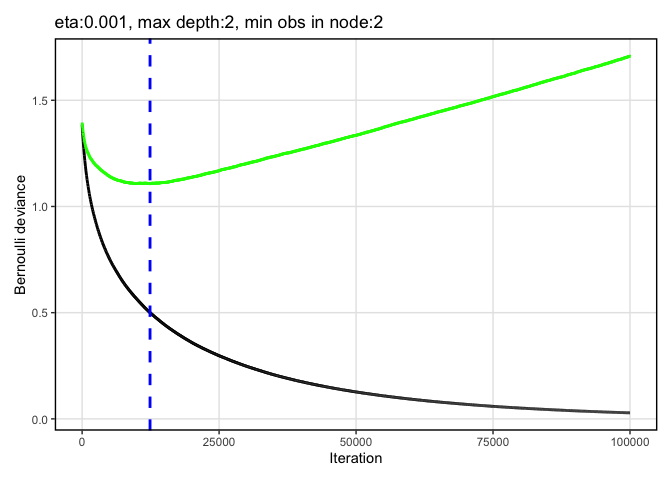
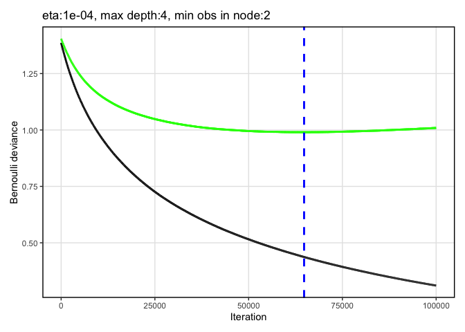

fishbase
================
Han lab
8/3/2020

\#\#\#\#\#install packages

    ## 
    ## Attaching package: 'seqinr'

    ## The following object is masked from 'package:plyr':
    ## 
    ##     count

    ## Loading required package: BiocGenerics

    ## Loading required package: parallel

    ## 
    ## Attaching package: 'BiocGenerics'

    ## The following objects are masked from 'package:parallel':
    ## 
    ##     clusterApply, clusterApplyLB, clusterCall, clusterEvalQ,
    ##     clusterExport, clusterMap, parApply, parCapply, parLapply,
    ##     parLapplyLB, parRapply, parSapply, parSapplyLB

    ## The following objects are masked from 'package:stats':
    ## 
    ##     IQR, mad, sd, var, xtabs

    ## The following objects are masked from 'package:base':
    ## 
    ##     anyDuplicated, append, as.data.frame, basename, cbind, colnames,
    ##     dirname, do.call, duplicated, eval, evalq, Filter, Find, get, grep,
    ##     grepl, intersect, is.unsorted, lapply, Map, mapply, match, mget,
    ##     order, paste, pmax, pmax.int, pmin, pmin.int, Position, rank,
    ##     rbind, Reduce, rownames, sapply, setdiff, sort, table, tapply,
    ##     union, unique, unsplit, which, which.max, which.min

    ## Loading required package: S4Vectors

    ## Loading required package: stats4

    ## 
    ## Attaching package: 'S4Vectors'

    ## The following object is masked from 'package:plyr':
    ## 
    ##     rename

    ## The following object is masked from 'package:base':
    ## 
    ##     expand.grid

    ## Loading required package: IRanges

    ## 
    ## Attaching package: 'IRanges'

    ## The following object is masked from 'package:plyr':
    ## 
    ##     desc

    ## Loading required package: XVector

    ## 
    ## Attaching package: 'XVector'

    ## The following object is masked from 'package:plyr':
    ## 
    ##     compact

    ## 
    ## Attaching package: 'Biostrings'

    ## The following object is masked from 'package:seqinr':
    ## 
    ##     translate

    ## The following object is masked from 'package:base':
    ## 
    ##     strsplit

    ## Loading required package: ape

    ## 
    ## Attaching package: 'ape'

    ## The following object is masked from 'package:Biostrings':
    ## 
    ##     complement

    ## The following objects are masked from 'package:seqinr':
    ## 
    ##     as.alignment, consensus

    ## 
    ## Attaching package: 'phylotools'

    ## The following object is masked from 'package:seqinr':
    ## 
    ##     read.fasta

    ## 
    ## Attaching package: 'data.table'

    ## The following object is masked from 'package:IRanges':
    ## 
    ##     shift

    ## The following objects are masked from 'package:S4Vectors':
    ## 
    ##     first, second

    ## 
    ## Attaching package: 'rfishbase'

    ## The following object is masked from 'package:BiocGenerics':
    ## 
    ##     species

    ## Loading required package: lattice

    ## Loading required package: survival

    ## Loading required package: Formula

    ## 
    ## Attaching package: 'Hmisc'

    ## The following object is masked from 'package:ape':
    ## 
    ##     zoom

    ## The following objects are masked from 'package:Biostrings':
    ## 
    ##     mask, translate

    ## The following object is masked from 'package:seqinr':
    ## 
    ##     translate

    ## The following objects are masked from 'package:plyr':
    ## 
    ##     is.discrete, summarize

    ## The following objects are masked from 'package:base':
    ## 
    ##     format.pval, units

    ## 
    ## Attaching package: 'caret'

    ## The following object is masked from 'package:survival':
    ## 
    ##     cluster

    ## The following object is masked from 'package:seqinr':
    ## 
    ##     dotPlot

    ## 
    ## Attaching package: 'tidyr'

    ## The following object is masked from 'package:S4Vectors':
    ## 
    ##     expand

    ## Loaded gbm 2.1.5

    ## 
    ## Attaching package: 'Matrix'

    ## The following objects are masked from 'package:tidyr':
    ## 
    ##     expand, pack, unpack

    ## The following object is masked from 'package:S4Vectors':
    ## 
    ##     expand

    ## 
    ## Attaching package: 'caTools'

    ## The following object is masked from 'package:IRanges':
    ## 
    ##     runmean

    ## The following object is masked from 'package:S4Vectors':
    ## 
    ##     runmean

    ## 
    ## Attaching package: 'dplyr'

    ## The following objects are masked from 'package:Hmisc':
    ## 
    ##     src, summarize

    ## The following objects are masked from 'package:data.table':
    ## 
    ##     between, first, last

    ## The following objects are masked from 'package:Biostrings':
    ## 
    ##     collapse, intersect, setdiff, setequal, union

    ## The following object is masked from 'package:XVector':
    ## 
    ##     slice

    ## The following objects are masked from 'package:IRanges':
    ## 
    ##     collapse, desc, intersect, setdiff, slice, union

    ## The following objects are masked from 'package:S4Vectors':
    ## 
    ##     first, intersect, rename, setdiff, setequal, union

    ## The following objects are masked from 'package:BiocGenerics':
    ## 
    ##     combine, intersect, setdiff, union

    ## The following object is masked from 'package:seqinr':
    ## 
    ##     count

    ## The following objects are masked from 'package:plyr':
    ## 
    ##     arrange, count, desc, failwith, id, mutate, rename, summarise,
    ##     summarize

    ## The following objects are masked from 'package:stats':
    ## 
    ##     filter, lag

    ## The following objects are masked from 'package:base':
    ## 
    ##     intersect, setdiff, setequal, union

    ## Loading required package: raster

    ## Loading required package: sp

    ## 
    ## Attaching package: 'sp'

    ## The following object is masked from 'package:IRanges':
    ## 
    ##     %over%

    ## 
    ## Attaching package: 'raster'

    ## The following object is masked from 'package:dplyr':
    ## 
    ##     select

    ## The following object is masked from 'package:tidyr':
    ## 
    ##     extract

    ## The following objects are masked from 'package:Hmisc':
    ## 
    ##     mask, zoom

    ## The following object is masked from 'package:data.table':
    ## 
    ##     shift

    ## The following objects are masked from 'package:ape':
    ## 
    ##     rotate, zoom

    ## The following object is masked from 'package:Biostrings':
    ## 
    ##     mask

    ## The following objects are masked from 'package:IRanges':
    ## 
    ##     distance, shift, trim, values, values<-

    ## The following objects are masked from 'package:S4Vectors':
    ## 
    ##     metadata, metadata<-, values, values<-

    ## Loading required package: iterators

    ## Loading required package: snow

    ## 
    ## Attaching package: 'snow'

    ## The following objects are masked from 'package:BiocGenerics':
    ## 
    ##     clusterApply, clusterApplyLB, clusterCall, clusterEvalQ,
    ##     clusterExport, clusterMap, clusterSplit, parApply, parCapply,
    ##     parLapply, parRapply, parSapply

    ## The following objects are masked from 'package:parallel':
    ## 
    ##     clusterApply, clusterApplyLB, clusterCall, clusterEvalQ,
    ##     clusterExport, clusterMap, clusterSplit, makeCluster, parApply,
    ##     parCapply, parLapply, parRapply, parSapply, splitIndices,
    ##     stopCluster

    ## Warning: package 'rsample' was built under R version 4.0.2

    ## 
    ## Attaching package: 'rsample'

    ## The following object is masked from 'package:ape':
    ## 
    ##     complement

    ## The following object is masked from 'package:Biostrings':
    ## 
    ##     complement

    ## Warning: package 'tidyverse' was built under R version 4.0.2

    ## ── Attaching packages ─────────────────────────────────────────────────────────────── tidyverse 1.3.0 ──

    ## ✓ tibble  3.0.1     ✓ purrr   0.3.4
    ## ✓ readr   1.3.1     ✓ forcats 0.5.0

    ## ── Conflicts ────────────────────────────────────────────────────────────────── tidyverse_conflicts() ──
    ## x purrr::accumulate()      masks foreach::accumulate()
    ## x dplyr::arrange()         masks plyr::arrange()
    ## x dplyr::between()         masks data.table::between()
    ## x dplyr::collapse()        masks Biostrings::collapse(), IRanges::collapse()
    ## x dplyr::combine()         masks BiocGenerics::combine()
    ## x purrr::compact()         masks XVector::compact(), plyr::compact()
    ## x dplyr::count()           masks seqinr::count(), plyr::count()
    ## x dplyr::desc()            masks IRanges::desc(), plyr::desc()
    ## x Matrix::expand()         masks tidyr::expand(), S4Vectors::expand()
    ## x raster::extract()        masks tidyr::extract()
    ## x dplyr::failwith()        masks plyr::failwith()
    ## x dplyr::filter()          masks stats::filter()
    ## x dplyr::first()           masks data.table::first(), S4Vectors::first()
    ## x dplyr::id()              masks plyr::id()
    ## x dplyr::lag()             masks stats::lag()
    ## x dplyr::last()            masks data.table::last()
    ## x purrr::lift()            masks caret::lift()
    ## x dplyr::mutate()          masks plyr::mutate()
    ## x Matrix::pack()           masks tidyr::pack()
    ## x purrr::partial()         masks pdp::partial()
    ## x BiocGenerics::Position() masks ggplot2::Position(), base::Position()
    ## x purrr::reduce()          masks IRanges::reduce()
    ## x dplyr::rename()          masks S4Vectors::rename(), plyr::rename()
    ## x raster::select()         masks dplyr::select()
    ## x dplyr::slice()           masks XVector::slice(), IRanges::slice()
    ## x dplyr::src()             masks Hmisc::src()
    ## x dplyr::summarise()       masks plyr::summarise()
    ## x dplyr::summarize()       masks Hmisc::summarize(), plyr::summarize()
    ## x purrr::transpose()       masks data.table::transpose()
    ## x Matrix::unpack()         masks tidyr::unpack()
    ## x purrr::when()            masks foreach::when()

    ## Warning: package 'sf' was built under R version 4.0.2

    ## Linking to GEOS 3.8.1, GDAL 3.1.1, PROJ 6.3.1

    ## Warning: package 'mapview' was built under R version 4.0.2

    ## Warning: package 'rnaturalearth' was built under R version 4.0.2

    ## 
    ## Attaching package: 'fasterize'

    ## The following object is masked from 'package:graphics':
    ## 
    ##     plot

    ## The following object is masked from 'package:base':
    ## 
    ##     plot

    ## Warning: package 'patchwork' was built under R version 4.0.2

    ## 
    ## Attaching package: 'patchwork'

    ## The following object is masked from 'package:raster':
    ## 
    ##     area

    ## 
    ## Attaching package: 'magrittr'

    ## The following object is masked from 'package:purrr':
    ## 
    ##     set_names

    ## The following object is masked from 'package:raster':
    ## 
    ##     extract

    ## The following object is masked from 'package:tidyr':
    ## 
    ##     extract

    ## Warning: package 'fulltext' was built under R version 4.0.2

    ## Registered S3 method overwritten by 'hoardr':
    ##   method           from
    ##   print.cache_info httr

    ## 
    ## Attaching package: 'fulltext'

    ## The following object is masked from 'package:dplyr':
    ## 
    ##     collect

\#\#function to take the same across rows of categorical variables that
have been 1/0 encoded, where a species may have 1 for more than one
condition of a variable

\#\#function to replace NAs with real values for binary fields

\#\#settings

\#\#look at docs about tables available from fishbase

\#\#read in data and fix species names

\#\#distribution \#\#currently this is ~ FAO areas table (minus “note”
field) e.g. <http://www.fishbase.us/Country/FaoAreaList.php?ID=5537>
\#\#each species may have multiple bounding boxes

Read in the FAO areas (from
<http://www.fao.org/geonetwork/srv/en/main.home?uuid=ac02a460-da52-11dc-9d70-0017f293bd28>
as described by
<http://www.fishbase.us/manual/English/FishbaseThe_FAOAREAS_Table.htm>).
It looks like our data contain both the inland and marine FAOs, so I
read in both and combined them according to a single column of FAO code.

\#\#check out some tables in fishbase \#\#brains: one entry for each
individual fish: BrainWeight, BodyWeight
\#\#<https://www.fishbase.in/manual/fishbasethe_brains_table.htm>

\#\#country: multiple rows per species; for
example:

## countrysub – multiple rows per species

\#\#<https://www.fishbase.de/manual/english/FishBaseThe_Countries_Table.htm>

\#\#get ecology data
\#\#<http://fishbase.us/manual/English/FishbaseThe_ECOLOGY_Table.htm>

\#\#distribution \#\#currently this is ~ FAO areas table (minus “note”
field) e.g. <http://www.fishbase.us/Country/FaoAreaList.php?ID=5537>
\#\#each species may have multiple bounding boxes

\#\#ecosystem – couldn’t find description of this online \#\#multiple
rows per species, one for each ecosystem

\#\#estimate: a table of estimates from some models on trophic levels
\#\#<http://www.fishbase.us/manual/English/FishbaseThe_FOOD_ITEMS_table.htm>

\#\#faoareas, seems to be redundant to countrysub?

\#\#fecundity \#\#sometimes multiple rows per species. could not
\#\#could not locate doc table about fecundity. spawning table seems to
be something different (different fields):
<https://www.fishbase.in/manual/fishbasethe_spawning_table.htm>

\#\#fooditems – including this one
\#\#<http://www.fishbase.org/manual/english/fishbasethe_food_items_table.htm>
\#\#multiple rows per species, for different food types, life stages of
predator, locality, etc.

\#\#genetic – don’t think we want to use this, but including just to see
what it shows

\#\#introductions – species introductions data. for now making one new
feature: the number of records about introductions; it seems that each
row is a different place
\#\#<https://www.fishbase.in/manual/fishbasethe_introduction_table.htm>

\#\#larvae
\#\#<https://www.fishbase.in/manual/fishbasethe_larvae_table.htm> \#\#2
out of the 74 species have multiple records w/ different values.
excluding for now.

\#\#length\_freq; multiple records for some species; excluding for now;
could not find metadata

\#\#length\_length: conversion of length types

\#\#length\_weight: The LENGTH-WEIGHT table presents the a and b values
of over 5,000 length-weight relationships of the form W = a x Lb,
pertaining to about over 2,000 fish species. \#\#multiple records for
some species. \#\#seems like this may only be useful in combination with
length\_length
\#\#<https://www.fishbase.de/manual/FishbaseThe_LENGTH_WEIGHT_Table.htm>

\#\#maturity \#\#multiple records for some species, would need to take
averages if we wanted to use. there are multiple measures of maturity to
choose from.
\#\#<https://www.fishbase.in/manual/fishbasethe_maturity_table.htm>

\#\#morphology
\#\#<https://www.fishbase.in/manual/fishbasethe_morphology_table.htm>
\#\#there are multiple records for some species.

\#\#morphometrics \#\#there are multiple records for some species; to
include we would need to take averages \#\#exclude for now because
couldn’t find documentation

\#\#oxygen
\#\#<https://www.fishbase.in/manual/fishbasethe_oxygen_table.htm>
\#\#there are multiple records for some species (e.g. for different
sexes); to include we would need to take averages \#\#include along with
potentially influencing variables – e.g. salinity, temp, swimming speed,
etc.

\#\#popchar: Table of maximum length (Lmax), weight (Wmax) and age
(tmax)
\#\#<https://www.fishbase.in/manual/fishbasethe_popchar_table.htm>
\#\#there are multiple records for some species; to include we would
need to take averages \#\#

\#\#popgrowth
\#\#<https://www.fishbase.in/manual/fishbasethe_popgrowth_table.htm>
\#\#multiple records for some species, e.g. for different sexes;

\#\#popqb
\#\#<https://www.fishbase.se/manual/english/fishbasethe_popqb_table.htm>
\#\#population-based estimates of food consumption (i.e., estimates that
account for the age structure of populations) \#\#multiple responses for
some species. here there are two measures, popqb and maintenance qb.

\#\#predators
\#\#<https://www.fishbase.se/manual/English/fishbasethe_predators_table.htm>

\#\#ration \#\#�ration� (Rd) pertains to an estimate of daily food
consumption by fish of a specific size
\#\#<https://www.fishbase.in/manual/fishbasethe_ration_table.htm>
\#\#multiple rows for some species

\#\#reproduction
\#\#<https://www.fishbase.in/manual/fishbasethe_reproduction_table.htm>
\#\#only one row per species for these HADDOCK species; adding these
fields

\#\#spawning
\#\#<https://www.fishbase.in/manual/fishbasethe_spawning_table.htm>
\#\#multiple rows per species, for different localities

\#\#speed
\#\#<https://www.fishbase.se/manual/English/PDF/FB_Book_ATorres_Swimming_Speed_RF_JG.pdf>
\#\#<https://www.fishbase.in/manual/fishbasethe_swimming_and_speed_tables.htm>
\#\#multiple records for some species

\#\#stocks
\#\#<https://www.fishbase.in/manual/fishbasethe_stocks_table.htm>
\#\#multiple records for some species, one for each stock

\#\#diet \#\#<https://www.fishbase.in/manual/fishbasethe_diet_table.htm>
\#\#has multiple rows for different stages

\#\#diet\_items – multiple rows per species. seems to be linked with
DietCode to diet table
\#\#<https://www.fishbase.se/manual/English/fishbasethe_food_items_table.htm>

\#\#swimming
\#\#<https://www.fishbase.in/manual/fishbasethe_swimming_and_speed_tables.htm>
\#\#one record per species

\#\#see what coverage is

\#\#remove fields with 0 coverage

\#\#add back haddock fields

\#\#remove fields with near-zero variation

\#\#look for fields in common with other taxa that are not fish and
output to add to datasets from other verts

\#\#add field with AA position 30

\#\#add AA value to rest of fishbase data

\#\#remove fields with near-zero variation again

\#\#set up function gridSearch.R

\#\#combine data Adrian made with rest of fields from fish

\#\#add AA value to rest of vert data

\#\#remove order

\#make and use function for getting hits from fulltext from plos

``` r
get_hits_fulltext <- function(search_terms){
  out = rep(NA, length(search_terms))
  for (a in 1:length(search_terms)){
    tmp = ft_search(query = search_terms[a], from = "plos")#get the search results across only PLOS because otherwise hit rate limits 
    out[a] = tmp$plos$found
    Sys.sleep(1)
  }
  out
}

load("V.Rdata")
search_terms = V$Species
out <- get_hits_fulltext(search_terms)
out = data.frame(hits = out,
                 Species = search_terms)
vert_haddock_plos = out
V = merge(V, vert_haddock_plos, by = "Species")
save(V, file = "V.Rdata")
save(vert_haddock_plos, file = "vert_haddock_plos.Rdata")
```

\#\#use function gridSearch with all verts. output:
“haddock\_vert\_for\_gbm.csv”

``` r
print(Sys.time())
```

    ## [1] "2020-08-03 21:51:44 EDT"

``` r
load("gridSearch.Rdata")
output_name = "vert_haddock_20200803_2142"
cores = 4
  cl <- makeCluster(cores, "SOCK", timeout = 60)
  # stopCluster(cl)
  registerDoSNOW(cl)
load("V.Rdata")

out = V
Species = out$V
sp_ind = which(names(out)=="Species")
dmy <- dummyVars(" ~ .", data = out[,-sp_ind])
out <- data.frame(predict(dmy, newdata = out))
out$Species = Species
V = out

names = names(V)
DF = V
##remove variables with zero variation
sp_ind = which(names(DF)=="Species")
nzv = nearZeroVar(DF, freqCut = 95/5, saveMetrics = TRUE)
okay_inds = which(nzv$nzv == FALSE)
length(okay_inds)
```

    ## [1] 48

``` r
DF = DF[,okay_inds]#include only the columns that have variation

T = DF
names = names(T)
binary = NULL
  for (a in 1:length(names)){
    vals = unique(T[,names[a]])
    vals = vals[!is.na(vals)]
    if (length(which(vals==0)) + length(which(vals == -1)) == 2){
      T[,names[a]]=factor(T[,names[a]])
      binary = c(binary, names[a])
      #change to 1 and 0
    }
  }
V = T

V$adult_svl_cm[is.nan(V$adult_svl_cm)] <- NA
V$log_adult_body_mass_g[is.nan(V$log_adult_body_mass_g)] <- NA

DF = V
# A<- read.csv(file = "docking_results_AA_30_83.csv")
#find out what haddock_score_median is across all species
haddock_median = median(V$haddock_score_mean)

above_haddock_median = rep(0, dim(DF)[1])
inds = which(DF$haddock_score_mean > haddock_median)
above_haddock_median[inds]= 1
DF$above_haddock_median = above_haddock_median
label = "above_haddock_median"

write.csv(DF, file = "haddock_vert_for_gbm.csv")
rm = which(names(DF) %in% c("haddock_score_mean", "Order", "Species", "nchar", "haddock_score_sd"))

DF = DF[,-rm]

#testing out
eta = c(0.0001)
max_depth = c(3)
n.minobsinnode = c(2)
nrounds = 100000

#for real
eta = c(0.0001, 0.001, 0.01, 0.1)
max_depth = c(2,3,4)
n.minobsinnode = c(2,5)
nrounds = 100000

# n.minobsinnode = c(2)
k_split = 0.8
distribution = "bernoulli"

label_col_ind = which(names(DF)==label)
x_col = seq(1:dim(DF)[2])
x_col = setdiff(x_col, label_col_ind)
vars = colnames(DF)[x_col]


GRID <- gridSearch(DF = DF, label = label, vars = vars, k_split = k_split, 
                         distribution = distribution, 
                         eta = eta, 
                         max_depth = max_depth, 
                         n.minobsinnode = n.minobsinnode,
                         nrounds = nrounds, 
                         method = "cv", 
                         cv.folds = 5)

hyper_grid = GRID[[1]]
# print(hyper_grid)
dev <- GRID[[2]]
save(GRID, file = paste0("GRID", ".", output_name, ".Rdata"))
save(hyper_grid, file = paste0("hyper_grid", ".", output_name, ".Rdata"))
print(Sys.time())
```

    ## [1] "2020-08-03 22:09:59 EDT"

\#\#make deviance
plots

``` r
PLTS <-lapply(1:length(unique(GRID[[2]]$group)), function(i) GRID[[2]] %>% filter(group == unique(GRID[[2]]$group)[i]) %>% ggplot() +
  geom_line(aes(x = index, y = train), color = "black", size = 1) +
  geom_line(aes(x = index, y = valid), color = "green", size = 1) +
    geom_vline(xintercept = GRID[[2]] %>% filter(group == unique(GRID[[2]]$group)[i]) %>% dplyr::select(best.iter) %>% unique %>% as.numeric, color = "blue", linetype = "dashed", size = 1) +
  labs(x = "Iteration", y = "Bernoulli deviance", title = unique(GRID[[2]]$group[i])) +
  theme(panel.background = element_blank(), panel.border = element_rect(fill = "transparent", color = "black", size = 1), panel.grid.major = element_line(color = "grey90")))

patchwork::wrap_plots(PLTS)
```

<!-- -->

``` r
# , nrow = length(PLTS), heights= 5
save(PLTS, file = paste0("PLTS", ".", "deviance.", output_name, ".Rdata"))
```

\#\#find out what happens if we set no lower limit on number of trees

``` r
min_trees = 0
buffer= nrounds*0.33#buffer to make sure there are enough rounds when it comes to making null model
max_trees = nrounds - buffer
hyper_grid = GRID[[1]]
hyper_grid = subset(hyper_grid, n.trees < (max_trees))#make sure the best iteration was reached before we ran out of trees
hyper_grid = subset(hyper_grid, n.trees >=min_trees)
hyper_grid = subset(hyper_grid, eval_test == max(hyper_grid$eval_test)) 
hyper_grid = subset(hyper_grid, eval_train == min(hyper_grid$eval_train))#take the one with the lowest train

DEV = GRID[[2]]
DEV = subset(DEV, group == hyper_grid$group)#get just this winning set of hyperparameters
GRID[[2]]=DEV

PLTS <-lapply(1:length(unique(GRID[[2]]$group)), function(i) GRID[[2]] %>% filter(group == unique(GRID[[2]]$group)[i]) %>% ggplot() +
  geom_line(aes(x = index, y = train), color = "black", size = 1) +
  geom_line(aes(x = index, y = valid), color = "green", size = 1) +
    geom_vline(xintercept = GRID[[2]] %>% filter(group == unique(GRID[[2]]$group)[i]) %>% dplyr::select(best.iter) %>% unique %>% as.numeric, color = "blue", linetype = "dashed", size = 1) +
  labs(x = "Iteration", y = "Bernoulli deviance", title = unique(GRID[[2]]$group[i])) +
  theme(panel.background = element_blank(), panel.border = element_rect(fill = "transparent", color = "black", size = 1), panel.grid.major = element_line(color = "grey90")))

patchwork::wrap_plots(PLTS)
```

<!-- -->

``` r
# , nrow = length(PLTS), heights= 5
save(PLTS, file = paste0("PLTS", ".", "deviance.best.no.lower", output_name, ".Rdata"))
```

\#\#make deviance plot just for the “best” parameters requiring at least
10000 trees as optimal number of trees

``` r
load(paste0("GRID", ".", output_name, ".Rdata"))
min_trees = 10000
hyper_grid = GRID[[1]]
buffer= nrounds*0.33#buffer to make sure there are enough rounds when it comes to making null model
max_trees = nrounds - buffer
hyper_grid = subset(hyper_grid, n.trees < (max_trees))#make sure the best iteration was reached before we ran out of trees
hyper_grid = subset(hyper_grid, n.trees >=min_trees)
hyper_grid = subset(hyper_grid, eval_test == max(hyper_grid$eval_test)) 
hyper_grid = subset(hyper_grid, eval_train == min(hyper_grid$eval_train))#take the one with the lowest train

DEV = GRID[[2]]
DEV = subset(DEV, group == hyper_grid$group)#get just this winning set of hyperparameters
GRID[[2]]=DEV

PLTS <-lapply(1:length(unique(GRID[[2]]$group)), function(i) GRID[[2]] %>% filter(group == unique(GRID[[2]]$group)[i]) %>% ggplot() +
  geom_line(aes(x = index, y = train), color = "black", size = 1) +
  geom_line(aes(x = index, y = valid), color = "green", size = 1) +
    geom_vline(xintercept = GRID[[2]] %>% filter(group == unique(GRID[[2]]$group)[i]) %>% dplyr::select(best.iter) %>% unique %>% as.numeric, color = "blue", linetype = "dashed", size = 1) +
  labs(x = "Iteration", y = "Bernoulli deviance", title = unique(GRID[[2]]$group[i])) +
  theme(panel.background = element_blank(), panel.border = element_rect(fill = "transparent", color = "black", size = 1), panel.grid.major = element_line(color = "grey90")))

patchwork::wrap_plots(PLTS)
```

<!-- -->

``` r
# , nrow = length(PLTS), heights= 5
save(PLTS, file = paste0("PLTS", ".", "deviance.best.1000", output_name, ".Rdata"))
```

``` r
source("bootstrapGBM.R")
```

\#bootstrapGBM – run with all vertebrates

``` r
print(Sys.time())
```

    ## [1] "2020-08-03 22:13:46 EDT"

``` r
# nruns = 1

nruns = 10

OUT_obs <- bootstrapGBM(DF = DF, label = label, vars = vars, k_split = k_split, distribution = "bernoulli", eta = hyper_grid$eta, max_depth = hyper_grid$max_depth, nrounds = nrounds, nruns = nruns, bootstrap = "observed", method = "cv", cv.folds = 5,
                        n.minobsinnode = hyper_grid$n.minobsinnode,file_label=output_name)
bootstrap = "observed"
file_label = output_name

load(paste0(bootstrap, "hist_", file_label,".Rdata"))
# ,
#                         file_label=output_name
save(OUT_obs, file = paste0("OUT_observed_", output_name, ".Rdata"))

OUT_rand <- bootstrapGBM(DF = DF, label = label, vars = vars, k_split = k_split, distribution = "bernoulli", eta = hyper_grid$eta, max_depth = hyper_grid$max_depth, nrounds = nrounds, nruns = nruns, bootstrap = "null", method = "cv", cv.folds = 5,
                        n.minobsinnode = hyper_grid$n.minobsinnode, file_label = "null")

save(OUT_rand, file = paste0("OUT_rand_", output_name, ".Rdata"))

print(Sys.time())
```

    ## [1] "2020-08-03 22:31:54 EDT"

\#\#look at performance

``` r
I <- OUT_obs[[1]]

print("observed data, eval train")
```

    ## [1] "observed data, eval train"

``` r
mean(I$auc_train)
```

    ## [1] 0.9614685

``` r
print("observed data, eval test")
```

    ## [1] "observed data, eval test"

``` r
mean(I$auc_test)
```

    ## [1] 0.827353

``` r
R <- OUT_rand[[1]]

mean(R$auc_train)
```

    ## [1] 0.7796844

``` r
print("null data, eval test")
```

    ## [1] "null data, eval test"

``` r
mean(R$auc_test)
```

    ## [1] 0.5703776

\#\#plot importance

``` r
rm = c("eta", "max_depth", "n.trees", "auc_train", "auc_test")
keep = setdiff(names(I),rm)
I = I[,keep]

data_long <- gather(I, key = "var", value = "value", c(2:dim(I)[2]), factor_key=TRUE)

data_long_sum <- data_long %>% group_by(var) %>%
  summarize(mean_importance = mean(value))

data_long_sum_nonzero = subset(data_long_sum, mean_importance > 0)

data_long_nonzero = subset(data_long, var %in% data_long_sum_nonzero$var)

plot <- ggplot(data = data_long_nonzero, aes(x = reorder(var, -value), y = value))+
  geom_boxplot()+
  theme(panel.background = element_blank(), panel.border = element_rect(fill = NA, color = "black", size = 1), axis.text.x = element_text(angle = 90, hjust = 1, vjust = 0.2), panel.grid.major.y = element_line(color = "grey80"), panel.grid.major.x = element_line(color = "transparent"))+
  xlab("variable")+
  ylab("importance")


plot
```

<!-- -->

\#\#partial\_plotR.R – define

``` r
source("partial_plotR.R")
```

\#\#use partial\_plotR.R to make PD plots \#\#note this commented out
for now, because getting error

``` r
load(paste0(bootstrap, "hist_", file_label,".Rdata"))

# cut =12#choose some number so there aren't too many
# data_long_sum=data.frame(data_long_sum)
# data_long_sum = subset(data_long_sum, mean_importance >0 )
# sorted_inds = sort.int(data_long_sum$mean_importance, decreasing = TRUE, index.return = TRUE)
# 
# data_long_sum = data_long_sum[sorted_inds$ix,]
# 
# data_long_sum_low = data_long_sum[c(1:cut),]
# 
# inds_keep = which(out_hist$variable.name %in% data_long_sum_low$var)
# out_hist = out_hist[inds_keep,]
# vars_plot = data_long_sum_low$var#these are the vars we're keeping

hist.data = out_hist

pd_out = OUT_obs[[2]]
# pd_out = subset(pd_out, variable.name %in% vars_plot)
# partial_plot(data = DF, hist.data, vars, type = c("mean", "all"), histogram = T) 
# partial_plot(data = pd_out, hist.data = hist.data, vars = vars, type = "all", histogram = TRUE) 
```
