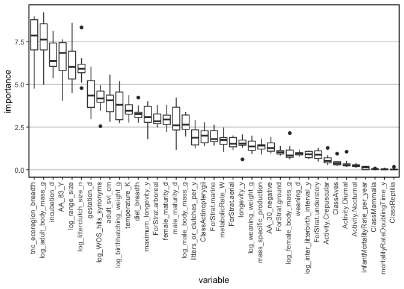
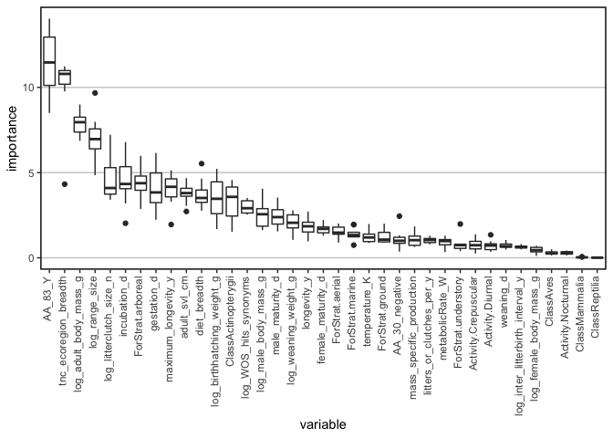
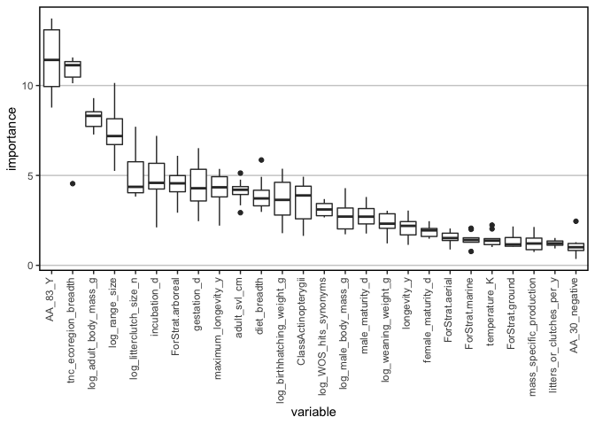
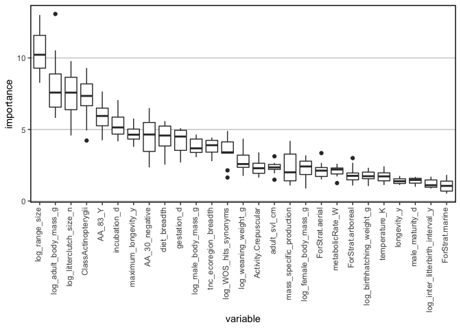

fishbase
================
Han lab
8/10/2020

\#\#\#\#\#install packages

``` r
date = "20200811"
time = "1457"
output_name = paste("vert_haddock", date, time, sep = "_")
save(output_name, file = "output_name.Rdata")
print(Sys.time())
```

    ## [1] "2020-08-11 14:58:00 EDT"

\#\#cores

\#\#set up function gridSearch.R

``` r
source("bootstrapGBM.R")
```

\#\#function to make binary fields into factor

``` r
binary_factor <- function(DF){
  T = DF
  names = names(T)
  binary = NULL
  for (a in 1:length(names)){
    vals = unique(T[,names[a]])
    vals = vals[!is.na(vals)]
    if (length(which(vals==0)) + length(which(vals == -1)) == 2){
      T[,names[a]]=factor(T[,names[a]])
      binary = c(binary, names[a])
      #change to 1 and 0
    }
  }
  T
}
save(binary_factor, file = "binary_factor.Rdata")
```

\#\#function to take the same across rows of categorical variables that
have been 1/0 encoded, where a species may have 1 for more than one
condition of a variable

\#\#function to replace NAs with real values for binary fields

\#\#settings

\#\#look at docs about tables available from fishbase

\#\#read in data and fix species names

\#\#distribution \#\#currently this is ~ FAO areas table (minus “note”
field) e.g. <http://www.fishbase.us/Country/FaoAreaList.php?ID=5537>
\#\#each species may have multiple bounding boxes

Read in the FAO areas (from
<http://www.fao.org/geonetwork/srv/en/main.home?uuid=ac02a460-da52-11dc-9d70-0017f293bd28>
as described by
<http://www.fishbase.us/manual/English/FishbaseThe_FAOAREAS_Table.htm>).
It looks like our data contain both the inland and marine FAOs, so I
read in both and combined them according to a single column of FAO code.

\#\#check out some tables in fishbase \#\#brains: one entry for each
individual fish: BrainWeight, BodyWeight
\#\#<https://www.fishbase.in/manual/fishbasethe_brains_table.htm>

\#\#country: multiple rows per species; for
example:

## countrysub – multiple rows per species

\#\#<https://www.fishbase.de/manual/english/FishBaseThe_Countries_Table.htm>

\#\#get ecology data
\#\#<http://fishbase.us/manual/English/FishbaseThe_ECOLOGY_Table.htm>

\#\#distribution \#\#currently this is ~ FAO areas table (minus “note”
field) e.g. <http://www.fishbase.us/Country/FaoAreaList.php?ID=5537>
\#\#each species may have multiple bounding boxes

\#\#ecosystem – couldn’t find description of this online \#\#multiple
rows per species, one for each ecosystem

\#\#estimate: a table of estimates from some models on trophic levels
\#\#<http://www.fishbase.us/manual/English/FishbaseThe_FOOD_ITEMS_table.htm>

\#\#faoareas, seems to be redundant to countrysub?

\#\#fecundity \#\#sometimes multiple rows per species. could not
\#\#could not locate doc table about fecundity. spawning table seems to
be something different (different fields):
<https://www.fishbase.in/manual/fishbasethe_spawning_table.htm>

\#\#fooditems – including this one
\#\#<http://www.fishbase.org/manual/english/fishbasethe_food_items_table.htm>
\#\#multiple rows per species, for different food types, life stages of
predator, locality, etc.

\#\#genetic – don’t think we want to use this, but including just to see
what it shows

\#\#introductions – species introductions data. for now making one new
feature: the number of records about introductions; it seems that each
row is a different place
\#\#<https://www.fishbase.in/manual/fishbasethe_introduction_table.htm>

\#\#larvae
\#\#<https://www.fishbase.in/manual/fishbasethe_larvae_table.htm> \#\#2
out of the 74 species have multiple records w/ different values.
excluding for now.

\#\#length\_freq; multiple records for some species; excluding for now;
could not find metadata

\#\#length\_length: conversion of length types

\#\#length\_weight: The LENGTH-WEIGHT table presents the a and b values
of over 5,000 length-weight relationships of the form W = a x Lb,
pertaining to about over 2,000 fish species. \#\#multiple records for
some species. \#\#seems like this may only be useful in combination with
length\_length
\#\#<https://www.fishbase.de/manual/FishbaseThe_LENGTH_WEIGHT_Table.htm>

\#\#maturity \#\#multiple records for some species, would need to take
averages if we wanted to use. there are multiple measures of maturity to
choose from.
\#\#<https://www.fishbase.in/manual/fishbasethe_maturity_table.htm>

\#\#morphology
\#\#<https://www.fishbase.in/manual/fishbasethe_morphology_table.htm>
\#\#there are multiple records for some species.

\#\#morphometrics \#\#there are multiple records for some species; to
include we would need to take averages \#\#exclude for now because
couldn’t find documentation

\#\#oxygen
\#\#<https://www.fishbase.in/manual/fishbasethe_oxygen_table.htm>
\#\#there are multiple records for some species (e.g. for different
sexes); to include we would need to take averages \#\#include along with
potentially influencing variables – e.g. salinity, temp, swimming speed,
etc.

\#\#popchar: Table of maximum length (Lmax), weight (Wmax) and age
(tmax)
\#\#<https://www.fishbase.in/manual/fishbasethe_popchar_table.htm>
\#\#there are multiple records for some species; to include we would
need to take averages \#\#

\#\#popgrowth
\#\#<https://www.fishbase.in/manual/fishbasethe_popgrowth_table.htm>
\#\#multiple records for some species, e.g. for different sexes;

\#\#popqb
\#\#<https://www.fishbase.se/manual/english/fishbasethe_popqb_table.htm>
\#\#population-based estimates of food consumption (i.e., estimates that
account for the age structure of populations) \#\#multiple responses for
some species. here there are two measures, popqb and maintenance qb.

\#\#predators
\#\#<https://www.fishbase.se/manual/English/fishbasethe_predators_table.htm>

\#\#ration \#\#�ration� (Rd) pertains to an estimate of daily food
consumption by fish of a specific size
\#\#<https://www.fishbase.in/manual/fishbasethe_ration_table.htm>
\#\#multiple rows for some species

\#\#reproduction
\#\#<https://www.fishbase.in/manual/fishbasethe_reproduction_table.htm>
\#\#only one row per species for these HADDOCK species; adding these
fields

\#\#spawning
\#\#<https://www.fishbase.in/manual/fishbasethe_spawning_table.htm>
\#\#multiple rows per species, for different localities

\#\#speed
\#\#<https://www.fishbase.se/manual/English/PDF/FB_Book_ATorres_Swimming_Speed_RF_JG.pdf>
\#\#<https://www.fishbase.in/manual/fishbasethe_swimming_and_speed_tables.htm>
\#\#multiple records for some species

\#\#stocks
\#\#<https://www.fishbase.in/manual/fishbasethe_stocks_table.htm>
\#\#multiple records for some species, one for each stock

\#\#diet \#\#<https://www.fishbase.in/manual/fishbasethe_diet_table.htm>
\#\#has multiple rows for different stages

\#\#diet\_items – multiple rows per species. seems to be linked with
DietCode to diet table
\#\#<https://www.fishbase.se/manual/English/fishbasethe_food_items_table.htm>

\#\#swimming
\#\#<https://www.fishbase.in/manual/fishbasethe_swimming_and_speed_tables.htm>
\#\#one record per species

\#\#see what coverage is

\#\#remove fields with 0 coverage

\#\#add back haddock fields

\#\#remove fields with near-zero variation

\#\#look for fields in common with other taxa that are not fish and
output to add to datasets from other verts

\#\#add field with AA position 30

\#\#add AA value to rest of fishbase data

\#\#remove fields with near-zero variation again

\#\#combine data Adrian made with rest of fields from fish. remove Order
field

\#add fields and remove “major\_habitat\_type\_breadth” (because it
seems redundant to tnc ecoregion breadth)

\#\#add AA value to rest of vert data

\#\#add WOS hits from R package wosr

``` r
load("V.Rdata")
dim(V)
```

    ## [1] 277  39

``` r
W <- read.csv("wos_species_hits.csv")#this version has results only from exact matches
names(W)[names(W)=="query"]="Species"
names(W)[names(W)=="rec_cnt"]="WOS_hits"

W$Species = str_replace(W$Species, "TS", "")
W$Species = str_replace(W$Species, " = ", "")
W$Species = str_sub(W$Species, 2, -2)

W2 <- read.csv("query_hits_synonyms.csv")#this includes synonyms
names(W2)[names(W2)=="query"]="Species"
#add small value to rec_cnt so we can take log
W2$rec_cnt = W2$rec_cnt+0.0001
W2$rec_cnt = log(W2$rec_cnt)
names(W2)[names(W2)=="rec_cnt"]="log_WOS_hits_synonyms"

a = 18
# hits_synonyms = rep(NA, dim(W2)[1])
out = NULL
species = unique(W$Species)
for (a in 1:length(species)){
  ind_W2 = str_which(W2$Species, species[a])#find the index in W2 that includes the a'th species
  tmp = data.frame(log_WOS_hits_synonyms = sum(W2$log_WOS_hits_synonyms[ind_W2]),
                   Species = species[a]) 
  # print("a")
  # print(a)
  # print(dim(tmp)[1])
  out = rbind(out, tmp)
}
V = merge(V, out)
dim(V)
```

    ## [1] 277  40

``` r
save(V, file = "V.Rdata")
```

\#\#use function gridSearch with all verts. output:
“haddock\_vert\_for\_gbm.csv”

``` r
print(Sys.time())
```

    ## [1] "2020-08-11 15:00:52 EDT"

``` r
load("gridSearch.Rdata")
# save(output_name, file = "output_name.Rdata")
load("V.Rdata")

out = V
Species = out$Species
sp_ind = which(names(out)=="Species")
dmy <- dummyVars(" ~ .", data = out[,-sp_ind])
out <- data.frame(predict(dmy, newdata = out))
out$Species = Species
V = out

names = names(V)
DF = V
Species = DF$Species
##remove variables with near zero variation
sp_ind = which(names(DF)=="Species")
nzv = nearZeroVar(DF, freqCut = 95/5, saveMetrics = TRUE)
okay_inds = which(nzv$nzv == FALSE)

near_zero_inds =which(nzv$nzv == TRUE)
print("near zero variation fields")
```

    ## [1] "near zero variation fields"

``` r
names[near_zero_inds]
```

    ## [1] "ClassAmphibia"       "ClassElasmobranchii" "ClassHolocephali"

``` r
length(okay_inds)
```

    ## [1] 43

``` r
DF = DF[,okay_inds]#include only the columns that have variation
DF$Species = Species

load("binary_factor.Rdata")
DF = binary_factor(DF)
V = DF

V$adult_svl_cm[is.nan(V$adult_svl_cm)] <- NA
V$log_adult_body_mass_g[is.nan(V$log_adult_body_mass_g)] <- NA

DF = V
#find out what haddock_score_median is across all species
haddock_median = median(V$haddock_score_mean)

haddock_median_and_below = rep(0, dim(DF)[1])
inds = which(DF$haddock_score_mean <= haddock_median)
haddock_median_and_below[inds]= 1
DF$haddock_median_and_below = haddock_median_and_below
label = "haddock_median_and_below"

write.csv(DF, file = "haddock_vert_for_gbm.csv", row.names = FALSE)
DF_gbm = DF
save(DF_gbm, file = "DF_gbm.Rdata")
rm = which(names(DF) %in% c("haddock_score_mean", "Order", "Species", "nchar", "haddock_score_sd"))

DF = DF[,-rm]

#testing out
eta = c(0.0001)
max_depth = c(3)
n.minobsinnode = c(2)
nrounds = 100000

#for real
eta = c(0.0001, 0.001, 0.01, 0.1)
max_depth = c(2,3,4)
n.minobsinnode = c(2,5)
nrounds = 100000

# n.minobsinnode = c(2)
k_split = 0.8
distribution = "bernoulli"

label_col_ind = which(names(DF)==label)
x_col = seq(1:dim(DF)[2])
x_col = setdiff(x_col, label_col_ind)
vars = colnames(DF)[x_col]


GRID <- gridSearch(DF = DF, label = label, vars = vars, k_split = k_split, 
                         distribution = distribution, 
                         eta = eta, 
                         max_depth = max_depth, 
                         n.minobsinnode = n.minobsinnode,
                         nrounds = nrounds, 
                         method = "cv", 
                         cv.folds = 5)

hyper_grid = GRID[[1]]
# print(hyper_grid)
dev <- GRID[[2]]
save(GRID, file = paste0("GRID", ".", output_name, ".Rdata"))
save(hyper_grid, file = paste0("hyper_grid", ".", output_name, ".Rdata"))
print(Sys.time())
```

    ## [1] "2020-08-11 15:22:47 EDT"

\#\#make deviance plots

``` r
load(paste0("GRID", ".", output_name, ".Rdata"))
PLTS <-lapply(1:length(unique(GRID[[2]]$group)), function(i) GRID[[2]] %>% filter(group == unique(GRID[[2]]$group)[i]) %>% ggplot() +
  geom_line(aes(x = index, y = train), color = "black", size = 1) +
  geom_line(aes(x = index, y = valid), color = "green", size = 1) +
    geom_vline(xintercept = GRID[[2]] %>% filter(group == unique(GRID[[2]]$group)[i]) %>% dplyr::select(best.iter) %>% unique %>% as.numeric, color = "blue", linetype = "dashed", size = 1) +
  labs(x = "Iteration", y = "Bernoulli deviance", title = unique(GRID[[2]]$group[i])) +
  theme(panel.background = element_blank(), panel.border = element_rect(fill = "transparent", color = "black", size = 1), panel.grid.major = element_line(color = "grey90")))

# patchwork::wrap_plots(PLTS)
# , nrow = length(PLTS), heights= 5
save(PLTS, file = paste0("PLTS", ".", "deviance.", output_name, ".Rdata"))
```

\#\#find out what happens if we set no lower limit on number of trees

``` r
min_trees = 0
buffer= nrounds*0.33#buffer to make sure there are enough rounds when it comes to making null model
max_trees = nrounds - buffer
hyper_grid = GRID[[1]]
hyper_grid = subset(hyper_grid, n.trees < (max_trees))#make sure the best iteration was reached before we ran out of trees
hyper_grid = subset(hyper_grid, n.trees >=min_trees)
hyper_grid = subset(hyper_grid, eval_test == max(hyper_grid$eval_test)) 
hyper_grid = subset(hyper_grid, eval_train == min(hyper_grid$eval_train))#take the one with the lowest train

DEV = GRID[[2]]
DEV = subset(DEV, group == hyper_grid$group)#get just this winning set of hyperparameters
GRID[[2]]=DEV

PLTS_no_min <-lapply(1:length(unique(GRID[[2]]$group)), function(i) GRID[[2]] %>% filter(group == unique(GRID[[2]]$group)[i]) %>% ggplot() +
  geom_line(aes(x = index, y = train), color = "black", size = 1) +
  geom_line(aes(x = index, y = valid), color = "green", size = 1) +
    geom_vline(xintercept = GRID[[2]] %>% filter(group == unique(GRID[[2]]$group)[i]) %>% dplyr::select(best.iter) %>% unique %>% as.numeric, color = "blue", linetype = "dashed", size = 1) +
  labs(x = "Iteration", y = "Bernoulli deviance", title = unique(GRID[[2]]$group[i])) +
  theme(panel.background = element_blank(), panel.border = element_rect(fill = "transparent", color = "black", size = 1), panel.grid.major = element_line(color = "grey90")))

patchwork::wrap_plots(PLTS_no_min)
```

<!-- -->

``` r
# , nrow = length(PLTS), heights= 5
save(PLTS_no_min, file = paste0("PLTS", ".", "deviance.best.no.lower", output_name, ".Rdata"))
```

\#\#make deviance plot just for the “best” parameters requiring at least
10000 trees as optimal number of trees

``` r
load(paste0("GRID", ".", output_name, ".Rdata"))
min_trees = 10000
hyper_grid = GRID[[1]]
buffer= nrounds*0.33#buffer to make sure there are enough rounds when it comes to making null model
max_trees = nrounds - buffer
hyper_grid = subset(hyper_grid, n.trees < (max_trees))#make sure the best iteration was reached before we ran out of trees
hyper_grid = subset(hyper_grid, n.trees >=min_trees)
hyper_grid = subset(hyper_grid, eval_test == max(hyper_grid$eval_test)) 
hyper_grid = subset(hyper_grid, eval_train == min(hyper_grid$eval_train))#take the one with the lowest train
DEV = GRID[[2]]
DEV = subset(DEV, group == hyper_grid$group)#get just this winning set of hyperparameters
GRID[[2]]=DEV

PLTS_min <-lapply(1:length(unique(GRID[[2]]$group)), function(i) GRID[[2]] %>% filter(group == unique(GRID[[2]]$group)[i]) %>% ggplot() +
  geom_line(aes(x = index, y = train), color = "black", size = 1) +
  geom_line(aes(x = index, y = valid), color = "green", size = 1) +
    geom_vline(xintercept = GRID[[2]] %>% filter(group == unique(GRID[[2]]$group)[i]) %>% dplyr::select(best.iter) %>% unique %>% as.numeric, color = "blue", linetype = "dashed", size = 1) +
  labs(x = "Iteration", y = "Bernoulli deviance", title = unique(GRID[[2]]$group[i])) +
  theme(panel.background = element_blank(), panel.border = element_rect(fill = "transparent", color = "black", size = 1), panel.grid.major = element_line(color = "grey90")))

patchwork::wrap_plots(PLTS_min)
```

<!-- -->

``` r
# , nrow = length(PLTS), heights= 5
save(PLTS_min, file = paste0("PLTS_min", ".", "deviance.best", as.character(min_trees), output_name, ".Rdata"))

print("hyper_grid")
```

    ## [1] "hyper_grid"

``` r
hyper_grid
```

    ##     eta max_depth n.minobsinnode n.trees eval_train eval_test
    ## 5 1e-04         4              2   56486  0.9876126 0.8751715
    ##                                       group
    ## 5 eta:1e-04, max depth:4, min obs in node:2

\#bootstrapGBM – run with all vertebrates and all
fields

``` r
print(Sys.time())
```

    ## [1] "2020-08-11 15:23:27 EDT"

``` r
OUT_obs <- bootstrapGBM(DF = DF, label = label, vars = vars, k_split = k_split, distribution = "bernoulli", eta = hyper_grid$eta, max_depth = hyper_grid$max_depth, nrounds = nrounds, nruns = nruns, bootstrap = "observed", method = "cv", cv.folds = 5,
                        n.minobsinnode = hyper_grid$n.minobsinnode,file_label=output_name)
bootstrap = "observed"
file_label = output_name

load(paste0(bootstrap, "hist_", file_label,".Rdata"))
# ,
#                         file_label=output_name
save(OUT_obs, file = paste0("OUT_observed_", output_name, ".Rdata"))

OUT_rand <- bootstrapGBM(DF = DF, label = label, vars = vars, k_split = k_split, distribution = "bernoulli", eta = hyper_grid$eta, max_depth = hyper_grid$max_depth, nrounds = nrounds, nruns = nruns, bootstrap = "null", method = "cv", cv.folds = 5,
                        n.minobsinnode = hyper_grid$n.minobsinnode, file_label = "null")

save(OUT_rand, file = paste0("OUT_rand_", output_name, ".Rdata"))

print(Sys.time())
```

    ## [1] "2020-08-11 15:40:09 EDT"

\#\#look at performance

``` r
load(paste0("OUT_observed_", output_name, ".Rdata"))
load(paste0("OUT_rand_", output_name, ".Rdata"))
I <- OUT_obs[[1]]

print("observed data, eval train")
```

    ## [1] "observed data, eval train"

``` r
mean(I$eval_train)
```

    ## [1] 0.991908

``` r
print("observed data, eval test")
```

    ## [1] "observed data, eval test"

``` r
mean(I$eval_test)
```

    ## [1] 0.8559671

``` r
R <- OUT_rand[[1]]

mean(R$eval_train)
```

    ## [1] 0.8675354

``` r
print("null data, eval test")
```

    ## [1] "null data, eval test"

``` r
mean(R$eval_test)
```

    ## [1] 0.5482853

``` r
corrected_test_eval = mean(I$eval_test) - (mean(R$eval_test) - 0.5)
print("corrected test AUC")
```

    ## [1] "corrected test AUC"

``` r
corrected_test_eval
```

    ## [1] 0.8076818

\#\#plot importance

``` r
rm = c("eta", "max_depth", "n.trees", "eval_train", "eval_test")
keep = setdiff(names(I),rm)
I = I[,keep]

data_long <- gather(I, key = "var", value = "value", c(2:dim(I)[2]), factor_key=TRUE)

data_long_sum <- data_long %>% group_by(var) %>%
  summarize(mean_importance = mean(value))

print(data_long_sum)
```

    ## # A tibble: 39 x 2
    ##    var                 mean_importance
    ##    <fct>                         <dbl>
    ##  1 ClassActinopterygii          2.03  
    ##  2 ClassAves                    0.323 
    ##  3 ClassMammalia                0.0432
    ##  4 ClassReptilia                0.0410
    ##  5 ForStrat.ground              0.941 
    ##  6 ForStrat.understory          0.891 
    ##  7 ForStrat.arboreal            3.03  
    ##  8 ForStrat.aerial              1.67  
    ##  9 ForStrat.marine              1.98  
    ## 10 Activity.Nocturnal           0.210 
    ## # … with 29 more rows

``` r
data_long_sum_nonzero = subset(data_long_sum, mean_importance > 0)

#find the variables that have importance at least 1
data_long_sum_one = subset(data_long_sum, mean_importance >=1)
var_one = data_long_sum_one$var
var_one = c(as.character(var_one),"haddock_median_and_below")#add back label
V = read.csv("haddock_vert_for_gbm.csv")
col_keep = which(names(V) %in% var_one)
V = V[,col_keep]
write.csv(V, "haddock_vert_for_gbm_importance_over_one.csv", row.names = FALSE)

data_long_nonzero = subset(data_long, var %in% data_long_sum_nonzero$var)

plot <- ggplot(data = data_long_nonzero, aes(x = reorder(var, -value), y = value))+
  geom_boxplot()+
  theme(panel.background = element_blank(), panel.border = element_rect(fill = NA, color = "black", size = 1), axis.text.x = element_text(angle = 90, hjust = 1, vjust = 0.2), panel.grid.major.y = element_line(color = "grey80"), panel.grid.major.x = element_line(color = "transparent"))+
  xlab("variable")+
  ylab("importance")


plot
```

<!-- -->

``` r
ggsave(filename = paste0("importance", output_name, ".jpg"), plot = plot, height = 8, width = 8)
```

\#\#partial\_plotR.R – define

``` r
source("partial_plotR.R")
```

\#\#use partial\_plotR.R to make PD plots \#\#note this commented out
for now, because getting error

``` r
# file_label = output_name
# bootstrap_label = "observed"
# load(paste0(bootstrap_label, "hist_", file_label,".Rdata"))
# #
# data_long_sum=data.frame(data_long_sum)
# # #cut =dim(data_long_sum)[1]#choose some number so there aren't too many, default choose all of them
# #
# data_long_sum = subset(data_long_sum, mean_importance >0 )
# sorted_inds = sort.int(data_long_sum$mean_importance, decreasing = TRUE, index.return = TRUE)
# #
# data_long_sum = data_long_sum[sorted_inds$ix,]
# #
# data_long_sum_low = data_long_sum#[c(1:cut),]
# write.csv(data_long_sum_low, file = paste0( "importance", output_name, ".csv"))
# inds_keep = which(out_hist$variable.name %in% data_long_sum_low$var)
# out_hist = out_hist[inds_keep,]
# vars_plot = data_long_sum_low$var#these are the vars we're keeping
# 
# hist.data = out_hist
# pd_out = OUT_obs[[2]]
# pd_out = subset(pd_out, variable.name %in% vars_plot)
# plot <- partial_plot(data = pd_out, hist.data = hist.data, vars = vars_plot, type = "mean", histogram = T)
# # partial_plot(data = pd_out, hist.data = hist.data, vars = vars, type = "all", histogram = TRUE)
# ggsave(filename = paste0("PD.", output_name, ".jpg"), plot = plot, height = 20, width = 20)
# plot
```

\#\#redo analysis with only features that have importance greater than
one

``` r
load("output_name.Rdata")
output_name = paste0(output_name, "importance_over_one")
```

\#bootstrapGBM – run with all vertebrates – importance over one

``` r
DF = read.csv("haddock_vert_for_gbm_importance_over_one.csv")
DF = binary_factor(DF)
vars = setdiff(names(DF), label)
print(Sys.time())
```

    ## [1] "2020-08-11 15:40:13 EDT"

``` r
OUT_obs <- bootstrapGBM(DF = DF, label = label, vars = vars, k_split = k_split, distribution = "bernoulli", eta = hyper_grid$eta, max_depth = hyper_grid$max_depth, nrounds = nrounds, nruns = nruns, bootstrap = "observed", method = "cv", cv.folds = 5,
                        n.minobsinnode = hyper_grid$n.minobsinnode,file_label=output_name)
bootstrap_label = "observed"

load(paste0(bootstrap_label, "hist_", output_name, ".Rdata"))

save(OUT_obs, file = paste0("OUT_observed_", output_name, ".Rdata"))

OUT_rand <- bootstrapGBM(DF = DF, label = label, vars = vars, k_split = k_split, distribution = "bernoulli", eta = hyper_grid$eta, max_depth = hyper_grid$max_depth, nrounds = nrounds, nruns = nruns, bootstrap = "null", method = "cv", cv.folds = 5,
                        n.minobsinnode = hyper_grid$n.minobsinnode, file_label = "null")

save(OUT_rand, file = paste0("OUT_rand_", output_name, ".Rdata"))

print(Sys.time())
```

    ## [1] "2020-08-11 15:55:09 EDT"

\#\#look at performance – importance over one

``` r
load(paste0("OUT_observed_", output_name, ".Rdata"))
load(paste0("OUT_rand_", output_name, ".Rdata"))
I <- OUT_obs[[1]]

print("observed data, eval train")
```

    ## [1] "observed data, eval train"

``` r
mean(I$eval_train)
```

    ## [1] 0.9920849

``` r
print("observed data, eval test")
```

    ## [1] "observed data, eval test"

``` r
mean(I$eval_test)
```

    ## [1] 0.8534979

``` r
R <- OUT_rand[[1]]

mean(R$eval_train)
```

    ## [1] 0.8635135

``` r
print("null data, eval test")
```

    ## [1] "null data, eval test"

``` r
mean(R$eval_test)
```

    ## [1] 0.5477366

``` r
corrected_test_eval = mean(I$eval_test) - (mean(R$eval_test) - 0.5)
print("corrected test AUC")
```

    ## [1] "corrected test AUC"

``` r
corrected_test_eval
```

    ## [1] 0.8057613

\#\#plot importance (over one)

``` r
rm = c("eta", "max_depth", "n.trees", "eval_train", "eval_test")
keep = setdiff(names(I),rm)
I = I[,keep]

data_long <- gather(I, key = "var", value = "value", c(2:dim(I)[2]), factor_key=TRUE)

data_long_sum <- data_long %>% group_by(var) %>%
  summarize(mean_importance = mean(value))

print(data_long_sum)
```

    ## # A tibble: 27 x 2
    ##    var                        mean_importance
    ##    <fct>                                <dbl>
    ##  1 ClassActinopterygii                   2.22
    ##  2 ForStrat.arboreal                     3.47
    ##  3 ForStrat.aerial                       1.80
    ##  4 ForStrat.marine                       2.19
    ##  5 female_maturity_d                     3.09
    ##  6 male_maturity_d                       2.81
    ##  7 incubation_d                          6.83
    ##  8 log_litterclutch_size_n               6.38
    ##  9 litters_or_clutches_per_y             2.29
    ## 10 log_birthhatching_weight_g            3.92
    ## # … with 17 more rows

``` r
data_long_sum_nonzero = subset(data_long_sum, mean_importance > 0)

#find the variables that have importance at least 1
data_long_sum_one = subset(data_long_sum, mean_importance >=1)
var_one = data_long_sum_one$var

data_long_nonzero = subset(data_long, var %in% data_long_sum_nonzero$var)

plot <- ggplot(data = data_long_nonzero, aes(x = reorder(var, -value), y = value))+
  geom_boxplot()+
  theme(panel.background = element_blank(), panel.border = element_rect(fill = NA, color = "black", size = 1), axis.text.x = element_text(angle = 90, hjust = 1, vjust = 0.2), panel.grid.major.y = element_line(color = "grey80"), panel.grid.major.x = element_line(color = "transparent"))+
  xlab("variable")+
  ylab("importance")

plot
```

<!-- -->

``` r
ggsave(filename = paste0("importance", output_name, ".jpg"), plot = plot, height = 8, width = 8)
```

\#\#use partial\_plotR.R to make PD plots \#\#note this commented out
for now, because getting error

``` r
# load(paste0("OUT_observed_", output_name, ".Rdata"))
# pd_out = OUT_obs[[2]]
# save(pd_out, file = "pd_out.Rdata")
# load("pd_out.Rdata")
# # 
# bootstrap = "observed"
# load(paste0(bootstrap, "hist_", output_name, ".Rdata"))
# hist.data = out_hist
# save(hist.data, file = "hist.data.Rdata")
# load("hist.data.Rdata")
# # 
# data_long_sum=data.frame(data_long_sum)
# # cut =dim(data_long_sum)[1]#choose some number so there aren't too many, default choose all of them
# 
# data_long_sum = subset(data_long_sum, mean_importance >0 )
# sorted_inds = sort.int(data_long_sum$mean_importance, decreasing = TRUE, index.return = TRUE)
# 
# data_long_sum = data_long_sum[sorted_inds$ix,]
# 
# data_long_sum_low = data_long_sum#[c(1:cut),]
# write.csv(data_long_sum_low, file = paste0( "importance", output_name,  ".csv"))
# inds_keep = which(out_hist$variable.name %in% data_long_sum_low$var)
# out_hist = out_hist[inds_keep,]
# vars_plot = data_long_sum_low$var#these are the vars we're keeping
# 
# hist.data = out_hist
# pd_out = subset(pd_out, variable.name %in% vars_plot)
# intersect(unique(pd_out$variable.name),unique(hist.data$variable.name))
# setdiff(unique(pd_out$variable.name),unique(hist.data$variable.name))
# # #should be empty
# setdiff(unique(hist.data$variable.name),unique(pd_out$variable.name))
# # # #should be empty
# vars_plot = unique(pd_out$variable.name)
# # plot <- partial_plot(data = pd_out, hist.data = hist.data, vars = vars_plot, type = "mean", histogram = T)
# plot <- partial_plot(data = pd_out, hist.data = hist.data, vars = vars_plot, type = "all", histogram = T)
# ggsave(filename = paste0("PD.", output_name, ".jpg"), plot = plot, height = 20, width = 20)
# plot
```

\#\#redo analysis, this time classifying equal to or below vs. above
haddock score of species with highest haddock score that has also been
found to have conspecific transmission

``` r
load("binary_factor.Rdata")
load("DF_gbm.Rdata")
DF = DF_gbm
#read in file where we have added real-world outcomes to supplementary data from Damas et al. 2020

R <- read.csv("Damas_validation_ACE2_species - Data.csv")

R = subset(R, !is.na(transmission.to.conspecifics) )
R = R[,c("transmission.to.conspecifics", "Species")]
R$Species[R$Species == "Peromyscus maniculatus bairdii" ]= "Peromyscus maniculatus"
haddock = rep(NA, dim(R)[1])
species = unique(R$Species)
for (a in 1:length(species)){
  tmp = subset(DF, as.character(Species) == as.character(species[a]))
  haddock[a]= tmp$haddock_score_mean
}  
R$haddock = haddock
R_highest = subset(R, haddock == max(R$haddock))
haddock_cutoff = R_highest$haddock

haddock_infected_and_below = rep(0, dim(DF)[1])#default is that you have a haddock score that is above species infectable and w/ highest score

inds_equal_and_lower = which(DF$haddock_score_mean <= haddock_cutoff)
haddock_infected_and_below[inds_equal_and_lower] = 1
DF$haddock_infected_and_below = haddock_infected_and_below

rm = which(names(DF) %in% c("haddock_score_mean", "Order", "Species", "nchar", "haddock_score_sd", "haddock_median_and_below" ))

DF = DF[-rm]
write.csv(DF, file = "haddock_vert_infected_for_gbm.csv", row.names = FALSE)

load("output_name.Rdata")
output_name = paste(output_name, "haddock_infected")
label = "haddock_infected_and_below"
  
label_col_ind = which(names(DF)==label)
x_col = seq(1:dim(DF)[2])
x_col = setdiff(x_col, label_col_ind)
vars = colnames(DF)[x_col]

GRID <- gridSearch(DF = DF, label = label, vars = vars, k_split = k_split, 
                         distribution = distribution, 
                         eta = eta, 
                         max_depth = max_depth, 
                         n.minobsinnode = n.minobsinnode,
                         nrounds = nrounds, 
                         method = "cv", 
                         cv.folds = 5)

hyper_grid = GRID[[1]]
# print(hyper_grid)
dev <- GRID[[2]]
save(GRID, file = paste0("GRID", ".", output_name, ".Rdata"))
save(hyper_grid, file = paste0("hyper_grid", ".", output_name, ".Rdata"))
print(Sys.time())
```

    ## [1] "2020-08-11 16:18:53 EDT"

\#\#make deviance plots

``` r
load(paste0("GRID", ".", output_name, ".Rdata"))
PLTS <-lapply(1:length(unique(GRID[[2]]$group)), function(i) GRID[[2]] %>% filter(group == unique(GRID[[2]]$group)[i]) %>% ggplot() +
  geom_line(aes(x = index, y = train), color = "black", size = 1) +
  geom_line(aes(x = index, y = valid), color = "green", size = 1) +
    geom_vline(xintercept = GRID[[2]] %>% filter(group == unique(GRID[[2]]$group)[i]) %>% dplyr::select(best.iter) %>% unique %>% as.numeric, color = "blue", linetype = "dashed", size = 1) +
  labs(x = "Iteration", y = "Bernoulli deviance", title = unique(GRID[[2]]$group[i])) +
  theme(panel.background = element_blank(), panel.border = element_rect(fill = "transparent", color = "black", size = 1), panel.grid.major = element_line(color = "grey90")))

# patchwork::wrap_plots(PLTS)
# , nrow = length(PLTS), heights= 5
save(PLTS, file = paste0("PLTS", ".", "deviance.", output_name, ".Rdata"))
```

\#\#find out what happens if we set no lower limit on number of trees

``` r
min_trees = 0
buffer= nrounds*0.33#buffer to make sure there are enough rounds when it comes to making null model
max_trees = nrounds - buffer
hyper_grid = GRID[[1]]
hyper_grid = subset(hyper_grid, n.trees < (max_trees))#make sure the best iteration was reached before we ran out of trees
hyper_grid = subset(hyper_grid, n.trees >=min_trees)
hyper_grid = subset(hyper_grid, eval_test == max(hyper_grid$eval_test)) 
hyper_grid = subset(hyper_grid, eval_train == min(hyper_grid$eval_train))#take the one with the lowest train

DEV = GRID[[2]]
DEV = subset(DEV, group == hyper_grid$group)#get just this winning set of hyperparameters
GRID[[2]]=DEV

PLTS_no_min <-lapply(1:length(unique(GRID[[2]]$group)), function(i) GRID[[2]] %>% filter(group == unique(GRID[[2]]$group)[i]) %>% ggplot() +
  geom_line(aes(x = index, y = train), color = "black", size = 1) +
  geom_line(aes(x = index, y = valid), color = "green", size = 1) +
    geom_vline(xintercept = GRID[[2]] %>% filter(group == unique(GRID[[2]]$group)[i]) %>% dplyr::select(best.iter) %>% unique %>% as.numeric, color = "blue", linetype = "dashed", size = 1) +
  labs(x = "Iteration", y = "Bernoulli deviance", title = unique(GRID[[2]]$group[i])) +
  theme(panel.background = element_blank(), panel.border = element_rect(fill = "transparent", color = "black", size = 1), panel.grid.major = element_line(color = "grey90")))

patchwork::wrap_plots(PLTS_no_min)
```

<!-- -->

``` r
# , nrow = length(PLTS), heights= 5
save(PLTS_no_min, file = paste0("PLTS", ".", "deviance.best.no.lower", output_name, ".Rdata"))
```

\#\#make deviance plot just for the “best” parameters requiring at least
10000 trees as optimal number of trees

``` r
load(paste0("GRID", ".", output_name, ".Rdata"))
min_trees = 10000
hyper_grid = GRID[[1]]
buffer= nrounds*0.33#buffer to make sure there are enough rounds when it comes to making null model
max_trees = nrounds - buffer
hyper_grid = subset(hyper_grid, n.trees < (max_trees))#make sure the best iteration was reached before we ran out of trees
hyper_grid = subset(hyper_grid, n.trees >=min_trees)
hyper_grid = subset(hyper_grid, eval_test == max(hyper_grid$eval_test)) 
hyper_grid = subset(hyper_grid, eval_train == min(hyper_grid$eval_train))#take the one with the lowest train
DEV = GRID[[2]]
DEV = subset(DEV, group == hyper_grid$group)#get just this winning set of hyperparameters
GRID[[2]]=DEV

PLTS_min <-lapply(1:length(unique(GRID[[2]]$group)), function(i) GRID[[2]] %>% filter(group == unique(GRID[[2]]$group)[i]) %>% ggplot() +
  geom_line(aes(x = index, y = train), color = "black", size = 1) +
  geom_line(aes(x = index, y = valid), color = "green", size = 1) +
    geom_vline(xintercept = GRID[[2]] %>% filter(group == unique(GRID[[2]]$group)[i]) %>% dplyr::select(best.iter) %>% unique %>% as.numeric, color = "blue", linetype = "dashed", size = 1) +
  labs(x = "Iteration", y = "Bernoulli deviance", title = unique(GRID[[2]]$group[i])) +
  theme(panel.background = element_blank(), panel.border = element_rect(fill = "transparent", color = "black", size = 1), panel.grid.major = element_line(color = "grey90")))

patchwork::wrap_plots(PLTS_min)
```

<!-- -->

``` r
# , nrow = length(PLTS), heights= 5
save(PLTS_min, file = paste0("PLTS_min", ".", "deviance.best", as.character(min_trees), output_name, ".Rdata"))

print("hyper_grid")
```

    ## [1] "hyper_grid"

``` r
hyper_grid
```

    ##     eta max_depth n.minobsinnode n.trees eval_train eval_test
    ## 4 1e-04         3              5   60544  0.9789206 0.8471248
    ##                                       group
    ## 4 eta:1e-04, max depth:3, min obs in node:5

\#bootstrapGBM – run with all vertebrates and all
fields

``` r
print(Sys.time())
```

    ## [1] "2020-08-11 16:19:39 EDT"

``` r
OUT_obs <- bootstrapGBM(DF = DF, label = label, vars = vars, k_split = k_split, distribution = "bernoulli", eta = hyper_grid$eta, max_depth = hyper_grid$max_depth, nrounds = nrounds, nruns = nruns, bootstrap = "observed", method = "cv", cv.folds = 5,
                        n.minobsinnode = hyper_grid$n.minobsinnode,file_label=output_name)
bootstrap = "observed"
file_label = output_name

load(paste0(bootstrap, "hist_", file_label,".Rdata"))
# ,
#                         file_label=output_name
save(OUT_obs, file = paste0("OUT_observed_", output_name, ".Rdata"))

OUT_rand <- bootstrapGBM(DF = DF, label = label, vars = vars, k_split = k_split, distribution = "bernoulli", eta = hyper_grid$eta, max_depth = hyper_grid$max_depth, nrounds = nrounds, nruns = nruns, bootstrap = "null", method = "cv", cv.folds = 5,
                        n.minobsinnode = hyper_grid$n.minobsinnode, file_label = "null")

save(OUT_rand, file = paste0("OUT_rand_", output_name, ".Rdata"))

print(Sys.time())
```

    ## [1] "2020-08-11 16:34:00 EDT"

\#\#look at performance

``` r
load(paste0("OUT_observed_", output_name, ".Rdata"))
load(paste0("OUT_rand_", output_name, ".Rdata"))
I <- OUT_obs[[1]]

print("observed data, eval train")
```

    ## [1] "observed data, eval train"

``` r
mean(I$eval_train)
```

    ## [1] 0.9801509

``` r
print("observed data, eval test")
```

    ## [1] "observed data, eval test"

``` r
mean(I$eval_test)
```

    ## [1] 0.8931276

``` r
R <- OUT_rand[[1]]

mean(R$eval_train)
```

    ## [1] 0.6921506

``` r
print("null data, eval test")
```

    ## [1] "null data, eval test"

``` r
mean(R$eval_test)
```

    ## [1] 0.5774194

``` r
corrected_test_eval = mean(I$eval_test) - (mean(R$eval_test) - 0.5)
print("corrected test AUC")
```

    ## [1] "corrected test AUC"

``` r
corrected_test_eval
```

    ## [1] 0.8157083

\#\#plot importance w all vars and get vars w importance over one

``` r
rm = c("eta", "max_depth", "n.trees", "eval_train", "eval_test")
keep = setdiff(names(I),rm)
I = I[,keep]

data_long <- gather(I, key = "var", value = "value", c(2:dim(I)[2]), factor_key=TRUE)

data_long_sum <- data_long %>% group_by(var) %>%
  summarize(mean_importance = mean(value))

print(data_long_sum)
```

    ## # A tibble: 39 x 2
    ##    var                 mean_importance
    ##    <fct>                         <dbl>
    ##  1 ClassActinopterygii         3.15   
    ##  2 ClassAves                   0.290  
    ##  3 ClassMammalia               0.0385 
    ##  4 ClassReptilia               0.00443
    ##  5 ForStrat.ground             1.29   
    ##  6 ForStrat.understory         0.931  
    ##  7 ForStrat.arboreal           4.29   
    ##  8 ForStrat.aerial             1.75   
    ##  9 ForStrat.marine             1.33   
    ## 10 Activity.Nocturnal          0.295  
    ## # … with 29 more rows

``` r
data_long_sum_nonzero = subset(data_long_sum, mean_importance > 0)

#find the variables that have importance at least 1
data_long_sum_one = subset(data_long_sum, mean_importance >=1)
var_one = data_long_sum_one$var
var_one = c(as.character(var_one),"haddock_infected_and_below" )#add back label
V = read.csv("haddock_vert_infected_for_gbm.csv")
col_keep = which(names(V) %in% var_one)
V = V[,col_keep]
write.csv(V, "haddock_vert_infected_for_gbm_importance_over_one.csv", row.names = FALSE)

data_long_nonzero = subset(data_long, var %in% data_long_sum_nonzero$var)

plot <- ggplot(data = data_long_nonzero, aes(x = reorder(var, -value), y = value))+
  geom_boxplot()+
  theme(panel.background = element_blank(), panel.border = element_rect(fill = NA, color = "black", size = 1), axis.text.x = element_text(angle = 90, hjust = 1, vjust = 0.2), panel.grid.major.y = element_line(color = "grey80"), panel.grid.major.x = element_line(color = "transparent"))+
  xlab("variable")+
  ylab("importance")

plot
```

<!-- -->

``` r
ggsave(filename = paste0("importance", output_name, ".jpg"), plot = plot, height = 8, width = 8)
```

\#\#redo analysis with only features that have importance greater than
one – infected

``` r
load("output_name.Rdata")
output_name = paste0(output_name, "import_over_one_","haddock_infected")
```

\#bootstrapGBM – run with all vertebrates – importance over one –
infected. use same hyper\_grid

``` r
DF = read.csv("haddock_vert_infected_for_gbm_importance_over_one.csv")
DF = binary_factor(DF)
rm = "haddock_median_and_below" 
keep = setdiff(names(DF), rm)
DF = DF[,keep]
vars = setdiff(names(DF), label)

print(Sys.time())
```

    ## [1] "2020-08-11 16:34:04 EDT"

``` r
OUT_obs <- bootstrapGBM(DF = DF, label = label, vars = vars, k_split = k_split, distribution = "bernoulli", eta = hyper_grid$eta, max_depth = hyper_grid$max_depth, nrounds = nrounds, nruns = nruns, bootstrap = "observed", method = "cv", cv.folds = 5,
                        n.minobsinnode = hyper_grid$n.minobsinnode,file_label=output_name)
bootstrap_label = "observed"

load(paste0(bootstrap_label, "hist_", output_name, ".Rdata"))

save(OUT_obs, file = paste0("OUT_observed_", output_name, ".Rdata"))

OUT_rand <- bootstrapGBM(DF = DF, label = label, vars = vars, k_split = k_split, distribution = "bernoulli", eta = hyper_grid$eta, max_depth = hyper_grid$max_depth, nrounds = nrounds, nruns = nruns, bootstrap = "null", method = "cv", cv.folds = 5,
                        n.minobsinnode = hyper_grid$n.minobsinnode, file_label = "null")

save(OUT_rand, file = paste0("OUT_rand_", output_name, ".Rdata"))

print(Sys.time())
```

    ## [1] "2020-08-11 16:48:47 EDT"

\#\#look at performance

``` r
load(paste0("OUT_observed_", output_name, ".Rdata"))
load(paste0("OUT_rand_", output_name, ".Rdata"))
I <- OUT_obs[[1]]

print("observed data, eval train")
```

    ## [1] "observed data, eval train"

``` r
mean(I$eval_train)
```

    ## [1] 0.979101

``` r
print("observed data, eval test")
```

    ## [1] "observed data, eval test"

``` r
mean(I$eval_test)
```

    ## [1] 0.8942496

``` r
R <- OUT_rand[[1]]

mean(R$eval_train)
```

    ## [1] 0.632103

``` r
print("null data, eval test")
```

    ## [1] "null data, eval test"

``` r
mean(R$eval_test)
```

    ## [1] 0.5593268

``` r
corrected_test_eval = mean(I$eval_test) - (mean(R$eval_test) - 0.5)
print("corrected test AUC")
```

    ## [1] "corrected test AUC"

``` r
corrected_test_eval
```

    ## [1] 0.8349229

``` r
 print(Sys.time())
```

    ## [1] "2020-08-11 16:48:47 EDT"

\#\#plot importance w all vars and get vars w importance over one

``` r
rm = c("eta", "max_depth", "n.trees", "eval_train", "eval_test")
keep = setdiff(names(I),rm)
I = I[,keep]

data_long <- gather(I, key = "var", value = "value", c(2:dim(I)[2]), factor_key=TRUE)

data_long_sum <- data_long %>% group_by(var) %>%
  summarize(mean_importance = mean(value))

print(data_long_sum)
```

    ## # A tibble: 25 x 2
    ##    var                        mean_importance
    ##    <fct>                                <dbl>
    ##  1 ClassActinopterygii                   3.42
    ##  2 ForStrat.ground                       1.40
    ##  3 ForStrat.arboreal                     4.54
    ##  4 ForStrat.aerial                       1.76
    ##  5 ForStrat.marine                       1.38
    ##  6 female_maturity_d                     1.95
    ##  7 male_maturity_d                       3.25
    ##  8 incubation_d                          5.37
    ##  9 log_litterclutch_size_n               4.45
    ## 10 log_birthhatching_weight_g            3.53
    ## # … with 15 more rows

``` r
data_long_sum_nonzero = subset(data_long_sum, mean_importance > 0)

data_long_nonzero = subset(data_long, var %in% data_long_sum_nonzero$var)

plot <- ggplot(data = data_long_nonzero, aes(x = reorder(var, -value), y = value))+
  geom_boxplot()+
  theme(panel.background = element_blank(), panel.border = element_rect(fill = NA, color = "black", size = 1), axis.text.x = element_text(angle = 90, hjust = 1, vjust = 0.2), panel.grid.major.y = element_line(color = "grey80"), panel.grid.major.x = element_line(color = "transparent"))+
  xlab("variable")+
  ylab("importance")

plot
```

<!-- -->

``` r
ggsave(filename = paste0("importance", output_name, ".jpg"), plot = plot, height = 8, width = 8)
```

\#\#now do regression analysis

``` r
load("DF_gbm.Rdata")
# load("bootstrapGBM.Rdata")
load("gridSearch.Rdata")
load("binary_factor.Rdata")
DF = DF_gbm
DF = binary_factor(DF)
rm = which(names(DF) %in% c("haddock_median_and_below", "Order", "Species", "nchar", "haddock_score_sd"))

DF = DF[-rm]
write.csv(DF, file = "haddock_score_vert_for_gbm.csv", row.names = FALSE)

load("output_name.Rdata")
output_name = paste(output_name, "haddock_score")
label = "haddock_score_mean"
  
label_col_ind = which(names(DF)==label)
x_col = seq(1:dim(DF)[2])
x_col = setdiff(x_col, label_col_ind)
vars = colnames(DF)[x_col]
distribution = "gaussian"

GRID <- gridSearch(DF = DF, label = label, vars = vars, k_split = k_split, 
                         distribution = distribution, 
                         eta = eta, 
                         max_depth = max_depth, 
                         n.minobsinnode = n.minobsinnode,
                         nrounds = nrounds, 
                         method = "cv", 
                         cv.folds = 5)

hyper_grid = GRID[[1]]
dev <- GRID[[2]]
save(GRID, file = paste0("GRID", ".", output_name, ".Rdata"))
save(hyper_grid, file = paste0("hyper_grid", ".", output_name, ".Rdata"))
print(Sys.time())
```

    ## [1] "2020-08-11 17:17:51 EDT"

``` r
hyper_grid
```

    ##      eta max_depth n.minobsinnode n.trees eval_train eval_test
    ## 1  1e-04         2              2   65993  0.6246811 0.4256836
    ## 2  1e-04         2              5   47566  0.5801399 0.4084144
    ## 3  1e-04         3              2   57051  0.6630787 0.4191271
    ## 4  1e-04         3              5   45142  0.6289861 0.4095591
    ## 5  1e-04         4              2   40571  0.6465152 0.4024186
    ## 6  1e-04         4              5   42402  0.6535766 0.4022835
    ## 7  1e-03         2              2    6098  0.6131468 0.4185060
    ## 8  1e-03         2              5    5871  0.6092309 0.4224076
    ## 9  1e-03         3              2    4822  0.6376882 0.4104647
    ## 10 1e-03         3              5    4630  0.6309221 0.4082681
    ## 11 1e-03         4              2    3741  0.6355089 0.3997960
    ## 12 1e-03         4              5    3884  0.6387400 0.3989501
    ## 13 1e-02         2              2     720  0.6378092 0.4296601
    ## 14 1e-02         2              5     810  0.6516342 0.4355220
    ## 15 1e-02         3              2     623  0.6757950 0.4026184
    ## 16 1e-02         3              5     322  0.5748718 0.3898560
    ## 17 1e-02         4              2     388  0.6431007 0.3935541
    ## 18 1e-02         4              5     420  0.6557265 0.4128228
    ## 19 1e-01         2              2      69  0.6231178 0.4270916
    ## 20 1e-01         2              5      47  0.5719998 0.3733882
    ## 21 1e-01         3              2      48  0.6221528 0.3777162
    ## 22 1e-01         3              5      33  0.5772207 0.3874777
    ## 23 1e-01         4              2      49  0.6660585 0.3466647
    ## 24 1e-01         4              5      48  0.6676048 0.4102524
    ##                                        group
    ## 1  eta:1e-04, max depth:2, min obs in node:2
    ## 2  eta:1e-04, max depth:2, min obs in node:5
    ## 3  eta:1e-04, max depth:3, min obs in node:2
    ## 4  eta:1e-04, max depth:3, min obs in node:5
    ## 5  eta:1e-04, max depth:4, min obs in node:2
    ## 6  eta:1e-04, max depth:4, min obs in node:5
    ## 7  eta:0.001, max depth:2, min obs in node:2
    ## 8  eta:0.001, max depth:2, min obs in node:5
    ## 9  eta:0.001, max depth:3, min obs in node:2
    ## 10 eta:0.001, max depth:3, min obs in node:5
    ## 11 eta:0.001, max depth:4, min obs in node:2
    ## 12 eta:0.001, max depth:4, min obs in node:5
    ## 13  eta:0.01, max depth:2, min obs in node:2
    ## 14  eta:0.01, max depth:2, min obs in node:5
    ## 15  eta:0.01, max depth:3, min obs in node:2
    ## 16  eta:0.01, max depth:3, min obs in node:5
    ## 17  eta:0.01, max depth:4, min obs in node:2
    ## 18  eta:0.01, max depth:4, min obs in node:5
    ## 19   eta:0.1, max depth:2, min obs in node:2
    ## 20   eta:0.1, max depth:2, min obs in node:5
    ## 21   eta:0.1, max depth:3, min obs in node:2
    ## 22   eta:0.1, max depth:3, min obs in node:5
    ## 23   eta:0.1, max depth:4, min obs in node:2
    ## 24   eta:0.1, max depth:4, min obs in node:5

\#\#make deviance plots

``` r
load(paste0("GRID", ".", output_name, ".Rdata"))
PLTS <-lapply(1:length(unique(GRID[[2]]$group)), function(i) GRID[[2]] %>% filter(group == unique(GRID[[2]]$group)[i]) %>% ggplot() +
  geom_line(aes(x = index, y = train), color = "black", size = 1) +
  geom_line(aes(x = index, y = valid), color = "green", size = 1) +
    geom_vline(xintercept = GRID[[2]] %>% filter(group == unique(GRID[[2]]$group)[i]) %>% dplyr::select(best.iter) %>% unique %>% as.numeric, color = "blue", linetype = "dashed", size = 1) +
  labs(x = "Iteration", y = "Bernoulli deviance", title = unique(GRID[[2]]$group[i])) +
  theme(panel.background = element_blank(), panel.border = element_rect(fill = "transparent", color = "black", size = 1), panel.grid.major = element_line(color = "grey90")))

# patchwork::wrap_plots(PLTS)
# , nrow = length(PLTS), heights= 5
save(PLTS, file = paste0("PLTS", ".", "deviance.", output_name, ".Rdata"))
```

\#\#find out what happens if we set no lower limit on number of trees

``` r
min_trees = 0
buffer= nrounds*0.33#buffer to make sure there are enough rounds when it comes to making null model
max_trees = nrounds - buffer
hyper_grid = GRID[[1]]
hyper_grid = subset(hyper_grid, n.trees < (max_trees))#make sure the best iteration was reached before we ran out of trees
hyper_grid = subset(hyper_grid, n.trees >=min_trees)
hyper_grid = subset(hyper_grid, eval_test == max(hyper_grid$eval_test)) 
hyper_grid = subset(hyper_grid, eval_train == min(hyper_grid$eval_train))#take the one with the lowest train

DEV = GRID[[2]]
DEV = subset(DEV, group == hyper_grid$group)#get just this winning set of hyperparameters
GRID[[2]]=DEV

PLTS_no_min <-lapply(1:length(unique(GRID[[2]]$group)), function(i) GRID[[2]] %>% filter(group == unique(GRID[[2]]$group)[i]) %>% ggplot() +
  geom_line(aes(x = index, y = train), color = "black", size = 1) +
  geom_line(aes(x = index, y = valid), color = "green", size = 1) +
    geom_vline(xintercept = GRID[[2]] %>% filter(group == unique(GRID[[2]]$group)[i]) %>% dplyr::select(best.iter) %>% unique %>% as.numeric, color = "blue", linetype = "dashed", size = 1) +
  labs(x = "Iteration", y = "Bernoulli deviance", title = unique(GRID[[2]]$group[i])) +
  theme(panel.background = element_blank(), panel.border = element_rect(fill = "transparent", color = "black", size = 1), panel.grid.major = element_line(color = "grey90")))

patchwork::wrap_plots(PLTS_no_min)
```

<!-- -->

``` r
# , nrow = length(PLTS), heights= 5
save(PLTS_no_min, file = paste0("PLTS", ".", "deviance.best.no.lower", output_name, ".Rdata"))
```

\#\#make deviance plot just for the “best” parameters requiring at least
10000 trees as optimal number of trees

``` r
load(paste0("GRID", ".", output_name, ".Rdata"))
min_trees = 10000
hyper_grid = GRID[[1]]
buffer= nrounds*0.33#buffer to make sure there are enough rounds when it comes to making null model
max_trees = nrounds - buffer
hyper_grid = subset(hyper_grid, n.trees < (max_trees))#make sure the best iteration was reached before we ran out of trees
hyper_grid = subset(hyper_grid, n.trees >=min_trees)
hyper_grid = subset(hyper_grid, eval_test == max(hyper_grid$eval_test)) 
hyper_grid = subset(hyper_grid, eval_train == min(hyper_grid$eval_train))#take the one with the lowest train
DEV = GRID[[2]]
DEV = subset(DEV, group == hyper_grid$group)#get just this winning set of hyperparameters
GRID[[2]]=DEV

PLTS_min <-lapply(1:length(unique(GRID[[2]]$group)), function(i) GRID[[2]] %>% filter(group == unique(GRID[[2]]$group)[i]) %>% ggplot() +
  geom_line(aes(x = index, y = train), color = "black", size = 1) +
  geom_line(aes(x = index, y = valid), color = "green", size = 1) +
    geom_vline(xintercept = GRID[[2]] %>% filter(group == unique(GRID[[2]]$group)[i]) %>% dplyr::select(best.iter) %>% unique %>% as.numeric, color = "blue", linetype = "dashed", size = 1) +
  labs(x = "Iteration", y = "Bernoulli deviance", title = unique(GRID[[2]]$group[i])) +
  theme(panel.background = element_blank(), panel.border = element_rect(fill = "transparent", color = "black", size = 1), panel.grid.major = element_line(color = "grey90")))

patchwork::wrap_plots(PLTS_min)
```

<!-- -->

``` r
# , nrow = length(PLTS), heights= 5
save(PLTS_min, file = paste0("PLTS_min", ".", "deviance.best", as.character(min_trees), output_name, ".Rdata"))

print("hyper_grid")
```

    ## [1] "hyper_grid"

``` r
hyper_grid
```

    ##     eta max_depth n.minobsinnode n.trees eval_train eval_test
    ## 1 1e-04         2              2   65993  0.6246811 0.4256836
    ##                                       group
    ## 1 eta:1e-04, max depth:2, min obs in node:2

\#bootstrapGBM – run with all vertebrates and all fields –
regression

``` r
print(Sys.time())
```

    ## [1] "2020-08-11 17:18:34 EDT"

``` r
OUT_obs <- bootstrapGBM(DF = DF, label = label, vars = vars, k_split = k_split, distribution = distribution, eta = hyper_grid$eta, max_depth = hyper_grid$max_depth, nrounds = nrounds, nruns = nruns, bootstrap = "observed", method = "cv", cv.folds = 5,
                        n.minobsinnode = hyper_grid$n.minobsinnode,file_label=output_name)
bootstrap = "observed"
file_label = output_name

load(paste0(bootstrap, "hist_", file_label,".Rdata"))
# ,
#                         file_label=output_name
save(OUT_obs, file = paste0("OUT_observed_", output_name, ".Rdata"))

OUT_rand <- bootstrapGBM(DF = DF, label = label, vars = vars, k_split = k_split, distribution = distribution, eta = hyper_grid$eta, max_depth = hyper_grid$max_depth, nrounds = nrounds, nruns = nruns, bootstrap = "null", method = "cv", cv.folds = 5,
                        n.minobsinnode = hyper_grid$n.minobsinnode, file_label = "null")

save(OUT_rand, file = paste0("OUT_rand_", output_name, ".Rdata"))

print(Sys.time())
```

    ## [1] "2020-08-11 17:27:45 EDT"

\#\#look at performance

``` r
load(paste0("OUT_observed_", output_name, ".Rdata"))
load(paste0("OUT_rand_", output_name, ".Rdata"))
I <- OUT_obs[[1]]

print("observed data, eval train")
```

    ## [1] "observed data, eval train"

``` r
mean(I$eval_train)
```

    ## [1] 0.6441312

``` r
print("observed data, eval test")
```

    ## [1] "observed data, eval test"

``` r
mean(I$eval_test)
```

    ## [1] 0.4499346

``` r
R <- OUT_rand[[1]]

mean(R$eval_train)
```

    ## [1] 0.03480389

``` r
print("null data, eval test")
```

    ## [1] "null data, eval test"

``` r
mean(R$eval_test)
```

    ## [1] -0.007956698

``` r
corrected_test_eval = mean(I$eval_test) - (mean(R$eval_test) - 0.5)
print("corrected test AUC")
```

    ## [1] "corrected test AUC"

``` r
corrected_test_eval
```

    ## [1] 0.9578913

\#\#plot importance

``` r
rm = c("eta", "max_depth", "n.trees", "eval_train", "eval_test")
keep = setdiff(names(I),rm)
I = I[,keep]

data_long <- gather(I, key = "var", value = "value", c(2:dim(I)[2]), factor_key=TRUE)

data_long_sum <- data_long %>% group_by(var) %>%
  summarize(mean_importance = mean(value))

print(data_long_sum)
```

    ## # A tibble: 39 x 2
    ##    var                 mean_importance
    ##    <fct>                         <dbl>
    ##  1 ClassActinopterygii         7.84   
    ##  2 ClassAves                   0.223  
    ##  3 ClassMammalia               0.0846 
    ##  4 ClassReptilia               0.00168
    ##  5 ForStrat.ground             0.717  
    ##  6 ForStrat.understory         0.283  
    ##  7 ForStrat.arboreal           1.27   
    ##  8 ForStrat.aerial             2.07   
    ##  9 ForStrat.marine             0.920  
    ## 10 Activity.Nocturnal          0.154  
    ## # … with 29 more rows

``` r
data_long_sum_nonzero = subset(data_long_sum, mean_importance > 0)

#find the variables that have importance at least 1
data_long_sum_one = subset(data_long_sum, mean_importance >=1)
var_one = data_long_sum_one$var
var_one = c(as.character(var_one),"haddock_score_mean")#add back label
V = read.csv("haddock_score_vert_for_gbm.csv")
col_keep = which(names(V) %in% var_one)
V = V[,col_keep]
write.csv(V, "haddock_score_vert_for_gbm_over_one.csv", row.names = FALSE)

data_long_nonzero = subset(data_long, var %in% data_long_sum_nonzero$var)

plot <- ggplot(data = data_long_nonzero, aes(x = reorder(var, -value), y = value))+
  geom_boxplot()+
  theme(panel.background = element_blank(), panel.border = element_rect(fill = NA, color = "black", size = 1), axis.text.x = element_text(angle = 90, hjust = 1, vjust = 0.2), panel.grid.major.y = element_line(color = "grey80"), panel.grid.major.x = element_line(color = "transparent"))+
  xlab("variable")+
  ylab("importance")


plot
```

<!-- -->

``` r
ggsave(filename = paste0("importance", output_name, ".jpg"), plot = plot, height = 8, width = 8)
```

``` r
load("output_name.Rdata")
output_name = paste(output_name, "haddock_score", "_importance_over_one")
```

\#bootstrapGBM – run with all vertebrates – importance over one –
regression use same hyper\_grid

``` r
DF = read.csv("haddock_score_vert_for_gbm_over_one.csv")
DF = binary_factor(DF)
rm = "haddock_median_and_below" 
keep = setdiff(names(DF), rm)
DF = DF[,keep]
vars = setdiff(names(DF), label)

print(Sys.time())
```

    ## [1] "2020-08-11 17:27:49 EDT"

``` r
OUT_obs <- bootstrapGBM(DF = DF, label = label, vars = vars, k_split = k_split, distribution = distribution, eta = hyper_grid$eta, max_depth = hyper_grid$max_depth, nrounds = nrounds, nruns = nruns, bootstrap = "observed", method = "cv", cv.folds = 5,
                        n.minobsinnode = hyper_grid$n.minobsinnode,file_label=output_name)
bootstrap_label = "observed"

load(paste0(bootstrap_label, "hist_", output_name, ".Rdata"))

save(OUT_obs, file = paste0("OUT_observed_", output_name, ".Rdata"))

OUT_rand <- bootstrapGBM(DF = DF, label = label, vars = vars, k_split = k_split, distribution = distribution, eta = hyper_grid$eta, max_depth = hyper_grid$max_depth, nrounds = nrounds, nruns = nruns, bootstrap = "null", method = "cv", cv.folds = 5,
                        n.minobsinnode = hyper_grid$n.minobsinnode, file_label = "null")

save(OUT_rand, file = paste0("OUT_rand_", output_name, ".Rdata"))

print(Sys.time())
```

    ## [1] "2020-08-11 17:34:38 EDT"

\#\#look at performance

``` r
load(paste0("OUT_observed_", output_name, ".Rdata"))
load(paste0("OUT_rand_", output_name, ".Rdata"))
I <- OUT_obs[[1]]

print("observed data, eval train")
```

    ## [1] "observed data, eval train"

``` r
mean(I$eval_train)
```

    ## [1] 0.6604398

``` r
print("observed data, eval test")
```

    ## [1] "observed data, eval test"

``` r
mean(I$eval_test)
```

    ## [1] 0.4547586

``` r
R <- OUT_rand[[1]]

mean(R$eval_train)
```

    ## [1] 0.02804668

``` r
print("null data, eval test")
```

    ## [1] "null data, eval test"

``` r
mean(R$eval_test)
```

    ## [1] -0.006306029

``` r
corrected_test_eval = mean(I$eval_test) - (mean(R$eval_test) - 0.5)
print("corrected test AUC")
```

    ## [1] "corrected test AUC"

``` r
corrected_test_eval
```

    ## [1] 0.9610647

\#\#plot importance

``` r
rm = c("eta", "max_depth", "n.trees", "eval_train", "eval_test")
keep = setdiff(names(I),rm)
I = I[,keep]

data_long <- gather(I, key = "var", value = "value", c(2:dim(I)[2]), factor_key=TRUE)

data_long_sum <- data_long %>% group_by(var) %>%
  summarize(mean_importance = mean(value))

print(data_long_sum)
```

    ## # A tibble: 26 x 2
    ##    var                              mean_importance
    ##    <fct>                                      <dbl>
    ##  1 ClassActinopterygii                         8.07
    ##  2 ForStrat.arboreal                           1.72
    ##  3 ForStrat.aerial                             2.44
    ##  4 Activity.Crepuscular                        2.43
    ##  5 male_maturity_d                             1.32
    ##  6 incubation_d                                5.70
    ##  7 log_litterclutch_size_n                     8.08
    ##  8 log_inter_litterbirth_interval_y            1.13
    ##  9 log_birthhatching_weight_g                  1.82
    ## 10 log_weaning_weight_g                        2.47
    ## # … with 16 more rows

``` r
data_long_sum_nonzero = subset(data_long_sum, mean_importance > 0)

data_long_nonzero = subset(data_long, var %in% data_long_sum_nonzero$var)

plot <- ggplot(data = data_long_nonzero, aes(x = reorder(var, -value), y = value))+
  geom_boxplot()+
  theme(panel.background = element_blank(), panel.border = element_rect(fill = NA, color = "black", size = 1), axis.text.x = element_text(angle = 90, hjust = 1, vjust = 0.2), panel.grid.major.y = element_line(color = "grey80"), panel.grid.major.x = element_line(color = "transparent"))+
  xlab("variable")+
  ylab("importance")


plot
```

<!-- -->

``` r
ggsave(filename = paste0("importance", output_name, ".jpg"), plot = plot, height = 8, width = 8)
```

\#\#find out how long it takes to run

``` r
print(Sys.time())
```

    ## [1] "2020-08-11 17:34:40 EDT"
