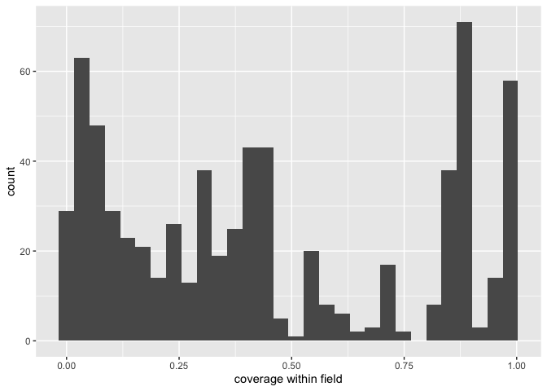
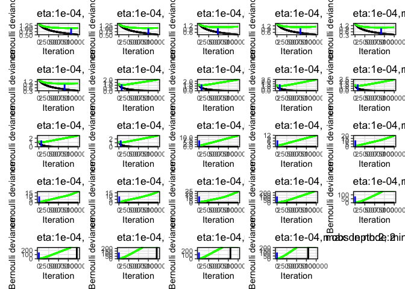

fishbase
================
Han lab
7/27/2020

\#\#\#\#\#install packages

    ## 
    ## Attaching package: 'seqinr'

    ## The following object is masked from 'package:plyr':
    ## 
    ##     count

    ## Loading required package: BiocGenerics

    ## Loading required package: parallel

    ## 
    ## Attaching package: 'BiocGenerics'

    ## The following objects are masked from 'package:parallel':
    ## 
    ##     clusterApply, clusterApplyLB, clusterCall, clusterEvalQ,
    ##     clusterExport, clusterMap, parApply, parCapply, parLapply,
    ##     parLapplyLB, parRapply, parSapply, parSapplyLB

    ## The following objects are masked from 'package:stats':
    ## 
    ##     IQR, mad, sd, var, xtabs

    ## The following objects are masked from 'package:base':
    ## 
    ##     anyDuplicated, append, as.data.frame, basename, cbind, colnames,
    ##     dirname, do.call, duplicated, eval, evalq, Filter, Find, get, grep,
    ##     grepl, intersect, is.unsorted, lapply, Map, mapply, match, mget,
    ##     order, paste, pmax, pmax.int, pmin, pmin.int, Position, rank,
    ##     rbind, Reduce, rownames, sapply, setdiff, sort, table, tapply,
    ##     union, unique, unsplit, which, which.max, which.min

    ## Loading required package: S4Vectors

    ## Loading required package: stats4

    ## 
    ## Attaching package: 'S4Vectors'

    ## The following object is masked from 'package:plyr':
    ## 
    ##     rename

    ## The following object is masked from 'package:base':
    ## 
    ##     expand.grid

    ## Loading required package: IRanges

    ## 
    ## Attaching package: 'IRanges'

    ## The following object is masked from 'package:plyr':
    ## 
    ##     desc

    ## Loading required package: XVector

    ## 
    ## Attaching package: 'XVector'

    ## The following object is masked from 'package:plyr':
    ## 
    ##     compact

    ## 
    ## Attaching package: 'Biostrings'

    ## The following object is masked from 'package:seqinr':
    ## 
    ##     translate

    ## The following object is masked from 'package:base':
    ## 
    ##     strsplit

    ## Loading required package: ape

    ## 
    ## Attaching package: 'ape'

    ## The following object is masked from 'package:Biostrings':
    ## 
    ##     complement

    ## The following objects are masked from 'package:seqinr':
    ## 
    ##     as.alignment, consensus

    ## 
    ## Attaching package: 'phylotools'

    ## The following object is masked from 'package:seqinr':
    ## 
    ##     read.fasta

    ## 
    ## Attaching package: 'data.table'

    ## The following object is masked from 'package:IRanges':
    ## 
    ##     shift

    ## The following objects are masked from 'package:S4Vectors':
    ## 
    ##     first, second

    ## 
    ## Attaching package: 'rfishbase'

    ## The following object is masked from 'package:BiocGenerics':
    ## 
    ##     species

    ## Loading required package: lattice

    ## Loading required package: survival

    ## Loading required package: Formula

    ## 
    ## Attaching package: 'Hmisc'

    ## The following object is masked from 'package:ape':
    ## 
    ##     zoom

    ## The following objects are masked from 'package:Biostrings':
    ## 
    ##     mask, translate

    ## The following object is masked from 'package:seqinr':
    ## 
    ##     translate

    ## The following objects are masked from 'package:plyr':
    ## 
    ##     is.discrete, summarize

    ## The following objects are masked from 'package:base':
    ## 
    ##     format.pval, units

    ## 
    ## Attaching package: 'caret'

    ## The following object is masked from 'package:survival':
    ## 
    ##     cluster

    ## The following object is masked from 'package:seqinr':
    ## 
    ##     dotPlot

    ## 
    ## Attaching package: 'tidyr'

    ## The following object is masked from 'package:S4Vectors':
    ## 
    ##     expand

    ## Loaded gbm 2.1.5

    ## 
    ## Attaching package: 'Matrix'

    ## The following objects are masked from 'package:tidyr':
    ## 
    ##     expand, pack, unpack

    ## The following object is masked from 'package:S4Vectors':
    ## 
    ##     expand

    ## 
    ## Attaching package: 'caTools'

    ## The following object is masked from 'package:IRanges':
    ## 
    ##     runmean

    ## The following object is masked from 'package:S4Vectors':
    ## 
    ##     runmean

    ## 
    ## Attaching package: 'dplyr'

    ## The following objects are masked from 'package:Hmisc':
    ## 
    ##     src, summarize

    ## The following objects are masked from 'package:data.table':
    ## 
    ##     between, first, last

    ## The following objects are masked from 'package:Biostrings':
    ## 
    ##     collapse, intersect, setdiff, setequal, union

    ## The following object is masked from 'package:XVector':
    ## 
    ##     slice

    ## The following objects are masked from 'package:IRanges':
    ## 
    ##     collapse, desc, intersect, setdiff, slice, union

    ## The following objects are masked from 'package:S4Vectors':
    ## 
    ##     first, intersect, rename, setdiff, setequal, union

    ## The following objects are masked from 'package:BiocGenerics':
    ## 
    ##     combine, intersect, setdiff, union

    ## The following object is masked from 'package:seqinr':
    ## 
    ##     count

    ## The following objects are masked from 'package:plyr':
    ## 
    ##     arrange, count, desc, failwith, id, mutate, rename, summarise,
    ##     summarize

    ## The following objects are masked from 'package:stats':
    ## 
    ##     filter, lag

    ## The following objects are masked from 'package:base':
    ## 
    ##     intersect, setdiff, setequal, union

    ## Loading required package: raster

    ## Loading required package: sp

    ## 
    ## Attaching package: 'sp'

    ## The following object is masked from 'package:IRanges':
    ## 
    ##     %over%

    ## 
    ## Attaching package: 'raster'

    ## The following object is masked from 'package:dplyr':
    ## 
    ##     select

    ## The following object is masked from 'package:tidyr':
    ## 
    ##     extract

    ## The following objects are masked from 'package:Hmisc':
    ## 
    ##     mask, zoom

    ## The following object is masked from 'package:data.table':
    ## 
    ##     shift

    ## The following objects are masked from 'package:ape':
    ## 
    ##     rotate, zoom

    ## The following object is masked from 'package:Biostrings':
    ## 
    ##     mask

    ## The following objects are masked from 'package:IRanges':
    ## 
    ##     distance, shift, trim, values, values<-

    ## The following objects are masked from 'package:S4Vectors':
    ## 
    ##     metadata, metadata<-, values, values<-

    ## Loading required package: iterators

    ## Loading required package: snow

    ## 
    ## Attaching package: 'snow'

    ## The following objects are masked from 'package:BiocGenerics':
    ## 
    ##     clusterApply, clusterApplyLB, clusterCall, clusterEvalQ,
    ##     clusterExport, clusterMap, clusterSplit, parApply, parCapply,
    ##     parLapply, parRapply, parSapply

    ## The following objects are masked from 'package:parallel':
    ## 
    ##     clusterApply, clusterApplyLB, clusterCall, clusterEvalQ,
    ##     clusterExport, clusterMap, clusterSplit, makeCluster, parApply,
    ##     parCapply, parLapply, parRapply, parSapply, splitIndices,
    ##     stopCluster

    ## Warning: package 'rsample' was built under R version 4.0.2

    ## 
    ## Attaching package: 'rsample'

    ## The following object is masked from 'package:ape':
    ## 
    ##     complement

    ## The following object is masked from 'package:Biostrings':
    ## 
    ##     complement

    ## Warning: package 'tidyverse' was built under R version 4.0.2

    ## ── Attaching packages ────────────────────────────────────────────────────────────────────────────── tidyverse 1.3.0 ──

    ## ✓ tibble  3.0.1     ✓ purrr   0.3.4
    ## ✓ readr   1.3.1     ✓ forcats 0.5.0

    ## ── Conflicts ───────────────────────────────────────────────────────────────────────────────── tidyverse_conflicts() ──
    ## x purrr::accumulate()      masks foreach::accumulate()
    ## x dplyr::arrange()         masks plyr::arrange()
    ## x dplyr::between()         masks data.table::between()
    ## x dplyr::collapse()        masks Biostrings::collapse(), IRanges::collapse()
    ## x dplyr::combine()         masks BiocGenerics::combine()
    ## x purrr::compact()         masks XVector::compact(), plyr::compact()
    ## x dplyr::count()           masks seqinr::count(), plyr::count()
    ## x dplyr::desc()            masks IRanges::desc(), plyr::desc()
    ## x Matrix::expand()         masks tidyr::expand(), S4Vectors::expand()
    ## x raster::extract()        masks tidyr::extract()
    ## x dplyr::failwith()        masks plyr::failwith()
    ## x dplyr::filter()          masks stats::filter()
    ## x dplyr::first()           masks data.table::first(), S4Vectors::first()
    ## x dplyr::id()              masks plyr::id()
    ## x dplyr::lag()             masks stats::lag()
    ## x dplyr::last()            masks data.table::last()
    ## x purrr::lift()            masks caret::lift()
    ## x dplyr::mutate()          masks plyr::mutate()
    ## x Matrix::pack()           masks tidyr::pack()
    ## x purrr::partial()         masks pdp::partial()
    ## x BiocGenerics::Position() masks ggplot2::Position(), base::Position()
    ## x purrr::reduce()          masks IRanges::reduce()
    ## x dplyr::rename()          masks S4Vectors::rename(), plyr::rename()
    ## x raster::select()         masks dplyr::select()
    ## x dplyr::slice()           masks XVector::slice(), IRanges::slice()
    ## x dplyr::src()             masks Hmisc::src()
    ## x dplyr::summarise()       masks plyr::summarise()
    ## x dplyr::summarize()       masks Hmisc::summarize(), plyr::summarize()
    ## x purrr::transpose()       masks data.table::transpose()
    ## x Matrix::unpack()         masks tidyr::unpack()
    ## x purrr::when()            masks foreach::when()

    ## Warning: package 'sf' was built under R version 4.0.2

    ## Linking to GEOS 3.8.1, GDAL 3.1.1, PROJ 6.3.1

    ## Warning: package 'mapview' was built under R version 4.0.2

    ## Warning: package 'rnaturalearth' was built under R version 4.0.2

    ## 
    ## Attaching package: 'fasterize'

    ## The following object is masked from 'package:graphics':
    ## 
    ##     plot

    ## The following object is masked from 'package:base':
    ## 
    ##     plot

    ## Warning: package 'patchwork' was built under R version 4.0.2

    ## 
    ## Attaching package: 'patchwork'

    ## The following object is masked from 'package:raster':
    ## 
    ##     area

    ## 
    ## Attaching package: 'magrittr'

    ## The following object is masked from 'package:purrr':
    ## 
    ##     set_names

    ## The following object is masked from 'package:raster':
    ## 
    ##     extract

    ## The following object is masked from 'package:tidyr':
    ## 
    ##     extract

\#\#function to take the same across rows of categorical variables that
have been 1/0 encoded, where a species may have 1 for more than one
condition of a variable

\#\#function to replace NAs with real values for binary fields

\#\#settings

\#\#look at docs about tables available from fishbase

\#\#read in data and fix species names

\#\#distribution \#\#currently this is ~ FAO areas table (minus “note”
field) e.g. <http://www.fishbase.us/Country/FaoAreaList.php?ID=5537>
\#\#each species may have multiple bounding boxes

Read in the FAO areas (from
<http://www.fao.org/geonetwork/srv/en/main.home?uuid=ac02a460-da52-11dc-9d70-0017f293bd28>
as described by
<http://www.fishbase.us/manual/English/FishbaseThe_FAOAREAS_Table.htm>).
It looks like our data contain both the inland and marine FAOs, so I
read in both and combined them according to a single column of FAO code.

\#\#check out some tables in fishbase \#\#brains: one entry for each
individual fish: BrainWeight, BodyWeight
\#\#<https://www.fishbase.in/manual/fishbasethe_brains_table.htm>

\#\#country: multiple rows per species; for
example:

## countrysub – multiple rows per species

\#\#<https://www.fishbase.de/manual/english/FishBaseThe_Countries_Table.htm>

\#\#get ecology data
\#\#<http://fishbase.us/manual/English/FishbaseThe_ECOLOGY_Table.htm>

\#\#distribution \#\#currently this is ~ FAO areas table (minus “note”
field) e.g. <http://www.fishbase.us/Country/FaoAreaList.php?ID=5537>
\#\#each species may have multiple bounding boxes

\#\#ecosystem – couldn’t find description of this online \#\#multiple
rows per species, one for each ecosystem

\#\#estimate: a table of estimates from some models on trophic levels
\#\#<http://www.fishbase.us/manual/English/FishbaseThe_FOOD_ITEMS_table.htm>

\#\#faoareas, seems to be redundant to countrysub?

\#\#fecundity \#\#sometimes multiple rows per species. could not
\#\#could not locate doc table about fecundity. spawning table seems to
be something different (different fields):
<https://www.fishbase.in/manual/fishbasethe_spawning_table.htm>

\#\#fooditems – including this one
\#\#<http://www.fishbase.org/manual/english/fishbasethe_food_items_table.htm>
\#\#multiple rows per species, for different food types, life stages of
predator, locality, etc.

\#\#genetic – don’t think we want to use this, but including just to see
what it shows

\#\#introductions – species introductions data. for now making one new
feature: the number of records about introductions; it seems that each
row is a different place
\#\#<https://www.fishbase.in/manual/fishbasethe_introduction_table.htm>

\#\#larvae
\#\#<https://www.fishbase.in/manual/fishbasethe_larvae_table.htm> \#\#2
out of the 74 species have multiple records w/ different values.
excluding for now.

\#\#length\_freq; multiple records for some species; excluding for now;
could not find metadata

\#\#length\_length: conversion of length types

\#\#length\_weight: The LENGTH-WEIGHT table presents the a and b values
of over 5,000 length-weight relationships of the form W = a x Lb,
pertaining to about over 2,000 fish species. \#\#multiple records for
some species. \#\#seems like this may only be useful in combination with
length\_length
\#\#<https://www.fishbase.de/manual/FishbaseThe_LENGTH_WEIGHT_Table.htm>

\#\#maturity \#\#multiple records for some species, would need to take
averages if we wanted to use. there are multiple measures of maturity to
choose from.
\#\#<https://www.fishbase.in/manual/fishbasethe_maturity_table.htm>

\#\#morphology
\#\#<https://www.fishbase.in/manual/fishbasethe_morphology_table.htm>
\#\#there are multiple records for some species.

\#\#morphometrics \#\#there are multiple records for some species; to
include we would need to take averages \#\#exclude for now because
couldn’t find documentation

\#\#oxygen
\#\#<https://www.fishbase.in/manual/fishbasethe_oxygen_table.htm>
\#\#there are multiple records for some species (e.g. for different
sexes); to include we would need to take averages \#\#include along with
potentially influencing variables – e.g. salinity, temp, swimming speed,
etc.

\#\#popchar: Table of maximum length (Lmax), weight (Wmax) and age
(tmax)
\#\#<https://www.fishbase.in/manual/fishbasethe_popchar_table.htm>
\#\#there are multiple records for some species; to include we would
need to take averages \#\#

\#\#popgrowth
\#\#<https://www.fishbase.in/manual/fishbasethe_popgrowth_table.htm>
\#\#multiple records for some species, e.g. for different sexes;

\#\#popqb
\#\#<https://www.fishbase.se/manual/english/fishbasethe_popqb_table.htm>
\#\#population-based estimates of food consumption (i.e., estimates that
account for the age structure of populations) \#\#multiple responses for
some species. here there are two measures, popqb and maintenance qb.

\#\#predators
\#\#<https://www.fishbase.se/manual/English/fishbasethe_predators_table.htm>

\#\#ration \#\#�ration� (Rd) pertains to an estimate of daily food
consumption by fish of a specific size
\#\#<https://www.fishbase.in/manual/fishbasethe_ration_table.htm>
\#\#multiple rows for some species

\#\#reproduction
\#\#<https://www.fishbase.in/manual/fishbasethe_reproduction_table.htm>
\#\#only one row per species for these HADDOCK species; adding these
fields

\#\#spawning
\#\#<https://www.fishbase.in/manual/fishbasethe_spawning_table.htm>
\#\#multiple rows per species, for different localities

\#\#speed
\#\#<https://www.fishbase.se/manual/English/PDF/FB_Book_ATorres_Swimming_Speed_RF_JG.pdf>
\#\#<https://www.fishbase.in/manual/fishbasethe_swimming_and_speed_tables.htm>
\#\#multiple records for some species

\#\#stocks
\#\#<https://www.fishbase.in/manual/fishbasethe_stocks_table.htm>
\#\#multiple records for some species, one for each stock

\#\#diet \#\#<https://www.fishbase.in/manual/fishbasethe_diet_table.htm>
\#\#has multiple rows for different stages

\#\#diet\_items – multiple rows per species. seems to be linked with
DietCode to diet table
\#\#<https://www.fishbase.se/manual/English/fishbasethe_food_items_table.htm>

\#\#swimming
\#\#<https://www.fishbase.in/manual/fishbasethe_swimming_and_speed_tables.htm>
\#\#one record per species

\#\#see what coverage is

``` r
load("out.Rdata")
save(out, file = "out_allfields.Rdata")
df = out
name_ct = length(names(df))
row_ct = dim(df)[1]
non_na_frac = rep(NA, name_ct)
for (a in 1:name_ct){
  non_na_frac[a]= length(which(!is.na(df[,a])))/ row_ct  
}
  

ok_cols = which(non_na_frac > cutoff)
DF_fields = data.frame(field = names(df),
                       non_na_frac = non_na_frac)
i = sort.int(DF_fields$non_na_frac,  index.return = TRUE, decreasing = TRUE)

DF_fields = DF_fields[i$ix,]
DF_fields
```

    ##                                                                 field
    ## 1                                                             Species
    ## 7                                         record_count_species_brains
    ## 8                                                          range_area
    ## 104                                      record_count_species_ecology
    ## 106                                                Shelf_distribution
    ## 108                                            SpecSport_distribution
    ## 109                                        Statusendemic_distribution
    ## 110                                     Statusintroduced_distribution
    ## 111                                         Statusnative_distribution
    ## 112                                   Statusquestionable_distribution
    ## 123                                 record_count_species_distribution
    ## 124                                              MaxLengthTL_estimate
    ## 125                                               TLObserved_estimate
    ## 126                                                    Troph_estimate
    ## 127                                                  seTroph_estimate
    ## 128                                            TrophObserved_estimate
    ## 141                                        ComDepMinObserved_estimate
    ## 142                                        ComDepMaxObserved_estimate
    ## 145                                         DepthMinEstimate_estimate
    ## 146                                         DepthMaxEstimate_estimate
    ## 147                                         PredPreyRatioMin_estimate
    ## 148                                         PredPreyRatioMax_estimate
    ## 154                                              MaxLengthSL_estimate
    ## 155                                                KObserved_estimate
    ## 156                                     record_count_species_estimate
    ## 178                                    record_count_species_fecundity
    ## 196                                    record_count_species_fooditems
    ## 274                                record_count_species_introductions
    ## 288                                record_count_species_length_weight
    ## 424                                   record_count_species_morphology
    ## 445                                       record_count_species_oxygen
    ## 449                                      record_count_species_popchar
    ## 481                                    record_count_species_popgrowth
    ## 493                                        record_count_species_popqb
    ## 516                                    record_count_species_predators
    ## 527                                       record_count_species_ration
    ## 561                                 record_count_species_reproduction
    ## 603                                     record_count_species_spawning
    ## 612                                        record_count_species_speed
    ## 626                                                 Morphology_stocks
    ## 627                                                   Diseases_stocks
    ## 628                                               LengthWeight_stocks
    ## 629                                                Aquaculture_stocks
    ## 630                                            LengthRelations_stocks
    ## 631                                            LengthFrequency_stocks
    ## 632                                                     Sounds_stocks
    ## 633                                                 Broodstock_stocks
    ## 634                                                 EggNursery_stocks
    ## 635                                                 FryNursery_stocks
    ## 636                                              LarvalNursery_stocks
    ## 645                                              EnvTempboreal_stocks
    ## 646                                               EnvTemppolar_stocks
    ## 647                                         EnvTempsubtropical_stocks
    ## 648                                           EnvTemptemperate_stocks
    ## 649                                            EnvTemptropical_stocks
    ## 653                                       record_count_species_stocks
    ## 677                                         record_count_species_diet
    ## 690                                     record_count_species_swimming
    ## 113                                   ContinentGrpafrica_distribution
    ## 114                                     ContinentGrpasia_distribution
    ## 115                           ContinentGrpatlantic.ocean_distribution
    ## 116                        ContinentGrpeurope..form.ussr_distribution
    ## 117                             ContinentGrpindian.ocean_distribution
    ## 118                            ContinentGrpmed.black.sea_distribution
    ## 119                      ContinentGrpnorth.centr.america_distribution
    ## 120                                  ContinentGrpoceania_distribution
    ## 121                            ContinentGrppacific.ocean_distribution
    ## 122                            ContinentGrpsouth.america_distribution
    ## 129                                                        a_estimate
    ## 130                                                sd_log10a_estimate
    ## 131                                                        b_estimate
    ## 132                                                     sd_b_estimate
    ## 650                                             Resiliencehigh_stocks
    ## 651                                              Resiliencelow_stocks
    ## 652                                           Resiliencemedium_stocks
    ## 528                                             SpawnAgg_reproduction
    ## 529                                         BatchSpawner_reproduction
    ## 532                                    ReproModedioecism_reproduction
    ## 533                             ReproModeparthenogenesis_reproduction
    ## 534                                   ReproModeprotandry_reproduction
    ## 535                                   ReproModeprotogyny_reproduction
    ## 536                        ReproModetrue.hermaphroditism_reproduction
    ## 537                                Fertilizationexternal_reproduction
    ## 538     Fertilizationin.brood.pouch.or.similar.structure_reproduction
    ## 539                                Fertilizationin.mouth_reproduction
    ## 540                      Fertilizationinternal..oviduct._reproduction
    ## 541                                   Fertilizationother_reproduction
    ## 37                                                    Neritic_ecology
    ## 38                                                 Intertidal_ecology
    ## 39                                                Hadopelagic_ecology
    ## 40                                                  Estuaries_ecology
    ## 41                                                     Stream_ecology
    ## 42                                                      Lakes_ecology
    ## 43                                                  Schooling_ecology
    ## 44                                                  TidePools_ecology
    ## 45                                                SubLittoral_ecology
    ## 46                                               Bathypelagic_ecology
    ## 47                                              Abyssopelagic_ecology
    ## 48                                             CaveAnchialine_ecology
    ## 55                                                 Parasitism_ecology
    ## 56                                                  Symbiosis_ecology
    ## 57                                                 Symphorism_ecology
    ## 58                                               Commensalism_ecology
    ## 59                                                  Mutualism_ecology
    ## 60                                                  Epiphytic_ecology
    ## 61                                                OutsideHost_ecology
    ## 62                                                 InsideHost_ecology
    ## 63                                                    Sessile_ecology
    ## 64                                                   Demersal_ecology
    ## 65                                                  Endofauna_ecology
    ## 66                                                    Pelagic_ecology
    ## 67                                                Megabenthos_ecology
    ## 68                                               Macrobenthos_ecology
    ## 69                                                Meiobenthos_ecology
    ## 70                                                     Coarse_ecology
    ## 71                                                       Fine_ecology
    ## 72                                                    Sloping_ecology
    ## 73                                                       Silt_ecology
    ## 74                                                       Ooze_ecology
    ## 75                                                   Detritus_ecology
    ## 76                                                    Organic_ecology
    ## 77                                                     Gravel_ecology
    ## 78                                                BedsBivalve_ecology
    ## 79                                                   BedsRock_ecology
    ## 80                                                 BedsOthers_ecology
    ## 81                                              ReefExclusive_ecology
    ## 82                                                   DropOffs_ecology
    ## 83                                                    Tunnels_ecology
    ## 84                                                   Crevices_ecology
    ## 85                                                      Vents_ecology
    ## 86                                                  Seamounts_ecology
    ## 87                                            DeepWaterCorals_ecology
    ## 88                                                     Leaves_ecology
    ## 89                                                      Roots_ecology
    ## 90                                                  Driftwood_ecology
    ## 91                                            OInverterbrates_ecology
    ## 92                                               Verterbrates_ecology
    ## 93                                                    Pilings_ecology
    ## 94                                                  BoatHulls_ecology
    ## 95                                                     Corals_ecology
    ## 96                                                 SoftCorals_ecology
    ## 97                                                    OnPolyp_ecology
    ## 98                                              BetweenPolyps_ecology
    ## 99                                                 HardCorals_ecology
    ## 100                                             OnExoskeleton_ecology
    ## 101                                        InterstitialSpaces_ecology
    ## 137                                                        K_estimate
    ## 550                                     RepGuild1bearers_reproduction
    ## 551                                    RepGuild1guarders_reproduction
    ## 552                                 RepGuild1nonguarders_reproduction
    ## 9                                           SupraLittoralZone_ecology
    ## 10                                                Saltmarshes_ecology
    ## 11                                               LittoralZone_ecology
    ## 12                                                      Caves_ecology
    ## 13                                                    Oceanic_ecology
    ## 14                                                 Epipelagic_ecology
    ## 15                                                Mesopelagic_ecology
    ## 16                                                  Mangroves_ecology
    ## 17                                              MarshesSwamps_ecology
    ## 18                                                       Cave_ecology
    ## 19                                                   Solitary_ecology
    ## 20                                                   Shoaling_ecology
    ## 21                                                    Benthic_ecology
    ## 22                                                     Mobile_ecology
    ## 23                                                 SoftBottom_ecology
    ## 24                                                       Sand_ecology
    ## 25                                                        Mud_ecology
    ## 26                                                 HardBottom_ecology
    ## 27                                                      Rocky_ecology
    ## 28                                                     Rubble_ecology
    ## 29                                                 Macrophyte_ecology
    ## 30                                               SeaGrassBeds_ecology
    ## 31                                                 CoralReefs_ecology
    ## 32                                                  ReefFlats_ecology
    ## 33                                                    Lagoons_ecology
    ## 34                                                    Burrows_ecology
    ## 35                                                 Vegetation_ecology
    ## 36                                                      Stems_ecology
    ## 290                                                Females_morphology
    ## 291                                                  Males_morphology
    ## 292                                       OperculumPresent_morphology
    ## 293                                          LLinterrupted_morphology
    ## 613                                               Northernmost_stocks
    ## 614                                                Southermost_stocks
    ## 53                                                  FoodTroph_ecology
    ## 54                                                FoodSeTroph_ecology
    ## 289                                                Notched_morphology
    ## 353                                     BodyShapeIeel.like_morphology
    ## 354                                    BodyShapeIelongated_morphology
    ## 355                            BodyShapeIfusiform...normal_morphology
    ## 356                                        BodyShapeIother_morphology
    ## 357                          BodyShapeIshort.and...or.deep_morphology
    ## 105                                            Coastline_distribution
    ## 107                                              EEZarea_distribution
    ## 179                                           FoodIdetritus_fooditems
    ## 180                                             FoodInekton_fooditems
    ## 181                                             FoodIothers_fooditems
    ## 182                                             FoodIplants_fooditems
    ## 183                                         FoodIzoobenthos_fooditems
    ## 184                                        FoodIzooplankton_fooditems
    ## 185                                         PreyStageadults_fooditems
    ## 186                                           PreyStageeggs_fooditems
    ## 187                                   PreyStagefruits.seeds_fooditems
    ## 188                                    PreyStagejuv..adults_fooditems
    ## 189                                         PreyStagelarvae_fooditems
    ## 190                                  PreyStageleaves.blades_fooditems
    ## 191                                    PreyStagen.a..others_fooditems
    ## 192                                         PreyStagenymphs_fooditems
    ## 193                                          PreyStagepupae_fooditems
    ## 194                                  PreyStagerecruits.juv._fooditems
    ## 195                                          PreyStageroots_fooditems
    ## 315                                                 Dfinno_morphology
    ## 277                                                   a_length_weight
    ## 279                                                   b_length_weight
    ## 617                                                    TempMin_stocks
    ## 618                                                    TempMax_stocks
    ## 531                                        ParentalCareQ_reproduction
    ## 553                               ParentalCarebiparental_reproduction
    ## 554                                 ParentalCarematernal_reproduction
    ## 555                                     ParentalCarenone_reproduction
    ## 556                                 ParentalCarepaternal_reproduction
    ## 447                                                      Lmax_popchar
    ## 143                                                 DepthMin_estimate
    ## 280                                  CoeffDetermination_length_weight
    ## 324                                                 Afinno_morphology
    ## 413                               PectoralAttributesabsent_morphology
    ## 414                  PectoralAttributesmore.or.less.normal_morphology
    ## 415           PectoralAttributestransformed.to..aerofoils._morphology
    ## 416                  PectoralAttributesused.for.locomotion_morphology
    ## 417               PectoralAttributesvery.large...lobe.like_morphology
    ## 316                                        DorsalSpinesMin_morphology
    ## 317                                        DorsalSpinesMax_morphology
    ## 318                                      DorsalSoftRaysMin_morphology
    ## 319                                      DorsalSoftRaysMax_morphology
    ## 406                                                 Adifin_morphology
    ## 407                                           CShapeforked_morphology
    ## 408                            CShapemore.or.less.truncate_morphology
    ## 409                               CShapeother..see.remark._morphology
    ## 410                                          CShapepointed_morphology
    ## 418                   PelvicsAttributesmore.or.less.normal_morphology
    ## 419                     PelvicsAttributessuppressed.absent_morphology
    ## 327                                                Araymin_morphology
    ## 420                                     VPositionabdominal_morphology
    ## 421                                        VPositionabsent_morphology
    ## 422                                       VPositionjugular_morphology
    ## 423                                      VPositionthoracic_morphology
    ## 562                                                      GSI_spawning
    ## 563                                           PercentFemales_spawning
    ## 615                                                Westernmost_stocks
    ## 616                                                Easternmost_stocks
    ## 328                                                Araymax_morphology
    ## 140                                              ComDepthMax_estimate
    ## 144                                                 DepthMax_estimate
    ## 451                                                LinfLmax_popgrowth
    ## 452                                                     Loo_popgrowth
    ## 456                                                       K_popgrowth
    ## 139                                              ComDepthMin_estimate
    ## 157                                            FecundityMin_fecundity
    ## 197                                           EstabAqua_introductions
    ## 198                                            Invasive_introductions
    ## 201                                  Period18th.century_introductions
    ## 202                                     Period1900.1924_introductions
    ## 203                                     Period1925.1949_introductions
    ## 204                                     Period1950.1974_introductions
    ## 205                                     Period1975.1999_introductions
    ## 206                                  Period19th.century_introductions
    ## 207                                  Period2000.present_introductions
    ## 208                              Periodpre.18th.century_introductions
    ## 209                                       Periodunknown_introductions
    ## 325                                       AnalFinSpinesMin_morphology
    ## 326                                       AnalFinSpinesMax_morphology
    ## 149                                                   AgeMin_estimate
    ## 210                                    Reasonaccidental_introductions
    ## 211                         Reasonaccidental.with.ships_introductions
    ## 212                                 Reasonangling.sport_introductions
    ## 213                                   Reasonaquaculture_introductions
    ## 214                 Reasondiffused.from.other.countries_introductions
    ## 215                         Reasonfill.ecological.niche_introductions
    ## 216                                     Reasonfisheries_introductions
    ## 217                                        Reasonforage_introductions
    ## 218                          Reasonlessepsian.migration_introductions
    ## 219                              Reasonmosquito.control_introductions
    ## 220                                       Reasonno.data_introductions
    ## 221                                    Reasonornamental_introductions
    ## 222                    Reasonremoval.of.natural.barrier_introductions
    ## 223                                      Reasonresearch_introductions
    ## 224                                       Reasonunknown_introductions
    ## 240                                Estabwildestablished_introductions
    ## 241                                         Estabwildno_introductions
    ## 242                                    Estabwildno.data_introductions
    ## 243                            Estabwildnot.established_introductions
    ## 244                       Estabwildprobably.established_introductions
    ## 245                                Estabwildprobably.no_introductions
    ## 246                   Estabwildprobably.not.established_introductions
    ## 247                               Estabwildprobably.yes_introductions
    ## 248                                    Estabwildunknown_introductions
    ## 249                                        Estabwildyes_introductions
    ## 329                                                Praymin_morphology
    ## 330                                                Praymax_morphology
    ## 160                                            FecundityMax_fecundity
    ## 284                                                LCLa_length_weight
    ## 285                                                UCLa_length_weight
    ## 286                                                LCLb_length_weight
    ## 287                                                UCLb_length_weight
    ## 411                                    Attributesconfluent_morphology
    ## 412                          Attributesmore.or.less.normal_morphology
    ## 494                                                  predator_mammals
    ## 499                                       Predatstageadults_predators
    ## 500                                  Predatstagejuv..adults_predators
    ## 501                                       Predatstagelarvae_predators
    ## 502                                Predatstagerecruits.juv._predators
    ## 503                                          PredatorIbirds_predators
    ## 504                                    PredatorIcrustaceans_predators
    ## 505                                        PredatorIfinfish_predators
    ## 506                                          PredatorIherps_predators
    ## 507                                        PredatorIinsects_predators
    ## 508                                        PredatorImammals_predators
    ## 509                                       PredatorImollusks_predators
    ## 510                                          PredatorIother_predators
    ## 511                                         PreyStageadults_predators
    ## 512                                           PreyStageeggs_predators
    ## 513                                    PreyStagejuv..adults_predators
    ## 514                                         PreyStagelarvae_predators
    ## 515                                  PreyStagerecruits.juv._predators
    ## 654                                                      January_diet
    ## 655                                                     February_diet
    ## 656                                                        March_diet
    ## 657                                                        April_diet
    ## 658                                                          May_diet
    ## 659                                                         June_diet
    ## 660                                                         July_diet
    ## 661                                                       August_diet
    ## 662                                                    September_diet
    ## 663                                                      October_diet
    ## 664                                                     November_diet
    ## 665                                                     December_diet
    ## 668                                                        Troph_diet
    ## 669                                                      seTroph_diet
    ## 673                                            SampleStageadults_diet
    ## 674                                       SampleStagejuv..adults_diet
    ## 675                                            SampleStagelarvae_diet
    ## 676                                     SampleStagerecruits.juv._diet
    ## 321                                            DFinletsmax_morphology
    ## 323                                            VFinletsmax_morphology
    ## 425                                                     Weight_oxygen
    ## 426                                                       Temp_oxygen
    ## 430                                                 OxygenCons_oxygen
    ## 455                                              TLinfinity_popgrowth
    ## 672                                                   FishLength_diet
    ## 150                                                   AgeMax_estimate
    ## 151                                              TempPrefMin_estimate
    ## 152                                             TempPrefMean_estimate
    ## 153                                              TempPrefMax_estimate
    ## 278                                                 aTL_length_weight
    ## 400             DorsalAttributescontinuous.with.caudal.fin_morphology
    ## 401 DorsalAttributesextending.over.most.of.the.back.length_morphology
    ## 402              DorsalAttributesgreatly.reduced.or.absent_morphology
    ## 403               DorsalAttributesmodified.to.suction.disc_morphology
    ## 404                 DorsalAttributesno.striking.attributes_morphology
    ## 405                                  DorsalAttributesother_morphology
    ## 567                                                      Apr_spawning
    ## 138                                                     Winf_estimate
    ## 320                                            DFinletsmin_morphology
    ## 322                                            VFinletsmin_morphology
    ## 478                                             Temperature_popgrowth
    ## 568                                                      May_spawning
    ## 569                                                      Jun_spawning
    ## 361                        PosofMouthsub.terminal.inferior_morphology
    ## 362                                     PosofMouthsuperior_morphology
    ## 363                                     PosofMouthterminal_morphology
    ## 49                                                  DietTroph_ecology
    ## 332                                                Vraymin_morphology
    ## 333                                                Vraymax_morphology
    ## 348                                   StrikingFeaturesnone_morphology
    ## 349                  StrikingFeaturesother..see.diagnosis._morphology
    ## 350                          StrikingFeaturesstriking.eyes_morphology
    ## 351                          StrikingFeaturesstriking.fins_morphology
    ## 352                 StrikingFeaturesstriking.shape.of.body_morphology
    ## 546                     Spawningno.obvious.seasonal.peak_reproduction
    ## 547                           Spawningonce.in.a.lifetime_reproduction
    ## 548             Spawningone.clear.seasonal.peak.per.year_reproduction
    ## 549        Spawningthroughout.the.year..but.peaking.once_reproduction
    ## 566                                                      Mar_spawning
    ## 666                                                   OtherItems_diet
    ## 670                                                      SizeMin_diet
    ## 671                                                      SizeMax_diet
    ## 51                                                    DietTLu_ecology
    ## 52                                                  DietseTLu_ecology
    ## 331                                                Vspines_morphology
    ## 432                                       AppliedStressfeeding_oxygen
    ## 433                                       AppliedStresshigh.ph_oxygen
    ## 434                                   AppliedStresshypercapnia_oxygen
    ## 435                                       AppliedStresshypoxia_oxygen
    ## 436                                        AppliedStresslow.ph_oxygen
    ## 437                                AppliedStressnone.specified_oxygen
    ## 438                                         AppliedStressother_oxygen
    ## 439                                  AppliedStressother.stress_oxygen
    ## 440                                   AppliedStressphotoperiod_oxygen
    ## 441                                      AppliedStresssalinity_oxygen
    ## 442                                      AppliedStresssedative_oxygen
    ## 443                                   AppliedStresstemperature_oxygen
    ## 444                                        AppliedStresstoxins_oxygen
    ## 2                                                   BodyWeight_brains
    ## 3                                                     EncCoeff_brains
    ## 358                                Foreheadclearly.concave_morphology
    ## 359                                 Foreheadclearly.convex_morphology
    ## 360                          Foreheadmore.or.less.straight_morphology
    ## 446                                                      Wmax_popchar
    ## 578                                             FecundityMin_spawning
    ## 427                                                   Salinity_oxygen
    ## 448                                                      tmax_popchar
    ## 466                                              LogKLogLoo_popgrowth
    ## 581                                             FecundityMax_spawning
    ## 679             AdultTypemovements.of.body.and.or.caudal.fin_swimming
    ## 680          AdultTypeoscillation.of.median.or.pectoral.fins_swimming
    ## 681           AdultTypeundulation.of.median.or.pectoral.fins_swimming
    ## 682                                    AdultModeanguilliform_swimming
    ## 683                                     AdultModebalistiform_swimming
    ## 684                                     AdultModecarangiform_swimming
    ## 685                                    AdultModediodontiform_swimming
    ## 686                                     AdultModegymnotiform_swimming
    ## 687                                       AdultModelabriform_swimming
    ## 688                                        AdultModerajiform_swimming
    ## 689                                  AdultModesubcarangiform_swimming
    ## 50                                                DietSeTroph_ecology
    ## 200                                            RangeMax_introductions
    ## 275                                           LengthMin_length_weight
    ## 276                                           LengthMax_length_weight
    ## 570                                                      Jul_spawning
    ## 199                                            RangeMin_introductions
    ## 382                                          HorStripesTTI_morphology
    ## 383                                    VerStripesTTIabsent_morphology
    ## 384                                   VerStripesTTIpresent_morphology
    ## 385                                          DiaStripesTTI_morphology
    ## 386                                          CurStripesTTI_morphology
    ## 573                                                      Oct_spawning
    ## 623                                                      pHMax_stocks
    ## 307                                              BarbelsNo_morphology
    ## 393                 CaudalFinImore.than.one.spot.or.stripe_morphology
    ## 394                          CaudalFinIno.spots.or.stripes_morphology
    ## 395                           CaudalFinIone.spot.or.stripe_morphology
    ## 465                                               Winfinity_popgrowth
    ## 497                                             PredatTroph_predators
    ## 498                                           PredatseTroph_predators
    ## 565                                                      Feb_spawning
    ## 572                                                      Sep_spawning
    ## 574                                                      Nov_spawning
    ## 622                                                      pHMin_stocks
    ## 625                                                      dHMax_stocks
    ## 387                             SpotsTTImore.than.one.spot_morphology
    ## 388                                       SpotsTTIno.spots_morphology
    ## 389                                  SpotsTTIone.spot.only_morphology
    ## 396                   AnalFinImore.than.one.spot.or.stripe_morphology
    ## 397                            AnalFinIno.spots.or.stripes_morphology
    ## 398                             AnalFinIone.spot.or.stripe_morphology
    ## 428                                                     Oxygen_oxygen
    ## 467                                                       b_popgrowth
    ## 571                                                      Aug_spawning
    ## 390                 DorsalFinImore.than.one.spot.or.stripe_morphology
    ## 391                          DorsalFinIno.spots.or.stripes_morphology
    ## 392                           DorsalFinIone.spot.or.stripe_morphology
    ## 469                                                    tmax_popgrowth
    ## 667                                                 PercentEmpty_diet
    ## 177                                          SpawningCycles_fecundity
    ## 542                                 MatingSystemmonogamy_reproduction
    ## 543                                MatingSystempolyandry_reproduction
    ## 544                                 MatingSystempolygyny_reproduction
    ## 545                              MatingSystempromiscuity_reproduction
    ## 575                                                      Dec_spawning
    ## 598                                    SpawningGroundcoastal_spawning
    ## 599                                  SpawningGroundestuarine_spawning
    ## 600                                 SpawningGroundlacustrine_spawning
    ## 601                                   SpawningGroundriverine_spawning
    ## 602                                      SpawningGroundshelf_spawning
    ## 624                                                      dHMin_stocks
    ## 380                                           Scutesabsent_morphology
    ## 381                                      Scutesalong.belly_morphology
    ## 282                                                 SEb_length_weight
    ## 309                                       GillRakersLowMin_morphology
    ## 310                                       GillRakersLowMax_morphology
    ## 429                                                  Oxygenmgl_oxygen
    ## 471                                                       M_popgrowth
    ## 530                                        MatingQuality_reproduction
    ## 557                                      RepAquariumhigh_reproduction
    ## 558                                       RepAquariumlow_reproduction
    ## 559                                    RepAquariummedium_reproduction
    ## 560                              RepAquariumnever.rarely_reproduction
    ## 564                                                      Jan_spawning
    ## 576                                                  TempLow_spawning
    ## 577                                                 TempHigh_spawning
    ## 584                                           SpawningCycles_spawning
    ## 619                                              TempPreferred_stocks
    ## 298                                                  Keels_morphology
    ## 313                                     GillRakersTotalMin_morphology
    ## 314                                     GillRakersTotalMax_morphology
    ## 472                                                      Lm_popgrowth
    ## 620                                                 TempPref50_stocks
    ## 621                                                 TempPref75_stocks
    ## 364                                    MandibleTeethabsent_morphology
    ## 365                                   MandibleTeethpresent_morphology
    ## 370                                     MaxillaTeethabsent_morphology
    ## 371                                    MaxillaTeethpresent_morphology
    ## 159                                          LengthFecunMin_fecundity
    ## 162                                          LengthFecunMax_fecundity
    ## 301                                      ScaleRowsAboveMin_morphology
    ## 302                                      ScaleRowsAboveMax_morphology
    ## 311                                        GillRakersUpMin_morphology
    ## 312                                        GillRakersUpMax_morphology
    ## 482                                                       PopQB_popqb
    ## 484                                                        Winf_popqb
    ## 485                                                           K_popqb
    ## 487                                                 Temperature_popqb
    ## 167                                               LengthMin_fecundity
    ## 168                                               LengthMax_fecundity
    ## 473                                                   LmLoo_popgrowth
    ## 490                                            Salinitybrackish_popqb
    ## 491                                          Salinityfreshwater_popqb
    ## 492                                            Salinityseawater_popqb
    ## 580                                           LengthFecunMin_spawning
    ## 583                                           LengthFecunMax_spawning
    ## 678                                              AspectRatio_swimming
    ## 5                                                           SL_brains
    ## 133                                                  prior_r_estimate
    ## 134                                                    lcl_r_estimate
    ## 135                                                    ucl_r_estimate
    ## 136                                                      n_r_estimate
    ## 164                                         RelFecundityMin_fecundity
    ## 303                                      ScaleRowsBelowMin_morphology
    ## 304                                      ScaleRowsBelowMax_morphology
    ## 4                                                     EncIndex_brains
    ## 6                                                           TL_brains
    ## 169                                                       a_fecundity
    ## 170                                                       b_fecundity
    ## 281                                                 SEa_length_weight
    ## 375                                          VomerineTeeth_morphology
    ## 488                                                   Mortality_popqb
    ## 489                                                           b_popqb
    ## 495                                                   DietP_predators
    ## 496                                               MaxLength_predators
    ## 591                                                LengthMin_spawning
    ## 592                                                LengthMax_spawning
    ## 595                                                CorrCoeff_spawning
    ## 637                                        IUCN_Assessmenta1bd_stocks
    ## 638                      IUCN_Assessmenta1ce.2ce..b1.2abc..c2a_stocks
    ## 639                                       IUCN_Assessmenta2ace_stocks
    ## 640                                         IUCN_Assessmenta2b_stocks
    ## 641                                   IUCN_Assessmenta2bd.4bcd_stocks
    ## 642                                    IUCN_Assessmenta2bd.4bd_stocks
    ## 643                                        IUCN_Assessmenta4cd_stocks
    ## 644                                   IUCN_Assessmentb2ab.iii._stocks
    ## 158                                               WeightMin_fecundity
    ## 166                                         RelFecundityMax_fecundity
    ## 342                                           MaximumDepth_morphology
    ## 450                                                      to_popgrowth
    ## 474                                                  LmMale_popgrowth
    ## 483                                                     MaintQB_popqb
    ## 486                                                          t0_popqb
    ## 579                                                WeightMin_spawning
    ## 588                                          RelFecundityMin_spawning
    ## 161                                               WeightMax_fecundity
    ## 299                                         PoredScalesMin_morphology
    ## 300                                         PoredScalesMax_morphology
    ## 376                                               Palatine_morphology
    ## 377                                  PharyngealTeethabsent_morphology
    ## 378                                 PharyngealTeethpresent_morphology
    ## 470                                                      tm_popgrowth
    ## 475                                               LmLooMale_popgrowth
    ## 476                                                LmFemale_popgrowth
    ## 480                                                      Rm_popgrowth
    ## 517                                                        Rd1_ration
    ## 519                                                        TBW_ration
    ## 520                                                      Water_ration
    ## 521                                                FoodInekton_ration
    ## 522                                                FoodIothers_ration
    ## 523                                            FoodIzoobenthos_ration
    ## 582                                                WeightMax_spawning
    ## 593                                                        a_spawning
    ## 594                                                        b_spawning
    ## 604                                                      Length_speed
    ## 605                                                     SpeedLS_speed
    ## 606                                                     Speedms_speed
    ## 609                                                   Modeburst_speed
    ## 610                                                   Modeother_speed
    ## 611                                               Modesustained_speed
    ## 165                                        RelFecundityMean_fecundity
    ## 305                                        ScalesPeduncMin_morphology
    ## 306                                        ScalesPeduncMax_morphology
    ## 366                             MandibleTeethT1bicuspidate_morphology
    ## 367                             MandibleTeethT1canine.like_morphology
    ## 368                                 MandibleTeethT1conical_morphology
    ## 369                            MandibleTeethT1tricuspidate_morphology
    ## 477                                             LmLooFemale_popgrowth
    ## 524                                           Salinitybrackish_ration
    ## 525                                         Salinityfreshwater_ration
    ## 526                                           Salinityseawater_ration
    ## 590                                          RelFecundityMax_spawning
    ## 607                                                         SLa_speed
    ## 608                                                         SLb_speed
    ## 261                                      EcolEffno.data_introductions
    ## 262                                         EcolEffnone_introductions
    ## 263                                EcolEffprobably.none_introductions
    ## 264                                EcolEffprobably.some_introductions
    ## 265                                         EcolEffsome_introductions
    ## 266                                      EcolEffunknown_introductions
    ## 267                                          EcolEffyes_introductions
    ## 268                                     SocioEffno.data_introductions
    ## 269                                        SocioEffnone_introductions
    ## 270                               SocioEffprobably.none_introductions
    ## 271                               SocioEffprobably.some_introductions
    ## 272                                        SocioEffsome_introductions
    ## 273                                     SocioEffunknown_introductions
    ## 308                                           GillCleftsNo_morphology
    ## 336                                             HeadLength_morphology
    ## 372                              MaxillaTeethT1canine.like_morphology
    ## 373                                  MaxillaTeethT1conical_morphology
    ## 374                             MaxillaTeethT1tricuspidate_morphology
    ## 399                                               Spiracle_morphology
    ## 431                                              SwimmingSpeed_oxygen
    ## 453                                                  SE_Loo_popgrowth
    ## 457                                                    SE_K_popgrowth
    ## 461                                                   SE_to_popgrowth
    ## 468                                                       C_popgrowth
    ## 479                                                  DeltaT_popgrowth
    ## 518                                                        GCE_ration
    ## 171                                                     SEa_fecundity
    ## 172                                                     SEb_fecundity
    ## 250                                   ComAquanever.used_introductions
    ## 251                                      ComAquano.data_introductions
    ## 252                                  ComAquararely.used_introductions
    ## 253                                      ComAquaunknown_introductions
    ## 254                                  ComAquawidely.used_introductions
    ## 255           ReproModeassisted.artificial.reproduction_introductions
    ## 256                         ReproModecontinuous.imports_introductions
    ## 257                       ReproModenatural.reproduction_introductions
    ## 258                                    ReproModeno.data_introductions
    ## 259                    ReproModeunassisted.reproduction_introductions
    ## 260                                    ReproModeunknown_introductions
    ## 283                                                 SDa_length_weight
    ## 294                                        MandibleRowsMin_morphology
    ## 295                                        MandibleRowsMax_morphology
    ## 296                                         MaxillaRowsMin_morphology
    ## 297                                         MaxillaRowsMax_morphology
    ## 334                                             Forklength_morphology
    ## 335                                            Totallength_morphology
    ## 337                                        PreDorsalLength_morphology
    ## 338                                       PrePelvicsLength_morphology
    ## 339                                          PreAnalLength_morphology
    ## 340                                          PostHeadDepth_morphology
    ## 341                                         PostTrunkDepth_morphology
    ## 343                                          PeduncleDepth_morphology
    ## 344                                         PeduncleLength_morphology
    ## 345                                           CaudalHeight_morphology
    ## 346                                       PreorbitalLength_morphology
    ## 347                                              EyeLength_morphology
    ## 379                                          TeethonTongue_morphology
    ## 459                                                   LCL_K_popgrowth
    ## 460                                                   UCL_K_popgrowth
    ## 463                                                  LCL_to_popgrowth
    ## 464                                                  UCL_to_popgrowth
    ## 585                                             GestationMin_spawning
    ## 589                                         RelFecundityMean_spawning
    ## 102                                  SchoolingFrequencyalways_ecology
    ## 103                               SchoolingFrequencysometimes_ecology
    ## 163                                           FecundityMean_fecundity
    ## 173                                                    LCLa_fecundity
    ## 174                                                    UCLa_fecundity
    ## 175                                                    LCLb_fecundity
    ## 176                                                    UCLb_fecundity
    ## 225                               OtherReasonaccidental_introductions
    ## 226                    OtherReasonaccidental.with.ships_introductions
    ## 227                            OtherReasonangling.sport_introductions
    ## 228                              OtherReasonaquaculture_introductions
    ## 229            OtherReasondiffused.from.other.countries_introductions
    ## 230                    OtherReasonfill.ecological.niche_introductions
    ## 231                                OtherReasonfisheries_introductions
    ## 232                                   OtherReasonforage_introductions
    ## 233                         OtherReasonmosquito.control_introductions
    ## 234                                  OtherReasonno.data_introductions
    ## 235                               OtherReasonornamental_introductions
    ## 236                            OtherReasonother.reasons_introductions
    ## 237                                 OtherReasonresearch_introductions
    ## 238                                  OtherReasonunknown_introductions
    ## 239                             OtherReasonweed.control_introductions
    ## 454                                                  SD_Loo_popgrowth
    ## 458                                                    SD_K_popgrowth
    ## 462                                                   SD_to_popgrowth
    ## 586                                             GestationMax_spawning
    ## 587                                       LengthOffspringMin_spawning
    ## 596                                            Dailyspawnmin_spawning
    ## 597                                            Dailyspawnmax_spawning
    ##     non_na_frac
    ## 1    1.00000000
    ## 7    1.00000000
    ## 8    1.00000000
    ## 104  1.00000000
    ## 106  1.00000000
    ## 108  1.00000000
    ## 109  1.00000000
    ## 110  1.00000000
    ## 111  1.00000000
    ## 112  1.00000000
    ## 123  1.00000000
    ## 124  1.00000000
    ## 125  1.00000000
    ## 126  1.00000000
    ## 127  1.00000000
    ## 128  1.00000000
    ## 141  1.00000000
    ## 142  1.00000000
    ## 145  1.00000000
    ## 146  1.00000000
    ## 147  1.00000000
    ## 148  1.00000000
    ## 154  1.00000000
    ## 155  1.00000000
    ## 156  1.00000000
    ## 178  1.00000000
    ## 196  1.00000000
    ## 274  1.00000000
    ## 288  1.00000000
    ## 424  1.00000000
    ## 445  1.00000000
    ## 449  1.00000000
    ## 481  1.00000000
    ## 493  1.00000000
    ## 516  1.00000000
    ## 527  1.00000000
    ## 561  1.00000000
    ## 603  1.00000000
    ## 612  1.00000000
    ## 626  1.00000000
    ## 627  1.00000000
    ## 628  1.00000000
    ## 629  1.00000000
    ## 630  1.00000000
    ## 631  1.00000000
    ## 632  1.00000000
    ## 633  1.00000000
    ## 634  1.00000000
    ## 635  1.00000000
    ## 636  1.00000000
    ## 645  1.00000000
    ## 646  1.00000000
    ## 647  1.00000000
    ## 648  1.00000000
    ## 649  1.00000000
    ## 653  1.00000000
    ## 677  1.00000000
    ## 690  1.00000000
    ## 113  0.95833333
    ## 114  0.95833333
    ## 115  0.95833333
    ## 116  0.95833333
    ## 117  0.95833333
    ## 118  0.95833333
    ## 119  0.95833333
    ## 120  0.95833333
    ## 121  0.95833333
    ## 122  0.95833333
    ## 129  0.95833333
    ## 130  0.95833333
    ## 131  0.95833333
    ## 132  0.95833333
    ## 650  0.90277778
    ## 651  0.90277778
    ## 652  0.90277778
    ## 528  0.88888889
    ## 529  0.88888889
    ## 532  0.88888889
    ## 533  0.88888889
    ## 534  0.88888889
    ## 535  0.88888889
    ## 536  0.88888889
    ## 537  0.88888889
    ## 538  0.88888889
    ## 539  0.88888889
    ## 540  0.88888889
    ## 541  0.88888889
    ## 37   0.87500000
    ## 38   0.87500000
    ## 39   0.87500000
    ## 40   0.87500000
    ## 41   0.87500000
    ## 42   0.87500000
    ## 43   0.87500000
    ## 44   0.87500000
    ## 45   0.87500000
    ## 46   0.87500000
    ## 47   0.87500000
    ## 48   0.87500000
    ## 55   0.87500000
    ## 56   0.87500000
    ## 57   0.87500000
    ## 58   0.87500000
    ## 59   0.87500000
    ## 60   0.87500000
    ## 61   0.87500000
    ## 62   0.87500000
    ## 63   0.87500000
    ## 64   0.87500000
    ## 65   0.87500000
    ## 66   0.87500000
    ## 67   0.87500000
    ## 68   0.87500000
    ## 69   0.87500000
    ## 70   0.87500000
    ## 71   0.87500000
    ## 72   0.87500000
    ## 73   0.87500000
    ## 74   0.87500000
    ## 75   0.87500000
    ## 76   0.87500000
    ## 77   0.87500000
    ## 78   0.87500000
    ## 79   0.87500000
    ## 80   0.87500000
    ## 81   0.87500000
    ## 82   0.87500000
    ## 83   0.87500000
    ## 84   0.87500000
    ## 85   0.87500000
    ## 86   0.87500000
    ## 87   0.87500000
    ## 88   0.87500000
    ## 89   0.87500000
    ## 90   0.87500000
    ## 91   0.87500000
    ## 92   0.87500000
    ## 93   0.87500000
    ## 94   0.87500000
    ## 95   0.87500000
    ## 96   0.87500000
    ## 97   0.87500000
    ## 98   0.87500000
    ## 99   0.87500000
    ## 100  0.87500000
    ## 101  0.87500000
    ## 137  0.86111111
    ## 550  0.86111111
    ## 551  0.86111111
    ## 552  0.86111111
    ## 9    0.84722222
    ## 10   0.84722222
    ## 11   0.84722222
    ## 12   0.84722222
    ## 13   0.84722222
    ## 14   0.84722222
    ## 15   0.84722222
    ## 16   0.84722222
    ## 17   0.84722222
    ## 18   0.84722222
    ## 19   0.84722222
    ## 20   0.84722222
    ## 21   0.84722222
    ## 22   0.84722222
    ## 23   0.84722222
    ## 24   0.84722222
    ## 25   0.84722222
    ## 26   0.84722222
    ## 27   0.84722222
    ## 28   0.84722222
    ## 29   0.84722222
    ## 30   0.84722222
    ## 31   0.84722222
    ## 32   0.84722222
    ## 33   0.84722222
    ## 34   0.84722222
    ## 35   0.84722222
    ## 36   0.84722222
    ## 290  0.84722222
    ## 291  0.84722222
    ## 292  0.84722222
    ## 293  0.84722222
    ## 613  0.83333333
    ## 614  0.83333333
    ## 53   0.81944444
    ## 54   0.81944444
    ## 289  0.81944444
    ## 353  0.80555556
    ## 354  0.80555556
    ## 355  0.80555556
    ## 356  0.80555556
    ## 357  0.80555556
    ## 105  0.73611111
    ## 107  0.73611111
    ## 179  0.70833333
    ## 180  0.70833333
    ## 181  0.70833333
    ## 182  0.70833333
    ## 183  0.70833333
    ## 184  0.70833333
    ## 185  0.70833333
    ## 186  0.70833333
    ## 187  0.70833333
    ## 188  0.70833333
    ## 189  0.70833333
    ## 190  0.70833333
    ## 191  0.70833333
    ## 192  0.70833333
    ## 193  0.70833333
    ## 194  0.70833333
    ## 195  0.70833333
    ## 315  0.68055556
    ## 277  0.66666667
    ## 279  0.66666667
    ## 617  0.63888889
    ## 618  0.63888889
    ## 531  0.62500000
    ## 553  0.62500000
    ## 554  0.62500000
    ## 555  0.62500000
    ## 556  0.62500000
    ## 447  0.61111111
    ## 143  0.58333333
    ## 280  0.58333333
    ## 324  0.56944444
    ## 413  0.56944444
    ## 414  0.56944444
    ## 415  0.56944444
    ## 416  0.56944444
    ## 417  0.56944444
    ## 316  0.55555556
    ## 317  0.55555556
    ## 318  0.55555556
    ## 319  0.55555556
    ## 406  0.55555556
    ## 407  0.55555556
    ## 408  0.55555556
    ## 409  0.55555556
    ## 410  0.55555556
    ## 418  0.55555556
    ## 419  0.55555556
    ## 327  0.52777778
    ## 420  0.52777778
    ## 421  0.52777778
    ## 422  0.52777778
    ## 423  0.52777778
    ## 562  0.52777778
    ## 563  0.52777778
    ## 615  0.52777778
    ## 616  0.52777778
    ## 328  0.51388889
    ## 140  0.47222222
    ## 144  0.47222222
    ## 451  0.47222222
    ## 452  0.47222222
    ## 456  0.47222222
    ## 139  0.45833333
    ## 157  0.45833333
    ## 197  0.45833333
    ## 198  0.45833333
    ## 201  0.45833333
    ## 202  0.45833333
    ## 203  0.45833333
    ## 204  0.45833333
    ## 205  0.45833333
    ## 206  0.45833333
    ## 207  0.45833333
    ## 208  0.45833333
    ## 209  0.45833333
    ## 325  0.45833333
    ## 326  0.45833333
    ## 149  0.44444444
    ## 210  0.44444444
    ## 211  0.44444444
    ## 212  0.44444444
    ## 213  0.44444444
    ## 214  0.44444444
    ## 215  0.44444444
    ## 216  0.44444444
    ## 217  0.44444444
    ## 218  0.44444444
    ## 219  0.44444444
    ## 220  0.44444444
    ## 221  0.44444444
    ## 222  0.44444444
    ## 223  0.44444444
    ## 224  0.44444444
    ## 240  0.44444444
    ## 241  0.44444444
    ## 242  0.44444444
    ## 243  0.44444444
    ## 244  0.44444444
    ## 245  0.44444444
    ## 246  0.44444444
    ## 247  0.44444444
    ## 248  0.44444444
    ## 249  0.44444444
    ## 329  0.44444444
    ## 330  0.43055556
    ## 160  0.41666667
    ## 284  0.41666667
    ## 285  0.41666667
    ## 286  0.41666667
    ## 287  0.41666667
    ## 411  0.40277778
    ## 412  0.40277778
    ## 494  0.40277778
    ## 499  0.40277778
    ## 500  0.40277778
    ## 501  0.40277778
    ## 502  0.40277778
    ## 503  0.40277778
    ## 504  0.40277778
    ## 505  0.40277778
    ## 506  0.40277778
    ## 507  0.40277778
    ## 508  0.40277778
    ## 509  0.40277778
    ## 510  0.40277778
    ## 511  0.40277778
    ## 512  0.40277778
    ## 513  0.40277778
    ## 514  0.40277778
    ## 515  0.40277778
    ## 654  0.40277778
    ## 655  0.40277778
    ## 656  0.40277778
    ## 657  0.40277778
    ## 658  0.40277778
    ## 659  0.40277778
    ## 660  0.40277778
    ## 661  0.40277778
    ## 662  0.40277778
    ## 663  0.40277778
    ## 664  0.40277778
    ## 665  0.40277778
    ## 668  0.40277778
    ## 669  0.40277778
    ## 673  0.40277778
    ## 674  0.40277778
    ## 675  0.40277778
    ## 676  0.40277778
    ## 321  0.38888889
    ## 323  0.38888889
    ## 425  0.38888889
    ## 426  0.38888889
    ## 430  0.38888889
    ## 455  0.38888889
    ## 672  0.38888889
    ## 150  0.37500000
    ## 151  0.37500000
    ## 152  0.37500000
    ## 153  0.37500000
    ## 278  0.37500000
    ## 400  0.37500000
    ## 401  0.37500000
    ## 402  0.37500000
    ## 403  0.37500000
    ## 404  0.37500000
    ## 405  0.37500000
    ## 567  0.37500000
    ## 138  0.36111111
    ## 320  0.36111111
    ## 322  0.36111111
    ## 478  0.36111111
    ## 568  0.36111111
    ## 569  0.36111111
    ## 361  0.34722222
    ## 362  0.34722222
    ## 363  0.34722222
    ## 49   0.33333333
    ## 332  0.33333333
    ## 333  0.33333333
    ## 348  0.33333333
    ## 349  0.33333333
    ## 350  0.33333333
    ## 351  0.33333333
    ## 352  0.33333333
    ## 546  0.33333333
    ## 547  0.33333333
    ## 548  0.33333333
    ## 549  0.33333333
    ## 566  0.33333333
    ## 666  0.33333333
    ## 670  0.33333333
    ## 671  0.33333333
    ## 51   0.31944444
    ## 52   0.31944444
    ## 331  0.31944444
    ## 432  0.31944444
    ## 433  0.31944444
    ## 434  0.31944444
    ## 435  0.31944444
    ## 436  0.31944444
    ## 437  0.31944444
    ## 438  0.31944444
    ## 439  0.31944444
    ## 440  0.31944444
    ## 441  0.31944444
    ## 442  0.31944444
    ## 443  0.31944444
    ## 444  0.31944444
    ## 2    0.30555556
    ## 3    0.30555556
    ## 358  0.30555556
    ## 359  0.30555556
    ## 360  0.30555556
    ## 446  0.30555556
    ## 578  0.30555556
    ## 427  0.29166667
    ## 448  0.29166667
    ## 466  0.29166667
    ## 581  0.29166667
    ## 679  0.29166667
    ## 680  0.29166667
    ## 681  0.29166667
    ## 682  0.29166667
    ## 683  0.29166667
    ## 684  0.29166667
    ## 685  0.29166667
    ## 686  0.29166667
    ## 687  0.29166667
    ## 688  0.29166667
    ## 689  0.29166667
    ## 50   0.27777778
    ## 200  0.27777778
    ## 275  0.27777778
    ## 276  0.27777778
    ## 570  0.27777778
    ## 199  0.26388889
    ## 382  0.26388889
    ## 383  0.26388889
    ## 384  0.26388889
    ## 385  0.26388889
    ## 386  0.26388889
    ## 573  0.26388889
    ## 623  0.26388889
    ## 307  0.25000000
    ## 393  0.25000000
    ## 394  0.25000000
    ## 395  0.25000000
    ## 465  0.25000000
    ## 497  0.25000000
    ## 498  0.25000000
    ## 565  0.25000000
    ## 572  0.25000000
    ## 574  0.25000000
    ## 622  0.25000000
    ## 625  0.25000000
    ## 387  0.23611111
    ## 388  0.23611111
    ## 389  0.23611111
    ## 396  0.23611111
    ## 397  0.23611111
    ## 398  0.23611111
    ## 428  0.23611111
    ## 467  0.23611111
    ## 571  0.23611111
    ## 390  0.22222222
    ## 391  0.22222222
    ## 392  0.22222222
    ## 469  0.22222222
    ## 667  0.22222222
    ## 177  0.20833333
    ## 542  0.20833333
    ## 543  0.20833333
    ## 544  0.20833333
    ## 545  0.20833333
    ## 575  0.20833333
    ## 598  0.20833333
    ## 599  0.20833333
    ## 600  0.20833333
    ## 601  0.20833333
    ## 602  0.20833333
    ## 624  0.20833333
    ## 380  0.19444444
    ## 381  0.19444444
    ## 282  0.18055556
    ## 309  0.18055556
    ## 310  0.18055556
    ## 429  0.18055556
    ## 471  0.18055556
    ## 530  0.18055556
    ## 557  0.18055556
    ## 558  0.18055556
    ## 559  0.18055556
    ## 560  0.18055556
    ## 564  0.18055556
    ## 576  0.18055556
    ## 577  0.18055556
    ## 584  0.18055556
    ## 619  0.18055556
    ## 298  0.16666667
    ## 313  0.16666667
    ## 314  0.16666667
    ## 472  0.16666667
    ## 620  0.16666667
    ## 621  0.16666667
    ## 364  0.15277778
    ## 365  0.15277778
    ## 370  0.15277778
    ## 371  0.15277778
    ## 159  0.13888889
    ## 162  0.13888889
    ## 301  0.13888889
    ## 302  0.13888889
    ## 311  0.13888889
    ## 312  0.13888889
    ## 482  0.13888889
    ## 484  0.13888889
    ## 485  0.13888889
    ## 487  0.13888889
    ## 167  0.12500000
    ## 168  0.12500000
    ## 473  0.12500000
    ## 490  0.12500000
    ## 491  0.12500000
    ## 492  0.12500000
    ## 580  0.12500000
    ## 583  0.12500000
    ## 678  0.12500000
    ## 5    0.11111111
    ## 133  0.11111111
    ## 134  0.11111111
    ## 135  0.11111111
    ## 136  0.11111111
    ## 164  0.11111111
    ## 303  0.11111111
    ## 304  0.11111111
    ## 4    0.09722222
    ## 6    0.09722222
    ## 169  0.09722222
    ## 170  0.09722222
    ## 281  0.09722222
    ## 375  0.09722222
    ## 488  0.09722222
    ## 489  0.09722222
    ## 495  0.09722222
    ## 496  0.09722222
    ## 591  0.09722222
    ## 592  0.09722222
    ## 595  0.09722222
    ## 637  0.09722222
    ## 638  0.09722222
    ## 639  0.09722222
    ## 640  0.09722222
    ## 641  0.09722222
    ## 642  0.09722222
    ## 643  0.09722222
    ## 644  0.09722222
    ## 158  0.08333333
    ## 166  0.08333333
    ## 342  0.08333333
    ## 450  0.08333333
    ## 474  0.08333333
    ## 483  0.08333333
    ## 486  0.08333333
    ## 579  0.08333333
    ## 588  0.08333333
    ## 161  0.06944444
    ## 299  0.06944444
    ## 300  0.06944444
    ## 376  0.06944444
    ## 377  0.06944444
    ## 378  0.06944444
    ## 470  0.06944444
    ## 475  0.06944444
    ## 476  0.06944444
    ## 480  0.06944444
    ## 517  0.06944444
    ## 519  0.06944444
    ## 520  0.06944444
    ## 521  0.06944444
    ## 522  0.06944444
    ## 523  0.06944444
    ## 582  0.06944444
    ## 593  0.06944444
    ## 594  0.06944444
    ## 604  0.06944444
    ## 605  0.06944444
    ## 606  0.06944444
    ## 609  0.06944444
    ## 610  0.06944444
    ## 611  0.06944444
    ## 165  0.05555556
    ## 305  0.05555556
    ## 306  0.05555556
    ## 366  0.05555556
    ## 367  0.05555556
    ## 368  0.05555556
    ## 369  0.05555556
    ## 477  0.05555556
    ## 524  0.05555556
    ## 525  0.05555556
    ## 526  0.05555556
    ## 590  0.05555556
    ## 607  0.05555556
    ## 608  0.05555556
    ## 261  0.04166667
    ## 262  0.04166667
    ## 263  0.04166667
    ## 264  0.04166667
    ## 265  0.04166667
    ## 266  0.04166667
    ## 267  0.04166667
    ## 268  0.04166667
    ## 269  0.04166667
    ## 270  0.04166667
    ## 271  0.04166667
    ## 272  0.04166667
    ## 273  0.04166667
    ## 308  0.04166667
    ## 336  0.04166667
    ## 372  0.04166667
    ## 373  0.04166667
    ## 374  0.04166667
    ## 399  0.04166667
    ## 431  0.04166667
    ## 453  0.04166667
    ## 457  0.04166667
    ## 461  0.04166667
    ## 468  0.04166667
    ## 479  0.04166667
    ## 518  0.04166667
    ## 171  0.02777778
    ## 172  0.02777778
    ## 250  0.02777778
    ## 251  0.02777778
    ## 252  0.02777778
    ## 253  0.02777778
    ## 254  0.02777778
    ## 255  0.02777778
    ## 256  0.02777778
    ## 257  0.02777778
    ## 258  0.02777778
    ## 259  0.02777778
    ## 260  0.02777778
    ## 283  0.02777778
    ## 294  0.02777778
    ## 295  0.02777778
    ## 296  0.02777778
    ## 297  0.02777778
    ## 334  0.02777778
    ## 335  0.02777778
    ## 337  0.02777778
    ## 338  0.02777778
    ## 339  0.02777778
    ## 340  0.02777778
    ## 341  0.02777778
    ## 343  0.02777778
    ## 344  0.02777778
    ## 345  0.02777778
    ## 346  0.02777778
    ## 347  0.02777778
    ## 379  0.02777778
    ## 459  0.02777778
    ## 460  0.02777778
    ## 463  0.02777778
    ## 464  0.02777778
    ## 585  0.02777778
    ## 589  0.02777778
    ## 102  0.01388889
    ## 103  0.01388889
    ## 163  0.01388889
    ## 173  0.01388889
    ## 174  0.01388889
    ## 175  0.01388889
    ## 176  0.01388889
    ## 225  0.01388889
    ## 226  0.01388889
    ## 227  0.01388889
    ## 228  0.01388889
    ## 229  0.01388889
    ## 230  0.01388889
    ## 231  0.01388889
    ## 232  0.01388889
    ## 233  0.01388889
    ## 234  0.01388889
    ## 235  0.01388889
    ## 236  0.01388889
    ## 237  0.01388889
    ## 238  0.01388889
    ## 239  0.01388889
    ## 454  0.01388889
    ## 458  0.01388889
    ## 462  0.01388889
    ## 586  0.01388889
    ## 587  0.01388889
    ## 596  0.01388889
    ## 597  0.01388889

``` r
plot <- ggplot(data = DF_fields, aes(x = non_na_frac))+
  geom_histogram()+
  xlab("coverage within field")
plot
```

    ## `stat_bin()` using `bins = 30`. Pick better value with `binwidth`.

<!-- -->

``` r
ggsave(plot, filename = "coverage.jpg")
```

    ## Saving 7 x 5 in image
    ## `stat_bin()` using `bins = 30`. Pick better value with `binwidth`.

``` r
h = hist(DF_fields$non_na_frac, plot = FALSE, breaks = 20)
```

\#\#remove fields with 0 coverage

\#\#add back haddock fields

\#\#remove fields with near-zero variation

\#\#look for fields in common with other taxa that are not fish and
output to add to datasets from other verts

\#\#add field with AA position 30

\#\#add AA value to rest of fishbase data

\#\#remove fields with near-zero variation again

\#\#set up function gridSearch.R

\#\#combine data Adrian made with rest of fields from fish

\#\#add AA value to rest of vert data

\#\#remove order

\#\#use function gridSearch with all verts

``` r
print(Sys.time())
```

    ## [1] "2020-08-03 11:42:50 EDT"

``` r
load("gridSearch.Rdata")
output_name = "vert_haddock_20200803_1857"
cores = 4
  cl <- makeCluster(cores, "SOCK", timeout = 60)
  # stopCluster(cl)
  registerDoSNOW(cl)
load("V.Rdata")

out = V
Species = out$V
sp_ind = which(names(out)=="Species")
dmy <- dummyVars(" ~ .", data = out[,-sp_ind])
out <- data.frame(predict(dmy, newdata = out))
out$Species = Species
V = out

names = names(V)
T = V
names = names(T)
binary = NULL
  for (a in 1:length(names)){
    vals = unique(T[,names[a]])
    vals = vals[!is.na(vals)]
    if (length(which(vals==0)) + length(which(vals == -1)) == 2){
      binary = c(binary, names[a])
      #change to 1 and 0
      inds0 = which(T[,names[a]]==0)
      T[inds0,names[a]]=0
      inds1 = which(T[,names[a]]==-1)
      T[inds1,names[a]]=1
    }
  }
V = T

V$adult_svl_cm[is.nan(V$adult_svl_cm)] <- NA
V$log_adult_body_mass_g[is.nan(V$log_adult_body_mass_g)] <- NA

DF = V
# A<- read.csv(file = "docking_results_AA_30_83.csv")
#find out what haddock_score_median is across all species
haddock_median = median(V$haddock_score_mean)

above_haddock_median = rep(0, dim(DF)[1])
inds = which(DF$haddock_score_mean > haddock_median)
above_haddock_median[inds]= 1
DF$above_haddock_median = above_haddock_median
label = "above_haddock_median"

rm = which(names(DF) %in% c("haddock_score_mean", "Order", "Species", "nchar", "haddock_score_sd"))

DF = DF[,-rm]

#testing out
eta = c(0.0001)
max_depth = c(3)
n.minobsinnode = c(10)
nrounds = 100000

#for real
eta = c(0.001, 0.01, 0.1)
max_depth = c(2,3,4)
n.minobsinnode = c(2,5)
nrounds = 100000

# n.minobsinnode = c(2)
k_split = 0.8
distribution = "bernoulli"

label_col_ind = which(names(DF)==label)
x_col = seq(1:dim(DF)[2])
x_col = setdiff(x_col, label_col_ind)
vars = colnames(DF)[x_col]


GRID <- gridSearch(DF = DF, label = label, vars = vars, k_split = k_split, 
                         distribution = distribution, 
                         eta = eta, 
                         max_depth = max_depth, 
                         n.minobsinnode = n.minobsinnode,
                         nrounds = nrounds, 
                         method = "cv", 
                         cv.folds = 5)

hyper_grid = GRID[[1]]
# print(hyper_grid)
dev <- GRID[[2]]
save(GRID, file = paste0("GRID", ".", output_name, ".Rdata"))
save(hyper_grid, file = paste0("hyper_grid", ".", output_name, ".Rdata"))
print(Sys.time())
```

    ## [1] "2020-08-03 12:15:32 EDT"

\#\#make deviance
plots

``` r
PLTS <-lapply(1:length(unique(GRID[[2]]$group)), function(i) GRID[[2]] %>% filter(group == unique(GRID[[2]]$group)[i]) %>% ggplot() +
  geom_line(aes(x = index, y = train), color = "black", size = 1) +
  geom_line(aes(x = index, y = valid), color = "green", size = 1) +
    geom_vline(xintercept = GRID[[2]] %>% filter(group == unique(GRID[[2]]$group)[i]) %>% dplyr::select(best.iter) %>% unique %>% as.numeric, color = "blue", linetype = "dashed", size = 1) +
  labs(x = "Iteration", y = "Bernoulli deviance", title = unique(GRID[[2]]$group[i])) +
  theme(panel.background = element_blank(), panel.border = element_rect(fill = "transparent", color = "black", size = 1), panel.grid.major = element_line(color = "grey90")))

patchwork::wrap_plots(PLTS)
```

<!-- -->

``` r
# , nrow = length(PLTS), heights= 5
save(PLTS, file = paste0("PLTS", ".", "deviance.", output_name, ".Rdata"))
```

\#\#make deviance plot just for the “best” parameters

``` r
# min_trees = 1000
min_trees = 0
buffer= nrounds*0.33#buffer to make sure there are enough rounds when it comes to making null model
max_trees = nrounds - buffer
hyper_grid = subset(hyper_grid, n.trees < (max_trees))#make sure the best iteration was reached before we ran out of trees
hyper_grid = subset(hyper_grid, n.trees >=min_trees)
hyper_grid = subset(hyper_grid, eval_test == max(hyper_grid$eval_test)) 
hyper_grid = subset(hyper_grid, eval_train == min(hyper_grid$eval_train))#take the one with the lowest train

DEV = GRID[[2]]
DEV = subset(DEV, group == hyper_grid$group)#get just this winning set of hyperparameters
GRID[[2]]=DEV

PLTS <-lapply(1:length(unique(GRID[[2]]$group)), function(i) GRID[[2]] %>% filter(group == unique(GRID[[2]]$group)[i]) %>% ggplot() +
  geom_line(aes(x = index, y = train), color = "black", size = 1) +
  geom_line(aes(x = index, y = valid), color = "green", size = 1) +
    geom_vline(xintercept = GRID[[2]] %>% filter(group == unique(GRID[[2]]$group)[i]) %>% dplyr::select(best.iter) %>% unique %>% as.numeric, color = "blue", linetype = "dashed", size = 1) +
  labs(x = "Iteration", y = "Bernoulli deviance", title = unique(GRID[[2]]$group[i])) +
  theme(panel.background = element_blank(), panel.border = element_rect(fill = "transparent", color = "black", size = 1), panel.grid.major = element_line(color = "grey90")))

patchwork::wrap_plots(PLTS)
```

<!-- -->

``` r
# , nrow = length(PLTS), heights= 5
save(PLTS, file = paste0("PLTS", ".", "deviance.best", output_name, ".Rdata"))
```

``` r
source("bootstrapGBM.R")
```

\#bootstrapGBM – run with all vertebrates

``` r
print(Sys.time())
```

    ## [1] "2020-08-03 12:19:34 EDT"

``` r
# nruns = 1

nruns = 10

OUT_obs <- bootstrapGBM(DF = DF, label = label, vars = vars, k_split = k_split, distribution = "bernoulli", eta = hyper_grid$eta, max_depth = hyper_grid$max_depth, nrounds = nrounds, nruns = nruns, bootstrap = "observed", method = "cv", cv.folds = 5,
                        n.minobsinnode = hyper_grid$n.minobsinnode,file_label=output_name)
bootstrap = "observed"
file_label = output_name

load(paste0(bootstrap, "hist_", file_label,".Rdata"))
# ,
#                         file_label=output_name
save(OUT_obs, file = paste0("OUT_observed_", output_name, ".Rdata"))

OUT_rand <- bootstrapGBM(DF = DF, label = label, vars = vars, k_split = k_split, distribution = "bernoulli", eta = hyper_grid$eta, max_depth = hyper_grid$max_depth, nrounds = nrounds, nruns = nruns, bootstrap = "null", method = "cv", cv.folds = 5,
                        n.minobsinnode = hyper_grid$n.minobsinnode, file_label = "null")

save(OUT_rand, file = paste0("OUT_rand_", output_name, ".Rdata"))

print(Sys.time())
```

    ## [1] "2020-08-03 12:51:51 EDT"

\#\#look at performance

``` r
I <- OUT_obs[[1]]

print("observed data, eval train")
```

    ## [1] "observed data, eval train"

``` r
mean(I$auc_train)
```

    ## [1] 0.948007

``` r
print("observed data, eval test")
```

    ## [1] "observed data, eval test"

``` r
mean(I$auc_test)
```

    ## [1] 0.8308206

``` r
R <- OUT_rand[[1]]

mean(R$auc_train)
```

    ## [1] 0.7004058

``` r
print("null data, eval test")
```

    ## [1] "null data, eval test"

``` r
mean(R$auc_test)
```

    ## [1] 0.5584904

\#\#plot importance

``` r
rm = c("eta", "max_depth", "n.trees", "auc_train", "auc_test")
keep = setdiff(names(I),rm)
I = I[,keep]

data_long <- gather(I, key = "var", value = "value", c(2:dim(I)[2]), factor_key=TRUE)

data_long_sum <- data_long %>% group_by(var) %>%
  summarize(mean_importance = mean(value))

data_long_sum_nonzero = subset(data_long_sum, mean_importance > 0)

data_long_nonzero = subset(data_long, var %in% data_long_sum_nonzero$var)

plot <- ggplot(data = data_long_nonzero, aes(x = reorder(var, -value), y = value))+
  geom_boxplot()+
  theme(panel.background = element_blank(), panel.border = element_rect(fill = NA, color = "black", size = 1), axis.text.x = element_text(angle = 90, hjust = 1, vjust = 0.2), panel.grid.major.y = element_line(color = "grey80"), panel.grid.major.x = element_line(color = "transparent"))+
  xlab("variable")+
  ylab("importance")


plot
```

<!-- -->

\#\#partial\_plotR.R – define

``` r
source("partial_plotR.R")
```

\#\#use partial\_plotR.R to make PD plots \#\#note this commented out
for now, because getting error

``` r
load(paste0(bootstrap, "hist_", file_label,".Rdata"))

# cut =12#choose some number so there aren't too many
# data_long_sum=data.frame(data_long_sum)
# data_long_sum = subset(data_long_sum, mean_importance >0 )
# sorted_inds = sort.int(data_long_sum$mean_importance, decreasing = TRUE, index.return = TRUE)
# 
# data_long_sum = data_long_sum[sorted_inds$ix,]
# 
# data_long_sum_low = data_long_sum[c(1:cut),]
# 
# inds_keep = which(out_hist$variable.name %in% data_long_sum_low$var)
# out_hist = out_hist[inds_keep,]
# vars_plot = data_long_sum_low$var#these are the vars we're keeping

hist.data = out_hist

pd_out = OUT_obs[[2]]
# pd_out = subset(pd_out, variable.name %in% vars_plot)
# partial_plot(data = DF, hist.data, vars, type = c("mean", "all"), histogram = T) 
# partial_plot(data = pd_out, hist.data = hist.data, vars = vars, type = "all", histogram = TRUE) 
```
