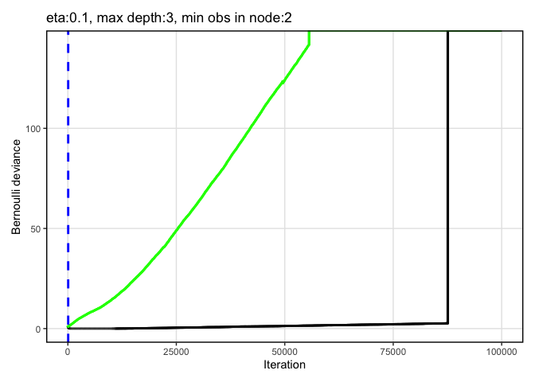
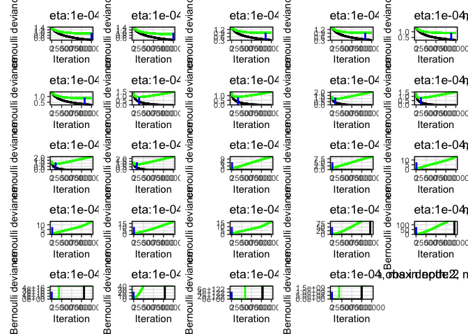
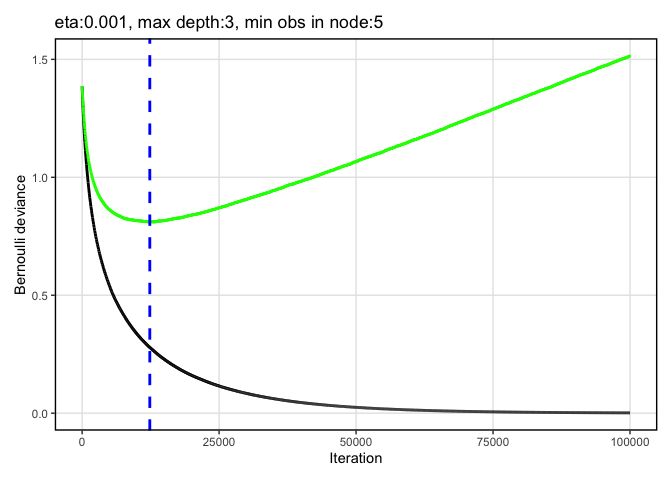
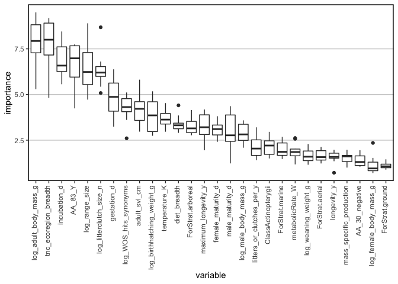

fishbase
================
Han lab
8/10/2020

\#\#\#\#\#install packages

    ## 
    ## Attaching package: 'seqinr'

    ## The following object is masked from 'package:plyr':
    ## 
    ##     count

    ## Loading required package: BiocGenerics

    ## Loading required package: parallel

    ## 
    ## Attaching package: 'BiocGenerics'

    ## The following objects are masked from 'package:parallel':
    ## 
    ##     clusterApply, clusterApplyLB, clusterCall, clusterEvalQ,
    ##     clusterExport, clusterMap, parApply, parCapply, parLapply,
    ##     parLapplyLB, parRapply, parSapply, parSapplyLB

    ## The following objects are masked from 'package:stats':
    ## 
    ##     IQR, mad, sd, var, xtabs

    ## The following objects are masked from 'package:base':
    ## 
    ##     anyDuplicated, append, as.data.frame, basename, cbind, colnames,
    ##     dirname, do.call, duplicated, eval, evalq, Filter, Find, get, grep,
    ##     grepl, intersect, is.unsorted, lapply, Map, mapply, match, mget,
    ##     order, paste, pmax, pmax.int, pmin, pmin.int, Position, rank,
    ##     rbind, Reduce, rownames, sapply, setdiff, sort, table, tapply,
    ##     union, unique, unsplit, which, which.max, which.min

    ## Loading required package: S4Vectors

    ## Loading required package: stats4

    ## 
    ## Attaching package: 'S4Vectors'

    ## The following object is masked from 'package:plyr':
    ## 
    ##     rename

    ## The following object is masked from 'package:base':
    ## 
    ##     expand.grid

    ## Loading required package: IRanges

    ## 
    ## Attaching package: 'IRanges'

    ## The following object is masked from 'package:plyr':
    ## 
    ##     desc

    ## Loading required package: XVector

    ## 
    ## Attaching package: 'XVector'

    ## The following object is masked from 'package:plyr':
    ## 
    ##     compact

    ## 
    ## Attaching package: 'Biostrings'

    ## The following object is masked from 'package:seqinr':
    ## 
    ##     translate

    ## The following object is masked from 'package:base':
    ## 
    ##     strsplit

    ## Loading required package: ape

    ## 
    ## Attaching package: 'ape'

    ## The following object is masked from 'package:Biostrings':
    ## 
    ##     complement

    ## The following objects are masked from 'package:seqinr':
    ## 
    ##     as.alignment, consensus

    ## 
    ## Attaching package: 'phylotools'

    ## The following object is masked from 'package:seqinr':
    ## 
    ##     read.fasta

    ## 
    ## Attaching package: 'data.table'

    ## The following object is masked from 'package:IRanges':
    ## 
    ##     shift

    ## The following objects are masked from 'package:S4Vectors':
    ## 
    ##     first, second

    ## 
    ## Attaching package: 'rfishbase'

    ## The following object is masked from 'package:BiocGenerics':
    ## 
    ##     species

    ## Loading required package: lattice

    ## Loading required package: survival

    ## Loading required package: Formula

    ## 
    ## Attaching package: 'Hmisc'

    ## The following object is masked from 'package:ape':
    ## 
    ##     zoom

    ## The following objects are masked from 'package:Biostrings':
    ## 
    ##     mask, translate

    ## The following object is masked from 'package:seqinr':
    ## 
    ##     translate

    ## The following objects are masked from 'package:plyr':
    ## 
    ##     is.discrete, summarize

    ## The following objects are masked from 'package:base':
    ## 
    ##     format.pval, units

    ## 
    ## Attaching package: 'caret'

    ## The following object is masked from 'package:survival':
    ## 
    ##     cluster

    ## The following object is masked from 'package:seqinr':
    ## 
    ##     dotPlot

    ## 
    ## Attaching package: 'tidyr'

    ## The following object is masked from 'package:S4Vectors':
    ## 
    ##     expand

    ## Loaded gbm 2.1.5

    ## 
    ## Attaching package: 'Matrix'

    ## The following objects are masked from 'package:tidyr':
    ## 
    ##     expand, pack, unpack

    ## The following object is masked from 'package:S4Vectors':
    ## 
    ##     expand

    ## 
    ## Attaching package: 'caTools'

    ## The following object is masked from 'package:IRanges':
    ## 
    ##     runmean

    ## The following object is masked from 'package:S4Vectors':
    ## 
    ##     runmean

    ## 
    ## Attaching package: 'dplyr'

    ## The following objects are masked from 'package:Hmisc':
    ## 
    ##     src, summarize

    ## The following objects are masked from 'package:data.table':
    ## 
    ##     between, first, last

    ## The following objects are masked from 'package:Biostrings':
    ## 
    ##     collapse, intersect, setdiff, setequal, union

    ## The following object is masked from 'package:XVector':
    ## 
    ##     slice

    ## The following objects are masked from 'package:IRanges':
    ## 
    ##     collapse, desc, intersect, setdiff, slice, union

    ## The following objects are masked from 'package:S4Vectors':
    ## 
    ##     first, intersect, rename, setdiff, setequal, union

    ## The following objects are masked from 'package:BiocGenerics':
    ## 
    ##     combine, intersect, setdiff, union

    ## The following object is masked from 'package:seqinr':
    ## 
    ##     count

    ## The following objects are masked from 'package:plyr':
    ## 
    ##     arrange, count, desc, failwith, id, mutate, rename, summarise,
    ##     summarize

    ## The following objects are masked from 'package:stats':
    ## 
    ##     filter, lag

    ## The following objects are masked from 'package:base':
    ## 
    ##     intersect, setdiff, setequal, union

    ## Loading required package: raster

    ## Loading required package: sp

    ## 
    ## Attaching package: 'sp'

    ## The following object is masked from 'package:IRanges':
    ## 
    ##     %over%

    ## 
    ## Attaching package: 'raster'

    ## The following object is masked from 'package:dplyr':
    ## 
    ##     select

    ## The following object is masked from 'package:tidyr':
    ## 
    ##     extract

    ## The following objects are masked from 'package:Hmisc':
    ## 
    ##     mask, zoom

    ## The following object is masked from 'package:data.table':
    ## 
    ##     shift

    ## The following objects are masked from 'package:ape':
    ## 
    ##     rotate, zoom

    ## The following object is masked from 'package:Biostrings':
    ## 
    ##     mask

    ## The following objects are masked from 'package:IRanges':
    ## 
    ##     distance, shift, trim, values, values<-

    ## The following objects are masked from 'package:S4Vectors':
    ## 
    ##     metadata, metadata<-, values, values<-

    ## Loading required package: iterators

    ## Loading required package: snow

    ## 
    ## Attaching package: 'snow'

    ## The following objects are masked from 'package:BiocGenerics':
    ## 
    ##     clusterApply, clusterApplyLB, clusterCall, clusterEvalQ,
    ##     clusterExport, clusterMap, clusterSplit, parApply, parCapply,
    ##     parLapply, parRapply, parSapply

    ## The following objects are masked from 'package:parallel':
    ## 
    ##     clusterApply, clusterApplyLB, clusterCall, clusterEvalQ,
    ##     clusterExport, clusterMap, clusterSplit, makeCluster, parApply,
    ##     parCapply, parLapply, parRapply, parSapply, splitIndices,
    ##     stopCluster

    ## Warning: package 'rsample' was built under R version 4.0.2

    ## 
    ## Attaching package: 'rsample'

    ## The following object is masked from 'package:ape':
    ## 
    ##     complement

    ## The following object is masked from 'package:Biostrings':
    ## 
    ##     complement

    ## Warning: package 'tidyverse' was built under R version 4.0.2

    ## ── Attaching packages ─────────────────────────────────────────────────────────────────────────────────────── tidyverse 1.3.0 ──

    ## ✓ tibble  3.0.1     ✓ purrr   0.3.4
    ## ✓ readr   1.3.1     ✓ forcats 0.5.0

    ## ── Conflicts ────────────────────────────────────────────────────────────────────────────────────────── tidyverse_conflicts() ──
    ## x purrr::accumulate()      masks foreach::accumulate()
    ## x dplyr::arrange()         masks plyr::arrange()
    ## x dplyr::between()         masks data.table::between()
    ## x dplyr::collapse()        masks Biostrings::collapse(), IRanges::collapse()
    ## x dplyr::combine()         masks BiocGenerics::combine()
    ## x purrr::compact()         masks XVector::compact(), plyr::compact()
    ## x dplyr::count()           masks seqinr::count(), plyr::count()
    ## x dplyr::desc()            masks IRanges::desc(), plyr::desc()
    ## x Matrix::expand()         masks tidyr::expand(), S4Vectors::expand()
    ## x raster::extract()        masks tidyr::extract()
    ## x dplyr::failwith()        masks plyr::failwith()
    ## x dplyr::filter()          masks stats::filter()
    ## x dplyr::first()           masks data.table::first(), S4Vectors::first()
    ## x dplyr::id()              masks plyr::id()
    ## x dplyr::lag()             masks stats::lag()
    ## x dplyr::last()            masks data.table::last()
    ## x purrr::lift()            masks caret::lift()
    ## x dplyr::mutate()          masks plyr::mutate()
    ## x Matrix::pack()           masks tidyr::pack()
    ## x purrr::partial()         masks pdp::partial()
    ## x BiocGenerics::Position() masks ggplot2::Position(), base::Position()
    ## x purrr::reduce()          masks IRanges::reduce()
    ## x dplyr::rename()          masks S4Vectors::rename(), plyr::rename()
    ## x raster::select()         masks dplyr::select()
    ## x dplyr::slice()           masks XVector::slice(), IRanges::slice()
    ## x dplyr::src()             masks Hmisc::src()
    ## x dplyr::summarise()       masks plyr::summarise()
    ## x dplyr::summarize()       masks Hmisc::summarize(), plyr::summarize()
    ## x purrr::transpose()       masks data.table::transpose()
    ## x Matrix::unpack()         masks tidyr::unpack()
    ## x purrr::when()            masks foreach::when()

    ## Warning: package 'sf' was built under R version 4.0.2

    ## Linking to GEOS 3.8.1, GDAL 3.1.1, PROJ 6.3.1

    ## Warning: package 'mapview' was built under R version 4.0.2

    ## Warning: package 'rnaturalearth' was built under R version 4.0.2

    ## 
    ## Attaching package: 'fasterize'

    ## The following object is masked from 'package:graphics':
    ## 
    ##     plot

    ## The following object is masked from 'package:base':
    ## 
    ##     plot

    ## Warning: package 'patchwork' was built under R version 4.0.2

    ## 
    ## Attaching package: 'patchwork'

    ## The following object is masked from 'package:raster':
    ## 
    ##     area

    ## 
    ## Attaching package: 'magrittr'

    ## The following object is masked from 'package:purrr':
    ## 
    ##     set_names

    ## The following object is masked from 'package:raster':
    ## 
    ##     extract

    ## The following object is masked from 'package:tidyr':
    ## 
    ##     extract

    ## Warning: package 'fulltext' was built under R version 4.0.2

    ## Registered S3 method overwritten by 'hoardr':
    ##   method           from
    ##   print.cache_info httr

    ## 
    ## Attaching package: 'fulltext'

    ## The following object is masked from 'package:dplyr':
    ## 
    ##     collect

``` r
output_name = "vert_haddock_20200810_1138"
save(output_name, file = "output_name.Rdata")
```

\#\#cores

``` r
cores = 4
  cl <- makeCluster(cores, "SOCK", timeout = 60)  
  # stopCluster(cl)
  registerDoSNOW(cl)
```

\#\#function to take the same across rows of categorical variables that
have been 1/0 encoded, where a species may have 1 for more than one
condition of a variable

\#\#function to replace NAs with real values for binary fields

\#\#settings

\#\#look at docs about tables available from fishbase

\#\#read in data and fix species names

\#\#distribution \#\#currently this is ~ FAO areas table (minus “note”
field) e.g. <http://www.fishbase.us/Country/FaoAreaList.php?ID=5537>
\#\#each species may have multiple bounding boxes

Read in the FAO areas (from
<http://www.fao.org/geonetwork/srv/en/main.home?uuid=ac02a460-da52-11dc-9d70-0017f293bd28>
as described by
<http://www.fishbase.us/manual/English/FishbaseThe_FAOAREAS_Table.htm>).
It looks like our data contain both the inland and marine FAOs, so I
read in both and combined them according to a single column of FAO code.

\#\#check out some tables in fishbase \#\#brains: one entry for each
individual fish: BrainWeight, BodyWeight
\#\#<https://www.fishbase.in/manual/fishbasethe_brains_table.htm>

\#\#country: multiple rows per species; for
example:

## countrysub – multiple rows per species

\#\#<https://www.fishbase.de/manual/english/FishBaseThe_Countries_Table.htm>

\#\#get ecology data
\#\#<http://fishbase.us/manual/English/FishbaseThe_ECOLOGY_Table.htm>

\#\#distribution \#\#currently this is ~ FAO areas table (minus “note”
field) e.g. <http://www.fishbase.us/Country/FaoAreaList.php?ID=5537>
\#\#each species may have multiple bounding boxes

\#\#ecosystem – couldn’t find description of this online \#\#multiple
rows per species, one for each ecosystem

\#\#estimate: a table of estimates from some models on trophic levels
\#\#<http://www.fishbase.us/manual/English/FishbaseThe_FOOD_ITEMS_table.htm>

\#\#faoareas, seems to be redundant to countrysub?

\#\#fecundity \#\#sometimes multiple rows per species. could not
\#\#could not locate doc table about fecundity. spawning table seems to
be something different (different fields):
<https://www.fishbase.in/manual/fishbasethe_spawning_table.htm>

\#\#fooditems – including this one
\#\#<http://www.fishbase.org/manual/english/fishbasethe_food_items_table.htm>
\#\#multiple rows per species, for different food types, life stages of
predator, locality, etc.

\#\#genetic – don’t think we want to use this, but including just to see
what it shows

\#\#introductions – species introductions data. for now making one new
feature: the number of records about introductions; it seems that each
row is a different place
\#\#<https://www.fishbase.in/manual/fishbasethe_introduction_table.htm>

\#\#larvae
\#\#<https://www.fishbase.in/manual/fishbasethe_larvae_table.htm> \#\#2
out of the 74 species have multiple records w/ different values.
excluding for now.

\#\#length\_freq; multiple records for some species; excluding for now;
could not find metadata

\#\#length\_length: conversion of length types

\#\#length\_weight: The LENGTH-WEIGHT table presents the a and b values
of over 5,000 length-weight relationships of the form W = a x Lb,
pertaining to about over 2,000 fish species. \#\#multiple records for
some species. \#\#seems like this may only be useful in combination with
length\_length
\#\#<https://www.fishbase.de/manual/FishbaseThe_LENGTH_WEIGHT_Table.htm>

\#\#maturity \#\#multiple records for some species, would need to take
averages if we wanted to use. there are multiple measures of maturity to
choose from.
\#\#<https://www.fishbase.in/manual/fishbasethe_maturity_table.htm>

\#\#morphology
\#\#<https://www.fishbase.in/manual/fishbasethe_morphology_table.htm>
\#\#there are multiple records for some species.

\#\#morphometrics \#\#there are multiple records for some species; to
include we would need to take averages \#\#exclude for now because
couldn’t find documentation

\#\#oxygen
\#\#<https://www.fishbase.in/manual/fishbasethe_oxygen_table.htm>
\#\#there are multiple records for some species (e.g. for different
sexes); to include we would need to take averages \#\#include along with
potentially influencing variables – e.g. salinity, temp, swimming speed,
etc.

\#\#popchar: Table of maximum length (Lmax), weight (Wmax) and age
(tmax)
\#\#<https://www.fishbase.in/manual/fishbasethe_popchar_table.htm>
\#\#there are multiple records for some species; to include we would
need to take averages \#\#

\#\#popgrowth
\#\#<https://www.fishbase.in/manual/fishbasethe_popgrowth_table.htm>
\#\#multiple records for some species, e.g. for different sexes;

\#\#popqb
\#\#<https://www.fishbase.se/manual/english/fishbasethe_popqb_table.htm>
\#\#population-based estimates of food consumption (i.e., estimates that
account for the age structure of populations) \#\#multiple responses for
some species. here there are two measures, popqb and maintenance qb.

\#\#predators
\#\#<https://www.fishbase.se/manual/English/fishbasethe_predators_table.htm>

\#\#ration \#\#�ration� (Rd) pertains to an estimate of daily food
consumption by fish of a specific size
\#\#<https://www.fishbase.in/manual/fishbasethe_ration_table.htm>
\#\#multiple rows for some species

\#\#reproduction
\#\#<https://www.fishbase.in/manual/fishbasethe_reproduction_table.htm>
\#\#only one row per species for these HADDOCK species; adding these
fields

\#\#spawning
\#\#<https://www.fishbase.in/manual/fishbasethe_spawning_table.htm>
\#\#multiple rows per species, for different localities

\#\#speed
\#\#<https://www.fishbase.se/manual/English/PDF/FB_Book_ATorres_Swimming_Speed_RF_JG.pdf>
\#\#<https://www.fishbase.in/manual/fishbasethe_swimming_and_speed_tables.htm>
\#\#multiple records for some species

\#\#stocks
\#\#<https://www.fishbase.in/manual/fishbasethe_stocks_table.htm>
\#\#multiple records for some species, one for each stock

\#\#diet \#\#<https://www.fishbase.in/manual/fishbasethe_diet_table.htm>
\#\#has multiple rows for different stages

\#\#diet\_items – multiple rows per species. seems to be linked with
DietCode to diet table
\#\#<https://www.fishbase.se/manual/English/fishbasethe_food_items_table.htm>

\#\#swimming
\#\#<https://www.fishbase.in/manual/fishbasethe_swimming_and_speed_tables.htm>
\#\#one record per species

\#\#see what coverage is

\#\#remove fields with 0 coverage

\#\#add back haddock fields

\#\#remove fields with near-zero variation

\#\#look for fields in common with other taxa that are not fish and
output to add to datasets from other verts

\#\#add field with AA position 30

\#\#add AA value to rest of fishbase data

\#\#remove fields with near-zero variation again

\#\#set up function gridSearch.R

\#\#combine data Adrian made with rest of fields from fish. remove Order
field

``` r
V %>%
  mutate(mass_specific_production = (exp(log_birthhatching_weight_g)/exp(log_adult_body_mass_g))*exp(log_litterclutch_size_n)*litters_or_clutches_per_y, log_range_size = log(range_size)) %>%
  dplyr::select(-range_size, -log_no_sex_body_mass)
```

    ##                           Species          Class nchar haddock_score_mean
    ## 1                Acinonyx jubatus       Mammalia   805          -127.0781
    ## 2      Alligator mississippiensis       Reptilia   805          -114.9852
    ## 3              Alligator sinensis       Reptilia   803          -114.4867
    ## 4              Anas platyrhynchos           Aves   805          -109.5228
    ## 5             Anolis carolinensis       Reptilia   814          -119.2354
    ## 6      Anser cygnoides domesticus           Aves   805          -114.9705
    ## 7        Antrostomus carolinensis           Aves   807          -111.0978
    ## 8                 Aotus nancymaae       Mammalia   805          -140.6192
    ## 9            Aptenodytes forsteri           Aves   809          -116.1622
    ## 10                   Apteryx rowi           Aves   808          -124.8262
    ## 11   Aquila chrysaetos chrysaetos           Aves   809          -123.5723
    ## 12             Athene cunicularia           Aves   834          -125.4185
    ## 13                Aythya fuligula           Aves   805          -110.3915
    ## 14     Balaenoptera acutorostrata       Mammalia   804          -117.7394
    ## 15       Bos indicus x Bos taurus       Mammalia   811          -128.3640
    ## 16                    Bos indicus       Mammalia   804          -136.8429
    ## 17                      Bos mutus       Mammalia   804          -128.3640
    ## 18                     Bos taurus       Mammalia   804          -128.3640
    ## 19                Bubalus bubalis       Mammalia   803          -127.1599
    ## 20  Buceros rhinoceros silvestris           Aves   794          -144.2954
    ## 21                Calidris pugnax           Aves   809          -119.3729
    ## 22             Callithrix jacchus       Mammalia   805          -134.0826
    ## 23            Callorhinus ursinus       Mammalia   806          -138.6194
    ## 24                   Calypte anna           Aves   805          -116.7884
    ## 25          Camarhynchus parvulus           Aves   809          -119.3851
    ## 26             Camelus bactrianus       Mammalia   805          -115.5882
    ## 27            Camelus dromedarius       Mammalia   805          -115.5882
    ## 28                  Camelus ferus       Mammalia   805          -115.5882
    ## 29              Canis lupus dingo       Mammalia   804          -138.9050
    ## 30         Canis lupus familiaris       Mammalia   804          -136.0895
    ## 31                   Capra hircus       Mammalia   804          -128.8694
    ## 32               Cariama cristata           Aves   806          -117.4505
    ## 33               Tarsius syrichta       Mammalia   805          -135.6955
    ## 34             Catharus ustulatus           Aves   872          -121.8361
    ## 35                Cavia porcellus       Mammalia   813          -124.0667
    ## 36                Cebus capucinus       Mammalia   805          -136.9687
    ## 37            Ceratotherium simum       Mammalia   805          -132.3793
    ## 38                Cercocebus atys       Mammalia   805          -134.5204
    ## 39              Chaetura pelagica           Aves   806          -130.1247
    ## 40           Charadrius vociferus           Aves   809          -111.4710
    ## 41                 Chelonia mydas       Reptilia   811          -116.8243
    ## 42         Chelonoidis abingdonii       Reptilia   808          -126.4451
    ## 43            Chinchilla lanigera       Mammalia   805          -136.2343
    ## 44         Chiroxiphia lanceolata           Aves   811          -127.1309
    ## 45         Chlamydotis macqueenii           Aves   808          -130.1851
    ## 46           Chlorocebus aethiops       Mammalia   805          -137.5023
    ## 47            Chlorocebus sabaeus       Mammalia   805          -134.8058
    ## 48                Chrysemys picta       Reptilia   828          -120.2001
    ## 49         Chrysochloris asiatica       Mammalia   799          -119.4458
    ## 50             Condylura cristata       Mammalia   800          -115.6435
    ## 51                Corapipo altera           Aves   811          -109.8825
    ## 52           Corvus cornix cornix           Aves   811          -122.5673
    ## 53            Corvus moneduloides           Aves   811          -126.9507
    ## 54              Coturnix japonica           Aves   807          -107.6108
    ## 55          Cricetulus barabensis       Mammalia   805          -131.0529
    ## 56             Crocodylus porosus       Reptilia   803          -109.4941
    ## 57                Crocuta crocuta       Mammalia   805          -138.0795
    ## 58                Cuculus canorus           Aves   808          -114.1463
    ## 59            Cyanistes caeruleus           Aves   814          -122.8662
    ## 60           Dasypus novemcinctus       Mammalia   804          -120.2759
    ## 61          Delphinapterus leucas       Mammalia   804          -121.9041
    ## 62              Desmodus rotundus       Mammalia   804          -123.6435
    ## 63                Dipodomys ordii       Mammalia   740          -116.2353
    ## 64       Dromaius novaehollandiae           Aves   804          -114.9853
    ## 65              Echinops telfairi       Mammalia   798          -119.2694
    ## 66          Elephantulus edwardii       Mammalia   798          -121.1473
    ## 67             Empidonax traillii           Aves   809          -118.5872
    ## 68                 Enhydra lutris       Mammalia   805          -150.4616
    ## 69               Eptesicus fuscus       Mammalia   799          -123.8523
    ## 70                   Equus asinus       Mammalia   783          -126.3108
    ## 71                 Equus caballus       Mammalia   805          -124.5282
    ## 72              Equus przewalskii       Mammalia   805          -124.5282
    ## 73            Erinaceus europaeus       Mammalia   804          -119.0843
    ## 74             Eumetopias jubatus       Mammalia   806          -126.7669
    ## 75                Eurypyga helias           Aves   809          -115.3714
    ## 76                  Falco cherrug           Aves   813          -119.6413
    ## 77                    Felis catus       Mammalia   807          -129.1229
    ## 78            Ficedula albicollis           Aves   810          -126.3911
    ## 79           Cryptomys damarensis       Mammalia   805          -135.3762
    ## 80             Fulmarus glacialis           Aves   632          -107.9617
    ## 81                  Gallus gallus           Aves   808          -106.3799
    ## 82                 Gavia stellata           Aves   809          -126.1722
    ## 83            Gavialis gangeticus       Reptilia   803          -119.3989
    ## 84                Gekko japonicus       Reptilia   816          -128.1600
    ## 85                Geospiza fortis           Aves   809          -123.2487
    ## 86             Globicephala melas       Mammalia   804          -116.2425
    ## 87              Gopherus evgoodei       Reptilia   808          -113.1545
    ## 88                Gorilla gorilla       Mammalia   805          -133.7801
    ## 89           Grammomys dolichurus       Mammalia   805          -136.0814
    ## 90       Haliaeetus leucocephalus           Aves   745          -119.2226
    ## 91          Heterocephalus glaber       Mammalia   805          -137.1131
    ## 92           Hipposideros armiger       Mammalia   806          -142.5868
    ## 93                   Homo sapiens       Mammalia    NA          -135.5015
    ## 94               Hylobates moloch       Mammalia   805          -131.9071
    ## 95  Spermophilus tridecemlineatus       Mammalia   817          -126.3453
    ## 96                Jaculus jaculus       Mammalia   805          -133.7726
    ## 97     Lagenorhynchus obliquidens       Mammalia   804          -115.7625
    ## 98           Lepidothrix coronata           Aves   811          -125.5508
    ## 99            Leptosomus discolor           Aves   809          -133.5593
    ## 100            Lipotes vexillifer       Mammalia   804          -122.5645
    ## 101              Lonchura striata           Aves   809          -125.5058
    ## 102            Loxodonta africana       Mammalia   800          -120.6338
    ## 103               Lynx canadensis       Mammalia   805          -126.7261
    ## 104                 Lynx pardinus       Mammalia   805          -131.2638
    ## 105           Macaca fascicularis       Mammalia   805          -132.4049
    ## 106                Macaca mulatta       Mammalia   805          -133.8149
    ## 107             Macaca nemestrina       Mammalia   805          -134.4880
    ## 108            Manacus vitellinus           Aves   811          -120.3414
    ## 109        Mandrillus leucophaeus       Mammalia   805          -135.7120
    ## 110                Manis javanica       Mammalia   805          -147.4268
    ## 111          Marmota flaviventris       Mammalia   817          -126.1307
    ## 112               Marmota marmota       Mammalia   817          -124.3886
    ## 113               Mastomys coucha       Mammalia   806          -122.6908
    ## 114       Melopsittacus undulatus           Aves   809          -124.1603
    ## 115                Merops nubicus           Aves   799          -136.5610
    ## 116           Mesitornis unicolor           Aves   809          -129.5610
    ## 117          Mesocricetus auratus       Mammalia   805          -129.4977
    ## 118        Microcaecilia unicolor       Amphibia   811          -109.4219
    ## 119          Microtus ochrogaster       Mammalia   804          -133.8641
    ## 120        Miniopterus natalensis       Mammalia   804          -123.9561
    ## 121         Monodelphis domestica       Mammalia   806          -108.7079
    ## 122             Monodon monoceros       Mammalia   804          -121.9041
    ## 123             Muntiacus muntjak       Mammalia   805          -130.4295
    ## 124                    Mus caroli       Mammalia   805          -115.3366
    ## 125                  Mus musculus       Mammalia   805          -111.5361
    ## 126                    Mus pahari       Mammalia   805          -127.8206
    ## 127               Mustela erminea       Mammalia   805          -144.7238
    ## 128              Mustela putorius       Mammalia   805          -158.7462
    ## 129               Myotis brandtii       Mammalia   799          -113.3917
    ## 130                Myotis davidii       Mammalia   799          -118.8795
    ## 131              Myotis lucifugus       Mammalia   799          -116.4535
    ## 132             Spalax ehrenbergi       Mammalia   804          -129.4749
    ## 133              Nanorana parkeri       Amphibia   773          -131.4837
    ## 134        Monachus schauinslandi       Mammalia   805          -148.7747
    ## 135       Neopelma chrysocephalum           Aves   811          -132.1863
    ## 136   Neophocaena asiaeorientalis       Mammalia   804          -122.3566
    ## 137               Nipponia nippon           Aves   809          -130.7357
    ## 138           Nomascus leucogenys       Mammalia   805          -133.2428
    ## 139             Notechis scutatus       Reptilia   828          -124.0376
    ## 140        Nothoprocta perdicaria           Aves   807          -122.9369
    ## 141              Numida meleagris           Aves   810          -115.7376
    ## 142      Nyctereutes procyonoides       Mammalia   804          -140.8553
    ## 143             Ochotona princeps       Mammalia   808          -141.3047
    ## 144                 Octodon degus       Mammalia   831          -127.2477
    ## 145        Odocoileus virginianus       Mammalia   679          -132.6328
    ## 146           Opisthocomus hoazin           Aves   824          -128.0306
    ## 147                  Orcinus orca       Mammalia   804          -116.1652
    ## 148      Ornithorhynchus anatinus       Mammalia   806          -118.0567
    ## 149              Orycteropus afer       Mammalia   799          -122.2587
    ## 150         Oryctolagus cuniculus       Mammalia   805          -117.2752
    ## 151            Otolemur garnettii       Mammalia   805          -134.1125
    ## 152                    Ovis aries       Mammalia   804          -131.5728
    ## 153                Paguma larvata       Mammalia   805          -127.7072
    ## 154                  Pan paniscus       Mammalia   805          -133.6370
    ## 155               Pan troglodytes       Mammalia   805          -134.5942
    ## 156               Panthera pardus       Mammalia   805          -132.5750
    ## 157               Panthera tigris       Mammalia   797          -131.4918
    ## 158                  Papio anubis       Mammalia   805          -134.4804
    ## 159                   Parus major           Aves   814          -124.9970
    ## 160             Pelecanus crispus           Aves   809          -120.5647
    ## 161           Pelodiscus sinensis       Reptilia   808          -111.9189
    ## 162           Peromyscus leucopus       Mammalia   805          -136.4234
    ## 163        Peromyscus maniculatus       Mammalia   805          -131.7655
    ## 164             Phaethon lepturus           Aves   809          -123.3934
    ## 165           Phalacrocorax carbo           Aves   812          -122.0338
    ## 166        Phascolarctos cinereus       Mammalia   807          -124.3690
    ## 167           Phasianus colchicus           Aves   808          -108.2775
    ## 168            Phodopus campbelli       Mammalia   805          -141.7717
    ## 169         Phyllostomus discolor       Mammalia   804          -129.7188
    ## 170              Physeter catodon       Mammalia   804          -126.8132
    ## 171     Piliocolobus tephrosceles       Mammalia   805          -133.1645
    ## 172          Pipistrellus abramus       Mammalia   803          -139.6917
    ## 173               Pipra filicauda           Aves   811          -118.4965
    ## 174              Pogona vitticeps       Reptilia   821          -123.4848
    ## 175                  Pongo abelii       Mammalia   805          -141.1458
    ## 176                 Procyon lotor       Mammalia   805          -109.5383
    ## 177         Propithecus coquereli       Mammalia   826          -133.4478
    ## 178  Protobothrops mucrosquamatus       Reptilia   861          -119.7394
    ## 179           Pseudonaja textilis       Reptilia   828          -128.1669
    ## 180         Pseudopodoces humilis           Aves   809          -120.6929
    ## 181          Pterocles gutturalis           Aves   631          -125.5977
    ## 182               Pteropus alecto       Mammalia   805          -131.9994
    ## 183             Pteropus vampyrus       Mammalia   804          -132.3605
    ## 184                 Puma concolor       Mammalia   805          -130.2811
    ## 185            Pygoscelis adeliae           Aves   798          -124.5965
    ## 186             Python bivittatus       Reptilia   827          -123.7965
    ## 187             Rattus norvegicus       Mammalia   805          -125.8221
    ## 188         Rhinatrema bivittatum       Amphibia   815          -122.7099
    ## 189           Rhinolophus alcyone       Mammalia   805          -118.5269
    ## 190     Rhinolophus ferrumequinum       Mammalia   805          -122.4245
    ## 191           Rhinolophus landeri       Mammalia   805          -114.2410
    ## 192          Rhinolophus macrotis       Mammalia   805          -138.6873
    ## 193         Rhinolophus pearsonii       Mammalia   805          -161.4977
    ## 194          Rhinolophus pusillus       Mammalia   805          -112.4602
    ## 195           Rhinolophus sinicus       Mammalia   805          -119.6286
    ## 196       Rhinopithecus roxellana       Mammalia   805          -134.4878
    ## 197         Rousettus aegyptiacus       Mammalia   805          -124.4926
    ## 198       Rousettus leschenaultii       Mammalia   805          -128.0104
    ## 199           Saimiri boliviensis       Mammalia   805          -137.9816
    ## 200                  Cebus apella       Mammalia   805          -143.7389
    ## 201          Sarcophilus harrisii       Mammalia   806          -116.6150
    ## 202               Serinus canaria           Aves   809          -117.6729
    ## 203                 Sorex araneus       Mammalia   803          -111.6277
    ## 204           Strigops habroptila           Aves   811          -116.3572
    ## 205    Struthio camelus australis           Aves   808          -123.4668
    ## 206              Sturnus vulgaris           Aves   810          -128.0703
    ## 207            Suricata suricatta       Mammalia   805          -121.8345
    ## 208                    Sus scrofa       Mammalia   805          -128.6784
    ## 209           Taeniopygia guttata           Aves   811          -128.8371
    ## 210         Tauraco erythrolophus           Aves   703          -129.5481
    ## 211            Thamnophis elegans       Reptilia   828          -115.2591
    ## 212          Theropithecus gelada       Mammalia   805          -134.2141
    ## 213              Tinamus guttatus           Aves   805          -118.8845
    ## 214            Trichechus manatus       Mammalia   800          -120.0624
    ## 215              Tupaia belangeri       Mammalia   805          -131.8944
    ## 216            Tursiops truncatus       Mammalia   804          -121.8091
    ## 217                     Tyto alba           Aves   809          -121.9270
    ## 218          Spermophilus parryii       Mammalia   817          -126.2178
    ## 219                  Ursus arctos       Mammalia   805          -164.6946
    ## 220               Ursus maritimus       Mammalia   790          -148.1243
    ## 221                 Vicugna pacos       Mammalia   805          -105.6147
    ## 222              Vombatus ursinus       Mammalia   809          -125.0327
    ## 223                 Vulpes vulpes       Mammalia   804          -141.3735
    ## 224            Xenopus tropicalis       Amphibia   862          -131.4467
    ## 225        Zalophus californianus       Mammalia   806          -129.1351
    ## 226        Zonotrichia albicollis           Aves   811          -118.7163
    ## 227   Acanthochromis polyacanthus Actinopterygii   817          -120.6537
    ## 228             Amblyraja radiata Elasmobranchii   773          -127.1368
    ## 229          Amphiprion ocellaris Actinopterygii   807          -120.6154
    ## 230            Anabas testudineus Actinopterygii   806          -148.2730
    ## 231       Anarrhichthys ocellatus Actinopterygii   815          -135.7334
    ## 232      Archocentrus centrarchus Actinopterygii   803          -140.5308
    ## 233      Astatotilapia calliptera Actinopterygii   803          -167.8155
    ## 234            Astyanax mexicanus Actinopterygii   805          -143.1646
    ## 235       Austrofundulus limnaeus Actinopterygii   819          -144.3907
    ## 236               Betta splendens Actinopterygii   814          -152.3916
    ## 237 Boleophthalmus pectinirostris Actinopterygii   807          -124.7179
    ## 238           Callorhinchus milii    Holocephali   836          -108.5495
    ## 239             Carassius auratus Actinopterygii   812          -125.1927
    ## 240                 Chanos chanos Actinopterygii   804          -141.0103
    ## 241               Clupea harengus Actinopterygii   821          -129.0867
    ## 242              Cottoperca gobio Actinopterygii   807          -141.0667
    ## 243        Cynoglossus semilaevis Actinopterygii   802          -139.7922
    ## 244         Cyprinodon variegatus Actinopterygii   819          -142.1097
    ## 245                   Danio rerio Actinopterygii   818          -135.4890
    ## 246          Denticeps clupeoides Actinopterygii   810          -144.4640
    ## 247            Echeneis naucrates Actinopterygii   814          -140.9469
    ## 248      Electrophorus electricus Actinopterygii   805          -129.1812
    ## 249     Erpetoichthys calabaricus Actinopterygii   799          -127.9948
    ## 250                   Esox lucius Actinopterygii   827          -143.5293
    ## 251         Etheostoma spectabile Actinopterygii   808          -148.2354
    ## 252         Fundulus heteroclitus Actinopterygii   809          -141.6610
    ## 253                  Gadus morhua Actinopterygii   818          -123.1413
    ## 254            Gouania willdenowi Actinopterygii   809          -140.5337
    ## 255          Haplochromis burtoni Actinopterygii   803          -139.6591
    ## 256             Hippocampus comes Actinopterygii   805          -133.4910
    ## 257           Ictalurus punctatus Actinopterygii   805          -127.3435
    ## 258       Kryptolebias marmoratus Actinopterygii   814          -136.1065
    ## 259               Labrus bergylta Actinopterygii   806          -132.8646
    ## 260           Larimichthys crocea Actinopterygii   810          -125.3153
    ## 261              Lates calcarifer Actinopterygii   807          -140.1661
    ## 262          Lepisosteus oculatus Actinopterygii   809          -131.8151
    ## 263         Mastacembelus armatus Actinopterygii   807          -139.2678
    ## 264               Maylandia zebra Actinopterygii   803          -150.2616
    ## 265              Monopterus albus Actinopterygii   812          -131.1605
    ## 266           Myripristis murdjan Actinopterygii   806          -137.8852
    ## 267      Neolamprologus brichardi Actinopterygii   803          -156.8765
    ## 268        Nothobranchius furzeri Actinopterygii   805          -129.8829
    ## 269          Notothenia coriiceps Actinopterygii   806          -149.8404
    ## 270           Oncorhynchus mykiss Actinopterygii   807          -152.5008
    ## 271            Oreochromis aureus Actinopterygii   821          -149.2863
    ## 272         Oreochromis niloticus Actinopterygii   821          -140.6832
    ## 273            Oryzias melastigma Actinopterygii   819          -143.6944
    ## 274   Pangasianodon hypophthalmus Actinopterygii   805          -132.4673
    ## 275        Paralichthys olivaceus Actinopterygii   721          -144.4514
    ## 276             Parambassis ranga Actinopterygii   808          -125.3575
    ## 277      Paramormyrops kingsleyae Actinopterygii   805          -116.9729
    ## 278              Perca flavescens Actinopterygii   820          -133.7036
    ## 279              Poecilia formosa Actinopterygii   808          -144.9635
    ## 280            Poecilia latipinna Actinopterygii   808          -132.6837
    ## 281             Poecilia mexicana Actinopterygii   808          -152.9896
    ## 282           Poecilia reticulata Actinopterygii   809          -143.5776
    ## 283           Pundamilia nyererei Actinopterygii   803          -152.4654
    ## 284         Pygocentrus nattereri Actinopterygii   804          -136.5152
    ## 285            Salarias fasciatus Actinopterygii   816          -120.4007
    ## 286             Sander lucioperca Actinopterygii   808          -130.0542
    ## 287          Scleropages formosus Actinopterygii   809          -123.7412
    ## 288              Seriola dumerili Actinopterygii   807          -149.3933
    ## 289               Seriola lalandi Actinopterygii   807          -156.5671
    ## 290  Sinocyclocheilus anshuiensis Actinopterygii   809          -126.9348
    ## 291  Sinocyclocheilus rhinocerous Actinopterygii   777          -135.8695
    ## 292                 Sparus aurata Actinopterygii   816          -152.1393
    ## 293            Stegastes partitus Actinopterygii   807          -122.5857
    ## 294         Tachysurus fulvidraco Actinopterygii   806          -127.9549
    ## 295             Takifugu rubripes Actinopterygii   806          -125.8242
    ## 296        Xiphophorus couchianus Actinopterygii   808          -150.2238
    ## 297          Xiphophorus hellerii Actinopterygii   808          -139.9420
    ## 298         Xiphophorus maculatus Actinopterygii   808          -138.5666
    ##     haddock_score_sd ForStrat.ground ForStrat.understory ForStrat.arboreal
    ## 1          1.7479599               1                   0                 0
    ## 2          2.0028455              NA                  NA                NA
    ## 3          3.7341576              NA                  NA                NA
    ## 4          2.2788195               1                   0                 0
    ## 5          2.1383048               0                   0                 1
    ## 6          2.8885110              NA                  NA                NA
    ## 7          3.0063386              NA                  NA                NA
    ## 8          2.6293113               0                   0                 1
    ## 9          2.3104616               1                   0                 0
    ## 10         1.7619640              NA                  NA                NA
    ## 11         2.4079494              NA                  NA                NA
    ## 12         3.1394456               1                   1                 1
    ## 13         2.3161647               1                   0                 0
    ## 14         2.0038124               0                   0                 0
    ## 15         2.8435932              NA                  NA                NA
    ## 16         1.1088326              NA                  NA                NA
    ## 17         2.8435932              NA                  NA                NA
    ## 18         2.8435932               1                   0                 0
    ## 19         1.9123767               1                   0                 0
    ## 20         4.0279738              NA                  NA                NA
    ## 21         1.3617812              NA                  NA                NA
    ## 22         2.4896615               0                   0                 1
    ## 23         1.7074461               0                   0                 0
    ## 24         1.3097589               0                   1                 1
    ## 25         2.0992935               1                   1                 1
    ## 26         2.1352258               1                   0                 0
    ## 27         2.1352258               1                   0                 0
    ## 28         2.1352258              NA                  NA                NA
    ## 29         3.1246119              NA                  NA                NA
    ## 30         2.2547311              NA                  NA                NA
    ## 31         3.9167938               1                   0                 0
    ## 32         2.8795278               1                   1                 0
    ## 33         2.1158135               0                   0                 1
    ## 34         2.1424931               1                   1                 0
    ## 35         2.3856253               1                   0                 0
    ## 36         3.2052387               0                   0                 1
    ## 37         2.3058518               1                   0                 0
    ## 38         2.1802469               0                   0                 1
    ## 39         2.2007942               0                   0                 1
    ## 40         3.0244353               1                   0                 0
    ## 41         1.7165928              NA                  NA                NA
    ## 42         2.9904895              NA                  NA                NA
    ## 43         2.4102100               1                   0                 0
    ## 44         1.8884526               0                   1                 1
    ## 45         2.5694595              NA                  NA                NA
    ## 46         3.3114339               0                   1                 0
    ## 47         1.6727069               0                   1                 0
    ## 48         2.2889599              NA                  NA                NA
    ## 49         2.4358187               1                   0                 0
    ## 50         2.2999550               1                   0                 0
    ## 51         1.7733398               0                   1                 1
    ## 52         0.7720989              NA                  NA                NA
    ## 53         3.6378390               1                   1                 1
    ## 54         3.7614638               1                   0                 0
    ## 55         0.9844512               1                   0                 0
    ## 56         1.4174684              NA                  NA                NA
    ## 57         2.7817875               1                   0                 0
    ## 58         2.7692676               1                   1                 1
    ## 59         1.6606774              NA                  NA                NA
    ## 60         2.0902294               1                   0                 0
    ## 61         1.2296599               0                   0                 0
    ## 62         3.6455929               1                   0                 0
    ## 63         1.4058705               1                   0                 0
    ## 64         2.1060441               1                   1                 0
    ## 65         2.5333500               1                   0                 0
    ## 66         1.2084160               1                   0                 0
    ## 67         1.6848634               0                   1                 1
    ## 68         3.3803330               0                   0                 0
    ## 69         2.5482304               0                   0                 0
    ## 70         1.9287754               1                   0                 0
    ## 71         2.6513700               1                   0                 0
    ## 72         2.6513700              NA                  NA                NA
    ## 73         1.7068722               1                   0                 0
    ## 74         3.1937131               0                   0                 0
    ## 75         3.9455766               1                   0                 0
    ## 76         1.7879356               1                   1                 1
    ## 77         1.5464728               1                   0                 0
    ## 78         4.1425461               0                   0                 1
    ## 79         1.2138070               1                   0                 0
    ## 80         2.2341152               1                   0                 0
    ## 81         2.5026368               1                   0                 0
    ## 82         2.9105301               1                   0                 0
    ## 83         2.3612085              NA                  NA                NA
    ## 84         2.0284017               1                   0                 0
    ## 85         2.1109776               1                   0                 1
    ## 86         1.8166840               0                   0                 0
    ## 87         1.3716641              NA                  NA                NA
    ## 88         2.2621431               1                   0                 0
    ## 89         2.1398899               0                   0                 1
    ## 90         3.2611803               1                   0                 1
    ## 91         2.2834485               1                   0                 0
    ## 92         1.7599228               0                   0                 0
    ## 93         2.7719293               1                   0                 0
    ## 94         1.2327019               0                   0                 1
    ## 95         1.9204109               1                   0                 0
    ## 96         1.5648569               1                   0                 0
    ## 97         2.4018900               0                   0                 0
    ## 98         4.3859398               0                   1                 1
    ## 99         3.4083928               0                   0                 1
    ## 100        2.0949974               0                   0                 0
    ## 101        1.3787003               1                   1                 0
    ## 102        1.4986671               1                   0                 0
    ## 103        2.3148186               1                   0                 0
    ## 104        3.9219567               1                   0                 0
    ## 105        2.5016557               0                   1                 0
    ## 106        1.4019826               0                   1                 0
    ## 107        3.1314526               0                   1                 0
    ## 108        3.9760834               0                   1                 1
    ## 109        1.5344840               0                   1                 0
    ## 110        2.6715789               0                   0                 1
    ## 111        2.1373299               1                   0                 0
    ## 112        1.4170381               1                   0                 0
    ## 113        3.1784867               1                   0                 0
    ## 114        1.0110797               1                   1                 0
    ## 115        3.3131498               1                   1                 1
    ## 116        4.0183796               1                   0                 0
    ## 117        1.4909374               1                   0                 0
    ## 118        1.9095777               1                  NA                NA
    ## 119        1.3615861               1                   0                 0
    ## 120        1.2674256               0                   0                 0
    ## 121        3.4930635               1                   0                 0
    ## 122        1.2296599               0                   0                 0
    ## 123        2.7730469               1                   0                 0
    ## 124        2.5324032               1                   0                 0
    ## 125        2.3104166               1                   0                 0
    ## 126        3.3541432               1                   0                 0
    ## 127        1.6461236               1                   0                 0
    ## 128        2.7299545               1                   0                 0
    ## 129        3.2801325               0                   0                 0
    ## 130        3.2690084               0                   0                 0
    ## 131        2.8294032               0                   0                 0
    ## 132        2.3389941               1                   0                 0
    ## 133        2.0145879               1                  NA                 1
    ## 134        3.5692630               0                   0                 0
    ## 135        3.3633982               0                   1                 1
    ## 136        1.8272144              NA                  NA                NA
    ## 137        4.0947783               1                   0                 0
    ## 138        2.8848848               0                   0                 1
    ## 139        2.0838179              NA                  NA                NA
    ## 140        2.7336201               1                   1                 0
    ## 141        3.0972374               1                   0                 0
    ## 142        2.4306825               1                   0                 0
    ## 143        1.8808035               1                   0                 0
    ## 144        3.4968224               1                   0                 0
    ## 145        5.0879315               1                   0                 0
    ## 146        2.4223595               0                   1                 1
    ## 147        3.5506669               0                   0                 0
    ## 148        2.6387507               1                   0                 0
    ## 149        2.0282851               1                   0                 0
    ## 150        3.2155583               1                   0                 0
    ## 151        2.6121007               0                   0                 1
    ## 152        3.5515164               1                   0                 0
    ## 153        2.4983231               1                   0                 0
    ## 154        1.3511732               0                   1                 0
    ## 155        2.3778694               0                   1                 0
    ## 156        1.8729377               1                   0                 0
    ## 157        2.5413471               1                   0                 0
    ## 158        2.1805106               1                   0                 0
    ## 159        4.2086057               0                   1                 1
    ## 160        2.9571059               1                   0                 0
    ## 161        2.8336332              NA                  NA                NA
    ## 162        3.3788502               1                   0                 0
    ## 163        3.1758462               1                   0                 0
    ## 164        4.3568470               1                   0                 0
    ## 165        2.5418615               1                   0                 0
    ## 166        2.7923465               0                   0                 1
    ## 167        1.8919238               1                   0                 0
    ## 168        1.9357244               1                   0                 0
    ## 169        2.7451189               0                   1                 0
    ## 170        3.0050755               0                   0                 0
    ## 171        1.0574468               0                   0                 1
    ## 172        2.7084618               0                   0                 0
    ## 173        2.1192421               0                   1                 1
    ## 174        3.2901008               1                   0                 1
    ## 175        2.6885828               0                   0                 1
    ## 176        2.1009056               1                   0                 0
    ## 177        1.8205570               0                   0                 1
    ## 178        1.8450393              NA                  NA                NA
    ## 179        3.0143272              NA                  NA                NA
    ## 180        2.5532210               1                   0                 0
    ## 181        4.1940730               1                   1                 0
    ## 182        2.0561308               0                   0                 1
    ## 183        2.8871003               0                   0                 1
    ## 184        1.9748303               1                   0                 0
    ## 185        1.6923225               1                   0                 0
    ## 186        4.9465003              NA                  NA                NA
    ## 187        2.5176456               1                   0                 0
    ## 188        2.0350616               1                  NA                NA
    ## 189        2.3340539               0                   0                 0
    ## 190        2.9588942               0                   0                 0
    ## 191        2.1920529               0                   0                 0
    ## 192        2.4660222               0                   0                 0
    ## 193        4.1624907               0                   0                 0
    ## 194        3.1252939               0                   0                 0
    ## 195        1.9085969               0                   0                 0
    ## 196        1.7504184               0                   0                 1
    ## 197        2.1018321               0                   0                 1
    ## 198        2.1912219               0                   0                 1
    ## 199        3.4193106               0                   0                 1
    ## 200        2.2007376               0                   0                 1
    ## 201        3.7493244               1                   0                 0
    ## 202        2.7176288               1                   1                 0
    ## 203        3.1590900               1                   0                 0
    ## 204        1.8910541               1                   0                 0
    ## 205        2.8307232              NA                  NA                NA
    ## 206        2.4694305               1                   1                 0
    ## 207        1.9031279               1                   0                 0
    ## 208        2.2233697               1                   0                 0
    ## 209        1.8942919               0                   0                 1
    ## 210        1.8641341               0                   1                 1
    ## 211        1.3720032              NA                  NA                NA
    ## 212        2.8937693               1                   0                 0
    ## 213        3.1689388               1                   0                 0
    ## 214        1.1166791               0                   0                 0
    ## 215        2.7471742               1                   0                 0
    ## 216        3.6606609               0                   0                 0
    ## 217        3.5343564               1                   1                 0
    ## 218        2.6074435               1                   0                 0
    ## 219        3.3781588               1                   0                 0
    ## 220        2.3768732               1                   0                 0
    ## 221        1.9585018              NA                  NA                NA
    ## 222        3.4202536               1                   0                 0
    ## 223        4.3133060               1                   0                 0
    ## 224        1.7146120               1                  NA                 1
    ## 225        3.5795897               0                   0                 0
    ## 226        3.4556608               1                   1                 0
    ## 227        1.8265138               0                   0                 0
    ## 228        2.5839808               0                   0                 0
    ## 229        2.4574229               0                   0                 0
    ## 230        4.7636318               1                   0                 0
    ## 231        1.8682166               0                   0                 0
    ## 232        2.2611249               1                   0                 0
    ## 233        4.6481925               1                   0                 0
    ## 234        4.1213195               1                   0                 0
    ## 235        3.3958081               1                   0                 0
    ## 236        3.8652020               1                   0                 0
    ## 237        4.2066122               1                   0                 0
    ## 238        1.6988593               0                   0                 0
    ## 239        0.7568593               1                   0                 0
    ## 240        3.7524434               1                   0                 0
    ## 241        3.4882859               1                   0                 0
    ## 242        1.5654093               0                   0                 0
    ## 243        5.4386140               1                   0                 0
    ## 244        2.1381819               1                   0                 0
    ## 245        4.1805929               1                   0                 0
    ## 246        3.8318170               1                   0                 0
    ## 247        3.0576736               0                   0                 0
    ## 248        1.9574714               1                   0                 0
    ## 249        3.6439361               1                   0                 0
    ## 250        2.9893541               1                   0                 0
    ## 251        2.5386744               1                   0                 0
    ## 252        3.3915714               1                   0                 0
    ## 253        3.7494917               1                   0                 0
    ## 254        0.9935694               0                   0                 0
    ## 255        4.7217294               0                   0                 0
    ## 256        1.5710109               0                   0                 0
    ## 257        0.9775351               1                   0                 0
    ## 258        2.2739086               1                   0                 0
    ## 259        4.3484294               0                   0                 0
    ## 260        2.3039076               0                   0                 0
    ## 261        2.5766715               1                   0                 0
    ## 262        1.6057911               1                   0                 0
    ## 263        4.7372352               1                   0                 0
    ## 264        2.1268956               1                   0                 0
    ## 265        2.8193887               1                   0                 0
    ## 266        1.8160156               0                   0                 0
    ## 267        4.2841726               1                   0                 0
    ## 268        2.1327959               1                   0                 0
    ## 269        4.8968065               0                   0                 0
    ## 270        3.0925078               1                   0                 0
    ## 271        1.8316077               1                   0                 0
    ## 272        3.9533603               1                   0                 0
    ## 273        2.8972346               1                   0                 0
    ## 274        2.7637820               1                   0                 0
    ## 275        2.6414093               0                   0                 0
    ## 276        3.7012494               1                   0                 0
    ## 277        2.4065404               1                   0                 0
    ## 278        2.7588675               1                   0                 0
    ## 279        4.3359266               1                   0                 0
    ## 280        3.1308411               1                   0                 0
    ## 281        2.7489053               1                   0                 0
    ## 282        1.5223247               1                   0                 0
    ## 283        2.7784458               0                   0                 0
    ## 284        3.2820588               1                   0                 0
    ## 285        1.1832148               0                   0                 0
    ## 286        4.5627544               1                   0                 0
    ## 287        2.2584246               1                   0                 0
    ## 288        2.2155577               0                   0                 0
    ## 289        4.5262232               0                   0                 0
    ## 290        3.3943268               1                   0                 0
    ## 291        1.9353383               1                   0                 0
    ## 292        2.7484818               0                   0                 0
    ## 293        3.5769134               0                   0                 0
    ## 294        1.2948746               1                   0                 0
    ## 295        2.0596313               1                   0                 0
    ## 296        2.9032014               1                   0                 0
    ## 297        2.2809100               1                   0                 0
    ## 298        2.6775880               1                   0                 0
    ##     ForStrat.aerial ForStrat.marine Activity.Nocturnal Activity.Crepuscular
    ## 1                 0               0                  0                    0
    ## 2                NA              NA                 NA                   NA
    ## 3                NA              NA                 NA                   NA
    ## 4                 0               0                  0                    0
    ## 5                 0               0                  0                    0
    ## 6                NA              NA                 NA                   NA
    ## 7                NA              NA                 NA                   NA
    ## 8                 0               0                  1                    0
    ## 9                 0               1                  0                    0
    ## 10               NA              NA                 NA                   NA
    ## 11               NA              NA                 NA                   NA
    ## 12                0               0                  1                    0
    ## 13                0               0                  0                    0
    ## 14                0               1                  0                    0
    ## 15               NA              NA                 NA                   NA
    ## 16               NA              NA                 NA                   NA
    ## 17               NA              NA                 NA                   NA
    ## 18                0               0                  0                    0
    ## 19                0               0                  1                    1
    ## 20               NA              NA                 NA                   NA
    ## 21               NA              NA                 NA                   NA
    ## 22                0               0                  0                    0
    ## 23                0               1                  1                    1
    ## 24                0               0                  0                    0
    ## 25                0               0                  0                    0
    ## 26                0               0                  0                    0
    ## 27                0               0                  0                    0
    ## 28               NA              NA                 NA                   NA
    ## 29               NA              NA                 NA                   NA
    ## 30               NA              NA                 NA                   NA
    ## 31                0               0                  0                    1
    ## 32                0               0                  0                    0
    ## 33                0               0                  1                    1
    ## 34                0               0                  0                    0
    ## 35                0               0                  0                    1
    ## 36                0               0                  0                    0
    ## 37                0               0                  1                    1
    ## 38                0               0                  0                    0
    ## 39                1               0                  0                    0
    ## 40                0               0                  0                    0
    ## 41               NA              NA                 NA                   NA
    ## 42               NA              NA                 NA                   NA
    ## 43                0               0                  1                    1
    ## 44                0               0                  0                    0
    ## 45               NA              NA                 NA                   NA
    ## 46                0               0                  0                    0
    ## 47                0               0                  0                    0
    ## 48               NA              NA                 NA                   NA
    ## 49                0               0                  1                    0
    ## 50                0               0                  1                    1
    ## 51                0               0                  0                    0
    ## 52               NA              NA                 NA                   NA
    ## 53                0               0                  0                    0
    ## 54                0               0                  0                    0
    ## 55                0               0                  1                    1
    ## 56               NA              NA                 NA                   NA
    ## 57                0               0                  1                    1
    ## 58                0               0                  0                    0
    ## 59               NA              NA                 NA                   NA
    ## 60                0               0                  1                    0
    ## 61                0               1                  1                    1
    ## 62                0               0                  1                    0
    ## 63                0               0                  1                    0
    ## 64                0               0                  0                    0
    ## 65                0               0                  1                    0
    ## 66                0               0                  0                    0
    ## 67                0               0                  0                    0
    ## 68                0               1                  0                    1
    ## 69                1               0                  1                    0
    ## 70                0               0                  1                    1
    ## 71                0               0                  1                    1
    ## 72               NA              NA                 NA                   NA
    ## 73                0               0                  1                    0
    ## 74                0               1                  1                    1
    ## 75                0               0                  0                    0
    ## 76                1               0                  0                    0
    ## 77                0               0                  1                    1
    ## 78                0               0                  0                    0
    ## 79                0               0                  1                    1
    ## 80                0               1                  0                    0
    ## 81                0               0                  0                    0
    ## 82                0               0                  0                    0
    ## 83               NA              NA                 NA                   NA
    ## 84                0               0                  1                    0
    ## 85                0               0                  0                    0
    ## 86                0               1                  1                    1
    ## 87               NA              NA                 NA                   NA
    ## 88                0               0                  0                    0
    ## 89                0               0                  1                    0
    ## 90                1               0                  0                    0
    ## 91                0               0                  1                    1
    ## 92                1               0                  1                    0
    ## 93                0               0                  0                    0
    ## 94                0               0                  0                    0
    ## 95                0               0                  0                    0
    ## 96                0               0                  1                    0
    ## 97                0               1                  1                    1
    ## 98                0               0                  0                    0
    ## 99                1               0                  0                    0
    ## 100               0               1                  0                    0
    ## 101               0               0                  0                    0
    ## 102               0               0                  1                    1
    ## 103               0               0                  1                    0
    ## 104               0               0                  1                    0
    ## 105               0               0                  0                    0
    ## 106               0               0                  0                    0
    ## 107               0               0                  0                    0
    ## 108               0               0                  0                    0
    ## 109               0               0                  0                    0
    ## 110               0               0                  1                    0
    ## 111               0               0                  0                    0
    ## 112               0               0                  0                    0
    ## 113               0               0                  1                    0
    ## 114               0               0                  0                    0
    ## 115               1               0                  0                    0
    ## 116               0               0                  0                    0
    ## 117               0               0                  1                    0
    ## 118               0               0                 NA                   NA
    ## 119               0               0                  1                    1
    ## 120               1               0                  1                    0
    ## 121               0               0                  1                    0
    ## 122               0               1                  1                    1
    ## 123               0               0                  1                    1
    ## 124               0               0                  1                    0
    ## 125               0               0                  1                    0
    ## 126               0               0                  1                    0
    ## 127               0               0                  1                    0
    ## 128               0               0                  1                    1
    ## 129               1               0                  1                    0
    ## 130               1               0                  1                    0
    ## 131               1               0                  1                    0
    ## 132               0               0                  1                    0
    ## 133               0               0                 NA                   NA
    ## 134               0               1                  1                    0
    ## 135               0               0                  0                    0
    ## 136              NA              NA                 NA                   NA
    ## 137               0               0                  0                    0
    ## 138               0               0                  0                    0
    ## 139              NA              NA                 NA                   NA
    ## 140               0               0                  0                    0
    ## 141               0               0                  0                    0
    ## 142               0               0                  1                    0
    ## 143               0               0                  1                    1
    ## 144               0               0                  0                    0
    ## 145               0               0                  1                    1
    ## 146               0               0                  0                    0
    ## 147               0               1                  1                    1
    ## 148               0               0                  1                    1
    ## 149               0               0                  1                    1
    ## 150               0               0                  1                    0
    ## 151               0               0                  1                    0
    ## 152               0               0                  1                    1
    ## 153               0               0                  1                    0
    ## 154               0               0                  0                    0
    ## 155               0               0                  0                    0
    ## 156               0               0                  1                    0
    ## 157               0               0                  1                    1
    ## 158               0               0                  0                    0
    ## 159               0               0                  0                    0
    ## 160               0               0                  0                    0
    ## 161              NA              NA                 NA                   NA
    ## 162               0               0                  1                    0
    ## 163               0               0                  1                    0
    ## 164               0               1                  0                    0
    ## 165               0               0                  0                    0
    ## 166               0               0                  1                    0
    ## 167               0               0                  0                    0
    ## 168               0               0                  1                    1
    ## 169               0               0                  1                    0
    ## 170               0               1                  1                    1
    ## 171               0               0                  0                    0
    ## 172               1               0                  1                    0
    ## 173               0               0                  0                    0
    ## 174               0               0                  0                    0
    ## 175               0               0                  0                    0
    ## 176               0               0                  1                    0
    ## 177               0               0                  0                    0
    ## 178              NA              NA                 NA                   NA
    ## 179              NA              NA                 NA                   NA
    ## 180               0               0                  0                    0
    ## 181               0               0                  0                    0
    ## 182               0               0                  1                    0
    ## 183               0               0                  1                    0
    ## 184               0               0                  1                    1
    ## 185               0               1                  0                    0
    ## 186              NA              NA                 NA                   NA
    ## 187               0               0                  1                    0
    ## 188               0               0                 NA                   NA
    ## 189               1               0                  1                    0
    ## 190               1               0                  1                    0
    ## 191               1               0                  1                    0
    ## 192               1               0                  1                    0
    ## 193               1               0                  1                    0
    ## 194               1               0                  1                    0
    ## 195               1               0                  1                    0
    ## 196               0               0                  0                    0
    ## 197               0               0                  1                    0
    ## 198               0               0                  1                    0
    ## 199               0               0                  0                    0
    ## 200               0               0                  0                    0
    ## 201               0               0                  1                    0
    ## 202               0               0                  0                    0
    ## 203               0               0                  1                    1
    ## 204               0               0                  0                    0
    ## 205              NA              NA                 NA                   NA
    ## 206               0               0                  0                    0
    ## 207               0               0                  0                    0
    ## 208               0               0                  1                    1
    ## 209               0               0                  0                    0
    ## 210               0               0                  0                    0
    ## 211              NA              NA                 NA                   NA
    ## 212               0               0                  0                    0
    ## 213               0               0                  0                    0
    ## 214               0               1                  1                    1
    ## 215               0               0                  0                    0
    ## 216               0               1                  0                    0
    ## 217               0               0                  1                    0
    ## 218               0               0                  0                    0
    ## 219               0               0                  0                    1
    ## 220               0               0                  0                    1
    ## 221              NA              NA                 NA                   NA
    ## 222               0               0                  1                    0
    ## 223               0               0                  1                    1
    ## 224               0               0                  1                   NA
    ## 225               0               1                  1                    1
    ## 226               0               0                  0                    0
    ## 227               0               1                 NA                   NA
    ## 228               0               1                 NA                   NA
    ## 229               0               1                 NA                   NA
    ## 230               0               0                 NA                   NA
    ## 231               0               1                 NA                   NA
    ## 232               0               0                 NA                   NA
    ## 233               0               0                 NA                   NA
    ## 234               0               0                 NA                   NA
    ## 235               0               0                 NA                   NA
    ## 236               0               0                 NA                   NA
    ## 237               0               1                 NA                   NA
    ## 238               0               1                 NA                   NA
    ## 239               0               1                 NA                   NA
    ## 240               0               1                 NA                   NA
    ## 241               0               1                 NA                   NA
    ## 242               0               1                 NA                   NA
    ## 243               0               1                 NA                   NA
    ## 244               0               1                 NA                   NA
    ## 245               0               0                 NA                   NA
    ## 246               0               0                 NA                   NA
    ## 247               0               1                 NA                   NA
    ## 248               0               0                 NA                   NA
    ## 249               0               0                 NA                   NA
    ## 250               0               1                 NA                   NA
    ## 251               0               0                 NA                   NA
    ## 252               0               1                 NA                   NA
    ## 253               0               1                 NA                   NA
    ## 254               0               1                 NA                   NA
    ## 255               0               0                 NA                   NA
    ## 256               0               1                 NA                   NA
    ## 257               0               0                 NA                   NA
    ## 258               0               1                 NA                   NA
    ## 259               0               1                 NA                   NA
    ## 260               0               1                 NA                   NA
    ## 261               0               1                 NA                   NA
    ## 262               0               0                 NA                   NA
    ## 263               0               0                 NA                   NA
    ## 264               0               0                 NA                   NA
    ## 265               0               1                 NA                   NA
    ## 266               0               1                 NA                   NA
    ## 267               0               0                 NA                   NA
    ## 268               0               0                 NA                   NA
    ## 269               0               1                 NA                   NA
    ## 270               0               1                 NA                   NA
    ## 271               0               0                 NA                   NA
    ## 272               0               0                 NA                   NA
    ## 273               0               0                 NA                   NA
    ## 274               0               0                 NA                   NA
    ## 275               0               1                 NA                   NA
    ## 276               0               1                 NA                   NA
    ## 277               0               0                 NA                   NA
    ## 278               0               0                 NA                   NA
    ## 279               0               0                 NA                   NA
    ## 280               0               1                 NA                   NA
    ## 281               0               0                 NA                   NA
    ## 282               0               0                 NA                   NA
    ## 283               0               0                 NA                   NA
    ## 284               0               0                 NA                   NA
    ## 285               0               1                 NA                   NA
    ## 286               0               1                 NA                   NA
    ## 287               0               0                 NA                   NA
    ## 288               0               1                 NA                   NA
    ## 289               0               1                 NA                   NA
    ## 290               0               0                 NA                   NA
    ## 291               0               0                 NA                   NA
    ## 292               0               1                 NA                   NA
    ## 293               0               1                 NA                   NA
    ## 294               0               0                 NA                   NA
    ## 295               0               1                 NA                   NA
    ## 296               0               0                 NA                   NA
    ## 297               0               0                 NA                   NA
    ## 298               0               0                 NA                   NA
    ##     Activity.Diurnal female_maturity_d male_maturity_d incubation_d  weaning_d
    ## 1                  1         598.98500         456.000        88.00  107.00000
    ## 2                 NA        4605.00000        4380.000        65.00         NA
    ## 3                 NA        2191.44000              NA        70.00         NA
    ## 4                  1         365.00000         365.000        26.50         NA
    ## 5                  1         258.74000         258.740        45.00         NA
    ## 6                 NA                NA              NA           NA         NA
    ## 7                 NA                NA              NA        20.00         NA
    ## 8                  0                NA              NA           NA         NA
    ## 9                  1        1825.00000        2007.000        63.50         NA
    ## 10                NA        1461.00000         547.920        79.00         NA
    ## 11                NA                NA              NA           NA         NA
    ## 12                 0         365.00000         365.000        28.00         NA
    ## 13                 1         365.00000         365.000        24.50         NA
    ## 14                 1        2740.00000        2740.000       312.00  167.34000
    ## 15                NA                NA              NA           NA         NA
    ## 16                NA                NA              NA           NA         NA
    ## 17                NA                NA              NA           NA         NA
    ## 18                 1         548.00000         365.250       277.00  182.64000
    ## 19                 1         553.53384              NA       311.00  228.13500
    ## 20                NA                NA              NA           NA         NA
    ## 21                NA                NA              NA           NA         NA
    ## 22                 1         477.00000         382.000       144.00   62.00000
    ## 23                 0        1461.00000        2007.000       240.00  107.00000
    ## 24                 1         364.23400         365.000        16.25         NA
    ## 25                 1                NA              NA           NA         NA
    ## 26                 1        1278.15600        1278.000       395.00  319.28900
    ## 27                 1        1252.09340        2191.000       405.00  472.63934
    ## 28                NA                NA              NA           NA         NA
    ## 29                NA         669.90472         589.500        62.00   47.00000
    ## 30                NA         669.90472         589.500        62.00   47.00000
    ## 31                 1         446.48800         685.000       155.00  159.02000
    ## 32                 1                NA              NA        25.50         NA
    ## 33                 0        1026.51000              NA       179.00   83.00000
    ## 34                 1         365.00000         365.000        12.50         NA
    ## 35                 0          68.48100          76.500        68.00   17.52208
    ## 36                 1        1505.00000        2921.000       162.00  521.00000
    ## 37                 1        2026.12452        1643.000       515.00  365.00000
    ## 38                 1        1318.86000              NA           NA         NA
    ## 39                 1         365.00000         365.000        20.00         NA
    ## 40                 1         365.00000         365.000        24.55         NA
    ## 41                NA        3650.00000        3650.000        59.00         NA
    ## 42                NA                NA              NA       112.00         NA
    ## 43                 0         240.00000         241.760       111.00   54.00000
    ## 44                 1                NA              NA           NA         NA
    ## 45                NA         545.20200              NA        23.50         NA
    ## 46                 1        1318.86000        1825.000       162.00  212.74764
    ## 47                 1        1318.86000        1825.000           NA  212.74764
    ## 48                NA        2556.68000        1642.000        68.50         NA
    ## 49                 0                NA              NA           NA   75.26000
    ## 50                 1         304.16000         304.000        40.00   24.00000
    ## 51                 1                NA              NA           NA         NA
    ## 52                NA                NA              NA           NA         NA
    ## 53                 1                NA              NA           NA         NA
    ## 54                 1         213.23400          52.000        17.00         NA
    ## 55                 1                NA              NA           NA   20.00000
    ## 56                NA        3652.50000        5843.920        87.50         NA
    ## 57                 0        1049.69400         639.000       110.00  321.70852
    ## 58                 1         365.00000         365.000        12.50         NA
    ## 59                NA         365.00000         365.000        13.50         NA
    ## 60                 0         385.35594         365.000       133.00  136.98100
    ## 61                 1        1710.80756        2283.000       416.00  687.85360
    ## 62                 0         285.00000         285.000       189.00  274.00000
    ## 63                 0          78.82924              NA        29.00   34.19634
    ## 64                 1         726.93600              NA        56.00         NA
    ## 65                 0         278.42000         365.000        55.00   29.00000
    ## 66                 1                NA              NA           NA   27.28000
    ## 67                 1         365.00000         365.000        13.90         NA
    ## 68                 1         659.43500        1369.000       140.00  175.30786
    ## 69                 0         471.14500         730.000        35.00   34.18000
    ## 70                 1         708.00000        1005.000       359.00  152.20000
    ## 71                 1         914.00000         973.000       337.00  274.00000
    ## 72                NA                NA              NA           NA         NA
    ## 73                 0         265.80000         253.000        30.00   41.70366
    ## 74                 0        1803.12500        2420.000       274.00  351.00000
    ## 75                 1                NA              NA        27.00         NA
    ## 76                 1         726.93600              NA        29.00         NA
    ## 77                 1         304.00000         304.000        65.00   81.50500
    ## 78                 1         364.23400         365.000           NA         NA
    ## 79                 1         292.47974              NA        93.00   83.00000
    ## 80                 1        2561.00000        2200.000        49.00         NA
    ## 81                 1                NA              NA        20.50         NA
    ## 82                 1        1001.83500        1095.000        27.50         NA
    ## 83                NA        3652.50000        4748.250        80.00         NA
    ## 84                 0                NA              NA           NA         NA
    ## 85                 1         365.25000              NA           NA         NA
    ## 86                 0        2472.01192        4380.000       450.00  725.51500
    ## 87                NA                NA              NA           NA         NA
    ## 88                 1        2829.00000        4015.000       256.00  834.00000
    ## 89                 0          73.04640              NA        24.00   24.95752
    ## 90                 1        1460.00000        1460.000        35.00         NA
    ## 91                 1         228.00000              NA        70.00   35.80506
    ## 92                 0                NA              NA           NA         NA
    ## 93                 1        4745.00000        5110.000       280.00  639.00000
    ## 94                 1        2849.06286        1825.000       243.00  600.50228
    ## 95                 1         353.97068         295.125        28.00   28.00000
    ## 96                 0         326.88264         137.000        38.00   51.00000
    ## 97                 1        3833.46800              NA       320.00         NA
    ## 98                 1                NA              NA           NA         NA
    ## 99                 1                NA              NA           NA         NA
    ## 100                1        3144.58300              NA       319.00         NA
    ## 101                1                NA              NA        13.50         NA
    ## 102                1        4253.80718        3650.000       670.00 1088.80000
    ## 103                0         535.67360         573.000        63.00  152.00000
    ## 104                0                NA              NA        68.00         NA
    ## 105                1        1278.75000        1544.000       165.00  262.76500
    ## 106                1        1231.00000        2007.000       165.00  292.00000
    ## 107                1        1226.61352        1095.000       172.00  324.00000
    ## 108                1                NA              NA        18.50         NA
    ## 109                1        1730.28660              NA       179.00  486.97600
    ## 110                0         755.15000              NA           NA         NA
    ## 111                1         816.59788         730.000        30.00   26.37902
    ## 112                1         827.69000         730.000        35.00   48.20000
    ## 113                0                NA              NA           NA         NA
    ## 114                1         180.00000         180.000        18.00         NA
    ## 115                1                NA              NA           NA         NA
    ## 116                1                NA              NA           NA         NA
    ## 117                0          48.00000          48.000        16.00   20.50500
    ## 118               NA                NA              NA           NA         NA
    ## 119                1          47.00000              NA        23.00   20.39212
    ## 120                0         666.44000         730.000           NA   60.19000
    ## 121                0         137.10000         122.000        15.00   51.24500
    ## 122                1        2191.39200        2922.000       450.00  608.00000
    ## 123                1         272.00000         332.000       210.00   60.93600
    ## 124                0          53.35500          42.000        21.00   21.91392
    ## 125                0          53.35500          42.000        19.00   21.91392
    ## 126                0                NA              NA           NA         NA
    ## 127                0          94.98016         365.000        43.00   45.34964
    ## 128                1         310.25000         322.000        42.00   54.39000
    ## 129                0                NA              NA           NA         NA
    ## 130                0         365.00000         456.000           NA         NA
    ## 131                0         245.30000         210.000        55.00   25.50000
    ## 132                0                NA              NA           NA   51.69700
    ## 133               NA                NA              NA           NA         NA
    ## 134                0        1826.20500              NA       335.00   38.37032
    ## 135                1                NA              NA           NA         NA
    ## 136               NA                NA              NA           NA         NA
    ## 137                1                NA              NA           NA         NA
    ## 138                1        3069.40900              NA           NA  724.00000
    ## 139               NA         288.00000         240.000           NA         NA
    ## 140                1                NA              NA           NA         NA
    ## 141                1                NA              NA        27.50         NA
    ## 142                0         326.63000         304.000        61.00   48.34500
    ## 143                1         347.57912              NA        30.00   26.45000
    ## 144                1         187.19000         182.000        90.00   36.00000
    ## 145                0         309.00000         417.000       198.00  129.00000
    ## 146                1                NA              NA        28.00         NA
    ## 147                1        4206.86392        4930.000       435.00  443.38000
    ## 148                1         645.23000         548.000        17.00  113.48500
    ## 149                0         755.15000         730.000       225.00  102.56932
    ## 150                0         185.61000              NA        30.00   26.15000
    ## 151                0         344.83988         450.000       132.00   91.55374
    ## 152                1         548.00000         868.500       146.00  182.00000
    ## 153                0                NA              NA           NA  109.13000
    ## 154                1        3287.08800              NA       232.00  854.74466
    ## 155                1        3636.98000        2920.000       229.00 1112.13144
    ## 156                0         937.00000         771.000        97.00  110.00000
    ## 157                1        1268.00000        1415.000       105.00  121.00000
    ## 158                1        1583.18500        1762.000           NA  338.96000
    ## 159                1         365.00000         365.000        13.50         NA
    ## 160                1        1001.80200         913.200        30.50         NA
    ## 161               NA                NA              NA        61.50         NA
    ## 162                0          70.91588              NA        26.00   22.33000
    ## 163                0          59.95794              NA        24.00   22.57500
    ## 164                1                NA              NA        41.00         NA
    ## 165                1        1460.00000        1460.000        29.00         NA
    ## 166                0         646.00000        1095.000        31.00  342.00000
    ## 167                1         240.00000         240.000        24.00         NA
    ## 168                0         118.00000              NA           NA   20.00000
    ## 169                0                NA              NA       105.00         NA
    ## 170                1        3857.52000        5750.000           NA  415.76000
    ## 171                1        1490.14656              NA           NA  665.93968
    ## 172                0                NA              NA           NA         NA
    ## 173                1                NA              NA           NA         NA
    ## 174                1         547.50000              NA        75.00         NA
    ## 175                1        2936.81000        2555.000           NA 1088.80000
    ## 176                0         365.00000         365.000        63.00   91.00000
    ## 177                1        1074.90716         912.000           NA  179.39500
    ## 178               NA                NA              NA           NA         NA
    ## 179               NA         372.00000              NA        41.00         NA
    ## 180                1                NA              NA           NA         NA
    ## 181                1                NA              NA           NA         NA
    ## 182                0                NA              NA           NA   89.17000
    ## 183                0                NA              NA           NA   91.32000
    ## 184                1         912.00000         912.000        92.00   90.00000
    ## 185                1        1366.56900              NA        34.00         NA
    ## 186               NA        1095.00000        1095.000        63.50         NA
    ## 187                0          78.78396          70.000        21.00   25.00000
    ## 188               NA                NA              NA           NA         NA
    ## 189                0                NA              NA           NA         NA
    ## 190                0         778.84500         730.000        80.00   52.93500
    ## 191                0                NA              NA           NA   60.41000
    ## 192                0                NA              NA           NA         NA
    ## 193                0                NA              NA           NA         NA
    ## 194                0                NA              NA           NA   41.85000
    ## 195                0         451.11000              NA           NA   59.42000
    ## 196                1                NA              NA       199.00         NA
    ## 197                0         365.00000         365.000       116.00  122.00000
    ## 198                0         236.12000         455.000       115.00   52.34000
    ## 199                1        1090.58878        1826.000       158.00  177.00000
    ## 200                1        1727.44808              NA       158.00  307.00000
    ## 201                0         730.56000         730.000        26.00  243.33000
    ## 202                1                NA              NA        12.50         NA
    ## 203                1         325.96956         335.000        21.00   25.00000
    ## 204                1        3650.00000        1825.000        30.00         NA
    ## 205               NA                NA              NA           NA         NA
    ## 206                1         455.10100         365.000        12.00         NA
    ## 207                1         365.00000         365.000        77.00   44.00000
    ## 208                0         334.00000         768.000       115.00   97.88000
    ## 209                1          60.00000          60.000        14.15         NA
    ## 210                1                NA              NA           NA         NA
    ## 211               NA                NA              NA           NA         NA
    ## 212                1        1400.09340        2190.000       168.00  450.85720
    ## 213                1                NA              NA           NA         NA
    ## 214                1        1500.79916         913.000       335.00  456.00000
    ## 215                1         122.26500         121.760        46.00   35.80506
    ## 216                1        3126.01038        4036.000       365.00  562.22892
    ## 217                0         365.00000         365.000        31.90         NA
    ## 218                1         383.02712              NA           NA   28.00000
    ## 219                1        1320.47500        1313.000       103.00  213.00000
    ## 220                1        1734.00000        1734.000        65.00  326.44000
    ## 221               NA         432.00000         500.000       345.00  213.00000
    ## 222                0         742.57500         730.000        27.00  398.72500
    ## 223                0         304.00000         304.000        52.00   49.71000
    ## 224               NA                NA              NA           NA         NA
    ## 225                0        1643.62500        1826.000       259.00  315.00000
    ## 226                1         364.23400         365.000        13.00         NA
    ## 227               NA                NA              NA           NA         NA
    ## 228               NA        4015.00000        1460.000           NA         NA
    ## 229               NA                NA              NA           NA         NA
    ## 230               NA                NA              NA           NA         NA
    ## 231               NA                NA              NA           NA         NA
    ## 232               NA                NA              NA           NA         NA
    ## 233               NA                NA              NA           NA         NA
    ## 234               NA                NA              NA           NA         NA
    ## 235               NA                NA              NA           NA         NA
    ## 236               NA                NA              NA           NA         NA
    ## 237               NA                NA              NA           NA         NA
    ## 238               NA        1642.00000        1095.000           NA         NA
    ## 239               NA                NA              NA           NA         NA
    ## 240               NA        2372.00000        2281.000           NA         NA
    ## 241               NA        1095.00000        1095.000           NA         NA
    ## 242               NA                NA              NA           NA         NA
    ## 243               NA                NA              NA           NA         NA
    ## 244               NA                NA              NA           NA         NA
    ## 245               NA                NA              NA           NA         NA
    ## 246               NA                NA              NA           NA         NA
    ## 247               NA                NA              NA           NA         NA
    ## 248               NA                NA              NA           NA         NA
    ## 249               NA                NA              NA           NA         NA
    ## 250               NA        1116.00000         889.000           NA         NA
    ## 251               NA                NA              NA           NA         NA
    ## 252               NA                NA              NA           NA         NA
    ## 253               NA         790.00000         778.000           NA         NA
    ## 254               NA                NA              NA           NA         NA
    ## 255               NA                NA              NA           NA         NA
    ## 256               NA                NA              NA           NA         NA
    ## 257               NA                NA              NA           NA         NA
    ## 258               NA                NA              NA           NA         NA
    ## 259               NA        2737.00000              NA           NA         NA
    ## 260               NA                NA              NA           NA         NA
    ## 261               NA                NA              NA           NA         NA
    ## 262               NA                NA              NA           NA         NA
    ## 263               NA                NA              NA           NA         NA
    ## 264               NA                NA              NA           NA         NA
    ## 265               NA                NA              NA           NA         NA
    ## 266               NA                NA              NA           NA         NA
    ## 267               NA                NA              NA           NA         NA
    ## 268               NA                NA          28.000           NA         NA
    ## 269               NA                NA              NA           NA         NA
    ## 270               NA                NA         912.000           NA         NA
    ## 271               NA                NA              NA           NA         NA
    ## 272               NA                NA              NA           NA         NA
    ## 273               NA                NA              NA           NA         NA
    ## 274               NA                NA              NA           NA         NA
    ## 275               NA                NA              NA           NA         NA
    ## 276               NA                NA              NA           NA         NA
    ## 277               NA                NA              NA           NA         NA
    ## 278               NA                NA              NA           NA         NA
    ## 279               NA                NA              NA           NA         NA
    ## 280               NA                NA              NA           NA         NA
    ## 281               NA                NA              NA           NA         NA
    ## 282               NA                NA          74.000           NA         NA
    ## 283               NA                NA              NA           NA         NA
    ## 284               NA                NA              NA           NA         NA
    ## 285               NA                NA              NA           NA         NA
    ## 286               NA        1338.00000        1338.000           NA         NA
    ## 287               NA                NA              NA           NA         NA
    ## 288               NA                NA              NA           NA         NA
    ## 289               NA                NA              NA           NA         NA
    ## 290               NA                NA              NA           NA         NA
    ## 291               NA                NA              NA           NA         NA
    ## 292               NA                NA              NA           NA         NA
    ## 293               NA                NA              NA           NA         NA
    ## 294               NA                NA              NA           NA         NA
    ## 295               NA                NA              NA           NA         NA
    ## 296               NA                NA              NA           NA         NA
    ## 297               NA                NA              NA           NA         NA
    ## 298               NA                NA              NA           NA         NA
    ##     log_litterclutch_size_n litters_or_clutches_per_y
    ## 1               1.111857515                 0.7000000
    ## 2               3.681351188                 1.0000000
    ## 3               3.008154794                 1.0000000
    ## 4               2.352802809                 1.0000000
    ## 5               0.262364264                 6.0000000
    ## 6                        NA                        NA
    ## 7               0.693147181                 1.0000000
    ## 8               0.019802627                        NA
    ## 9               0.000000000                 1.0000000
    ## 10              0.000000000                 1.2500000
    ## 11                       NA                        NA
    ## 12              2.079441542                 1.2500000
    ## 13              2.261763098                 1.0000000
    ## 14              0.000000000                 1.0000000
    ## 15                       NA                        NA
    ## 16                       NA                        NA
    ## 17                       NA                        NA
    ## 18              0.000000000                 1.0000000
    ## 19              0.318453731                 1.0000000
    ## 20                       NA                        NA
    ## 21                       NA                        NA
    ## 22              0.806475866                 2.0000000
    ## 23              0.000000000                 0.6950000
    ## 24              0.693147181                 2.0000000
    ## 25                       NA                        NA
    ## 26              0.000000000                 0.5000000
    ## 27              0.000000000                 0.7000000
    ## 28                       NA                        NA
    ## 29              1.605429891                 0.8200000
    ## 30              1.605429891                 0.8200000
    ## 31              0.405465108                 1.0000000
    ## 32              0.788457360                        NA
    ## 33              0.000000000                        NA
    ## 34              1.294727168                 1.0000000
    ## 35              1.238374231                 5.0000000
    ## 36              0.000000000                 0.5000000
    ## 37              0.000000000                 0.4200000
    ## 38              0.004987542                 1.0000000
    ## 39              1.504077397                 1.0000000
    ## 40              1.386294361                15.0000000
    ## 41              4.722953222                 1.0300000
    ## 42              2.302585093                 3.3333821
    ## 43              0.521765564                 2.0000000
    ## 44              0.693147181                        NA
    ## 45              0.916290732                 1.0000000
    ## 46              0.000000000                 1.0000000
    ## 47              0.000000000                 1.0000000
    ## 48              1.791759469                 2.0000000
    ## 49              1.137833002                        NA
    ## 50              1.486139696                 1.0000000
    ## 51              0.693147181                        NA
    ## 52                       NA                        NA
    ## 53              0.993251773                        NA
    ## 54              2.322387720                 1.2500000
    ## 55              1.673351238                        NA
    ## 56              3.867033380                 1.0000000
    ## 57              0.693147181                 1.0000000
    ## 58              2.219203484                12.0000000
    ## 59              2.079441542                 1.5000000
    ## 60              1.386294361                 1.0000000
    ## 61              0.019802627                 0.3300000
    ## 62              0.000000000                 1.2600000
    ## 63              1.147402453                 2.0000000
    ## 64              2.251291799                 1.4999380
    ## 65              1.702928256                 1.0000000
    ## 66              0.587786665                        NA
    ## 67              1.252762968                 1.0000000
    ## 68              0.000000000                 0.8300000
    ## 69              0.654925968                 1.0000000
    ## 70              0.000000000                        NA
    ## 71              0.000000000                 1.0000000
    ## 72                       NA                        NA
    ## 73              1.439835128                 1.5800000
    ## 74              0.000000000                 1.0000000
    ## 75              0.693147181                        NA
    ## 76              1.386294361                 1.0000000
    ## 77              1.305626458                 2.0200000
    ## 78              1.791759469                 1.0000000
    ## 79              0.916290732                 1.0000000
    ## 80              0.000000000                 1.0000000
    ## 81              1.791759469                 1.0000000
    ## 82              0.693147181                 1.0000000
    ## 83              3.661000677                 1.0000000
    ## 84                       NA                        NA
    ## 85                       NA                        NA
    ## 86              0.000000000                 0.2428571
    ## 87                       NA                        NA
    ## 88              0.004987542                 0.3000000
    ## 89              1.098612289                 3.4600000
    ## 90              0.693147181                 1.0000000
    ## 91              2.191653532                 3.5000000
    ## 92                       NA                        NA
    ## 93              0.000000000                 0.4850000
    ## 94              0.000000000                 0.4750000
    ## 95              2.090628731                 1.1850000
    ## 96              1.175573330                 1.5000000
    ## 97              0.000000000                 0.2127660
    ## 98              0.693147181                        NA
    ## 99                       NA                        NA
    ## 100             0.000000000                 0.6350000
    ## 101             1.609437912                        NA
    ## 102             0.000000000                 0.2100000
    ## 103             1.160020917                 1.0000000
    ## 104             0.916290732                        NA
    ## 105             0.000000000                 0.9300000
    ## 106             0.000000000                 1.0000000
    ## 107             0.000000000                 0.8500000
    ## 108             0.693147181                 3.0000000
    ## 109             0.000000000                 0.6500000
    ## 110             0.000000000                 1.0000000
    ## 111             1.490654376                 0.9700000
    ## 112             1.432700734                 1.0000000
    ## 113             2.074429000                 3.5600000
    ## 114             1.609437912                        NA
    ## 115             1.178654996                        NA
    ## 116             0.000000000                        NA
    ## 117             2.162172939                 3.7500000
    ## 118                      NA                 1.0000000
    ## 119             1.335001067                 4.0000000
    ## 120            -0.005012542                 1.0000000
    ## 121             2.197224577                 4.0000000
    ## 122             0.000000000                 0.3300000
    ## 123             0.157003749                 1.3500000
    ## 124             1.758719615                 4.5700000
    ## 125             1.803358605                 4.5700000
    ## 126                      NA                        NA
    ## 127             1.910282971                 1.0000000
    ## 128             2.038619547                 1.2600000
    ## 129                      NA                        NA
    ## 130             0.000000000                 1.0000000
    ## 131             0.000000000                 1.0000000
    ## 132             1.175573330                 1.0000000
    ## 133             4.634728988                 1.0000000
    ## 134             0.000000000                 0.8900000
    ## 135                      NA                        NA
    ## 136                      NA                        NA
    ## 137             1.098612289                        NA
    ## 138             0.000000000                        NA
    ## 139             2.740840024                 1.0000000
    ## 140             2.079441542                        NA
    ## 141             2.169053700                 1.0000000
    ## 142             1.840549633                 1.0000000
    ## 143             1.098612289                 2.1100000
    ## 144             1.669591835                 1.8000000
    ## 145             0.536493371                 1.0000000
    ## 146             1.098612289                        NA
    ## 147             0.000000000                 0.2100000
    ## 148             0.693147181                 1.1000000
    ## 149             0.029558802                 1.0000000
    ## 150             1.656321498                 4.4150000
    ## 151             0.231111721                 1.7150000
    ## 152             0.198850859                 1.0000000
    ## 153             0.832909123                 2.0000000
    ## 154             0.000000000                 0.2200000
    ## 155             0.072320662                 0.2000000
    ## 156             0.760805829                 1.0000000
    ## 157             0.943905899                 0.4000000
    ## 158             0.004987542                 0.8000000
    ## 159             2.151762203                 1.5000000
    ## 160             1.011600912                 1.0000000
    ## 161             2.674148649                        NA
    ## 162             1.469025759                 3.9000000
    ## 163             1.529311868                 3.5500000
    ## 164             0.000000000                 1.4000000
    ## 165             1.321755840                 1.0000000
    ## 166             0.004987542                 1.0000000
    ## 167             2.397895273                 1.0000000
    ## 168             1.701105101                 3.5000000
    ## 169             0.000000000                        NA
    ## 170             0.000000000                 0.2300000
    ## 171             0.000000000                        NA
    ## 172             0.786182047                        NA
    ## 173             0.693147181                        NA
    ## 174             2.944438979                 6.0000000
    ## 175             0.131028262                 0.2200000
    ## 176             1.220829921                 1.0000000
    ## 177             0.009950331                 1.0000000
    ## 178                      NA                        NA
    ## 179             2.484906650                        NA
    ## 180             1.609437912                        NA
    ## 181             1.098612289                        NA
    ## 182             0.095310180                 1.0000000
    ## 183             0.000000000                 1.0000000
    ## 184             1.015230680                 0.4700000
    ## 185             0.693147181                 1.0000000
    ## 186             3.314186005                 1.0000000
    ## 187             2.180982271                 3.6800000
    ## 188                      NA                 1.0000000
    ## 189            -0.020202707                        NA
    ## 190            -0.010050336                 1.0000000
    ## 191            -0.010050336                        NA
    ## 192            -0.020202707                        NA
    ## 193                      NA                        NA
    ## 194             0.000000000                        NA
    ## 195            -0.010050336                 1.0000000
    ## 196             0.000000000                        NA
    ## 197             0.034401427                 2.0000000
    ## 198             0.004987542                 2.0000000
    ## 199             0.000000000                 1.0700000
    ## 200             0.048790164                 0.6000000
    ## 201             1.078409581                 1.0000000
    ## 202             1.337629189                 2.0000000
    ## 203             1.880990603                 1.9000000
    ## 204             0.854415328                 0.3330000
    ## 205                      NA                        NA
    ## 206             1.609437912                 2.0000000
    ## 207             1.350667183                 1.0000000
    ## 208             1.716946120                 1.5000000
    ## 209             1.504077397                 2.0000000
    ## 210                      NA                        NA
    ## 211             2.251291799                        NA
    ## 212             0.000000000                 0.5000000
    ## 213             1.704748092                        NA
    ## 214             0.000000000                 0.4000000
    ## 215             0.693147181                 7.5000000
    ## 216             0.000000000                 0.5000000
    ## 217             1.638996715                 1.7500000
    ## 218             1.840549633                 1.0000000
    ## 219             0.819779831                 0.4000000
    ## 220             0.506817602                 0.4000000
    ## 221             0.039220713                        NA
    ## 222             0.000000000                 0.7700000
    ## 223             1.554453604                 1.0000000
    ## 224             7.824046011                 1.0000000
    ## 225             0.095310180                 0.8900000
    ## 226             1.403642999                 1.5000000
    ## 227                      NA                        NA
    ## 228             3.433987204                        NA
    ## 229                      NA                        NA
    ## 230                      NA                        NA
    ## 231                      NA                        NA
    ## 232                      NA                        NA
    ## 233                      NA                        NA
    ## 234                      NA                        NA
    ## 235                      NA                        NA
    ## 236                      NA                        NA
    ## 237                      NA                        NA
    ## 238             2.564949357                        NA
    ## 239                      NA                        NA
    ## 240                      NA                        NA
    ## 241                      NA                        NA
    ## 242                      NA                        NA
    ## 243                      NA                        NA
    ## 244                      NA                        NA
    ## 245                      NA                        NA
    ## 246                      NA                        NA
    ## 247                      NA                        NA
    ## 248                      NA                        NA
    ## 249                      NA                        NA
    ## 250                      NA                        NA
    ## 251                      NA                        NA
    ## 252                      NA                        NA
    ## 253                      NA                        NA
    ## 254                      NA                        NA
    ## 255                      NA                        NA
    ## 256                      NA                        NA
    ## 257                      NA                        NA
    ## 258                      NA                        NA
    ## 259                      NA                        NA
    ## 260                      NA                        NA
    ## 261                      NA                        NA
    ## 262                      NA                        NA
    ## 263                      NA                        NA
    ## 264                      NA                        NA
    ## 265                      NA                        NA
    ## 266                      NA                        NA
    ## 267                      NA                        NA
    ## 268                      NA                        NA
    ## 269                      NA                        NA
    ## 270             8.160518247                        NA
    ## 271                      NA                        NA
    ## 272                      NA                        NA
    ## 273                      NA                        NA
    ## 274                      NA                        NA
    ## 275                      NA                        NA
    ## 276                      NA                        NA
    ## 277                      NA                        NA
    ## 278            11.512925465                        NA
    ## 279                      NA                        NA
    ## 280                      NA                        NA
    ## 281                      NA                        NA
    ## 282                      NA                        NA
    ## 283                      NA                        NA
    ## 284                      NA                        NA
    ## 285                      NA                        NA
    ## 286                      NA                        NA
    ## 287                      NA                        NA
    ## 288                      NA                        NA
    ## 289                      NA                        NA
    ## 290                      NA                        NA
    ## 291                      NA                        NA
    ## 292                      NA                        NA
    ## 293                      NA                        NA
    ## 294                      NA                        NA
    ## 295                      NA                        NA
    ## 296                      NA                        NA
    ## 297                      NA                        NA
    ## 298                      NA                        NA
    ##     log_inter_litterbirth_interval_y log_birthhatching_weight_g
    ## 1                       0.3951450995                 6.14274683
    ## 2                                 NA                 3.91202301
    ## 3                                 NA                 3.40119738
    ## 4                                 NA                 3.42426265
    ## 5                                 NA                -1.51412773
    ## 6                                 NA                         NA
    ## 7                       0.0000000000                         NA
    ## 8                                 NA                         NA
    ## 9                       0.0000000000                         NA
    ## 10                                NA                 5.78382518
    ## 11                                NA                         NA
    ## 12                                NA                 2.18605128
    ## 13                                NA                 3.52929738
    ## 14                      0.2520016965                12.67607627
    ## 15                                NA                         NA
    ## 16                                NA                         NA
    ## 17                                NA                         NA
    ## 18                      0.0000000000                 9.25272914
    ## 19                      0.2224588530                10.53209621
    ## 20                                NA                         NA
    ## 21                                NA                         NA
    ## 22                     -0.7982795667                 3.30027146
    ## 23                     -0.0006846943                 8.56252309
    ## 24                                NA                         NA
    ## 25                                NA                         NA
    ## 26                      0.6924624862                10.47728798
    ## 27                      0.5140319799                10.51530523
    ## 28                                NA                         NA
    ## 29                     -0.0006846943                 6.07373554
    ## 30                     -0.0006846943                 6.07373554
    ## 31                      0.1106851227                 7.71868550
    ## 32                                NA                 3.77276094
    ## 33                                NA                 3.24337330
    ## 34                                NA                 1.36097655
    ## 35                     -1.3362338423                 4.42902949
    ## 36                      0.7801659725                 5.45371727
    ## 37                      0.9952271577                10.84284362
    ## 38                      0.1732686106                 6.26752308
    ## 39                                NA                 0.22314355
    ## 40                                NA                 2.28747146
    ## 41                                NA                 3.17387846
    ## 42                                NA                         NA
    ## 43                                NA                 3.67046087
    ## 44                                NA                         NA
    ## 45                                NA                         NA
    ## 46                      0.1732686106                 5.78657524
    ## 47                      0.1732686106                 5.78657524
    ## 48                                NA                         NA
    ## 49                                NA                -0.89159812
    ## 50                                NA                 0.40546511
    ## 51                                NA                         NA
    ## 52                                NA                         NA
    ## 53                                NA                         NA
    ## 54                                NA                 2.18661292
    ## 55                                NA                 0.69314718
    ## 56                                NA                 4.30135873
    ## 57                      0.1975371766                 7.23705903
    ## 58                                NA                 0.95551145
    ## 59                                NA                -0.21072103
    ## 60                                NA                 4.19215162
    ## 61                      1.0110407403                11.09741002
    ## 62                     -0.2342418730                 2.07944154
    ## 63                     -0.9379122514                 1.60843741
    ## 64                                NA                         NA
    ## 65                                NA                 2.03731662
    ## 66                                NA                 2.47653840
    ## 67                                NA                         NA
    ## 68                     -0.0006846943                 7.55442387
    ## 69                     -0.0006846943                 1.26835506
    ## 70                      0.0000000000                10.28363451
    ## 71                      0.4052369287                10.54270639
    ## 72                                NA                         NA
    ## 73                                NA                 2.74855214
    ## 74                     -0.0006846943                 9.83226004
    ## 75                                NA                         NA
    ## 76                                NA                         NA
    ## 77                     -1.0244309963                 4.62369749
    ## 78                                NA                         NA
    ## 79                                NA                 2.19722458
    ## 80                                NA                 4.17438727
    ## 81                                NA                 3.21887582
    ## 82                                NA                 4.00369019
    ## 83                      0.0000000000                 4.62986280
    ## 84                                NA                -0.64231319
    ## 85                                NA                         NA
    ## 86                                NA                11.60520378
    ## 87                                NA                         NA
    ## 88                      1.3535250725                 7.63626960
    ## 89                     -2.2629958900                 1.43508453
    ## 90                                NA                         NA
    ## 91                     -1.5048990843                 0.66268797
    ## 92                                NA                         NA
    ## 93                      0.7822280530                 8.10545847
    ## 94                      0.8526633177                 5.75718105
    ## 95                                NA                 1.13783300
    ## 96                     -1.3883498722                 0.69314718
    ## 97                                NA                 9.54681261
    ## 98                                NA                         NA
    ## 99                                NA                         NA
    ## 100                     0.6924624862                 9.35818262
    ## 101                               NA                         NA
    ## 102                     1.5419106714                11.56171563
    ## 103                    -0.0006846943                 5.31811999
    ## 104                               NA                         NA
    ## 105                     0.1270336014                 5.78191567
    ## 106                     0.1270938749                 6.16023639
    ## 107                     0.1033914293                 6.14889556
    ## 108                               NA                         NA
    ## 109                     0.2746925274                 6.64898455
    ## 110                    -0.0006846943                         NA
    ## 111                     0.2243748250                 3.52046080
    ## 112                     0.9164276145                 3.39249294
    ## 113                    -2.3243115116                 0.75141609
    ## 114                               NA                 0.36464311
    ## 115                               NA                         NA
    ## 116                               NA                         NA
    ## 117                               NA                 0.84586827
    ## 118                               NA                         NA
    ## 119                    -2.6424855191                 1.10525683
    ## 120                    -0.0006846943                 1.05082162
    ## 121                    -1.9350182715                -2.35387839
    ## 122                     0.9164276145                11.28978191
    ## 123                    -0.4157851167                 7.17839292
    ## 124                    -2.4993847130                 0.22314355
    ## 125                    -2.4993847130                 0.22314355
    ## 126                               NA                         NA
    ## 127                    -0.0006846943                 0.83290912
    ## 128                    -0.6211926883                 2.25129180
    ## 129                               NA                         NA
    ## 130                    -0.0006846943                         NA
    ## 131                    -0.0006846943                 0.72754861
    ## 132                               NA                 1.60843741
    ## 133                               NA                         NA
    ## 134                     0.2465819768                 9.74829466
    ## 135                               NA                         NA
    ## 136                               NA                         NA
    ## 137                               NA                         NA
    ## 138                               NA                 6.20925379
    ## 139                               NA                 1.90954250
    ## 140                               NA                         NA
    ## 141                               NA                 3.19867312
    ## 142                    -0.0006846943                 4.47072409
    ## 143                    -2.4925746136                 2.19722458
    ## 144                               NA                 2.64617480
    ## 145                    -0.1832912228                 8.00636757
    ## 146                               NA                         NA
    ## 147                     1.3859520725                11.97875370
    ## 148                    -0.0006846943                         NA
    ## 149                    -0.0006846943                 7.49554194
    ## 150                    -2.5332862562                 3.67908161
    ## 151                    -0.4979046766                 2.64262240
    ## 152                    -0.0006846943                 7.77327469
    ## 153                    -0.6938318749                         NA
    ## 154                     1.5782940087                 7.24405964
    ## 155                     1.2942301044                 7.46452130
    ## 156                     0.2310465284                 6.30991828
    ## 157                     0.7658975312                 7.12977019
    ## 158                     0.5589232625                 6.71270100
    ## 159                               NA                 0.13976194
    ## 160                     0.0000000000                 4.70048037
    ## 161                               NA                         NA
    ## 162                    -2.6310130518                 0.63657683
    ## 163                    -2.6121801780                 0.60431597
    ## 164                               NA                 3.40119738
    ## 165                               NA                 3.71357207
    ## 166                     0.1456073983                -1.02165125
    ## 167                               NA                 3.02042489
    ## 168                    -2.4348460929                 0.57097955
    ## 169                               NA                 1.94591015
    ## 170                     1.2448112256                13.55932715
    ## 171                               NA                         NA
    ## 172                               NA                 0.03922071
    ## 173                               NA                         NA
    ## 174                               NA                 1.15057203
    ## 175                     1.5441050983                 7.42173393
    ## 176                    -0.0006846943                 4.38202663
    ## 177                    -0.0006846943                 4.50030955
    ## 178                               NA                         NA
    ## 179                               NA                 1.96711236
    ## 180                               NA                         NA
    ## 181                               NA                         NA
    ## 182                               NA                         NA
    ## 183                               NA                 4.89034913
    ## 184                     0.6243816207                 5.99146455
    ## 185                               NA                         NA
    ## 186                               NA                 4.71133038
    ## 187                               NA                 1.75958057
    ## 188                               NA                         NA
    ## 189                               NA                         NA
    ## 190                    -0.0006846943                 1.74396881
    ## 191                               NA                         NA
    ## 192                               NA                         NA
    ## 193                               NA                         NA
    ## 194                               NA                 0.94390590
    ## 195                               NA                 1.05082162
    ## 196                               NA                         NA
    ## 197                               NA                 3.04737551
    ## 198                               NA                 2.48490665
    ## 199                     0.0240079197                 4.67749085
    ## 200                     0.5977000974                 5.46188075
    ## 201                    -0.0006846943                -3.82814152
    ## 202                               NA                -0.11653382
    ## 203                    -2.1562679007                -0.82098055
    ## 204                     0.6931471806                         NA
    ## 205                               NA                         NA
    ## 206                               NA                 1.71018782
    ## 207                    -0.0006846943                 3.39282913
    ## 208                    -0.4625027434                 6.90274274
    ## 209                               NA                -0.54472718
    ## 210                               NA                         NA
    ## 211                               NA                 0.57564627
    ## 212                     0.7238151296                 6.14042320
    ## 213                               NA                         NA
    ## 214                     1.0982700001                10.29677852
    ## 215                    -2.0905917954                 2.53369681
    ## 216                     1.0986122887                 9.87044770
    ## 217                               NA                 2.69799987
    ## 218                               NA                 2.39789527
    ## 219                     0.8818934132                 6.21458810
    ## 220                     0.7725072999                 6.47639527
    ## 221                               NA                 8.88322423
    ## 222                     0.6924624862                -0.70319752
    ## 223                    -0.0006846943                 4.61005822
    ## 224                               NA                         NA
    ## 225                     0.6924624862                 8.81856661
    ## 226                               NA                 1.02961942
    ## 227                               NA                         NA
    ## 228                     5.8998973536                         NA
    ## 229                               NA                         NA
    ## 230                               NA                         NA
    ## 231                               NA                         NA
    ## 232                               NA                         NA
    ## 233                               NA                         NA
    ## 234                               NA                         NA
    ## 235                               NA                         NA
    ## 236                               NA                         NA
    ## 237                               NA                         NA
    ## 238                     5.8998973536                         NA
    ## 239                               NA                         NA
    ## 240                               NA                         NA
    ## 241                               NA                         NA
    ## 242                               NA                         NA
    ## 243                               NA                         NA
    ## 244                               NA                         NA
    ## 245                               NA                         NA
    ## 246                               NA                         NA
    ## 247                               NA                         NA
    ## 248                               NA                         NA
    ## 249                               NA                         NA
    ## 250                               NA                         NA
    ## 251                               NA                         NA
    ## 252                               NA                         NA
    ## 253                               NA                         NA
    ## 254                               NA                         NA
    ## 255                               NA                         NA
    ## 256                               NA                         NA
    ## 257                               NA                         NA
    ## 258                               NA                         NA
    ## 259                               NA                         NA
    ## 260                               NA                         NA
    ## 261                               NA                         NA
    ## 262                               NA                         NA
    ## 263                               NA                         NA
    ## 264                               NA                         NA
    ## 265                               NA                         NA
    ## 266                               NA                         NA
    ## 267                               NA                         NA
    ## 268                               NA                         NA
    ## 269                               NA                         NA
    ## 270                               NA                         NA
    ## 271                               NA                         NA
    ## 272                               NA                         NA
    ## 273                               NA                         NA
    ## 274                               NA                         NA
    ## 275                               NA                         NA
    ## 276                               NA                         NA
    ## 277                               NA                         NA
    ## 278                               NA                         NA
    ## 279                               NA                         NA
    ## 280                               NA                         NA
    ## 281                               NA                         NA
    ## 282                               NA                         NA
    ## 283                               NA                         NA
    ## 284                               NA                         NA
    ## 285                               NA                         NA
    ## 286                               NA                         NA
    ## 287                               NA                         NA
    ## 288                               NA                         NA
    ## 289                               NA                         NA
    ## 290                               NA                         NA
    ## 291                               NA                         NA
    ## 292                               NA                         NA
    ## 293                               NA                         NA
    ## 294                               NA                         NA
    ## 295                               NA                         NA
    ## 296                               NA                         NA
    ## 297                               NA                         NA
    ## 298                               NA                         NA
    ##     log_weaning_weight_g log_adult_body_mass_g maximum_longevity_y
    ## 1               7.570443            10.8312704           20.500000
    ## 2                     NA            11.0348897           85.000000
    ## 3                     NA             9.5887768           70.000000
    ## 4                     NA             7.0219764           29.100000
    ## 5                     NA             0.8981268           10.000000
    ## 6                     NA                    NA                  NA
    ## 7                     NA             4.7449321           14.833333
    ## 8                     NA             6.6733359           11.391667
    ## 9                     NA            10.3005844           40.000000
    ## 10                    NA             7.8632667           40.000000
    ## 11                    NA                    NA                  NA
    ## 12                    NA             5.0146273           11.000000
    ## 13                    NA             6.5532209           45.250000
    ## 14                    NA            15.8304136           50.000000
    ## 15                    NA                    NA                  NA
    ## 16                    NA                    NA                  NA
    ## 17                    NA                    NA                  NA
    ## 18                    NA            13.3352827           20.000000
    ## 19                    NA            13.6258628           34.900000
    ## 20                    NA                    NA                  NA
    ## 21                    NA                    NA                  NA
    ## 22              4.572647             5.5420476           22.791667
    ## 23              9.401787            10.9235042           35.000000
    ## 24                    NA             1.4816045            8.500000
    ## 25                    NA             2.5915164                  NA
    ## 26                    NA            13.0710701           40.000000
    ## 27             12.443056            12.9807998           40.000000
    ## 28                    NA                    NA                  NA
    ## 29              8.565983            10.2816075           29.500000
    ## 30              8.565983            10.2816075           29.500000
    ## 31                    NA            11.0103986           20.800000
    ## 32                    NA             7.3620106                  NA
    ## 33                    NA             4.7401817           16.133333
    ## 34                    NA             3.4034172           12.083333
    ## 35              5.359742             6.4600609           14.800000
    ## 36              7.207860             7.8841999           55.000000
    ## 37             12.522642            14.6175121           50.000000
    ## 38                    NA             9.0800039           46.000000
    ## 39                    NA             3.1570004           15.000000
    ## 40                    NA             4.5462160           10.916667
    ## 41                    NA            11.9829291           75.000000
    ## 42                    NA            12.0725413          177.000000
    ## 43                    NA             6.1841489           20.000000
    ## 44                    NA             2.9177707                  NA
    ## 45                    NA             7.3148857           15.000000
    ## 46              6.943364             8.5378288           46.000000
    ## 47              6.943364             8.5378288           46.000000
    ## 48                    NA             5.9183561           61.000000
    ## 49                    NA             3.6090242            2.408333
    ## 50              3.401197             3.9541242            3.000000
    ## 51                    NA             2.4680995                  NA
    ## 52                    NA                    NA                  NA
    ## 53                    NA             5.7333413                  NA
    ## 54                    NA             4.5705787           14.583333
    ## 55              2.639057             3.1289511            5.300000
    ## 56                    NA            12.2060726           41.700000
    ## 57              9.581904            11.0508900           41.100000
    ## 58                    NA             4.7140246           12.916667
    ## 59                    NA             2.4159138           14.600000
    ## 60                    NA             8.2812202           22.333333
    ## 61                    NA            14.1375941           40.000000
    ## 62                    NA             3.5019473           29.200000
    ## 63                    NA             3.9039908            9.900000
    ## 64                    NA            10.4968144           16.600000
    ## 65              3.912023             5.1127405           19.000000
    ## 66                    NA             3.9090185            5.658333
    ## 67                    NA             2.5839976           11.000000
    ## 68              9.436738             6.8493314           30.000000
    ## 69              2.721295             2.8446186           20.000000
    ## 70             10.388995            12.0508751           50.000000
    ## 71                    NA            12.4292162           62.000000
    ## 72                    NA                    NA                  NA
    ## 73              5.459586             6.6566623           14.000000
    ## 74             11.576933            12.8543969           32.800000
    ## 75                    NA             5.4060501           15.000000
    ## 76                    NA             6.9027427           25.000000
    ## 77              6.456605             8.4279422           34.000000
    ## 78                    NA             2.5297207            9.833333
    ## 79                    NA             4.9026788           15.500000
    ## 80                    NA             6.6656837           51.000000
    ## 81                    NA             6.8161881           30.000000
    ## 82                    NA             7.3796322           23.700000
    ## 83                    NA            11.9381932          100.000000
    ## 84                    NA             0.9326831                  NA
    ## 85                    NA             3.1780538                  NA
    ## 86                    NA            13.8737795           60.000000
    ## 87                    NA                    NA                  NA
    ## 88              9.441055            11.7457460           55.400000
    ## 89                    NA             3.7773481            4.416667
    ## 90                    NA             8.4637924           48.000000
    ## 91              2.397895             3.5553481           28.300000
    ## 92                    NA             3.9118230                  NA
    ## 93              9.371609            11.0354540          122.500000
    ## 94              6.975414             8.7075491           57.000000
    ## 95              2.772589             5.2040067            7.900000
    ## 96              2.995732             4.0500443            7.300000
    ## 97                    NA            11.5424843           46.000000
    ## 98                    NA             2.1081909                  NA
    ## 99                    NA             5.5635621                  NA
    ## 100             9.211408            11.4908757           24.000000
    ## 101                   NA             2.5095993           10.000000
    ## 102            13.304685            15.3195880           80.000000
    ## 103                   NA             9.1781085           26.800000
    ## 104                   NA             9.2325910           13.000000
    ## 105             6.746741             8.4271197           39.000000
    ## 106             7.282074             8.7969439           40.000000
    ## 107             7.255944             8.9363495           37.600000
    ## 108                   NA             2.8622009                  NA
    ## 109                   NA             9.6959497           39.175000
    ## 110                   NA             8.4208706            6.075000
    ## 111             6.171346             8.2187144           21.200000
    ## 112                   NA             8.1605182           18.000000
    ## 113                   NA             3.9854593            2.908333
    ## 114                   NA             3.3690185           21.000000
    ## 115                   NA             3.7612001                  NA
    ## 116                   NA             4.9972123                  NA
    ## 117             3.132446             4.6539604           10.000000
    ## 118                   NA                    NA                  NA
    ## 119             2.814210             3.8437442            5.325000
    ## 120             2.525729             2.4145736           22.000000
    ## 121             3.027715             4.6051702            6.000000
    ## 122                   NA            13.7516400           50.000000
    ## 123                   NA             9.7763125           18.800000
    ## 124             2.191654             2.9258461            6.000000
    ## 125             2.191654             3.0204249            6.000000
    ## 126                   NA             3.2476576                  NA
    ## 127             3.279783             4.7034759           12.500000
    ## 128                   NA             6.6957989           14.000000
    ## 129                   NA             1.9459101           41.000000
    ## 130                   NA             1.6677068           24.000000
    ## 131             1.915451             1.9671124           34.000000
    ## 132                   NA             5.0886760           15.466667
    ## 133                   NA             2.1633230            8.700000
    ## 134            11.045396            12.1948014           30.000000
    ## 135                   NA             2.7311155                  NA
    ## 136                   NA                    NA                  NA
    ## 137                   NA             7.5496092           25.800000
    ## 138                   NA             8.7980145           46.100000
    ## 139                   NA             1.7365967           14.100000
    ## 140                   NA             6.1268692                  NA
    ## 141                   NA             7.2262090                  NA
    ## 142             6.659294             8.3504300           16.600000
    ## 143             4.395930             4.9430700            7.316667
    ## 144             4.265493             5.3222048           14.000000
    ## 145            10.423213            11.0870535           23.000000
    ## 146                   NA             6.6758232                  NA
    ## 147                   NA            15.2741256          100.000000
    ## 148                   NA             7.1106961           22.600000
    ## 149             8.740337            10.9362307           29.800000
    ## 150             5.359083             7.5496092           18.000000
    ## 151             4.685228             6.1596555           18.833333
    ## 152             9.769956            11.6082356           22.800000
    ## 153                   NA             8.3663703           27.400000
    ## 154             9.027018            10.4665246           55.000000
    ## 155             9.047821            10.7140510           74.000000
    ## 156             7.570443            10.8794613           27.300000
    ## 157             9.305923            11.7660161           26.300000
    ## 158             8.199810             9.7829322           45.000000
    ## 159                   NA             2.8903718           15.417000
    ## 160                   NA             9.0710783           35.300000
    ## 161                   NA             7.7525500            7.300000
    ## 162             2.207725             3.1045867            8.000000
    ## 163             2.191654             3.0204249            8.333333
    ## 164                   NA             5.8493248                  NA
    ## 165                   NA             7.6962126           27.166667
    ## 166             7.051856             8.6388567           22.100000
    ## 167                   NA             6.9505753           27.000000
    ## 168             2.660260             3.3584638            3.908333
    ## 169                   NA             3.6901287            9.000000
    ## 170            14.108180            16.1280460          100.000000
    ## 171                   NA             8.9878529                  NA
    ## 172                   NA             1.6854726            2.908333
    ## 173                   NA             2.7343675                  NA
    ## 174                   NA             5.9532433           12.000000
    ## 175             9.305651            10.8857213           60.000000
    ## 176             7.069023             8.5320818           21.000000
    ## 177                   NA             8.1949735           30.500000
    ## 178                   NA                    NA                  NA
    ## 179                   NA             8.2477439            7.000000
    ## 180                   NA             3.8448143                  NA
    ## 181                   NA             5.8260001                  NA
    ## 182                   NA             6.4632088           19.700000
    ## 183                   NA             6.8508515           20.900000
    ## 184             8.160518            10.7789563           23.800000
    ## 185                   NA             8.4867340           18.000000
    ## 186                   NA             9.7468337           34.200000
    ## 187             4.154969             5.6347896            5.000000
    ## 188                   NA                    NA                  NA
    ## 189                   NA             2.9242363                  NA
    ## 190                   NA             3.1300446           30.500000
    ## 191                   NA             2.2396453                  NA
    ## 192                   NA             1.8213183                  NA
    ## 193                   NA             2.4466854                  NA
    ## 194             1.857859             1.6094379                  NA
    ## 195             2.397895             2.3277654            5.000000
    ## 196                   NA             9.5989984           29.500000
    ## 197             4.301359             4.8978398           22.900000
    ## 198             3.610918             4.5702164           14.000000
    ## 199             6.017376             6.6842679           30.300000
    ## 200             6.907755             7.8794807           46.000000
    ## 201             6.745236             8.7795575           13.058333
    ## 202                   NA             3.0445224           24.000000
    ## 203             2.140066             2.1035242            3.200000
    ## 204                   NA             7.4673711           60.000000
    ## 205                   NA                    NA                  NA
    ## 206                   NA             4.3525335           22.916667
    ## 207             5.418320             6.6541525           20.600000
    ## 208             8.774930            11.8130301           27.000000
    ## 209                   NA             2.4793353           14.500000
    ## 210                   NA             5.5891196                  NA
    ## 211                   NA             5.9914645           17.800000
    ## 212             8.268732             9.6780984           36.000000
    ## 213                   NA             6.5337888                  NA
    ## 214                   NA            12.8674711           56.000000
    ## 215             4.605170             5.2983174           12.416667
    ## 216                   NA            12.3458346           53.000000
    ## 217                   NA             5.9443729           34.000000
    ## 218                   NA             6.6161857            2.575000
    ## 219            10.165852            12.3904754           50.000000
    ## 220             9.784141            12.8258526           45.000000
    ## 221                   NA            11.0348897           25.800000
    ## 222             8.648221            10.1561899           30.025000
    ## 223             7.242082             8.4295198           21.300000
    ## 224                   NA             4.8675345           30.300000
    ## 225            10.126631            11.9741242           35.700000
    ## 226                   NA             3.2327787           14.916667
    ## 227                   NA                   NaN                  NA
    ## 228                   NA             6.8493314           16.000000
    ## 229                   NA                   NaN                  NA
    ## 230                   NA                   NaN            8.000000
    ## 231                   NA                   NaN                  NA
    ## 232                   NA                   NaN                  NA
    ## 233                   NA                   NaN                  NA
    ## 234                   NA                   NaN                  NA
    ## 235                   NA                   NaN                  NA
    ## 236                   NA                   NaN            2.000000
    ## 237                   NA             3.6027768                  NA
    ## 238                   NA             7.9550743            6.000000
    ## 239                   NA             2.0188950           41.000000
    ## 240                   NA                   NaN           15.000000
    ## 241                   NA             5.0423493           22.000000
    ## 242                   NA                   NaN                  NA
    ## 243                   NA                   NaN                  NA
    ## 244                   NA                   NaN                  NA
    ## 245                   NA                   NaN            5.500000
    ## 246                   NA                   NaN                  NA
    ## 247                   NA             7.1565666                  NA
    ## 248                   NA                   NaN           12.600000
    ## 249                   NA                   NaN                  NA
    ## 250                   NA             8.0899502           30.000000
    ## 251                   NA                   NaN                  NA
    ## 252                   NA                   NaN                  NA
    ## 253                   NA             8.3787578           25.000000
    ## 254                   NA                   NaN                  NA
    ## 255                   NA                    NA                  NA
    ## 256                   NA             2.0949457                  NA
    ## 257                   NA             3.9889840           16.000000
    ## 258                   NA                   NaN                  NA
    ## 259                   NA             5.9045802           29.000000
    ## 260                   NA                   NaN                  NA
    ## 261                   NA                   NaN                  NA
    ## 262                   NA                   NaN           18.000000
    ## 263                   NA                   NaN                  NA
    ## 264                   NA                   NaN                  NA
    ## 265                   NA                   NaN                  NA
    ## 266                   NA             5.3459163                  NA
    ## 267                   NA             1.5970761                  NA
    ## 268                   NA                   NaN            1.100000
    ## 269                   NA                   NaN                  NA
    ## 270                   NA             6.5222693           11.000000
    ## 271                   NA                   NaN                  NA
    ## 272                   NA             4.9236239            9.000000
    ## 273                   NA                   NaN                  NA
    ## 274                   NA                   NaN                  NA
    ## 275                   NA                   NaN                  NA
    ## 276                   NA                   NaN                  NA
    ## 277                   NA             2.3184584                  NA
    ## 278                   NA             5.1901752           12.000000
    ## 279                   NA                   NaN                  NA
    ## 280                   NA                   NaN                  NA
    ## 281                   NA            -0.1560571                  NA
    ## 282                   NA            -1.7917595            5.000000
    ## 283                   NA                    NA                  NA
    ## 284                   NA             2.1377104                  NA
    ## 285                   NA             2.2444262                  NA
    ## 286                   NA                   NaN           16.000000
    ## 287                   NA             2.5156783                  NA
    ## 288                   NA                   NaN                  NA
    ## 289                   NA                   NaN                  NA
    ## 290                   NA                   NaN                  NA
    ## 291                   NA                   NaN                  NA
    ## 292                   NA                   NaN           11.000000
    ## 293                   NA                   NaN                  NA
    ## 294                   NA                   NaN                  NA
    ## 295                   NA                   NaN                  NA
    ## 296                   NA                   NaN                  NA
    ## 297                   NA                   NaN                  NA
    ## 298                   NA                   NaN                  NA
    ##     infantMortalityRate_per_year mortalityRateDoublingTime_y metabolicRate_W
    ## 1                             NA                          NA       61.770000
    ## 2                             NA                          NA        0.153900
    ## 3                             NA                          NA              NA
    ## 4                             NA                          NA        4.068000
    ## 5                             NA                          NA              NA
    ## 6                             NA                          NA              NA
    ## 7                             NA                          NA              NA
    ## 8                             NA                          NA              NA
    ## 9                             NA                          NA              NA
    ## 10                            NA                          NA              NA
    ## 11                            NA                          NA              NA
    ## 12                            NA                          NA              NA
    ## 13                            NA                          NA              NA
    ## 14                            NA                          NA              NA
    ## 15                            NA                          NA              NA
    ## 16                            NA                          NA              NA
    ## 17                            NA                          NA              NA
    ## 18                            NA                          NA      306.770000
    ## 19                            NA                          NA              NA
    ## 20                            NA                          NA              NA
    ## 21                            NA                          NA              NA
    ## 22                            NA                          NA        0.848000
    ## 23                            NA                          NA              NA
    ## 24                            NA                          NA        0.117500
    ## 25                            NA                          NA              NA
    ## 26                            NA                          NA              NA
    ## 27                            NA                          NA      224.779000
    ## 28                            NA                          NA              NA
    ## 29                            NA                          NA              NA
    ## 30                            NA                          NA              NA
    ## 31                            NA                          NA              NA
    ## 32                            NA                          NA              NA
    ## 33                            NA                          NA        0.430000
    ## 34                            NA                          NA              NA
    ## 35                            NA                          NA        2.130000
    ## 36                            NA                          NA              NA
    ## 37                            NA                          NA              NA
    ## 38                            NA                          NA              NA
    ## 39                            NA                          NA              NA
    ## 40                            NA                          NA              NA
    ## 41                            NA                          NA              NA
    ## 42                            NA                          NA              NA
    ## 43                            NA                          NA        1.310000
    ## 44                            NA                          NA              NA
    ## 45                            NA                          NA              NA
    ## 46                            NA                          NA              NA
    ## 47                            NA                          NA              NA
    ## 48                            NA                          NA        0.023600
    ## 49                            NA                          NA              NA
    ## 50                            NA                          NA        0.615000
    ## 51                            NA                          NA              NA
    ## 52                            NA                          NA              NA
    ## 53                            NA                          NA              NA
    ## 54                        0.0700                         1.2              NA
    ## 55                            NA                          NA              NA
    ## 56                            NA                          NA              NA
    ## 57                            NA                          NA              NA
    ## 58                            NA                          NA        0.838000
    ## 59                            NA                          NA              NA
    ## 60                            NA                          NA        4.655000
    ## 61                            NA                          NA              NA
    ## 62                            NA                          NA        0.194000
    ## 63                            NA                          NA        0.339000
    ## 64                            NA                          NA              NA
    ## 65                            NA                          NA        0.750000
    ## 66                            NA                          NA        0.303000
    ## 67                            NA                          NA              NA
    ## 68                            NA                          NA       98.479000
    ## 69                            NA                          NA        0.113000
    ## 70                            NA                          NA      164.920000
    ## 71                        0.0002                         4.0              NA
    ## 72                            NA                          NA              NA
    ## 73                            NA                          NA        2.434000
    ## 74                            NA                          NA              NA
    ## 75                            NA                          NA              NA
    ## 76                            NA                          NA              NA
    ## 77                            NA                          NA              NA
    ## 78                            NA                          NA              NA
    ## 79                            NA                          NA        0.418000
    ## 80                            NA                          NA              NA
    ## 81                            NA                          NA        6.005000
    ## 82                            NA                          NA              NA
    ## 83                            NA                          NA              NA
    ## 84                            NA                          NA              NA
    ## 85                            NA                          NA              NA
    ## 86                        0.0150                        10.0              NA
    ## 87                            NA                          NA              NA
    ## 88                            NA                          NA              NA
    ## 89                            NA                          NA              NA
    ## 90                            NA                          NA              NA
    ## 91                            NA                          NA        0.128000
    ## 92                            NA                          NA              NA
    ## 93                        0.0002                         8.0       82.780000
    ## 94                            NA                          NA              NA
    ## 95                            NA                          NA        0.983000
    ## 96                            NA                          NA        0.515000
    ## 97                            NA                          NA              NA
    ## 98                            NA                          NA              NA
    ## 99                            NA                          NA              NA
    ## 100                           NA                          NA              NA
    ## 101                       0.1000                         2.5        0.215380
    ## 102                       0.0020                         8.0              NA
    ## 103                           NA                          NA              NA
    ## 104                           NA                          NA              NA
    ## 105                           NA                          NA              NA
    ## 106                       0.0200                        15.0              NA
    ## 107                           NA                          NA              NA
    ## 108                           NA                          NA              NA
    ## 109                           NA                          NA              NA
    ## 110                           NA                          NA              NA
    ## 111                           NA                          NA        8.626000
    ## 112                           NA                          NA              NA
    ## 113                           NA                          NA              NA
    ## 114                           NA                          NA        0.303500
    ## 115                           NA                          NA              NA
    ## 116                           NA                          NA              NA
    ## 117                           NA                          NA        0.690000
    ## 118                           NA                          NA              NA
    ## 119                           NA                          NA        0.410000
    ## 120                           NA                          NA              NA
    ## 121                           NA                          NA        0.335000
    ## 122                           NA                          NA              NA
    ## 123                           NA                          NA              NA
    ## 124                           NA                          NA              NA
    ## 125                       0.0100                         0.3        0.271000
    ## 126                           NA                          NA              NA
    ## 127                           NA                          NA        1.276000
    ## 128                           NA                          NA              NA
    ## 129                           NA                          NA              NA
    ## 130                           NA                          NA              NA
    ## 131                           NA                          NA        0.051000
    ## 132                           NA                          NA        0.585000
    ## 133                           NA                          NA              NA
    ## 134                           NA                          NA              NA
    ## 135                           NA                          NA              NA
    ## 136                           NA                          NA              NA
    ## 137                           NA                          NA              NA
    ## 138                           NA                          NA              NA
    ## 139                           NA                          NA              NA
    ## 140                           NA                          NA              NA
    ## 141                           NA                          NA              NA
    ## 142                           NA                          NA              NA
    ## 143                           NA                          NA        0.932000
    ## 144                           NA                          NA        0.958000
    ## 145                           NA                          NA      123.447000
    ## 146                           NA                          NA              NA
    ## 147                           NA                        14.0              NA
    ## 148                           NA                          NA        1.931000
    ## 149                           NA                          NA       34.275000
    ## 150                           NA                          NA        7.395000
    ## 151                           NA                          NA        3.927000
    ## 152                           NA                          NA              NA
    ## 153                           NA                          NA              NA
    ## 154                           NA                          NA              NA
    ## 155                       0.0400                         8.0              NA
    ## 156                           NA                          NA              NA
    ## 157                           NA                          NA      133.859000
    ## 158                           NA                          NA              NA
    ## 159                           NA                          NA              NA
    ## 160                           NA                          NA              NA
    ## 161                           NA                          NA              NA
    ## 162                       0.0010                         0.5        0.213000
    ## 163                           NA                          NA        0.219000
    ## 164                           NA                          NA              NA
    ## 165                           NA                          NA              NA
    ## 166                           NA                          NA        5.744000
    ## 167                           NA                          NA              NA
    ## 168                           NA                          NA              NA
    ## 169                           NA                          NA        0.267000
    ## 170                           NA                          NA              NA
    ## 171                           NA                          NA              NA
    ## 172                           NA                          NA              NA
    ## 173                           NA                          NA              NA
    ## 174                           NA                          NA              NA
    ## 175                           NA                          NA              NA
    ## 176                           NA                          NA       10.428000
    ## 177                           NA                          NA              NA
    ## 178                           NA                          NA              NA
    ## 179                           NA                          NA              NA
    ## 180                           NA                          NA              NA
    ## 181                           NA                          NA              NA
    ## 182                           NA                          NA              NA
    ## 183                           NA                          NA        4.486000
    ## 184                           NA                          NA       49.326000
    ## 185                           NA                          NA              NA
    ## 186                           NA                          NA              NA
    ## 187                       0.0020                         0.3        1.404000
    ## 188                           NA                          NA              NA
    ## 189                           NA                          NA              NA
    ## 190                           NA                          NA              NA
    ## 191                           NA                          NA              NA
    ## 192                           NA                          NA              NA
    ## 193                           NA                          NA              NA
    ## 194                           NA                          NA              NA
    ## 195                           NA                          NA              NA
    ## 196                           NA                          NA              NA
    ## 197                           NA                          NA        0.684000
    ## 198                           NA                          NA              NA
    ## 199                           NA                          NA              NA
    ## 200                           NA                          NA              NA
    ## 201                           NA                          NA        8.664000
    ## 202                           NA                          NA        0.230065
    ## 203                           NA                          NA        0.348000
    ## 204                           NA                          NA              NA
    ## 205                           NA                          NA              NA
    ## 206                       0.5000                         8.0        0.877000
    ## 207                           NA                          NA        1.729000
    ## 208                           NA                          NA      104.150000
    ## 209                           NA                          NA              NA
    ## 210                           NA                          NA              NA
    ## 211                           NA                          NA              NA
    ## 212                           NA                          NA              NA
    ## 213                           NA                          NA              NA
    ## 214                           NA                          NA       70.005600
    ## 215                           NA                          NA              NA
    ## 216                           NA                          NA              NA
    ## 217                           NA                          NA              NA
    ## 218                           NA                          NA              NA
    ## 219                           NA                          NA              NA
    ## 220                           NA                          NA              NA
    ## 221                           NA                          NA              NA
    ## 222                           NA                          NA              NA
    ## 223                           NA                          NA       13.731000
    ## 224                           NA                          NA              NA
    ## 225                           NA                          NA              NA
    ## 226                           NA                          NA        0.278000
    ## 227                           NA                          NA              NA
    ## 228                           NA                          NA              NA
    ## 229                           NA                          NA              NA
    ## 230                           NA                          NA              NA
    ## 231                           NA                          NA              NA
    ## 232                           NA                          NA              NA
    ## 233                           NA                          NA              NA
    ## 234                           NA                          NA              NA
    ## 235                           NA                          NA              NA
    ## 236                           NA                          NA              NA
    ## 237                           NA                          NA              NA
    ## 238                           NA                          NA              NA
    ## 239                           NA                          NA              NA
    ## 240                           NA                          NA              NA
    ## 241                           NA                          NA              NA
    ## 242                           NA                          NA              NA
    ## 243                           NA                          NA              NA
    ## 244                           NA                          NA              NA
    ## 245                           NA                          NA              NA
    ## 246                           NA                          NA              NA
    ## 247                           NA                          NA              NA
    ## 248                           NA                          NA              NA
    ## 249                           NA                          NA              NA
    ## 250                           NA                          NA              NA
    ## 251                           NA                          NA              NA
    ## 252                           NA                          NA              NA
    ## 253                           NA                          NA              NA
    ## 254                           NA                          NA              NA
    ## 255                           NA                          NA              NA
    ## 256                           NA                          NA              NA
    ## 257                           NA                          NA              NA
    ## 258                           NA                          NA              NA
    ## 259                           NA                          NA              NA
    ## 260                           NA                          NA              NA
    ## 261                           NA                          NA              NA
    ## 262                           NA                          NA              NA
    ## 263                           NA                          NA              NA
    ## 264                           NA                          NA              NA
    ## 265                           NA                          NA              NA
    ## 266                           NA                          NA              NA
    ## 267                           NA                          NA              NA
    ## 268                           NA                          NA              NA
    ## 269                           NA                          NA              NA
    ## 270                           NA                          NA              NA
    ## 271                           NA                          NA              NA
    ## 272                           NA                          NA              NA
    ## 273                           NA                          NA              NA
    ## 274                           NA                          NA              NA
    ## 275                           NA                          NA              NA
    ## 276                           NA                          NA              NA
    ## 277                           NA                          NA              NA
    ## 278                           NA                          NA              NA
    ## 279                           NA                          NA              NA
    ## 280                           NA                          NA              NA
    ## 281                           NA                          NA              NA
    ## 282                       0.0700                         0.8              NA
    ## 283                           NA                          NA              NA
    ## 284                           NA                          NA              NA
    ## 285                           NA                          NA              NA
    ## 286                           NA                          NA              NA
    ## 287                           NA                          NA              NA
    ## 288                           NA                          NA              NA
    ## 289                           NA                          NA              NA
    ## 290                           NA                          NA              NA
    ## 291                           NA                          NA              NA
    ## 292                           NA                          NA              NA
    ## 293                           NA                          NA              NA
    ## 294                           NA                          NA              NA
    ## 295                           NA                          NA              NA
    ## 296                           NA                          NA              NA
    ## 297                           NA                          NA              NA
    ## 298                           NA                          NA              NA
    ##     temperature_K gestation_d longevity_y log_female_body_mass_g
    ## 1          312.15    90.12000   19.000000                     NA
    ## 2          295.31          NA   56.000000             10.7747809
    ## 3              NA          NA   60.700000              9.2826610
    ## 4              NA          NA   29.000000              7.0026108
    ## 5              NA    42.00000    7.000000              0.8329091
    ## 6              NA          NA          NA                     NA
    ## 7              NA          NA   14.830000              4.6816682
    ## 8              NA          NA   11.391667                     NA
    ## 9              NA          NA   20.000000             10.2921455
    ## 10             NA          NA   35.000000              7.9102237
    ## 11             NA          NA          NA                     NA
    ## 12             NA          NA    8.700000              5.0498560
    ## 13             NA          NA   22.000000              6.5257625
    ## 14             NA   306.61270   48.500000                     NA
    ## 15             NA          NA          NA                     NA
    ## 16             NA          NA          NA                     NA
    ## 17             NA          NA          NA                     NA
    ## 18         311.15   277.00000   20.000000                     NA
    ## 19         311.25   314.83246   31.883333                     NA
    ## 20             NA          NA          NA                     NA
    ## 21             NA          NA          NA                     NA
    ## 22         309.15   144.00000   16.250000                     NA
    ## 23             NA   254.74932   26.000000                     NA
    ## 24             NA          NA    6.300000              1.3950063
    ## 25             NA          NA          NA                     NA
    ## 26             NA   396.49500   35.400000                     NA
    ## 27         310.65   395.75500   34.200000                     NA
    ## 28             NA          NA          NA                     NA
    ## 29         311.45    62.19690   20.000000              9.9523357
    ## 30         311.45    62.19690   20.000000              9.9523357
    ## 31         312.45   155.50000   20.800000                     NA
    ## 32             NA          NA          NA              7.4673711
    ## 33         306.95   179.00000   13.500000                     NA
    ## 34             NA          NA   11.000000              3.4160860
    ## 35         312.15    67.49500   12.000000                     NA
    ## 36             NA   162.00000   54.000000                     NA
    ## 37             NA   515.00000   45.000000                     NA
    ## 38             NA   167.00000   27.000000              8.7105371
    ## 39             NA          NA   14.000000                     NA
    ## 40             NA          NA   10.900000              4.6151205
    ## 41             NA    59.00000   75.000000             11.7605665
    ## 42             NA          NA   70.000000                     NA
    ## 43         307.85   112.47000   17.166667              6.0450053
    ## 44             NA          NA          NA                     NA
    ## 45             NA          NA   12.500000              7.1701195
    ## 46         309.95   167.99000   30.691667              8.3471164
    ## 47             NA   167.99000   30.345833              8.3471164
    ## 48         289.50          NA   23.300000              5.9348942
    ## 49             NA          NA    2.408333                     NA
    ## 50         310.85    40.00000    2.500000                     NA
    ## 51             NA          NA          NA              2.5336968
    ## 52             NA          NA          NA                     NA
    ## 53             NA          NA          NA              5.5174529
    ## 54             NA          NA    6.791667              4.6274208
    ## 55         310.05          NA    5.270833                     NA
    ## 56             NA          NA   41.700000             11.2733984
    ## 57             NA   110.00000   41.100000                     NA
    ## 58             NA          NA   12.908333              4.6634391
    ## 59             NA          NA   13.083167              2.4159138
    ## 60         307.65   133.00000   18.650000                     NA
    ## 61         308.95   409.05984   34.266667                     NA
    ## 62         308.15   189.00000   29.108333                     NA
    ## 63         307.75    29.91082    9.816667                     NA
    ## 64             NA          NA   16.600000             10.5179973
    ## 65         307.85    57.82840   13.000000                     NA
    ## 66         310.75          NA    5.658333                     NA
    ## 67             NA          NA    7.000000              2.6173958
    ## 68         310.65   216.09560   19.000000              9.9758082
    ## 69         309.15    43.57000   19.000000                     NA
    ## 70             NA   361.65946   47.000000                     NA
    ## 71         311.45   337.98500   57.000000                     NA
    ## 72             NA          NA          NA                     NA
    ## 73         307.15    36.06754   11.641667                     NA
    ## 74             NA   308.05000   30.000000             12.5172271
    ## 75             NA          NA   15.000000              5.2983174
    ## 76             NA          NA   15.916667              6.9973674
    ## 77         311.25    64.00000   19.000000                     NA
    ## 78             NA          NA    7.916667              2.5257286
    ## 79         308.35    92.82980   13.695833                     NA
    ## 80             NA          NA   38.958333              6.5316062
    ## 81             NA          NA   30.000000              6.4669220
    ## 82             NA          NA   23.583333              7.2977683
    ## 83             NA    70.00000   28.800000                     NA
    ## 84             NA          NA          NA                     NA
    ## 85             NA          NA          NA                     NA
    ## 86             NA   453.45140   49.783333                     NA
    ## 87             NA          NA          NA                     NA
    ## 88         308.65   257.00000   50.200000                     NA
    ## 89             NA    24.00000    4.400000                     NA
    ## 90             NA          NA   32.966667              8.5848518
    ## 91         305.25    70.00000   16.000000                     NA
    ## 92             NA          NA          NA              3.7376696
    ## 93         310.15   280.00000  122.500000                     NA
    ## 94             NA   217.00000   40.000000                     NA
    ## 95         308.85    27.75000    7.900000                     NA
    ## 96         310.65    38.00000    6.741667                     NA
    ## 97             NA   319.01000   30.691667                     NA
    ## 98             NA          NA          NA              2.1517622
    ## 99             NA          NA          NA                     NA
    ## 100            NA   319.47400   23.229167                     NA
    ## 101            NA          NA   10.000000                     NA
    ## 102        309.35   669.68000   65.000000                     NA
    ## 103            NA    63.00000   26.766667                     NA
    ## 104            NA    67.89524   11.283333                     NA
    ## 105        310.75   165.00000   37.550000              8.1853502
    ## 106        310.45   165.00000   34.633333              8.5827936
    ## 107            NA   172.00000   34.300000              8.6048377
    ## 108            NA          NA          NA              2.8302678
    ## 109            NA   179.22000   33.400000              9.9034876
    ## 110            NA          NA    6.075000                     NA
    ## 111        309.65    30.19500   21.125000                     NA
    ## 112            NA    35.41506   17.391667                     NA
    ## 113            NA          NA    2.908333                     NA
    ## 114        314.15          NA   21.000000              3.3603754
    ## 115            NA          NA          NA              3.7612001
    ## 116            NA          NA          NA              4.9972123
    ## 117        311.25    16.00000    3.900000                     NA
    ## 118            NA          NA          NA                     NA
    ## 119        311.05    22.52264    5.300000                     NA
    ## 120            NA   113.44000   14.000000                     NA
    ## 121        305.75    14.77500    5.550000              4.4998097
    ## 122            NA   450.00000   45.000000                     NA
    ## 123            NA   210.00000   17.600000                     NA
    ## 124            NA    19.60000    4.000000                     NA
    ## 125        310.05    19.60000    5.000000                     NA
    ## 126            NA          NA          NA                     NA
    ## 127        312.75    43.26174   11.141667                     NA
    ## 128            NA    41.49000   11.100000                     NA
    ## 129            NA          NA   41.000000                     NA
    ## 130            NA          NA   11.500000                     NA
    ## 131        305.15    57.39500   29.000000                     NA
    ## 132        308.70    29.18000   15.000000                     NA
    ## 133            NA          NA          NA                     NA
    ## 134            NA   344.15000   26.354167                     NA
    ## 135            NA          NA          NA                     NA
    ## 136            NA          NA          NA                     NA
    ## 137            NA          NA   17.000000                     NA
    ## 138            NA   207.59112   40.845833                     NA
    ## 139            NA          NA   14.100000                     NA
    ## 140            NA          NA          NA                     NA
    ## 141            NA          NA          NA              7.3639135
    ## 142        311.15    61.84000   12.500000                     NA
    ## 143        313.25    30.43600    7.000000                     NA
    ## 144        310.75    90.09056    7.100000                     NA
    ## 145        312.15   201.39000   21.600000                     NA
    ## 146            NA          NA          NA              6.6758232
    ## 147        309.15   454.72102   90.000000                     NA
    ## 148        307.15    14.74000   17.000000                     NA
    ## 149        307.65   222.05000   24.000000                     NA
    ## 150        312.15    30.59594   10.000000                     NA
    ## 151        309.15   128.74428   17.000000                     NA
    ## 152        311.95   158.89436   16.966667                     NA
    ## 153            NA          NA   18.000000                     NA
    ## 154            NA   235.32043   48.000000                     NA
    ## 155        308.85   229.00000   59.350000                     NA
    ## 156            NA    97.00000   23.000000                     NA
    ## 157        310.65   105.19000   26.275000                     NA
    ## 158            NA   178.96000   37.212500              9.5414052
    ## 159            NA          NA   15.200000              2.8848007
    ## 160            NA          NA   35.300000              9.0667586
    ## 161            NA          NA    7.300000              7.7525500
    ## 162        309.85    25.26188    7.900000                     NA
    ## 163        309.75    26.00000    7.950000                     NA
    ## 164            NA          NA          NA              5.9712618
    ## 165            NA          NA   21.625000              7.6033993
    ## 166        308.95    31.00000   20.000000                     NA
    ## 167            NA          NA   27.000000              6.8596149
    ## 168            NA    20.00000    3.183333                     NA
    ## 169        307.75   105.00000    9.000000                     NA
    ## 170            NA   464.62000   77.000000                     NA
    ## 171            NA   171.35468          NA              8.8887567
    ## 172            NA    71.48000    2.908333              1.5686159
    ## 173            NA          NA          NA              2.6390573
    ## 174            NA          NA   12.000000                     NA
    ## 175            NA   259.42000   59.000000                     NA
    ## 176        311.15    63.91434   20.583333                     NA
    ## 177            NA   145.52460   20.600000                     NA
    ## 178            NA          NA          NA                     NA
    ## 179            NA    50.00000    7.000000                     NA
    ## 180            NA          NA          NA                     NA
    ## 181            NA          NA          NA              5.8171112
    ## 182            NA          NA   19.666667                     NA
    ## 183        310.05          NA   18.466667                     NA
    ## 184        310.75    92.30000   21.854167                     NA
    ## 185            NA          NA   18.000000              8.4595641
    ## 186            NA    91.32000   34.170833                     NA
    ## 187        310.25    21.60956    5.000000                     NA
    ## 188            NA          NA          NA                     NA
    ## 189            NA          NA          NA                     NA
    ## 190            NA    85.62000   30.000000                     NA
    ## 191            NA   119.61000          NA                     NA
    ## 192            NA          NA          NA                     NA
    ## 193            NA          NA          NA              2.7278528
    ## 194            NA          NA          NA                     NA
    ## 195            NA   123.54000    5.000000              2.2925348
    ## 196            NA   199.34000   26.645833              9.4173545
    ## 197        307.95   116.00000   22.900000                     NA
    ## 198            NA   118.33000   12.450000                     NA
    ## 199            NA   162.54500   28.595833                     NA
    ## 200            NA   158.00000   45.083333                     NA
    ## 201        308.95    26.00000    8.100000              8.8536654
    ## 202        314.15          NA   24.000000              2.7278528
    ## 203        308.15    21.00042    2.000000                     NA
    ## 204            NA          NA   60.000000              7.3132204
    ## 205            NA          NA          NA                     NA
    ## 206            NA          NA   20.691667              4.3605476
    ## 207        309.45    77.00000   12.666667                     NA
    ## 208        312.15   115.20000   21.000000                     NA
    ## 209        314.15          NA   13.250000              2.4849066
    ## 210            NA          NA          NA                     NA
    ## 211            NA          NA   15.800000                     NA
    ## 212            NA   172.41658   28.000000              9.3859729
    ## 213            NA          NA          NA              6.6039438
    ## 214            NA   334.58000   30.000000                     NA
    ## 215        311.95    46.00000   12.000000                     NA
    ## 216            NA   365.00000   40.000000                     NA
    ## 217            NA          NA   15.416667              5.9712618
    ## 218            NA    25.16000    2.575000                     NA
    ## 219        310.45   103.00000   43.500000                     NA
    ## 220        309.95   147.41594   43.775000                     NA
    ## 221        312.25          NA          NA                     NA
    ## 222            NA    28.50000   26.100000                     NA
    ## 223        311.85    52.35250   15.000000                     NA
    ## 224            NA          NA          NA                     NA
    ## 225        311.25   334.84000   30.000000             11.6082356
    ## 226            NA          NA    9.700000              3.2228678
    ## 227            NA          NA          NA                     NA
    ## 228            NA          NA          NA                     NA
    ## 229            NA          NA          NA                     NA
    ## 230            NA          NA          NA                     NA
    ## 231            NA          NA          NA                     NA
    ## 232            NA          NA          NA                     NA
    ## 233            NA          NA          NA                     NA
    ## 234            NA          NA          NA                     NA
    ## 235            NA          NA          NA                     NA
    ## 236            NA          NA          NA                     NA
    ## 237            NA          NA          NA                     NA
    ## 238            NA          NA          NA                     NA
    ## 239            NA          NA          NA                     NA
    ## 240            NA          NA          NA                     NA
    ## 241            NA          NA          NA                     NA
    ## 242            NA          NA          NA                     NA
    ## 243            NA          NA          NA                     NA
    ## 244            NA          NA          NA                     NA
    ## 245            NA          NA          NA                     NA
    ## 246            NA          NA          NA                     NA
    ## 247            NA          NA          NA                     NA
    ## 248            NA          NA          NA                     NA
    ## 249            NA          NA          NA                     NA
    ## 250            NA          NA          NA                     NA
    ## 251            NA          NA          NA                     NA
    ## 252            NA          NA          NA                     NA
    ## 253            NA          NA          NA                     NA
    ## 254            NA          NA          NA                     NA
    ## 255            NA          NA          NA                     NA
    ## 256            NA          NA          NA                     NA
    ## 257            NA          NA          NA                     NA
    ## 258            NA          NA          NA                     NA
    ## 259            NA          NA          NA                     NA
    ## 260            NA          NA          NA                     NA
    ## 261            NA          NA          NA                     NA
    ## 262            NA          NA          NA                     NA
    ## 263            NA          NA          NA                     NA
    ## 264            NA          NA          NA                     NA
    ## 265            NA          NA          NA                     NA
    ## 266            NA          NA          NA                     NA
    ## 267            NA          NA          NA                     NA
    ## 268            NA          NA          NA                     NA
    ## 269            NA          NA          NA                     NA
    ## 270            NA    18.00000          NA                     NA
    ## 271            NA          NA          NA                     NA
    ## 272            NA          NA          NA                     NA
    ## 273            NA          NA          NA                     NA
    ## 274            NA          NA          NA                     NA
    ## 275            NA          NA          NA                     NA
    ## 276            NA          NA          NA                     NA
    ## 277            NA          NA          NA                     NA
    ## 278            NA    16.00000          NA                     NA
    ## 279            NA          NA          NA                     NA
    ## 280            NA          NA          NA                     NA
    ## 281            NA          NA          NA                     NA
    ## 282            NA          NA          NA                     NA
    ## 283            NA          NA          NA                     NA
    ## 284            NA          NA          NA                     NA
    ## 285            NA          NA          NA                     NA
    ## 286            NA          NA          NA                     NA
    ## 287            NA          NA          NA                     NA
    ## 288            NA          NA          NA                     NA
    ## 289            NA          NA          NA                     NA
    ## 290            NA          NA          NA                     NA
    ## 291            NA          NA          NA                     NA
    ## 292            NA          NA          NA                     NA
    ## 293            NA          NA          NA                     NA
    ## 294            NA          NA          NA                     NA
    ## 295            NA          NA          NA                     NA
    ## 296            NA          NA          NA                     NA
    ## 297            NA          NA          NA                     NA
    ## 298            NA          NA          NA                     NA
    ##     log_male_body_mass_g adult_svl_cm diet_breadth major_habitat_type_breadth
    ## 1                     NA   149.021500    0.1000000                 0.50000000
    ## 2                     NA           NA           NA                 0.37500000
    ## 3                     NA           NA           NA                 0.06250000
    ## 4               7.095479    57.500000    0.5000000                 0.75000000
    ## 5                     NA     4.971500    0.1000000                 0.50000000
    ## 6                     NA           NA           NA                         NA
    ## 7               4.700026           NA           NA                 0.31250000
    ## 8                     NA    37.000000    0.6000000                 0.06250000
    ## 9              10.550591   115.000000    0.2000000                         NA
    ## 10              7.707512           NA           NA                 0.06250000
    ## 11                    NA           NA           NA                         NA
    ## 12              4.985659    23.000000    0.3000000                 0.81250000
    ## 13              6.583409    43.500000    0.4000000                 0.43750000
    ## 14                    NA   786.465500    0.2000000                 0.87500000
    ## 15                    NA           NA           NA                         NA
    ## 16                    NA           NA           NA                         NA
    ## 17                    NA           NA           NA                 0.12500000
    ## 18                    NA   310.000000    0.1000000                         NA
    ## 19                    NA   282.476000    0.1000000                         NA
    ## 20                    NA           NA           NA                         NA
    ## 21                    NA           NA           NA                         NA
    ## 22              5.768321    30.000000    0.4000000                 0.25000000
    ## 23             10.275051   193.241000    0.2000000                 0.25000000
    ## 24              1.504077           NA    0.2000000                 0.25000000
    ## 25                    NA           NA    0.4000000                         NA
    ## 26                    NA   345.000000    0.1000000                         NA
    ## 27                    NA   345.000000    0.1000000                         NA
    ## 28                    NA           NA           NA                 0.12500000
    ## 29             10.226427   127.000000           NA                         NA
    ## 30             10.226427   127.000000           NA                         NA
    ## 31                    NA   160.000000    0.1000000                         NA
    ## 32                    NA           NA    0.5000000                 0.43750000
    ## 33                    NA    13.887000    0.1000000                 0.06250000
    ## 34              3.391147    18.000000    0.2000000                         NA
    ## 35              6.700731    40.000000    0.1000000                         NA
    ## 36                    NA    47.141000    0.6000000                         NA
    ## 37                    NA   339.340500    0.1000000                 0.56250000
    ## 38              9.343822    77.400000    0.3000000                 0.18750000
    ## 39              3.135494    13.000000    0.1000000                         NA
    ## 40              4.522875           NA    0.2000000                 0.68750000
    ## 41                    NA           NA           NA                 0.43750000
    ## 42                    NA           NA           NA                         NA
    ## 43              6.033446    34.250000    0.1000000                 0.06250000
    ## 44                    NA           NA    0.2000000                 0.37500000
    ## 45              7.580700           NA           NA                 0.50000000
    ## 46              8.679567    66.000000    0.4000000                 0.31250000
    ## 47              8.679567    66.000000    0.4000000                 0.25000000
    ## 48                    NA           NA           NA                         NA
    ## 49                    NA    10.825000    0.1000000                 0.12500000
    ## 50                    NA    12.132500    0.2000000                 0.25000000
    ## 51              2.388763           NA    0.2000000                         NA
    ## 52                    NA           NA           NA                         NA
    ## 53              5.733341    40.000000    0.6000000                 0.06250000
    ## 54              4.535284    18.500000    0.2000000                 0.25000000
    ## 55                    NA    25.000000    0.2000000                 0.56250000
    ## 56                    NA           NA           NA                 0.50000000
    ## 57             10.714418   137.905500    0.1000000                 0.50000000
    ## 58              4.762174           NA    0.2000000                         NA
    ## 59              2.446685           NA           NA                 0.50000000
    ## 60                    NA    50.789500    0.1000000                 0.75000000
    ## 61                    NA   442.491500    0.2000000                 0.18750000
    ## 62                    NA     8.550000    0.1000000                 0.75000000
    ## 63              4.030695    15.696000    0.4000000                 0.37500000
    ## 64             10.373491           NA    0.4000000                 0.43750000
    ## 65                    NA    17.000000    0.2000000                 0.06250000
    ## 66                    NA    14.943000    0.1000000                 0.18750000
    ## 67              2.572612           NA    0.2000000                         NA
    ## 68             10.398184    34.900000    0.2000000                 0.25000000
    ## 69                    NA     7.500000    0.1000000                 0.87500000
    ## 70                    NA   200.000000    0.1000000                         NA
    ## 71             13.017003   280.000000    0.1000000                         NA
    ## 72                    NA           NA           NA                         NA
    ## 73              6.499787    26.858500    0.3000000                 0.37500000
    ## 74             13.815511   297.135500    0.1000000                 0.25000000
    ## 75              5.468060           NA    0.3000000                 0.37500000
    ## 76              6.768493    52.500000    0.2000000                 0.37500000
    ## 77                    NA    62.425500    0.1000000                         NA
    ## 78              2.557227           NA    0.2000000                         NA
    ## 79                    NA           NA    0.1000000                         NA
    ## 80              6.733402           NA    0.2000000                 0.31250000
    ## 81              6.813994    43.500000    0.4000000                 0.50000000
    ## 82              7.455298           NA    0.2000000                         NA
    ## 83                    NA           NA           NA                 0.06250000
    ## 84                    NA           NA    0.1000000                 0.18750000
    ## 85              2.906901           NA    0.4000000                 0.06250000
    ## 86                    NA   709.287500    0.2000000                 0.50000000
    ## 87                    NA           NA           NA                 0.12500000
    ## 88             11.805595   167.222000    0.2000000                 0.12500000
    ## 89                    NA    12.513500    0.4000000                 0.56250000
    ## 90              8.326033    80.000000    0.4000000                 0.62500000
    ## 91                    NA    11.080500    0.1000000                 0.25000000
    ## 92              3.806662           NA    0.1000000                 0.56250000
    ## 93                    NA           NA    0.3000000                         NA
    ## 94                    NA    63.500000    0.3000000                 0.06250000
    ## 95              5.505332    27.175000    0.3000000                         NA
    ## 96                    NA    10.218000    0.2000000                 0.56250000
    ## 97                    NA   265.331000    0.2000000                 0.31250000
    ## 98              2.085672           NA    0.2000000                 0.25000000
    ## 99                    NA           NA    0.2000000                 0.25000000
    ## 100                   NA   210.086000    0.1000000                 0.06250000
    ## 101                   NA           NA    0.2000000                 0.43750000
    ## 102            15.289129   750.000000    0.1000000                 0.56250000
    ## 103                   NA    80.615000    0.2000000                 0.31250000
    ## 104                   NA   103.004000    0.1000000                 0.06250000
    ## 105             8.582044    52.150000    0.3000000                 0.25000000
    ## 106             9.122547    65.950000    0.4000000                 0.68750000
    ## 107             9.112948    64.950000    0.4000000                 0.18750000
    ## 108             2.917771           NA    0.2000000                 0.12500000
    ## 109                   NA    73.200000    0.5000000                 0.12500000
    ## 110                   NA    59.000000    0.1000000                 0.25000000
    ## 111                   NA    50.590000    0.3000000                 0.18750000
    ## 112                   NA    60.000000    0.3000000                 0.18750000
    ## 113                   NA    17.000000    0.3000000                 0.25000000
    ## 114             3.377588    19.000000    0.1000000                 0.37500000
    ## 115                   NA           NA    0.1000000                 0.31250000
    ## 116                   NA           NA    0.1000000                 0.06250000
    ## 117             4.682131    18.000000    0.4000000                 0.06250000
    ## 118                   NA    24.000000           NA                 0.06250000
    ## 119                   NA    12.443500    0.2000000                 0.37500000
    ## 120                   NA     6.000000    0.1000000                 0.50000000
    ## 121             4.605170    16.955000    0.5000000                 0.31250000
    ## 122                   NA   564.626500    0.2000000                 0.06250000
    ## 123                   NA   115.749500    0.2000000                 0.25000000
    ## 124             2.727853     9.500000    0.3000000                 0.18750000
    ## 125             2.727853     9.500000    0.3000000                 1.00000000
    ## 126                   NA           NA    0.3000000                 0.37500000
    ## 127             5.780744    27.032500    0.4000000                 0.75000000
    ## 128             6.851185    40.946000    0.4000000                 0.37500000
    ## 129                   NA           NA    0.1000000                 0.62500000
    ## 130                   NA     5.000000    0.1000000                 0.43750000
    ## 131                   NA     5.270000    0.1000000                 0.43750000
    ## 132                   NA    27.000000    0.2000000                         NA
    ## 133                   NA     5.500000           NA                 0.18750000
    ## 134                   NA   226.076000    0.2000000                         NA
    ## 135                   NA           NA    0.2000000                 0.18750000
    ## 136                   NA           NA           NA                 0.06250000
    ## 137                   NA    56.000000    0.3000000                 0.06250000
    ## 138                   NA    59.000000    0.3000000                 0.06250000
    ## 139                   NA           NA           NA                 0.37500000
    ## 140                   NA           NA    0.4000000                 0.12500000
    ## 141             7.373060    58.000000    0.4000000                 0.62500000
    ## 142             8.151910    56.369000    0.5000000                 0.62500000
    ## 143                   NA    19.000000    0.1000000                 0.25000000
    ## 144                   NA    23.750000    0.3000000                 0.12500000
    ## 145            10.709963   180.684500    0.2000000                 0.87500000
    ## 146                   NA           NA    0.1000000                 0.43750000
    ## 147                   NA   922.632000    0.3000000                 0.93750000
    ## 148                   NA    41.918000    0.2000000                 0.37500000
    ## 149                   NA   141.721500    0.1000000                 0.56250000
    ## 150             7.968320    45.000000    0.1000000                 0.12500000
    ## 151                   NA    20.000000    0.3000000                 0.25000000
    ## 152            10.463103   158.500000    0.1000000                         NA
    ## 153                   NA    69.755500    0.3000000                 0.50000000
    ## 154            10.714418    78.871500    0.4000000                 0.06250000
    ## 155            10.698740    86.804500    0.3000000                 0.18750000
    ## 156                   NA   164.385500    0.1000000                 0.81250000
    ## 157            12.738170   231.239500    0.1000000                 0.50000000
    ## 158            10.041378    76.200000    0.4000000                 0.37500000
    ## 159             2.947067           NA    0.5000000                 1.00000000
    ## 160             9.266248           NA    0.1000000                 0.18750000
    ## 161                   NA           NA           NA                         NA
    ## 162             3.100993    10.070500    0.4000000                 0.62500000
    ## 163             4.687763     9.887500    0.4000000                 0.75000000
    ## 164                   NA           NA    0.2000000                         NA
    ## 165             7.783224           NA    0.3000000                 0.68750000
    ## 166                   NA    85.000000    0.1000000                 0.37500000
    ## 167             7.123270    57.500000    0.4000000                 0.87500000
    ## 168             3.747148     9.122000    0.2000000                 0.37500000
    ## 169                   NA     9.700000    0.3000000                 0.56250000
    ## 170                   NA  1098.769000    0.1000000                         NA
    ## 171             9.127665           NA    0.2000000                 0.18750000
    ## 172             1.536867           NA    0.1000000                 0.43750000
    ## 173             2.624669           NA    0.2000000                 0.25000000
    ## 174                   NA    25.000000           NA                 0.25000000
    ## 175            11.220432   119.500000    0.3000000                 0.06250000
    ## 176             8.542861    60.000000    0.4000000                 0.81250000
    ## 177                   NA    51.124500    0.2000000                 0.06250000
    ## 178                   NA           NA           NA                 0.50000000
    ## 179                   NA           NA           NA                 0.43750000
    ## 180             3.817712    19.000000    0.1000000                 0.25000000
    ## 181             5.834811           NA    0.1000000                 0.25000000
    ## 182                   NA    25.460000    0.1000000                 0.37500000
    ## 183                   NA    27.907000    0.1000000                 0.25000000
    ## 184                   NA   167.766500    0.1000000                 0.93750000
    ## 185             8.551595    70.000000    0.2000000                         NA
    ## 186                   NA           NA           NA                 0.37500000
    ## 187             6.327937    30.000000    0.4000000                 0.93750000
    ## 188                   NA    24.600000           NA                 0.06250000
    ## 189                   NA           NA    0.1000000                 0.18750000
    ## 190                   NA     6.900000    0.1000000                 0.75000000
    ## 191                   NA           NA    0.1000000                 0.50000000
    ## 192                   NA           NA    0.1000000                 0.50000000
    ## 193                   NA           NA    0.1000000                 0.43750000
    ## 194                   NA           NA    0.1000000                 0.50000000
    ## 195             2.140066           NA    0.3000000                 0.37500000
    ## 196             9.810056    70.355000    0.3000000                 0.18750000
    ## 197                   NA    17.218500    0.2000000                 0.56250000
    ## 198                   NA           NA    0.2000000                 0.62500000
    ## 199             6.658011    32.200000    0.5000000                 0.25000000
    ## 200                   NA    49.384500    0.6000000                         NA
    ## 201             9.104980    67.893000    0.1000000                 0.06250000
    ## 202             2.983153           NA    0.4000000                 0.06250000
    ## 203                   NA     7.506000    0.2000000                 0.56250000
    ## 204             7.630461    56.500000    0.3000000                 0.06250000
    ## 205                   NA           NA           NA                         NA
    ## 206             4.415220           NA    0.6000000                 0.93750000
    ## 207                   NA    31.785500    0.3000000                 0.37500000
    ## 208            12.055250   157.499500    0.5000000                 1.00000000
    ## 209             2.476538           NA    0.1000000                 0.06250000
    ## 210                   NA           NA    0.2000000                 0.12500000
    ## 211                   NA           NA           NA                 0.37500000
    ## 212             9.818746    67.250000    0.1000000                 0.18750000
    ## 213             6.458338           NA    0.3000000                 0.18750000
    ## 214                   NA   399.739000    0.1000000                 0.25000000
    ## 215                   NA    20.750000    0.2000000                 0.43750000
    ## 216                   NA   362.895500    0.2000000                 0.75000000
    ## 217             6.031286           NA    0.3000000                 0.87500000
    ## 218                   NA    34.246000    0.3000000                         NA
    ## 219            12.105700   228.500000    0.4000000                 0.81250000
    ## 220            12.964539   224.627500    0.2000000                 0.18750000
    ## 221                   NA           NA           NA                         NA
    ## 222                   NA   109.339000    0.1000000                 0.31250000
    ## 223             8.741935    63.000000    0.3000000                 1.00000000
    ## 224                   NA    14.700000    0.2000000                 0.25000000
    ## 225            12.873902   225.948500    0.2000000                 0.12500000
    ## 226             3.273364           NA    0.4000000                 0.06250000
    ## 227                   NA     8.750000    0.3333333                 0.16666667
    ## 228                   NA          NaN    0.8333333                 0.41666667
    ## 229                   NA          NaN    0.8333333                 0.33333333
    ## 230                   NA     8.250000    0.8333333                 0.31250000
    ## 231                   NA          NaN    0.3333333                 0.25000000
    ## 232                   NA          NaN           NA                 0.25000000
    ## 233                   NA          NaN    0.6666667                 0.43750000
    ## 234                   NA          NaN    0.1666667                 0.56250000
    ## 235                   NA          NaN           NA                 0.12500000
    ## 236                   NA          NaN    0.3333333                 0.43750000
    ## 237                   NA     8.500000    0.1666667                 0.17857143
    ## 238                   NA          NaN    0.3333333                 0.33333333
    ## 239                   NA    10.500000    0.6666667                 0.85714286
    ## 240                   NA    15.253333           NA                 0.60714286
    ## 241                   NA    25.000000           NA                 0.50000000
    ## 242                   NA          NaN    0.5000000                 0.16666667
    ## 243                   NA          NaN    0.3333333                 0.07142857
    ## 244                   NA     2.200000           NA                 0.46428571
    ## 245                   NA          NaN    0.3333333                 0.37500000
    ## 246                   NA          NaN           NA                 0.18750000
    ## 247                   NA          NaN    0.1666667                 0.91666667
    ## 248                   NA          NaN           NA                 0.18750000
    ## 249                   NA          NaN    0.1666667                 0.25000000
    ## 250                   NA    36.920000           NA                 0.39285714
    ## 251                   NA          NaN    0.3333333                 0.37500000
    ## 252                   NA          NaN    0.5000000                 0.32142857
    ## 253                   NA    63.666667           NA                 0.32142857
    ## 254                   NA          NaN           NA                 0.08333333
    ## 255                   NA           NA    1.0000000                 0.25000000
    ## 256                   NA          NaN    0.1666667                 0.25000000
    ## 257                   NA    35.350000    0.8333333                 0.75000000
    ## 258                   NA          NaN    0.6666667                 0.28571429
    ## 259                   NA          NaN    0.6666667                 0.08333333
    ## 260                   NA    12.300000    0.5000000                 0.16666667
    ## 261                   NA          NaN           NA                 0.39285714
    ## 262                   NA          NaN    0.3333333                 0.31250000
    ## 263                   NA          NaN    0.6666667                 0.50000000
    ## 264                   NA          NaN           NA                 0.25000000
    ## 265                   NA          NaN    0.6666667                 0.57142857
    ## 266                   NA    15.875000    0.1666667                 0.58333333
    ## 267                   NA          NaN    0.1666667                 0.18750000
    ## 268                   NA          NaN           NA                 0.06250000
    ## 269                   NA          NaN    0.5000000                 0.16666667
    ## 270                   NA          NaN           NA                 0.85714286
    ## 271                   NA          NaN    0.8333333                 0.75000000
    ## 272                   NA    14.662500    0.8333333                 0.87500000
    ## 273                   NA          NaN           NA                 0.18750000
    ## 274                   NA          NaN    0.5000000                 0.31250000
    ## 275                   NA          NaN    0.5000000                 0.16666667
    ## 276                   NA          NaN    0.1666667                 0.25000000
    ## 277                   NA          NaN           NA                 0.12500000
    ## 278                   NA          NaN    0.5000000                 0.37500000
    ## 279                   NA          NaN           NA                 0.43750000
    ## 280                   NA     2.916667    0.1666667                 0.64285714
    ## 281                   NA     5.200000    0.1666667                 0.56250000
    ## 282                   NA          NaN    0.1666667                 0.75000000
    ## 283                   NA           NA    0.3333333                 0.12500000
    ## 284                   NA    20.500000    0.6666667                 0.50000000
    ## 285                   NA          NaN    0.1666667                 0.58333333
    ## 286                   NA          NaN    0.5000000                 0.46428571
    ## 287                   NA          NaN    0.3333333                 0.12500000
    ## 288                   NA    60.500000    0.5000000                 0.91666667
    ## 289                   NA          NaN    0.5000000                 0.83333333
    ## 290                   NA          NaN           NA                         NA
    ## 291                   NA          NaN           NA                 0.06250000
    ## 292                   NA          NaN    0.8333333                 0.25000000
    ## 293                   NA          NaN    0.1666667                 0.25000000
    ## 294                   NA    13.100000    0.3333333                 0.25000000
    ## 295                   NA          NaN           NA                 0.10714286
    ## 296                   NA          NaN           NA                 0.06250000
    ## 297                   NA     3.950000    0.6666667                 0.75000000
    ## 298                   NA     2.750000    0.1666667                 0.75000000
    ##     tnc_ecoregion_breadth mass_specific_production log_range_size
    ## 1             0.309523810             1.957815e-02      15.448508
    ## 2             0.154761905             3.201613e-02      13.944110
    ## 3             0.011904762             4.160959e-02       9.258324
    ## 4             0.464285714             2.879665e-01      16.418070
    ## 5             0.190476190             6.989817e-01      13.982734
    ## 6                      NA                       NA             NA
    ## 7             0.047619048                       NA      11.761630
    ## 8             0.083333333                       NA      13.107712
    ## 9                      NA                       NA             NA
    ## 10            0.011904762             1.562500e-01       5.478116
    ## 11                     NA                       NA             NA
    ## 12            0.464285714             5.909695e-01      16.213141
    ## 13            0.190476190             4.666572e-01      14.193929
    ## 14            0.559523810             4.266667e-02      18.728611
    ## 15                     NA                       NA             NA
    ## 16                     NA                       NA             NA
    ## 17            0.047619048                       NA      13.059399
    ## 18                     NA             1.686435e-02             NA
    ## 19                     NA             6.232997e-02             NA
    ## 20                     NA                       NA             NA
    ## 21                     NA                       NA             NA
    ## 22            0.083333333             4.760878e-01      13.757214
    ## 23            0.095238095             6.555770e-02      16.642475
    ## 24            0.107142857                       NA      13.108296
    ## 25                     NA                       NA             NA
    ## 26                     NA             3.736842e-02             NA
    ## 27                     NA             5.947677e-02             NA
    ## 28            0.035714286                       NA      12.216711
    ## 29                     NA             6.075578e-02             NA
    ## 30                     NA             6.075578e-02             NA
    ## 31                     NA             5.578512e-02             NA
    ## 32            0.226190476                       NA      15.595874
    ## 33            0.023809524                       NA      11.695804
    ## 34                     NA             4.734478e-01             NA
    ## 35                     NA             2.263202e+00             NA
    ## 36                     NA             4.399718e-02             NA
    ## 37            0.369047619             9.636772e-03      16.351456
    ## 38            0.047619048             6.035610e-02      12.664654
    ## 39                     NA             2.393617e-01             NA
    ## 40            0.380952381             6.268894e+00      15.789157
    ## 41            0.261904762             1.730883e-02      18.992715
    ## 42                     NA                       NA             NA
    ## 43            0.011904762             2.728658e-01      10.106134
    ## 44            0.166666667                       NA      12.948396
    ## 45            0.273809524                       NA      15.594056
    ## 46            0.107142857             6.384777e-02      13.951954
    ## 47            0.083333333             6.384777e-02      14.232334
    ## 48                     NA                       NA             NA
    ## 49            0.035714286                       NA      10.637479
    ## 50            0.190476190             1.271333e-01      15.064551
    ## 51                     NA                       NA             NA
    ## 52                     NA                       NA             NA
    ## 53            0.011904762                       NA       9.744401
    ## 54            0.071428571             1.175349e+00      12.526864
    ## 55            0.273809524                       NA      15.121701
    ## 56            0.619047619             1.763834e-02      15.614778
    ## 57            0.333333333             4.412698e-02      16.487926
    ## 58                     NA             2.574350e+00             NA
    ## 59            0.369047619             8.678571e-01      15.986611
    ## 60            0.869047619             6.701933e-02      16.717334
    ## 61            0.166666667             1.609826e-02      16.089947
    ## 62            0.845238095             3.037975e-01      16.690572
    ## 63            0.190476190             6.344456e-01      15.045073
    ## 64            0.130952381                       NA      15.259071
    ## 65            0.023809524             2.534736e-01      11.617323
    ## 66            0.071428571                       NA      12.174574
    ## 67                     NA                       NA             NA
    ## 68            0.047619048             1.679948e+00      14.521599
    ## 69            0.500000000             3.979863e-01      16.364712
    ## 70                     NA                       NA             NA
    ## 71                     NA             1.516000e-01             NA
    ## 72                     NA                       NA             NA
    ## 73            0.285714286             1.338748e-01      15.152886
    ## 74            0.095238095             4.869705e-02      15.721657
    ## 75            0.630952381                       NA      15.946501
    ## 76            0.273809524                       NA      14.622724
    ## 77                     NA             1.660410e-01             NA
    ## 78                     NA                       NA             NA
    ## 79                     NA             1.670999e-01             NA
    ## 80            0.214285714             8.280255e-02      17.179008
    ## 81            0.654761905             1.643836e-01      15.464219
    ## 82                     NA             6.837180e-02             NA
    ## 83            0.023809524             2.606062e-02      10.035601
    ## 84            0.178571429                       NA      14.460384
    ## 85            0.011904762                       NA       8.948959
    ## 86            0.226190476             2.512586e-02      18.706210
    ## 87            0.035714286                       NA      10.207288
    ## 88            0.071428571             4.949535e-03      13.453847
    ## 89            0.285714286             9.976201e-01      14.996394
    ## 90            0.309523810                       NA      15.055808
    ## 91            0.095238095             1.736300e+00      14.115431
    ## 92            0.464285714                       NA      15.314108
    ## 93                     NA             2.589768e-02             NA
    ## 94            0.023809524             2.485221e-02      10.577247
    ## 95                     NA             1.643426e-01             NA
    ## 96            0.273809524             1.693380e-01      15.908783
    ## 97            0.095238095             2.891965e-02      16.542876
    ## 98            0.369047619                       NA      14.985268
    ## 99            0.071428571                       NA      13.292743
    ## 100           0.011904762             7.525873e-02      10.170752
    ## 101           0.607142857                       NA      15.507389
    ## 102           0.345238095             4.900000e-03      15.018979
    ## 103           0.202380952             6.720769e-02      15.935129
    ## 104           0.023809524                       NA       7.083129
    ## 105           0.488095238             6.602151e-02      14.807711
    ## 106           0.452380952             7.159661e-02      15.832188
    ## 107           0.166666667             5.234113e-02      14.127825
    ## 108           0.071428571                       NA      11.686162
    ## 109           0.047619048             3.087686e-02      10.694207
    ## 110           0.404761905                       NA      14.656712
    ## 111           0.202380952             3.924001e-02      14.356821
    ## 112           0.083333333             3.560303e-02      12.269256
    ## 113           0.119047619             1.116441e+00      14.055510
    ## 114           0.119047619                       NA      15.588907
    ## 115           0.166666667                       NA      15.345722
    ## 116           0.023809524                       NA      10.523205
    ## 117           0.011904762             7.231321e-01       8.456212
    ## 118           0.011904762                       NA      10.389927
    ## 119           0.214285714             9.829550e-01      14.992026
    ## 120           0.285714286             2.544211e-01      15.147216
    ## 121           0.190476190             3.420000e-02      15.229335
    ## 122           0.059523810             2.814120e-02      15.060776
    ## 123           0.214285714             1.175594e-01      14.217614
    ## 124           0.345238095             1.778073e+00      14.426171
    ## 125           0.940476190             1.691457e+00      18.296606
    ## 126           0.285714286                       NA      14.336216
    ## 127           0.476190476             1.408185e-01      17.540786
    ## 128           0.309523810             1.136336e-01      15.609110
    ## 129           0.333333333                       NA      15.852187
    ## 130           0.226190476                       NA      15.229918
    ## 131           0.309523810             2.895105e-01      16.303817
    ## 132                    NA             9.979220e-02             NA
    ## 133           0.119047619                       NA      12.814847
    ## 134                    NA             7.707005e-02             NA
    ## 135           0.178571429                       NA      13.464566
    ## 136           0.035714286                       NA      13.894290
    ## 137           0.011904762                       NA       7.950462
    ## 138           0.023809524                       NA      10.846236
    ## 139           0.154761905             1.842643e+01      13.376808
    ## 140           0.023809524                       NA      11.683433
    ## 141           0.369047619             1.559091e-01      16.430024
    ## 142           0.452380952             1.301385e-01      16.262153
    ## 143           0.202380952             4.063481e-01      13.704209
    ## 144           0.023809524             6.579335e-01      11.058816
    ## 145           0.654761905             7.853644e-02      16.483477
    ## 146           0.464285714                       NA      15.838366
    ## 147           0.559523810             7.781395e-03      18.679204
    ## 148           0.130952381                       NA      13.711968
    ## 149           0.345238095             3.300389e-02      16.774216
    ## 150           0.107142857             4.822955e-01      13.360166
    ## 151           0.107142857             6.415147e-02      13.250268
    ## 152                    NA             2.635466e-02             NA
    ## 153           0.559523810                       NA      15.683073
    ## 154           0.023809524             8.768472e-03      12.937879
    ## 155           0.202380952             8.340376e-03      14.654608
    ## 156           0.690476190             2.217617e-02      17.362955
    ## 157           0.380952381             9.965454e-03      14.115886
    ## 158           0.309523810             3.731398e-02      15.873082
    ## 159           0.773809524             8.241667e-01      17.299147
    ## 160           0.059523810             3.477011e-02      11.291015
    ## 161                    NA                       NA             NA
    ## 162           0.369047619             1.436188e+00      15.578759
    ## 163           0.345238095             1.462505e+00      16.382833
    ## 164                    NA             1.210375e-01             NA
    ## 165           0.476190476             6.988636e-02      16.669144
    ## 166           0.095238095             6.407089e-05      13.912814
    ## 167           0.511904762             2.160479e-01      16.634370
    ## 168           0.202380952             1.181026e+00      14.533280
    ## 169           0.785714286                       NA      16.341110
    ## 170                    NA             1.762574e-02             NA
    ## 171           0.047619048                       NA       8.267003
    ## 172           0.309523810                       NA      15.179298
    ## 173           0.309523810                       NA      14.776450
    ## 174           0.083333333             9.356883e-01      14.656966
    ## 175           0.023809524             7.851216e-03       9.795836
    ## 176           0.464285714             5.343842e-02      16.273802
    ## 177           0.011904762             2.510436e-02      10.335733
    ## 178           0.309523810                       NA      15.088764
    ## 179           0.119047619                       NA      14.975895
    ## 180           0.178571429                       NA      14.627513
    ## 181           0.190476190                       NA      13.605382
    ## 182           0.166666667                       NA      14.171173
    ## 183           0.357142857             1.407877e-01      14.478521
    ## 184           0.845238095             1.081000e-02      16.936123
    ## 185                    NA                       NA             NA
    ## 186           0.476190476             1.788304e-01      14.962630
    ## 187           0.595238095             6.761678e-01      16.769957
    ## 188           0.011904762                       NA      12.077538
    ## 189           0.226190476                       NA      14.866100
    ## 190           0.488095238             2.475541e-01      16.092882
    ## 191           0.333333333                       NA      16.310789
    ## 192           0.321428571                       NA      14.693258
    ## 193           0.297619048                       NA      14.971237
    ## 194           0.476190476                       NA      15.091659
    ## 195           0.178571429             2.760995e-01      14.589585
    ## 196           0.071428571                       NA      12.645141
    ## 197           0.345238095             3.253299e-01      15.219501
    ## 198           0.607142857             2.497799e-01      15.727242
    ## 199           0.166666667             1.438307e-01      14.133144
    ## 200                    NA             5.615523e-02             NA
    ## 201           0.035714286             9.837692e-06      11.071068
    ## 202           0.011904762             3.229429e-01       9.261833
    ## 203           0.321428571             6.692081e-01      16.398489
    ## 204           0.023809524                       NA       9.783810
    ## 205                    NA                       NA             NA
    ## 206           0.452380952             7.119408e-01      16.811828
    ## 207           0.142857143             1.479832e-01      14.380085
    ## 208           0.750000000             6.155181e-02      17.148662
    ## 209           0.035714286             4.374303e-01      11.327897
    ## 210           0.035714286                       NA      12.153687
    ## 211           0.214285714                       NA      14.746867
    ## 212           0.047619048             1.454043e-02      11.550720
    ## 213           0.321428571                       NA      15.194576
    ## 214           0.083333333             3.059302e-02      14.233160
    ## 215           0.404761905             9.450000e-01      14.907503
    ## 216           0.535714286             4.206522e-02      19.356030
    ## 217           0.940476190             3.507223e-01      17.960864
    ## 218                    NA             9.275991e-02             NA
    ## 219           0.500000000             1.887696e-03      17.405000
    ## 220           0.166666667             1.160470e-03      16.933700
    ## 221                    NA                       NA             NA
    ## 222           0.095238095             1.480194e-05      12.645709
    ## 223           0.619047619             1.038292e-01      18.097751
    ## 224           0.142857143                       NA      14.349842
    ## 225           0.047619048             4.171973e-02      14.314292
    ## 226           0.059523810             6.743195e-01      12.319214
    ## 227           0.094827586                       NA      18.269455
    ## 228           0.120689655                       NA      17.958638
    ## 229           0.112068966                       NA      18.269455
    ## 230           0.428571429                       NA      17.488739
    ## 231           0.038793103                       NA      18.277171
    ## 232           0.059523810                       NA      16.982283
    ## 233           0.142857143                       NA      17.207167
    ## 234           0.297619048                       NA      16.982283
    ## 235           0.035714286                       NA      16.685700
    ## 236           0.202380952                       NA      17.698819
    ## 237           0.053797468                       NA      18.576913
    ## 238           0.077586207                       NA      17.890655
    ## 239           0.382911392                       NA      18.857459
    ## 240           0.341772152                       NA      19.559481
    ## 241           0.161392405                       NA      18.220107
    ## 242           0.030172414                       NA      17.693092
    ## 243           0.006329114                       NA      17.776207
    ## 244           0.107594937                       NA      17.945639
    ## 245           0.202380952                       NA      18.096548
    ## 246           0.047619048                       NA      17.207167
    ## 247           0.487068966                       NA      19.504989
    ## 248           0.333333333                       NA      16.685700
    ## 249           0.107142857                       NA      17.207167
    ## 250           0.208860759                       NA      18.615988
    ## 251           0.214285714                       NA      16.982283
    ## 252           0.069620253                       NA      18.612993
    ## 253           0.145569620                       NA      18.265047
    ## 254           0.012931034                       NA      14.912599
    ## 255           0.071428571                       NA      17.207167
    ## 256           0.068965517                       NA      17.980870
    ## 257           0.380952381                       NA      18.707525
    ## 258           0.063291139                       NA      18.113143
    ## 259           0.043103448                       NA      17.265283
    ## 260           0.030172414                       NA      17.818957
    ## 261           0.186708861                       NA      18.856954
    ## 262           0.202380952                       NA      16.982283
    ## 263           0.452380952                       NA      17.247701
    ## 264           0.071428571                       NA      17.207167
    ## 265           0.215189873                       NA      18.254143
    ## 266           0.327586207                       NA      19.084346
    ## 267           0.047619048                       NA      17.207167
    ## 268           0.011904762                       NA      17.207167
    ## 269           0.073275862                       NA      17.390061
    ## 270           0.392405063                       NA      19.753278
    ## 271           0.440476190                       NA      18.707525
    ## 272           0.702380952                       NA      18.707525
    ## 273           0.059523810                       NA      17.247701
    ## 274           0.238095238                       NA      17.247701
    ## 275           0.021551724                       NA      17.818957
    ## 276           0.120253165                       NA      18.266725
    ## 277           0.071428571                       NA      17.207167
    ## 278           0.309523810                       NA      16.982283
    ## 279           0.107142857                       NA      16.982283
    ## 280           0.161392405                       NA      18.644476
    ## 281           0.369047619                       NA      17.286397
    ## 282           0.690476190                       NA      18.707525
    ## 283           0.023809524                       NA      17.207167
    ## 284           0.416666667                       NA      17.698819
    ## 285           0.232758621                       NA      18.911837
    ## 286           0.123417722                       NA      18.615988
    ## 287           0.047619048                       NA      17.247701
    ## 288           0.297413793                       NA      19.448124
    ## 289           0.267241379                       NA      19.450385
    ## 290                    NA                       NA      17.247701
    ## 291           0.011904762                       NA      17.247701
    ## 292           0.060344828                       NA      17.265283
    ## 293           0.060344828                       NA      17.286059
    ## 294           0.130952381                       NA      17.247701
    ## 295           0.031645570                       NA      18.266725
    ## 296           0.023809524                       NA      16.982283
    ## 297           0.464285714                       NA      18.707525
    ## 298           0.369047619                       NA      18.520210

\#\#add AA value to rest of vert data

\#\#add WOS hits from R package wosr

``` r
load("V.Rdata")
dim(V)
```

    ## [1] 277  40

``` r
W <- read.csv("wos_species_hits.csv")#this version has results only from exact matches
names(W)[names(W)=="query"]="Species"
names(W)[names(W)=="rec_cnt"]="WOS_hits"

W$Species = str_replace(W$Species, "TS", "")
W$Species = str_replace(W$Species, " = ", "")
W$Species = str_sub(W$Species, 2, -2)

W2 <- read.csv("query_hits_synonyms.csv")#this includes synonyms
names(W2)[names(W2)=="query"]="Species"
names(W2)[names(W2)=="rec_cnt"]="WOS_hits_synonyms"

a = 18
# hits_synonyms = rep(NA, dim(W2)[1])
out = NULL
species = unique(W$Species)
for (a in 1:length(species)){
  ind_W2 = str_which(W2$Species, species[a])#find the index in W2 that includes the a'th species
  tmp = data.frame(WOS_hits_synonyms = sum(W2$WOS_hits_synonyms[ind_W2]),
                   Species = species[a]) 
  # print("a")
  # print(a)
  # print(dim(tmp)[1])
  out = rbind(out, tmp)
}
V = merge(V, out)
dim(V)
```

    ## [1] 277  41

``` r
save(V, file = "V.Rdata")
```

\#\#use function gridSearch with all verts. output:
“haddock\_vert\_for\_gbm.csv”

``` r
print(Sys.time())
```

    ## [1] "2020-08-10 11:41:57 EDT"

``` r
load("gridSearch.Rdata")
# save(output_name, file = "output_name.Rdata")
load("V.Rdata")

out = V
Species = out$V
sp_ind = which(names(out)=="Species")
dmy <- dummyVars(" ~ .", data = out[,-sp_ind])
out <- data.frame(predict(dmy, newdata = out))
out$Species = Species
V = out

names = names(V)
DF = V
##remove variables with near zero variation
sp_ind = which(names(DF)=="Species")
nzv = nearZeroVar(DF, freqCut = 95/5, saveMetrics = TRUE)
okay_inds = which(nzv$nzv == FALSE)

near_zero_inds =which(nzv$nzv == TRUE)
print("near zero variation fields")
```

    ## [1] "near zero variation fields"

``` r
names[near_zero_inds]
```

    ## [1] "ClassAmphibia"       "ClassElasmobranchii" "ClassHolocephali"

``` r
length(okay_inds)
```

    ## [1] 43

``` r
DF = DF[,okay_inds]#include only the columns that have variation

T = DF
names = names(T)
binary = NULL
  for (a in 1:length(names)){
    vals = unique(T[,names[a]])
    vals = vals[!is.na(vals)]
    if (length(which(vals==0)) + length(which(vals == -1)) == 2){
      T[,names[a]]=factor(T[,names[a]])
      binary = c(binary, names[a])
      #change to 1 and 0
    }
  }
V = T

V$adult_svl_cm[is.nan(V$adult_svl_cm)] <- NA
V$log_adult_body_mass_g[is.nan(V$log_adult_body_mass_g)] <- NA

DF = V
#find out what haddock_score_median is across all species
haddock_median = median(V$haddock_score_mean)

above_haddock_median = rep(0, dim(DF)[1])
inds = which(DF$haddock_score_mean > haddock_median)
above_haddock_median[inds]= 1
DF$above_haddock_median = above_haddock_median
label = "above_haddock_median"

write.csv(DF, file = "haddock_vert_for_gbm.csv", row.names = FALSE)
rm = which(names(DF) %in% c("haddock_score_mean", "Order", "Species", "nchar", "haddock_score_sd"))

DF = DF[,-rm]

#testing out
eta = c(0.0001)
max_depth = c(3)
n.minobsinnode = c(2)
nrounds = 100000

#for real
eta = c(0.0001, 0.001, 0.01, 0.1)
max_depth = c(2,3,4)
n.minobsinnode = c(2,5)
nrounds = 100000

# n.minobsinnode = c(2)
k_split = 0.8
distribution = "bernoulli"

label_col_ind = which(names(DF)==label)
x_col = seq(1:dim(DF)[2])
x_col = setdiff(x_col, label_col_ind)
vars = colnames(DF)[x_col]


GRID <- gridSearch(DF = DF, label = label, vars = vars, k_split = k_split, 
                         distribution = distribution, 
                         eta = eta, 
                         max_depth = max_depth, 
                         n.minobsinnode = n.minobsinnode,
                         nrounds = nrounds, 
                         method = "cv", 
                         cv.folds = 5)

hyper_grid = GRID[[1]]
# print(hyper_grid)
dev <- GRID[[2]]
save(GRID, file = paste0("GRID", ".", output_name, ".Rdata"))
save(hyper_grid, file = paste0("hyper_grid", ".", output_name, ".Rdata"))
print(Sys.time())
```

    ## [1] "2020-08-10 12:05:53 EDT"

\#\#make deviance plots

``` r
load(paste0("GRID", ".", output_name, ".Rdata"))
PLTS <-lapply(1:length(unique(GRID[[2]]$group)), function(i) GRID[[2]] %>% filter(group == unique(GRID[[2]]$group)[i]) %>% ggplot() +
  geom_line(aes(x = index, y = train), color = "black", size = 1) +
  geom_line(aes(x = index, y = valid), color = "green", size = 1) +
    geom_vline(xintercept = GRID[[2]] %>% filter(group == unique(GRID[[2]]$group)[i]) %>% dplyr::select(best.iter) %>% unique %>% as.numeric, color = "blue", linetype = "dashed", size = 1) +
  labs(x = "Iteration", y = "Bernoulli deviance", title = unique(GRID[[2]]$group[i])) +
  theme(panel.background = element_blank(), panel.border = element_rect(fill = "transparent", color = "black", size = 1), panel.grid.major = element_line(color = "grey90")))

patchwork::wrap_plots(PLTS)
```

<!-- -->

``` r
# , nrow = length(PLTS), heights= 5
save(PLTS, file = paste0("PLTS", ".", "deviance.", output_name, ".Rdata"))
```

\#\#find out what happens if we set no lower limit on number of trees

``` r
min_trees = 0
buffer= nrounds*0.33#buffer to make sure there are enough rounds when it comes to making null model
max_trees = nrounds - buffer
hyper_grid = GRID[[1]]
hyper_grid = subset(hyper_grid, n.trees < (max_trees))#make sure the best iteration was reached before we ran out of trees
hyper_grid = subset(hyper_grid, n.trees >=min_trees)
hyper_grid = subset(hyper_grid, eval_test == max(hyper_grid$eval_test)) 
hyper_grid = subset(hyper_grid, eval_train == min(hyper_grid$eval_train))#take the one with the lowest train

DEV = GRID[[2]]
DEV = subset(DEV, group == hyper_grid$group)#get just this winning set of hyperparameters
GRID[[2]]=DEV

PLTS_no_min <-lapply(1:length(unique(GRID[[2]]$group)), function(i) GRID[[2]] %>% filter(group == unique(GRID[[2]]$group)[i]) %>% ggplot() +
  geom_line(aes(x = index, y = train), color = "black", size = 1) +
  geom_line(aes(x = index, y = valid), color = "green", size = 1) +
    geom_vline(xintercept = GRID[[2]] %>% filter(group == unique(GRID[[2]]$group)[i]) %>% dplyr::select(best.iter) %>% unique %>% as.numeric, color = "blue", linetype = "dashed", size = 1) +
  labs(x = "Iteration", y = "Bernoulli deviance", title = unique(GRID[[2]]$group[i])) +
  theme(panel.background = element_blank(), panel.border = element_rect(fill = "transparent", color = "black", size = 1), panel.grid.major = element_line(color = "grey90")))

patchwork::wrap_plots(PLTS_no_min)
```

<!-- -->

``` r
# , nrow = length(PLTS), heights= 5
save(PLTS_no_min, file = paste0("PLTS", ".", "deviance.best.no.lower", output_name, ".Rdata"))
```

\#\#make deviance plot just for the “best” parameters requiring at least
10000 trees as optimal number of trees

``` r
load(paste0("GRID", ".", output_name, ".Rdata"))
min_trees = 10000
hyper_grid = GRID[[1]]
buffer= nrounds*0.33#buffer to make sure there are enough rounds when it comes to making null model
max_trees = nrounds - buffer
hyper_grid = subset(hyper_grid, n.trees < (max_trees))#make sure the best iteration was reached before we ran out of trees
hyper_grid = subset(hyper_grid, n.trees >=min_trees)
hyper_grid = subset(hyper_grid, eval_test == max(hyper_grid$eval_test)) 
hyper_grid = subset(hyper_grid, eval_train == min(hyper_grid$eval_train))#take the one with the lowest train

DEV = GRID[[2]]
DEV = subset(DEV, group == hyper_grid$group)#get just this winning set of hyperparameters
GRID[[2]]=DEV

PLTS_min <-lapply(1:length(unique(GRID[[2]]$group)), function(i) GRID[[2]] %>% filter(group == unique(GRID[[2]]$group)[i]) %>% ggplot() +
  geom_line(aes(x = index, y = train), color = "black", size = 1) +
  geom_line(aes(x = index, y = valid), color = "green", size = 1) +
    geom_vline(xintercept = GRID[[2]] %>% filter(group == unique(GRID[[2]]$group)[i]) %>% dplyr::select(best.iter) %>% unique %>% as.numeric, color = "blue", linetype = "dashed", size = 1) +
  labs(x = "Iteration", y = "Bernoulli deviance", title = unique(GRID[[2]]$group[i])) +
  theme(panel.background = element_blank(), panel.border = element_rect(fill = "transparent", color = "black", size = 1), panel.grid.major = element_line(color = "grey90")))

patchwork::wrap_plots(PLTS_min)
```

<!-- -->

``` r
# , nrow = length(PLTS), heights= 5
save(PLTS_min, file = paste0("PLTS_min", ".", "deviance.best", as.character(min_trees), output_name, ".Rdata"))
```

``` r
source("bootstrapGBM.R")
```

\#bootstrapGBM – run with all vertebrates and all fields

``` r
print(Sys.time())
```

    ## [1] "2020-08-10 12:10:03 EDT"

``` r
nruns = 10

OUT_obs <- bootstrapGBM(DF = DF, label = label, vars = vars, k_split = k_split, distribution = "bernoulli", eta = hyper_grid$eta, max_depth = hyper_grid$max_depth, nrounds = nrounds, nruns = nruns, bootstrap = "observed", method = "cv", cv.folds = 5,
                        n.minobsinnode = hyper_grid$n.minobsinnode,file_label=output_name)
bootstrap = "observed"
file_label = output_name

load(paste0(bootstrap, "hist_", file_label,".Rdata"))
# ,
#                         file_label=output_name
save(OUT_obs, file = paste0("OUT_observed_", output_name, ".Rdata"))

OUT_rand <- bootstrapGBM(DF = DF, label = label, vars = vars, k_split = k_split, distribution = "bernoulli", eta = hyper_grid$eta, max_depth = hyper_grid$max_depth, nrounds = nrounds, nruns = nruns, bootstrap = "null", method = "cv", cv.folds = 5,
                        n.minobsinnode = hyper_grid$n.minobsinnode, file_label = "null")

save(OUT_rand, file = paste0("OUT_rand_", output_name, ".Rdata"))

print(Sys.time())
```

    ## [1] "2020-08-10 12:36:04 EDT"

\#\#look at performance

``` r
load(paste0("OUT_observed_", output_name, ".Rdata"))
load(paste0("OUT_rand_", output_name, ".Rdata"))
I <- OUT_obs[[1]]

print("observed data, eval train")
```

    ## [1] "observed data, eval train"

``` r
mean(I$auc_train)
```

    ## [1] 0.9837916

``` r
print("observed data, eval test")
```

    ## [1] "observed data, eval test"

``` r
mean(I$auc_test)
```

    ## [1] 0.8501209

``` r
R <- OUT_rand[[1]]

mean(R$auc_train)
```

    ## [1] 0.7568659

``` r
print("null data, eval test")
```

    ## [1] "null data, eval test"

``` r
mean(R$auc_test)
```

    ## [1] 0.5596976

\#\#plot importance

``` r
rm = c("eta", "max_depth", "n.trees", "auc_train", "auc_test")
keep = setdiff(names(I),rm)
I = I[,keep]

data_long <- gather(I, key = "var", value = "value", c(2:dim(I)[2]), factor_key=TRUE)

data_long_sum <- data_long %>% group_by(var) %>%
  summarize(mean_importance = mean(value))

print(data_long_sum)
```

    ## # A tibble: 40 x 2
    ##    var                 mean_importance
    ##    <fct>                         <dbl>
    ##  1 ClassActinopterygii          1.77  
    ##  2 ClassAves                    0.251 
    ##  3 ClassMammalia                0.0247
    ##  4 ClassReptilia                0.0239
    ##  5 ForStrat.ground              0.866 
    ##  6 ForStrat.understory          0.823 
    ##  7 ForStrat.arboreal            3.03  
    ##  8 ForStrat.aerial              2.45  
    ##  9 ForStrat.marine              1.26  
    ## 10 Activity.Nocturnal           0.109 
    ## # … with 30 more rows

``` r
data_long_sum_nonzero = subset(data_long_sum, mean_importance > 0)

#find the variables that have importance at least 1
data_long_sum_one = subset(data_long_sum, mean_importance >=1)
var_one = data_long_sum_one$var
var_one = c(as.character(var_one),"above_haddock_median")#add back label
V = read.csv("haddock_vert_for_gbm.csv")
col_keep = which(names(V) %in% var_one)
V = V[,col_keep]
write.csv(V, "haddock_vert_for_gbm_importance_over_one.csv", row.names = FALSE)

data_long_nonzero = subset(data_long, var %in% data_long_sum_nonzero$var)

plot <- ggplot(data = data_long_nonzero, aes(x = reorder(var, -value), y = value))+
  geom_boxplot()+
  theme(panel.background = element_blank(), panel.border = element_rect(fill = NA, color = "black", size = 1), axis.text.x = element_text(angle = 90, hjust = 1, vjust = 0.2), panel.grid.major.y = element_line(color = "grey80"), panel.grid.major.x = element_line(color = "transparent"))+
  xlab("variable")+
  ylab("importance")


plot
```

<!-- -->

``` r
ggsave(filename = paste0("importance", output_name, ".jpg"), plot = plot, height = 8, width = 8)
```

\#\#partial\_plotR.R – define

``` r
source("partial_plotR.R")
```

\#\#use partial\_plotR.R to make PD plots \#\#note this commented out
for now, because getting error

``` r
# file_label = output_name
# bootstrap_label = "observed"
# load(paste0(bootstrap_label, "hist_", file_label,".Rdata"))
# #
# data_long_sum=data.frame(data_long_sum)
# # #cut =dim(data_long_sum)[1]#choose some number so there aren't too many, default choose all of them
# #
# data_long_sum = subset(data_long_sum, mean_importance >0 )
# sorted_inds = sort.int(data_long_sum$mean_importance, decreasing = TRUE, index.return = TRUE)
# #
# data_long_sum = data_long_sum[sorted_inds$ix,]
# #
# data_long_sum_low = data_long_sum#[c(1:cut),]
# write.csv(data_long_sum_low, file = paste0( "importance", output_name, ".csv"))
# inds_keep = which(out_hist$variable.name %in% data_long_sum_low$var)
# out_hist = out_hist[inds_keep,]
# vars_plot = data_long_sum_low$var#these are the vars we're keeping
# 
# hist.data = out_hist
# pd_out = OUT_obs[[2]]
# pd_out = subset(pd_out, variable.name %in% vars_plot)
# plot <- partial_plot(data = pd_out, hist.data = hist.data, vars = vars_plot, type = "mean", histogram = T)
# # partial_plot(data = pd_out, hist.data = hist.data, vars = vars, type = "all", histogram = TRUE)
# ggsave(filename = paste0("PD.", output_name, ".jpg"), plot = plot, height = 20, width = 20)
# plot
```

\#\#redo analysis with only features that have importance greater than
one

\#\#grid search

``` r
print(Sys.time())
```

    ## [1] "2020-08-10 12:36:09 EDT"

``` r
output_name = paste0(output_name, "importance_over_one")
load("gridSearch.Rdata")
V = read.csv("haddock_vert_for_gbm_importance_over_one.csv")

label = "above_haddock_median"
DF <- V
# rm = which(names(DF) == "X")
# DF = DF[,-rm]
label_col_ind = which(names(DF)==label)
x_col = seq(1:dim(DF)[2])
x_col = setdiff(x_col, label_col_ind)
vars = colnames(DF)[x_col]

GRID <- gridSearch(DF = DF, label = label, vars = vars, k_split = k_split, 
                         distribution = distribution, 
                         eta = eta, 
                         max_depth = max_depth, 
                         n.minobsinnode = n.minobsinnode,
                         nrounds = nrounds, 
                         method = "cv", 
                         cv.folds = 5)

hyper_grid = GRID[[1]]
print(hyper_grid)
```

    ##      eta max_depth n.minobsinnode n.trees eval_train eval_test
    ## 1  1e-04         2              2   99960  0.9883366 0.8065844
    ## 2  1e-04         2              5  100000  0.9883366 0.8052126
    ## 3  1e-04         3              2   85461  0.9943694 0.7997257
    ## 4  1e-04         3              5   83799  0.9942889 0.7997257
    ## 5  1e-04         4              2   88375  0.9985521 0.7942387
    ## 6  1e-04         4              5   82830  0.9977477 0.7956104
    ## 7  1e-03         2              2   13950  0.9954955 0.8010974
    ## 8  1e-03         2              5   16120  0.9974260 0.8010974
    ## 9  1e-03         3              2    8402  0.9939672 0.8024691
    ## 10 1e-03         3              5   12352  0.9993565 0.8024691
    ## 11 1e-03         4              2   10006  0.9995174 0.7956104
    ## 12 1e-03         4              5    8136  0.9979086 0.7997257
    ## 13 1e-02         2              2    1144  0.9903475 0.7983539
    ## 14 1e-02         2              5    1135  0.9904279 0.8024691
    ## 15 1e-02         3              2     951  0.9955759 0.7969822
    ## 16 1e-02         3              5    1226  0.9993565 0.7914952
    ## 17 1e-02         4              2     906  0.9979891 0.7983539
    ## 18 1e-02         4              5     564  0.9898649 0.7997257
    ## 19 1e-01         2              2     328  1.0000000 0.7791495
    ## 20 1e-01         2              5     166  0.9977477 0.7997257
    ## 21 1e-01         3              2     117  0.9965412 0.7983539
    ## 22 1e-01         3              5      76  0.9894627 0.7846365
    ## 23 1e-01         4              2      46  0.9837114 0.7860082
    ## 24 1e-01         4              5      90  0.9980695 0.8203018
    ##                                        group
    ## 1  eta:1e-04, max depth:2, min obs in node:2
    ## 2  eta:1e-04, max depth:2, min obs in node:5
    ## 3  eta:1e-04, max depth:3, min obs in node:2
    ## 4  eta:1e-04, max depth:3, min obs in node:5
    ## 5  eta:1e-04, max depth:4, min obs in node:2
    ## 6  eta:1e-04, max depth:4, min obs in node:5
    ## 7  eta:0.001, max depth:2, min obs in node:2
    ## 8  eta:0.001, max depth:2, min obs in node:5
    ## 9  eta:0.001, max depth:3, min obs in node:2
    ## 10 eta:0.001, max depth:3, min obs in node:5
    ## 11 eta:0.001, max depth:4, min obs in node:2
    ## 12 eta:0.001, max depth:4, min obs in node:5
    ## 13  eta:0.01, max depth:2, min obs in node:2
    ## 14  eta:0.01, max depth:2, min obs in node:5
    ## 15  eta:0.01, max depth:3, min obs in node:2
    ## 16  eta:0.01, max depth:3, min obs in node:5
    ## 17  eta:0.01, max depth:4, min obs in node:2
    ## 18  eta:0.01, max depth:4, min obs in node:5
    ## 19   eta:0.1, max depth:2, min obs in node:2
    ## 20   eta:0.1, max depth:2, min obs in node:5
    ## 21   eta:0.1, max depth:3, min obs in node:2
    ## 22   eta:0.1, max depth:3, min obs in node:5
    ## 23   eta:0.1, max depth:4, min obs in node:2
    ## 24   eta:0.1, max depth:4, min obs in node:5

``` r
dev <- GRID[[2]]
save(GRID, file = paste0("GRID", ".", output_name, ".Rdata"))
save(hyper_grid, file = paste0("hyper_grid", ".", output_name, ".Rdata"))
print(Sys.time())
```

    ## [1] "2020-08-10 12:56:05 EDT"

\#\#make deviance plots

``` r
load(paste0("GRID", ".", output_name, ".Rdata"))
PLTS <-lapply(1:length(unique(GRID[[2]]$group)), function(i) GRID[[2]] %>% filter(group == unique(GRID[[2]]$group)[i]) %>% ggplot() +
  geom_line(aes(x = index, y = train), color = "black", size = 1) +
  geom_line(aes(x = index, y = valid), color = "green", size = 1) +
    geom_vline(xintercept = GRID[[2]] %>% filter(group == unique(GRID[[2]]$group)[i]) %>% dplyr::select(best.iter) %>% unique %>% as.numeric, color = "blue", linetype = "dashed", size = 1) +
  labs(x = "Iteration", y = "Bernoulli deviance", title = unique(GRID[[2]]$group[i])) +
  theme(panel.background = element_blank(), panel.border = element_rect(fill = "transparent", color = "black", size = 1), panel.grid.major = element_line(color = "grey90")))

patchwork::wrap_plots(PLTS)
```

<!-- -->

``` r
# , nrow = length(PLTS), heights= 5
save(PLTS, file = paste0("PLTS", ".", "deviance.", output_name, ".Rdata"))
```

\#\#find out what happens if we set no lower limit on number of trees –
importance over one

``` r
min_trees = 0
buffer= nrounds*0.33#buffer to make sure there are enough rounds when it comes to making null model
max_trees = nrounds - buffer
hyper_grid = GRID[[1]]
hyper_grid = subset(hyper_grid, n.trees < (max_trees))#make sure the best iteration was reached before we ran out of trees
hyper_grid = subset(hyper_grid, n.trees >=min_trees)
hyper_grid = subset(hyper_grid, eval_test == max(hyper_grid$eval_test)) 
hyper_grid = subset(hyper_grid, eval_train == min(hyper_grid$eval_train))#take the one with the lowest train

DEV = GRID[[2]]
DEV = subset(DEV, group == hyper_grid$group)#get just this winning set of hyperparameters
GRID[[2]]=DEV

PLTS_no_min <-lapply(1:length(unique(GRID[[2]]$group)), function(i) GRID[[2]] %>% filter(group == unique(GRID[[2]]$group)[i]) %>% ggplot() +
  geom_line(aes(x = index, y = train), color = "black", size = 1) +
  geom_line(aes(x = index, y = valid), color = "green", size = 1) +
    geom_vline(xintercept = GRID[[2]] %>% filter(group == unique(GRID[[2]]$group)[i]) %>% dplyr::select(best.iter) %>% unique %>% as.numeric, color = "blue", linetype = "dashed", size = 1) +
  labs(x = "Iteration", y = "Bernoulli deviance", title = unique(GRID[[2]]$group[i])) +
  theme(panel.background = element_blank(), panel.border = element_rect(fill = "transparent", color = "black", size = 1), panel.grid.major = element_line(color = "grey90")))

patchwork::wrap_plots(PLTS_no_min)
```

<!-- -->

``` r
# , nrow = length(PLTS), heights= 5
save(PLTS_no_min, file = paste0("PLTS", ".", "deviance.best.no.lower", output_name, ".Rdata"))
```

\#\#make deviance plot just for the “best” parameters requiring at least
10000 trees as optimal number of trees

``` r
load(paste0("GRID", ".", output_name, ".Rdata"))
min_trees = 10000
hyper_grid = GRID[[1]]
buffer= nrounds*0.33#buffer to make sure there are enough rounds when it comes to making null model
max_trees = nrounds - buffer
hyper_grid = subset(hyper_grid, n.trees < (max_trees))#make sure the best iteration was reached before we ran out of trees
hyper_grid = subset(hyper_grid, n.trees >=min_trees)
hyper_grid = subset(hyper_grid, eval_test == max(hyper_grid$eval_test)) 
hyper_grid = subset(hyper_grid, eval_train == min(hyper_grid$eval_train))#take the one with the lowest train

DEV = GRID[[2]]
DEV = subset(DEV, group == hyper_grid$group)#get just this winning set of hyperparameters
GRID[[2]]=DEV

PLTS_min <-lapply(1:length(unique(GRID[[2]]$group)), function(i) GRID[[2]] %>% filter(group == unique(GRID[[2]]$group)[i]) %>% ggplot() +
  geom_line(aes(x = index, y = train), color = "black", size = 1) +
  geom_line(aes(x = index, y = valid), color = "green", size = 1) +
    geom_vline(xintercept = GRID[[2]] %>% filter(group == unique(GRID[[2]]$group)[i]) %>% dplyr::select(best.iter) %>% unique %>% as.numeric, color = "blue", linetype = "dashed", size = 1) +
  labs(x = "Iteration", y = "Bernoulli deviance", title = unique(GRID[[2]]$group[i])) +
  theme(panel.background = element_blank(), panel.border = element_rect(fill = "transparent", color = "black", size = 1), panel.grid.major = element_line(color = "grey90")))

patchwork::wrap_plots(PLTS_min)
```

<!-- -->

``` r
# , nrow = length(PLTS), heights= 5
save(PLTS_min, file = paste0("PLTS_min", ".", "deviance.best", as.character(min_trees), output_name, ".Rdata"))
```

\#bootstrapGBM – run with all
vertebrates

``` r
print(Sys.time())
```

    ## [1] "2020-08-10 12:59:43 EDT"

``` r
OUT_obs <- bootstrapGBM(DF = DF, label = label, vars = vars, k_split = k_split, distribution = "bernoulli", eta = hyper_grid$eta, max_depth = hyper_grid$max_depth, nrounds = nrounds, nruns = nruns, bootstrap = "observed", method = "cv", cv.folds = 5,
                        n.minobsinnode = hyper_grid$n.minobsinnode,file_label=output_name)
bootstrap_label = "observed"

load(paste0(bootstrap_label, "hist_", output_name, ".Rdata"))

save(OUT_obs, file = paste0("OUT_observed_", output_name, ".Rdata"))

OUT_rand <- bootstrapGBM(DF = DF, label = label, vars = vars, k_split = k_split, distribution = "bernoulli", eta = hyper_grid$eta, max_depth = hyper_grid$max_depth, nrounds = nrounds, nruns = nruns, bootstrap = "null", method = "cv", cv.folds = 5,
                        n.minobsinnode = hyper_grid$n.minobsinnode, file_label = "null")

save(OUT_rand, file = paste0("OUT_rand_", output_name, ".Rdata"))

print(Sys.time())
```

    ## [1] "2020-08-10 13:19:13 EDT"

\#\#look at performance – importance over one

``` r
load(paste0("OUT_observed_", output_name, ".Rdata"))
load(paste0("OUT_rand_", output_name, ".Rdata"))
I <- OUT_obs[[1]]

print("observed data, eval train")
```

    ## [1] "observed data, eval train"

``` r
mean(I$auc_train)
```

    ## [1] 0.9774569

``` r
print("observed data, eval test")
```

    ## [1] "observed data, eval test"

``` r
mean(I$auc_test)
```

    ## [1] 0.8515782

``` r
R <- OUT_rand[[1]]

mean(R$auc_train)
```

    ## [1] 0.7418193

``` r
print("null data, eval test")
```

    ## [1] "null data, eval test"

``` r
mean(R$auc_test)
```

    ## [1] 0.5547356

``` r
corrected_test_AUC = mean(I$auc_test) - (mean(R$auc_test) - 0.5)
corrected_test_AUC
```

    ## [1] 0.7968427

\#\#plot importance (over one)

``` r
rm = c("eta", "max_depth", "n.trees", "auc_train", "auc_test")
keep = setdiff(names(I),rm)
I = I[,keep]

data_long <- gather(I, key = "var", value = "value", c(2:dim(I)[2]), factor_key=TRUE)

data_long_sum <- data_long %>% group_by(var) %>%
  summarize(mean_importance = mean(value))

print(data_long_sum)
```

    ## # A tibble: 27 x 2
    ##    var                       mean_importance
    ##    <fct>                               <dbl>
    ##  1 ClassActinopterygii                 1.74 
    ##  2 ForStrat.arboreal                   3.89 
    ##  3 ForStrat.aerial                     1.59 
    ##  4 ForStrat.marine                     2.13 
    ##  5 female_maturity_d                   1.97 
    ##  6 male_maturity_d                     1.71 
    ##  7 incubation_d                        4.09 
    ##  8 weaning_d                           0.997
    ##  9 log_litterclutch_size_n             5.09 
    ## 10 litters_or_clutches_per_y           1.81 
    ## # … with 17 more rows

``` r
data_long_sum_nonzero = subset(data_long_sum, mean_importance > 0)

#find the variables that have importance at least 1
data_long_sum_one = subset(data_long_sum, mean_importance >=1)
var_one = data_long_sum_one$var

data_long_nonzero = subset(data_long, var %in% data_long_sum_nonzero$var)

plot <- ggplot(data = data_long_nonzero, aes(x = reorder(var, -value), y = value))+
  geom_boxplot()+
  theme(panel.background = element_blank(), panel.border = element_rect(fill = NA, color = "black", size = 1), axis.text.x = element_text(angle = 90, hjust = 1, vjust = 0.2), panel.grid.major.y = element_line(color = "grey80"), panel.grid.major.x = element_line(color = "transparent"))+
  xlab("variable")+
  ylab("importance")

plot
```

<!-- -->

``` r
ggsave(filename = paste0("importance", output_name, ".jpg"), plot = plot, height = 8, width = 8)
```

\#\#use partial\_plotR.R to make PD plots \#\#note this commented out
for now, because getting error

``` r
# load(paste0("OUT_observed_", output_name, ".Rdata"))
# pd_out = OUT_obs[[2]]
# save(pd_out, file = "pd_out.Rdata")
# load("pd_out.Rdata")
# # 
# bootstrap = "observed"
# load(paste0(bootstrap, "hist_", output_name, ".Rdata"))
# hist.data = out_hist
# save(hist.data, file = "hist.data.Rdata")
# load("hist.data.Rdata")
# # 
# data_long_sum=data.frame(data_long_sum)
# # cut =dim(data_long_sum)[1]#choose some number so there aren't too many, default choose all of them
# 
# data_long_sum = subset(data_long_sum, mean_importance >0 )
# sorted_inds = sort.int(data_long_sum$mean_importance, decreasing = TRUE, index.return = TRUE)
# 
# data_long_sum = data_long_sum[sorted_inds$ix,]
# 
# data_long_sum_low = data_long_sum#[c(1:cut),]
# write.csv(data_long_sum_low, file = paste0( "importance", output_name,  ".csv"))
# inds_keep = which(out_hist$variable.name %in% data_long_sum_low$var)
# out_hist = out_hist[inds_keep,]
# vars_plot = data_long_sum_low$var#these are the vars we're keeping
# 
# hist.data = out_hist
# pd_out = subset(pd_out, variable.name %in% vars_plot)
# intersect(unique(pd_out$variable.name),unique(hist.data$variable.name))
# setdiff(unique(pd_out$variable.name),unique(hist.data$variable.name))
# # #should be empty
# setdiff(unique(hist.data$variable.name),unique(pd_out$variable.name))
# # # #should be empty
# vars_plot = unique(pd_out$variable.name)
# # plot <- partial_plot(data = pd_out, hist.data = hist.data, vars = vars_plot, type = "mean", histogram = T)
# plot <- partial_plot(data = pd_out, hist.data = hist.data, vars = vars_plot, type = "all", histogram = T)
# ggsave(filename = paste0("PD.", output_name, ".jpg"), plot = plot, height = 20, width = 20)
# plot
```
